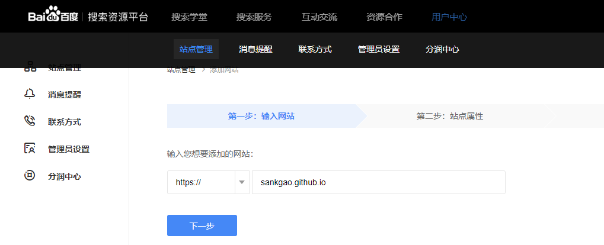
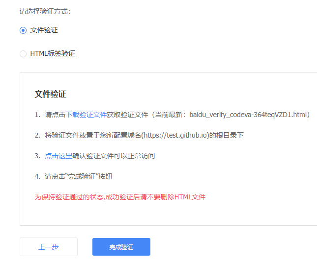
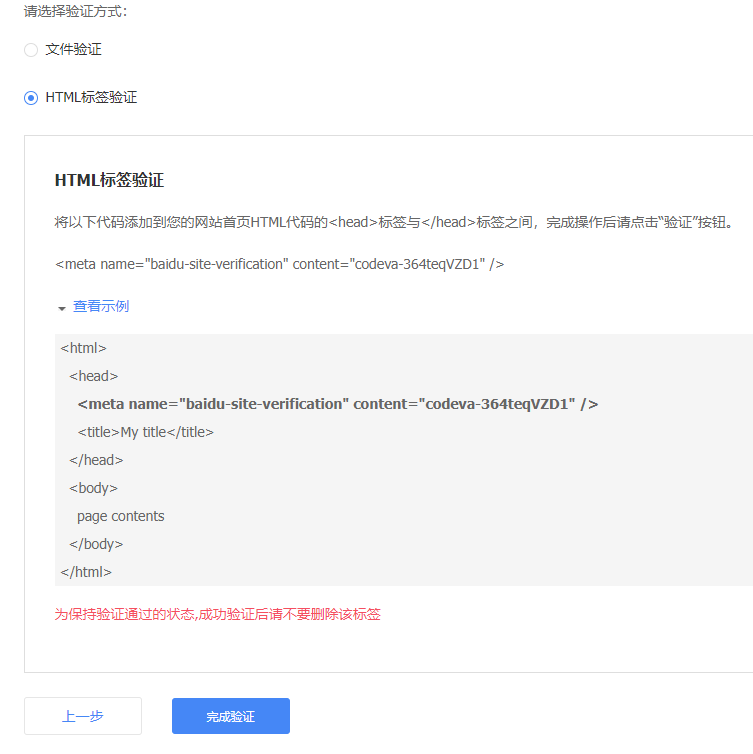

::: info
由于本博客部署在 GitHub Pages 上，而 Github 禁止了百度爬取。故将博客添加到百度收录 SEO 中，增强网站的访问
:::

## 查看网站是否收录

在百度中输入 `site:<域名>` 查看网站是否收录。

例如：`site:sankgao.github.io`

## 添加网站

1. 登陆 [百度资源搜索平台](https://ziyuan.baidu.com/) 
2. 点击 **用户中心 -> 站点管理** 添加网站
   
    

3. 选择站点属性
   
    ::: tip
    站点验证成功后，站点领域信息 30 天内只能修改一次，请谨慎设置！
    :::

4. 验证网站
   
   验证网站有两种方式，选择一个验证方式，根据提示完成验证。

    - **文件验证**

        

    - **HTML 标签验证**

        

## 博客中添加验证代码

本人选择的是 HTML 标签验证，在博客中添加上述代码。

[博客主题](https://theme-hope.vuejs.press/zh/guide/advanced/seo.html#%E7%9B%B4%E6%8E%A5%E6%B7%BB%E5%8A%A0-head-%E6%A0%87%E7%AD%BE) 提供了在页面的 `frontmatter` 中配置 `head` 选项，自主添加特定标签到页面 `<head>`，会自动注入 `<meta name="keywords" content="SEO plugin" />`。

所以将下面代码添加到网站根目录下的 `README` 文件中（docs/README.md）：

```md
head:
  - - meta
    - name: baidu-site-verification
      content: codeva-jJHuz4vkzL
```
