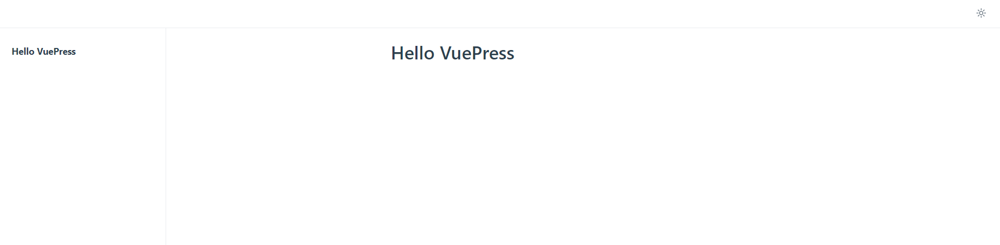

::: info
本博客使用的是 [VuePress-v2](https://v2.vuepress.vuejs.org/zh/) 版本加 [vuepress-theme-hope 主题](https://theme-hope.vuejs.press/zh/) 搭建
:::

<!-- more -->

## VuePress 介绍

[VuePress-v2 官网](https://v2.vuepress.vuejs.org/zh/)

### 什么是 VuePress

`VuePress` 是一个以 `Markdown` 为中心的静态网站生成器。您可以使用 Markdown 来书写内容（如：**文档**、**博客**等），然后 VuePress 会帮助您生成一个静态网站来展示它们。

`VuePress` 诞生的初衷是为了支持 `Vue.js` 及其子项目的文档需求，但是现在它已经在帮助大量用户构建他们的文档、博客和其他静态网站。

### 它是如何工作的

一个 `VuePress` 站点本质上是一个由 [Vue](https://vuejs.org/) 和 [Vue Router](https://router.vuejs.org/) 驱动组成的单页面应用（SPA）。

**路由** 会根据您的 Markdown 文件的相对路径来自动生成。每个 Markdown 文件都通过 [markdown-it](https://github.com/markdown-it/markdown-it) 编译为 `HTML`，然后将其作为 Vue 组件的模板。因此，您可以在 Markdown 文件中直接使用 Vue 语法，便于您嵌入一些动态内容。

在开发过程中，我们启动一个常规的开发服务器（dev-server），并将 VuePress 站点作为一个常规的 `SPA`。如果您以前使用过 Vue 的话，您在使用时会感受到非常熟悉的开发体验。

在构建过程中，我们会为 VuePress 站点创建一个 **服务端渲染（SSR）** 的版本，然后通过虚拟访问每一条路径来渲染对应的 `HTML`。这种做法的灵感来源于 [Nuxt](https://nuxtjs.org/) 的 `nuxt generate` 命令，以及其他的一些项目，比如 [Gatsby](https://www.gatsbyjs.com/)。

### VuePress 优点

VuePress 是以 Vue 为驱动的 **静态网站生成器**，具有以下优点：

- 简洁至上
    - 以 Markdown 为中心的项目结构，以最少的配置帮助您专注于写作
- Vue 驱动
    - 享受 Vue 的开发体验，可以在 Markdown 中使用 Vue 组件，又可以使用 Vue 来开发自定义主题
- 高性能
    - VuePress 会为每个页面预渲染生成静态的 HTML，同时，每个页面被加载的时候，将作为 SPA 运行
- 主题
    - 提供了一个开箱即用的默认主题。您也可以挑选一个社区主题，或者创建一个您自己的主题
- 插件
    - 灵活的插件API，使得插件可以为您的站点提供许多即插即用的功能
- 打包工具
    - 默认的打包工具是 Vite，也同样支持 Webpack

## 快速搭建

### 依赖环境

- `Node.js v14.18.0+`
- `Yarn v1 classic`（可选）

::: tip
- 使用 [pnpm](https://pnpm.io/zh/) 时，您可能需要安装 `vue` 和 `@vuepress/client` 作为 `peer-dependencies`（对等依赖关系），即 `pnpm add -D vue @vuepress/client@next`
- 使用 `yarn 2` 时，您需要在 `.yarnrc.yml` 文件中设置 `nodeLinker: 'node-modules' `
:::

### 手动安装

1. 创建并进入一个新目录
    
    ```bash
    mkdir vuepress-starter
    cd vuepress-starter
    ```

2. 初始化项目

    ::: code-tabs#language
    
    @tab:active pnpm
    
    ```bash
    git init
    pnpm init
    ```
    
    @tab yarn
    
    ```bash
    git init
    yarn init
    ```
    
    @tab npm
    
    ```bash
    git init
    npm init
    ```
    
    :::

3. 将 VuePress 安装为本地依赖

    ::: code-tabs#language
    
    @tab:active pnpm
    
    ```bash
    pnpm add -D vuepress@next @vuepress/client@next vue
    ```
    
    @tab yarn
    
    ```bash
    yarn add -D vuepress@next
    ```
    
    @tab npm
    
    ```bash
    npm install -D vuepress@next
    ```
    
    :::

4. 在 `package.json` 中添加一些 [scripts](https://classic.yarnpkg.com/zh-Hans/)

    ```json
    {
      "scripts": {
        "docs:dev": "vuepress dev docs",
        "docs:build": "vuepress build docs",
      }
    }
    ```

5. 将默认的临时目录和缓存目录添加到 `.gitignore` 文件中

    ```bash
    echo 'node_modules' >> .gitignore
    echo '.temp' >> .gitignore
    echo '.cache' >> .gitignore
    ```

6. 创建您的第一篇文档

    ```bash
    mkdir docs
    echo '# Hello VuePress' > docs/README.md
    ```

7. 在本地启动服务器来开发您的文档网站

    ::: code-tabs#language
    
    @tab:active pnpm
    
    ```bash
    pnpm docs:dev
    ```
    
    @tab yarn
    
    ```bash
    yarn docs:dev
    ```
    
    @tab npm
    
    ```bash
    npm run docs:dev
    ```
      
    :::

VuePress 会在 `http://localhost:8080` 启动一个热重载的开发服务器。当您修改您的 Markdown 文件时，浏览器中的内容也会自动更新。

**效果：**



## 配置

### 配置文件

如果没有任何配置，您的 VuePress 站点仅有一些 **最基础** 的功能。为了更好地自定义您的网站，让我们首先在您的文档目录下创建一个 `.vuepress` 目录，所有 VuePress 相关的文件都将会被放在这里。您的项目结构可能是这样：

```text
├─ docs
│  ├─ .vuepress
│  │  └─ config.ts
│  └─ README.md
├─ .gitignore
└─ package.json
```

VuePress 站点的基本配置文件是 `.vuepress/config.js`，但也同样支持 `TypeScript` 配置文件。您可以使用 `.vuepress/config.ts` 来得到更好的类型提示。

具体而言，我们对于配置文件的路径有着约定（按照 **优先顺序**）：

当前工作目录 `cwd` 下：

- `vuepress.config.ts`
- `vuepress.config.js`
- `vuepress.config.mjs`

源文件目录 `sourceDir` 下：

- `.vuepress/config.ts`
- `.vuepress/config.js`
- `.vuepress/config.mjs`

您也可以通过 [命令行接口](https://v2.vuepress.vuejs.org/zh/reference/cli.html) 的 `--config` 选项来指定配置文件：

```bash
vuepress dev docs --config my-config.js
```

一个基础的配置文件是这样的：

```ts
import { defineUserConfig } from 'vuepress'

export default defineUserConfig({
  lang: 'zh-CN',
  title: '您好， VuePress ！',
  description: '这是我的第一个 VuePress 站点',
})
```

::: tip
前往官网 [配置参考](https://v2.vuepress.vuejs.org/zh/reference/config.html) 查看所有 VuePress 配置
:::

## 页面

VuePress 是以 Markdown 为中心的。您项目中的每一个 Markdown 文件都是一个单独的页面。

### 路由

默认情况下，页面的路由路径是根据您的 Markdown 文件的 **相对路径** 决定的。

假设这是您的 Markdown 文件所处的目录结构：

```text
└─ docs
   ├─ guide
   │  ├─ getting-started.md
   │  └─ README.md
   ├─ contributing.md
   └─ README.md
```

将 `docs` 目录作为您的 `sourceDir`，例如您在运行 `vuepress dev docs` 命令。此时，您的 Markdown 文件对应的路由路径为：

|  相对路径  |  路由路径  |
|  :----:  |  :----:  |
|  `/README.md`  |  `/`  |
|  `/index.md`  |  `/`  |
|  `/contributing.md`  |  `/contributing.html`  |
|  `/guide/README.md`  |  `/guide/`  |
|  `/guide/getting-started.md`  |  `/guide/getting-started.html`  |

::: tip

默认配置下，`README.md` 和 `index.md` 都会被转换成 `index.html`，并且其对应的路由路径都是由斜杠结尾的。然而，如果您想同时保留这两个文件，就可能会造成冲突

在这种情况下，您可以设置 [pagePatterns](https://v2.vuepress.vuejs.org/zh/reference/config.html#pagepatterns) 来避免某个文件被 VuePress 处理，例如使用 `['**/*.md', '!**/README.md', '!.vuepress', '!node_modules']` 来排除所有的 `README.md` 文件
:::

### Frontmatter

Markdown 文件可以包含一个 [YAML](https://yaml.org/) Frontmatter。Frontmatter 必须在 Markdown 文件的顶部，并且被包裹在一对三短划线中间。下面是一个基本的示例：

```md
---
lang: zh-CN
title: 页面的标题
description: 页面的描述
---
```

您肯定注意到 Frontmatter 中的字段和 **配置文件** 中的 [站点配置](#配置文件) 十分类似。您可以通过 Frontmatter 来覆盖当前页面的 `lang`、`title`、`description` 等属性。因此，您可以把 Frontmatter 当作页面级作用域的配置。

同样的，VuePress 有一些内置支持的 [Frontmatter 字段](https://v2.vuepress.vuejs.org/zh/reference/frontmatter.html)，而您使用的主题也可能有它自己的特殊 [Frontmatter](https://v2.vuepress.vuejs.org/zh/reference/default-theme/frontmatter.html)。

## 静态资源

### 相对路径

您可以在您的 Markdown 内容中使用相对路径来引用静态资源：

```md

```

一般情况下，我们推荐您使用这种方式来引用图片，因为人们通常会把图片放在引用它的 Markdown 文件附近。

### Public 文件

您可以把一些静态资源放在 `Public` 目录中，它们会被复制到最终生成的网站的根目录下。

默认的 `Public` 目录是 `.vuepress/public`，可以通过 [public](https://v2.vuepress.vuejs.org/zh/reference/config.html#public) 配置项来修改。

在下列这些情况中，您可能会用到它：

- 您可能需要提供一些静态资源，但是它们并不直接被您的 Markdown 文件引用，比如 `favicon` 和 `PWA` 图标
- 您可能想要托管一些 **共享的静态资源**，甚至可能需要在您的网站外部引用它，比如 `Logo` 图片
- 您可能想在您的 Markdown 内容中通过绝对路径来引入图片

以我们文档的源文件为例，我们把 VuePress 的 `Logo` 放在了 `Public` 目录下：

```md
└─ docs
   ├─ .vuepress
   |  └─ public
   |     └─ images
   |        └─ hero.png  # <- Logo 文件
   └─ guide
      └─ assets.md
```

我们可以这样在当前页面引用 `Logo：`

```md

```

## 多语言支持

### 站点多语言配置

要启用 VuePress 的多语言支持，首先需要使用如下的文件目录结构：

```md
docs
├─ README.md
├─ foo.md
├─ nested
│  └─ README.md
└─ zh
   ├─ README.md
   ├─ foo.md
   └─ nested
      └─ README.md
```

然后，在您的配置文件中设置 `locales` 选项：

```ts
export default {
  locales: {
    // 键名是该语言所属的子路径
    // 作为特例，默认语言可以使用 '/' 作为其路径。
    '/': {
      lang: 'en-US',
      title: 'VuePress',
      description: 'Vue-powered Static Site Generator',
    },
    '/zh/': {
      lang: 'zh-CN',
      title: 'VuePress',
      description: 'Vue 驱动的静态网站生成器',
    },
  },
}
```

::: tip
如果一个语言没有声明 `lang`、`title`、`description` 或者 `head`，VuePress 将会尝试使用顶层配置的对应值。如果每个语言都声明了这些值，那么顶层配置中的对应值可以被省略。
:::

### 主题多语言配置

VuePress 没有限制主题如何提供多语言支持，因此每个主题可能会有不同的多语言配置方式，而且部分主题可能不会提供多语言支持。建议您查看主题本身的文档来获取更详细的指引。

如果您使用的是默认主题，那么它提供多语言支持的方式和上述是一致的：

```ts
import { defaultTheme } from 'vuepress'

export default {
  theme: defaultTheme({
    locales: {
      '/': {
        selectLanguageName: 'English',
      },
      '/zh/': {
        selectLanguageName: '简体中文',
      },
    },
  }),
}
```

## GitHub Pages 部署

### 设置正确的 base 选项

如果您准备发布到 `https://<USERNAME>.github.io/`，您可以省略这一步，因为 `base` 默认值就是 `"/"`。

如果您准备发布到 `https://<USERNAME>.github.io/<REPO>/`，也就是说您的仓库地址是 `https://github.com/<USERNAME>/<REPO>`，则将 `base` 设置为 `"/<REPO>/"`。

### 选择您想要使用的 CI 工具

这里我们以 [GitHub Actions](https://github.com/features/actions) 为例。

创建 `.github/workflows/docs.yml` 文件来配置工作流。

```yml
name: docs

on:
  # 每当 push 到 main 分支时触发部署
  push:
    branches: [main]
  # 手动触发部署
  workflow_dispatch:

jobs:
  docs:
    runs-on: ubuntu-latest

    steps:
      - uses: actions/checkout@v3
        with:
          # “最近更新时间” 等 git 日志相关信息，需要拉取全部提交记录
          fetch-depth: 0

      - name: Setup pnpm
        uses: pnpm/action-setup@v2
        with:
          # 选择要使用的 pnpm 版本
          version: 7
          # 使用 pnpm 安装依赖
          run_install: true

      - name: Setup Node.js
        uses: actions/setup-node@v3
        with:
          # 选择要使用的 node 版本
          node-version: 18
          # 缓存 pnpm 依赖
          cache: pnpm

      # 运行构建脚本
      - name: Build VuePress site
        run: pnpm docs:build

      # 查看 workflow 的文档来获取更多信息
      # @see https://github.com/crazy-max/ghaction-github-pages
      - name: Deploy to GitHub Pages
        uses: crazy-max/ghaction-github-pages@v2
        with:
          # 部署到 gh-pages 分支
          target_branch: gh-pages
          # 部署目录为 VuePress 的默认输出目录
          build_dir: docs/.vuepress/dist
        env:
          # @see https://docs.github.com/cn/actions/reference/authentication-in-a-workflow#about-the-github_token-secret
          GITHUB_TOKEN: ${{ secrets.GITHUB_TOKEN }}
```

::: tip
请参考 [GitHub Pages 官方指南](https://pages.github.com/) 来获取更多信息
:::

## 默认主题

VuePress 有一个开箱即用的默认主题，正使用在您当前正在浏览的文档网站上。

如果您不指定要使用的主题，那么就会自动使用默认主题。

为了配置默认主题，您需要在您的配置文件中通过 `theme` 配置项来使用它。

```ts
import { defaultTheme } from 'vuepress'

export default {
  theme: defaultTheme({
    // 默认主题配置
    navbar: [
      {
        text: '首页',
        link: '/',
      },
    ],
  }),
}
```

默认主题为文档网站提供了基础且实用的功能，您可以前往 [默认主题配置参考](https://v2.vuepress.vuejs.org/zh/reference/default-theme/config.html) 获取全部的配置列表。

然而，您可能觉得默认主题不够出色，又或者您不想搭建一个文档网站，而是一个其他类型的网站，比如博客。此时，您可以尝试使用社区主题或者创建本地主题。


