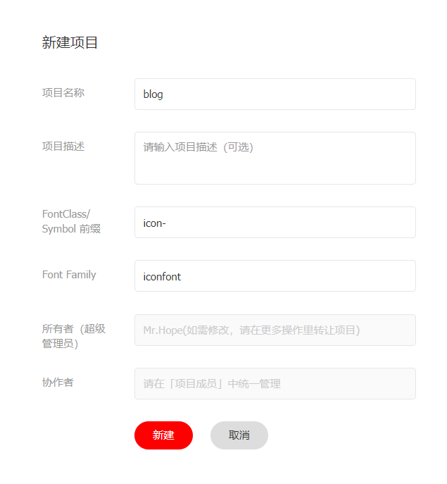
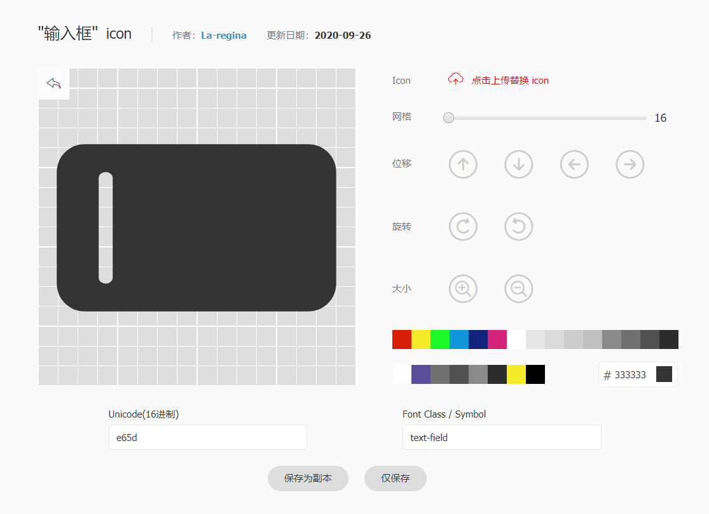

<!-- more -->

[vuepress-theme-hope 主题](https://theme-hope.vuejs.press/zh/)

在 VuePress 中，有三种配置概念：

- **站点配置**：这是您在配置文件中直接导出的对象
- **主题配置**：传递给 `hopeTheme` 的第一个对象
- **页面配置**：由在页面顶部基于 `YAML` 语法的 `Frontmatter` 提供

## 使用主题

::: code-tabs#language

@tab:active TS

```ts
// .vuepress/config.ts
import { defineUserConfig } from "vuepress";
import { hopeTheme } from "vuepress-theme-hope";

export default defineUserConfig({
  // 站点选项
  // ...

  theme: hopeTheme(
    {
      // 主题选项
      // ...
    },
    {
      // 主题行为选项 (可选)
    }
  ),
});
```

@tab JS

```js
// .vuepress/config.js
import { hopeTheme } from "vuepress-theme-hope";

export default {
  // 站点选项
  // ...

  theme: hopeTheme(
    {
      // 主题选项
      // ...
    },
    {
      // 主题行为选项 (可选)
    }
  ),
};
```

:::

## 多语言

### 设置语言

您需要为每个语言设置 `lang` 选项。即使您只在使用单个语言，您也必须在 `.vuepress/config.{js,ts}` 中设置 `lang`。

::: tip 为什么要这样做
要提供正确的语言环境文本，主题需要知道根文件夹以及每个多语言文件夹正在使用哪种语言
:::

::: code-tabs#language

@tab TS 单语言

```ts
// .vuepress/config.ts
import { defineUserConfig } from "vuepress";

export default defineUserConfig({
  // 设置正在使用的语言
  lang: "zh-CN",
});
```

@tab JS 单语言

```js
// .vuepress/config.js
export default {
  // 设置正在使用的语言
  lang: "zh-CN",
};
```

@tab:active TS 多语言

```ts
// .vuepress/config.ts
import { defineUserConfig } from "vuepress";

export default defineUserConfig({
  locales: {
    "/": {
      // 设置正在使用的语言
      lang: "zh-CN",
    },
    "/en/": {
      // 设置正在使用的语言
      lang: "en-US",
    },
  },
});
```

@tab JS 多语言

```js
// .vuepress/config.js
export default {
  locales: {
    "/": {
      // 设置正在使用的语言
      lang: "zh-CN",
    },
    "/en/": {
      // 设置正在使用的语言
      lang: "en-US",
    },
  },
};
```

:::

### 多语言配置

`locales` 是一个对象，其键为每个语言的路径前缀，值为该语言的配置，可以包含 `title`、`description`、`lang` 等。

您应当为每个语言设置 `lang` 选项，以便主题和插件能够正确的处理它们。

如果站点和主题配置中的 `locales` 对象只包含 `"/"` 一个键，则主题不会显示语言切换菜单。当您通过 `locales` 设置多个键，即存在多个语言的时候，我们会在导航栏显示语言切换菜单。

### 为每个语言设置主题选项

与站点配置和 `@vuepress/theme-default` 的主题配置相同，`vuepress-theme-hope` 也支持您在主题选项中设置 `locale` 选项，并为每种语言设置不同的配置。

::: code-tabs#language

@tab:active TS

```ts
// .vuepress/config.ts
import { defineUserConfig } from "vuepress";
import { hopeTheme } from "vuepress-theme-hope";

export default defineUserConfig({
  locales: {
    "/": {
      lang: "en-US",
    },
    "/zh/": {
      lang: "zh-CN",
    },
  },

  theme: hopeTheme({
    // 通用配置
    // ...
    locales: {
      "/": {
        // 英文配置
        // ...
      },
      "/zh/": {
        // 中文配置
        // ...
      },
    },
  }),
});
```

@tab JS

```js
// .vuepress/config.js
import { hopeTheme } from "vuepress-theme-hope";

export default {
  locales: {
    "/": {
      lang: "en-US",
    },
    "/zh/": {
      lang: "zh-CN",
    },
  },

  theme: hopeTheme({
    // 通用配置
    // ...
    locales: {
      "/": {
        // 英文配置
        // ...
      },
      "/zh/": {
        // 中文配置
        // ...
      },
    },
  }),
};
```

:::

## 主题配置

### 主题基本选项

- **hostname**：当前网站部署到的域名
- **auther**：文章显示的默认作者
- **favicon**：站点图标
- **navbar**：导航栏配置
- **sidebar**：侧边栏配置
- **locales**：主题的多语言配置，您可以在这里分别为每个语言设置单独的选项
- **extraLocales**：站点的额外语言环境，其中键名是语言名称，值是站点路径，`:route` 将替换为当前路由路径
- **hotReload**：是否需要在开发服务器启用完整功能与热更新。是否在开发服务器中启用热重载

::: tip
通常，您会希望：

- 开发服务器可以被尽快启动
- 对项目的修改可以在开发服务器上快速生效，并避免重新启动整个 VuePress 应用程序

为了达到这个预期，主题需要在开发服务器上的跳过一些耗时操作，并且需要在开发服务器上禁用一些由页面修改触发的耗时功能，以提高项目启动和热更新的速度。同时，由于一些修改会改变 VuePress 的底层原始数据，这些修改会导致网页刷新并重新加载整个 VuePress 应用程序。为了避免在修改 Markdown 时频繁的页面重新加载 (即：触发页面刷新并且获得几秒钟的白屏)，该主题禁用了开发服务器上的某些功能

默认情况下，开发服务器拥有以下限制：

- 不启用基于 Git 的功能，包括贡献者、自动创建日期和最后更新时间（调用 Git 程序以及文件 IO 会导致高耗时）
- 结构化侧边栏只会在应用启动时生成，后续不会更新（侧边栏排序和索引取决于每个页面 frontmatter，Markdown 内容的任何变化都会触发重新计算，因此大量页面会导致高耗时）
- 博客文章、标签、分类和每个分类中的文章列表不会随着开发服务器更新（Markdown 内容的任何变化都会触发重新计算，所以大量的页面会导致高耗时）
- 博客文章信息不含阅读时间和字数信息（Markdown 内容的任何更改都会更改页面字数信息，并因更新了 VuePress 底层原始数据导致页面刷新）

启用它意味着您接受每次修改都会触发一些高耗时计算并且整个应用程序将重新启动，这通常会导致页面刷新，并在在性能较弱的环境中获得数秒白屏
:::

### 主题功能选项

#### 博客选项

主题通过使用 [vuepress-plugin-blog2](https://plugin-blog2.vuejs.press/zh/) 提供博客功能，且该功能默认 **禁用。**

要启用博客插件并使用默认选项，您可以在主题选项中设置 `plugins.blog: true`。

- **blog.name**：博主姓名
- **blog.avatar**：博主头像
- **blog.description**：口号、座右铭或介绍语
- **blog.intro**：博主的个人介绍地址

    ::: note
    填写后将可以点击 **博主信息** 中的头像或姓名进入个人介绍页
    :::

- **blog.medias**：博主的媒体链接配置
    - 如果社交媒体已在下方列表中，您可以直接设置 **社交媒体名称: 社交媒体地址**
    - 否则，您应该传入一个元组 **社交媒体名称: [社交媒体地址, 社交媒体 SVG 图标字符串或路径]**
    - 元组的第二个元素应该是一个合法的 SVG 字符串或是一个完整的 SVG 文件路径
    
        ::: info 可用的社交媒体
        - **"Baidu"**：百度
        - **"BiliBili"**：哔哩哔哩
        - **"Bitbucket"**：Bitbucket
        - **"Dingding"**：钉钉
        - **"Discord"**：Discord
        - **"Douban"**：豆瓣
        - **"Dribbble"**：Dribbble
        - **"Email"**：邮件
        - **"Evernote"**：印象笔记
        - **"Facebook"**：脸书
        - **"Flipboard"**：红板报
        - **"Gitee"**：码云
        - **"GitHub"**：GitHub
        - **"Gitlab"**：Gitlab
        - **"Gmail"**：谷歌邮箱
        - **"Instagram"**：Instagram
        - **"Lark"**：飞书
        - **"Line"**：Line
        - **"Linkedin"**：领英
        - **"Pinterest"**：拼趣
        - **"Pocket"**：Pocket
        - **"QQ"**：QQ
        - **"Qzone"**：QQ 空间
        - **"Reddit"**：红迪
        - **"Rss"**：RSS 地址
        - **"Steam"**：蒸汽
        - **"Skype"**：Skype
        - **"Telegram"**：电报
        - **"Twitter"**：推特
        - **"Wechat"**：微信
        - **"Weibo"**：微博
        - **"Whatsapp"**：瓦次艾普
        - **"Youtube"**：油管
        - **"Zhihu"**：知乎

        （请不要好奇为什么这里一定要加上特别奇怪的中文翻译）
        :::

- **blog.roundAvatar**：是否剪裁头像为圆形形状。默认值：`false`
- **blog.sidebarDisplay**：是否在侧边栏展示博主信息。默认值：`"mobile"`
    - **"mobile"**：在移动视图中显示在侧边栏中
    - **"always"**：总是展示在侧边栏中
    - **"none"**：永远不在侧边栏展示
- **blog.timeline**：时间轴的顶部文字。默认值：`"昨日不在"`
- **blog.articlePerPage**：每页的文章数量。默认值：`10`
- **blog.articleInfo**：文章列表中展示的文章信息。默认值：`["Author", "Original", "Date", "PageView", "Category", "Tag", "ReadingTime"]`
    - **"Author"**：作者
    - **"Category"**：分类
    - **"Date"**：写作日期
    - **"Original"**：是否原创
    - **"Tag"**：标签
    - **"ReadingTime"**：预计阅读时间
    - **"PageView"**：页面浏览量

        ::: warning
        默认情况下，`ReadingTime` 和 `Word` 在开发服务器中不可用，[查看原因以及如何启用它](#主题基本选项)
        :::

#### 加密配置

- **encrypt.global**：是否全局加密。默认值：`false`
- **encrypt.admin**：最高权限密码，可以以数组的形式设置多个
- **encrypt.config**：加密配置，为一个对象，键名为匹配的路径，键值为对应的密码，接受字符串或字符串数组

    ::: details 例子

    ```js
    {
      // 这会加密整个 guide 目录，并且两个密码都是可用的
      "/guide/": ["1234", "5678"],
      // 这只会加密 config/page.html
      "/config/page.html": "1234"
    }
    ```

    :::

### 主题布局选项

#### 导航栏

- **navbar**：导航栏配置
- **navbarIcon**：是否在导航栏显示图标。默认值：`true`
- **navbarLayout**：自定义导航栏布局。默认值：`{ start: ["Brand"], center: ["Links"], end: ["Language", "Repo", "Outlook", "Search"] }`
- **logo**：导航栏图标，应为基于 `.vuepress/public` 文件夹的绝对路径
- **logoDark**：夜间模式下导航栏图标，应为基于 `.vuepress/public` 文件夹的绝对路径
- **repo**：仓库配置，用于在导航栏中显示仓库链接
- **repoDisplay**：是否在导航栏显示仓库链接。默认值：`true`
- **repoLabel**：用于导航栏仓库按钮的无障碍标签
- **navbarAutoHide**：是否在向下滚动时自动隐藏导航栏。默认值：`"mobile"`
- **hideSiteNameOnMobile**：是否在移动视图下隐藏站点名称。默认值：`true`

#### 侧边栏

- **sidebar**：侧边栏配置
- **sidebarIcon**：是否在侧边栏显示图标。默认值：`true`
- **sidebarSorter**：结构侧边栏排序器。默认值：`["readme", "order", "title", "filename"]`
    - **readme**：`README.md` 或 `readme.md` 在前
    - **order**：正序在前并按其值升序排列，负序在后并按其值降序排列
    - **date**：按日期升序排序
    - **date-desc**：按日期降序排序
    - **title**：按标题字母顺序排序
    - **filename**：按文件名字母顺序排序
- **headerDepth**：侧边栏嵌套的标题深度。默认值：`2`

#### 路径导航

- **breadcrumb**：是否全局启用路径导航。默认值：`true`
- **breadcrumbIcon**：是否在路径导航显示图标。默认值：`true`
- **prevLink**：是否在页面底部显示上一篇链接。默认值：`true`
- **nextLink**：是否在页面底部显示下一篇链接。默认值：`true`

#### 标题

- **titleIcon**：是否在页面标题旁显示图标。默认值：`true`
- **pageInfo**：文章信息，可以填入数组，数组的顺序是各条目显示的顺序。填入 `false` 使其被禁用。默认值：`["Author", "Original", "Date", "Category", "Tag", "ReadingTime"]`
    - **"Author"**：作者
    - **"Date"**：写作日期
    - **"Original"**：是否原创
    - **"Category"**：分类
    - **"Tag"**：标签
    - **"ReadingTime"**：预计阅读时间
    - **"Word"**：字数
    - **"PageView"**：页面浏览量

#### Meta

- **lastUpdated**：是否显示页面最后更新时间。默认值：`true`
- **contributors**：是否显示页面贡献者。默认值：`true`
- **editLink**：是否展示编辑此页链接。默认值：`true`
- **editLinkPattern**：编辑链接的匹配。其中 `:repo` `:branch` `:path` 会被自动替换为 `docsRepo` `docsBranch` 和 `docsDir + filePath`
- **docsRepo**：文档仓库。默认值：`repo`
- **docsBranch**：文档所在分支。默认值：`"main"`
- **docsDir**：文档在仓库中的目录。默认值：`""`

#### 页脚

- **footer**：页脚的默认内容，可输入 `HTMLString`
- **copyright**：默认的版权信息，设置为 false 来默认禁用它。默认值：`"Copyright © <作者>"`
- **displayFooter**：是否默认显示页脚。默认值：`false`

#### 杂项

- **home**：当前语言的主页路径，用于导航栏图标和返回主页按钮的链接。默认值：当前 `locale` 的键名
- **rtl**：是否使用 RTL 布局。默认值：`false`
- **toc**：是否在桌面模式下右侧展示标题列表。默认值：`true`

### 主题外观选项

- **iconAssets**：字体图标资源链接，支持 `'iconfont'` 和 `'fontawesome'` 关键字
- **darkmode**：深色模式支持。默认值：`"switch"`
    - **"switch"**：在深色模式，浅色模式和自动之间切换
    - **"toggle"**：在深色模式和浅色模式之间切换
    - **"auto"**：自动根据用户设备主题或当前时间决定是否应用深色模式
    - **"enable"**：强制深色模式
    - **"disable"**：禁用深色模式
- **themeColor**：主题色选择器配置。默认值：`false`
- **fullscreen**：是否显示全屏按钮。默认值：`false`
- **backToTop**：是否显示返回顶部按钮。默认值：`true`
- **mobileBreakPoint**：切换桌面布局和移动布局的窗口宽度，单位像素。默认值：`719`
- **pcBreakPoint**：切换桌面布局和宽屏布局的窗口宽度，单位像素。默认值：`1440`
- **pure**：是否开启纯净模式。默认值：`false`
- **print**：是否在桌面模式下显示打印按钮。默认值：`true`
- **iconPrefix**：通常情况下，它可以识别 `iconAssets` 并自动设置，如果识别失败，您可以手动设置图标的 `FontClass` 前缀

### 主题行为选项

`hopeTheme()` 接受可选的第二个参数，即行为选项。行为选项控制主题的行为。

行为选项也可接受一个布尔值：

- **false**：意味着所有选项都设置为 `false`
- **true**：意味着 `{ check: true, compact:true, custom :false, debug: false }`

::: code-tabs#language

@tab:active TS

```ts
// .vuepress/config.ts
import { defineUserConfig } from "vuepress";
import { hopeTheme } from "vuepress-theme-hope";

export 默认值 defineUserConfig({
  // 站点选项
  // ...

  theme: hopeTheme(
    {
      // 主题选项
      // ...
    },
    {
      // 主题行为选项 (可选)
    }
  ),
});
```

@tab JS

```js
// .vuepress/config.js
import { hopeTheme } from "vuepress-theme-hope";

export 默认值 {
  // 站点选项
  // ...

  theme: hopeTheme(
    {
      // 主题选项
      // ...
    },
    {
      // 主题行为选项 (可选)
    }
  ),
};
```

:::

- **check**：是否执行附加检查。检查包括运行时检查和 `frontmatter` 检查。不兼容的值将被警告。默认值：`true`
- **compact**：是否兼容历史版本（v1 最新版本和 v2 beta 版本）。默认值：`true`
- **custom**：是否启用通过别名导入组件的自定义支持。默认值：`false`
- **debug**：是否在调试模式下运行。默认值：`false`

::: note
`check` 和 `check` 选项将在稳定版本中恢复为 `false` 作为默认值
:::

## Frontmatter 配置

### 信息 Frontmatter 配置

- **title**：当前页面内容标题，默认为 Markdown 文件中的第一个 `h1` 标签内容
- **shortTitle**：当前页面的短标题，会在导航栏、侧边栏和路径导航中作为首选
- **description**：当前页面内容描述
- **icon**：当前页面图标的 FontClass 或文件路径（建议填写）
- **author**：作者，如果不填，则会回退到默认作者
- **isOriginal**：当前文章是否为原创。默认值：`false`
- **date**：写作时间。格式：`YYYY-MM-DD` 或 `YYYY-MM-DD hh:mm:ss`
- **category**：分类
- **tag**：标签
- **sticky**：是否在列表中置顶。当填入数字时，数字越大，排名越靠前。默认值：`false`
- **star**：是否收藏在博客主题的文章列表中。当填入数字时，数字越大，排名越靠前。默认值：`false`
- **article**：是否将该文章添加至文章列表中。默认值：`true`
- **timeline**：是否将该文章添加至时间线中。默认值：`true`
- **image**：设置预览图（分享图），请填入绝对路径
- **banner**：设置横幅图片（宽屏分享图），请填入绝对路径

### 布局 Frontmatter 配置

- **pageInfo**：文章信息展示项目

    |  条目  |  对应内容  |  页面 frontmatter 值  |
    |  :----:  |  :----:  |  :----:  |
    |  `"Author"`  |  作者  |  `author`  |
    |  `"Date"`  |  写作日期  |  `date`  |
    |  `"Original"`  |  是否原创  |  `isOriginal`  |
    |  `"Category"`  |  分类  |  `category`  |
    |  `"Tag"`  |  标签  |  `tag`  |
    |  `"ReadingTime"`  |  预计阅读时间  |  N/A（自动生成）  |
    |  `"Word"`  |  字数  |  N/A（自动生成）  |
    |  `"PageView"`  |  访问量  |  `pageview`（仅 `Waline` 可用）  |

- **pageview**：是否显示浏览量

    ::: tip
    显示浏览量功能需要您拥有有效的 `Waline` 评论服务配置
    :::

- **breadcrumb**：是否开启路径导航
- **breadcrumbIcon**：是否开启路径导航图标
- **navbar**：导航栏配置，填入 `false` 会禁用导航栏
- **sidebar**：侧边栏配置选项。支持 `"heading"` 或 `false`
- **headerDepth**：标题渲染深度。默认值：`2`
- **index**：是否在侧边栏中索引当前页面。默认值：`true`
- **order**：指定当前页面在侧边栏中的排序。较小的数字会出现在前面
- **dir**：用于 **结构侧边栏** 的分组信息
    - **dir.text**：分组标题。默认值：`README.md` 的标题
    - **dir.icon**：分组图标。默认值：`README.md` 的图标
    - **dir.collapsible**：分组是否可折叠。默认值：`true`
    - **dir.link**：分组是否可点击。默认值：`false`

        ::: note
        设置为 `true` 意味着将分组链接设置为 `README.md` 链接
        :::

    - **dir.index**：是否索引当前目录。默认值：`true`
    - **dir.order**：分组在侧边栏的顺序。较小的数字会出现在前面
- **comment**：当前页面是否开启评论功能
- **lastUpdated**：是否显示最后更新时间
- **editLink**：是否显示编辑链接
- **contributors**：是否显示贡献者
- **prev**：上一篇文章链接
- **next**：下一篇文章链接
- **footer**：设置页脚内容
- **copyright**：设置版权信息
- **backToTop**：设置是否显示返回顶部按钮。默认值：`true`
- **toc**：设置在桌面模式下是否在右侧显示标题列表
- **containerClass**：额外的页面容器 Class
- **layout**：页面的自定义布局名称。默认值：`Layout`

### 主页 Frontmatter 配置

- **home**：是否启用首页样式。默认值：`false`
- **title**：设置页面标题，会用于路径导航、页面增强等
- **heroText**：主页标题
- **tagline**：附加文字描述
- **heroImage**：主页图标 `logo` 地址，需要填入绝对路径（图片需要放入 `.vuepress/public` 文件夹）
- **heroImageDark**：深色模式下主页图标 `logo` 地址，需要填入绝对路径（图片需要放入 `.vuepress/public` 文件夹）
- **heroAlt**：主页图标的替代文字
- **actions**：主页操作
    - **test**：操作名称
    - **link**：操作链接
    - **type**：操作类型 `primary` 和 `default`
- **features**：特性说明
    - **title**：功能名称
    - **details**：功能描述
    - **icon**：功能图标
    - **link**：功能链接

### 博客主页 Frontmatter 配置

- **home**：是否启用首页样式。默认值：`false`
- **hero**：是否显示主页的图标与描述。默认值：`true`
- **title**：设置页面标题，会用于路径导航、页面增强等
- **heroText**：主页标题
- **tagline**：附加文字描述
- **heroImage**：主页图标 `logo` 地址，需要填入绝对路径（图片需要放入 `.vuepress/public` 文件夹）
- **heroImageDark**：深色模式下主页图标 `logo` 地址，需要填入绝对路径（图片需要放入 `.vuepress/public` 文件夹）
- **heroAlt**：主页图标的替代文字
- **bgImage**：背景图片的地址，需填写绝对路径或完整路径。如果不填写，会自动应用一张默认的风景图片
- **bgImageStyle**：背景图片的 CSS 样式
- **heroImageStyle**：首页图标的 CSS 样式
- **heroFullScreen**：是否全屏显示 `hero`。默认值：`false`
- **projects**：项目列表
    - **name**：项目名称
    - **desc**：项目描述
    - **icon**：项目图标
    - **link**：项目链接

## 样式配置

您可以在 `.vuepress/styles` 中通过在 `config.scss` 和 `palette.scss` 文件中写入变量值来更改主题的样式。您也可以在 `.vuepress/styles/index.scss` 中添加您自己的样式。

### config.scss

`config.scss` 用于纯变量配置，以下是支持的变量与默认值。

响应式布局断点：

- `$pc`
- `$laptop`
- `$pad`
- `$tablet`
- `$mobile`

代码块（仅限 shiki）：

- **$code-bg-color**: 代码块的背景颜色
- **$code-color**: 代码块的字体颜色

颜色列表: `$colors`

::: details 默认值

```scss
/* Content Class */
$content-class: ".theme-hope-content";

/* responsive breakpoints */

// wide screen
$pc: 1440px !default;

// desktop
$laptop: 1280px !default;

// narrow desktop / iPad
$pad: 959px !default;

// wide mobile
$tablet: 719px !default;

// narrow mobile
$mobile: 419px !default;

/* Color list */
$colors: #cf1322, #fa541c, #f39c12, #2ecc71, #25a55b, #10a5a5, #096dd9, #aa6fe9,
  #eb2f96 !default;

/* Code Block */
// only available with shiki highlighter
$code-color: (
  light: #383a42,
  dark: #abb2bf,
) !default;
$code-bg-color: (
  light: #ecf4fa,
  dark: #282c34,
) !default;
```

:::

### palette.scss

`palette.scss` 用于 CSS 变量写入，以下是支持的配置与默认值。

::: info
此处的所有变量（包括您新添加的变量）都会被转换为 `kebab-case` 的格式注入为 CSS 变量

如：`$theme-color` 会被注入为 `--theme-color`，`$backgroundColor` 会被注入为 `--background-color`
:::

#### 颜色设置

对于所有颜色，如果其在浅色模式和深色模式颜色相同，可直接设置；否则，请设置一个 Map 类型的 Sass 变量分别给出浅色和深色模式下的颜色。此变量键名为 `light` 和 `dark`，值为颜色值。

**可用的颜色变量：**

- **$theme-color**：主题色
- **$text-color**：字体颜色
- **$bg-color**：背景色
- **$bg-color-secondary**：另一个浅背景色
- **$bg-color-tertiary**：另一个更浅的背景色
- **$border-color**：边框颜色
- **$box-shadow**：元素阴影色
- **$card-shadow**：卡片阴影色

::: details 默认值

```scss
$theme-color: #3eaf7c !default;
$text-color: (
  light: #2c3e50,
  dark: #9e9e9e,
) !default;
$bg-color: (
  light: #fff,
  dark: #0d1117,
) !default;
$bg-color-secondary: (
  light: #f8f8f8,
  dark: #161b22,
) !default;
$bg-color-tertiary: (
  light: #efeef4,
  dark: #21262c,
) !default;
$border-color: (
  light: #eaecef,
  dark: #30363d,
) !default;

// shadow
$box-shadow: (
  light: #f0f1f2,
  dark: #282a32,
) !default;
$card-shadow: (
  light: rgb(0 0 0 / 15%),
  dark: rgb(0 0 0 / 30%),
) !default;

// constants
$black: (
  light: #000,
  dark: #fff,
);
$dark-grey: (
  light: #666,
  dark: #999,
);
$light-grey: (
  light: #999,
  dark: #666,
);
$white: (
  light: #fff,
  dark: #000,
);
$grey3: (
  light: #333,
  dark: #bbb,
);
$grey12: (
  light: #bbb,
  dark: #333,
);
```

:::

#### 布局设置

**导航栏：**

- **$navbar-height**：导航栏高度
- **$navbar-horizontal-padding**：导航栏水平填充
- **$navbar-vertical-padding**：导航栏垂直填充
- **$navbar-mobile-height**：移动设备上的导航栏高度
- **$navbar-mobile-horizontal-padding**：移动设备上的导航栏水平填充
- **$navbar-mobile-vertical-padding**：移动设备上的导航栏垂直填充

**侧边栏:**

- **$sidebar-width**：侧边栏宽度
- **$sidebar-mobile-width**：移动设备侧边栏宽度

**内容:**

- **$content-width**：主要内容的宽度
- **$home-page-width**：主页内容的宽度

**字体:**

- **$font-family**：普通文本上使用的字体
- **$font-family-heading**：用于标题元素的字体

**代码:**

- **$font-family-mono**：代码上使用的字体
- **$line-numbers-width**：代码块中行号的宽度

**过渡:**

- **$color-transition**：用于颜色的过渡
- **$transform-transition**：用于变换动画的过渡

::: details 默认值

```scss
/* layout */
// navbar
$navbar-height: 3.75rem !default;
$navbar-horizontal-padding: 1.5rem !default;
$navbar-vertical-padding: 0.7rem !default;
$navbar-mobile-height: 3.25rem !default;
$navbar-mobile-horizontal-padding: 1rem !default;
$navbar-mobile-vertical-padding: 0.5rem !default;

// sidebar
$sidebar-width: 18rem !default;
$sidebar-mobile-width: 16rem !default;

// content
$content-width: 780px !default;
$home-page-width: 1160px !default;

// font
$font-family: '-apple-system, BlinkMacSystemFont, "Segoe UI", Roboto, Oxygen, Ubuntu, Cantarell, "Fira Sans", "Droid Sans", "Helvetica Neue", STHeiti, "Microsoft YaHei", SimSun, sans-serif' !default;
$font-family-heading: 'Georgia Pro, Crimson, Georgia, -apple-system, BlinkMacSystemFont, "Segoe UI", Roboto, Oxygen, Ubuntu, Cantarell, "Fira Sans", "Droid Sans", "Helvetica Neue", STHeiti, "Microsoft YaHei", SimSun, sans-serif' !default;

// code
$font-family-mono: 'Consolas, Monaco, "Andale Mono", "Ubuntu Mono", monospace' !default;
$line-numbers-width: 2.5rem !default;

// transition
$color-transition: "0.3s ease" !default;
$transform-transition: "0.3s ease" !default;
```

:::

### index.scss

填入此文件所有内容都将解析为标准 CSS，然后在主题和插件样式之后注入。

因此，您可以在此处添加新样式或覆盖样式：

::: details 例子

```scss
// 在导航栏中将站点名称改为斜体
.site-name {
  font-style: italic;
}
```

:::

## 界面

### 深色模式

在深色模式下，页面会使用深色背景与浅色文字，以让您更加舒适。

可以在主题选项中通过 `darkmode` 来配置深色模式。

可选的值：

- **"switch"**：在深色模式，浅色模式和自动之间切换（默认）
- **"toggle"**：在深色模式和浅色模式之间切换
- **"auto"**：自动根据用户设备主题或当前时间决定是否应用深色模式
- **"enable"**：强制深色模式
- **"disable"**：禁用深色模式

### 主题色

主题允许您自定义主题颜色，甚至提供选择器。

#### 设置默认主题色

您应该在 `.vuepress/styles/palette.scss` 中设置站点的默认主题颜色：

```scss
$theme-color: #f00;
```

#### 主题色选择器

您需要按照 **{ 颜色名1: 颜色值, 颜色名2: 颜色值, ... }** 的格式在主题选项中配置 `themeColor`。

第一个颜色应为上方设置的默认主题色。

::: code-tabs#language

@tab:active TS

```ts
// .vuepress/config.ts
import { defineUserConfig } from "vuepress";
import { hopeTheme } from "vuepress-theme-hope";

export default defineUserConfig({
  theme: hopeTheme({
    themeColor: {
      blue: "#2196f3",
      red: "#f26d6d",
      green: "#3eaf7c",
      orange: "#fb9b5f",
    },
  }),
});
```

@tab JS

```js
// .vuepress/config.js
import { defineUserConfig } from "vuepress";
import { hopeTheme } from "vuepress-theme-hope";

export default defineUserConfig({
  theme: hopeTheme({
    themeColor: {
      blue: "#2196f3",
      red: "#f26d6d",
      green: "#3eaf7c",
      orange: "#fb9b5f",
    },
  }),
});
```

:::

### 图标支持

整个主题在多处都添加了 `FontClass` 图片格式图标的支持。

目前您可以使用 [iconify](https://icon-sets.iconify.design)、[iconfont](https://www.iconfont.cn) 和 [fontawesome](https://fontawesome.com/icons) 为您的项目添加图标，可以设置自己的图标资源。

同时 `png/svg` 格式的图标也是支持的。您可以使用完整 URL 或路径名来添加图标。

我们推荐使用 `iconify` 或 `fontawesome`。

#### 设置图标

您可以在多个地方使用图标。

- **页面**: 在 `frontmatter` 中设置 icon
    - 此图标将用于 **路径导航**、**页面标题**、**导航栏生成项**、**侧边栏生成项**、**页面导航** 等
- **导航栏**: 在 `NavbarItemConfig` 中设置 icon 选项
- **侧边栏**: 在 `SidebarItemConfig` 中设置 icon 选项
- **主页**: 在功能项中设置 icon 选项

#### 全局设置

您可以通过 `iconAssets` 和 `iconPrefix` 全局设置图标资源 url 和图标前缀。

##### 设置图标资源

您应该将图标相关资源设置为 `iconAssets`，您可以在其中设置：

- 图标资产关键词
- css 和 js 格式的图标资源
- 以上项目的数组

::: code-tabs#language

@tab:active TS

```ts
// .vuepress/config.ts
import { defineUserConfig } from "vuepress";
import { hopeTheme } from "vuepress-theme-hope";

export default defineUserConfig({
  theme: hopeTheme({
    // 关键词: "iconfont", "iconify", "fontawesome", "fontawesome-with-brands"
    iconAssets: "fontawesome",

    // 您想要的 URL
    iconAssets: "/base/my/font-icon/resource.js",

    // 上述内容的数组
    iconAssets: [
      "/base/my/font-icon/resource.js",
      "https://example/my/fonr-icon/resouce.css",
      "fontawesome",
    ],
  }),
});
```

@tab JS

```js
// .vuepress/config.js
import { defineUserConfig } from "vuepress";
import { hopeTheme } from "vuepress-theme-hope";

export default defineUserConfig({
  theme: hopeTheme({
    // 关键词: "iconfont", "iconify", "fontawesome", "fontawesome-with-brands"
    iconAssets: "fontawesome",

    // 您想要的 URL
    iconAssets: "/base/my/font-icon/resource.js",

    // 上述内容的数组
    iconAssets: [
      "/base/my/font-icon/resource.js",
      "https://example/my/fonr-icon/resouce.css",
      "fontawesome",
    ],
  }),
});
```

:::

::: warning
如果您将此插件用于商业项目文档，则 **不推荐** 使用 iconfont，因为 iconfont 本身是设计人员和开发人员的学习/共享平台

每个图标都是用户上传的，您必须获得作者的授权才能用于商业用途。上传者也有可能违背用户协议，上传版权在第三方的非原创图标
:::

##### 设置图标前缀

`iconPrefix` 是您要设置的图标前缀，通常，您的图标类应该有一个通用前缀，对于 `iconfont`，图标类名为 `iconfont icon-<ICON-NAME>`，对于 `fontawesome free`，图标类名为 `fas fa-<icon-name>`。 因此，当您使用关键字或从 **iconfont 网站**、**fontawesome kit** 或 **fontawesome CDN** 生成的单个链接设置上述 asset 选项时，插件会识别它们并自动为您设置前缀为 `iconfont icon-` 和 `fas fa-`。

在您使用自己的 url 或设置多个 url 的其他情况下，您可以自己手动设置此选项。毕竟输入 `icon: apple` 总是比 `icon: iconfont icon-apple`、`icon: mdi:apple` 或 `icon: fa-solid fa-apple` 更好

#### 生成自己的 Iconfont 资源

`Iconfont` 是阿里妈妈 MUX 倾力打造的矢量图标管理、交流平台。

设计师将图标上传到 `Iconfont` 平台，用户可以自定义下载多种格式的 icon，平台也可将图标转换为字体，便于前端工程师自由调整与调用。

**使用方式：**

1. 首先您需要新建一个项目，对您网站的图标进行设置与管理

    - 使用 GitHub 或微博登录 Iconfont
    - 在网站上方找到 **资源管理 → 我的项目**，点击右上角的 **新建项目** 图标
    - 设置可以辨识的项目名称 `FontClass/Symbol 前缀` 填入 `icon-`（您也可以根据自己喜好填写，但需要将此值设置额外前缀 `iconfont` 并设置到在主题选项中的 `iconPrefix`）
    - `Font Family` 请保持 `iconfont`

    

2. 导入图标

    - 请自行在 `iconfont` 自由搜索寻找您想要使用的图标，并点击图标上的 **添加入库** 按钮

    

    - 在寻找完所有图标后，请点击右上角的 **添加入库** 图标，点击下方的 **添加至项目** 并选择您刚刚创建好的项目进行确定

3. 编辑图标

    在项目页面，您可以对项目内的图标进行简单的编辑，包括位置、缩放、旋转、颜色以及 Unicode 编号与 Font Class/Symbol 的调整。

    

4. 生成图标文件

    - 请点击项目上方的 **Font Class** 按钮，并点击生成

    

    - 将 **css 地址** 设置到主题选项的 `iconAssets` 中

    ::: tip
    如果您日后添加了新的图标，请重新生成新的 **CSS 地址** 并替换 `iconAssets`
    :::

### 响应式布局

整个主题都是响应式的，这意味着它可以在不同的屏幕尺寸上正常工作。

#### 响应式布局介绍

**在中小型设备上：**

- 导航栏中，站点名称会被隐藏，导航栏链接以及主题切换、全屏按钮之类的元素会被收起至额外的弹窗，并通过导航栏右侧的按钮进行切换
- 侧边栏会以侧拉菜单的形式显示并默认隐藏，导航栏左侧显示侧边栏切换按钮控制侧边栏侧弹出与收回
- 路径导航、正文、返回顶部按钮文字缩小
- 当前页面的标题收起至侧边栏中

**在平板/笔记本设备上：**

- 导航栏链接会显示在导航栏中
- 侧边栏会以折叠菜单的形式显示
- 当前页面的标题收起至侧边栏中

**在电脑设备上：**

- 导航栏链接会显示在导航栏中
- 侧边栏会紧贴在页面著内容的左侧
- 当前页面的标题将显示在页面右侧

#### 响应式配置

主题提供了断点变量用于控制响应式布局的行为。您可以在 `.vuepress/styles/config.scss` 中修改它们。

- **$pc**：电脑响应式布局断点，默认为 `1440px`
- **$laptop**：笔记本响应式布局断点，默认为 `1280px`
- **$pad**：大型平板响应式布局断点，默认为 `959px`
- **$tablet**：平板响应式布局断点，默认为 `768px`
- **$mobile**：手机响应式布局断点，默认为 `480px`

::: tip
`$tablet` 和 `$pc` 将只能基于像素大小，如果您修改了它们，您需要同时在主题配置中修改 `mobileBreakPoint` 和 `pcBreakPoint` 为修改后的像素大小。
:::

### 其他界面功能

#### 样式定制

主题允许您在 `.vuepress/styles/config.scss` 和 `.vuepress/styles/palette.scss` 中设置变量，来定制绝大部分颜色、响应式断点，页面布局尺寸等参数。

详细的参数详见 [样式自定义](#样式自定义)。

#### 打印按钮

主题对打印样式进行了全面优化，默认在桌面模式的目录下会有一个打印按钮。

要隐藏打印按钮，您应该在主题选项中设置 `print: false`。

#### 全屏按钮

如果您需要这个功能，您可以在主题选项中设置 `fullscreen: true`。

::: tip
如果当前浏览器不支持全屏，则全屏按钮会自动隐藏
:::

::: code-tabs#language

@tab:active TS

```ts
// .vuepress/config.ts
import { defineUserConfig } from "vuepress";
import { hopeTheme } from "vuepress-theme-hope";

export default defineUserConfig({
  theme: hopeTheme({
    fullscreen: true,
  }),
});
```

@tab JS

```js
// .vuepress/config.js
import { defineUserConfig } from "vuepress";
import { hopeTheme } from "vuepress-theme-hope";

export default defineUserConfig({
  theme: hopeTheme({
    fullscreen: true,
  }),
});
```

:::

#### 返回顶部按钮

`vuepress-theme-hope` 主题添加了一个返回顶部控件，默认情况下将在下滑 300px 后显示。

您可以在主题选项中设置 `backToTop: false` 来禁用它，或者是设置为一个数字以更改默认的触发距离。

#### RTL 布局

`vuepress-theme-hope` 主题完全支持 RTL 布局。只需在 RTL 多语言配置内设置 `rtl: true`。

## 布局

### 导航栏

导航栏可能包含您的站点名称、[搜索框](#搜索框)、[导航栏链接](#导航栏链接)、[多语言支持](#多语言支持)、[仓库链接](#git-仓库和编辑链接) 和 [外观弹窗](#外观弹窗)。它们均取决于您的配置。

#### 导航栏链接

您可以在 **主题选项** 中通过 `navbar` 配置导航栏链接，它接受一个数组。

##### 字符串格式

配置导航栏最简单的方式，是依次填入需要展示的页面文件的路径，这样导航栏的文字、图标和链接会自动通过对应文件生成。

::: code-tabs#language

@tab:active TS

```ts
// .vuepress/config.ts
import { defineUserConfig } from "vuepress";
import { hopeTheme } from "vuepress-theme-hope";

export default defineUserConfig({
  theme: hopeTheme({
    navbar: ["/zh/guide/README.md", "/zh/config/README.md", "/zh/faq.md"],
  }),
});
```

@tab JS

```js
// .vuepress/config.js
import { hopeTheme } from "vuepress-theme-hope";

export default {
  theme: hopeTheme({
    navbar: ["/zh/guide/README.md", "/zh/config/README.md", "/zh/faq.md"],
  }),
};
```

:::

::: tip
您可以省略 `.md` 扩展名，以 `/` 结尾的路径会被推断为 `/README.md`
:::

##### 对象格式

如果您对页面的图标不满意或者觉得页面标题太长，您可以改为配置一个对象。

**可用的配置项有：**

- **text**：项目文字
- **link**：项目链接
- **icon**：项目图标（可选）
- **activeMatch**：项目激活匹配（可选），支持正则字符串

::: code-tabs#language

@tab:active TS

```ts
// .vuepress/config.ts
import { defineUserConfig } from "vuepress";
import { hopeTheme } from "vuepress-theme-hope";

export default defineUserConfig({
  theme: hopeTheme({
    navbar: [
      {
        text: "指南",
        link: "/zh/guide/README.md",
        icon: "lightbulb",
        // 仅在 `/zh/guide/` 激活
        activeMatch: "^/zh/guide/$",
      },
      { text: "配置", link: "/zh/config/README.md", icon: "config" },
      {
        text: "常见问题",
        link: "/zh/faq.md",
        icon: "circle-question",
        // 会在 `/zh/faq` 开头的路径激活
        // 所以当您前往 `/zh/faq/xxx.html` 时也会激活
        activeMatch: "^/zh/faq",
      },
    ],
  }),
});
```

@tab JS

```js
// .vuepress/config.js
import { hopeTheme } from "vuepress-theme-hope";

export default {
  theme: hopeTheme({
    navbar: [
      {
        text: "指南",
        link: "/zh/guide/README.md",
        icon: "lightbulb",
        // 仅在 `/zh/guide/` 激活
        activeMatch: "^/zh/guide/$",
      },
      { text: "配置", link: "/zh/config/README.md", icon: "config" },
      {
        text: "常见问题",
        link: "/zh/faq.md",
        icon: "circle-question",
        // 会在 `/zh/faq` 开头的路径激活
        // 所以当您前往 `/zh/faq/xxx.html` 时也会激活
        activeMatch: "^/zh/faq",
      },
    ],
  }),
};
```

:::

::: tip activeMatch 的高级用法
`activeMatch` 主要给予您控制路径是否激活的能力，比如您可能有如下链接：

- `/path/`
- `/path/a/`
- `/path/b/`

此时您可能想避免在 `/path/a/` 以及 `/path/b/` 开头的路径下，出现两个菜单同时激活的情况。将第一项的 `activeMatch` 选项设置为 `^/path/(?:(?!a/|b/).*)?$` 就可以有效避免
:::

##### 下拉列表

如果您需要展示较多的链接，您可以将同类链接整理成下拉列表。您需要设置对象式导航栏配置项，并提供额外的 `children` 选项设置链接列表。

::: code-tabs#language

@tab:active TS

```ts
// .vuepress/config.ts
import { defineUserConfig } from "vuepress";
import { hopeTheme } from "vuepress-theme-hope";

export default defineUserConfig({
  theme: hopeTheme({
    navbar: [
      {
        text: "基础",
        icon: "circle-info",
        children: ["/zh/basic/markdown.md", "/zh/basic/vuepress.md"],
      },
    ],
  }),
});
```

@tab JS

```js
// .vuepress/config.js
import { hopeTheme } from "vuepress-theme-hope";

export default {
  theme: hopeTheme({
    navbar: [
      {
        text: "基础",
        icon: "circle-info",
        children: ["/zh/basic/markdown.md", "/zh/basic/vuepress.md"],
      },
    ],
  }),
};
```

:::

由于大多数情况下，导航栏的分组项目都属于同一类别，会放在同一个子目录下，它们具有相同的路径前缀。

为了简化配置，您可以添加 `prefix` 字段为分组的每一个子链接添加一个前缀。

::: code-tabs#language

@tab:active TS

```ts
// .vuepress/config.ts
import { defineUserConfig } from "vuepress";
import { hopeTheme } from "vuepress-theme-hope";

export default defineUserConfig({
  theme: hopeTheme({
    navbar: [
      {
        text: "基础",
        icon: "circle-info",
        prefix: "/zh/basic/",
        children: ["markdown.md", "vuepress.md"],
      },
    ],
  }),
});
```

@tab JS

```js
// .vuepress/config.js
import { hopeTheme } from "vuepress-theme-hope";

export default {
  theme: hopeTheme({
    navbar: [
      {
        text: "基础",
        icon: "circle-info",
        prefix: "/zh/basic/",
        children: ["markdown.md", "vuepress.md"],
      },
    ],
  }),
};
```

:::

此外，您还可以通过嵌套的 `children` 来在下拉列表中设置分组。

::: code-tabs#language

@tab:active TS

```ts
// .vuepress/config.ts
import { defineUserConfig } from "vuepress";
import { hopeTheme } from "vuepress-theme-hope";

export default defineUserConfig({
  theme: hopeTheme({
    navbar: [
      {
        text: "插件列表",
        icon: "puzzle-piece",
        children: [
          {
            text: "内置插件",
            children: [
              /* 一些子项目 */
            ],
          },
          {
            text: "外部插件",
            children: [
              /* 一些子项目 */
            ],
          },
        ],
      },
    ],
  }),
});
```

@tab JS

```js
// .vuepress/config.js
import { hopeTheme } from "vuepress-theme-hope";

export default {
  theme: hopeTheme({
    navbar: [
      {
        text: "插件列表",
        icon: "puzzle-piece",
        children: [
          {
            text: "内置插件",
            children: [
              /* 一些子项目 */
            ],
          },
          {
            text: "外部插件",
            children: [
              /* 一些子项目 */
            ],
          },
        ],
      },
    ],
  }),
};
```

:::

#### 禁用导航栏

您可以在主题选项中设置 `navbar: false` 来禁用所有页面的导航栏。

::: code-tabs#language

@tab:active TS

```ts
// .vuepress/config.ts
import { defineUserConfig } from "vuepress";
import { hopeTheme } from "vuepress-theme-hope";

export default defineUserConfig({
  theme: hopeTheme({
    navbar: false,
  }),
});
```

@tab JS

```js
// .vuepress/config.js
import { hopeTheme } from "vuepress-theme-hope";

export default {
  theme: hopeTheme({
    navbar: false,
  }),
};
```

:::

您也可以通过 `YAML front matter` 来禁用某个指定页面的导航栏。

```md
---
navbar: false
---
```

#### 禁用导航栏图标

您可以在主题选项中设置 `navbarIcon: false` 来禁用所有页面的导航栏图标

::: code-tabs#language

@tab:active TS

```ts
// .vuepress/config.ts
import { defineUserConfig } from "vuepress";
import { hopeTheme } from "vuepress-theme-hope";

export default defineUserConfig({
  theme: hopeTheme({
    navbarIcon: false,
  }),
});
```

@tab JS

```js
// .vuepress/config.js
import { hopeTheme } from "vuepress-theme-hope";

export default {
  theme: hopeTheme({
    navbarIcon: false,
  }),
};
```

:::

#### 网站图标

您可以在主题选项中使用 `logo` 来配置站点的图标，请填入绝对路径。

::: note
请填写绝对路径并将 `logo` 放在 `.vuepress/public` 文件夹中
:::

配置图标后，图标将移动设备上取代先前的站点名称显示在导航栏上。

::: code-tabs#language

@tab:active TS

```ts
// .vuepress/config.ts
import { defineUserConfig } from "vuepress";
import { hopeTheme } from "vuepress-theme-hope";

export default defineUserConfig({
  theme: hopeTheme({
    logo: "/logo.png",
  }),
});
```

@tab JS

```js
// .vuepress/config.js
import { hopeTheme } from "vuepress-theme-hope";

export default {
  theme: hopeTheme({
    logo: "/logo.png",
  }),
};
```

:::

::: tip
您可以在主题选项中设置 `logoDark` 以在深色模式下显示另一个 `Logo`
:::

#### 多语言支持

主题的导航栏支持多语言，所以您可以为每个语言单独设置上面提到的导航栏选项。

::: code-tabs#language

@tab:active TS

```ts
// .vuepress/config.ts
import { defineUserConfig } from "vuepress";
import { hopeTheme } from "vuepress-theme-hope";

export default defineUserConfig({
  theme: hopeTheme({
    locales: {
      "/": {
        logo: "/logo.svg",
        navbar: [
          /* 根目录下的英文配置 */
        ],
      },
      "/zh/": {
        logo: "/zh-logo.svg",
        navbar: [
          /* 中文目录下的中文配置 */
        ],
      },
    },
  }),
});
```

@tab JS

```js
// .vuepress/config.js
import { hopeTheme } from "vuepress-theme-hope";

export default {
  theme: hopeTheme({
    locales: {
      "/": {
        logo: "/logo.svg",
        navbar: [
          /* 根目录下的英文配置 */
        ],
      },
      "/zh/": {
        logo: "/zh-logo.svg",
        navbar: [
          /* 中文目录下的中文配置 */
        ],
      },
    },
  }),
};
```

:::

#### 搜索框

`vuepress-theme-hope` 同默认主题一样，带来了搜索插件的内置支持。您可以根据自己的需要来自行添加插件并启用搜索功能。导航栏会自动出现对应的搜索框。

#### Git 仓库和编辑链接

当您在主题选项中提供了 `repo` 选项，将会自动在每个页面的导航栏生成源文件仓库按钮。

您可以在主题选项中通过 `repoDisplay` 控制是否显示仓库按钮。

::: code-tabs#language

@tab:active TS

```ts
// .vuepress/config.ts
import { defineUserConfig } from "vuepress";
import { hopeTheme } from "vuepress-theme-hope";

export default defineUserConfig({
  theme: hopeTheme({
    // 默认为 GitHub. 同时也可以是一个完整的 URL
    repo: "vuepress-theme-hope/vuepress-theme-hope",
    // 自定义仓库链接文字。默认从 `repo` 中自动推断为
    // "GitHub" / "GitLab" / "Gitee" / "Bitbucket" 其中之一，或是 "Source"。
    repoLabel: "GitHub",
    // 是否在导航栏内显示仓库链接，默认为 `true`
    repoDisplay: true,
  }),
});
```

@tab JS

```js
// .vuepress/config.js
import { hopeTheme } from "vuepress-theme-hope";

export default {
  theme: hopeTheme({
    // 默认为 GitHub. 同时也可以是一个完整的 URL
    repo: "vuepress-theme-hope/vuepress-theme-hope",
    // 自定义仓库链接文字。默认从 `repo` 中自动推断为
    // "GitHub" / "GitLab" / "Gitee" / "Bitbucket" 其中之一，或是 "Source"。
    repoLabel: "GitHub",
    // 是否在导航栏内显示仓库链接，默认为 `true`
    repoDisplay: true,
  }),
};
```

:::

#### 外观弹窗

**提供下列三种功能：**

- [主题色切换](#主题色)
- [深色模式](#深色模式)
- [全屏按钮](#全屏按钮)

#### 布局配置

主题允许您自定义导航栏布局。您可以在 `navbarLayout` 选项下的 `start`、`center` 和 `end` 键中添加组件。

**可用组件：**

- **Brand**：站点品牌
- **Links**：导航栏链接
- **Language**：语言切换菜单
- **Search**：搜索框
- **Outlook**：外观弹窗
- **Repo**：项目仓库

**默认情况下，我们使用以下选项：**

::: code-tabs#language

@tab:active TS

```ts
// .vuepress/config.ts
import { defineUserConfig } from "vuepress";
import { hopeTheme } from "vuepress-theme-hope";

export default defineUserConfig({
  theme: hopeTheme({
    navbarLayout: {
      start: ["Brand"],
      center: ["Links"],
      end: ["Language", "Repo", "Outlook", "Search"],
    },
  }),
});
```

@tab JS

```js
// .vuepress/config.js
import { hopeTheme } from "vuepress-theme-hope";

export default {
  theme: hopeTheme({
    navbarLayout: {
      start: ["Brand"],
      center: ["Links"],
      end: ["Language", "Repo", "Outlook", "Search"],
    },
  }),
};
```

:::

#### 相关助手与类型

`vuepress-theme-hope` 将导航栏的类型导出为 `NavbarConfig`，同时，提供了一个 `navbar` Helper 函数。它们可以在 `TS` 和 `JS` 中提供导航栏配置的校验与自动补全。

::: tip
它们主要应对当您将 `VuePress` 配置拆分成多个部分的情景
:::

::: code-tabs#language

@tab:active TS Helper

```ts
// .vuepress/navbar.ts
import { navbar } from "vuepress-theme-hope";

export default navbar([
  /* 您的导航栏配置 */
]);
```

@tab TS 类型

```ts
// .vuepress/navbar.ts
import type { NavbarConfig } from "vuepress-theme-hope";

const navbarConfig: NavbarConfig = [
  /* 您的导航栏配置 */
];

export default navbarConfig;
```

@tab JS

```js
// .vuepress/navbar.js
import { navbar } from "vuepress-theme-hope";

export default navbar([
  /* 您的导航栏配置 */
]);
```

:::

### 侧边栏

侧边栏可能会包含相关的文档列表、文档标题以及博客模式下的博主信息。

#### 侧边栏链接

站点侧边栏的配置由主题选项中的 `sidebar` 控制。

##### 字符串格式

同导航栏，您可以填入一个包含多个文件链接的数组，作为侧边栏基本的配置。

::: code-tabs#language

@tab:active TS

```ts
// .vuepress/config.ts
import { defineUserConfig } from "vuepress";
import { hopeTheme } from "vuepress-theme-hope";

export default defineUserConfig({
  theme: hopeTheme({
    sidebar: ["/zh/README.md", "/zh/guide/README.md", "/zh/config/README.md"],
  }),
});
```

@tab JS

```js
// .vuepress/config.js
import { hopeTheme } from "vuepress-theme-hope";

export default {
  theme: hopeTheme({
    sidebar: ["/zh/README.md", "/zh/guide/README.md", "/zh/config/README.md"],
  }),
};
```

:::

数组的每一项会自动提取对应文件的图标与标题，渲染为一个侧边栏项目。

::: tip
您可以省略 `.md` 扩展名，以 `/` 结尾的路径会被推断为 `/README.md`
:::

##### 对象格式

同导航栏，如果您对页面的图标不满意或者觉得页面标题太长，您可以改为配置一个对象。

**可用的配置项有：**

- **text**：项目文字
- **link**：项目链接
- **icon**：项目图标（可选）
- **activeMatch**：项目激活匹配（可选），支持正则字符串

::: code-tabs#language

@tab:active TS

```ts
// .vuepress/config.ts
import { defineUserConfig } from "vuepress";
import { hopeTheme } from "vuepress-theme-hope";

export default defineUserConfig({
  theme: hopeTheme({
    sidebar: [
      {
        text: "指南",
        link: "/zh/guide/README.md",
        icon: "lightbulb",
        // 仅在 `/zh/guide/` 激活
        activeMatch: "^/zh/guide/$",
      },
      { text: "配置", link: "/zh/config/README.md", icon: "config" },
      {
        text: "常见问题",
        link: "/zh/faq.md",
        icon: "circle-question",
        // 会在 `/zh/faq` 开头的路径激活
        // 所以当您前往 `/zh/faq/xxx.html` 时也会激活
        activeMatch: "^/zh/faq",
      },
    ],
  }),
});
```

@tab JS

```js
// .vuepress/config.js
import { hopeTheme } from "vuepress-theme-hope";

export default {
  theme: hopeTheme({
    sidebar: [
      {
        text: "指南",
        link: "/zh/guide/README.md",
        icon: "lightbulb",
        // 仅在 `/zh/guide/` 激活
        activeMatch: "^/zh/guide/$",
      },
      { text: "配置", link: "/zh/config/README.md", icon: "config" },
      {
        text: "常见问题",
        link: "/zh/faq.md",
        icon: "circle-question",
        // 会在 `/zh/faq` 开头的路径激活
        // 所以当您前往 `/zh/faq/xxx.html` 时也会激活
        activeMatch: "^/zh/faq",
      },
    ],
  }),
};
```

::: tip activeMatch 的高级用法
`activeMatch` 主要给予您控制路径是否激活的能力，比如您可能有如下链接：

- `/path/`
- `/path/a/`
- `/path/b/`

此时您可能想避免在 `/path/a/` 以及 `/path/b/` 开头的路径下，出现两个菜单同时激活的情况。将第一项的 `activeMatch` 选项设置为 `^/path/(?:(?!a/|b/).*)?$` 就可以有效避免
:::

##### 分组与嵌套

如果您需要展示嵌套结构的侧边栏，您可以将同类链接整理成菜单分组。

您需要使用 [对象格式](#对象格式-1) ，并提供额外的 `children` 选项设置链接列表。和导航栏一样，您可以在侧边栏中使用 `prefix` 来为组内的每个链接添加默认的路径前缀，并且侧边栏额外支持设置 `collapsible: true` 来使菜单分组可折叠。

::: code-tabs#language

@tab:active TS

```ts
// .vuepress/config.ts
import { defineUserConfig } from "vuepress";
import { hopeTheme } from "vuepress-theme-hope";

export default defineUserConfig({
  theme: hopeTheme({
    sidebar: [
      {
        // 必要的，分组的标题文字
        text: "分组 1",
        // 可选的, 分组标题对应的图标
        icon: "tip",
        // 可选的, 分组标题对应的链接
        link: "/foo/",
        // 可选的，会添加到每个 item 链接地址之前
        prefix: "/foo/",
        // 可选的, 设置分组是否可以折叠，默认值是 false,
        collapsible: true,
        // 必要的，分组的子项目
        children: [
          "README.md" /* /foo/index.html */,
          /* ... */
          "geo.md" /* /foo/geo.html */,
        ],
      },
      {
        text: "分组 2",
        prefix: "/ray/",
        children: [
          /* ... */
          "bar.md" /* /ray/bar.html */,
          "baz.md" /* /ray/baz.html */,
        ],
      },
    ],
  }),
});
```

@tab JS

```js
// .vuepress/config.js
import { hopeTheme } from "vuepress-theme-hope";

export default {
  theme: hopeTheme({
    sidebar: [
      {
        // 必要的，分组的标题文字
        text: "分组 1",
        // 可选的, 分组标题对应的图标
        icon: "tip",
        // 可选的, 分组标题对应的链接
        link: "/foo/",
        // 可选的，会添加到每个 item 链接地址之前
        prefix: "/foo/",
        // 可选的, 设置分组是否可以折叠，默认值是 false,
        collapsible: true,
        // 必要的，分组的子项目
        children: [
          "README.md" /* /foo/index.html */,
          /* ... */
          "geo.md" /* /foo/geo.html */,
        ],
      },
      {
        text: "分组 2",
        prefix: "/ray/",
        children: [
          /* ... */
          "bar.md" /* /ray/bar.html */,
          "baz.md" /* /ray/baz.html */,
        ],
      },
    ],
  }),
};
```

:::

**侧边栏分组也可以进行嵌套：**

::: code-tabs#language

@tab:active TS

```ts
// .vuepress/config.ts
import { defineUserConfig } from "vuepress";
import { hopeTheme } from "vuepress-theme-hope";

export default defineUserConfig({
  theme: hopeTheme({
    sidebar: [
      {
        text: "Group",
        prefix: "/",
        children: [
          "baz" /* /baz.html */,
          {
            text: "Sub Group 1",
            children: ["quz.md" /* /quz.html */, "xyzzy.md" /* /xyzzy.html */],
          },
          {
            text: "Sub Group 2",
            prefix: "corge/",
            children: [
              "fred.md" /* /corge/fred.html */,
              "grault.md" /* /corge/grault.html */,
            ],
          },
          "foo.md" /* /foo.html */,
        ],
      },
    ],
  }),
});
```

@tab JS

```js
// .vuepress/config.js
import { hopeTheme } from "vuepress-theme-hope";

export default {
  theme: hopeTheme({
    sidebar: [
      {
        text: "Group",
        prefix: "/",
        children: [
          "baz.md" /* /baz.html */,
          {
            text: "Sub Group 1",
            children: ["quz.md" /* /quz.html */, "xyzzy.md" /* /xyzzy.html */],
          },
          {
            text: "Sub Group 2",
            prefix: "corge/",
            children: [
              "fred.md" /* /corge/fred.html */,
              "grault.md" /* /corge/grault.html */,
            ],
          },
          "foo.md" /* /foo.html */,
        ],
      },
    ],
  }),
};
```

:::

通常情况下，您可能希望搭配 `prefix` 使用来快速还原文档的结构。

比如：将您的页面文件为下述的目录结构

```text
.
├─ README.md
├─ contact.md
├─ about.md
├─ foo/
│   ├─ README.md
│   ├─ one.md
│   └─ two.md
└─ bar/
    ├─ README.md
    ├─ three.md
    └─ four.md
```

**您就可以进行以下配置：**

::: code-tabs#language

@tab:active TS

```ts
// .vuepress/config.ts
import { defineUserConfig } from "vuepress";
import { hopeTheme } from "vuepress-theme-hope";

export default defineUserConfig({
  theme: hopeTheme({
    sidebar: [
      "/" /* / */,
      {
        text: "Foo",
        prefix: "/foo/",
        children: [
          "" /* /foo/ */,
          "one" /* /foo/one.html */,
          "two" /* /foo/two.html */,
        ],
      },
      {
        text: "Bar",
        prefix: "/bar/",
        children: [
          "" /* /bar/ */,
          "three" /* /bar/three.html */,
          "four" /* /bar/four.html */,
        ],
      },
      "/contact" /* /contact.html */,
      "/about" /* /about.html */,
    ],
  }),
});
```

@tab JS

```js
// .vuepress/config.js
import { hopeTheme } from "vuepress-theme-hope";

export default {
  theme: hopeTheme({
    sidebar: [
      "/" /* / */,
      {
        text: "Foo",
        prefix: "/foo/",
        children: [
          "" /* /foo/ */,
          "one" /* /foo/one.html */,
          "two" /* /foo/two.html */,
        ],
      },
      {
        text: "Bar",
        prefix: "/bar/",
        children: [
          "" /* /bar/ */,
          "three" /* /bar/three.html */,
          "four" /* /bar/four.html */,
        ],
      },
      "/contact" /* /contact.html */,
      "/about" /* /about.html */,
    ],
  }),
};
```

:::

##### 多个侧边栏

如果您想为不同的页面组来显示不同的侧边栏，您需要通过 **路径前缀: 侧边栏配置** 的格式为侧边栏配置一个对象。

比如：将您的页面文件为下述的目录结构：

```text
.
├─ README.md
├─ contact.md
├─ about.md
├─ foo/
│   ├─ README.md
│   ├─ one.md
│   └─ two.md
└─ bar/
    ├─ README.md
    ├─ three.md
    └─ four.md
```

您就可以遵循以下的侧边栏配置，来为不同路径显示不同的分组：

::: code-tabs#language

@tab:active TS

```ts
// .vuepress/config.ts
import { defineUserConfig } from "vuepress";
import { hopeTheme } from "vuepress-theme-hope";

export default defineUserConfig({
  theme: hopeTheme({
    sidebar: {
      "/foo/": [
        "" /* /foo/ */,
        "one" /* /foo/one.html */,
        "two" /* /foo/two.html */,
      ],

      "/bar/": [
        "" /* /bar/ */,
        "three" /* /bar/three.html */,
        "four" /* /bar/four.html */,
      ],

      // fallback
      "/": [
        "" /* / */,
        "contact" /* /contact.html */,
        "about" /* /about.html */,
      ],
    },
  }),
});
```

@tab JS

```js
// .vuepress/config.js
import { hopeTheme } from "vuepress-theme-hope";

export default {
  theme: hopeTheme({
    sidebar: {
      "/foo/": [
        "" /* /foo/ */,
        "one" /* /foo/one.html */,
        "two" /* /foo/two.html */,
      ],

      "/bar/": [
        "" /* /bar/ */,
        "three" /* /bar/three.html */,
        "four" /* /bar/four.html */,
      ],

      // fallback
      "/": [
        "" /* / */,
        "contact" /* /contact.html */,
        "about" /* /about.html */,
      ],
    },
  }),
};
```

:::

#### 自动生成侧边栏

##### 通过标题自动生成

如果您希望自动生成一个仅仅包含了当前页面标题（headers）链接的侧边栏，您可以通过 `frontmatter` 来实现:

```md
---
sidebar: heading
---
```

您也可以通过配置来在所有页面中启用它：

::: code-tabs#language

@tab:active TS

```ts
// .vuepress/config.ts
import { defineUserConfig } from "vuepress";
import { hopeTheme } from "vuepress-theme-hope";

export default defineUserConfig({
  theme: hopeTheme({
    sidebar: "heading",
  }),
});
```

@tab JS

```js
// .vuepress/config.js
import { hopeTheme } from "vuepress-theme-hope";

export default {
  theme: hopeTheme({
    sidebar: "heading",
  }),
};
```

:::

##### 通过文件结构自动生成

您可以在上述任意侧边栏配置中，将原来的 **侧边栏数组** 替换为 `"structure"` 关键词。这会让主题自动读取本地文件，为您生成对应的侧边栏结构，以大大减少您的配置工作量。

比如：对于之前在 [多个侧边栏](#多个侧边栏) 提到的如下例子：

```text
.
├─ README.md
├─ contact.md
├─ about.md
├─ foo/
│   ├─ README.md
│   ├─ one.md
│   └─ two.md
└─ bar/
    ├─ README.md
    ├─ three.md
    └─ four.md
```

您可以将原来的配置改为：

::: code-tabs#language

@tab:active TS

```ts
// .vuepress/config.ts
import { defineUserConfig } from "vuepress";
import { hopeTheme } from "vuepress-theme-hope";

export default defineUserConfig({
  theme: hopeTheme({
    sidebar: {
      "/foo/": "structure",

      "/bar/": "structure",

      // fallback
      "/": [
        "" /* / */,
        "contact" /* /contact.html */,
        "about" /* /about.html */,
      ],
    },
  }),
});
```

@tab JS

```js
// .vuepress/config.js
import { hopeTheme } from "vuepress-theme-hope";

export default {
  theme: hopeTheme({
    sidebar: {
      "/foo/": "structure",

      "/bar/": "structure",

      // fallback
      "/": [
        "" /* / */,
        "contact" /* /contact.html */,
        "about" /* /about.html */,
      ],
    },
  }),
};
```

:::

在上述的修改中，由于原侧边栏数组即为相关路径下的全部文件，您可以轻松将其替换为 `"structure"` 关键词。

如果您使用结构生成的文件夹下嵌套了其他文件夹，则对应的文件夹会被渲染成一个分组。所以您甚至可以更加激进，比如直接设置 `sidebar: "structure"` 让您的侧边栏全部从文件结构中自动生成。

::: warning 限制
由于结构侧边栏取决于 **文件结构** 和 **Markdown Frontmatter**，因此 Markdown 的任何更改都可能更新结构侧边栏。（例如: 如下所述在 Frontmatter 中设置 `index: false`）

但是，对于大型网站，重新计算侧边栏是一个高耗时操作，因此主题只会在 [hotReload 启用](#主题基本选项) 的情况下实时更新结构化侧边栏
:::

#### 禁用侧边栏

您可以通过 `YAML front matter` 来禁用指定页面的侧边栏。

```md
---
sidebar: false
---
```

::: note
侧边栏在主页中默认禁用
:::

#### 嵌套的标题链接

默认情况下，侧边栏会自动地显示由当前页面的标题（headers）组成的链接，并按照页面本身的结构进行嵌套，您可以在主题选项中通过 `headerDepth` 来修改它的行为。默认的深度（也是最大的深度）是 `2`，它将提取到 `h2` 和 `h3` 的标题，设置成 `0` 将会禁用标题（headers）链接。也可以使用 `frontmatter` 来为某个页面重写此值。

```md
---
headerDepth: 2
---
```

::: note
有效最大值取决于您通过 [markdown.headers.level](https://v2.vuepress.vuejs.org/zh/reference/config.html#markdown-headers) 提取了哪些级别的标题

由于 `markdown.headers.level` 的默认值是 `[2, 3]`，因此 `headerDepth` 的默认最大值是 `2`
:::

#### 活动的标题链接

默认情况下，当用户通过滚动查看页面的不同部分时，嵌套的标题链接和 URL 中的 Hash 值会实时更新。

这个功能是通过插件 `@vuepress/plugin-active-header-links` 实现的，并可以通过以下的配置来禁用。

::: code-tabs#language

@tab:active TS

```ts
// .vuepress/config.ts
import { defineUserConfig } from "vuepress";
import { hopeTheme } from "vuepress-theme-hope";

export default defineUserConfig({
  theme: hopeTheme({
    plugins: {
      // 默认值: true
      activeHeaderLinks: false,
    },
  }),
});
```

@tab JS

```js
// .vuepress/config.js
import { hopeTheme } from "vuepress-theme-hope";

export default {
  theme: hopeTheme({
    plugins: {
      // 默认值: true
      activeHeaderLinks: false,
    },
  }),
};
```

:::

#### 图标支持

侧边栏默认启用图标支持，将在侧边栏的链接前显示页面的图标。您可以在主题选项中将 `sidebarIcon` 设置为 `false` 来禁用它。

#### 多语言

主题的侧边栏支持 **多语言**，所以您可以为每个语言单独设置侧边栏。

::: code-tabs#language

@tab:active TS

```ts
// .vuepress/config.ts
import { defineUserConfig } from "vuepress";
import { hopeTheme } from "vuepress-theme-hope";

export default defineUserConfig({
  theme: hopeTheme({
    locales: {
      "/": {
        sidebar: [
          /* 根目录下的英文配置 */
        ],
      },
      "/zh/": {
        sidebar: [
          /* 中文目录下的中文配置 */
        ],
      },
    },
  }),
});
```

@tab JS

```js
// .vuepress/config.js
import { hopeTheme } from "vuepress-theme-hope";

export default {
  theme: hopeTheme({
    locales: {
      "/": {
        sidebar: [
          /* 根目录下的英文配置 */
        ],
      },
      "/zh/": {
        sidebar: [
          /* 中文目录下的中文配置 */
        ],
      },
    },
  }),
};
```

:::

#### 相关助手与类型

`vuepress-theme-hope` 将侧边栏的类型导出为 `SideConfig`，同时，提供了一个 `sidebar` Helper 函数。它们可以在 `TS` 和 `JS` 中提供侧边栏配置的校验与自动补全。

::: tip
为了应对当您将 [多侧边栏配置](#多个侧边栏) 拆分成多个部分的情景，我们还针对性的提供了 `SidebarArrayConfig`、`SidebarObjectConfig` 类型与 `arraySidebar` 和 `objectSidebar` Helper 函数
:::

::: code-tabs#language

@tab TS Helper

```ts
// .vuepress/sidebar.ts
import { sidebar } from "vuepress-theme-hope";

export default sidebar(/* 您的侧边栏配置 */);
```

@tab:active TS 类型

```ts
// .vuepress/navbar.ts
import type { SidebarConfig } from "vuepress-theme-hope";

const sidebarConfig: SidebarConfig = [
  /* 您的侧边栏配置 */
];

export default sidebarConfig;
```

@tab JS

```js
// .vuepress/sidebar.js
import { sidebar } from "vuepress-theme-hope";

export default sidebar(/* 您的侧边栏配置 */);
```

:::

### 路径导航

`vuepress-theme-hope` 添加了开箱即用的路径导航支持，您可以通过 `breadcrumb` 字段控制它，默认的值为 `true`。

无需任何额外配置，一个和主题色相符合的路径导航会显示在页面内容最上方，帮助阅读者理解文档结构。

您也可以通过 `breadcrumbIcon` 字段控制路径导航的图标显示，默认值为 `true`。

::: warning
为了保证路径导航更好的提示，建议在每一个路径下创建 `README.md` 文件，同时为它们设置标题。否则，路径导航将因对应层级文件夹没有主页，无法生成标题与链接而忽略那一层级

请尤其注意，为主页也设置一个标题
:::

### 页脚支持

#### 全局配置

在主题选项中，`footer` 字段用于全局配置页脚。您可以在主题选项中设置 `footer` 和 `copyright` 全局设置默认的 **页脚内容** 与 **版权信息**。

默认情况下页脚不会显示在页面中。如果希望每个页面都显示页脚，需要在主题选项中设置 `displayFooter: true`。

::: tip 多语言配置支持
您可以在主题选项中通过 `locales` 为每个语言分别设置页脚
:::

#### 页面配置

您可以在页面的 `frontmatter` 中配置 `footer` 和 `copyright` 字段，指定特定页面的页脚内容。

##### footer

- 当 `displayFooter: true` 时，您可以在 `frontmatter` 中将 `footer` 设置为 `false` 来禁用特定页面的页脚
- 当全局显示页脚未开启时，将 `footer` 设置为 `true` 会显示默认的页脚文字
- 如果您填入一个字符串，它会以 `v-html` 指令的形式插入到页脚的位置作为页脚的内容，所以您可以填入 `HTMLString`

##### copyright

`copyright` 字段用于设置特定页面的版权信息，它同样也支持 `HTMLString`（当您引用了文章且文章使用了特定许可的情况下很有用）。

当然在 `displayFooter: true` 时，您也可以填入 `false` 来隐藏特定页面的版权信息。

### 页面

#### 图标支持

您可以在页面的 `frontmatter` 中配置 `icon` 字段，填入对应图标的 `FontClass` 即可绑定图标到页面。

该图标会在 **导航栏**、**侧边栏**、**路径导航** 和 **标题** 中使用。

图标的相关设置，详见 [图标支持](#图标支持)

#### 路径导航

详见 [路径导航](#路径导航-1) 章节

#### 文章信息展示

详见 [文章信息](#文章信息) 章节

#### 标题列表

在桌面模式下，文章的标题列表会自动显示在屏幕的右侧。（在移动视图下它们会放置在侧边栏里）

如果您不希望在桌面模式下显示右侧的标题列表，请在主题选项中设置 `toc: false`。

您也可以在特定页面的 `frontmatter` 中通过 `toc` 来指定它。

##### 设置标题深度

您可以通过在 **主题选项** 和 **页面 frontmatter** 中设置 `headerDepth` 来自定义标题列表的深度。

::: note
有效最大值取决于您通过 [markdown.headers.level](https://v2.vuepress.vuejs.org/zh/reference/config.html#markdown-headers) 提取了哪些级别的标题

由于 `markdown.headers.level` 的默认值是 `[2, 3]`，因此 `headerDepth` 的默认最大值是 `2`
:::

#### 贡献者与最后更新时间

详见 页面元数据 章节

#### 上/下一篇链接

上一篇和下一篇文章的链接将会自动地根据当前页面的侧边栏的顺序来获取。您也可以通过主题选项或 `frontmatter` 来明确地重写或者禁用它。

```md
---
prev: ./some-other-page
next: false
---
```

#### 评论

具体详情请见 评论 章节

#### 自定义布局

默认情况下，每个 `*.md` 文件将会被渲染在一个 `<div class="page">` 容器中，同时还有 **侧边栏**、**自动生成的编辑链接** 以及 **上/下一篇文章的链接**。如果您想要使用一个完全自定义的组件来代替当前的页面，您可以通过 `frontmatter` 来指定布局组件。

```md
---
layout: SpecialLayout
---
```

这将会为当前的页面渲染 `VuePress` 中注册的 `SpecialLayout` 布局。

::: note
主题只提供了 `Layout` 和 `404` 布局

同时主题在博客功能启用时提供 `Blog` 布局；在幻灯片功能启用时提供 `Slide` 布局

如果您想使用您自己的布局，详见 继承主题
:::

#### 自定义容器 Class

默认情况下，每个页面都会渲染在 `class` 为 `theme-container` 的 `div` 中。如果您需要对特定页面应用一些特殊样式，您可以通过在 `frontmatter` 中设置 `containerClass` 来额外指定一个类名。

```md
---
containerClass: fancy-container
---
```

这将会为当前的页面渲染在 `<div class="theme-container fancy-container" />` 中。

### 目录页面

`vuepress-theme-hope` 默认使用 [vuepress-plugin-catalog](https://plugin-auto-catalog.vuejs.press/zh/) 为每个文件夹自动生成带有目录的 `README.md`。

您可以在主题选项中使用 `plugin.autoCatalog` 来控制此功能。如果要禁用它，请将 `plugin.autoCatalog` 设置为 `false`。您可以使用 `plugin.autoCatalog.exclude` 从目录生成中排除一些文件夹，也可以使用 `plugin.autoCatalog.frontmatter` 来控制 `frontmatter` 的生成。

### 首页

`vuepress-theme-hope` 保留了默认主题的首页配置，在此基础上改进样式与配置。

如果想要使用它，请在 `frontmatter` 中设置 `home: true`。任何 `frontmatter` 之后的内容将会以普通的 `Markdown` 被渲染，并插入到主页渲染内容的底部。

#### 站点信息

您可以使用 `heroText` 设置主标题，并通过 `tagline` 设置副标题。

如果您有一个 `Logo`，您可以将其放置在 `public` 文件夹中，并通过 `heroImage` 设置它，如果您在夜间模式希望展示另一个 `Logo`， 可以使用 `heroImageDark`。为了更好的 `A11y`，我们建议您设置 `Logo` 的描述到 `heroAlt`。

#### 主页按钮

您可以将一些重要的链接以按钮的形式展示在主页中。您可以通过 `actions` 设置它们，它是一个数组，每个元素都是一个对象。

**包含以下键值：**

- **text**：按钮文字
- **link**：按钮链接
- **type**：按钮类型（仅支持 `"primary"` 与 `"default"`（默认））

#### 项目特性

您可以通过 `features` 设置并展示项目特性，它是一个数组，每个元素都是一个对象。

**包含以下键值：**

- **title**：标题
- **details**：详情
- **icon（可选）**：可填入完整路径或绝对路径的图片链接，或 `FontClass`
- **link（可选）**：链接地址

::: tip
这是 `VuePress-v2` 默认的主页 `Frontmatter` 配置

`vuepress-theme-hope` 主题主页 `Frontmatter` 配置和 `VuePress-v2` 默认主页 `Frontmatter` 配置有些不同
:::

### 幻灯片

您需要在相应的页面的 `frontmatter` 中，设置 `layout: Slide` 来开启幻灯片风格。

::: warning 启用功能
您应该在主题选项中通过设置 `plugins.mdEnhance.presentation` 在 `vuepress-plugin-md-enhance` 中启用幻灯片功能，否则幻灯片无法被正确渲染
:::

::: warning 不含多个幻灯片
该页面只能拥有一个幻灯片语法。多个幻灯片可能会引发渲染问题

```md
@slidestart [your theme]

// your slides

@slideend
```

:::

## 博客

### 博客功能介绍

主题通过引入 [vuepress-plugin-blog2](https://plugin-blog2.vuejs.press/zh/) 提供了博客支持，该功能是默认 **禁用** 的。

如果您需要博客功能，您可以在主题选项中设置 `plugins.blog: true` 来启用博客功能。

#### 介绍

启用博客功能后，主题允许您通过页面的 `frontmatter`，为页面配置分类、标签、是否是文章、是否出现在时间线中、收藏、置顶等功能。

#### 多语言支持

主题已为博客系统适配多语言。您可以在主题选项中通过 `locales` 选项，分别为每一种语言指定属于自己的博客配置。

当您配置了多语言后，每个语言下的文章列表、时间线等会保持独立。

#### 侧边栏

主题提供了一个博客相关的侧边栏。该侧边栏会在博客相关的页面显示（在桌面会显示在右侧，在移动视图下收起到侧边栏中）

您可以在主题设置中通过 `blog.sidebarDisplay` 控制该侧边栏在非博客相关的页面的显示行为。可选的值有 `"mobile" | "none" | "always"`。默认为 `"mobile"`，即当您在移动视图下访问非博客相关的页面时，您也可以在侧边栏看到它。

#### 分页配置

对于所有页面的文章列表，我们都会在底部显示一个分页组件。您可以通过这个组件快捷的在首页、尾页、前后两页进行跳转。您也可以输入数字跳转到指定页面。

默认每个分页的文章数为 `10`，您可以在主题设置中配置 `blog.articlePerPage` 来覆盖它。

#### 限制

::: warning 热更新默认禁用
出于性能考虑，博客相关数据在开发服务器下默认不启用热更新，也就是如果您新增了文章或者修改了已有文章的分类、时间、标签、置顶、收藏状态等，整个站点的相关数据仅会在重启开发服务器后更新。

此外，由于博客信息会写入 `VuePress` 底层数据，修改这一文件会导致开发服务器重启，所以对于 `Markdown` 内容敏感的阅读时间（含字数信息）也 **不会在开发服务器下生效。**

如果您希望实时更新这些内容，您需要设置 `hotReload: true` 并接受每次修改会触发页面刷新以及由于大量重新计算工作带来的一段白屏时间。
:::

### 博主信息

主题允许您展示博主的基本信息。

#### 头像和博主名称

您可以通过 `blog.avatar` 和 `blog.name` 自由配置博客页面中显示的的博主头像和姓名。

::: note
如果您没有填写它们，它们会自动回退到站点 **Logo**（主题选项中的 `logo`）和 **站点名称。**
:::

#### 座右铭、社交媒体与个人介绍页地址

您可以通过 `blog.description` 设置自己的 **一句话介绍**、**座右铭** 或 **口号。**

您也可以通过 `blog.intro` 指定一个 **个人介绍页地址**，点击头像与姓名时会自动进行跳转。

您还可以通过 `blog.medias` 这个对象配置您的社交媒体链接。

### 文章列表

主题默认在 `/article/` 路径下为您提供了全部的文章列表。

#### 文章

所有文章都会默认被添加到文章列表中渲染在 `/article/` 路径下。

如果您不希望该列表包含一些特定的文章，只需在文章的 `frontmatter` 中将 `article` 设置为 `false`，或者您也可以通过主题选项中的 `plugins.blog.filter` 自定义哪些页面是文章。

如果您希望在文章列表中置顶特定文章，只需在文章的 `frontmatter` 中将 `sticky` 设置为 `true`。

::: tip 置顶顺序
对于置顶文章，您可以将 `sticky` 设置为 `number` 来设置它们的顺序。数值大的文章会排列在前面
:::

#### 文章摘要

##### 添加摘要

如果您想要为文章添加摘要，您可以使用 `<!-- more -->` 注释来标记它。任何在此注释之前的内容会被视为摘要。

同时，如果您想设置的摘要并不是您要在文章开头展示的内容，您也可以在 `Frontmatter` 中通过 `excerpt` 选项来设置 `HTML` 字符串。

##### 自动生成摘要

主题默认情况下会自动生成摘要。

如果您只想让主题展示您指定的摘要或在 `Frontmatter` 中设置的描述，请在主题选项中设置 `plugins.blog.excerptLength: 0`。

::: warning 摘要限制
出于性能考虑，默认情况下开发服务器中不提供自动摘录生成功能，请使用 [hotReload](#主题基本选项) 启用它

我们推荐您优先使用 `<!-- more -->` 来标记摘要。如果您的确需要一个特别的摘要的话，请自己设置在 `Front Matter`

对于使用注释标记的摘要，我们会从原始文件分离出的摘要内容并将它们渲染成 `HTMLString`，所以在摘要外的内容不会参与摘要渲染

**相关限制如：**

- `[[toc]]` 标记无法获得文章其他部分的标题
- 如果链接和脚注的引用内容在摘要外，它们无法正确渲染

另外由于两种情况都是通过 `innerHTML` 直接插入到 `DOM`，这意味着任何组件都会解析为原生标签，不会正常渲染成 Vue 组件
:::

#### 收藏文章

您可以通过在 `frontmatter` 中设置 `star` 为 `true` 收藏一个文章。收藏后，用户就可以在 `/star/` 页面中查看这些文章。

同时任何任何收藏的文章都会显示在博客主页侧边栏的文章栏目中。

::: tip 收藏顺序
类似置顶文章，您同样可以将 `star` 设置为 `number` 来设置它们的顺序。数值大的文章会排列在前面
:::

#### 其他类型的文章

该主题为其他文章类型提供了单独的列表。

要添加其他文章类型，您应该在主题选项中设置 `plugins.blog.type`。它应该是一个一数组包含描述您想要的类型的配置对象。

每个类型都应该有一个唯一的键（不含特殊字符），以及一个 `filter` 函数来确定页面是否应该是该类型。`filter` 函数应该接受页面对象并返回一个布尔值。

要对类型列表中的页面进行排序，您还可以设置 `sorter` 选项。`sorter` 函数应该接受两个页面对象并返回一个数字。

默认情况下，类型列表路径为 `/key/`（`key` 被替换为实际键）。您还可以通过在选项中设置 `path` 来设置自定义路径。

`frontmatter` 选项控制布局页面的 frontmatter，它是一个接受 `localePath` 并返回 frontmatter 对象的函数。该选项在设置布局页面的标题时很有用。

::: note
`layout` 是布局名称，默认为 `BlogType`，是一个 `vuepress-theme-hope` 注册的布局。仅当您为类型列表构建自定义布局时，才应将此选项设置为您的布局值
:::

您还需要在主题语言环境中使用实际类型名称设置 `blogLocales[key]`，以便主题可以正确显示类型名称。为了方便上手，我们在这里展示一些示例。

::: details 示例
1. 增加了一种幻灯片页面

所有幻灯片页面都应在 `frontmatter` 中包含 `layout: Slide`。并且顺序无关紧要

2. 添加原创类型

**您应设置以下选项：**

```ts
import { defineUserConfig } from "vuepress";
// 您可能需要安装 vuepress-shared 来使用它的 `compareDate`
import { compareDate } from "vuepress-shared/node";
import { hopeTheme } from "vuepress-theme-hope";

export default defineUserConfig({
  // other config
  // ...

  theme: hopeTheme({
    blogLocales: {
      slide: "幻灯片",
      original: "原创",
    },

    plugins: {
      blog: {
        type: [
          {
            key: "slide",
            filter: (page) => page.frontmatter.layout === "Slide",
          },
          {
            key: "original",
            filter: (page) => page.frontmatter.original,
            sorter: (pageA, pageB) =>
              compareDate(pageA.frontmatter.date - pageB.frontmatter.date),
          },
        ],
      },
    },
  }),
});
```

:::

### 分类与标签

您可以通过 `frontmatter` 来为文章配置分类与标签，使它们出现在特定的分类与标签页面中。

#### 分类设置

只需要在页面 `frontmatter` 中设置 `category` 数组，并设置一个或多个文章所属的分类，该文章会自动渲染在 `/category/<分类名>/` 分类页面的列表中。

**比如在某个页面设置：**

```md
---
category:
  - HTML
  - Web
---

页面内容...
```

您就可以在 `/category/html` 和 `/category/web` 页面下找到它。

#### 标签

只需要在页面的 `frontmatter` 中设置 `tag`，并设置一个或多个文章所属的标签，该文章会自动渲染在 `/tag/<标签名>/` 标签页面的列表中。

**比如在某个页面设置：**

```md
---
tag:
  - HTML
  - Web
---

页面内容...
```

您就可以在 `/tag/html` 和 `/tag/web` 页面下找到它。

#### 查看列表

除了直接访问对应的地址外，分类和标签名称会显示在文章开头的文章信息处，您可以点击它来导航到对应的列表查看相同分类或标签的文章。

您也可以在博客主页侧边栏中选择分类或标签选项卡选择对应的项目进入列表。

### 时间线

您可以通过 `/timeline/` 访问时间页面，在页面中，您可以按照时间倒序查看所有的文章列表。

#### 排除文章

默认情况下所有注明了写作日期的文章都会显示时间线中。如果您不希望某篇文章被包含，只需在文章的 `frontmatter` 中将 `timeline` 设置为 `false`。

#### 配置时间线顶部文字

我们允许您定制时间线的顶部文字，您可以在主题选项中通过 `blog.timeline` 配置它。

#### 侧边栏

我们在博客相关页面的侧边栏添加了时间线选项卡，供用户快速预览时间线。

### 博客首页

`vuepress-theme-hope` 允许您启用博客风格的首页。

您需要在相应的页面的 `frontmatter` 中，设置 `home: true` 和 `layout: BlogHome` 来使用博客主页。

#### 主页信息

您可以使用 `heroText` 设置主标题，并通过 `tagline` 设置副标题。

如果您有一个 `Logo`，您可以将其放置在 `public` 文件夹中，并通过 `heroImage` 设置它，如果您在夜间模式希望展示另一个 `Logo`， 可以使用 `heroImageDark`。为了更好的 `A11y`，我们建议您设置 `Logo` 的描述到 `heroAlt`。

您可以通过 `bgImage` 设置背景图片，但需要注意必须填入 **完整 URL** 或 **绝对路径**。如果您希望信息全屏展示，您可以设置 `heroFullScreen: true`。

如果您需要定制一些样式，您可以通过 `heroImageStyle` 和 `bgImageStyle` 设置 `Logo` 与背景图片的样式。

#### 项目展示

通常情况下，您可能希望在主页中展示一些项目、书籍、文章、链接、友链等。

您可以通过 `projects` 设置它们，它是一个数组，每个元素都是一个对象，包含以下键值：

- **name**: 项目名称，必填
- **link**: 项目链接，必填，填入外部链接或绝对路径
- **desc**: 项目描述，选填
- **icon**: 图标，可填入完整路径或绝对路径的图片链接、图标 `FontClass` 等

同时提供了如下内置图标支持: `"link"`、`"project"`、`"book"`、`"article"`、`"friend"`

::: info
关于完整的配置项目，请参见 [博客主页 Frontmatter 配置](#博客主页 Frontmatter 配置)
:::

### 博客页面路径

您可以在主题选项中通过 `plugins.blog` 控制博客中各页面路径。

博客提供的默认路径如下，如果它们与您的已有路径发生冲突，并且您不想调整自己的路径，您可以对它们进行修改。

|  配置项  |  描述  |  默认路径  |
|  :----:  |  :----:  |  :----:  |
|  article  |  文章列表  |  /article/  |
|  category  |  分类地图页  |  /category/  |
|  categoryItem  |  特定分类列表  |  /category/:name/  |
|  tag  |  标签地图页  |  /tag/  |
|  tagItem  |  特定标签列表  |  /tag/:name/  |
|  star  |  星标文章列表  |  /star/  |
|  timeline  |  时间线列表  |  /timeline/  |
