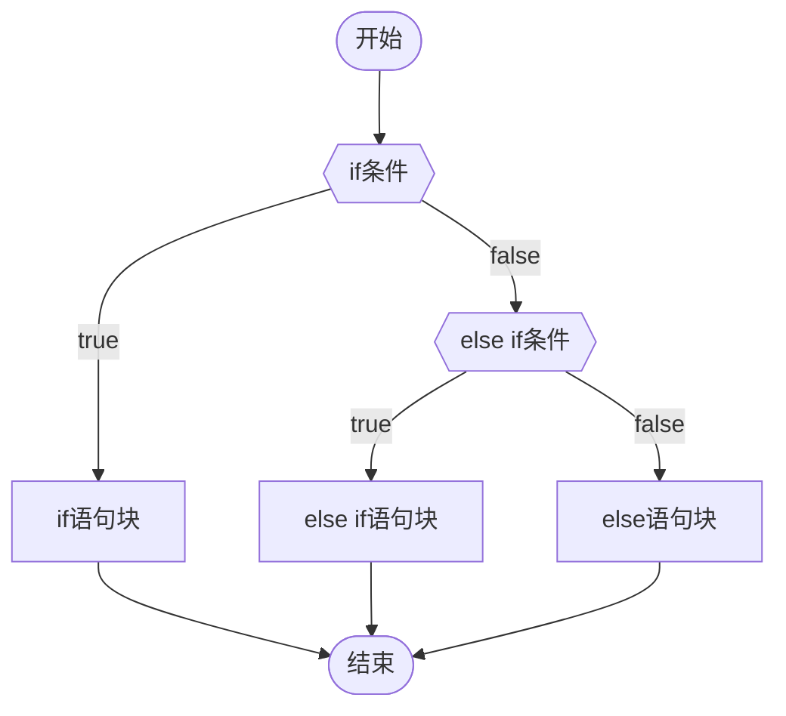
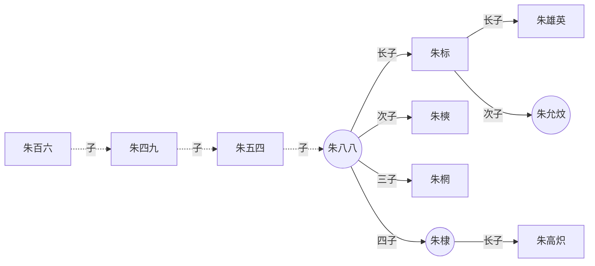
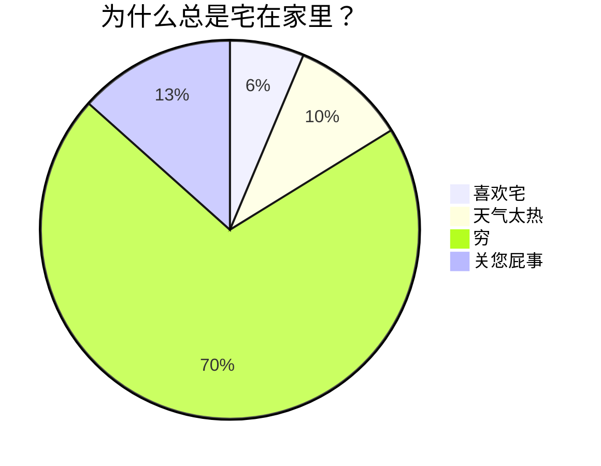
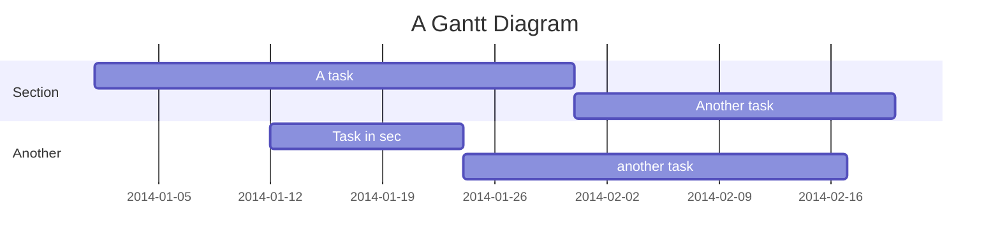
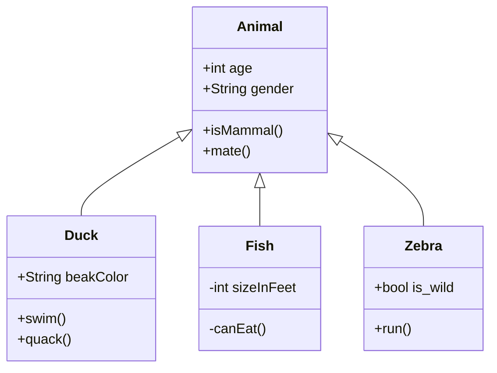

## 什么是 Markdown

- **Markdown** 是一款轻量级标记语言，不同于 HTML **(Hypertext Markup Language)**，**Markdown** 的语法非常简单，且容易上手
- **Markdown** 以 **纯文本格式** 编写文档，依赖键盘而非鼠标，专注于 **写作本身**，感受 **书写** 的魅力
- **Markdown** 的通过添加一些简单的 **标识符**，让文本具有 **恰到好处** 的格式
- **Markdown** 核心特征就是 **删繁剪芜**，**简扼** + **精炼**
- **Markdown** 是 **笔记** 与 **网页文章** 的最佳载体
- **Down** 的核心：坐 **下** 来，就能把思维写 **下** 来
   - **牛津高阶英汉双解词典第九版** 中，关于 **down** 的释义
        

### 为什么要使用 Markdown

有朋友问我，**Markdown** 的效果用 Word 完全可以复现，甚至功能更多，那为何要用 **Markdown** 呢？

**答：**

- 功能多，不一定是好事
    - 功能一多，选择就会变多，然后您会开始纠结……
        - 这个字号是不是该大一点呢
        - 这个颜色好像有点不太搭呢
        - 这个粗体，是不是该再加点颜色呢
        - 这个图片的位置看起来有点不大对劲呢
    - 结果，写了半天，就憋出一点点东西
        - 写出来的内容……好像……也不咋滴

### Markdown 的优势

1. **Markdown** 让我们免于 **被繁杂臃肿的功能晃花了眼** 的困扰

2. **Markdown** 让我们回归内容本身，拥抱笔记的 **内核**，而非浮于 **表象** 的样式，写出 **高效精练** 的笔记

:::tip
用 **Markdown** 写东西，记住一个原则：

> 能用 10 个字搞定的，绝不用 11 个字
:::

经常使用 **Markdown** 书写的朋友，也许会有一种奇妙的感触。

- 书写，会 ==倒逼== 思维的跃进。像是有东西拽着您的思绪往前冲
    - 倒逼：逆向逼迫，反向推动

**关于标识符的滥用**

这个其实是写在最后的，之所以放在这里，是因为它 **很重要！**

如果您有一定的 Markdown 语法基础，可以直接跳转到 [避免标识符的滥用](#避免标识符的滥用)

## Markdown 相关软件推荐

- **Markdown 书写软件** 推荐：**Typora** 优秀的 Markdown 网页文章书写软件
    - [点击跳转下载地址](https://www.typora.io/ "Typora 编辑器")
        - 以前是免费的，现在收费了，不过是买断制

- **Markdown 笔记软件** 推荐：**Obsidian** 笔记软件
    - [点击跳转下载地址](https://obsidian.md/ "Obsidian 笔记软件")

- **VS Code**：运行代码
    - [点击跳转下载地址](https://code.visualstudio.com/ "VS Code 软件")

## Markdown 语法

[Markdown 官方教程](https://markdown.com.cn/)

### 标题&目录

#### 标题

Markdown 标题共有 **六级。**

```md
这是一段普通的文本

# 这是一级标题
## 这是二级标题
### 这是三级标题
#### 这是四级标题
##### 这是五级标题
###### 这是六级标题
```

#### 目录

- 目录的格式
    - 在文档的顶部输入 `[TOC]`，会根据 **标题** 自动生成目录（**Table of Content**）
    - 如果您想要在您的 `[TOC]` 中排除一个标题，请在您的标题 **后面** 添加 `{ignore=true}` 即可

- 不是所有 **Markdown 编辑器** 都支持目录生成
    - **Obsidian** 就不支持，不过 **OB** 是自带大纲的，就是目录的效果

```md
输入下方内容会生成一个目录：

[TOC]
```

### 斜体&粗体

#### 斜体

- 斜体的格式
    - `*`文本内容`*`
    - `_`文本内容`_`
- 说明
    - 斜体文本，首尾只有 **单个** 标识符

```md
这是一段普通文本

*这里是一段斜体文本*

_这也是一段斜体文本_
```

**效果：**

这是一段普通文本

*这里是一段斜体文本*

_这也是一段斜体文本_

#### 粗体

- 粗体的格式
    - `**`文本内容`**`
    - `__`文本内容`__`
- 说明
    - 粗体文本，首尾各有 **两个** 标识符

```md
这是一段普通文本

**这里是一段加粗文本**

__这也是一段加粗文本__
```

**效果：**

这是一段普通文本

**这里是一段加粗文本**

__这也是一段加粗文本__

#### 粗斜体（斜粗体）

- 粗斜体的格式
    - `***`文本内容`***`
    - `___`文本内容`___`
    - `**_`文本内容`_**`
    - `__*`文本内容`*__`
    - `*__`文本内容`__*`
    - `_**`文本内容`**_`
- 说明
    - 粗斜体文本，首尾各有 **三个** 标识符

```md
这是一段普通文本

***粗斜体文本1***

___粗斜体文本2___

**_粗斜体文本3_**

__*粗斜体文本4*__

*__粗斜体文本5__*

_**粗斜体文本6**_
```

**效果：**

这是一段普通文本

***粗斜体文本1***

___粗斜体文本2___

**_粗斜体文本3_**

__*粗斜体文本4*__

*__粗斜体文本5__*

_**粗斜体文本6**_

### 线

#### 水平分割线

- 水平分割线的格式
    - `***`
    - `---`
    - `___`
- 说明
    - 水平分割线，至少有 **三个** 标识符

```md
下面是一条水平分割线：

---
***
___
```

**效果：**

---
***
___

#### 文本删除线

- 删除线的格式
    - `~~`文本内容`~~`
- 说明
    - 首尾各加 **两个** 波浪号

```md
~~这是一段加了删除线的文本~~
```

**效果：**

~~这是一段加了删除线的文本~~

#### 文本下划线

- 下划线的格式
    - `<u>`文本内容`</u>`
- 说明
    - 使用 HTML 语法

```html
<u>这是一段加了下划线的文本</u>
```

**效果：**

<u>这是一段加了下划线的文本</u>

### 列表&引用

#### 有序列表

- 有序列表的格式
    - `1.` + **空格** 再输入文本
- 说明
    - 有序列表可以 **嵌套** 使用
    - 即便在源代码模式中修改了数字序号，渲染界面依然是 **依照顺序** 显示的

```md
1. 这是第一个有序列表
2. 这是第二个有序列表
3. 这是第三个有序列表
6. 这是第四个有序列表

<br />

1. 这是第一个一级有序列表
    这是同个列表下，另起一行的文本内容

    1. 这是第一个二级嵌套列表
    2. 这是第二个二级嵌套列表

2. 这是第二个一级有序列表
    这是同个列表下，另起一行的文本内容
```

**效果：**

1. 这是第一个有序列表
2. 这是第二个有序列表
3. 这是第三个有序列表
6. 这是第四个有序列表

<br />

1. 这是第一个一级有序列表
    这是同个列表下，另起一行的文本内容

    1. 这是第一个二级嵌套列表
    2. 这是第二个二级嵌套列表

2. 这是第二个一级有序列表
    这是同个列表下，另起一行的文本内容

#### 无序列表

- 无序列表的格式
    - `-` + **空格** 再输入文本
    - `*` + **空格** 再输入文本
    - `+` + **空格** 再输入文本
- 说明
    - 无序列表可以 **嵌套** 使用

```md
- 这是第一个无序列表
* 这是第二个无序列表
+ 这是第三个无序列表

- 这是第一个一级无序列表
    这是同个列表下，另起一行的文本内容
    - 这是第一个二级嵌套列表

- 这是第二个一级无序列表
    这是同个列表下，另起一行的文本内容
```

**效果：**

- 这是第一个无序列表
* 这是第二个无序列表
+ 这是第三个无序列表

<br />

- 这是第一个一级无序列表
    这是同个列表下，另起一行的文本内容
    - 这是第一个二级嵌套列表

- 这是第二个一级无序列表
    这是同个列表下，另起一行的文本内容

#### 引用

- 引用的格式
    - `>` + **空格** 再输入文本（不加空格也可以）
- 说明
    - 引用可以 **嵌套** 使用
    - 引用需另起一行，并额外多打一个 `>` 来完成 **嵌套**

```md
> 这是引用文本的第一行
> 
> 这是引用文本的第二行

> 这是一级引用文本的第一行
> 
>> 这是二级嵌套引用文本内第一行
>
> 这是一级引用文本的第二行
```

**效果：**

> 这是引用文本的第一行
> 
> 这是引用文本的第二行

> 这是一级引用文本的第一行
> 
>> 这是二级嵌套引用文本内第一行
> 
> 这是一级引用文本的第二行

#### 缩进&退格

在列表和引用的书写过程中，我们需要利用 **缩进** 与 **退格**，让文章肌理分明，更具层级。

- 缩进
    - <kbd>Tab</kbd> 键
    - <kbd>Ctrl</kbd> + <kbd>]</kbd> 键
- 退格
    - <kbd>Shift</kbd> + <kbd>Tab</kbd> 键
    - <kbd>Ctrl</kbd> + <kbd>[</kbd> 键

#### 有序&无序&引用 连续套娃

**有序列表**、**无序列表**、**引用** 三者之间，可以相互嵌套。

```md
1. 第一级有序列表 1
    - 第二级 无序列表 1
        > 第三级 引用 1
        >
            > - 第四级 无序列表 2
            > 
            >   1. 第五级 有序列表 2
            > 
            > - 第四级 无序列表 3
        >
        > 第三级 引用 2
    - 第二级 无序列表 4

2. 第一级 有序列表 3
```

**效果：**

1. 第一级有序列表 1
    - 第二级 无序列表 1
        > 第三级 引用 1
        >
            > - 第四级 无序列表 2
            > 
            >   1. 第五级 有序列表 2
            > 
            > - 第四级 无序列表 3
        >
        > 第三级 引用 2
    - 第二级 无序列表 4

2. 第一级 有序列表 3

### 网页链接与图像

#### 网页链接

- 网页链接的格式
    - `[显示文本内容](网页链接地址)`
    - `[显示文本内容](网页链接地址 "提示信息文本")`
- 说明
    - 显示文本内容，是在渲染界面实际 **可见** 的文本，用以 **说明** 链接
    - 提示信息文本，需鼠标悬停于 **显示文本内容** 方可触发，用于增加额外提示信息
        - 一般来讲，需按住 <kbd>Ctrl</kbd> 加 **鼠标左键点击** 才可跳转链接，不过也有 **直接鼠标左键点击** 就能跳转的

```md
[百度一下，您就知道](http://www.baidu.com)

[百度一下，您就知道](http://www.baidu.com "跳转到百度网页链接")
```

**效果：**

[百度一下，您就知道](http://www.baidu.com)

[百度一下，您就知道](http://www.baidu.com "跳转到百度网页链接")

#### 图像

- 图像格式
    - ``
    - ``
    - ``
    - ``
    - `[](网页链接地址)`
- 说明
    - `!` 代表 **可见**
    - `=30x30` 可以设置图片的大小，**图片链接地址** 与 **=** 号之间有 **空格**
    - `#pic_center` 设置图片的位置是居中，**图片链接地址** 与 **#** 号之间没有 **空格**
    - 给图片增加链接，请将图像的 **Markdown** 括在方括号中，然后将链接添加在圆括号中
    - `[]` 方括号里的文字信息在 **Markdown** 没啥实质的作用，只是方便在源代码模式下，知道这个图片是什么，在渲染界面是不会显示的

```md


[](https://www.baidu.com)
```

**效果：**


[](https://www.baidu.com)

#### 表格

- 表格格式
    `|  表头1  |  表头2  |`
    `|  :----:  |  :----:  |`
    `|  文本内容  |  文本内容  |`
    `|  文本内容  |  文本内容  |`
- 说明
    - `|` 是构成表格的主要 **框架**
    - `-` 区分 **表头** 和 **表格主体**
    - `:` 控制表格内 **文本内容** 的 **对齐方式**
    - `|` 和 **表头**、**:**、**文本内容** 之间可以没有空格
    - 使用 `:----:` 居中
    - 使用 `:----` 居左
    - 使用 `----:` 居右

```md
|  表头1  |  表头2  |  表头3  |
|  :----  |  :----:  |  ----:  |
|  单元格数据1  |  单元格数据2  |  单元格数据3  |
|  数据4  |  数据5  |  数据6  |
|  单元格数据7  |  单元格数据8  |  单元格数据9  |
```

**效果：**

|  表头1  |  表头2  |  表头3  |
|  :----  |  :----:  |  ----:  |
|  单元格数据1  |  单元格数据2  |  单元格数据3  |
|  数据4  |  数据5  |  数据6  |
|  单元格数据7  |  单元格数据8  |  单元格数据9  |

##### 表格中文本内容的换行

- Mardown 中表格，它的宽高是由单元格数据内的文本内容 **撑开** 的
- 当我们输入一段很长很长的文本，它所在的单元格会变得过宽

**如下所示：**

|  表头1  |  表头2  |
|  :----:  |  :----:  |
| 这是一段很长很长很长很长很长很长很长很长很长很长很长很长很长很长的文本 | 普通文本 |

:::tip
若想对一段长文本进行换行，可以在 **中间** 插入一个 HTML 换行标签（`<br />`）
:::

```md
|  表头1  |  表头2  |
|  :----:  |  :----:  |
|  这是第一行文本 <br /> 这是另起一行的文本  |  普通文本  |
```

**效果：**

|  表头1  |  表头2  |
|  :----:  |  :----:  |
|  这是第一行文本 <br /> 这是另起一行的文本  |  普通文本  |

#### 代码域

##### 行内代码

- 行内代码的格式
    - 输入 **两个** 反引号（`` ` ``），在中间写代码内容
- 说明
    - 行内代码不一定非得写代码，也可以作为 **着重标记**，突出显示内容
    - 行内代码中，源代码界面和渲染界面是完全一致的，标识符会失效
    - **所谓行内代码** 只要您的屏幕足够宽，它就不会换行

```md
`print("Hello, World!")`

`这是一行突出显示的文本内容`
```

**效果：**

`print("Hello, World!")`

`这是一行突出显示的文本内容`

### 代码块

- 代码块的格式
    - 在首行和末行各加 **三个** 反引号（`` ` ``），在中间写代码内容
    - 在首行和末行各加 **三个** 波浪号（`~`），在中间写代码内容
- 说明
  - 在代码块也不一定要写代码，可以写 **一段** 突出的文本内容，语言类型可以填写 **txt** 或者 **干脆不写**
  - 代码块中，源代码界面和渲染界面是完全一致的，标识符会失效
  - Markdown 处理器都支持受代码块的 **语法突出** 显示

````md
```
print("Hello, World!")
```

下面是 Python 代码块

```python
print("Hello, World!")
```

下面是一块突出显示的文本

~~~txt
这是一段
突出显示的
文本内容
~~~
````

**效果：**

```
print("Hello, World!")
```

```python
print("Hello, World!")
```

~~~txt
这是一段
突出显示的
文本内容
~~~

##### 代码块的嵌套

- 代码块的嵌套格式
    - 使用 **4** 个 `` ` `` 包裹 **3** 个 `` ` ``

**效果：**

`````md
````txt
```python
print("Hello, World!")
```
````
`````

:::tip
如果要再套一层，就在最外层加 **5** 个 `` ` ``，以此类推……
:::

#### 在行内代码里显示反引号

首尾各用两个反引号 `` ` `` 加 **空格** 包裹

- 在行内代码里显示反引号格式
    ```md
    `` 这是一段能显示`反引号`的行内代码 ``
    ```

**效果：**

`` 这是一段能显示`反引号`的行内代码 ``

### 任务列表

- 任务列表的格式
    `- [ ] 待办任务列表1`
    `- [x] 已办任务列表1`
- 说明
    - 中括号 `[ ]` 里面必须有个 **空格**
    - `-` 和 `[` 符号之间有空格；`]` 符号和 `文字内容` 之间有空格
    - 任务列表默认为 **待办** 列表，在中括号内输入 `x`，变成 **已办** 列表
    - 在渲染界面，直接鼠标左键点击框框
    - 在源代码界面，在中括号内输入 **英文字母x**，变成 **已办**

```md
- [ ] 待办任务列表1
- [ ] 待办任务列表2
- [x] 已办任务列表1
- [x] 已办任务列表2
```

**效果：**

- [ ] 待办任务列表1
- [ ] 待办任务列表2
- [x] 已办任务列表1
- [x] 已办任务列表2

### 注释

**Markdown** 的 **注释** 和 **HMTL** 一样，注释的内容在 **渲染界面不可见**（部分编辑器可见）。

- 注释的格式
    - `<!-- 这里是注释的内容 -->`
        - 注释可以是单行，也可以是多行

```md
<!-- 这里是一行注释 -->

<!--
这里是
一段
假装有
很多行的
注释
-->

这是一段普通文本
```

**效果：**

<!-- 这里是一行注释 -->

<!--
这里是一段
假装有
很多行的
注释
-->

这是一段普通文本

### 变量

#### 网页链接变量

- 网页链接变量的格式
    - 首先输入
        - `[显示文本内容][变量名]`
    - 在文档任意一个区域输入
        - `[变量名]: 链接地址`
- 说明
    - `:` 与 **链接地址** 之间可以不用空格
    - 变量名可以自己取，没啥限制，任意字符都可以

```md
[百度一下，您就知道][度娘]

[知乎-有问题，就会有答案][知乎]

<!-- 这里是变量区域 -->
[度娘]: http://www.baidu.com
[知乎]: https://www.zhihu.com
```

**效果：**

[百度一下，您就知道][度娘]

[知乎-有问题，就会有答案][知乎]

#### 脚注

- 脚注的格式
    - 在需要脚注的地方输入
        - `[^脚注代号]`
    - 在其他区域输入
        - `[^脚注代号]: 脚注内容`
- 说明
    - `:` 与 **脚注内容** 之间可以不用空格
    - 脚注代号会直接显示在渲染界面
    - 脚注代号可以随便命名，不过推荐使用 **数字序号**

```md
鲁迅原名是什么[^1]，浙江哪里人[^2]

<!-- 这里是变量区域 -->
[^1]: 周树人
[^2]: 绍兴人
```

**效果：**

鲁迅原名是什么[^1]，浙江哪里人[^2]

### 拓展文本格式标记

- **Markdown** 想实现更多的文本显示效果，只能依赖 **HTML** 标记实现
- 个人 **不是很推荐** 在 Markdown 中使用 HTML，不过一些简单的标记还是可以 **轻度使用** 的

### 键盘文本

- 键盘文本的格式
    - `<kbd>键盘文本</kbd>`
    - `<kbd>Ctrl</kbd> + <kbd>X</kbd>`
- 说明
    - 键盘文本也不一定非得是键盘按键，也可以作为 **着重文本** 突出显示

**效果：**

<kbd>键盘文本</kbd>

<kbd>Ctrl</kbd> + <kbd>X</kbd>

##### 加粗键盘文本

- 加粗键盘文本的格式
    - `<kbd>**键盘文本**</kbd>`
    - `**<kbd>ctrl + x</kbd>**`

**效果：**

<kbd>**键盘文本**</kbd>

**<kbd>ctrl + x</kbd>**

#### 放大文本

- 放大文本的格式
    - `<big>这是一段放大文本</big>`

**效果：**

这是一段普通文本

<big>这是一段放大文本</big>

#### 缩小文本

- 缩小文本的格式
    - `<small>这是一段缩小文本</small>`

**效果：**

这是一段普通文本

<small>这是一段缩小文本</small>

#### 多彩文本

- 多彩文本的格式
    - `<font color=orange>这是一段橘色文本</font>`
- 说明
    - color 里支持的颜色 [更多颜色类型](http://c.runoob.com/front-end/55 "可跳转至菜鸟工具了解")

**效果：**

<font color=orange>这是一段橘色文本</font>

:::warning
多彩文本尽量慎用，**Markdown** 的核心就是 **简洁精炼**，注重 **实质内容**，而非花哨的颜色样式
:::

### 拓展文本显示效果

- 拓展显示效果既不是原生 **Markdown 语法** 支持的，也非 HTML标记，而是部分编辑器提供的 **额外标识符**，属于拓展语法，旨在为 **Markdown 使用者** 提供更多样式选择
- 不同编辑器，支持不一样，这里以 **Typora 编辑器** 为例

#### 文本高亮

- 文本高亮的格式
  - `==这里是一段高亮文本==`

**效果：**

==这里是一段高亮文本==

#### 上标

- 上标的格式
    - `x^2^`
- 说明
    - 用一对 `^` 包裹（<kbd>Shift</kbd> + <kbd>6</kbd>）

**效果：**

x^2^

#### 下标

- 下标的格式
    - `H~2~O`
- 说明
    - 用一对 `~` 包裹（<kbd>Shift</kbd> + <kbd>`</kbd>）

**效果：**

H~2~O

#### Emoji 符号

- Emoji 符号的格式
    `:smile:`
    `:sweat:`
    `:cat:`
    `:woman_cartwheeling:`
- 说明
    - 用一对 `:` 包裹，里面是 **Emoji** 符号的 **语义化文本**（**Typora 编辑器** 中，输入 `:` 就会带提示器）
    - 不支持上述方式的 Markdown 编辑器或笔记软件，直接用 **输入法** 输入也是可以的
    -  **Windows系统** 用户 <kbd>win</kbd> + <kbd>.</kbd> 就可以输入 Emoji 了（不是数字键盘的 <kbd>.</kbd>）
    - Emoji 符号 [emojipedia](https://emojipedia.org/)
    - Emoji 符号 [emoji-cheat-sheet](https://www.webfx.com/tools/emoji-cheat-sheet/)

**效果：**

:smile:

:sweat:

:cat:

:woman_cartwheeling:

### 转义字符

在 **Markdown** 中，我们通过 **标识符** 改变 **文本显示效果。**

现在我们希望它不作为标识符，而是 **作为字符本身呈现出来**（不具备改变文本显示效果的功能，只是一个 **普通字符**）。

- 首先我们可以用前面介绍的 **代码域**，因为代码模式的显示效果就是源代码 **完全一致** 的
- 还有一种方法，可以利用 **转义字符**，在这些标识符 **前面** 加上 **反斜线**（反斜线 `\` 要紧贴在标识符前面，**不能** 有 **空格**）
    - `\` 的作用是让标识符 **转义** 变为一个 **普通字符**，完成这个效果后，反斜线会 **自动隐藏**
    - 隐藏后的反斜线仅在 **源代码** 界面 **可见**，在 **渲染** 界面 **不可见**
    - 反斜线只 **针对标识符** 起作用，其他字符添加 `\`，`\` 不会自动隐藏
    - 如果想给已经被加在标识符前面，会自动隐藏的 `\` 显示出来，可以在反斜线前面再加一个 `\`，用它 **自己来转义自己**

### 空格&换行&强制删除

#### 空格

在一些编辑器或者支持 Markdown 的笔记软件里，无论您打多少个 **空格**，它只会显示单个 **空格** 的距离。

可以使用 HTML 中 **空格** 的 **字符实体**（`&nbsp;`），若要添加 **多个** 空格，就输入多个（`&nbsp;`）。

- 格式
    - `这里有&nbsp;&nbsp;&nbsp;&nbsp;&nbsp;&nbsp;6个空格分隔`
    
**效果：**

这里有&nbsp;&nbsp;&nbsp;&nbsp;&nbsp;&nbsp;6个空格分隔

#### 换行

在一些编辑器或者支持 Markdown 的笔记软件里，无论您打多少个 **回车**，它只会显示单个 **回车** 的空行间距。

可以使用 **HTML** 的 `<br />` 标签，在 **单独一行** 中使用，增加额外的空行间距。

如果要增加 **多个** 空行间距，就输入 **多个** `<br />`。

:::tip
Markdown 中您敲一个回车是没法换行的，必须在 **行末** 敲 **2个空格**，再按回车键

确保 `<br />` 标签前后两行都是空白行
:::

- 格式

    ```md
    这里是第一段文本

    <br /><br />

    这里是第二段文本
    ```

**效果：**

这里是第一段文本

<br /><br />

这里是第二段文本

#### 强制删除

很多编辑器都有英文标点自动补全功能，自动生成一对，光标落在中间，只想删除前面 1 个，却会把 **一整对** 都删掉。

在多个列表的嵌套中，也许会遇到一些 **无法被删除** 的 **列表标识符。**

**解决方法：**

- 使用 <kbd>Shift</kbd> + <kbd>Backspace</kbd> 即可强制删除
    - <kbd>Bcakspace</kbd>（退格键）

### 嵌入

嵌入都是依赖 **HTML 标签** 实现的，嵌入的都是 **在线** 链接格式。

如果是本地的，**Obsidian** 中音频是有自带的可录制的录音机插件的，其他的 **音频、视频** 直接复制黏贴就可以了，也可以直接拖拽到 OB 的笔记界面。

其他的媒体文件在 **Obsidian** 也和图片一样，以 **双链** 的格式引用在目标笔记中，使用 `!` 使它可见。

#### 嵌入音频

- 格式
    - `<audio controls="controls" preload="none" src="音频链接地址"></audio>`
- 说明
    - `controls` 向用户显示控件，比如：播放按钮
    - `preload` 音频在页面加载时进行加载，并预备播放
    - `src` 要播放的音频的 URL

```html
<audio controls="controls" preload="none" src="https://www.w3school.com.cn/i/horse.ogg"></audio>
```

**效果：**

<audio controls="controls" preload="none" src="https://www.w3school.com.cn/i/horse.ogg"></audio>

#### 嵌入视频

- 格式

    ```html
    <video width="600" height="420" controls="controls">
      <source src="movie.mp4" type="video/mp4">
      <source src="movie.ogg" type="video/ogg">
      <source src="movie.webm" type="video/webm">
    </video>
    ```

- 说明
    - `<video>` 标签支持的视频格式：`MP4`、`ogg`、`webm`
    - `<source>` 标签允许您规定可替换的视频/音频文件供浏览器根据它对媒体类型或者编解码器的支持进行选择
    - width（宽度），height（高度），可以自己设置，直接输入数字即可，单位默认是 px（像素），也可以使用 **百分比**
    - `width=100%` 代表水平撑满整个窗口
    - `height=50%` 代表垂直撑满半个窗口
    - `controls` 向用户显示控件，比如：播放按钮
    - `src` 规定媒体文件的 URL
    - `type` 规定媒体资源的 MIME 类型

**效果：**

<video width="600" height="420" controls="controls">
  <source src="https://www.w3school.com.cn/i/movie.mp4" type="video/mp4">
  <source src="https://www.w3school.com.cn/i/movie.ogg" type="video/ogg">
  <source src="https://www.w3school.com.cn/i/movie.webm" type="video/webm">
</video>

#### 嵌入页面

- 格式
    - `<iframe width=600 height=400 src="页面链接地址">文本信息</iframe>`
- 说明
    - `<iframe>` 标签会创建包含另外一个文档的内联框架（即行内框架）
    - `width` 定义 iframe 的宽度
    - `height` 定义 iframe 的高度
    - `src` 定义在 iframe 中显示的 URL
    - **文本信息** 是页面显示失败时显示的文本信息

```html
<iframe width=600 height=400 src="https://www.w3school.com.cn/html/index.asp">HTML w3school 教程</iframe>
```

**效果：**

<iframe width=600 height=400 src="https://www.w3school.com.cn/html/index.asp">HTML w3school 教程</iframe>

:::tip
**iframe** 标签除了嵌入页面，也可以嵌入 **在线视频**，主流的视频网站都会提供 **嵌入代码**

具体可以看这个 [iframe 视频嵌入教程](https://www.wolai.com/wolai/go85vJpt3wDwrid7DfCZcE )

不是所有的编辑器和笔记软件都支持这个
:::

### Latex 数学公式

主要用于 **数学公式** 与 **化学公式** 的书写。

[Latex 详细教程](https://www.wolai.com/wolai/egjDbHiAfGfJmwR972fcEW)

#### 行内公式

- 格式
  - `$`行内公式`$`

**example：**

```latex
$x^2 + 2x + 5 + \sqrt x = 0$
$e^{i\pi} + 1 = 0$
$\ce{CO2 + C -> 2 CO}$
$\ce{2Mg + O2 ->[燃烧] 2 MgO}$
```

:::tip
如果公式中有 `\` 符号，在使用时需要使用 `\` 进行转义，比如：`$\ce{CO2 + C -> 2 CO}$` 就需要写成 `$\\ce{CO2 + C -> 2 CO}$`
:::

**效果：**

- $x^2 + 2x + 5 + \sqrt x = 0$
- $e^{i\pi} + 1 = 0$
- $\\ce{CO2 + C -> 2 CO}$
- $\\ce{2Mg + O2 ->[燃烧] 2 MgO}$

#### 公式块

- 格式

    ```latex
    $$
    公式块
    $$
    ```

**example：**

```latex
% 化学公式
$$
\ce{Zn^2+  <=>[+ 2OH-][+ 2H+]  $\underset{\text{amphoteres Hydroxid}}{\ce{Zn(OH)2 v}}$  <=>[+ 2OH-][+ 2H+]  $\underset{\text{Hydroxozikat}}{\ce{[Zn(OH)4]^2-}}$}
$$
```

```latex
% 麦克斯韦方程组
$$
\begin{array}{lll}
\nabla\times E &=& -\;\frac{\partial{B}}{\partial{t}}
\ \nabla\times H &=& \frac{\partial{D}}{\partial{t}}+J
\ \nabla\cdot D &=& \rho
\ \nabla\cdot B &=& 0
\ \end{array}
$$
```

```latex
% 薛定谔方程
$$
i\hbar\frac{\partial \psi}{\partial t} = \frac{-\hbar^2}{2m} \left(\frac{\partial^2}{\partial x^2} + \frac{\partial^2}{\partial y^2}+\frac{\partial^2}{\partial z^2} \right) \psi + V \psi
$$
```

**效果：**

$$
% 化学公式
\ce{Zn^2+  <=>[+ 2OH-][+ 2H+]  $\underset{\text{amphoteres Hydroxid}}{\ce{Zn(OH)2 v}}$  <=>[+ 2OH-][+ 2H+]  $\underset{\text{Hydroxozikat}}{\ce{[Zn(OH)4]^2-}}$}
$$

<br />

$$
% 麦克斯韦方程组
\begin{array}{lll}
\nabla\times E &=& -\;\frac{\partial{B}}{\partial{t}}
\ \nabla\times H &=& \frac{\partial{D}}{\partial{t}}+J
\ \nabla\cdot D &=& \rho
\ \nabla\cdot B &=& 0
\ \end{array}
$$

<br />

$$
i\hbar\frac{\partial \psi}{\partial t} = \frac{-\hbar^2}{2m} \left(\frac{\partial^2}{\partial x^2} + \frac{\partial^2}{\partial y^2}+\frac{\partial^2}{\partial z^2} \right) \psi + V \psi
$$

#### Mermaid

- 一些 **Markdown 编辑器** 和 **笔记软件** 支持通过 [Mermaid](https://mermaid-js.github.io/ "Mermaid 官网") 及其所提供的 [编译器](https://mermaid-js.github.io/mermaid-live-editor  "Mermaid 在线编译器") 来为用户提供图表的绘制功能
- 这里只提供一些演示的图表，具体教程
  - [Mermiad 超级教程 Obsidian版](https://publish.obsidian.md/csj-obsidian/0+-+Obsidian/Mermaid/MOC/MOC+Mermiad+%E6%95%99%E7%A8%8B+Obsidian%E7%89%88)
  - 关于 Mermaid 语法，参考 [这儿](https://mermaid.js.org/#/)

#### 流程图

**源码1：**

````md

````

**效果1：**


**源码2：**

````md

````

**效果2：**


#### 饼图

**源码：**

````md

````

**效果：**


#### 序列图（时序图）

**源码：**

````md
```mermaid
sequenceDiagram
	%% 自动编号
	autonumber
	%% 定义参与者并取别名，aliases：别名
        participant A as Aly
        participant B as Bob
        participant C as CofCai
        %% 便签说明
        Note left of A: 只复习了一部分
        Note right of B: 没复习
        Note over A,B: are contacting
        A->>B: 明天是要考试吗？
        B-->>A: 好像是的！
        %% 显示并行发生的动作，parallel：平行
        %% par [action1]
        rect rgb(0, 25, 155)
            par askA
                C -->> A:您复习好了吗？
            and askB
                C -->> B:您复习好了吗？
            and self
                C ->>C:我还没准备复习......
            end
        end
        %% 背景高亮，提供一个有颜色的背景矩形
        rect rgb(25, 55, 0)
            loop 自问/Every min
            %% <br/>可以换行
            C ->> C:我什么时候<br/>开始复习呢？
            end
        end
        %% 可选择路径
        rect rgb(153, 83, 60)
            alt is good
                A ->> C:复习了一点
            else is common
                B ->> C:我也是
            end
            %% 没有else时可以提供默认的opt
            opt Extra response
                C ->> C:您们怎么不回答我
            end
        endsequenceDiagram
	%% 自动编号
	autonumber
	%% 定义参与者并取别名，aliases：别名
        participant A as Aly
        participant B as Bob
        participant C as CofCai
        %% 便签说明
        Note left of A: 只复习了一部分
        Note right of B: 没复习
        Note over A,B: are contacting
        A->>B: 明天是要考试吗？
        B-->>A: 好像是的！
        %% 显示并行发生的动作，parallel：平行
        %% par [action1]
        rect rgb(0, 25, 155)
            par askA
                C -->> A:您复习好了吗？
            and askB
                C -->> B:您复习好了吗？
            and self
                C ->>C:我还没准备复习......
            end
        end
        %% 背景高亮，提供一个有颜色的背景矩形
        rect rgb(25, 55, 0)
            loop 自问/Every min
            %% <br/>可以换行
            C ->> C:我什么时候<br/>开始复习呢？
            end
        end
        %% 可选择路径
        rect rgb(153, 83, 60)
            alt is good
                A ->> C:复习了一点
            else is common
                B ->> C:我也是
            end
            %% 没有else时可以提供默认的opt
            opt Extra response
                C ->> C:您们怎么不回答我
            end
        end
```
````

**效果：**



```mermaid
sequenceDiagram
	%% 自动编号
	autonumber
	%% 定义参与者并取别名，aliases：别名
        participant A as Aly
        participant B as Bob
        participant C as CofCai
        %% 便签说明
        Note left of A: 只复习了一部分
        Note right of B: 没复习
        Note over A,B: are contacting
        A->>B: 明天是要考试吗？
        B-->>A: 好像是的！
        %% 显示并行发生的动作，parallel：平行
        %% par [action1]
        rect rgb(0, 25, 155)
            par askA
                C -->> A:您复习好了吗？
            and askB
                C -->> B:您复习好了吗？
            and self
                C ->>C:我还没准备复习......
            end
        end
        %% 背景高亮，提供一个有颜色的背景矩形
        rect rgb(25, 55, 0)
            loop 自问/Every min
            %% <br/>可以换行
            C ->> C:我什么时候<br/>开始复习呢？
            end
        end
        %% 可选择路径
        rect rgb(153, 83, 60)
            alt is good
                A ->> C:复习了一点
            else is common
                B ->> C:我也是
            end
            %% 没有else时可以提供默认的opt
            opt Extra response
                C ->> C:您们怎么不回答我
            end
        end
```

#### 甘特图

**源码：**

````md

````

**效果：**


#### 类图

**源码：**

````md

````

**效果：**


### 避免标识符的滥用

即使在 **Markdown** 中，也要尽量 **避免** 标识符的滥用

比如我的这篇教程，就存在一定程度的滥用

- 其实是因为我这篇是教学性质的，不太一样，有些不能避免
    - **(好吧，我就是在甩锅)**

标识符的本质是突出显示，代表 **重点**

- 一篇笔记里的某段文本，使用 **各式各样的** 的标识符，会造成 **重点不清晰**

有 **三种** 标识，**慎用！**

1. 词中对 **单个汉字** 的标识
    卧 ==虎== 藏 ==龙==

2. 短语中对 **单个英语单词** 的标识
    get a ==bang== out of
    
3. 标识符的 **多层嵌套**
    **我感觉快要 ==原地`起飞`== 了**

**原因：**

- 词义的割裂
- 视觉的混乱
- 不利于搜索
    - `卧==虎==藏==龙==`
        - 搜 `卧虎` -- 搜不到
        - 搜 `藏龙`  -- 搜不到


<!-- 变量区域 -->

[度娘]: http://www.baidu.com
[知乎]: https://www.zhihu.com
[^1]: 周树人
[^2]: 绍兴人

## 本文转载

Markdown 内容转载自：[Markdown 超级教程 Obsidian 版](https://publish.obsidian.md/csj-obsidian/0+-+Obsidian/Markdown/Markdown%E8%B6%85%E7%BA%A7%E6%95%99%E7%A8%8B+Obsidian%E7%89%88)

