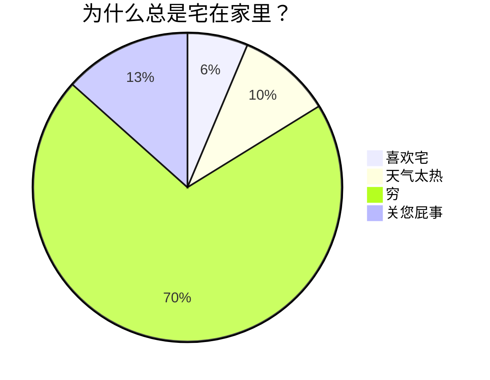

## 什么是 Markdown

Markdown 是一款 **轻量级标记语言**，语法非常简单，且容易上手，以 **纯文本格式** 编写文档，由 John Gruber 于 2004 年创建，如今已成为世界上最受欢迎的标记语言之一。

### 为什么要使用 Markdown

- **无处不在**：主流的代码托管平台、很多开源项目都用 Markdown 写作
- **纯文本可移植**：可以使用任何应用程序打开包含 Markdown 格式的文本文件
- **独立于平台**：可以在任何操作系统上创建 Markdown 格式的文本
- **能适应未来的变化**：可以使用文本编辑器读取 Markdown 格式的文本

### Markdown 的优势

- 是做笔记、为网站创建内容以及生成可打印文档的快速、简便的方法
- 语法非常简单，且容易上手
- 可以将其导出为 PDF 或 HTML 格式
- 可以使用一些 HTML 格式语法

## Markdown 相关软件推荐

- **Markdown 书写软件** 推荐：**Typora** 优秀的 Markdown 网页文章书写软件
    - 以前是免费的，现在收费了，不过是买断制。[点击跳转下载地址](https://www.typora.io/ "Typora 编辑器")

- **VS Code**：现代编辑器，运行代码
    - [点击跳转下载地址](https://code.visualstudio.com/ "VS Code 软件")

- **[在线编辑器](https://markdown.com.cn/editor/)**

## Markdown 语法

[Markdown 官方教程](https://markdown.com.cn/)

### 标题

Markdown 标题共有 **六级。**

```md
# 标题级别一级
## 标题级别二级
### 标题级别三级
#### 标题级别四级
##### 标题级别五级
###### 标题级别六级
```

**效果：**

# 标题级别一级

## 标题级别二级

### 标题级别三级

#### 标题级别四级

##### 标题级别五级

###### 标题级别六级

### 目录

- **格式**
    - 在文档的顶部输入 `[TOC]`，会根据 **标题** 自动生成目录（**Table of Content**）
    - 如果您想要在您的 `[TOC]` 中排除一个标题，请在您的标题 **后面** 添加 `{ignore=true}` 即可

- **不是所有 Markdown 编辑器都支持目录生成**

### 斜体

- **格式**
    - `*`文本内容`*`
    - `_`文本内容`_`

- **说明**
    - 斜体文本，首尾只有 **单个** 标识符

```md
*这里是一段斜体文本*

_这也是一段斜体文本_
```

**效果：**

*这里是一段斜体文本*

_这也是一段斜体文本_

### 粗体

- **格式**
    - `**`文本内容`**`
    - `__`文本内容`__`

- **说明**
    - 粗体文本，首尾各有 **两个** 标识符

```md
**这里是一段加粗文本**

__这也是一段加粗文本__
```

**效果：**

**这里是一段加粗文本**

__这也是一段加粗文本__

### 粗斜体（斜粗体）

- **格式**
    - `***`文本内容`***`
    - `___`文本内容`___`
    - `**_`文本内容`_**`
    - `__*`文本内容`*__`
    - `*__`文本内容`__*`
    - `_**`文本内容`**_`

- **说明**
    - 粗斜体文本，首尾各有 **三个** 标识符

```md
***粗斜体文本1***

___粗斜体文本2___

**_粗斜体文本3_**

__*粗斜体文本4*__

*__粗斜体文本5__*

_**粗斜体文本6**_
```

**效果：**

***粗斜体文本1***

___粗斜体文本2___

**_粗斜体文本3_**

__*粗斜体文本4*__

*__粗斜体文本5__*

_**粗斜体文本6**_

### 水平分割线

- **格式**
    - `***`
    - `---`
    - `___`

- **说明**
    - 水平分割线，至少有 **三个** 标识符

```md
---

***

___
```

**效果：**

---

***

___

### 文本删除线

- **格式**
    - `~~`文本内容`~~`

- **说明**
    - 首尾各加 **两个** 波浪号

```md
~~这是一段加了删除线的文本~~
```

**效果：**

~~这是一段加了删除线的文本~~

### 文本下划线

- **格式**
    - `<u>`文本内容`</u>`

- **说明**
    - 使用 HTML 语法

```html
<u>这是一段加了下划线的文本</u>
```

**效果：**

<u>这是一段加了下划线的文本</u>

### 有序列表

- **格式**
    - `1.` + **空格** 再输入文本

- **说明**
    - 有序列表可以 **嵌套** 使用
    - 即便在源代码模式中修改了数字序号，渲染界面依然是 **依照顺序** 显示的

```md
1. 这是第一个有序列表
2. 这是第二个有序列表
3. 这是第三个有序列表
6. 这是第四个有序列表

<br />

1. 这是第一个一级有序列表

    这是同个列表下，另起一行的文本内容

    1. 这是第一个二级嵌套列表
    2. 这是第二个二级嵌套列表

2. 这是第二个一级有序列表

    这是同个列表下，另起一行的文本内容
```

**效果：**

1. 这是第一个有序列表
2. 这是第二个有序列表
3. 这是第三个有序列表
6. 这是第四个有序列表

<br />

1. 这是第一个一级有序列表

    这是同个列表下，另起一行的文本内容

    1. 这是第一个二级嵌套列表
    2. 这是第二个二级嵌套列表

2. 这是第二个一级有序列表

    这是同个列表下，另起一行的文本内容

### 无序列表

- **格式**
    - `-` + **空格** 再输入文本
    - `*` + **空格** 再输入文本
    - `+` + **空格** 再输入文本

- **说明**
    - 无序列表可以 **嵌套** 使用

```md
- 这是第一个无序列表
* 这是第二个无序列表
+ 这是第三个无序列表

<br />

- 这是第一个一级无序列表

    这是同个列表下，另起一行的文本内容

    - 这是第一个二级嵌套列表

- 这是第二个一级无序列表

    这是同个列表下，另起一行的文本内容
```

**效果：**

- 这是第一个无序列表
* 这是第二个无序列表
+ 这是第三个无序列表

<br />

- 这是第一个一级无序列表

    这是同个列表下，另起一行的文本内容

    - 这是第一个二级嵌套列表

- 这是第二个一级无序列表

    这是同个列表下，另起一行的文本内容

### 引用

- **格式**
    - `>` + **空格** 再输入文本（不加空格也可以）

- **说明**
    - 引用可以 **嵌套** 使用
    - 多个段落的引用需另起一行，并为段落之间的空白行添加一个 `>` 来完成 **嵌套**

```md
> 这是引用文本的第一行
> 
> 这是引用文本的第二行

> 这是一级引用文本的第一行
> 
>> 这是二级嵌套引用文本内第一行
>
> 这是一级引用文本的第二行
```

**效果：**

> 这是引用文本的第一行
> 
> 这是引用文本的第二行

> 这是一级引用文本的第一行
> 
>> 这是二级嵌套引用文本内第一行
> 
> 这是一级引用文本的第二行

### 有序、无序和引用相互嵌套

**有序列表**、**无序列表**、**引用** 三者之间，可以相互嵌套。

```md
1. 第一级 有序列表 1
    - 第二级 无序列表 1
        > 第三级 引用 1
        >
            > - 第四级 无序列表 2
            > 
            >   1. 第五级 有序列表 2
            > 
            > - 第四级 无序列表 3
        >
        > 第三级 引用 2

    - 第二级 无序列表 4

2. 第一级 有序列表 3
```

**效果：**

1. 第一级 有序列表 1
    - 第二级 无序列表 1
        > 第三级 引用 1
        >
            > - 第四级 无序列表 2
            > 
            >   1. 第五级 有序列表 2
            > 
            > - 第四级 无序列表 3
        >
        > 第三级 引用 2

   - 第二级 无序列表 4

2. 第一级 有序列表 3

### 网页链接

- **格式**
    - `[显示文本内容](网页链接地址)`
    - `[显示文本内容](网页链接地址 "提示信息文本")`
    - `<网页链接地址>`

- **说明**
    - 显示文本内容，是在渲染界面实际 **可见** 的文本，用以 **说明** 链接
    - 提示信息文本，需 **鼠标悬停** 于显示文本内容方可触发，用于增加额外提示信息
    - 一般来讲，需按住 <kbd>Ctrl</kbd> 加 **鼠标左键点击** 才可跳转链接，不过也有 **直接鼠标左键点击** 就能跳转的
    - 使用 **尖括号** 可以很方便地把 URL 或者 Email 地址变成可点击的链接

```md
[百度一下，您就知道](http://www.baidu.com)

[百度一下，您就知道](http://www.baidu.com "跳转到百度网页链接")

<http://www.baidu.com>
```

**效果：**

[百度一下，您就知道](http://www.baidu.com)

[百度一下，您就知道](http://www.baidu.com "跳转到百度网页链接")

<http://www.baidu.com>

### 网页链接变量引用

- **格式**
    - 第一部分：`[显示文本内容][变量名]`
    - 第二部分：`[变量名]: 链接地址`

- **说明**
    - `:` 与 **链接地址** 之间可以不用空格
    - 变量名可以自己取，没啥限制，任意字符都可以
    - 第一部分写在需要引用链接的位置
    - 第二部分可以写在文本任意位置，推荐写在文本最后

```md
[百度一下，您就知道][度娘]

[知乎-有问题，就会有答案][知乎]

<!-- 这里是变量区域 -->
[度娘]: http://www.baidu.com
[知乎]: https://www.zhihu.com
```

**效果：**

[百度一下，您就知道][度娘]

[知乎-有问题，就会有答案][知乎]

### 图像

- **格式**
    - ``
    - ``
    - ``
    - ``
    - `[](网页链接地址)`

- **说明**
    - `!` 代表 **可见**
    - `[]` 方括号里的文字信息在 **Markdown** 没啥实质的作用，只是方便在源代码模式下，知道这个图片是什么，在渲染界面是不会显示的
    - `=30x30` 可以设置图片的大小，**图片链接地址** 与 **=** 号之间有 **空格**
    - `#pic_center` 设置图片的位置是居中，**图片链接地址** 与 **#** 号之间没有 **空格**
    - 给图片增加链接，请将图像的 **Markdown** 括在方括号中，然后将链接添加在圆括号中

```md


[](https://www.baidu.com)
```

**效果：**


[](https://www.baidu.com)

### 表格

- **格式**
    - `|  表头1  |  表头2  |`
    - `|  :----:  |  :----:  |`
    - `|  文本内容  |  文本内容  |`
    - `|  文本内容  |  文本内容  |`

- **说明**
    - `|` 是构成表格的主要 **框架**，用于分割每列
        - `|` 和 **表头**、**:**、**文本内容** 之间可以没有空格
    
    - `-` 区分 **表头** 和 **表格主体**
    - `:` 控制表格内 **文本内容** 的 **对齐方式**
        - `:----:` 居中
        - `:----` 居左，默认居左
        - `----:` 居右

```md
|  表头1  |  表头2  |  表头3  |  表头4  |
|  :----  |  :----:  |  ----:  |  ----  |
|  单元格数据1  |  单元格数据2  |  单元格数据3  |  单元格数据4  |
|  数据5  |  数据6  |  数据7  |  数据8  |
|  单元格数据9  |  单元格数据10  |  单元格数据11  |  单元格数据12  |
```

**效果：**

|  表头1  |  表头2  |  表头3  |
|  :----  |  :----:  |  ----:  |
|  单元格数据1  |  单元格数据2  |  单元格数据3  |
|  数据4  |  数据5  |  数据6  |
|  单元格数据7  |  单元格数据8  |  单元格数据9  |

**表格中文本内容的换行：**

- Markdown 中表格，它的宽高是由单元格数据内的文本内容 **撑开** 的
- 当我们输入一段很长很长的文本，它所在的单元格会变得过宽

**如下所示：**

|  表头1  |  表头2  |
|  :----:  |  :----:  |
| 这是一段很长很长很长很长很长很长很长很长很长很长很长很长很长很长的文本 | 普通文本 |

若想对一段长文本进行换行，可以在 **中间** 插入一个 HTML 换行标签 `<br />`

```md
|  表头1  |  表头2  |
|  :----:  |  :----:  |
|  这是第一行文本 <br /> 这是另起一行的文本  |  普通文本  |
```

**效果：**

|  表头1  |  表头2  |
|  :----:  |  :----:  |
|  这是第一行文本 <br /> 这是另起一行的文本  |  普通文本  |

### 行内代码

- **格式**
    - `` `code` ``

- **说明**
    - 在反引号（`` ` ``）中间写代码内容
    - 如果要在代码中包含一个或多个反引号（`` ` ``），用双反引号（``` `` ```）将代码包裹

```md
这是 python 代码 `print("Hello, World!")`，输出 Hello, World!

在 `Markdown` 中使用 `` `code` `` 代码
```

**效果：**

这是 python 代码 `print("Hello, World!")`，输出 Hello, World!

在 `Markdown` 中使用 `` `code` `` 代码

### 代码块

- **格式**
    - `` ```编译语言 ``
    - `code`
    - `` ``` ``

- **说明**
    - 在首行和末行各加 **三个** `` ` `` 或 `~`，在中间写代码内容
    - 编译语言，用于语法突出颜色显示，例如：java、python、json 等，也可以不加
    - Markdown 处理器都支持受代码块的 **语法突出** 显示

````md
```
{
  "firstName": "John",
  "lastName": "Smith",
  "age": 25
}
```

~~~json
{
  "firstName": "John",
  "lastName": "Smith",
  "age": 25
}
~~~

```python
print("Hello, World!")
```
````

**效果：**

```
{
  "firstName": "John",
  "lastName": "Smith",
  "age": 25
}
```

~~~json
{
  "firstName": "John",
  "lastName": "Smith",
  "age": 25
}
~~~

```python
print("Hello, World!")
```

### 代码块嵌套

- **格式**
    - 使用 **4** 个 `` ` `` 包裹 **3** 个 `` ` ``

**效果：**

`````md
````text
```python
print("Hello, World!")
```
````
`````

::: tip
如果要再套一层，就在最外层加 **5** 个 `` ` ``，以此类推……
:::

### 任务列表

- **格式**
    - `- [ ] 文本内容`
    - `- [x] 文本内容`

- **说明**
    - `-` 和 `[` 符号之间有空格；`]` 符号和 `文本内容` 之间有空格
    - 中括号 `[ ]` 里面 **必须有空格**
    - 任务列表默认为 **待办** 列表，在中括号内输入 `x`，变成 **已办** 列表

```md
- [ ] 待办任务列表1
- [ ] 待办任务列表2
- [x] 已办任务列表1
- [x] 已办任务列表2
```

**效果：**

- [ ] 待办任务列表1
- [ ] 待办任务列表2
- [x] 已办任务列表1
- [x] 已办任务列表2

### 注释

- **格式**
    - `<!-- 注释内容 -->`

- **说明**
    - 注释使用 HTML 语法，注释的内容在渲染界面不可见
    - 注释可以是单行，也可以是多行

```md
<!-- 这里是一行注释 -->

<!--
这里是
一段
假装有
很多行的
注释
-->

这是一段普通文本
```

**效果：**

<!-- 这里是一行注释 -->

<!--
这里是一段
假装有
很多行的
注释
-->

这是一段普通文本

### 脚注

- **格式**
    - 第一部分：`[^脚注代号]`
    - 第二部分：`[^脚注代号]: 脚注内容`

- **说明**
    - `:` 与 **脚注内容** 之间可以不用空格
    - 脚注代号可以随便命名，推荐使用 **数字序号**
    - 第一部分写在需要脚注的位置
    - 第二部分可以写在文本任意位置，推荐写在文本最后

```md
鲁迅原名是什么[^1]，浙江哪里人[^2]

<!-- 这里是脚注代号区域 -->
[^1]: 周树人
[^2]: 绍兴人
```

**效果：**

鲁迅原名是什么[^1]，浙江哪里人[^2]

### 键盘按键

- **格式**
    - `<kbd>键盘按键</kbd>`

- **说明**
    - 使用 HTML 格式语法，键盘按键可以为键盘上的任意按键

```md
<kbd>键盘按键</kbd>

按住 <kbd>Ctrl</kbd> + <kbd>X</kbd> 进行撤销操作
```

**效果：**

<kbd>键盘按键</kbd>

按住 <kbd>Ctrl</kbd> + <kbd>X</kbd> 进行撤销操作

### 加粗键盘按键

- **格式**
    - `<kbd>**键盘按键**</kbd>`
    - `**<kbd>ctrl + x</kbd>**`

```md
<kbd>**键盘按键**</kbd>

按住 **<kbd>ctrl + x</kbd>** 进行撤销操作
```

**效果：**

<kbd>**键盘按键**</kbd>

按住 **<kbd>ctrl + x</kbd>** 进行撤销操作

### 多彩文本

- **格式**
    - `<font color=orange>文本内容</font>`

- **说明**
    - color 里支持的颜色 [更多颜色类型](http://c.runoob.com/front-end/55 "可跳转至菜鸟工具了解")

```md
这是一段 <font color=orange>橘色文本</font>
```

**效果：**

这是一段 <font color=orange>橘色文本</font>

::: tip
多彩文本尽量慎用，**Markdown** 的核心就是 **简洁精炼**，注重 **实质内容**，而非花哨的颜色样式
:::

### 文本高亮

- **格式**
    - `==文本内容==`

```md
这里是一段 ==高亮文本==
```

**效果：**

这里是一段 ==高亮文本==

### 上标

- **格式**
    - `^上标内容^`

- **说明**
    - 用一对 `^` 包裹（使用 <kbd>Shift</kbd> + <kbd>6</kbd> 可打出 `^` 上箭头）

```md
x^2^
```

**效果：**

x^2^

### 下标

- **格式**
    - `~下标内容~`

- **说明**
    - 用一对 `~` 包裹（可打出 `^` 上箭头<kbd>Shift</kbd> + <kbd>\`</kbd> 可打出 `~` 波浪线）

```md
H~2~O
```

**效果：**

H~2~O

### Emoji 符号

- **格式**
    - `:语义化文本:`

- **说明**
    - 用一对 `:` 包裹，里面是 Emoji 符号的 **语义化文本**
    - Windows 系统用户 <kbd>Win</kbd> + <kbd>.</kbd> 就可以输入 Emoji 了（不是数字键盘的 <kbd>.</kbd>）
    - [EMOJI 中文网](https://www.emojiall.com/zh-hans)：这是一本全面的 EMOJI 字典

```md
:smile:

:sweat:

:cat:

:woman_cartwheeling:
```

**效果：**

:smile:

:sweat:

:cat:

:woman_cartwheeling:

### 转义字符

在 Markdown 中，通过 **标识符** 改变 **文本显示效果。**

现在希望某些标识符作为 **字符本身** 显示（不具备改变文本显示效果的功能，只是一个普通字符）。

使用 **转义字符**，在标识符前面加上反斜线（反斜线 `\` 和标识符之间 **不能有空格**），例如：`\`、`` ` ``、`*`、`-`、`#` 等符号都可进行转义显示。

或者通过一对反引号（`` ` ``）对标识符进行包裹，也可以将标识符在文本中作为字符本身显示。

### 空格

在一些编辑器或者支持 Markdown 的笔记软件里，无论打多少个 **空格**，它只会显示 **单个空格** 的距离。

可以使用 HTML 中空格的 **字符实体**（`&nbsp;`），若要添加 **多个** 空格，就输入多个（`&nbsp;`）。

```md
这里有&nbsp;&nbsp;&nbsp;&nbsp;&nbsp;&nbsp;6个空格分隔
```

**效果：**

这里有&nbsp;&nbsp;&nbsp;&nbsp;&nbsp;&nbsp;6个空格分隔

### 换行

在一些编辑器或者支持 Markdown 的笔记软件里，无论打多少个 **回车**（<kbd>Enter</kbd>），它只会显示单个 **回车** 的空行间距。

Markdown 语法支持 **在一行的末尾添加两个或多个空格**，这种方法称为 **结尾空格**。但这种方式很难在编辑器中直接看到空格。

所以可以使用 HTML 的 `<br />` 标签，在 **单独一行** 中使用，增加额外的空行间距。如果要增加 **多个** 空行间距，就输入 **多个** `<br />`。

还可以使用空白行将一行或多行文本进行分隔。

- **格式**
    - 在一行的末尾添加两个或多个空格
    - 两段落之间用空行分隔
    - `<br />`

- **说明**
    - 确保 `<br />` 标签前后两行都是空白行

```md
这里是第一段文本
这里还是第一段文本

这里是第二段文本  
这里是第三段文本

<br />

这里是第四段文本

这里是第五段文本
```

**效果：**

这里是第一段文本
这里还是第一段文本

这里是第二段文本  
这里是第三段文本

<br />

这里是第四段文本

这里是第五段文本

::: tip
**这里是第一段文本** 后面没有空格，下一行不会换行显示；**这里是第二段文本** 后面有两个空格，所以下一行会换行显示
:::

### 嵌入音频

- **格式**
    - `<audio controls="controls" preload="none" src="音频链接地址"></audio>`

- **说明**
    - 使用 HTML 格式语法
    - `audio` 定义声音，比如：音乐或其它音频流
    - `controls` 向用户显示控件，比如：播放按钮
    - `preload` 音频在页面加载时进行加载，并预备播放
        - `auto` 页面加载后载入音频
        - `meta` 页面加载后只载入元数据
        - `none` 页面加载后不载入音频

    - `src` 要播放的音频的 URL

```html
<audio controls="controls" preload="none" src="https://www.w3school.com.cn/i/horse.ogg"></audio>
```

**效果：**

<audio controls="controls" preload="none" src="https://www.w3school.com.cn/i/horse.ogg"></audio>

### 嵌入视频

- **格式**

    ```html
    <video width="600" height="420" controls="controls">
      <source src="视频链接地址" type="video/mp4">
      <source src="视频链接地址" type="video/ogg">
      <source src="视频链接地址" type="video/webm">
    </video>
    ```

- **说明**
    - 使用 HTML 格式语法
    - `<video>` 标签支持的视频格式：`MP4`、`ogg`、`webm`
    - `<source>` 标签允许您规定可替换的视频/音频文件供浏览器根据它对媒体类型或者编解码器的支持进行选择
    - `width` 宽度单位默认是 px（像素），也可以使用 **百分比** 代表水平撑满整个窗口
    - `height` 高度单位默认是 px（像素），也可以使用 **百分比** 代表垂直撑满半个窗口
    - `controls` 向用户显示控件，比如：播放按钮
    - `src` 规定媒体文件的 URL
    - `type` 规定媒体资源的 MIME 类型

```html
<video width="600" height="420" controls="controls">
    <source src="https://www.w3school.com.cn/i/movie.mp4" type="video/mp4">
  <source src="https://www.w3school.com.cn/i/movie.ogg" type="video/ogg">
  <source src="https://www.w3school.com.cn/i/movie.webm" type="video/webm">
</video>
```

**效果：**

<video width="600" height="420" controls="controls">
  <source src="https://www.w3school.com.cn/i/movie.mp4" type="video/mp4">
  <source src="https://www.w3school.com.cn/i/movie.ogg" type="video/ogg">
  <source src="https://www.w3school.com.cn/i/movie.webm" type="video/webm">
</video>

### 嵌入页面

- **格式**
    - `<iframe width=600 height=400 src="页面链接地址">文本信息</iframe>`

- **说明**
    - 使用 HTML 格式语法
    - `<iframe>` 标签会创建包含另外一个文档的内联框架（即行内框架）
    - `width` 定义 iframe 的宽度
    - `height` 定义 iframe 的高度
    - `src` 定义在 iframe 中显示的 URL
    - **文本信息** 是页面显示失败时显示的文本信息

```html
<iframe width=600 height=400 src="https://www.w3school.com.cn/html/index.asp">HTML w3school 教程</iframe>
```

**效果：**

<iframe width=600 height=400 src="https://www.w3school.com.cn/html/index.asp">HTML w3school 教程</iframe>

::: tip
**iframe** 标签除了嵌入页面，也可以嵌入 **在线视频**，主流的视频网站都会提供 **嵌入代码**

具体可以看这个 [iframe 视频嵌入教程](https://www.wolai.com/wolai/go85vJpt3wDwrid7DfCZcE )

不是所有的编辑器和笔记软件都支持这个
:::

### Latex 语法

主要用于 **数学公式** 与 **化学公式** 的书写。

[Latex 详细教程](https://www.wolai.com/wolai/egjDbHiAfGfJmwR972fcEW)

#### 行内公式

- **格式**
    - `$`行内公式`$`

- **说明**
    - 用一对 `$` 符号包裹

```latex
$x^2 + 2x + 5 + \sqrt{x} = 0$
$e^{i\pi} + 1 = 0$
$\ce{CO2 + C -> 2 CO}$
$\ce{2Mg + O2 ->[燃烧] 2 MgO}$
```

**效果：**

- $x^2 + 2x + 5 + \sqrt{x} = 0$
- $e^{i\pi} + 1 = 0$
- $CO_2 + C \rightarrow 2CO$
- $2Mg + O_2 \overset{\text{燃烧}}{\rightarrow} 2MgO$

#### 公式块

- **格式**

    ```latex
    $$
    公式块
    $$
    ```

```latex
% 麦克斯韦方程组
$$
\begin{array}{lll}
\nabla\times E &=& -\;\frac{\partial{B}}{\partial{t}}   
\ \nabla\times H &=& \frac{\partial{D}}{\partial{t}}+J   
\ \nabla\cdot D &=& \rho
\ \nabla\cdot B &=& 0
\ \end{array}
$$
```

```latex
% 薛定谔方程
$$
i\hbar\frac{\partial \psi}{\partial t} = \frac{-\hbar^2}{2m} \left(\frac{\partial^2}{\partial x^2} + \frac{\partial^2}{\partial y^2}+\frac{\partial^2}{\partial z^2} \right) \psi + V \psi
$$
```

**效果：**

$$
% 麦克斯韦方程组
\nabla \times E = - \tfrac{\partial{B}}{\partial{t}}
\nabla \times H = \tfrac{\partial{D}}{\partial{t}} + J
\nabla \cdot D = \rho
\nabla \cdot B = 0
$$

<br />

$$
% 薛定谔方程
i\hbar\frac{\partial \psi}{\partial t} = \frac{-\hbar^2}{2m} \left(\frac{\partial^2}{\partial x^2} + \frac{\partial^2}{\partial y^2}+\frac{\partial^2}{\partial z^2} \right) \psi + V \psi
$$

### Mermaid

一些 Markdown 编辑器和笔记软件支持通过 [Mermaid](https://mermaid-js.github.io/ "Mermaid 官网") 及其所提供的 [编译器](https://mermaid-js.github.io/mermaid-live-editor  "Mermaid 在线编译器") 来为用户提供图表的绘制功能

这里只提供一些演示的图表，具体教程语法，参考 [这儿](https://mermaid.js.org/#/)

#### 流程图

**源码1：**

````md

````

**效果1：**


**源码2：**

````md

````

**效果2：**


#### 饼图

**源码：**

````md

````

**效果：**


#### 序列图（时序图）

**源码：**

````md

````

**效果：**


#### 甘特图

**源码：**

````md

````

**效果：**


#### 类图

**源码：**

````md

````

**效果：**


<!-- 变量区域 -->
[度娘]: http://www.baidu.com
[知乎]: https://www.zhihu.com
[^1]: 周树人
[^2]: 绍兴人
