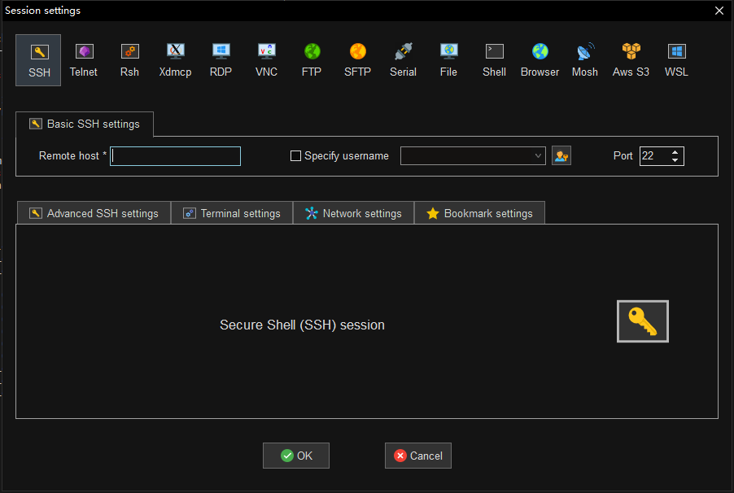
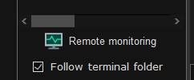
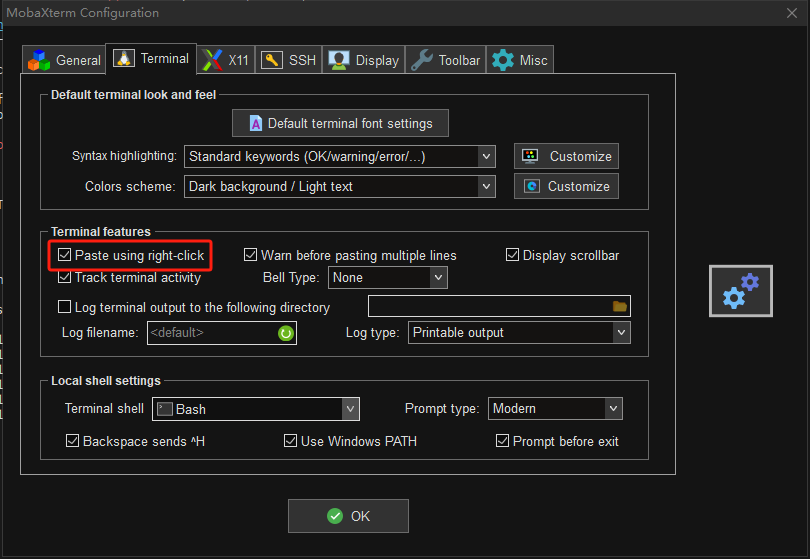

官网下载 [MobaXterm](https://mobaxterm.mobatek.net/download.html)

## 基本使用

### 连接主机

打开软件，右上角点击 `Session` 选择 `SSH`，如下图所示：



- **Remote host**：连接的 IP 地址
- **Specif username**：用户名
- **Port**：连接的端口号

### 上传下载

连接主机后，在软件左侧选择 `xftp` 可以直接上传下载文件。

### 左下角功能

连接主机后，在软件左下角有两个选项 `Remote monitoring` 和 `Follow terminal folder`，如下图所示：



- **Remote monitoring**：可以在终端最下面显示连接主机的主机名、CPU、内存等
- **Follow terminal folder**：可以使 Sftp 目录与会话窗口所在目录同步

### 默认复制

在会话窗口中鼠标选中的内容，默认已经复制到粘贴板中，可以使用 <kbd>Ctrl</kbd> + <kbd>V</kbd> 复制到其他地方

### 多个窗口执行相同命令

连接多台主机，在工具栏中选择 `MultiExec` 选项，会话窗口变成多个窗口，并在其中一个会话窗口中输入命令，其他窗口也会输入相同命令。

如果想让某台主机不自动输入，在会话窗口中勾选 `exclude <localhost> from MultiExec mode` 选项。

点击右上角 `Exit multi-execution mode` 退出。

## 常用设置

### 设置字体大小

- **方法一**：工具栏依次点击 `Settings -> Configuration -> Terminal`，选择 `Default terminal font settings`，设置 `Size`
    - MobaXterm 低版本 `Size` 选项在 `Settings -> Configuration -> Terminal` 页面中

- **方法二**：使用 <kbd>Ctrl</kbd> + <kbd>鼠标滚轮</kbd>

### 打开右键粘贴功能

工具栏依次点击 `Settings -> Configuration -> Terminal`，勾选 `Paste using right-click`，如下图所示：



### SSH 保持连接

SSH 远程连接会在无操作时自动断开。

工具栏依次点击 `Settings -> Configuration -> SSH`，勾选 `SSH keepalive` 避免 SSH 断开连接。

### 保存密码

工具栏依次点击 `Settings -> Configuration -> General`，选择 `MobaXterm passwords management`。

这个页面可以管理密码，还可以设置保存会话密码。

- **Always**：连接终端时，总是保存密码，不进行提示
- **Never**：连接终端时，总是不保存密码，不进行提示
- **Ask**：连接终端时，提示是否保存密码

### 创建目录分类管理

当连接的终端较多时，可以创建目录，分类管理终端。

右键点击 `User sessions`，选择 `New folder` 创建目录。

创建目录后，可以 **右键点击目录**，进行新建终端；也可以将终端 **通过鼠标直接拖** 到指定目录下。

## 解除最多保存 14 个会话的限制

最多只能保存 14 个会话，再新增会话时不会保存，导致后续远程连接每次必须重新输入会话信息。

**解决方法如下：**

1. **克隆 [GitHub 仓库](https://github.com/flygon2018/MobaXterm-keygen)**

    ```shell
    git clone https://github.com/flygon2018/MobaXterm-keygen.git
    ```

2. **查看 MobaXterm 版本**

    例如 MobaXterm 版本为：`v22.0`

3. **查看当前计算机的用户名**

    例如当前计算机的用户名为：`Administrator`

4. **生成 Custom.mxtpro 文件**

    在 Windows 中按 <kbd>Win</kbd> + <kbd>R</kbd> 键，在运行中输入 `cmd` 打开终端控制器，并进入到刚克隆的 `MobaXterm-keygen` 目录中，执行以下命令：

    ```python
    python MobaXterm-Keygen.py Administrator 22.0
    ```

    执行完成后，会在当前目录下生成 `Custom.mxtpro` 文件。

    ::: tip
    只支持 Python2.x，不支持 Python3.x。命令最后的版本 **不加 v**
    :::

5. **将 Custom.mxtpro 文件复制到 MobaXterm 安装目录下**

    找到 MobaXterm 安装目录。可以通过右键桌面 MobaXterm 图标，选择 **打开文件所在的位置。**

    将 `Custom.mxtpro` 文件，复制到 MobaXterm 安装目录下。

6. **重启 MobaXterm**

## 文件传输报错没有权限

文件传输报错 **没有权限**，是因为要上传的目录不是当前 SSH 连接的用户，目录默认只有创建这个目录的用户才有写入的权限，所以报错没有权限。

**解决方法：**

- **方法一**：使用 `chomd` 修改目录权限，使其他用户也有写入的权限
- **方法二**：将文件传输到当前 SSH 连接的用户主目录下，再将文件通过 `mv` 移动到指定目录中

## 快捷键

|  功能描述  |  快捷键  |
|  :----  |  :----  |
|  切换全屏模式  |  <kbd>F11</kbd>  |
|  清除画面  |  <kbd>Ctrl</kbd> + <kbd>L</kbd>  |
|  显示/隐藏侧边栏  |  <kbd>Ctrl</kbd> + <kbd>Shift</kbd> + <kbd>B</kbd>  |
|  开始新的远程会话  |  <kbd>Ctrl</kbd> + <kbd>Shift</kbd> + <kbd>N</kbd>  |
|  向前切换会话窗口  |  <kbd>Ctrl</kbd> + <kbd>RightArrow</kbd>  |
|  向后切换会话窗口  |  <kbd>Ctrl</kbd> + <kbd>LeftArrow</kbd>  |
|  在当前会话窗口中查找  |  <kbd>Ctrl</kbd> + <kbd>Shift</kbd> + <kbd>F</kbd>  |
