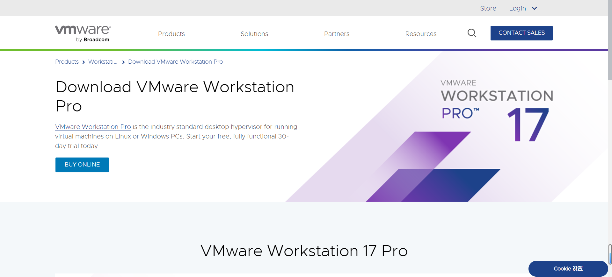
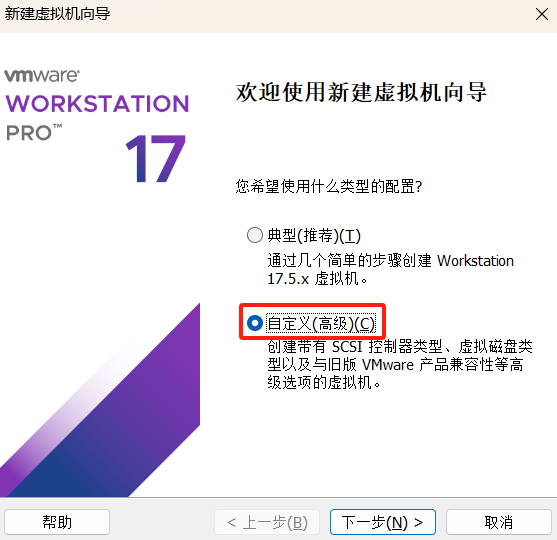
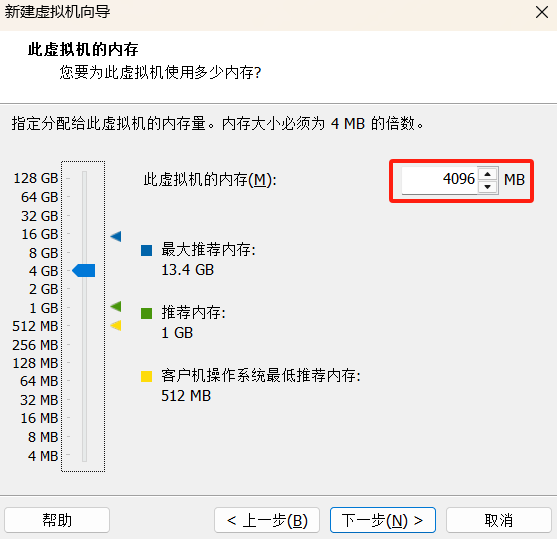
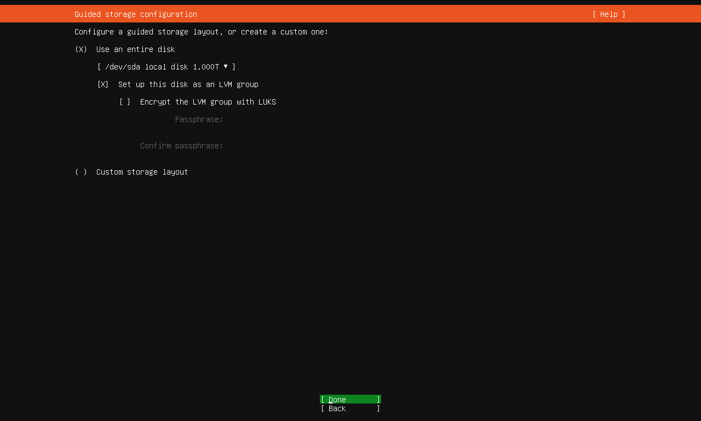

## 下载安装 VMware Workstation Pro

::: info
点击 [此链接](https://www.vmware.com/go/getworkstation-win) 即可从 VMware 官网下载 VMware Workstation Pro 最新版。
:::

### 下载安装最新版本

打开 [VMware 官网](https://www.vmware.com/) 页面。

点击 *Products -> [Workstation Pro](https://www.vmware.com/products/workstation-pro.html)*，进入 VMware Workstation Pro 页面。

VMware Workstation Pro 页面。

在下面找到 *Try Workstation 17 Pro*，点击 [DOWNLOAD TRIAL](https://www.vmware.com/products/workstation-pro/workstation-pro-evaluation.html) 进入试用版页面：

试用版下载页面。

在试用版下载页面，找到 *Workstation 17 Pro for Windows* 点击 [DOWNLOAD NOW](https://www.vmware.com/go/getworkstation-win) 开始下载。

下载完成后，双击 `VMware-workstation-full-17.5.1-23298084.exe` 软件包开始安装，并点击 *下一步*。

接受许可条款，并点击 *下一步*。

自定义安装，更改 *安装位置*，选勾 *增强型键盘驱动*，并点击 *下一步*。

增强型键盘驱动是一种软件，用于改善和扩展键盘的功能和性能。

用户体验设置选勾，并点击 *下一步*。

创建桌面快捷方式，并点击 *下一步*。

点击 *安装* 开始安装。

点击 *完成* 安装结束。安装后需要重启计算机。

::: tip
安装后只有 30 天试用期，30 天过后无法使用，永久使用需要输入许可证密钥。
:::

### 下载旧版本

到 [VMware Workstation Pro](https://www.vmware.com/products/workstation-pro.html) 页面。

点击 *Resources -> [Documentation and Release Notes](https://docs.vmware.com/cn/VMware-Workstation-Pro/index.html)* 进入资源文档页面。

点击 *[产品下载](https://customerconnect.vmware.com/cn/downloads/info/slug/desktop_end_user_computing/vmware_workstation_pro/17_0)* 进入产品资源页面。如果页面显示英语，可以修改语言。

选择要安装的大版本，点击 *[转至下载](https://customerconnect.vmware.com/cn/downloads/details?downloadGroup=WKST-1751-WIN&productId=1376&rPId=116859)*，进入下载产品页面。

点击 *立即下载*。需要先注册登录后才可以下载。

VMware 注册页面。

## 配置 VMware Workstation Pro

### 修改虚拟网络编辑器

打开 VMware Workstation Pro 软件，点击 *编辑 -> 虚拟网络编辑器*，点击 *更改设置* 进行修改。

编辑虚拟网络。可以添加网络、修改子网 IP、子网掩码、DHCP 等信息。

默认有以下三个模式：

- **VMnet0 桥接模式**：宿主机网卡和虚拟机网卡连接在同一个虚拟交换机上。虚拟机 IP 地址需要与主机在同一个网段, 如果虚拟主机要联网, 则要求网关与 DNS 要与主机的网卡保持一致。
- **VMnet1 主机模式**：宿主机网卡和虚拟机网卡通过两个虚拟交换机进行通信。虚拟机和宿主机之间可以实现通信，但是虚拟机不能通过宿主机访问互联网。也可用通过将宿主机网卡共享给虚拟网卡 VMWare Network Adapter VMNet1 来使得虚拟机进行联网。
- **VMnet8 NAT 模式**：宿主机网卡和虚拟机网卡通过两个虚拟 NET 设备进行通信。虚拟机既可以和宿主机通信，也可以访问互联网。

## 安装 Linux 虚拟机

### 安装 CentOS 系统

安装 Centos-Stream-8 的操作系统。选择 *创建新的虚拟机*。

选择 *自定义* 配置虚拟机，并点击 *下一步*。

选择虚拟机硬件兼容，根据虚拟机版本选择，并点击 *下一步*。

选择安装的虚拟机镜像文件（ISO），并点击 *下一步*。下面提示是因为还没选择操作系统，下一步选择不用担心。

选择要安装的操作系统，并点击 *下一步*。

创建虚拟机名称及安装位置，并点击 *下一步*。

配置虚拟机 CPU 处理器核数，并点击 *下一步*。

配置虚拟机内存，并点击 *下一步*。

配置虚拟机连接网络类型，并点击 *下一步*。

选择 I/O 控制类型，并点击 *下一步*。

选择磁盘类型，并点击 *下一步*。

选择磁盘模式，并点击 *下一步*。

配置磁盘大小，并点击 *下一步*。

配置磁盘文件名称，并点击 *下一步*。

点击 *完成* 完成配置。

点击 *开启虚拟机*。

鼠标点击屏幕进入虚拟机中，按 <kbd>Enter</kbd> 键检查 ISO 文件并开始安装虚拟机。

按 <kbd>Ctrl</kbd> + <kbd>Alt</kbd> 退出虚拟机到宿主机中，鼠标显示在屏幕中。

选择安装过程中使用语言，并点击 *continue*。

安装信息。

配置 *Network & Host Name*。修改主机名，点击 *configure*。

配置静态 IPv4 地址、子网掩码、网关、DNS 地址（多个 DNS 地址之间用 <kbd>,</kbd> 号隔开），并点击 *Save*，右上角开启网络，并点击 *Done*。

配置 *Time & Date*，并点击 *Done*。

配置 *Installation Destination*，并点击 *Done*。选择自动分区，也可以选择自己分区。

配置 *Installation Source*，并点击 *Done*。输入阿里源地址：
`https://mirrors.aliyun.com/centos/8-stream/BaseOS/x86_64/os/`

配置 *Software Selection*，并点击 *Done*。

配置 *Root Passowrd*，并点击 *Done*。

配置 *User Creation*，并点击 *Done*。

配置完成点击 *Begin Installation*。

安装完成后点击 *Reboot System* 重启系统。

### 安装 Ubuntu 系统

安装 Ubuntu 18.04.6 的操作系统。选择 *创建新的虚拟机*。

选择 *自定义* 配置虚拟机，并点击 *下一步*。

选择虚拟机硬件兼容，根据虚拟机版本选择，并点击 *下一步*。

选择安装的虚拟机镜像文件（ISO），并点击 *下一步*。

配置安装信息，并点击 *下一步*。

创建虚拟机名称及安装位置，并点击 *下一步*。

配置虚拟机 CPU 处理器核数，并点击 *下一步*。

配置虚拟机内存，并点击 *下一步*。

配置虚拟机连接网络类型，并点击 *下一步*。

选择 I/O 控制类型，并点击 *下一步*。

选择磁盘类型，并点击 *下一步*。

选择磁盘模式，并点击 *下一步*。

配置磁盘大小，并点击 *下一步*。

配置磁盘文件名称，并点击 *下一步*。

点击 *完成* 完成配置，自动开启虚拟机。

选择语言，按 <kbd>Enter</kbd> 键确认。

按 <kbd>Ctrl</kbd> + <kbd>Alt</kbd> 组合键退出虚拟机到宿主机中，鼠标显示在屏幕中。按 <kbd>Tab</kbd> 键切换选项，按 <kbd>Enter</kbd> 键确认。

选择正确的键盘布局，选择 *Done* 按 <kbd>Enter</kbd> 键确认。

配置网络，设置 IPv4 地址、子网地址、网关、DNS 地址，选择 *Done* 按 <kbd>Enter</kbd> 键确认。

配置代理地址，选择 *Done* 按 <kbd>Enter</kbd> 键确认。

配置软件源为阿里源地址 `https://mirrors.aliyun.com/ubuntu`，选择 *Done* 按 <kbd>Enter</kbd> 键确认。

是否更新 Ubuntu 版本，选择不更新继续，选择 *Done* 按 <kbd>Enter</kbd> 键确认。

配置硬盘分配，默认使用整块硬盘，选择 *Done* 按 <kbd>Enter</kbd> 键确认。

配置硬盘分区，使用默认分区，选择 *Done* 按 <kbd>Enter</kbd> 键确认。

格式化硬盘，选择 *Contaion* 按 <kbd>Enter</kbd> 键确认。

配置用户信息，用户名、主机名、密码，选择 *Done* 按 <kbd>Enter</kbd> 键确认。

安装 SSH 服务，选择 *Done* 按 <kbd>Enter</kbd> 键确认。按 *空格* 是否选择该选项。

选择需要安装的服务，选择 *Done* 按 <kbd>Enter</kbd> 键确认。

等待系统安装重启。

