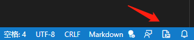

## VS Code 教程

**[VS Code（Visual Studio Code）](https://code.visualstudio.com/)** 是一个免费的、开源的 **跨平台编辑器**。有 **稳定版** 和 **体验版** 两个版本，根据自己的需求自行下载。

[VS Code 教程](https://geek-docs.com/vscode/vscode-tutorials/what-is-vscode.html)

### 垂直标尺

如果您的项目中有规定说每一行代码不得超过多少个字符，比如：`120` 个字符，那么您就可以将标尺设置为 `120`。

在设置中搜索 `editor.rulers`，修改 `settings.json` 中的 `"editor.rulers"` 字段，即 `editor.rulers: [120]`。这样的话编辑器就会在第 `120` 个字符所在的位置处画出这样一条垂直的竖线，所以您一眼就可以看出自己的代码是否达标。

### 引用跳转

`VS Code` 定义和实现跳转。比如：看到某个函数的调用，想要知道这个函数的接口定义是什么样的，它的实现细节是什么样的，这时需要 **直接跳转到定义和实现的位置。**

`VS Code` 引用跳转。很多时候，除了要知道一个函数或者类的定义和实现以外，可能还希望知道它们被谁引用了，以及在哪里被引用了。这时只需要将光标移动到函数或者类上面，然后按下 <kbd>Shift</kbd> + <kbd>F12</kbd>，`VS Code` 就会打开一个 **引用列表** 和一个 **内嵌的编辑器** 。在这个引用列表里，选中某个引用，VS Code 就会把这个引用附近的代码展示在这个内嵌的编辑器里。

1. 在调用函数的位置

    - 使用 <kbd>F12</kbd> 或 <kbd>Ctrl</kbd> + <kbd>鼠标左键</kbd> 可以直接跳转到函数定义的位置
    - 使用 <kbd>Shift</kbd> + <kbd>F12</kbd> 可以打开函数引用预览

2. 在定义函数的位置

    - 使用 <kbd>F12</kbd> 或 <kbd>Ctrl</kbd> + <kbd>鼠标左键</kbd> 或 <kbd>Shift</kbd> + <kbd>F12</kbd> 可以打开函数引用预览

### 多文件夹工作区

首先，在 `VS Code` 中打开一个文件夹，此时 `VS Code` 处于一个单文件夹的状态。然后调出命令面板，搜索 “将文件夹添加到工作区” （add folder to workspace）并执行，或者使用菜单，“文件 —> 将文件夹添加到工作区”，之后，选择想要在当前窗口打开的文件夹。

此时在资源管理器里的标题栏里，您能看到 “无标题 （工作区）” 这样的文字，这说明当前的工作区已经有多个文件夹了，只是现在您还没有保存这个多文件工作区，也没有给它指定一个名字。

要保存这个工作区，接下来您可以调出命令面板，搜索 “将工作区另存为” （save workspace as），`VS Code` 就会为这个工作区创建一个文件，这个文件的后缀名是 `code-workspace`。比如：给这个工作区取名为 `sample`，然后指定在 `Code` 中这个文件夹下保存。这样操作后，`VS Code` 就会在 **Code 文件夹** 下创建一个 `sample.code-workspace` 文件。

### 工作区切换

**切换窗口：**

如果您同时打开了多个窗口，可以调出命令面板，搜索 “切换窗口（Switch Window）”，然后选择您要跳转的那个文件夹中去。**建议** 给这个命令指定一个快捷键，这样就能在窗口之间一键切换了。

**快速切换窗口：**

如果您同一时间只会关注一个项目，那您也大可不必使用多个窗口。如果想在另外一个项目上工作时，按下 <kbd>Ctrl</kbd> + <kbd>R</kbd>（或者使用命令面板，搜索 “打开最近的文件”），此时就能够看到最近操作过的文件夹并按下回车键进行切换了。

**切换文件夹：**

当您按下 <kbd>Ctrl</kbd> + <kbd>R</kbd> 调出最近打开的文件夹的列表后，也能够按下 <kbd>Ctrl</kbd> + <kbd>Enter</kbd>，将它在一个新的窗口中打开。

### 终端快捷键

- <kbd>Ctrl</kbd> + <kbd>LeftArrow</kbd> 将光标向前移动一个单词
- <kbd>Ctrl</kbd> + <kbd>RightArrow</kbd> 将光标向后移动一个单词
- <kbd>Ctrl</kbd> + <kbd>C</kbd> 复制
- <kbd>Ctrl</kbd> + <kbd>V</kbd> 粘贴
- <kbd>Ctrl</kbd> + <kbd>鼠标左键</kbd> 打开选中的文件

## 常用快捷键

|  快捷键  |  功能  |
| :---- | :---- |
|  <kbd>Ctrl</kbd> + <kbd>C</kbd>  |  复制光标所在的整行  |
|  <kbd>Ctrl</kbd> + <kbd>V</kbd>  |  粘贴到光标所在的上一行  |
|  <kbd>Shift</kbd> + <kbd>Alt</kbd> + <kbd>F</kbd>  |  格式化文档  |
|  <kbd>Shift</kbd> + <kbd>Alt</kbd> + <kbd>F</kbd>  |  格式化文档  |
|  <kbd>Alt</kbd> + <kbd>UpArrow</kbd>  |  上移光标所在的单元格  |
|  <kbd>Alt</kbd> + <kbd>DownArrow</kbd>  |  下移光标所在的单元格  |
|  <kbd>Shift</kbd> + <kbd>Alt</kbd> + <kbd>UpArrow</kbd>  |  向上复制光标所在的单元格  |
|  <kbd>Shift</kbd> + <kbd>Alt</kbd> + <kbd>DownArrow</kbd>  |  向下复制光标所在的单元格  |
|  <kbd>Ctrl</kbd> + <kbd>\\</kbd>  |  拆分编辑器  |
|  <kbd>Ctrl</kbd> + <kbd>PgUp</kbd>  |  打开上一个编辑器  |
|  <kbd>Ctrl</kbd> + <kbd>PgDn</kbd>  |  打开下一个编辑器  |
|  <kbd>Ctrl</kbd> + <kbd>W</kbd>  |  关闭编辑器  |
|  <kbd>Ctrl</kbd> + <kbd>K</kbd> <kbd>Ctrl</kbd> + <kbd>W</kbd>  |  关闭所有编辑器  |
|  <kbd>Ctrl</kbd> + <kbd>Alt</kbd> + <kbd>LeftArrow</kbd>  |  将编辑器移动到上一组  |
|  <kbd>Ctrl</kbd> + <kbd>Alt</kbd> + <kbd>RightArrow</kbd>  |  将编辑器移动到下一组  |
|  <kbd>Ctrl</kbd> + <kbd>0</kbd>  |  将焦点置于主侧栏  |
|  <kbd>Ctrl</kbd> + <kbd>Tab</kbd>  |  快速打开组中上一个最近使用过的编辑器  |
|  <kbd>Ctrl</kbd> + <kbd>\`</kbd>  |  切换终端  |
|  <kbd>Ctrl</kbd> + <kbd>K</kbd> <kbd>Z</kbd>  |  切换禅模式  |
|  <kbd>Ctrl</kbd> + <kbd>Alt</kbd> + <kbd>B</kbd>  |  切换辅助侧边栏可见性  |
|  <kbd>F11</kbd>  |  切换全屏  |
|  <kbd>Ctrl</kbd> + <kbd>B</kbd>  |  切换主侧栏可见性  |
|  <kbd>Alt</kbd> + <kbd>Z</kbd>  |  切换自动换行  |
|  <kbd>Ctrl</kbd> + <kbd>Shift</kbd> + <kbd>E</kbd>  |  显示资源管理器  |
|  <kbd>Ctrl</kbd> + <kbd>=</kbd>  |  字体缩小  |
|  <kbd>Ctrl</kbd> + <kbd>-</kbd>  |  字体放大  |
|  <kbd>Ctrl</kbd> + <kbd>F</kbd>  |  查找  |
|  <kbd>F3</kbd>  |  查找下一个  |
|  <kbd>Shift</kbd> + <kbd>F3</kbd>  |  查找上一个  |
|  <kbd>Ctrl</kbd> + <kbd>Z</kbd>  |  撤销  |
|  <kbd>Ctrl</kbd> + <kbd>K</kbd> <kbd>M</kbd>  |  更改文本语言  |
|  <kbd>Shift</kbd> + <kbd>Alt</kbd> + <kbd>0</kbd>  |  切换垂直/水平编辑器布局  |
|  <kbd>Shift</kbd> + <kbd>Alt</kbd> + <kbd>A</kbd>  |  切换块注释  |
|  <kbd>Ctrl</kbd> + <kbd>/</kbd>  |  切换行注释  |
|  <kbd>Ctrl</kbd> + <kbd>Shift</kbd> + <kbd>K</kbd>  |  删除行  |
|  <kbd>Ctrl</kbd> + <kbd>H</kbd>  |  替换  |
|  <kbd>Ctrl</kbd> + <kbd>K</kbd> + <kbd>C</kbd>  |  比较活动文件与剪贴板  |
|  <kbd>Ctrl</kbd> + <kbd>Alt</kbd> + <kbd>UpArrow</kbd>  |  在上面添加光标  |
|  <kbd>Ctrl</kbd> + <kbd>Alt</kbd> + <kbd>Downrrow</kbd>  |  在下面添加光标  |
|  <kbd>Ctrl</kbd> + <kbd>LeftArrow</kbd>  |  光标移动到单词左边  |
|  <kbd>Ctrl</kbd> + <kbd>RightArrow</kbd>  |  光标移动到单词右边  |
|  <kbd>Shift</kbd> + <kbd>LeftArrow</kbd>  |  光标向左选择  |
|  <kbd>Shift</kbd> + <kbd>RightArrow</kbd>  |  光标向右选择  |
|  <kbd>Ctrl</kbd> + <kbd>Shift</kbd> + <kbd>LeftArrow</kbd>  |  光标单词向左选择  |
|  <kbd>Ctrl</kbd> + <kbd>Shift</kbd> + <kbd>RightArrow</kbd>  |  光标单词向右选择  |
|  <kbd>Ctrl</kbd> + <kbd>O</kbd>  |  打开文件  |
|  <kbd>Ctrl</kbd> + <kbd>K</kbd> <kbd>Ctrl</kbd> + <kbd>O</kbd>  |  打开文件夹  |
|  <kbd>Shift</kbd> + <kbd>Alt</kbd> + <kbd>C</kbd>  |  复制活动文件的路径  |
|  <kbd>Ctrl</kbd> + <kbd>Shift</kbd> + <kbd>P</kbd>  |  显示所有命令  |
|  <kbd>Ctrl</kbd> + <kbd>Shift</kbd> + <kbd>N</kbd>  |  新建窗口  |
|  <kbd>Ctrl</kbd> + <kbd>\[</kbd>  |  光标所在行减少缩进  |
|  <kbd>Ctrl</kbd> + <kbd>\]</kbd>  |  光标所在行缩进  |
|  <kbd>Ctrl</kbd> + <kbd>G</kbd>  |  转到行/列  |

## VS Code 工具插件

### Chinese (Simplified)

[Chinese (Simplified)](https://marketplace.visualstudio.com/items?itemName=MS-CEINTL.vscode-language-pack-zh-hans) 用于更改 VS Code 本地语言为中文界面。

### Makdown Preview Github Styling

[Makdown Preview Github Styling](https://marketplace.visualstudio.com/items?itemName=bierner.markdown-preview-github-styles) 用于更改 VS Code 的内置 Markdown 预览以匹配 GitHub 的样式。

### Markdown Preview Enhanced

[Markdown Preview Enhanced](https://marketplace.visualstudio.com/items?itemName=shd101wyy.markdown-preview-enhanced) 用于增强 Markdown 预览，提供许多有用的功能。例如：自动滚动同步、数学排版、mermaid、PlantUML、pandoc、PDF 导出、代码块、演示文稿编写器等。

|  快捷键  |  功能  |
| :----: | :---- |
|  <kbd>ctrl</kbd> + <kbd>k</kbd> <kbd>v</kbd>  |  打开侧面预览  |
|  <kbd>ctrl</kbd> + <kbd>shift</kbd> + <kbd>v</kbd>  |  打开预览  |
|  <kbd>Esc</kbd>  |  切换侧边栏目录  |

### markdown-formatter

[markdown-formatter](https://marketplace.visualstudio.com/items?itemName=mervin.markdown-formatter) 对用户提供了相对统一的格式，还提供了一些代码片段。

### background-cover

[background-cover](https://marketplace.visualstudio.com/items?itemName=manasxx.background-cover) 用于配置 Markdown 背景图。

- 点击底部切换背景图按钮 / Click the bottom toggle background button
- <kbd>ctrl</kbd> + <kbd>shift</kbd> + <kbd>P</kbd> > "backgroundCover - start"
- <kbd>ctrl</kbd> + <kbd>shift</kbd> + <kbd>F7</kbd> > "Random update background and restart"
- VS Code 更新版本时会导致背景图消失，需要手动重新设置

