[VS Code](https://code.visualstudio.com/)（Visual Studio Code）是一个免费的、开源的 **跨平台编辑器**。有 **稳定版** 和 **体验版** 两个版本，根据自己的需求自行下载。

## VS Code 安装

下载版本的时候，有 **用户** 和 **系统** 两个版本：

- **User Installer**：用户安装到当前计算机用户目录下，不需要管理员权限即可运行。如果使用另一个用户登陆计算机将无法使用别人安装的 VS Code。这是默认下载的版本
- **System Installer**：系统安装到系统目录下，需要管理员权限才可运行。系统中任何用户都可以使用。建议使用此版本

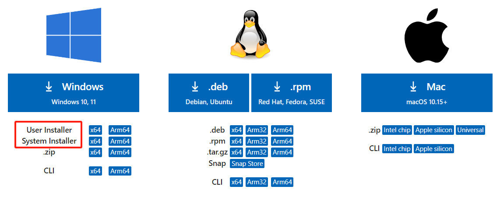

下载完成后，双击 `VSCodeSetup-x64-1.88.1.exe` 软件包开始安装，接受许可条款，并点击 *下一步*。

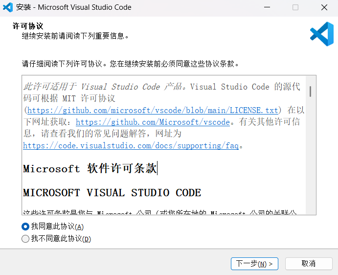

自定义安装，更改 *安装位置*，并点击 *下一步*。

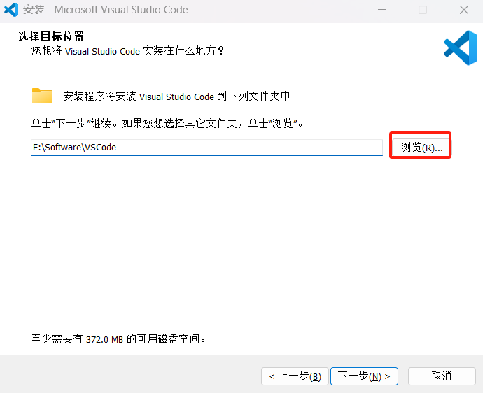

在开始菜单文件夹中存放快捷方式，并点击 *下一步*。

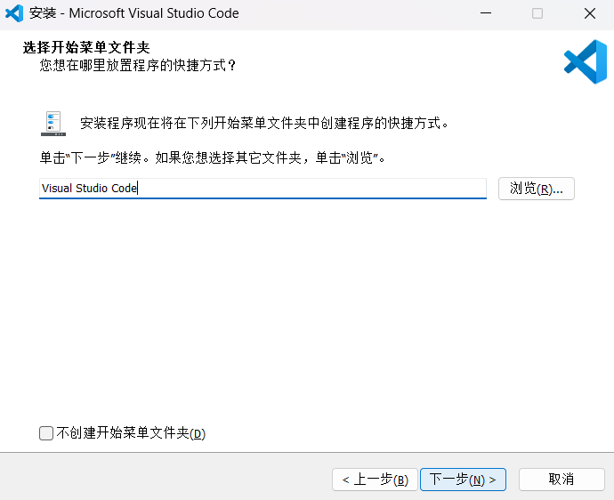

选择附加任务，并点击 *下一步*。

- **将 “通过 Code 打开” 操作添加到 Windows 资源管理器文件上下文菜单**：对文件点击鼠标右键，选择使用 VScode 打开
- **将 “通过 Code 打开” 操作添加到 Windows 资源管理器目录上下文菜单**：对目录点击鼠标右键，选择使用 VScode 打开
- **将 Code 注册为受支持的文件类型的编辑器**：让 VScode 支持的代码文件（`txt`、`py`）全部变成 VScode 默认打开，文件图标也会随之更改
- **添加到 PATH（重启后生效）**：添加到系统 PATH 变量中

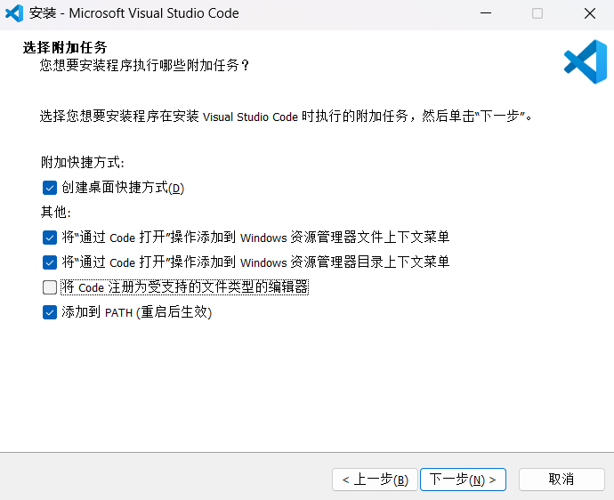

点击 *安装*，开始安装。

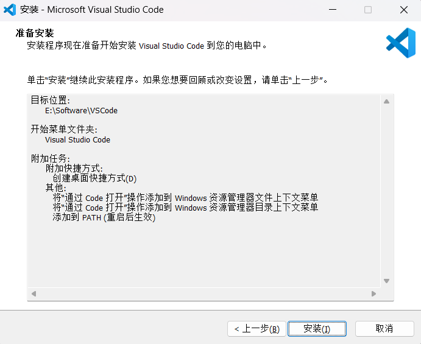

点击 *完成*，安装完成。

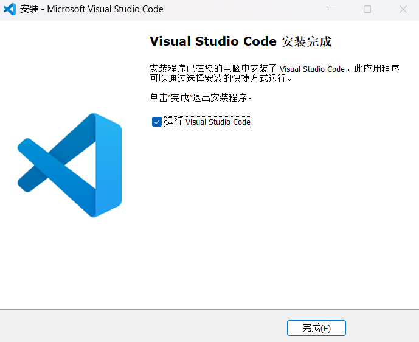

## VS Code 教程

[VS Code 教程](https://code.visualstudio.com/docs)

### 垂直标尺

如果您的项目中有规定说每一行代码不得超过多少个字符，比如：`120` 个字符，那么您就可以将标尺设置为 `120`。

在设置中搜索 `editor.rulers`，修改 `settings.json` 中的 `"editor.rulers"` 字段，即 `editor.rulers: [120]`。这样的话编辑器就会在第 `120` 个字符所在的位置处画出这样一条垂直的竖线，所以您一眼就可以看出自己的代码是否达标。

### 引用跳转

`VS Code` 定义和实现跳转。比如：看到某个函数的调用，想要知道这个函数的接口定义是什么样的，它的实现细节是什么样的，这时需要 **直接跳转到定义和实现的位置。**

`VS Code` 引用跳转。很多时候，除了要知道一个函数或者类的定义和实现以外，可能还希望知道它们被谁引用了，以及在哪里被引用了。这时只需要将光标移动到函数或者类上面，然后按下 <kbd>Shift</kbd> + <kbd>F12</kbd>，`VS Code` 就会打开一个 **引用列表** 和一个 **内嵌的编辑器**。在这个引用列表里，选中某个引用，VS Code 就会把这个引用附近的代码展示在这个内嵌的编辑器里。

1. 在调用函数的位置

    - 使用 <kbd>F12</kbd> 或 <kbd>Ctrl</kbd> + <kbd>鼠标左键</kbd> 可以直接跳转到函数定义的位置
    - 使用 <kbd>Shift</kbd> + <kbd>F12</kbd> 可以打开函数引用预览

2. 在定义函数的位置

    - 使用 <kbd>F12</kbd> 或 <kbd>Ctrl</kbd> + <kbd>鼠标左键</kbd> 或 <kbd>Shift</kbd> + <kbd>F12</kbd> 可以打开函数引用预览

### 多文件夹工作区

首先，在 `VS Code` 中打开一个文件夹，此时 `VS Code` 处于一个单文件夹的状态。然后调出命令面板，搜索 “将文件夹添加到工作区” （add folder to workspace）并执行，或者使用菜单，“文件 —> 将文件夹添加到工作区”，之后，选择想要在当前窗口打开的文件夹。

此时在资源管理器里的标题栏里，您能看到 “无标题（工作区）” 这样的文字，这说明当前的工作区已经有多个文件夹了，只是现在您还没有保存这个多文件工作区，也没有给它指定一个名字。

要保存这个工作区，接下来您可以调出命令面板，搜索 “将工作区另存为” （save workspace as），`VS Code` 就会为这个工作区创建一个文件，这个文件的后缀名是 `code-workspace`。比如：给这个工作区取名为 `sample`，然后指定在 `Code` 中这个文件夹下保存。这样操作后，`VS Code` 就会在 **Code 文件夹** 下创建一个 `sample.code-workspace` 文件。

### 工作区切换

**切换窗口：**

如果您同时打开了多个窗口，可以调出命令面板，搜索 “切换窗口（Switch Window）”，然后选择您要跳转的那个文件夹中去。**建议** 给这个命令指定一个快捷键，这样就能在窗口之间一键切换了。

**快速切换窗口：**

如果您同一时间只会关注一个项目，那您也大可不必使用多个窗口。如果想在另外一个项目上工作时，按下 <kbd>Ctrl</kbd> + <kbd>R</kbd>（或者使用命令面板，搜索 “打开最近的文件”），此时就能够看到最近操作过的文件夹并按下回车键进行切换了。

**切换文件夹：**

当您按下 <kbd>Ctrl</kbd> + <kbd>R</kbd> 调出最近打开的文件夹的列表后，也能够按下 <kbd>Ctrl</kbd> + <kbd>Enter</kbd>，将它在一个新的窗口中打开。

### 终端快捷键

- <kbd>Ctrl</kbd> + <kbd>LeftArrow</kbd> 将光标向前移动一个单词
- <kbd>Ctrl</kbd> + <kbd>RightArrow</kbd> 将光标向后移动一个单词
- <kbd>Ctrl</kbd> + <kbd>C</kbd> 复制
- <kbd>Ctrl</kbd> + <kbd>V</kbd> 粘贴
- <kbd>Ctrl</kbd> + <kbd>鼠标左键</kbd> 打开选中的文件

## 常用快捷键

|  快捷键  |  功能  |
| :---- | :---- |
|  <kbd>Ctrl</kbd> + <kbd>C</kbd>  |  复制光标所在的整行  |
|  <kbd>Ctrl</kbd> + <kbd>V</kbd>  |  粘贴到光标所在的上一行  |
|  <kbd>Shift</kbd> + <kbd>Alt</kbd> + <kbd>F</kbd>  |  格式化文档  |
|  <kbd>Shift</kbd> + <kbd>Alt</kbd> + <kbd>F</kbd>  |  格式化文档  |
|  <kbd>Alt</kbd> + <kbd>UpArrow</kbd>  |  上移光标所在的单元格  |
|  <kbd>Alt</kbd> + <kbd>DownArrow</kbd>  |  下移光标所在的单元格  |
|  <kbd>Shift</kbd> + <kbd>Alt</kbd> + <kbd>UpArrow</kbd>  |  向上复制光标所在的单元格  |
|  <kbd>Shift</kbd> + <kbd>Alt</kbd> + <kbd>DownArrow</kbd>  |  向下复制光标所在的单元格  |
|  <kbd>Ctrl</kbd> + <kbd>\\</kbd>  |  拆分编辑器  |
|  <kbd>Ctrl</kbd> + <kbd>PgUp</kbd>  |  打开上一个编辑器  |
|  <kbd>Ctrl</kbd> + <kbd>PgDn</kbd>  |  打开下一个编辑器  |
|  <kbd>Ctrl</kbd> + <kbd>W</kbd>  |  关闭编辑器  |
|  <kbd>Ctrl</kbd> + <kbd>K</kbd> <kbd>Ctrl</kbd> + <kbd>W</kbd>  |  关闭所有编辑器  |
|  <kbd>Ctrl</kbd> + <kbd>Alt</kbd> + <kbd>LeftArrow</kbd>  |  将编辑器移动到上一组  |
|  <kbd>Ctrl</kbd> + <kbd>Alt</kbd> + <kbd>RightArrow</kbd>  |  将编辑器移动到下一组  |
|  <kbd>Ctrl</kbd> + <kbd>0</kbd>  |  将焦点置于主侧栏  |
|  <kbd>Ctrl</kbd> + <kbd>Tab</kbd>  |  快速打开组中上一个最近使用过的编辑器  |
|  <kbd>Ctrl</kbd> + <kbd>\`</kbd>  |  切换终端  |
|  <kbd>Ctrl</kbd> + <kbd>K</kbd> <kbd>Z</kbd>  |  切换禅模式  |
|  <kbd>Ctrl</kbd> + <kbd>Alt</kbd> + <kbd>B</kbd>  |  切换辅助侧边栏可见性  |
|  <kbd>F11</kbd>  |  切换全屏  |
|  <kbd>Ctrl</kbd> + <kbd>B</kbd>  |  切换主侧栏可见性  |
|  <kbd>Alt</kbd> + <kbd>Z</kbd>  |  切换自动换行  |
|  <kbd>Ctrl</kbd> + <kbd>Shift</kbd> + <kbd>E</kbd>  |  显示资源管理器  |
|  <kbd>Ctrl</kbd> + <kbd>=</kbd>  |  字体缩小  |
|  <kbd>Ctrl</kbd> + <kbd>-</kbd>  |  字体放大  |
|  <kbd>Ctrl</kbd> + <kbd>F</kbd>  |  查找  |
|  <kbd>F3</kbd>  |  查找下一个  |
|  <kbd>Shift</kbd> + <kbd>F3</kbd>  |  查找上一个  |
|  <kbd>Ctrl</kbd> + <kbd>Z</kbd>  |  撤销  |
|  <kbd>Ctrl</kbd> + <kbd>K</kbd> <kbd>M</kbd>  |  更改文本语言  |
|  <kbd>Shift</kbd> + <kbd>Alt</kbd> + <kbd>0</kbd>  |  切换垂直/水平编辑器布局  |
|  <kbd>Shift</kbd> + <kbd>Alt</kbd> + <kbd>A</kbd>  |  切换块注释  |
|  <kbd>Ctrl</kbd> + <kbd>/</kbd>  |  切换行注释  |
|  <kbd>Ctrl</kbd> + <kbd>Shift</kbd> + <kbd>K</kbd>  |  删除行  |
|  <kbd>Ctrl</kbd> + <kbd>H</kbd>  |  替换  |
|  <kbd>Ctrl</kbd> + <kbd>K</kbd> + <kbd>C</kbd>  |  比较活动文件与剪贴板  |
|  <kbd>Ctrl</kbd> + <kbd>Alt</kbd> + <kbd>UpArrow</kbd>  |  在上面添加光标  |
|  <kbd>Ctrl</kbd> + <kbd>Alt</kbd> + <kbd>Downrrow</kbd>  |  在下面添加光标  |
|  <kbd>Ctrl</kbd> + <kbd>LeftArrow</kbd>  |  光标移动到单词左边  |
|  <kbd>Ctrl</kbd> + <kbd>RightArrow</kbd>  |  光标移动到单词右边  |
|  <kbd>Shift</kbd> + <kbd>LeftArrow</kbd>  |  光标向左选择  |
|  <kbd>Shift</kbd> + <kbd>RightArrow</kbd>  |  光标向右选择  |
|  <kbd>Ctrl</kbd> + <kbd>Shift</kbd> + <kbd>LeftArrow</kbd>  |  光标单词向左选择  |
|  <kbd>Ctrl</kbd> + <kbd>Shift</kbd> + <kbd>RightArrow</kbd>  |  光标单词向右选择  |
|  <kbd>Ctrl</kbd> + <kbd>O</kbd>  |  打开文件  |
|  <kbd>Ctrl</kbd> + <kbd>E</kbd>  |  搜索文件并打开  |
|  <kbd>Ctrl</kbd> + <kbd>K</kbd> <kbd>Ctrl</kbd> + <kbd>O</kbd>  |  打开文件夹  |
|  <kbd>Ctrl</kbd> + <kbd>R</kbd>  |  搜索文件夹并打开  |
|  <kbd>Shift</kbd> + <kbd>Alt</kbd> + <kbd>C</kbd>  |  复制活动文件的路径  |
|  <kbd>Ctrl</kbd> + <kbd>Shift</kbd> + <kbd>P</kbd>  |  显示所有命令  |
|  <kbd>Ctrl</kbd> + <kbd>Shift</kbd> + <kbd>N</kbd>  |  新建窗口  |
|  <kbd>Ctrl</kbd> + <kbd>\[</kbd>  |  光标所在行减少缩进  |
|  <kbd>Ctrl</kbd> + <kbd>\]</kbd>  |  光标所在行缩进  |
|  <kbd>Ctrl</kbd> + <kbd>G</kbd>  |  转到行/列  |

## VS Code 工具插件

### Chinese (Simplified)

[Chinese (Simplified)](https://marketplace.visualstudio.com/items?itemName=MS-CEINTL.vscode-language-pack-zh-hans) 用于更改 VS Code 本地语言为中文界面。

**使用：**

按下 <kbd>Ctrl</kbd> + <kbd>Shift</kbd> + <kbd>P</kbd> 组合键以显示 **命令面板**，然后键入 `display` 以筛选并显示 `Configure Display Language` 命令，按 <kbd>Enter</kbd>。然后会按区域设置显示安装的语言列表，并突出显示当前语言设置，选择另一个 “语言” 以切换 UI 语言。

### Makdown Preview Github Styling

[Makdown Preview Github Styling](https://marketplace.visualstudio.com/items?itemName=bierner.markdown-preview-github-styles) 用于更改 VS Code 的内置 Markdown 预览以匹配 GitHub 的样式。

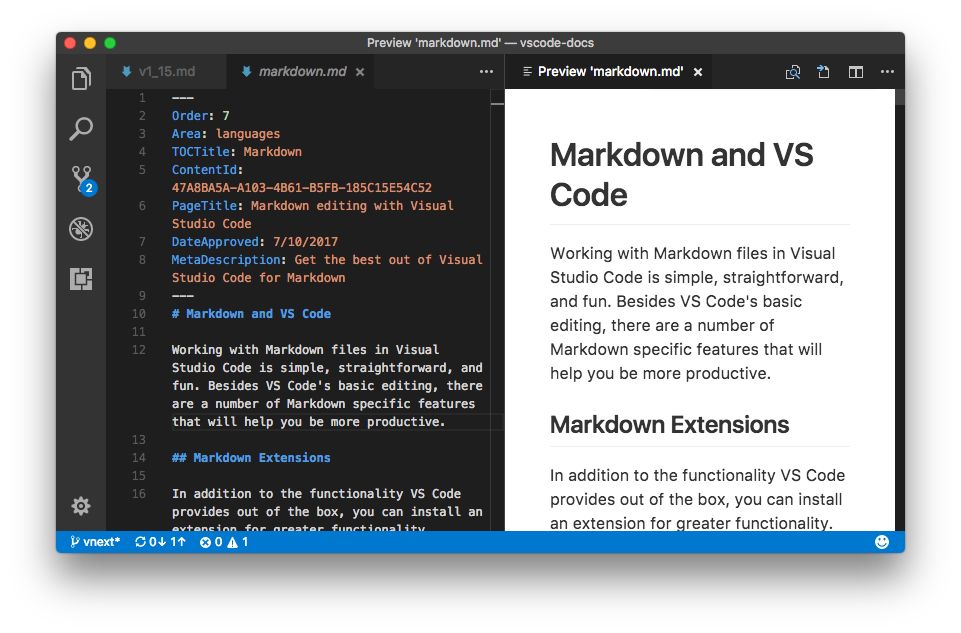

### Markdown Preview Enhanced

[Markdown Preview Enhanced](https://marketplace.visualstudio.com/items?itemName=shd101wyy.markdown-preview-enhanced) 用于增强 Markdown 预览，提供许多有用的功能。例如：自动滚动同步、数学排版、mermaid、PlantUML、pandoc、PDF 导出、代码块、演示文稿编写器等。

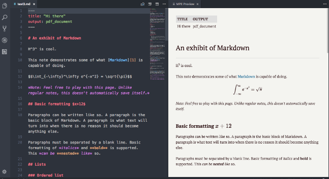

**使用：**

|  快捷键  |  功能  |
| :---- | :---- |
|  <kbd>Ctrl</kbd> + <kbd>K</kbd> <kbd>V</kbd>  |  打开侧面预览  |
|  <kbd>Ctrl</kbd> + <kbd>Shift</kbd> + <kbd>V</kbd>  |  打开预览  |
|  <kbd>Esc</kbd>  |  切换侧边栏目录  |

### Markdown All in One

[Markdown All in One](https://marketplace.visualstudio.com/items?itemName=yzhang.markdown-all-in-one) 编写 Markdown 所需的一切（键盘快捷键、目录、自动预览等）。

**使用：**

|  快捷键  |  功能  |
| :---- | :---- |
|  <kbd>Ctrl</kbd> + <kbd>B</kbd>  |  粗体  |
|  <kbd>Ctrl</kbd> + <kbd>I</kbd>  |  斜体  |
|  <kbd>Ctrl</kbd> + <kbd>Shift</kbd> + <kbd>\]</kbd>  |  切换标题（上层）  |
|  <kbd>Ctrl</kbd> + <kbd>Shift</kbd> + <kbd>\[</kbd>  |  切换标题（下层）  |
|  <kbd>Ctrl</kbd> + <kbd>K</kbd> <kbd>V</kbd>  |  打开侧面预览  |
|  <kbd>Ctrl</kbd> + <kbd>Shift</kbd> + <kbd>V</kbd>  |  打开预览  |

### background-cover

[background-cover](https://marketplace.visualstudio.com/items?itemName=manasxx.background-cover) 用于配置 Markdown 背景图。

**使用：**

- 点击 **底部切换背景图按钮** 或按下 <kbd>Ctrl</kbd> + <kbd>Shift</kbd> + <kbd>P</kbd> 组合键以显示 **命令面板**，然后键入 `backgroundCover - start` 命令，按 <kbd>Enter</kbd>。显示配置界面

    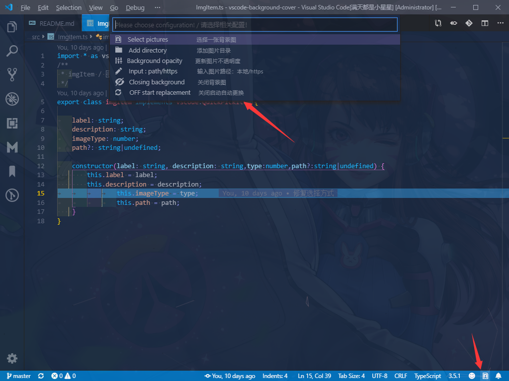

- 按下 <kbd>Ctrl</kbd> + <kbd>Shift</kbd> + <kbd>F7</kbd> 组合键将 **随机更新背景并重启**，需要 **提前添加图片目录**
- VS Code 更新版本时会导致背景图消失，需要手动重新设置

### fanyi

[fanyi](https://marketplace.visualstudio.com/items?itemName=wangrongding.fanyi) 一个划词翻译的 VS Code 插件。

**使用：**

通过选中需要的单词或短句后，用鼠标移到上方即可翻译。

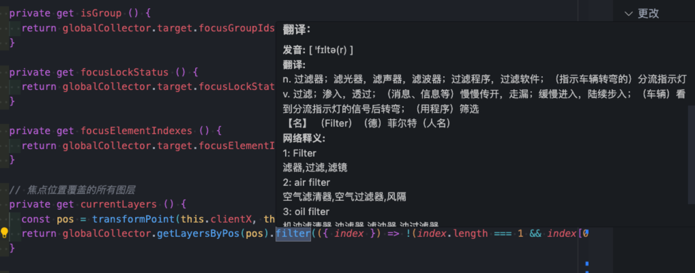

### 会了吧

[会了吧](https://marketplace.visualstudio.com/items?itemName=mqycn.huile8) 用于点击源码文件后，会自动分析所有包含的单词，不在 **已掌握单词列表** 中的单词会自动添加到 **陌生单词** 列表。

**使用：**

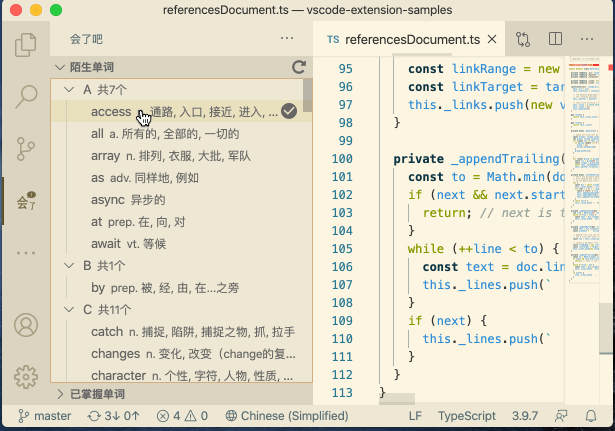

- 单词后面可以显示 **单词解释**
- 鼠标悬停可以显示 **音标和解释**
- 点击单词可以朗读本单词

**禅模式**：点击朗读的单词，会自动添加到当日的 **单词列表**，禅模式会循环朗读列表中的参数。

### Prettier - Code formatter

[Prettier - Code formatter](https://marketplace.visualstudio.com/items?itemName=esbenp.prettier-vscode) 支持多种编程语言，如：JavaScript、TypeScript、CSS、HTML、JSON 等，可以自动格式化代码的缩进、空格、换行等，从而使代码更加整洁和易于阅读。

### GitLens — Git supercharged

[GitLens — Git supercharged](https://marketplace.visualstudio.com/items?itemName=eamodio.gitlens) 增强 Git 在 VS Code 中的功能

### Live Server

[Live Server](https://marketplace.visualstudio.com/items?itemName=ritwickdey.LiveServer) 启动具有静态和动态页面实时重新加载功能的本地开发服务器。


**使用：**

- 打开项目并单击状态栏上的 **Go Live** 来打开/关闭服务器

    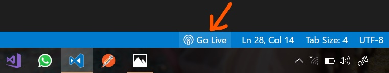

- 按下 <kbd>Ctrl</kbd> + <kbd>Shift</kbd> + <kbd>P</kbd> 组合键以显示 **命令面板**，然后键入 `Live Server: Open With Live Server` 命令，按 <kbd>Enter</kbd>，启动服务器

::: tip
修改完 HTML 文件，需要保存后，服务器页面才会显示修改后的内容
:::

### Code Runner

 运行多种语言的代码片段或代码文件：C, C++, Java, JavaScript, PHP, Python, Perl, Perl 6, Ruby, Go, Lua, Groovy, PowerShell, BAT/CMD, BASH/SH, F# Script, F# (.NET Core), C# Script, C# (.NET Core), VBScript, TypeScript, CoffeeScript, Scala, Swift, Julia, Crystal, OCaml Script, R, AppleScript, Elixir, Visual Basic .NET, Clojure, Haxe, Objective-C, Rust, Racket, Scheme, AutoHotkey, AutoIt, Kotlin, Dart, Free Pascal, Haskell, Nim, D, Lisp, Kit, V, SCSS, Sass, CUDA, Less, Fortran, Ring, Standard ML, Zig, Mojo 和自定义命令。

**使用：**

|  快捷键  |  功能  |
| :---- | :---- |
|  <kbd>Ctrl</kbd> + <kbd>Alt</kbd> + <kbd>N</kbd>  |  运行代码  |
|  <kbd>Ctrl</kbd> + <kbd>Alt</kbd> + <kbd>M</kbd>  |  停止正在运行的代码  |
|  <kbd>Ctrl</kbd> + <kbd>Alt</kbd> + <kbd>J</kbd>  |  选择要运行的语言  |

**配置：**

确保在环境变量中设置了每种语言的执行器 PATH。您还可以添加条目 code-runner.executorMap 来设置执行程序路径。例如：设置 ruby​​、php 和 html 的执行器路径：

```json
{
    "code-runner.executorMap": {
        "javascript": "node",
        "php": "C:\\php\\php.exe",
        "python": "python",
        "perl": "perl",
        "ruby": "C:\\Ruby23-x64\\bin\\ruby.exe",
        "go": "go run",
        "html": "\"C:\\Program Files (x86)\\Google\\Chrome\\Application\\chrome.exe\"",
        "java": "cd $dir && javac $fileName && java $fileNameWithoutExt",
        "c": "cd $dir && gcc $fileName -o $fileNameWithoutExt && $dir$fileNameWithoutExt"
}
```

**支持自定义参数：**

- **$workspaceRoot**：VS Code中打开的文件夹的路径
- **$dir**：正在运行的代码文件的目录
- **$dirWithoutTrailingSlash**：正在运行的代码文件的目录，不带尾部斜杠
- **$fullFileName**：正在运行的代码文件的全名
- **$fileName**：正在运行的代码文件的基本名称，即不带目录的文件
- **$fileNameWithoutExt**：正在运行的代码文件的基本名称，不带扩展名
- **$driveLetter**：正在运行的代码文件的驱动器号（仅限Windows）
- **$pythonPath**：Python解释器的路径（通过Python: Select Interpreter命令设置）
