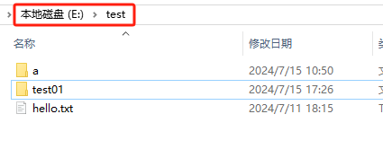
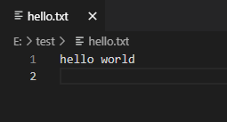
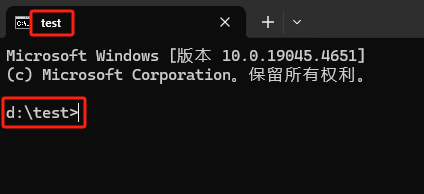

## 描述

`start` 用于启动单独的命令提示符窗口以运行指定的程序或命令，如果参数是目录或文件，则打开该目录或文件。

## 选项

|  选项  |  描述  |
|  :----:  |  :----  |
|  `"title"`  |  指定要在 “命令提示符” 窗口标题栏中显示的标题  |
|  `/d`  |  指定启动目录  |
|  `/?`  |  在命令提示符下显示帮助  |

## 示例

### 打开目录或文件

例如：打开 E 盘根目录下的 `test` 目录。

```cmd
C:\Users\user>start e:\test

C:\Users\user>
```



例如：打开 `E:\test` 目录下的 `hello.txt` 文件。

```cmd
C:\Users\user>start e:\test\hello.txt

C:\Users\user>
```



### 在窗口中打开目录

例如：在其它窗口中打开 E 盘根目录下的 `test` 目录，并修改窗口标题。

```cmd
C:\Users\user>start "test" /d d:\test

C:\Users\user>
```



### 打开应用程序

例如：打开另一个 `cmd.exe` 程序。

```cmd
C:\Users\user>start cmd.exe

C:\Users\user>
```
