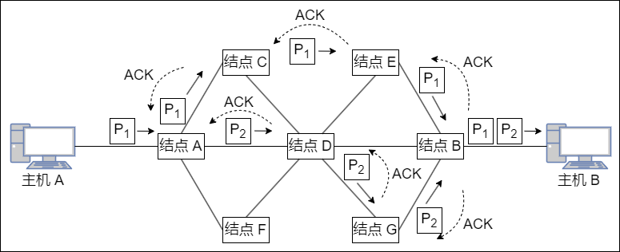
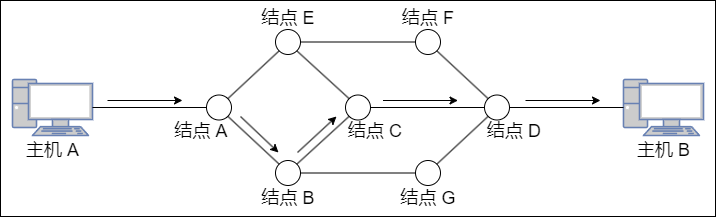
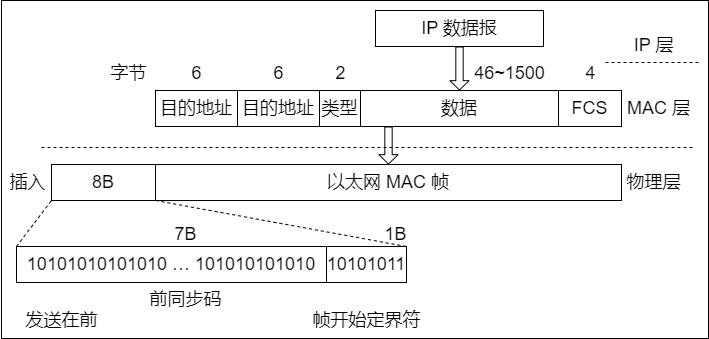
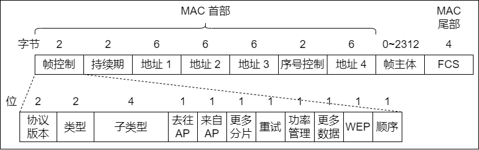
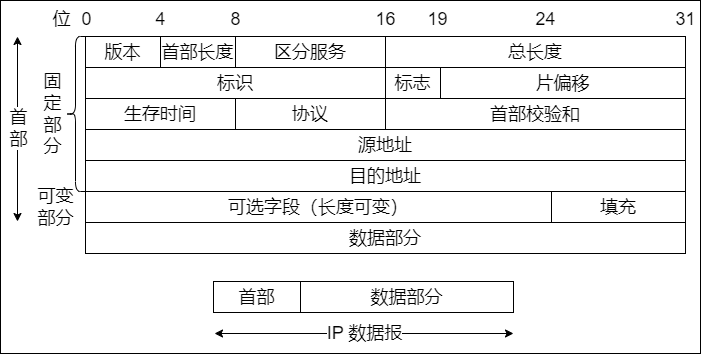
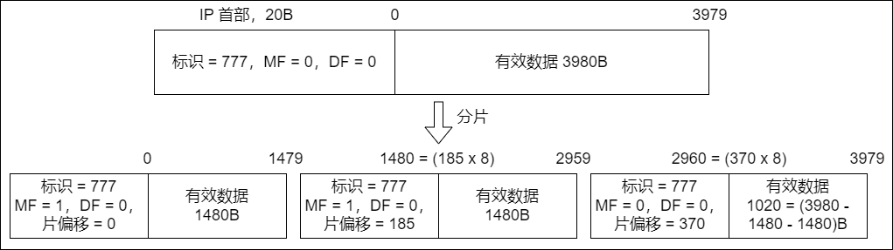
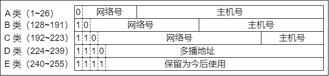
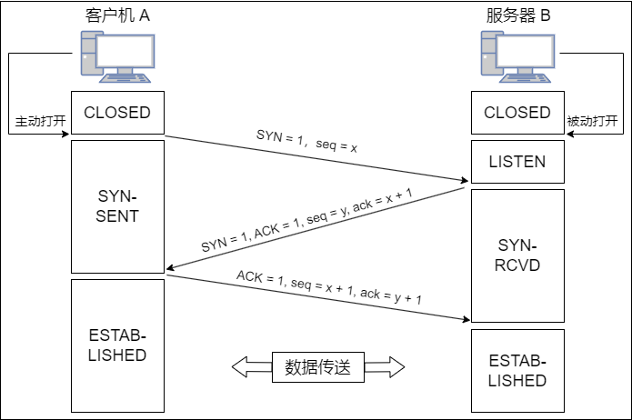
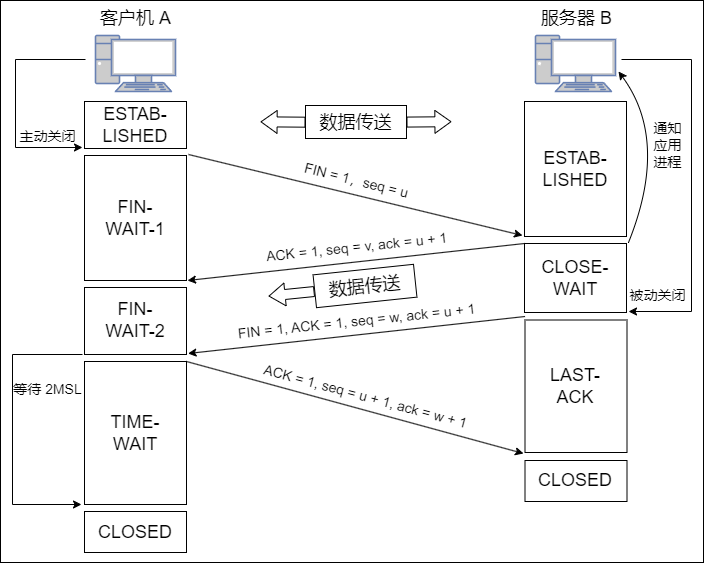

## 计算机网络体系结构

### 计算机网络概述

#### 计算机网络的概念

计算机网络就是一些互连的、自治的计算机系统的集合。

在计算机网络发展的不同阶段，人们对计算机网络给出了不同的定义，这些定义反映了当时网络技术发展的水平。这些定义可分为以下三类：

1. **广义观点**

    只要是能实现远程信息处理的系统或能进一步达到资源共享的系统，都是计算机网络。广义的观点定义了一个计算机通信网络，它在物理结构上具有计算机网络的维形，但资源共享能力弱，是计算机网络发展的低级阶段。

2. **资源共享观点**

    计算机网络是 “以能够相互共享资源的方式互连起来的自治计算机系统的集合”。该定义包含三层含义：
    - 目的——资源共享
    - 组成单元——分布在不同地理位置的多台独立的 “自治计算机”
    - 网络中的计算机必须遵循的统一规则——网络协议。该定义符合目前计算机网络的基本特征

3. **用户透明性观点**

    存在一个能为用户自动管理资源的网络操作系统，它能够调用用户所需要的资源，而整个网络就像一个大的计算机系统一样对用户是透明的。用户使用网络就像使用一台单一的超级计算机，无须了解网络的存在、资源的位置信息。用户透明性观点的定义描述了一个分布式系统，它是网络未来发展追求的目标。

#### 计算机网络的组成

从不同的角度，可以将计算机网络的组成分为如下几类：

1. **组成部分**
   
    **一个完整的计算机网络主要由硬件、软件、协议三大部分组成，缺一不可**。硬件主要由主机（也称端系统）、通信链路（如：双绞线、光纤）、交换设备（如：路由器、交换机等）和通信处理机（如：网卡）等组成。软件主要包括各种实现资源共享的软件和方便用户使用的各种工具软件（如：网络操作系统、邮件收发程序、FTP 程序、聊天程序等）。软件部分多属于应用层。协议是计算机网络的核心，如同交通规则制约汽车驾驶一样，协议规定了网络传输数据时所遵循的规范。

2. **工作方式**
   
    计算机网络（这里主要指 Internet，即因特网）可分为 **边缘部分** 和 **核心部分**。边缘部分由所有连接到因特网上、供用户直接使用的主机组成，用来进行通信（如：传输数据、音频或视频）和资源共享；核心部分由大量的网络和连接这些网络的路由器组成，它为边缘部分提供连通性和交换服务。

3. **功能组成**

    计算机网络由 **通信子网** 和 **资源子网** 组成。通信子网由各种传输介质、通信设备和相应的网络协议组成，它使网络具有数据传输、交换、控制和存储的能力，实现联网计算机之间的数据通信。资源子网是实现资源共享功能的设备及其软件的集合，向网络用户提供共享其他计算机上的硬件资源、软件资源和数据资源的服务。

#### 计算机网络的功能

计算机网络的功能很多，现今的很多应用都与网络有关。**主要有以下五大功能：**

1. **数据通信**

    它是计算机网络最基本和最重要的功能，**用来实现联网计算机之间各种信息的传输**，并将分散在不同地理位置的计算机联系起来，进行统一的调配、控制和管理。例如：文件传输、电子邮件等应用，离开了计算机网络将无法实现。

2. **资源共享**

    资源共享可以是软件共享、数据共享，也可以是硬件共享。它使计算机网络中的资源互通有无、分工协作，从而 **极大地提高硬件资源、软件资源和数据资源的利用率。**

3. **分布式处理**

    当计算机网络中的某个计算机系统负荷过重时，可以将其处理的某个复杂任务分配给网络中的其他计算机系统，从而利用空闲计算机资源以 **提高整个系统的利用率。**

4. **提高可靠性**

    计算机网络中的各台计算机可以通过网络互为替代机。

5. **负裁均衡**

    将工作任务均衡地分配给计算机网络中的各台计算机。

除以上几大主要功能外，计算机网络还可以实现电子化办公与服务、远程教育、娱乐等功能，满足了社会的需求，方便了人们学习、工作和生活，具有巨大的经济效益。

#### 计算机网络的分类

1. **按分布范围分类**

    - **广域网（WAN）**：提供长距离通信，运送主机所发送的数据，其覆盖范围通常是直径为几十千米到几千千米的区域，因而有时也称远程网。广域网是因特网的核心部分。连接广域网的各结点交换机的链路一般都是高速链路，具有较大的通信容量
    - **城域网（MAN）**：城域网的覆盖范围可以跨越几个街区甚至整个城市，覆盖区域的直径范围是 `5~50km`。城域网大多采用以太网技术，因此有时也常并入局域网的范围讨论
    - **局域网（LAN）**：局域网一般用微机或工作站通过高速线路相连，覆盖范围较小，通常是直径为几十米到几千米的区域。局域网在计算机配置的数量上没有太多的限制，少的可以只有两台，多的可达几百台。传统上，局域网使用广播技术，而广域网使用交换技术
    - **个人区域网（PAN）**：个人区域网是指在个人工作的地方将消费电子设备（如：平板电脑、智能手机等）用无线技术连接起来的网络，也常称为无线个人区域网（WPAN），覆盖区域的直径约为 `10m`

    ::: tip
    若中央处理器之间的距离非常近（如：仅 `1m` 的数量级或甚至更小），则一般称为多处理器系统，而不称为计算机网络
    :::

2. **按传输技术分类**

    - **广播式网络**：所有联网计算机都共享一个公共通信信道。当一台计算机利用共享通信信道发送报文分组时，所有其他的计算机都会 “收听” 到这个分组。接收到该分组的计算机将通过检查目的地址来决定是否接收该分组。局域网基本上都采用广播式通信技术，广域网中的无线、卫星通信网络也采用广播式通信技术。

    - **点对点网络**：每条物理线路连接一对计算机。若通信的两台主机之间没有直接连接的线路，则它们之间的分组传输就要通过中间结点进行接收、存储和转发，直至目的结点。

    是否采用分组存储转发与路由选择机制是点对点式网络与广播式网络的重要区别，广域网基本都属于点对点网络。

3. **按拓扑结构分类**

    网络拓扑结构是指由网中结点（路由器、主机等）与通信线路（网线）之间的几何关系（如：总线形、环形）表示的网络结构，主要指通信子网的拓扑结构。

    按网络的拓扑结构，主要分为总线形、星形、环形和网状网络等。星形、总线形和环形网络多用于局域网，网状网络多用于广域网。

    - **总线形网络**：用单根传输线把计算机连接起来。总线形网络的 **优点** 是建网容易、增/减结点方便、节省线路。**缺点** 是重负载时通信效率不高、总线任意一处对故障敏感
    - **星形网络**：每个终端或计算机都以单独的线路与中央设备相连。中央设备早期是计算机，现在一般是交换机或路由器。星形网络 **优点** 是便于集中控制和管理，因为端用户之间的通信必须经过中央设备。**缺点** 是成本高、中央设备对故障敏感
    - **环形网络**：所有计算机接口设备连接成一个环。环形网络最典型的例子是令牌环局域网。环可以是单环，也可以是双环，环中信号是单向传输的
    - **网状网络**：一般情况下，每个结点至少有两条路径与其他结点相连，多用在广域网中。其有规则型和非规则型两种。其 **优点** 是可靠性高，**缺点** 是控制复杂、线路成本高

    以上四种基本的网络拓扑结构可以互连为更复杂的网络。

4. **按使用者分类**

    - **公用网（Public Network）**：指电信公司出资建造的大型网络。“公用” 的意思是指所有愿意按电信公司的规定交纳费用的人都可以使用这种网络，因此也称公众网
    - **专用网（Private Network）**：指某个部门为满足本单位特殊业务的需要而建造的网络。这种网络不向本单位以外的人提供服务。例如：铁路、电力、军队等部门的专用网

5. **按交换技术分类**

    交换技术是指各台主机之间、各通信设备之间或主机与通信设备之间为交换信息所采用的数据格式和交换装置的方式。**按交换技术可将网络分为如下几种：**

    - **电路交换网络**：在源结点和目的结点之间建立一条专用的通路用于传送数据，包括建立连接、传输数据和断开连接三个阶段。最典型的电路交换网是传统电话网络。该类网络的 **主要特点** 是整个报文的比特流连续地从源点直达终点，好像是在一条管道中传送。**优点** 是数据直接传送、时延小。**缺点** 是线路利用率低、不能充分利用线路容量、不便于进行差错控制
    - **报文交换网络**：用户数据加上源地址、目的地址、校验码等辅助信息，然后封装成报文。整个报文传送到相邻结点，全部存储后，再转发给下一个结点，重复这一过程直到到达目的结点。每个报文可以单独选择到达目的结点的路径。报文交换网络也称 *存储-转发网络*，**主要特点** 是整个报文先传送到相邻结点，全部存储后查找转发表，转发到下一个结点。**优点** 是可以较为充分地利用线路容量，可以实现不同链路之间不同数据传输速率的转换，可以实现格式转换，可以实现一对多、多对一的访问，可以实现差错控制。**缺点** 是增大了资源开销（如：辅助信息导致处理时间和存储资源的开销），增加了缓冲时延，需要额外的控制机制来保证多个报文的顺序不乱序，缓冲区难以管理（因为报文的大小不确定，接收方在接收到报文之前不能预知报文的大小）
    - **分组交换网络**：也称包交换网络。其原理是，将数据分成较短的固定长度的数据块，在每个数据块中加上目的地址、源地址等辅助信息组成分组（包），以存储-转发方式传输。其 **主要特点** 是单个分组（它只是整个报文的一部分）传送到相邻结点，存储后查找转发表，转发到下一个结点。除具备报文交换网络的优点外，分组交换网络还具有自身的 **优点**：缓冲易于管理；包的平均时延更小，网络占用的平均缓冲区更少；更易于标准化；更适合应用。现在的主流网络基本上都可视为分组交换网络

6. **按传输介质分类**

    传输介质可分为有线和无线两大类，因此网络可以分为有线网络和无线网络。有线网络又分为双绞线网络、同轴电缆网络等。无线网络又可分为蓝牙、微波、无线电等类型。

#### 计算机网络的标准化工作

计算机网络的标准化对计算机网络的发展和推广起到了极为重要的作用。

因特网的所有标准都以 RFC（Request For Comments）的形式在因特网上发布，但并非每个 RFC 都是因特网标准，**RFC 要上升为因特网的正式标准需经过以下四个阶段：**

- 因特网草案（Internet Draft）。这个阶段还不是 RFC 文档
- 建议标准（Proposed Standard）。从这个阶段开始就成为 RFC 文档
- 草案标准（Draft Standard）
- 因特网标准（Internet Standard）

此外，还有试验的 RFC 和提供信息的 RFC。

在国际上，负责制定、实施相关网络标准的标准化组织众多，主要有如下几个：

- **国际标准化组织（ISO）**：其制定的主要网络标准或规范有 OSI 参考模型、HDLC 等
- **国际电信联盟（ITU）**：其前身为国际电话电报咨询委员会（CCITT），其下属机构 ITU-T 制定了大量有关远程通信的标准
- **国际电气电子工程师协会（IEEE）**：世界上最大的专业技术团体，由计算机和工程学专业人士组成。IEEE 在通信领域最著名的研究成果是 802 标准

#### 计算机网络的性能指标

性能指标从不同方面度量计算机网络的性能。**常用的性能指标如下：**

1. **带宽（Bandwidth）**

    本来表示通信线路允许通过的信号频带范围，单位是赫兹（Hz）。而在计算机网络中，带宽表示网络的通信线路所能传送数据的能力，是数字信道所能传送的 “最高数据传输速率” 的同义语，单位是比特/秒（b/s）。

2. **时延（Delay）**

    指数据（一个报文或分组）从网络（或链路）的一端传送到另一端所需要的总时间，**它由四部分构成**：

    - **发送时延**：结点将分组的所有比特推向（传输）链路所需的时间，即从发送分组的第一个比特算起，到该分组的最后一个比特发送完毕所需的时间，因此也称传输时延。**计算公式为**：*发送时延 = 分组长度 / 信道宽度*
    - **传播时延**：电磁波在信道中传播一定的距离需要花费的时间，即一个比特从链路的一端传播到另一端所需的时间。**计算公式为**：*传播时延 = 信道长度 / 电磁波在信道上的传播速率*
    - **处理时延**：数据在交换结点为存储转发而进行的一些必要的处理所花费的时间。例如：分析分组的首部、从分组中提取数据部分、进行差错检验或查找适当的路由等
    - **排队时延**：分组在进入路由器后要先在输入队列中排队等待处理。路由器确定转发端口后，还要在输出队列中排队等待转发，这就产生了排队时延

    因此，数据在网络中经历的 **总时延就是以上四部分时延之和**：*总时延 = 发送时延 + 传播时延 + 处理时延 + 排队时延*

3. **时延带宽积**

    指发送端发送的第一个比特即将到达终点时，发送端已经发出了多少个比特，因此又称以比特为单位的链路长度，即 *时延带宽积 = 传播时延 × 信道带宽。*

    一个代表链路的圆柱形管道，其长度表示链路的传播时延，横截面积表示链路带宽，则时延带宽积表示该管道可以容纳的比特数量。

4. **往返时延（Round-Trip Time，RTT）**

    指从发送端发出一个短分组，到发送端收到来自接收端的确认（接收端收到数据后立即发送确认），总共经历的时延。在互联网中，往返时延还包括各中间结点的处理时延、排队时延及转发数据时的发送时延。

5. **吞吐量（Throughput）**

    指单位时间内通过某个网络（或信道、接口）的数据量。吞吐量受网络带宽或网络额定速率的限制。

6. **速率（Speed）**

    网络中的速率是指连接到计算机网络上的主机在数字信道上传送数据的速率，也称数据传输速率、数据率或比特率，单位为 b/s（比特/秒）（或 bit/s，有时也写为 bps）。数据率较高时，可用 kb/s（k=103）、Mb/s（M=10^6^）或 Gb/s（G=10^9^）表示。

    在计算机网络中，通常把最高数据传输速率称为带宽。

7. **信道利用率**

    指出某一信道有百分之多少的时间是有数据通过的，即 *信道利用率 = 有数据通过时间 / （有 + 无）数据通过时间。*

### 计算机网络体系结构与参考模型

#### 计算机网络分层结构

两个系统中实体间的通信是一个很复杂的过程，为了降低协议设计和调试过程的复杂性，也为了便于对网络进行研究、实现和维护，促进标准化工作，通常对计算机网络的体系结构以分层的方式进行建模。

**把计算机网络的各层及其协议的集合称为网络的体系结构（Architecture）**。换言之，计算机网络的体系结构就是这个计算机网络及其所应完成的功能的精确定义，它是计算机网络中的层次、各层的协议及层间接口的集合。需要强调的是，这些功能究竟是用何种硬件或软件完成的，则是一个遵循这种体系结构的实现（Implementation）问题。体系结构是抽象的，而实现是具体的，是真正在运行的计算机硬件和软件。

计算机网络的体系结构通常都具有可分层的特性，它将复杂的大系统分成若干较容易实现的层次。**分层的基本原则如下：**

- 每层都实现一种相对独立的功能，降低大系统的复杂度
- 各层之间界面自然清晰，易于理解，相互交流尽可能少
- 各层功能的精确定义独立于具体的实现方法，可以采用最合适的技术来实现
- 保持下层对上层的独立性，上层单向使用下层提供的服务
- 整个分层结构应能促进标准化工作

由于分层后各层之间相对独立，灵活性好，因而分层的体系结构易于更新（替换单个模块），易于调试，易于交流，易于抽象，易于标准化。但层次越多，有些功能在不同层中难免重复出现，产生额外的开销，导致整体运行效率越低。层次越少，就会使每层的协议太复杂。因此，在分层时应考虑层次的清晰程度与运行效率间的折中、层次数量的折中。

依据一定的规则，将分层后的网络从低层到高层依次称为第 1 层、第 2 层 …… 第 n 层，通常还为每层取一个特定的名称，如：第 1 层的名称为物理层。

在计算机网络的分层结构中，第 n 层中的活动元素通常称为第 n 层实体。具体来说，实体指任何可发送或接收信息的硬件或软件进程，通常是一个特定的软件模块。不同机器上的同一层称为对等层，同一层的实体称为对等实体。第 n 层实体实现的服务为第 n + 1 层所利用。在这种情况下，第 n 层称为服务提供者，第 n + 1 层则服务于用户。

每一层还有自己传送的数据单位，其名称、大小、含义也各有不同。

在计算机网络体系结构的各个层次中，每个报文都分为两部分：一是数据部分，即 SDU；二是控制信息部分，即 PCI，它们共同组成 PDU。

- **服务数据单元（SDU）**：为完成用户所要求的功能而应传送的数据。第 n 层的服务数据单元记为 n-SDU
- **协议控制信息（PCI）**：控制协议操作的信息。第 n 层的协议控制信息记为 n-PCI
- **协议数据单元（PDU）**：对等层次之间传送的数据单位称为该层的 PDU。第 n 层的协议数据单元记为 n-PDU。在实际的网络中，每层的协议数据单元都有一个通俗的名称，如：物理层的 PDU 称为比特，数据链路层的 PDU 称为帧，网络层的 PDU 称为分组，传输层的 PDU 称为报文段

在各层间传输数据时，把从第 n + 1 层收到的 PDU 作为第 n 层的 SDU，加上第 n 层的 PCI，就变成了第 n 层的 PDU，交给第 n - 1 层后作为 SDU 发送，接收方接收时做相反的处理，因此可知 **三者的关系为**：`n-SDU + n-PCI = n-PDU = (n - 1) - SDU`。

具体地，层次结构的含义包括以下几方面：

- 第 n 层的实体不仅要使用第 n - 1 层的服务来实现自身定义的功能，还要向第 n + 1 层提供本层的服务，该服务是第 n 层及其下面各层提供的服务总和
- 最低层只提供服务，是整个层次结构的基础；中间各层既是下一层的服务使用者，又是上一层的服务提供者；最高层面向用户提供服务
- 上一层只能通过相邻层间的接口使用下一层的服务，而不能调用其他层的服务；下一层所提供服务的实现细节对上一层透明
- 两台主机通信时，对等层在逻辑上有一条直接信道，表现为不经过下层就把信息传送到对方

#### 计算机网络协议、接口、服务的概念

- **协议**

    协议，就是规则的集合。在网络中要做到有条不紊地交换数据，就必须遵循一些事先约定好的规则。这些规则明确规定了所交换的数据的格式及有关的同步问题。这些 **为进行网络中的数据交换而建立的规则、标准或约定称为网络协议（Network Protocol）**，它是控制两个（或多个）对等实体进行通信的规则的集合，是水平的。不对等实体之间是没有协议的，比如用 TCP/IP 协议栈通信的两个结点，结点 A 的传输层和结点 B 的传输层之间存在协议，但结点 A 的传输层和结点 B 的网络层之间不存在协议。网络协议也简称为协议。

    **协议由语法、语义和同步三部分组成**。语法规定了传输数据的格式；语义规定了所要完成的功能，即需要发出何种控制信息、完成何种动作及做出何种应答；同步规定了执行各种操作的条件、时序关系等，即事件实现顺序的详细说明。一个完整的协议通常应具有线路管理（建立、释放连接）、差错控制、数据转换等功能。

- **接口**

    **接口是同一结点内相邻两层间交换信息的连接点，是一个系统内部的规定**。每层只能为紧邻的层次之间定义接口，不能跨层定义接口。在典型的接口上，同一结点相邻两层的实体通过 **服务访问点（Service Access Point，SAP）进行交互**。服务是通过 SAP 提供给上层使用的，第 `n` 层的 SAP 就是第 `n + 1` 层可以访问第 `n` 层服务的地方。每个 SAP 都有一个能够标识它的地址。SAP 是一个抽象的概念，它实际上是一个逻辑接口（类似于邮政信箱），但和通常所说的两个设备之间的硬件接口是很不一样的。

- **服务**

    **服务是指下层为紧邻的上层提供的功能调用，它是垂直的**。对等实体在协议的控制下，使得本层能为上一层提供服务，但要实现本层协议还需要使用下一层所提供的服务。

    上层使用下层所提供的服务时必须与下层交换一些命令，这些命令在 OSI 参考模型中称为服务原语。**OSI 参考模型将原语划分为四类：**

    - **请求（Request）**：由服务用户发往服务提供者，请求完成某项工作
    - **指示（Indication）**：由服务提供者发往服务用户，指示用户做某件事情
    - **响应（Response）**：由服务用户发往服务提供者，作为对指示的响应
    - **证实（Confirmation）**：由服务提供者发往服务用户，作为对请求的证实

    这四类原语用于不同的功能，如：建立连接、传输数据和断开连接等。有应答服务包括全部四类原语，而无应答服务则只有请求和指示两类原语。

    协议和服务在概念上是不一样的。首先，只有本层协议的实现才能保证向上一层提供服务。本层的服务用户只能看见服务而无法看见下面的协议，即 **下面的协议对上层的服务用户是透明的**。其次，协议是 “水平的”，即协议是控制对等实体之间通信的规则。但服务是 “垂直的”，即 **服务是由下层通过层间接口向上层提供的**。另外，并非在一层内完成的全部功能都称为服务，只有那些能够被高一层实体 “看得见” 的功能才称为服务。

    **计算机网络提供的服务可按以下三种方式分类：**

    - **面向连接服务与无连接服务**

        在面向连接服务中，通信前双方必须先建立连接，分配相应的资源（如：缓冲区），以保证通信能正常进行，传输结束后释放连接和所占用的资源。因此这种服务可以分为连接建立、数据传输和连接释放三个阶段。例如：TCP 就是一种面向连接服务的协议。

        在无连接服务中，通信前双方不需要先建立连接，需要发送数据时可直接发送，把每个带有目的地址的包（报文分组）传送到线路上，由系统选定路线进行传输。这是一种不可靠的服务。这种服务常被描述为 “尽最大努力交付”（Best-Effort-Delivery），它并不保证通信的可靠性。例如：IP、UDP 就是一种无连接服务的协议。

    - **可靠服务和不可靠服务**

        可靠服务是指网络具有纠错、检错、应答机制，能保证数据正确、可靠地传送到目的地。

        不可靠服务是指网络只是尽量正确、可靠地传送，而不能保证数据正确、可靠地传送到目的地，是一种尽力而为的服务。

        对于提供不可靠服务的网络，其网络的正确性、可靠性要由应用或用户来保障。例如：用户收到信息后要判断信息的正确性，如果不正确，那么用户要把出错信息报告给信息的发送者，以便发送者采取纠正措施。通过用户的这些措施，可以把不可靠的服务变成可靠的服务。

    - **有应答服务和无应答服务**

        有应答服务是指接收方在收到数据后向发送方给出相应的应答，该应答由传输系统内部自动实现，而不由用户实现。所发送的应答既可以是肯定应答，也可以是否定应答，通常在接收到的数据有错误时发送否定应答。例如：文件传输服务就是一种有应答服务。

        无应答服务是指接收方收到数据后不自动给出应答。若需要应答，则由高层实现。例如：对于 WWW 服务，客户端收到服务器发送的页面文件后不给出应答。

#### ISO/OSI 参考模型和 TCP/IP 模型

1. **OSI 参考模型**

    国际标准化组织（ISO）提出的网络体系结构模型，称为 **开放系统互连参考模型（OSI/RM）**，通常简称为 OSI 参考模型。OSI 参考模型有七层，自下而上依次为：**物理层、数据链路层、网络层、传输层、会话层、表示层、应用层**。低三层统称为通信子网，它是为了联网而附加的通信设备，完成数据的传输功能；高三层统称为资源子网，它相当于计算机系统，完成数据的处理等功能。传输层承上启下。

    **OSI 参考模型各层的功能：**

    - **物理层（Physical Layer）**

        物理层的传输单位是比特，功能是 **在物理媒体上为数据端设备透明地传输原始比特流。**

        物理层主要定义数据终端设备（DTE）和数据通信设备（DCE）的物理与逻辑连接方法，所以物理层协议也称物理层接口标准。由于在通信技术的早期阶段，通信规则称为规程（Procedure），因此物理层协议也称物理层规程。

        物理层接口标准很多，如：EIA-232C、EIA/TI ARS-449、CCITT 的 X.21 等。

        **物理层主要研究以下内容：**

        - 通信链路与通信结点的连接需要一些电路接口，物理层规定了这些接口的一些参数，如：机械形状和尺寸、交换电路的数量和排列等，例如：笔记本电脑上的网线接口，就是物理层规定的内容之一
        - 物理层也规定了通信链路上传输的信号的意义和电气特征。例如：物理层规定信号 A 代表数字 0，那么当结点要传输数字 0 时，就会发出信号 A，当结点接收到信号 A 时，就知道自己接收到的实际上是数字 0

        ::: tip
        传输信息所利用的一些 **物理媒体**，如：双绞线、光缆、无线信道等，并不在物理层协议之内而在物理层协议下面。因此，有人把物理媒体当作第 0 层
        :::

    - **数据链路层（Data Link Layer）**

        数据链路层的传输单位是帧，任务是 **将网络层传来的 IP 数据报组装成帧**。数据链路层的功能可以概括为成帧、差错控制、流量控制和传输管理等。
        
        由于外界噪声的干扰，原始的物理连接在传输比特流时可能发生错误。A（左边结点）和 B（右边结点）两个结点，左边结点想向右边结点传输数字 0，于是发出了信号 A；但传输过程中受到干扰，信号 A 变成了信号 B，而信号 B 又刚好代表 1，右边结点接收到信号 B 时，就会误以为左边结点传送了数字 1，从而发生差错。两个结点之间如果规定了数据链路层协议，那么可以检测出这些差错；然后把收到的错误信息丢弃，这就是差错控制功能。

        在两个相邻结点 A 和 B 之间传送数据时，由于两个结点性能的不同，可能结点 A 发送数据的速率会比结点 B 接收数据的速率快，如果不加控制，那么结点 B 就会丢弃很多来不及接收的正确数据，造成传输线路效率的下降。流量控制可以协调两个结点的速率，使结点 A 发送数据的速率刚好是结点 B 可以接收的速率。

        广播式网络在数据链路层还要处理新的问题，即如何控制对共享信道的访问。数据链路层的一个特殊的子层——介质访问子层，就是专门处理这个问题的。

        典型的数据链路层协议有 SDLC、HDLC、PPP、STP 和帧中继等。

    - **网络层（Network Layer）**

        网络层的传输单位是数据报，它关心的是通信子网的运行控制，主要任务是把网络层的协议数据单元（分组）从源端传到目的端，为分组交换网上的不同主机提供通信服务。关键问题是对分组进行路由选择，并实现流量控制、拥塞控制、差错控制和网际互连等功能。

        结点 A 向结点 B 传输一个分组时，既可经过边 a、c、g，也可经过边 b、h，有很多条可以选择的路由，而网络层的作用就是根据网络的情况，利用相应的路由算法计算出一条合适的路径，使这个分组可以顺利到达结点 B。

        流量控制与数据链路层的流量控制含义一样，都是协调 A 的发送速率和 B 的接收速率。

        差错控制是通信两结点之间约定的特定检错规则，如：奇偶校验码，接收方根据这个规则检查接收到的分组是否出现差错，如果出现了差错，那么能纠错就纠错，不能纠错就丢弃，确保向上层提交的数据都是无误的。

        如果结点都处于来不及接收分组而要丢弃大量分组的情况，那么网络就处于拥塞状态，拥塞状态使得网络中的两个结点无法正常通信。网络层要采取一定的措施来缓解这种拥塞，这就是 **拥塞控制。**

        因特网是一个很大的互联网，它由大量异构网络通过路由器（Router）相互连接起来。因特网的主要网络层协议是无连接的网际协议（Internet Protocol，IP）和许多路由选择协议，因此因特网的网络层也称网际层或 IP 层。

        ::: tip
        网络层中的 “网络” 一词并不是通常谈及的具体网络，而是在计算机网络体系结构中使用的专有名词
        :::

        网络层的协议有 IP、IPX、ICMP、IGMP、ARP、RARP 和 OSPF 等。

    - **传输层（Transport Layer）**

        传输层也称运输层，传输单位是报文段（TCP）或用户数据报（UDP），传输层 **负责主机中两个进程之间的通信，功能是为端到端连接提供可靠的传输服务**，为端到端连接提供流量控制、差错控制、服务质量、数据传输管理等服务。

        **数据链路层提供的是点到点的通信，传输层提供的是端到端的通信，两者不同**。通俗地说，点到点可以理解为主机到主机之间的通信，一个点是指一个硬件地址或 IP 地址，网络中参与通信的主机是通过硬件地址或 IP 地址标识的；端到端的通信是指运行在不同主机内的两个进程之间的通信；一个进程由一个端口来标识，所以称为端到端通信。

        使用传输层的服务，高层用户可以直接进行端到端的数据传输，从而忽略通信子网的存在。通过传输层的屏蔽，高层用户看不到子网的交替和变化。由于一台主机可同时运行多个进程，因此 **传输层具有复用和分用的功能**。复用是指多个应用层进程可同时使用下面传输层的服务，分用是指传输层把收到的信息分别交付给上面应用层中相应的进程。

        传输层的协议有 TCP、UDP。

    - **会话层（Session Layer）**

        **会话层允许不同主机上的各个进程之间进行会话**。会话层利用传输层提供的端到端的服务，向表示层提供它的增值服务。这种服务主要为表示层实体或用户进程建立连接并在连接上有序地传输数据，这就是会话，也称建立同步（SYN）。

        会话层负责管理主机间的会话进程，包括建立、管理及终止进程间的会话。会话层可以使用校验点使通信会话在通信失效时从校验点继续恢复通信，实现数据同步。

    - **表示层（Presentation Layer）**

        **表示层主要处理在两个通信系统中交换信息的表示方式**。不同机器采用的编码和表示方法不同，使用的数据结构也不同。为了使不同表示方法的数据和信息之间能互相交换，表示层采用抽象的标准方法定义数据结构，并采用标准的编码形式。数据压缩、加密和解密也是表示层可提供的数据表示变换功能。

    - **应用层（Application Layer）**

        应用层是 OSI 参考模型的最高层，**是用户与网络的界面**。应用层为特定类型的网络应用提供访问 OSI 参考模型环境的手段。因为用户的实际应用多种多样，这就要求应用层采用不同的应用协议来解决不同类型的应用要求，因此应用层是最复杂的一层，使用的协议也最多。典型的协议有用于文件传送的 FTP、用于电子邮件的 SMTP、用于万维网的 HTTP 等。

2. **TCP/IP 模型**

    ARPA 在研究 ARPAnet 时提出了 TCP/IP 模型，模型从低到高依次为：**网络接口层（对应 OSI 参考模型中的物理层和数据链路层）、网际层、传输层和应用层（对应 OSI 参考模型中的会话层、表示层和应用层）**。TCP/IP 由于得到广泛应用而成为事实上的国际标准。

    **网络接口层** 的功能类似于 OSI 参考模型的物理层和数据链路层。它表示与物理网络的接口，但实际上 TCP/IP 本身并未真正描述这一部分，只是指出主机必须使用某种协议与网络连接，以便在其上传递 IP 分组。具体的物理网络既可以是各种类型的局域网，如：以太网、令牌环网、令牌总线网等，也可以是诸如：电话网、SDH、X.25、帧中继和 ATM 等公共数据网络。**网络接口层的作用是从主机或结点接收 IP 分组，并把它们发送到指定的物理网络上。**
    
    **网际层**（主机-主机）是 TCP/IP 体系结构的关键部分。它和 OSI 参考模型的网络层在功能上非常相似。网际层将分组发往任何网络，并为之独立地选择合适的路由，但它不保证各个分组有序地到达，各个分组的有序交付由高层负责。**网际层定义了标准的分组格式和协议，即 IP**。当前采用的 IP 协议是第 4 版，即 IPv4，它的下一版本是 IPv6。
    
    **传输层**（应用-应用或进程-进程）的功能同样和 OSI 参考模型中的传输层类似，即使得 **发送端和目的端主机上的对等实体进行会话**。传输层主要使用以下两种协议：

    - **传输控制协议（Transmission Control Protocol，TCP）**：它是面向连接的，数据传输的单位是报文段，能够提供可靠的交付
    - **用户数据报协议（User Datagram Protocol，UDP）**：它是无连接的，数据传输的单位是用户数据报，不保证提供可靠的交付，只能提供 “尽最大努力交付”

    **应用层**（用户-用户）包含所有的高层协议，如：虚拟终端协议（Telnet）、文件传输协议（FTP）、域名解析服务（DNS）、电子邮件协议（SMTP）和超文本传输协议（HTTP）。

    网际层 IP 协议是因特网中的核心协议；TCP/IP 可以为各式各样的应用提供服务（所谓的 everything over IP），同时 TCP/IP 也允许 IP 协议在由各种网络构成的互联网上运行（所谓的 IP over everything）。正因为如此，因特网才会发展到今天的规模。

3. **TCP/IP 模型与 OSI 参考模型的比较**

    **相似之处：**

    - 都采取分层的体系结构，将庞大且复杂的问题划分为若干较容易处理的、范围较小的问题，而且分层的功能也大体相似
    - 都是基于独立的协议栈的概念
    - 都可以解决异构网络的互连，实现世界上不同厂家生产的计算机之间的通信

    **不同之处：**

    - OSI 参考模型的最大贡献就是精确地定义了三个主要概念：服务、协议和接口，这与现代的面向对象程序设计思想非常吻合。而 TCP/IP 模型在这三个概念上却没有明确区分，不符合软件工程的思想
    - OSI 参考模型产生在协议发明之前，没有偏向于任何特定的协议，通用性良好。但设计者在协议方面没有太多经验，不知道把哪些功能放到哪一层更好。TCP/IP 模型正好相反，首先出现的是协议，模型实际上是对已有协议的描述，因此不会出现协议不能匹配模型的情况，但该模型不适合于任何其他非 TCP/IP 的协议栈
    - TCP/IP 模型在设计之初就考虑到了多种异构网的互连问题，并将网际协议（IP）作为一个单独的重要层次。OSI 参考模型最初只考虑到用一种标准的公用数据网将各种不同的系统互连。OSI 参考模型认识到 IP 的重要性后，只好在网络层中划分出一个子层来完成类似于 TCP/IP 模型中的 IP 的功能
    - OSI 参考模型在网络层支持无连接和面向连接的通信，但在传输层仅有面向连接的通信。而 TCP/IP 模型认为可靠性是端到端的问题，因此它在网际层仅有一种无连接的通信模式，但传输层支持无连接和面向连接两种模式

无论是 OSI 参考模型还是 TCP/IP 模型，都不是完美的，对二者的讨论和批评都很多。OSI 参考模型的设计者从工作的开始，就试图建立一个全世界的计算机网络都要遵循的统一标准。从技术角度来看，他们希望追求一种完美的理想状态，这也导致基于 OSI 参考模型的软件效率极低。

OSI 参考模型缺乏市场与商业动力，结构复杂，实现周期长，运行效率低，这是它未能达到预期目标的重要原因。

简单介绍使用 **通信协议栈进行通信的结点的数据传输过程**：每个协议栈的最顶端都是一个面向用户的接口，下面各层是为通信服务的协议。用户传输一个数据报时，通常给出用户能够理解的自然语言，然后通过应用层，将自然语言会转化为用于通信的通信数据。通信数据到达传输层，作为传输层的数据部分（传输层 SDU），加上传输层的控制信息（传输层 PCI），组成传输层的 PDU，然后交到网络层，传输层的 PDU 下放到网络层后，就成为网络层的 SDU，然后加上网络层的 PCI，又组成了网络层的 PDU，下放到数据链路层，就这样层层下放，层层包裹，最后形成的数据报通过通信线路传输，到达接收方结点协议栈，接收方再逆向地逐层把 “包裹” 拆开，然后把收到的数据提交给用户。

## 物理层

### 通信基础

#### 基本概念

1. **数据、信号与码元**

    **通信的目的是传送信息**，如：文字、图像和视频等。**数据是指传送信息的实体**。**信号则是数据的电气或电磁表现**，是数据在传输过程中的存在形式。数据和信号都可用 “模拟的” 或 “数字的” 来修饰：连续变化的数据（或信号）称为模拟数据（或模拟信号）；取值仅允许为有限的几个离散数值的数据（或信号）称为数字数据（或数字信号）。

    **数据传输方式可分为串行传输和并行传输**。串行传输是指 1 比特 1 比特地按照时间顺序传输（远距离通信通常采用串行传输），并行传输是指若干比特通过多条通信信道同时传输。

    **码元是指用一个固定时长的信号波形（数字脉冲）表示一位 k 进制数字，代表不同离散数值的基本波形**，是数字通信中数字信号的计量单位，这个时长内的信号称为 `k` 进制码元，而该时长称为码元宽度。`1` 码元可以携带若干比特的信息量。例如：在使用二进制编码时，只有两种不同的码元：一种代表 `0` 状态，另一种代表 `1` 状态。

2. **信源、信道与信宿**

    **数据通信是指数字计算机或其他数字终端之间的通信**。一个数据通信系统 **主要划分为信源、信道和信宿三部分**。信源是产生和发送数据的源头。信宿是接收数据的终点，它们通常都是计算机或其他数字终端装置。发送端信源发出的信息需要通过变换器转换成适合于在信道上传输的信号，而通过信道传输到接收端的信号先由反变换器转换成原始信息，再发送给信宿。

    **信道与电路并不等同，信道是信号的传输媒介**。一个信道可视为一条线路的逻辑部件，一般用来表示向某个方向传送信息的介质，因此一条通信线路往往包含一条发送信道和一条接收信道。**噪声源** 是信道上的噪声（即对信号的干扰）及分散在通信系统其他各处的噪声的集中表示。

    信道按传输信号形式的不同，可分为传送模拟信号的模拟信道和传送数字信号的数字信道两大类；信道按传输介质的不同可分为无线信道和有线信道。

    **信道上传送的信号有基带信号和宽带信号之分**。基带信号将数字信号 `1` 和 `0` 直接用两种不同的电压表示，然后送到数字信道上传输（称为基带传输）；宽带信号将基带信号进行调制后形成频分复用模拟信号，然后送到模拟信道上传输（称为宽带传输）。

    **从通信双方信息的交互方式看，可分为三种基本方式：**

    - **单向通信**：只有一个方向的通信而没有反方向的交互，仅需要一条信道。例如：无线电广播、电视广播就属于这种类型
    - **半双工通信**：通信的双方都可以发送或接收信息，但任何一方都不能同时发送和接收信息，此时需要两条信道
    - **全双工通信**：通信双方可以同时发送和接收信息，也需要两条信道

    **信道的极限容量** 是指信道的最高码元传输速率或信道的极限信息传输速率。

3. **速率、波特与带宽**

    **速率** 也称数据率，指的是数据传输速率，表示单位时间内传输的数据量。可以用码元传输速率和信息传输速率表示。

    - **码元传输速率**：又称波特率，它表示单位时间内数字通信系统所传输的码元个数（也可称为脉冲个数或信号变化的次数），**单位是波特（Baud）**。`1` 波特表示数字通信系统每秒传输一个码元。码元可以是多进制的，也可以是二进制的，码元速率与进制数无关
    - **信息传输速率**：又称信息速率、比特率等，它表示单位时间内数字通信系统传输的二进制码元个数（即比特数），**单位是比特/秒（b/s）。**

    ::: tip 波特和比特是两个不同的概念
    码元传输速率也称调制速率、波形速率或符号速率。但码元传输速率与信息传输速率在数量上却又有一定的关系。若一个码元携带 `n` 比特的信息量，则 `M` 波特率的码元传输速率所对应的信息传输速率为 `Mn` 比特/秒
    :::

    **带宽** 原指信号具有的频带宽度，单位是赫兹（Hz）。在实际网络中，由于数据率是信道最重要的指标之一，而带宽与数据率存在数值上的互换关系，因此常用来表示网络的通信线路所能传输数据的能力。因此，**带宽表示单位时间内从网络中的某一点到另一点所能通过的最高数据率**。显然，此时带宽的单位不再是 `Hz`，而是 `b/s`。

#### 奈奎斯特定理与香农定理

1. **奈奎斯特定理**

    具体的信道所能通过的频率范围总是有限的。信号中的许多高频分量往往不能通过信道，否则在传输中会衰减，导致接收端收到的信号波形失去码元之间的清晰界限，这种现象称为 **码间串扰**。奈奎斯特（Nyquist）定理又称奈氏准则，它规定：在理想低通（没有噪声、带宽有限）的信道中，为了避免码间串扰，极限码元传输速率为 2W 波特，其中 `W` 是理想低通信道的带宽。若用 `V` 表示每个码元离散电平的数目（码元的离散电平数目是指有多少种不同的码元，比如有 `16` 种不同的码元，则需要 `4` 个二进制位，因此数据传输速率是码元传输速率的 `4` 倍），则 **极限数据率为：**

    *理想低通信道下的极限数据传输速率 = 2Wlog~2~V（单位为 b/s）*

    对于奈氏准则，可以得出以下结论：

    - 在任何信道中，码元传输速率是有上限的。若传输速率超过此上限，就会出现严重的码间串扰问题，使得接收端不可能完全正确识别码元
    - 信道的频带越宽（即通过的信号高频分量越多），就可用更高的速率进行码元的有效传输
    - 奈氏准则给出了码元传输速率的限制，但并未对信息传输速率给出限制，即未对一个码元可以对应多少个二进制位给出限制

    由于码元传输速率受奈氏准则的制约，所以要提高数据传输速率，就必须设法使每个码元携带更多比特的信息量，此时就需要采用多元制的调制方法。

2. **香农定理**

    香农（Shannon）定理给出了带宽受限且有高斯白噪声干扰的信道的极限数据传输速率，当用此速率进行传输时，可以做到不产生误差。**香农定理定义为：**

    *信道的极限数据传输速率 = Wlog~2~(1 + S/N)（单位为 b/s）*

    式中，`W` 为信道的带宽，`S` 为信道所传输信号的平均功率，`N` 为信道内部的高斯噪声功率。`S/N` 为信噪比，即信号的平均功率与噪声的平均功率之比，信噪比 = 10log~10~(S/N)（单位为 dB），例如：当 `S/N = 10` 时，信噪比为 `10dB`，而当 `S/N=1000` 时，信噪比为 `30dB`。

    对于香农定理，可以得出以下结论：

    - 信道的带宽或信道中的信噪比越大，信息的极限传输速率越高
    - 对一定的传输带宽和一定的信噪比，信息传输速率的上限是确定的
    - 只要信息传输速率低于信道的极限传输速率，就能找到某种方法来实现无差错的传输
    - 香农定理得出的是极限信息传输速率，实际信道能达到的传输速率要比它低不少

奈氏准则只考虑了带宽与极限码元传输速率的关系，而香农定理不仅考虑到了带宽，也考虑到了信噪比。这从另一个侧面表明，一个码元对应的二进制位数是有限的。

#### 编码与调制

数据无论是数字的还是模拟的，为了传输的目的都必须转变成信号。**把数据变换为模拟信号的过程称为调制，把数据变换为数字信号的过程称为编码。**

信号是数据的具体表示形式，它和数据有一定的关系，但又和数据不同。数字数据可以通过数字发送器转换为数字信号传输，也可以通过调制器转换成模拟信号传输；同样，模拟数据可以通过 PCM 编码器转换成数字信号传输，也可以通过放大器调制器转换成模拟信号传输。这样，就形成了下列 **四种编码方式。**

1. **数字数据编码为数字信号**

    数字数据编码用于基带传输中，即 **在基本不改变数字数据信号频率的情况下，直接传输数字信号**。具体用什么样的数字信号表示 `0` 及用什么样的数字信号表示 `1` 就是所谓的编码。编码的规则有多种，只要能有效地把 `1` 和 `0` 区分开即可，**常用的数字数据编码有以下几种：**

    - **归零编码**：在归零编码（RZ）中用高电平代表 `1`、低电平代表 `0`（或者相反），每个时钟周期的中间均跳变到低电平（归零），接收方根据该跳变调整本方的时钟基准，这就为传输双方提供了自同步机制。由于归零需要占用一部分带宽，因此传输效率受到了一定的影响
    - **非归零编码**：非归零编码（NRZ）与 RZ 编码的区别是不用归零，一个周期可以全部用来传输数据。但 NRZ 编码无法传递时钟信号，双方难以同步，因此若想传输高速同步数据，则需要都带有时钟线
    - **反向非归零编码**：反向非归零编码（NRZI）与 NRZ 编码的区别是用信号的翻转代表 `0`、信号保持不变代表 `1`。翻转的信号本身可以作为一种通知机制。这种编码方式集成了前两种编码的优点，既能传输时钟信号，又能尽量不损失系统带宽。USB2.0 通信的编码方式就是 NRZI 编码
    - **曼彻斯特编码**：曼彻斯特编码（Manchester Encoding）将一个码元分成两个相等的间隔，前一个间隔为高电平而后一个间隔为低电平表示码元 `1`；码元 `0` 的表示方法则正好相反。当然，也可采用相反的规定。该编码的特点是，在每个码元的中间出现电平跳变，位中间的跳变既作为时钟信号（可用于同步），又作为数据信号，但它所占的频带宽度是原始基带宽度的两倍。以太网使用的编码方式就是曼彻斯特编码
    - **差分曼彻斯特编码**：差分曼彻斯特编码常用于局域网传输，其规则是：若码元为 `1`，则前半个码元的电平与上一码元的后半个码元的电平相同；若码元为 `0`，则情形相反。该编码的特点是，在每个码元的中间都有一次电平的跳转，可以实现自同步，且抗干扰性较好
    - **4B/5B 编码**：将欲发送数据流的每 `4` 位作为一组，然后按照 4B/5B 编码规则将其转换成相应的 `5` 位码。`5` 位码共 `32` 种组合，但只采用其中的 `16` 种对应 `16` 种不同的 `4` 位码，其他 `16` 种作为控制码（帧的开始和结束、线路的状态信息等）或保留

2. **数字数据调制为模拟信号**

    数字数据调制技术在发送端将数字信号转换为模拟信号，而在接收端将模拟信号还原为数字信号，分别对应于调制解调器的调制和解调过程。**基本的数字调制方法有如下几种：**

    - **幅移键控（ASK）**：通过改变载波信号的振幅来表示数字信号 `1` 和 `0`，而载波的频率和相位都不改变。比较容易实现，但抗干扰能力差
    - **频移键控（FSK）**：通过改变载波信号的频率来表示数字信号 `1` 和 `0`，而载波的振幅和相位都不改变。容易实现，抗干扰能力强，目前应用较为广泛
    - **相移键控（PSK）**：通过改变载波信号的相位来表示数字信号 `1` 和 `0`，而载波的振幅和频率都不改变。它又分为绝对调相和相对调相
    - **正交振幅调制（QAM）**：在频率相同的前提下，将 ASK 与 PSK 结合起来，形成叠加信号。设波特率为 `B`，采用 `m` 个相位，每个相位有 `n` 种振幅，则该 QAM 技术的 **数据传输速率 R 为**：*R = Blog~2~(mn)（单位为 b/s）*

3. **模拟数据编码为数字信号**

    这种编码方式最典型的例子是常用于对音频信号进行编码的脉码调制（PCM）。它主要包括三个步骤，即采样、量化和编码。

    **采样定理**：在通信领域，带宽是指信号最高频率与最低频率之差，单位为 Hz。因此，将模拟信号转换成数字信号时，假设原始信号中的最大频率为 `f`，那么采样频率 f~采样~ 必须大于或等于最大频率 `f` 的两倍，才能保证采样后的数字信号完整保留原始模拟信号的信息（只需记住结论）。另外，采样定理又称奈奎斯特定理。

    - **采样**：是指对模拟信号进行周期性扫描，把时间上连续的信号变成时间上离散的信号。根据采样定理，当采样的频率大于或等于模拟数据的频带带宽（最高变化频率）的两倍时，所得的离散信号可以无失真地代表被采样的模拟数据
    - **量化**：是把采样取得的电平幅值按照一定的分级标度转化为对应的数字值并取整数，这样就把连续的电平幅值转换为了离散的数字量。采样和量化的实质就是分割和转换
    - **编码**：是把量化的结果转换为与之对应的二进制编码

4. **模拟数据调制为模拟信号**

    为了实现传输的有效性，可能需要较高的频率。这种调制方式还可以使用频分复用（FDM）技术，充分利用带宽资源。电话机和本地局交换机采用模拟信号传输模拟数据的编码方式，模拟的声音数据是加载到模拟的载波信号中传输的。

#### 电路交换、报文交换与分组交换

1. **电路交换**

    在进行数据传输前，两个结点之间必须先建立一条专用（双方独占）的物理通信路径（由通信双方之间的交换设备和链路逐段连接而成），该路径可能经过许多中间结点。这一路径在整个数据传输期间一直被独占，直到通信结束后才被释放。因此，**电路交换技术分为三个阶段：连接建立、数据传输和连接释放。**

    从通信资源的分配角度来看，“交换” 就是按照某种方式动态地分配传输线路的资源。电路交换的关键点是，在数据传输的过程中，用户始终占用端到端的固定传输带宽。

    **优点如下：**

    - **通信时延小**：由于通信线路为通信双方用户专用，数据直达，因此传输数据的时延非常小。当传输的数据量较大时，这一优点非常明显
    - **有序传输**：双方通信时按发送顺序传送数据，不存在失序问题
    - **没有冲突**：不同的通信双方拥有不同的信道，不会出现争用物理信道的问题
    - **适用范围广**：电路交换既适用于传输模拟信号，又适用于传输数字信号
    - **实时性强**：通信双方之间的物理通路一旦建立，双方就可以随时通信
    - **控制简单**：电路交换的交换设备（交换机等）及控制均较简单

    **缺点如下：**

    - **建立连接时间长**：电路交换的平均连接建立时间对计算机通信来说太长
    - **线路独占，使用效率低**：电路交换连接建立后，物理通路被通信双方独占，即使通信线路空闲，也不能供其他用户使用，因而信道利用率低
    - **灵活性差**：只要在通信双方建立的通路中的任何一点出了故障，就必须重新拨号建立新的连接，这对十分紧急和重要的通信是很不利的
    - **难以规格化**：电路交换时，数据直达，不同类型、不同规格、不同速率的终端很难相互进行通信，也难以在通信过程中进行差错控制

    ::: tip
    电路建立后，除源结点和目的结点外，电路上的任何结点都采取 “直通方式” 接收数据和发送数据，即不会存在存储转发所耗费的时间
    :::

2. **报文交换**

    数据交换的单位是报文，报文携带有目标地址、源地址等信息。报文交换在交换结点采用的是存储转发的传输方式。

    **优点如下：**

    - **无须建立连接**：报文交换不需要为通信双方预先建立一条专用的通信线路，不存在建立连接时延，用户可以随时发送报文
    - **动态分配线路**：当发送方把报文交给交换设备时，交换设备先存储整个报文，然后选择一条合适的空闲线路，将报文发送出去
    - **提高线路可靠性**：如果某条传输路径发生故障，那么可重新选择另一条路径传输数据，因此提高了传输的可靠性
    - **提高线路利用率**：通信双方不是固定占有一条通信线路，而是在不同的时间一段一段地部分占有这条物理通道，因而大大提高了通信线路的利用率
    - **提供多目标服务**：一个报文可以同时发送给多个目的地址，这在电路交换中是很难实现的

    **缺点如下：**

    - 由于数据进入交换结点后要经历存储、转发这一过程，因此会引起转发时延（包括接收报文、检验正确性、排队、发送时间等）
    - 报文交换对报文的大小没有限制，这就要求网络结点需要有较大的缓存空间

    ::: tip
    报文交换主要使用在早期的电报通信网中，现在较少使用，通常被较先进的分组交换方式所取代
    :::

3. **分组交换**

    同报文交换一样，分组交换也采用存储转发方式，但解决了报文交换中大报文传输的问题。分组交换限制了每次传送的数据块大小的上限，把大的数据块划分为合理的小数据块，再加上一些必要的控制信息（如：源地址、目的地址和编号信息等），构成分组（Packet）。网络结点根据控制信息把分组送到下一个结点，下一个结点接收到分组后，暂时保存并排队等待传输，然后根据分组控制信息选择它的下一个结点，直到到达目的结点。

    **优点如下：**

    - **无建立时延**：不需要为通信双方预先建立一条专用的通信线路，不存在连接建立时延，用户可随时发送分组
    - **线路利用率高**：通信双方不是固定占有一条通信线路，而是在不同的时间一段一段地部分占有这条物理通路，因而大大提高了通信线路的利用率
    - **简化了存储管理（相对于报文交换）**：因为分组的长度固定，相应的缓冲区的大小也固定，在交换结点中存储器的管理通常被简化为对缓冲区的管理，相对比较容易
    - **加速传输**：分组是逐个传输的，可以使后一个分组的存储操作与前一个分组的转发操作并行，这种流水线方式减少了报文的传输时间。此外，传输一个分组所需的缓冲区比传输一次报文所需的缓冲区小得多，这样因缓冲区不足而等待发送的概率及时间也必然少得多
    - **减少了出错概率和重发数据量**：因为分组较短，其出错概率必然减小，所以每次重发的数据量也就大大减少，这样不仅提高了可靠性，也减少了传输时延

    **缺点如下：**

    - **存在存储转发时延**：尽管分组交换比报文交换的传输时延少，但相对于电路交换仍存在存储转发时延，而且其结点交换机必须具有更强的处理能力
    - **需要传输额外的信息量**：每个小数据块都要加上源地址、目的地址和分组编号等信息，从而构成分组，因此使得传送的信息量增大了 `5%~10%`，一定程度上降低了通信效率，增加了处理的时间，使控制复杂，时延增加
    - 当分组交换采用数据报服务时，可能会出现失序、丢失或重复分组，分组到达目的结点时，要对分组按编号进行排序等工作，因此很麻烦。若采用虚电路服务，虽无失序问题，但有呼叫建立、数据传输和虚电路释放三个过程

#### 数据报与虚电路

分组交换根据其通信子网向端点系统提供的服务，还可进一步分为 **面向连接的虚电路方式** 和 **无连接的数据报方式**。这两种服务方式都由网络层提供。要注意数据报方式和虚电路方式是分组交换的两种方式。

1. **数据报**

    作为通信子网用户的端系统发送一个报文时，在端系统中实现的高层协议先把报文拆成若干带有序号的数据单元，并在网络层加上地址等控制信息后形成数据报分组（即网络层的 PDU）。中间结点存储分组很短一段时间，找到最佳的路由后，尽快转发每个分组。不同的分组可以走不同的路径，也可以按不同的顺序到达目的结点。

    如下图例子来说明数据报服务的原理。假定主机 A 要向主机 B 发送分组。

    

    - 主机 A 先将分组逐个发往与它直接相连的交换结点 A，交换结点 A 缓存收到的分组
    - 然后查找自己的转发表。由于不同时刻的网络状态不同，因此转发表的内容可能不完全相同，所以有的分组转发给交换结点 C，有的分组转发给交换结点 D
    - 网络中的其他结点收到分组后，类似地转发分组，直到分组最终到达主机 B

    当分组正在某一链路上传送时，分组并不占用网络的其他部分资源。因为采用存储转发技术，资源是共享的，所以主机 A 在发送分组时，主机 B 也可同时向其他主机发送分组。

    **数据报服务具有如下特点：**

    - 发送分组前不需要建立连接。发送方可随时发送分组，网络中的结点可随时接收分组
    - 网络尽最大努力交付，传输不保证可靠性，所以可能丢失；网络为每个分组独立地选择路由，转发的路径可能不同，因而分组不一定按序到达目的结点
    - 发送的分组中要包括发送端和接收端的完整地址，以便可以独立传输
    - 分组在交换结点存储转发时，需要排队等候处理，这会带来一定的时延。通过交换结点的通信量较大或网络发生拥塞时，这种时延会大大增加，交换结点还可根据情况丢弃部分分组
    - 网络具有冗余路径，当某个交换结点或一条链路出现故障时，可相应地更新转发表，寻找另一条路径转发分组，对故障的适应能力强
    - 存储转发的延时一般较小，提高了网络的吞吐量
    - 收发双方不独占某条链路，资源利用率较高

2. **虚电路**

    虚电路方式试图将数据报方式与电路交换方式结合起来，充分发挥两种方法的优点，以达到最佳的数据交换效果。在分组发送之前，要求在发送方和接收方建立一条逻辑上相连的虚电路，并且连接一旦建立，就固定了虚电路所对应的物理路径。与电路交换类似，整个通信过程分为三个阶段：虚电路建立、数据传输与虚电路释放。

    在虚电路方式中，端系统每次建立虚电路时，选择一个未用过的虚电路号分配给该虚电路，以区别于本系统中的其他虚电路。在传送数据时，每个数据分组不仅要有分组号、校验和等控制信息，还要有它要通过的虚电路号，以区别于其他虚电路上的分组。在虚电路网络中的每个结点上都维持一张虚电路表，表中的每项记录了一个打开的虚电路的信息，包括在接收链路和发送链路上的虚电路号、前一结点和下一结点的标识。数据的传输是双向进行的，上述信息是在虚电路的建立过程中确定的。

    虚电路方式的工作原理如下图所示：

    

    - 为进行数据传输，主机 A 与主机 B 之间先建立一条逻辑通路，主机 A 发出一个特殊的 “呼叫请求” 分组，该分组通过中间结点送往主机 B，若主机 B 同意连接，则发送 “呼叫应答” 分组予以确认
    - 虚电路建立后，主机 A 就可向主机 B 发送数据分组。当然，主机 B 也可在该虚电路上向主机 A 发送数据
    - 传送结束后主机 A 通过发送 “释放请求” 分组来拆除虚电路，逐段断开整个连接

    **虚电路服务具有如下特点：**

    - 虚电路通信链路的建立和拆除需要时间开销，对交互式应用和小量的短分组情况显得很浪费，但对长时间、频繁的数据交换效率较高
    - 虚电路的路由选择体现在连接建立阶段，连接建立后，就确定了传输路径
    - 虚电路提供了可靠的通信功能，能保证每个分组正确且有序到达。此外，还可以对两个数据端点的流量进行控制，当接收方来不及接收数据时，可以通知发送方暂缓发送
    - 虚电路有一个致命的弱点，即当网络中的某个结点或某条链路出现故障而彻底失效时，所有经过该结点或该链路的虚电路将遭到破坏
    - 分组首部不包含目的地址，包含的是虚电路标识符，相对于数据报方式，其开销小

    虚电路之所以是 “虚” 的，是因为这条电路不是专用的，每个结点到其他结点之间的链路可能同时有若干虚电路通过，也可能同时与多个结点之间建立虚电路。每条虚电路支持特定的两个端系统之间的数据传输，两个端系统之间也可以有多条虚电路为不同的进程服务，这些虚电路的实际路由可能相同也可能不同。

3. **数据报服务和虚电路服务的比较**

    数据报服务和虚电路服务的比较如下表所示：

    |  特点  |  数据报服务  |  虚电路服务  |
    |  :----:  |  :----:  |  :----:  |
    |  连接的建立  |  不需要  |  必须有  |
    |  目的地址  |  每个分组都有完整的目的地址  |  仅在建立连接阶段使用，之后每个分组使用长度较短的虚电路号  |
    |  路由选择  |  每个分组独立地进行路由选择和转发  |  属于同一条虚电路的分组按照同一路由转发  |
    |  分组顺序  |  不保证分组的有序到达  |  保证分组的有序到达  |
    |  可靠性  |  不保证可靠通信，可靠性由用户主机来保证  |  可靠性由网络保证  |
    |  对网络故障的适应性  |  出故障的结点丢失分组，其他分组路径选择发生变化时可以正常传输  |  所有经过故障结点的虚电路均不能正常工作  |
    |  差错处理和流量控制  |  由用户主机进行流量控制，不保证数据报的可靠性  |  可由分组交换网负责，也可由用户主机负责  |

### 传输介质

#### 双绞线、同轴电缆、光纤与无线传输介质

传输介质也称传输媒体，它是 **数据传输系统中发送设备和接收设备之间的物理通路**。传输介质可分为导向传输介质和非导向传输介质。在导向传输介质中，电磁波被导向沿着固体媒介（铜线或光纤）传播，而非导向传输介质可以是空气、真空或海水等。

1. **双绞线**

    双绞线是最常用的古老传输介质，它 **由两根采用一定规则并排绞合的、相互绝缘的铜导线组成**。绞合可以减少对相邻导线的电磁干扰。为了进一步提高抗电磁干扰的能力，可在双绞线的外面再加上一层，即用金属丝编织成的屏蔽层，这就是屏蔽双绞线（STP）。无屏蔽层的双绞线称为非屏蔽双绞线（UTP）。

    双绞线的价格便宜，是最常用的传输介质之一，在局域网和传统电话网中普遍使用。双绞线的带宽取决于铜线的粗细和传输的距离。模拟传输和数字传输都可使用双绞线，其通信距离一般为几千米到数十千米。距离太远时，对于模拟传输，要用放大器放大衰减的信号；对于数字传输，要用中继器将失真的信号整形。

2. **同轴电缆**

    同轴电缆 **由内导体、绝缘层、网状编织屏蔽层和塑料外层构成**。按特性阻抗数值的不同，通常将同轴电缆分为两类：502 同轴电缆和 752 同轴电缆。其中，502 同轴电缆主要用于传送基带数字信号，又称基带同轴电缆，它在局域网中应用广泛；752 同轴电缆主要用于传送宽带信号，又称宽带同轴电缆，主要用于有线电视系统。

    由于外导体屏蔽层的作用，同轴电缆具有良好的抗干扰特性，被广泛用于传输较高速率的数据，其传输距离更远，但价格较双绞线贵。

3. **光纤**

    光纤通信就是利用光导纤维（简称光纤）传递光脉冲来进行通信。有光脉冲表示 `1`，无光脉冲表示 `0`。可见光的频率约为 10^8^MHz，因此光纤通信系统的带宽范围极大。

    光纤主要 **由纤芯和包层构成**，纤芯很细，其直径只有 `8~100μm`，光波通过纤芯进行传导，包层较纤芯有较低的折射率。当光线从高折射率的介质射向低折射率的介质时，其折射角将大于入射角。因此，只要入射角大于某个临界角度，就会出现全反射，即光线碰到包层时就会折射回纤芯，这个过程不断重复，光也就沿着光纤传输下去。

    利用光的全反射特性，可以将从不同角度入射的多条光线在一根光纤中传输，这种光纤称为 **多模光纤**，多模光纤的光源为发光二极管。光脉冲在多模光纤中传输时会逐渐展宽，造成失真，因此多模光纤只适合于近距离传输。

    光纤的直径减小到只有一个光的波长时，光纤就像一根波导那样，可使光线一直向前传播，而不会产生多次反射，这样的光纤就是 **单模光纤**。单模光纤的纤芯很细，直径只有几微米，制造成本较高。同时，单模光纤的光源为定向性很好的半导体激光器，因此单模光纤的衰减较小，可传输数公里甚至数十千米而不必采用中继器，适合远距离传输。

    光纤不仅具有通信容量非常大的优点，还具有如下特点：

    - 传输损耗小，中继距离长，对远距离传输特别经济
    - 抗雷电和电磁干扰性能好。这在有大电流脉冲干扰的环境下尤为重要
    - 无串音干扰，保密性好，也不易被窃听或截取数据
    - 体积小，重量轻。这在现有电缆管道已拥塞不堪的情况下特别有利

4. **无线传输介质**

    无线通信已广泛应用于移动电话领域，构成蜂窝式无线电话网。随着便携式计算机的出现，以及在军事、野外等特殊场合下移动通信联网的需要，促进了数字化移动通信的发展，现在无线局域网产品的应用已非常普遍。

    - **无线电波**

        无线电波具有较强的穿透能力，可以传输很长的距离，所以它被广泛应用于通信领域，如：无线手机通信、计算机网络中的无线局域网（WLAN）等。因为无线电波使信号向所有方向散播，因此有效距离范围内的接收设备无须对准某个方向，就可与无线电波发射者进行通信连接，大大简化了通信连接。这也是无线电传输的最重要优点之一。

    - **微波、红外线和激光**

        目前高带宽的无线通信主要使用三种技术：微波、红外线和激光。它们都需要发送方和接收方之间存在一条视线（Line-of-sight）通路，有很强的方向性，都沿直线传播，有时统称这三者为视线介质。不同的是，红外通信和激光通信把要传输的信号分别转换为各自的信号格式，即红外光信号和激光信号，再直接在空间中传播。

        微波通信的频率较高，频段范围也很宽，载波频率通常为 `2~40GHz`，因而通信信道的容量大。例如：一个带宽为 `2MHz` 的频段可容纳 `500` 条语音线路，若用来传输数字信号，数据率可达数兆比特/秒。与通常的无线电波不同，微波通信的信号是沿直线传播的，因此在地面的传播距离有限，超过一定距离后就要用中继站来接力。

        卫星通信利用地球同步卫星作为中继来转发微波信号，可以克服地面微波通信距离的限制。三颗相隔 120° 的同步卫星几乎能覆盖整个地球表面，因而基本能实现全球通信。卫星通信的优点是通信容量大、距离远、覆盖广，缺点是保密性差、端到端传播时延长。

#### 物理层接口的特性

物理层考虑的是如何在连接到各种计算机的传输媒体上传输数据比特流，而不指具体的传输媒体。网络中的硬件设备和传输介质的种类繁多，通信方式也各不相同。物理层应尽可能屏蔽这些差异，让数据链路层感觉不到这些差异，使数据链路层只需考虑如何完成本层的协议和服务。

物理层的主要任务可以描述为确定与传输媒体的接口有关的一些特性：

- **机械特性**：指明接口所用接线器的形状和尺寸、引脚数目和排列、固定和锁定装置等
- **电气特性**：指明在接口电缆的各条线上出现的电压的范围
- **功能特性**：指明某条线上出现的某一电平的电压表示何种意义
- **过程特性**：或称规程特性。指明对于不同功能的各种可能事件的出现顺序

常用的物理层接口标准有 EIARS-232-C、ADSL 和 SONET/SDH 等。

### 物理层设备

#### 中继器

中继器的主要功能是 **将信号整形并放大再转发出去**，以消除信号经过一长段电缆后而产生的失真和衰减，使信号的波形和强度达到所需要的要求，进而扩大网络传输的距离。其原理是信号再生（而非简单地将衰减的信号放大）。中继器有两个端口，数据从一个端口输入，再从另一个端口发出。端口仅作用于信号的电气部分，而不管是否有错误数据或不适于网段的数据。

中继器是用来扩大网络规模的最简单廉价的互连设备。中继器两端的网络部分是网段，而不是子网，使用中继器连接的几个网段仍然是一个局域网。中继器若出现故障，对相邻两个网段的工作都将产生影响。由于中继器工作在物理层，因此它不能连接两个具有不同速率的局域网。

::: tip
如果某个网络设备具有存储转发的功能，那么可以认为它能连接两个不同的协议；如果该网络设备没有存储转发功能，那么认为它不能连接两个不同的协议。中继器没有存储转发功能，因此它不能连接两个速率不同的网段，中继器两端的网段一定要使用同一个协议
:::

从理论上讲，中继器的使用数目是无限的，网络因而也可以无限延长。但事实上这不可能，因为网络标准中对信号的延迟范围做了具体的规定，中继器只能在此规定范围内进行有效的工作，否则会引起网络故障。例如：在采用粗同轴电缆的 `10BASES` 以太网规范中，互相串联的中继器的个数不能超过 `4` 个，而且用 `4` 个中继器串联的 `5` 段通信介质中只有 `3` 段可以挂接计算机，其余两段只能用作扩展通信范围的链路段，不能挂接计算机。这就是所谓的 “5-4-3 规则”。

::: tip
放大器和中继器都起放大作用，只不过放大器放大的是模拟信号，原理是将衰减的信号放大，而中继器放大的是数字信号，原理是将衰减的信号整形再生
:::

#### 集线器

集线器（Hub）实质上是一个多端口的中继器。当 Hub 工作时，一个端口接收到数据信号后，由于信号在从端口到 Hub 的传输过程中已有衰减，所以 Hub 便将该信号进行整形放大，使之再生（恢复）到发送时的状态，紧接着转发到其他所有（除输入端口外）处于工作状态的端口。如果同时有两个或多个端口输入，那么输出时会发生冲突，致使这些数据都无效。从 Hub 的工作方式可以看出，它在网络中只起信号放大和转发作用，目的是扩大网络的传输范围，而不具备信号的定向传送能力，即信息传输的方向是固定的，是一个标准的共享式设备。

Hub 主要使用双绞线组建共享网络，是从服务器连接到桌面的最经济方案。在交换式网络中，Hub 直接与交换机相连，将交换机端口的数据送到桌面上。使用 Hub 组网灵活，它把所有结点的通信集中在以其为中心的结点上，对结点相连的工作站进行集中管理，不让出问题的工作站影响整个网络的正常运行，并且用户的加入和退出也很自由。由 Hub 组成的网络是共享式网络，但逻辑上仍是一个总线网。Hub 的每个端口连接的网络部分是同一个网络的不同网段，同时 Hub 也只能在半双工状态下工作，网络的吞吐率因而受到限制。

::: tip
多台计算机必然会发生同时通信的情形，因此集线器不能分割冲突域，所有集线器的端口都属于同一个冲突域。集线器在一个时钟周期中只能传输一组信息，如果一台集线器连接的机器数目较多，且多台机器经常需要同时通信，那么将导致信息碰撞，使得集线器的工作效率很差。比如：一个带宽为 `10Mb/s` 的集线器上连接了 `8` 台计算机，当这 `8` 台计算机同时工作时，每台计算机真正所拥有的带宽为 `10/8Mb/s = 1.25Mb/s`
:::

## 数据链路层

### 数据链路层的功能

数据链路层在物理层提供服务的基础上向网络层提供服务，其 **主要作用是加强物理层传输原始比特流的功能**，将物理层提供的可能出错的物理连接改造为逻辑上无差错的数据链路，使之对网络层表现为一条无差错的链路。

#### 为网络层提供服务

对网络层而言，数据链路层的基本任务是将源机器中来自网络层的数据传输到目标机器的网络层。**数据链路层通常可为网络层提供如下服务：**

- **无确认的无连接服务**：源机器发送数据帧时不需先建立链路连接，目的机器收到数据帧时不需发回确认。对丢失的帧，数据链路层不负责重发而交给上层处理。适用于实时通信或误码率较低的通信信道，如：以太网
- **有确认的无连接服务**：源机器发送数据时不需先建立链路连接，但目的机器收到数据帧时必须发回确认。源机器在所规定的时间内未收到确定信号时，就重传丢失的帧，以提高传输的可靠性。该服务适用于误码率较高的通信信道，如：无线通信
- **有确认的面向连接服务**：帧传输过程分为三个阶段：建立数据链路、传输帧、释放数据链路。目的机器对收到的每一帧都要给出确认，源机器收到确认后才能发送下一帧，因而该服务的可靠性最高。该服务适用于通信要求（可靠性、实时性）较高的场合

::: tip
有连接就一定要有确认，即不存在无确认的面向连接的服务
:::

#### 链路管理

**数据链路层连接的建立、维持和释放过程称为链路管理，它主要用于面向连接的服务**。链路两端的结点要进行通信，必须首先确认对方已处于就绪状态，并交换一些必要的信息以对帧序号初始化，然后才能建立连接，在传输过程中则要能维持连接，而在传输完毕后要释放该连接。在多个站点共享同一物理信道的情况下（如在局域网中）如何在要求通信的站点间分配和管理信道也属于数据链路层管理的范畴。

#### 帧定界、帧同步与透明传输

两台主机之间传输信息时，必须将网络层的分组封装成帧，以帧的格式进行传送。将一段数据的前后分别添加首部和尾部，就构成了帧。因此，帧长等于数据部分的长度加上首部和尾部的长度。首部和尾部中含有很多控制信息，它们的一个重要作用是确定的界限，即 **帧定界**。而 **帧同步** 指的是接收方应能从接收到的二进制比特流中区分出帧的起始与终止。如在 HDLC 协议中，用标识位 F（011110）来标识帧的开始和结束。通信过程中，检测到帧标识位 `F` 即认为是帧的开始，然后一旦检测到帧标识位 `F` 即表示帧的结束。为了提高帧的传输效率，应当使帧的数据部分的长度尽可能地大于首部和尾部的长度，但每种数据链路层协议都规定了帧的数据部分的长度上限——最大传送单元（MTU）。

如果在数据中恰好出现与帧定界符相同的比特组合（会误认为 “传输结束” 而丢弃后面的数据），那么就要采取有效的措施解决这个问题，即 **透明传输**。更确切地说，透明传输就是不管所传数据是什么样的比特组合，都应当能在链路上传送。

#### 流量控制

由于收发双方各自的工作速率和缓存空间的差异，可能出现发送方的发送能力大于接收方的接收能力的现象，如若此时不适当限制发送方的发送速率（即链路上的信息流量），前面来不及接收的帧将会被后面不断发送来的帧 “淹没”，造成帧的丢失而出错。因此，**流量控制实际上就是限制发送方的数据流量，使其发送速率不超过接收方的接收能力。**

这个过程需要通过某种反馈机制使发送方能够知道接收方是否能跟上自己，即需要有一些规则使得发送方知道在什么情况下可以接着发送下一帧，而在什么情况下必须暂停发送，以等待收到某种反馈信息后继续发送。

流量控制并不是数据链路层特有的功能，许多高层协议中也提供此功能，只不过控制的对象不同而已。对于数据链路层来说，控制的是相邻两结点之间数据链路上的流量，而对于传输层来说，控制的则是从源端到目的端之间的流量。

::: tip
在 OSI 体系结构中，数据链路层具有流量控制的功能。而在 TCP/IP 体系结构中，流量控制功能被移到了传输层
:::

#### 差错控制

由于信道噪声等各种原因，帧在传输过程中可能会出现错误。**用以使发送方确定接收方是否正确收到由其发送的数据的方法称为差错控制**。通常，这些错误可分为位错和帧错。

- **位错**：指帧中某些位出现了差错。通常采用循环冗余校验（CRC）方式发现位错，通过自动重传请求（Automatic Repeat reQuest，ARQ）方式来重传出错的帧。具体做法是：让发送方将要发送的数据帧附加一定的 CRC 冗余检错码一并发送，接收方则根据检错码对数据帧进行错误检测，若发现错误则丢弃，发送方超时重传该数据帧。这种差错控制方法称为 ARQ 法。ARQ 法只需返回很少的控制信息就可有效地确认所发数据帧是否被正确接收。
- **帧错**：指的丢失、重复或失序等错误。在数据链路层引入定时器和编号机制，能保证每一帧最终都能有且仅有一次正确地交付给目的结点。

### 组帧

数据链路层之所以要把比特组合成帧为单位传输，是为了在出错时只重发出错的帧，而不必重发全部数据，从而提高效率。为了使接收方能正确地接收并检查所传输的帧，发送方必须依据一定的规则把网络层递交的分组封装成帧（称为组帧）。**组帧主要解决帧定界、帧同步、透明传输等问题**。通常有以下四种方法实现组帧。

::: info
组帧时既要加首部，又要加尾部。原因是，在网络中信息是以帧为最小单位进行传输的，所以接收端要正确地接收帧，必须要清楚该帧在一串比特流中从哪里开始到哪里结束（因为接收端收到的是一串比特流，没有首部和尾部是不能正确区分帧的）。而分组（即 IP 数据报）仅是包含在帧中的数据部分，所以不需要加尾部来定界
:::

#### 字符计数法

指在帧头部使用一个计数字段来标明帧内字符数。目的结点的数据链路层收到字节计数值时，就知道后面跟随的字节数，从而可以确定帧结束的位置（计数字段提供的字节数包含自身所占用的一个字节）。

这种方法最大的问题在于如果计数字段出错，即失去了帧边界划分的依据，那么接收方就无法判断所传输帧的结束位和下一帧的开始位，收发双方将失去同步，从而造成灾难性后果。

#### 字符填充的首尾定界符法

字符填充法使用特定字符来定界一帧的开始与结束，例如：将控制字符 SOH 放在帧的最前面，表示帧的首部开始，控制字符 EOT 表示帧的结束。为了使信息位中出现的特殊字符不被误判为帧的首尾定界符，可在特殊字符前面填充一个转义字符（ESC）来加以区分（**注意**：转义字符是 ASCI 码中的控制字符，是一个字符，而非 “E” “S” “C” 三个字符的组合），以实现数据的透明传输。接收方收到转义字符后，就知道其后面紧跟的是数据信息，而不是控制信息。

例如：帧的数据段中出现 EOT 或 SOH 字符，发送方在每个 EOT 或 SOH 字符前再插入一个 ESC 字符，接收方收到数据后会自己删除这个插入的 ESC 字符，结果仍得到原来的数据。这也正是字符填充法名称的由来。如果转义字符 ESC 也出现在数据中，那么解决方法仍是在转义字符前插入一个转义字符。

#### 零比特填充的首尾标志法

零比特填充法允许数据帧包含任意个数的比特，也允许每个字符的编码包含任意个数的比特。它使用一个特定的比特模式，即 `01111110` 来标志一帧的开始和结束。为了不使信息位中出现的比特流 `01111110` 被误判为帧的首尾标志，发送方的数据链路层在信息位中遇到 `5` 个连续的 `1` 时，将自动在其后插入一个 `0`；而接收方做该过程的逆操作，即每收到 `5` 个连续的 `1` 时，自动删除后面紧跟的 `0`，以恢复原信息。

零比特填充法很容易由硬件来实现，性能优于字符填充法。

#### 违规编码法

在物理层进行比特编码时，通常采用违规编码法。例如：曼彻斯特编码方法将数据比特 `1` 编码成 “高-低” 电平对，将数据比特 `0` 编码成 “低-高” 电平对，而 “高-高” 电平对和 “低-低” 电平对在数据比特中是违规的（即没有采用）。可以借用这些违规编码序列来定界帧的起始和终止。局域网 IEEE 802 标准就采用了这种方法。

违规编码法不需要采用任何填充技术，便能实现数据传输的透明性，但它只适用于采用亢余编码的特殊编码环境。

由于字符计数法中计数字段的脆弱性和字符填充法实现上的复杂性与不兼容性，目前较常用的组帧方法是零比特填充法和违规编码法。

### 差错控制

实际通信链路都不是理想的，比特在传输过程中可能会产生差错，`1` 可能会变成 `0`，`0` 也可能会变成 `1`，这就是比特差错。比特差错是传输差错中的一种，本节仅讨论比特差错。

通常利用编码技术进行差错控制，主要有两类：自动重传请求 ARQ 和前向纠错 FEC。在 ARQ 方式中，接收端检测到差错时，就设法通知发送端重发，直到接收到正确的码字为止。在 FEC 方式中，接收端不但能发现差错，而且能确定比特串的错误位置，从而加以纠正。因此，差错控制又可分为检错编码和纠错编码。

#### 检错编码

检错编码都采用冗余编码技术，其核心思想是在有效数据（信息位）被发送前，先按某种关系附加一定的冗余位，构成一个符合某一规则的码字后再发送。当要发送的有效数据变化时，相应的冗余位也随之变化，使得码字遵从不变的规则。接收端根据收到的码字是否仍符合原规则来判断是否出错。常见的检错编码有奇偶校验码和循环穴余码。

1. **奇偶校验码**

    奇偶校验码是奇校验码和偶校验码的统称，是一种最基本的检错码。它由 `n - 1` 位信息元和 `1` 位校验元组成，如果是奇校验码，那么在附加一个校验元后，码长为 `n` 的码字中 `1` 的个数为奇数；如果是偶校验码，那么在附加一个校验元以后，码长为 `n` 的码字中 `1` 的个数为偶数。它只能检测奇数位的出错情况，但并不知道哪些位错了，也不能发现偶数位的出错情况。

2. **循环冗余码**

    循环冗余码（Cyclic Redundancy Code，CRC）又称多项式码，任何一个由二进制数位串组成的代码都可与一个只含有 `0` 和 `1` 两个系数的多项式建立一一对应关系。一个 `k` 位帧可以视为从 X^K-1^ 到 X^0^ 的 `k` 次多项式的系数序列，这个多项式的阶数为 `k - 1`，高位是 X^k-1^ 项的系数，下一位是 X^k-2^ 的系数，以此类推。例如：`1110011` 有 `7` 位，表示成多项式是 X^6^ + X^5^ + X^4^ + X + 1，而多项式 X^5^ + X^4^ + X^2^ + X 对应的位串是 `110110`。

    给定一个 `mbit` 的帧或报文，发送器生成一个 `rbit` 的序列，称为帧检验序列（FCS）。这样所形成的帧将由 `m + r` 比特组成。发送方和接收方事先商定一个多项式 `G(x)`（最高位和最低位必须为 `1`），使这个带检验码的帧刚好能被预先确定的多项式 `G(x)` 整除。接收方用相同的多项式去除收到的帧，如果无余数，那么认为无差错。

    假设一个帧有 `m` 位，其对应的多项式为 `M(x)`，则计算冗余码的步骤如下：

    - **加 0**：假设 `G(x)` 的阶为 `r`，在帧的低位端加上 `r` 个 `0`
    - **模 2 除**：利用模 `2` 除法，用 `G(x)` 对应的数据串去除 `1` 中计算出的数据串，得到的余数即为冗余码（共 `r` 位，前面的 `0` 不可省略）

    多项式以 `2` 为模运算。按照模 `2` 运算规则，加法不进位，减法不借位，它刚好是异或操作。乘除法类似于二进制的运算，只是在做加减法时按模 `2` 规则进行。

    冗余码的计算举例：设 `G(x) = 1101`（即 `r = 3`），待传送数据 `M = 101001`（即 `m = 6`），经模 `2` 除法运算后的结果是：商 `Q = 110101`（这个商没什么用），余数 `R = 001`。所以发送出去的数据为  `101001001`（即 2^r^M + FCS），共有 `m + r` 位。

    通过循环冗余码（CRC）的检错技术，数据链路层做到了对帧的无差错接收。也就是说，凡是接收端数据链路层接受的帧，都认为这些帧在传输过程中没有产生差错；而接收端丢弃的帧虽然也收到了，但最终因为有差错而被丢弃，即未被接受。

    ::: info
    循环允余码（CRC）是具有纠错功能的，只是数据链路层仅使用了它的检错功能，检测到帧出错则直接丢弃，是为了方便协议的实现
    :::

#### 纠错编码

在数据通信的过程中，解决差错问题的一种方法是在每个要发送的数据块上附加足够的冗余信息，使接收方能够推导出发送方实际送出的应该是什么样的比特串。**最常见的纠错编码是海明码**，其实现原理是在有效信息位中加入几个校验位形成海明码，并把海明码的每个二进制位分配到几个奇偶校验组中。当某一位出错后，就会引起有关的几个校验位的值发生变化，这不但可以发现错位，而且能指出错位的位量，为自动纠错提供依据。

以数据码 `1010` 为例讲述海明码的编码原理和过程：

1. **确定海明码的位数**

    设 `n` 为有效信息的位数，`k` 为校验位的位数，则信息位 `n` 和校验位 `k` 应满足 n + k ≤ 2^k^ - 1（若要检测两位错，则需再增加 `1` 位校验位，即 `k + 1` 位）海明码位数为 n + k = 7 ≤ 2^3^ - 1 成立，则 `n、k` 有效。设信息位为 D~4~D~3~D~2~D~1~（1010），共 `4` 位，校验位为 P~3~P~2~P~1~，共 `3` 位，对应的海明码为 H~7~H~6~H~5~H~4~H~3~H~2~H~1~。

2. **确定校验位的分布**

    规定校验位 P~i~ 在海明位号为 2^i-1^ 的位置上，其余各位为信息位，因此有：

    - P~1~ 的海明位号为 2^i-1^ = 2^0^ = 1，即 H~1~ 为 P~1~
    - P~2~ 的海明位号为 2^i-1^ = 2^1^ = 2，即 H~2~ 为 P~2~
    - P~3~ 的海明位号为 2^i-1^ = 2^2^ = 4，即 H~3~ 为 P~3~

    将信息位按原来的顺序插入，则海明码各位的分布如下：

    H~7~ H~6~ H~5~ H~4~ H~3~ H~2~ H~1~

    D~4~ D~3~ D~2~ P~3~ D~1~ P~2~ P~1~

3. **分组以形成校验关系**

    每个数据位用多个校验位进行校验，但要满足条件：被校验数据位的海明位号等于校验该数据位的各校验位海明位号之和。另外，校验位不需要再被校验。分组形成的校验关系如下：

    - D~1~ 放在 H~3~ 上，由 P~2~P~1~ 校验
    - D~2~ 放在 H~5~ 上，由 P~3~P~1~ 校验
    - D~3~ 放在 H~6~ 上，由 P~3~P~2~ 校验
    - D~4~ 放在 H~7~ 上，由 P~3~P~2~P~1~ 校验

4. **校验位取值**

    校验位 P~i~ 的值为第 `i` 组（由该校验位校验的数据位）所有位求异或。

    根据（3）中的分组有：

    - P~1~ = D~1~ ⊕ D~2~ ⊕ D~4~ = 0 ⊕ 1 ⊕ 1 = 0
    - P~2~ = D~1~ ⊕ D~3~ ⊕ D~4~ = 0 ⊕ 0 ⊕ 1 = 1
    - P~3~ = D~2~ ⊕ D~3~ ⊕ D~4~ = 1 ⊕ 0 ⊕ 1 = 0

    所以，`1010` 对应的海明码为 101 **0** 0 **10**（加粗的为校验位，其他为信息位）。

5. **海明码的校验原理**

    每个校验组分别利用校验位和参与形成该校验位的信息位进行奇偶校验检查，构成 `K` 个校验方程：

    - S~1~ = P~1~ ⊕ D~1~ ⊕ D~2~ ⊕ D~4~
    - S~2~ = P~2~ ⊕ D~1~ ⊕ D~3~ ⊕ D~4~
    - S~3~ = P~3~ ⊕ D~2~ ⊕ D~3~ ⊕ D~4~

    若 S~3~S~2~S~1~ 的值为 `000`，则说明无错；否则说明出错，且这个数就是错误位的位号，如：S~3~S~2~S~1~ = 001，说明第 `1` 位出错，即 H~1~ 出错，直接将该位取反就达到了纠错的目的。

### 流量控制与可靠传输机制

#### 流量控制、可靠传输与滑动窗口机制

流量控制涉及对链路上的帧的发送速率的控制，以使接收方有足够的缓冲空间来接收每个帧。例如：在面向帧的自动重传请求系统中，当待确认帧的数量增加时，有可能超出缓冲存储空间而造成过载。流量控制的基本方法是由接收方控制发送方发送数据的速率，常见的方式有两种：停止-等待协议和滑动窗口协议。

1. **停止-等待流量控制基本原理**

    发送方每发送一帧，都要等待接收方的应答信号，之后才能发送下一帧；接收方每接收一帧，都要反馈一个应答信号，表示可接收下一帧，如果接收方不反馈应答信号，那么发送方必须一直等待。每次只允许发送一帧，然后就陷入等待接收方确认信息的过程中，因而传输效率很低。

2. **滑动窗口流量控制基本原理**

    在任意时刻，发送方都维持一组连续的允许发送的帧的序号，称为 **发送窗口**；同时接收方也维持一组连续的允许接收帧的序号，称为 **接收窗口**。发送窗口用来对发送方进行流量控制，而发送窗口的大小 W~T~ 代表在还未收到对方确认信息的情况下发送方最多还可以发送多少个数据帧。同理，在接收端设置接收窗口是为了控制可以接收哪些数据帧和不可以接收哪些帧。在接收方，只有收到的数据帧的序号落入接收窗口内时，才允许将该数据帧收下。若接收到的数据帧落在接收窗口之外，则一律将其丢弃。

    发送端每收到一个确认帧，发送窗口就向前滑动一个帧的位置，当发送窗口内没有可以发送的帧（即窗口内的帧全部是已发送但未收到确认的帧）时，发送方就会停止发送，直到收到接收方发送的确认帧使窗口移动，窗口内有可以发送的帧后，才开始继续发送。

    接收端收到数据帧后，将窗口向前移一个位置，并发回确认帧，若收到的数据帧落在接收窗口之外，则一律丢弃。

    滑动窗口有以下重要特性：

    - 只有接收窗口向前滑动（同时接收方发送了确认帧）时，发送窗口才有可能（只有发送方收到确认帧后才一定）向前滑动
    - 从滑动窗口的概念看，停止-等待协议、后退 N 帧协议和选择重传协议只在发送窗口大小与接收窗口大小上有所差别：

        - **停止-等待协议**：发送窗口大小 = 1，接收窗口大小 = 1
        - **后退 N 帧协议**：发送窗口大小 > 1，接收窗口大小 = 1
        - **选择重传协议**：发送窗口大小 > 1，接收窗口大小 > 1

    - 接收窗口的大小为 `1` 时，可保证帧的有序接收
    - 数据链路层的滑动窗口协议中，窗口的大小在传输过程中是固定的

3. **可靠传输机制**

    **数据链路层的可靠传输通常使用确认和超时重传两种机制来完成**。确认是一种无数据的控制帧，这种控制帧使得接收方可以让发送方知道哪些内容被正确接收。有些情况下为了提高传输效率，将确认捎带在一个回复帧中，称为 **捎带确认**。超时重传是指发送方在发送某个数据帧后就开启一个计时器，在一定时间内如果没有得到发送的数据帧的确认帧，那么就重新发送该数据帧，直到发送成功为止。

    自动重传请求（Automatic Repeat reQuest，ARQ）通过接收方请求发送方重传出错的数据帧来恢复出错的帧，是通信中用于处理信道所带来差错的方法之一。传统自动重传请求分为三种，即停止-等待（Stop-and-Wait）ARQ、后退 N 帧（Go-Back-N）ARQ 和选择性重传（Selective Repeat）ARQ。后两种协议是滑动窗口技术与请求重发技术的结合，由于窗口尺寸开到足够大时，帧在线路上可以连续地流动，因此又称其为连续 ARQ 协议。注意，在数据链路层中流量控制机制和可靠传输机制是交织在一起的。

#### 单帧滑动窗口与停止-等待协议

在停止-等待协议中，源站发送单个帧后必须等待确认，在目的站的回答到达源站之前，源站不能发送其他的数据帧。从滑动窗口机制的角度看，停止-等待协议相当于发送窗口和接收窗口大小均为 `1` 的滑动窗口协议。

在停止-等待协议中，除数据帧丢失外，还可能出现以下两种差错。

到达目的站的帧可能已遭破坏，接收站利用前面讨论的差错检测技术检出后，简单地将该帧丢弃。为了对付这种可能发生的情况，源站装备了计时器。在一个帧发送后，源站等待确认，若在计时器计满时仍未收到确认，就再次发送相同的帧。如此重复，直到该数据帧无错误地到达为止。

另一种可能的差错是数据帧正确而确认帧被破坏，此时接收方已收到正确的数据帧，但发送方收不到确认帧，因此发送方会重传已被接收的数据帧，接收方收到同样的数据帧时会丢弃该帧，并重传一个该帧对应的确认帧。发送的帧交替地用 `0` 和 `1` 来标识，确认帧分别用 ACKO 和 ACK1 来表示，收到的确认帧有误时，重传已发送的帧。对于停止-等待协议，由于每发送一个数据帧就停止并等待，因此用 `1bit` 来编号就已足够。在停止-等待协议中，若连续出现相同发送序号的数据帧，表明发送端进行了超时重传。连续出现相同序号的确认帧时，表明接收端收到了重复帧。

此外，为了超时重发和判定重复帧的需要，发送方和接收方都须设置一个帧缓冲区。发送端在发送完数据帧时，必须在其发送缓存中保留此数据帧的副本，这样才能在出差错时进行重传。只有在收到对方发来的确认帧 ACK 时，方可清除此副本。

停止-等待协议通信信道的利用率很低。为了克服这一缺点，就产生了另外两种协议，即后退 N 帧协议和选择重传协议。

#### 多帧滑动窗口与后退 N 帧协议（GBN）

在后退 N 帧式 ARQ 中，发送方无须在收到上一个帧的 ACK 后才能开始发送下一帧，而是可以连续发送帧。当接收方检测出失序的信息帧后，要求发送方重发最后一个正确接收的信息帧之后的所有未被确认的帧；或者当发送方发送了 N 个帧后，若发现该 N 个帧的前一个帧在计时器超时后仍未返回其确认信息，则该帧被判为出错或丢失，此时发送方就不得不重传该出错帧及随后的 N 个帧。换句话说，接收方只允许按顺序接收帧。

源站向目的站发送数据帧。当源站发完 `0` 号帧后，可以继续发送后续的 `1` 号帧、`2` 号帧等。源站每发送完一帧就要为该帧设置超时计时器。由于连续发送了许多帧，所以确认帧必须要指明是对哪一帧进行确认。为了减少开销，GBN 协议还规定接收端不一定每收到一个正确的数据帧就必须立即发回一个确认帧，而可以在连续收到好几个正确的数据帧后，才对最后一个数据帧发确认信息，或者可在自己有数据要发送时才将对以前正确收到的帧加以挡带确认。这就是说，对某一数据帧的确认就表明该数据帧和此前所有的数据帧均已正确无误地收到，称为 **累积确认**。ACKn 表示对第 `n` 号帧的确认，表示接收方已正确收到第 `n` 号帧及以前的所有帧，下一次期望收到第 `n + 1` 号帧（也可能是第 `0` 号帧）。接收端只按序接收数据帧。

如果 `2` 号帧出错，虽然在有差错的 `2` 号帧之后接着又收到了正确的 `6` 个数据帧，但接收端都必须将这些帧丢弃。接收端虽然丢弃了这些不按序的无差错帧，但应重复发送已发送的最后一个确认帧 ACK1（这是为了防止已发送的确认帧 ACK1 丢失）。

后退 N 帧协议的接收窗口为 `1`，可以保证按序接收数据帧。若采用 `n` 比特对帧编号，则其发送窗口的尺寸 W~T~ 应满足 1 < W~T~ ≤ 2^n^ - 1。若发送窗口的尺寸大于 2^n^ - 1，则会造成接收方无法分辨新帧和旧帧。

后退 N 帧协议一方面因连续发送数据帧而提高了信道的利用率，另一方面在重传时又必须把原来已传送正确的数据帧进行重传（仅因这些数据帧的前面有一个数据帧出了错），这种做法又使传送效率降低。由此可见，若信道的传输质量很差导致误码率较大时，后退 N 协议不一定优于停止-等待协议。

#### 多帧滑动窗口与选择重传协议（SR）

为进一步提高信道的利用率，可设法只重传出现差错的数据帧或计时器超时的数据，但此时必须加大接收窗口，以便先收下发送序号不连续但仍处在接收窗口中的那些数据帧。等到所缺序号的数据收到后再一并送交主机。这就是选择重传 ARQ 协议。

在选择重传协议中，每个发送缓冲区对应一个计时器，当计时器超时时，缓冲区的帧就会重传。另外，该协议使用了比上述其他协议更有效的 **差错处理策略**，即一旦接收方怀疑帧出错，就会发一个否定帧 NAK 给发送方，要求发送方对 NAK 中指定的帧进行重传。

选择重传协议的接收窗口尺寸 W~R~ 和发送窗口尺寸 W~T~ 都大于 `1`，一次可以发送或接收多个帧。在选择重传协议中，接收窗口和发送窗口的大小通常是相同的（选择重传协议是对单帧进行确认，所以发送窗口大于接收窗口会导致溢出，发送窗口小于接收窗口没有意义），且最大值都为序号范围的一半，若采用 `n` 比特对帧编号，则需要满足 W~Tmax~ = W~Rmax~ = 2^(n-1)^。因为如果不满足该条件，即窗口大小大于序号范围一半，当一个或多个确认帧丢失时，发送方就会超时重传之前的数据帧，但接收方无法分辨是新的数据帧还是重传的数据帧。

选择重传协议可以避免重复传送那些本已正确到达接收端的数据帧，但在接收端要设置具有相当容量的缓冲区来暂存那些未按序正确收到的帧。接收端不能接收窗口下界以下或窗口上界以上的序号的帧，因此所需缓冲区的数目等于窗口的大小，而不是序号数目。

信道的效率，也称信道利用率。可从不同的角度来定义信道的效率，这里给出一种从时间角度的定义：信道效率是对发送方而言的，是指发送方在一个发送周期的时间内，有效地发送数据所需要的时间占整个发送周期的比率。

例如：发送方从开始发送数据到收到第一个确认帧为止，称为一个发送周期，设为 `T`，发送方在这个周期内共发送 `L` 比特的数据，发送方的数据传输速率为 `C`，则发送方用于发送有效数据的时间为 `L/C`，在这种情况下，信道的利用率为 `(L/C)/T`。

从上面的讨论可以发现，求信道的利用率主要是求周期时间 `T` 和有效数据发送时间 `L/C`。

*信道吞吐率 = 信道利用率 × 发送方的发送速率。*

### 介质访问控制

介质访问控制所要完成的主要任务是，为使用介质的每个结点隔离来自同一信道上其他结点所传送的信号，以协调活动结点的传输。用来决定广播信道中信道分配的协议属于数据链路层的一个子层，称为 **介质访问控制（Medium Access Control，MAC）** 子层。

以广播信道的通信方式，结点 A、B、C、D、E 共享广播信道，假设 A 要与 C 发生通信，B 要与 D 发生通信，由于它们共用一条信道，如果不加控制，那么两对结点间的通信可能会因为互相干扰而失败。介质访问控制的内容是，采取一定的措施，使得两对结点之间的通信不会发生互相干扰的情况。

常见的介质访问控制方法有信道划分介质访问控制、随机访问介质访问控制和轮询访问介质访问控制。其中前者是静态划分信道的方法，而后两者是动态分配信道的方法。

#### 信道划分介质访问控制

信道划分介质访问控制将使用介质的每个设备与来自同一通信信道上的其他设备的通信隔离开来，把时域和频域资源合理地分配给网络上的设备。

多路复用技术的概念：当传输介质的带宽超过传输单个信号所需的带宽时，就通过在一条介质上同时携带多个传输信号的方法来提高传输系统的利用率，这就是所谓的多路复用，也是实现信道划分介质访问控制的途径。多路复用技术把多个信号组合在一条物理信道上进行传输，使多个计算机或终端设备共享信道资源，提高了信道的利用率。

采用多路复用技术可把多个输入通道的信息整合到一个复用通道中，在接收端把收到的信息分离出来并传送到对应的输出通道。

信道划分的实质就是通过分时、分频、分码等方法把原来的一条广播信道，逻辑上分为几条用于两个结点之间通信的互不干扰的子信道，实际上就是把广播信道转变为点对点信道。**信道划分介质访问控制分为以下四种：**

1. **频分多路复用（FDM）**

    频分多路复用是一种 **将多路基带信号调制到不同频率载波上，再叠加形成一个复合信号的多路复用技术**。在物理信道的可用带宽超过单个原始信号所需带宽的情况下，可将该物理信道的总带宽分割成若干与传输单个信号带宽相同（或略宽）的子信道，每个子信道传输一种信号，这就是频分多路复用。

    每个子信道分配的带宽可不相同，但它们的总和必须不超过信道的总带宽。在实际应用中，为了防止子信道之间的干扰，相邻信道之间需要加入 “保护频带”。

    频分多路复用的优点在于充分利用了传输介质的带宽，系统效率较高；由于技术比较成熟，实现也较容易。

2. **时分多路复用（TDM）**

    时分多路复用是将一条物理信道按时间分成若干时间片，轮流地分配给多个信号使用。每个时间片由复用的一个信号占用，而不像 FDM 那样，同一时间同时发送多路信号。这样，利用每个信号在时间上的交叉，就可以在一条物理信道上传输多个信号。

    就某个时刻来看，时分多路复用信道上传送的仅是某一对设备之间的信号；就某段时间而言，传送的是按时间分割的多路复用信号。但由于计算机数据的突发性，一个用户对已经分配到的子信道的利用率一般不高。统计时分多路复用（STDM，又称异步时分多路复用）是 TDM 的一种改进，它采用 STDM 帧，STDM 并不固定分配时隙，而按需动态地分配时隙，当终端有数据要传送时，才会分配到时间片，因此可以提高线路的利用率。例如：线路传输速率为 `8000b/s`，`4` 个用户的平均速率都为 `2000b/s`，当采用 TDM 方式时，每个用户的最高速率为 `2000b/s`，而在 STDM 方式下，每个用户的最高速率可达 `8000b/s`。

3. **波分多路复用（WDM）**

    波分多路复用即光的频分多路复用，它在一根光纤中传输多种不同波长（频率）的光信号，由于波长（频率）不同，各路光信号互不干扰，最后再用波长分解复用器将各路波长分解出来。由于光波处于频谱的高频段，有很高的带宽，因而可以实现多路的波分复用，。

4. **码分多路复用（CDM）**

    码分多路复用是采用不同的编码来区分各路原始信号的一种复用方式。与 FDM 和 TDM 不同，它既共享信道的频率，又共享时间。下面举一个置观的例子来理解码分复用。

    假设 `A` 站要向 `C` 站运输黄豆，`B` 站要向 `C` 站运输绿豆；`A` 与 `C、B` 之间有一条公共的道路，可以类比为广播信道。在频分复用方式下，公共道路被划分为两个车道，分别提供给 `A` 到 `C` 的车和 `B` 到 `C` 的车行走，两类车可以同时行走，但只分到了公共车道的一半，因此频分复用（波分复用也一样）共享时间而不共享空间。在时分复用方式下，先让 `A` 到 `C` 的车走一趟，再让 `B` 到 `C` 的车走一趟，两类车交替地占用公共车道。公共车道没有划分，因此两车共享了空间，但不共享时间。在码分复用情况下，黄豆与绿豆放在同一辆车上运送，到达 `C` 后，由 `C` 站负责把车上的黄豆和绿豆分开。因此，黄豆和绿豆的运送，在码分复用的情况下，既共享了空间，也共享了时间。

    实际上，更常用的名词是 **码分多址（Code Division Multiple Access，CDMA）**，其原理是每个比特时间再划分成 `m` 个短的时间槽，称为 **码片（Chip）**，通常 `m` 的值是 `64` 或 `128`，下例中为简单起见，设 `m` 为 `8`。每个站点被指派一个唯一的 `m` 位码片序列。发送 `1` 时，站点发送它的码片序列；发送 `0` 时，站点发送该码片序列的反码。当两个或多个站点同时发送时，各路数据在信道中线性相加。为从信道中分离出各路信号，要求各个站点的码片序列相互正交。简单理解就是，`A` 站向 `C` 站发出的信号用一个向量来表示，`B` 站向 `C` 站发出的信号用另一个向量来表示，两个向量要求相互正交。向量中的分量，就是所谓的码片。

    下面举例说明 CDMA 的原理。

    假如站点 `A` 的码片序列被指派为 `00011011`，则 `A` 站发送 `00011011` 就表示发送比特 `1`，发送 `11100100` 就表示发送比特 `0`。为了方便，按惯例将码片中的 `0` 写为 `-1`，将 `1` 写为 `+1`，因此 `A` 站的码片序列是 `-1-1-1+1+1-1+1+1`。

    令向量 `S` 表示 `A` 站的码片向量，令 `T` 表示 `B` 站的码片向量。两个不同站的码片序列正交，即向量 `S` 和 `T` 的规格化内积（Inner Product）为 `O`：

    $S \bullet T \equiv \dfrac{1}{m} \displaystyle\sum_{i=1}^{m} S_{i} T_{i} = 0$

    任何一个码片向量和该码片向量自身的规格化内积都是 `1`，任何一个码片向量和该码片反码的向量的规格化内积是 `-1`，如：

    $S \bullet S = \dfrac{1}{m} \displaystyle\sum_{i=1}^{m} S_{i} S_{i} = \dfrac{1}{m} \displaystyle\sum_{i=1}^{m} S_{i}^{2} = \dfrac{1}{m} \displaystyle\sum_{i=1}^{m} (\pm 1)^{2} = 1$

    令向量 `T` 为（-1-1+1-1+1+1+1-1）。

    当 `A` 站向 `C` 站发送数据 `1` 时，就发送了向量（-1-1-1+1+1-1+1+1）。

    当 `B` 站向 `C` 站发送数据 `0` 时，就发送了向量（+1+1-1+1-1-1-1+1）。

    两个向量到了公共信道上就进行叠加，实际上就是线性相加，得到 `S + T = (0 0 -2 2 0 -2 0 2)`

    到达 `C` 站后，进行数据分离，如果要得到来自 `A` 站的数据，`C` 站就必须知道 `A` 站的码片序列，让 `S` 与 `S + T` 进行规格化内积。根据叠加原理，其他站点的信号都在内积的结果中被过滤掉了，内积的相关项都是 `0`，而只剩下 `A` 站发送的信号。得到 $S \bullet (S + T) = 1$。所以 `A` 站发出的数据是 `1`。同理，如果要得到来自 `B` 站的数据，那么 $T \bullet (S + T) = -1$。因此从 `B` 站发送过来的信号向量是一个反码向量，代表 `0`。

    规格化内积是线性代数中的内容，它是在得到两个向量的内积后再除以向量的分量的个数。

    码分多路复用技术具有频谱利用率高、抗干扰能力强、保密性强、语音质量好等优点，还可以减少投资和降低运行成本，主要用于无线通信系统，特别是移动通信系统。

#### 随机访问介质访问控制

在随机访问协议中，不采用集中控制方式解决发送信息的次序问题，所有用户能根据自己的意愿随机地发送信息，占用信道全部速率。在总线形网络中，当有两个或多个用户同时发送信息时，就会产生帧的冲突（碰撞，即前面所说的相互干扰），导致所有冲突用户的发送均以失败告终。为了解决随机接入发生的碰撞，每个用户需要按照一定的规则反复地重传它的帧，直到该帧无碰撞地通过。这些规则就是随机访问介质访问控制协议，常用的协议有 ALOHA 协议、CSMA 协议、CSMA/CD 协议和 CSMA/CA 协议等，它们的核心思想都是：胜利者通过争用获得信道，从而获得信息的发送权。因此，随机访问介质访问控制协议又称 **争用型协议。**

如果介质访问控制采用信道划分机制，那么结点之间的通信要么共享空间，要么共享时间，要么两者都共享；而如果采用随机访问控制机制，那么各结点之间的通信就可既不共享时间，也不共享空间。所以随机介质访问控制实质上是一种将广播信道转化为点到点信道的行为。

1. **ALOHA 协议**

    夏威夷大学早期研制的随机接入系统称为 ALOHA（Additive Link On-line HAwaii system）。ALOHA 协议分为纯 ALOHA 协议和时隙 ALOHA 协议两种。

    - **纯 ALOHA 协议**

        纯 ALOHA 协议的基本思想是，当网络中的任何一个站点需要发送数据时，可以不进行任何检测就发送数据。如果在一段时间内未收到确认，那么该站点就认为传输过程中发生了冲突。发送站点需要等待一段时间后再发送数据，直至发送成功。

        **纯 ALOHA 协议的工作原理**：每个站均自由地发送数据帧。为简化问题，不考虑由信道不良而产生的误码，并假定所有站发送的帧都是定长的，帧的长度不用比特而用发送这个帧所需的时间来表示。

        例如：有四个站，当站 `1` 发送帧 `1` 时，其他站都未发送数据，所以站 `1` 的发送必定是成功的。但随后站 `2` 和站 `3` 发送的帧 `2` 和帧 `3` 在时间上重叠了一些（即发生了碰撞）。碰撞的结果是，碰撞双方（有时也可能是多方）所发送的数据出现了差错，因而都须进行重传。但是发生碰撞的各站并不能马上进行重传，因为这样做必然会继续发生碰撞。纯 ALOHA 系统采用的重传策略是让各站等待一段随机的时间，然后再进行重传。若再次发生碰撞，则需要再等待一段随机的时间，直到重传成功为止。

        假设网络负载（T~0~ 时间内所有站点发送成功的和未成功而重传的帧数）为 `G`，则纯 ALOHA 网络的吞吐量（T~0~ 时间内成功发送的平均帧数）为 S = Ge^-2G^。当 G = 0.5 时，S = 0.5e^-1^ ≈ 0.184，这是吞吐量 `S` 可能达到的极大值。可见，纯 ALOHA 网络的吞吐量很低。为了克服这一缺点，在原始的纯 ALOHA 协议的基础上进行改进，产生了时隙 ALOHA 协议。

    - 时隙 ALOHA 协议

        时隙 ALOHA 协议把所有各站在时间上同步起来，并将时间划分为一段段等长的时隙（Slot），规定只能在每个时隙开始时才能发送一个帧。从而避免了用户发送数据的随意性，减少了数据产生冲突的可能性，提高了信道的利用率。

        **时隙 ALOHA 协议的工作原理**：时隙的长度 T~0~ 使得每个帧正好在一个时隙内发送完毕。每个帧在到达后，一般都要在缓存中等待一段小于 T~0~ 的时间，然后才能发送出去。在一个时隙内有两个或两个以上的帧到达时，在下一个时隙将产生碰撞。碰撞后重传的策略与纯 ALOHA 的情况是相似的。

        时隙 ALOHA 网络的吞吐量 `S` 与网络负载 `G` 的关系是 S = Ge^-G^。当 `G = 1` 时，S = e^-1^ ≈ 0.368。这是吞吐量 `S` 可能达到的极大值。可见，时隙 ALOHA 网络比纯 ALOHA 网络的吞吐量大了 `1` 倍。

2. **CSMA 协议**

    时隙 ALOHA 系统的效率虽然是纯 ALOHA 系统的两倍，但每个站点都是随心所欲地发送数据的，即使其他站点正在发送也照发不误，因此发送碰撞的概率很大。

    若每个站点在发送前都先监听一下共用信道，发现信道空闲后再发送，则就会大大降低冲突的可能，从而提高信道的利用率，载波监听多路访问（Carrier Sense Multiple Access，CSMA）协议依据的正是这一思想。CSMA 协议是在 ALOHA 协议基础上提出的一种改进协议，它与 ALOHA 协议的主要区别是多了一个 **载波监听装置。**

    根据监听方式和监听到信道忙后的处理方式不同，CSMA 协议分为三种：

    - **1-坚持 CSMA**

        1-坚持 CSMA（1-persistent CSMA）的基本思想是：一个结点要发送数据时，首先监听信道；如果信道空闲，那么立即发送数据；如果信道忙，那么等待，同时继续监听直至信道空闲；如果发生冲突，那么随机等待一段时间后，再重新开始监听信道。

        “1-坚持” 的含义是：监听到信道忙后，继续坚持监听信道；监听到信道空闲后，发送帧的概率为 `1`，即立刻发送数据。

        传播延迟对 1-坚持 CSMA 协议的性能影响较大。结点 `A` 开始发送数据时，结点 `B` 也正好有数据要发送，但这时结点 `A` 发出数据的信号还未到达结点 `B`，结点 `B` 监听到信道空闲，于是立即发送数据，结果必然导致冲突。即使不考虑延迟，1-坚持 CSMA 协议也可能产生冲突。例如：结点 `A` 正在发送数据时，结点 `B` 和 `C` 也准备发送数据，监听到信道忙，于是坚持监听，结果当结点 `A` 发送完毕，结点 `B` 和 `C` 就会立即发送数据，同样导致冲突。

    - **非坚持 CSMA**

        非坚持 CSMA（Non-persistent CSMA）的基本思想是：一个结点要发送数据时，首先监听信道；如果信道空闲，那么立即发送数据；如果信道忙，那么放弃监听，等待一个随机的时间后再重复上述过程。

        非坚持 CSMA 协议在监听到信道忙后就放弃监听，因此降低了多个结点等待信道空闲后同时发送数据导致冲突的概率，但也会增加数据在网络中的平均延迟。可见，信道利用率的提高是以增加数据在网络中的延迟时间为代价的。

    - **p-坚持 CSMA**

        p-坚持 CSMA（p-persistent CSMA）用于时分信道，其基本思想是：一个结点要发送数据时，首先监听信道；如果信道忙，就持续监听，直至信道空闲；如果信道空闲，那么以概率 `p` 发送数据，以概率 `1 - p` 推迟到下一个时隙；如果在下一个时隙信道仍然空闲，那么仍以概率 `p` 发送数据，以概率 `1 - p` 推迟到下一个时隙；这个过程一直持续到数据发送成功或因其他结点发送数据而检测到信道忙为止，若是后者，则等待下一个时隙再重新开始监听。

        P-坚持 CSMA 在检测到信道空闲后，以概率 `p` 发送数据，以概率 `1 - P` 推迟到下一个时隙，其目的是降低 1-坚持 CSMA 协议中多个结点检测到信道空闲后同时发送数据的冲突概率；采用坚持 “监听” 的目的是，试图克服非坚持 CSMA 协议中由于随机等待而造成的延迟时间较长的缺点。因此，p-坚持 CSMA 协议是非坚持 CSMA 协议和 1-坚持 CSMA 协议的折中方案。

    三种不同类型的 CSMA 协议比较如下表：aerf

    |  信道状态  |  1-坚持  |  非坚持  |  p-坚持  |
    |  :----:  |  :----:  |  :----:  |  :----:  |
    |  空闲  |  立即发送数据  |  立即发送数据  |  以概率 p 发送数据，以概率 1 - p 推迟到下一个时隙  |
    |  忙  |  继续坚持监听  |  放弃监听，等待一个随机的时间后再监听  |  持续监听，直至信道空闲  |

3. **CSMA/CD 协议**

    载波监听多路访间/碰撞检测（CSMA/CD）协议是 CSMA 协议的改进方案，适用于总线形网络或半双工网络环境。对于全双工的网络，由于全双工采用两条信道，分别用来发送和接收，在任何时候，收发双方都可以发送或接收数据，不可能产生冲突，因此不需要 CSMA/CD 协议。

    **载波监听是指每个站点在发送前和发送中都必须不停地检测信道**，在发送前检测信道是为了获得发送权，在发送中检测信道是为了及时发现发送的数据是否发生了碰撞。站点要发送数据前先监听信道，只有信道空闲才能发送，碰撞检测（Collision Detection）就是边发送边监听，如果监听到了碰撞，则立即停止数据发送，等待一段随机时间后，重新开始尝试发送数据。

    CSMA/CD 的工作流程可简单概括为 “先听后发，边听边发，冲突停发，随机重发”。

    电磁波在总线上的传播速率总是有限的，因此，当某个时刻发送站检测到信道空闲时，此时信道并不一定是空闲的。设 `τ` 为单程传播时延。在 `t = 0` 时，`A` 发送数据。在 `t = τ - δ` 时，`A` 发送的数据还未到达 `B`，由于 `B` 检测到信道空闲而发送数据。经过时间 `δ/2` 后，即在 `t = τ - δ/2` 时，`A` 发送的数据和 `B` 发送的数据发生碰撞，但这时 `A` 和 `B` 都不知道。在 `t = τ` 时，`B` 检测到碰撞，于是停止发送数据。在 `t = 2τ - δ` 时，`A` 检测到碰撞，也停止发送数据。显然，CSMA/CD 中的站不可能同时进行发送和接收，因此采用 CSMA/CD 协议的以太网只能进行半双工通信。

    站 `A` 在发送帧后至多经过时间 `2τ`（端到端传播时延的 `2` 倍）就能知道所发送的帧有没有发生碰撞（当 `δ → 0` 时）。因此把以太网端到端往返时间 `2τ` 称为 **争用期**（又称冲突窗口或碰撞窗口）。每个站在自己发送数据之后的一小段时间内，存在发生碰撞的可能性，只有经过争用期这段时间还未检测到碰撞时，才能确定这次发送不会发生碰撞。

    现考虑一种情况，某站点发送一个很短的帧，但在发送完毕之前并没有检测出碰撞。假定这个帧在继续向前传播到达目的站之前和别的站发送的帧发生了碰撞，因而目的站将收到有差错的帧（当然会把它丢弃）。可是发送站却不知道发生了碰撞，因而不会重传这个帧。为了避免发生这种情况，以太网规定了一个最短帧长（争用期内可发送的数据长度）。在争用期内如果检测到碰撞，站点就会停止发送，此时已发送出去的数据一定小于最短帧长，因此凡长度小于这个最短帧长的帧都是由于冲突而异常中止的无效帧。**最小帧长的计算公式为**：*最小帧长 = 总线传播时延 × 数据传输速率 × 2*

    例如：以太网规定取 `51.2μs` 为争用期的长度。对于 `10Mb/s` 的以太网，在争用期内可发送 `512bit`，即 `64B`。在以太网发送数据时，如果前 `64B` 未发生冲突，那么后续数据也就不会发生冲突（表示已成功抢占信道）。换句话说，如果发生冲突，那么就一定在前 `64B`。由于一且检测到冲突就立即停止发送，因此这时发送出去的数据一定小于 `64B`。因此，以太网规定最短帧长为 `64B`，凡长度小于 `64B` 的帧都是由于冲突而异常中止的无效帧，收到这种无效帧时应立即丢弃。

    如果只发送小于 `64B` 的帧，如 `40B` 的帧，那么需要在 MAC 子层中于数据字段的后面加入一个整数字节的填充字段，以保证以太网的 MAC 帧的长度不小于 `64B`。

    除检测冲突外，CSMA/CD 还能从冲突中恢复。一旦发生了冲突，参与冲突的两个站点紧接着再次发送是没有意义的，如果它们这样做，那么将会导致无休止的冲突。CSMA/CD 采用截断二进制指数退避算法来解决碰撞问题。**算法精髓如下：**

    - 确定基本退避时间，一般取两倍的总线端到端传播时延 `2τ`（即争用期）
    - 定义参数 `k`，它等于重传次数，但 `k` 不超过 `10`，即 `k = min[重传次数, 10]`。当重传次数不超过 `10` 时，`k` 等于重传次数；当重传次数大于 `10` 时，`k` 就不再增大而一直等于 `10`
    - 从离散的整数集合 [0, 1, …, 2^k-1^] 中随机取出一个数 `r`，重传所需退避的时间就是 `r` 倍的基本退避时间，即 `2rτ`
    - 当重传达 `16` 次仍不能成功时，说明网络太拥挤，认为此帧永远无法正确发出，抛弃此并向高层报告出错

    例如：假设一个适配器首次试图传输一帧，当传输时，它检测到碰撞。第 `1` 次重传时，`k = 1`，随机数 `r` 从整数 `{0, 1}` 中选择，因此适配器可选的重传推迟时间是 `0` 或 `2τ`。若再次发送碰撞，则在第 `2` 次重传时，随机数 `r` 从整数 `{0, 1, 2, 3}` 中选择，因此重传推迟时间是在 `0, 2τ, 4τ, 6τ` 这四个时间中随机地选取一个。以此类推。

    使用截断二进制指数退避算法可使重传需要推迟的平均时间随重传次数的增大而增大（这也称动态退避），因而能降低发生碰撞的概率，有利于整个系统的稳定。

    **CSMA/CD 算法的归纳如下：**

    1. **准备发送**：适配器从网络层获得一个分组，封装成帧，放入适配器的缓存
    2. **检测信道**：若检测到信道空闲，它就开始发送这个帧。若检测到信道忙，它就持续检测直至信道上没有信号能量，然后开始发送这个帧
    3. **在发送过程中，适配器仍持续检测信道**：这里只有两种可能：
        - **发送成功**：在争用期内一直未检测到碰撞，这个帧肯定能发送成功
        - **发送失败**：在争用期内检测到碰撞，此时立即停止发送，适配器执行指数退避算法，等待一段随机时间后返回到步骤二。若重传 `16` 次仍不能成功，则停止重传并向上报错

4. **CSMA/CA 协议**

    CSMA/CD 协议已成功应用于使用有线连接的局域网，但在无线局域网环境下，却不能简单地搬用 CSMA/CD 协议，特别是碰撞检测部分。主要有两个原因：

    - 接收信号的强度往往会远小于发送信号的强度，且在无线介质上信号强度的动态变化范围很大，因此若要实现碰撞检测，则硬件上的花费就会过大
    - 在无线通信中，并非所有的站点都能够听见对方，即存在 “隐蔽站” 问题

    为此，802.11 标准定义了广泛应用于无线局域网的 CSMA/CA 协议，它对 CSMA/CD 协议进行了修改，把碰撞检测改为 **碰撞避免（Collision Avoidance，CA）**。“碰撞避免” 并不是指协议可以完全避免碰撞，而是指协议的设计要尽量降低碰撞发生的概率。由于 802.11 无线局域网不使用碰撞检测，一旦站点开始发送一个帧，就会完全地发送该帧，但碰撞存在时仍然发送整个数据帧（尤其是长数据帧）会严重降低网络的效率，因此要采用碰撞避免技术降低碰撞的可能性。

    由于无线信道的通信质量远不如有线信道，802.11 使用链路层确认/重传（ARQ）方案，即站点每通过无线局域网发送完一帧，就要在收到对方的确认帧后才能继续发送下一帧。

    为了尽量避免碰撞，802.11 规定，所有的站完成发送后，必须再等待一段很短的时间（继续监听）才能发送下一帧。这段时间称为 **帧间间隔（Inter Frame Space，IFS）**。帧间间隔的长短取决于该站要发送的帧的类型。**802.11 使用了下列三种 IFS：**

    - **SIFS（短 IFS）**：最短的 IFS，用来分隔属于一次对话的各帧，使用 SIFS 的帧类型有 ACK 帧、CTS 帧、分片后的数据帧，以及所有回答 AP 探询的帧等
    - **PIFS（点协调 IFS）**：中等长度的 IFS，在 PCF 操作中使用
    - **DIFS（分布式协调 IFS）**：最长的 IFS，用于异步帧竞争访问的时延

    CSMA/CA 的退避算法和 CSMA/CD 的稍有不同。信道从忙态变为空闲态时，任何一个站要发送数据帧，不仅都要等待一个时间间隔，而且要进入争用窗口，计算随机退避时间以便再次试图接入信道，因此降低了碰撞发生的概率。当且仅当检测到信道空闲且这个数据帧是要发送的第一个数据帧时，才不使用退避算法。其他所有情况都必须使用退避算法，具体为：在发送第一个帧前检测到信道忙；每次重传；每次成功发送后要发送下一帧。

    **CSMA/CA 算法的归纳如下：**

    1. 若站点最初有数据要发送（而不是发送不成功再进行重传），且检测到信道空闲，在等待时间 DIFS 后，就发送整个数据帧
    2. 否则，站点执行 CSMA/CA 退避算法，选取一个随机回退值。一旦检测到信道忙，退避计时器就保持不变。只要信道空闲，退避计时器就进行倒计时
    3. 当退避计时器减到 `0` 时（这时信道只可能是空闲的），站点就发送整个帧并等待确认
    4. 发送站若收到确认，就知道已发送的帧被目的站正确接收。这时如果要发送第二帧，就要从步骤二开始，执行 CSMA/CA 退避算法，随机选定一段退避时间

    若发送站在规定时间（由重传计时器控制）内没有收到确认帧 ACK，就必须重传该帧，再次使用 CSMA/CA 协议争用该信道，直到收到确认，或经过若干次重传失败后放弃发送。

    **处理隐蔽站问题：RTS 和 CTS**

    例如：两个站点 `A` 和 `B`，站 `A` 和 `B` 都在 AP 的覆盖范围内，但 `A` 和 `B` 相距较远，彼此都听不见对方。当 `A` 和 `B` 检测到信道空闲时，都向 AP 发送数据，导致碰撞的发生，这就是隐蔽站问题。

    为了避免该问题，802.11 允许发送站对信道进行预约。源站要发送数据帧之前先广播一个很短的 **请求发送 RTS（Request To Send）** 控制帧，它包括源地址、目的地址和这次通信（含相应的确认帧）所持续的时间，该帧能被其范围内包括 AP 在内的所有站点听到。若信道空闲，则 AP 广播一个 **允许发送 CTS（Clear To Send）** 控制帧它包括这次通信所需的持续时间（从 RTS 复制），该帧也能被其范围内包括 `A` 和 `B` 在内的所有站点听到。`B` 和其他站听到 CTS 后，在 CTS 帧中指明的时间内将抑制发送。CTS 帧有两个目的：一给源站明确的发送许可；二指示其他站点在预约期内不要发送。

    使用 RTS 和 CTS 会使网络的通信效率有所下降，但这两种帧都很短，与数据帧相比开销不算大。相反，若不使用这种控制帧，一且发生碰撞而导致数据帧重发，则浪费的时间更多。信道预约不是强制性规定，各站可以自已决定使用或不使用信道预约。只有当数据帧长度超过某一数值时，使用 RTS 和 CTS 帧才比较有利。

    **CSMA/CD 与 CSMA/CA 主要有如下区别：**

    - CSMA/CD 可以检测冲突，但无法避免；CSMA/CA 发送数据的同时不能检测信道上有无冲突，本结点处没有冲突并不意味着在接收结点处就没有冲突，只能尽量避免
    - 传输介质不同。CSMA/CD 用于总线形以太网，CSMA/CA 用于无线局域网 802.1la/b/g/n 等
    - 检测方式不同。CSMA/CD 通过电缆中的电压变化来检测；而 CSMA/CA 采用能量检测、载波检测和能量载波混合检测三种检测信道空闲的方式

    **CSMA/CA 协议的基本思想是**：在发送数据时先广播告知其他结点，让其他结点在某段时间内不要发送数据，以免出现碰撞。CSMA/CD 协议的基本思想是发送前监听，边发送边监听，一旦出现碰撞马上停止发送。

#### 轮询访问：令牌传递协议

在轮询访问中，用户不能随机地发送信息，而要通过一个集中控制的监控站，以循环方式轮询每个结点，再决定信道的分配。当某结点使用信道时，其他结点都不能使用信道。典型的轮询访问介质访问控制协议是令牌传递协议，它主要用在令牌环局域网中。

在令牌传递协议中，一个令牌（Token）沿着环形总线在各结点计算机间依次传递。令牌是一个特殊的 MAC 控制帧，它本身并不包含信息，仅控制信道的使用，确保同一时刻只有一个站点独占信道。当环上的一个站点希望传送帧时，必须等待令牌。一旦收到令牌，站点便可启动发送帧。帧中包括目的站点地址，以标识哪个站点应接收此帧。站点只有取得令牌后才能发送数据帧，因此令牌环网不会发生碰撞。站点在发送完一帧后，应释放令牌，以便让其他站使用。由于令牌在网环上是按顺序依次传递的，因此对所有入网计算机而言，访问权是公平的。

当计算机都不需要发送数据时，令牌就在环形网上游荡，而需要发送数据的计算机只有在拿到该令牌后才能发送数据帧，因此不会发送冲突（因为令牌只有一个）

**令牌环网中令牌和数据的传递过程如下：**

- 网络空闲时，环路中只有令牌帧在循环传递
- 令牌传递到有数据要发送的站点时，该站点就修改令牌中的一个标志位，并在令牌中附加自已需要传输的数据，将令牌变成一个数据帧，然后将这个数据帧发送出去
- 数据帧沿着环路传输，接收到的站点一边转发数据，一边查看帧的目的地址。如果目的地址和自已的地址相同，那么接收站就复制该数据帧以便进一步处理
- 数据帧沿着环路传输，直到到达该帧的源站点，源站点收到自已发出去的帧后便不再转发。同时，通过检验返回的帧来查看数据传输过程中是否出错，若有错则重传
- 源站点传送完数据后，重新产生一个令牌，并传递给下一站点，以交出信道控制权

在令牌传递网络中，传输介质的物理拓扑不必是一个环，但是为了把对介质访问的许可从一个设备传递到另一个设备，令牌在设备间的传递通路逻辑上必须是一个环。

轮询介质访问控制非常适合负载很高的广播信道。所谓负载很高的信道，是指多个结点在同一时刻发送数据概率很大的信道。可以想象，如果这样的广播信道采用随机介质访问控制，那么发生冲突的概率将会很大，而采用轮询介质访问控制则可以很好地满足各结点间的通信需求。

轮询介质访问控制既不共享时间，也不共享空间，它实际上是在随机介质访问控制的基础上，限定了有权力发送数据的结点只能有一个。

即使是广播信道也可通过介质访问控制机制使广播信道逻辑上变为点对点的信道，所以说数据链路层研究的是 “点到点” 之间的通信。

### 局域网

#### 局域网的基本概念和体系结构

局域网（Local Area Network，LAN）是指在一个较小的地理范围（如一所学校）内，将各种计算机、外部设备和数据库系统等通过双绞线、同轴电缆等连接介质互相连接起来，组成资源和信息共享的计算机互连网络。**主要特点如下：**

- 为一个单位所拥有，且地理范围和站点数目均有限
- 所有站点共享较高的总带宽（即较高的数据传输速率）
- 较低的时延和较低的误码率
- 各站为平等关系而非主从关系
- 能进行广播和组播

**局域网的特性** 主要由三个要素决定：拓扑结构、传输介质、介质访问控制方式，其中最重要的是介质访问控制方式，它决定着局域网的技术特性。

常见的 **局域网拓扑结构** 主要有以下四大类：

- 星形结构
- 环形结构
- 总线形结构
- 星形和总线形结合的复合型结构

局域网可以使用双绞线、铜缆和光纤等多种传输介质，其中双绞线为主流传输介质。

局域网的介质访问控制方法主要有 CSMA/CD、令牌总线和令牌环，其中前两种方法主要用于总线形局域网，令牌环主要用于环形局域网。

**三种特殊的局域网拓扑实现如下：**

- **以太网（目前使用范围最广的局域网）**：逻辑拓扑是总线形结构，物理拓扑是星形或拓展星形结构
- **令牌环（Token Ring，IEEE 802.5）**：逻辑拓扑是环形结构，物理拓扑是星形结构
- **FDDI（光纤分布数字接口，IEEE 802.8）**：逻辑拓扑是环形结构，物理拓扑是双环结构

IEEE 802 标准定义的局域网参考模型只对应于 OSI 参考模型的数据链路层和物理层，并将数据链路层拆分为两个子层：逻辑链路控制（LLC）子层和媒体接入控制（MAC）字层。与接入传输媒体有关的内容都放在 MAC 子层，它向上层屏蔽对物理层访问的各种差异，提供对物理层的统一访问接口，主要功能包括：组帧和拆卸帧、比特传输差错检测、透明传输。LLC 子层与传输媒体无关，它向网络层提供无确认无连接、面向连接、带确认无连接、高速传送四种不同的连接服务类型。

由于以太网在局域网市场中取得垒断地位，几乎成为局域网的代名词，而 802 委员会制定的 LLC 子层作用已经不大，因此现在许多网卡仅装有 MAC 协议而没有 LLC 协议。

#### 以太网与 IEEE 802.3

IEEE 802.3 标准是一种基带总线形的局域网标准，它描述物理层和数据链路层的 MAC 子层的实现方法。随着技术的发展，该标准又有了大量的补充与更新，以支持更多的传输介质和更高的传输速率。

以太网逻辑上采用总线形拓扑结构，以太网中的所有计算机共享同一条总线，信息以广播方式发送。为了保证数据通信的方便性和可靠性，以太网简化了通信流程并使用了 CSMA/CD 方式对总线进行访问控制。

严格来说，以太网应当是指符合 DIX Ethernet V2 标准的局域网，但 DIX Ethernet V2 标准与 IEEE 802.3 标准只有很小的差别，因此 **通常将 802.3 局域网简称为以太网。**

**以太网采用两项措施以简化通信：**

- 采用无连接的工作方式，不对发送的数据帧编号，也不要求接收方发送确认，即以太网尽最大努力交付数据，提供的是不可靠服务，对于差错的纠正则由高层完成
- 发送的数据都使用曼彻斯特编码的信号，每个码元的中间出现一次电压转换，接收端利用这种电压转换方便地把位同步信号提取出来

1. **以太网的传输介质与网卡**

    以太网常用的传输介质有四种：粗缆、细缆、双绞线和光纤。各种传输介质的适用情况见下表：

    |  参数  |  10BASE5  |   10BASE2 |  10BASE-T  |  10BASE-FL  |
    |  :----:  |  :----:  |  :----:  |  :----:  |  :----:  |
    |  传输媒体  |  基带同轴电缆（粗缆）  |  基带同轴电缆（细缆）  |  非屏蔽双绞线  |  光纤对（850nm）  |
    |  编码方式  |  曼彻斯特编码  |  曼彻斯特编码  |  曼彻斯特编码  |  曼彻斯特编码  |
    |  拓扑结构  |  总线形  |  总线形  |  星形  |  点对点  |
    |  最大段长  |  500m  |  185m  |  100m  |  2000m  |
    |  最多结点数目  |  100  |  30  |  2  |  2  |

    ::: tip
    10BASE-T 非屏蔽双绞线以太网拓扑结构为星形网，星形网中心为集线器，但使用集线器的以太网在逻辑上仍然是一个总线形网，属于一个冲突域
    :::

    计算机与外界局域网的连接是通过主机箱内插入的一块 **网络接口板**（又称网络适配器（Adapter）或网络接口卡（Network Interface Card，NIC））实现的。网卡上装有处理器和存储器，是工作在数据链路层的网络组件。网卡和局域网的通信是通过电缆或双绞线以串行方式进行的，而网卡和计算机的通信则是通过计算机主板上的 I/O 总线以并行方式进行的。因此，网卡的重要功能就是进行数据的串并转换。网卡不仅能实现与局域网传输介质之间的物理连接和电信号匹配，还涉及帧的发送与接收、帧的封装与拆封、介质访问控制、数据的编码与解码及数据缓存功能等。

    全世界的每块网卡在出厂时都有一个唯一的代码，称为 **介质访问控制（MAC）** 地址，这个地址用于控制主机在网络上的数据通信。数据链路层设备（网桥、交换机等）都使用各个网卡的 MAC 地址。另外，网卡控制着主机对介质的访问，因此网卡也工作在物理层，因为它只关注比特，而不关注任何地址信息和高层协议信息。

2. **以太网的 MAC 帧**

    每块网卡中的 MAC 地址也称物理地址；MAC 地址长 `6` 字节，一般用由连字符（或冒号）分隔的 `12` 个十六进制数表示，如：`02-60-8c-e4-b1-21`。高 `24` 位为厂商代码，低 `24` 位为厂商自行分配的网卡序列号。严格来讲，局域网的 “地址” 应是每个站的 “名字” 或标识符。

    由于总线上使用的是广播通信，因此网卡从网络上每收到一个 MAC 帧，首先要用硬件检查 MAC 帧中的 MAC 地址。如果是发往本站的帧，那么就收下，否则丢弃。

    以太网 MAC 帧格式有两种标准：DIX Ethernet V2 标准（即以太网 V2 标准）和 IEEE 802.3 标准。**以太网 V2 的 MAC 帧格式如下所示：**

    

    - **前导码**：使接收端与发送端时钟同步。在帧前面插入的 `8` 字节可再分为两个字段：第一个字段共 `7` 字节，是 **前同步码**，用来快速实现 MAC 帧的比特同步；第二个字段是 **帧开始定界符**，表示后面的信息就是 MAC 帧。

        ::: tip
        MAC 帧并不需要帧结束符，因为以太网在传送帧时，各帧之间必须有一定的间隙。因此，接收端只要找到帧开始定界符，其后面连续到达的比特流就都属于同一个 MAC 帧，所以只有帧开始定界符。但不要误以为以太网，MAC 帧不需要尾部，在数据链路层上；帧既要加首部，也要加尾部
        :::

    - **目的地址和源地址**：通常使用 `6` 字节（48bit）地址（MAC 地址）
    - **类型**：`2` 字节，指出数据域中携带的数据应交给哪个协议实体处理
    - **数据**：`46~1500` 字节，包含高层的协议消息。由于 CSMA/CD 算法的限制，以太网帧必须满足最小长度要求 `64` 字节，数据较少时必须加以填充（`0~46` 字节）

        ::: tip 46 是怎么来的？
        由 CSMA/CD 可知以太网帧的最短帧长为 `64B`，而 MAC 帧的首部和尾部的长度为 `18` 字节，所以数据字段最短为 `64 - 18 = 46` 字节。最大的 `1500` 字节是规定的
        :::

    - **填充**：`0~46` 字节，当帧长太短时填充帧，使之达到 `64` 字节的最小长度
    - **校验码（FCS）**：`4` 字节，校验范围从目的地址段到数据段的末尾，算法采用 `32` 位循环允余码（CRC），不但需要检验 MAC 帧的数据部分，还要检验目的地址、源地址和类型字段，但不校验前导码

    802.3 帧格式与 DIX 以太帧格式的不同之处在于用长度域替代了 DIX 帧中的类型域，指出数据域的长度。在实践中，前述长度/类型两种机制可以并存，由于 IEEE 802.3 数据段的最大字节数是 `1500`，所以长度段的最大值是 `1500`，因此从 `1501` 到 `65535` 的值可用于类型段标识符。

3. **高速以太网**

    速率达到或超过 `100Mb/s` 的以太网称为高速以太网。

    - **100BASE-T 以太网**

        100BASE-T 以太网是在双绞线上传送 `100Mb/s` 基带信号的星形拓扑结构以太网，它使用 CSMA/CD 协议。这种以太网既支持全双工方式，又支持半双工方式，可在全双工方式下工作而无冲突发生，因此在全双工方式下不使用 CSMA/CD 协议。

        MAC 帧格式仍然是 802.3 标准规定的。保持最短帧长不变，但将一个网段的最大电缆长度减小到 `100m`。帧间时间间隔从原来的 `9.6μs` 改为现在的 `0.96μs`。

    - **吉比特以太网**

        吉比特以太网又称千兆以太网，允许在 `1Gb/s` 速率下用全双工和半双工两种方式工作。使用 802.3 协议规定的帧格式。在半双工方式下使用 CSMA/CD 协议（全双工方式不需要使用 CSMA/CD 协议）。与 10BASE-T 和 100BASE-T 技术向后兼容。

    - **10 吉比特以太网**

        10 吉比特以太网与 `10Mb/s`、`100Mb/s` 和 `1Gb/s` 以太网的帧格式完全相同。10 吉比特以太网还保留了 802.3 标准规定的以太网最小和最大帧长，便于升级。这种以太网不再使用铜线而只使用光纤作为传输媒体。只工作在全双工方式，因此没有争用问题，也不使用 CSMA/CD 协议。

    以太网从 `10Mb/s` 到 `10Gb/s` 的演进证明了以太网是可扩展的（从 `10Mb/s~10Gb/s`）、灵活的（多种传输媒体、全/半双工、共享/交换），易于安装，稳健性好。

#### IEEE 802.11 无线局域网

1. **无线局域网的组成**

    无线局域网可分为两大类：有固定基础设施的无线局域网和无固定基础设施的移动自组织网络。所谓 “固定基础设施”，是指预先建立的、能覆盖一定地理范围的固定基站。

    - **有固定基础设施无线局域网**

        对于有固定基础设施的无线局域网，IEEE 制定了无线局域网的 802.11 系列协议标准，包括 802.1la/b/g/n 等。802.11 使用星形拓扑，其中心称为 **接入点（Access Point，AP）**，在 MAC 层使用 CSMA/CA 协议。使用 802.11 系列协议的局域网又称 Wi-Fi。

        802.11 标准规定无线局域网的最小构件是 **基本服务集 BSS（Basic Service Set，BSS）**。一个基本服务集包括一个接入点和若干移动站。各站在本 BSS 内之间的通信，或与本 BSS 外部站的通信，都必须通过本 BSS 的 AP。上面提到的 AP 就是基本服务集中的基站（base station）。安装 AP 时，必须为该 AP 分配一个不超过 `32` 字节的 **服务集标识符（Service Set IDentifier，SSID）** 和一个信道。SSID 是指使用该 AP 的无线局域网的名字。一个基本服务集覆盖的地理范围称为一个 **基本服务区（Basic Service Area，BSA）**，无线局域网的基本服务区的范围直径一般不超过 `100m`。

        一个基本服务集可以是孤立的，也可通过 AP 连接到一个 **分配系统（Distribution System，DS）**，然后再连接到另一个基本服务集，就构成了一个 **扩展的服务集（Extended Service Set，ESS）**。分配系统的作用就是使扩展的服务集对上层的表现就像一个基本服务集一样。ESS 还可以通过一种称为 **Portal（门户）** 的设备为无线用户提供到有线连接的以太网的接入。门户的作用相当于一个网桥。

    - **无固定基础设施移动自组织网络**

        另一种无线局域网是无固定基础设施的无线局域网，又称 **自组网络（ad hoc network）**。自组网络没有上述基本服务集中的 AP，而是由一些平等状态的移动站相互通信组成的临时网络。各结点之间地位平等，中间结点都为转发结点，因此都具有路由器的功能。

        **自组网络通常的构成**：一些可移动设备发现在它们附近还有其他的可移动设备，并且要求和其他移动设备进行通信。自组网络中的每个移动站都要参与网络中其他移动站的路由的发现和维护，同时由移动站构成的网络拓扑可能随时间变化得很快，因此在固定网络中行之有效的一些路由选择协议对移动自组网络已不适用。
        
        自组网络和移动 IP 并不相同。移动 IP 技术使漫游的主机可以用多种方法连接到因特网，其核心网络功能仍然是基于固定网络中一直使用的各种路由选择协议。而自组网络是把移动性扩展到无线领域中的自治系统，具有自己特定的路由选择协议，并且可以不和因特网相连。

2. **802.11 局域网的 MAC 帧**

    802.11 帧共有三种类型，即数据帧、控制帧和管理帧。数据帧的格式如下图所示：

    

    802.11 数据帧由以下三大部分组成：

    - **MAC 首部**：共 `30` 字节，帧的复杂性都在 MAC 首部
    - **帧主体**：即帧的数据部分，不超过 `2312` 字节。它比以太网的最大长度长很多
    - **帧检验序列 FCS**：是尾部，共 `4` 字节

    802.11 帧的 MAC 首部中最重要的是 `4` 个地址字段（都是 MAC 地址）。这里仅讨论前三种地址（地址 4 用于自组网络）。这三个地址的内容取决于帧控制字段中的 “去往 AP” 和 “来自 AP” 这两个字段的数值。下表中给出了 802.11 帧的地址字段最常用的两种情况：

    |  去往 AP  |  来自 AP  |  地址 1  |  地址 2  |  地址 3  |  地址 4  |
    |  :----:  |  :----:  |  :----:  |  :----:  |  :----:  |  :----:  |
    |  0  |  1  |  接收地址 = 目的地址  |  发送地址 = AP 地址  |  源地址  |  ——  |
    |  1  |  0  |  接收地址 = AP 地址  |  发送地址 = 源地址  |  目的地址  |  ——  |

    地址 `1` 是直接接收数据帧的结点地址，地址 `2` 是实际发送数据帧的结点地址。

    - 现假定在一个 BSS 中的站 `A` 向站 `B` 发送数据帧。在站 `A` 发往接入点 AP 的数据帧的帧控制字段中 “去往 AP = 1” 而 “来自 AP = 0”；地址 `1` 是 AP 的 MAC 地址，地址 `2` 是 `A` 的 MAC 地址，地址 `3` 是 `B` 的 MAC 地址。注意，“接收地址” 与 “目的地址” 并不等同
    - AP 接收到数据帧后，转发给站 B，此时在数据帧的帧控制字段中，“去往 AP = 0” 而 “来自 AP = 1"；地址 `1` 是 `B` 的 MAC 地址，地址 `2` 是 AP 的 MAC 地址，地址 `3` 是 `A` 的 MAC 地址。注意，“发送地址” 与 “源地址” 也不等同

    一种更复杂的情况：两个 AP 通过有线连接到路由器，现在路由器要向站 `A` 发送数据。路由器是网络层设备，它看不见链路层的接入点 AP，只认识站 `A` 的 IP 地址。而 AP 是链路层设备，它只认识 MAC 地址，并不认识 IP 地址。

    - 路由器从 IP 数据报获知 `A` 的 IP 地址，并使用 ARP 获取站 `A` 的 MAC 地址。获取站 A 的 MAC 地址后，路由器接口 R1 将该 IP 数据报封装成 802.3 帧（802.3 帧只有两个地址），该帧的源地址字段是 `R1` 的 MAC 地址，目的地址字段是 `A` 的 MAC 地址。
    - AP 收到该 802.3 帧后，将该 802.3 帧转换为 802.11 帧，在帧控制字段中，“去往 AP = 0” 而 “来自 AP = 1”；地址 `1` 是 `A` 的 MAC 地址，地址 `2` 是 AP 的 MAC 地址，地址 `3` 是 `R1` 的 MAC 地址。这样，`A` 可以确定（从地址 `3`）将数据报发送到子网中的路由器接口的 MAC 地址。

    现在考虑从站 `A` 向路由器接口 `R1` 发送数据的情况：

    - 站 `A` 生成一个 802.11 帧，在帧控制字段中，“去往 AP = 1” 而 “来自 AP = 0”；地址 `1` 是 AP 的 MAC 地址，地址 `2` 是 `A` 的 MAC 地址，地址 `3` 是 `R1` 的 MAC 地址。
    - AP 收到该 802.11 帧后，将其转换为 802.3 帧。该帧的源地址字段是 `A` 的 MAC 地址，目的地址字段是 `R1` 的 MAC 地址。

    由此可见，地址 `3` 在 BSS 和有线局域网互连中起着关键作用，它允许 AP 在构建以太网帧时能够确定目的 MAC 地址。

#### VLAN 基本概念与基本原理

一个以太网是一个广播域，当一个以太网包含的计算机太多时，往往会导致：

- 以太网中出现大量的广播帧，特别是经常使用的 ARP 和 DHCP 协议
- 一个单位的不同部门共享一个局域网，对信息保密和安全不利

通过 **虚拟局域网（Virtual LAN）**，可以把一个较大的局域网分割成一些较小的与地理位置无关的逻辑上的 VLAN，而每个 VLAN 是一个较小的广播域。

802.3ac 标准定义了支持 VLAN 的以太网帧格式的扩展。它在以太网帧中插入一个 `4` 字节的标识符（插入在源地址字段和类型字段之间），称为 VLAN 标签，用来指明发送该帧的计算机属于哪个虚拟局域网。插入 VLAN 标签的帧称为 802.1Q 帧。由于 VLAN 帧的首部增加了 `4` 字节，因此以太网的最大帧长从原来的 `1518` 字节变为 `1522` 字节。

VLAN 标签的前两个字节置为 `0x800` 表示这是一个 802.1Q 帧，在 VLAN 标签的后两个字节中，前 `4` 位没有用，后 `12` 位是该 VLAN 的标识符 VID，它唯一标了该 802.1Q 帧属于哪个 VLAN。`12` 位的 VID 可识别 `4096` 个不同的 VLAN。插入 VID 后，802.1Q 帧的 FCS 必须重新计算。

例如：交换机 `1` 连接了 `7` 台计算机（A、B、C、D、E、F、G），该局域网划分为两个虚拟局域网 VLAN-10（A、B、C、D） 和 VLAN-20（E、F、G），这里的 `10` 和 `20` 就是 802.1Q 帧中的 VID 字段的值，由交换机管理员设定。各主机并不知道自已的 VID 值（但交换机必须知道），主机与交换机之间交互的都是标准以太网帧。一个 VLAN 的范围可以跨越不同的交换机，前提是所用的交换机能够识别和处理 VLAN。交换机 `2` 连接了 `5` 台计算机（H、I、J、K、L），并与交换机 `1` 相连。交换机 `2` 中的 `2` 台计算机加入 VLAN-10（H、I），另外 `3` 台加入 VLAN-20（J、K、L）。这两个 VLAN 虽然都跨越了两个交换机，但各自都是一个广播域。

假定 `A` 向 `B` 发送帧，交换机 `1` 根据帧首部的目的 MAC 地址，识别 `B` 属于本交换机管理的 VLAN-10，因此就像在普通以太网中那样直接转发帧。假定 `A` 向 `H` 发送帧，交换机 `1` 必须把帧转发到交换机 `2`，但在转发前，要插入 VLAN 标签，否则交换机 `2` 不知道应把帧转发给哪个 VLAN。因此在交换机端口之间的链路上传送的帧是 802.1Q 帧。交换机 `2` 在向 `H` 转发帧之前，要拿走已插入的 VLAN 标签，因此 `H` 收到的帧是 `A` 发送的标准以太网帧，而不是 802.1Q 帧。如果 `A` 向 `E` 发送帧，那么情况就复杂了，因为这是在不同网络之间的通信，虽然 `A` 和 `C` 都连接到同一个交换机，但是它们已经处在不同的网络中（VLAN-10 和 VLAN-20），需要通过上层的路由器来解决，也可以在交换机中嵌入专用芯片来进行转发，这样就在交换机中实现了第 `3` 层的转发功能。

虚拟局域网只是局域网给用户提供的一种服务，并不是一种新型局域网。

### 广域网

#### 广域网的基本概念

广域网通常是指覆盖范围很广（远超一个城市的范围）的长距离网络。广域网是因特网的核心部分，其任务是长距离运送主机所发送的数据。连接广域网各结点交换机的链路都是高速链路，它可以是长达几千千米的光缆线路，也可以是长达几万千米的点对点卫星链路。因此广域网首要考虑的问题是通信容量必须足够大，以便支持日益增长的通信量。

广域网不等于互联网。互联网可以连接不同类型的网络（既可以连接局域网，又可以连接广域网），通常使用路由器来连接。局域网可以通过广域网与另一个相隔很远的局域网通信。

广域网由一些结点交换机（注意不是路由器，结点交换机和路由器都用来转发分组，它们的工作原理也类似。结点交换机在单个网络中转发分组而路由器在多个网络构成的互联网中转发分组）及连接这些交换机的链路组成。结点交换机的功能是将分组存储并转发。结点之间都是点到点连接，但为了提高网络的可靠性，通常一个结点交换机往往与多个结点交换机相连。

从层次上考虑，广域网和局域网的区别很大，因为 **局域网使用的协议主要在数据链路层（还有少量在物理层），而广域网使用的协议主要在网络层**。简单理解就是：如果网络中的两个结点要进行数据交换，那么结点除要给出数据外，还要给数据 “包装” 上一层控制信息，用于实现检错纠错等功能。如果这层控制信息是数据链路层协议的控制信息，那么就称使用了数据链路层协议，如果这层控制信息是网络层的控制信息，那么就称使用了网络层协议。

**广域网和局域网的区别与联系见下表：**

<table>
  <tr style="text-align:center">
    <th>特点</th>
    <th>广域网</th>
    <th>局域网</th>
  </tr>
  <tr>
    <td style="text-align:center">覆盖范围</td>
    <td>很广，通常跨区域</td>
    <td>较小，通常在一个区域内</td>
  </tr>
  <tr>
    <td style="text-align:center">连接方式</td>
    <td>结点之间都是点到点连接，但为了提高网络的可靠性，一个结点交换机往往与多个结点交换机相连</td>
    <td>普遍采用多点接入技术</td>
  </tr>
  <tr>
    <td style="text-align:center">OSI 参考模型层次</td>
    <td>三层：物理层，数据链路层，网络层</td>
    <td>两层：物理层，数据链路层</td>
  </tr>
  <tr>
    <td style="text-align:center">联系与相似点</td>
    <td colspan="2">1. 广域网和局域网都是互联网的重要组成构件，从互联网的角度上看，二者平等（不是包含关系）   2. 连接到一个广域网或一个局域网上的主机在该网内进行通信时，只需要使用其网络的物理地址</td>
  </tr>
  <tr>
    <td style="text-align:center">着重点</td>
    <td>强调资源共享</td>
    <td>强调数据传输</td>
  </tr>
</table>

广域网中的一个重要问题是路由选择和分组转发。路由选择协议负责搜索分组从某个结点到目的结点的最佳传输路由，以便构造路由表，然后从路由表再构造出转发分组的转发表。分组是通过转发表进行转发的。

常见的两种广域网数据链路层协议是 PPP 协议和 HDLC 协议。PPP 目前使用得最广泛，而 HDLC 已很少使用。

#### PPP 协议

**点对点协议（Point-to-Point Protocol，PPP）** 是使用串行线路通信的面向字节的协议，该协议应用在直接连接两个结点的链路上。设计的目的主要是用来通过拨号或专线方式建立点对点连接发送数据，使其成为各种主机、网桥和路由器之间简单连接的一种共同的解决方案。

**PPP 协议有三个组成部分：**

- **链路控制协议（LCP）**：一种扩展链路控制协议，用于建立、配置、测试和管理数据链路
- **网络控制协议（NCP）**：PPP 协议允许同时采用多种网络层协议，每个不同的网络层协议要用一个相应的 NCP 来配置，为网络层协议建立和配置逻辑连接
- **一个将 IP 数据报封装到串行链路的方法**：IP 数据报在 PPP 帧中就是其信息部分，这个信息部分的长度受最大传送单元（MTU）的限制

PPP 帧的前 `3` 个字段和最后 `2` 个字段与 HDLC 帧是一样的，标志字段（F）仍为 7E（0111110），前后各占 `1` 字节，若它出现在信息字段中，就必须做字节填充，使用的控制转义字节是 7D（01111101）。但在 PPP 中，地址字段（A）占 `1` 字节，规定为 `0xFF`，控制字段（C）占 `1` 字节，规定为 `0x03`，两者的内容始终是固定不变的。PPP 是面向字节的，因而所有 PPP 帧的长度都是整数个字节。

第 `4` 个字段是协议段，占 `2` 字节，在 HDLC 中没有该字段，它是说明信息段中运载的是什么种类的分组。以比特 `0` 开始的是诸如：IP、IPX 和 AppleTalk 这样的网络层协议；以比特 `1` 开始的被用来协商其他协议，包括 LCP 及每个支持的网络层协议的一个不同的 NCP。

第 `5` 段信息段的长度是可变的，大于或等于 `0` 且小于或等于 `1500B`。为了实现透明传输，当信息段中出现和标志字段一样的比特组合时，必须采用一些措施来改进。

::: tip
因为 PPP 是点对点的，并不是总线形，所以无须采用 CSMA/CD 协议，自然就没有最短帧，所以信息段占 `0~1500` 字节，而不是 `46~1500` 字节。另外，当数据部分出现和标志位一样的比特组合时，就需要采用一些措施来实现透明传输
:::

第 `6` 个字段是帧检验序列（FCS），占 `2` 字节，即循环冗余码检验中的余码。检验区包括地址字段、控制字段、协议字段和信息字段。

当线路处于静止状态时，不存在物理层连接。当线路检测到载波信号时，建立物理连接，线路变为建立状态。此时，LCP 开始选项商定，商定成功后就进入身份验证状态。身份验证通过后，进入网络层协议状态。这时，采用 NCP 配置网络层，配置成功后，进入打开状态，然后就可进行数据传输。当数据传输完成后，线路转为终止状态。载波停止后则回到静止状态。

**PPP 协议的特点：**

- PPP 提供差错检测但不提供纠错功能，只保证无差错接收（通过硬件进行 CRC 校验）。它是不可靠的传输协议，因此也不使用序号和确认机制
- 它仅支持点对点的链路通信，不支持多点线路
- PPP 只支持全双工链路
- PPP 的两端可以运行不同的网络层协议，但仍然可使用同个 PPP 进行通信
- PPP 是面向字节的，当信息字段出现和标志字段一致的比特组合时，PPP 有两种不同的处理方法：若 PPP 用在异步线路（默认），则采用字符填充法；若 PPP 用在 SONET/SDH 等同步线路，则协议规定采用硬件来完成比特填充（和 HDLC 的做法一样）。

#### HDLC 协议

高级数据链路控制（HDLC）协议是面向比特的数据链路层协议。该协议不依赖于任何一种字符编码集；数据报文可透明传输，用于实现透明传输的 “0 比特插入法” 易于硬件实现；全双工通信，有较高的数据链路传输效率；所有帧采用 CRC 检验，对信息帧进行顺序编号，可防止漏收或重发，传输可靠性高；传输控制功能与处理功能分离，具有较大的灵活性。

HDLC 的帧格式，它由标志、地址、控制、信息和 FCS 等字段构成。

- 标志字段 F，为 `01111110`。在接收端只要找到标志字段就可确定一个帧的位置。HDLC 协议采用比特填充的首尾标志法实现透明传输。在发送端，当一串比特流数据中有 `5` 个连续的 `1` 时，就立即在其后填入一个 `0`。接收帧时，先找到 `F` 字段以确定帧的边界，接着对比特流进行扫描。每当发现 `5` 个连续的 `1` 时，就将其后的一个 `0` 删除，以还原成原来的比特流
- 地址字段 A，共 `8` 位，根据不同的传送方式，表示从站或应答站的地址
- 控制字段 C，共 `8` 位，HDLC 的许多重要功能都靠控制字段来实现

**PPP 帧和 HDLC 帧格式的不同：**

- PPP 协议是面向字节的，HDLC 协议是面向比特的
- PPP 帧比 HDLC 帧多一个 `2` 字节的协议字段。当协议字段值为 `0x0021` 时，表示信息字段是 IP 数据报
- PPP 协议不使用序号和确认机制，只保证无差错接收（CRC 检验），而端到端差错检测由高层协议负责。HDLC 协议的信息帧使用了编号和确认机制，能够提供可靠传输

### 数据链路层设备

#### 网桥的基本概念

两个或多个以太网通过网桥连接后，就成为一个覆盖范围更大的以太网，而原来的每个以太网就称为一个网段。网桥工作在链路层的 MAC 子层，可以使以太网各网段成为隔离开的碰撞域（又称冲突域）。如果把网桥换成工作在物理层的转发器，那么就没有这种过滤通信量的功能。由于各网段相对独立，因此一个网段的故障不会影响到另一个网段的运行。网桥必须具有路径选择的功能，接收到帧后，要决定正确的路径，将该帧转送到相应的目的局域网站点。

网络 `1` 和网络 `2` 通过网桥连接后，网桥接收网络 `1` 发送的数据帧，检查数据帧中的地址，如果是网络 `2` 的地址，那么就转发给网络 `2`；如果是网络 `1` 的地址，那么就将其丢弃，因为源站和目的站处在同一个网段，目的站能够直接收到这个帧而不需要借助网桥转发。

#### 局域网交换机

1. **交换机的原理和特点**

    局域网交换机，又称以太网交换机，以太网交换机实质上就是一个多端口的网桥，它工作在数据链路层。以太网交换机的每个端口都直接与单台主机或另一个交换机相连，通带都工作在全双工方式。交换机能经济地将网络分成小的冲突域，为每个工作站提供更高的带宽。**以太网交换机的原理是**：它检测从以太端口来的数据帧的源和目的地的 MAC（介质访间层）地址，然后与系统内部的动态查找表进行比较，若数据帧的源 MAC 地址不在查找表中，则将该地址加入查找表，并将数据帧发送给相应的目的端口。以太网交换机对工作站是透明的，因此管理开销低廉，简化了网络结点的增加、移动和网络变化的操作。利用以太网交换机还可以方便地实现虚拟局域网 VL AN，VLAN 不仅可以隔离冲突域，而且可以隔离广播域。

    对于传统 `10Mb/s` 的共享式以太网，若共有 `N` 个用户，则每个用户占有的平均带宽只有总带宽（10Mb/s）的 `1/N`。在使用以太网交换机（默认工作在全双工）来连接这些主机，虽然在每个端口到主机的带宽还是 `10Mb/s`，但由于一个用户在通信时是独占而不是和其他网络用户共享传输媒体的带宽，因此拥有 `N` 个端口的交换机的总容量为 `N x 10Mb/s`。这正是交换机的最大优点。

    **以太网交换机的特点：**

    - 每个端口都直接与单台主机相连（网桥的端口往往连接到一个网段），并且一般都工作在全双工方式
    - 能同时连通多对端口，使每对相互通信的主机都能像独占通信媒体那样，无碰撞地传输数据
    - 是一种即插即用设备，其内部的帧的转发表是通过自学习算法自动地逐渐建立起来的
    - 由于使用专用的交换结构芯片，交换速率较高
    - 独占传输媒体的带宽

    **以太网交换机主要采用两种交换模式：**
    
    - **直通式交换机**：只检查帧的目的地址，这使得帧在接收后几乎能马上被传出去。这种方式速度快，但缺乏智能性和安全性，也无法支持具有不同速率的端口的交换
    - **存储转发式交换机**：先将接收到的帧缓存到高速缓存器中，并检查数据是否正确，确认无误后通过查找表转换成输出端口将该帧发送出去。如果发现帧有错，那么就将其丢弃。优点是可靠性高，并能支持不同速率端口间的转换，缺点是延迟较大

    以太网交换机一般都具有多种速率的端口，例如：可以具有 `10Mb/s`、`100Mb/s` 和 `1Gb/s` 的端口的各种组合，因此大大方便了各种不同情况的用户。

2. **交换机的自学习功能**

    决定一个帧是应该转发到某个端口还是应该将其丢弃称为 **过滤**。决定一个帧应该被移动到哪个接口称为 **转发**。交换机的过滤和转发借助于 **交换表（switch table）** 完成。交换表中的一个表项至少包含：一个 MAC 地址；连通该 MAC 地址的交换机端口。例如：以太网交换机有 `4` 个端口，各连接一台计算机，MAC 地址分别为 `A`、`B`、`C` 和 `D`，交换机的交换表初始是空的。

    `A` 先向 `B` 发送一帧，从端口 `1` 进入交换机。交换机收到帧后，查找交换表，找不到 MAC 地址为 `B` 的表项。然后，交换机将该帧的源地址 `A` 和端口 `1` 写入交换表，并向除端口 `1` 外的所有端口广播这个帧（该帧就是从端口 `1` 进入的，因此不应该将它再从端口 `1` 转发出去）。`C` 和 `D` 丢弃该帧，因为目的地址不对。只有 `B` 才收下这个目的地址正确的帧。交换表中写入（MAC 地址 A, 端口 1）后，以后从任何端口收到目的地址为 `A` 的帧，都应该从端口 `1` 转发出去。这是因为，既然 `A` 发出的帧从端口 `1` 进入交换机，那么从端口 `1` 转发出去的帧也应能到达 `A`。

    接下来，假定 `B` 通过端口 `3` 向 `A` 发送一帧，交换机查找交换表后，发现有表项（MAC 地址 A, 端口 1），将该帧从端口 `1` 转发给 `A`。显然，此时已经没有必要再广播收到的帧。将该帧的源地址 `B` 和端口 `3` 写入交换表，表明以后如有发送给 `B` 的帧，应该从端口 `3` 转发出去。

    经过一段时间，只要主机 `C` 和 `D` 也向其他主机发送帧，交换机就会把 `C` 和 `D` 及对应的端口号写入交换表。这样，转发给任何主机的帧，都能很快地在交换表中找到相应的转发端口。

    考虑到交换机所连的主机会随时变化，这就需要更新交换表中的表项。为此，交换表中的每个表项都设有一定的有效时间，过期的表项会自动删除。这就保证了交换表中的数据符合当前网络的实际状况。这种自学习方法使得交换机能够即插即用，而不必人工进行配置，因此非常方便。

## 网络层

### 网络层的功能

互联网在网络层的设计思路是，向上只提供简单灵活的、无连接的、尽最大努力交付的数据报服务。也就是说，所传送的分组可能出错、丢失、重复、失序或超时，这就使得网络中的路由器比较简单，而且价格低廉。如果主机中的进程之间的通信需要是可靠的，那么可以由更高层的传输层来负责。采用这种设计思路的好处是：网络的造价大大降低，运行方式灵活，能够适应多种应用。互联网能够发展到今日的规模，充分证明了当初采用这种设计思想的正确性。

#### 异构网络互连

要在全球范围内把数以百万计的网络互连起来，并且能够互相通信，是一项非常复杂的任务，此时需要解决许多问题，比如不同的寻址方案、不同的网络接入机制、不同的差错处理方法、不同的路由选择机制等等。用户的需求是多样的，没有一种单一的网络能够适应所有用户的需求。网络层所要完成的任务之一就是使这些异构的网络实现互连。

网络互连是指将两个以上的计算机网络，通过一定的方法，用一些中间设备（又称中继系统）相互连接起来，以构成更大的网络系统。根据所在的层次，**中继系统分为以下四种：**

- **物理层中继系统**：转发器，集线器
- **数据链路层中继系统**：网桥或交换机
- **网络层中继系统**：路由器
- **网络层以上的中继系统**：网关

使用物理层或数据链路层的中继系统时，只是把一个网络扩大了，而从网络层的角度看，它仍然是同一个网络，一般并不称为网络互连。因此网络互连通常是指用路由器进行网络互连和路由选择。路由器是一台专用计算机，用于在互联网中进行路由选择。

::: info
由于历史原因，许多有关 TCP/IP 的文献也把网络层的路由器称为网关
:::

TCP/IP 体系在网络互连上采用的做法是在网络层采用标准化协议，但相互连接的网络可以是异构的。用许多计算机网络通过一些路由器进行互连。由于参加互连的计算机网络都使用相同的 IP 协议，因此可以把互连后的网络视为一个虚拟 IP 网络。

虚拟互连网络也就是逻辑互连网络，其意思是互连起来的各种物理网络的异构性本来是客观存在的，但是通过 IP 协议就可以使这些性能各异的网络在网络层上看起来好像是一个统一的网络。这种使用 IP 协议的虚拟互连网络可简称为 IP 网络。

使用 IP 网络的好处是：当 IP 网上的主机进行通信时，就好像在一个单个网络上通信一样，而看不见互连的各网络的具体异构细节（如：具体的编址方案、路由选择协议等）

#### 路由与转发

路由器主要完成两个功能：一是 **路由选择**（确定哪一条路径），二是 **分组转发**（当一个分组到达时所采取的动作）。前者是根据特定的路由选择协议构造出路由表，同时经常或定期地和相邻路由器交换路由信息而不断地更新和维护路由表。后者处理通过路由器的数据流，关键操作是转发表查询、转发及相关的队列管理和任务调度等。

- **路由选择**：指按照复杂的分布式算法，根据从各相邻路由器所得到的关于整个网络拓扑的变化情况，动态地改变所选择的路由
- **分组转发**：指路由器根据转发表将用户的IP数据报从合适的端口转发出去

路由表是根据路由选择算法得出的，而转发表是从路由表得出的。转发表的结构应当使查找过程最优化，路由表则需要对网络拓扑变化的计算最优化。在讨论路由选择的原理时，往往不去区分转发表和路由表，而是笼统地使用路由表一词。

#### SDN 的基本概念

网络层的主要任务是转发和路由选择。可以将网络层抽象地划分为数据平面（也称转发层面）和控制平面，转发是数据平面实现的功能，而路由选择是控制平面实现的功能。

**软件定义网络（SDN）** 是近年流行的一种创新网络架构，它采用集中式的控制平面和分布式的数据平面，两个平面相互分离，控制平面利用控制-数据接口对数据平面上的路由器进行集中式控制，方便软件来控制网络。在传统互联网中，每个路由器既有转发表又有路由选择软件，也就是说，既有数据平面又有控制平面。但是在 SDN 结构中，路由器都变得简单了，它的路由选择软件都不需要了，因此路由器之间不再相互交换路由信息。在网络的控制平面有一个逻辑上的远程控制器（可以由多个服务器组成）。远程控制器掌握各主机和整个网络的状态，为每个分组计算出最佳路由，通过 Openflow 协议（也可以通过其他途径）将转发表（在 SDN 中称为流表）下发给路由器。路由器的工作很单纯，即收到分组、查找转发表、转发分组。

这样，网络又变成集中控制的，本来互联网是分布式的。SDN 并非要把整个互联网都改造成集中控制模式，这是不现实的。然而，在某些具体条件下，特别是像一些大型的数据中心之间的广域网，使用 SDN 模式来建造，就可以使网络的运行效率更高。

SDN 的可编程性通过为开发者们提供强大的编程接口，使得网络具有很好的编程性。对上层应用的开发者，SDN 提供的编程接口称为 **北向接口**，北向接口提供了一系列丰富的 API，开发者可以在此基础上设计自已的应用，而不必关心底层的硬件细节。SDN 控制器和转发设备建立双向会话的接口称为 **南向接口**，通过不同的南向接口协议（如：Openflow），SDN 控制器就可兼容不同的硬件设备，同时可以在设备中实现上层应用的逻辑。SDN 控制器集群内部控制器之间的通信接口称为 **东西向接口**，用于增强整个控制平面的可靠性和可拓展性。

**SDN 的优点：**

- 全局集中式控制和分布式高速转发，既利于控制平面的全局优化，又利于高性能的网络转发
- 灵活可编程与性能的平衡，控制和转发功能分离后，使得网络可以由专有的自动化工具以编程方式配置
- 降低成本，控制和数据平面分离后，尤其是在使用开放的接口协议后，就实现了网络设备的制造与功能软件的开发相分离，从而有效降低了成本

**SDN 的问题：**

- 安全风险，集中管理容易受攻击，如果崩溃，整个网络会受到影响
- 瓶颈问题，原本分布式的控制平面集中化后，随着网络规模扩大，控制器可能成为网络性能的瓶颈

#### 拥塞控制

在通信子网中，**因出现过量的分组而引起网络性能下降的现象称为拥塞**。例如：某个路由器所在链路的带宽为 `RB/s`，如果 IP 分组只从它的某个端口进入，那么其速率为 r~in~B/s。当 r~in~ = R 时，可能看起来是件 “好事”，因为链路带宽被充分利用。但是，当分组到达路由器的速率接近 `R` 时，平均时延急剧增加，并且会有大量的分组被丢弃（路由器端口的缓冲区是有限的），整个网络的吞吐量会骤降，源与目的地之间的平均时延也会变得近乎无穷大。

判断网络是否进入拥塞状态的方法是，观察网络的吞吐量与网络负载的关系：如果随着网络负载的增加，网络的吞吐量明显小于正常的吞吐量，那么网络就可能已进入 “轻度拥塞” 状态；如果网络的吞吐量随着网络负载的增大而下降，那么网络就可能已进入拥塞状态；如果网络的负载继续增大，而网络的吞吐量下降到零，那么网络就可能已进入死锁状态。

为避免拥塞现象的出现，要采用能防止拥塞的一系列方法对子网进行拥塞控制。**拥塞控制** 主要解决的问题是如何获取网络中发生拥塞的信息，从而利用这些信息进行控制，以避免由于拥塞而出现分组的丢失，以及严重拥塞而产生网络死锁的现象。

拥塞控制的作用是确保子网能够承载所达到的流量，这是一个全局性的过程，涉及各方面的行为：主机、路由器及路由器内部的转发处理过程等。单一地增加资源并不能解决拥塞。

**流量控制和拥塞控制的区别**：流量控制往往是指在发送端和接收端之间的点对点通信量的控制。流量控制所要做的是抑制发送端发送数据的速率，以便使接收端来得及接收。而拥塞控制必须确保通信子网能够传送待传送的数据，是一个全局性的问题，涉及网络中所有的主机、路由器及导致网络传输能力下降的所有因素。

**拥塞控制的方法有两种：**

- **开环控制**：在设计网络时事先将有关发生拥塞的因素考虑周到，力求网络在工作时不产生拥塞。这是一种静态的预防方法。一旦整个系统启动并运行，中途就不再需要修改。开环控制手段包括确定何时可接收新流量、何时可丢弃分组及丢弃哪些分组，确定何种调度策略等。所有这些手段的共性是，在做决定时不考虑当前网络的状态
- **闭环控制**：事先不考虑有关发生拥塞的各种因素，采用监测网络系统去监视，及时检测哪里发生了拥塞，然后将拥塞信息传到合适的地方，以便调整网络系统的运行，并解决出现的问题。闭环控制是基于反馈环路的概念，是一种动态的方法

### 路由算法

#### 静态路由与动态路由

路由器转发分组是通过路由表转发的，而路由表是通过各种算法得到的。从能否随网络的通信量或拓扑自适应地进行调整变化来划分，**路由算法可以分为如下两大类：**

**静态路由算法（又称非自适应路由算法）**：指由网络管理员手工配置的路由信息。当网络的拓扑结构或链路的状态发生变化时，网络管理员需要手工去修改路由表中相关的静态路由信息。它不能及时适应网络状态的变化，对于简单的小型网络，可以采用静态路由
**动态路由算法（又称自适应路由算法）**：指路由器上的路由表项是通过相互连接的路由器之间彼此交换信息，然后按照一定的算法优化出来的，而这些路由信息会在一定时间间隙里不断更新，以适应不断变化的网络，随时获得最优的寻路效果。

**静态路由算法的特点是**：简便和开销较小，在拓扑变化不大的小网络中运行效果很好。动态路由算法能改善网络的性能并有助于流量控制；但算法复杂，会增加网络的负担，有时因对动态变化的反应太快而引起振荡，或反应太慢而影响网络路由的一致性，因此要仔细设计动态路由算法，以发挥其优势。**常用的动态路由算法可分为两类**：距离-向量路由算法和链路状态路由算法。

#### 距离-向量路由算法

在距离-向量路由算法中，所有结点都定期地将它们的整个路由选择表传送给所有与之直接相邻的结点。**这种路由选择表包含：**

- 每条路径的目的地（另一结点）
- 路径的代价（也称距离）

::: tip
这里的距离是一个抽象的概念，如：RIP 就将距离定义为 “跳数”。跳数指从源端口到达目的端口所经过的路由器个数，每经过一个路由器，跳数加 `1`
:::

在这种算法中，所有结点都必须参与距离向量交换，以保证路由的有效性和一致性，也就是说，所有的结点都监听从其他结点传来的路由选择更新信息，并在下列情况下更新它们的路由选择表:

- 被通告一条新的路由，该路由在本结点的路由表中不存在，此时本地系统加入这条新的路由
- 发来的路由信息中有一条到达某个目的地的路由，该路由与当前使用的路由相比，有较短的距离（较小的代价）。此种情况下，就用经过发送路由信息的结点的新路由替换路由表中到达那个目的地的现有路由

距离-向量路由算法的实质是，迭代计算一条路由中的站段数或延迟时间，从而得到到达一个目标的最短（最小代价）通路。它要求每个结点在每次更新时都将它的全部路由表发送给所有相邻的结点。显然，更新报文的大小与通信子网的结点个数成正比，大的通信子网将导致很大的更新报文。由于更新报文发给直接邻接的结点，所以所有结点都将参加路由选择信息交换。基于这些原因，在通信子网上传送的路由选择信息的数量很容易变得非常大。

最常见的距离-向量路由算法是 RIP 算法，它采用 “跳数” 作为距离的度量。

#### 链路状态路由算法

链路状态路由算法要求每个参与该算法的结点都具有完全的网络拓扑信息，它们执行下述两项任务。第一，主动测试所有邻接结点的状态。两个共享一条链接的结点是相邻结点，它们连接到同一条链路，或者连接到同一广播型物理网络。第二，定期地将链路状态传播给所有其他结点（或称路由结点）。**典型的链路状态算法是 OSPF 算法。**

在一个链路状态路由选择中，一个结点检查所有直接链路的状态，并将所得的状态信息发送给网上的所有其他结点，而不是仅送给那些直接相连的结点。每个结点都用这种方式从网上所有其他的结点接收包含直接链路状态的路由选择信息。

每当链路状态报文到达时，路由结点便使用这些状态信息去更新自己的网络拓扑和状态 “视野图”，一旦链路状态发生变化，结点就对更新的网络图利用 Dijkstra 最短路径算法重新计算路由，从单一的源出发计算到达所有目的结点的最短路径。

**链路状态路由算法主要有三个特征：**

- 向本自治系统中所有路由器发送信息，这里使用的方法是洪泛法，即路由器通过所有端口向所有相邻的路由器发送信息。而每个相邻路由器又将此信息发往其所有相邻路由器（但不再发送给刚刚发来信息的那个路由器）
- 发送的信息是与路由器相邻的所有路由器的链路状态，但这只是路由器所知道的部分信息。所谓 “链路状态”，是指说明本路由器与哪些路由器相邻及该链路的 “度量”。对于 OSPF 算法，链路状态的 “度量” 主要用来表示费用、距离、时延、带宽等
- 只有当链路状态发生变化时，路由器才向所有路由器发送此信息

由于一个路由器的链路状态只涉及相邻路由器的连通状态，而与整个互联网的规模并无直接关系，因此链路状态路由算法可以用于大型的或路由信息变化聚敛的互联网环境。

**链路状态路由算法的主要优点是**：每个路由结点都使用同样的原始状态数据独立地计算路径，而不依赖中间结点的计算；链路状态报文不加改变地传播，因此采用该算法易于查找故障。当一个结点从所有其他结点接收到报文时，它可以在本地立即计算正确的通路，保证一步汇聚。最后，由于链路状态报文仅运载来自单个结点关于直接链路的信息，其大小与网络中的路由结点数目无关，因此链路状态算法比距离一向量算法有更好的规模可伸展性。

**距离-向量路由算法与链路状态路由算法的比较**：在距离-向量路由算法中，每个结点仅与它的直接邻居交谈，它为它的邻居提供从自己到网络中所有其他结点的最低费用估计。在链路状态路由算法中，每个结点通过广播的方式与所有其他结点交谈，但它仅告诉它们与它直接相连的链路的费用。相较之下，距离-向量路由算法有可能遇到路由环路等问题。

#### 层次路由

当网络规模扩大时，路由器的路由表成比例地增大。这不仅会消耗越来越多的路由器缓冲区空间，而且需要用更多 CPU 时间来扫描路由表，用更多的带宽来交换路由状态信息。因此路由选择必须按照层次的方式进行。

因特网将整个互联网划分为许多较小的自治系统（注意一个自治系统中包含很多局域网），每个自治系统有权自主地决定本系统内应采用何种路由选择协议。如果两个自治系统需要通信，那么就需要一种在两个自治系统之间的协议来屏蔽这些差异。据此，**因特网把路由选择协议划分为两大类：**

- 一个自治系统内部所使用的路由选择协议称为内部网关协议（IGP），也称域内路由选择，具体的协议有 RIP 和 OSPF 等
- 自治系统之间所使用的路由选择协议称为外部网关协议（EGP），也称域间路由选择，用在不同自治系统的路由器之间交换路由信息，并负责为分组在不同自治系统之间选择最优的路径。具体的协议有 BGP

使用层次路由时，OSPF 将一个自治系统再划分为若干区域（Area），每个路由器都知道在本区域内如何把分组路由到目的地的细节，但不用知道其他区域的内部结构。

采用分层次划分区域的方法虽然会使交换信息的种类增多，也会使 OSPF 协议更加复杂。但这样做却能使每个区域内部交换路由信息的通信量大大减小，因而使 OSPF 协议能够用于规模很大的自治系统中。

### IPv4

#### IPv4 分组

IPv4 即现在普遍使用的 IP 协议（版本 4）。IP 协议定义数据传送的基本单元——IP 分组及其确切的数据格式。IP 协议也包括一套规则，指明分组如何处理、错误怎样控制。特别是 IP 协议还包含非可靠投递的思想，以及与此关联的分组路由选择的思想。

1. **IPv4 分组的格式**

    一个 IP 分组由首部和数据部分组成。首部前一部分的长度固定，共 `20B`，是所有 IP 分组必须具有的。在首部固定部分的后面是一些可选字段，其长度可变，用来提供错误检测及安全等机制。IP 数据报的格式如下图所示：

    

    **IP 首部的部分重要字段含义如下：**

    - **版本**：指 IP 协议的版本，目前广泛使用的版本号为 `4`
    - **首部长度**：占 `4` 位，可以表示的最大十进制数是 `15`。以 `32` 位为单位，最大值为 `60B`（15 × 4B）。最常用的首部长度是 `20B`，此时不使用任何选项（即可选字段）
    - **总长度**：占 `16` 位。指首部和数据之和的长度，单位为字节，因此数据报的最大长度为 2^16^ - 1 = 65535B。以太网帧的最大传送单元（MTU）为 `1500B`，因此当一个 IP 数据报封装成帧时，数据报的总长度（首部加数据）一定不能超过下面的数据链路层的 MTU 值
    - **标识**：占 `16` 位。它是一个计数器，每产生一个数据报就加 `1`，并赋值给标识字段。但它并不是 “序号”（因为 IP 是无连接服务）。当一个数据报的长度超过网络的 MTU 时，必须分片，此时每个数据报片都复制一次标识号，以便能正确重装成原来的数据报
    - **标志**：占 `3` 位。标志字段的最低位为 MF，`MF = 1` 表示后面还有分片，`MF = 0` 表示最后一个分片。标志字段中间的一位是 `DF`，只有当 `DF = 0` 时才允许分片
    - **片偏移**：占 `13` 位。它指出较长的分组在分片后，某片在原分组中的相对位置。片偏移以 `8` 个字节为偏移单位。除最后一个分片外，每个分片的长度一定是 `8B` 的整数倍
    - **生存时间（TTL）**：占 `8` 位。数据报在网络中可通过的路由器数的最大值，标识分组在网络中的寿命，以确保分组不会永远在网络中循环。路由器在转发分组前，先把 TTL 减 `1`。若 TTL 被减为 `0`，则该分组必须丢弃
    - **协议**：占 `8` 位。指出此分组携带的数据使用何种协议，即分组的数据部分应上交给哪个协议进行处理，如：TCP、UDP 等。其中值为 `6` 表示 TCP，值为 `17` 表示 UDP
    - **首部校验和**：占 `16` 位。首部校验和只校验分组的首部，而不校验数据部分
    - **源地址字段**：占 `4B`，标识发送方的 IP 地址
    - **目的地址字段**：占 `4B`，标识接收方的 IP 地址

2. **IP 数据报分片**

    一个链路层数据报能承载的最大数据量称为 **最大传送单元（MTU）**。因为 IP 数据报被封装在链路层数据报中，因此链路层的 MTU 严格地限制着 IP 数据报的长度，而且在 IP 数据报的源与目的地路径上的各段链路可能使用不同的链路层协议，有不同的 MTU。例如：以太网的 MTU 为 `1500B`，而许多广域网的 MTU 不超过 `576B`。当 IP 数据报的总长度大于链路 MTU 时，就需要将 IP 数据报中的数据分装在多个较小的 IP 数据报中，这些较小的数据报称为 **片。**

    片在目的地的网络层被重新组装。目的主机使用 IP 首部中的标识、标志和片偏移字段来完成对片的重组。创建一个 IP 数据报时，源主机为该数据报加上一个标识号。当一个路由器需要将一个数据报分片时，形成的每个数据报（即片）都具有原始数据报的标识号。当目的主机收到来自同一发送主机的一批数据报时，它可以通过检查数据报的标识号来确定哪些数据报属于同一个原始数据报的片。IP 首部中的标志位占 `3` 位，但只有后 `2` 位有意义，分别是 `MF` 位（More Fragment）和 `DF` 位（Don't Fragment）。只有当 `DF = 0` 时，该 IP 数据报才可以被分片。`MF` 则用来告知目的主机该 IP 数据报是否为原始数据报的最后一个片。当 `MF = 1` 时，表示相应的原始数据报还有后续的片；当 `MF = 0` 时，表示该数据报是相应原始数据报的最后一个片。目的主机在对片进行重组时，使用片偏移字段来确定片应放在原始 IP 数据报的哪个位置。

    IP 分片涉及一定的计算。例如：一个长 `4000B` 的 IP 数据报（首部 `20B`，数据部分 `3980B`）到达一个路由器，需要转发到一条 MTU 为 `1500B` 的链路上。这意味着原始数据报中的 `3980B` 数据必须被分配到 `3` 个独立的片中（每片也是一个 IP 数据报）。假定原始数据报的标识号为 `777`，那么分成的 `3` 片如下图所示。由于偏移值的单位是 `8B`，所以除最后一个片外，其他所有片中的有效数据载荷都是 `8` 的倍数。

    

#### IPv4 地址与 NAT

1. **IPv4 地址**

    连接到因特网上的每台主机（或路由器）都分配一个 `32` 比特的全球唯一标识符，即 IP 地址。IP 地址由互联网名字和数字地址分配机构 ICANN 进行分配。

    互联网早期采用的是分类的 IP 地址，如下图所示：

    

    **无论哪类 IP 地址，都由网络号和主机号两部分组成**。即 IP 地址: = {<网络号>,<主机号>}。其中网络号标志主机（或路由器）所连接到的网络。一个网络号在整个因特网范围内必须是唯一的。主机号标志该主机（或路由器）。一台主机号在它前面的网络号所指明的网络范围内必须是唯一的。由此可见，一个 IP 地址在整个因特网范围内是唯一的。

    在各类 IP 地址中，有些 IP 地址具有特殊用途，不用做主机的 IP 地址：

    - 主机号全为 `0` 表示本网络本身，如：`202.98.174.0`
    - 主机号全为 `1` 表示本网络的广播地址，又称直接广播地址，如：`202.98.174.255`
    - `127.x,×,x` 保留为环回自检（Loop back Test）地址，此地址表示任意主机本身，目的地址为环回地址的 IP 数据报永远不会出现在任何网络上
    - `32` 位全为 `0`，即 `0.0.0.0` 表示本网络上的本主机
    - `32` 位全为 `1`，即 `255.255.255.255` 表示整个 TCP/IP 网络的广播地址，又称受限广播地址

    实际使用时，由于路由器对广播域的隔离，`255.255.255.255` 等效为本网络的广播地址。**常用的三种类别 IP 地址的使用范围见下表：**

    |  网络类别  |  最大可用网络数  |  第一个可用的网络号  |  最后一个可用的网络号  |  每个网络中的最大主机数  |
    |  :----:  |  :----:  |  :----:  |  :----:  |  :----:  |
    |  A  |  2^7^ - 2  |  1  |  126  |  2^24^ -2  |
    |  B  |  2^14^  |  128.0  |  191.255  |  2^16^ - 2  |
    |  C  |  2^21^  |  192.0.0  |  223.255.255  |  2^8^ - 2  |

    上表中，A 类地址可用的网络数为 2^7^ - 2，减 2 的原因是：第一，网络号字段全为 `0` 的 IP 地址是保留地址，意思是 “本网络”；第二，网络号为 `127` 的 IP 地址是换回自检地址。

    **IP 地址有以下重要特点：**

    - 每个 IP 地址都由网络号和主机号两部分组成，因此 IP 地址是一种分等级的地址结构。**分等级的好处是：**
        - IP 地址管理机构在分配 IP 地址时只分配网络号，而主机号则由得到该网络的单位自行分配，方便了 IP 地址的管理
        - 路由器仅根据目的主机所连接的网络号来转发分组（而不考虑目标主机号），从而减小了路由表所占的存储空间

    - IP 地址是标志一台主机（或路由器）和一条链路的接口。当一台主机同时连接到两个网络时，该主机就必须同时具有两个相应的 IP 地址，每个 IP 地址的网络号必须与所在网络的网络号相同，且这两个 IP 地址的主机号是不同的。因此 IP 网络上的一个路由器必然至少应具有两个 IP 地址（路由器每个端口必须至少分配一个 IP 地址）
    - 用转发器或桥接器（网桥等）连接的若干 LAN 仍然是同一个网络（同一个广播域），因此该 LAN 中所有主机的 IP 地址的网络号必须相同，但主机号必须不同
    - 在 IP 地址中，所有分配到网络号的网络（无论是 LAN 还是 WAN）都是平等的
    - 在同一个局域网上的主机或路由器的 IP 地址中的网络号必须是一样的。路由器总是具有两个或两个以上的 IP 地址，路由器的每个端口都有一个不同网络号的 IP 地址

    近年来，由于广泛使用无分类 IP 地址进行路由选择，这种传统分类的 IP 地址已成为历史。

2. **网络地址转换（NAT）**

    网络地址转换（NAT）是指 **通过将专用网络地址（如：Intranet）转换为公用地址（如：Internet），从而对外隐藏内部管理的 IP 地址**。它使得整个专用网只需要一个全球 IP 地址就可以与因特网连通，由于专用网本地 IP 地址是可重用的，所以 NAT 大大节省了 IP 地址的消耗。同时，它隐藏了内部网络结构，从而降低了内部网络受到攻击的风险。

    此外，为了网络安全，划出了部分 IP 地址为私有 IP 地址。私有 IP 地址只用于 LAN，不用于 WAN 连接（因此私有 IP 地址不能直接用于 Internet，必须通过网关利用 NAT 把私有 IP 地址转换为 Internet 中合法的全球 IP 地址后才能用于 Internet），并且允许私有 IP 地址被 LAN 重复使用。

    这有效地解决了 IP 地址不足的问题。**私有 IP 地址网段如下：**

    - **A 类**：`1` 个 `A` 类网段，即 `10.0.0.0~10.255.255.255`
    - **B 类**：`16` 个 `B` 类网段，即 `172.16.0.0~172.31.255.255`
    - **C 类**：`256` 个 `C` 类网段，即 `192.168.0.0~192.168.255.255`

    在因特网中的所有路由器，对目的地址是私有地址的数据报一律不进行转发。这种采用私有 IP 地址的互联网络称为专用互联网或本地互联网。私有 IP 地址也称可重用地址。

    使用 NAT 时需要在专用网连接到因特网的路由器上安装 NAT 软件，NAT 路由器至少有一个有效的外部全球 IP 地址。使用本地地址的主机和外界通信时，NAT 路由器使用 NAT 转换表进行本地 IP 地址和全球 IP 地址的转换。NAT 转换表中存放着 {本地 IP 地址:端口} 到 {全球 IP 地址:端口} 的映射。通过这种映射方式，可让多个私有 IP 地址映射到一个全球 IP 地址。

    **NAT 路由器的工作原理：**
    
    - 假设用户主机 `10.0.0.1`（随机端口 `3345`）向 Web 服务器 `128.119.40.186`（端口 `80`）发送请求
    - NAT 路由器收到 IP 分组后，为该 IP 分组生成一个新端口号 `5001`，将 IP 分组的源地址更改为 `138.76.29.7`（即 NAT 路由器的全球 IP 地址），将源端口号更改为 `5001`。NAT 路由器在 NAT 转换表中增加一个表项
    - Web 服务器并不知道刚抵达的 IP 分组已被 NAT 路由器进行了改装，更不知道用户的专用地址，它响应的 IP 分组的目的地址是 NAT 路由器的全球 IP 地址，目的端口号是 `5001`
    - 响应分组到达 NAT 路由器后，通过 NAT 转换表将 IP 分组的目的 IP 地址更改为 `10.0.0.1`，将目的端口号更改为 `3345`

    ::: tip
    普通路由器在转发 IP 数据报时，不改变其源 IP 地址和目的 IP 地址。而 NAT 路由器在转发 IP 数据报时，一定要更换其 IP 地址（转换源 IP 地址或目的 IP 地址）。普通路由器仅工作在网络层，而 NAT 路由器转发数据报时需要查看和转换传输层的端口号
    :::

#### 子网划分与子网掩码、CIDR

1. **子网划分**

    两级 IP 地址的缺点：IP 地址空间的利用率有时很低；给每个物理网络分配一个网络号会使路由表变得太大而使网络性能变坏；两级的 IP 地址不够灵活。

    从 1985 年起，在 IP 地址中又增加了一个 “子网号字段”，使两级 IP 地址变成了三级 IP 地址。这种做法称为 **子网划分**。子网划分已成为因特网的正式标准协议。

    **子网划分的基本思路如下：**

    - 子网划分纯属一个单位内部的事情。单位对外仍然表现为没有划分子网的网络
    - 从主机号借用若干比特作为子网号，当然主机号也就相应减少了相同的比特。三级 IP 地址的结构如下：`IP地址 = {<网络号>,<子网号>,<主机号>}`
    - 凡是从其他网络发送给本单位某台主机的 IP 数据报，仍然是根据 IP 数据报的目的网络号，先找到连接到本单位网络上的路由器。然后该路由器在收到 IP 数据报后，按目的网络号和子网号找到目的子网。最后把 IP 数据报接交符给目的主机

    ::: tip
    - 划分子网只是把 IP 地址的主机号这部分进行再划分，而不改变 IP 地址原来的网络号。因此，从一个 IP 地址本身或 IP 数据报的首部，无法判断源主机或目的主机所连接的网络是否进行了子网划分
    - RFC950 规定，对分类的 IPv4 地址进行子网划分时，子网号不能为全 `1` 或全 `0`。但随着 CIDR 的广泛使用，现在全 `1` 和全 `0` 的子网号也可使用，但一定要谨慎使用，要弄清你的路由器所用的路由选择软件是否支持全 `0` 或全 `1` 的子网号
    - 不论是分类的 IPv4 地址还是 CIDR，其子网中的主机号为全 `0` 或全 `1` 的地址都不能被指派。子网中主机号全 `0` 的地址为子网的网络号，主机号全 `1` 的地址为子网的广播地址
    :::

2. **子网掩码**

    为了告诉主机或路由器对一个 A 类、B 类、C 类网络进行了子网划分，使用子网掩码来表达对原网络中主机号的借位。

    子网掩码是一个与 IP 地址相对应的、长 `32bit` 的二进制串，它由一串 `1` 和跟随的一串 `0` 组成。其中，`1` 对应于 `IP` 地址中的网络号及子网号，而 `0` 对应于主机号。计算机只需将 IP 地址和其对应的子网掩码逐位 “与”（逻辑 AND 运算），就可得出相应子网的网络地址

    现在的因特网标准规定：所有的网络都必须使用子网掩码。如果一个网络未划分子网，那么就采用默认子网掩码。A、B、C 类地址的默认子网掩码分别为 `255.0.0.0、255.255.0.0、255.255.255.0`。例如：某主机的 IP 地址 `192.168.5.56`，子网掩码为 `255.255.255.0`，进行逐位 “与” 运算后，得出该主机所在子网的网络号为 `192.168.5.0`。

    由于子网掩码是一个网络或一个子网的重要属性，所以路由器在相互之间交换路由信息时，必须把自己所在网络（或子网）的子网掩码告诉对方。路由表中的每个条目，除要给出目的网络地址和下一跳地址外，还要同时给出该目的网络的子网掩码。

    **在使用子网掩码的情况下：**

    - 一台主机在设置 IP 地址信息的同时，必须设置子网掩码
    - 同属于一个子网的所有主机及路由器的相应端口，必须设置相同的子网掩码
    - 路由器的路由表中，所包含信息的主要内容有目的网络地址、子网掩码、下一跳地址

3. **无分类编址 CIDR**

    无分类域间路由选择 CIDR 是在变长子网掩码的基础上提出的一种消除传统 A、B、C 类网络划分，并且可以在软件的支持下实现超网构造的一种 IP 地址的划分方法。

    例如：如果一个单位需要 `2000` 个地址，那么就给它分配一个 `2048` 地址的块（`8` 个连续的 `C` 类网络），而不是一个完全的 B 类地址。这样可以大幅度提高 IP 地址空间的利用率，减小路由器的路由表大小，提高路由转发能力。

    CIDR 消除了传统 A、B、C 类地址及划分子网的概念，因而可以更有效地分配 IPv4 的地址空间。CIDR 使用 “网络前缀” 的概念代替子网络的概念，与传统分类 IP 地址最大的区别就是，网络前缀的位数不是固定的，可以任意选取。**CIDR 的记法是**：`IP::={<网络前缀>，<主机号>}`。

    CIDR 还使用 “斜线记法”（或称 CIDR 记法），即 IP 地址/网络前缀所占比特数。其中，网络前缀所占比特数对应于网络号的部分，等效于子网掩码中连续 `1` 的部分。例如：对于 `128.14.32.5/20` 这个地址，它的掩码是 `20` 个连续的 `1` 和后续 `12` 个连续的 `0`，通过逐位相 “与” 的方法可以得到该地址的网络前缀（或直接截取前 `20` 位）：

    $$
    \text{逐位与} \begin{cases}
      IP = 10000000.00001110.00100000.00000101 \\
      \text{掩码} = 11111111.11111111.11110000.00000000
    \end{cases} \\
    \text{网络前缀} = 10000000.00001110.00100000.00000000(128.14.32.0)
    $$

    CIDR 虽然不使用子网，但仍然使用 “掩码” 一词。“CIDR 不使用子网” 是指 CIDR 并没有在 `32` 位地址中指明若干位作为子网字段。但分配到一个 CIDR 地址块的组织，仍可以在本组织内根据需要划分出一些子网。例如：某组织分配到地址块 `/20`，就可以再继续划分为 `8` 个子网（从主机号中借用 `3` 位来划分子网），这时每个子网的网络前缀就变成了 `23` 位。全 `0` 和全 `1` 的主机号地址一般不使用。

    将网络前缀都相同的连续 IP 地址组成 “CIDR 地址块”。一个 CIDR 地址块可以表示很多地址，这种地址的聚合称为 **路由聚合**，或称构成超网。路由聚合使得路由表中的一个项目可以表示多个原来传统分类地址的路由，有利于减少路由器之间的信息的交换，从而提高网络性能。

    CIDR 地址块中的地址数一定是 `2` 的整数次幕幂，实际可指派的地址数通常为 2^N^ - 2，N 表示主机号的位数，主机号全 `0` 代表网络号，主机号全 `1` 为广播地址。网络前缀越短，其地址块所包含的地址数就越多。而在三级结构的 IP 地址中，划分子网使网络前缀变长。

    **CIDR 的优点** 在于网络前缀长度的灵活性。由于上层网络的前缀长度较短，因此相应的路由表的项目较少。而内部又可采用延长网络前缀的方法来灵活地划分子网。

    最长前缀匹配（最佳匹配）：使用 CIDR 时，路由表中的每个项目由 “网络前缀” 和 “下一跳地址” 组成。在查找路由表时可能会得到不止一个匹配结果。此时，应当从匹配结果中选择具有最长网络前缀的路由，因为网络前缀越长，其地址块就越小，因而路由就越具体。

    CIDR 查找路由表的方法：为了更加有效地查找最长前缀匹配，通常将无分类编址的路由表存放在一种层次式数据结构中，然后自上而下地按层次进行查找。这里最常用的数据结构就是二叉线索。

4. **网络层转发分组的过程**

    分组转发都是基于目的主机所在网络的，这是因为互联网上的网络数远小于主机数，可以极大地压缩转发表的大小。当分组到达路由器后，路由器根据目的IP地址的网络前缀来查找转发表，确定下一跳应当到哪个路由器。因此，在转发表中，每条路由必须有下面两条信息：（目的网络，下一跳地址）

    这样，IP 数据报最终一定可以找到目的主机所在目的网络上的路由器（可能要通过多次间接交付），当到达最后一个路由器时，才试图向目的主机进行直接交付。

    采用 CIDR 编址时，如果一个分组在转发表中可以找到多个匹配的前缀，那么应当选择前缀最长的一个作为匹配的前缀，称为 **最长前缀匹配**。网络前缀越长，其地址块就越小，因而路由就越精准。为了更快地查找转发表，可以按照前缀的长短，将前缀最长的排在第 `1` 行，按前缀长度的降序排列。这样，从第 `1` 行最长的开始查找，只要检索到匹配的，就不必再继续查找。

    此外，**转发表中还可以增加两种特殊的路由：**

    - **主机路由**：对特定目的主机的 IP 地址专门指明一个路由，以方便网络管理员控制和测试网络。若特定主机的 IP 地址是 `a.b.c.d`，则转发表中对应项的目的网络是 `a.b.c.d/32`。`/32` 表示的子网掩码没有意义，但这个特殊的前缀可以用在转发表中
    - **默认路由**：用特殊前缀 `0.0.0.0/0` 表示默认路由，全 `0` 掩码和任何目的地址进行按位与运算，结果必然为全 `0`，即必然和转发表中的 `0.0.0.0/0` 相匹配。只要目的网络是其他网络（不在转发表中），就一律选择默认路由

    **路由器执行的分组转发算法如下：**

    1. 从收到的 IP 分组的首部提取目的主机的 IP 地址 D（即目的地址）
    2. 若查找到特定主机路由（目的地址为 D），就按照这条路由的下一跳转发分组；否则从转发表中的下一条（即按前缀长度的顺序）开始检查，执行步骤三
    3. 将这一行的子网掩码与目的地址 D 进行按位与运算。若运算结果与本行的前缀匹配，则查找结束，按照 “下一跳” 指出的进行处理（或者直接交付本网络上的目的主机，或通过指定接口发送到下一跳路由器）。否则，若转发表还有下一行，则对下一行进行检查，重新执行步骤三。否则，执行步骤四
    4. 若转发表中有一个默认路由，则把分组传送给默认路由；否则，报告转发分组出错

    值得注意的是，转发表（或路由表）并未给分组指明到某个网络的完整路径（即先经过哪个路由器，然再经过哪个路由器等）。转发表指出，到某个网络应当先到某个路由器（即下一跳路由器），在到达下一跳路由器后，再继续查找其转发表，知道下一步应当到哪个路由器。这样一步一步地查找下去，直到最后到达目的网络。

    ::: tip
    得到下一跳路由器的 IP 地址后，并不是直接将该地址填入待发送的数据报，而是将该 IP 地址转换成 MAC 地址（通过 ARP），将此 MAC 地址放到 MAC 帧首部中，然后根据这个 MAC 地址找到下一跳路由器。在不同网络中传送时，MAC 帧中的源地址和目的地址要发生变化，但是网桥在转发帧时，不改变帧的源地址
    :::

#### ARP、DHCP 与 ICMP

1. **IP 地址与硬件地址**

    IP 地址是网络层使用的地址，它是分层次等级的。硬件地址是数据链路层使用的地址（MAC 地址），它是平面式的。在网络层及网络层之上使用 IP 地址，IP 地址放在 IP 数据报的首部，而 MAC 地址放在 MAC 帧的首部。通过数据封装，把 IP 数据报分组封装为 MAC 帧后，数据链路层看不见数据报分组中的 IP 地址。

    由于路由器的隔离，IP 网络中无法通过广播 MAC 地址来完成跨网络的寻址，因此在网络层只使用 IP 地址来完成寻址。寻址时，每个路由器依据其路由表（依靠路由协议生成）选择到目标网络（即主机号全为 `0` 的网络地址）需要转发到的下一跳（路由器的物理端口号或下一网络地址），而 IP 分组通过多次路由转发到达目标网络后，改为在目标 LAN 中通过数据链路层的 MAC 地址以广播方式寻址。这样可以提高路由选择的效率。

    - 在 IP 层抽象的互联网上只能看到 IP 数据报
    - 虽然在 IP 数据报首部中有源 IP 地址，但路由器只根据目的 IP 地址进行转发
    - 在局域网的链路层，只能看见 MAC 帧。IP 数据报被封装在 MAC 帧中，通过路由器转发 IP 分组时，IP 分组在每个网络中都被路由器解封装和重新封装，其 MAC 帧首部中的源地址和目的地址会不断改变。这也决定了无法使用 MAC 地址跨网络通信
    - 尽管互连在一起的网络的硬件地址体系各不相同，但 IP 层抽象的互联网却屏蔽了下层这些复杂的细节。只要在网络层上讨论问题，就能够使用统一的、抽象的 IP 地址研究主机与主机或路由器之间的通信

    ::: info
    路由器由于互连多个网络，因此它不仅有多个 IP 地址，也有多个硬件地址
    :::

2. **地址解析协议（ARP）**

    无论网络层使用什么协议，在实际网络的链路上传送数据帧时，最终必须使用硬件地址。所以需要一种方法来完成 IP 地址到 MAC 地址的映射，这就是地址解析协议（Address Resolution Protocol，ARP）。每台主机都设有一个 ARP 高速缓存，用来存放本局域网上各主机和路由器的 IP 地址到 MAC 地址的映射表，称 **ARP 表**。使用 ARP 来动态维护此 ARP 表。

    **ARP 工作在网络层，其工作原理如下**：主机 `A` 欲向本局域网上的某台主机 `B` 发送 IP 数据报时，先在其 ARP 高速缓存中查看有无主机 `B` 的 IP 地址。如果有，就可查出其对应的硬件地址，再将此硬件地址写入 MAC 帧，然后通过局域网将该 MAC 帧发往此硬件地址。如果没有，那么就通过使用目的 MAC 地址为 `FFFF-FF-FF-FF-FF` 的帧来封装并广播 ARP 请求分组（广播发送），使同一个局域网里的所有主机都收到此 ARP 请求。主机 `B` 收到该 ARP 请求后，向主机 `A` 发出 ARP 响应分组（单播发送），分组中包含主机 `B` 的 IP 与 MAC 地址的映射关系，主机 `A` 收到 ARP 响应分组后就将此映射写入 ARP 缓存，然后按查询到的硬件地址发送 MAC 帧。ARP 由于 “看到了” IP 地址，所以它工作在网络层，而 NAT 路由器由于 “看到了” 端口，所以它工作在传输层。

    ::: tip
    ARP 用于解决同一个局域网上的主机或路由器的 IP 地址和硬件地址的映射问题。如果所要找的主机和源主机不在同一个局域网上，那么就要通过 ARP 找到一个位于本局域网上的某个路由器的硬件地址，然后把分组发送给这个路由器，让这个路由器把分组转发给下一个网络。剩下的工作就由下一个网络来做，尽管 ARP 请求分组是广播发送的，但 ARP 响应分组是普通的单播，即从一个源地址发送到一个目的地址
    :::

    **使用 ARP 的四种典型情况：**

    - 发送方是主机（如：H1），要把 IP 数据报发送到本网络（网 1）上的另一台主机（如：H2）。这时 H1 在网 1 中用 ARP 找到目的主机 H2 的硬件地址
    - 发送方是主机（如：H1），要把 IP 数据报发送到另一个网络上的一台主机（如：H3）。这时 H1 用 ARP 找到与网 1 连接的路由器 R1 的硬件地址，剩下的工作由 R1 来完成
    - 发送方是路由器（如：R1），要把 IP 数据报转发到与 R1 连接的网络（网 2）上的一台主机（如：H3）。这时 R1 在网 2 中用 ARP 找到目的主机 H3 的硬件地址
    - 发送方是路由器（如：R1），要把 IP 数据报转发到网络（如：网 3）上的一台主机（如：H4）。这时 R1 在网 2 用 ARP 找到与网 2 连接的路由器 R2 的硬件地址，剩下的工作由 R2 来完成

    从 IP 地址到硬件地址的解析是自动进行的，主机的用户并不知道这种地址解析过程。只要主机或路由器和本网络上的另一个已知 IP 地址的主机或路由器进行通信，ARP 就会自动地将这个 IP 地址解析为数据链路层所需要的硬件地址。

3. **动态主机配置协议（DHCP）**

    **动态主机配置协议（Dynamic Host Configuration Protocol，DHCP）** 常用于给主机动态地分配 IP 地址，它提供了即插即用的联网机制，这种机制允许一台计算机加入新的网络和获取 IP 地址而不用手工参与。DHCP 是应用层协议，它是基于 UDP 的。

    **DHCP 的工作原理**：使用客户/服务器模式。需要 IP 地址的主机在启动时就向 DHCP 服务器广播发送发现报文，这时该主机就成为 DHCP 客户。本地网络上所有主机都能收到此广播报文，但只有 DHCP 服务器才回答此广播报文。DHCP 服务器先在其数据库中查找该计算机的配置信息。若找到，则返回找到的信息。若找不到，则从服务器的 IP 地址池中取一个地址分配给该计算机。DHCP 服务器的回答报文称为 **提供报文。**

    **DHCP 服务器和 DHCP 客户端的交换过程：**

    - DHCP 客户机广播 “DHCP 发现” 消息，试图找到网络中的 DHCP 服务器，以便从 DHCP 服务器获得一个 IP 地址。源地址为 `0.0.0.0`，目的地址为 `255.255.255.255`
    - DHCP 服务器收到 “DHCP 发现” 消息后，广播 “DHCP 提供” 消息，其中包括提供给 DHCP 客户机的 IP 地址。源地址为 DHCP 服务器地址，目的地址为 `255.255.255.255`
    - DHCP 客户机收到 “DHCP 提供” 消息，如果接受该 IP 地址，那么就广播 “DHCP 请求” 消息向 DHCP 服务器请求提供 IP 地址。源地址为 `0.0.0.0`，目的地址为 `255.255.255.255`
    - DHCP 服务器广播 “DHCP 确认” 消息，将 IP 地址分配给 DHCP 客户机。源地址为 DHCP 服务器地址，目的地址为 `255.255.255.255`

    DHCP 允许网络上配置多台 DHCP 服务器，当 DHCP 客户机发出 “DHCP 发现” 消息时，有可能收到多个应答消息。这时，DHCP 客户机只会挑选其中的一个，通常挑选最先到达的。

    DHCP 服务器分配给 DHCP 客户的 IP 地址是临时的，因此 DHCP 客户只能在一段有限的时间内使用这个分配到的 IP 地址。DHCP 称这段时间为 **租用期**。租用期的数值应由 DHCP 服务器自己决定，DHCP 客户也可在自己发送的报文中提出对租用期的要求。

    DHCP 的客户端和服务器端需要通过广播方式来进行交互，原因是在 DHCP 执行初期，客户端不知道服务器端的 IP 地址，而在执行中间，客户端并未被分配 IP 地址，从而导致两者之间的通信必须采用广播的方式。采用 UDP 而不采用 TCP 的原因也很明显：TCP 需要建立连接，如果连对方的 IP 地址都不知道，那么更不可能通过双方的套接字建立连接。

    DHCP 是应用层协议，因为它是通过客户/服务器模式工作的，DHCP 客户端向 DHCP 服务器请求服务，而其他层次的协议是没有这两种工作方式的。

4. **网际控制报文协议（ICMP）**

    为了提高 IP 数据报交付成功的机会，在网络层使用了 **网际控制报文协议（Inter met Control Message Protocol，ICMP）** 来让主机或路由器报告差错和异常情况。ICMP 报文作为 IP 层数据报的数据，加上数据报的首部，组成 IP 数据报发送出去。ICMP 是网络层协议。

    ICMP 报文的种类有两种，即 ICMP 差错报告报文和 ICMP 询间报文。
    
    **ICMP 差错报告报文**：用于目标主机或到目标主机路径上的路由器向源主机报告差错和异常情况。共有以下五种常用的类型：

    - **终点不可达**：当路由器或主机不能交付数据报时，就向源点发送终点不可达报文
    - **源点抑制**：当路由器或主机由于拥塞而丢弃数据报时，就向源点发送源点抑制报文，使源点知道应当把数据报的发送速率放慢
    - **时间超过**：当路由器收到生存时间（TTL）为零的数据报时，除丢弃该数据报外，还要向源点发送时间超过报文。当终点在预先规定的时间内不能收到一个数据报的全部数据报片时，就把已收到的数据报片都丢弃，并向源点发送时间超过报文
    - **参数问题**：当路由器或目的主机收到的数据报的首部中有的字段的值不正确时，就丢弃该数据报，并向源点发送参数问题报文
    - **改变路由（重定向）**：路由器把改变路由报文发送给主机，让主机知道下次应将数据报发送给另外的路由器（可通过更好的路由）

    **不应发送 ICMP 差错报告报文的几种情况如下：**

    - 对 ICMP 差错报告报文不再发送 ICMP 差错报告报文
    - 对第一个分片的数据报片的所有后续数据报片都不发送 ICMP 差错报告报文
    - 对具有组播地址的数据报都不发送 ICMP 差错报告报文
    - 对具有特殊地址（如：`127.0.0.0` 或 `0.0.0.0`）的数据报不发送 ICMP 差错报告报文

    **ICMP 询问报文有四种类型**：回送请求和回答报文、时间戳请求和回答报文、地址掩码请求和回答报文、路由器询问和通告报文，最常用的是前两类。

    ICMP 的两个常见应用是分组网间探测 PING（用来测试两台主机之间的连通性）和 Traceroute （UNIX 中的名字，在 Windows 中是 Tracert，可以用来跟踪分组经过的路由）。其中 PING 使用了 ICMP 回送请求和回答报文，Traceroute（Tracert）使用了 ICMP 时间超过报文。

    ::: tip
    PING 工作在应用层，它直接使用网络层的 ICMP，而未使用传输层的 TCP 或 UDP。Traceroute/Tracert 工作在网络层
    :::

### IPv6

#### IPv6 的主要特点

**解决 “IP 地址耗尽” 问题的措施有以下三种：**

- 采用无类别编址 CIDR，使 IP 地址的分配更加合理
- 采用网络地址转换（NAT）方法以节省全球 IP 地址
- 采用具有更大地址空间的新版本的 IPv6

其中前两种方法只是延长了 IPv4 地址分配完毕的时间，只有第三种方法从根本上解决了 IP 地址的耗尽问题。

**IPv6 的主要特点如下：**

- 更大的地址空间。IPv6 将地址从 IPv4 的 `32` 位增大到了 `128` 位。IPv6 的字节数（`16B`）是 IPv4 字节数（`4B`）的平方
- 扩展的地址层次结构
- 灵活的首部格式
- 改进的选项
- 允许协议继续扩充
- 支持即插即用（即自动配置）
- 支持资源的预分配
- IPv6 只有在包的源结点才能分片，是端到端的，传输路径中的路由器不能分片，所以从一般意义上说，IPv6 不允许分片（不允许类似 IPv4 的路由分片）
- IPv6 首部长度必须是 `8B` 的整数倍，而 IPv4 首部是 `4B` 的整数倍
- 增大了安全性。身份验证和保密功能是 IPv6 的关键特征

虽然 IPv6 与 IPv4 不兼容，但总体而言它与所有其他的因特网协议兼容，包括 TCP、UDP、ICMP、IGMP、OSPF、BGP 和 DNS，只是在少数地方做了必要的修改（大部分是为了处理长的地址）。IPv6 相当好地满足了预定的目标，主要体现在：

- 首先也是最重要的，IPv6 有比 IPv4 长得多的地址。IPv6 的地址用 `16` 个字节表示，地址空间是 IPv4 的 2^128-32^ = 2^96^ 倍，从长远来看，这些地址是绝对够用的
- 简化了 IP 分组头，它包含 `8` 个域（IPv4 是 `12` 个域）。这一改变使得路由器能够更快地处理分组，从而可以改善吞吐率
- 更好地支持选项。这一改变对新的分组首部很重要，因为一些从前必要的段现在变成了可选段。此外，表示选项的方式的改变还能加快分组的处理速度

#### IPv6 地址

IPv6 数据报的目的地址可以是以下三种基本类型地址之一：

- **单播**：单播就是传统的点对点通信
- **多播**：多播是一点对多点的通信，分组被交付到一组计算机的每台计算机
- **任播**：这是 IPv6 增加的一种类型。任播的目的站是一组计算机，但数据报在交付时只交付其中的一台计算机，通常是距离最近的一台计算机

IPv4 地址通常使用点分十进制表示法。如果 IPv6 也使用这种表示法，那么地址书写起来将会相当长。在 IPv6 标准中指定了一种比较紧凑的表示法，即把地址中的每 `4` 位用一个十六进制数表示，并用冒号分隔每 `16` 位，如：`4BF5:AA12:0216:FEBC:BA5F:039A:BE9A:2170`。

通常可以把 IPv6 地址缩写成更紧凑的形式。当 `16` 位域的开头有一些 `0` 时，可以采用一种缩写表示法，但在域中必须至少有一个数字。例如：可以把地址 `4BF5:0000:0000:0000:BA5F:039A:000A:2176` 缩写为 `4BF5:0:0:0:BA5F:39A:A:2176`。

当有相继的 `0` 值域时，还可以进一步缩写。这些域可以用双冒号缩写 `::`。当然，双冒号表示法在一个地址中仅能出现一次，因为 `0` 值域的个数没有编码，需要从指定的总的域的个数来推算。这样一来，前述地址可被更紧凑地书写成 `4BF5::BA5F:39A:A:2176`。

IPv6 扩展了 IPv4 地址的分级概念，它使用以下三个等级：

- **第一级（顶级）**：指明全球都知道的公共拓扑
- **第二级（场点级）**：指明单个场点
- **第三级**：指明单个网络接口

IPv6 地址采用多级体系主要是为了使路由器能够更快地查找路由。

从 IPv4 向 IPv6 过渡只能采用逐步演进的办法，同时还必须使新安装的 IPv6 系统能够向后兼容。IPv6 系统必须能够接收和转发 IPv4 分组，并且能够为 IPv4 分组选择路由。

从 IPv4 向 IPv6 过渡可以采用双协议栈和隧道技术两种策略：**双协议栈** 是指在一台设备上同时装有 IPv4 和 IPv6 协议栈，那么这台设备既能和 IPv4 网络通信，又能和 IPv6 网络通信。如果这台设备是一个路由器，那么在路由器的不同接口上分别配置了 IPv4 地址和 IPv6 地址，并很可能分别连接了 IPv4 网络和 IPv6 网络；如果这台设备是一台计算机，那么它将同时拥有 IPv4 地址和 IPv6 地址，并具备同时处理这两个协议地址的功能。**隧道技术** 的要点是在 IPv6 数据报要进入 IPv4 网络时，把整个 IPv6 数据报封装到 IPv4 数据报的数据部分，使得 IPv6 数据报就好像在 IPv4 网络的隧道中传输。

### 路由协议

#### 自治系统

**自治系统（Autonomous System，AS）**：单一技术管理下的一组路由器，这些路由器使用一种 AS 内部的路由选择协议和共同的度量来确定分组在该 AS 内的路由，同时还使用一种 AS 之间的路由选择协议来确定分组在 AS 之间的路由。

一个自治系统内的所有网络都由一个行政单位（如：一家公司、一所大学、一个政府部门等）管辖，一个自治系统的所有路由器在本自治系统内都必须是连通的。

#### 域内路由与域间路由

自治系统内部的路由选择称为 **域内路由** 选择，自治系统之间的路由选择称为 **域间路由** 选择。因特网有两大类路由选择协议：

1. **内部网关协议（Interior Gateway Protocol，IGP）**

    内部网关协议即在一个自治系统内部使用的路由选择协议，它与互联网中其他自治系统选用什么路由选择协议无关。目前这类路由选择协议使用的最多，如：RIP 和 OSPF。

2. **外部网关协议（External Gateway Protocol，EGP）**

    若源站和目的站处在不同的自治系统中，当数据报传到一个自治系统的边界时（两个自治系统可能使用不同的 IGP），就需要使用一种协议将路由选择信息传递到另一个自治系统中。这样的协议就是外部网关协议（EGP）。目前使用最多的外部网关协议是 BGP-4。

    例如：有两个自治系统互连，每个自治系统自己决定在本自治系统内部运行哪个内部路由选择协议（自治系统 A 使用 RIP，自治系统 B 使用 OSPF），但每个自治系统都有一个或多个路由器（R1 和 R2）。除运行本系统的内部路由选择协议外，还要运行自治系统间的路由选择协议（如：BGP-4）。

#### 路由信息协议（RIP）

**路由信息协议（Routing Information Protocol，RIP）** 是内部网关协议（IGP）中最先得到广泛应用的协议。RIP 是一种分布式的基于距离向量的路由选择协议，其最大优点就是简单。

1. **RIP 规定**

    - 网络中的每个路由器都要维护从它自身到其他每个目的网络的距离记录（因此这是一组距离，称为 **距离向量**）
    - 距离也称跳数（HopCount），规定从一个路由器到直接连接网络的距离（跳数）为 `1`。而每经过一个路由器，距离（跳数）加 `1`
    - RIP 认为好的路由就是它通过的路由器的数目少，即优先选择跳数少的路径
    - RIP 允许一条路径最多只能包含 `15` 个路由器（即最多允许 `15` 跳）。因此距离等于 `16` 时，它表示网络不可达。可见 RIP 只适用于小型互联网。距离向量路由可能会出现环路的情况，规定路径上的最高跳数的目的是为了防止数据报不断循环在环路上，减少网络拥塞的可能性
    - RIP 默认在任意两个使用 RIP 的路由器之间每 `30` 秒广播一次 RIP 路由更新信息，以便自动建立并维护路由表（动态维护）
    - 在 RIP 中不支持子网掩码的 RIP 广播，所以 RIP 中每个网络的子网掩码必须相同。但在新的 RIP2 中，支持变长子网掩码和 CIDR

2. **RIP 的特点**

    - 仅和相邻路由器交换信息
    - 路由器交换的信息是当前路由器所知道的全部信息，即自已的路由表
    - 按固定的时间间隔交换路由信息，如每隔 30 秒

    RIP 通过距离向量算法来完成路由表的更新。最初，每个路由器只知道与自已直接相连的网络。通过每 `30` 秒的 RIP 广播，相邻两个路由器相互将自己的路由表发给对方。于是经过第一次 RIP 广播，每个路由器就知道了与自己相邻的路由器的路由表（即知道了距离自己跳数为 `1` 的网络的路由）。同理，经过第二次 RIP 广播，每个路由器就知道了距离自己跳数为 `2` 的网络的路由…… 因此，经过若干 RIP 广播后，所有路由器都最终知道了整个 IP 网络的路由表，称为 RIP 最终是收敛的。通过 RIP 收敛后，每个路由器到每个目标网络的路由都是距离最短的（即跳数最少，最短路由），哪怕还存在另一条高速（低时延）但路由器较多的路由。

3. **距离向量算法**

    每个路由表项目都有三个关键数据：{目的网络 `N`, 距离 `d`, 下一跳路由器地址 `X`}。对于 **每个相邻路由器发送过来的 RIP 报文，执行如下步骤：**

    - 对地址为 `X` 的相邻路由器发来的 RIP 报文，先修改此报文中的所有项目：把 “下一跳” 字段中的地址都改为 `X`，并把所有 “距离” 字段的值加 `1`
    - 对修改后的 RIP 报文中的每个项目，执行如下步骤：
        - 当原来的路由表中没有目的网络 `N` 时，把该项目添加到路由表中
        - 当原来的路由表中有目的网络 `N`，且下一跳路由器的地址是 `X` 时，用收到的项目替换原路由表中的项目
        - 当原来的路由表中有目的网络 `N`，且下一跳路由器的地址不是 `X` 时，如果收到的项目中的距离 `d` 小于路由表中的距离，那么就用收到的项目替换原路由表中的项目；否则什么也不做

    - 如果 `180` 秒（RIP 默认超时时间为 `180` 秒）还没有收到相邻路由器的更新路由表，那么把此相邻路由器记为不可达路由器，即把距离设置为 `16`（距离为 `16` 表示不可达）
    - 返回

    RIP 最大的 **优点** 是实现简单、开销小、收敛过程较快。**RIP 的缺点如下：**

    - RIP 限制了网络的规模，它能使用的最大距离为 `15`（`16` 表示不可达）
    - 路由器之间交换的是路由器中的完整路由表，因此网络规模越大，开销也越大
    - 网络出现故障时，会出现慢收敛现象（即需要较长时间才能将此信息传送到所有路由器），俗称 “坏消息传得慢”，使更新过程的收敛时间长

    RIP 是应用层协议，它使用 UDP 传送数据（端口 `520`）。RIP 选择的路径不一定是时间最短的，但一定是具有最少路由器的路径。因为它是根据最少跳数进行路径选择的。

#### 开放最短路径优先（OSPF）协议

1. **OSPF 协议的基本特点**

    开放最短路径优先（OSPF）协议是使用分布式链路状态路由算法的典型代表，也是内部网关协议（IGP）的一种。**OSPF 与 RIP 相比有以下四点主要区别：**

    - OSPF 向本自治系统中的所有路由器发送信息，这里使用的方法是洪泛法。而 RIP 仅向自己相邻的几个路由器发送信息
    - 发送的信息是与本路由器相邻的所有路由器的链路状态，但这只是路由器所知道的部分信息。“链路状态” 说明本路由器和哪些路由器相邻及该链路的 “度量”（或代价）。而在 RIP 中，发送的信息是本路由器所知道的全部信息，即整个路由表
    - 只有当链路状态发生变化时，路由器才用洪泛法向所有路由器发送此信息，并且更新过程收敛得快，不会出现 RIP “坏消息传得慢” 的问题。而在 RIP 中，不管网络拓扑是否发生变化，路由器之间都会定期交换路由表的信息
    - OSPF 是网络层协议，它不使用 UDP 或 TCP，而直接用 IP 数据报传送（其 IP 数据报首，险部的协议字段为 `89`）。而 RIP 是应用层协议；它在传输层使用 UDP

    **除以上区别外，OSPF 还有以下特点：**

    - OSPF 对不同的链路可根据 IP 分组的不同服务类型（TOS）而设置成不同的代价。因此，OSPF 对于不同类型的业务可计算出不同的路由，十分灵活
    - 如果到同一个目的网络有多条相同代价的路径，那么可以将通信量分配给这几条路径。这称为多路径间的负载平衡
    - 所有在 OSPF 路由器之间交换的分组都具有鉴别功能，因而保证了仅在可信赖的路由器之间交换链路状态信息
    - 支持可变长度的子网划分和无分类编址 CIDR
    - 每个链路状态都带上一个 `32` 位的序号，序号越大，状态就越新

2. **OSPF 的基本工作原理**

    由于各路由器之间频繁地交换链路状态信息，因此所有路由器最终都能建立一个链路状态数据库。这个数据库实际上就是全网的拓扑结构图，它在全网范围内是一致的（称为链路状态数据库的同步）。然后，每个路由器根据这个全网拓扑结构图，使用 `Dijkstra` 最短路径算法计算从自己到各目的网络的最优路径，以此构造自己的路由表。此后，当链路状态发生变化时，每个路由器重新计算到各目的网络的最优路径，构造新的路由表。

    ::: tip
    虽然使用 `Dijkstra` 算法能计算出完整的最优路径，但路由表中不会存储完整路径，而只存储 “下一跳”（只有到了下一跳路由器，才能知道再下一跳应当怎样走）
    :::

    为使 OSPF 能够用于规模很大的网络，OSPF 将一个自治系统再划分为若干更小的范围，称为 **区域**。划分区域的好处是，将利用洪泛法交换链路状态信息的范围局限于每个区域而非整个自治系统，减少了整个网络上的通信量。在一个区域内部的路由器只知道本区域的完整网络拓扑，而不知道其他区域的网络拓扑情况。这些区域也有层次之分。处在上层的域称为 **主干区域**，负责连通其他下层的区域，并且还连接其他自治域。

3. **OSPF 的五种分组类型**

    OSPF 共有以下五种分组类型：

    - 问候分组，用来发现和维持邻站的可达性
    - 数据库描述分组，向邻站给出自己的链路状态数据库中的所有链路状态项目的摘要信息
    - 链路状态请求分组，向对方请求发送某些链路状态项目的详细信息
    - 链路状态更新分组，用洪泛法对全网更新链路状态
    - 链路状态确认分组，对链路更新分组的确认

    通常每隔 `10` 秒，每两个相邻路由器要交换一次问候分组，以便知道哪些站可达。在路由器刚开始工作时，OSPF 让每个路由器使用数据库描述分组和相邻路由器交换本数据库中已有的链路状态摘要信息。然后，路由器使用链路状态请求分组，向对方请求发送自己所缺少的某些链路状态项目的详细信息。经过一系列的这种分组交换，就建立了全网同步的链路数据库。

    在网络运行的过程中，只要一个路由器的链路状态发生变化，该路由器就要使用链路状态更新分组，用洪泛法向全网更新链路状态。其他路由器在更新后，发送链路状态确认分组对更新分组进行确认。

    为了确保链路状态数据库与全网的状态保持一致，OSPF 还规定每隔一段时间（如 `30` 分钟）就刷新一次数据库中的链路状态。由于一个路由器的链路状态只涉及与相邻路由器的连通状态，因而与整个互联网的规模并无直接关系。因此，当互联网规模很大时，OSPF 要比 RIP 好得多，而且 OSPF 协议没有 “坏消息传播得慢” 的问题。

    ::: tip UDP 传送和 IP 数据报传送区别
    OSPF 协议不使用 UDP 数据报传送，而是直接使用 IP 数据报传送。用 UDP 传送是指将该信息作为 UDP 报文的数据部分，而直接使用 IP 数据报传送是指将该信息直接作为 IP 数据报的数据部分。RIP 报文是作为 UDP 数据报的数据部分
    :::

#### 边界网关协议（BGP）

**边界网关协议（Border Gateway Protocol，BGP）** 是不同自治系统的路由器之间交换路由信息的协议，是一种外部网关协议。边界网关协议常用于互联网的网关之间。

内部网关协议主要设法使数据报在一个 AS 中尽可能有效地从源站传送到目的站。在一个 AS 内部不需要考虑其他方面的策略。然而 BGP 使用的环境却不同，主要原因如下：

- 因特网的规模太大，使得自治系统之间路由选择非常困难
- 对于自治系统之间的路由选择，要寻找最佳路由是很不现实的
- 自治系统之间的路由选择必须考虑有关策略

边界网关协议（BGP）只能力求寻找一条能够到达目的网络且比较好的路由（不能兜圈子），而并非寻找一条最佳路由。BGP 采用的是路径向量路由选择协议，它与距离向量协议和链路状态协议有很大的区别。BGP 是应用层协议，它是基于 TCP 的。

**BGP 的工作原理**：每个自治系统的管理员要选择至少一个路由器（可以有多个）作为该自治系统的 “BGP 发言人”。一个 BGP 发言人与其他自治系统中的 BGP 发言人要交换路由信息，就要先建立 TCP 连接（可见 BGP 报文是通过 TCP 传送的，也就是说 BGP 报文是 TCP 报文的数据部分），然后在此连接上交换 BGP 报文以建立 BGP 会话，再利用 BGP 会话交换路由信息。当所有 BGP 发言人都相互交换网络可达性的信息后，各 BGP 发言人就可找出到达各个自治系统的较好路由。

每个 BGP 发言人除必须运行 BGP 外，还必须运行该 AS 所用的内部网关协议，如：OSPF 或 RIP。BGP 所交换的网络可达性信息就是要到达某个网络（用网络前缀表示）所要经过的一系列 AS。

**BGP 的特点如下：**

- BGP 交换路由信息的结点数量级是自治系统的数量级，比这些自治系统中的网络数少很多
- 每个自治系统中 BGP 发言人（或边界路由器）的数目是很少的。这样就使得自治系统之间的路由选择不致过分复杂
- BGP 支持 CIDR，因此 BGP 的路由表也就应当包括目的网络前缀、下一跳路由器，以及到达该目的网络所要经过的各个自治系统序列
- 在 BGP 刚运行时，BGP 的邻站交换整个 BGP 路由表，但以后只需在发生变化时更新有变化的部分。这样做对节省网络带宽和减少路由器的处理开销都有好处

**BGP-4 共使用四种报文：**

- **打开（Open）报文**：用来与相邻的另一个 BGP 发言人建立关系
- **更新（Update）报文**：用来发送某一路由的信息，以及列出要撤销的多条路由
- **保活（Keepalive）报文**：用来确认打开报文并周期性地证实邻站关系
- **通知（Notification）报文**：用来发送检测到的差错

**RIP、OSPF 与 BGP 的比较如下表：**

|  协议  |  RIP  |  OSPF  |  BGP  |
|  :----:  |  :----:  |  :----:  |  :----:  |
|  类型  |  内部  |  内部  |  外部  |
|  路由算法  |  距离-向量  |  链路状态  |  路径-向量  |
|  传递协议  |  UDP  |  IP  |  TCP  |
|  路径选择  |  跳数最少  |  代价最低  |  较好，非最佳  |
|  交换结点  |  和本结点相邻的路由器  |  网络中的所有路由器  |  和本结点相邻的路由器  |
|  交换内容  |  当前本路由器知道的全部信息，即自已的路由表  |  与本路由器相邻的所有路由器的链路状态  |  首次：整个路由表；非首次：有变化的部分  |

### IP 组播

#### 组播的概念

为了能够支持像视频点播和视频会议这样的多媒体应用，网络必须实施某种有效的组播机制。使用多个单播传送来仿真组播总是可能的，但这会引起主机上大量的处理开销和网络上太多的交通量。然而所需要的组播机制是让源计算机一次发送的单个分组可以抵达用一个组地址标识的若干目标主机，并被它们正确接收。

组播一定仅应用于 UDP，它对将报文同时送往多个接收者的应用来说非常重要。而 TCP 是一个面向连接的协议，它意味着分别运行于两台主机（由 IP 地址来确定）内的两个进程（由端口号来确定）之间存在一条连接，因此会一对一地发送。

使用组播的缘由是，有的应用程序要把一个分组发送给多个目的地主机。不是让源主机给每个目的地主机都发送一个单独的分组，而是让源主机把单个分组发送给一个组播地址，该组播地址标识一组地址。网络（如：因特网）把这个分组的副本投递给该组中的每台主机。主机可以选择加入或离开一个组，因此一台主机可以同时属于多个组。

因特网中的 IP 组播也使用组播组的概念，每个组都有一个特别分配的地址，要给该组发送的计算机将使用这个地址作为分组的目标地址。在 IPv4 中，这些地址在 `D` 类地址空间中分配，而 IPv6 也有一部分地址空间保留给组播组。

主机使用一个称为 IGMP（因特网组管理协议）的协议加入组播组。它们使用该协议通知本地网络上的路由器关于要接收发送给某个组播组的分组的愿望。通过扩展路由器的路由选择和转发功能，可以在许多路由器互连的支持硬件组播的网络上面实现因特网组播。

需要注意的是，主机组播时仅发送一份数据，只有数据在传送路径出现分岔时才将分组复制后继续转发。因此，对发送者而言，数据只需发送一次就可发送到所有接收者，大大减轻了网络的负载和发送者的负担。组播需要路由器的支持才能实现，能够运行组播协议的路由器称为 **组播路由器。**

#### IP 组播地址

IP 组播使用 `D` 类地址格式。`D` 类地址的前四位是 `1110`，因此 `D` 类地址范围是 `224.0.0.0~239.255.255.255`。每个 `D` 类 IP 地址标志一个组播组。

**组播数据报和一般的 IP 数据报的区别是**，前者使用 `D` 类 IP 地址作为目的地址，并且首部中的协议字段值是 `2`，表明使用 IGMP。需要注意的是：

- 组播数据报也是 “尽最大努力交付”，不提供可靠交付
- 组播地址只能用于目的地址，而不能用于源地址
- 对组播数据报不产生 ICMP 差错报文。因此，若在 PING 命令后面键入组播地址，将永远不会收到响应
- 并非所有的 `D` 类地址都可作为组播地址

IP 组播可以分为两种：一种只在本局域网上进行硬件组播；另一种则在因特网的范围内进行组播。在因特网上进行组播的最后阶段，还是要把组播数据报在局域网上用硬件组播交付给组播组的所有成员。下面讨论这种硬件组播。

IANA 拥有的以太网组播地址的范围是从 `01-00-5E-00-00-00` 到 `01-00-5E-7F-FF-FF`。不难看出，在每个地址中，只有 `23` 位可用作组播。这只能和 `D` 类 IP 地址中的 `23` 位有一一对应关系。`D` 类 IP 地址可供分配的有 `28` 位，可见在这 `28` 位中，前 `5` 位不能用来构成以太网的硬件地址。

例如：IP 组播地址 `224.128.64.32`（即 `E0-80-40-20`）和另一个 IP 组播地址 `224.0.64.32`（即 `E0-00-40-20`）转换成以太网的硬件组播地址都是 `01-00-5E-00-40-20`。由于组播 IP 地址与以太网硬件地址的映射关系不是唯一的，因此收到组播数据报的主机，还要在 IP 层利用软件进行过滤，把不是本主机要接收的数据报丢弃。

#### IGMP 与组播路由算法

要使路由器知道组播组成员的信息，需要利用 **因特网组管理协议（Internet Group Management Protocol，IGMP）**。连接到局域网上的组播路由器还必须和因特网上的其他组播路由器协同工作，以便把组播数据报用最小代价传送给所有组成员，这就需要使用组播路由选择协议。

IGMP 并不是在因特网范围内对所有组播组成员进行管理的协议。IGMP 不知道 IP 组播组包含的成员数，也不知道这些成员分布在哪些网络上。IGMP 让连接到本地局域网上的组播路由器知道本局域网上是否有主机参加或退出了某个组播组。

IGMP 应视为网际协议 IP 的一个组成部分，其工作可分为两个阶段。

第一阶段：当某台主机加入新的组播组时，该主机应向组播组的组播地址发送一个 IGMP 报文，声明自己要成为该组的成员。本地的组播路由器收到 IGMP 报文后，将组成员关系转发给因特网上的其他组播路由器。

第二阶段：因为组成员关系是动态的，本地组播路由器要周期性地探询本地局域网上的主机，以便知道这些主机是否仍继续是组的成员。只要对某个组有一台主机响应，那么组播路由器就认为这个组是活跃的。但一个组在经过几次的探询后仍然没有一台主机响应时，则不再将该组的成员关系转发给其他的组播路由器。

组播路由选择实际上就是要找出以源主机为根结点的组播转发树，其中每个分组在每条链路上只传送一次（即在组播转发树上的路由器不会收到重复的组播数据报）。不同的多播组对应于不同的多播转发树；同一个多播组，对不同的源点也会有不同的多播转发树。

在许多由路由器互连的支持硬件多点传送的网络上实现因特网组播时，主要有三种路由算法：第一种是基于链路状态的路由选择；第二种是基于距离-向量的路由选择；第三种可以建立在任何路由器协议之上，因此称为协议无关的组播（PIM）。

### 移动 IP

#### 移动 IP 的概念

移动 IP 技术是指移动站以固定的网络 IP 地址实现跨越不同网段的漫游功能，并保证基于网络 IP 的网络权限在漫游过程中不发生任何改变。移动 IP 的目标是把分组自动地投递给移动站。一个移动站是把其连接点从一个网络或子网改变到另一个网络或子网的主机。

**移动 IP 定义了三种功能实体**：移动节点、本地代理（也称归属代理）和外地代理。

- **移动节点**：具有永久 IP 地址的移动站
- **本地代理**：通常就是连接在归属网络（原始连接到的网络）上的路由器
- **外地代理**：通常就是连接在被访网络（移动到另一地点所接入的网络）上的路由器

值得注意的是，某用户将笔记本关机后从家里带到办公室重新上网，在办公室能很方便地通过 DHCP 自动获取新的 IP 地址。虽然笔记本移动了，更换了地点及所接入的网络，但这并不是移动 IP。但如果需要在移动中进行 TCP 传输，在移动站漫游时，应一直保持这个 TCP 连接，否则移动站的 TCP 连接就会断断续续的。可见，若要使移动站在移动中的 TCP 连接不中断，就必须使笔记本的 IP 地址在移动中保持不变。这就是移动 IP 要研究的问题。

#### 移动 IP 通信过程

用一个通俗的例子来描述移动 IP 的通信原理。例如：在以前科技不那么发达的年代，本科毕业时都将走向各自的工作岗位。由于事先并不知道自己未来的准确通讯地址，那么怎样继续和同学们保持联系呢？实际上也很简单。彼此留下各自的家庭地址（即永久地址）。毕业后若要和某同学联系，只要写信寄到该同学的永久地址，再请其家长把信件转交即可。

在移动 IP 中，每个移动站都有一个原始地址，即永久地址（或归属地址），移动站原始连接的网络称为归属网络。永久地址和归属网络的关联是不变的。归属代理通常是连接到归属网络上的路由器，然而它实现的代理功能是在应用层完成的。当移动站移动到另一地点，所接入的外地网络也称被访网络。被访网络中使用的代理称为外地代理，它通常是连接在被访网络上的路由器。

**外地代理有两个重要功能**：

- 要为移动站创建一个临时地址，称为转交地址。转交地址的网络号显然和被访网络一致
- 及时把移动站的转交地址告诉其归属代理

**移动 IP 技术的基本通信流程如下：**

1. 移动站在归属网络时，按传统的 TCP/IP 方式进行通信
2. 移动站漫游到外地网络时，向外地代理进行登记，以获得一个临时的转交地址。外地代理要向移动站的归属代理登记移动站的转交地址
3. 归属代理知道移动站的转交地址后，会构建一条通向转交地址的隧道，将截获的发送给移动站的 IP 分组进行再封装，并通过隧道发送给被访网络的外地代理
4. 外地代理把收到的封装的数据报进行拆封，恢复成原始的 IP 分组，然后发送给移动站，这样移动站在被访网络就能收到这些发送给它的 IP 分组
5. 移动站在被访网络对外发送数据报时，仍然使用自己的永久地址作为数据报的源地址，此时显然无须通过 A 的归属代理来转发，而是直接通过被访网络的外部代理
6. 移动站移动到另一外地网络时，在新外地代理登记后，然后新外地代理将移动站的新转交地址告诉其归属代理。无论如何移动，移动站收到的数据报都是由归属代理转发的
7. 移动站回到归属网络时，移动站向归属代理注销转交地址

**注意两点**：转交地址是供移动站、归属代理及外地代理使用的，各种应用程序都不会使用。外地代理要向连接在被访网络上的移动站发送数据报时，直接使用移动站的 MAC 地址。

### 网络层设备

#### 冲突域和广播域

这里的 “域” 表示冲突或广播在其中发生并传播的区域。

1. **冲突域**

    冲突域是指连接到同一物理介质上的所有结点的集合，这些结点之间存在介质争用的现象。在 OSI 参考模型中，冲突域被视为第 `1` 层概念，像集线器、中继器等简单无脑复制转发信号的第 `1` 层设备所连接的结点都属于同一个冲突域，也就是说它们不能划分冲突域。而第 `2` 层（网桥、交换机）、第 `3` 层（路由器）设备都可以划分冲突域。

2. **广播域**

    广播域是指接收同样广播消息的结点集合。也就是说，在该集合中的任何一个结点发送一个广播帧，其他能收到这个帧的结点都被认为是该广播域的一部分。在 OSI 参考模型中，广播域被视为第 `2` 层概念，像第 `1` 层（集线器等）、第 `2` 层（交换机等）设备所连接的结点都属于同一个广播域。而路由器，作为第 `3` 层设备，则可以划分广播域，即可以连接不同的广播域。

    通常所说的局域网（LAN）特指使用路由器分割的网络，也就是广播域。

#### 路由器的组成和功能

路由器是一种具有多个输入/输出端口的专用计算机，其任务是连接不同的网络（连接异构网络）并完成路由转发。在多个逻辑网络（即多个广播域）互连时必须使用路由器。

当源主机要向目标主机发送数据报时，路由器先检查源主机与目标主机是否连接在同一个网络上。如果源主机和目标主机在同一个网络上，那么直接交付而无须通过路由器。如果源主机和目标主机不在同一个网络上，那么路由器按照转发表（路由表）指出的路由将数据报转发给下一个路由器，这称为 **间接交付**。可见，在同一个网络中传递数据无须路由器的参与，而跨网络通信必须通过路由器进行转发。例如：路由器可以连接不同的 LAN，连接不同的VLAN，连接不同的 WAN，或者把 LAN 和 WAN 互连起来。路由器隔离了广播域。

从结构上看，路由器由路由选择和分组转发两部分构成。而从模型的角度看，路由器是网络层设备，它实现了网络模型的下三层，即物理层、数据链路层和网络层。

::: tip
如果一个存储转发设备实现了某个层次的功能，那么它就可以互连两个在该层次上使用不同协议的网段（网络）。如：网桥实现了物理层和数据链路层，那么网桥可以互连两个物理层和数据链路层不同的网段；但中继器实现了物理层后，却不能互连两个物理层不同的网段，这是因为中继器不是存储转发设备，它属于直通式设备
:::

路由选择部分也称控制部分，其核心构件是路由选择处理机。路由选择处理机的任务是根据所选定的路由选择协议构造出路由表，同时经常或定期地和相邻路由器交换路由信息而不断更新和维护路由表。

**分组转发部分由三部分组成**：交换结构、一组输入端口和一组输出端口。输入端口在从物理层接收到的比特流中提取出数据链路层帧，进而从帧中提取出网络层数据报，输出端口则执行恰好相反的操作。交换结构是路由器的关键部件，它根据转发表对分组进行处理，将某个输入端口进入的分组从一个合适的输出端口转发出去。有 **三种常用的交换方法**：通过存储器进行交换、通过总线进行交换和通过互联网络进行交换。交换结构本身就是一个网络。

**路由器主要完成两个功能**：一是分组转发，二是路由计算。前者处理通过路由器的数据流，关键操作是转发表查询、转发及相关的队列管理和任务调度等；后者通过和其他路由器进行基于路由协议的交互，完成路由表的计算。

**路由器和网桥的重要区别是**：网桥与高层协议无关，而路由器是面向协议的，它依据网络地址进行操作，并进行路径选择、分段、帧格式转换、对数据报的生存时间和流量进行控制等。现今的路由器一般都提供多种协议的支持，包括 OSI、TCP/IP、IPX 等。

#### 路由表与路由转发

路由表是根据路由选择算法得出的，主要用途是路由选择。**标准的路由表有四个项目**：目的网络 IP 地址、子网掩码、下一跳 IP 地址、接口。一个路由表如下表所示，该路由表包含到互联网的默认路由。

|  目的网络 IP 地址  |  子网掩  |  下一跳 IP 地址  |  接口  |
|  :----:  |  :----:  |  :----:  |  :----:  |
|  202.114.1.0  |  255.255.255.0  |  Direct  |  E1  |
|  202.114.2.0  |  255.255.255.0  |  Direct  |  L0  |
|  202.114.3.0  |  255.255.255.0  |  202.114.2.2  |  L0  |
|  0.0.0.0  |  0.0.0.0  |  202.114.2.2  |  L0  |

转发表是从路由表得出的，其表项和路由表项有直接的对应关系。但转发表的格式和路由表的格式不同，其结构应使查找过程最优化（而路由表则需对网络拓扑变化的计算最优化）。转发表中含有一个分组将要发往的目的地址，以及分组的下一跳（即下一步接收者的目的地址，实际为 MAC 地址）。为了减少转发表的重复项目，可以使用一个默认路由代替所有具有相同 “下一跳” 的项目，并将默认路由设置得比其他项目的优先级低。路由表总是用软件来实现的；转发表可以用软件来实现，甚至也可以用特殊的硬件来实现。

**转发和路由选择的区别**：“转发” 是路由器根据转发表把收到的 IP 数据报从合适的端口转发出去，它仅涉及一个路由器。而 “路由选择” 则涉及很多路由器，路由表是许多路由器协同工作的结果。这些路由器按照复杂的路由算法，根据从各相邻路由器得到的关于网络拓扑的变化情况，动态地改变所选择的路由，并由此构造出整个路由表。

::: tip
在讨论路由选择的原理时，往往不去区分转发表和路由表的区别，但要注意路由表不等于转发表。分组的实际转发是靠直接查找转发表，而不是直接查找路由表
:::

## 传输层

### 传输层提供的服务

#### 传输层的功能

从通信和信息处理的角度看，传输层向它上面的应用层提供通信服务，它属于面向通信部分的最高层，同时也是用户功能中的最低层。

传输层位于网络层之上，它为运行在不同主机上的进程之间提供了逻辑通信，而网络层提供主机之间的逻辑通信。显然，即使网络层协议不可靠（网络层协议使分组丢失、混乱或重复），传输层同样能为应用程序提供可靠的服务。

例如：网络的边缘部分的两台主机使用网络核心部分的功能进行端到端的通信时，只有主机的协议栈才有传输层和应用层，而路由器在转发分组时都只用到下三层的功能（即在通信子网中没有传输层，传输层只存在于通信子网以外的主机中）。

**传输层的功能如下：**

- 传输层提供应用进程之间的逻辑通信（即端到端的通信）。与网络层的区别是，网络层提供的是主机之间的逻辑通信

    从网络层来说，通信的双方是两台主机，IP 数据报的首部给出了这两台主机的 IP 地址。但 “两台主机之间的通信” 实际上是两台主机中的应用进程之间的通信，**应用进程之间的通信又称端到端的逻辑通信**。这里 “逻辑通信” 的意思是：传输层之间的通信好像是沿水平方向传送数据，但事实上这两个传输层之间并没有一条水平方向的物理连接。

- 复用和分用。复用是指发送方不同的应用进程都可使用同一个传输层协议传送数据；分用是指接收方的传输层在剥去报文的首部后能够把这些数据正确交付到目的应用进程

    ::: info
    网络层也有复用分用的功能，但网络层的复用是指发送方不同协议的数据都可以封装成 IP 数据报发送出去，分用是指接收方的网络层在剥去首部后把数据交付给相应的协议
    :::

- 传输层还要对收到的报文进行差错检测（首部和数据部分）。而网络层只检查 IP 数据报的首部，不检验数据部分是否出错
- 提供两种不同的传输协议，即面向连接的 TCP 和无连接的 UDP。而网络层无法同时实现两种协议（即在网络层要么只提供面向连接的服务，如：虚电路；要么只提供无连接服务，如：数据报，而不可能在网络层同时存在这两种方式）

传输层向高层用户屏蔽了低层网络核心的细节（如：网络拓扑、路由协议等），它使应用进程看见的是在两个传输层实体之间好像有一条端到端的逻辑通信信道，这条逻辑通信信道对上层的表现却因传输层协议不同而有很大的差别。当传输层采用面向连接的 TCP 时，尽管下面的网络是不可靠的（只提供尽最大努力的服务），但这种逻辑通信信道就相当于一条全双工的可靠信道。但当传输层采用无连接的 UDP 时，这种逻辑通信信道仍然是一条不可靠信道。

#### 传输层的寻址与端口

1. **端口的作用**

    端口能够让应用层的各种应用进程将其数据通过端口向下交付给传输层，以及让传输层知道应当将其报文段中的数据向上通过端口交付给应用层相应的进程。端口是传输层服务访问点（TSAP），它在传输层的作用类似于 IP 地址在网络层的作用或 MAC 地址在数据链路层的作用，只不过 IP 地址和 MAC 地址标识的是主机，而端口标识的是主机中的应用进程。

    数据链路层的 SAP 是 MAC 地址，网络层的 SAP 是 IP 地址，传输层的 SAP 是端口。

    在协议栈层间的抽象的协议端口是软件端口，它与路由器或交换机上的硬件端口是完全不同的概念。硬件端口是不同硬件设备进行交互的接口，而软件端口是应用层的各种协议进程与传输实体进行层间交互的一种地址。传输层使用的是软件端口。

2. **端口号**

    应用进程通过端口号进行标识，端口号长度为 `16bit`，能够表示 `65536`（2^16^） 个不同的端口号。端口号只具有本地意义，即端口号只标识本计算机应用层中的各进程，在因特网中不同计算机的相同端口号是没有联系的。**根据端口号范围可将端口分为两类：**

    - 服务器端使用的端口号。它又分为两类，最重要的一类是 **熟知端口号**，数值为 `0~1023`，IANA（互联网地址指派机构）把这些端口号指派给了 TCP/IP 最重要的一些应用程序，让所有的用户都知道。另一类称为 **登记端口号**，数值为 `1024~49151`。它是供没有熟知端口号的应用程序使用的，使用这类端口号必须在 IANA 登记，以防止重复。

    **一些常用的熟知端口号如下：**

    |  应用程序  |  FTP  |  TELNET  |  SMTP  |  DNS  |  TFTP  | HTTP   |  SNMP  |
    |  :----:  |  :----:  |  :----:  |  :----:  |  :----:  |  :----:  |  :----:  |  :----:  |
    |  熟知端口号  |  21  |  23  |  25  |  53  |  69  |  80  |  161  |

    - 客户端使用的端口号，数值为 `49152~65535`。由于这类端口号仅在客户进程运行时才动态地选择，因此又称短暂端口号（也称临时端口）。通信结束后，刚用过的客户端口号就不复存在，从而这个端口号就可供其他客户进程以后使用。

3. **套接字**

    在网络中通过 IP 地址来标识和区别不同的主机，通过端口号来标识和区分一台主机中的不同应用进程，端口号拼接到 IP 地址即构成套接字 Socket。在网络中采用发送方和接收方的套接字来识别端点。套接字，实际上是一个通信端点，即：套接字 Socket =（IP 地址：端口号）它唯一地标识网络中的一台主机和其上的一个应用（进程）。

    在网络通信中，主机 `A` 发给主机 `B` 的报文段包含目的端口号和源端口号，源端口号是 “返回地址” 的一部分，即当 `B` 需要发回一个报文段给 `A` 时，`B` 到 `A` 的报文段中的目的端口号便是 `A` 到 `B` 的报文段中的源端口号（完全的返回地址是 `A` 的 IP 地址和源端口号）。

#### 无连接服务与面向连接服务

面向连接服务就是在通信双方进行通信之前，必须先建立连接，在通信过程中，整个连接的情况一直被实时地监控和管理。通信结束后，应该释放这个连接。

无连接服务是指两个实体之间的通信不需要先建立好连接，需要通信时，直接将信息发送到 “网络” 中，让该信息的传递在网上尽力而为地往目的地传送。

**TCP/IP 协议族在 IP 层之上使用了两个传输协议**：一个是面向连接的传输控制协议（TCP），采用 TCP 时，传输层向上提供的是一条全双工的可靠逻辑信道；另一个是无连接的用户数据报协议（UDP），采用 UDP 时，传输层向上提供的是一条不可靠的逻辑信道。

TCP 提供面向连接的服务，在传送数据之前必须先建立连接，数据传送结束后要释放连接。TCP 不提供广播或组播服务。由于 TCP 提供面向连接的可靠传输服务，因此不可避免地增加了许多开销，如：确认、流量控制、计时器及连接管理等。这不仅使协议数据单元的头部增大很多，还要占用许多的处理机资源。因此 TCP 主要适用于可靠性更重要的场合，如：文件传输协议（FTP）、超文本传输协议（HTTP）、远程登录（TELNET）等。

UDP 是一个无连接的非可靠传输层协议。它在 IP 之上仅提供两个附加服务：多路复用和对数据的错误检查。IP 知道怎样把分组投递给一台主机，但不知道怎样把它们投递给主机上的具体应用。UDP 在传送数据之前不需要先建立连接，远程主机的传输层收到 UDP 报文后，不需要给出任何确认。由于 UDP 比较简单，因此执行速度比较快、实时性好。使用 UDP 的应用主要包括小文件传送协议（TFTP）、DNS、SNMP 和实时传输协议（RTP）。

::: tip IP 数据报和 UDP 数据报的区别
IP 数据报在网络层要经过路由的存储转发；而 UDP 数据报在传输层的端到端的逻辑信道中传输，封装成 IP 数据报在网络层传输时，UDP 数据报的信息对路由是不可见的
:::

::: tip TCP 和网络层虚电路的区别
TCP 报文段在传输层抽象的逻辑信道中传输，对路由器不可见；虚电路所经过的交换结点都必须保存虚电路状态信息。在网络层若采用虚电路方式，则无法提供无连接服务；而传输层采用 TCP 不影响网络层提供无连接服务
:::

### UDP 协议

#### UDP 数据报

1. **UDP 概述**

    UDP 仅在 IP 的数据报服务之上增加了两个最基本的服务：复用和分用以及差错检测。如果应用开发者选择 UDP 而非 TCP，那么应用程序几乎直接与 IP 打交道。为什么应用开发者宁愿在 UDP 之上构建应用，也不选择 TCP？既然 TCP 提供可靠的服务，而 UDP 不提供，那么 TCP 总是首选吗？答案是否定的，因为有很多应用更适合用 UDP，主要因为 **UDP 具有如下优点：**

    - **UDP 无须建立连接**。因此 UDP 不会引入建立连接的时延。试想如果 DNS 运行在 TCP 而非 UDP 上，那么 DNS 的速度会慢很多。HTTP 使用 TCP 而非 UDP，是因为对于基于文本数据的 Web 网页来说，可靠性是至关重要的
    - **无连接状态**。TCP 需要在端系统中维护连接状态。此连接状态包括接收和发送缓存、拥塞控制参数和序号与确认号的参数。而 UDP 不维护连接状态，也不跟踪这些参数。因此，某些专用应用服务器使用 UDP 时，一般都能支持更多的活动客户机
    - **分组首部开销小**。TCP 有 `20B` 的首部开销，而 UDP 仅有 `8B` 的开销
    - **应用层能更好地控制要发送的数据和发送时间**。UDP 没有拥塞控制，因此网络中的拥塞不会影响主机的发送效率。某些实时应用要求以稳定的速度发送；能容忍一些数据的丢失，但不充许有较关的时延，而 UDP 正好满足这些应用的需求
    - **UDP 支持一对一、一对多、多对一和多对多的交互通信**

    UDP 常用于一次性传输较少数据的网络应用，如：DNS、SNMP 等，因为对于这些应用，若采用 TCP，则将为连接创建、维护和拆除带米不小的开销。UDP 也常用于多媒体应用（如：IP 电话、实时视频会议、流媒体等），显然，可靠数据传输对这些应用来说并不是最重要的，但 TCP 的拥塞控制会导致数据出现较大的延迟，这是它们不可容忍的。

    UDP 不保证可靠交付，但这并不意味着应用对数据的要求是不可靠的，所有维护可靠性的工作可由用户在应用层来完成。应用开发者可根据应用的需求来灵活设计自己的可靠性机制。

    UDP 是面向报文的。发送方 UDP 对应用层交下来的报文，在添加首部后就向下交付给 IP 层，一次发送一个报文，既不合并，也不拆分，而是保留这些报文的边界；接收方 UDP 对 IP 层交上来 UDP 数据报，在去除首部后就原封不动地交付给上层应用进程，一次交付一个完整的报文。因此报文不可分割，是 UDP 数据报处理的最小单位。因此，应用程序必须选择合适大小的报文，若报文太长，UDP 把它交给 IP 层后，可能会导致分片；若报文太短，UDP 把它交给 IP 层后，会使 IP 数据报的首部的相对长度太大，两者都会降低 IP 层的效率。

2. **UDP 的首部格式**

    UDP 数据报包含两部分：UDP 首部和用户数据。UDP 首部有 `8B`，由 `4` 个字段组成，每个字段的长度都是 `2B`。各字段意义如下：

    - **源端口**：源端口号。在需要对方回信时选用，不需要时可用全 `0`
    - **目的端口**：目的端口号。这在终点交付报文时必须使用到
    - **长度**：UDP 数据报的长度（包括首部和数据），其最小值是 `8`（仅有首部）
    - **校验和**：检测 UDP 数据报在传输中是否有错。有错就丢弃。该字段是可选的，当源主机，不想计算校验和时，则直接令该字段为全 `0`

    当传输层从 IP 层收到 UDP 数据报时，就根据首部中的目的端口，把 UDP 数据报通过相应的端口上交给应用进程。

    如果接收方 UDP 发现收到的报文中的目的端口号不正确（即不存在对应于端口号的应用进程），那么就丢弃该报文，并由 ICMP 发送 “端口不可达” 差错报文给发送方。

#### UDP 校验

在计算校验和时，要在 UDP 数据报之前增加 `12B` 的伪首部，伪首部并不是 UDP 的真正首部。只是在计算校验和时，临时添加在 UDP 数据报的前面，得到一个临时的 UDP 数据报。校验和就是按照这个临时的 UDP 数据报来计算的。伪首部既不向下传送又不向上递交，而只是为了计算校验和。

UDP 校验和的计算方法和 IP 数据报首部校验和的计算方法相似。但不同的是，IP 数据报的校验和只检验 IP 数据报的首部，但 UDP 的校验和则检查首部和数据部分。

发送方首先把全零放入校验和字段并添加伪首部，然后把 UDP 数据报视为许多 `16` 位的字串接起来。若 UDP 数据报的数据部分不是偶数个字节，则要在数据部分末尾填入一个全零字节（但此字节不发送）。然后按二进制反码计算出这些 `16` 位字的和，将此和的二进制反码写入校验和字段，并发送。接收方把收到的 UDP 数据报加上伪首部（如果不为偶数个字节，那么还需要补上全零字节）后，按二进制反码求这些 `16` 位字的和。当无差错时其结果应为全 `1`，否则就表明有差错出现，接收方就应该丢弃这个 UDP 数据报。

这种简单的差错校验方法的校错能力并不强，但它的好处是简单、处理速度快。

### TCP 协议

#### TCP 协议的特点

TCP 是在不可靠的 IP 层之上实现的可靠的数据传输协议，它主要解决传输的可靠、有序、无丢失和不重复问题。TCP 是 TCP/IP 体系中非常复杂的一个协议，**主要特点如下：**

- TCP 是面向连接的传输层协议，TCP 连接是一条逻辑连接
- 每一条 TCP 连接只能有两个端点，每一条 TCP 连接只能是点到点的（一对一）
- TCP 提供可靠交付的服务，保证传送的数据无差错、不丢失、不重复且有序
- TCP 提供全双工通信，允许通信双方的应用进程在任何时候都能发送数据，为此 TCP 连接的两端都设有发送缓存和接收缓存，用来临时存放双向通信的数据

    - **发送缓存用来暂时存放的数据**：发送应用程序传送给发送方 TCP 准备发送的数据；TCP 已发送但尚未收到确认的数据
    - **接收缓存用来暂时存放的数据**：按序到达但尚未被接收应用程序读取的数据；不按序到达的数据

- TCP 是面向字节流的，虽然应用程序和 TCP 的交互是一次一个数据块（大小不等），但 TCP 把应用程序交下来的数据仅视为一连串的无结构的字节流

TCP 和 UDP 在发送报文时所采用的方式完全不同。UDP 报文的长度由发送应用进程决定，而 TCP 报文的长度则根据接收方给出的窗口值和当前网络拥塞程度来决定。如果应用进程传送到 TCP 缓存的数据块太长，TCP 就把它划分得短一些再传送；如果太短，TCP 也可以等到积累足够多的字节后再构成报文段发送出去。

#### TCP 报文段

**TCP 传送的数据单元称为报文段**。TCP 报文段既可以用来运载数据，又可以用来建立连接、释放连接和应答。一个 TCP 报文段分为首部和数据两部分，整个 TCP 报文段作为 IP 数据报的数据部分封装在 IP 数据报中。其首部的前 `20B` 是固定的。TCP 首部最短为 `20B`，后面有 `4N` 字节是根据需要而增加的选项，长度为 `4B` 的整数倍。

TCP 的全部功能体现在其首部的各个字段中，**各字段意义如下：**

- **源端口和目的端口**：各占 `2B`。端口是传输层与应用层的服务接口，传输层的复用和分用功能都要通过端口实现
- **序号**：占 `4B`，范围为 0~2^32^ - 1，共 2^32^ 个序号。TCP 是面向字节流的（即 TCP 传送时是逐个字节传送的），所以 TCP 连接传送的字节流中的每个字节都按顺序编号。序号字段的值指的是本报文段所发送的数据的第一个字节的序号。例如：一报文段的序号字段值是 `301`，而携带的数据共有 `100B`，表明本报文段的数据的最后一个字节的序号是 `400`，因此下一个报文段的数据序号应从 `401` 开始
- **确认号**：占 `4B`，是期望收到对方下一个报文段的第一个数据字节的序号。若确认号为 `N`，则表明到序号 `N - 1` 为止的所有数据都已正确收到。例如：`B` 正确收到了 `A` 发送过来的一个报文段，其序号字段是 `501`，而数据长度是 `200B`（序号 `501~700`），这表明 `B` 正确收到了 `A` 发送的到序号 `700` 为止的数据。因此 `B` 期望收到 `A` 的下一个数据序号是 `701`，于是 `B` 在发送给 `A` 的确认报文段中把确认号置为 `701`
- **数据偏移（即首部长度）**。占 `4` 位，这里不是 IP 数据报分片的那个数据偏移，而是表示首部长度（首部中还有长度不确定的选项字段）它指出 TCP 报文段的数据起始处距离 TCP 报文段的起始处有多远。“数据偏移” 的单位是 `32` 位（以 `4B` 为计算单位）。由于 `4` 位二进制数能表示的最大值为 `15`，因此 TCP 首部的最大长度为 `60B`
- **保留**：占6位，保留为今后使用，但目前应置为0。
- **紧急位 URG**：当 `URG = 1` 时，表明紧急指针字段有效。它告诉系统此报文段中有紧急数据，应尽快传送（相当于高优先级的数据。但 URG 需要和首部中紧急指针字段配合使用，即数据从第一个字节到紧急指针所指字节就是紧急数据
- **确认位 ACK**：仅当 `ACK = 1` 时确认号字段才有效。当 `ACK = 0` 时，确认号无效。TCP 规定，在连接建立后所有传送的报文段都必须把 ACK 置 `1`
- **推送位 PSH（Push）**：接收方 TCP 收到 `PSH = 1` 的报文段，就尽快地交付给接收应用进程，而不再等到整个缓存都填满了后再向上交付
- **复位位 RST（Reset）**：当 `RST = 1` 时，表明 TCP 连接中出现严重差错（如：主机崩溃或其他原因），必须释放连接，然后再重新建立运输连接
- **同步位 SYN**：当 `SYN = 1` 时表示这是一个连接请求或连接接受报文。当 `SYN = 1, ACK = 0` 时，表明这是一个连接请求报文，对方若同意建立连接，则应在响应报文中使用 `SYN = 1, ACK = 1`
- **终止位 FIN（Finish）**：用来释放一个连接。当 `FIN = 1` 时，表明此报文段的发送方的数据已发送完毕，并要求释放运输连接
- **窗口**：占 `2B`，范围为 0~2^16^ - 1。它指出现在允许对方发送的数据量，接收方的数据缓存空间是有限的，因此用窗口值作为接收方让发送方设置其发送窗口的依据。例如：设确认号是 `701`，窗口字段是 `1000`。这表明，从 `701` 号算起，发送此报文段的一方还有接收 `1000` 字节数据（字节序号为 `701~1700`）的接收缓存空间
- **校验和**：占 `2B`。校验和字段检验的范围包括首部和数据两部分。在计算校验和时，和 UDP 一样，要在 TCP 报文段的前面加上 `12B` 的伪首部（只需将 UDP 伪首部的协议字段的 `17` 改成 `6`、UDP 长度字段改成 TCP 长度，其他的和 UDP 一样）
- **紧急指针**：占 `2B`。紧急指针仅在 `URG = 1` 时才有意义，它指出在本报文段中紧急数据共有多少字节（紧急数据在报文段数据的最前面）
- **选项**：长度可变。TCP 最初只规定了一种选项，即最大报文段长度（Maximum Segment Size，MSS）。MSS 是 TCP 报文段中的数据字段的最大长度（注意仅仅是数据字段）
- **填充**：这是为了使整个首部长度是 `4B` 的整数倍

#### TCP 连接管理

TCP 是面向连接的协议，因此每个 TCP 连接都有三个阶段：连接建立、数据传送和连接释放。TCP 连接的管理就是 **使运输连接的建立和释放都能正常进行。**

在 TCP 连接建立的过程中，**要解决以下三个问题：**

- 要使每一方能够确知对方的存在
- 要允许双方协商一些参数（如：最大窗口值、是否使用窗口扩大选项、时间戳选项及服务质量等）
- 能够对运输实体资源（如：缓存大小、连接表中的项目等）进行分配

TCP 把连接作为最基本的抽象，每条 TCP 连接有两个端点，TCP 连接的端点不是主机，不是主机的 IP 地址,不是应用进程，也不是传输层的协议端口。**TCP 连接的端口即为套接字（Socket）或插口**，每条 TCP 连接唯一地被通信的两个端点（即两个套接字）确定。

**TCP 连接的建立采用客户/服务器模式**。主动发起连接建立的应用进程称为客户（Client），而被动等待连接建立的应用进程称为服务器（Server）。

1. **TCP 连接的建立**

    连接的建立经历以下三个步骤，通常称为 **三次握手**，如下图所示：

    

    连接建立前，服务器进程处于 `LISTEN`（收听）状态，等待客户的连接请求。

    - **第一步**：客户机的 TCP 首先向服务器的 TCP 发送连接请求报文段。这个特殊报文段的首部中的同步位 SYN 置 `1`，同时选择一个初始序号 `seq = x`。TCP 规定，SYN 报文段不能携带数据，但要消耗掉一个序号。这时，TCP 客户进程进入 **SYN-SENT（同步已发送）状态**
    - **第二步**：服务器的 TCP 收到连接请求报文段后，如同意建立连接，则向客户机发回确认，并为该 TCP 连接分配缓存和变量。在确认报文段中，把 SYN 位和 ACK 位都置 `1`，确认号是 `ack = x + 1`，同时也为自已选择一个初始序号 `seq = y`。注意，确认报文段不能携带数据，但也要消耗掉一个序号。这时，TCP 服务器进程进入 **SYN-RCVD（同步收到）状态**
    - **第三步**：当客户机收到确认报文段后，还要向服务器给出确认，并为该 TCP 连接分配缓存和变量。确认报文段的 ACK 位置 `1`，确认号 `ack = y + 1`，序号 `seq = x + 1`。该报文段可以携带数据，若不携带数据则不消耗序号。这时，TCP 客户进程进入 **ESTABLISHED（已建立连接）状态**

    成功进行以上三步后，就建立了 TCP 连接，接下来就可以传送应用层数据。TCP 提供的是全双工通信，因此通信双方的应用进程在任何时候都能发送数据。

    另外，值得注意的是，服务器端的资源是在完成第二次握手时分配的，而客户端的资源是在完成第三次握手时分配的，这就使得服务器易于受到 SYN 洪泛攻击。

2. **TCP 连接的释放**

    参与 TCP 连接的两个进程中的任何一个都能终止该连接。TCP 连接释放的过程通靠称为 **四次握手**，如下图所示：

    

    - **第一步**：客户机打算关闭连接时，向其 TCP 发送连接释放报文段，并停止发送数据，主动关闭 TCP 连接，该报文段的终止位 FIN 置 `1`，序号 `seq = u`，它等于前面已传送过的数据的最后一个字节的序号加 `1`，FIN 报文段即使不携带数据，也消耗掉一个序号。这时，TCP 客户进程进入 **FIN-WAIT-1（终止等待 `1`）状态**。TCP 是全双工的，即可以想象为一条 TCP 连接上有两条数据通路，发送 FIN 的一端不能再发送数据，即关闭了其中一条数据通路，但对方还可以发送数据
    - **第二步**：服务器收到连接释放报文段后即发出确认，确认号 `ack = u + 1`，序号 `seq = v`，等于它前面已传送过的数据的最后一个字节的序号加 `1`。然后服务器进入 **CLOSE-WAIT（关闭等待）状态**。此时，从客户机到服务器这个方向的连接就释放了，TCP 连接处于半关闭状态。但服务器若发送数据，客户机仍要接收，即从服务器到客户机这个方向的连接并未关闭
    - **第三步**：若服务器已经没有要向客户机发送的数据，就通知 TCP 释放连接，此时，其发出 `FIN = 1` 的连接释放报文段。设该报文段的序号为 `W`（在半关闭状态服务器可能又发送了一些数据），还须重复上次已发送的确认号 `ack = u + 1`。这时服务器进入 **LAST-ACK（最后确认）状态**
    - **第四步**：客户机收到连接释放报文段后，必须发出确认。把确认报文段中的确认位 ACK 置 `1`，确认号 `ack = w + 1`，序号 `seq = u + 1`。此时 TCP 连接还未释放，必须经过时间等待计时器设置的时间 `2MSL`（最长报文段寿命）后，客户机才进入 **CLOSED（连接关闭）状态**

**TCP 连接建立和释放的总结如下：**

- **连接建立。分为三步：**
    - SYN = 1, seq = x
    - SYN = 1, ACK = l, seq = y, ack = x + 1
    - ACK = 1, seq = x + 1, ack = y + 1

- **释放连接。分为四步：**
    - FIN = l, seq = u
    - ACK = 1, seq = v, ack = u + 1
    - FIN = 1, ACK = l, seq = w, ack = u + 1
    - ACK = 1, seq = u + 1, ack = w + 1

#### TCP 可靠传输

TCP 的任务是在 IP 层不可靠的、尽力而为服务的基础上建立一种可靠数据传输服务。TCP 提供的可靠数据传输服务保证接收方进程从缓存区读出的字节流与发送方发出的字节流完全一样。TCP 使用了校验、序号、确认和重传等机制来达到这一目的。其中，TCP 的校验机制与 UDP 校验一样。

1. **序号**

    TCP 首部的序号字段 **用来保证数据能有序提交给应用层**，TCP 把数据视为一个无结构但有序的字节流，序号建立在传送的字节流之上，而不建立在报文段之上。

    TCP 连接传送的数据流中的每个字节都编上一个序号。序号字段的值是指本报文段所发送的数据的第一个字节的序号。假设 `A` 和 `B` 之间建立了一条 TCP 连接，`A` 的发送缓存区中共有 `10B`，序号从 `0` 开始标号，第一个报文包含第 `0~2` 个字节，则该 TCP 报文段的序号是 `0`，第二个报文段的序号是 `3`。

2. **确认**

    TCP 首部的确认号是 **期望收到对方的下一个报文段的数据的第一个字节的序号**。如果接收方 `B` 已收到第一个报文段，此时 `B` 希望收到的下一个报文段的数据是从第 `3` 个字节开始的，那么 `B` 发送给 `A` 的报文中的确认号字段应为 `3`。发送方缓存区会继续存储那些已发送但未收到确认的报文段，以便在需要时重传。

    TCP 默认使用累积确认，即 TCP 只确认数据流中至第一个丢失字节为止的字节。如果接收方 `B` 收到了 `A` 发送的包含字节 `0~2` 及字节 `6~7` 的报文段。由于某种原因，`B` 还未收到字节 `3~5` 的报文段，此时 `B` 仍在等待字节 `3`（和其后面的字节），因此 `B` 到 `A` 的下一个报文段将确认号字段置为 `3`。

3. **重传**

    有两种事件会导致 TCP 对报文段进行重传：超时和冗余 ACK。

    - **超时**

        TCP 每发送一个报文段，就对这个报文段设置一次计时器。计时器设置的重传时间到期但还未收到确认时，就要重传这一报文段。

        由于 TCP 的下层是一个互联网环境，IP 数据报所选择的路由变化很大，因而传输层的往返时延的方差也很大。为了计算超时计时器的重传时间，TCP 采用一种自适应算法，它记录一个报文段发出的时间，以及收到相应确认的时间，这两个时间之差称为报文段的 **往返时间（Round-Trip Time，RTT）**。TCP 保留了 RTT 的一个加权平均往返时间 RTT~s~，它会随新测量 RTT 样本值的变化而变化。显然，超时计时器设置的 **超时重传时间（Retransmission Time-Out，RTO）** 应略大于 RTT~s~，但也不能大太多，否则当报文段丢失时，TCP 不能很快重传，导致数据传输时延大。

    - **冗余 ACK（冗余确认）**

        超时触发重传存在的一个问题是超时周期往往太长。所幸的是，发送方通常可在超时事件发生之前通过注意所谓的冗余 ACK 来较好地检测丢包情况。冗余 ACK 就是再次确认某个报文段的 ACK，而发送方先前已经收到过该报文段的确认。例如：发送方 `A` 发送了序号为 `1、2、3、4、5` 的 TCP 报文段，其中 `2` 号报文段在链路中丢失，它无法到达接收方 `B`。因此 `3、4、5` 号报文段对于 `B` 来说就成了失序报文段。TCP 规定每当比期望序号大的失序报文段到达时，就发送一个冗余 ACK，指明下一个期待字节的序号。在本例中，`3、4、5` 号报文到达 `B`，但它们不是 `B` 所期望收到的下一个报文，于是 `B` 就发送 `3` 个对 `1` 号报文段的冗余 ACK，表示自己期望接收 `2` 号报文段。TCP 规定当发送方收到对同一个报文段的 `3` 个冗余 ACK 时，就可以认为跟在这个被确认报文段之后的报文段已经丢失。就前面的例子而言，当 `A` 收到对于 `1` 号报文段的 `3` 个冗余 ACK 时，它可以认为 `2` 号报文段已经丢失，这时发送方 `A` 可以立即对 `2` 号报文执行重传，这种技术通常称为 **快速重传**。当然，冗余 ACK 还被用在 [拥塞控制](#tcp-拥塞控制) 中。

#### TCP 流量控制

TCP 提供流量控制服务来消除发送方（发送速率太快）使接收方缓存区溢出的可能性，因此可以说流量控制是一个速度匹配服务（匹配发送方的发送速率与接收方的读取速率）。

TCP 提供一种基于滑动窗口协议的流量控制机制，TCP 使用窗口机制来实现流量控制。

在通信过程中，接收方根据自己接收缓存的大小，动态地调整发送方的发送窗口大小，这称为 **接收窗口 rwnd**，即调整 TCP 报文段首部中的 “窗口” 字段值，来限制发送方向网络注入报文的速率。同时，发送方根据其对当前网络拥塞程度的估计而确定的窗口值，这称为 **拥塞窗口 cwnd**，其大小与网络的带宽和时延密切相关。

例如：在通信中，有效数据只从 `A` 发往 `B`，而 `B` 仅向 `A` 发送确认报文，这时 `B` 可以通过设置确认报文段首部的窗口字段来将 rwnd 通知给 `A`。rwnd 即接收方允许连续接收的最大能力，单位是字节。发送方 `A` 总是根据最新收到的 rwnd 值来限制自己发送窗口的大小，从而将未确认的数据量控制在 rwnd 大小之内，保证 `A` 不会使 `B` 的接收缓存溢出。当然，`A` 的发送窗口的实际大小取 rwnd 和 cwnd 中的最小值。设 `A` 向 `B` 发送数据，在连接建立时，`B` 告诉 `A`：“我的接收窗口 `rwnd = 400`”。接收方主机 `B` 进行了三次流量控制，这三个报文段都设置了 `ACK = 1`，只有在 `ACK = 1` 时确认号字段才有意义。第一次把窗口减小到 `rwnd = 300`，第二次又减到 `rwnd = 100`，最后减到 `rwnd = 0`，即不允许发送方再发送数据。这使得发送方暂停发送的状态将持续到 `B` 重新发出一个新的窗口值为止。

::: tip 传输层和数据链路层的流量控制的区别
传输层定义端到端用户之间的流量控制，数据链路层定义两个中间的相邻结点的流量控制。另外，数据链路层的滑动窗口协议的窗口大小不能动态变化，传输层的则可以动态变化
:::

#### TCP 拥塞控制

**拥塞控制是指防止过多的数据注入网络，保证网络中的路由器或链路不致过载**。出现拥塞时，端点并不了解拥塞发生的细节，对通信连接的端点来说，拥塞往往表现为通信时延的增加。

**拥塞控制与流量控制的区别**：拥塞控制是让网络能够承受现有的网络负荷，是一个全局性的过程，涉及所有的主机、所有的路由器，以及与降低网络传输性能有关的所有因素。相反，流量控制往往是指点对点的通信量的控制，是个端到端的问题（接收端控制发送端），它所要做的是抑制发送端发送数据的速率，以便使接收端来得及接收。当然，拥塞控制和流量控制也有相似的地方，即它们都通过控制发送方发送数据的速率来达到控制效果。

例如：某个链路的传输速率为 `10Gb/s`，某大型机向一台 PC 以 `1Gb/s` 的速率传送文件，显然网络的带宽是足够大的，因而不存在拥塞问题，但如此高的发送速率将导致 PC 可能来不及接收，因此必须进行流量控制。但若有 `100` 万台 PC 在此链路上以 `1Mb/s` 的速率传送文件，则现在的问题就变为网络的负载是否超过了现有网络所能承受的范围。

因特网建议标准定义了进行 **拥塞控制的四种算法**：慢开始、拥塞避免、快重传和快恢复。

发送方在确定发送报文段的速率时，既要根据接收方的接收能力，又要从全局考虑不要使网络发生拥塞。因此，TCP 协议要求发送方维护以下两个窗口：

- **接收窗口 rwnd**：接收方根据目前接收缓存大小所许诺的最新窗口值，反映接收方的容量。由接收方根据其放在 TCP 报文的首部的窗口字段通知发送方
- **拥塞窗口 cwnd**：发送方根据自己估算的网络拥塞程度而设置的窗口值，反映网络的当前容量。只要网络未出现拥塞，拥塞窗口就再增大一些，以便把更多的分组发送出去。但只要网络出现拥塞，拥塞窗口就减小一些，以减少注入网络的分组数

发送窗口的上限值应取接收窗口 rwnd 和拥塞窗口 cwnd 中较小的一个，即：*发送窗口的上限值 = min[rwnd, cwnd]*

接收窗口的大小可根据 TCP 报文首部的窗口字段通知发送方，而发送方通过慢开始和拥塞避免维护拥塞窗口。

::: tip
这里假设接收方总是有足够大的缓存空间，因而发送窗口大小由网络的拥塞程度决定，也就是说，可以将发送窗口等同为拥塞窗口
:::

1. **慢开始和拥塞避免**

    - **慢开始算法**

        在 TCP 刚刚连接好并开始发送 TCP 报文段时，先令拥塞窗口 `cwnd = 1`，即一个最大报文段长度 MSS。每收到一个对新报文段的确认后，将 cwnd 加 `1`，即增大一个 MSS。用这样的方法逐步增大发送方的 cwnd，可使分组注入网络的速率更加合理。

        例如：`A` 向 `B` 发送数据，发送方先置拥塞窗口 `cwnd = 1`，`A` 发送第一个报文段，`A` 收到 `B` 对第一个报文段的确认后，把 cwnd 从 `1` 增大到 `2`；于是 `A` 接着发送两个报文段，`A` 收到 `B` 对这两个报文段的确认后，把 cwnd 从 `2` 增大到 `4`，下次就可一次发送 `4` 个报文段。

        慢开始的 “慢” 并不是指拥塞窗口 cwnd 的增长速率慢，而是指在 TCP 开始发送报文段时先设置 `cwnd = 1`，使得发送方在开始时只发送一个报文段（目的是试探下网络的拥塞情况），然后再逐渐增大 cwnd，这对防止网络出现拥塞是一个非常有力的措施。使用慢开始算法后，每经过一个传输轮次（即往返时延 RTT），cwnd 就会加倍，即 cwnd 的值随传输轮次指数规律增长。这样，慢开始一直把 cwnd 增大到一个规定的慢开始门限 `ssthresh`（阈值），然后改用拥塞避免算法。

    - **拥塞避免算法**

        拥塞避免算法的思路是让拥塞窗口 cwnd 缓慢增大，具体做法是：每经过一个往返时延 RTT 就把发送方的拥塞窗口 cwnd 加 `1`，而不是加倍，使拥塞窗口 cwnd 按线性规律缓慢增长（即加法增大），这比慢开始算法的拥塞窗口增长速率要缓慢得多。

        根据 cwnd 的大小执行不同的算法，可归纳如下：

        - 当 `cwnd < ssthresh` 时，使用慢开始算法
        - 当 `cwnd > ssthresh` 时，停止使用慢开始算法而改用拥塞避免算法
        - 当 `cwnd = ssthresh` 时，既可使用慢开始算法，又可使用拥塞避免算法（通常做法）

    - **网络拥塞的处理**

        无论在慢开始阶段还是在拥塞避免阶段，只要发送方判断网络出现拥塞（未按时收到确认），就要把慢开始门限 `ssthresh` 设置为出现拥塞时的发送方的 cwnd 值的一半（但不能小于 `2`）。然后把拥塞窗口 cwnd 重新设置为 `1`，执行慢开始算法。这样做的目的是迅速减少主机发送到网络中的分组数，使得发生拥塞的路由器有足够时间把队列中积压的分组处理完。
        
        **慢开始和拥塞避免算法的实现过程：**

        - 初始时，拥塞窗口置为 `1`，即 `cwnd = 1`，慢开始门限置为 `16`，即 `ssthresh = 16`
        - 慢开始阶段，cwnd 的初值为 `1`，以后发送方每收到一个确认 ACK，cwnd 值加 `1`，也即经过每个传输轮次（RTT），cwnd 呈指数规律增长。当拥塞窗口 cwnd 增长到慢开始门限 `ssthresh` 时（即当 `cwnd = 16` 时），就改用拥塞避免算法，cwnd 按线性规律增长
        - 假定 `cwnd = 24` 时网络出现超时，更新 `ssthresh` 值为 `12`（即变为超时时 cwnd 值的一半），cwnd 重置为 `1`，并执行慢开始算法，当 `cwnd = 12` 时，改为执行拥塞避免算法

        ::: tip
        在慢开始（指数级增长阶段，若 `2cwnd > ssthresh`，则下一个 RTT 后的 cwnd 等于 `ssthresh`，而不等于 `2cwnd`，即 cwnd 不能跃过 `ssthresh` 值
        :::

    在慢开始和拥塞避免算法中使用了 “乘法减小” 和 “加法增大” 方法。“乘法减小” 是指不论是在慢开始阶段还是在拥塞避免阶段，只要出现超时（即很可能出现了网络拥塞），就把慢开始门限值 `ssthresh` 设置为当前拥塞窗口的一半（并执行慢开始算法）。当网络频繁出现拥塞时，`ssthresh` 值就下降得很快，以大大减少注入网络的分组数。而 “加法增大” 是指执行拥塞避免算法后，在收到对所有报文段的确认后（即经过一个 RTT），就把拥塞窗口 cwnd 增加一个 MSS 大小，使拥塞窗口缓慢增大，以防止网络过早出现拥塞。

    拥塞避免并不能完全避免拥塞。利用以上措施要完全避免网络拥塞是不可能的。拥塞避免是指在拥塞避免阶段把拥塞窗口控制为按线性规律增长，使网络比较不容易出现拥塞。

2. **快重传和快恢复**

    快重传和快恢复算法是对慢开始和拥塞避免算法的改进。

    - **快重传**

        在 TCP 可靠传输机制中，快重传技术使用了冗余 ACK 来检测丢包的发生。同样，冗余 ACK 也用于网络拥塞的检测（丢了包当然意味着网络可能出现了拥塞）。快重传并非取消重传计时器，而是在某些情况下可更早地重传丢失的报文段。

        当发送方连续收到三个重复的 ACK 报文时，直接重传对方尚未收到的报文段，而不必等待那个报文段设置的重传计时器超时。

    - **快恢复**

        快恢复算法的原理如下：当发送方连续收到三个冗余 ACK（即重复确认）时，执行 “乘法减小” 算法，把慢开始门限 `ssthresh` 设置为此时发送方 cwnd 的一半。这是为了预防网络发生拥塞。但发送方现在认为网络很可能没有发生（严重）拥塞，否则就不会有几个报文段连续到达接收方，也不会连续收到重复确认。因此与慢开始不同之处是它把 cwnd 值设置为慢开始门限 `ssthresh` 改变后的数值，然后开始执行拥塞避免算法（“加法增大”），使拥塞窗口缓慢地线性增大。

        由于跳过了拥塞窗口 cwnd 从 `1` 起始的慢开始过程，所以被称为快恢复。

在流量控制中，发送方发送数据的量由接收方决定，而在拥塞控制中，则由发送方自己通过检测网络状况来决定。实际上，慢开始、拥塞避免、快重传和快恢复几种算法是同时应用在拥塞控制机制中。**四种算法使用的总结**：在 TCP 连接建立和网络出现超时时，采用慢开始和拥塞避免算法；当发送方接收到冗余 ACK 时，采用快重传和快恢复算法。

接收方的缓存空间总是有限的。因此，发送方发送窗口的实际大小由流量控制和拥塞控制共同决定。发送方实际的发送窗口大小是由 rwnd 和 cwnd 中较小的那一个确定的。

## 应用层

### 网络应用模型

#### 客户/服务器模型

在客户/服务器（Client/Server，C/S）模型中，有一个总是打开的主机称为 **服务器**，它服务于许多来自其他称为客户机的主机请求。**其工作流程如下：**

- 服务器处于接收请求的状态
- 客户机发出服务请求，并等待接收结果
- 服务器收到请求后，分析请求，进行必要的处理，得到结果并发送给客户机

客户程序必须知道服务器程序的地址，客户机上一般不需要特殊的硬件和复杂的操作系统。而服务器上运行的软件则是专门用来提供某种服务的程序，可同时处理多个远程或本地客户的要求。系统启动后即自动调用并一直不断地运行着，被动地等待并接收来自各地客户的请求。因此，服务器程序不需要知道客户程序的地址。

客户/服务器模型最主要的特征是：客户是服务请求方，服务器是服务提供方。如：Web 应用程序，其中总是打开的 Web 服务器服务于运行在客户机上的浏览器的请求。当 Web 服务器接收到来自客户机对某对象的请求时，它向该客户机发送所请求的对象以做出响应。常见的使用客户/服务器模型的应用包括 Web、文件传输协议（FTP）、远程登录和电子邮件等。

**客户/服务器模型的主要特点还有：**

- 网络中各计算机的地位不平等，服务器可以通过对用户权限的限制来达到管理客户机的目的，使它们不能随意存储/删除数据，或进行其他受限的网络活动。整个网络的管理工作由少数服务器担当，因此网络的管理非常集中和方便
- 客户机相互之间不直接通信。例如：在 Web 应用中两个浏览器并不直接通信
- 可扩展性不佳。受服务器硬件和网络带宽的限制，服务器支持的客户机数有限

#### P2P 模型

不难看出，在 C/S 模型中，服务器性能的好坏决定了整个系统的性能，当大量用户请求服务时，服务器就必然成为系统的瓶颈。P2P 模型的思想是整个网络中的传输内容不再被保存在中心服务器上，每个结点都同时具有下载、上传的功能，其权利和义务都是大体对等的。

在 P2P 模型中，各计算机没有固定的客户和服务器划分。相反，任意一对计算机——称为 **对等方（Peer）**，直接相互通信。实际上，P2P 模型从本质上来看仍然使用客户/服务器模式，每个结点既作为客户访问其他结点的资源，也作为服务器提供资源给其他结点访问。当前比较流行的 P2P 应用有 PPlive、Bittorrent 和电驴等。

与 C/S 模型相比，**P2P 模型的优点主要体现如下：**

- 减轻了服务器的计算压力，消除了对某个服务器的完全依赖，可以将任务分配到各个结点上，因此大大提高了系统效率和资源利用率（例如：播放流媒体时对服务器的压力过大，而通过 P2P 模型，可以利用大量的客户机来提供服务）
- 多个客户机之间可以直接共享文档
- 可扩展性好，传统服务器有响应和带宽的限制，因此只能接受一定数量的请求
- 网络健壮性强，单个结点的失效不会影响其他部分的结点

P2P 模型也有缺点。在获取服务的同时，还要给其他结点提供服务，因此会占用较多的内存，影响整机速度。例如：经常进行 P2P 下载还会对硬盘造成较大的损伤。据某互联网调研机构统计，当前 P2P 程序已占互联网 `50%~90%`的流量，使网络变得非常拥塞，因此各大 ISP（互联网服务提供商，如：电信、网通等）通常都对 P2P 应用持反对态度。

### 域名系统（DNS）

**域名系统（Domain Name System，DNS）** 是因特网使用的命名系统，用来把便于人们记忆的具有特定含义的主机名（如：`www.baidu.com`）转换为便于机器处理的 IP 地址。相对于 IP 地址，人们更喜欢使用具有特定含义的字符串来标识因特网上的计算机。值得注意的是，DNS 系统采用客户/服务器模型，其协议运行在 UDP 之上，使用 `53` 号端口。

从概念上可将 DNS 分为三部分：层次域名空间、域名服务器和解析器。

#### 层次域名空间

**因特网采用层次树状结构的命名方法**。采用这种命名方法，任何一个连接到因特网的主机或路由器，都有一个唯一的层次结构名称，即 **域名（Domain Name）**。域（Domain）是名字空间中一个可被管理的划分。域还可以划分为子域，而子域还可以继续划分为子域的子域，这样就形成了 **顶级域、二级域、三级域** 等。每个域名都由标号序列组成，而各标号之间用点 `.` 隔开。一个典型的例子如：`www.baidu.com` 它由三个标号组成，其中标号 `com` 是顶级域名，标号 `baidu` 是二级域名，标号 `www` 是三级域名。

**关于域名中的标号有以下几点需要注意：**

- 标号中的英文不区分大小写
- 标号中除连字符（`-`）外不能使用其他的标点符号
- 每个标号不超过 `63` 个字符，多标号组成的完整域名最长不超过 `255` 个字符
- 级别最低的域名写在最左边，级别最高的顶级域名写在最右边

**顶级域名（Top Level Domain，TLD）分为如下三大类：**

- **国家（地区）顶级域名（nTLD）**：国家和某些地区的域名，如：`.cn` 表示中国，`.us` 表示美国，`.uk` 表示英国
- **通用顶级域名（gTLD）**：常见的有 `.com`（公司）、`net`（网络服务机构）、`.org`（非营利性组织）和 `.gov`（国家或政府部门）等
- **基础结构域名**：这种顶级域名只有一个，即 `arpa`，用于反向域名解析，因此又称反向域名

国家（地区）顶级域名下注册的二级域名均由该国家（地区）自行确定。

在域名系统中，每个域分别由不同的组织进行管理。每个组织都可以将它的域再分成一定数目的子域，并将这些子域委托给其他组织去管理。例如：管理 `cn` 域的中国将 `edu.cn` 子域授权给中国教育和科研计算机网（CERN ET）来管理。

#### 域名服务器

因特网的域名系统被设计成一个联机分布式的数据库系统，并采用客户/服务器模型。域名到 IP 地址的解析是由运行在域名服务器上的程序完成的，一个服务器所负责管辖的（或有权限的）范围称为 **区**（不以 “域” 为单位），各单位根据具体情况来划分自己管辖范围的区，但在一个区中的所有结点必须是能够连通的，每个区设置相应的权限域名服务器，用来保存该区中的所有主机的域名到 IP 地址的映射。每个域名服务器不但能够进行一些域名到 IP 地址的解析，而且还必须具有连向其他域名服务器的信息。当自己不能进行域名到 IP 地址的转换时，能够知道到什么地方去找其他域名服务器。

DNS 使用了大量的域名服务器，它们以层次方式组织。没有一台域名服务器具有因特网上所有主机的映射，相反，该映射分布在所有的 DNS 上。采用分布式设计的 DNS，是一个在因特网上实现分布式数据库的精彩范例。**主要有四种类型的域名服务器。**

1. **根域名服务器**

    根域名服务器是最高层次的域名服务器，所有的根域名服务器都知道所有的顶级域名服务器的 IP 地址。根域名服务器也是最重要的域名服务器，不管是哪个本地域名服务器，若要对因特网上任何一个域名进行解析，只要自已无法解析，就首先要求助于根域名服务器。因特网上有 13 个根域名服务器，尽管将这 13 个根域名服务器中的每个都视为单个服务器，但每个 “服务器” 实际上是冗余服务器的集群，以提供安全性和可靠性。需要注意的是，根域名服务器用来管辖顶级域（如：`.com`），通常它并不直接把待查询的域名直接转换成 IP 地址，而是告诉本地域名服务器下一步应当找哪个顶级域名服务器进行查询。

2. **顶级域名服务器**

    这些域名服务器负责管理在该项级域名服务器注册的所有二级域名。收到 DNS 查询请求时，就给出相应的回答（可能是最后的结果，也可能是下一步应当查找的域名服务器的 IP 地址）。

3. **授权域名服务器（权限域名服务器）**

    每台主机都必须在授权域名服务器处登记。为了更加可靠地工作，一台主机最好至少有两个授权域名服务器。实际上，许多域名服务器都同时充当本地域名服务器和授权域名服务器。授权域名服务器总能将其管辖的主机名转换为该主机的 IP 地址。

4. **本地域名服务器**

    本地域名服务器对域名系统非常重要。每个因特网服务提供者（ISP），或一所大学，甚至一所大学中的各个系，都可以拥有一个本地域名服务器。当一台主机发出 DNS 查询请求时，这个查询请求报文就发送给该主机的本地域名服务器。事实上，在 Windows 系统中配置 “本地连接” 时，就需要填写 DNS 地址，这个地址就是本地 DNS（域名服务器）的地址。

#### 域名解析过程

域名解析是指把域名映射成为 IP 地址或把 IP 地址映射成域名的过程。前者称为 **正向解析**，后者称为 **反向解析**。当客户端需要域名解析时，通过本机的 DNS 客户端构造一个 DNS 请求报文，以 UDP 数据报方式发往本地域名服务器。

**域名解析有两种方式**：递归查询和递归与遂代相结合的查询。

- **主机向本地域名服务器的查询采用的是递归查询**

    也就是说，如果本地主机所询问的本地域名服务器不知道被查询域名的 IP 地址，那么本地域名服务器就以 DNS 客户的身份，向根域名服务器继续发出查询请求报文（即替该主机继续查询），而不是让该主机自己进行下一步的查询。

    假定某客户机想获知域名为 `www.baidui.com` 主机的 IP 地址，**递归查询的过程如下所示：**

    1. 客户机向其本地域名服务器发出 DNS 请求报文
    2. 本地域名服务器收到请求后，查询本地缓存，若没有该记录，则以 DNS 客户的身份向根域名服务器发出解析请求报文
    3. 根域名服务器收到请求后，判断该域名属于`.com` 域，并向对应的顶级域名服务器 `dns.com` 发送请求
    4. 顶级域名服务器 `dns.com` 收到请求后，判断该域名属于 `baidui.com` 域，因此向对应的授权域名服务器 `dns.baidui.com` 发送请求
    5. 授权域名服务器 `dns.baidui.com` 收到请求后，将查询结果 `www.baidu.com` 的 IP 地址返回给顶级域名服务器
    6. 顶级域名服务器将 IP 地址返回给根域名服务器
    7. 根域名服务器将 IP 地址返回给本地域名服务器
    8. 本地域名服务器将 IP 地址返回给客户机

    本地域名服务器只需向根域名服务器查询一次，后面的几次查询都是递归地在其他几个域名服务器之间进行的［步骤 `3~6`］。在步骤 `7` 中，本地域名服务器从根域名服务器得到了所需的 IP 地址，最后在步骤 `8` 中，本地域名服务器把查询结果告诉发起查询的客户机。由于该方法给根域名服务造成的负载过大，所以在实际中几乎不使用。

- **本地域名服务器向根域名服务器的查询采用选代查询**

    当根域名服务器收到本地域名服务器发出的选代查询请求报文时，要么给出所要查询的 IP 地址，要么告诉本地域名服务器：“您下一步应当向哪个顶级域名服务器进行查询”。然后让本地域名服务器向这个顶级域名服务器进行后续的查询。同样，顶级域名服务器收到查询报文后，要么给出所要查询的 IP 地址，要么告诉本地域名服务器下一步应向哪个权限域名服务器查询。最后，知道所要解析的域名的 IP 地址后，把这个结果返回给发起查询的主机。

    假定某客户机想获知域名为 `www.baidui.com` 主机的 IP 地址，**递归与遂代相结合的查询过程如下所示：**

    1. 客户机向其本地域名服务器发出 DNS 请求报文（递归查询）
    2. 本地域名服务器收到请求后，查询本地缓存，若没有该记录，则以 DNS 客户的身份向根域名服务器发出解析请求报文（选代查询）
    3. 根域名服务器收到请求后，判断该域名属于`.com` 域，将对应的顶级域名服务器 `dns.com` 的 IP 地址返回给本地域名服务器
    4. 本地域名服务器向顶级域名服务器 `dns.com` 发出解析请求报文（选代查询）
    5. 顶级域名服务器 `dns.com` 收到请求后，判断该域名属于 `baidui.com` 域，因此将对应的授权域名服务器 `dns.baidui.com` 的 IP 地址返回给本地域名服务器
    6. 本地域名服务器向授权域名服务器 `dns.baidui.com` 发起解析请求报文（选代查询）
    7. 授权域名服务器 `dns.baidui.com` 收到请求后，将查询结果返回给本地域名服务器
    8. 本地域名服务器将查询结果保存到本地缓存，同时返回给客户机

为了提高 DNS 的查询效率，并减少因特网上的 DNS 查询报文数量，在域名服务器中广泛地使用了高速缓存。当一个 DNS 服务器接收到 DNS 查询结果时，它能将该 DNS 信息缓存在高速缓存中。这样，当另一个相同的域名查询到达该 DNS 服务器时，该服务器就能够直接提供所要求的 IP 地址，而不需要再去向其他 DNS 服务器询问。因为主机名和 IP 地址之间的映射不是永久的，所以 DNS 服务器将在一段时间后丢弃高速缓存中的信息。

### 文件传输协议（FTP）

#### FTP 的工作原理

**文件传输协议（File Transfer Protocol，FTP）** 是因特网上使用得最广泛的文件传输协议。FTP 提供交互式的访问，允许客户指明文件的类型与格式，并允许文件具有存取权限。它屏蔽了各计算机系统的细节，因而适合于在异构网络中的任意计算机之间传送文件。

**FTP 提供以下功能：**

- 提供不同种类主机系统（硬、软件体系等都可以不同）之间的文件传输能力
- 以用户权限管理的方式提供用户对远程 FTP 服务器上的文件管理能力
- 以匿名 FTP 的方式提供公用文件共享的能力

FTP 采用客户/服务器的工作方式，它使用 TCP 可靠的传输服务。一个 FTP 服务器进程可同时为多个客户进程提供服务。FTP 的服务器进程由两大部分组成：一个主进程，负责接收新的请求；另外有若干从属进程，负责处理单个请求。**其工作步骤如下：**

1. 打开熟知端口 `21`（控制端口），使客户进程能够连接上
2. 等待客户进程发连接请求
3. 启动从属进程来处理客户进程发来的请求。主进程与从属进程并发执行，从属进程对客户进程的请求处理完毕后即终止
4. 回到等待状态，继续接收其他客户进程的请求

FTP 服务器必须在整个会话期间保留用户的状态信息。特别是服务器必须把指定的用户账户与控制连接联系起来，服务器必须追踪用户在远程目录树上的当前位置。

#### 控制连接与数据连接

FTP 在工作时使用两个并行的 TCP 连接：一个是控制连接（服务器端口号 `21`），一个是数据连接（服务器端口号 `20`）。使用两个不同的端口号可以使协议更容易实现。

1. **控制连接**

    服务器监听 `21` 号端口，等待客户连接，建立在这个端口上的连接称为 **控制连接**，控制连接用来传输控制信息（如：连接请求、传送请求等），并且控制信息都以 `7` 位 ASCI 格式传送。FTP 客户发出的传送请求，通过控制连接发送给服务器端的控制进程，但控制连接并不用来传送文件。在传输文件时还可以使用控制连接（如：客户在传输中途发一个中止传输的命令），因此控制连接在整个会话期间一直保持打开状态。

2. **数据连接**

    服务器端的控制进程在接收到 FTP 客户发来的文件传输请求后，就创建 “数据传送进程” 和 “数据连接”。数据连接用来连接客户端和服务器端的数据传送进程，数据传送进程实际完成文件的传送，在传送完毕后关闭 “数据传送连接” 并结束运行。

    **数据连接有两种传输模式**：主动模式 PORT 和被动模式 PASV。
    
    - **主动模式 PORT 模式的工作原理**：客户端连接到服务器的 `21` 端口，登录成功后要读取数据时，客户端随机开放一个端口，并发送命令告知服务器，服务器收到 PORT 命令和端口号后，通过 `20` 端口和客户端开放的端口连接，发送数据
    - **被动模式 PASV 模式的工作原理**：客户端要读取数据时，发送 PASV 命令到服务器，服务器在本地随机开放一个端口，并告知客户端，客户端再连接到服务器开放的端口进行数据传输

    可见，是用 PORT 模式还是 PASV 模式，选择权在客户端。简单概括为，主动模式传送数据是 “服务器” 连接到 “客户端” 的端口；被动模式传送数据是 “客户端” 连接到 “服务器” 的端口。

因为 FTP 使用了一个分离的控制连接，所以也称 FTP 的控制信息是带外（Out-of-band）传送的。使用 FTP 时，若要修改服务器上的文件，则需要先将此文件传送到本地主机，然后再将修改后的文件副本传送到原服务器，来回传送耗费很多时间。网络文件系统（NFS）采用另一种思路，它允许进程打开一个远程文件，并能在该文件的某个特定位置开始读写数据。这样，NFS 可使用户复制一个大文件中的一个很小的片段，而不需要复制整个大文件。

### 电子邮件

#### 电子邮件系统的组成结构

自从有了因特网，电子邮件就在因特网上流行起来。电子邮件是一种异步通信方式，通信时不需要双方同时在场。电子邮件把邮件发送到收件人使用的邮件服务器，并放在其中的收件人邮箱中，收件人可以随时上网到自己使用的邮件服务器进行读取。

一个电子邮件系统应具有 **三个最主要的组成构件**，即用户代理（User Agent）、邮件服务器和电子邮件使用的协议，如：SMTP、POP3（或 IMAP）等。

- **用户代理（UA）**：用户与电子邮件系统的接口。用户代理向用户提供一个很友好的接口来发送和接收邮件，用户代理至少应当具有撰写、显示和邮件处理的功能。通常情况下，用户代理就是一个运行在 PC 上的程序（电子邮件客户端软件），常见的有 `Outlook` 和 `Foxmail` 等
- **邮件服务器**：它的功能是发送和接收邮件，同时还要向发信人报告邮件传送的情况（已交付、被拒绝、丢失等）。邮件服务器采用客户/服务器方式工作，但它必须能够同时充当客户和服务器。例如：当邮件服务器 `A` 向邮件服务器 `B` 发送邮件时，`A` 就作为 SMTP 客户，而 `B` 是 SMTP 服务器；反之，当 `B` 向 `A` 发送邮件时，`B` 就是 SMTP 客户，而 `A` 就是 SMTP 服务器
- **邮件发送协议和读取协议**：邮件发送协议用于用户代理向邮件服务器发送邮件或在邮件服务器之间发送邮件，如：SMTP；邮件读取协议用于用户代理从邮件服务器读取邮件，如：POP3。注意，SMTP 用的是 “推”（Push）的通信方式，即用户代理向邮件服务器发送邮件及在邮件服务器之间发送邮件时，SMTP 客户将邮件 “推” 送到 SMTP 服务器。而 POP3 用的是 “拉”（Pull）的通信方式，即用户读取邮件时，用户代理向邮件服务器发出请求，“拉” 取用户邮箱中的邮件。

**电子邮件的收发过程：**

1. 发信人调用用户代理来撰写和编辑要发送的邮件。用户代理用 SMTP 把邮件传送给发送端邮件服务器
2. 发送端邮件服务器将邮件放入邮件缓存队列中，等待发送
3. 运行在发送端邮件服务器的 SMTP 客户进程，发现邮件缓存中有待发送的邮件，就向运行在接收端邮件服务器的 SMTP 服务器进程发起建立 TCP 连接
4. TCP 连接建立后，SMTP 客户进程开始向远程 SMTP 服务器进程发送邮件。当所有待发送邮件发完后，SMTP 就关闭所建立的 TCP 连接
5. 运行在接收端邮件服务器中的 SMTP 服务器进程收到邮件后，将邮件放入收信人的用户邮箱，等待收信人在方便时进行读取
6. 收信人打算收信时，调用用户代理，使用 POP3（或 IMAP）协议将自已的邮件从接收端邮件服务器的用户邮箱中取回（如果邮箱中有来信的话）

#### 电子邮件格式与 MIME

1. **电子邮件格式**

    **一个电子邮件分为信封和内容两大部分，邮件内容又分为首部和主体两部分**。RFC 822 规定了邮件的首部格式，而邮件的主体部分则让用启自由撰写。用户写好首部后，邮件系统自动地将信封所需的信息提取出来并写在信封上，用户不需要亲自填写信封上的信息。

    邮件内容的首部包含一些首部行，每个首部行由一个关键字后跟冒号再后跟值组成。有些关键字是必需的，有些则是可选的。最重要的关键字是 `To` 和 `Subject`。

    `To` 是必需的关键字，后面填入一个或多个收件人的电子邮件地址。电子邮件地址的规定格式为：*收件人邮箱名@邮箱所在主机的域名*，如：`lisi@163.com`，其中收信人邮箱名即用户名，`lisi` 在 `163.com` 这个邮件服务器上必须是唯一的。这也就保证了 `lisi@163.com` 这个邮件地址在整个因特网上是唯一的。

    `Subject` 是可选关键字，是邮件的主题，反映了邮件的主要内容。

    当然，还有一个必填的关键字是 `From`，但它通常由邮件系统自动填入。首部与主体之间用一个空行进行分割。

2. **多用途网际邮件扩充（MIME）**

    由于 SMTP 只能传送一定长度的 ASCII 码邮件，许多其他非英语国家的文字（如：中文、俄文，甚至带重音符号的法文或德文）就无法传送，且无法传送可执行文件及其他二进制对象，因此提出了 **多用途网络邮件扩充（Multipurpose Internet Mail Extensions，MIME）**。

    MIME 并未改动 SMTP 或取代它。MIME 的意图是继续使用目前的格式，但增加了邮件主体的结构，并定义了传送非 ASCI 码的编码规则。也就是说，MIME 邮件可在现有的电子邮件程序和协议下传送。

    **MIME 主要包括以下三部分内容：**

    - `5` 个新的邮件首部字段，包括 MIME 版本、内容描述、内容标识、传送编码和内容类型
    - 定义了许多邮件内容的格式，对多媒体电子邮件的表示方法进行了标准化
    - 定义了传送编码，可对任何内容格式进行转换，而不会被邮件系统改变

#### SMTP 和 POP3

1. **SMTP**

    **简单邮件传输协议（Simple Mail Transfer Protocol，SMTP）** 是一种提供可靠且有效的电子邮件传输的协议，它控制两个相互通信的 SMTP 进程交换信息。由于 SMTP 使用客户/服务器方式，因此负责发送邮件的 SMTP 进程就是 SMTP 客户，而负责接收邮件的 SMTP 进程就是 SMTP 服务器。SMTP 用的是 TCP 连接，端口号为 `25`。**SMTP 通信有以下三个阶段：**

    - **连接建立**

        发件人的邮件发送到发送方邮件服务器的邮件缓存中后，SMTP 客户就每隔一定时间对邮件缓存扫描一次。如发现有邮件，就使用 SMTP 的熟知端口号（`25`）与接收方邮件服务器的 SMTP 服务器建立 TCP 连接。连接建立后，接收方 SMTP 服务器发出 `220 Service ready`（服务就绪）。然后 SMTP 客户向 SMTP 服务器发送 `HELO` 命令，附上发送方的主机名。

        SMTP 不使用中间的邮件服务器。TCP 连接总是在发送方和接收方这两个邮件服务器之间直接建立，而不管它们相隔多远，不管在传送过程中要经过多少个路由器。当接收方邮件服务器因故障暂时不能建立连接时，发送方的邮件服务器只能等待一段时间后再次尝试连接。

    - **邮件传送**

        连接建立后，就可开始传送邮件。邮件的传送从 `MAIL` 命令开始，`MAIL` 命令后面有发件人的地址。如：`MAIL FROM:<lisi@163.com>`。若 SMTP 服务器已准备好接收邮件，则回答 `250 OK`。接着 SMTP 客户端发送一个或多个 `RCPT`（收件人 `recipient` 的缩写）命令，格式为 `RCPT TO:<收件人地址>`。每发送一个 RCPT 命令，都应有相应的信息从 SMTP 服务器返回，如：`250 OK` 或 `550 No such user here`（无此用户）。

        `RCPT` 命令的作用是，先弄清接收方系统是否已做好接收邮件的准备，然后才发送邮件，以便不至于发送了很长的邮件后才知道地址错误，进而避免浪费通信资源。

        获得 OK 的回答后，客户端就使用 `DATA` 命令，表示要开始传输邮件的内容。正常情况下，SMTP 服务器回复的信息是 `354 Start mail input; end with<CRLF>.<CRLF>`。`<CRLF>` 表示回车换行。此时 SMTP 客户端就可开始传送邮件内容，并用 `<CRLF>.<CRLF>` 表示邮件内容的结束。

    - **连接释放**

        邮件发送完毕后，SMTP 客户应发送 `QUIT` 命令。SMTP 服务器返回的信息是 `221`（服务关闭），表示 SMTP 同意释放 TCP 连接。邮件传送的全部过程就此结束。

2. **POP3 和 IMAP**

    **邮局协议（PostOffice Protocol，POP）** 是一个非常简单但功能有限的邮件读取协议，现在使用的是它的第 `3` 个版本 POP3。POP3 采用的是 “拉”（Pull）的通信方式，当用户读取邮件时，用户代理向邮件服务器发出请求，“拉” 取用户邮箱中的邮件。

    POP 也使用客户/服务器的工作方式，在传输层使用 TCP，端口号为 `110`。接收方的用户代理上必须运行 POP 客户程序，而接收方的邮件服务器上则运行 POP 服务器程序。**POP 有两种工作方式**：“下载并保留” 和 “下载并删除”。在 “下载并保留” 方式下，用户从邮件服务器上读取邮件后，邮件依然会保存在邮件服务器上，用户可再次从服务器上读取该邮件；而使用 “下载并删除” 方式时，邮件一旦被读取，就被从邮件服务器上删除，用户不能再次从服务器上读取。

另一个邮件读取协议是 **因特网报文存取协议（IMAP）**，它比 POP 复杂得多，IMAP 为用户提供了创建文件夹、在不同文件夹之间移动邮件及在远程文件夹中查询邮件等联机命令，为此 IMAP 服务器维护了会话用户的状态信息。IMAP 的另一特性是允许用户代理只获取报文的某些部分，例如：可以只读取一个报文的首部，或多部分 MIME 报文的一部分。这非常适用于低带宽的情况，用户可能并不想取回邮箱中的所有邮件，尤其是包含很多音频或视频的大邮件。

此外，随着万维网的流行，目前出现了很多基于万维网的电子邮件，如：Hotmail、Gmail 等。这种电子邮件的特点是，用户浏览器与 Hotmail 或 Gmail 的邮件服务器之间的邮件发送或接收使用的是 HTTP，而仅在不同邮件服务器之间传送邮件时才使用 SMTP。

### 万维网（WWW）

#### WWW 的概念与组成结构

**万维网（WorldWide Web，WWW）** 是一个分布式、联机式的信息存储空间，在这个空间中：一样有用的事物称为一样 “资源”，并由一个全域 **统一资源定位符（URL）** 标识。这些资源通过 **超文本传输协议（HTTP）** 传送给使用者，而后者通过单击链接来获取资源。

万维网使用链接的方法能非常方便地从因特网上的一个站点访问另一个站点（即 “链接到另一个站点"），从而主动地按需获取丰富的信息。**超文本标记语言（HyperText Markup Language，HTML）** 使得万维网页面的设计者可以很方便地用一个超链接从本页面的某处链接到因特网上的任何一个万维网页面，并能够在自已的计算机屏幕上显示这些页面。

**万维网的内核部分是由三个标准构成的：**

- **统一资源定位符（URL）**：负责标识万维网上的各种文档，并使每个文档在整个万维网的范围内具有唯一的标识符 URL
- **超文本传输协议（HTTP）**：一个应用层协议，它使用 TCP 连接进行可靠的传输，HTTP 是万维网客户程序和服务器程序之间交互所必须严格遵守的协议
- **超文本标记语言（HTML）**：一种文档结构的标记语言，它使用一些约定的标记对页面上的各种信息（包括文字、声音、图像、视频等）、格式进行描述

URL 是对可以从因特网上得到的资源的位置和访问方法的一种简洁表示。URL 相当于一个文件名在网络范围的扩展。**URL 的一般形式是**：`<协议>://<主机>:<端口>/<路径>`。

`<协议>` 指用什么协议来获取万维网文档，常见的协议有：http、ftp 等；`<主机>` 是存放资源的主机在因特网中的域名或 IP 地址；`<端口>` 和 `<路径>` 有时可省略。在 URL 中不区分大小写。

万维网以客户/服务器方式工作。浏览器是在用户主机上的万维网客户程序，而万维网文档所驻留的主机则运行服务器程序，这台主机称为 **万维网服务器**。客户程序向服务器程序发出请求，服务器程序向客户程序送回客户所要的万维网文档。**工作流程如下：**

1. Web 用户使用浏览器（指定 URL）与 Web 服务器建立连接，并发送浏览请求
2. Web 服务器把 URL 转换为文件路径，并返回信息给 Web 浏览器
3. 通信完成，关闭连接

万维网是无数个网络站点和网页的集合，它们在一起构成了因特网最主要的部分（因特网也包括电子邮件、Usenet 和新闻组）。

#### 超文本传输协议（HTTP）

HTTP 定义了浏览器（万维网客户进程）怎样向万维网服务器请求万维网文档，以及服务器怎样把文档传送给浏览器。从层次的角度看，HTTP 是 **面向事务的（Transaction-oriented）** 应用层协议，它规定了在浏览器和服务器之间的请求和响应的格式与规则，是万维网上能够可靠地交换文件（包括文本、声音、图像等各种多媒体文件）的重要基础。

1. **HTTP 的操作过程**

    从协议执行过程来说，浏览器要访问 WWW 服务器时，首先要完成对 WWW 服务器的域名解析。一旦获得了服务器的 IP 地址，浏览器就通过 TCP 向服务器发送连接建立请求。
    
    **万维网的大致工作过程**：每个万维网站点都有一个服务器进程，它不断地监听 TCP 的端口 `80`（默认），当监听到连接请求后便与浏览器建立 TCP 连接。然后，浏览器就向服务器发送请求获取某个 Web 页面的 HTTP 请求。服务器收到请求后，将构建所请求 Web 页的必需信息，并通过 HTTP 响应返回给浏览器。浏览器再将信息进行解释，然后将 Web 页显示给用户。最后，TCP 连接释放。

    在浏览器和服务器之间的请求与响应的交互，必须遵循规定的格式和规则，这些格式和规则就是 HTTP。因此 HTTP 有两类报文：**请求报文**（从 Web 客户端向 Web 服务器发送服务请求）和 **响应报文**（从 Web 服务器对 Web 客户端请求的回答）。

    **用户单击鼠标后所发生的事件按顺序如下：**

    - 浏览器分析链接指向页面的 URL（`http://www.baidu.com/chn/index.html`）
    - 浏览器向 DNS 请求解析 `www.baidu.com` 的 IP 地址
    - 域名系统 DNS 解析出百度的 IP 地址
    - 浏览器与该服务器建立 TCP 连接（默认端口号为 `80`）
    - 浏览器发出 HTTP 请求：`GET/chn/index.html`
    - 服务器通过 HTTP 响应把文件 `index.html` 发送给浏览器
    - 释放 TCP 连接
    - 浏览器解释文件 `index.html`，并将 Web 页显示给用户

2. **HTTP 的特点**

    HTTP 使用 TCP 作为传输层协议，保证了数据的可靠传输。HTTP 不必考虑数据在传输过程中被丢弃后又怎样被重传。但是，HTTP 本身是无连接的（务必注意拖就是说，虽然 HTTP 使用了 TCP 连接，但通信的双方在交换 HTTP 报文之前不需要先建立 HTTP 连接。

    HTTP 是无状态的。也就是说，同一个客户第二次访问同一个服务器上的页面时，服务器的响应与第一次被访问时的相同。因为服务器并不记得曾经访问过的这个客户，也不记得为该客户曾经服务过多少次。

    HTTP 的无状态特性简化了服务器的设计，使服务器更容易支持大量并发的 HTTP 请求。在实际应用中，通常使用 `Cookie` 加数据库的方式来跟踪用户的活动（如：记录用户最近浏览的商品等）。**Cookie 的工作原理**：当用户浏览某个使用 `Cookie` 的网站时，该网站服务器就为用户产生一个唯一的识别码，如：`123456`，接着在给用户的响应报文中添加一个 `Set-cookie` 的首部行 `Set cookie: 123456`。用户收到响应后，就在它管理的特定 `Cookie` 文件中添加这个服务器的主机名和 `Cookie` 识别码，当用户继续浏览这个网站时，会取出这个网站的识别码，并放入请求报文的 `Cookie` 首部行 `Cookie: 123456`。服务器根据请求报文中的 `Cookie` 识别码就能从数据库中查询到该用户的活动记录，进而执行一些个性化的工作，如：根据用户的历史浏览记录向其推荐新产品等。

    HTTP 既可以使用非持久连接，也可以使用持久连接（HTTP/1.1 支持）。

    对于非持久连接，每个网页元素对象（如：JPEG 图形、Flash 等）的传输都需要单独建立一个 TCP 连接。请求一个万维网文档所需的时间是该文档的传输时间（与文档大小成正比）加上两倍往返时间 RTT（一个 RTT 用于 TCP 连接，另一个 RTT 用于请求和接收文档）。每个对象引用都导致 `2 × RTT` 的开销，此外每次建立新的 TCP 连接都要分配缓存和变量，使万维网服务器的负担很重。

    所谓持久连接，是指万维网服务器在发送响应后仍然保持这条连接，使同一个客户（浏览器）和该服务器可以继续在这条连接上传送后续的 HTTP 请求和响应报文。

    **持久连接又分为非流水线和流水线两种方式**。对于非流水线方式，客户在收到前一个响应后才能发出下一个请求，服务器发送完一个对象后其 TCP 连接就处于空闲状态，浪费了服务器资源。HTTP/1.1 的默认方式是使用流水线的持久连接，这种情况下，客户每遇到一个对象引用就立即发出一个请求，因而客户可以逐个地连续发出对各个引用对象的请求。如果所有的请求和响应都是连续发送的，那么所有引用的对象共计经历 `1` 个 `RTT` 延迟，而不是像非流水线方式那样，每个引用都必须有 `1` 个 `RTT` 延迟。这种方式减少了 TCP 连接中的空闲时间，提高了效率。

3. **HTTP 的报文结构**

    HTTP 是 **面向文本的（Text-Oriented）**，因此报文中的每个字段都是一些 ASCII 码串，并且每个字段的长度都是不确定的。有两类 HTTP 报文：

    - **请求报文**：从客户向服务器发送的请求报文
    - **响应报文**：从服务器到客户的回答

    HTTP 请求报文和响应报文都由三个部分组成。这两种报文格式的区别就是开始行不同。

    - **开始行**：用于区分是请求报文还是响应报文。在请求报文中的开始行称为 **请求行**，而在响应报文中的开始行称为 **状态行**。开始行的三个字段之间都以空格分隔，最后的 “CR” 和 “LF” 分别代表 “回车” 和 “换行”。请求报文的 “请求行” 有三个内容：方法、请求资源的 URL 及 HTTP 的版本。其中，“方法” 是对所请求对象进行的操作，这些方法实际上也就是一些命令。下表给出了 **HTTP 请求报文中常用的几个方法：**

        |  方法（操作）  |  意义  |
        |  :----:  |  :----:  |
        |  GET  |  请求读取由 URL 标识的信息  |
        |  HEAD  |  请求读取由 URL 标识的信息的首部  |
        |  POST  |  给服务器添加信息（如：注释）  |
        |  CONNECT  |  用于代理服务器  |

    - **首部行**：用来说明浏览器、服务器或报文主体的一些信息。首部可以有几行，但也可以不使用。在每个首部行中都有首部字段名和它的值，每一行在结束的地方都要有 “回车” 和 “换行”。整个首部行结束时，还有一空行将首部行和后面的实体主体分开
    - **实体主体**：在请求报文中一般不用这个字段，而在响应报文中也可能没有这个字段

**常见应用层协议如下表所示：**

|  应用程序  |  FTP 数据连接  |  FTP 控制连接  |  TELNET  |  SMTP  |  DNS  |  TFTP  |  HTTP  |  POP3  |  SNMP  |
|  :----:  |  :----:  |  :----:  |  :----:  |  :----:  |  :----:  |  :----:  |  :----:  |  :----:  |  :----:  |
|  使用协议  |  TCP  |  TCP  |  TCP  |  TCP  |  UDP  |  UDP  |  TCP  |  TCP  |  UDP  |
|  熟知端口号  |  20  |  21  |  23  |  25  |  53  |  69  |  80  |  110  |  161  |
