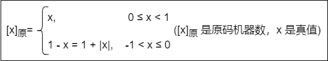
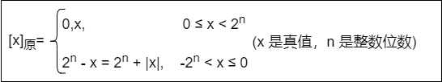
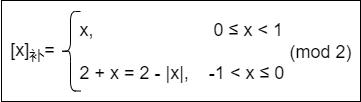
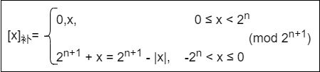

## 计算机系统概述

### 发展历程

#### 硬件的发展

- **计算机的四代变化**

    1. **第一代（1946-1975）——电子管时代**

        逻辑元件采用 **电子管**；使用 **机器语言** 进行编程；主存用 **延迟线或磁鼓** 存储信息，容量极小；体积庞大，成本高；运算速度较低，一般只有 **几千次到几万次** 每秒。
    
    2. **第二代（1958-1964）——晶体管时代**

        逻辑元件采用 **晶体管**；运算速度提高到 **几万次到几十万次** 每秒；主存用 **磁芯存储器**；计算机软件得到发展，开始出现高级语言及其编译程序，**操作系统** 有了雏形。

    3. **第三代（1965-1971）——中小规模集成电路时代**

        逻辑元件采用 **中小规模集成电路**；主存用 **半导体** 取代磁芯存储器；**高级语言** 迅速发展，**操作系统** 也进一步发展，出现 **分时操作系统。**
    
    4. **第四代（1972-至今）——超大规模集成电路时代**

        逻辑元件采用 **超大规模集成电路**，产生了 **微处理器**；如：**并行**、**流水线**、**高速缓存** 和 **虚拟存储器** 等概念用在计算机中。

- **计算机元件的更新**

    1. **摩尔定律**
    
        当价格不变，集成电路上的晶体管数目，约每过 18 月会增加一倍。同样的价格 18 月后集成电路是 18 月前集成电路性能的一倍
    
    2. **半导体存储器**

        1970 年仙童半导体公司生产的单芯片：1KB、4KB、16KB、64KB、256KB、1MB、4MB、16MB、64MB、256MB、1GB
    
    3. **微处理器**

        1971 年 Intel 公司产生的微处理器：Intel 4004、Intel 8008（8 位）、Intel 8086（16 位）、Intel 80386（32 位）、Pentium（32 位）、Pentium III（64 位）、Pentium 4（64 位）、Core i7（64 位）等。**32 位和 64 位是指计算机进行一次整数运算所能处理的二进制数据的位数。**

#### 软件的发展

计算机语言的发展经历了面向机器的 **机器语言** 和 **汇编语言**、面向问题的 **高级语言**。其中高级语言的发展真正促进了软件的发展，它经历了从科学计算和工程计算的 FORTRAN、结构化程序设计的 PASCAL 到面向对象的 C++ 和适应网络环境的 Java。

与此同时，直接影响计算机系统性能提升的各种 **系统软件** 也有了长足的发展，特别是 **操作系统**。如：Windows、UNIX、Linux 等。

### 计算机系统层次结构

#### 系统的组成

**硬件系统** 和 **软件系统** 共同构成了一个完整的计算机系统。

- **硬件**：是指有形的 **物理设备**，是计算机系统中实际物理装置的总称
- **软件**：是指在硬件上 **运行的程序** 和 **相关的数据及文档**

#### 硬件

1. **冯·诺依曼基本思想**

    冯·诺依曼在研究 EDVAC（Electronic Discrete Variable Automatic Computer）离散变量自动电子计算机时提出了 **存储程序** 的概念，存储程序的思想奠定了现代计算机的基本结构，以此概念为基础的各类计算机通称为 **冯·诺依曼机**，其特点如下：

    - 采用 **存储程序** 的工作方式
    - 计算机硬件系统由 **运算器**、**存储器**、**控制器**、**输入设备** 和 **输出设备** 五大部件组成
    - **指令** 和 **数据** 以同等地位存储在存储器中，形式上没有区别，但计算机应能区分它们
    - 指令和数据均用二进制代码表示。指令由 **操作码** 和 **地址码** 组成，操作码指出操作的类型，地址码指出操作数的地址

    **存储程序** 的基本思想：将事先编制好的程序和原始数据送入主存后才能执行，一旦程序被启动执行，就无须操作人员的干预，计算机会自动逐条执行指令，直至程序执行结束。

2. **计算机的功能部件**

    - **输入设备**：主要功能是将程序和数据 **以机器所能识别的信息形式** 输入计算机。最基本的输入设备是键盘，此外还有鼠标、扫描仪、摄像机等
    - **输出设备**：主要功能是将计算机处理的结果 **以人们所能接受的形式或其他系统所要求的信息形式** 输出。最基本的输出设备是显示器、打印机等
    - **存储器**：存储器分为 **主存储器（内存储器）** 和 **辅助存储器（外存储器）**。CPU 能够直接访问的存储器是主存储器，辅助存储器用于帮助主存储器记忆更多的信息，辅助存储器中的信息必须调入主存后，才能为 CPU 访问

        主存储器的工作方式是按存储单元的地址进行存取，这种存取方式称为 **按地址存取方式。**

        

        上图为主存储器基本组成。信息如下：
        - **存储体**：存放二进制信息
        - **地址寄存器（MAR）**：存放访存地址，经过地址译码后找到所选的存储单元
        - **数据寄存器（MDR）**：用于暂存要从存储器中读或写的信息
        - **时序控制逻辑**：用于产生存储器操作所需的各种时序信号

        ::: tip
        MAR 和 MDR 虽然是存储器的一部分，但在现代计算机中却是存在于 CPU 中
        :::

    - **运算器**：是计算机的执行部件，用于进行 **算术运算** 和 **逻辑运算**。算术运算是按算术运算规则进行的运算，如：加、减、乘、除；逻辑运算包括与、或、非、异或、比较、移位等运算
    - **控制器**：是计算机的指挥中心，由其 **指挥各部件自动协调** 地进行工作。控制器由程序计数器（PC）、指令寄存器（IR）和控制单元（CU）组成

        - **程序计数器（PC）**：用来 **存放当前要执行指令的地址**，具体自动加 `1` 的功能（这里的 `1` 指一条指令的长度），即可自动形成下一条指令的地址，它与主存的 `MAR` 之间有一条直接通路
        - **指令寄存器（IR）**：用来 **存放当前的指令**，其内容来自主存的 `MDR`。指令中的操作码OP(IR) 送至 **控制单元（CU）**，用以分析指令并发出各种微操作命令序列；而地址码Ad(IR) 送往 `MAR`，用以取操作数

    输入/输出设备（简称 `I/O` 设备）是计算机与外界联系的桥梁，是计算机中不可缺少的重要组成部分。

    一般将运算器和控制器集成到同一个芯片上，称为 **中央处理器（CPU）**。CPU 和主存储器共同构成主机，而除主机外的其他硬件装置（外存、I/O设备等）统称为 **外部设备**，简称外设。

    

    上图所示为冯·诺依曼结构的模型机。CPU 包含：ALU、通用寄存器组 GPRs、标志寄存器、控制器、指令寄存器IR、程序计数器PC、存储器地址寄存器MAR 和存储器数据寄存器MDR。图中从控制器送出的虚线就是 **控制信号**，可以控制如何 **修改程序计数器PC** 以得到下一条指令的地址，可以控制 **ALU** 执行什么运算，可以控制 **主存** 是进行读操作还是写操作（读/写控制信号）。

    CPU 和主存之间通过一组 **总线** 相连，总线中有 **地址**、**控制** 和 **数据** 三组信号线。`MAR` 中的 **地址信息** 会直接送到地址线上，用于指向读/写操作的主存存储单元；控制线中有 **读/写信号线**，指出数据是从 CPU 写入主存还是从主存读出到 CPU，根据是读操作还是写操作来控制将 `MDR` 中的 **数据** 是直接送到数据线上还是将数据线上的数据接收到 `MDR` 中。

#### 软件

1. **系统软件和应用软件**

    软件按其功能分类，可分为 **系统软件** 和 **应用软件。**

    - **系统软件**：是一组 **保证计算机系统高效、正确运行的基础软**件，通常作为系统资源提供给用户使用。主要有操作系统（OS）、数据库管理系统（DBMS）、语言处理程序、分布式软件系统、网络软件系统、标准库程序、服务性程序等

    - **应用软件**：是指用户 **为解决某个应用领域中的各类问题** 而编制的程序。如：各种科学计算类程序、工程设计类程序、数据统计与处理程序等

2. **三个级别的语言**

    - **机器语言**：又称 **二进制代码语言**，需要编程人员记忆每条指令的二进制编码。机器语言 **是计算机唯一可以直接识别和执行的语言**
    - **汇编语言**：汇编语言 **用英文单词或其缩写代替二进制的指令代码**，更容易为人们记忆和理解。使用汇编语言编辑的程序，必须经过一个称为汇编程序的系统软件的翻译，将其转换为机器语言程序后，才能在计算机的硬件系统上执行
    - **高级语言**：如：C、C++、Java 等，是为 **方便程序设计人员写出解决问题的处理方案和解题过程的程序**。通常高级语言需要经过编译程序编译成汇编语言程序，然后经过汇编操作得到机器语言程序，或直接由高级语言程序翻译成机器语言程序

    由于计算机无法直接理解和执行高级语言程序，需要将高级语言程序转换为机器语言程序，通常把进行这种转换的软件系统称为翻译程序。**翻译程序有以下三类：**

    - **汇编程序（汇编器）**：将汇编语言程序翻译成机器语言程序
    - **解释程序（解释器）**：将源程序中的语句按执行顺序逐条翻译成机器指令并立即执行
    - **编译程序（编译器）**：将高级语言程序翻译成汇编语言或机器语言程序

3. **软件和硬件的逻辑功能等价性**

    硬件实现的往往是最基本的算术和逻辑运算功能，而其他功能大多通过软件的扩充得以实现。对某一功能来说，既可以由硬件实现，又可以由软件实现，从用户的角度来看，它们在功能上是等价的。这一等价性被称为 **软、硬件逻辑功能的等价性。**
    
    例如：浮点数运算既可以用专门的浮点运算器硬件实现，又可以通过一段子程序实现，这两种方法在功能上完全等效，不同的只是执行时间的长短而已，显然硬件实现的性能要优于软件实现的性能。

#### 层次结构

计算机是一个硬软件组成的综合体。由于面对的应用范围越来越广，必须有复杂的系统软件和硬件支持。

计算机系统的 **多级层次结构的作用**：根据使用者对计算机系统属性的要求不同，来分清彼此之间的界面，明确各自的功能，以便构成合理、高效的计算机系统。


- **微程序机器M0（微指令系统）**：是一个实在的硬件层，它由机器硬件直接执行微指令
- **传统机器M1（机器语言机器）**：是一个实在的硬件层，由微程序解释机器指令系统
- **虚拟机器M2（操作系统机器）**：由操作系统程序实现。操作系统程序是由 **机器指令** 和 **广义指令** 组成的，这些广义指令是为了扩展机器功能而设置的，是由操作系统定义和解释的软件指令
- **虚拟机器M3（汇编语言机器）**：为用户 **提供一种符号化的语言**，借此可编写汇编语言源程序。这一层由汇编程序支持和执行
- **虚拟机器M4（高级语言机器）**：是面向用户的，是为 **方便用户编写应用程序** 而设置的。该层由各种高级语言编译程序支持和执行
- **虚拟机器M5（应用程序机器）**：由 **解决实际问题的处理程序** 组成。如：文字处理软件、多媒体处理软件和办公自动软件等

**M0-M1** 没有配备软件的纯硬件系统称为裸机。**M2-M5** 称为虚拟机，简单来说就是软件实现的机器。每层只能通过该层的语言来了解和使用计算机，而不必关心下层是如何工作的。层次之间的关系紧密，下层是上层的基础，上层是下层的扩展。

**软件和硬件之间的交界面**：就是指令集体系结构（ISA），ISA 定义了一台计算机可以执行的所有指令的集合，每条指令规定了计算机执行什么操作，以及所处理的操作数存放的地址空间和操作数类型。

#### 工作原理

1. **存储程序工作方式**
    
    
    
    一个程序的执行就是周而复始地执行一条一条指令的过程。每条指令的执行过程包括：**从主存取指令、对指令进行译码、计算下条指令地址、取操作数并执行、将结果送回存储器。**

    **存储程序”工作方式规定**：程序执行前，先将程序第一条指令的地址存放到程序计数器（PC） 中，取指令时，将 PC 的内容作为地址访问主存。在每条指令执行过程中，都需要计算下条将执行指令的地址，并送至 PC。若当前指令为顺序型指令，则下条指令地址为 PC 的内容加上当前指令的长度；若当前指令为转跳型指令，则下条指令地址为指令中指定的目标地址。当前指令执行完后，根据 PC 的值到主存中取出的是下条将要执行的指令，因而计算机能周而复始地自动取出并执行一条一条的指令。

2. **从源程序到可执行文件**

    在计算机中编写的 C 语言程序，都必须被转换为一系列的低级机器指令，这些指令按照一种称为可执行目标文件的格式打好包，并以二进制磁盘文件的形式存放起来。

    

    以 UNIX 系统中的 GCC 编译器程序为例，读取源程序文件 `hello.c`，并把它翻译成一个可执行目标文件 `hello`，整个翻译过程可分为 **四个阶段** 完成：

    - **预处理阶段**：预处理器（cpp）对源程序中以字符 `#` 开头的命令进行处理。例如：将 `#include` 命令后面的 `.h` 文件内容插入程序文件。输出结果是一个以 `.i` 为扩展名的源文件 `hello.i`
    - **编译阶段**：编译器（ccl）对预处理后的源程序进行编译，生成一个汇编语言源程序 `hello.s`。汇编语言源程序中的每条语句都以一种文本格式描述了一条低级机器语言指令
    - **汇编阶段**：汇编器（as）将 `hello.s` 翻译成机器语言指令，把这些指令打包成一个称为可重定位目标文件的` hello.o`，它是一种二进制文件，因此用文本编辑器打开会显示乱码
    - **链接阶段**：链接器（ld）将多个可重定位目标文件和标准库函数合并为一个可执行目标文件，或简称可执行文件。本例中，链接器将 `hello.o` 和标准库函数 `printf` 所在的可重定位目标模块 `printf.o` 合并，生成可执行文件 `hello`。最终生成的可执行文件被保存在磁盘上


3. **程序执行过程描述**

    在图形化界面的操作系统中，可以采用双击图标的方式来执行程序。在 UNIX 系统中，可以通过 shell 命令行解释器来执行程序。通过 shell 命令行解释器执行程序的过程如下：

    ```shell
    unix> ./hello
    hello, world!
    unix>
    ```

    其中，**unix>** 是命令提示符，**./** 表示当前目录，**hello** 是可执行文件的路径名。输入命令后需按下 <kbd>Enter</kbd> 键才会执行，第二行是执行结果。

    - shell 程序将用户从键盘输入的每个字符逐一读入 **CPU 寄存器**，然后保存到 **主存储器中（主存）**
    - 在主存的 **缓冲区形成字符串** `./hello`
    - 接收到 <kbd>Enter</kbd> 键时，shell 调出操作系统的内核程序，由 **内核来加载磁盘** 上的可执行文件 `hello` 到主存中
    - 内核加载完可执行文件中的代码和数据（这里是字符串 `hello, world!\n`）后，将 `hello` 的第一条指令的地址送至 PC，CPU 随后开始执行 `hello` 程序，它将已加载到主存的字符串 `hello, world!\n` 中的每个字符 **从主存中送到 CPU 的寄存器中**
    - 然后将 CPU 寄存器中的字符 **送到显示器**

4. **指令执行过程描述**

    可执行文件代码段是由一条一条机器指令构成的，指令是用 `0` 和 `1` 表示的一串 `0/1` 序列，用来指示 CPU 完成一个特定的原子操作。

    以取数指令（送至运算器的 ACC 中）为例，**其信息流程如下：**

    - **取指令：PC→MAR→M→MDR→IR**

        将 PC 的内容送 MAR，MAR 中的内容直接送地址线，同时控制器将读信号送读/写信号线，主存根据地址线上的地址和读信号，从指定存储单元读出指令，送到数据线上，MDR 从数据线接收指令信息，并传送到 IR 中。

    - **分析指令：OP(IR)→CU**

        指令译码并送出控制信号。控制器根据 IR 中指令的操作码，生成相应的控制信号，送到不同的执行部件。在本例中，IR 中是取数指令，因此读控制信号被送到总线的控制线上。

    - **执行指令：Ad(IR)→MAR→M→MDR→ACC**

        取数操作。将 IR 中指令的地址码送 MAR，MAR 中的内容送地址线，同时控制器将读信号送读/写信号线，从主存中读出操作数，并通过数据线送至 MDR，再传送到 ACC 中。

        每取完一条指令，还须为取下条指令做准备，计算下条指令的地址，即 `(PC)+1→PC`。

### 性能指标

#### 主要性能指标

1. **字长**

    计算机进行一次整数运算（即定点整数运算）所能 **处理的二进制数据的位数**，通常与 CPU 的寄存器位数、加法器有关。

2. **数据通路带宽**

    外部数据总线一次所能 **并行传送信息的位数。**

3. **主存容量**

    主存储器所能 **存储信息的最大容量**，通常以字节来衡量，也可用 **字数 x 字长**（如：512K x 16位）来表示存储容量。其中 MAR 的位数代表存储单元的个数；MDR 的位数代表存储单元的字长。

4. **运算速度**

    - **吞吐量和响应时间**
        - **吞吐量**：指系统在单位时间内处理请求的数量
        - **响应时间**：指从用户向计算机发送一个请求到系统对该请求做出响应并获得所需结果的等待时间
    
    - **主频和 CPU 时钟周期**
        - **主频**：CPU 时钟频率。机器内部主时钟的频率是衡量机器速度的重要参数。主频通常以 Hz（赫兹）为单位，1Hz 表示每秒一次
        - **CPU 时钟周期**：通常为节拍脉冲或 T 周期，即主频的倒数，是 CPU 中最小的时间单位，执行指令的每个动作至少需要一个时钟周期
    
    - **CPI（Cycle Per Instruction）**：执行一条指令所需的时钟周期数
    - **CPU 执行时间**：执行一个程序所花费的时间。CPU 执行时间 = CPU 时钟周期数/主频 = （指令条数 x CPI）/主频
    - **MIPS（Million Instructions Per Second）**：每秒执行多少百万条指令。MIPS = 指令条数/（执行时间 x 10^6^）= 主频/（CPU x 10^6^）
    - **MFLOPS、GFLOPS、TFLOPS、PFLOPS、EFLOPS 和 ZFLOPS**
        - **MFLOPS（Million Floating-point Operations Per Second）**：每秒执行多少百万次浮点运算。MFLOPS = 浮点操作次数/（执行时间 x 10^6^）
        - **GFLOPS（Giga Floating-point Operations Per Second）**：每秒执行多少十亿次浮点运算。GFLOPS = 浮点操作次数/（执行时间 x 10^9^）
        - **TFLOPS（Tera Floating-point Operations Per Second）**：每秒执行多少万亿次浮点运算。TFLOPS = 浮点操作次数/（执行时间 x 10^12^）
        - **PFLOPS** = 浮点操作次数/（执行时间 x 10^15^）
        - **EFLOPS** = 浮点操作次数/（执行时间 x 10^18^）
        - **ZFLOPS** = 浮点操作次数/（执行时间 x 10^21^）

5. **基准程序**

    用来 **进行性能评价** 的一组程序，能很好的反映机器在运行实际负载时的性能。

#### 专业术语

1. **系列机**

    具有 **基本相同的体系结构**，使用相同基本指令系统的多个不同型号的计算机组成的一个产品系列。

2. **兼容**

    指软件或硬件的通用性，即 **运行在某个型号的计算机系统中的硬件/软件也能应用于另一个型号的计算机系统** 时，称这两台计算机在硬件或软件上存在兼容性。

3. **软件可移植性**

    指把使用在某个系列计算机中的软件直接或进行很少的修改就能运行在另一个系列计算机中的可能性。

4. **固件**

    将 **程序固化在 ROM 中组成的部件** 称为固件。固件是一种具有软件特性的硬件，吸收了软/硬件各自的优点，其执行速度快于软件，灵活性优于硬件，是软/硬件结合的产物。例如：目前操作系统已实现了部分固化（把软件永恒地存储于 ROM 中）。 

## 数据的表示和运算

### 数制与编码

#### 进位计数制及其相互转换

在计算机系统内部，所有的信息都是用 **二进制进行编码** 的，这样做的原因有以下几点：

- 二进制只有两种状态，使用有两个稳定状态的物理器件就可以表示二进制数的每一位，制造成本比较低，例如用高低电平或电荷的正负极性都可以很方便地表示 `0` 和 `1`
- 二进制位 `1` 和 `0` 正好与逻辑值 “真” 和 “假” 对应，为计算机实现逻辑运算和程序中的逻辑判断提供了便利条件
- 二进制的编码和运算规则都简单，通过逻辑门电路能方便地实现算术运算

1. **进位计数法**

    在进位计数法中，每个数位所用到的不同数码的个数称为 **基数。**

    每个数码所表示的数值等于该数码本身乘以一个与它所在数位有关的常数，这个常数称为 **位权**。位权最低位为 `0`。

    - **二进制**：基数为 `2`。只有 `0` 和 `1` 两种数字符号，计数 **逢二进一**
    - **八进制**：基数为 `8`。有 `0~7` 共八个不同的数字符号，计数 **逢八进一**
    - **十进制**：基数为 `10`。有 `0~9` 共十个不同的数字符号，计数 **逢十进一**
    - **十六进制**：基数为 `16`。有 `0~9、A、B、C、D、E、F` 共八个不同的数字符号，计数 **逢十六进一**。`A、B、C、D、E、F` 分别表示 `10~15`

2. **不同进制数之间相互转换**

    - **二进制转八进制和十六进制**

        二进制混合数（整数部分，小数部分），在转换时应以小数点为界。**整数部分**，从小数点开始往左数，将二进制数分为 `3` 位（八进制）或 `4` 位（十六进制）一组，最左边根据需要加 `0` 补齐；**小数部分**，从小数点开始往右数，将二进制数分为 `3` 位（八进制）或 `4` 位（十六进制）一组，最右边根据需要加 `0` 补齐。最终使总的位数为 `3` 或 `4` 的整数倍，分别用对应的八进制或十六进制取代。

        例如：二进制数 `1111000010.01101` 分别转换为八进制和十六进制。

        八进制：(1111000010.01101)~2~ = (1702.32)~8~

        ```text
                001     111     000     010     .     011     010
               ╰┈┬┈╯                          ╰┈┬┈╯          ╰┈┬┈╯
        （高位补 0，凑足 3 位）               （分界点） （低位补 0，凑足 3 位）
        ```

        ::: info 每组二进制到八进制转换过程
        - 001 = 0x2^2^ + 0x2^1^ + 1x2^0^ = 0 + 0 + 1 = 1
        - 111 = 1x2^2^ + 1x2^1^ + 1x2^0^ = 4 + 2 + 1 = 7
        - 000 = 0x2^2^ + 0x2^1^ + 0x2^0^ = 0 + 0 + 0 = 0
        - 010 = 0x2^2^ + 1x2^1^ + 0x2^0^ = 0 + 2 + 0 = 2
        - 011 = 0x2^2^ + 1x2^1^ + 1x2^0^ = 0 + 2 + 1 = 3
        - 010 = 0x2^2^ + 1x2^1^ + 0x2^0^ = 0 + 2 + 0 = 2
        :::

        十六进制：(1111000010.01101)~2~ = (3C2.68)~16~

        ```text
                0011     1100     0010     .     0110      1000
               ╰┈┬┈╯                     ╰┈┬┈╯            ╰┈┬┈╯
        （高位补 0，凑足 4 位）          （分界点）  （低位补 0，凑足 4 位）
        ```

        ::: info 每组二进制到十六进制转换过程
        - 0011 = 0x2^3^ + 0x2^2^ + 1x2^1^ + 1x2^0^ = 0 + 0 + 2 + 1 = 3
        - 1100 = 1x2^3^ + 1x2^2^ + 0x2^1^ + 0x2^0^ = 8 + 4 + 0 + 0 = 12 = C
        - 0010 = 0x2^3^ + 0x2^2^ + 1x2^1^ + 0x2^0^ = 0 + 0 + 2 + 0 = 2
        - 0110 = 0x2^3^ + 1x2^2^ + 1x2^1^ + 0x2^0^ = 0 + 4 + 2 + 0 = 6
        - 1000 = 1x2^3^ + 0x2^2^ + 0x2^1^ + 0x2^0^ = 8 + 0 + 0 + 0 = 8
        :::
    
    - **八进制和十六进制转二进制**

        只需将每位改为 `3` 位或 `4` 位二进制数即可（必要时去掉整数最高位或小数最低位的 `0`）。
    
    - **八进制和十六进制之间转换**

        八进制转十六进制（或十六进制转八进制）时，先将八进制（或十六进制）数转换为二进制，然后由二进制再转换为十六进制（或八进制）数。
    
    - **任意进制转十进制**

        将任意进制数的各位数码与它们的权值相乘，再把乘积相加，结果就是十进制数。这种方法称为 **按权展开相加法。**

        例如：二进制数 `11011.1` 转换为十进制。

        (11011.1)~2~ = 1x2^4^ + 1x2^3^ + 0x2^2^ + 1x2^1^ + 1x2^0^ + 1x2^-1^ = 27.5
    
    - **十进制转任意进制**

        十进制转任意进制，常采用 **基数乘除法**。这种转换方法对十进制整数部分用 **除基取余法**；对小数部分用 **乘基取整法**，最后将整数部分和小数部分的转换结果拼接起来。

        - **除基取余法**：整数部分除基取余，最先取得的余数为数的最低位，最后取得的余数为数的最高位（即除基取余，先余为低，后余为高），商为 `0` 时结束
        - **乘基取整法**：小数部分乘基取整，最先取得的整数为数的最高位，最后取得的整数为数的最低位（即乘基取整，先整为高，后整为低），乘积为 `1.0`（或满足精度要求）时结束

        例如：十进制数 `123.6875` 转换成二进制。

        整数部分：123 = (1111011)~2~

        ```text
            除基      取余
        2 │ 123        1    最低位
          └────
          2 │ 61       1
            └────
          2 │ 30       0
            └────
          2 │ 15       1
            └────
            2 │  7     1
              └────
            2 │  3     1
              └────
            2 │  1     1    最高位
              └────
                 0
        ```

        小数部分：0.6875 = (0.1011)~2~

        ```text
              乘基     取整
            0.6875
        x        2
        ────────────
            1.3750      1    最高位
            0.3750
        x        2
        ────────────
            0.7500      0
        x        2
        ────────────
            1.5000      1
            0.5000
        x        2
        ────────────
            1.0000      1    最低位
            ……
        ```
    
        因此十进制数 123.6875 转换成二进制数为 (1111011.1011)~2~

    ::: warning
    在计算机中，小数和整数不一样，整数可以连续表示，但小数是离散的，所以并不是每个十进制小数都可以准确地用二进制表示。例如：`0.3`，无论经过多少次乘二取整转换都无法得到精确的结果。但任意一个二进制小数都可以用十进制小数表示
    :::

3. **真值和机器数**

    在日常生活中，通常用正号、负号来分别表示正数（正号可省略）和负数，如：`+15`、`-8` 等。这种带 `+` 或 `-` 符号的数称为 **真值**。真值是机器数所代表的实际值。
    
    在计算机中，通常将数的符号和数值部分一起编码，将数据的符号数字化，通常用 `0` 表示 **正**，用 `1` 表示 **负**。这种把符号（+/-）“数字化” 的数称为 **机器数**。常用的有原码、补码、反码和移码表示法。如：`0,101`（这里的逗号 `,` 仅为区分符号位与数值位）表示 `+5`。

#### BCD 码

**二进制编码的十进制数（Binary-Coded Decimal，BCD）** 通常采用 `4` 位二进制数来表示一位十进制数中的 `0~9` 这 `10` 个数码。这种编码方法使二进制数和十进制数之间的转换得以快速进行。但 `4` 位二进制数可以组合出 `16` 种代码，因此必有 `6` 种状态为余状态。

**常用的 BCD 码：** 8421 码、余 3 码、2421 码。

#### 定点数的编码表示

根据小数点的位置是否固定，在计算机中有两种数据格式：**定点表示** 和 **浮点表示**。在现代计算机中，通常用定点补码整数表示整数，用定点原码小数表示浮点数的尾数部分，用移码表示浮点数的阶码部分。

1. **机器数的定点表示**

    定点表示法用来表示 **定点小数** 和 **定点整数。**

    - **定点小数**：是纯小数

        

        约定小数点位置在符号位之后、有效数值部分最高位之前。例如：**x~0~.x~1~x~2~……x~n~**。其中 **x~0~** 为符号位，**x~1~\~x~n~** 为数值的有效部分也称为 **数尾**，**x~1~** 为最高有效位。

    - **定点整数**：是纯整数

        

        约定小数点位置在有效数值部分最低位之后。例如：**x~0~x~1~x~2~……x~n~.**。其中 **x~0~** 为符号位，**x~1~\~x~n~** 为 **数尾**，**x~n~** 为最低有效位。

    定点数编码表示法主要有四种：原码、补码、反码和移码。

2. **定点表示法**

    - **原码**：用机器数的最高位表示数的符号，其余各位表示数的绝对值

        **纯小数的原码定义：**

        

        例如：x~1~ = +0.1101，x~2~ = -0.1101，字长为 `8` 位。
        
        原码表示为：

        - [x~1~]~原~ = 0.1101000
        - [x~2~]~原~ = 1 - (-0.1101) = 1.0000000 + 0.1101000 = 1.1101000
        
        其中最高位为符号位。小数的 **符号位** 与 **数值位** 之间用 **小数点** 隔开。

        若字长为 `n + 1`，则原码小数的表示范围为 -(1 - 2^-n^) ≤ x ≤ 1 - 2^-n^（关于原点对称）。

        **纯整数的原码定义：**

        

        2^n^ 中的 `n` 是整数位数，也就是数值有效部分的位数。

        例如：x~1~ = +1110，x~2~ = -1110，字长为 `8` 位。
        
        原码表示为：

        - [x~1~]~原~ = 0,0001110
        - [x~2~]~原~ = 2^7^ - (-1110) = 128 + 1110 = 10000000 + 00001110 = 1,0001110
        
        2^7^ 中的 `7` 为 **字长（8）- 符号位（1）** 后所得的 **整数位数（7）**
        
        其中最高位为符号位。整数的 **符号位** 与 **数值位** 之间用 **逗号** 隔开。

        若字长为 `n + 1`，则原码整数的表示范围为 -(2^n^ - 1) ≤ x ≤ 2^n^ - 1（关于原点对称）。

        ::: tip
        真值零的原码表示有正零和负零两种：[+0]~原~ = **0**0000；[-0]~原~ = **1**0000
        :::
    
    - **补码**：加减运算统一采用加法运算实现

        ::: details 模（mod）的概念
        **模（mod）** 是指一个计量系统的计数范围，例如：时钟。计算机也可以也可以看成一个计量机器，因为计算机的字长是定长的，即存储和处理的位数是有限的，因此它也有一个计量范围，即都存在一个模。如：时钟的计量范围是 0~11，**模 = 12**。表示 `n` 位的计算机计量范围是 0~2^n^ -1，**模 = 2^n^**。模实质上是计量器产生 “溢出” 的量，它的值在计量器上表示不出来，计量器上只能表示出 **模的余数**。任何有模的计量器，均可 **化减法为加法运算（就是取反后加 1）**
        
        假设当前时针指向 `8` 点，而准确时间是 `6` 点，调整时间可有以下两种拨法：
        
        1. 倒拨 `2` 小时，即 `8 - 2 = 6`
        2. 顺拨 10 小时，`8 + 10 = 12 + 6 = 6`
        
        即 `8 - 2 = 8 + 10 = 8 + 12 - 2(mod 12)`。在 `12` 为模的系统里，加 10 和减 2 效果是一样的，因此凡是减 2 运算，都可以用加 10 来代替。若用一般公式可表示为：`a - b = a - b + mod = a + mod - b`。对模而言，`2` 和 `10` **互为补数**。实际上，以 `12` 为模的系统中，11 和 1、8 和 4、9 和 3、7 和 5、6 和 6 都有这个特性，共同的特点是 **两者相加等于模**。对于计算机，其概念和方法完全一样。`n` 位计算机，设 `n = 8`，所能表示的最大数是 `11111111`，若再加 1 成 `100000000`（9 位），但因只有 `8` 位，最高位 1 自然丢失（相当于丢失一个模）。又回到了 `00000000`，所以 `8` 位二进制系统的模为 **2^8^**。在这样的系统中减法问题也可以化成加法问题，只需 **把减数用相应的补数表示** 就可以了。把补数用到计算机对数的处理上，就是补码
        :::

        **纯小数的补码定义：**

        

        例如：x~1~ = +0.1001，x~2~ = -0.0110，字长为 `8` 位。
        
        补码表示为：

        - [x~1~]~补~ = 0.1001000
        - [x~2~]~补~ = 2 + (-0.0110) = 2 - 0.0110 = 1.0000000 + (1.0000000 - 0.0110000) = 1.0000000 + 0.1010000 = 1.1010000

        ::: info 1.0000000 - 0.0110000 运算过程
        由于十进制 `25 - 9 = 16` 在做减法运算时，首先 `个位（5）- 9` 不够减，就向前借一位（**借 10**）变成 `个位（10 + 5）- 9`，十位 `2` 就变成 `1`，最后得到的结果是 `16`

        因此二进制 `1.0000000 - 0.0110000` 在做减法运算时，不够减时，向前借一位（**借 2**）变成 `0.1120000 - 0.0110000`，最后得到的结果是 `0.1010000`

        ```text
          1.0000000        0.1120000
        - 0.0110000  ->  - 0.0110000
        = 0.1010000      = 0.1010000
        ```

        :::

        若字长为 `n + 1`，则补码小数的表示范围为 -1 ≤ x ≤ 1 - 2^-n^（比原码多表示 -1）。

        **纯整数的补码定义：**

        

        例如：x~1~ = +1010，x~2~ = -1101，字长为 `8` 位。
        
        补码表示为：

        - [x~1~]~补~ = 0,0001010
        - [x~2~]~补~ = 2^(7+1)^ + (-1101) = 2^8^ - 1101 = 100000000 - 00001101 = 1,1110011
        
        ::: info 100000000 - 00001101 运算过程
        
        ```text
          100000000        11111112
        -  00001101  ->  - 00001101
        = 0.1010000      = 11110011
        ```

        :::

        若字长为 `n + 1`，则补码整数的表示范围为 -2^n^ ≤ x ≤ 2^n^ - 1（比原码多表示 -2^n^）。

        ::: tip
        零的补码表示是唯一的：[+0]~补~ = [-0]~补~ = 0.0000
        :::

        **补码与真值之间的转换:**
        
        对补码而言，正数和负数的转换不同。正数补码的转换方式与原码的相同。
        
        - **真值转换为补码**：对于正数，与原码的方式一样。对于负数，符号位取 1，其余各位由真值 **各位取反，末位加 1** 得到
        - **补码转换为真值**：若符号位为 0，与原码的方式一样。若符号位为 1，真值的符号为负，数值部分各位由补码 **各位取反，末位加 1** 得到

    - **反码表示法**

        负数的补码可采用各位取反，末位加 1 的方法得到，如果 **仅各位求反而末尾不加 1**，那么就可得到负数的反码表示。因此负数反码的定义就是在相应的补码表示中末位减 1。正数反码的定义和相应的补码（或原码）表示相同。
        
        **反码表示存在以下几个方面的不足：**

        - `0` 的表示不唯一（即存在正负 0）
        - 表示范围比补码少一个最小负数
        
        反码在计算机中很少使用，通常用作数码变换的中间表示形式。
