## 计算机系统概述

### 发展历程

#### 硬件的发展

- **计算机的四代变化**

    1. **第一代（1946-1975）——电子管时代**

        逻辑元件采用 **电子管**；使用 **机器语言** 进行编程；主存用 **延迟线或磁鼓** 存储信息，容量极小；体积庞大，成本高；运算速度较低，一般只有 **几千次到几万次** 每秒。
    
    2. **第二代（1958-1964）——晶体管时代**

        逻辑元件采用 **晶体管**；运算速度提高到 **几万次到几十万次** 每秒；主存用 **磁芯存储器**；计算机软件得到发展，开始出现高级语言及其编译程序，**操作系统** 有了雏形。

    3. **第三代（1965-1971）——中小规模集成电路时代**

        逻辑元件采用 **中小规模集成电路**；主存用 **半导体** 取代磁芯存储器；**高级语言** 迅速发展，**操作系统** 也进一步发展，出现 **分时操作系统。**
    
    4. **第四代（1972-至今）——超大规模集成电路时代**

        逻辑元件采用 **超大规模集成电路**，产生了 **微处理器**；如：**并行**、**流水线**、**高速缓存** 和 **虚拟存储器** 等概念用在计算机中。

- **计算机元件的更新**

    1. **摩尔定律**
    
        当价格不变，集成电路上的晶体管数目，约每过 18 月会增加一倍。同样的价格 18 月后集成电路是 18 月前集成电路性能的一倍
    
    2. **半导体存储器**

        1970 年仙童半导体公司生产的单芯片：1KB、4KB、16KB、64KB、256KB、1MB、4MB、16MB、64MB、256MB、1GB
    
    3. **微处理器**

        1971 年 Intel 公司产生的微处理器：Intel 4004、Intel 8008（8 位）、Intel 8086（16 位）、Intel 80386（32 位）、Pentium（32 位）、Pentium III（64 位）、Pentium 4（64 位）、Core i7（64 位）等。**32 位和 64 位是指计算机进行一次整数运算所能处理的二进制数据的位数。**

#### 软件的发展

计算机语言的发展经历了面向机器的 **机器语言** 和 **汇编语言**、面向问题的 **高级语言**。其中高级语言的发展真正促进了软件的发展，它经历了从科学计算和工程计算的 FORTRAN、结构化程序设计的 PASCAL 到面向对象的 C++ 和适应网络环境的 Java。

与此同时，直接影响计算机系统性能提升的各种 **系统软件** 也有了长足的发展，特别是 **操作系统**。如：Windows、UNIX、Linux 等。

### 计算机系统层次结构

#### 系统的组成

**硬件系统** 和 **软件系统** 共同构成了一个完整的计算机系统。

- **硬件**：是指有形的 **物理设备**，是计算机系统中实际物理装置的总称
- **软件**：是指在硬件上 **运行的程序** 和 **相关的数据及文档**

#### 硬件

1. **冯·诺依曼基本思想**

    冯·诺依曼在研究 EDVAC（Electronic Discrete Variable Automatic Computer）离散变量自动电子计算机时提出了 **存储程序** 的概念，存储程序的思想奠定了现代计算机的基本结构，以此概念为基础的各类计算机通称为 **冯·诺依曼机**，其特点如下：

    - 采用 **存储程序** 的工作方式
    - 计算机硬件系统由 **运算器**、**存储器**、**控制器**、**输入设备** 和 **输出设备** 五大部件组成
    - **指令** 和 **数据** 以同等地位存储在存储器中，形式上没有区别，但计算机应能区分它们
    - 指令和数据均用二进制代码表示。指令由 **操作码** 和 **地址码** 组成，操作码指出操作的类型，地址码指出操作数的地址

    **存储程序** 的基本思想：将事先编制好的程序和原始数据送入主存后才能执行，一旦程序被启动执行，就无须操作人员的干预，计算机会自动逐条执行指令，直至程序执行结束。

2. **计算机的功能部件**

    - **输入设备**：主要功能是将程序和数据 **以机器所能识别的信息形式** 输入计算机。最基本的输入设备是键盘，此外还有鼠标、扫描仪、摄像机等
    - **输出设备**：主要功能是将计算机处理的结果 **以人们所能接受的形式或其他系统所要求的信息形式** 输出。最基本的输出设备是显示器、打印机等
    - **存储器**：存储器分为 **主存储器（内存储器）** 和 **辅助存储器（外存储器）**。CPU 能够直接访问的存储器是主存储器，辅助存储器用于帮助主存储器记忆更多的信息，辅助存储器中的信息必须调入主存后，才能为 CPU 访问

        主存储器的工作方式是按存储单元的地址进行存取，这种存取方式称为 **按地址存取方式。**

        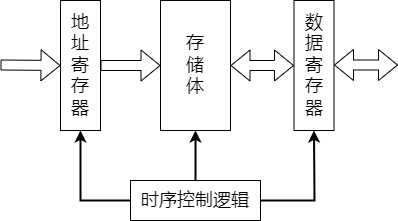

        上图为主存储器基本组成。信息如下：
        - **存储体**：存放二进制信息
        - **地址寄存器（MAR）**：存放访存地址，经过地址译码后找到所选的存储单元
        - **数据寄存器（MDR）**：用于暂存要从存储器中读或写的信息
        - **时序控制逻辑**：用于产生存储器操作所需的各种时序信号

        ::: tip
        MAR 和 MDR 虽然是存储器的一部分，但在现代计算机中却是存在于 CPU 中
        :::

    - **运算器**：是计算机的执行部件，用于进行 **算术运算** 和 **逻辑运算**。算术运算是按算术运算规则进行的运算，如：加、减、乘、除；逻辑运算包括与、或、非、异或、比较、移位等运算
    - **控制器**：是计算机的指挥中心，由其 **指挥各部件自动协调** 地进行工作。控制器由程序计数器（PC）、指令寄存器（IR）和控制单元（CU）组成

        - **程序计数器（PC）**：用来 **存放当前要执行指令的地址**，具体自动加 `1` 的功能（这里的 `1` 指一条指令的长度），即可自动形成下一条指令的地址，它与主存的 `MAR` 之间有一条直接通路
        - **指令寄存器（IR）**：用来 **存放当前的指令**，其内容来自主存的 `MDR`。指令中的操作码OP(IR) 送至 **控制单元（CU）**，用以分析指令并发出各种微操作命令序列；而地址码Ad(IR) 送往 `MAR`，用以取操作数

    输入/输出设备（简称 `I/O` 设备）是计算机与外界联系的桥梁，是计算机中不可缺少的重要组成部分。

    一般将运算器和控制器集成到同一个芯片上，称为 **中央处理器（CPU）**。CPU 和主存储器共同构成主机，而除主机外的其他硬件装置（外存、`I/O` 设备等）统称为 **外部设备**，简称外设。

    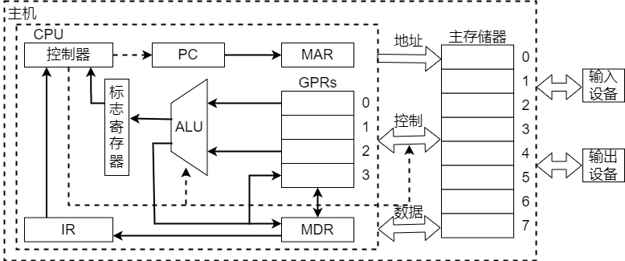

    上图所示为冯·诺依曼结构的模型机。CPU 包含：ALU、通用寄存器组 GPRs、标志寄存器、控制器、指令寄存器IR、程序计数器PC、存储器地址寄存器MAR 和存储器数据寄存器MDR。图中从控制器送出的虚线就是 **控制信号**，可以控制如何 **修改程序计数器PC** 以得到下一条指令的地址，可以控制 **ALU** 执行什么运算，可以控制 **主存** 是进行读操作还是写操作（读/写控制信号）。

    CPU 和主存之间通过一组 **总线** 相连，总线中有 **地址**、**控制** 和 **数据** 三组信号线。`MAR` 中的 **地址信息** 会直接送到地址线上，用于指向读/写操作的主存存储单元；控制线中有 **读/写信号线**，指出数据是从 CPU 写入主存还是从主存读出到 CPU，根据是读操作还是写操作来控制将 `MDR` 中的 **数据** 是直接送到数据线上还是将数据线上的数据接收到 `MDR` 中。

#### 软件

1. **系统软件和应用软件**

    软件按其功能分类，可分为 **系统软件** 和 **应用软件。**

    - **系统软件**：是一组 **保证计算机系统高效、正确运行的基础软**件，通常作为系统资源提供给用户使用。主要有操作系统（OS）、数据库管理系统（DBMS）、语言处理程序、分布式软件系统、网络软件系统、标准库程序、服务性程序等

    - **应用软件**：是指用户 **为解决某个应用领域中的各类问题** 而编制的程序。如：各种科学计算类程序、工程设计类程序、数据统计与处理程序等

2. **三个级别的语言**

    - **机器语言**：又称 **二进制代码语言**，需要编程人员记忆每条指令的二进制编码。机器语言 **是计算机唯一可以直接识别和执行的语言**
    - **汇编语言**：汇编语言 **用英文单词或其缩写代替二进制的指令代码**，更容易为人们记忆和理解。使用汇编语言编辑的程序，必须经过一个称为汇编程序的系统软件的翻译，将其转换为机器语言程序后，才能在计算机的硬件系统上执行
    - **高级语言**：如：C、C++、Java 等，是为 **方便程序设计人员写出解决问题的处理方案和解题过程的程序**。通常高级语言需要经过编译程序编译成汇编语言程序，然后经过汇编操作得到机器语言程序，或直接由高级语言程序翻译成机器语言程序

    由于计算机无法直接理解和执行高级语言程序，需要将高级语言程序转换为机器语言程序，通常把进行这种转换的软件系统称为翻译程序。**翻译程序有以下三类：**

    - **汇编程序（汇编器）**：将汇编语言程序翻译成机器语言程序
    - **解释程序（解释器）**：将源程序中的语句按执行顺序逐条翻译成机器指令并立即执行
    - **编译程序（编译器）**：将高级语言程序翻译成汇编语言或机器语言程序

3. **软件和硬件的逻辑功能等价性**

    硬件实现的往往是最基本的算术和逻辑运算功能，而其他功能大多通过软件的扩充得以实现。对某一功能来说，既可以由硬件实现，又可以由软件实现，从用户的角度来看，它们在功能上是等价的。这一等价性被称为 **软、硬件逻辑功能的等价性。**
    
    例如：浮点数运算既可以用专门的浮点运算器硬件实现，又可以通过一段子程序实现，这两种方法在功能上完全等效，不同的只是执行时间的长短而已，显然硬件实现的性能要优于软件实现的性能。

#### 层次结构

计算机是一个硬软件组成的综合体。由于面对的应用范围越来越广，必须有复杂的系统软件和硬件支持。

计算机系统的 **多级层次结构的作用**：根据使用者对计算机系统属性的要求不同，来分清彼此之间的界面，明确各自的功能，以便构成合理、高效的计算机系统。

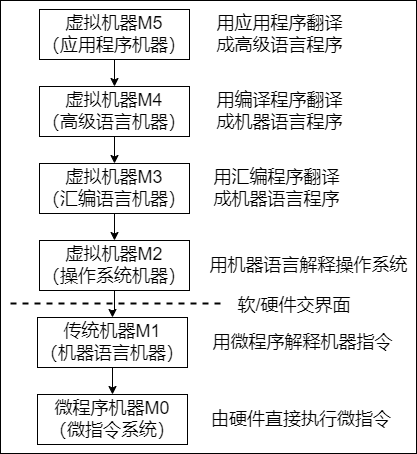

- **微程序机器M0（微指令系统）**：是一个实在的硬件层，它由机器硬件直接执行微指令
- **传统机器M1（机器语言机器）**：是一个实在的硬件层，由微程序解释机器指令系统
- **虚拟机器M2（操作系统机器）**：由操作系统程序实现。操作系统程序是由 **机器指令** 和 **广义指令** 组成的，这些广义指令是为了扩展机器功能而设置的，是由操作系统定义和解释的软件指令
- **虚拟机器M3（汇编语言机器）**：为用户 **提供一种符号化的语言**，借此可编写汇编语言源程序。这一层由汇编程序支持和执行
- **虚拟机器M4（高级语言机器）**：是面向用户的，是为 **方便用户编写应用程序** 而设置的。该层由各种高级语言编译程序支持和执行
- **虚拟机器M5（应用程序机器）**：由 **解决实际问题的处理程序** 组成。如：文字处理软件、多媒体处理软件和办公自动软件等

**M0-M1** 没有配备软件的纯硬件系统称为裸机。**M2-M5** 称为虚拟机，简单来说就是软件实现的机器。每层只能通过该层的语言来了解和使用计算机，而不必关心下层是如何工作的。层次之间的关系紧密，下层是上层的基础，上层是下层的扩展。

**软件和硬件之间的交界面**：就是指令集体系结构（ISA），ISA 定义了一台计算机可以执行的所有指令的集合，每条指令规定了计算机执行什么操作，以及所处理的操作数存放的地址空间和操作数类型。

#### 工作原理

1. **存储程序工作方式**
    
    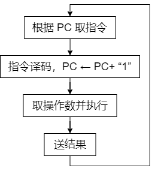
    
    一个程序的执行就是周而复始地执行一条一条指令的过程。每条指令的执行过程包括：**从主存取指令、对指令进行译码、计算下条指令地址、取操作数并执行、将结果送回存储器。**

    **存储程序工作方式规定**：程序执行前，先将程序第一条指令的地址存放到程序计数器（PC） 中，取指令时，将 PC 的内容作为地址访问主存。在每条指令执行过程中，都需要计算下条将执行指令的地址，并送至 PC。若当前指令为顺序型指令，则下条指令地址为 PC 的内容加上当前指令的长度；若当前指令为转跳型指令，则下条指令地址为指令中指定的目标地址。当前指令执行完后，根据 PC 的值到主存中取出的是下条将要执行的指令，因而计算机能周而复始地自动取出并执行一条一条的指令。

2. **从源程序到可执行文件**

    在计算机中编写的 C 语言程序，都必须被转换为一系列的低级机器指令，这些指令按照一种称为可执行目标文件的格式打好包，并以二进制磁盘文件的形式存放起来。

    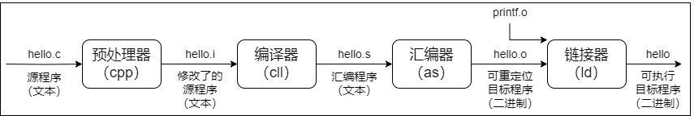

    以 UNIX 系统中的 GCC 编译器程序为例，读取源程序文件 `hello.c`，并把它翻译成一个可执行目标文件 `hello`，整个翻译过程可分为 **四个阶段** 完成：

    - **预处理阶段**：预处理器（cpp）对源程序中以字符 `#` 开头的命令进行处理。例如：将 `#include` 命令后面的 `.h` 文件内容插入程序文件。输出结果是一个以 `.i` 为扩展名的源文件 `hello.i`
    - **编译阶段**：编译器（ccl）对预处理后的源程序进行编译，生成一个汇编语言源程序 `hello.s`。汇编语言源程序中的每条语句都以一种文本格式描述了一条低级机器语言指令
    - **汇编阶段**：汇编器（as）将 `hello.s` 翻译成机器语言指令，把这些指令打包成一个称为可重定位目标文件的` hello.o`，它是一种二进制文件，因此用文本编辑器打开会显示乱码
    - **链接阶段**：链接器（ld）将多个可重定位目标文件和标准库函数合并为一个可执行目标文件，或简称可执行文件。本例中，链接器将 `hello.o` 和标准库函数 `printf` 所在的可重定位目标模块 `printf.o` 合并，生成可执行文件 `hello`。最终生成的可执行文件被保存在磁盘上


3. **程序执行过程描述**

    在图形化界面的操作系统中，可以采用双击图标的方式来执行程序。在 UNIX 系统中，可以通过 shell 命令行解释器来执行程序。通过 shell 命令行解释器执行程序的过程如下：

    ```shell
    unix> ./hello
    hello, world!
    unix>
    ```

    其中，**unix>** 是命令提示符，**./** 表示当前目录，**hello** 是可执行文件的路径名。输入命令后需按下 <kbd>Enter</kbd> 键才会执行，第二行是执行结果。

    - shell 程序将用户从键盘输入的每个字符逐一读入 **CPU 寄存器**，然后保存到 **主存储器中（主存）**
    - 在主存的 **缓冲区形成字符串** `./hello`
    - 接收到 <kbd>Enter</kbd> 键时，shell 调出操作系统的内核程序，由 **内核来加载磁盘** 上的可执行文件 `hello` 到主存中
    - 内核加载完可执行文件中的代码和数据（这里是字符串 `hello, world!\n`）后，将 `hello` 的第一条指令的地址送至 PC，CPU 随后开始执行 `hello` 程序，它将已加载到主存的字符串 `hello, world!\n` 中的每个字符 **从主存中送到 CPU 的寄存器中**
    - 然后将 CPU 寄存器中的字符 **送到显示器**

4. **指令执行过程描述**

    可执行文件代码段是由一条一条机器指令构成的，指令是用 `0` 和 `1` 表示的一串 `0/1` 序列，用来指示 CPU 完成一个特定的原子操作。

    以取数指令（送至运算器的 ACC 中）为例，**其信息流程如下：**

    - **取指令：PC→MAR→M→MDR→IR**

        将 PC 的内容送 MAR，MAR 中的内容直接送地址线，同时控制器将读信号送读/写信号线，主存根据地址线上的地址和读信号，从指定存储单元读出指令，送到数据线上，MDR 从数据线接收指令信息，并传送到 IR 中。

    - **分析指令：OP(IR)→CU**

        指令译码并送出控制信号。控制器根据 IR 中指令的操作码，生成相应的控制信号，送到不同的执行部件。在本例中，IR 中是取数指令，因此读控制信号被送到总线的控制线上。

    - **执行指令：Ad(IR)→MAR→M→MDR→ACC**

        取数操作。将 IR 中指令的地址码送 MAR，MAR 中的内容送地址线，同时控制器将读信号送读/写信号线，从主存中读出操作数，并通过数据线送至 MDR，再传送到 ACC 中。

        每取完一条指令，还须为取下条指令做准备，计算下条指令的地址，即 `(PC)+1→PC`。

### 性能指标

#### 主要性能指标

1. **字长**

    计算机进行一次整数运算（即定点整数运算）所能 **处理的二进制数据的位数**，通常与 CPU 的寄存器位数、加法器有关。

2. **数据通路带宽**

    外部数据总线一次所能 **并行传送信息的位数。**

3. **主存容量**

    主存储器所能 **存储信息的最大容量**，通常以字节来衡量，也可用 **字数 x 字长**（如：512K x 16位）来表示存储容量。其中 MAR 的位数代表存储单元的个数；MDR 的位数代表存储单元的字长。

4. **运算速度**

    - **吞吐量和响应时间**
        - **吞吐量**：指系统在单位时间内处理请求的数量
        - **响应时间**：指从用户向计算机发送一个请求到系统对该请求做出响应并获得所需结果的等待时间
    
    - **主频和 CPU 时钟周期**
        - **主频**：CPU 时钟频率。机器内部主时钟的频率是衡量机器速度的重要参数。主频通常以 Hz（赫兹）为单位，1Hz 表示每秒一次
        - **CPU 时钟周期**：通常为节拍脉冲或 T 周期，即主频的倒数，是 CPU 中最小的时间单位，执行指令的每个动作至少需要一个时钟周期
    
    - **CPI（Cycle Per Instruction）**：执行一条指令所需的时钟周期数
    - **CPU 执行时间**：执行一个程序所花费的时间。CPU 执行时间 = CPU 时钟周期数/主频 = （指令条数 x CPI）/主频
    - **MIPS（Million Instructions Per Second）**：每秒执行多少百万条指令。MIPS = 指令条数/（执行时间 x 10^6^）= 主频/（CPU x 10^6^）
    - **MFLOPS、GFLOPS、TFLOPS、PFLOPS、EFLOPS 和 ZFLOPS**
        - **MFLOPS（Million Floating-point Operations Per Second）**：每秒执行多少百万次浮点运算。MFLOPS = 浮点操作次数/（执行时间 x 10^6^）
        - **GFLOPS（Giga Floating-point Operations Per Second）**：每秒执行多少十亿次浮点运算。GFLOPS = 浮点操作次数/（执行时间 x 10^9^）
        - **TFLOPS（Tera Floating-point Operations Per Second）**：每秒执行多少万亿次浮点运算。TFLOPS = 浮点操作次数/（执行时间 x 10^12^）
        - **PFLOPS** = 浮点操作次数/（执行时间 x 10^15^）
        - **EFLOPS** = 浮点操作次数/（执行时间 x 10^18^）
        - **ZFLOPS** = 浮点操作次数/（执行时间 x 10^21^）

5. **基准程序**

    用来 **进行性能评价** 的一组程序，能很好的反映机器在运行实际负载时的性能。

#### 专业术语

1. **系列机**

    具有 **基本相同的体系结构**，使用相同基本指令系统的多个不同型号的计算机组成的一个产品系列。

2. **兼容**

    指软件或硬件的通用性，即 **运行在某个型号的计算机系统中的硬件/软件也能应用于另一个型号的计算机系统** 时，称这两台计算机在硬件或软件上存在兼容性。

3. **软件可移植性**

    指把使用在某个系列计算机中的软件直接或进行很少的修改就能运行在另一个系列计算机中的可能性。

4. **固件**

    将 **程序固化在 ROM 中组成的部件** 称为固件。固件是一种具有软件特性的硬件，吸收了软/硬件各自的优点，其执行速度快于软件，灵活性优于硬件，是软/硬件结合的产物。例如：目前操作系统已实现了部分固化（把软件永恒地存储于 ROM 中）。 

## 数据的表示和运算

### 数制与编码

#### 进位计数制及其相互转换

在计算机系统内部，所有的信息都是用 **二进制进行编码** 的，这样做的原因有以下几点：

- 二进制只有两种状态，使用有两个稳定状态的物理器件就可以表示二进制数的每一位，制造成本比较低，例如用高低电平或电荷的正负极性都可以很方便地表示 `0` 和 `1`
- 二进制位 `1` 和 `0` 正好与逻辑值 “真” 和 “假” 对应，为计算机实现逻辑运算和程序中的逻辑判断提供了便利条件
- 二进制的编码和运算规则都简单，通过逻辑门电路能方便地实现算术运算

1. **进位计数法**

    在进位计数法中，每个数位所用到的不同数码的个数称为 **基数。**

    每个数码所表示的数值等于该数码本身乘以一个与它所在数位有关的常数，这个常数称为 **位权**。位权最低位为 `0`。

    - **二进制**：基数为 `2`。只有 `0` 和 `1` 两种数字符号，计数 **逢二进一**
    - **八进制**：基数为 `8`。有 `0~7` 共八个不同的数字符号，计数 **逢八进一**
    - **十进制**：基数为 `10`。有 `0~9` 共十个不同的数字符号，计数 **逢十进一**
    - **十六进制**：基数为 `16`。有 `0~9、A、B、C、D、E、F` 共八个不同的数字符号，计数 **逢十六进一**。`A、B、C、D、E、F` 分别表示 `10~15`

2. **不同进制数之间相互转换**

    - **二进制转八进制和十六进制**

        二进制混合数（整数部分，小数部分），在转换时应以小数点为界。**整数部分**，从小数点开始往左数，将二进制数分为 `3` 位（八进制）或 `4` 位（十六进制）一组，最左边根据需要加 `0` 补齐；**小数部分**，从小数点开始往右数，将二进制数分为 `3` 位（八进制）或 `4` 位（十六进制）一组，最右边根据需要加 `0` 补齐。最终使总的位数为 `3` 或 `4` 的整数倍，分别用对应的八进制或十六进制取代。

        例如：二进制数 `1111000010.01101` 分别转换为八进制和十六进制。

        八进制：(1111000010.01101)~2~ = (1702.32)~8~

        ```text
                001     111     000     010     .     011     010
               ╰┈┬┈╯                          ╰┈┬┈╯          ╰┈┬┈╯
        （高位补 0，凑足 3 位）               （分界点） （低位补 0，凑足 3 位）
        ```

        ::: info 每组二进制到八进制转换过程
        - 001 = 0x2^2^ + 0x2^1^ + 1x2^0^ = 0 + 0 + 1 = 1
        - 111 = 1x2^2^ + 1x2^1^ + 1x2^0^ = 4 + 2 + 1 = 7
        - 000 = 0x2^2^ + 0x2^1^ + 0x2^0^ = 0 + 0 + 0 = 0
        - 010 = 0x2^2^ + 1x2^1^ + 0x2^0^ = 0 + 2 + 0 = 2
        - 011 = 0x2^2^ + 1x2^1^ + 1x2^0^ = 0 + 2 + 1 = 3
        - 010 = 0x2^2^ + 1x2^1^ + 0x2^0^ = 0 + 2 + 0 = 2
        :::

        十六进制：(1111000010.01101)~2~ = (3C2.68)~16~

        ```text
                0011     1100     0010     .     0110      1000
               ╰┈┬┈╯                     ╰┈┬┈╯            ╰┈┬┈╯
        （高位补 0，凑足 4 位）          （分界点）  （低位补 0，凑足 4 位）
        ```

        ::: info 每组二进制到十六进制转换过程
        - 0011 = 0x2^3^ + 0x2^2^ + 1x2^1^ + 1x2^0^ = 0 + 0 + 2 + 1 = 3
        - 1100 = 1x2^3^ + 1x2^2^ + 0x2^1^ + 0x2^0^ = 8 + 4 + 0 + 0 = 12 = C
        - 0010 = 0x2^3^ + 0x2^2^ + 1x2^1^ + 0x2^0^ = 0 + 0 + 2 + 0 = 2
        - 0110 = 0x2^3^ + 1x2^2^ + 1x2^1^ + 0x2^0^ = 0 + 4 + 2 + 0 = 6
        - 1000 = 1x2^3^ + 0x2^2^ + 0x2^1^ + 0x2^0^ = 8 + 0 + 0 + 0 = 8
        :::
    
    - **八进制和十六进制转二进制**

        只需将每位改为 `3` 位或 `4` 位二进制数即可（必要时去掉整数最高位或小数最低位的 `0`）。
    
    - **八进制和十六进制之间转换**

        八进制转十六进制（或十六进制转八进制）时，先将八进制（或十六进制）数转换为二进制，然后由二进制再转换为十六进制（或八进制）数。
    
    - **任意进制转十进制**

        将任意进制数的各位数码与它们的权值相乘，再把乘积相加，结果就是十进制数。这种方法称为 **按权展开相加法。**

        例如：二进制数 `11011.1` 转换为十进制。

        (11011.1)~2~ = 1x2^4^ + 1x2^3^ + 0x2^2^ + 1x2^1^ + 1x2^0^ + 1x2^-1^ = 27.5
    
    - **十进制转任意进制**

        十进制转任意进制，常采用 **基数乘除法**。这种转换方法对十进制整数部分用 **除基取余法**；对小数部分用 **乘基取整法**，最后将整数部分和小数部分的转换结果拼接起来。

        - **除基取余法**：整数部分除基取余，最先取得的余数为数的最低位，最后取得的余数为数的最高位（即除基取余，先余为低，后余为高），商为 `0` 时结束
        - **乘基取整法**：小数部分乘基取整，最先取得的整数为数的最高位，最后取得的整数为数的最低位（即乘基取整，先整为高，后整为低），乘积为 `1.0`（或满足精度要求）时结束

        例如：十进制数 `123.6875` 转换成二进制。

        整数部分：123 = (1111011)~2~

        ```text
            除基      取余
        2 │ 123        1    最低位
          └────
          2 │ 61       1
            └────
          2 │ 30       0
            └────
          2 │ 15       1
            └────
            2 │  7     1
              └────
            2 │  3     1
              └────
            2 │  1     1    最高位
              └────
                 0
        ```

        小数部分：0.6875 = (0.1011)~2~

        ```text
              乘基     取整
            0.6875
        x        2
        ────────────
            1.3750      1    最高位
            0.3750
        x        2
        ────────────
            0.7500      0
        x        2
        ────────────
            1.5000      1
            0.5000
        x        2
        ────────────
            1.0000      1    最低位
            ……
        ```
    
        因此十进制数 123.6875 转换成二进制数为 (1111011.1011)~2~

    ::: warning
    在计算机中，小数和整数不一样，整数可以连续表示，但小数是离散的，所以并不是每个十进制小数都可以准确地用二进制表示。例如：`0.3`，无论经过多少次乘二取整转换都无法得到精确的结果。但任意一个二进制小数都可以用十进制小数表示
    :::

3. **真值和机器数**

    在日常生活中，通常用正号、负号来分别表示正数（正号可省略）和负数，如：`+15`、`-8` 等。这种带 `+` 或 `-` 符号的数称为 **真值**。真值是机器数所代表的实际值。
    
    在计算机中，通常将数的符号和数值部分一起编码，将数据的符号数字化，通常用 `0` 表示 **正**，用 `1` 表示 **负**。这种把符号（+/-）“数字化” 的数称为 **机器数**。常用的有原码、补码、反码和移码表示法。如：`0,101`（这里的逗号 `,` 仅为区分符号位与数值位）表示 `+5`。

#### BCD 码

**二进制编码的十进制数（Binary-Coded Decimal，BCD）** 通常采用 `4` 位二进制数来表示一位十进制数中的 `0~9` 这 `10` 个数码。这种编码方法使二进制数和十进制数之间的转换得以快速进行。但 `4` 位二进制数可以组合出 `16` 种代码，因此必有 `6` 种状态为余状态。

**常用的 BCD 码：** 8421 码、余 3 码、2421 码。

#### 定点数的编码表示

根据小数点的位置是否固定，在计算机中有两种数据格式：**定点表示** 和 **浮点表示**。在现代计算机中，通常用定点补码整数表示整数，用定点原码小数表示浮点数的尾数部分，用移码表示浮点数的阶码部分。

1. **机器数的定点表示**

    定点表示法用来表示 **定点小数** 和 **定点整数。**

    - **定点小数**：是纯小数

        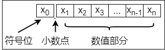

        约定小数点位置在符号位之后、有效数值部分最高位之前。例如：**x~0~.x~1~x~2~……x~n~**。其中 **x~0~** 为符号位，**x~1~\~x~n~** 为数值的有效部分也称为 **数尾**，**x~1~** 为最高有效位。

    - **定点整数**：是纯整数

        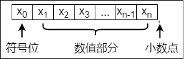

        约定小数点位置在有效数值部分最低位之后。例如：**x~0~x~1~x~2~……x~n~.**。其中 **x~0~** 为符号位，**x~1~\~x~n~** 为 **数尾**，**x~n~** 为最低有效位。

    定点数编码表示法主要有四种：原码、补码、反码和移码。

2. **定点表示法**

    - **原码**：用机器数的最高位表示数的符号，其余各位表示数的绝对值

        **纯小数的原码定义：**

        $$
        [x]_\text{原} =
        \begin{cases}
        x, \hspace{2.85cm} 0 \leq x \lt 1 \\
        1 - x = 1 + |x|, \hspace{0.5cm} -1 \lt x \leq 0
        \end{cases}
        ([x]_\text{原 是原码机器数，x 是真值})
        $$

        例如：x~1~ = +0.1101，x~2~ = -0.1101，字长为 `8` 位。
        
        原码表示为：

        - [x~1~]~原~ = 0.1101000
        - [x~2~]~原~ = 1 - (-0.1101) = 1.0000000 + 0.1101000 = 1.1101000
        
        其中最高位为符号位。小数的 **符号位** 与 **数值位** 之间用 **小数点** 隔开。

        若字长为 `n + 1`，则原码小数的表示范围为 -(1 - 2^-n^) ≤ x ≤ 1 - 2^-n^（关于原点对称）。

        **纯整数的原码定义：**

        $$
        [x]_\text{原} =
        \begin{cases}
        0,x, \hspace{2.85cm} 0 \leq x \lt 2^n \\
        2^n - x = 2^n + |x|, \hspace{0.5cm} -1 \lt x \leq 0
        \end{cases}
        (\text{x 是真值，n 是整数位数})
        $$

        2^n^ 中的 `n` 是整数位数，也就是数值有效部分的位数。

        例如：x~1~ = +1110，x~2~ = -1110，字长为 `8` 位。
        
        原码表示为：

        - [x~1~]~原~ = 0,0001110
        - [x~2~]~原~ = 2^7^ - (-1110) = 128 + 1110 = 10000000 + 00001110 = 1,0001110
        
        2^7^ 中的 `7` 为 **字长（8）- 符号位（1）** 后所得的 **整数位数（7）**
        
        其中最高位为符号位。整数的 **符号位** 与 **数值位** 之间用 **逗号** 隔开。

        若字长为 `n + 1`，则原码整数的表示范围为 -(2^n^ - 1) ≤ x ≤ 2^n^ - 1（关于原点对称）。

        ::: tip
        真值零的原码表示有正零和负零两种：[+0]~原~ = **0**0000；[-0]~原~ = **1**0000
        :::
    
    - **补码**：加减运算统一采用加法运算实现

        ::: details 模（mod）的概念
        **模（mod）** 是指一个计量系统的计数范围，例如：时钟。计算机也可以也可以看成一个计量机器，因为计算机的字长是定长的，即存储和处理的位数是有限的，因此它也有一个计量范围，即都存在一个模。如：时钟的计量范围是 0~11，**模 = 12**。表示 `n` 位的计算机计量范围是 0~2^n^ -1，**模 = 2^n^**。模实质上是计量器产生 “溢出” 的量，它的值在计量器上表示不出来，计量器上只能表示出 **模的余数**。任何有模的计量器，均可 **化减法为加法运算（就是取反后加 1）**
        
        假设当前时针指向 `8` 点，而准确时间是 `6` 点，调整时间可有以下两种拨法：
        
        1. 倒拨 `2` 小时，即 `8 - 2 = 6`
        2. 顺拨 10 小时，`8 + 10 = 12 + 6 = 6`
        
        即 `8 - 2 = 8 + 10 = 8 + 12 - 2(mod 12)`。在 `12` 为模的系统里，加 10 和减 2 效果是一样的，因此凡是减 2 运算，都可以用加 10 来代替。若用一般公式可表示为：`a - b = a - b + mod = a + mod - b`。对模而言，`2` 和 `10` **互为补数**。实际上，以 `12` 为模的系统中，11 和 1、8 和 4、9 和 3、7 和 5、6 和 6 都有这个特性，共同的特点是 **两者相加等于模**。对于计算机，其概念和方法完全一样。`n` 位计算机，设 `n = 8`，所能表示的最大数是 `11111111`，若再加 1 成 `100000000`（9 位），但因只有 `8` 位，最高位 1 自然丢失（相当于丢失一个模）。又回到了 `00000000`，所以 `8` 位二进制系统的模为 **2^8^**。在这样的系统中减法问题也可以化成加法问题，只需 **把减数用相应的补数表示** 就可以了。把补数用到计算机对数的处理上，就是补码
        :::

        **纯小数的补码定义：**

        $$
        [x]_\text{补} = 
        \begin{cases}
        x, \hspace{2.65cm} 0 \leq x \lt 1 \\
        2 + x = 2 - x, \hspace{0.5cm} -1 \lt x \leq 0
        \end{cases}
        (mod \space 2)
        $$

        例如：x~1~ = +0.1001，x~2~ = -0.0110，字长为 `8` 位。
        
        补码表示为：

        - [x~1~]~补~ = 0.1001000
        - [x~2~]~补~ = 2 + (-0.0110) = 2 - 0.0110 = 10.0000000 - 0.0110000 = 1.1010000

        ::: info 10.0000000 - 0.0110000 运算过程
        由于十进制 `25 - 9 = 16` 在做减法运算时，首先 `个位（5）- 9` 不够减，就向前借一位（**借 10**）变成 `个位（10 + 5）- 9`，十位 `2` 就变成 `1`，最后得到的结果是 `16`

        因此二进制 `10.0000000 - 0.0110000` 在做减法运算时，不够减时，向前借一位（**借 2**）变成 `1.1120000 - 0.0110000`，最后得到的结果是 `1.1010000`

        ```text
         10.0000000  ->    1.1120000
        - 0.0110000  ->  - 0.0110000
                         = 1.1010000
        ```

        :::

        若字长为 `n + 1`，则补码小数的表示范围为 -1 ≤ x ≤ 1 - 2^-n^（比原码多表示 -1）。

        **纯整数的补码定义：**

        $$
        [x]_\text{补} =
        \begin{cases}
        0,x, \hspace{3.6cm} 0 \leq x \lt 2^n \\
        2^{n+1} + x = 2^{n+1} - |x|, \hspace{0.5cm} -2^n \lt x \leq 0
        \end{cases}
        (mod \space 2^{n+1})
        $$

        例如：x~1~ = +1010，x~2~ = -1101，字长为 `8` 位。
        
        补码表示为：

        - [x~1~]~补~ = 0,0001010
        - [x~2~]~补~ = 2^(7+1)^ + (-1101) = 2^8^ - 1101 = 256 - 1101 = 100000000 - 00001101 = 1,1110011
        
        ::: info 100000000 - 00001101 运算过程
        
        ```text
         100000000  ->    11111112
        - 00001101  ->  - 00001101
                        = 11110011
        ```

        :::

        若字长为 `n + 1`，则补码整数的表示范围为 -2^n^ ≤ x ≤ 2^n^ - 1（比原码多表示 -2^n^）。

        ::: tip
        零的补码表示是唯一的：[+0]~补~ = [-0]~补~ = 0.0000
        :::

        **补码与真值之间的转换:**
        
        对补码而言，正数和负数的转换不同。正数补码的转换方式与原码的相同。
        
        - **真值转换为补码**：对于正数，与原码的方式一样。对于负数，符号位取 1，其余各位由真值 **各位取反，末位加 1** 得到
        - **补码转换为真值**：若符号位为 0，与原码的方式一样。若符号位为 1，真值的符号为负，数值部分各位由补码 **各位取反，末位加 1** 得到

        **变形补码：**

        变形补码又称模 4 补码，双符号位的补码小数，定义为：

        $$
        [x]_\text{补} =
        \begin{cases}
        x, \hspace{2.85cm} 0 \leq x \lt 1 \\
        4 + x = 4 - |x|, \hspace{0.5cm} -1 \lt x \leq 0
        \end{cases}
        (mod \space 4)
        $$

        模 4 补码双符号位 00 表示正，11 表示负，用在完全算术运算的 ALU 部件中。

        将 [x]~补~ 的符号位与数值位一起右移并保持原符号位的值不变，可实现除法功能。

    - **反码表示法**：反码通常作为由原码求补码或由补码求原码的中间过渡

        负数的补码可采用各位取反，末位加 1 的方法得到，如果 **仅各位求反而末尾不加 1**，那么就可得到负数的反码表示。因此 **负数反码的定义** 就是在相应的补码表示中末位减 1。正数反码的定义和相应的补码（或原码）表示相同。

        **纯小数的反码定义：**

        $$
        [x]_\text{反} =
        \begin{cases}
        x, \hspace{2.6cm} 0 \leq x \lt 1 \\
        (2 - 2^{-n}) + x, \hspace{0.5cm} -1 \lt x \leq 0
        \end{cases}
        (mod \space 2 - 2^{-n})
        $$

        例如：x~1~ = +0.0110，x~2~ = -0.0110，字长为 `8` 位。
        
        反码表示为：

        - [x~1~]~反~ = 0.0110000
        - [x~2~]~反~ = (2 - 2^-7^) + (-0.0110) = 2 + (-128) - 0.0110000 = 10.0000000 + 1.1111111 - 0.0110000 = 11.1111111 - 0.0110000 = 11.1001000 = 1.1001000

        ::: info
        由于字长为 `8` 位，所以将负数的反码最高位去掉
        :::

        若字长为 `n + 1`，则反码整数的表示范围为 -(1 - 2^-n^) ≤ x ≤ 1 - 2^-n^，关于原点对称（与原码相同）。

        **纯整数的反码定义：**

        $$
        [x]_\text{反} =
        \begin{cases}
        0,x, \hspace{2.55cm} 0 \leq x \lt 2^n \\
        (2^{n+1} - 1) + x, \hspace{0.5cm} -2^n \lt x \leq 0
        \end{cases}
        (mod \space 2^{n+1} - 1)
        $$

        例如：x~1~ = +1010，x~2~ = -1101，字长为 `8` 位。
        
        反码表示为：

        - [x~1~]~反~ = 0,0001010
        - [x~2~]~反~ = (2^(7+1)^ - 1) + (-1101) = 2^8^ - 1 - 1101 = 100000000 - 00000001 - 00001101 = 11111111 - 00001101 = 1,1110011

        若字长为 `n + 1`，则反码整数的表示范围为 -(2^n^ - 1) ≤ x ≤ 2^n^ - 1，关于原点对称（与原码相同）。
        
        **反码表示存在以下几个方面的不足：**

        - `0` 的表示不唯一（即存在正负 0），[+0]~反~ = **0**0000；[-0]~反~ = **1**1111
        - 表示范围比补码少一个最小负数
        
        反码在计算机中很少使用，通常用作数码变换的中间表示形式。

        反码跟原码是正数时，一样；负数时，反码就是原码符号位除外，其他位按位取反。
    
    - **移码表示法**：移码常用来表示浮点数的阶码。只能表示整数

        移码就是在真值 X 上加上一个常数（偏置值），通常这个常熟取 2^n^，相当于 X 在数轴上向正方向偏移了若干单位。

        **移码定义：**

        $$[x]_\text{移} = 2^n + x \text{（}-2^n \leq x \lt 2^n \text{，其中机器字长为 \space n + 1）}$$

        例如：x~1~ = +10101，x~2~ = -10101，字长为 `8` 位。

        若字长为 `n + 1`，则移码整数的表示范围为 -2^n^ ≤ x ≤ 2^n^ - 1

        移码表示为：

        - [x~1~]~移~ = 2^7^ + 10101 = 128 + 00010101 = 10000000 + 00010101 = 1,0010101
        - [x~2~]~移~ = 2^7^ + (-10101) = 128 - 10101 = 10000000 - 00010101 = 0,1101011

        **移码特点：**

        - 移码中零的表示唯一，[+0]~移~ = 2^n^ + 0 = [-0]~移~ = 2^n^ - 0 = **1**00……0（n 个 `0`）
        - 一个真值的移码和补码仅差一个符号位，[x]~补~的符号位取反即得[x]~移~（“1” 表示正，“0” 表示负，这与其他机器数的符号位取值正好相反），反之亦然
        - 移码全 `0` 时，对应真值的最小值 -2^n^；移码全 `1` 时，对应真值的最大值 2^n^ - 1
        - 移码保持了数据原有的大小顺序，移码大真值就大，移码小真值就小

3. **原码、补码、反码和移码这四种编码表示的总结**

    - 原码、补码、反码的符号位相同，正数的机器码相同
    - 原码、反码的表示在数轴上对称，二者都存在 `+0` 和 `-0` 两个零
    - 补码、移码的表示在数轴上不对称，零的表示唯一，它们比原码、反码多表示一个数
    - 整数的补码、移码的符号位相反，数值位相同
    - 负数的反码、补码末位相差 `1`
    - 原码很容易判断大小。而负数的反码、补码很难直接判断大小，可采用如下规则快速判断：对于负数，数值部分越大，绝对值越小，真值越大（更靠近 `0`）

#### 整数的表示

1. **无符号整数表示**

    当一个编码的 **全部二进制位均为数值位而没有符号位** 时，该编码表示就是无符号整数，也直接称为 **无符号数**。此时，默认数的符号为正。由于无符号整数省略了一位符号位，所以在字长相同的情况下，它能表示的最大数比带符号整数能表示的大。例如：`8` 位无符号整数，对应的表示范围为 0~2^8^ - 1，即最大数为 `255`，而 `8` 位带符号整数的最大数是 `127`。

    一般在全部是正数运算且不出现负值结果的场合下，使用无符号整数表示。例如：可用无符号整数进行地址运算，或用它来表示指针。

2. **带符号整数的表示**

    将符号数值化，并将符号位放在有效数字的前面，就组成了带符号整数。虽然上面介绍的原码、补码、反码和移码都可以用来表示带符号整数，但补码表示有其明显的优势：

    - 与原码和反码相比，`0` 的补码表示唯一
    - 与原码和移码相比，补码运算规则比较简单，且符号位可以和数值位一起参加运算
    - 与原码和反码相比，补码比原码和反码多表示一个最小负数

    计算机中的带符号整数都用补码表示，故 `n` 位带符号整数的表示范围是 -2^n-1^~2^n-1^ - 1。

### 运算方法和运算电路

#### 基本运算部件

在计算机中，**运算器** 由算术逻辑单元（Arithmetic Logic Unit，ALU）、移位器、状态寄存器和通用寄存器组等组成。运算器的基本功能包括加、减、乘、除四则运算，与、或、非、异或等逻辑运算，以及移位、求补等操作。`ALU` 的核心部件是 **加法器。**

1. **一位全加器**

    全加器（FA）是 **最基本的加法单元**，有加数 $A_i$、加数 $B_i$ 与低位传来的进位 $C_{i-1}$ 共三个输入，有本位和 $S_i$，与向高位的进位 $C_i$，共两个输出。全加器的逻辑表达式如下：

    - **和表达式**：$S_i = A_i \oplus B_i \oplus C_{i-1} \text{（}A_i \text{、}B_i \text{、}C_{i-1} \text{中有奇数个 1 时，} S_i = 1 \text{；否则} S_i = 0 \text{）}$
    - **进位表达式**：$C_i = A_iB_i + (A_i \oplus B_i)C_{i-1}$

    一位全加器对应的逻辑结构和逻辑符号如下所示：

    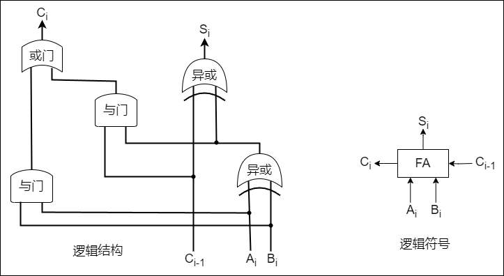

2. **串行进位加法器**

    把 `n` 个全加器相连可得到 `n` 位加法器称为 **串行进位加法器**。串行进位又称 **行波进位**，每级进位直接依赖于前一级的进位，即进位信号是逐级形成的。

    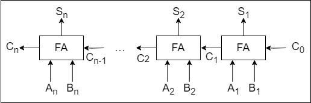

    在串行进位加法器中，低位运算产生进位所需的时间将影响高位运算的时间。因此，串行进位加法器的 **最长运算时间主要是由进位信号的传递时间决定的**，位数越多延迟时间就越长，而全加器本身的求和延迟只为次要因素，所以加快进位产生和提高传递的速度是关键。

3. **并行进位加法器**

    令 $G_i = A_iB_i \text{，}P_i = A_i \oplus B_i$，全加器的进位表达式为 $C_i = G_i + P_iC_{i-1} \text{（}G_i = 1 \text{或} P_iC_{i-1} = 1 \text{时，}C_i = 1 \text{）}$ 式中，当 $A_i$ 与 $B_i$ 都为 `1` 时，$C_i = 1$，即有进位信号产生，所以称 $A_iB_i$ 为进位产生函数（本地进位），用 $G_i$ 表示。$A_i \oplus B_i = 1$ 且 $C_{i-1} = 1$ 时，$C_i = 1$。可视为 $A_i \oplus B_i = 1$，第 `i - 1` 位的进位信号 $C_{i-1}$ 可以通过本位向高位传送。因此称 $A_i \oplus B_i$ 为进位传递函数（进位传递条件），用 $P_i$ 表示。
    
    将 $G_i$ 和 $P_i$ 代入前面 $C_1 \backsim C_4$ 的公式，可得

    $$
    \begin{matrix*}[l]
    C_1 = G_1 + P_1C_0 \\
    C_2 = G_2 + P_2C_1 = G_2 + P_2G_1 + P_2P_1C_0 \\
    C_3 = G_3 + P_3C_2 = G_3 + P_3G_2 + P_3P_2G_1 + P_3P_2P_1C_0 \\
    C_4 = G_4 + P_4C_3 = G_4 + P_4G_3 + P_4P_3G_2 + P_4P_3P_2G_1 + P_4P_3P_2P_1C_0
    \end{matrix*}
    $$

    从上述表达式可以看出，$C_i$ 仅与 $A_i \text{、}B_i$ 及最低进位 $C_0$ 有关，相互间的进位没有依赖关系。只要 $A_1 \backsim A_4 \text{、}B_1 \backsim B_4$ 和 $C_0$ 同时到达，就可几乎同时形成 $C_1 \backsim C_4$，并且同时生成各位的和。

    实现上述逻辑表达式的电路称为 **先行进位**（也称超前进位）部件，简称 CLA 部件。通过这种进位方式实现的加法器称为 **全先行进位加法器**。因为各个进位是并行产生的，所以是一种并行加法器。

    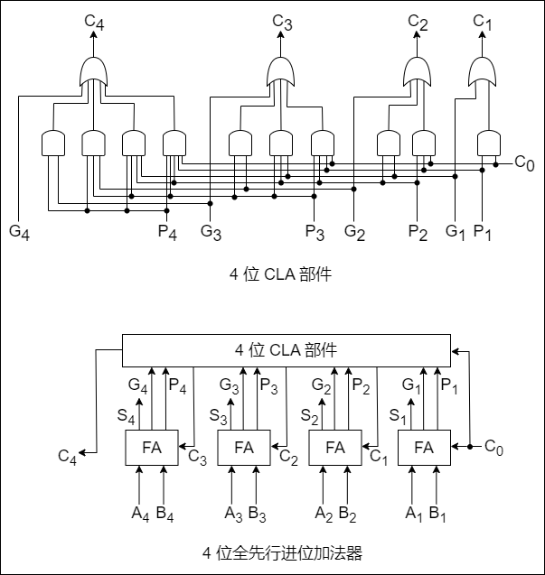

    这种进位方式是快速的，与位数无关。但随着加法器位数的增加，$C_i$ 的逻辑表达式会变得越来越长，这会使电路结构变得很复杂。因此，当位数较多时采用全先行进位是不现实的。

    更多位数的加法器可通过将 CLA 部件或全先行进位加法器串接起来实现。例如：对于 16 位加法器，可以分成 4 组，组内为 4 位先行进位，组间串行进位。为了进一步提高运算速度，也可以采用组内和组间都并行的进位方式。因为两级先行进位加法器组内和组间都采用先行进位方式，其延迟和加法器的位数没有关系。所以，通常采用两级或多级先行进位加法器。

4. **带标志加法器**

    无符号数加法器只能用于两个无符号数相加，不能进行带符号整数的加/减运算。为了能进行带符号整数的加/减运算，还需要在无符号数加法器的基础上 **增加相应的逻辑门电路**，使得加法器不仅能计算和/差，还要能生成相应的标志信息。为了加快加法运算的速度，实际电路一定使用多级先行进位方式。

    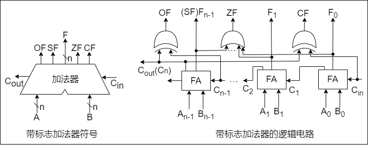

5. **算术逻辑单元（ALU）**

    ALU 是一种功能较强的组合逻辑电路，它能 **进行多种算术运算和逻辑运算**。由于加、减、乘、除运算最终都能归结为加法运算，因此 ALU 的核心是带标志加法器，同时也能执行 “与”、“或”、“非” 等逻辑运算。同时，ALU 也可以实现左移或右移的移位操作。

    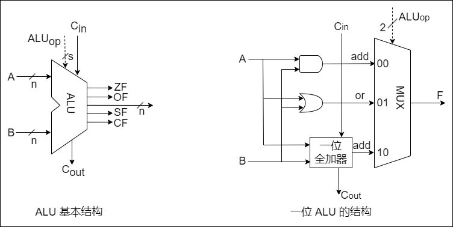

#### 定点数的移位运算

1. **算术移位**

    算术移位的对象是有符号数，在移位过程中符号位保持不变。

    对于正数，由于 [x]~原~ = [x]~补~ = [x]~反~ = 真值，因此移位后出现的空位均以 0 填充。对于负数，由于原码、补码、反码的表示形式不同，因此当机器数移位时，对其空位的填充规则也不同。

    对于带符号数，左移一位若不产生溢出，相当于乘以二（与十进制的左移一位相当于乘以十类似），右移一位，若不考虑因移出而舍去的末位尾数，相当于除以二。

    <table style="text-align:center">
      <tr>
        <th>正负数</th>
        <th>码制</th>
        <th>填充代码</th>
      </tr>
      <tr>
        <td>正数</td>
        <td>原码、补码、反码</td>
        <td>0</td>
      </tr>
      <tr>
        <td rowspan="4">负数</td>
        <td>原码</td>
        <td>0</td>
      </tr>
      <tr>
        <td rowspan="2">补码</td>
        <td>左移填 0</td>
      </tr>
      <tr>
        <td>右移填 0</td>
      </tr>
      <tr>
        <td>反码</td>
        <td>1</td>
      </tr>
    </table>

    分析由原码得到补码的过程发现，当对其由低位向高位找到第一个 `1` 时，在此 `1` 左边的各位均与对应的反码相同，而在此 `1` 右边的各位（包括此 `1` 在内）均与对应的原码相同。故负数的补码左移时，因空位出现在低位，则添补的代码与原码相同，即添 `0`；右移时因空位出现在高位，则添补的代码应与反码相同，即添 `1`。

2. **逻辑移位**
    
    逻辑移位将操作数视为无符号数。

    **移位规则**：逻辑左移时，高位移丢，低位添 `0`；逻辑右移时，低位移丢，高位添 `0`。

3. **循环移位**

    循环移位分为带进位标志位 `CF` 的循环移位（大循环）和不带进位标志位的循环移位（小循环）。

    **循环移位的主要特点**：移出的数位又被移入数据中，而是否带进位则要看是否将进位标志位加入循环位移。例如：带进位位的循环左移，就是数据位连同进位标志位一起左移，数据的最高位移入进位标志位 `CF`，而进位位则依次移入数据的最低位。
    
    循环移位操作特别适合将数据的低字节数据和高字节数据互换。

#### 定点数的加减运算

事实上，在机器内部并没有小数点，只是人为约定了小数点的位置，小数点约定在最左边就是 **定点小数**，小数点约定在最右边就是 **定点整数**。因此，在运算过程中，可以不用考虑对应的定点数是小数还是整数，而只需关心它们的符号位和数值位即可。

1. **补码的加减法运算**

    补码加减运算规则简单，易于实现。补码加减运算的公式如下（设机器字长为 `n + 1`）：

    $$
    [A + B]_\text{补} = [A]_\text{补} + [B]_\text{补} \text{（}mod \space 2^{n+1} \text{）} \\
    [A - B]_\text{补} = [A]_\text{补} + [-B]_\text{补} \text{（}mod \space 2^{n+1} \text{）}
    $$

    **补码运算的特点如下：**

    - 按二进制运算规则运算，逢二进一
    - 若做加法，两数的补码直接相加；若做减法，则将被减数与减数的机器负数相加
    - 符号位与数值位一起参与运算，加、减运算结果的符号位也在运算中直接得出
    - 最终运算结果的高位丢弃，保留 `n+1` 位，运算结果亦为补码

    例如：设机器字长为 `8` 位（含 `1` 位符号位），*A = 15，B = 24*，求 *[A + B]~补~* 和 *[A - B]~补~。*

    *A = +15 = +0001111，B = +24 = +0011000*；得 *[A]~补~ = 00001111，[B]~补~ = 00011000，[-B]~补~ = 11101000*。所以
    
    *[A + B]~补~ = 0000111 + 00011000 = 0010011*，符号位为 `0`，对应真值为 `+39`。
    *[A - B]~补~ = [A]~补~ + [-B]~补~ = 0001111 + 11101000 = 11110111*，符号位为 `1`，对应真值为 `-9`。

2. **补码加减运算电路**

    已知一个数的补码表示为 $Y$，则这个数的负数的补码为 $\text{\={Y}} + 1$，因此，只要在原加法器的 $Y$ 输入端加 $n$ 个反向器以实现各位取反的功能，然后加一个 2 选 1 多路选择器，用一个控制端 Sub 来控制，以选择是将 $Y$ 输入加法器还是将 $\text{\={Y}}$ 输入加法器，并将控制端 Sub 同时作为低位进位送到加法器。
    
    可通过标志信息来区分带符号整数运算结果和无符号整数运算结果。

3. **溢出判别方法**

    仅当两个符号相同的数相加或两个符号相异的数相减才可能产生溢出。如：两个正数相加，而结果的符号位却为 `1`（结果为负）；一个负数减去一个正数，结果的符号位为 `0`（结果为正）。

    补码定点数加减运算溢出判断的方法有三种：

    - 采用一位符号位
    - 采用双符号位
    - 采用一位符号位根据数据位的进位情况判断溢出


4. **原码的加减法运算**

    设 *[x]~原~ = x~s~x~1~x~2~……x~n~* 和 *[y]~原~ = y~s~.y~1~y~2~……y~n~*，进行加减运算的规则如下：

    **加法规则**：先判断符号位，若相同，则绝对值相加，结果符号位不变；若不同，则做减法，绝对值大的数减去绝对值小的数，结果符号位与绝对值大的数相同。
    **减法规则**：两个原码表示的数相减，首先将减数符号取反，然后将被减数与符号取反后的减数原码加法进行运算。

    ::: tip
    运算时注意机器字长，当左边位出现溢出时，将溢出位丢掉
    :::

#### 定点数的乘除运算

1. **定点数的乘法运算**

    乘法运算由 **累加** 和 **右移** 操作实现，可分为原码一位乘法和补码一位乘法。

    - **原码一位乘法**

        原码一位乘法的特点是 **符号位与数值位是分开求的**，乘积符号由两个数的符号位 “异或” 形成，而乘积的数值部分则是两个数的绝对值相乘之积。

        设 *[x]~原~ = x~s~x~1~x~2~……x~n~* 和 *[y]~原~ = y~s~.y~1~y~2~……y~n~*，则运算规则如下：

        1. 被乘数和乘数均取绝对值参加运算，看作无符号数，符号位为 $x_s \oplus y_s$
        2. 部分积是乘法过程的中间结果。乘数的每一位 *y~i~* 乘以被乘数得 *Xxy~i~* 后，将该结果与前面所得的结果累加，就是部分积，初值为 `0`
        3. 从乘数的最低位 *y~n~* 开始判断：若 *y~n~ = 1*，则部分积加上被乘数 |x|，然后右移一位；若 *y~n~ = 0*，则部分积加上 0，然后右移一位
        4. 重复步骤 3，判断 n 次

        由于参与运算的是两个数的绝对值，因此运算过程中的右移操作均为逻辑右移。

        ::: tip
        考虑到运算过程中部分积和乘数做加法时，可能出现部分积大于 1 的情况（产生进位），但此刻并非溢出，所以部分积和被乘数取双符号位
        :::

        例如：*x = -0.1101，y = 0.1011*，采用原码一位乘法求 `x · y`。

        *|x| = 00.1101，|y| = 00.1011*。过程如下：

        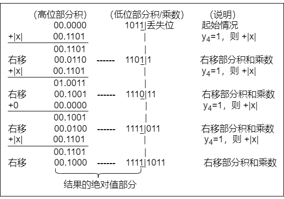

        符号位 $P_s = x_s \oplus y_s = 1 \oplus 0 = 1$，得 *x · y = -0.10001111*。

    - **补码一位乘法（Booth 算法）**

        这是一种有符号数的乘法，采用相加和相减操作计算补码数据的乘积。

        |  y~n~（高位）  |  y~n+1~（低位）  |  操作  |
        |  :----:  |  :----:  |  :----  |
        |  0  |  0  |  部分积右移一位  |
        |  0  |  1  |  部分积加 [x]_补，右移一位  |
        |  1  |  0  |  部分积加 [-x]_补，右移一位 |
        |  1  |  1  |  部分积右移一位  |

        设 *[x]~补~ = x~s~x~1~x~2~……x~n~* 和 *[y]~补~ = y~s~.y~1~y~2~……y~n~*，则运算规则如下：

        1. 符号位参与运算，运算的数均以补码表示
        2. 被乘数一般取双符号位参与运算，部分积取双符号位，初值为 0，乘数取单符号位
        3. 乘数末位增设附加位 *y~n~ + 1*，初值为 0
        4. 根据（y~n~，y~n+1~）的取值来确定操作
        5. 移位按补码右移规则进行
        6. 按照上述算法进行 `n + 1` 步操作，但第 `n + 1` 步不再移位（共进行 `n + 1` 次累加和 `n` 次右移），仅根据 *y~n~* 与 *y~n+1~* 的比较结果做相应的运算

        例如：*x = -0.1101，y = 0.1011*，采用 Booth 算法求 `x · y`。

        *[x]~补~ = 11.0011，[-x]~补~ = 00.1101，[y]~补~ = 0.1011*。过程如下：

        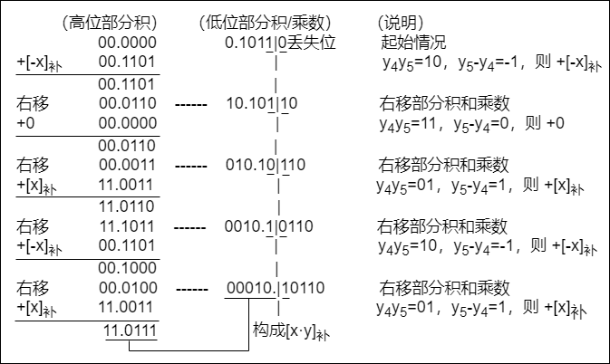

        所以 $[x · y]_\text{补} = 1.01110001$，得 *x · y = -0.10001111*。

2. **定点数的除法运算**

    除法运算可转换成 **累加一左移**（逻辑左移），分为原码除法和补码除法。

    - **符号扩展**

        在算术运算中，有时必须把带符号的定点数转换成具有不同位数的表示形式。例如：某个程序需要将一个 `8` 位整数与另外一个 `32` 位整数相加，要想得到正确的结果，在将 `8` 位整数与 `32` 位整数相加之前，必须将 `8` 位整数转换成 `32` 位整数形式，这称为 **符号扩展。**

        **正数的符号扩展** 非常简单，即符号位不变，新表示形式的所有扩展位都用 `0` 进行填充。
        
        **负数的符号扩展** 方法则根据机器数的不同而不同。原码表示负数的符号扩展方法与正数相同，只不过此时符号位为 `1`；补码表示负数的符号扩展方法：原有形式的符号位移动到新形式的符号位上，新表示形式的所有附加位都用 `1`（对于整数）或 `0`（对于小数）进行填充。

    - **原码除法运算（不恢复余数法）**

        **原码不恢复余数法** 也称原码加减交替除法。特点是商符和商值是分开进行的，减法操作用补码加法实现，商符由两个操作数的符号位 “异或” 形成。求商值的规则如下：

        设被除数 *[X]~原~ = x~s~x~1~x~2~……x~n~*，除数 *[Y]~原~ = y~s~.y~1~y~2~……y~n~*，则

        1. 商的符号：$Q_s = x_s \oplus y_s$
        2. 商的数值：$|Q| = |X| / |Y|$

        求 $|Q|$ 的不恢复余数法运算规则如下：

        1. 先用被除数减去除数（$|X| - |Y| = |X| + (-|Y|) = |X| + [-|Y|]_\text{补}$），当余数为正时，商上 `1`，余数和商左移一位，再减去除数；当余数为负时，商上 `0`，余数和商左移一位，再加上除数。
        2. 当第 `n+1` 步余数为负时，需加上 $|Y|$ 得到第 `n+1` 步正确的余数（余数与被除数同号）。

        例如：*x = 0.1011，y = 0.1101*，采用原码加减交替除法求 `x/y`。

        *|x| = 0.1011，|y| = 0.1101，[|y|]~补~ = 0.1101，[-|y|]~补~ = 1.0011*。过程如下：

        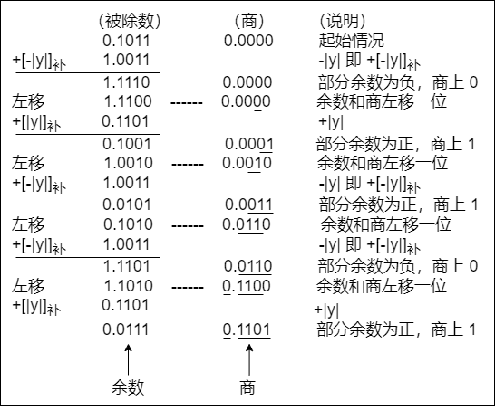

        因此 $Q_s = x_s \oplus y_s = 0 \oplus 0 = 0$，得 *x/y = +0.1101*，余 *0.0111×2^4^*。

    - **补码除法运算（加减交替法）**

        **补码一位除法** 的特点是，符号位与数值位一起参加运算，商符自然形成。除法第一步根据被除数和除数的符号决定是做加法还是减法；上商的原则根据余数和除数的符号位共同决定，同号上商 `1`，异号上商 `0`；最后一步商恒置 `1`。

        **加减交替法的规则如下：**

        1. 符号位参加运算，除数与被除数均用补码表示，商和余数也用补码表示
        2. 若被除数与除数同号，则被除数减去除数；若被除数与除数异号，则被除数加上除数
        3. 若余数与除数同号，则商上 `1`，余数左移一位减去除数；若余数与除数异号，则商上 `0`，余数左移一位加上除数
        4. 重复执行第 3 步操作 `n` 次
        5. 若对商的精度没有特殊要求，则一般采用 “末位恒置 `1`” 法

        例如：*x = 0.1000，y = -0.1011*，采用补码加减交替法求 `x/y`。
        
        采用两位符号表示 *[x]~原~ = 00.1000；[y]~原~ = 11.1011*，则 *[x]~补~ = 00.1000；[y]~补~ = 11.0101；[-y]~补~ = 00.1011*。过程如下：

        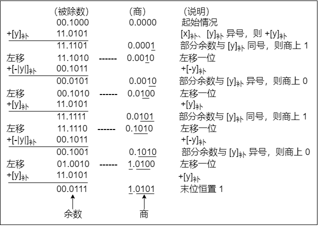

        所以 $[x/y]_\text{补} = 1.0101$，余 *0.0111x2^-4^*。

    ::: tip
    `n` 位定点数的除法运算，实际上是用一个 `2n` 位的数去除以一个 `n` 位的数，得到一个 `n` 位的商，因此需要对被除数进行扩展。对于 `n` 位定点正小数，只需在被除数低位添加 `n` 个 `0` 即可；对于 `n` 位无符号或定点正整数，只需在被除数高位添加 `n` 个 `0` 即可
    :::

#### 数据的存储和排列

1. **数据的 “大端方式” 和 “小端方式” 存储**

    在存储数据时，数据从低位到高位可以按从左到右排列，也可以按从右到左排列。因此，无法用最左或最右来表征数据的最高位或最低位，通常用最低有效字节（LSB）和最高有效字节（MSB）来分别表示数的低位和高位。例如：在 `32` 位计算机中，一个 `int` 型变量 `i` 的机器数为 `01 23 45 67H`，其最高有效字节 `MSB=01H`，最低有效字节 `LSB=67H`。

    **大端方式** 按从最高有效字节到最低有效字节的顺序存储数据，即最高有效字节存放在前面；**小端方式** 按从最低有效字节到最高有效字节的顺序存储数据，即最低有效字节存放在前面。

    在检查底层机器级代码时，需要分清各类型数据字节序列的顺序，在阅读小端方式存储的机器代码时，要注意字节是按相反顺序显示的。

2. **数据按 “边界对齐” 方式存储**

    假设存储字长为 `32` 位，可按 **字节**、**半字** 和 **字** 寻址。对于机器字长为 `32` 位的计算机，数据以边界对齐方式存放，半字地址一定是 `2` 的整数倍，字地址一定是 `4` 的整数倍，这样无论所取的数据是字节、半字还是字，均可一次访存取出。所存储的数据不满足上述要求时，通过填充空白字节使其符合要求。这样虽然浪费了一些存储空间，但可提高取指令和取数的速度。
    
    数据不按边界对齐方式存储时，可以充分利用存储空间，但半字长或字长的指令可能会存储在两个存储字中，此时需要两次访存，并且对高低字节的位置进行调整、连接之后才能得到所要的指令或数据，从而影响了指令的执行效率。

### 浮点数的表示与运算

#### 浮点数的表示

浮点数表示法是指以适当的形式将比例因子表示在数据中，让小数点的位置根据需要而浮动。这样，在位数有限的情况下，既扩大了数的表示范围，又保持了数的有效精度。

1. **浮点数的表示格式**

    通常，浮点数表示为：$N = (-1)^s×M×R^E$
    
    - **S**：`S` 取值 `0` 或 `1`，用来决定浮点数的符号
    - **M**：是一个二进制定点小数，称为尾数，一般用定点原码小数表示
    - **E**：是一个二进制定点整数，称为阶码或指数，用移码表示
    - **R**：是基数（隐含），可以约定为 2、4、16 等。可见浮点数由数符、尾数和阶码三部分组成

2. **浮点数的表示范围**

    原码是关于原点对称的，故浮点数的范围也是关于原点对称的。

    运算结果大于最大正数时称为 **正上溢**，小于绝对值最大负数时称为 **负上溢**，正上溢和负上溢统称上溢。数据一旦产生上溢，计算机必须中断运算操作，进行溢出处理。当运算结果在 `0` 至最小正数之间时称为 **正下溢**，在 `0` 至绝对值最小负数之间时称为 **负下溢**，正下溢和负下溢统称下溢。数据下溢时，浮点数值趋于零，计算机仅将其当作机器零处理。

3. **浮点数的规格化**

    尾数的位数决定浮点数的有效数位，有效数位越多，数据的精度越高。为了在浮点数运算过程中尽可能多地保留有效数字的位数，使有效数字尽量占满尾数数位，必须在运算过程中对浮点数进行规格化操作。所谓规格化操作，是指通过调整一个非规格化浮点数的尾数和阶码的大小，使非零的浮点数在尾数的最高数位上保证是一个有效值。

    **左规**：当运算结果的尾数的最高数位不是有效位，即出现 `±0.0…0×…×` 的形式时，需要进行左规。左规时，尾数每左移一位、阶码减 `1`（基数为 `2` 时）。左规可能要进行多次。

    **右规**：当运算结果的尾数的有效位进到小数点前面时，需要进行右规。将尾数右移一位、阶码加 `1`（基数为 `2` 时）。需要右规时，只需进行一次。

4. **IEEE 754 标准**

    IEEE 754 标准规定常用的浮点数格式有 **短浮点数**（单精度、float 型）、**长浮点数**（双精度、double 型）、临时浮点数，其基数隐含为 `2`。IEEE 754 标准的浮点数（除临时浮点数外），是尾数用采取隐藏位策略的原码表示，且阶码用移码表示的浮点数。

    <table style="text-align:center">
      <tr>
        <th rowspan="2">类型</th>
        <th rowspan="2">数符</th>
        <th rowspan="2">阶码</th>
        <th rowspan="2">尾数数值</th>
        <th rowspan="2">总位数</th>
        <th colspan="2">偏置值</th>
      </tr>
      <tr>
        <th>十六进制</th>
        <th>十进制</th>
      </tr>
      <tr>
        <td>短浮点数</td>
        <td>1</td>
        <td>8</td>
        <td>23</td>
        <td>32</td>
        <td>7FH</td>
        <td>127</td>
      </tr>
      <tr>
        <td>长浮点数</td>
        <td>1</td>
        <td>11</td>
        <td>52</td>
        <td>64</td>
        <td>3FFH</td>
        <td>1023</td>
      </tr>
      <tr>
        <td>临时浮点数</td>
        <td>1</td>
        <td>15</td>
        <td>64</td>
        <td>80</td>
        <td>3FFFH</td>
        <td>16383</td>
      </tr>
    </table>

5. **定点、浮点表示的区别**

    - **数值的表示范围**：若定点数和浮点数的字长相同，则浮点表示法所能表示的数值范围远大于定点表示法
    - **精度**：对于字长相同的定点数和浮点数来说，浮点数虽然扩大了数的表示范围，但精度降低了
    - **数的运算**：浮点数包括阶码和尾数两部分，运算时不仅要做尾数的运算，还要做阶码的运算，而且运算结果要求规格化，所以浮点运算比定点运算复杂
    - **溢出问题**：在定点运算中，当运算结果超出数的表示范围时，发生溢出；浮点运算中，运算结果超出尾数表示范围却不一定溢出，只有规格化后阶码超出所能表示的范围时，才发生溢出

#### 浮点数的加减运算

浮点数运算的特点是阶码运算和尾数运算分开进行，浮点数加减运算分为以下几步：

1. **对阶**：对阶的目的是使两个操作数的小数点位置对齐，即使得两个数的阶码相等。为此，先求阶差，然后以小阶向大阶看齐的原则，将阶码小的尾数右移一位（基数为 `2`），阶加 `1`，直到两个数的阶码相等为止。尾数右移时，舍弃掉有效位会产生误差，影响精度。
2. **尾数求和**：将对阶后的尾数按定点数加（减）运算规则运算。运算后的尾数不定是规格化的，因此，浮点数的加减运算需要进一步进行规格化处理。
3. **规格化**：IEEE 754 规格化尾数的形式为 `±1.x…x`。
4. **舍入**：在对阶和尾数右规时，可能会对尾数进行右移，为保证运算精度，一般将低位移出的两位保留下来，参加中间过程的运算，最后将运算结果进行舍入，还原表示成 IEEE 754 格式。
5. **溢出判断**：在尾数规格化和尾数舍入时，可能会对阶码执行加/减运算。因此，必须考虑指数溢出的问题。若一个正指数超过了最大允许值（`127` 或 `1023`），则发生指数上溢，产生异常。若一个负指数超过了最小允许值（`-126` 或 `-1022`），则发生指数下溢，通常把结果按机器零处理。

## 存储系统

### 存储器概述

#### 存储器的分类

存储器种类繁多，可从不同角度对存储器进行分类。

1. **按在计算机中的作用（层次）分类**

    - **主存储器**：简称主存，又称内存储器（内存），用来存放计算机运行期间所需的程序和数据，CPU 可以直接随机地对其进行访问，也可以和高速缓冲存储器（Cache）及辅助存储器交换数据。其特点是容量较小、存取速度较快、每位的价格较高
    - **辅助存储器**：简称辅存，又称外存储器（外存），用来存放当前暂时不用的程序和数据，以及一些需要永久性保存的信息。辅存的内容需要调入主存后才能被 CPU 访问。其特点是容量大、存取速度较慢、单位成本低
    - **高速缓冲存储器**：简称 Cache，位于主存和 CPU 之间，用来存放当前 CPU 经常使用的指令和数据，以便 CPU 能高速地访问它们。Cache 的存取速度可与 CPU 的速度相匹配，但存储容量小、价格高。现代计算机通常将它们制作在 CPU 中

2. **按存储介质分类**

    按存储介质，存储器可分为磁表面存储器（磁盘、磁带）、磁芯存储器、半导体存储器（MOS 型存储器、双极型存储器）和光存储器（光盘）。

3. **按存取方式分类**

    - **随机存储器（RAM）**：存储器的任何一个存储单元都可以随机存取，而且存取时间与存储单元的物理位置无关。其优点是读写方便、使用灵活，主要 **用作主存或高速缓冲存储器**。RAM 又分为静态（SRAM）和动态（DRAM）
    - **只读存储器（ROM）**：存储器的内容只能随机读出而不能写入。信息一旦写入存储器就固定不变，即使断电，内容也不会丢失。因此，通常用它存放固定不变的程序、常数和汉字字库等。它与随机存储器可共同作为主存的一部分，统一构成主存的地址域
    - **串行访问存储器**：对存储单元进行读/写操作时，需按其物理位置的先后顺序寻址，包括顺序存取存储器（如磁带）与直接存取存储器（如磁盘、光盘）。顺序存取存储器的内容只能按某种顺序存取，其特点是存取速度慢。直接存取存储器既不像 RAM 那样随机地访问任何一个存储单元，又不像顺序存取存储器那样完全按顺序存取，而是介于两者之间，存取信息时通常先寻找整个存储器中的某个小区域（如磁盘上的磁道），再在小区域内顺序查找

4. **按信息的可保存性分类**

    断电后，存储信息即消失的存储器，称为 **易失性存储器**，如 RAM。断电后信息仍然保持的存储器，称为 **非易失性存储器**，如 ROM、磁表面存储器和光存储器。若某个存储单元所存储的信息被读出时，原存储信息被破坏，则称为破坏性读出；若读出时，被读单元原存储信息不被破坏，则称为非破坏性读出。具有破坏性读出性能的存储器，每次读出操作后，必须紧接一个再生的操作，以便恢复被破坏的信息。

#### 存储器的性能指标

存储器有三个主要性能指标，即 **存储容量**、**单位成本** 和 **存储速度**。这三个指标相互制约，设计存储器系统所追求的目标就是大容量、低成本和高速度。

#### 多级层次的存储系统

为了解决存储系统大容量、高速度和低成本三个相互制约的矛盾，在计算机系统中，通常采用多级存储器结构，如下图所示。在图中由上至下，位价越来越低，速度越来越慢，容量越来越大，CPU 访问的频度也越来越低。

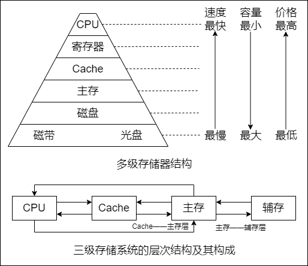

实际上，存储系统层次结构主要体现在 Cache——主存层和主存——辅存层。前者主要解决 CPU 和主存速度不匹配的问题，后者主要解决存储系统的容量问题。在存储体系中，Cache、主存能与 CPU 直接交换信息，辅存则要通过主存与 CPU 交换信息；主存与 CPU、Cache、辅存都能交换信息。

存储器层次结构的主要思想是上一层的存储器作为低一层存储器的高速缓存。

### 主存储器

主存储器由 DRAM 实现，靠处理器的那一层（Cache）则由 SRAM 实现，它们都属于易失性存储器，只要电源被切断，原来保存的信息便会丢失。DRAM 的每位价格低于 SRAM，速度也慢于 SRAM。ROM 属于非易失性存储器。

#### SRAM 芯片和 DRAM 芯片

1. **SRAM 的工作原理**

    通常把存放一个二进制位的物理器件称为 **存储元**，它是存储器的最基本的构件。地址码相同的多个存储元构成一个 **存储单元**。若干存储单元的集合构成 **存储体。**
    
    **静态随机存储器（SRAM）** 的存储元是用双稳态触发器（六晶体管 MOS）来记忆信息的，因此即使信息被读出后，它仍保持其原状态而不需要再生（非破坏性读出）。

    SRAM 的存取速度快，但集成度低，功耗较大，价格昂贵，一般用于高速缓冲存储器。

2. **DRAM 的工作原理**

    与 SRAM 的存储原理不同，**动态随机存储器（DRAM）** 是利用存储元电路中栅极电容上的电荷来存储信息的，DRAM 的基本存储元通常只使用一个晶体管，所以它比 SRAM 的密度要高很多。相对于 SRAM 来说，DRAM 具有容易集成、位价低、容量大和功耗低等优点，但 DRAM 的存取速度比 SRAM 的慢，一般用于大容量的主存系统。

    DRAM 电容上的电荷一般只能维持 `1~2ms`，因此即使电源不断电，信息也会自动消失。为此，每隔一定时间必须刷新，通常取 `2ms`，称为刷新周期。

3. **DRAM 芯片的读写周期**
    
    在读周期中，为使芯片能正确接收行、列地址，在 RAS（行选通信号）有效前将行地址送到芯片的地址引脚，CAS（列选通信号）滞后 RAS 一段时间，在 CAS 有效前再将列地址送到芯片的地址引脚，RAS、CAS 应至少保持 t~RAS~ 和 t~CAS~ 的时间。在读周期中 WE（读写控制信号）为高电平，并在 CAS 有效前建立。

4. **SRAM 和 DRAM 比较**

|  特点  |  SRAM  |  DRAM  |
|  :----:  |  :----:  |  :----:  |
|  存储信息  |  触发器  |  电容  |
|  破坏性读出  |  非  |  是  |
|  需要刷新  |  不要  |  需要  |
|  送行列地址  |  同时送  |  分两次送  |
|  运行速度  |  快  |  慢  |
|  集成度  |  低  |  高  |
|  存储成本  |  高  |  低  |
|  主要用途  |  高速缓存  |  主机内存  |

#### 只读存储器

1. **只读存储器（ROM）的特点**
    ROM 和 RAM 都是支持随机访问的存储器，其中 SRAM 和 DRAM 均为易失性半导体存储器。而 ROM 中一旦有了信息，就不能轻易改变，即使掉电也不会丢失，它在计算机系统中是只供读出的存储器。**ROM 器件有两个显著的优点：**

    - 结构简单，所以位密度比可读写存储器的高
    - 具有非易失性，所以可靠性高

2. **ROM 的类型**

    根据制造工艺的不同，ROM 可分为掩模式只读存储器（MROM）、一次可编程只读存储器（PROM）、可擦除可编程只读存储器（EPROM）、Flash 存储器和固态硬盘（SSD）。

    - **掩模式只读存储器**：MROM 的内容由半导体制造厂按用户提出的要求在芯片的生产过程中直接写入，写入以后任何人都无法改变其内容。优点是可靠性高，集成度高，价格便宜；缺点是灵活性差
    - **一次可编程只读存储器**：PROM 是可以实现一次性编程的只读存储器。允许用户利用专门的设备（编程器）写入自已的程序，一旦写入，内容就无法改变
    - **可擦除可编程只读存储器**：EPROM 不仅可以由用户利用编程器写入信息，而且可以对其内容进行多次改写。EPROM 虽然既可读又可写，但它不能取代 RAM，因为 EPROM 的编程次数有限，且写入时间过长
    - **Flash存储器**：Flash 存储器是在 EPROM 与 E^2^PROM 的基础上发展起来的，其主要特点是既可在不加电的情况下长期保存信息，又能在线进行快速擦除与重写。Flash 存储器既有 EPROM 的价格便宜、集成度高的优点，又有 E^2^PROM 电可擦除重写的特点，且擦除重写的速度快
    - **固态硬盘（Solid State Drives，SSD）**：基于闪存的固态硬盘是用固态电子存储芯片阵列制成的硬盘，由控制单元和存储单元（Flash 芯片）组成。保留了 Flash 存储器长期保存信息、快速擦除与重写的特性。对比传统硬盘也具有读写速度快、低功耗的特性，缺点是价格较高

#### 多模块存储器

多模块存储器是一种空间并行技术，利用多个结构完全相同的存储模块的并行工作来提高存储器的吞吐率。常用的有单体多字存储器和多体低位交叉存储器。

::: tip
CPU 的速度比存储器的快，若同时从存储器中取出 `n` 条指令，就可充分利用 CPU 资源，提高运行速度。多体交叉存储器就是基于这种思想提出的
:::

1. **单体多字存储器**

    单体多字系统的特点是 **存储器中只有一个存储体**，每个存储单元存储 `m` 个字，总线宽度也为 `m` 个字。一次并行读出 `m` 个字，地址必须顺序排列并处于同一存储单元。

    单体多字系统在一个存取周期内，从同一地址取出 `m` 条指令，然后将指令逐条送至 CPU 执行，即每隔 `1/m` 存取周期，CPU 向主存取一条指令。这显然提高了单体存储器的工作速度。

    **缺点**：指令和数据在主存内必须是连续存放的，一旦遇到转移指令，或操作数不能连续存放，这种方法的效果就不明显。

2. **多体并行存储器**

    多体并行 **存储器由多体模块组成**。每个模块都有相同的容量和存取速度，各模块都有独立的读写控制电路、地址寄存器和数据寄存器。它们既能并行工作，又能交叉工作。

    多体并行存储器分为 **高位交叉编址** 和 **低位交叉编址** 两种。

    - **高位交叉编址（顺序方式）**：高位地址表示体号，低位地址为体内地址。存储器共有 `4` 个模块 M~0~\~M~3~，每个模块有 `n` 个单元。高位交叉方式下，总是把低位的体内地址送到高位体号确定的模块内进行译码。CPU 总是按顺序访问存储模块，各模块不能被并行访问，因而不能提高存储器的吞吐率
    - **低位交叉编址（交叉方式）**：低位地址为体号，高位地址为体内地址。每个模块按 **模 m** 交叉编址，模块号 = 单元地址 % m，假定有 `m` 个模块，每个模块有 `k` 个单元，则 `0，m，…，(k－1)m` 单元位于 M~0~ 第 `1，m + 1，…，(k-1)m + 1` 单元位于 M~1~；以此类推。低位交叉方式下，总是把高位的体内地址送到低位体号确定的模块内进行译码。程序连续存放在相邻模块中

### 主存储器与 CPU 的理解

#### 理解原理

1. 主存储器通过数据总线、地址总线和控制总线与 CPU 连接
2. 数据总线的位数与工作频率的乘积正比于数据传输率
3. 地址总线的位数决定了可寻址的最大内存空间
4. 控制总线（读/写）指出总线周期的类型和本次输入/输出操作完成的时刻

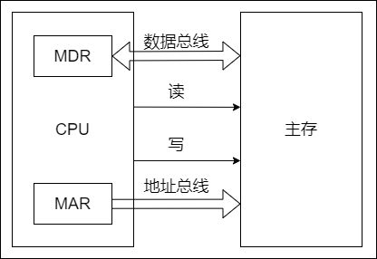

单个芯片的容量不可能很大，往往通过存储器芯片扩展技术，将多个芯片集成在一个内存条上，然后由多个内存条及主板上的 ROM 芯片组成计算机所需的主存空间，再通过总线与 CPU 相连。

#### 主存容量的扩展

由于单个存储芯片的容量是有限的，它在字数或字长方面与实际存储器的要求都有差距，因此需要在 **字** 和 **位** 两方面进行扩充才能满足实际存储器的容量要求。通常采用位扩展法、字扩展法和字位同时扩展法来扩展主存容量。

1. **位扩展法**

    CPU 的 **数据线数** 与 **存储芯片的数据位数** 不一定相等，此时必须对存储芯片扩位（即进行位扩展，用多个存储器件对字长进行扩充，增加存储字长），使其数据位数与 CPU 的数据线数相等。

    位扩展的 **连接方式** 是将多个存储芯片的地址端、片选端和读写控制端相应并联，数据端分别引出。

    ::: tip
    仅采用位扩展时，各芯片连接地址线的方式相同，但连接数据线的方式不同，在某一时刻选中所有的芯片，所以片选信号 `CS` 要连接到所有芯片
    :::

2. **字扩展法**

    字扩展是指 **增加存储器中字的数量，而位数不变**。字扩展将芯片的地址线、数据线、读写控制线相应并联，而由片选信号来区分各芯片的地址范围。

    ::: tip
    仅采用字扩展时，各芯片连接地址线的方式相同，连接数据线的方式也相同，但在某一时刻只需选中部分芯片，所以通过片选信号 `CS` 或采用译码器设计连接到相应的芯片
    :::

3. **字位同时扩展法**
    
    实际上，存储器往往需要 **同时扩充字和位**。字位同时扩展是指既增加存储字的数量，又增加存储字长。

    ::: tip
    采用字位同时扩展时，各芯片连接地址线的方式相同，但连接数据线的方式不同，而且需要通过片选信号 `CS` 或采用译码器设计连接到相应的芯片
    :::

#### 存储芯片的地址分配和片选

CPU 要实现对存储单元的访问，首先要选择存储芯片，即 **进行片选**；然后为选中的芯片依地址码选择相应的存储单元，以进行数据的存取，即 **进行字选**。片内的字选通常是由 CPU 送出的 `N` 条低位地址线完成的，地址线直接接到所有存储芯片的地址输入端（`N` 由片内存储容量 2^N^ 决定）。片选信号的产生分为 **线选法** 和 **译码片选法。**

1. **线选法**

    线选法用除片内寻址外的高位地址线直接（或经反相器）分别接至各个存储芯片的片选端，当某地址线信息为 `0` 时，就选中与之对应的存储芯片。这些片选地址线每次寻址时只能有一位有效，不允许同时有多位有效，这样才能保证每次只选中一个芯片（或芯片组）。假设：`4` 片 `2K + 8` 为存储芯片用线选法构成 `8K + 8` 位存储器，其中低位地址线 A~10~\~A~0~ 作为自选线，用于片内寻址。

    **优点**：不需要地址译码器，线路简单。**缺点**：地址空间不连续，选片的地址线必须分时为低电平（否则不能工作），不能充分利用系统的存储器空间，造成地址资源的浪费。

2. **译码片选法**

    译码片选法用除片内寻址外的高位地址线通过地址译码器芯片产生片选信号。如：用 `8` 片 `8K × 8` 位的存储芯片组成 `64K × 8` 位存储器（地址线为 `16` 位，数据线为 `8` 位），需要 `8` 个片选信号；若采用线选法，除去片内寻址的 `13` 位地址线，仅余高 `3` 位，不足以产生 `8` 个片选信号。因此，采用译码片选法，即用一片 `74LS138` 作为地址译码器，则 A~15~A~14~A~13~ = 000 时选中第一片，A~15~A~14~A~13~ = 001 时选中第二片，以此类推（即 3 位二进制编码）。

#### 存储器与 CPU 的连接

1. **合理选择存储芯片**

    要组成一个主存系统，选择存储芯片是第一步，主要指存储芯片的类型（RAM 或 ROM）和数量的选择。通常选用 ROM 存放系统程序、标准子程序和各类常数，RAM 则是为用户编程而设置的。此外，在考虑芯片数量时，要尽量使连线简单、方便。

2. **地址线的连接**

    存储芯片的容量不同，其地址线数也不同，而 CPU 的地址线数往往比存储芯片的地址线数要多。通常将 CPU 地址线的低位与存储芯片的地址线相连，以选择芯片中的某一单元（字选），这部分的译码是由芯片的片内逻辑完成的。而 CPU 地址线的高位则在扩充存储芯片时使用，用来选择存储芯片（片选），这部分译码由外接译码器逻辑完成。

    例如：设 CPU 地址线为 `16` 位，即 A~15~\~A~0~，`1K × 4` 位的存储芯片仅有 `10` 根地址线，此时可将 CPU 的低位地址 A~9~\~A~0~ 与存储芯片的地址线 A~9~\~A~0~ 相连。

3. **数据线的连接**

    CPU 的数据线数与存储芯片的数据线数不一定相等，在相等时可直接相连；在不等时必须对存储芯片扩位，使其数据位数与 CPU 的数据线数相等。

4. **读/写命令线的连接**

    CPU 读/写命令线一般可直接与存储芯片的读/写控制端相连，通常高电平为读，低电平为写。有些 CPU 的读/写命令线是分开的（读为 `RD`，写为 `WE`，均为低电平有效），此时 CPU 的读命令线应与存储芯片的允许读控制端相连，而 CPU 的写命令线则应与存储芯片的允许写控制端相连。

5. **片选线的连接**

    片选线的连接是 CPU 与存储芯片连接的关键。存储器由许多存储芯片叠加而成，哪一片被选中完全取决于该存储芯片的片选控制端 `CS` 是否能接收到来自 CPU 的片选有效信号。

    片选有效信号与 CPU 的访存控制信号 `MREQ`（低电平有效）有关，因为只有当 CPU 要求访存时，才要求选中存储芯片。若 CPU 访问 `I/O`，则 `MREQ` 为高，表示不要求存储器工作。

### 外部存储器

#### 磁盘存储器

**磁盘存储器的优点：**

- 存储容量大，位价格低
- 记录介质可重复使用
- 记录信息可长期保存而不丢失，甚至可脱机存档
- 非破坏性读出，读出时不需要再生

**磁盘存储器的缺点：**

- 存取速度慢
- 机械结构复杂
- 对工作环境要求较高

1. **磁盘存储器**

    - **磁盘设备的组成**

        硬盘存储器的组成。硬盘存储器由磁盘驱动器、磁盘控制器和盘片组成。

        - **磁盘驱动器**：核心部件是磁头组件和盘片组件，温彻斯特盘是一种可移动磁头固定盘片的硬盘存储器
        - **磁盘控制器**：硬盘存储器和主机的接口，主流的标准有 IDE、SCSI、SATA 等

        存储区域。一块硬盘含有若干记录面，每个记录面划分为若干磁道，而每条磁道又划分为若干扇区，扇区（也称块）是磁盘读写的最小单位，即磁盘按块存取。

        - **磁头数（Heads）**：即记录面数，表示硬盘共有多少个磁头，磁头用于读取/写入盘片上，记录面的信息，一个记录面对应一个磁头
        - **柱面数（Cylinders）**：表示硬盘每面盘片上有多少条磁道。在一个盘组中，不同记录面的相同编号（位置）的诸磁道构成一个圆柱面
        - **扇区数（Sectors）**：表示每条磁道上有多少个扇区

    - **磁记录原理**

        - **原理**：磁头和磁性记录介质相对运动时，通过电磁转换完成读/写操作
        - **编码方法**：按某种方案（规律），把一连串的二进制信息变换成存储介质磁层中一个磁化翻转状态的序列，并使读/写控制电路容易、可靠地实现转换
        - **磁记录方式**：通常采用调频制（FM）和改进型调频制（MFM）的记录方式

    - **磁盘的性能指标**

        - **记录密度**：是指盘片单位面积上记录的二进制信息量，通常以道密度、位密度和面密度表示。道密度是沿磁盘半径方向单位长度上的磁道数；位密度是磁道单位长度上能记录的二进制代码位数；面密度是位密度和道密度的乘积
        - **磁盘的容量**：有非格式化容量和格式化容量之分。非格式化容量是指磁记录表面可利用的磁化单元总数，它由道密度和位密度计算而来；格式化容量是指按照某种特定的记录格式所能存储信息的总量。格式化后的容量比非格式化容量要小。
        - **平均存取时间**：平均存取时间由寻道时间（磁头移动到目的磁道的时间）、旋转延迟时间（磁头定位到要读写扇区的时间）和传输时间（传输数据所花费的时间）三部分构成。由于寻道和找扇区的距离远近不一，故寻道时间和旋转延迟时间通常取平均值。
        - **数据传输率**：磁盘存储器在单位时间内向主机传送数据的字节数，称为数据传输率。假设磁盘转数为 `r` 转/秒，每条磁道容量为 `N` 字节，则数据传输率为 $D_r = rN$

    - **磁盘地址**

        主机向磁盘控制器发送寻址信息，磁盘的地址一般如下图所示。
        
        若系统中有 `4` 个驱动器，每个驱动器带一个磁盘，每个磁盘 `256` 个磁道、`16` 个盘面，每个盘面划分为 `16` 个扇区，则每个扇区地址要 `18` 位二进制代码，其格式如下图所示。

        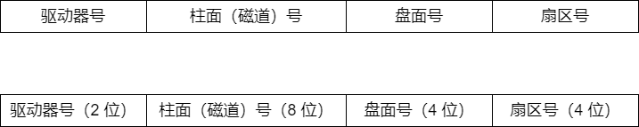

    - **硬盘的工作过程**

        硬盘的主要操作是寻址、读盘、写盘。每个操作都对应一个控制字，硬盘工作时，第一步是取控制字，第二步是执行控制字。

        硬盘属于机械式部件，其读写操作是串行的，不可能在同一时刻既读又写，也不可能在同一时刻读两组数据或写两组数据。

2. **磁盘阵列**

    RAID（独立冗余磁盘阵列）是指 **将多个独立的物理磁盘组成一个独立的逻辑盘**，数据在多个物理盘上分割交叉存储、并行访问，具有更好的存储性能、可靠性和安全性。

    RAID 的分级如下所示。在 RAID1~RAID5 几种方案中，无论何时有磁盘损坏，都可随时拔出受损的磁盘再插入好的磁盘，而数据不会损坏，提升了系统的可靠性。

    - **RAID0**：无冗余和无校验的磁盘阵列
    - **RAID1**：镜像磁盘阵列
    - **RAID2**：采用纠错的海明码的磁盘阵列
    - **RAID3**：位交叉奇偶校验的磁盘阵列
    - **RAID4**：块交叉奇偶校验的磁盘阵列
    - **RAID5**：无独立校验的奇偶校验磁盘阵列

    RAID0 把连续多个数据块交替地存放在不同物理磁盘的扇区中，几个磁盘交叉并行读写，不仅扩大了存储容量，而且提高了磁盘数据存取速度，但 RAID0 没有容错能力。

    为了提高可靠性，RAID1 使两个磁盘同时进行读写，互为备份，若一个磁盘出现故障，可从另一磁盘中读出数据。两个磁盘当一个磁盘使用，意味着容量减少一半。

    总之，RAID 通过同时使用多个磁盘，提高了传输率；通过在多个磁盘上并行存取来大幅提高存储系统的数据吞吐量；通过镜像功能，提高安全可靠性；通过数据校验，提供容错能力。

#### 固态硬盘

固态硬盘（SSD）是一种基于闪存技术的存储器。它与 U 盘并没有本质上的差别，只是容量更大，存取性能更好。一个 SSD 由一个或多个闪存芯片和闪存翻译层组成，闪存芯片替代传统旋转磁盘中的机械驱动器，而闪存翻译层将来自 CPU 的逻辑块读写请求翻译成对底层物理设备的读写控制信号，因此，这个闪存翻译层相当于扮演了磁盘控制器的角色。

一个闪存由 `B` 块组成，每块由 `P` 页组成。通常，页的大小是 `512B~4KB`，每块由 `32~128` 页组成，块的大小为 `16KB~512KB`。数据是以页为单位读写的。只有在一页所属的块整个被擦除后，才能写这一页。不过，一旦一个块被擦除，块中的每个页都可以直接再写一次。某个块进行了约 10 万次重复写之后，就会磨损坏，不能再使用。

随机写很慢，有两个原因。首先，擦除块比较慢，1ms 级，比访问页高一个数量级。其次，如果写操作试图修改一个包含已有数据的页 P~i~，那么这个块中所有含有用数据的页都必须被复制到一个新（擦除过的）块中，才能进行对页 P~i~ 的写。

比起传统磁盘，SSD 有很多优点，它由半导体存储器构成，没有移动的部件，因而随机访问时间比机械磁盘要快很多，也没有任何机械噪声和震动，能耗更低，抗震性好，安全性高等。不过，SSD 也有缺点，因为反复写之后，闪存块会磨损，所以 SSD 也容易磨损。闪存翻译层中有一个平均磨损逻辑试图通过将擦除平均分布在所有的块上来最大化每个块的寿命。

### 高速缓冲存储器

由于程序的转移概率不会很低，数据分布的离散性较大，所以单纯依靠并行主存系统提高主存系统的频宽是有限的。这就必须从系统结构上进行改进，即采用存储体系。通常将存储系统分为 **Cache——主存** 层次和 **主存——辅存** 层次。

#### 程序访问的局部原理

程序访问的局部性原理包括 **时间局部性** 和 **空间局部性**。时间局部性是指在最近的未来要用到的信息，很可能是现在正在使用的信息，因为程序中存在循环。空间局部性是指在最近的未来要用到的信息，很可能与现在正在使用的信息在存储空间上是邻近的，因为指令通常是顺序存放、顺序执行的，数据一般也是以向量、数组等形式簇聚地存储在一起的。

高速缓冲技术就是利用局部性原理，把程序中正在使用的部分数据存放在一个高速的、容量较小的 Cache 中，使 CPU 的访存操作大多数针对 Cache 进行，从而提高程序的执行速度。

#### Cache 的基本工作原理

Cache 位于存储器层次结构的顶层，通常由 `SRAM` 构成。

为便于 Cache 和主存间交换信息，Cache 和主存都被划分为相等的块，Cache 块又称 Cache 行，每块由若干字节组成，块的长度称为块长（Cache 行长）。由于 Cache 的容量远小于主存的容量，所以 Cache 中的块数要远少于主存中的块数，它仅保存主存中最活跃的若干块的副本。因此 Cache 按照某种策略，预测 CPU 在未来一段时间内欲访存的数据，将其装入 Cache。

当 CPU 发出 **读请求** 时，若访存地址在 Cache 中命中，就将此地址转换成 Cache 地址，直接对 Cache 进行读操作，与主存无关；若 Cache 不命中，则仍需访问主存，并把此字所在的块一次性地从主存调入 Cache。若此时 Cache 已满，则需根据某种替换算法，用这个块替换 Cache 中原来的某块信息。整个过程全部由硬件实现。值得注意的是，CPU 与 Cache 之间的数据交换以字为单位，而 Cache 与主存之间的数据交换则以 Cache 块为单位。

当 CPU 发出 **写请求** 时，若 Cache 命中，有可能会遇到 Cache 与主存中的内容不一致的问题。例如：由于 CPU 写 Cache，把 Cache 某单元中的内容从 X 修改成了 X1，而主存对应单元中的内容仍然是 X，没有改变。所以若 Cache 命中，需要按照一定的写策略处理，常见的处理方法有 **全写法** 和 **回写法。**

CPU 欲访问的信息已在 Cache 中的比率称为 Cache 的命中率。

#### Cache 和主存的映射方式

Cache 行中的信息是主存中某个块的副本，地址映射是指把主存地址空间映射到 Cache 地址空间，即把存放在主存中的信息按照某种规则装入 Cache。

由于 Cache 行数比主存块数少得多，因此主存中只有一部分块的信息可放在 Cache 中，因此在 Cache 中要为每块加一个标记，指明它是主存中哪一块的副本。该标记的内容相当于主存中块的编号。为了说明 Cache 行中的信息是否有效，每个 Cache 行需要一个有效位。

地址映射的方法有以下三种。

1. **直接映射**

    主存中的每一块只能装入 Cache 中的唯一位置。若这个位置已有内容，则产生块冲突，原来的块将无条件地被替换出去（无须使用替换算法）。直接映射实现简单，但不够灵活，即使 Cache 的其他许多地址空着也不能占用，这使得直接映射的块冲突概率最高，空间利用率最低。

    直接映射的关系可定义为：*Cache 行号 = 主存块号 mod Cache 总行数*

2. **全相联映射**

    主存中的每一块可以装入 Cache 中的任何位置，每行的标记用于指出该行取自主存的哪一块，所以 CPU 访存时需要与所有 Cache 行的标记进行比较。**全相联映射方式的优点**：比较灵活，Cache 块的冲突概率低，空间利用率高，命中率也高；**缺点**：标记的比较速度较慢，实现成本较高，通常需要采用昂贵的按内容寻址的相联存储器进行地址映射。

    将 Cache 分成 `Q` 个大小相等的组，每个主存块可以装入固定组中的任意一行，即组间采用直接映射、而组内采用全相联映射的方式。它是对直接映射和全相联映射的一种折中，当 `Q = 1` 时变为全相联映射，当 `Q = Cache` 行数时变为直接映射。假设每组有 `r` 个 Cache 行，则称之为 `r` 路组相联。例如：每组有 `2` 个 Cache 行，因此称为二路组相联。

    组相联映射的关系可以定义为：*Cache 组号 = 主存块号 mod Cache 组数（Q）*

    路数越大，即每组 Cache 行的数量越大，发生块冲突的概率越低，但相联比较电路也越复杂。选定适当的数量，可使组相联映射的成本接近直接映射，而性能上仍接近全相联映射。

#### Cache 中主存块的替换算法

在采用全相联映射或组相联映射方式时，从主存向 Cache 传送一个新块，当 Cache 或 Cache 组中的空间已被占满时，就需要使用替换算法置换 Cache 行。而采用直接映射时，一个给定的主存块只能放到唯一的固定 Cache 行中，所以在对应 Cache 行已有一个主存块的情况下，新的主存块毫无选择地把原先已有的那个主存块替换掉，因而无须考虑替换算法。

**常用的替换算法** 有随机（RAND）算法、先进先出（FIFO）算法、近期最少使用（LRU）算法和最不经常使用（LFU）算法。

- **随机算法（RAND）**：随机地确定替换的 Cache 块。它的实现比较简单，但未依据程序访问的局部性原理，因此可能命中率较低
- **先进先出算法（FIFO）**：选择最早调入的行进行替换。它比较容易实现，但也未依据程序访问的局部性原理，因为最早进入的主存块也可能是目前经常要用的
- **近期最少使用算法（LRU）**：依据程序访问的局部性原理，选择近期内长久未访问过的 Cache 行作为替换的行，平均命中率要比 FIFO 的高，是堆栈类算法

    LRU 算法对每个 Cache 行设置一个计数器，用计数值来记录主存块的使用情况，并根据计数值选择淘汰某个块，计数值的位数与 Cache 组大小有关，2 路时有一位 LRU 位，4 路时有两位 LRU 位。

    **计数器的变化规则：**

    - 命中时，所命中的行的计数器清零，比其低的计数器加 `1`，其余不变
    - 未命中且还有空闲行时，新装入的行的计数器置 `0`，其余全加 `1`

    当集中访问的存储区超过 Cache 组的大小时，命中率可能变得很低，这种现象称为 **抖动。**

- **最不经常使用算法**：将一段时间内被访问次数最少的存储行换出。每行也设置一个计数器，新行建立后从 `0` 开始计数，每访问一次，被访问的行计数器加 `1`，需要替换时比较各特定行的计数值，将计数值最小的行换出。这种算法与 LRU 类似，但不完全相同

#### Cache 写策略

因为 Cache 中的内容是主存块副本，当对 Cache 中的内容进行更新时，就需选用写操作策略使 Cache 内容和主存内容保持一致。此时分两种情况。

**对于 Cache 写命中（write hit），有两种处理方法：**

1. **全写法（写直通法、write-through）**

    当 CPU 对 Cache 写命中时，必须把数据同时写入 Cache 和主存。当某一块需要替换时，不必把这一块写回主存，用新调入的块直接覆盖即可。这种方法实现简单，能随时保持主存数据的正确性。缺点是增加了访存次数，降低了 Cache 的效率。写缓冲：为减少全写法直接写入主存的时间损耗，在 Cache 和主存之间加一个写缓冲（Write Buffer）。CPU 同时写数据到 Cache 和写缓冲中，写缓冲再控制将内容写入主存。写缓冲是一个 FIFO 队列，写缓冲可以解决速度不匹配的问题。但若出现频繁写时，会使写缓冲饱和溢出。

2. **回写法（write-back）**

    当 CPU 对 Cache 写命中时，只把数据写入 Cache，而不立即写入主存，只有当此块被换出时才写回主存。这种方法减少了访存次数，但存在不一致的隐患。为了减少写回主存的开销，每个 Cache 行设置一个修改位（脏位）。若修改位为 `1`，则说明对应 Cache 行中的块被修改过，替换时需要写回主存；若修改位为 `0`，则说明对应 Cache 行中的块未被修改过，替换时无须写回主存。

全写法和回写法都对应于 Cache 写命中（要被修改的单元在 Cache 中）时的情况。

**对于 Cache 写不命中，也有两种处理方法：**

1. **写分配法（write-allocate）**

    加载主存中的块到 Cache 中，然后更新这个 Cache 块。它试图利用程序的空间局部性，但缺点是每次不命中都需要从主存中读取一块。

2. **非写分配法（not-write-allocate）**

    只写入主存，不进行调块。

**非写分配法通常与全写法合用，写分配法通常和回写法合用**。随着新技术的发展（如：指令预取），需要将指令 Cache 和数据 Cache 分开设计，这就有了分离的 Cache 结构。统一 Cache 的优点是设计和实现相对简单，但由于执行部件存取数据时，指令预取部件要从同一 Cache 读指令，会引发冲突。采用分离 Cache 结构可以解决这个问题，而且分离的指令和数据 Cache 还可以充分利用指令和数据的不同局部性来优化性能。

### 虚拟存储器

主存和辅存共同构成了虚拟存储器，二者在硬件和系统软件的共同管理下工作。对于应用程序员而言，虚拟存储器是透明的。虚拟存储器具有主存的速度和辅存的容量。

#### 虚拟存储器的基本概念

虚拟存储器将主存或辅存的地址空间统一编址，形成一个庞大的地址空间，在这个空间内，用户可以自由编程，而不必在乎实际的主存容量和程序在主存中实际的存放位置。

用户编程允许涉及的地址称为 **虚地址或逻辑地址**，虚地址对应的存储空间称为虚拟空间或程序空间。实际的主存单元地址称为 **实地址或物理地址**，实地址对应的是主存地址空间，也称实地址空间。虚地址比实地址要大很多。

CPU 使用虚地址时，由辅助硬件找出虚地址和实地址之间的对应关系，并判断这个虚地址对应的存储单元内容是否已装入主存。若已在主存中，则通过地址变换，CPU 可直接访问主存指示的实际单元；若不在主存中，则把包含这个字的一页或一段调入主存后再由 CPU 访问。若主存已满，则采用替换算法置换主存中的交换块（即页面）。

虚拟存储器也采用和 Cache 类似的技术，将辅存中经常访问的数据副本存放到主存中。但是缺页（或段）而访问辅存的代价很大，提高命中率是关键，因此虚拟存储机制采用全相联映射，每个虚页面可以存放到对应主存区域的任何一个空闲页位置。此外，当进行写操作时，不能每次写操作都同时写回磁盘，因而，在处理一致性问题时，采用回写法。

#### 页式虚拟存储器

页式虚拟存储器以 **页** 为基本单位。虚拟空间与主存空间都被划分成同样大小的页，主存的页称为实页、页框，虚存的页称为虚页。把虚拟地址分为两个字段：**虚页号** 和 **页内地址**。**虚拟地址到物理地址的转换是由页表实现的**。页表是一张存放在主存中的虚页号和实页号的对照表，它记录程序的虚页调入主存时被安排在主存中的位置。页表一般长久地保存在内存中。

1. **页表**

    CPU 执行指令时，需要先将虚拟地址转换为主存物理地址。页表基址寄存器存放进程的页表首地址，然后根据虚拟地址高位部分的虚拟页号找到对应的页表项，若装入位为 `1`，则取出物理页号，和虚拟地址低位部分的页内地址拼接，形成实际物理地址；若装入位为 `0`，则说明缺页，需要操作系统进行缺页处理。
    
    页式虚拟存储器的优点是：页面的长度固定，页表简单，调入方便。缺点是：由于程序不可能正好是页面的整数倍，最后一页的零头将无法利用而造成浪费，并且页不是逻辑上独立的实体，所以处理、保护和共享都不及段式虚拟存储器方便。

2. **快表（TLB）**

    由地址转换过程可知，访存时先访问一次主存去查页表，再访问主存才能取得数据。如果缺页，那么还要进行页面替换、页面修改等，因此采用虚拟存储机制后，访问主存的次数更多了。
    
    依据程序执行的局部性原理，在一段时间内总是经常访问某些页时，若把这些页对应的页表项存放在高速缓冲器组成的快表（TLB）中，则可以明显提高效率。相应地把放在主存中的页表称为慢表（Page）。在地址转换时，首先查找快表，若命中，则无须访问主存中的页表。

3. **具有 TLB 和 Cache 的多级存储系统**

    一个具有 TLB 和 Cache 的多级存储系统，其中 Cache 采用二路组相联方式。CPU 给出一个 32 位的虚拟地址，TLB 采用全相联方式，每一项都有一个比较器，查找时将虚页号与每个 TLB 标记字段同时进行比较，若有某一项相等且对应有效位为 `1`，则 TLB 命中，此时可直接通过 TLB 进行地址转换；若未命中，则 TLB 缺失，需要访问主存去查页表。如果用两级页表方式，虚页号被分成页目录索引和页表索引两部分，由这两部分得到对应的页表项，从而进行地址转换，并将相应表项调入 TLB，若 TLB 已满，则还需要采用替换策略。完成由虚拟地址到物理地址的转换后，Cache 机构根据映射方式将物理地址划分成多个字段，然后根据映射规则找到对应的 Cache 行或组，将对应 Cache 行中的标记与物理地址中的高位部分进行比较，若相等且对应有效位为 `1`，则 Cache 命中，此时根据块内地址取出对应的字送 CPU。

#### 段式虚拟存储器

段式虚拟存储器中的 **段是按程序的逻辑结构划分的**，各个段的长度因程序而异。把虚拟地址分为两部分：**段号** 和 **段内地址**。虚拟地址到实地址之间的变换是由段表来实现的。段表是程序的逻辑段和在主存中存放位置的对照表。段表的每行记录与某个段对应的段号、装入位、段起点和段长等信息。由于段的长度可变，所以段表中要给出各段的起始地址与段的长度。

CPU 根据虚拟地址访存时，首先根据段号与段表基地址拼接成对应的段表行，然后根据该段表行的装入位判断该段是否已调入主存（装入位为 “1”，表示该段已调入主存；装入位为 “0”，表示该段不在主存中）。已调入主存时，从段表读出该段在主存中的起始地址，与段内地址（偏移量）相加，得到对应的主存实地址。

**段式虚拟存储器的优点**：段的分界与程序的自然分界相对应，因而具有逻辑独立性，使得它易于编译、管理、修改和保护，也便于多道程序的共享；**缺点**：因为段长度可变，分配空间不便，容易在段间留下碎片，不好利用，造成浪费。

#### 段页虚拟存储器

把程序按逻辑结构分段，每段再划分为固定大小的页，主存空间也划分为大小相等的页，程序对主存的调入、调出仍以页为基本传送单位，这样的虚拟存储器称为段页式虚拟存储器。在段页式虚拟存储器中，每个程序对应一个段表，每段对应一个页表，段的长度必须是页长的整数倍，段的起点必须是某一页的起点。

虚地址分为段号、段内页号、页内地址三部分。CPU 根据虚地址访存时，首先根据段号得到段表地址；然后从段表中取出该段的页表起始地址，与虚地址段内页号合成，得到页表地址；最后从页表中取出实页号，与页内地址拼接形成主存实地址。

**段页式虚拟存储器的优点**：兼具页式和段式虚拟存储器的优点，可以按段实现共享和保护。**缺点**：在地址变换过程中需要两次查表，系统开销较大。

#### 虚拟存储器与 Cache 的比较

1. **相同之处**

    - 最终目标都是为了提高系统性能，两者都有容量、速度、价格的梯度
    - 都把数据划分为小信息块，并作为基本的传递单位，虚存系统的信息块更大
    - 都有地址的映射、替换算法、更新策略等问题
    - 依据程序的局部性原理应用 “快速缓存的思想”，将活跃的数据放在相对高速的部件中

2. **不同之处**

    - Cache 主要解决系统速度，而虚拟存储器却是为了解决主存容量
    - Cache 全由硬件实现，是硬件存储器，对所有程序员透明；而虚拟存储器由 OS 和硬件共同实现，是逻辑上的存储器，对系统程序员不透明，但对应用程序员透明
    - 对于不命中性能影响，因为 CPU 的速度约为 Cache 的 10 倍，主存的速度为硬盘的 100 倍以上，因此虚拟存储器系统不命中时对系统性能影响更大
    - CPU 与 Cache 和主存都建立了直接访问的通路，而辅存与 CPU 没有直接通路。也就是说在 Cache 不命中时主存能和 CPU 直接通信，同时将数据调入 Cache；而虚拟存储器系统不命中时，只能先由硬盘调入主存，而不能直接和 CPU 通信

## 指令系统

### 指令系统

指令（机器指令）是指 **计算机执行某种操作的命令**。一台计算机的所有指令的集合构成该机的 **指令系统**，也称指令集。指令系统是指令集体系结构（ISA）中最核心的部分，ISA 完整定义了软件和硬件之间的接口，是机器语言或汇编语言程序员所应熟悉的。ISA 规定的内容主要包括：指令格式，数据类型及格式，操作数的存放方式，程序可访问的寄存器个数、位数和编号，存储空间的大小和编址方式，寻址方式，指令执行过程的控制方式等。

#### 指令的基本格式

**一条指令就是机器语言的一个语句，它是一组有意义的二进制代码**。一条指令通常包括 **操作码字段** 和 **地址码字段** 两部分。其中，操作码指出指令中该指令应该执行什么性质的操作以及具有何种功能。操作码是识别指令、了解指令功能及区分操作数地址内容的组成和使用方法等的关键信息。例如：指出是算术加运算还是算术减运算，是程序转移还是返回操作。

地址码给出被操作的信息（指令或数据）的地址，包括参加运算的一个或多个操作数所在的地址、运算结果的保存地址、程序的转移地址、被调用的子程序的入口地址等。

指令的长度是指 **一条指令中所包含的二进制代码的位数**。指令字长取决于操作码的长度、操作数地址码的长度和操作数地址的个数。指令长度与机器字长没有固定的关系，它可以等于机器字长，也可以大于或小于机器字长。通常，把指令长度等于机器字长的指令称为 **单字长指令**，指令长度等于半个机器字长的指令称为 **半字长指令**，指令长度等于两个机器字长的指令称为 **双字长指令。**

在一个指令系统中，若所有指令的长度都是相等的，则称为 **定长指令字结构**。定字长指令的执行速度快，控制简单。若各种指令的长度随指令功能而异，则称为 **变长指令字结构**。然而，因为主存一般是按字节编址的，所以指令字长多为字节的整数倍。

根据指令中操作数地址码的数目的不同，可将指令分成以下几种格式：

1. **零地址指令**

    只给出 **操作码 OP**，没有显式地址。这种指令有两种可能：

    - 不需要操作数的指令，如：空操作指令、停机指令、关中断指令等
    - 零地址的运算类指令仅用在堆栈计算机中。通常参与运算的两个操作数隐含地从栈顶和次栈顶弹出，送到运算器进行运算，运算结果再隐含地压入堆栈

2. **一地址指令**

    给出 **操作码 OP**，一个地址码 A~1~。这种指令也有两种常见的形态，要根据操作码的含义确定究竟是哪一种。

    - 只有目的操作数的单操作数指令，按 A~1~ 地址读取操作数，进行 OP 操作后，结果存回原地址

        - 指令含义：OP(A~1~)→A~1~
        - 如操作码含义是加 1、减 1、求反、求补等

    - 隐含约定目的地址的双操作数指令，按指令地址 A~1~ 可读取源操作数，指令可隐含约定另一个操作数由 ACC（累加器）提供，运算结果也将存放在 ACC 中

        - 指令含义：(ACC)OP(A~1~)→ACC
        - 若指令字长为 `32` 位，操作码占 `8` 位，`1` 个地址码字段占 `24` 位，则指令操作数的直接寻址范围为 2^24^ = 16M

3. **二地址指令**

    给出 **操作码 OP**，两个地址码 A~1~ 和 A~2~。

    - 指令含义：(A~1~)OP(A~2~)→A~1~
    - 对于常用的算术和逻辑运算指令，往往要求使用两个操作数，需分别给出目的操作数和源操作数的地址，其中目的操作数地址还用于保存本次的运算结果
    - 若指令字长为 `32` 位，操作码占 `8` 位，两个地址码字段各占 `12` 位，则指令操作数的直接寻址范围为 2^12^ = 4K

4. **三地址指令**

    给出 **操作码 OP**，三个地址码 A~1~、A~2~ 和 A~3~（结果）。
    
    - 指令含义：(A~1~)OP(A~2~)→A~3~
    - 若指令字长为 `32` 位，操作码占 `8` 位，三个地址码字段各占 `8` 位，则指令操作数的直接寻址范围为 `28 = 256`。若地址字段均为主存地址，则完成一条三地址需要 `4` 次访问存储器（取指令 `1` 次，取两个操作数 `2` 次，存放结果 `1` 次）。

5. **四地址指令**

    给出 **操作码 OP**，四个地址码 A~1~、A~2~、A~3~（结果）和 A~4~（下址）。

    - 指令含义：(A~1~)OP(A~2~)→A~3~，A~4~ = 下一条将要执行指令的地址
    - 若指令字长为 `32` 位，操作码占 `8` 位，四个地址码字段各占 `6` 位，则指令操作数的直接寻址范围为 `26 = 64`

#### 定长操作码指令格式

定长操作码指令在指令字的最高位部分分配固定的若干位（定长）表示操作码。一般 `n` 位操作码字段的指令系统最大能够表示 2^n^ 条指令。定长操作码对于简化计算机硬件设计，提高指令译码和识别速度很有利。当计算机字长为 `32` 位或更长时，这是常规用法。

#### 扩展操作码指令格式

为了在指令字长有限的前提下仍保持比较丰富的指令种类，可采取 **可变长度操作码**，即全部指令的操作码字段的位数不固定，且分散地放在指令字的不同位置上。显然，这将增加指令译码和分析的难度，使控制器的设计复杂化。

最常见的变长操作码方法是扩展操作码，它使操作码的长度随地址码的减少而增加，不同地址数的指令可具有不同长度的操作码，从而在满足需要的前提下，有效地缩短指令字长。

在设计扩展操作码指令格式时，必须注意以下两点：

1. 不允许短码是长码的前缀，即短操作码不能与长操作码的前面部分的代码相同。
2. 各指令的操作码一定不能重复。

通常情况下，对使用频率较高的指令分配较短的操作码，对使用频率较低的指令分配较长的操作码，从而尽可能减少指令译码和分析的时间。

#### 指令的操作类型

设计指令系统时必须考虑应提供哪些操作类型，指令操作类型按功能可分为以下几种：

1. **数据传送**

    传送指令通常有寄存器之间的传送（MOV）、从内存单元读取数据到 CPU 寄存器（LOAD）、从 CPU 寄存器写数据到内存单元（STORE）等。

2. **算术和逻辑运算**

    这类指令主要有加（ADD）、减（SUB）、比较（CMP）、乘（MUL）、除（DIV）、加1（INC）、减1（DEC）、与（AND）、或（OR）、取反（NOT）、异或（XOR）等。

3. **移位操作**

    移位指令主要有算术移位、逻辑移位、循环移位等。

4. **转移操作**

    转移指令主要有无条件转移（JMP）、条件转移（BRANCH）、调用（CALL）、返回（RET）、陷阱（TRAP）等。无条件转移指令在任何情况下都执行转移操作，而条件转移指令仅在特定条件满足时才执行转移操作，转移条件一般是某个标志位的值，或几个标志位的组合。

    调用指令和转移指令的区别：执行调用指令时必须保存下一条指令的地址（返回地址），当子程序执行结束时，根据返回地址返回到主程序继续执行；而转移指令则不返回执行。

5. **输入输出操作**

    这类指令用于完成 CPU 与外部设备交换数据或传送控制命令及状态信息。

### 指令的寻址方式

寻址方式是指寻找指令或操作数有效地址的方式，即 **确定本条指令的数据地址及下一条待执行指令的地址** 的方法。

指令中的地址码字段并不代表操作数的真实地址，这种地址称为 **形式地址（A）**。形式地址结合寻址方式，可以计算出操作数在存储器中的真实地址，这种地址称为 **有效地址（EA）。**

::: tip
（A）表示地址为 A 的数值，A 既可以是寄存器编号，也可以是内存地址。对应的（A）就是寄存器中的数值，或相应内存单元的数值。例如：EA=(A) 意思是有效地址是地址 A 中的数值
:::

#### 指令寻址和数据寻址

寻址方式分为指令寻址和数据寻址两大类。**寻找下一条将要执行的指令地址** 称为指令寻址；**寻找本条指令的数据地址** 称为数据寻址。

1. **指令寻址**

    指令寻址方式有两种：

    - **顺序寻址**：通过程序计数器 PC 加 1（`1` 个指令字长），自动形成下一条指令的地址
    - **跳跃寻址**：通过转移类指令实现。所谓跳跃，是指下条指令的地址不由程序计数器 PC 自动给出，而由本条指令给出下条指令地址的计算方式。而是否跳跃可能受到状态寄存器和操作数的控制，跳跃的地址分为绝对地址（由标记符直接得到）和相对地址（相对于当前指令地址的偏移量），跳跃的结果是当前指令修改 PC 值，所以下一条指令仍然通过 PC 给出

2. **数据寻址**

    数据寻址是指如何在指令中表示一个操作数的地址，如何用这种表示得到操作数或怎样计算出操作数的地址。

    数据寻址的方式较多，为区别各种方式，通常在指令字中设一个字段，用来指明属于哪种寻址方式，由此可得指令的格式：*操作码 + 寻址特征 + 形式地址 A*

#### 常见的数据寻址方式

1. **隐含寻址**

    这种类型的指令不明显地给出操作数的地址，而在指令中隐含操作数的地址。
    
    **优点** 是有利于缩短指令字长；**缺点** 是需增加存储操作数或隐含地址的硬件。

2. **立即（数）寻址**

    这种类型指令的地址字段指出的不是操作数的地址，而是操作数本身，又称立即数，采用补码表示。
    
    **优点** 是指令在执行阶段不访问主存，指令执行时间最短；**缺点** 是 A 的位数限制了立即数的范围。

3. **直接寻址**

    指令字中的形式地址 A 是操作数的真实地址 EA，即 `EA = A`。
    
    **优点** 是简单，指令在执行阶段仅访问一次主存，不需要专门计算操作数的地址；**缺点** 是 A 的位数决定了该指令操作数的寻址范围，操作数的地址不易修改。

4. **间接寻址**

    指令的地址字段给出的形式地址不是操作数的真正地址，而是操作数有效地址所在的存储单元的地址，也就是操作数地址的地址，即 `EA = (A)`。间接寻址可以是一次间接寻址，还可以是多次间接寻址。
    
    **优点** 是可扩大寻址范围（有效地址 EA 的位数大于形式地址 A 的位数），便于编制程序（用间接寻址可方便地完成子程序返回）；**缺点** 是指令在执行阶段要多次访存（一次间接寻址需两次访存，多次间接寻址需根据存储字的最高位确定访存次数）。

5. **寄存器寻址**

    指在指令字中直接给出操作数所在的寄存器编号，即 EA = R~i~，其操作数在由 R~i~，所指的寄存器内。
    
    **优点** 是指令在执行阶段不访问主存，只访问寄存器，因寄存器数量较少，对应地址码长度较小，使得指令字短且因不用访存，所以执行速度快，支持向量/矩阵运算；**缺点** 是寄存器价格昂贵，计算机中的寄存器个数有限。

6. **寄存器间接寻址**

    指在寄存器 R~i~ 中给出的不是一个操作数，而是操作数所在主存单元的地址，即 EA = (R~i~)。
    
    寄存器间接寻址的 **特点** 是，与一般间接寻址相比速度更快，但指令的执行阶段需要访问主存（因为操作数在主存中）。

7. **相对寻址**

    把 PC 的内容加上指令格式中的形式地址 A 而形成操作数的有效地址，即 `EA = (PC) + A`，其中 A 是相对于当前 PC 值的位移量，可正可负，补码表示。
    
    **优点** 是操作数的地址不是固定的，它随 PC 值的变化而变化，且与指令地址之间总是相差一个固定值，因此便于程序浮动。相对寻址广泛应用于转移指令（JMPA）。

8. **基址寻址**

    指将 CPU 中基址寄存器（BR）的内容加上指令格式中的形式地址 A 而形成操作数的有效地址，即 `EA = (BR) + A`。其中基址寄存器既可采用专用寄存器，又可采用通用寄存器。基址寄存器是面向操作系统的，其内容由操作系统或管理程序确定，主要用于解决程序逻辑空间与存储器物理空间的无关性。
    
    **优点** 是可扩大寻址范围（基址寄存器的位数大于形式地址 A 的位数）；用户不必考虑自己的程序存于主存的哪个空间区域，因此有利于多道程序设计，并可用于编制浮动程序，但偏移量（形式地址 A）的位数较短。

9. **变址寻址**

    指有效地址 EA 等于指令字中的形式地址 A 与变址寄存器 IX 的内容之和，即 `EA = (IX) + A`，其中 IX 为变址寄存器（专用），也可用通用寄存器作为变址寄存器，变址寄存器是面向用户的。
    
    **优点** 是可扩大寻址范围（变址寄存器的位数大于形式地址 A 的位数）；在数组处理过程中，可设定 A 为数组的首地址，不断改变变址寄存器 IX 的内容，便可很容易形成数组中任意一个数据的地址，特别适合编制循环程序。偏移量（变址寄存器 IX）的位数足以表示整个存储空间。

10. **堆栈寻址**

    堆栈是存储器（或专用寄存器组）中一块特定的、按后进先出（LIFO）原则管理的存储区，该存储区中读/写单元的地址是用一个特定的寄存器给出的，该寄存器称为堆栈指针（SP）。堆栈可分为硬堆栈与软堆栈两种。

    **硬堆栈**：寄存器堆栈的成本较高，不适合做大容量的堆栈；**软堆栈**：从主存中划出一段区域来做堆栈是最合算且最常用的方法。

简单总结寻址方式、有效地址及访存次数（不含取本条指令的访存）：

|  寻址方式  |  有效地址  |  访存次数  |
|  :----:  |  :----:  |  :----:  |
|  隐含寻址  |  程序指定  |  0  |
|  立即导址  |  A 即是操作数  |  0  |
|  直接导址  |  EA = A  |  1 |
|  一次间接导址  | EA = (A)   |  2  |
|  寄存器寻址  |  EA = R~i~  |  0  |
|  寄存器间接一次寻址  |  EA = (R~i~)  |  1  |
|  相对寻址  |  EA = (PC) + A  |  1  |
|  基址寻址  |  EA = (BR) + A  |  1  |
|  变址寻址  |  EA = (IX) + A  |  1  |

### 程序的机器级代码表示

#### 常用汇编指令介绍

1. **相关寄存器**

    `x86` 处理器中有 `8` 个 `32` 位的通用寄存器，EAX 累加器、EBX 基地址寄存器、ECX 计数寄存器、EDX 数据寄存器、ESI 和 EDI 编址寄存器、EBP 堆栈基指针、ESP 堆栈顶指针。为了向后兼容，EAX、EBX、ECX 和 EDX 的高两位字节和低两位字节可以独立使用，`E` 为 `Extended`，表示 `32` 位的寄存器。例如：EAX 的低两位字节称为 AX，而 AX 的高低字节又可分别作为两个 `8` 位寄存器，分别称为 AH 和 AL。

    除 EBP 和 ESP 外，其他几个寄存器的用途是比较任意的。

2. **汇编指令格式**

    使用不同的编程工具开发程序时，用到的汇编程序也不同，一般有两种不同的汇编格式：

- `AT&T` 格式的指令只能用小写字母，而 `Intel` 格式的指令对大小写不敏感
- 在 `AT&T` 格式中，第一个为源操作数，第二个为目的操作数，方向从左到右，合乎自然；在 `Intel` 格式中，第一个为目的操作数，第二个为源操作数，方向从右向左
- 在 `AT&T` 格式中，寄存器需要加前缀 `%`，立即数需要加前缀 `$`；在 `Intel` 格式中，寄存器和立即数都不需要加前缀
- 在内存寻址方面，`AT&T` 格式使用 `(` 和 `)`，而 `Intel` 格式使用 `[` 和 `]`。在处理复杂寻址方式时，例如：`AT&T` 格式的内存操作数 `disp(base, index, scale)` 分别表示偏移量、基址寄存器、变址寄存器和比例因子，如 `8(%edx, %eax, 2)` 表示操作数为 `M[R[edx] + R[eax]*2 + 8]`，其对应的 `Intel` 格式的操作数为 `[edx + eax*2 + 8]`
- 在指定数据长度方面，`AT&T` 格式指令操作码的后面紧跟一个字符，表明操作数大小，`b` 表示 byte（字节）、`w` 表示 word（字）或 `l` 表示 long（双字）。`Intel` 格式也有类似的语法，它在操作码后面显式地注明byte ptr、word ptr 或 dword ptr

::: warning
由于 `32` 或 `64` 位体系结构都是由 `16` 位扩展而来的，因此用 word（字）表示 `16` 位
:::

#### 选择语句的机器级表示

常见的选择结构语句有 `if-then`、`if-then-else`、`case`（或 `switch`）等。编译器通过条件码（标志位）设置指令和各类转移指令来实现程序中的选择结构语句。

#### 循环语句的机器级表示

常见的循环结构语句有 `while`、`for` 和 `do-while`。汇编中没有相应的指令存在，可以用条件测试和转跳组合起来实现循环的效果，大多数编译器将这三种循环结构都转换为 `do-while` 形式来产生机器代码。在循环结构中，通常使用条件转移指令来判断循环条件的结束。

### CISC 和 RISC 的基本概念

指令系统朝两个截然不同的方向的发展：

1. 增强原有指令的功能，设置更为复杂的新指令实现软件功能的硬化，这类机器称为复杂指令系统计算机（CISC），典型的有采用 `x86` 架构的计算机
2. 减少指令种类和简化指令功能，提高指令的执行速度，这类机器称为精简指令系统计算机（RISC），典型的有 ARM、MIPS 架构的计算机

#### 复杂指令系统计算机（CISC）

随着 VLSI 技术的发展，硬件成本不断下降，软件成本不断上升，促使人们在指令系统中增加更多、更复杂的指令，以适应不同的应用领域，这样就构成了复杂指令系统计算机（CISC）。

**CISC 的主要特点如下：**

- 指令系统复杂庞大，指令数目一般为 200 条以上
- 指令的长度不固定，指令格式多，寻址方式多
- 可以访存的指令不受限制
- 各种指令使用频度相差很大
- 各种指含执行时间相差很大，大多数指令需多个时钟周期才能完成
- 控制器大多数采用微程序控制。有些指令非常复杂，以至于无法采用硬连线控制
- 难以用优化编译生成高效的目标代码程序

如此庞大的指令系统，对指令的设计提出了极高的要求，研制周期变得很长。后来人们发现，一味地追求指令系统的复杂和完备程度不是提高计算机性能的唯一途径。

#### 精简指令系统计算机（RISC）

精简指令系统计算机（RISC）的中心思想是要求指令系统简化，尽量使用寄存器-寄存器操作指令，指令格式力求一致。

**RISC 的主要特点如下：**

- 选取使用频率最高的一些简单指令，复杂指令的功能由简单指令的组合来实现
- 指令长度固定，指令格式种类少，寻址方式种类少
- 只有 Load/Store（取数/存数）指令访存，其余指令的操作都在寄存器之间进行
- CPU 中通用寄存器的数量相当多
- RISC 一定采用指令流水线技术，大部分指令在一个时钟周期内完成
- 以硬布线控制为主，不用或少用微程序控制
- 特别重视编译优化工作，以减少程序执行时间

值得注意的是，从指令系统兼容性看，CISC 大多能实现软件兼容，即高档机包含了低档机的全部指令，并可加以扩充。但 RISC 简化了指令系统，指令条数少，格式也不同于老机器，因此大多数 RISC 机不能与老机器兼容。由于 RISC 具有更强的实用性，因此应该是未来处理器的发展方向。但事实上，当今时代 Intel 几乎一统江湖，且早期很多软件都是根据 CISC 设计的，单纯的 RISC 将无法兼容。此外，现代 CISC 结构的 CPU 已经融合了很多 RISC 的成分，其性能差距已经越来越小。CISC 可以提供更多的功能，这是程序设计所需要的。

#### CISC 和 RISC 的比较

|  对比项目  |  CISC  |  RISC  |
|  :----:  |  :----:  |  :----:  |
|  指令系统  |  复杂，庞大  |  简单，精简  |
|  指令数目  |  一般大于 200 条  |  般小于 100 条  |
|  指令字长  |  不固定  |  定长  |
|  可访存指令  |  不加限制  |  只有 Load/Store 指令  |
|  各种指令执行时间  |  相差较大  |  绝大多数在一个周期内完成  |
|  各种指令使用频度  |  相差很大  |  都比较常用  |
|  通用寄存器数量  |  较少  |  多  |
|  目标代码  |  难以用优化编译生成高效的目标代码程序  |  采用优化的编译程序，生成代码较为高效  |
|  控制方式  |  绝大多数为微程序控制  |  绝大多数为组合逻辑控制  |
|  指令流水线  |  可以通过一定方式实现  |  必须实现  |

## 中央处理器

### CPU 的功能和基本结构

#### CPU 的功能

中央处理器（CPU）由运算器和控制器组成。其中，控制器的功能是负责协调并控制计算机各部件执行程序的指令序列，包括取指令、分析指令和执行指令；运算器的功能是对数据进行加工。

**CPU 的具体功能包括：**

- **指令控制**：完成取指令、分析指令和执行指令的操作，即程序的顺序控制
- **操作控制**：一条指令的功能往往由若干操作信号的组合来实现。CPU 管理并产生由内存取出的每条指令的操作信号，把各种操作信号送往相应的部件，从而控制这些部件按指令的要求进行动作
- **时间控制**：对各种操作加以时间上的控制。时间控制要为每条指令按时间顺序提供应有的控制信号
- **数据加工**：对数据进行算术和逻辑运算
- **中断处理**：对计算机运行过程中出现的异常情况和特殊请求进行处理

#### CPU 的基本结构

1. **运算器**

    运算器接收从控制器送来的命令并执行相应的动作，对数据进行加工和处理。运算器是计算机对数据进行加工处理的中心。

    **运算器组成：**

    - **算术逻辑单元（ALU）**：主要功能是进行算术/逻辑运算
    - **暂存寄存器**：用于暂存从主存读来的数据，该数据不能存放在通用寄存器中，否则会破坏其原有内容。暂存寄存器对应用程序员是透明的
    - **累加寄存器（ACC）**：它是一个通用寄存器，用于暂时存放 ALU 运算的结果信息，可以作为加法运算的一个输入端
    - **通用寄存器组**：如：AX、BX、CX、DX、SP 等，用于存放操作数（包括源操作数、目的操作数及中间结果）和各种地址信息等。SP 是堆栈指针，用于指示栈顶的地址
    - **程序状态字寄存器（PSW）**：保留由算术逻辑运算指令或测试指令的结果而建立的各种状态信息，如：溢出标志（OF）、符号标志（SF）、零标志（ZF）、进位标志（CF）等。PSW 中的这些位参与并决定微操作的形成
    - **移位器**：对操作数或运算结果进行移位运算
    - **计数器（CT）**：控制乘除运算的操作步数

2. **控制器**

    控制器是整个系统的指挥中枢，在控制器的控制下，运算器、存储器和输入/输出设备等功能部件构成一个有机的整体，根据指令的要求指挥全机协调工作。控制器的基本功能是执行指令，每条指令的执行是由控制器发出的一组微操作实现的。

    控制器有硬布线控制器和微程序控制器两种类型。

    **控制器组成：**

    - **程序计数器（PC）**：用于指出欲执行指令在主存中的存放地址。CPU 根据 PC 的内容去主存中取指令。因程序中指令（通常）是顺序执行的，所以 PC 有自增功能
    - **指令寄存器（IR）**：用于保存当前正在执行的那条指令
    - **指令译码器**：仅对操作码字段进行译码，向控制器提供特定的操作信号
    - **存储器地址寄存器（MAR）**：用于存放要访问的主存单元的地址
    - **存储器数据寄存器（MDR）**：用于存放向主存写入的信息或从主存读出的信息
    - **时序系统**：用于产生各种时序信号，它们都由统一时钟（CLOCK）分频得到
    - **微操作信号发生器**：根据 IR 的内容（指令）、PSW 的内容（状态信息）及时序信号，产生控制整个计算机系统所需的各种控制信号，其结构有组合逻辑型和存储逻辑型两种

    控制器的工作原理是，根据指令操作码、指令的执行步骤（微命令序列）和条件信号来形成当前计算机各部件要用到的控制信号。计算机整机各硬件系统在这些控制信号的控制下协同运产生预期的执行结果。

### 指令执行过程

#### 指令周期

**CPU 从主存中取出并执行一条指令的时间** 称为指令周期，不同指令的指令周期可能不同。指令周期常用若干机器周期来表示，一个机器周期又包含若干时钟周期（也称节拍或 `T` 周期，它是 CPU 操作的最基本单位）。每个指令周期内的机器周期数可以不等，每个机器周期内的节拍数也可以不等。

对于无条件转移指令 JMP X，在执行时不需要访问主存，只包含取指阶段（包括取指和分析）和执行阶段，所以其指令周期仅包含 **取指周期** 和 **执行周期。**

对于间接寻址的指令，为了取操作数，需要先访问一次主存，取出有效地址，然后访问主存，取出操作数，所以还需包括 **间址周期**。间址周期介于取指周期和执行周期之间。

当 CPU 采用中断方式实现主机和 `I/O` 设备的信息交换时，CPU 在每条指令执行结束前，都要发中断查询信号，若有中断请求，则 CPU 进入中断响应阶段，又称 **中断周期**。这样，一个完整的指令周期应包括取指、间址、执行和中断四个周期。

四个工作周期都有 CPU 访存操作，只是访存的目的不同。取指周期是为了取指令，间址周期是为了取有效地址，执行周期是为了取操作数，中断周期是为了保存程序断点。

为了区别不同的工作周期，在 CPU 内设置四个标志触发器 FE、IND、EX 和 INT，它们分别对应取指、间址、执行和中断周期，并以 `1` 状态表示有效，分别由 1→FE、1→IND、1→EX 和 1→INT 这四个信号控制。

::: tip
中断周期中的进栈操作是将 SP 减 `1`，这和传统意义上的进栈操作相反，原因是计算机的堆栈中都是向低地址增加，所以进栈操作是减 `1` 而不是加 `1`
:::

#### 指令周期的数据流

数据流是根据指令要求依次访问的数据序列。在指令执行的不同阶段，要求依次访问的数据序列是不同的。而且对于不同的指令，它们的数据流往往也是不同的。

1. **取指周期**

    取指周期的任务是根据 PC 中的内容从主存中取出指令代码并存放在 IR 中。PC 中存放的是指令的地址，根据此地址从内存单元中取出的是指令，并放在指令寄存器 IR 中，取指令的同时 PC 加 `1`。

    **取指周期的数据流向如下：**

    - PC -> MAR -> 地址总线 -> 主存
    - 控制单元（CU） 发出读命令 -> 控制总线 -> 主存
    - 主存 -> 数据总线 -> MDR -> IR（存放指令）
    - CU 发出控制信号 -> PC 内容加 1

2. **间址周期**

    间址周期的任务是取操作数有效地址。将指令中的地址码送到 MAR 并送至地址总线，此后 CU 向存储器发读命令，以获取有效地址并存至 MDR。

    **间址周期的数据流向如下：**

    - Ad(IR)（或 MDR） -> MAR -> 地址总线主存
    - CU 发出读命令 -> 控制总线 -> 主存
    - 主存 -> 数据总线 -> MDR（存放有效地址）

    其中，Ad(IR) 表示取出 IR 中存放的指令字的地址字段。

3. **执行周期**

    执行周期的任务是取操作数，并根据 IR 中的指令字的操作码通过 ALU 操作产生执行结果。不同指令的执行周期操作不同，因此没有统一的数据流向。

4. **中断周期**

    中断周期的任务是处理中断请求。假设程序断点存入堆栈中，并用 SP 指示栈顶地址，而且进栈操作是先修改栈顶指针，后存入数据。

    **中断周期的数据流向如下：**

    - CU 控制将 SP 减 1，SP -> MAR -> 地址总线 -> 主存
    - CU 发出写命令 -> 控制总线 -> 主存
    - PC -> MDR -> 数据总线 -> 主存（程序断点存入主存）
    - CU（中断服务程序的入口地址） -> PC

#### 指令执行方案

一个指令周期通常要包括几个时间段（执行步骤），每个步骤完成指令的一部分功能，几个依次执行的步骤完成这条指令的全部功能。出于性能和硬件成本等考虑，可以选用三种不同的方案来安排指令的执行步骤。

1. **单指令周期**

    对所有指令都选用相同的执行时间来完成，称为单指令周期方案。此时每条指令都在一个时钟周期内完成，指令之间串行执行，即下一条指令只能在前一条指令执行结束后才能启动。因此，时钟周期取决于执行时间最长的指令的执行时间。对于那些本来可以在更短时间内完成的指令，要使用这个较长的周期来完成，会降低整个系统的运行速度。

2. **多指令周期**

    对不同类型的指令选用不同的执行步骤，称为多指令周期方案。指令之间串行执行，即下条指令只能在前一指令执行完后才能启动。但可选用不同个数的时钟周期来完成不同指令的执行过程，指令需要几个周期就为其分配几个周期，不再要求所有指令占用相同的执行时间。

3. **流水线方案**

    指令之间可以并行执行的方案，称为流水线方案，其追求的目标是力争在每个时钟脉冲周期完成一条指令的执行过程（只在理想情况下才能达到该效果）。这种方案通过在每个时钟周期启动一条指令，尽量让多条指令同时运行，但各自处在不同的执行步骤中。

### 数据通路的功能和基本结构

#### 数据通路的功能

**数据在功能部件之间传送的路径** 称为数据通路，包括数据通路上流经的部件，如：ALU、通用寄存器、状态寄存器、异常和中断处理逻辑等。数据通路描述了信息从什么地方开始，中间经过哪个寄存器或多路开关，最后传送到哪个寄存器，这些都需要加以控制。

数据通路由控制部件控制，控制部件根据每条指令功能的不同生成对数据通路的控制信号。数据通路的 **功能** 是实现 CPU 内部的运算器与寄存器及寄存器之间的数据交换。

#### 数据通路的基本结构

数据通路的基本结构主要有以下几种：

- **CPU 内部单总线方式**：将所有寄存器的输入端和输出端都连接到一条公共通路上，这种结构比较简单，但数据传输存在较多的冲突现象，性能较低
- **CPU 内部多总线方式**：将所有寄存器的输入端和输出端都连接到多条公共通路上，相比之下单总线中一个时钟内只允许传一个数据，因而指令执行效率很低，因此采用多总线方式，同时在多个总线上传送不同的数据，提高效率
- **专用数据通路方式**：根据指令执行过程中的数据和地址的流动方向安排连接线路，避免使用共享的总线，性能较高，但硬件量大

1. **寄存器之间的数据传送**

    寄存器之间的数据传送可通过 CPU 内部总线完成。

2. **主存与 CPU 之间的数据传送**

    主存与 CPU 之间的数据传送也要借助 CPU 内部总线完成。

3. **执行算术或逻辑运算**

    执行算术或逻辑操作时，由于 ALU 本身是没有内部存储功能的组合电路，因此如要执行加法运算，相加的两个数必须在 ALU 的两个输入端同时有效。

数据通路结构直接影响 CPU 内各种信息的传送路径，数据通路不同，指令执行过程的微操作序列的安排也不同，它关系着微操作信号形成部件的设计。

### 控制器的功能和工作原理

#### 控制器的结构和功能

计算机硬件系统的五大功能部件：**运算器部件、控制器部件、内存储器、输入设备和输出设备** 通过数据总线、地址总线和控制总线连接在一起。现对其主要连接关系简单说明如下：

- 运算器部件通过数据总线与内存储器、输入设备和输出设备传送数据
- 输入设备和输出设备通过接口电路与总线相连接
- 内存储器、输入设备和输出设备从地址总线接收地址信息，从控制总线得到控制信号，通过数据总线与其他部件传送数据
- 控制器部件从数据总线接收指令信息，从运算器部件接收指令转移地址，送出指令地址到地址总线，还要向系统中的部件提供它们运行所需要的控制信号

控制器是计算机系统的指挥中心，**控制器的主要功能有：**

- 从主存中取出一条指令，并指出下一条指令在主存中的位置
- 对指令进行译码或测试，产生相应的操作控制信号，以便启动规定的动作
- 指挥并控制 CPU、主存、输入和输出设备之间的数据流动方向

根据控制器产生微操作控制信号的方式的不同，控制器可分为 **硬布线控制器** 和 **微程序控制器**，两类控制器中的 PC 和 IR 是相同的，但确定和表示指令执行步骤的办法以及给出控制各部件运行所需要的控制信号的方案是不同的。

#### 硬布线控制器

硬布线控制器的 **基本原理** 是根据指令的要求、当前的时序及外部和内部的状态，按时间的顺序发送一系列微操作控制信号。它由复杂的组合逻辑门电路和一些触发器构成，因此又称组合逻辑控制器。

1. **硬线控制单元**

    指令的操作码是决定控制单元发出不同操作命令（控制信号）的关键。为了简化控制单元（CU）的逻辑，将指令的操作码译码和节拍发生器从 CU 分离出来，便可得到简化的控制单元图。

    CU 的输入信号来源：

    - 经指令译码器译码产出的指令信息
    - 时序系统产生的机器周期信号和节拍信号
    - 来自执行单元的反馈信息即标志

2. **硬布线控制器的时序系统及微操作**

    - **时钟周期**：用时钟信号控制节拍发生器，可以产生节拍，每个节拍的宽度正好对应一个时钟周期。在每个节拍内机器可完成一个或几个需同时执行的操作
    - **机器周期**：机器周期可视为所有指令执行过程中的一个基准时间。不同指令的操作不同，指令周期也不同。访问一次存储器的时间是固定的，因此通常以存取周期作为基准时间，即内存中读取一个指令字的最短时间作为机器周期。在存储字长等于指令字长的前提下，取指周期也可视为机器周期。在一个机器周期里可完成若干微操作，每个微操作都需一定的时间，可用时钟信号来控制产生每个微操作命令
    - **指令周期**：详见 [指令周期](#指令周期)
    - **微操作命令分析**：控制单元具有发出各种操作命令（控制信号）序列的功能。这些命令与指令有关，而且必须按一定次序发出，才能使机器有序地工作

    执行程序的过程中，对于不同的指令，控制单元需发出各种不同的微操作命令。一条指令分为三个工作周期：取指周期、间址周期和执行周期。

3. **CPU 的控制方式**

    控制单元控制一条指令执行的过程，实质上是依次执行一个确定的微操作序列的过程。由于不同指令所对应的微操作数及复杂程度不同，因此每条指令和每个微操作所需的执行时间也不同。主要有以下三种控制方式：

    - **同步控制方式**：指系统有一个统一的时钟，所有的控制信号均来自这个统一的时钟信号。通常以最长的微操作序列和最烦琐的微操作作为标准，采取完全统一的、具有相同时间间隔和相同数目的节拍作为机器周期来运行不同的指令。同步控制方式的优点是控制电路简单，缺点是运行速度慢
    - **异步控制方式**：异步控制方式不存在基准时标信号，各部件按自身固有的速度工作，通过应答方式进行联络。异步控制方式的优点是运行速度快，缺点是控制电路比较复杂
    - **联合控制方式**：联合控制方式是介于同步、异步之间的一种折中。这种方式对各种不同的指令的微操作实行大部分采用同步控制、小部分采用异步控制的办法

4. **硬布线控制单元设计步骤**

    - **列出微操作命令的操作时间表**：先根据微操作节拍安排，列出微操作命令的操作时间表。操作时间表中包括各个机器周期、节拍下的每条指令完成的微操纵控制信号
    - **进行微操作信号综合**：在列出微操作时间表后，即可对它们进行综合分析、归类，根据微操作时间表可写出各微操作控制信号的逻辑表达式并进行适当的简化
    - **画出微操作命令的逻辑图**：根据逻辑表达式可画出对应每个微操作信号的逻辑电路图，并用逻辑门电路实现

#### 微程序控制器

微程序控制器采用存储逻辑实现，也就是把微操作信号代码化，使每条机器指令转化成为一段微程序并存入一个专门的存储器（控制存储器）中，微操作控制信号由微指令产生。

1. **微程序控制的基本概念**

    微程序设计思想就是将每条机器指令编写成一个微程序，每个微程序包含若干微指令，每条微指令对应一个或几个微操作命令。这些微程序可以存到一个控制存储器中，用寻址用户程序机器指令的办法来寻址每个微程序中的微指令。目前，大多数计算机都采用微程序设计技术。

    微程序设计技术涉及的 **基本术语如下：**

    - **微命令与微操作**：一条机器指令可以分解成一个微操作序列，这些微操作是计算机中最基本的、不可再分解的操作。在微程序控制的计算机中，将控制部件向执行部件发出的各种控制命令称为微命令，它是构成控制序列的最小单位。微命令和微操作是一一对应的。微命令是微操作的控制信号，微操作是微命令的执行过程
    - **微指令与微周期**：微指令是若干微命令的集合。存放微指令的控制存储器的单元地址称为微地址。一条微指令通常至少包含两大部分信息：

        - **操作控制字段**：又称微操作码字段，用于产生某一步操作所需的各种操作控制信号
        - **顺序控制字段**：又称微地址码字段，用于控制产生下一条要执行的微指令地址

        微周期是指执行一条微指令所需的时间，通常为一个时钟周期。

    - **主存储器与控制存储器**：主存储器用于存放程序和数据，在 CPU 外部，用 RAM 实现；控制存储器（CM）用于存放微程序，在 CPU 内部用 ROM 实现
    - **程序与微程序**：程序是指令的有序集合，用于完成特定的功能；微程序是微指令的有序集合，一条指令的功能由一段微程序来实现

2. **微程序控制器组成和工作过程**

    - **微程序组成**
        - **控制存储器**：它是微程序控制器的核心部件，用于存放各指令对应的微程序，控制存储器可用只读存储器 ROM 构成
        - **微指令寄存器**：用于存放从 CM 中取出的微指令，它的位数同微指令字长相等
        - **微地址形成部件**：用于产生初始微地址和后继微地址，以保证微指令的连续执行
        - **微地址寄存器**：接收微地址形成部件送来的微地址，为在 CM 中读取微指令作准备

    - **微程序控制器的工作过程**

        实际上就是在微程序控制器的控制下计算机执行机器指令的过程，这个过程可以描述如下：

        1. 执行取微指令公共操作。在机器开始运行时，自动将取指微程序的入口地址送入 CMAR，并从 CM 中读出相应的微指令送入 CMDR。取指微程序的入口地址一般为 CM 的 0 号单元，当取指微程序执行完后，从主存中取出的机器指令就已存入指令寄存器中
        2. 由机器指令的操作码字段通过微地址形成部件产生该机器指令所对应的微程序的入口地址，并送入 CMAR
        3. 从 CM 中逐条取出对应的微指令并执行
        4. 执行完对应于一条机器指令的一个微程序后，又回到取指微程序的入口地址，继续第一步，以完成取下一条机器指令的公共操作

3. **微程序和机器指令**

    通常，一条机器指令对应一个微程序。由于任何机器指令的取指令操作都是相同的，因此可将取指令操作的微命令统一编成一个微程序，这个微程序只负责将指令从主存单元中取出并送至指令寄存器。此外，也可编出对应间址周期的微程序和中断周期的微程序。这样，控制存储器中的微程序个数应为机器指令数再加上对应取指、间址和中断周期等公共的微程序数。

### 异常和中断机制

现代计算机中都配有完善的异常和中断处理系统，CPU 的数据通路中有相应的异常检测和响应逻辑，外设接口中有相应的中断请求和控制逻辑，操作系统中有相应的中断服务程序。这些中断硬件线路和中断服务程序有机结合，共同完成异常和中断的处理过程。

#### 异常和中断的基本概念

由 CPU 内部产生的意外事件被称为异常，又称内中断。来自 CPU 外部的设备向 CPU 发出的中断请求被称为中断，通常用于信息的输入和输出，又称外中断。异常是 CPU 执行一条指令时，由 CPU 在其内部检测到的、与正在执行的指令相关的同步事件；中断是一种典型的由外部设备触发的、与当前正在执行的指令无关的异步事件。

**异常和中断处理过程** 大致描述如下：当 CPU 在执行用户程序的第 `i` 条指令时检测到一个异常事件，或者在执行第 `i` 条指令后发现一个中断请求信号，则 CPU 打断当前用户程序，然后转到相应的异常或中断处理程序去执行。若异常或中断处理程序能够解决相应的问题，则在异常或中断处理程序的最后，CPU 通过执行异常或中断返回指令，回到被打断的用户程序的第 `i` 条指令或第 `i + 1` 条指令继续执行；若异常或中断处理程序发现是不可恢复的致命错误，则终止用户程序。通常情况下，对异常和中断的具体处理过程由操作系统（和驱动程序）完成。

#### 异常和中断的分类

1. **异常分类**

    异常是由 CPU 内部产生的意外事件，分为 **硬故障中断** 和 **程序性异常**。硬故障中断是由硬连线出现异常引起的，如：存储器校验错、总线错误等。程序性异常也称软件中断，是指在 CPU 内部因执行指令而引起的异常事件。如：整除 0、溢出、断点、单步跟踪、非法指令、栈溢出、地址越界、缺页等。按异常发生原因和返回方式的不同，可分为故障、自陷和终止。

    - **故障（Fault）**：指在引起故障的指令启动后、执行结束前被检测到的异常事件。例如：指令译码时，出现 “非法操作码”；取数据时，发生 “缺段” 或 “缺页”；执行整数除法指令时，发现 “除数为 0” 等。对于 “缺段” “缺页” 等异常事件，经处理后，可将所需的段或页面从磁盘调入主存，回到发生故障的指令继续执行，断点为当前发生故障的指令；对于 “非法操作码” “除数为 0” 等，因为无法通过异常处理程序恢复故障，因此不能回到原断点执行，必须终止进程的执行
    - **自陷（Trap）**：自陷也称陷阱或陷入，它是预先安排的一种 “异常” 事件，就像预先设定的 “陷阱” 一样。通常的做法是：事先在程序中用一条特殊指令或通过某种方式设定特殊控制标志来人为设置一个 “陷阱”，当执行到被设置了 “陷阱” 的指令时，CPU 在执行完自陷指令后，自动根据不同 “陷阱” 类型进行相应的处理，然后返回到自陷指令的下一条指令执行。**注意**，当自陷指令是转移指令时，并不是返回到下一条指令执行，而是返回到转移目标指令执行

    故障异常和自陷异常属于程序性异常（软件中断）。

    - **终止（Abort）**：如果在执行指令的过程中发生了使计算机无法继续执行的硬件故障，如：控制器出错、存储器校验错等，那么程序将无法继续执行，只能终止，此时，调出中断服务程序来重启系统。这种异常与故障和自陷不同，不是由特定指令产生的，而是随机发生的

    终止异常和外中断属于硬件中断。

2. **中断的分类**

    中断是指来自 CPU 外部、与 CPU 执行指令无关的事件引起的中断，包括 `I/O` 设备发出的 `I/O` 中断（如：键盘输入、打印机缺纸等），或发生某种特殊事件（如：用户按 Esc 键、定时器计数时间到）等。外部 `I/O` 设备通过特定的中断请求信号线向 CPU 提出中断请求，CPU 每执行完一条指令就检查中断请求信号线，如果检测到中断请求，则进入中断响应周期。

    中断可分为可屏蔽中断和不可屏蔽中断。

    - **可屏蔽中断**：指通过可屏蔽中断请求线 INTR 向 CPU 发出的中断请求。CPU 可以通过在中断控制器中设置相应的屏蔽字来屏蔽它或不屏蔽它，被屏蔽的中断请求将不被送到 CPU
    - **不可屏蔽中断**：指通过专门的不可屏蔽中断请求线 NMI 向 CPU 发出的中断请求，通常是非常紧急的硬件故障，如：电源掉电等。这类中断请求信号不可被屏蔽，以让 CPU 快速处理这类紧急事件

中断和异常在本质上是一样的，但它们之间有以下两个重要的 **不同点：**

1. “缺页” 或 “溢出” 等异常事件是由特定指令在执行过程中产生的，而中断不和任何指令相关联，也不阻止任何指令的完成。
2. 异常的检测由 CPU 自身完成，不必通过外部的某个信号通知 CPU。对于中断，CPU 必须通过中断请求线获取中断源的信息，才能知道哪个设备发生了何种中断。

#### 异常和中断响应过程

CPU 执行指令时，如果发生了异常或中断请求，必须进行相应的处理。从 CPU 检测到异常或中断事件，到调出相应的处理程序，整个过程称为异常和中断的响应。CPU 对异常和中断响应的过程可分为：关中断、保存断点和程序状态、识别异常和中断并转到相应的处理程序。

1. **关中断**

    在保存断点和程序状态期间，不能被新的中断打断，因此要禁止响应新的中断，即关中断。通常通过设置 “中断允许”（IF）触发器来实现，若 IF 置为 `1`，则为开中断，表示允许响应中断；若 IF 置为 `0`，则表示关中断，表示不允许响应中断。

2. **保存断点和程序状态**

    为了能在异常和中断处理后正确返回到被中断的程序继续执行，必须将程序的断点（返回地址）送到栈或特定寄存器中。通常保存在栈中，这是为了支持异常或中断的嵌套。
    
    异常和中断处理后可能还要回到被中断的程序继续执行，被中断时的程序状态字寄存器 PSWR 的内容也需要保存在栈或特定寄存器中，在异常和中断返回时恢复到 PSWR 中。

3. **识别异常和中断并转到相应的处理程序**

    异常和中断源的识别有软件识别和硬件识别两种方式。异常和中断源的识别方式不同，异常大多采用软件识别方式，而中断可以采用软件识别方式或硬件识别方式。

    **软件识别** 方式是指 CPU 设置一个异常状态寄存器，用于记录异常原因。操作系统使用一个统一的异常或中断查询程序，按优先级顺序查询异常状态寄存器，以检测异常和中断类型，先查询到的先被处理，然后转到内核中相应的处理程序。

    **硬件识别** 方式又称向量中断，异常或中断处理程序的首地址称为中断向量，所有中断向量都存放在中断向量表中。每个异常或中断都被指定一个中断类型号。在中断向量表中，类型号和中断向量一一对应，因而可以根据类型号快速找到对应的处理程序。

    整个响应过程是不可被打断的。中断响应过程结束后，CPU 就从 PC 中取出中断服务程序的第一条指令开始执行，直至中断返回，这部分任务是由 CPU 通过执行中断服务程序完成的，整个中断处理过程是由软/硬件协同实现的。

### 指令流水线

前面介绍的指令都是在单周期处理机中采用串行方法执行的，同一时刻 CPU 中只有一条指令在执行，因此各功能部件的使用率不高。现代计算机普遍采用指令流水线技术，同一时刻有多条指令在 CPU 的不同功能部件中并发执行，大大提高了功能部件的并行性和程序的执行效率。

#### 指令流水线的基本概念

可从两方面提高处理机的并行性：

- **时间上的并行技术**：将一个任务分解为几个不同的子阶段，每个阶段在不同的功能部件上并行执行，以便在同一时刻能够同时执行多个任务，进而提升系统性能，这种方法被称为 **流水线技术**
- **空间上的并行技术**：在一个处理机内设置多个执行相同任务的功能部件，并让这些功能部件并行工作，这样的处理机被称为 **超标量处理机**

1. **指令流水的定义**

    一条指令的执行过程可分解为若干阶段，每个阶段由相应的功能部件完成。如果将各阶段视为相应的流水段，则指令的执行过程就构成了一条指令流水线。

2. **流水线的表示方法**

    只有大量连续任务不断输入流水线，才能充分发挥流水线的性能，而指令的执行正好是连续不断的，非常适合采用流水线技术。对于其他部件级流水线，如：浮点运算流水线，同样也仅适合于提升浮点运算密集型应用的性能，对于单个运算是无法提升性能的。

#### 流水线的基本实现

在单周期实现中，取指（IF）、译码（ID）、执行（EX）、访存（MEM）和写回（WB）这五个功能段是串连在一起的。将程序计数器（PC）的值送入 IF 段取指令，然后依次进入 ID、EX、MEM、WB 段。虽然不是所有指令都必须经历完整的五个阶段，但只能以执行速度最慢的指令作为设计其时钟周期的依据，单周期 CPU 的时钟频率取决于数据通路中的关键路径（最长路径），因此单周期 CPU 指令执行效率不佳。

1. **流水线的数据通路**

    其中，IF 段包括程序计数器（PC）指令存储器、下条指令地址的计算逻辑；ID 段包括操作控制器、取操作数逻辑、立即数符号扩展模块；EX 段主要包括算术逻辑单元（ALU）、分支地址计算模块；MEM 段主要包括数据存储器读写模块；WB 段主要包括寄存器写入控制模块。
    
    每个流水段后面都需要增加一个 **流水寄存器**，用于锁存本段处理完成的数据和控制信号，以保证本段的执行结果能在下个时钟周期给下一流水段使用，并根据其所连接的功能段来命名。各种寄存器和数据存储器均采用统一时钟 CLK 进行同步，每来一个时钟，就会有一条新的指令进入流水线 IF 段；同时流水寄存器会锁存前段加工处理完成的数据和控制信号，为下一段的功能部件提供数据输入。

2. **流水线的控制信号**

    在某一时刻，每个流水段执行不同指令的某个阶段，每个流水段还需要正在执行指令的对应功能段的控制信号。

    **控制信号分类：**

    |  控制信号  |  位置  |  来源  |  功能说明  |
    |  :----:  |  :----:  |  :----:  |  :----  |
    |  BranchTaken  |  IF  |  EX  |  分支跳转信号，为 1 表示跳转，由 EX 段的 Branch 信号与 equal 标志进行逻辑与生成  |
    |  RegDst  |  ID  |  ID  |  写入目的寄存器选择，为 1 时目的寄存器为 rd 寄存器；为 0 时为 rt 寄存器  |
    |  RegWrite  |  ID  |  WB  |  控制寄存器堆写操作，为 1 时数据需要写回寄存器堆中的指定寄存器  |
    |  AluSre  |  EX  |  EX  |  ALU 的第二输入选择控制，为 0 时输入寄存器 rt，为 1 时输入扩展后的立即数  |
    |  AluOp  |  EX  |  EX  |  控制 ALU 进行不同运算，具体取值和位宽与 ALU 的设计有关  |
    |  MemWrite  |  MEM  |  MEM  |  控制数据存储器写操作，为 0 时进行读操作，为 1 时进行写操作  |
    |  MemToReg  |  WB  |  WB  |  为 1 时将数据存储器读出数据写回寄存器堆，否则将 ALU 运算结果写回  |

#### 流水线的冒险与处理

在指令流水线中，可能会遇到一些情况使得流水线无法正确执行后续指令而引起流水线阻塞或停顿，这种现象称为 **流水线冒险**。根据导致冒险的原因不同主要有三种：结构冒险（资源冲突）、数据冒险（数据冲突）和控制冒险（控制冲突）。

1. **结构冒险**

    由于多条指令在同一时刻争用同一资源而形成的冲突，也称为资源冲突，即 **由硬件资源竞争造成的冲突**，有以下两种解决办法：

    - 前一指令访存时，使后一条相关指令（以及其后续指令）暂停一个时钟周期
    - 单独设置数据存储器和指令存储器，使取数和取指令操作各自在不同的存储器中进行。事实上，现代计算机都引入了 `Cache` 机制，而 L1 Cache 通常采用数据 Cache 和指令 Cache 分离的方式，因而也就避免了资源冲突的发生

2. **数据冒险**

    在一个程序中，下一条指令会用到当前指令计算出的结果，此时这两条指令发生数据冲突。当多条指令重叠处理时就会发生冲突，数据冒险可分为三类：

    - **写后读（Read After Write，RAW）相关**：表示当前指令将数据写入寄存器后，下一条指令才能从该寄存器读取数据。否则，先读后写，读到的就是错误（旧）数据
    - **读后写（Write After Read，WAR）相关**：表示当前指令读出数据后，下一条指令才能写该寄存器。否则，先写后读，读到的就是错误（新）数据
    - **写后写（Write After Write，W AW）相关**：表示当前指令写入寄存器后，下一条指令才能写该寄存器。否则，下一条指令在当前指令之前写，将使寄存器的值不是最新值

    解决的办法有以下几种：

    - 把遇到数据相关的指令及其后续指令都暂停一至几个时钟周期，直到数据相关问题消失后再继续执行，可分为硬件阻塞（stall）和软件插入 “NOP” 指令两种方法
    - 设置相关专用通路，即不等前一条指令把计算结果写回寄存器组，下一条指令也不再读寄存器组，而直接把前一条指令的 ALU 的计算结果作为自己的输入数据开始计算过程，使本来需要暂停的操作变得可以继续执行，这称为数据旁路技术
    - 通过编译器对数据相关的指令编译优化的方法，调整指令顺序来解决数据相关

3. **控制冒险**

    指令通常是顺序执行的，但是在遇到改变指令执行顺序的情况，例如：执行转移、调用或返回等指令时，会改变 PC 值，会造成断流，从而引起控制冒险。解决的办法有以下几种：

    - 对转移指令进行分支预测，尽早生成转移目标地址。分支预测分为简单（静态）预测和动态预测。静态预测总是预测条件不满足，即继续执行分支指令的后续指令。动态预测根据程序执行的历史情况，进行动态预测调整，有较高的预测准确率
    - 预取转移成功和不成功两个控制流方向上的自标指令
    - 加快和提前形成条件码
    - 提高转移方向的猜准率

#### 流水线的性能指标

1. **流水线的吞吐率**

    流水线的吞吐率是指在单位时间内流水线所完成的任务数量，或输出结果的数量。

2. **流水线的加速比**

    完成同样一批任务，不使用流水线与使用流水线所用的时间之比。

#### 高级流水线技术

有两种增加指令级并行的策略：一种是多发射技术，它通过采用多个内部功能部件，使流水线功能段能同时处理多条指令，处理机一次可以发射多条指令进入流水线执行；另一种是超流水线技术，它通过增加流水线级数来使更多的指令同时在流水线中重叠执行。

1. **超标量流水线技术**

    超标量流水线技术也称 **动态多发射技术**，每个时钟周期内可并发多条独立指令，以并行操作方式将两条或多条指令编译并执行，为此需配置多个功能部件。在简单的超标量 CPU 中，指令是按顺序发射执行的。为了更好地提高并行性能，多数超标量 CPU 都结合动态流水线调度技术，通过动态分支预测等手段，指令不按顺序执行，这种执行方式称为乱序执行。

2. **超长指令字技术**

    超长指令字技术也称 **静态多发射技术**，由编译程序挖掘出指令间潜在的并行性，将多条能并行操作的指令组合成一条具有多个操作码字段的超长指令字（可达几百位），为此需要采用多个处理部件。

3. **超流水线技术**

    流水线功能段划分得越多，时钟周期就越短，指令吞吐率也就越高，因此超流水线技术是通过提高流水线主频的方式来提升流水线性能的。但是，流水线级数越多，用于流水寄存器的开销就越大，因而流水线级数是有限制的，并不是越多越好。

### 多处理器的基本概念

#### SISD、SIMD、MIMD 的基本概念

基于指令流的数量和数据流的数量，将计算机体系结构分为 `SISD`、`SIMD`、`MISD` 和 `MIMD` 四类。**常规的单处理器** 属于 `SISD`，而 **常规的多处理器** 属于 `MIMD`。

1. **单指令流单数据流（SISD）结构**

    `SISD` 是传统的 **串行计算机结构**，这种计算机通常仅包含一个处理器和一个存储器，处理器在一段时间内仅执行一条指令，按指令流规定的顺序串行执行指令流中的若干条指令。为了提高速度，有些 `SISD` 计算机采用流水线的方式，因此，SISD 处理器有时会设置多个功能部件，并且采用多模块交叉方式组织存储器。

2. **单指令流多数据流（SIMD）结构**

    `SIMD` 是指一个指令流同时对多个数据流进行处理，一般称为 **数据级并行技术**。这种结构的计算机通常由一个指令控制部件、多个处理单元组成。每个处理单元虽然执行的都是同一条指令，但是每个单元都有自己的地址寄存器，这样每个单元就都有不同的数据地址，因此，不同处理单元执行的同一条指令所处理的数据是不同的。一个顺序应用程序被编译后，可能按 `SISD` 组织并运行于串行硬件上，也可能按 `SIMD` 组织并运行于并行硬件上。

    `SIMD` 在使用 `for` 循环处理数组时最有效，比如：一条分别对 `16` 对数据进行运算的 `SIMD` 指令如果在 `16` 个 ALU 中同时运算，则只需要一次运算时间就能完成运算。`SIMD` 在使用 `case` 或 `switch` 语句时效率最低，此时每个执行单元必须根据不同的数据执行不同的操作。

3. **多指令流单数据流（MISD）结构**

    `MISD` 是指同时执行多条指令，处理同一个数据，实际上不存在这样的计算机。

4. **多指令流多数据流（MIMD）结构**

    `MIMD` 是指同时执行多条指令分别处理多个不同的数据，`MIMD` 分为 **多计算机系统** 和 **多处理器系统**。多计算机系统中的每个计算机节点都具有各自的私有存储器，并且具有独立的主存地址空间，不能通过存取指令来访问不同节点的私有存储器，而要通过消息传递进行数据传送，也称消息传递 `MIMD`。多处理器系统是共享存储多处理器（SMP）系统的简称，它具有共享的单一地址空间，通过存取指令来访问系统中的所有存储器，也称共享存储 `MIMD`。

    向量处理器是 `SIMD` 的变体，是一种实现了直接操作一维数组（向量）指令集的 CPU，而串行处理器只能处理单一数据集。其基本理念是将从存储器中收集的一组数据按顺序放到一组向量寄存器中，然后以流水化的方式对它们依次操作，最后将结果写回寄存器。向量处理器在特定工作环境中极大地提升了性能，尤其是在数值模拟或者相似的领域中。

`SIMD` 和 `MIMD` 是两种并行计算模式，其中 `SIMD` 是一种数据级并行模式，而 `MIMD` 是一种并行程度更高的线程级并行或线程级以上并行计算模式。

#### 硬件多线程的基本概念

在传统 CPU 中，线程的切换包含一系列开销，频繁地切换会极大影响系统的性能，为了减少线程切换过程中的开销，便诞生了硬件多线程。在支持硬件多线程的 CPU 中，必须为每个线程提供单独的通用寄存器组、单独的程序计数器等，线程的切换只需激活选中的寄存器，从而省略了与存储器数据交换的环节，大大减少了线程切换的开销。

硬件多线程有三种实现方式：细粒度多线程、粗粒度多线程和同时多线程（SMT）。

1. **细粒度多线程**

    多个线程之间轮流交叉执行指令，多个线程之间的指令是不相关的，可以乱序并行执行。在这种方式下，处理器能在每个时钟周期切换线程。例如：在时钟周期 `i`，将线程 `A` 中的多条指令发射执行；在时钟周期 `i + 1`，将线程 `B` 中的多条指令发射执行。

2. **粗粒度多线程**

    仅在一个线程出现了较大开销的阻塞时，才切换线程，如：Cache 缺失。在这种方式下，当发生流水线阻塞时，必须清除被阻塞的流水线，新线程的指令开始执行前需要重载流水线，因此，线程切换的开销比细粒度多线程更大。

3. **同时多线程**

    同时多线程（SMT）是上述两种多线程技术的变体。它在实现指令级并行的同时，实现线程级并行，也就是说，它在同一个时钟周期中，发射多个不同线程中的多条指令执行。

#### 多核处理器的基本概念

多核处理器是指将多个处理单元集成到单个 CPU 中，每个处理单元称为一个核（core）。每个核可以有自已的 Cache，也可以共享同一个 Cache。所有核一般都是对称的，并且共享主存储器，因此多核属于共享存储的对称多处理器。

在多核计算机系统中，如要充分发挥硬件的性能，必须采用多线程（或多进程）执行，使得每个核在同一时刻都有线程在执行。与单核上的多线程不同，多核上的多个线程是在物理上并行执行的，是真正意义上的并行执行，在同一时刻有多个线程在并行执行。而单核上的多线程是一种多线程交错执行，实际上在同一时刻只有一个线程在执行。

假设要将四颗圆石头滚到马路对面，滚动每颗石头平均需花费 `1` 分钟。串行处理器会逐一滚动每颗石头，花费 `4` 分钟。拥有两个核的多核处理器让两个人去滚石头，即每人滚两颗，花费 `2` 分钟。向量处理器找到一根长木板，放在四颗石头后面，推动木板即可同时滚动四块石头，理论上只要力量够大，就只需要 `1` 分钟。多核处理器相当于拥有多名工人，而向量处理器拥有一种方法，可以同时对多件事进行相同的操作。

#### 共享内存多处理器的基本概念

具有共享的单一物理地址空间的多处理器被称为 **共享内存多处理器（SMP）**。处理器通过存储器中的共享变量互相通信，所有处理器都能通过存取指令访问任何存储器的位置。**注意**，即使这些系统共享同一个物理地址空间，它们仍然可在自己的虚拟地址空间中单独地运行程序。

**单一地址空间的多处理器有两种类型：**

- **统一存储访问（UMA）多处理器**：每个处理器对所有存储单元的访问时间是大致相同的，即访问时间与哪个处理器提出访存请求及访问哪个字无关。根据处理器与共享存储器之间的连接方式，分为基于总线、基于交叉开关网络和基于多级交换网络连接等几种处理器
- **非统一存储访问（NUMA）多处理器**：某些访存请求要比其他的快，具体取决于哪个处理器提出了访问请求以及访问哪个字，这是由于主存被分割并分配给了同一机器上的不同处理器或内存控制器。处理器中不带高速缓存时，被称为 NC-NUMA；处理器中带有一致性高速缓存时，被称为 CC-NUMA

早期的计算机，内存控制器没有整合进 CPU，访存操作需要经过北桥芯片（集成了内存控制器，并与内存相连），CPU 通过前端总线和北桥芯片相连，这就是统一存储访问（UMA）构架。随着 CPU 性能提升由提高主频转到增加 CPU 数量（多核、多 CPU），越来越多的 CPU 对前端总线的争用使得前端总线成为瓶颈。为了消除 UMA 架构的瓶颈，非统一存储访问（NUMA）构架诞生，内存控制器被集成到 CPU 内部，每个 CPU 都有独立的内存控制器。每个 CPU 都独立连接到一部分内存，CPU 直连的这部分内存被称为本地内存。CPU 之间通过 QPI 总线相连。CPU 可以通过 QPI 总线访问其他 CPU 的远程内存。与 UMA 架构不同的是，在 NUMA 架构下，内存的访问出现了本地和远程的区别，访问本地内存明显要快于访问远程内存。

由于可能会出现多个处理器同时访问同一共享变量的情况，在操作共享变量时需要进行同步，否则，一个处理器可能会在其他处理器尚未完成对共享变量的修改时，就开始使用该变量。常用方法是通过对共享变量加锁的方式来控制对共享变量互斥访问。在一个时刻只能有一个处理器获得锁，其他要操作该共享变量的处理器必须等待，直到该处理器解锁该变量为止。

## 总线

### 总线概述

随着 `I/O` 设备的种类和数量越来越多，为了更好地解决 `I/O` 设备和主机之间连接的灵活性，计算机的结构从分散连接发展为总线连接。为了进一步简化设计，又提出了各类总线标准。

#### 总线基本概念

1. **总线的定义**

    总线是一组能为多个部件分时共享的公共信息传送线路。**分时和共享是总线的两个特点**。分时是指同一时刻只允许有一个部件向总线发送信息，若系统中有多个部件，则它们只能分时地向总线发送信息。共享是指总线上可以挂接多个部件，各个部件之间互相交换的信息都可通过这组线路分时共享，多个部件可同时从总线上接收相同的信息。

2. **总线设备**

    总线上所连接的设备，按其对总线有无控制功能可分为 **主设备** 和 **从设备** 两种。

    - **主设备**：指获得总线控制权的设备
    - **从设备**：指被主设备访问的设备，它只能响应从主设备发来的各种总线命令

3. **总线特性**

    总线特性是指机械特性（尺寸、形状）、电气特性（传输方向和有效的电平范围）、功能特性（每根传输线的功能）和时间特性（信号和时序的关系）。

#### 总线的分类

计算机系统中的总线，按功能划分为以下四类：

1. **片内总线**

    片内总线是芯片内部的总线，它是 CPU 芯片内部寄存器与寄存器之间、寄存器与 ALU 之间的公共连接线。

2. **系统总线**

    系统总线是计算机系统内各功能部件（CPU、主存、`I/O` 接口）之间相互连接的总线。按系统总线传输信息内容的不同，又可分为三类：**数据总线**、**地址总线** 和 **控制总线。**

    - **数据总线**：用来传输各功能部件之间的数据信息，它是双向传输总线，其位数与机器字长、存储字长有关
    - **地址总线**：用来指出数据总线上的源数据或目的数据所在的主存单元或 `I/O` 端口的地址，它是单向传输总线，地址总线的位数与主存地址空间的大小有关
    - **控制总线**：传输的是控制信息，包括 CPU 送出的控制命令和主存（或外设）返回 CPU 的反馈信号

    ::: tip 注意区分数据通路和数据总线
    各个功能部件通过数据总线连接形成的数据传输路径称为 [数据通路](#数据通路的功能)。数据通路表示的是数据流经的路径，而数据总线是承载的媒介
    :::

3. **I/O 总线**

    `I/O` 总线主要用于连接中低速的 `I/O` 设备，通过 `I/O` 接口与系统总线相连接，目的是将低速设备与高速总线分离，以提升总线的系统性能，常见的有 USB、PCI 总线。

4. **通信总线**

    通信总线是在计算机系统之间或计算机系统与其他系统（如：远程通信设备、测试设备）之间传送信息的总线，通信总线也称外部总线。

    此外，按时序控制方式可将总线划分为 **同步总线** 和 **异步总线**，还可按数据传输格式将总线划分为 **并行总线** 和 **串行总线。**

#### 系统总线的结构

1. **单总线结构**

    单总线结构将 CPU、主存、`I/O` 设备（通过 `I/O` 接口）都挂在一组总线上，允许 `I/O` 设备之间、`I/O` 设备与主存之间直接交换信息。CPU 与主存、CPU 与外设之间可直接进行信息交换，而无须经过中间设备的干预。

    - **优点**：结构简单，成本低，易于接入新的设备
    - **缺点**：带宽低、负载重，多个部件只能争用唯一的总线，且不支持并发传送操作

    ::: tip
    单总线并不是指只有一根信号线，系统总线按传送信息的不同可细分为地址总线、数据总线和控制总线
    :::

2. **双总线结构**

    双总线结构有两条总线：一条是 **主存总线**，用于在 CPU、主存和通道之间传送数据；另一条是 **I/O 总线**，用于在多个外部设备与通道之间传送数据。

    - **优点**：将低速 `I/O` 设备从单总线上分离出来，实现了存储器总线和 `I/O` 总线分离
    - **缺点**：需要增加通道等硬件设备

3. **三总线结构**

    三总线结构是在计算机系统各部件之间采用三条各自独立的总线来构成信息通路，这三条总线分别为 **主存总线**、**I/O 总线** 和 **直接内存访问（DMA）总线。**

    主存总线用于在 CPU 和内存之间传送地址、数据和控制信息。I/O 总线用于在 CPU 和各类外设之间通信。DMA 总线用于在内存和高速外设之间直接传送数据。

    - **优点**：提高了 `I/O` 设备的性能，使其更快地响应命令，提高系统吞吐量
    - **缺点**：系统工作效率较低

#### 常见的总线标准

总线标准是国际上公布的互连各个模块的标准，是把各种不同的模块组成计算机系统时必须遵守的规范。典型的总线标准有 `ISA`、`EISA`、`VESA`、`PCI`、`AGP`、`PCI-ExpresS`、`USB` 等。它们的主要区别是总线宽度、带宽、时钟频率、寻址能力、是否支持突发传送等。

- **ISA（Industry Standard Architecture）工业标准体系结构**：是最早出现的微型计算机的系统总线，应用在 IBM 的 AT 机上
- **EISA（Extended Industry Standard Architecture）扩展的 ISA**：是为配合 `32` 位 CPU 而设计的扩展总线，EISA 对 ISA 完全兼容
- **VESA（Video Electronics Standards Association）视频电子标准协会**：是一个 `32` 位的局部总线，是针对多媒体 PC 要求高速传送活动图像的大量数据而推出的
- **PCI（Peripheral Component Interconnect）外部设备互连**：是高性能的 `32` 位或 `64` 位总线，是专为高度集成的外围部件、扩充插板和处理器/存储器系统设计的互连机制。目前常用的 PCI 适配器有显卡、声卡、网卡等。PCI 总线支持即插即用。PCI 总线是一个与处理器时钟频率无关的高速外围总线，属于局部总线
- **AGP（Accelerated Graphics Port）加速图形接口**：是一种视频接口标准，专用于连接主存和图形存储器，用于传输视频和三维图形数据，属于局部总线
- **PCI-E（PCI-ExpresS）**：是最新的总线接口标准，它将全面取代现行的 PCI 和 AGP
- **RS-232C**：是由美国电子工业协会（EIA）推荐的一种串行通信总线，是应用于串行二进制交换的数据终端设备（DTE）和数据通信设备（DCE）之间的标准接口
- **USB（Universal Serial Bus）通用串行总线**：是一种连接外部设备的 `I/O` 总线，属于设备总线。具有即插即用、热插拔等优点，有很强的连接能力
- **PCMCIA（Personal Computer Memory Card International Association）广泛应用于笔记本电脑的一种接口标准**：是一个用于扩展功能的小型插槽。具有即插即用功能
- **IDE（Integrated Drive Electronics）集成设备电路**：更准确地称为 ATA，是一种 IDE 接口磁盘驱动器接口类型，硬盘和光驱通过 IDE 接口与主板连接
- **SCSI（Small Computer System Interface）小型计算机系统接口**：是一种用于计算机和智能设备之间（硬盘、软驱）系统级接口的独立处理器标准
- **SATA（Serial Advanced Technology Attachment）串行高级技术附件**：是一种基于行业标准的串行硬件驱动器接口，是由 Intel、IBM、Dell 等公司共同提出的硬盘接口规范

#### 总线的性能指标

- **总线传输周期**：指一次总线操作所需的时间，包括申请阶段、寻址阶段、传输阶段和结束阶段。总线传输周期通常由若干总线时钟周期构成
- **总线时钟周期**：即机器的时钟周期。计算机有一个统一的时钟，以控制整个计算机的各个部件，总线也要受此时钟的控制
- **总线工作频率**：总线上各种操作的频率，为总线周期的倒数。实际上指 `1` 秒内传送几次数据。若总线周期 = `N` 个时钟周期，则总线的工作频率 = 时钟频率 / `N`
- **总线时钟频率**：即机器的时钟频率，它为时钟周期的倒数
- **总线宽度**：又称总线位宽，它是总线上同时能够传输的数据位数，通常指数据总线的根数，如：`32` 根称为 `32` 位总线
- **总线带宽**：可理解为总线的最大数据传输率，即单位时间内总线上最多可传输数据的位数，通常用每秒传送信息的字节数来衡量，单位可用字节/秒（B/s）表示。总线带宽 = 总线工作频率 × (总线宽度 / 8)
- **总线复用**：总线复用是指一种信号线在不同的时间传输不同的信息，因此可以使用较少的线传输更多的信息，从而节省空间和成本
- **信号线数**：地址总线、数据总线和控制总线三种总线数的总和称为信号线数。其中，总线的最主要性能指标为总线宽度、总线（工作）频率、总线带宽，总线带宽是指总线本身所能达到的最高传输速率，它是衡量总线性能的重要指标

例如：总线工作频率为 `22MHz`，总线宽度为 `16` 位，则总线带宽 = 22 × (16 / 8) = 44MB/s。

### 总线事务和定时

总线定时是指 **总线在双方交换数据的过程中需要时间上配合关系的控制**，这种控制称为总线定时，其实质是一种协议或规则，主要有 **[同步](#同步定时方式)** 和 **[异步](#异步定时方式)** 两种基本定时方式。

#### 总线事务

**从请求总线到完成总线使用的操作序列** 称为总线事务，它是在一个总线周期中发生的一系列活动。**典型的总线事务包括**：请求操作、仲裁操作、地址传输、数据传输和总线释放。

- **请求阶段**：主设备（CPU 或 DMA）发出总线传输请求，并且获得总线控制权
- **仲裁阶段**：总线仲裁机构决定将下一个传输周期的总线使用权授予某个申请者
- **寻址阶段**：主设备通过总线给出要访问的从设备地址及有关命令，启动从模块
- **传输阶段**：主模块和从模块进行数据交换，可单向或双向进行数据传送
- **释放阶段**：主模块的有关信息均从系统总线上撤除，让出总线使用权

在总线事务的传输阶段，主、从设备之间一般只能传输一个字长的数据。

**突发（猝发）** 传送方式能够进行连续成组数据的传送，其寻址阶段发送的是连续数据单元的首地址，在传输阶段传送多个连续单元的数据，每个时钟周期可以传送一个字长的信息，但是不释放总线，直到一组数据全部传送完毕后，再释放总线。

#### 同步定时方式

同步定时方式是指 **系统采用一个统一的时钟信号来协调发送和接收双方的传送定时关系**。时钟产生相等的时间间隔，每个间隔构成一个总线周期。在一个总线周期中，发送方和接收方可以进行一次数据传送。因为采用统一的时钟，每个部件或设备发送或接收信息都在固定的总线传送周期中，一个总线的传送周期结束，下一个总线的传送周期开始。

- **优点**：传送速度快，具有较高的传输速率；总线控制逻辑简单
- **缺点**：主从设备属于强制性同步；不能及时进行数据通信的有效性检验，可靠性较差

同步通信适用于总线长度较短及总线所接部件的存取时间比较接近的系统。

#### 异步定时方式

在异步定时方式中，没有统一的时钟，也没有固定的时间间隔，完全依靠传送双方相互制约的 “握手” 信号来实现定时控制。通常，把交换信息的两个部件或设备分为主设备和从设备，主设备提出交换信息的 “请求” 信号，经接口传送到从设备；从设备接到主设备的请求后，通过接口向主设备发出 “回答” 信号。

- **优点**：总线周期长度可变，能保证两个工作速度相差很大的部件或设备之间可靠地进行信息交换，自动适应时间的配合
- **缺点**：比同步控制方式稍复杂一些，速度比同步定时方式慢

根据 “请求” 和 “回答” 信号的撤销是否互锁，异**步定时方式又分为以下三种类型：**

- **不互锁方式**：主设备发出 “请求” 信号后，不必等到接到从设备的 “回答” 信号，而是经过一段时间便撤销 “请求” 信号。而从设备在接到 “请求” 信号后，发出 “回答” 信号，并经过一段时间后自动撤销 “回答” 信号。双方不存在互锁关系
- **半互锁方式**：主设备发出 “请求” 信号后，必须在接到从设备的 “回答” 信号后，才撤销 “请求” 信号，有互锁的关系。而从设备在接到 “请求” 信号后，发出 “回答” 信号，但不必等待获知主设备的 “请求” 信号已经撤销，而是隔一段时间后自动撤销 “回答” 信号，不存在互锁关系
- **全互锁方式**：主设备发出 “请求” 信号后，必须在从设备 “回答” 后才撤销 “请求” 信号；从设备发出 “回答” 信号后，必须在获知主设备 “请求” 信号已撤销后，再撤销其 “回答” 信号。双方存在互锁关系

## 输入/输出系统

### I/O 系统基本概念

#### 输入/输出系统

输入/输出是以主机为中心而言的，将信息从外部设备传送到主机称为输入，反之称为输出。输入/输出系统解决的主要问题是对各种形式的信息进行输入和输出的控制。

`I/O` 系统中的几个基本概念如下：

- **外部设备**：包括输入/输出设备及通过输入/输出接口才能访问的外存储设备
- **接口**：在各个外设与主机之间传输数据时进行各种协调工作的逻辑部件。协调包括传输过程中速度的匹配、电平和格式转换等
- **输入设备**：用于向计算机系统输入命令和文本、数据等信息的部件。键盘和鼠标是最基本的输入设备
- **输出设备**：用于将计算机系统中的信息输出到计算机外部进行显示、交换等的部件。显示器和打印机是最基本的输出设备
- **外存设备**：指除计算机内存及 CPU 缓存等外的存储器。如：硬磁盘、光盘等

一般来说，`I/O` 系统由 **I/O 软件** 和 **I/O 硬件** 两部分构成：

- **I/O 软件**：包括驱动程序、用户程序、管理程序、升级补丁等。通常采用 `I/O` 指令和通道指令实现 CPU 与 `I/O` 设备的信息交换
- **I/O 硬件**：包括外部设备、设备控制器和接口、`I/O` 总线等。通过设备控制器来控制 `I/O` 设备的具体动作；通过 `I/O` 接口与主机（总线）相连

#### I/O 控制方式

在输入/输出系统中，经常需要进行大量的数据传输，而传输过程中有各种不同的 `I/O` 控制方式。

**基本的控制方式主要有以下四种：**

- **[程序查询方式](#程序查询方式)**：由 CPU 通过程序不断查询 `I/O` 设备是否已做好准备，从而控制 `I/O` 设备与主机交换信息
- **[程序中断方式](#程序中断方式)**：只在 `I/O` 设备准备就绪并向 CPU 发出中断请求时才予以响应
- **[DMA 方式](#dma-方式)**：主存和 `I/O` 设备之间有一条直接数据通路，当主存和 `I/O` 设备交换信息时，无须调用中断服务程序
- **通道方式**：在系统中设有通道控制部件，每个通道都挂接若干外设，主机在执行 `I/O` 命令时，只需启动有关通道，通道将执行通道程序，从而完成 `I/O` 操作

其中，程序查询方式和程序中断方式主要用于数据传输率较低的外部设备；DMA 方式和通道方式主要用于数据传输率较高的设备。

#### 外部设备

最基本的外部设备主要有键盘、鼠标、显示器、打印机、磁盘存储器和光盘存储器等。

1. **输入设备**

    - **键盘**：键盘是最常用的输入设备，通过它可发出命令或输入数据
    - **鼠标**：鼠标是常用的定位输入设备，它把用户的操作与计算机屏幕上的位置信息相联系

2. **输出设备**

    - **显示器**：按所用的显示器件分类，有阴极射线管（CRT）显示器、液晶显示器（LCD）、发光二极管（LED）显示器等。显示器属于用点阵方式运行的设备，有以下主要参数：

        - **屏幕大小**：以对角线长度表示，常用的有 `12~29` 英寸等
        - **分辨率**：能表示的像素个数，屏幕上的每个光点就是一个像素，以宽和高的像素数的乘积表示，如：`800×600`、`1024×768` 和 `1280×1024` 等
        - **灰度级**：指黑白显示器中所显示的像素点的亮暗差别，在彩色显示器中则表现为颜色的不同，灰度级越多，图像层次越清楚、逼真，典型的有 `8` 位（256 级）、`16` 位等
        - **刷新**：光点只能保持极短的时间便会消失，为此必须在光点消失之前再重新扫描显示一遍，这个过程称为刷新
        - **刷新频率**：指单位时间内扫描整个屏幕内容的次数。按照人的视觉生理，刷新频率大于 `30Hz` 时才不会感到闪烁，通常显示器的刷新频率为 `60～120Hz`
        - **显示存储器（VRAM）**：也称刷新存储器，为了不断提高刷新图像的信号，必须把一帧图像信息存储在刷新存储器中。其存储容量由图像分辨率和灰度级决定，分辨率越高，灰度级越多，刷新存储器容量越大

    - **打印机**：用于将计算机的处理结果打印在相关介质上。按工作方式，打印机可分为点阵打印机、针式打印机、喷墨式打印机、激光打印机等

        - **针式打印机**：针式打印机擅长 “多层复写打印”，实现各种票据或蜡纸等的打印。其工作原理简单，造价低廉，耗材（色带）便宜，但打印分辨率和打印速度不够高
        - **喷墨式打印机**：彩色喷墨打印机基于三基色原理，即分别喷射三种颜色的墨滴，按一定的比例混合出所要求的颜色。喷墨式打印机可实现高质量彩色打印
        - **激光打印机**：计算机输出的二进制信息，经过调制后的激光束扫描，在感光鼓上形成潜像，再经过显影、转印和定影，在纸上得到所需的字符或图像。激光打印机打印质量高、速度快、处理能力强，它是将激光技术和电子显像技术相结合的产物

3. **外部存储器（辅存）**

    - **磁表面存储器**：是指把某些磁性材料薄薄地涂在金属铝或塑料表面上作为载磁体来存储信息。磁盘存储器、磁带存储器和磁鼓存储器均属于磁表面存储器
    - **固态硬盘（SSD）**：微小型高档笔记本电脑采用高性能 Flash 存储器作为硬盘来记录数据，这种 “硬盘” 称为固态硬盘（SSD）。固态硬盘除需要 Flash 存储器外，还需要其他硬件和软件的支持
    - **光盘存储器**：光盘存储器是利用光学原理读/写信息的存储装置，它采用聚焦激光束对盘式介质以非接触方式记录信息。完整的光盘存储系统由光盘片、光盘驱动器、光盘控制器等组成

### I/O 接口

`I/O` 接口（`I/O` 控制器）是主机和外设之间的交接界面，通过接口可以实现主机和外设之间的信息交换。主机和外设具有各自的工作特点，它们在信息形式和工作速度上具有很大的差异，接口正是为了解决这些差异而设置的。

#### I/O 接口的功能

**I/O 接口的主要功能如下：**

- **进行地址译码和设备选择**：CPU 送来选择外设的地址码后，接口必须对地址进行译码以产生设备选择信息，使主机能和指定外设交换信息
- **实现主机和外设的通信联络控制**：解决主机与外设时序配合问题，协调不同工作速度的外设和主机之间交换信息，以保证整个计算机系统能统一、协调地工作
- **实现数据缓冲**：CPU 与外设之间的速度往往不匹配，为消除速度差异，接口必须设置数据缓冲寄存器，用于数据的暂存，以避免因速度不一致而丢失数据
- **信号格式的转换**：外设与主机两者的电平、数据格式都可能存在差异，接口应提供计算机与外设的信号格式的转换功能，如：电平转换、并/串或串/并转换、模/数或数/模转换等
- **传送控制命令和状态信息**：CPU 要启动某一外设时，通过接口中的命令寄存器向外设发出启动命令；外设准备就绪时，则将 “准备好” 状态信息送回接口中的状态寄存器，并反馈给 CPU。外设向 CPU 提出中断请求时，CPU 也应有相应的响应信号反馈给外设

#### I/O 接口的基本结构

`I/O` 接口在主机侧通过 `I/O` 总线与内存、CPU 相连。通过数据总线，在数据缓冲寄存器与内存或 CPU 的寄存器之间进行数据传送。同时接口和设备的状态信息被记录在状态寄存器中，通过数据线将状态信息送到 CPU。CPU 对外设的控制命令也通过数据线传送，一般将其送到 `I/O` 接口的控制寄存器。状态寄存器和控制寄存器在传送方向上是相反的。

接口中的地址线用于给出要访问的 `I/O` 接口中的寄存器的地址，它和读/写控制信号一起被送到 `I/O` 接口的控制逻辑部件，通过控制线传送来的读/写信号确认是读寄存器还是写寄存器，此外控制线还会传送一些仲裁信号和握手信号。

接口中的 `I/O` 控制逻辑还要能对控制寄存器中的命令字进行译码，并将译码得到的控制信号通过外设界面控制逻辑送到外设，同时将数据缓冲寄存器的数据发送到外设或从外设接收数据到数据缓冲寄存器。另外，它还要具有收集外设状态到状态寄存器的功能。

对数据缓冲寄存器、状态/控制寄存器的访问操作是通过相应的指令来完成的，通常称这类指令为 `I/O` 指令，`I/O` 指令只能在操作系统内核的底层 `I/O` 软件中使用，它们是一种特权指令。

#### I/O 接口的类型

从不同的角度看，`I/O` 接口可以分为不同的类型。

- **按数据传送方式**：可分为并行接口（一字节或一个字的所有位同时传送）和串行接口（一位一位地传送），接口要完成数据格式的转换

    ::: tip
    这里所说的数据传送方式指的是外设和接口一侧的传送方式
    :::

- **按主机访问 I/O 设备的控制方式**：可分为程序查询接口、中断接口和 DMA 接口等
- **按功能选择的灵活性**：可分为可编程接口和不可编程接口

#### I/O 端口及其编址

`I/O` 端口是指接口电路中可被 CPU 直接访问的寄存器，主要有数据端口、状态端口和控制端口，若干端口加上相应的控制逻辑电路组成接口。通常，CPU 能对数据端口执行读写操作，但对状态端口只能执行读操作，对控制端口只能执行写操作。

`I/O` 端口要想能够被 CPU 访问，就必须要对各个端口进行编号，每个端口对应一个端口地址。而对 **I/O 端口的编址方式** 有与存储器统一编址和独立编址两种。

- **统一编址**：又称存储器映射方式，是指把 `I/O` 端口当作存储器的单元进行地址分配，这种方式 CPU 不需要设置专门的 `I/O` 指令，用统一的访存指令就可以访问 `I/O` 端口

    **优点**：不需要专门的输入/输出指令，可使 CPU 访问 `I/O` 的操作更灵活、更方便，还可使端口有较大的编址空间。**缺点**：端口占用存储器地址，使内存容量变小，而且利用存储器编址的 `I/O` 设备进行数据输入/输出操作执行速度较慢。

- **独立编址**：又称 `I/O` 映射方式，`I/O` 端口的地址空间与主存地址空间是两个独立的地址空间，因而无法从地址码的形式上区分，需要设置专门的 `I/O` 指令来访间 `I/O` 端口

    **优点**：输入/输出指令与存储器指令有明显区别，程序编制清晰，便于理解。**缺点**：输入/输出指令少，一般只能对端口进行传送操作，尤其需要 CPU 提供存储器读/写、`I/O` 设备读/写两组控制信号，增加了控制的复杂性。

### I/O 方式

输入/输出系统实现主机与 `I/O` 设备之间的数据传送，可以采用不同的控制方式，各种方式在代价、性能、解决问题的着重点等方面各不相同，常用的 `I/O` 方式有程序查询、程序中断、DMA 和通道等，其中前两种方式更依赖于 CPU 中程序指令的执行。

#### 程序查询方式

信息交换的控制完全由 CPU 执行程序实现，程序查询方式接口中设置一个数据缓冲寄存器（数据端口）和一个设备状态寄存器（状态端口）。主机进行 `I/O` 操作时，先发出询问信号，读取设备的状态并根据设备状态决定下一步操作究竟是进行数据传送还是等待。

**程序查询方式的工作流程如下：**

1. CPU 执行初始化程序，并预置传送参数
2. 向 `I/O` 接口发出命令字，启动 `I/O` 设备
3. 从外设接口读取其状态信息
4. CPU 不断查询 `I/O` 设备状态，直到外设准备就绪
5. 传送一次数据
6. 修改地址和计数器参数
7. 判断传送是否结束，若未结束转第三步，直到计数器为 `0`

在这种控制方式下，CPU 一旦启动 `I/O`，就必须停止现行程序的运行，并在现行程序中插入一段程序。程序查询方式的主要特点是 CPU 有 “踏步” 等待现象，CPU 与 `I/O` 串行工作。这种方式的接口设计简单、设备量少，但 CPU 在信息传送过程中要花费很多时间来查询和等待，而且在一段时间内只能和一台外设交换信息，效率大大降低。

#### 程序中断方式

1. **程序中断的基本概念**

    程序中断是指在计算机执行现行程序的过程中，出现某些急需处理的异常情况或特殊请求，CPU 暂时中止现行程序，而转去对这些异常情况或特殊请求进行处理，处理完毕后再返回到现行程序的断点处，继续执行原程序。早期的中断技术是为了处理数据传送。

    随着计算机的发展，中断技术不断被赋予新的功能，**主要功能有：**

    - 实现 CPU 与 `I/O` 设备的并行工作
    - 处理硬件故障和软件错误
    - 实现人机交互，用户干预机器需要用到中断系统
    - 实现多道程序、分时操作，多道程序的切换需借助于中断系统
    - 实时处理需要借助中断系统来实现快速响应
    - 实现应用程序和操作系统（管态程序）的切换，称为 “软中断”
    - 多处理器系统中各处理器之间的信息交流和任务切换

    **程序中断方式的思想**：CPU 在程序中安排好在某个时机启动某台外设，然后 CPU 继续执行当前的程序，不需要像查询方式那样一直等待外设准备就绪。一旦外设完成数据传送的准备工作，就主动向 CPU 发出中断请求，请求 CPU 为自已服务。在可以响应中断的条件下，CPU 暂时中止正在执行的程序，转去执行中断服务程序为外设服务，在中断服务程序中完成一次主机与外设之间的数据传送，传送完成后，CPU 返回原来的程序。

2. **程序中断的工作流程**

    1. **中断请求**

        中断源是请求 CPU 中断的设备或事件，一台计算机允许有多个中断源。每个中断源向 CPU 发出中断请求的时间是随机的。为记录中断事件并区分不同的中断源，中断系统需对每个中断源设置中断请求标记触发器，当其状态为 `1` 时，表示中断源有请求。这些触发器可组成中断请求标记寄存器，该寄存器可集中在 CPU 中，也可分散在各个中断源中。

        通过 INTR 线发出的是可屏蔽中断，通过 NMI 线发出的是不可屏蔽中断。可屏蔽中断的优先级最低，在关中断模式下不会被响应。不可屏蔽中断用于处理紧急和重要的事件，如：时钟中断、电源掉电等，其优先级最高，其次是内部异常，即使在关中断模式下也会被响应。

    2. **中断响应判优**

        中断响应优先级是指 CPU 响应中断请求的先后顺序。由于许多中断源提出中断请求的时间都是随机的，因此当多个中断源同时提出请求时，需通过中断判优逻辑来确定响应哪个中断源的请求，中断响应的判优通常是通过硬件排队器实现的。

        一般来说，①不可屏蔽中断 > 内部异常 > 可屏蔽中断；②内部异常中，硬件故障 > 软件中断；③DMA 中断请求优先于 `I/O` 设备传送的中断请求；④在 `I/O` 传送类中断请求中，高速设备优先于低速设备，输入设备优先于输出设备，实时设备优先于普通设备。

        ::: tip 
        中断优先级包括 **响应优先级** 和 **处理优先级**，响应优先级在硬件线路上是固定的，不便改动。处理优先级可利用中断屏蔽技术动态调整，以实现多重中断
        :::

    3. **CPU 响应中断的条件**

        CPU 在满足一定的条件下响应中断源发出的中断请求，并经过一些特定的操作，转去执行中断服务程序。**CPU 响应中断必须满足以下三个条件：**

        - 中断源有中断请求
        - CPU 允许中断及开中断（异常和不可屏蔽中断不受此限制）
        - 一条指令执行完毕（异常不受此限制），且没有更紧迫的任务

        ::: tip
        `I/O` 设备的就绪时间是随机的，而 CPU 在统一的时刻即每条指令执行阶段结束前向接口发出中断查询信号，以获取 `I/O` 的中断请求，也就是说，CPU 响应中断的时间是在每条指令执行阶段的结束时刻。这里说的中断仅指 `I/O` 中断，内部异常不属于此类情况
        :::

    4. **中断响应过程**

        CPU 响应中断后，经过某些操作，转去执行中断服务程序。这些操作是由硬件直接实现的将它称为中断隐指令。中断隐指令并不是指令系统中的一条真正的指令，只是一种虚拟的说法，本质上是硬件的一系列自动操作。**它所完成的操作如下：**

        - **关中断**：CPU 响应中断后，首先要保护程序的断点和现场信息，在保护断点和现场的过程中，CPU 不能响应更高级中断源的中断请求。否则，若断点或现场保存不完整，在中断服务程序结束后，就不能正确地恢复并继续执行现行程序
        - **保存断点**：为保证在中断服务程序执行完后能正确地返回到原来的程序，必须将原程序的断点（指令无法直接读取的 PC 和 PSW 的内容）保存在栈或特定寄存器中

        ::: tip 注意异常和中断的差异
        异常指令通常并没有执行成功，异常处理后要重新执行，所以其断点是当前指令的地址。中断的断点则是下一条指令的地址
        :::

        - **引出中断服务程序**：识别中断源，将对应的服务程序入口地址送入程序计数器 PC。有两种方法识别中断源：硬件向量法和软件查询法。

    5. **中断向量**

        中断识别分为 **向量中断** 和 **非向量中断** 两种。

        每个中断都有一个唯一的类型号，每个中断类型号都对应一个中断服务程序，每个中断服务程序都有一个入口地址，CPU 必须找到入口地址，即中断向量。把系统中的全部中断向量集中存放到存储器的某个区域内，这个存放中断向量的存储区就称为中断向量表。

        CPU 响应中断后，通过识别中断源获得中断类型号，然后据此计算出对应中断向量的地址；再根据该地址从中断向量表中取出中断服务程序的入口地址，并送入程序计数器 PC，以转而执行中断服务程序，这种方法被称为中断向量法，采用中断向量法的中断被称为向量中断。

    6. **中断处理过程**

        不同计算机的中断处理过程各具特色，就其多数而论。**中断处理流程如下：**

        1. 关中断
        2. 保存断点
        3. 中断服务程序寻址
        4. 保存现场和屏蔽字。进入中断服务程序后首先要保存现场和中断屏蔽字，现场信息是指用户可见的工作寄存器的内容，它存放着程序执行到断点处的现行值

        ::: tip
        现场和断点，这两类信息都不能被中断服务程序破坏。现场信息因为用指令可直接访问，所以通常在中断服务程序中通过指令把它们保存到栈中，即由软件实现；而断点信息由 CPU 在中断响应时自动保存到栈或指定的寄存器中，即由硬件实现
        :::

        5. 开中断。允许更高级中断请求得到响应，实现中断嵌套
        6. 执行中断服务程序。这是中断请求的目的
        7. 关中断。保证在恢复现场和屏蔽字时不被中断
        8. 恢复现场和屏蔽字。将现场和屏蔽字恢复到原来的状态
        9. 开中断、中断返回。中断服务程序的最后一条指令通常是一条中断返回指令，使其返回到原程序的断点处，以便继续执行原程序

        其中，`1~3` 由中断隐指令（硬件自动）完成；`4~9` 由中断服务程序完成。

        ::: tip
        恢复现场是指在中断返回前，必须将寄存器的内容恢复到中断处理前的状态，这部分工作由中断服务程序完成。中断返回由中断服务程序的最后一条中断返回指令完成
        :::

3. **多重中断和中断屏蔽技术**

    若 CPU 在执行中断服务程序的过程中，又出现了新的更高优先级的中断请求，而 CPU 对新的中断请求不予响应，则这种中断称为单重中断。若 CPU 暂停现行的中断服务程序，转去处理新的中断请求，则这种中断称为多重中断，又称中断嵌套。

    CPU 要具备多重中断的功能，必须满足下列条件：

    - 在中断服务程序中提前设置开中断指令
    - 优先级别高的中断源有权中断优先级别低的中断源

    **中断处理优先级** 是指多重中断的实际优先级处理次序，可以利用中断屏蔽技术动态调整，从而可以灵活地调整中断服务程序的优先级，使中断处理更加灵活。如果不使用中断屏蔽技术，则处理优先级和响应优先级相同。现代计算机一般使用中断屏蔽技术，每个中断源都有一个屏蔽触发器，`1` 表示屏蔽该中断源的请求，`0` 表示可以正常申请，所有屏蔽触发器组合在一起便构成一个屏敲字寄存器，屏敲字奢存器的内容称为屏敲字。

#### DMA 方式

DMA 方式是一种完全由硬件进行成组信息传送的控制方式，它具有程序中断方式的优点，即在数据准备阶段，CPU 与外设并行工作。DMA 方式在外设与内存之间开辟一条 “直接数据通道”，信息传送不再经过 CPU，降低了 CPU 在传送数据时的开销，因此称为直接存储器存取方式。由于数据传送不经过 CPU，也就不需要保护、恢复 CPU 现场等烦琐操作。

这种方式适用于磁盘、显卡、声卡、网卡等高速设备大批量数据的传送，它的硬件开销比较大。在 DMA 方式中，中断的作用仅限于故障和正常传送结束时的处理。

1. **DMA 方式的特点**

    主存和 DMA 接口之间有一条直接数据通路。由于 DMA 方式传送数据不需要经过 CPU，因此不必中断现行程序，`I/O` 与主机并行工作，程序和传送并行工作。

    **DMA 方式具有下列特点：**

    - 它使主存与 CPU 的固定联系脱钩，主存既可被 CPU 访问，又可被外设访问
    - 在数据块传送时，主存地址的确定、传送数据的计数等都由硬件电路直接实现
    - 主存中要开辟专用缓冲区，及时供给和接收外设的数据
    - DMA 传送速度快，CPU 和外设并行工作，提高了系统效率
    - DMA 在传送开始前要通过程序进行预处理，结束后要通过中断方式进行后处理

2. **DMA 控制器的组成**

    在 DMA 方式中，对数据传送过程进行控制的硬件称为 DMA 控制器（DMA 接口）。当 `I/O` 设备需要进行数据传送时，通过 DMA 控制器向 CPU 提出 DMA 传送请求，CPU 响应之后将让出系统总线，由 DMA 控制器接管总线进行数据传送。**其主要功能如下：**

    1. 接受外设发出的 DMA 请求，并向 CPU 发出总线请求
    2. CPU 响应并发出总线响应信号，DMA 接管总线控制权，进入 DMA 操作周期
    3. 确定传送数据的主存单元地址及长度，并自动修改主存地址计数和传送长度计数
    4. 规定数据在主存和外设间的传送方向，发出读写等控制信号，执行数据传送操作
    5. 向 CPU 报告 DMA 操作结束

    在 DMA 传送过程中，DMA 控制器将接管 CPU 的地址总线、数据总线和控制总线，CPU 的主存控制信号被禁止使用。而当 DMA 传送结束后，将恢复 CPU 的一切权利并开始执行其操作。由此可见，DMA 控制器必须具有控制系统总线的能力。

3. **DMA 的传送方式**

    主存和 `I/O` 设备之间交换信息时，不通过 CPU。但当 `I/O` 设备和 CPU 同时访问主存时，可能发生冲突，为了有效地使用主存，DMA 控制器与 CPU 通常采用以下三种方式使用主存：

    - **停止 CPU 访存**：当 `I/O` 设备有 DMA 请求时，由 DMA 控制器向 CPU 发送一个停止信号，使 CPU 脱离总线，停止访问主存，直到 DMA 传送一块数据结束。数据传送结束后，DMA 控制器通知 CPU 可以使用主存，并把总线控制权交还给 CPU
    - **周期挪用（或周期窃取）**：当 `I/O` 设备有 DMA 请求时，会遇到三种情况：①是此时 CPU 不在访存（如：CPU 正在执行乘法指令），因此 `I/O` 的访存请求与 CPU 未发生冲突；②是 CPU 正在访存，此时必须待存取周期结束后，CPU 再将总线占有权让出；③是 `I/O` 和 CPU 同时请求访存，出现访存冲突，此时 CPU 要暂时放弃总线占有权。`I/O` 访存优先级高于 CPU 访存，因为 `I/O` 不立即访存就可能丢失数据，此时由 `I/O` 设备挪用一个或几个存取周期，传送完一个数据后立即释放总线，是一种单字传送方式
    - **DMA 与 CPU 交替访存**：这种方式适用于 CPU 的工作周期比主存存取周期长的情况。这种方式不需要总线使用权的申请、建立和归还过程，总线使用权是通过 C~1~ 和 C~2~ 分时控制的

4. **DMA 的传送过程**

    DMA 的数据传送过程分为预处理、数据传送和后处理三个阶段：

    - **预处理**：由 CPU 完成一些必要的准备工作。首先，CPU 执行几条 `I/O` 指令，用以测试 `I/O` 设备状态，初始化 DMA 控制器中的有关寄存器、设置传送方向、启动该设备等。然后，CPU 继续执行原来的程序，直到 `I/O` 设备准备好发送的数据（输入情况）或接收的数据（输出情况）时，`I/O` 设备向 DMA 控制器发送 DMA 请求，再由 DMA 控制器向 CPU 发送总线请求（有时将这两个过程统称为 DMA 请求），用以传输数据
    - **数据传送**：DMA 的数据传输可以以单字节（或字）为基本单位，也可以以数据块为基本单位。对于以数据块为单位的传送（如：硬盘），DMA 占用总线后的数据输入和输出操作都是通过循环来实现的。需要指出的是，这一循环也是由 DMA 控制器（而非通过 CPU 执行程序）实现的，即数据传送阶段完全由 DMA（硬件）控制
    - **后处理**：DMA 控制器向 CPU 发送中断请求，CPU 执行中断服务程序做 DMA 结束处理，包括校验送入主存的数据是否正确、测试传送过程中是否出错（错误则转诊断程序）及决定是否继续使用 DMA 传送其他数据等。

5. **DMA 方式和中断方式的区别**

    DMA 方式和中断方式的重要区别如下：

    - 中断方式是程序的切换，需要保护和恢复现场；而 DMA 方式不中断现行程序，无需保护。现场，除了预处理和后处理，其他时候不占用任何 CPU 资源
    - 对中断请求的响应只能发生在每条指令执行结束时（执行周期后）；而对 DMA 请求的响应可以发生在任意一个机器周期结束时（取指、间址、执行周期后均可）
    - 中断传送过程需要 CPU 的干预；而 DMA 传送过程不需要 CPU 的干预，因此数据传输率非常高，适合于高速外设的成组数据传送
    - DMA 请求的优先级高于中断请求
    - 中断方式具有处理异常事件的能力，而 DMA 方式仅局限于大批数据的传送
    - 从数据传送来看，中断方式靠程序传送，DMA 方式靠硬件传送
