## 算法和数据结构

### 数据结构的基本概念

#### 基本概念和术语

1. **数据**

    数据 **是信息的载体**，是描述客观事物属性的数、字符及所有能输入到计算机中并被计算机程序识别和处理的符号的集合。数据是计算机程序加工的原料。

2. **数据元素**

    数据元素 **是数据的基本单位**，通常作为一个整体进行考虑和处理。一个数据元素可由若干数据项组成，**数据项是构成数据元素的不可分割的最小单位**。例如：学生记录就是一个数据元素，它由学号、姓名、性别等数据项组成。

3. **数据对象**

    数据对象 **是具有相同性质的数据元素的集合**，是数据的一个子集。例如：整数数据对象是集合 `N = {0, ±1, ±2,}`。

4. **数据类型**

    数据类型 **是一个值的集合和定义在此集合上的一组操作的总称。**

    - **原子类型**：其值不可再分的数据类型
    - **结构类型**：其值可以再分解为若干成分（分量）的数据类型
    - **抽象数据类型**：抽象数据组织及与之相关的操作

5. **数据结构**

    数据结构 **是相互之间存在一种或多种特定关系的数据元素的集合**。在任何问题中，数据元素都不是孤立存在的，它们之间存在某种关系，这种数据元素相互之间的关系称为 **结构（Structure）**。**数据结构包括三方面的内容**：逻辑结构、存储结构和数据的运算。

    数据的逻辑结构和存储结构是密不可分的两个方面，一个算法的设计取决于所选定的逻辑结构，而算法的实现依赖于所采用的存储结构。

#### 数据结构三要素

1. **数据的逻辑结构**

    逻辑结构 **是指数据元素之间的逻辑关系，即从逻辑关系上描述数据**。它与数据的存储无关，是独立于计算机的。数据的逻辑结构 **分为线性结构和非线性结构**，线性表是典型的线性结构；集合、树和图是典型的非线性结构。数据的逻辑结构分类如下图所示：

    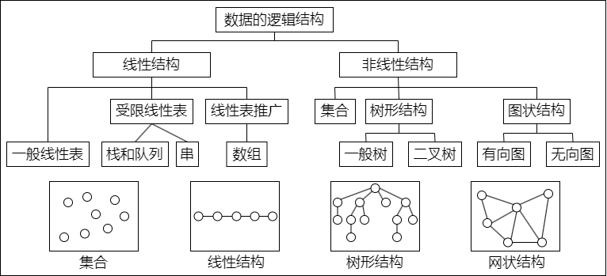

    - **集合**：结构中的数据元素之间除 “同属一个集合” 外，别无其他关系
    - **线性结构**：结构中的数据元素之间只存在一对一的关系
    - **树形结构**：结构中的数据元素之间存在一对多的关系
    - **图状结构或网状结构**：结构中的数据元素之间存在多对多的关系

2. **数据的存储结构**

    存储结构 **是指数据结构在计算机中的表示**（又称 **映像**），也称物理结构。它包括数据元素的表示和关系的表示。数据的存储结构是用计算机语言实现的逻辑结构，它依赖于计算机语言。**数据的存储结构主要有** 顺序存储、链式存储、素引存储和散列存储。

    - **顺序存储**：把逻辑上相邻的元素存储在物理位置上也相邻的存储单元中，元素之间的关系由存储单元的邻接关系来体现。其 **优点是** 可以实现随机存取，每个元素占用最少的存储空间；**缺点是** 只能使用相邻的一整块存储单元，因此可能产生较多的外部碎片
    - **链式存储**：不要求逻辑上相邻的元素在物理位置上也相邻，借助指示元素存储地址的指针来表示元素之间的逻辑关系。其 **优点是** 不会出现碎片现象，能充分利用所有存储单元；**缺点是** 每个元素因存储指针而占用额外的存储空间，且只能实现顺序存取
    - **索引存储**：在存储元素信息的同时，还建立附加的索引表。索引表中的每项称为索引项，索引项的一般形式是（关键字，地址）。其 **优点是** 检索速度快；**缺点是** 附加的索引表额外占用存储空间。另外，增加和删除数据时也要修改索引表，因而会花费较多的时间
    - **散列存储**：根据元素的关键字直接计算出该元素的存储地址，又称 **哈希（Hash）存储**。其 **优点是** 检索、增加和删除结点的操作都很快；**缺点是** 若散列函数不好，则可能出现元素存储单元的冲突，而解决冲突会增加时间和空间开销

3. **数据的运算**

    施加在数据上的运算包括运算的定义和实现。运算的定义是针对逻辑结构的，指出运算的功能；运算的实现是针对存储结构的，指出运算的具体操作步骤。

### 算法和算法评价

#### 算法的基本概念

**算法（Algorithm）是对特定问题求解步骤的一种描述** ，它是指令的有限序列，其中的每条指令表示一个或多个操作。此外，**一个算法还具有下列五个重要特性：**

- **有穷性**：一个算法必须总在执行有穷步之后结束，且每一步都可在有穷时间内完成
- **确定性**：算法中每条指令必须有确切的含义，对于相同的输入只能得出相同的输出
- **可行性**：算法中描述的操作都可以通过已经实现的基本运算执行有限次来实现
- **输入**：一个算法有零个或多个输入，这些输入取自于某个特定的对象的集合
- **输出**：一个算法有一个或多个输出，这些输出是与输入有着某种特定关系的量

通常，设计一个 “好” 的算法应考虑达到以下目标：

- **正确性**：算法应能够正确地解决求解问题
- **可读性**：算法应具有良好的可读性，以帮助人们理解
- **健壮性**：输入非法数据时，算法能适当地做出反应或进行处理，而不会产生莫名其妙的输出结果
- **高效率与低存储量需求**：效率是指算法执行的时间，存储量需求是指算法执行过程中所需要的最大存储空间，这两者都与问题的规模有关

#### 算法效率的度量

算法效率的度量是通过时间复杂度和空间复杂度来描述的。

1. **时间复杂度**

    **一个语句的频度是指该语句在算法中被重复执行的次数**。算法中所有语句的频度之和记为 $T(n)$，它是该算法问题规模 $n$ 的函数，时间复杂度主要分析 $T(n)$ 的数量级。算法中基本运算（最深层循环内的语句）的频度与 $T(n)$ 同数量级，因此通常采用算法中基本运算的频度 $f(n)$ 来分析算法的时间复杂度。因此，算法的时间复杂度记为 $T(n) = O(f(n))$ 式中，$O$ 的含义是 $T(n)$ 的数量级，其严格的数学定义是：若 $T(n)$ 和 $f(n)$ 是定义在正整数集合上的两个函数，则存在正常数 $C$ 和 $n_{0}$，使得当 $n \geqslant n_{0}$ 时，都满足 $0 \leqslant T(n) \leqslant Cf(n)$。

    算法的时间复杂度不仅依赖于问题的规模 $n$，也取决于待输入数据的性质（如：输入数据元素的初始状态）。例如：在数组 `A[0…n-1]` 中，查找给定值 k 的算法大致如下：

    ```c
    i = n - 1;
    while (i >= 0 && (A[i] != k))
        i--;
    return i;
    ```

    该算法中语句 `3`（基本运算）的频度不仅与问题规模 $n$ 有关，而且与输入实例中 `A` 的各元素的取值及 `k` 的取值有关：

    - 若 `A` 中没有与 `k` 相等的元素，则语句 `3` 的频度 $f(n) = n$
    - 若 `A` 的最后一个元素等于 `k`，则语句 `3` 的频度 $f(n)$ 是常数 `0`

    一般总是考虑在最坏情况下的时间复杂度，以保证算法的运行时间不会比它更长。

    - **最坏时间复杂度**：是指在最坏情况下，算法的时间复杂度
    - **平均时间复杂度**：是指所有可能输入实例在等概率出现的情况下，算法的期望运行时间
    - **最好时间复杂度**：是指在最好情况下，算法的时间复杂度

    在分析一个程序的时间复杂性时，有以下两条规则：

    - **加法规则**：$T(n) = T_{1}(n) + T_{2}(n) = O(f(n)) + O(g(n)) = O(max(f(n),g(n)))$
    - **乘法规则**：$T(n) = T_{1}(n) \times T_{2}(n) = O(f(n)) \times O(g(n)) = O(f(n) \times g(n))$

    **常见的渐近时间复杂度为**：$O(1) < O(log_{2}n) < O(n) < O(nlog_{2}n) < O(n^{2}) < O(n^{3}) < O(2^{n}) < O(n!) < O(n^{n})$

2. **空间复杂度**

    算法的空间复杂度 $S(n)$ 定义为该算法所耗费的存储空间，它是问题规模 $n$ 的函数。记为：$S(n) = O(g(n))$

    一个程序在执行时除需要存储空间来存放本身所用的指令、常数、变量和输入数据外，还需要一些对数据进行操作的工作单元和存储一些为实现计算所需信息的辅助空间。若输入数据所占空间只取决于问题本身，和算法无关，则只需分析除输入和程序之外的额外空间。

    算法原地工作是指算法所需的辅助空间为常量，即 $O(1)$。

## 线性表

### 线性表的定义和基本操作

#### 线性表的定义

线性表是 **具有相同数据类型的 $n (n \geqslant 0)$ 个数据元素的有限序列**，其中 $n$ 为表长，当 $n = 0$ 时线性表是一个空表。若用 $L$ 命名线性表，则其一般表示为：$L = (a_{1}, a_{2}, a_{i+1}, \dotsc, a_{n})$ 式中，$a_{1}$ 是唯一的 “第一个” 数据元素，又称 **表头元素**；$a_{n}$ 是唯一的 “最后一个” 数据元素，又称 **表尾元素**。除第一个元素外，每个元素有且仅有一个直接前驱。除最后言个元素外，每个元素有且仅有一个直接后继（“直接前驱” 和 “前驱”、“直接后继” 和 “后继” 通常被视为同义词）。以上就是线性表的逻辑特性，这种线性有序的逻辑结构正是线性表名字的由来。

**线性表的特点如下：**

- 表中元素的个数有限
- 表中元素具有逻辑上的顺序性，表中元素有其先后次序
- 表中元素都是数据元素，每个元素都是单个元素
- 表中元素的数据类型都相同，这意味着每个元素占有相同大小的存储空间
- 表中元素具有抽象性，即仅讨论元素间的逻辑关系，而不考虑元素究竟表示什么内容

::: tip
线性表是一种逻辑结构，表示元素之间一对一的相邻关系。顺序表和链表是指存储结构，两者属于不同层面的概念，因此不要将其混淆
:::

#### 线性表的基本操作

一个数据结构的基本操作是指 **其最核心、最基本的操作**。其他较复杂的操作可通过调用其基本操作来实现。**线性表的主要操作如下：**

- **InitList(&L)**：初始化表。构造一个空的线性表
- **Length(L)**：求表长。返回线性表 `L` 的长度，即 `L` 中数据元素的个数
- **LocateElem(L, e)**：按值查找操作。在表 `L` 中查找具有给定关键字值的元素
- **GetElem(L, i)**：按位查找操作。获取表 `L` 中第 `i` 个位置的元素的值
- **ListInsert(&L, i, e)**：插入操作。在表 `L` 中的第 `i` 个位置上插入指定元素 `e`
- **ListDelete(&L, i, &e)**：删除操作。删除表 `L` 中第 `i` 个位置的元素，并用 `e` 返回删除元素的值
- **PrintList(L)**：输出操作。按前后顺序输出线性表 `L` 的所有元素值
- **Empty(L)**：判空操作。若 `L` 为空表，则返回 `true`，否则返回 `false`
- **DestroyList(&L)**：销毁操作。销毁线性表，并释放线性表 `L` 所占用的内存空间

::: tip
- 基本操作的实现取决于采用哪种存储结构，存储结构不同，算法的实现也不同
- 符号 “&” 表示 C++ 语言中的引用调用，在 C 语言中采用指针也可达到同样的效果
:::

### 线性表的顺序表示

#### 顺序表的定义

线性表的顺序存储又称顺序表。它是用一组地址连续的存储单元依次存储线性表中的数据元素，从而使得逻辑上相邻的两个元素在物理位置上也相邻。第 `1` 个元素存储在线性表的起始位置，第 $i$ 个元素的存储位置后面紧接着存储的是第 $i + 1$ 个元素，称 $i$ 为元素 $a_{i}$ 在线性表中的位序。因此，**顺序表的特点是表中元素的逻辑顺序与其物理顺序相同。**

假设线性表 $L$ 存储的起始位置为 $LOC(A)$ LOC 是 `location` 的缩写，sizeof（ElemType）是每个数据元素所占用存储空间的大小，则表 $L$ 所对应的顺序存储如下表所示：

|  数组下标  |  顺序表  |  内存地址  |
|  :----:  |  :----:  |  :----:  |
|  0  |  a~1~  |  LOC(A)  |
|  1  |  a~2~  |  LOC(A) + sizeof(ElemType)  |
|  i - 1  |  a~i~  |  LOC(A) + (i-1) x sizeof(ElemType)  |
|  n - 1  |  a~n~  |  LOC(A) + (n-1) x sizeof(ElemType)  |
|  MaxSize - 1  |  ...  |  LOC(A) + (MaxSize - 1) x sizeof(ElemType)  |

每个数据元素的存储位置都和线性表的起始位置相差一个和该数据元素的位序成正比的常数，因此，顺序表中的任意一个数据元素都可以随机存取，所以线性表的顺序存储结构是一种随机存取的存储结构。通常用高级程序设计语言中的数组来描述线性表的顺序存储结构。

::: tip
线性表中元素的位序是从 `1` 开始的，而数组中元素的下标是从 `0` 开始的
:::

假定线性表的元素类型为 ElemType，则线性表的顺序存储类型描述为：

```c
#define MaxSize 50  // 定义线性表的最大长度
typedef struct {
    ElemType data[MaxSize];  // 顺序表的元素
    int length;  // 顺序表的当前长度
} SqList;  // 顺序表的类型定义
```

一维数组可以是静态分配的，也可以是动态分配的。在静态分配时，由于数组的大小和空间事先已经固定，一旦空间占满，再加入新的数据就会产生溢出，进而导致程序崩溃。

而在动态分配时，存储数组的空间是在程序执行过程中通过动态存储分配语句分配的，一旦数据空间占满，就另外开辟一块更大的存储空间，用以替换原来的存储空间，从而达到扩充存储数组空间的目的，而不需要为线性表一次性地划分所有空间。

```c
#define InitSize 100  // 表长度的初始定义
typedef struct {
    ElemType *data;  // 指示动态分配数组的指针
    int MaxSize, length;  // 数组的最大容量和当前个数
} SeqList;  // 动态分配数组顺序表的类型定义
```

C 的初始动态分配语句为：`L.data = (ElemType *)malloc(sizeof(ElemType) * InitSize);`

C++ 的初始动态分配语句为：`L.data = new ElemType[InitSize];`

::: tip
动态分配并不是链式存储，它同样属于顺序存储结构，物理结构没有变化，依然是随机存取方式，只是分配的空间大小可以在运行时动态决定
:::

顺序表最主要的特点是随机访问，即通过首地址和元素序号可在时间 $O(1)$ 内找到指定的元素。

顺序表的存储密度高，每个结点只存储数据元素。

顺序表逻辑上相邻的元素物理上也相邻，所以插入和删除操作需要移动大量元素。

#### 顺序表上基本操作的实现

1. **插入操作**

    在顺序表 $L$ 的第 $i (1 \leqslant i \leqslant L.length + 1)$ 个位置插入新元素 `e`。若 `i` 的输入不合法，则返回 `false`，表示插入失败；否则，将第 `i` 个元素及其后的所有元素依次往后移动一个位置，腾出一个空位置插入新元素 `e`，顺序表长度增加 `1`，插入成功，返回 `true`。

    ```c
    bool ListInsert(SqList &L, int i, ElemType e) {
        if (i < 1 || i > L.length + 1)  // 判断 i 的范围是否有效
            return false;

        if (L.length >= MaxSize)  // 当前存储空间已满，不能插入
            return false;

        for (int j = L.length; j >= i; j--)  // 将第 1 个元素及之后的元素后移
            L.data[j] = L.data[j-1];

        L.data[i - 1] = e;  // 在位置 i 处放入 e
        L.length++;  // 线性表长度加 1
        return true;
    }
    ```

    - **最好情况**：在表尾插入（即 $i = n + 1$），元素后移语句将不执行，时间复杂度为 $O(1)$
    - **最坏情况**：在表头插入（即 $i = 1$），元素后移语句将执行 $n$ 次，时间复杂度为 $O(n)$
    - **平均情况**：假设 $p_{i} (p_{i} = 1/(n + 1))$ 是在第 $i$ 个位置上插入一个结点的概率，则在长度为 $n$ 的线性表中插入一个结点时，所需移动结点的平均次数为：$\displaystyle\sum_{i=1}^{n+1} p_{i} (n - i + 1) = \displaystyle\sum_{i=1}^{n+1} \dfrac{1}{n + 1} (n - i + 1) = \dfrac{1}{n + 1} \displaystyle\sum_{i=1}^{n+1} (n - i + 1) = \dfrac{1}{n + 1} \dfrac{n(n + 1)}{2} = \dfrac{n}{2}$

    因此，顺序表插入算法的平均时间复杂度为 $O(n)$。

2. **删除操作**

    删除顺序表 $L$ 中第 $i (1 \leqslant i \leqslant L.length)$ 个位置的元素，用引用变量 `e` 返回。若 `i` 的输入不合法，则返回 `false`；否则，将被删元素赋给引用变量 `e`，并将第 `i + 1` 个元素及其后的所有元素依次往前移动一个位置，返回 `true`。

    ```c
    bool ListDelete(SqList &L, int i, ElemType &e) {
        if (i < 1 || i > L.length)  // 判断 i 的范围是否有效
            return false;

        e = L.data[i - 1];  // 将被删除的元素赋值给 e
        for (int j = i; j < L.length; j++)  // 将第 i 个位置后的元素前移
            L.data[j - 1] = L.data[j];

        L.length--;  // 线性表长度减 1
        return true;
    }
    ```

    - **最好情况**：删除表尾元素（即 $i = n$），无须移动元素，时间复杂度为 $O(1)$
    - **最坏情况**：删除表头元素（即 $i = 1$），需移动除表头元素外的所有元素，时间复杂度为 $O(n)$
    - **平均情况**：假设 $p_{i} (p_{i} = 1/n)$ 是删除第 $i$ 个位置上结点的概率，则在长度为 $n$ 的线性表中删除一个结点时，所需移动结点的平均次数为：$\displaystyle\sum_{i=1}^{n} p_{i} (n - i) = \displaystyle\sum_{i=1}^{n} \dfrac{1}{n} (n - i) = \dfrac{1}{n} \displaystyle\sum_{i=1}^{n} (n - i) = \dfrac{1}{n} \dfrac{n(n - 1)}{2} = \dfrac{n - 1}{2}$

    因此，顺序表删除算法的平均时间复杂度为 $O(n)$。

    可见，顺序表中插入和删除操作的时间主要耗费在移动元素上，而移动元素的个数取决于插入和删除元素的位置。

3. **按值查找（顺序查找）**

    在顺序表 $L$ 中查找第一个元素值等于 `e` 的元素，并返回其位序。

    ```c
    int LocateElem(SqList L, ElemType e) {
        int i;

        for (i = 0; i < L.length; i++)
            if (L.data[i] == e)
                return i + l;  // 下标为 1 的元素值等于 e，返回其位序主 i + 1

        return 0;  // 退出循环，说明查找失败
    }
    ```

    - **最好情况**：查找的元素就在表头，仅需比较一次，时间复杂度为 $O(1)$
    - **最坏情况**：查找的元素在表尾（或不存在）时，需要比较 `n` 次，时间复杂度为 $O(n)$
    - **平均情况**：假设 $p_{i} (p_{i} = 1/n)$ 是查找的元素在第 $i (1 \leqslant i \leqslant L.length)$ 个位置上的概率，则在长度为 `n` 的线性表中查找值为 `e` 的元素所需比较的平均次数为：$\displaystyle\sum_{i=1}^{n} p_{i} \times i = \displaystyle\sum_{i=1}^{n} \dfrac{1}{n} \times i = \dfrac{1}{n} \dfrac{n(n + 1)}{2} = \dfrac{n + 1}{2}$

    因此，顺序表按值查找算法的平均时间复杂度为 $O(n)$

### 线性表的链式表示

顺序表的存储位置可以用一个简单直观的公式表示，它可以随机存取表中任意一个元素，但插入和删除操作需要移动大量元素。链式存储线性表时，不需要使用地址连续的存储单元，即不要求逻辑上相邻的元素在物理位置上也相邻，它通过 “链” 建立起元素之间的逻辑关系，因此插入和删除操作不需要移动元素，而只需修改指针，但也会失去顺序表可随机存取的优点。

#### 单链表的定义

线性表的链式存储又称单链表，它是指 **通过一组任意的存储单元来存储线性表中的数据元素**。为了建立数据元素之间的线性关系，对每个链表结点，除存放元素自身的信息外，还需要存放一个指向其后继的指针。单链表结点结构中 `data` 为数据域，存放数据元素；`next` 为指针域，存放其后继结点的地址。

单链表中结点类型的描述如下：

```c
typedef struct LNode {  // 定义单链表结点类型
    ElemType data;  //  数据域
    struct LNode *next;  // 指针域
} LNode, *LinkList;
```

利用单链表可以解决顺序表需要大量连续存储单元的缺点，但单链表附加指针域，也 **存在浪费存储空间** 的缺点。由于单链表的元素离散地分布在存储空间中，所以 **单链表是非随机存取的存储结构**，即不能直接找到表中某个特定的结点。查找某个特定的结点时，需要从表头开始遍历，依次查找。

通常用 **头指针** 来标识一个单链表，如：单链表 $L$，头指针为 `NULL` 时表示个空表。此外，为了操作上的方便，在单链表第一个结点之前附加一个结点，称为 **头结点**。头结点的数据域可以不设任何信息，也可以记录表长等信息。头结点的指针域指向线性表的第一个元素结点，如下图所示。

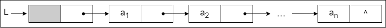

**头结点和头指针的区分**：不管带不带头结点，头指针都始终指向链表的第一个结点，而头结点是带头结点的链表中的第一个结点，结点内通常不存储信息。

**引入头结点后，可以带来两个优点：**

- 由于第一个数据结点的位置被存放在头结点的指针域中，因此在链表的第一个位置上的操作和在表的其他位置上的操作一致，无须进行特殊处理
- 无论链表是否为空，其头指针都是指向头结点的非空指针（空表中头结点的指针域为空），因此空表和非空表的处理也就得到了统一

#### 单链表上基本操作的实现

1. **采用头插法建立单链表**

    该方法从一个空表开始，生成新结点，并将读取到的数据存放到新结点的数据域中，然后将新结点插入到当前链表的表头，即头结点之后，如下图所示。

    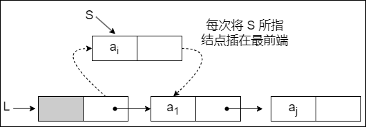

    **头插法建立单链表的算法如下：**

    ```c
    LinkList List_HeadInsert(LinkList &L) {  // 逆向建立单链表
        LNode *s; int x;
        L = (LinkList)malloc(sizeof(LNode));  // 创建头结点
        L->next = NULL;  // 初始为空链表
        scanf("%d", &x);  // 输入结点的值

        while (x != 9999) {  // 输入 9999 表示结束
            s = (LNode *)malloc(sizeof(LNode));  // 创建新结点
            s->data = x;
            s->next = L->next;
            L->next = s;  // 将新结点插入表中，L 为头指针
            scanf("%d", &x);
        }

        return L;
    }
    ```

    采用头插法建立单链表时，读入数据的顺序与生成的链表中的元素的顺序是相反的。每个结点插入的时间为 $O(1)$，设单链表长为 `n`，则总时简复杂度为 $O(n)$。

    若没有设立头结点，则上述代码需要在头部插入新结点的地方修改，因为每次插入新结点后，需要将它的地址赋值给头指针 L。

2. **采用尾插法建立单链表**

    头插法建立单链表的算法虽然简单，但生成的链表中结点的次序和输入数据的顺序不一致。若希望两者次序一致，则可采用尾插法。该方法将新结点插入到当前链表的表尾，为此必须增加一个尾指针 `r`，使其始终指向当前链表的尾结点，如下图所示。

    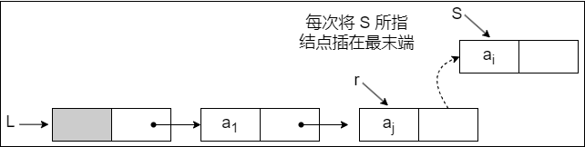

    **尾插法建立单链表的算法如下：**

    ```c
    LinkList List_TailInsert(LinkList &L) {  // 正向建立单链表
        int x;  // 设置运算类型为整型
        L = (LinkList)malloc(sizeof(LNode));
        LNode *s, *r = L;  // r 为表尾指针
        scanf("%d", &x);  // 输入结点的值

        while (x != 9999) {  // 输入 9999 表示结束
            s = (LNode *)malloc(sizeof(LNode));
            s->data = x;
            L->next = s;  // 将新结点插入表中，L 为头指针
            r = s;  // r 指向新的表尾结点
            scanf("%d", &x);
        }

        r->next = NULL;  // 尾结点指针置空
        return L;
    }
    ```

    因为附设了一个指向表尾结点的指针，故时间复杂度和头插法的相同。

3. **按序号查找结点**

    在单链表中从第一个结点出发，顺指针 `next` 域逐个往下搜索，直到找到第 `i` 个结点为止，否则返回最后一个结点指针域 `NULL`。

    **按序号查找结点值的算法如下：**

    ```c
    LNode * GetElem(LinkList L, int i) {
        if (i < 1)
            return NULL;  // 若 i 无效，则返回 NULL
        
        int j = l;  // 计数，初始为 1
        LNode *p = L->next;  // 第 1 个结点指针赋给 p

        while (p! = NULL && j < i) {  // 从第1个结点开始找，查找第i个结点　
            p = p->next;
            j++;
        }

        return p;  // 返回第 1 个结点的指针，若 1 大于表长，则返回 NULL
    }
    ```

    按序号查找操作的时间复杂度为 $O(n)$。

4. **按值查找表结点**

    从单链表的第一个结点开始，由前往后依次比较表中各结点数据域的值，若某结点数据域的值等于给定值 `e`，则返回该结点的指针；若整个单链表中没有这样的结点，则返回 `NULL`。

    **按值查找表结点的算法如下：**

    ```c
    LNode * LocateElem(LinkList L, ElemType e) {
        LNode *p = L->next;

        while(p! = NULL && p->data != e)  // 从第 1 个结点开始查找 data 域为 e 的结点
            p = p->next;

        return p;  // 找到后返回该结点指针，否则返回 NULL
    }
    ```

    按值查找操作的时间复杂度为 $O(n)$。

5. **插入结点操作**

    插入结点操作将值为 `×` 的新结点插入到单链表的第 `i` 个位置上。先检查插入位置的合法性，然后找到待插入位置的前驱结点，即第 `i - 1` 个结点，再在其后插入新结点。

    算法首先调用按序号查找算法 `GetElem(L, i - 1)`，查找第 `i - 1` 个结点。假设返回的第 `i - 1` 个结点为 `*P`，然后令新结点 `*s` 的指针域指向 `*p` 的后继结点，再令结点 `*P` 的指针域指向新插入的结点 `*s`。其操作过程如下图所示。

    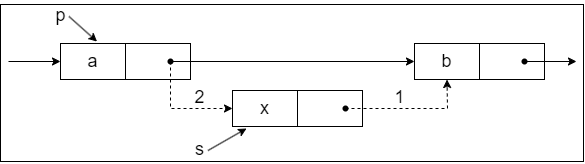

    **实现插入结点的代码片段如下：**

    ```c
    p = GetElem(L, i - 1);  // 查找插入位置的前驱结点
    s->next = p->next;
    p->next = s;
    ```

    算法中，语句 `2` 和 `3` 的顺序不能颠倒，否则，先执行 `p->next = s` 后，指向其原后继的指针就不存在，再执行 `s->next = p->next` 时，相当于执行了 `s->next = s`，显然是错误的。本算法主要的时间开销在于查找第 `i - 1` 个元素，时间复杂度为 $O(n)$。若在给定的结点后面插入新结点，则时间复杂度仅为 $O(1)$。

    ::: details 扩展：对某一结点进行前插操作
    **前插操作** 是指在某结点的前面插入一个新结点，后插操作的定义刚好与之相反。在单链表插入算法中，通常都采用后插操作。

    以上面的算法为例，首先调用函数 `GetElem()` 找到第 `i - 1` 个结点，即插入结点的前驱结点后，再对其执行后插操作。由此可知，对结点的前插操作均可转化为后插操作，前提是从单链表的头结点开始顺序查找到其前驱结点，时间复杂度为 $O(n)$。

    此外，可采用另一种方式将其转化为后插操作来实现，设待插入结点为 `*s`；将 `*s` 插入到 `*p` 的前面。仍然将 `*s` 插入到 `*p` 的后面，然后将 `p->data` 与 `data` 交换，这样既满足了逻辑关系，又能使得时间复杂度为 $O(1)$。**算法的代码片段如下：**

    ```c
    // 将 *s 结点插入到 *p 之前的主要代码片段
    s->next = p->next;  // 修改指针域，不能颠倒
    p->next = s;
    temp = p->data;  // 交换数据域部分
    p->data = s->data;
    s->data = temp;
    ```
    :::

6. **删除结点操作**

    删除结点操作是将单链表的第 `i` 个结点删除。先检查删除位置的合法性，后查找表中第 `i - 1` 个结点，即被删结点的前驱结点，再将其删除。其操作过程如下图所示。

    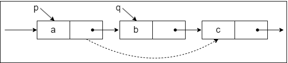

    假设结点 `*p` 为找到的被删结点的前驱结点，为实现这一操作后的逻辑关系的变化，仅需修改 `*p` 的指针域，即将 `*p` 的指针域 `next` 指向 `*q` 的下一结点。

    **实现删除结点的代码片段如下：**

    ```c
    p = GetElem(L, i - 1);  // 查找删除位置的前驱结点
    q = p->next;  // 令 q 指向被删除结点
    p->next = q->next;  // 将 *q 结点从链中 “断开”
    free(q);  // 释放结点的存储空间
    ```

    和插入算法一样，该算法的主要时间也耗费在查找操作上，时间复杂度为 $O(n)$。

    ::: details 扩展：删除结点 *P
    要删除某个给定结点 `*P`，通常的做法是先从链表的头结点开始顺序找到其前驱结点，然后执行删除操作，算法的时间复杂度为 $O(n)$。

    其实，删除结点 `*p` 的操作可用删除 `*p` 的后继结点操作来实现，实质就是将其后继结点的值赋予其自身，然后删除后继结点，也能使得时间复杂度为 $O(1)$。

    **实现上述操作的代码片段如下：**

    ```c
    q = p->next;  // 令 q 指向 *p 的后继结点
    P->data = p->next->data;  // 用后继结点的数据域覆盖
    P->next = q->next;  // 将 *q 结点从链中 “断开”
    free(q):  // 释放后继结点的存储空间
    ```
    :::

7. **求表长操作**

    求表长操作就是计算单链表中数据结点（不含头结点）的个数，需要从第一个结点开始顺序依次访问表中的每个结点，为此需要设置一个计数器变量，每访问一个结点，计数器加 `1`，直到访问到空结点为止。算法的时间复杂度为 $O(n)$。

    需要注意的是，因为单链表的长度是不包括头结点的，因此不带头结点和带头结点的单链表在求表长操作上会略有不同。对不带头结点的单链表，当表为空时，要单独处理。

#### 双链表

单链表结点中只有一个指向其后继的指针，使得单链表只能从头结点依次顺序地向后遍历。要访问某个结点的前驱结点（插入、删除操作时），只能从头开始遍历，访问后继结点的时间复杂度为 $O(1)$，访问前驱结点的时间复杂度为 $O(n)$。

为了克服单链表的上述缺点，引入了双链表，双链表结点中有两个指针 `prior` 和 `next`，分别指向其前驱结点和后继结点，如下图所示。

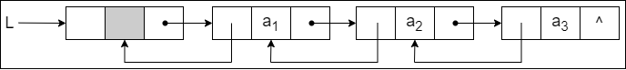

**双链表中结点类型的描述如下：**

```c
typedef struct DNode {  // 定义双链表结点类型
    ElemType data;  // 数据域
    struct DNode *prior, *next;  // 前驱和后继指针

} DNode, *DLinklist;
```

双链表在单链表的结点中增加了一个指向其前驱的 `prior` 指针，因此双链表中的按值查找和按位查找的操作与单链表的相同。但双链表在插入和删除操作的实现上，与单链表有着较大的不同。这是因为 “链” 变化时也需要对 `prior` 指针做出修改，其关键是保证在修改的过程中不断链。此外，双链表可以很方便地找到其前驱结点，因此，插入、删除操作的时间复杂度仅为 $O(1)$。

1. **双链表的插入操作**

    在双链表中 `p` 所指的结点之后插入结点 `*s`，其指针的变化过程如下图所示。

    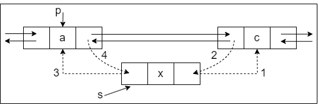

    **插入操作的代码片段如下：**

    ```c
    s->next = p->next;  // 将结点 *s 插入到结点 *p 之后
    p->next->prior = s;
    s->prior = p;
    p->next = s;
    ```

    上述代码的语句顺序不是唯一的，但也不是任意的，`1` 和 `2` 两步必须在 `4` 步之前，否则 `*p` 的后继结点的指针就会丢掉，导致插入失败。

2. **双链表的删除操作**

    删除双链表中结点 `*p` 的后继结点 `*q`，其指针的变化过程如下图所示。

    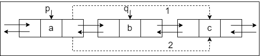

    **删除操作的代码片段如下：**

    ```c
    p->next = q->next;
    q->next->prior = p;
    free(q);  // 释放结点空间
    ```

    在建立双链表的操作中，也可采用如同单链表的头插法和尾插法，但在操作上需要注意指针的变化和单链表有所不同。

#### 循环链表

1. **循环单链表**

    循环单链表和单链表的区别在于，表中最后一个结点的指针不是 `NULL`，而改为指向头结点，从而整个链表形成一个环，如下图所示。

    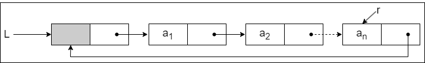

    在循环单链表中，表尾结点 `*r` 的 `next` 域指向 `L`，故表中没有指针域为 `NULL` 的结点，因此，循环单链表的判空条件不是头结点的指针是否为空，而是它是否等于头指针。

    循环单链表的插入、删除算法与单链表的几乎一样，所不同的是若操作是在表尾进行，则执行的操作不同，以让单链表继续保持循环的性质。当然，正是因为循环单链表是一个 “环”，因此在任何一个位置上的插入和删除操作都是等价的，无须判断是否是表尾。

    在单链表中只能从表头结点开始往后顺序遍历整个链表，而循环单链表可以从表中的任意一个结点开始遍历整个链表。有时对循环单链表不设头指针而仅设尾指针，以使得操作效率更高。其原因是，若设的是头指针，对在表尾插入元素需要 $O(n)$ 的时间复杂度，而若设的是尾指针 `r`，`r->next` 即为头指针，对在表头或表尾插入元素都只需要 $O(1)$ 的时间复杂度。

2. **循环双链表**

    由循环单链表的定义不难推出循环双链表。不同的是在循环双链表中，头结点的 `prior` 指针还要指向表尾结点，如下图所示。

    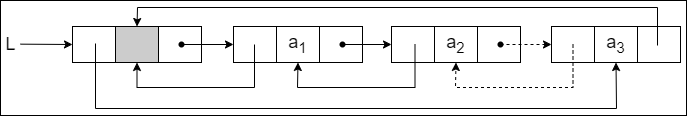

    在循环双链表 `L` 中，某结点 `*p` 为尾结点时，`p->next == L`；当循环双链表为空表时，其头结点的 `prior` 域和 `next` 域都等于 `L`。

#### 静态链表

静态链表借助数组来描述线性表的链式存储结构，结点也有数据域 `data` 和指针域 `next`，与前面所讲的链表中的指针不同的是，这里的指针是结点的相对地址（数组下标），又称游标。和顺序表一样，静态链表也要预先分配一块连续的内存空间。

静态链表和单链表的对应关系如下图所示。

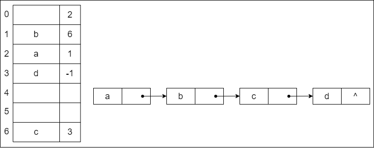

**静态链表结构类型的描述如下：**

```c
#define Maxsize 50  // 静态链表的最大长度
typedef struct {  // 静态链表结构类型的定义
    ElemType data;  // 存储数据元素
    int next;  // 下一个元素的数组下标
} SLinkList[MaxSize];
```

静态链表以 `next == -1` 作为其结束的标志。静态链表的插入、删除操作与动态链表的相同，只需要修改指针，而不需要移动元素。总体来说，静态链表没有单链表使用起来方便，但在一些不支持指针的高级语言（如：Basic）中，这是一种非常巧妙的设计方法。

### 顺序表和链表的比较

1. **存取（读写）方式**

    顺序表可以顺序存取，也可以随机存取，链表只能从表头顺序存取元素。例如：在第 `i` 个位置上执行存或取的操作，顺序表仅需一次访问，而链表则需从表头开始依次访问 `i` 次。

2. **逻辑结构与物理结构**

    采用顺序存储时，逻辑上相邻的元素，对应的物理存储位置也相邻。而采用链式存储时，逻辑上相邻的元素，物理存储位置不一定相邻，对应的逻辑关系是通过指针链接来表示的。

3. **查找、插入和删除操作**

    对于按值查找，顺序表无序时，两者的时间复杂度均为 $O(n)$；顺序表有序时，可采用折半查找，此时的时间复杂度为 $O(log_{2}n)$。

    对于按序号查找，顺序表支持随机访问，时间复杂度仅为 $O(1)$，而链表的平均时间复杂度为 $O(n)$。顺序表的插入、删除操作，平均需要移动半个表长的元素。链表的插入、删除操作，只需修改相关结点的指针域即可。由于链表的每个结点都带有指针域，故而存储密度不够大。

4. **空间分配**

    顺序存储在静态存储分配情形下，一旦存储空间装满就不能扩充，若再加入新元素，则会出现内存溢出，因此需要预先分配足够大的存储空间。预先分配过大，可能会导致顺序表后部大量闲置；预先分配过小，又会造成溢出。动态存储分配虽然存储空间可以扩充，但需要移动大量元素，导致操作效率降低，而且若内存中没有更大块的连续存储空间，则会导致分配失败。链式存储的结点空间只在需要时申请分配，只要内存有空间就可以分配，操作灵活、高效。

**在实际中选取存储结构需考虑以下几点：**

1. **基于存储的考虑**

    难以估计线性表的长度或存储规模时，不宜采用顺序表；链表不用事先估计存储规模，但链表的存储密度较低，显然链式存储结构的存储密度是小于 `1` 的。

2. **基于运算的考虑**

    在顺序表中按序号访问 $a_{i}$ 的时间复杂度为 $O(1)$，而链表中按序号访问的时间复杂度为 $O(n)$，因此若经常做的运算是按序号访问数据元素，则显然顺序表优于链表。

    在顺序表中进行插入、删除操作时，平均移动表中一半的元素，当数据元素的信息量较大且表较长时，这一点是不应忽视的；在链表中进行插入、删除操作时，虽然也要找插入位置，但操作主要是比较操作，从这个角度考虑显然后者优于前者。

3. **基于环境的考虑**

    顺序表容易实现，任何高级语言中都有数组类型；链表的操作是基于指针的，相对来讲，前者实现较为简单，这也是用户考虑的一个因素。

总之，两种存储结构各有长短，选择哪一种由实际问题的主要因素决定。通常较稳定的线性表选择顺序存储，而频繁进行插入、删除操作的线性表（即动态性较强）宜选择链式存储。

## 栈、队列和数组

### 栈

#### 栈的基本概念

1. **栈的定义**

    栈（Stack）是 **只允许在一端进行插入或删除操作的线性表**。首先栈是一种线性表，但限定这种线性表只能在某一端进行插入和删除操作。

    - **栈顶（Top）**：线性表允许进行插入删除的那一端
    - **栈底（Bottom）**：固定的，不允许进行插入和删除的另一端
    - **空栈**：不含任何元素的空表

    假设某个栈 $S = (a_{1}, a_{2}, a_{3}, a_{4}, a_{5})$，则 $a_{1}$ 为栈底元素，$a_{5}$ 为栈顶元素。由于栈只能在栈顶进行插入和删除操作，进次序依次为 $a_{1}, a_{2}, a_{3}, a_{4}, a_{5}$，而出栈次序为 $a_{5}, a_{4}, a_{3}, a_{2}, a_{1}$。由此可见，栈的操作特性可以明显地概括为 **后进先出（Last In First Out，LIFO）。**

    栈的数学性质：`n` 个不同元素进栈，出栈元素不同排列的个数为 $\dfrac{1}{n+1} C_{2n}^{n}$。公式称为 **卡特兰（Catalan）** 数。

2. **栈的基本操作**

    - **InitStack(&S)**：初始化一个空栈 `S`
    - **StackEmpty(S)**：判断一个栈是否为空，若栈 `S` 为空则返回 `true`，否则返回 `false`
    - **Push(&S, x)**：进栈，若栈 `S` 未满，则将 `x` 加入使之成为新栈顶
    - **Pop(&S，&x)**：出栈，若栈 `S` 非空，则弹出栈顶元素，并用 `x` 返回
    - **GetTop(S，&x)**：读栈顶元素，若栈 `S` 非空，则用 `×` 返回栈顶元素
    - **DestroyStack(&S)**：销毁栈，并释放栈 `S` 占用的存储空间（“&” 表示引用调用）

#### 栈的顺序存储结构

栈是一种操作受限的线性表，类似于线性表，它也有对应的两种存储方式。

1. **顺序栈的实现**

    采用顺序存储的栈称为 **顺序栈**，它利用一组地址连续的存储单元存放自栈底到栈顶的数据元素，同时附设一个 **指针（top）** 指示当前栈顶元素的位置。

    **栈的顺序存储类型可描述为：**

    ```c
    #define MaxSize 50  // 定义栈中元素的最大个数
    typedef struct {
        Elemtype data[MaxSize];  // 存放栈中元素
        int top;  // 栈顶指针
    } SqStack;
    ```

    - **栈顶指针**：`S.top`，初始时设置 `S.top = -1` ；栈顶元素：`S.data[S.top]`
    - **进栈操作**：栈不满时，栈顶指针先加 `1`，再送值到栈顶元素
    - **出栈操作**：栈非空时，先取栈顶元素值，再将栈顶指针减 `1`
    - **栈空条件**：`S.top == 1`；栈满条件：`S.top == MaxSize - 1`；栈长：`S.top + 1`

    由于顺序栈的入栈操作受数组上界的约束，当对栈的最大使用空间估计不足时，有可能发生栈上溢，此时应及时向用户报告消息，以便及时处理，避免出错。

    ::: tip
    栈和队列的判空、判满条件，会因实际给的条件不同而变化，上面提到的方法以及下面的代码实现只是在栈顶指针设定的条件下的相应方法，而其他情况则需具体问题具体分析
    :::

2. **顺序栈的基本运算**

    下面是顺序栈上常用的基本运算的实现：

    - **初始化**

        ```c
        void InitStack(Sqstack &S) {
            S.top = -1;  // 初始化栈顶指针
        }
        ```

    - **判栈空**

        ```c
        bool StackEmpty(SqStack S) {
            if (S.top == -1)  // 栈空
                return true;
            else  // 不空
                return false;
        }
        ```

    - **进栈**

        ```c
        bool Push(SqStack &S, ElemType x) {
            if (S.top == MaxSize - 1)  // 栈满，报错
                return false;

            S.data[++S.top] = x;  // 指针先加 1，再入栈
            return true;
        }
        ```

        当栈不满时，`top` 先加 `1`，再入栈。

    - **出栈**

        ```c
        bool Pop(SqStack &S, ElemType &x) {
            if (S.top == -1)  // 栈空，报错
                return false;

            x = S.data[S.top--];  // 先出栈，指针再减 1
            return true;
        }
        ```

    - **读栈顶元素**

        ```c
        bool GetTop(SqStack S, ElemType &x) {
            if (S.top == -1)  // 栈空，报错
                return false;

            x = S.data[S.top];  // × 记录栈顶元素
            return true;
        }
        ```

        仅为读取栈顶元素，并没有出栈操作，因此原栈顶元素依然保留在栈中。

        ::: tip
        这里 `top` 指向的是栈顶元素，所以进栈操作为 `S.data[++S.top] = x`，出栈操作为 `x = S.data[S.top--]`。若栈顶指针初始化为 `S.top = 0`，即 `top` 指向栈顶元素的下一位置，则入栈操作变为 `S.data[S.top++] = x`；出栈操作变为 `x = S.data[--S.top]`。相应的栈空、栈满条件也会发生变化
        :::

3. **共享栈**

    利用栈底位置相对不变的特性，可让两个顺序栈共享一个一维数组空间，将两个栈的栈底分别设置在共享空间的两端，两个栈顶向共享空间的中间延伸。

    两个栈的栈顶指针都指向栈顶元素，`top0 = -1` 时 `0` 号栈为空，`top1 = MaxSize` 时 `1` 号栈为空；仅当两个栈顶指针相邻（`top1 - top0 = 1`）时，判断为栈满。当 `0` 号栈进栈时 `top0` 先加 `1` 再赋值，`1` 号栈进栈时 `top1` 先减 `1` 再赋值；出栈时则刚好相反。

    共享栈是为了更有效地利用存储空间，两个栈的空间相互调节，只有在整个存储空间被占满时才发生上溢。其存取数据的时间复杂度均为 $O(1)$，所以对存取效率没有什么影响。

#### 栈的链式存储结构

采用链式存储的栈称为 **链栈**，链栈的优点是 **便于多个栈共享存储空间和提高其效率，且不存在栈满上溢的情况**。通常采用单链表实现，并规定所有操作都是在单链表的表头进行的。这里规定链栈没有头结点，`Lhead` 指向栈顶元素。

**栈的链式存储类型可描述为：**

```c
typedef struct Linknode {
    ElemType data;  // 数据域
    struct Linknode *next; // 指针域
} *LiStack;  // 栈类型定义
```

采用链式存储，便于结点的插入与删除。链栈的操作与链表类似，入栈和出栈的操作都在链表的表头进行。需要注意的是，对于带头结点和不带头结点的链栈，具体的实现会有所不同。

### 队列

#### 队列的基本概念

1. **队列的定义**

    队列（Queue）简称队，也是一种操作受限的线性表，**只允许在表的一端进行插入，而在表的另一端进行删除**。向队列中插入元素称为入队或进队；删除元素称为出队或离队。这和日常生活中的排队是一致的，最早排队的也是最早离队的，其操作的特性是 **先进先出（First In First Out，FIFO）。**

    - **队头（Front）**：允许删除的一端，又称队首
    - **队尾（Rear）**：允许插入的一端
    - **空队列**：不含任何元素的空表

2. **队列常见的基本操作**

    - **InitQueue(&Q)**：初始化队列，构造一个空队列 `Q`
    - **Queuempty(Q)**：判队列空，若队列 `Q` 为空返回 `true`，否则返回 `false`
    - **EnQueue(&Q, x)**：入队，若队列 `Q` 未满，将 `x` 加入，使之成为新的队尾
    - **DeQueue(&Q, &x)**：出队，若队列 `Q` 非空，删除队头元素，并用 `x` 返回
    - **GetHead(Q, &x)**：读队头元素，若队列 `Q` 非空，则将队头元素赋值给 `x`

    需要注意的是，栈和队列是操作受限的线性表，因此不是任何对线性表的操作都可以作为栈和队列的操作。比如：不可以随便读取栈或队列中间的某个数据。

#### 队列的顺序存储结构

1. **队列的顺序存储**

    队列的顺序实现是指分配一块连续的存储单元存放队列中的元素，并附设两个指针：队头指针 `front` 指向队头元素，队尾指针 `rear` 指向队尾元素的下一个位置。

    **队列的顺序存储类型可描述为：**

    ```c
    #define MaxSize 50  // 定义队列中元素的最大个数
    typedef struct {
        ElemType data[MaxSize];  // 存放队列元素
        int front, rear;  // 队头指针和队尾指针
    } SqQueue;
    ```

    - **初始时**：`Q.front = Q.rear = 0`
    - **进队操作**：队不满时，先送值到队尾元素，再将队尾指针加 `1`
    - **出队操作**：队不空时，先取队头元素值，再将队头指针加 `1`

2. **循环队列**

    前面指出了顺序队列的缺点，这里引出循环队列的概念。将顺序队列臆造为一个环状的空间，即把存储队列元素的表从逻辑上视为一个环，称为循环队列。当队首指针 `Q.front = MaxSize - 1` 后，再前进一个位置就自动到 `0`，这可以利用除法取余运算（`%`）来实现。

    - **初始时**：`Q.front = Q.rear = 0`
    - **队首指针进 l**：`Q.front = (Q.front + 1) % MaxSize`
    - **队尾指针进 l**：`Q.rear = (Q.rear + 1) % MaxSize`
    - **队列长度**：`(Q.rear + MaxSize - Q.front) % MaxSize`
    - **出队入队时**：指针都按顺时针方向进 `1`

    循环队列队空的条件是 `Q.front == Q.rear`。若入队元素的速度快于出队元素的速度，则队尾指针很快就会赶上队首指针，此时可以看出队满时也有 `Q.front == Q.rear`。

    **为了区分是队空还是队满的情况，有三种处理方式：**

    - 牺牲一个单元来区分队空和队满，入队时少用一个队列单元，这是一种较为普遍的做法，约定以 “队头指针在队尾指针的下一位置作为队满的标志”
        - 队满条件：`(Q.rear + 1) % MaxSize == Q.front`
        - 队空条件：`Q.front == Q.rear`
        - 队列中元素的个数：`(Q.rear - Q.front + MaxSize) % MaxSize`

    - 类型中增设表示元素个数的数据成员。这样，队空的条件为 `Q.size == 0`；队满的条件为 `Q.size == MaxSize`。这两种情况都有 `Q.front == Q.rear`
    - 类型中增设 `tag` 数据成员，以区分是队满还是队空。`tag` 等于 `0` 时，若因删除导致 `Q.front == Q.rear`，则为队空；`tag` 等于 `1` 时，若因插入导致 `Q.front == Q.rear`，则为队满

3. **循环队列的操作**

    - **初始化**

        ```c
        void InitQueue(SqQueue &Q) {
            Q.rear = Q.front = 0;  // 初始化队首、队尾指针
        }
        ```

    - **判队空**

        ```c
        bool isEmpty(SqQueue Q) {
            if (Q.rear == Q.front)  // 队空条件
                return true;
            else
                return false;
        }
        ```

    - **入队**

        ```c
        bool EnQueue(SqQueue &Q, ElemType x) {
            if ((Q.rear + 1) % MaxSize == Q.front) 
                return false  // 队满则报错

            Q.data[Q.rear] = x;
            Q.rear = (Q.rear + 1) % MaxSize;  // 队尾指针加 1 取模
            return true;
        }
        ```

    - **出队**

        ```c
        bool DeQueue(SqQueue &Q, ElemType &x) {
            if (Q.rear == Q.front)
                return false;  // 队空则报错

            x = Q.data[Q.front];
            Q.front = (Q.front + 1) % MaxSize;  // 队头指针加 1 取模
            return true;
        }
        ```

#### 队列的链式存储结构

1. **队列的链式存储**

    队列的链式表示称为链队列，它实际上 **是一个同时带有队头指针和队尾指针的单链表**。头指针指向队头结点，尾指针指向队尾结点，即单链表的最后一个结点（注意与顺序存储的不同）。

    **队列的链式存储类型可描述为：**

    ```c
    typedef struct LinkNode {  // 链式队列结点
        ElemType data;
        struct LinkNode *next;
    } LinkNode;

    typedef struct {  // 链式队列
        LinkNode *front, *rear;  // 队列的队头和队尾指针
    } *LinkQueue;
    ```

    当 `Q.front == NULL` 且 `Q.rear == NULL` 时，链式队列为空。

    出队时，首先判断队是否为空，若不空，则取出队头元素，将其从链表中摘除，并让 `Q.front` 指向下一个结点（若该结点为最后一个结点，则置 `Q.front` 和 `Q.rear` 都为 `NULL`）。入队时，建立一个新结点，将新结点插入到链表的尾部，并让 `Q.rear` 指向这个新插入的结点（若原队列为空队，则令 `Q.front` 也指向该结点）。

    不难看出，不带头结点的链式队列在操作上往往比较麻烦，因此通常将链式队列设计成一个带头结点的单链表，这样插入和删除操作就统一了。

    用单链表表示的链式队列特别适合于数据元素变动比较大的情形，而且不存在队列满且产生溢出的问题。另外，假如程序中要使用多个队列，与多个栈的情形一样，最好使用链式队列，这样就不会出现存储分配不合理和 “溢出” 的问题。

2. **链式队列的基本操作**

    - **初始化**

        ```c
        void InitQueue(LinkQueue &Q) {
            Q.front = Q.rear = (LinkNode*)malloc(sizeof(LinkNode));  // 建立头结点
            Q.front->next = NULL;  // 初始为空
        }
        ```

    - **判队空**

        ```c
        bool IsEmpty(LinkQueue Q) {
            if (Q.front == Q.rear)
                return true;
            else
                return false;
        }
        ```

    - **入队**

        ```c
        void EnQueue(LinkQueue &Q, ElemType x) {
            LinkNode *s = (LinkNode *)malloc(sizeof(LinkNode));
            s->data = x; s->next = NULL;  // 创建新结点，插入到链尾
            Q.rear->next = s;
            Q.rear = s;
        }
        ```

    - **出队**

        ```c
        bool DeQueue(LinkQueue &Q, ElemType &x) {
            if (Q.front == Q.rear)
                return false;  // 空队

            LinkNode *p = Q.front->next;
            x = p->data;
            Q.front->next = p->next;

            if (Q.rear == p)
                Q.rear = Q.front;  // 若原队列中只有一个结点，删除后变空

            free(p);
            return true;
        }
        ```

#### 双端队列

双端队列是指 **允许两端都可以进行入队和出队操作的队列**。其元素的逻辑结构仍是线性结构。将队列的两端分别称为前端和后端，两端都可以入队和出队。

在双端队列进队时，前端进的元素排列在队列中后端进的元素的前面，后端进的元素排列在队列中前端进的元素的后面。在双端队列出队时，无论是前端还是后端出队，先出的元素排列在后出的元素的前面。

**输出受限的双端队列**：允许在一端进行插入和删除，但在另一端只允许插入的双端队列称为输出受限的双端队列。

**输入受限的双端队列**：允许在一端进行插入和删除，但在另一端只允许删除的双端队列称为输入受限的双端队列。若限定双端队列从某个端点插入的元素只能从该端点删除，则该双端队列就蜕变为两个栈底相邻接的栈。

设有一个双端队列，输入序列为 `1, 2, 3, 4`，试分别求出以下条件的输出序列：

- 能由输入受限的双端队列得到，但不能由输出受限的双端队列得到的输出序列
- 能由输出受限的双端队列得到，但不能由输入受限的双端队列得到的输出序列
- 既不能由输入受限的双端队列得到，又不能由输出受限的双端队列得到的输出序列

先看输入受限的双端队列。假设 `end1` 端输入 `1, 2, 3, 4`，则 `end2` 端的输出相当于队列的输出，即 `1, 2, 3, 4`；而 `end1` 端的输出相当于栈的输出，`n = 4` 时仅通过 `end1` 端有 `14` 种输出序列（由 `Catalan` 公式得出），仅通过 `end1` 端不能得到的输出序列有 `4! - 14 = 10` 种：`1, 4, 2, 3`、`2, 4, 1, 3`、`3, 4, 1, 2`、`3, 1, 4, 2`、`3, 1, 2, 4`、`4, 3, 1, 2`、`4, 1, 3, 2`、`4, 2, 3, 1`、`4, 2, 1, 3`、`4, 1, 2, 3`。

通过 `end1` 和 `end2` 端混合输出，可以输出这 `10` 种中的 `8` 种，如下表所示。其中，S~L~、X~L~ 分别代表 `end1` 端的进队和出队，X~R~ 代表 `end2` 端的出队。

|  输出序列  |  进队出队顺序  |  输出序列  |  进队出队顺序  |
|  :----:  |  :----:  |  :----:  |  :----:  |
|  1, 4, 2, 3  |  S~L~X~R~S~L~S~L~S~L~X~L~X~R~X~R~  |  3, 1, 2, 4  |  S~L~S~L~S~L~X~L~S~L~X~R~X~R~X~R~  |
|  2, 4, 1, 3  |  S~L~S~L~X~L~S~L~S~L~X~L~X~R~X~R~  |  4, 1, 2, 3  |  S~L~S~L~S~L~S~L~X~L~X~R~X~R~X~R~  |
|  3, 4, 1, 2  |  S~L~S~L~S~L~X~L~S~L~X~L~X~R~X~R~  |  4, 1, 3, 2  |  S~L~S~L~S~L~S~L~X~L~X~R~X~L~X~R~  |
|  3, 1, 4, 2  |  S~L~S~L~S~L~X~L~X~R~S~L~X~L~X~R~  |  4, 3, 1, 2  |  S~L~S~L~S~L~S~L~X~L~X~L~X~R~X~R~  |

剩下两种是不能通过输入受限的双端队列输出的，即 `4, 2, 3, 1` 和 `4, 2, 1, 3`。

再看输出受限的双端队列。假设 `end1` 端和 `end2` 端都能输入，仅 `end2` 端可以输出。若都从 `end2` 端输入，就是一个栈了。当输入序列为 `1, 2, 3, 4` 时，输出序列有 `14` 种。对于其他 `10` 种不能得到的输出序列，交替从 `end1` 和 `end2` 端输入，还可以输出其中 `8` 种。设 S~L~ 代表 `end1` 端的输入，S~R~、X~R~ 分别代表 `end2` 端的输入和输出，则可能的输出序列见下表：

|  输出序列  |  进队出队顺序  |  输出序列  |  进队出队顺序  |
|  :----:  |  :----:  |  :----:  |  :----:  |
|  1, 4, 2, 3  |  S~L~X~R~S~L~S~L~S~R~X~R~X~R~X~R~  |  3, 1, 2, 4  |  S~L~S~L~S~R~X~R~X~R~S~L~X~R~X~R~  |
|  2, 4, 1, 3  |  S~L~S~R~X~R~S~L~S~R~X~R~X~R~X~R~  |  4, 1, 2, 3  |  S~L~S~L~S~L~S~R~X~R~X~R~X~R~X~R~  |
|  3, 4, 1, 2  |  S~L~S~L~S~R~X~R~S~R~X~R~X~R~X~R~  |  4, 2, 1, 3  |  S~L~S~R~S~L~S~R~X~R~X~R~X~R~X~R~  |
|  3, 1, 4, 2  |  S~L~S~L~S~R~X~R~X~R~S~R~X~R~X~R~  |  4, 3, 1, 2  |  S~L~S~L~S~R~S~R~X~R~X~R~X~R~X~R~  |

通过输出受限的双端队列不能得到的两种输出序列是 `4, 1, 3, 2` 和 `4, 2, 3, 1`。

**综上所述：**

- 能由输入受限的双端队列得到，但不能由输出受限的双端队列得到的是 `4, 1, 3, 2`
- 能由输出受限的双端队列得到，但不能由输入受限的双端队列得到的是 `4, 2, 1, 3`
- 既不能由输入受限的双端队列得到，又不能由输出受限的双端队列得到的是 `4, 2, 3, 1`

### 栈和队列的应用

#### 栈在括号匹配中的应用

假设表达式中允许包含两种括号：圆括号和方括号，其嵌套的顺序任意即 `([] ())` 或 `[([] [])]` 等均为正确的格式，`[(])` 或 `([())` 或 `(()]` 均为不正确的格式。

**考虑下列括号序列：**

`[ ( [ ] [ ] ) ]`

`1 2 3 4 5 6 7 8`

**分析如下：**

1. 计算机接收第 `1` 个括号 `[` 后，期待与之匹配的第 `8` 个括号 `]` 出现
2. 获得了第 `2` 个括号 `(`，此时第 `1` 个括号 `[` 暂时放在一边，而急迫期待与之匹配的第 `7` 个括号 `)` 出现
3. 获得了第 `3` 个括号 `[`，此时第 `2` 个括号 `(` 暂时放在一边，而急迫期待与之匹配的第 `4` 个括号 `]` 出现。第 `3` 个括号的期待得到满足，消解之后，第 `2` 个括号的期待匹配又成为当前最急迫的任务
4. 以此类推，可见该处理过程与栈的思想吻合

**算法的思想如下：**

- 初始设置一个空栈，顺序读入括号
- 若是右括号，则或使置于栈顶的最急迫期待得以消解，或是不合法的情况（括号序列不匹配，退出程序）
- 若是左括号，则作为一个新的更急迫的期待压入栈中，自然使原有的在栈中的所有未消解的期待的急迫性降了一级。算法结束时，栈为空，否则括号序列不匹配

#### 栈在表达式求值中的应用

表达式求值是程序设计语言编译中一个最基本的问题，它的实现是栈应用的一个典型范例。中缀表达式不仅依赖运算符的优先级，而且还要处理括号。后缀表达式的运算符在操作数后面，在后缀表达式中已考虑了运算符的优先级，没有括号，只有操作数和运算符。中缀表达式 `A + B * (C - D) - E / F` 所对应的后缀表达式为 `ABCD - * + EF / -`。

通过后缀表示计算表达式值的过程为：顺序扫描表达式的每一项，然后根据它的类型做如下相应操作：若该项是操作数，则将其压入栈中；若该项是操作符 `<op>`，则连续从栈中退出两个操作数 `Y` 和 `X`，形成运算指令 `X <op> Y`，并将计算结果重新压入栈中。当表达式的所有项都扫描并处理完后，栈顶存放的就是最后的计算结果。

例如，后缀表达式 `ABCD - * + EF / -` 求值的过程需要 `12` 步，见下表所示：

|  步  |  扫描项  |  项类型  |  动作  |  栈中内容  |
|  :----:  |  :----:  |  :----:  |  :----  |  :----:  |
|  1  |    |    |  置空栈  |  空  |
|  2  |  A  |  操作数  |  进栈  |  A  |
|  3  |  B  |  操作数  |  进栈  |  A B  |
|  4  |  C  |  操作数  |  进栈  |  A B C  |
|  5  |  D  |  操作数  |  进栈  |  A B C D  |
|  6  |  -  |  操作符  |  D、C 退栈，计算 C - D，结果 R~1~ 进栈  |  A B R~1~  |
|  7  |  \*  |  操作符  |  R~1~、B 退栈，计算 B × R~1~，结果 R~2~ 进栈  |  A R~2~  |
|  8  |  +  |  操作符  |  R~2~、A 退栈，计算 A + R~2~，结果 R~3~ 进栈  |  R~3~  |
|  9  |  E  |  操作数  |  进栈  |  R~3~ E  |
|  10  |  F  |  操作数  |  进栈  |  R~3~ E F  |
|  11  |  /  |  操作符  |  F、E 退栈，计算 E / F，结果 R~4~ 进栈  |  R~3~ R~4~  |
|  12  |  -  |  操作符  |  R~4~、R~3~ 退栈，计算 R~3~ - R~4~，结果 R~5~ 进栈  |  R~5~  |

#### 栈在递归中的应用

递归是一种重要的程序设计方法。简单地说，若 **在一个函数、过程或数据结构的定义中又应用了它自身，则这个函数、过程或数据结构称为是递归定义的**，简称 **递归。**

它通常把一个大型的复杂问题层层转化为一个与原问题相似的规模较小的问题来求解，递归策略只需少量的代码就可以描述出解题过程所需要的多次重复计算，大大减少了程序的代码量。但在通常情况下，它的效率并不是太高。

以 **斐波那契数列** 为例，其定义为：

$$
Fib(n) = \begin{cases}
Fib(n - 1) + Fib(n -2), \hspace{0.2cm} n > 1 \\
1, \hspace{3.75cm} n = 1 \\
0, \hspace{3.75cm} n = 0
\end{cases}
$$

这就是递归的一个典型例子，用程序实现时如下：

```c
int Fib(int n) {  // 斐波那契数列的实现
    if (n == 0)
        return 0;  // 边界条件
    else if (n == 1)
        return 1;  // 边界条件
    else
        return Fib(n - 1) + Fib(n - 2);  // 递归表达式
}
```

必须注意递归模型不能是循环定义的，其必须满足下面的两个条件：

- 递归表达式（递归体）
- 边界条件（递归出口）

递归的精髓在于能否将原始问题转换为属性相同但规模较小的问题。

在递归调用的过程中，系统为每一层的返回点、局部变量、传入实参等开辟了递归工作栈来进行数据存储，递归次数过多容易造成栈溢出等。而其效率不高的原因是递归调用过程中包含很多重复的计算。所以，递归的效率低下，但优点是代码简单，容易理解。

#### 队列在层次遍历中的应用

在信息处理中有一大类问题需要逐层或逐行处理。这类问题的解决方法往往是在处理当前层或当前行时就对下一层或下一行做预处理，把处理顺序安排好，等到当前层或当前行处理完毕，就可以处理下一层或下一行。使用队列是为了保存下一步的处理顺序。下面用二叉树层次遍历的例子，如下图所示，说明队列的应用。下表显示了层次遍历二叉树的过程。

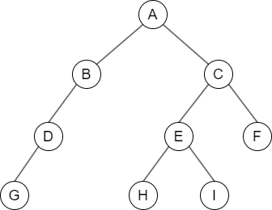

该过程的简单描述如下：

1. 根结点入队
2. 若队空（所有结点都己处理完毕），则结束遍历；否则重复 `3` 操作
3. 队列中第一个结点出队，并访问之。若其有左孩子，则将左孩子入队；若其有右孩子，则将右孩子入队，返回 `2`。

|  序  |  说明  |  队内  |  队外  |
|  :----:  |  :----:  |  :----:  |  :----:  |
|  1  |  A 入  |  A  |    |
|  2  |  A 出，B C 入  |  B C  |  A  |
|  3  |  B 出，D 入  |  C D  |  A B  |
|  4  |  C 出，E F 入  |  D E F  |  A B C  |
|  5  |  D 出，G 入  |  E F G  |  A B C D  |
|  6  |  E 出，H I 入  |  F G H I  |  A B C D E  |
|  7  |  F 出  |  G H I  |  A B C D E F  |
|  8  |  G H I 出  |    |  A B C D E F G H I  |

#### 队列在计算机系统中的应用

队列在计算机系统中的应用非常广泛，以下仅从两个方面来简述队列在计算机系统中的作用：第一个方面是解决主机与外部设备之间速度不匹配的问题；第二个方面是解决由多用户引起的资源竞争问题。

**对于第一个方面**，仅以主机和打印机之间速度不匹配的问题为例做简要说明。主机输出数据给打印机打印，输出数据的速度比打印数据的速度要快得多，由于速度不匹配，若直接把输出的数据送给打印机打印显然是不行的。解决的方法是设置一个打印数据缓冲区，主机把要打印输出的数据依次写入这个缓冲区，写满后就暂停输出，转去做其他的事情。打印机就从缓冲区中按照先进先出的原则依次取出数据并打印，打印完后再向主机发出请求。主机接到请求后再向缓冲区写入打印数据。这样做既保证了打印数据的正确，又使主机提高了效率。由此可见，打印数据缓冲区中所存储的数据就是一个队列。

**对于第二个方面**，CPU（即中央处理器，它包括运算器和控制器）资源的竞争就是一个典型的例子。在一个带有多终端的计算机系统上，有多个用户需要 CPU 各自运行自己的程序，它们分别通过各自的终端向操作系统提出占用 CPU 的请求。操作系统通常按照每个请求在时间上的先后顺序，把它们排成一个队列，每次把 CPU 分配给队首请求的用户使用。当相应的程序运行结束或用完规定的时间间隔后，令其出队，再把 CPU 分配给新的队首请求的用户使用。这样既能满足每个用户的请求，又使 CPU 能够正常运行。

### 数组和特殊矩阵

矩阵在计算机图形学、工程计算中占有举足轻重的地位。在数据结构中考虑的是如何用最小的内存空间来存储同样的一组数据。所以，不研究矩阵及其运算等，而把精力放在如何将矩阵更有效地存储在内存中，并能方便地提取矩阵中的元素。

#### 数组的定义

数组是由 `n（n ≥ 1）` 个相同类型的数据元素构成的有限序列，每个数据元素称为一个 **数组元素**，每个元素在 `n` 个线性关系中的序号称为该元素的 **下标**，下标的取值范围称为数组的 **维界**。

**数组与线性表的关系**：数组是线性表的推广。一维数组可视为一个线性表；二维数组可视为其元素也是定长线性表的线性表，以此类推。数组一旦被定义，其维数和维界就不再改变。因此，除结构的初始化和销毁外，数组只会有存取元素和修改元素的操作。

#### 数组的存储结构

大多数计算机语言都提供了数组数据类型，逻辑意义上的数组可采用计算机语言中的数组数据类型进行存储，一个数组的所有元素在内存中占用一段连续的存储空间。

以一维数组 `A[0 ... n-l]` 为例，其存储结构关系式为：$LOC(a_{i}) = LOC(a_{0} + i \times L (0 \leqslant i < n))$ 其中，L 是每个数组元素所占的存储单元。

对于多维数组，有 **两种映射方法**：按行优先和按列优先。以二维数组为例，按行优先存储的基本思想是：先行后列，先存储行号较小的元素，行号相等先存储列号较小的元素。设二维数组的行下标与列下标的范围分别为 [0, h~1~] 与 [0, h~2~]，则存储结构关系式为：$LOC(a_{i,j}) = LOC(a_{0,0}) + [i \times (h_{2} + 1) + j] \times L$

例如，对于数组 $A_{[2][3]}$，它 **按行优先** 方式在内存中的存储形式如下所示：

$$
A_{[2][3]} = \begin{bmatrix}
   a_{[0][0]} & a_{[0][1]} & a_{[0][2]} \\
   a_{[1][0]} & a_{[1][1]} & a_{[1][2]}
\end{bmatrix} \\
a_{[0][0]} \space | \space a_{[0][1]} \space | \space a_{[0][2]} \space | \space a_{[1][0]} \space | \space a_{[1][1]} \space | \space a_{[1][2]}
$$

当以列优先方式存储时，得出存储结构关系式为：$LOC(a_{i,j}) = LOC(a_{0,0}) + [j \times (h_{1} + 1) + i] \times L$

例如，对于数组 $A_{[2][3]}$，它 **按列优先** 方式在内存中的存储形式如下所示：

$$
A_{[2][3]} = \begin{bmatrix}
  a_{[0][0]} & a_{[0][1]} & a_{[0][2]} \\
  a_{[1][0]} & a_{[1][1]} & a_{[1][2]}
\end{bmatrix} \\
a_{[0][0]} \space | \space a_{[1][0]} \space | \space a_{[0][1]} \space | \space a_{[1][1]} \space | \space a_{[0][2]} \space | \space a_{[1][2]}
$$

#### 特殊矩阵的压缩存储

- **压缩存储**：指为多个值相同的元素只分配一个存储空间，对零元素不分配存储空间。其目的是节省存储空间
- **特殊矩阵**：指具有许多相同矩阵元素或零元素，并且这些相同矩阵元素或零元素的分布有一定规律性的矩阵。常见的特殊矩阵有对称矩阵、上（下）三角矩阵、对角矩阵等
- **特殊矩阵的压缩存储方法**：找出特殊矩阵中值相同的矩阵元素的分布规律，把那些呈现规律性分布的、值相同的多个矩阵元素压缩存储到一个存储空间中

1. **对称矩阵**

    若对一个 `n` 阶矩阵 `A` 中的任意一个元素 $a_{i,j}$ 都有 $a_{i,j} = a_{j,i} (1 \leqslant i, j \leqslant n)$ 则称其为对称矩阵。其中的元素可以划分为 `3` 个部分，即上三角区、主对角线和下三角区。

    对于 `n` 阶对称矩阵，上三角区的所有元素和下三角区的对应元素相同，若仍采用二维数组存放，则会浪费几乎一半的空间，为此将 `n` 阶对称矩阵 `A` 存放在一维数组 `B[n(n+l)/2]` 中，即元素 $a_{i,j}$ 存放在 $b_{k}$ 中。比如只存放下三角部分（含主对角）的元素。

    在数组 `B` 中，位于元素 $a_{i,j} (i \geqslant j)$ 前面的元素个数为：

    - 第 1 行：1 个元素（$a_{1,1}$）
    - 第 2 行：2 个元素（$a_{2,1}, a_{2,2}$）
    - ……
    - 第 i - 1 行：i - 1 个元素（$a_{i-1,1}, a_{i-1,2}, \dotsc ,a_{i-1,i-1}$）
    - 第 i 行：j - 1 个元素（$a_{i-1,1}, a_{i,2}, \dotsc ,a_{i,j-1}$）
    
    因此，元素 $a_{i,j}$ 在数组 `B` 中的下标 `K = 1 + 2 + … (i - 1) + j - 1 = i(i - 1) / 2 + j - 1` （数组下标从 `0` 开始）。因此，元素下标之间的对应关系如下：

    $$
    k = \begin{cases}
      \dfrac{i(i - 1)}{2} + j - 1, & i \geqslant j(\text{下三角区和主对角线元素}) \\
      \dfrac{j(j - 1)}{2} + i - 1, & i < j(\text{上三角区元素} a_{i,j} = a_{j,i})
    \end{cases}
    $$

    当数组下标从 `1` 开始时，可以采用同样的推导方法。

    ::: tip
    二维数组 `A[n][n]` 和 `A[0…n-l][0…n-1]` 的写法是等价的。如果数组写为 `A[1…n][1…n]`，则说明指定了从下标 `1` 开始存储元素。二维数组元素写为 `a[i][j]`，注意数组元素下标 `i` 和 `j` 通常是从 `0` 开始的。矩阵元素通常写为 $a_{i,j}$ 或 $a_{(i)(j)}$，注意行号 `i` 和列号 `j` 是从 `1` 开始的
    :::

2. **三角矩阵**

    下三角矩阵中，上三角区的所有元素均为同一常量。其存储思想与对称矩阵类似，不同之处在于存储完下三角区和主对角线上的元素之后，紧接着存储对角线上方的常量一次，故可以将 `n` 阶下三角矩阵 `A` 压缩存储在 `B[n(n + l) / 2 + 1]` 中。
    
    元素下标之间的对应关系为：

    $$
    k = \begin{cases}
      \dfrac{i(i - 1)}{2} + j - 1, & i \geqslant j(\text{下三角区和主对角线元素}) \\
      \dfrac{n(n + 1)}{2}, & i < j(\text{上三角区元素})
    \end{cases}
    $$

    上三角矩阵中，下三角区的所有元素均为同一常量。只需存储主对角线、上三角区上的元素和下三角区的常量一次，可将其压缩存储在 `B[n(n + l) / 2 + 1]` 中。
    
    在数组 `B` 中，位于元素 $a_{i,j} (i \geqslant j)$ 前面的元素个数为：

    - 第 1 行：n 个元素
    - 第 2 行：n - 1 个元素
    - ……
    - 第 i - 1 行：n - i + 2 个元素
    - 第 i 行：j - i 个元素

    因此，元素 $a_{i,j}$ 在数组 `B` 中的下标 `k = n + (n - 1) + … + (n - i + 2) + (j - i + 1) - 1 = (i - 1)(2n - i + 2) / 2 + (j - i)`。因此，元素下标之间的对应关系如下：

    $$
    k = \begin{cases}
      \dfrac{(i - 1)(2n - i + 2)}{2} + (j - i), & i \leqslant j(\text{下三角区和主对角线元素}) \\
      \dfrac{n(n + 1)}{2}, & i > j(\text{上三角区元素})
    \end{cases}
    $$

    以上推导均假设数组的下标从 `0` 开始。

3. **三对角矩阵**

    对角矩阵也称带状矩阵。对于 `n` 阶矩阵 `A` 中的任意一个元素 $a_{i,j}$，当 `|i - j| > 1` 时，有 $a_{i,j} = 0 (1 \leqslant i, j \leqslant n)$，则称为 **三对角矩阵**。在三对角矩阵中，所有非零元素都集中在以主对角线为中心的 `3` 条对角线的区域，其他区域的元素都为零。

    三对角矩阵 `A` 也可以采用压缩存储，将 `3` 条对角线上的元素按行优先方式存放在一维数组 `B` 中，且 $a_{1,1}$ 存放于 `B[0]` 中。

    由此可以计算矩阵 `A` 中 `3` 条对角线上的元素 $a_{i,j}(1 \leqslant i, j \leqslant n, |i - j| \leqslant 1)$ 在一维数组 `B` 中存放的下标为 `k = 2i + j - 3`。

    反之，若已知三对角线矩阵中某元素 $a_{i,j}$ 存放于一维数组 `B` 的第 `k` 个位置，则可得 $i = \lfloor (k + 1) / 3 + 1 \rfloor, j = k - 2i + 3$。例如，当 `k = 0` 时，$i = \lfloor (0 + 1) / 3 + 1 \rfloor = 1, j = 0 - 2 x 1 + 3 = 1$，存放的是 $a_{1,1}$； 当 `k = 2` 时 $i = \lfloor (2 + 1) / 3 + 1 \rfloor = 2, j = 2 - 2 x 2 + 3 = 1$，存放的是 $a_{2,1}$；当 `k = 4` 时 $i = \lfloor (4 + 1) / 3 + 1 \rfloor = 2, j = 4 - 2 \times 2 + 3 = 3$，存放的是 $a_{2,3}$。

#### 稀疏矩阵

矩阵中非零元素的个数 `t`，相对矩阵元素的个数 `s` 来说非常少，即 $s \gg t$ 的矩阵称为 **稀疏矩阵**。例如，一个矩阵的阶为 `100x100`，该矩阵中只有少于 `100` 个非零元素。

若采用常规的方法存储稀疏矩阵，则相当浪费存储空间，因此仅存储非零元素。但通常非零元素的分布没有规律，所以仅存储非零元素的值是不够的，还要存储它所在的行和列。因此，将非零元素及其相应的行和列构成一个三元组（行标，列标，值），如下所示。然后按照某种规律存储这些三元组。稀疏矩阵压缩存储后便失去了随机存取特性。

$$
M = \begin{bmatrix}
   4 & 0 & 0 & 0 \\
   0 & 0 & 6 & 0 \\
   0 & 9 & 0 & 0 \\
   0 & 23 & 0 & 0 \\
\end{bmatrix} \\
$$

对应的三元组：

|  i  |  j  |  v  |
|  :----:  |  :----:  |  :----:  |
|  0  |  0  |  4  |
|  1  |  2  |  6  |
|  2  |  1  |  9  |
|  3  |  1  |  23  |

稀疏矩阵的三元组既可以采用数组存储，也可以采用十字链表法存储。

## 串

### 串的定义和实现

字符串简称串，计算机上非数值处理的对象基本都是字符串数据。常见的信息检索系统（如：搜索引擎）、文本编辑程序（如：Word）、问答系统、自然语言翻译系统等，都是以字符串数据作为处理对象的。

#### 串的定义

**串（string）是由零个或多个字符组成的有限序列**。一般记为：$S = 'a_{1}a_{2} \dotsc a_{n}' (n \geqslant 0)$

其中，`S` 是串名，单引号括起来的字符序列是串的值；$a_{1}$ 可以是字母、数字或其他字符；串中字符的个数 `n` 称为串的长度。`n = 0` 时的串称为空串（用 $\varnothing$ 表示）。

**串中任意多个连续的字符组成的子序列称为该串的子串，包含子串的串称为主串**。某个字符在串中的序号称为该字符在串中的 **位置**。子串在主串中的位置以子串的第一个字符在主串中的位置来表示。当两个串的长度相等且每个对应位置的字符都相等时，称这两个串是相等的。

例如，有串 `A = 'China Beijing', B = 'Beijing', C = 'China'`，则它们的长度分别为 `13`、`7` 和 `5`。`B` 和 `C` 是 `A` 的子串，`B` 在 `A` 中的位置是 `7`，`C` 在 `A` 中的位置是 `1`。

需要注意的是，由一个或多个空格（空格是特殊字符）组成的串称为 **空格串**（注意，空格串不是空串），其长度为串中空格字符的个数。

串的逻辑结构和线性表极为相似，区别仅在于串的数据对象限定为字符集。在基本操作上，串和线性表有很大差别。线性表的基本操作主要以单个元素作为操作对象，如：查找、插入或删除某个元素等；而串的基本操作通常以子串作为操作对象，如：查找、插入或删除一个子串等。

#### 串的存储结构

1. **定长顺序存储表示**

    类似于线性表的顺序存储结构，用一组地址连续的存储单元存储串值的字符序列。在串的定长顺序存储结构中，为每个串变量分配一个固定长度的存储区，即定长数组。

    ```c
    #define MAXLEN 255  // 预定义最大串长为 255
    typedef struct {
        char ch[MAXLEN];  // 每个分量存储一个字符
        int length;  // 串的实际长度
    } SString;
    ```

    串的实际长度只能小于或等于 `MAXLEN`，超过预定义长度的串值会被舍去，称为 **截断**。**串长有两种表示方法**：一是如上述定义描述的那样，用一个额外的变量 `length` 来存放串的长度；二是在串值后面加一个不计入串长的结束标记字符 “`\0`”，此时的串长为隐含值。

    在一些串的操作（如：插入、联接等）中，若串值序列的长度超过上界 `MAXLEN`，约定用 “截断” 法处理，要克服这种弊端，只能不限定串长的最大长度，即采用动态分配的方式。

2. **堆分配存储表示**

    堆分配存储表示仍然以一组地址连续的存储单元存放串值的字符序列，但它们的存储空间是在程序执行过程中动态分配得到的。

    ```c
    typedef struct {
        char *ch;  // 按串长分配存储区，ch 指向串的基地址
        int length;  // 串的长度
    } HString;
    ```

    在 C 语言中，存在一个称之为 “堆” 的自由存储区，并用 `malloc()` 和 `free()` 函数来完成动态存储管理。利用 `malloc()`^ 每个新产生的串分配一块实际串长所需的存储空间，若分配成功，则返回一个指向起始地址的指针，作为串的基地址，这个串由 `ch` 指针来指示；若分配失败，则返回 `NULL`。己分配的空间可用 `free()` 释放掉。
    
    上述两种存储表示通常为高级程序设计语言所采用。

3. **块链存储表示**

    类似于线性表的链式存储结构，也可采用链表方式存储串值。由于串的特殊性（每个元素只有一个字符），在具体实现时，每个结点既可以存放一个字符，也可以存放多个字符。每个结点称为 **块**，整个链表称为 **块链结构**。

#### 串的基本操作

- **StrAssign(&T, chars)**：赋值操作。把串 `T` 赋值为 `chars`
- **StrCopy(&T, S)**：复制操作。由串 `S` 复制得到串 `T`
- **StrEmpty(S)**：判空操作。若 `S` 为空串，则返回 `TRUE`，否则返回 `FALSE`
- **StrCompare(S, T)**：比较操作。若 `S > T`，则 `返回值 > 0`；若 `S = T`，则 `返回值 = 0`；若 `S < T`，则 `返回值 < 0`
- **StrLength(S)**：求串长。返回串 `S` 的元素个数
- **SubString(&Sub, S,pos, len)**：求子串。用 `Sub` 返回串 `S` 的第 `pos` 个字符起长度为 `len` 的子串
- **Concat(&T, Sl, S2)**：串联接。用 `T` 返回由 `S1` 和 `S2` 联接而成的新串
- **Index(S, T)**：定位操作。若主串 `S` 中存在与串 `T` 值相同的子串，则返回它在主串 `S` 中第一次出现的位置；否则函数值为 `0`
- **ClearString(&S)**：清空操作。将 `S` 清为空串
- **DestroyString(&S)**：销毁串。将串 `S` 销毁

不同的高级语言对串的基本操作集可以有不同的定义方法。在上述定义的操作中，串赋值 StrAssign、串比较 StrCompare、求串长 StrLength，串联接 Concat 及求子串 SubString 五种操作构成串类型的最小操作子集，即这些操作不可能利用其他串操作来实现；反之，其他串操作（除串清除 ClearString 和串销毁 DestroyString 外）均可在该最小操作子集上实现。

### 串的模式匹配

#### 简单的模式匹配算法

子串的定位操作通常称为串的模式匹配，它求的是子串（常称模式串）在主串中的位置。这里采用定长顺序存储结构，给出一种不依赖于其他串操作的暴力匹配算法。

```c
int Index(SString S, SString T) {
    int i = 1, j = 1;
    while (i <= S.length && j <= T.length) {
        if (S.ch[i] == T.ch[j]) {
            ++i; ++j;  // 继续比较后继字符
        }
        else {
            i = i - j + 2; j = l;  // 指针后退重新开始匹配
        }
    }
    if (j > T.length) return i - T.length;
    else return 0;
}
```

在上述算法中，分别用计数指针 `i` 和 `j` 指示主串 `S` 和模式串 `T` 中当前正待比较的字符位置。算法思想为：从主串 `S` 的第一个字符起，与模式 `T` 的第一个字符比较，若相等，则继续逐个比较后续字符；否则从主串的下一个字符起，重新和模式的字符比较；以此类推，直至模式 `T` 中的每个字符依次和主串 `S` 中的一个连续的字符序列相等，则称匹配成功，函数值为与模式 `T` 中第一个字符相等的字符在主串 `S` 中的序号，否则称匹配不成功，函数值为零。

简单模式匹配算法的最坏时间复杂度为 $O(nm)$，其中 `n` 和 `m` 分别为主串和模式串的长度。例如：当模式串为 `'0000001'`，而主串为 `'0000000000000000000000000000000000000000000001'` 时，由于模式中前 `6` 个字符均为 `0`，主串中前 `45` 个字符均为 `0`，每趟匹配都是比较到模式的最后一个字符时才发现不等，指针 `i` 需回溯 `39` 次，总比较次数为 `40 x 7 = 280` 次

#### 串的模式匹配算法——KMP 算法

在暴力匹配中，每趟匹配失败都是模式后移一位再从头开始比较。而某趟己匹配相等的字符序列是模式的某个前缀，这种频繁的重复比较相当于模式串在不断地进行自我比较，这就是其低效率的根源。因此，可以从分析模式本身的结构着手，如果己匹配相等的前缀序列中有某个后缀正好是模式的前缀，那么就可以将模式向后滑动到与这些相等字符对齐的位置，主串 `i` 指针无须回溯，并从该位置开始继续比较。而模式向后滑动位数的计算仅与模式本身的结构有关，与主串无关。

1. **字符串的前缀后缀和部分匹配值**

    要了解子串的结构，首先要弄清楚几个概念：前缀、后缀和部分匹配值。前缀指除最后一个字符以外，字符串的所有头部子串；后缀指除第一个字符外，字符串的所有尾部子串；部分匹配值则为字符串的前缀和后缀的最长相等前后缀长度。下面以 `ababa` 为例进行说明：

    - `a` 的前缀和后缀都为空集，最长相等前后缀长度为 `0`
    - `ab` 的前缀为 ${a}$，后缀为 ${b}$，${a} \cap {b} = \varnothing$，最长相等前后缀长度为 `0`
    - `aba` 的前缀为 ${a, ab}$，后缀为 ${a, ba}$，${a, ab} \cap {a, ba} = {a}$，最长相等前后缀长度为 `l`
    - `abab` 的前缀 ${a, ab, aba} \cap$ 后缀 ${b, ab, bab} = {ab}$，最长相等前后缀长度为 `2`
    - `ababa` 的前缀 ${a, ab, aba, abab} \cap$ 后缀 ${a, ba, aba, baba} = {a, aba}$，公共元素有两个，最长相等前后缀长度为 `3`

    故字符串 `ababa` 的部分匹配值为 `00123`。这个部分匹配值有什么作用呢？

    例如：主串为 `a b a b c a b c a c b a b`，子串为 `a b c a c`

    利用上述方法容易写出子串，`abcac` 的部分匹配值为 `00010`，将部分匹配值写成数组形式，就得到了部分匹配值（Partial Match, PM）的表。

    |  编号  |  1  |  2  |  3  |  4  |  5  |
    |  :----:  |  :----:  |  :----:  |  :----:  |  :----:  |  :----:  |
    |  S  |  a  |  b  |  c  |  a  |  c  |
    |  PM  |  0  |  0  |  0  |  1  |  0  |

    下面用 `PM` 表来进行字符串匹配：

    ```text
    主串 a b a b c a b c a c b a b
    子串 a b c
    ```

    **第一趟匹配过程**：发现 `c` 与 `a` 不匹配，前面的 `2` 个字符 `ab` 是匹配的，查表可知，最后一个匹配字符 `b` 对应的部分匹配值为 `0`，因此按照以下公式算出子串需要向后移动的位数：*移动位数 = 已匹配的字符数 - 对应的部分匹配值*

    因为 `2 - 0 = 2`，所以将子串向后移动 `2` 位，如下进行第二趟匹配：

    ```text
    主串 a b a b c a b c a c b a b
    子串     a b c a c
    ```

    **第二趟匹配过程**：发现 `c` 与 `b` 不匹配，前面 `4` 个字符 `abca` 是匹配的，最后一个匹配字符 `a` 对应的部分匹配值为 `1`，`4 - 1 = 3`，将子串向后移动 `3` 位，如下进行第三趟匹配：

    ```text
    主串 a b a b c a b c a c b a b
    子串           a b c a c
    ```

    **第三趟匹配过程**：子串全部比较完成，匹配成功。整个匹配过程中，主串始终没有回退，故 KMP 算法可以在 $O(n + m)$ 的时间数量级上完成串的模式匹配操作，大大提高了匹配效率。

    某趟发生失配时，如果对应的部分匹配值为 `0`，那么表示己匹配相等序列中没有相等的前后缀，此时移动的位数最大，直接将子串首字符后移到主串当前位置进行下一趟比较；如果己匹配相等序列中存在最大相等前后缀（可理解为首尾重合），那么将子串向右滑动到和该相等前后缀对齐（这部分字符下一趟显然不需要比较），然后从主串当前位置进行下一趟比较。

2. **KMP 算法的原理是什么？**

    *移动位数 = 已匹配的字符数 - 对应的部分匹配值* 的意义是：

    当 `c` 与 `b` 不匹配时，己匹配 `abca` 的前缀 `a` 和后缀 `a` 为最长公共元素。己知前缀 `a` 与 `b、c` 均不同，与后缀 `a` 相同，故无须比较，直接将子串移动 *己匹配的字符数 - 对应的部分匹配值*，用子串前缀后面的元素与主串匹配失败的元素开始比较即可。

    **对算法的改进方法：**
    
    已知：*右移位数 = 已匹配的字符数 - 对应的部分匹配值*。写成：`Move = (j - 1) - PM[j - 1]`

    使用部分匹配值时，每当匹配失败，就去找它前一个元素的部分匹配值，这样使用起来有些不方便，所以将 `PM` 表右移一位，这样哪个元素匹配失败，直接看它自己的部分匹配值即可。

    将上例中字符串 `abcac` 的 PM 表右移一位，就得到了 next 数组。

    |  编号  |  1  |  2  |  3  |  4  |  5  |
    |  :----:  |  :----:  |  :----:  |  :----:  |  :----:  |  :----:  |
    |  S  |  a  |  b  |  c  |  a  |  c  |
    |  next  |  -1  |  0  |  0  |  0  |  1  |

    **注意：**

    - 第一个元素右移以后空缺的用 `-1` 来填充，因为若是第一个元素匹配失败，则需要将子串向右移动一位，而不需要计算子串移动的位数
    - 最后一个元素在右移的过程中溢出，因为原来的子串中，最后一个元素的部分匹配值是其下一个元素使用的，但显然已没有下一个元素，故可以舍去

    这样，上式就改写为：`Move = (j - 1) - next[j]`

    相当于将子串的比较指针回退到：`j = j - Move = j - ((j - 1) - next[j]) = next[j] + 1`

    有时为了使公式更加简洁、计算简单，将 next 数组整体 `+1`。因此，上述子串的 next 数组也可以写成：

    |  编号  |  1  |  2  |  3  |  4  |  5  |
    |  :----:  |  :----:  |  :----:  |  :----:  |  :----:  |  :----:  |
    |  S  |  a  |  b  |  c  |  a  |  c  |
    |  next  |  0  |  1  |  1  |  1  |  2  |

    最终得到子串指针变化公式：`j = next[j]`。在实际匹配过程中，子串在内存里是不会移动的，而是指针在变化。`next[j]` 的含义是：在子串的第 `j` 个字符与主串发生失配时，则跳到子串的 `next[j]` 位置重新与主串当前位置进行比较。
    
    如何推理 next 数组的一般公式？设主串为：s~1~s~2~ … s~n~，模式串为：p~1~p~2~ … p~m~，当主串中第 `i` 个字符与模式串中第 `j` 个字符失配时，子串应向右滑动多远，然后与模式中的哪个字符比较？

    假设此时应与模式中第 `k(k < j)` 个字符继续比较，则模式中前 `k - 1` 个字符的子串必须满足下列条件，且不可能存在 $k' > k$ 满足下列条件：

    $'P_{1}P_{2} \dotsc - P_{k-1}' = 'P_{j-k+1}P_{j-k+2} \dotsc P_{j-1}$

    若存在满足如上条件的子串，则发生失配时，仅需将模式向右滑动至模式中第 `k` 个字符和主串第 `i` 个字符对齐，此时模式中前 `k - 1` 个字符的子串必定与主串中第 `i` 个字符之前长度为 `k - 1` 的子串相等，由此，只需从模式第 `k` 个字符与主串第 `i` 个字符继续比较即可。

    当模式串己匹配相等序列中不存在满足上述条件的子串时（可以看成 `k = l`），显然应该将模式串右移 `j - 1` 位，让主串第 `i` 个字符和模式第一个字符进行比较，此时右移位数最大。

    当模式串第一个字符（`j = l`）与主串第 `i` 个字符发生失配时，规定 `next[1] = 0`。将模式串右移一位，从主串的下一个位置（`i + 1`）和模式串的第一个字符继续比较。
    
    通过上述分析可以得出 next 函数的公式：

    $$
    next[j] = \begin{cases}
      0, & j = 1 \\
      max{k | 1 < k < j \text{且} 'p_{1}LP_{k-1}' = 'p_{j-k+1}Lp_{j-1}'}, & \text{当此集合不空时} \\
      1, & \text{其他情况}
    \end{cases}
    $$

    首先由公式可知：`next[1] = 0`

    设 `next[j] = k`，此时 `k` 应满足的条件在上文中已描述。此时 `next[j + 1] = ?` 可能有两种情况：

    1. 若 `Pk = Pj`，则表明在模式串中 'P~1~ … P~k-1~P~k~' = 'P~j-k+1~ … P~j-1~P~j~'，并且不可能存在 $k' > k$ 满足上述条件，此时 `next[j + l] = k + l`，即 `next[j + 1] = next[j] + 1`
    2. 若 P~k~ ≠ P~j~，则表明在模式串中 'P~1~ … P~k-1~P~k~' ≠ 'P~j-k+i~ … P~j-1~P~j~'

    此时可以把求 next 函数值的问题视为一个模式匹配的问题。用前缀 P~1~ … P~k~ 去跟后缀 P~j-k+1~ … P~j~ 匹配，则当 P~k~ ≠ P~j~ 时应将 P~1~ … P~k~ 向右滑动至以第 `next[k]` 个字符与 P~j~ 比较，如果 P~next[k]~ 与 P~j~ 还是不匹配，那么需要寻找长度更短的相等前后缀，下一步继续用 P~next[next[k]]~与 P~j~ 比较，以此类推，直到找到某个更小的 $k' = next[next … [k]] (l < k' < k < j)$，满足条件 $'P_{1} \dotsc P_{k'}' = 'P_{j-k'+1} \dotsc P_{j}'$ 则 $next[j + 1] = k' + 1$。

    也可能不存在任何 $k'$ 满足上述条件，即不存在长度更短的相等前缀后缀，令 `next[j + 1] = 1`。
    
    例如：下表的模式串中已求得 `6` 个字符的 next 值，现求 `next[7]`，因为 `next[6] = 3`，又 P~6~ ≠ P~3~，则需比较 P~6~ 和 P~1~（因 `next[3] = 1`），由于 P~6~ ≠ P~1~，而 `next[1] = 0`，所以 `next[7] = 1`；求 `next [8]`，因 P~7~ = P~1~，则 `next[8] = next[7] + 1 = 2`；求 `next[9]`，因 P~8~ = P~2~，则 `next[9] = 3`。

    |  j  |  1  |  2  |  3  |  4  |  5  |  6  |  7  |  8  |  9  |
    |  :----:  |  :----:  |  :----:  |  :----:  |  :----:  |  :----:  |  :----:  |  :----:  |  :----:  |  :----:  |
    |  模式  |  a  |  b  |  a  |  a  |  b  |  c  |  a  |  b  |  a  |
    |  next[j]  |  0  |  1  |  1  |  2  |  2  |  3  |  ?  |  ?  |  ?  |

    通过上述分析写出求 next 值的程序如下： 
    
    ```c
    void get_next(SString T, int next[]) {
        int i = 1, j = 0;
        next[1] = 0;

        while (i < T.length) {
            if(j == 0 || T.ch[i] == T.ch[j]) {
                ++i; ++j;
                next[i] = j  // 若 Pi = Pj，则 next[j+1] = next[j] + 1
            }
            else
                j = next[j];  // 否则令 j = next[j]，循环继续
        }
    }
    ```

    计算机执行起来效率很高，但对于手工计算来说会很难。因此，当需要手工计算时，还是用最初的方法。

    与 next 数组的求解相比，KMP 的匹配算法相对要简单很多，它在形式上与简单的模式匹配算法很相似。不同之处仅在于当匹配过程产生失配时，指针 `i` 不变，指针 `j` 退回到 `next[j]` 的位置并重新进行比较，并且当指针 `j` 为 `0` 时，指针 `i` 和 `j` 同时加 `1`。即若主串的第 `i` 个位置和模式串的第一个字符不等，则应从主串的第 `i + 1` 个位置开始匹配。具体代码如下：

    ```c
    int Index_KMP(SString S, SString T, int next[]) {
        int i = 1, j = l;

        while (i <= S.length && j <= T.length) {
            if(j == 0 || S.ch[i] == T.ch[j]) {
                ++i; ++j;  // 继续比较后继字符
            }
            else
                j = next[j];  // 模式串向右移动
        }
    
        if (j > T.length)
            return i - T.length;  // 匹配成功
        else
            return 0;
    }
    ```

    尽管普通模式匹配的时间复杂度是 $O(mn)$，KMP 算法的时间复杂度是 $O(m+n)$，但在一般情况下，普通模式匹配的实际执行时间近似为 $O(m+n)$，因此至今仍被采用。KMP 算法仅在主串与子串有很多 “部分匹配” 时才显得比普通算法快得多，其主要优点是主串不回溯。

#### KMP 算法的进一步优化

前面定义的 next 数组在某些情况下尚有缺陷，还可以进一步优化。如下图所示，模式 `aaaab` 在和主串 `aaabaaaab` 进行匹配时：

|  主串  |  a  |  a  |  a  |  b  |  a  |  a  |  a  |  a  |  b  |
|  :----:  |  :----:  |  :----:  |  :----:  |  :----:  |  :----:  |  :----:  |  :----:  |  :----:  |  :----:  |
|  模式  |  a  |  a  |  a  |  a  |  b  |    |    |    |    |
|  j  |  1  |  2  |  3  |  4  |  5  |    |    |    |    |
|  next[j]  |  0  |  1  |  2  |  3  |  4  |    |    |    |    |
|  nextval[j]  |  0  |  0  |  0  |  0  |  4  |    |    |    |    |

当 i = 4、j = 4 时，s~4~ 跟 p~4~（b ≠ a）失配，如果用之前的 next 数组还需要进行 s~4~ 与 p~3~、s~4~ 与 p~2~、s~4~ 与 p~1~ 这 `3` 次比较。事实上，因为 p~next[4]~ = 3 = p~4~ = a、p~next[3]~ = 2 = p~3~ = a、p~next[2]~ = 1 = p~2~ = a，显然后面 `3` 次用一个和 p~4~ 相同的字符跟 s~4~ 比较毫无意义，必然失配。那么问题出在哪里呢？

问题在于不应该出现 p~j~ = p~next[j]~。理由是：当 P~j~ ≠ s~j~时，下次匹配必然是 p~next[j]~ 跟 s~j~ 比较，如果 p~j~ = p~next[j]~，那么相当于拿一个和 p~j~ 相等的字符跟 s~j~ 比较，这必然导致继续失配，这样的比较毫无意义。那么如果出现了 p~j~ = p~next[j]~ 应该如何处理呢？

如果出现了，则需要再次递归，将 `next[j]` 修正为 `next[next[j]]`，直至两者不相等为止，更新后的数组命名为 `nextval`。计算 next 数组修正值的算法如下，此时匹配算法不变。

```c
void get_nextval (SString T, int nextval[]) {
    int i = 1, j = 0;
    nextval[1] = 0;

    while (i < T.length) {
        if (j == 0 || T.ch[i] == T.ch[j]) {
            ++i; ++j;

            if (T.ch[i] != T.ch[j]) nextval[i] = j;
            else nextval[i] = nextval[j];
        }
        else
            j = nextval[j];
    }
}
```

## 树与二叉树

### 树的基本概念

#### 树的定义

树是 $n(n \geqslant 0)$ 个结点的有限集。当 `n = 0` 时，称为空树。在任意一棵非空树中应满足：

- 有且仅有一个特定的称为根的结点
- 当 `n > 1` 时，其余结点可分为 `m(m > 0)`个互不相交的有限集 $T_{1}, T_{2}, \dotsc T_{m}$，其中每个集合本身又是一棵树，并且称为根的子树

显然，树的定义是递归的，即在树的定义中又用到了其自身，树是一种递归的数据结构。树作为一种逻辑结构，同时也是一种分层结构，具有以下两个特点：

- 树的根结点没有前驱，除根结点外的所有结点有且只有一个前驱
- 树中所有结点都可以有零个或多个后继

树适合于表示具有层次结构的数据。树中的某个结点（除根结点外）最多只和上一层的一个结点（即其父结点）有直接关系，根结点没有直接上层结点，因此在 `n` 个结点的树中有 `n - 1` 条边。而树中每个结点与其下一层的零个或多个结点（即其子女结点）都有直接关系。

#### 基本术语

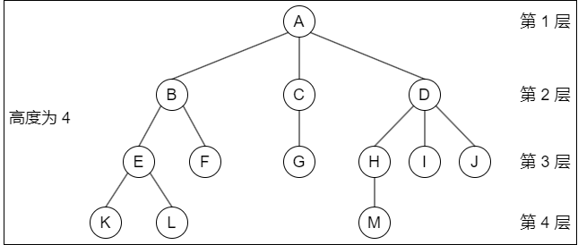

1. 考虑结点 K。根 A 到结点 K 的唯一路径上的任意结点，称为结点 K 的 **祖先**。如：结点 B 是结点 K 的祖先，而结点 K 是结点 B 的 **子孙**。路径上最接近结点 K 的结点 E 称为 K 的 **双亲**，而 K 为结点 E 的 **孩子**。根 A 是树中唯一没有双亲的结点。有相同双亲的结点称为 **兄弟**，如：结点 K 和结点 L 有相同的双亲 E，即 K 和 L 为 **兄弟**
2. 树中一个结点的孩子个数称为该结点的 **度**，树中结点的最大度数称为树的度。如：结点 B 的度为 `2`，结点 D 的度为 `3`，树的度为 `3`
3. 度大于 0 的结点称为 **分支结点**（又称非终端结点）；度为 0（没有子女结点）的结点称为 **叶结点**（又称终端结点）。在分支结点中，每个结点的分支数就是该结点的度
4. 结点的深度、高度和层次

    结点的层次从树根开始定义，根结点为第 1 层，它的子结点为第 2 层，以此类推。双亲在同一层的结点互为堂兄弟，上图中结点 G 与 E、F、H、I、J 互为堂兄弟。

    - **结点的深度**：是从根结点开始自顶向下逐层累加的
    - **结点的高度**：是从叶结点开始自底向上逐层累加的
    - **树的高度（或深度）**：是树中结点的最大层数。上图中树的高度为 `4`

5. 有序树和无序树。树中结点的各子树从左到右是有次序的，不能互换，称该树为有序树，否则称为无序树。假设上图为有序树，若将子结点位置互换，则变成一棵不同的树
6. 路径和路径长度。树中两个结点之间的路径是由这两个结点之间所经过的结点序列构成的，而路径长度是路径上所经过的边的个数

    ::: tip
    由于树中的分支是有向的，即从双亲指向孩子，所以树中的路径是从上向下的，同一双亲的两个孩子之间不存在路径
    :::

7. 森林。森林是 $m(m \geqslant 0)$ 棵互不相交的树的集合。森林的概念与树的概念十分相近，因为只要把树的根结点删去就成了森林。反之，只要给 `m` 棵独立的树加上一个结点，并把这 `m` 棵树作为该结点的子树，则森林就变成了树

#### 树的性质

树具有如下最基本的性质：

- 树中的结点数等于所有结点的度数之和加 `1`
- 度为 `m` 的树中第 `i` 层上至多有 $m^{i-1}$ 个结点 $(i \geqslant 1)$
- 高度为 `h` 的 `m` 叉树至多有 $(m^{h} - 1) / (m - 1)$ 个结点
- 具有 `n` 个结点的 `m` 叉树的最小高度为 $\lceil log_{m} (n(m - 1) + 1) \rceil$

### 二叉树的概念

#### 二叉树的定义及其主要特性

1. **二叉树的定义**

    二叉树是一种特殊的树形结构，其特点是每个结点至多只有两棵子树（即二叉树中不存在度大于 `2` 的结点），并且二叉树的子树有左右之分，其次序不能任意颠倒。

    与树相似，二叉树也以递归的形式定义。二叉树是 $n(n \geqslant 0)$ 个结点的有限集合：

    - 或者为空二叉树，即 `n = 0`
    - 或者由一个根结点和两个互不相交的被称为根的左子树和右子树组成。左子树和右子树又分别是一棵二叉树

    二叉树是有序树，若将其左、右子树颠倒，则成为另一棵不同的二叉树。即使树中结点只有一棵子树，也要区分它是左子树还是右子树。二叉树的五种基本形态：空二叉树、只有根结点、只有左子树、只有右子树、左右子树都有。

    二叉树与度为 `2` 的有序树的区别：
    
    - 度为 `2` 的树至少有 `3` 个结点，而二叉树可以为空
    - 度为 `2` 的有序树的孩子的左右次序是相对于另一孩子而言的，若某个结点只有一个孩子，则这个孩子就无须区分其左右次序，而二叉树无论其孩子数是否为 `2`，均需确定其左右次序，即二叉树的结点次序不是相对于另一结点而言的，而是确定的

2. **几个特殊的二叉树**

    - **满二叉树**

        一棵高度为 `h`，且含有 2^h^ - 1 个结点的二叉树称为 **满二叉树**，即树中的每层都含有最多的结点。满二叉树的叶结点都集中在二叉树的最下一层，并且除叶结点之外的每个结点度数均为 `2`。
        
        可以对满二叉树按层序编号：约定编号从根结点（根结点编号为 `1`）起，自上而下，自左向右。这样，每个结点对应一个编号，对于编号为 `i` 的结点，若有双亲，则其双亲为 $\lfloor i / 2 \rfloor$，若有左孩子，则左孩子为 `2i`；若有右孩子，则右孩子为 `2i + 1`。

    - **完全二叉树**

        高度为 `h`、有 `n` 个结点的二叉树，当且仅当其每个结点都与高度为 `h` 的满二叉树中编号为 `1~n` 的结点一一对应时，称为 **完全二叉树**。其特点如下：

        - 若 $i \leqslant \lfloor n / 2 \rfloor$，则结点 `i` 为分支结点，否则为叶结点
        - 叶结点只可能在层次最大的两层上出现。对于最大层次中的叶结点，都依次排列在该层最左边的位置上
        - 若有度为 `1` 的结点，则只可能有一个，且该结点只有左孩子而无右孩子（重要特征）
        - 按层序编号后，一旦出现某结点（编号为 `i`）为叶结点或只有左孩子，则编号大于 `i` 的结点均为叶结点
        - 若 `n` 为奇数，则每个分支结点都有左孩子和右孩子；若 `n` 为偶数，则编号最大的分支结点（编号为 `n/2`）只有左孩子，没有右孩子，其余分支结点左、右孩子都有

    - **二叉排序树**

        左子树上所有结点的关键字均小于根结点的关键字；右子树上的所有结点的关键字均大于根结点的关键字；左子树和右子树又各是一棵二叉排序树。

    - **平衡二叉树**

        树上任意一个结点的左子树和右子树的深度之差不超过 `1`

3. **二叉树的性质**

    1. 非空二叉树上的叶结点数等于度为 `2` 的结点数加 `1`，即 n~0~ = n~2~ + 1

        证明：设度为 0, 1 和 2 的结点个数分别为 n~0~, n~1~ 和 n~2~，结点总数 n = n~0~ + n~1~ + n~2~。
        
        看二叉树中的分支数，除根结点外，其余结点都有一个分支进入，设 `B` 为分支总数，则 n = B + 1。由于这些分支是由度为 `1` 或 `2` 的结点射出的，所以又有 B = n~1~ + 2n~2~。于是得 n~0~ + n~1~ + n~2~ = n~1~ + 2n~2~ + 1，则 n~0~ = n~2~ + 1。

    2. 非空二叉树上第 K 层上至多有 2^k-1^ 个结点 $k \geqslant 1$

        第 1 层至多有 2^1-1^ = 1 个结点（根），第 2 层至多有 2^2-1^ = 2个结点，以此类推，可以证明其为一个公比为 `2` 的等比数列 2^k-1^。

    3. 高度为 `h` 的二叉树至多有 2^h^ - 1 个结点 $h \geqslant 1$

        该性质利用性质 `2` 求前 `h` 项的和，即等比数列求和的结果。

    4. 对完全二叉树按从上到下、从左到右的顺序依次编号 `1, 2, ..., n`，则有以下关系：
        - 当 $i > 1$ 时，结点 `i` 的双亲的编号为 $\lfloor i / 2 \rfloor$，即当 `i` 为偶数时，其双亲的编号为 `i/2`，它是双亲的左孩子；当 `i` 为奇数时，其双亲的编号为 `(i - 1)/2`，它是双亲的右孩子
        - 当 $2i \leqslant n$ 时，结点 `i` 的左孩子编号为 `2i`，否则无左孩子
        - 当 $2i + 1 \leqslant n$ 时，结点 `i` 的右孩子编号为 `2i + 1`，否则无右孩子
        - 结点 `i` 所在层次（深度）为 $\lfloor log_{2}i \rfloor + 1$

    5. 具有 `n` 个（n > 0）结点的完全二叉树的高度为 $\lceil log_{2}(n + 1) \rceil$ 或 $\lfloor log_{2}n \rfloor + 1$

        设高度为 `h`，根据性质 `3` 和完全二叉树的定义有：$2^{h-1} - 1 < n \leqslant 2^{h} - 1$ 或 $2^{h-1} \leqslant n < 2^{h}$ 得 $2^{h-1} < n + 1 \leqslant 2^{h}$，即 $h - 1 < log_{2}(n + 1) \leqslant h$，因为 $h$ 为正整数，所以 $h = \lceil log_{2}(n + 1) \rceil$；或者得 $h - 1 \leqslant log_{2}n < h$，所以 $h = \lfloor log_{2}n \rfloor + 1$。

#### 二叉树的存储结构

1. **顺序存储结构**

    **二叉树的顺序存储是指** 用一组地址连续的存储单元依次自上而下、自左至右存储完全二叉树上的结点元素，即将完全二叉树上编号为 `i` 的结点元素存储在一维数组下标为 `i - 1` 的分量中。

    依据二叉树的性质，完全二叉树和满二叉树采用顺序存储比较合适，树中结点的序号可以唯一地反映结点之间的逻辑关系，这样既能最大可能地节省存储空间，又能利用数组元素的下标值确定结点在二叉树中的位置，以及结点之间的关系。

    但对于一般的二叉树，为了让数组下标能反映二叉树中结点之间的逻辑关系，只能添加一些并不存在的空结点，让其每个结点与完全二叉树上的结点相对照，再存储到一维数组的相应分量中。然而，在最坏情况下，一个高度为 `h` 且只有 `h` 个结点的单支树却需要占据近 2^h^ - 1 个存储单元。用 `0` 表示二叉树的顺序存储中并不存在的空结点。

    ::: tip
    这种存储结构建议从数组下标 `1` 开始存储树中的结点，若从数组下标 `0` 开始存储，则不满足性质 `4` 的描述（比如：结点 A 存储在 `0` 下标位置上时，无法根据性质 `4` 来计算出其孩子结点在数组中的位置）
    :::

2. **链式存储结构**

    由于顺序存储的空间利用率较低，因此二叉树一般都采用链式存储结构，用链表结点来存储二叉树中的每个结点。在二叉树中，结点结构通常包括若干数据域和若干指针域，二叉链表至少包含 `3` 个域：左指针域 lchild、数据域 data 和右指针域 rchild。
    
    实际上在不同的应用中，还可以增加某些指针域，如增加指向父结点的指针后，变为三叉链表的存储结构。

    二叉树的链式存储结构描述如下：

    ```c
    typedef struct BiTNode {
        ElemType data;  // 数据域
        struct BiTNode *lchild, *rchild;  // 左、右孩子指针
    } BiTNode, *BiTree;
    ```

    使用不同的存储结构时，实现二叉树操作的算法也会不同，因此要根据实际应用场合（二叉树的形态和需要进行的运算）来选择合适的存储结构。容易验证，在含有 `n` 个结点的二叉链表中，含有 `n + 1` 个空链域。

### 二叉树的遍历和线索二叉树

#### 二叉树的遍历

**二叉树的遍历** 是指按某条搜索路径访问树中每个结点，使得每个结点均被访问一次，而且仅被访问一次。由于二叉树是一种非线性结构，每个结点都可能有两棵子树，因而需要寻找一种规律，以便使二叉树上的结点能排列在一个线性队列上，进而便于遍历。

由二叉树的递归定义可知，遍历一棵二叉树便要决定对根结点 N、左子树 L 和右子树 R 的访问顺序。按照先遍历左子树再遍历右子树的原则，常见的遍历次序有先序（NLR）、中序（LNR）和后序（LRN）三种遍历算法，其中 “序” 指的是根结点在何时被访问。

1. **先序遍历**

    先序遍历（PreOrder）的操作过程如下。若二叉树为空，则什么也不做；否则：

    1. 访问根结点
    2. 先序遍历左子树
    3. 先序遍历右子树

    对应的递归算法如下:

    ```c
    void PreOrder(BiTree T) {
        if (T != NULL) {
            visit(T);  // 访问根结点
            PreOrder(T->lchild);  // 递归遍历左子树
            PreOrder(T->rchild);  // 递归遍历右子树
        }
    }
    ```

2. **中序遍历**

    中序遍历（InOrder）的操作过程如下。若二叉树为空，则什么也不做；否则：

    1. 中序遍历左子树
    2. 访问根结点
    3. 中序遍历右子树

    对应的递归算法如下:

    ```c
    void InOrder(BiTree T) {
        if (T != NULL) {
            InOrder(T->lchild);  // 递归遍历左子树
            visit(T);  // 访问根结点
            InOrder(T->rchild);  // 递归遍历右子树
        }
    }
    ```

3. **后序遍历**

    后序遍历（PostOrder）的操作过程如下。若二叉树为空，则什么也不做；否则：

    1. 后序遍历左子树
    2. 后序遍历右子树
    3. 访问根结点

    对应的递归算法如下：

    ```c
    void PostOrder(BiTree T) {
        if (T != NULL) {
            PostOrder(T->lchild);  // 递归遍历左子树
            PostOrder(T->rchild);  // 递归遍历右子树
            visit(T);  // 访问根结点
        }
    }
    ```

三种遍历算法中，递归遍历左、右子树的顺序都是固定的，只是访问根结点的顺序不同。不管采用哪种遍历算法，每个结点都访问一次且仅访问一次，故时间复杂度都是 $O(n)$。在递归遍历中，递归工作栈的栈深恰好为树的深度，所以在最坏情况下，二叉树是有 `n` 个结点且深度为 `n` 的单支树，遍历算法的空间复杂度为 $O(n)$。

4. **递归算法和非递归算法的转换**

    在上节介绍的三种遍历算法中，暂时抹去和递归无关的 `visit()` 语句，则 `3` 个遍历算法完全相同，因此，从递归执行过程的角度看先序、中序和后序遍历也是完全相同的。

    **中序遍历的非递归算法如下：**

    ```c
    void InOrder2(BiTree T) {
        InitStack(S); BiTree p = T;  // 初始化栈 s；p 是遍历指针
        while (p || !IsEmpty(S)) {  // 栈不空或 p 不空时循环
            if (p) {  // 一路向左
                Push(S, p);  // 当前结点入栈
                p = p->lchild;  // 左孩子不空，一直向左走
            }
            else {  // 出栈，并转向出栈结点的右子树
                Pop(S, p); visit(p);  // 栈顶元素出栈，访问出栈结点
                p = p->rchild;  // 向右子树走，p 赋值为当前结点的右孩子
            }  // 返回 while 循环继续进入 if-else 语句
        }
    }
    ```

    先序遍历和中序遍历的基本思想是类似的，只需把访问结点操作放在入栈操作的前面。**先序遍历的非递归算法如下:**

    ```c
    void PreOrder2(BiTree T) {
        InitStack(S); BiTree p = T;  // 初始化栈 s；p 是遍历指针
        while (p || !IsEmpty(S)) {  // 栈不空或 P 不空时循环
            if (p) {  // 一路向左
                visit(p); Push(S, p)  // 访问当前结点，并入栈
                p = p->lchild;  // 左孩子不空，一直向左走
            }
            else {  // 出栈，并转向出栈结点的右子树
                Pop(S, P);  // 栈顶元素出栈
                p = p->rchild;  // 向右子树走，p 赋值为当前结点的右孩子
            }  // 返回 while 循环继续进入 if-else 语句
        }
    }
    ```

    后序遍历的非递归实现是三种遍历方法中最难的。因为在后序遍历中，要保证左孩子和右孩子都己被访问并且左孩子在右孩子前访问才能访问根结点，这就为流程的控制带来了难题。
    
    **后序非递归遍历算法的思路分析**：从根结点开始，将其入栈，然后沿其左子树一直往下搜索，直到搜索到没有左孩子的结点，但是此时不能出栈并访问，因为如果其有右子树，还需按相同的规则对其右子树进行处理。直至上述操作进行不下去，若栈顶元素想要出栈被访问，要么右子树为空，要么右子树刚被访问完（此时左子树早已访问完），这样就保证了正确的访问顺序。
    
5. **层次遍历**

    要进行层次遍历，需要借助一个队列。首先将二叉树根结点入队，然后出队，访问出队结点，若它有左子树，则将左子树根结点入队；若它有右子树，则将右子树根结点入队。完成入队后出队，访问出队结点……如此反复，直至队列为空。**二叉树的层次遍历算法如下：**

    ```c
    void LevelOrder(BiTree T) {
        InitQueue(Q);  // 初始化辅助队列
        BiTree p;
        EnQueue(Q, T);  // 将根结点入队

        while (!IsEmpty(Q)) {  // 队列不空则循环
            DeQueue(Q, p);  // 队头结点出队
            visit(p);  // 访问出队结点

            if (p->lchild != NULL)
                EnQueue(Q, p->lchild)  // 左子树不空，则左子树根结点入队
            if (p->rchild != NULL)
                EnQueue(Q, p->rchild)  // 右子树不空，则右子树根结点入队
        }
    }
    ```

    ::: tip
    遍历是二叉树各种操作的基础，可以在遍历的过程中对结点进行各种操作。例如，对于一棵已知树求结点的双亲、求结点的孩子结点、求二叉树的深度、求二叉树的叶结点个数、判断两棵二叉树是否相同等。所有这些操作都建立在二叉树遍历的基础上，因此必须掌握二叉树的各种遍历过程，并能灵活运用以解决各种问题
    :::

6. **由遍历序列构造二叉树**

    由二叉树的先序序列和中序序列可以唯一地确定一棵二叉树。
    
    在先序遍历序列中，第一个结点一定是二叉树的根结点；而在中序遍历中，根结点必然将中序序列分割成两个子序列，前一个子序列是根结点的左子树的中序序列，后一个子序列是根结点的右子树的中序序列。根据这两个子序列，在先序序列中找到对应的左子序列和右子序列。在先序序列中，左子序列的第一个结点是左子树的根结点，右子序列的第一个结点是右子树的根结点。如此递归地进行下去，便能唯一地确定这棵二叉树。
    
    同理，由二叉树的后序序列和中序序列也可以唯一地确定一棵二叉树。
    
    因为后序序列的最后一个结点就如同先序序列的第一个结点，可以将中序序列分割成两个子序列，然后采用类似的方法递归地进行划分，进而得到一棵二叉树。
    
    由二叉树的层序序列和中序序列也可以唯一地确定一棵二叉树。需要注意的是，若只知道二叉树的先序序列和后序序列，则无法唯一确定一棵二叉树。
    
    例如，求先序序列（ABCDEFGHI）和中序序列（BCAEDGHFI）所确定的二叉树。
    
    首先，由先序序列可知 A 为二叉树的根结点。中序序列中 A 之前的 BC 为左子树的中序序列，EDGHFI 为右子树的中序序列。然后，由先序序列可知 B 是左子树的根结点，D 是右子树的根结点。以此类推，就能将剩下的结点继续分解下去，最后得到二叉树。

#### 线索二叉树

1. **线索二叉树的基本概念**

    遍历二叉树是以一定的规则将二叉树中的结点排列成一个线性序列，从而得到几种遍历序列，使得该序列中的每个结点（第一个和最后一个结点除外）都有一个直接前驱和直接后继。

    传统的二叉链表存储仅能体现一种父子关系，不能直接得到结点在遍历中的前驱或后继。前面提到，在含 `n` 个结点的二叉树中，有 `n + 1` 个空指针。这是因为每个叶结点都有 `2` 个空指针，每个度为 `1` 的结点都有 `1` 个空指针，空指针总数为 $2n_{0} + n_{1}$，又 $n_{0} = n_{2} + 1$，所以空指针总数为 $n_{0} + n_{1} + n_{2} + 1 = n + 1$。由此设想能否利用这些空指针来存放指向其前驱或后继的指针？这样就可以像遍历单链表那样方便地遍历二叉树。引入线索二叉树正是为了加快查找结点前驱和后继的速度。

    规定：若无左子树，令 `lchild` 指向其前驱结点；若无右子树，令 `rchild` 指向其后继结点。线索二叉树的结点结构如下，还需增加两个标志域标识指针域，以指向左（右）孩子或前驱（后继）。

    |  lchild  |  ltag  |  data  |  rtag  |  rchild  |
    |  :----:  |  :----:  |  :----:  |  :----:  |  :----:  |

    其中，标志域的含义如下：

    $$
    ltag = \begin{cases}
      0, & lchild \text{域指示结点的左孩子} \\
      1, & lchild \text{域指示结点的前驱}
    \end{cases} \\
    rtag = \begin{cases}
      0, & rchild \text{域指示结点的右孩子} \\
      1, & rchild \text{域指示结点的后继}
    \end{cases}
    $$

    线索二叉树的存储结构描述如下：

    ```c
    typedef struct ThreadNode {
        ElemType data;  // 数据元素
        struct ThreadNode *lchild, *rchild;  // 左、右孩子指针
        int Itag, rtag;  // 左、右线索标志
    } ThreadNode,*ThreadTree;
    ```

    以这种结点结构构成的二叉链表作为二叉树的存储结构，称为 **线索链表**，其中指向结点前驱和后继的指针称为 **线索**。加上线索的二叉树称为 **线索二叉树。**

2. **中序线索二叉树的构造**

    二叉树的线索化是将二叉链表中的空指针改为指向前驱或后继的线索。而前驱或后继的信息只有在遍历时才能得到，因此线索化的实质就是遍历一次二叉树。

    以中序线索二叉树的建立为例。附设指针 `pre` 指向刚刚访问过的结点，指针 `p` 指向正在访问的结点，即 `pre` 指向 `p` 的前驱。在中序遍历的过程中，检查 `p` 的左指针是否为空，若为空就将它指向 `pre`；检查 `pre` 的右指针是否为空，若为空就将它指向 `p`。

    通过中序遍历对二叉树线索化的递归算法如下：

    ```c
    void InThread(ThreadTree &p, ThreadTree &pre) {
        if (p != NULL) {
            InThread (p->lchild, pre);  // 递归，线索化左子树

            if(p->lchild == NULL) {  // 左子树为空，建立前驱线索
                p->lchild = pre;
                p->ltag = 1;
            }

            if (pre != NULL && pre->rchild == NULL) {
                pre->rchild = p;  // 建立前驱结点的后继线索
                pre->rtag = 1;
            }

            pre = p;  // 标记当前结点成为刚刚访问过的结点
            InThread(p->rchild, pre) ;  // 递归，线索化右子树
        }  // if(p != NULL)
    }
    ```

    通过中序遍历建立中序线索二叉树的主过程算法如下:

    ```c
    void CreateInThread(ThreadTree T) {
        ThreadTree pre = NULL;

        if (T != NULL) {  // 非空二叉树，线索化
            InThread(T,pre);  // 线索化二叉树
            pre->rchild = NULL;  // 处理遍历的最后一个结点
            pre->rtag = 1;
        }
    }
    ```

    为了方便，可以在二叉树的线索链表上也添加一个头结点，令其 `lchild` 域的指针指向二叉树的根结点，其 `rchild` 域的指针指向中序遍历时访问的最后一个结点；令二叉树中序序列中的第一个结点的 `lchild` 域指针和最后一个结点的 `rchild` 域指针均指向头结点。这好比为二叉树建立了一个双向线索链表，方便从前往后或从后往前对线索二叉树进行遍历。

3. **中序线索二叉树的遍历**

    中序线索二叉树的结点中隐含了线索二叉树的前驱和后继信息。在对其进行遍历时，只要先找到序列中的第一个结点，然后依次找结点的后继，直至其后继为空。**在中序线索二叉树中找结点后继的规律是**：若其右标志为 `1`，则右链为线索，指示其后继，否则遍历右子树中第一个访问的结点（右子树中最左下的结点）为其后继。**不含头结点的线索二叉树的遍历算法如下：**

    1. 求中序线索二叉树中中序序列下的第一个结点：

        ```c
        ThreadNode *Firstnode(ThreadNode *p) {
            while (p->ltag == 0) p = p->lchild;  // 最左下结点（不一定是叶结点）
            return p;
        }
        ```

    2. 求中序线索二叉树中结点 `p` 在中序序列下的后继：

        ```c
        ThreadNode *Nextnode(ThreadNode *p) {
            if (p->rtag == 0) return Firstnode(p->rchild);
            else return p->rchild;  // rtag == l 直接返回后继线索
        }
        ```

    3. 利用上面两个算法，可以写出不含头结点的中序线索二叉树的中序遍历的算法：

        ```c
        void Inorder(ThreadNode *T) {
            for (ThreadNode *p = Firstnode(T); p != NULL; p = Nextnode(p))
                visit(p);
        }
        ```

4. **先序线索二叉树和后序线索二叉树**

    上面给出了建立中序线索二叉树的代码，建立先序线索二叉树和建立后序线索二叉树的代码类似，只需变动线索化改造的代码段与调用线索化左右子树递归函数的位置。

    例如给出手动求先序线索二叉树的过程：先序序列为 ABCDF，然后依次判断每个结点的左右链域，如果为空则将其改造为线索。结点 A, B 均有左右孩子；结点 C 无左孩子，将左链域指向前驱 B，无右孩子，将右链域指向后继 D；结点 D无左孩子，将左链域指向前驱 C，无右孩子，将右链域指向后继 F；结点 F 无左孩子，将左链域指向前驱 D，无右孩子，也无后继，故置空。求后序线索二叉树的过程：后序序列为 CDBFA，结点 C 无左孩子，也无前驱故置空，无右孩子，将右链域指向后继 D；结点 D 无左孩子，将左链域指向前驱 C，无右孩子，将右链域指向后继 B；结点 F 无左孩子，将左链域指向前驱 B，无右孩子，将右链域指向后继 A。

    如何在先序线索二叉树中找结点的后继？如果有左孩子，则左孩子就是其后继；如果无左孩子但有右孩子，则右孩子就是其后继；如果为叶结点，则右链域直接指示了结点的后继。

    在后序线索二叉树中找结点的后继较为复杂，可分三种情况：
    
    1. 若结点 x 是二叉树的根，则其后继为空
    2. 若结点 x 是其双亲的右孩子，或是其双亲的左孩子且其双亲没有右子树，则其后继即为双亲
    3. 若结点 x 是其双亲的左孩子，且其双亲有右子树，则其后继为双亲的右子树上按后序遍历列出的第一个结点

    可见在后序线索二叉树上找后继时需知道结点双亲，即需采用带标志域的三叉链表作为存储结构。

### 树、森林

#### 树的存储结构

树的存储方式有多种，既可采用顺序存储结构，又可采用链式存储结构，但无论采用何种存储方式，都要求能唯一地反映树中各结点之间的逻辑关系，常用的存储结构有以下三种：

1. **双亲表示法**

    这种存储结构采用一组连续空间来存储每个结点，同时在每个结点中增设一个伪指针，指示其双亲结点在数组中的位置。根结点下标为 `0`，其伪指针域为 `-1`。

    双亲表示法的存储结构描述如下：

    ```c
    #define MAX_TREE_SIZE 100  // 树中最多结点数
    typedef struct {  // 树的结点定义
        ElemType data;  // 数据元素
        int parent;  // 双亲位置域
    } PTNode;

    typedef struct {  // 树的类型定义
        PTNode nodes[MAX_TREE_SIZE];  // 双亲表示
        int n;  // 结点数
    } PTree;
    ```

    该存储结构利用了每个结点（根结点除外）只有唯二双亲的性质，可以很快地得到每个结点的双亲结点，但求结点的孩子时则需要遍历整个结构。

    ::: tip 区别树的顺序存储结构与二叉树的顺序存储结构
    在树的顺序存储结构中，数组下标代表结点的编号，下标中所存的内容指示了结点之间的关系。而在二叉树的顺序存储结构中，数组下标既代表了结点的编号，又指示了二叉树中各结点之间的关系。当然，二叉树属于树，因此二叉树都可以用树的存储结构来存储，但树却不都能用二叉树的存储结构来存储
    :::

2. **孩子表示法**

    孩子表示法是将每个结点的孩子结点都用单链表链接起来形成一个线性结构，此时 `n` 个结点就有 `n` 个孩子链表（叶结点的孩子链表为空表）。
    
    这种存储结构寻找子女的操作非常直接，而寻找双亲的操作需要遍历 `n` 个结点中孩子链表指针域所指向的 `n` 个孩子链表。

3. **孩子兄弟表示法**

    孩子兄弟表示法又称 **二叉树表示法**，即以二叉链表作为树的存储结构。孩子兄弟表示法使每个结点包括三部分内容：结点值、指向结点第一个孩子结点的指针，以及指向结点下一个兄弟结点的指针（沿此域可以找到结点的所有兄弟结点）。孩子兄弟表示法的存储结构描述如下：

    ```c
    typedef struct CSNode {
        ElemType data;  // 数据域
        struct CSNode *firstchild, *nextsibling;  // 第一个孩子和右兄弟指针
    } CSNode, *CSTree;
    ```

    这种存储表示法比较灵活，其最大的 **优点是** 可以方便地实现树转换为二叉树的操作，易于查找结点的孩子等，但 **缺点是** 从当前结点查找其双亲结点比较麻烦。若为每个结点增设一个 `parent` 域指向其父结点，则查找结点的父结点也很方便。

#### 树、森林与二叉树的转换

由于二叉树和树都可以用二叉链表作为存储结构，因此以二叉链表作为媒介可以导出树与二叉树的一个对应关系，即给定一棵树，可以找到唯一的一棵二叉树与之对应。从物理结构上看，它们的二叉链表是相同的，只是解释不同而已。

**树转换为二叉树的规则**：每个结点左指针指向它的第一个孩子，右指针指向它在树中的相邻右兄弟，这个规则又称 **左孩子右兄弟**。由于根结点没有兄弟，所以对应的二叉树没有右子树。

**树转换成二叉树的画法**：

1. 在兄弟结点之间加一连线
2. 对每个结点，只保留它与第一个孩子的连线，而与其他孩子的连线全部抹掉
3. 以树根为轴心，顺时针旋转 45°

将森林转换为二叉树的规则与树类似。先将森林中的每棵树转换为二叉树，由于任意一棵和树对应的二叉树的右子树必空，若把森林中第二棵树根视为第一棵树根的右兄弟，即将第二棵树对应的二叉树当作第一棵二叉树根的右子树，将第三棵树对应的二叉树当作第二棵二叉树根的右子树……以此类推，就可以将森林转换为二叉树。

**森林转换成二叉树的画法**：

1. 将森林中的每棵树转换成相应的二叉树
2. 每棵树的根也可视为兄弟关系，在每棵树的根之间加一根连线
3. 以第一棵树的根为轴心顺时针旋转 45°

**二叉树转换为森林的规则**：若二叉树非空，则二叉树的根及其左子树为第一棵树的二叉树形式，故将根的右链断开。二叉树根的右子树又可视为一个由除第一棵树外的森林转换后的二叉树，应用同样的方法，直到最后只剩一棵没有右子树的二叉树为止，最后再将每棵二叉树依次转换成树，就得到了森林。二叉树转换为树或森林是唯一的。

#### 树和森林的遍历

树的遍历是指用某种方式访问树中的每个结点，且仅访问一次。主要有两种方式：

- **先根遍历**：若树非空，先访问根结点，再依次遍历根结点的每棵子树，遍历子树时仍遵循先根后子树的规则。其遍历序列与这棵树相应二叉树的先序序列相同
- **后根遍历**：若树非空，先依次遍历根结点的每棵子树，再访问根结点，遍历子树时仍遵循先子树后根的规则。其遍历序列与这棵树相应二叉树的中序序列相同

另外，树也有层次遍历，与二叉树的层次遍历思想基本相同，即按层序依次访问各结点。

按照森林和树相互递归的定义，可得到森林的两种遍历方法。

1. 先序遍历森林。若森林为非空，则按如下规则进行遍历：

    - 访问森林中第一棵树的根结点
    - 先序遍历第一棵树中根结点的子树森林
    - 先序遍历除去第一棵树之后剩余的树构成的森林

2. 中序遍历森林。森林为非空时，按如下规则进行遍历：

    - 中序遍历森林中第一棵树的根结点的子树森林
    - 访问第一棵树的根结点
    - 中序遍历除去第一棵树之后剩余的树构成的森林

当森林转换成二叉树时，其第一棵树的子树森林转换成左子树，剩余树的森林转换成右子树，可知森林的先序和中序遍历即为其对应二叉树的先序和中序遍历。

树和森林的遍历与二叉树的遍历关系见下表：

|  树  |  森林  |  二叉树  |
|  :----:  |  :----:  |  :----:  |
|  先根遍历  |  先序遍历  |  先序遍历  |
|  后根遍历  |  中序遍历  |  中序遍历  |

### 树与二叉树的应用

#### 哈夫曼树和哈夫曼编码

1. **哈夫曼树的定义**

    在许多应用中，树中结点常常被赋予一个表示某种意义的数值，称为该结点的 **权**。从树的根到任意结点的路径长度（经过的边数）与该结点上权值的乘积，称为该结点的 **带权路径长度**。树中所有叶结点的带权路径长度之和称为该树的带权路径长度，记为 $WPL = \displaystyle\sum_{i=1}^n w_{i}l_{i}$ 式中，$w_{i}$ 是第 $i$ 个叶结点所带的权值，$l_{i}$ 是该叶结点到根结点的路径长度。

    在含有 `n` 个带权叶结点的二叉树中，其中带权路径长度（WPL）最小的二叉树称为 **哈夫曼树**，也称最优二叉树。
    
2. **哈夫曼树的构造**

    给定 `n` 个权值分别为 $w_{1}, w_{2}, \dotsc, w_{n}$ 的结点，**构造哈夫曼树的算法描述如下：**

    1. 将这 `n` 个结点分别作为 `n` 棵仅含一个结点的二叉树，构成森林 $F$
    2. 构造一个新结点，从 $F$ 中选取两棵根结点权值最小的树作为新结点的左、右子树，并且将新结点的权值置为左、右子树上根结点的权值之和
    3. 从 $F$ 中删除刚才选出的两棵树，同时将新得到的树加入 $F$ 中
    4. 重复步骤 `2` 和 `3`，直至 $F$ 中只剩下一棵树为止

    从上述构造过程中可以看出 **哈夫曼树具有如下特点：**

    - 每个初始结点最终都成为叶结点，且权值越小的结点到根结点的路径长度越大
    - 构造过程中共新建了 `n - 1` 个结点（双分支结点），因此哈夫曼树的结点总数为 `2n - 1`
    - 每次构造都选择 `2` 棵树作为新结点的孩子，因此哈夫曼树中不存在度为 `1` 的结点。

3. **哈夫曼编码**

    在数据通信中，若对每个字符用相等长度的二进制位表示，称这种编码方式为 **固定长度编码**。若允许对不同字符用不等长的二进制位表示，则这种编码方式称为 **可变长度编码**。可变长度编码比固定长度编码要好得多，其特点是对频率高的字符赋以短编码，而对频率较低的字符则赋以较长一些的编码，从而可以使字符的平均编码长度减短，起到压缩数据的效果。哈夫曼编码是一种被广泛应用而且非常有效的数据压缩编码。
    
    若没有一个编码是另一个编码的前缀，则称这样的编码为 **前缀编码**。举例：设计字符 A、B 和 C 对应的编码 0、101 和 100 是前缀编码。对前缀编码的解码很简单，因为没有一个编码是其他编码的前缀。所以识别出第一个编码，将它翻译为原码，再对余下的编码文件重复同样的解码操作。例如：码串 00101100 可被唯一地翻译为 0、0、101 和 100。另举反例：如果再将字符 D 的编码设计为 00，此时 0 是 00 的前缀，那么这样的码串的前两位就无法唯一翻译。

    由哈夫曼树得到哈夫曼编码是很自然的过程。首先，将每个出现的字符当作一个独立的结点，其权值为它出现的频度（或次数），构造出对应的哈夫曼树。显然，所有字符结点都出现在叶结点中。可将字符的编码解释为从根至该字符的路径上边标记的序列，其中边标记为 `0` 表示 “转向左孩子”，标记为 `1` 表示 “转向右孩子”。
    
    ::: tip
    `0` 和 `1` 究竟是表示左子树还是右子树没有明确规定。左、右孩子结点的顺序是任意的，所以构造出的哈夫曼树并不唯一，但各哈夫曼树的带权路径长度 WPL 相同且为最优。此外，如有若干权值相同的结点，则构造出的哈夫曼树更可能不同，但 WPL 必然相同且是最优的
    :::

#### 并查集

并查集是一种简单的集合表示，它支持以下三种操作：

1. **Initial(S)**：将集合 `S` 中的每个元素都初始化为只有一个单元素的子集合
2. **Union(S, Root1, Root2)**：把集合 `S` 中的子集合 Root2 并入子集合 Root1 要求 Root1 和 Root2 互不相交，否则不执行合并
3. **Find(S, x)**：查找集合 `S` 中单元素 `x` 所在的子集合，并返回该子集合的根结点

通常用树（森林）的双亲表示作为并查集的存储结构，每个子集合以一棵树表示。所有表示子集合的树，构成表示全集合的森林，存放在双亲表示数组内。通常用数组元素的下标代表元素名，用根结点的下标代表子集合名，根结点的双亲结点为负数。

例如，若设有一个全集合为 `S = {0, 1, 2, 3, 4, 5, 6, 7, 8, 9}`，初始化时每个元素自成一个单元素子集合，每个子集合的数组值为 `-1`。初始化时树形存储结构如下所示：

|  0  |  1  |  2  |  3  |  4  |  5  |  6  |  7  |  8  |  9  |
|  :----:  |  :----:  |  :----:  |  :----:  |  :----:  |  :----:  |  :----:  |  :----:  |  :----:  |  :----:  |
|  -1  |  -1  |  -1  |  -1  |  -1  |  -1  |  -1  |  -1  |  -1  |  -1  |

经过一段时间的计算，这些子集合合并为 `3` 个更大的子集合 S~1~ = {0, 6, 7, 8}，S~2~ = {1, 4, 9}，S~3~ = {2, 3, 5}，此时并查集的树形存储结构如下所示：

|  0  |  1  |  2  |  3  |  4  |  5  |  6  |  7  |  8  |  9  |
|  :----:  |  :----:  |  :----:  |  :----:  |  :----:  |  :----:  |  :----:  |  :----:  |  :----:  |  :----:  |
|  -4  |  -3  |  -3  |  2  |  1  |  2  |  0  |  0  |  0  |  1  |

为了得到两个子集合的并，只需将其中一个子集合根结点的双亲指针指向另一个集合的根结点。因此，$S_{1} \cup S_{2}$ = {0, 6, 7, 8, {1, 4, 9}} 可以具有如下所示的表示。

|  0  |  1  |  2  |  3  |  4  |  5  |  6  |  7  |  8  |  9  |
|  :----:  |  :----:  |  :----:  |  :----:  |  :----:  |  :----:  |  :----:  |  :----:  |  :----:  |  :----:  |
|  -7  |  0  |  -3  |  2  |  1  |  2  |  0  |  0  |  0  |  1  |

在采用树的双亲指针数组表示作为并查集的存储表示时，集合元素的编号从 0 到 SIZE-1。其中 SIZE 是最大元素的个数。下面是并查集主要运算的实现。

并查集的结构定义如下：

```c
#define SIZE 100
int UFSets[SIZE];  // 集合元素数组（双亲指针数组）
```

并查集的初始化操作（S 即为并查集）：

```c
void Initial(int S[]) {
    for (int i = 0; i < SIZE; i++)  // 每个自成单元素集合
        S[i] = -1;
}
```

Find 操作（函数在并查集 S 中查找并返回包含元素 x 的树的根）：

```c
int Find(int S[], int x) {
    while (S[x] >= 0)  // 循环寻找 x 的根
        x = S[x];
    return x;  // 根的 S[] 小于 0
}
```

判断两个元素是否属于同一集合，只需分别找到它们的根结点，比较根结点是否相同即可。

Union 操作（函数求两个不相交子集合的并集）：

```c
void Union(int S [], int Root1, int Root2) {
    if (Root1 == Root2) return;  // 要求 Root1 与 Root2 是不同的集合
    S[Root2] = Root1;  // 将根 Root2 连接到另一根 Root1 下面
}
```

如果将两个元素所在的集合合并为一个集合，那么就需要先找到两个元素的根结点。

## 图

### 图的基本概念

图 $G$ 由顶点集 $V$ 和边集 $E$ 组成，记为 $G = (V, E)$，其中 $V(G)$ 表示图 $G$ 中顶点的有限非空集；$E(G)$ 表示图 $G$ 中顶点之间的关系（边）集合。若 $V = {v_{1}, v_{2}, \dotsc, v_{n}}$ 则用 $|V|$ 表示图 $G$ 中顶点的个数，$E = {(u, v) | u \in V, v \in V}$ 用 $|E|$ 表示图 $G$ 中边的条数。

::: tip
线性表可以是空表，树可以是空树，但图不可以是空图。就是说，图中不能一个顶点也没有，图的顶点集 $V$ 一定非空，但边集 $E$ 可以为空，此时图中只有顶点而没有边
:::

下面是图的一些基本概念及术语。

1. **有向图**

    若 $E$ 是有向边（也称 **弧**）的有限集合时，则图 $G$ 为有向图。弧是顶点的有序对，记为 $<v, w>$，其中 $v, w$ 是顶点，$v$ 称为弧尾，$w$ 称为弧头，$<v, w>$ 称为从 $v$ 到 $w$ 的弧，$<v, w>$ 也称 $v$ 邻接到 $w$。

2. **无向图**

    若 $E$ 是无向边（简称 **边**）的有限集合时，则图 $G$ 为无向图。边是顶点的无序对，记为 $(v, w)$ 或 $(w, v)$。可以说 $w$ 和 $v$ 互为邻接点。边 $(v, w)$ 依附于 $w$ 和 $v$，或称边 $(v, w)$ 和 $v, w$ 相关联。

3. **简单图、多重图**

    一个图 $G$ 如果满足：不存在重复边；不存在顶点到自身的边，那么称图 $G$ 为简单图。若图 $G$ 中某两个顶点之间的边数大于 `1` 条，又允许顶点通过一条边和自身关联，则称图 $G$ 为多重图。多重图和简单图的定义是相对的。

4. **完全图（也称简单完全图）**

    对于无向图，$|E|$ 的取值范围为 `0` 到 $n(n - 1) / 2$，有 $n(n - 1) / 2$ 条边的无向图称为 **完全图**，在完全图中任意两个顶点之间都存在边。对于有向图，$|E|$ 的取值范围为 `0` 到 $n(n - 1)$，有 $n(n - 1)$ 条弧的有向图称为 **有向完全图**，在有向完全图中任意两个顶点之间都存在方向相反的两条弧。

5. **子图**

    设有两个图 $G = (V, E)$ 和 $G' = (V', E')$，若 $V'$ 是 $V$ 的子集，且 $E'$ 是 $E$ 的子集，则称 $G'$ 是 $G$ 的子图。若有满足 $V(G') = V(G)$ 的子图 $G'$，则称其为 $G$ 的 **生成子图**。

    ::: tip
    并非 $V$ 和 $E$ 的任何子集都能构成 $G$ 的子图，因为这样的子集可能不是图，即 $E$ 的子集中的某些边关联的顶点可能不在这个 $V$ 的子集中
    :::

6. **连通、连通图和连通分量**

    在无向图中，若从顶点 $v$ 到顶点 $w$ 有路径存在，则称 $v$ 和 $w$ 是 **连通** 的。若图 $G$ 中任意两个顶点都是连通的，则称图 $G$ 为 **连通图**，否则称为 **非连通图**。无向图中的极大连通子图称为 **连通分量**。

7. **强连通图、强连通分量**

    在有向图中，如果有一对顶点 $v$ 和 $w$，从 $v$ 到 $w$ 和从 $w$ 到 $v$ 之间都有路径，则称这两个顶点是 **强连通** 的。若图中任何一对顶点都是强连通的，则称此图为 **强连通图**。有向图中的极大强连通子图称为 **有向图的强连通分量**。

8. **生成树、生成森林**

    连通图的生成树是包含图中全部顶点的一个极小连通子图。若图中顶点数为 `n`，则它的生成树含有 `n - 1` 条边。包含图中全部顶点的极小连通子图，只有生成树满足这个极小条件，对生成树而言，若砍去它的一条边，则会变成非连通图，若加上一条边则会形成一个回路。在非连通图中，连通分量的生成树构成了非连通图的生成森林。

    ::: tip 区分极大连通子图和极小连通子图
    极大连通子图是无向图的连通分量、极大即要求该连通子图包含其所有的边；极小连通子图是既要保持图连通又要使得边数最少的子图
    :::

9. **顶点的度、入度和出度**

    在无向图中，顶点 $v$ 的度是指依附于顶点 $v$ 的边的条数，记为 $TD(v)$。

    在有向图中，顶点 $v$ 的度分为入度和出度，入度是以顶点 $v$ 为终点的有向边的数目，记为 $ID(v)$；而出度是以顶点 $v$ 为起点的有向边的数目，记为 $OD(v)$。

10. **边的权和网**

    在一个图中，每条边都可以标上具有某种含义的数值，该数值称为该边的 **权值**。这种边上带有权值的图称为 **带权图**，也称 **网。**

11. **稠密图、稀疏图**

    边数很少的图称为 **稀疏图**，反之称为 **稠密图**。稀疏和稠密本身是模糊的概念，稀疏图和稠密图常常是相对而言的。一般当图 $G$ 满足 $|E| < |v| log |V|$ 时，可以将 $G$ 视为稀疏图。

12. **路径、路径长度和回路**

    顶点 $v_{p}$ 到顶点 $v_{q}$ 之间的一条路径是指顶点序列 $v_{p}, v_{i_{1}}, v_{i_{2}}, \dotsc, v_{i_{m}}, v_{q}$，当然关联的边也可理解为路径的构成要素。路径上边的数目称为 **路径长度**。第一个顶点和最后一个顶点相同的路径称为 **回路** 或 **环**。若一个图有 $n$ 个顶点，并且有大于 $n - 1$ 条边，则此图一定有环。

13. **简单路径，简单回路**

    在路径序列中，顶点不重复出现的路径称为 **简单路径**。除第一个顶点和最后一个顶点外，其余顶点不重复出现的回路称为 **简单回路。**

1.  **距离**

    从顶点 $u$ 出发到顶点 $v$ 的最短路径若存在，则此路径的长度称为从 $u$ 到 $v$ 的 **距离**。若从 $u$ 到 $v$ 根本不存在路径，则记该距离为 **无穷（∞）**。

2.  **有向树**

    一个顶点的入度为 `0`、其余顶点的入度均为 `1` 的有向图，称为 **有向树。**

### 图的存储及基本操作

图的存储必须要完整、准确地反映顶点集和边集的信息。根据不同图的结构和算法，采用不同的存储方式将对程序的效率产生相当大的影响，因此所选的存储结构应适合于待求解的问题。

#### 邻接矩阵法

所谓邻接矩阵存储，是指用一个一维数组存储图中顶点的信息，用一个二维数组存储图中边的信息（即各顶点之间的接关系），存储顶点之间邻接关系的二维数组称为 **邻接矩阵。**

结点数为 $n$ 的图 $G  = (V, E)$ 的邻接矩阵 $A$ 是 $n \times n$ 的。将 $G$ 的顶点编号为 $v_{1}, v_{2}, \dotsc, v_{n}$。若 $(v_{i}, v_{j}) \in E$，则 $A[i][j] = 1$，否则 $A[i][j] = 0$。

$$
A[i][j] = \begin{cases}
  1, & \text{若} (v_{i}, v_{j}) \text{或} <v_{i}, v_{j}> \text{是} E(G) \text{中的边} \\
  0, & \text{若} (v_{i}, v_{j}) \text{或} <v_{i}, v_{j}> \text{不是} E(G) \text{中的边}
\end{cases}
$$

对于带权图而言，若顶点 $v_{i}$ 和 $v_{j}$ 之间有边相连，则邻接矩阵中对应项存放着该边对应的权值，若顶点 $V_{i}$ 和 $V_{j}$ 不相连，则通常用 ∞ 来代表这两个顶点之间不存在边：

$$
A[i][j] = \begin{cases}
  w_{ij}, & \text{若} (v_{i}, v_{j}) \text{或} <v_{i}, v_{j}> \text{是} E(G) \text{中的边} \\
  0 \text{或} \infty, & \text{若} (v_{i}, v_{j}) \text{或} <v_{i}, v_{j}> \text{不是} E(G) \text{中的边}
\end{cases}
$$

图的邻接矩阵存储结构定义如下：

```c
#define MaxVertexNum 100  // 顶点数目的最大值
typedef char VertexType;  // 顶点的数据类型
typedef int EdgeType;  // 带权图中边上权值的数据类型
typedef struct {
    VertexType Vex[MaxVertexNum];  // 顶点表
    EdgeType Edge[MaxVertexNum][MaxVertexNum];  // 邻接矩阵，边表
    int vexnum, arcnum;  // 图的当前顶点数和弧数
} MGraph;
```

::: tip
- 在简单应用中，可直接用二维数组作为图的邻接矩阵（顶点信息等均可省略）
- 当邻接矩阵的元素仅表示相应边是否存在时，EdgeType 可采用值为 `0` 和 `1` 的枚举类型
- 无向图的邻接矩阵是对称矩阵，对规模特大的邻接矩阵可采用压缩存储
- 邻接矩阵表示法的空间复杂度为 $O(n^{2})$，其中 $n$ 为图的顶点数 $|V|$
:::

图的邻接矩阵存储表示法具有以下特定：

- 无向图的邻接矩阵一定是一个对称矩阵（并且唯一）。因此，在实际存储邻接矩阵时只需存储上（或下）三角矩阵的元素
- 对于无向图，邻接矩阵的第 $i$ 行（或第 $i$ 列）非零元素（或非 ∞ 元素）的个数正好是顶点 $i$ 的度 $TD(v_{i})$
- 对于有向图，邻接矩阵的第 $i$ 行非零元素（或非 ∞ 元素）的个数正好是顶点 $i$ 的出度 $OD(v_{i})$；第 $i$ 列非零元素（或非 ∞ 元素）的个数正好是顶点 $i$ 的入度 $ID(v_{i})$
- 用邻接矩阵存储图，很容易确定图中任意两个顶点之间是否有边相连。但是，要确定图中有多少条边，则必须按行、按列对每个元素进行检测，所花费的时间代价很大
- 稠密图适合使用邻接矩阵的存储表示
- 设图 $G$ 的邻接矩阵为 $A$，$A_{n}$ 的元素 $A_{n}[i][j]$ 等于由顶点 $i$ 到顶点 $j$ 的长度为 $n$ 的路径的数目

#### 邻接表法

当一个图为稀疏图时，使用邻接矩阵法显然要浪费大量的存储空间，而图的邻接表法结合了顺序存储和链式存储方法，大大减少了这种不必要的浪费。

所谓邻接表，是指对图 $G$ 中的每个顶点 $v_{i}$，建立一个单链表，第 $i$ 个单链表中的结点表示依附于顶点 $v_{i}$ 的边（对于有向图则是以顶点 $v_{i}$ 为尾的弧），这个单链表就称为顶点 $v_{i}$ 的 **边表**（对于有向图则称为 **出边表**）。边表的头指针和顶点的数据信息采用顺序存储（称为 **顶点表**），所以在邻接表中存在两种结点：顶点表结点和边表结点。

顶点表结点由顶点域（data）和指向第一条邻接边的指针（firstarc）构成，边表（邻接表）结点由邻接点域（adjvex）和指向下一条邻接边的指针域（nextarc）构成。

图的邻接表存储结构定义如下：

```c
#define MaxVertexNum 100  // 图中顶点数目的最大值
typedef struct ArcNode {  // 边表结点
    int adjvex;  // 该弧所指向的顶点的位置
    struct ArcNode *next;  // 指向下一条弧的指针
    //InfoType info;  // 网的边权值
} ArcNode;

typedef struct VNode{  // 顶点表结点
    VertexType data;  // 顶点信息
    ArcNode *first;  // 指向第一条依附该项点的弧的指针
} VNode, AdjList[MaxVertexNum];

typedef struct {
    AdjList vertices;  // 邻接表
    int vexnum, arcnum;  // 图的顶点数和弧数
} ALGraph;  // ALGraph 是以邻接表存储的图类型
```

图的邻接表存储方法具有以下特点：

- 若 $G$ 为无向图，则所需的存储空间为 $O(|V| + 2|E|)$；若 $G$ 为有向图，则所需的存储空间为 $O(|V| + |E|)$。前者的倍数 `2` 是由于无向图中，每条边在邻接表中出现了两次
- 对于稀疏图，采用邻接表表示将极大地节省存储空间
- 在邻接表中，给定一顶点，能很容易地找出它的所有邻边，因为只需要读取它的邻接表。在邻接矩阵中，相同的操作则需要扫描一行，花费的时间为 $O(n)$。但是，若要确定给定的两个顶点间是否存在边，则在邻接矩阵中可以立刻查到，而在邻接表中则需要在相应结点对应的边表中查找另一结点，效率较低
- 在有向图的邻接表表示中，求一个给定顶点的出度只需计算其邻接表中的结点个数；但求其顶点的入度则需要遍历全部的邻接表。因此，也有人采用逆邻接表的存储方式来加速求解给定顶点的入度。当然，这实际上与邻接表存储方式是类似的
- 图的邻接表表示并不唯一，因为在每个顶点对应的单链表中，各边结点的链接次序可以是任意的，它取决于建立邻接表的算法及边的输入次序

#### 十字链表

十字链表是有向图的一种链式存储结构。在十字链表中，对应于有向图中的每条弧有一个结点，对应于每个顶点也有一个结点。

弧结点的结构：

|  tailvex  |  headvex  |  hlink  |  tlink  |  (info)  |
|  :----:  |  :----:  |  :----:  |  :----:  |  :----:  |

弧结点中有 `5` 个域：`tailvex` 和 `headvex` 两个域分别指示弧尾和弧头这两个顶点的编号；`hlink` 域指向弧头相同的下一个弧结点；`tlink` 域指向弧尾相同的下一个弧结点；`info` 域存放该弧的相关信息。这样，弧头相同的弧就在同一个链表上，弧尾相同的弧也在同一个链表上。

顶点结点的结构：

|  data  |  firstin  |  firstout  |
|  :----:  |  :----:  |  :----:  |

顶点结点中有 `3` 个域：`data` 域存放该顶点的数据信息，如：顶点名称；`firstin` 域指向以该顶点为弧头的第一个弧结点；`firstout` 域指向以该顶点为弧尾的第一个弧结点。

在十字链表中，既容易找到 $V_{i}$ 为尾的弧，也容易找到 $V_{i}$ 为头的弧，因而容易求得顶点的出度和入度。图的十字链表表示是不唯一的，但一个十字链表表示确定一个图。注意，顶点结点之间是顺序存储的。

#### 邻接多重表

邻接多重表是无向图的另一种链式存储结构。 在邻接表中，容易求得顶点和边的各种信息，但在邻接表中求两个顶点之间是否存在边而对边执行删除等操作时，需要分别在两个顶点的边表中遍历，效率较低。 与十字链表类似，在邻接多重表中，每条边用一个结点表示，其结构如下所示：

|  ivex  |  ilink  |  jvex  |  jlink  |  (info)  |
|  :----:  |  :----:  |  :----:  |  :----:  |  :----:  |

其中，`ivex` 和 `jvex` 这两个域指示该边依附的两个顶点的编号；`ilink` 域指向下一条依附于顶点 `ivex` 的边；`jlink` 域指向下一条依附于顶点 `jvex` 的边，`info` 域存放该边的相关信息。

每个顶点也用一个结点表示，它由如下所示的两个域组成：

|  data  |  firstedge  |
|  :----:  |  :----:  |

其中，`data` 域存放该顶点的相关信息，`firstedge` 域指向第一条依附于该顶点的边。

在邻接多重表中，所有依附于同一顶点的边串联在同一链表中，由于每条边依附于两个顶点，因此每个边结点同时链接在两个链表中。对无向图而言，其邻接多重表和邻接表的差别仅在于，同一条边在邻接表中用两个结点表示，而在邻接多重表中只有一个结点。

#### 图的基本操作

图的基本操作是独立于图的存储结构的。而对于不同的存储方式，操作算法的具体实现会有着不同的性能。在设计具体算法的实现时，应考虑采用何种存储方式的算法效率会更高。

图的基本操作主要包括（仅抽象地考虑，故忽略掉各变量的类型）：

- **Adjacent(G, x, y)**：判断图 $G$ 是否存在边 $<x, y>$ 或 $(x, y)$
- **Neighbors(G, x)**：列出图 $G$ 中与结点 $x$ 邻接的边
- **Insertvertex(G, x)**：在图 $G$ 中插入顶点 $x$
- **DeleteVertex(G, x)**：从图 $G$ 中删除顶点 $x$
- **AddEdge(G, x, y)**：若无向边 $(x, y)$ 或有向边 $<x, y>$ 不存在，则向图 $G$ 中添加该边
- **RemoveEdge(G, x, y)**：若无向边 $(x, y)$ 或有向边 $<x, y>$ 存在，则从图 $G$ 中删除该边
- **FirstNeighbor(G, x)**：求图 $G$ 中顶点 $x$ 的第一个邻接点，若有则返回顶点号。若 $x$ 没有邻接点或图中不存在 $x$，则返回 `-1`
- **NextNeighbor(G, x, y)**：假设图 $G$ 中顶点 $y$ 是顶点 $x$ 的一个邻接点，返回除 $y$ 外顶点 $x$ 的下一个邻接点的顶点号，若 $y$ 是 $x$ 的最后一个邻接点，则返回 `-1`
- **Get_edge_value(G, x, y)**：获取图 $G$ 中边 $(x, y)$ 或 $<x, y>$ 对应的权值
- **Set_edge_value(G, x, y, v)**：设置图 $G$ 中边 $(x, y)$ 或 $<x, y>$ 对应的权值为 $v$

此外，保有图做遍历算法：按照某种方式访问图中的每个顶点且仅访问一次。图的遍历算法包括深度优先遍历和广度优先遍历。

### 图的遍历

图的遍历是指从图中的某一顶点出发，按照某种搜索方法沿着图中的边对图中的所有顶点访问一次且仅访问一次。注意到树是一种特殊的图，所以树的遍历实际上也可视为一种特殊的图的遍历。图的遍历算法是求解图的连通性问题、拓扑排序和求关键路径等算法的基础。

图的遍历比树的遍历要复杂得多，因为图的任意一个顶点都可能和其余的顶点相邻接，所以在访问某个顶点后，可能沿着某条路径搜索又回到该顶点上。为避免同一顶点被访问多次，在遍历图的过程中，必须记下每个已访问过的顶点，为此可以设一个辅助数组 `visited[]` 来标记顶点是否被访问过。图的遍历算法主要有两种：广度优先搜索和深度优先搜索。

#### 广度优先搜索

广度优先搜索（Breadth-First-Search, BFS）类似于二叉树的层序遍历算法。**基本思想是**：首先访问起始顶点 $v$，接着由 $v$ 出发，依次访问 $v$ 的各个未访问过的邻接顶点然后依次访问 $w_{1}, w_{2}, \dotsc, w_{i}$ 的所有未被访问过的邻接顶点；再从这些访问过的顶点出发，访问它们所有未被访问过的邻接顶点，直至图中所有顶点都被访问过为止。若此时图中尚有顶点未被访问，则另选图中一个未曾被访问的顶点作为始点，重复上述过程，直至图中所有顶点都被访问到为止。`Dijkstra` 单源最短路径算法和 `Prim` 最小生成树算法也应用了类似的思想。

换句话说，广度优先搜索遍历图的过程是以 $v$ 为起始点，由近至远依次访问和 $v$ 有路径相通且路径长度为 `1, 2, ...` 的顶点。广度优先搜索是一种分层的查找过程，每向前走一步可能访问一批顶点，不像深度优先搜索那样有往回退的情况，因此它不是一个递归的算法。为了实现逐层的访问，算法必须借助一个辅助队列，以记忆正在访问的顶点的下一层顶点。

广度优先搜索算法的伪代码如下：

```c
bool visited[MAX_VERTEX_NUM];  // 访向标记数组
void BFSTraverse(Graph G) {  // 对图 G 进行广度优先遍历
    for (i = 0; i < G.vexnum; ++i)
        visited[i] = FALSE;  // 访问标记数组初始化

    InitQueue(Q);  // 初始化辅助队列 Q
    for (i = 0; i < G.vexnum; ++i)  // 从 0 号顶点开始遍历
        if (!visited[i])  // 对每个连通分量调用一次 BFS
            BFS(G,i);  // v_{i} 未访问过，从 v_{1} 开始 BFS
}

void BFS(Graph G, int v) {  // 从顶点 v 出发，广度优先遍历图 G
    visit(v);  // 访问初始顶点 v
    visited[v] = TRUE;  // 对 v 做己访问标记
    Enqueue(Q, v);  // 顶点 v 入队列 Q

    while (!isEmpty(Q)) {
        DeQueue(Q, v);  // 顶点 v 出队列
        for (w = FirstNeighbor(G, v); w >= 0; w = NextNeighbor(G, v, w))  // 检测 v 所有邻接点
            if (!visited[w]) {  // w 为 v 的尚未访问的邻接顶点
                visit(w) ;  // 访问顶点 w
                visited[w] = TRUE;  // 对 w 做己访问标记
                EnQueue(Q, w);  // 顶点 w 入队列
            }  // if
    }  // while
}
```

辅助数组 `visited[]` 标志顶点是否被访问过，其初始状态为 `FALSE`。在图的遍历过程中，一旦某个顶点 $v_{i}$，被访问，就立即置 `visited[i]` 为 `TRUE`，防止它被多次访问。

图的广度优先搜索的过程与二叉树的层序遍历是完全一致的，这也说明了图的广度优先搜索遍历算法是二叉树的层次遍历算法的扩展。

1. **BFS 算法的性能分析**

    无论是邻接表还是邻接矩阵的存储方式，BFS 算法都需要借助一个辅助队列 $Q$，$n$ 个顶点均需入队一次，在最坏的情况下，空间复杂度为 $O(|v|)$。
    
    采用邻接表存储方式时，每个顶点均需搜索一次（或入队一次），故时间复杂度为 $O(|V|)$，在搜索任意一个顶点的邻接点时，每条边至少访问一次，故时间复杂度为 $O(|E|)$，算法总的时间复杂度为 $O(|V| + |E|)$。采用邻接矩阵存储方式时，查找每个顶点的邻接点所需的时间为 $O(|V|)$，故算法总的时间复杂度为 $O(|V|^_{2})$。

2. **BFS 算法求解单源最短路径问题**

    若图 $G = (V, E)$ 为非带权图，定义从顶点 $u$ 到顶点 $v$ 的最短路径 $d(u, v)$ 为从 $u$ 到 $v$ 的任何路径中最少的边数；若从 $u$ 到 $v$ 没有通路，则 $d(u, v) = \infty$。
    
    使用 BFS，可以求解一个满足上述定义的非带权图的单源最短路径问题，这是由广度优先搜索总是按照距离由近到远来遍历图中每个顶点的性质决定的。

    BFS 算法求解单源最短路径问题的算法如下:

    ```c
    void BFS_MIN_Distance(Graph G, int u) {  // d[i] 表示从 u 到 i 结点的最短路径
        for (i = 0; i < G.vexnum; ++i)
            d[i] = ∞;  // 初始化路径长度

        visited[u] = TRUE; d[u] = 0;
        EnQueue(Q, u);

        while (!isEmpty(Q)) {  // BFS 算法主过程
            DeQueue(Q, u);  // 队头元素 u 出队
            for (w = FirstNeighbor(G, u); w >= 0; w = NextNeighbor(G, u, w))
                if (!visited[w]) {  // w 为 u 的尚未访问的邻接顶点
                    visited[w] = TRUE;  // 设己访问标记
                    d[w] = d[u] + l;  // 路径长度加 1
                    EnQueue(Q, w) ; //顶点 w 入队
                }  // if
        }  // while
    }
    ```

3. **广度优先生成树**

    在广度遍历的过程中，可以得到一棵遍历树，称为 **广度优先生成树**。需要注意的是，同一个图的邻接矩阵存储表示是唯一的，故其广度优先生成树也是唯一的，但由于邻接表存储表示不唯一，故其广度优先生成树也是不唯一的。

#### 深度优先搜索素

与广度优先搜索不同，深度优先搜索（Depth-First-Search, DFS）类似于树的先序遍历。如其名称中所暗含的意思一样，这种搜索算法所遵循的搜索策略是尽可能 “深” 地搜索一个图。

它的 **基本思想** 如下：首先访问图中某一起始顶点 $v$，然后由 $v$ 出发，访问与 $v$ 邻接且未被访问的任意一个顶点 $w_{1}$，再访问与 $w_{1}$ 邻接且未被访问的任意一个顶点 $w_{1}$ ……重复上述过程。当不能再继续向下访问时，依次退回到最近被访问的顶点，若它还有邻接顶点未被访问过，则从该点开始继续上述搜索过程，直至图中所有顶点均被访问过为止。

一般情况下，其递归形式的算法十分简洁，算法过程如下：

```c
bool visited[MAX_VERTEX_NUM];  // 访问标记数组
void DFSTraverse(Graph G) {  // 对图 G 进行深度优先遍历
    for (v = 0; v < G.vexnum; ++v)
        visited[v] = FALSE;  // 初始化己访问标记数组

    for (v = 0; v < G.vexnum; ++v)  // 本代码中是从 v = 0 开始遍历
        if (!visited[v])
            DFS(G, v);
}

void DFS(Graph G, int v) {  // 从顶点 v 出发，深度优先遍历图 G
    visit(v);  // 访问顶点 v
    visited[v] = TRUE;  // 设己访问标记

    for (w = FirstNeighbor(G, v); w >= 0; w = NextNeighbor(G, v, w))
        if (!visited[w]) {  // w 为 v 的尚未访问的邻接顶点
            DFS(G, w);
        }  // if
}
```

::: tip
图的邻接矩阵表示是唯一的，但对于邻接表来说，若边的输入次序不同，生成的邻接表也不同。因此，对于同样一个图，基于邻接矩阵的遍历所得到的 DFS 序列和 BFS 序列是唯一的，基于邻接表的遍历所得到的 DFS 序列和 BFS 序列是不唯一的
:::

1. **DFS 算法的性能分析**

    DFS 算法是一个递归算法，需要借助一个递归工作栈，故其空间复杂度为 $O(|V|)$。

    遍历图的过程实质上是对每个顶点查找其邻接点的过程，其耗费的时间取决于所用的存储结构。以邻接矩阵表示时，查找每个顶点的邻接点所需的时间为 $O(|V|)$，故总的时间复杂度为 $O(|V|^{2})$。以邻接表表示时，查找所有顶点的邻接点所需的时间为 $O(|E|)$，访问顶点所需的时间为 $O(|V|)$，此时，总的时间复杂度为 $O(|V| + |E|)$。

2. **深度优先的生成树和生成森林**

    与广度优先搜索一样，深度优先搜索也会产生一棵深度优先生成树。当然，这是有条件的，即对连通图调用 DFS 才能产生深度优先生成树，否则产生的将是深度优先生成森林。与 BFS 类似，基于邻接表存储的深度优先生成树是不唯一的。

#### 图的遍历与图的连通性

图的遍历算法可以用来判断图的连通性。

对于无向图来说，若无向图是连通的，则从任意一个结点出发，仅需一次遍历就能够访问图中的所有顶点；若无向图是非连通的，则从某一个顶点出发，一次遍历只能访问到该顶点所在连通分量的所有顶点，而对于图中其他连通分量的顶点，则无法通过这次遍历访问。对于有向图来说，若从初始点到图中的每个顶点都有路径，则能够访问到图中的所有顶点，否则不能访问到所有顶点。

故在 `BFSTraverse()` 或 `DFSTraverse()` 中添加了第二个 `for` 循环，再选取初始点，继续进行遍历，以防止一次无法遍历图的所有顶点。对于无向图，上述两个函数调用 `BFS(G, i)` 或 `DFS(G, i)` 的次数等于该图的连通分量数；而对于有向图则不是这样，因为一个连通的有向图分为强连通的和非强连通的，它的连通子图也分为强连通分量和非强连通分量，非强连通分量一次调用 `BFS(G, i)` 或 `DFS(G, i)` 无法访问到该连通分量的所有顶点。

### 图的应用

图的应用主要包括：最小生成（代价）树、最短路径、拓扑排序和关键路径。

#### 最小生成树

一个连通图的生成树包含图的所有顶点，并且只含尽可能少的边。对于生成树来说，若砍去它的一条边，则会使生成树变成非连通图；若给它增加一条边，则会形成图中的一条回路。

对于一个带权连通无向图 $G = (K, E)$，生成树不同，每棵树的权（即树中所有边上的权值之和）也可能不同。设 $\Re$ 为 $G$ 的所有生成树的集合，若 $T$ 为 $\Re$ 中边的权值之和最小的那棵生成树，则 $T$ 称为 $G$ 的最小生成树（Minimum-Spanning-Tree, MST）。

不难看出，**最小生成树具有如下性质:**

- 最小生成树不是唯一的，即最小生成树的树形不唯一，$\Re$ 中可能有多个最小生成树。当图 $G$ 中的各边权值互不相等时，$G$ 的最小生成树是唯一的；若无向连通图 $G$ 的边数比顶点数少 `1`，即 $G$ 本身是一棵树时，则 $G$ 的最小生成树就是它本身
- 最小生成树的边的权值之和总是唯一的，虽然最小生成树不唯一，但其对应的边的权值之和总是唯一的，而且是最小的
- 最小生成树的边数为顶点数减 `1`

构造最小生成树有多种算法，但大多数算法都利用了最小生成树的下列性质：假设 $G = (V, E)$ 是一个带权连通无向图，$U$ 是顶点集 $V$ 的一个非空子集。若 $(u, v)$ 是一条具有最小权值的边，其中 $u \in U, v \in V - U$，则必存在一棵包含边 $(u, v)$ 的最小生成树。

基于该性质的最小生成树算法主要有 `Prim` 算法和 `Kruskal` 算法，它们都基于贪心算法的策略。对这两种算法应主要掌握算法的本质含义和基本思想，并能够手工模拟算法的实现步骤。

下面介绍一个通用的最小生成树算法：

```c
GENERIC_MST(G) {
    T = NULL;
    while T 未形成一棵生成树;
        do 找到一条最小代价边 (u, v) 并且加入 T 后不会产生回路;
        T = T ∪ (u, V);
}
```

通用算法每次加入一条边以逐渐形成一棵生成树，下面介绍两种实现上述通用算法的途径。

1. **Prim 算法**

    Prim（普里姆）算法的执行非常类似于寻找图的最短路径的 `Dijkstra` 算法。
    
    `Prim` 算法构造最小生成树的过程：初始时从图中任取一顶点（如顶点 `1`）加入树 $T$，此时树中只含有一个顶点，之后选择一个与当前 $T$ 中顶点集合距离最近的顶点，并将该顶点和相应的边加入 $T$，每次操作后 $T$ 中的顶点数和边数都增 `1`。以此类推，直至图中所有的顶点都并入 $T$，得到的 $T$ 就是最小生成树。此时 $T$ 中必然有 $n - 1$ 条边。

    **Prim 算法的步骤如下：**
    
    - 假设 $G = {V, E}$ 是连通图，其最小生成树 $T = (U, E_{T})$，$E_{T}$ 是最小生成树中边的集合
    - 初始化：向空树 $T = (U, E_{T})$ 中添加图 $G = (V, E)$ 的任意一个顶点 $u_{0}$，使 $U = {u_{0}}, E_{T} = \varnothing$
    - 循环（重复下列操作直至 $U = V$）：从图 $G$ 中选择满足 ${(u, v) |u \in U, v \in V - U}$ 且具有最小权值的边 $(u, v)$，加入树 $T$，置 $U = U \cup {v}, E_{T} = E_{T} \cup {(u, v)}$。

    `Prim` 算法的简单实现如下：

    ```c
    void Prim(G, T) {
        T = ∅;  // 初始化空树
        U = {w};  // 添加任意一个顶点 w

        while ((V - U) != 0) {  // 若树中不含全部顶点
            设 (u, v) 是使 u ∈ U 与 v ∈ (V - U)，且权值最小的边;
            T = T ∪ {(u, v)};  // 边归入树
            U = U ∪ {v};  // 顶点归入树
        }
    }
    ```

    `Prim` 算法的时间复杂度为 $O(|V|^{2})$，不依赖于 $|E|$，因此它适用于求解边稠密的图的最小生成树。虽然采用其他方法能改进 `Prim` 算法的时间复杂度，但增加了实现的复杂性。

2. **Kruskal 算法**

    与 `Prim` 算法从顶点开始扩展最小生成树不同，Kruskal（克鲁斯卡尔）算法是一种按权值的递增次序选择合适的边来构造最小生成树的方法。

    `Kruskal` 算法构造最小生成树的过程：初始时为只有 $n$ 个顶点而无边的非连通图 $T = {V, {}}$，每个顶点自成一个连通分量，然后按照边的权值由小到大的顺序，不断选取当前未被选取过且权值最小的边，若该边依附的顶点落在 $T$ 中不同的连通分量上，则将此边加入 $T$，否则舍弃此边而选择下一条权值最小的边。以此类推，直至 $T$ 中所有顶点都在一个连通分量上。

    `Kruskal` 算法的步骤如下：
    
    - 假设 $G = (V, E)$ 是连通图，其最小生成树 $T = (U, E_{T})$
    - 初始化：$U = V, E_{T} = \varnothing$。即每个顶点构成一棵独立的树，$T$ 此时是一个仅含 $|V|$ 个顶点的森林
    - 循环（重复直至 $T$ 是一棵树）：按 $G$ 的边的权值递增顺序依次从 $E - E_{T}$ 中选择一条边，若这条边加入 $T$ 后不构成回路，则将其加入 $E_{T}$，否则舍弃，直到 $E_{T}$ 中含有 $n - 1$ 条边

    `Kruskal` 算法的简单实现如下：

    ```c
    void Kruskal(V, T) {
        T = V;  // 初始化树 T，仅含顶点
        numS = n;  // 连通分量数

        while (numS > l) {  // 若连通分量数大于 1
            从 E 中取出权值最小的边 (v, u);
            if (v 和 u 属于 T 中不同的连通分量) {
                T = T ∪ {(v, u)};  // 将此边加入生成树中
                numS--;  // 连通分量数减 1
            }
        }
    }
    ```

    根据图的相关性质，若一条边连接了两棵不同树中的顶点，则对这两棵树来说，它必定是连通的，将这条边加入森林中，完成两棵树的合并，直到整个森林合并成一棵树。
    
    通常在 `Kruskal` 算法中，采用 **堆** 来存放边的集合，因此每次选择最小权值的边只需 $O(log_{2} |E|)$ 的时间。此外，由于生成树 $T$ 中的所有边可视为一个等价类，因此每次添加新的边的过程类似于求解等价类的过程，由此可以采用并查集的数据结构来描述 $T$，从而构造 $T$ 的时间复杂度为 $O(|E| log_{2} |E|)$。因此，`Kruskal` 算法适合于边稀疏而顶点较多的图。

#### 最短路径

广度优先搜索查找最短路径只是对无权图而言的。当图是带权图时，把从一个顶点 $v_{0}$ 到图中其余任意一个顶点 $v_{i}$ 的一条路径（可能不止一条）所经过边上的权值之和，定义为该路径的 **带权路径长度**，把带权路径长度最短的那条路径称为 **最短路径**。

求解最短路径的算法通常都依赖于一种性质，即两点之间的最短路径也包含了路径上其他顶点间的最短路径。带权有向图 $G$ 的最短路径问题一般可分为两类：一是单源最短路径，即求图中某一顶点到其他各顶点的最短路径，可通过经典的 Dijkstra（迪杰斯特拉）算法求解；二是求每对顶点间的最短路径，可通过 Floyd（弗洛伊德）算法来求解。

1. **Dijkstra 算法求单源最短路径问题**

    `Dijkstra` 算法设置一个集合 $S$ 记录己求得的最短路径的顶点，初始时把源点 $v_{0}$ 放入 $S$，集合 $S$ 每并入一个新顶点 $v_{i}$，都要修改源点 $v_{0}$ 到集合 $V - S$ 中顶点当前的最短路径长度值。
    
    在构造的过程中还设置了两个辅助数组：

    - **dist[]**：记录从源点 $v_{0}$ 到其他各顶点当前的最短路径长度，它的初态为：若从 $v_{0}$ 到 $v_{i}$ 有弧，则 `dist[i]` 为弧上的权值；否则置 `dist[i]` 为 ∞
    - **path[]**：`path[i]` 表示从源点到顶点 $i$ 之间的最短路径的前驱结点。在算法结束时，可根据其值追溯得到源点 $v_{0}$ 到顶点 $v_{i}$ 的最短路径

    假设从顶点 `0` 出发，即 $v_{0} = 0$，集合 $S$ 最初只包含顶点 `0`，邻接矩阵 `arcs` 表示带权有向图，`arcs[i][j]` 表示有向边 `<i, j>` 的权值，若不存在有向边 `<i, j>`，则 `arcs[i][j]` 为 ∞

    Dijkstra 算法的步骤如下（不考虑对 `path[]` 的操作）：

    1. 初始化：集合 $S$ 初始为 `{0}`，`dist[]` 的初始值 $dist[i] = arcs[0][i], i = l, 2, \dotsc, n - l$
    2. 从顶点集合 $V - S$ 中选出 $v_{j}$，满足 $dist[j] = Min{dist[i] | v_{i} \in V - S}$，$v_{j}$ 就是当前求得的一条从 $v_{0}$ 出发的最短路径的终点，令 $S = S \cup {j}$
    3. 修改从 $v_{0}$ 出发到集合 $V - S$ 上任意一个顶点 $v_{k}$ 可达的最短路径长度：若 $dist[j] + arcs[j][k] < dist[k]$，则更新 $dist[k] = dist[j] + arcs[j][k]$
    4. 重复 `2~3` 操作共 `n - 1` 次，直到所有的顶点都包含在 $S$ 中

    步骤 `3`，每当一个顶点加入 $S$ 后，可能需要修改源点 $v_{0}$ 到集合 $V - S$ 中可达顶点当前的最短路径长度。

    显然，`Dijkstra` 算法也是基于贪心策略的。使用邻接矩阵表示时，时间复杂度为 $O(|V|^{2})$。使用带权的邻接表表示时，虽然修改 `dist[]` 的时间可以减少，但由于在 `dist[]` 中选择最小分量的时间不变，时间复杂度仍为 $O(|V|^{2})$。
    
    如果只希望找到从源点到某个特定顶点的最短路径，但这个问题和求解源点到其他所有顶点的最短路径一样复杂，时间复杂度也为 $O(|V|^{2})$。

    ::: tip
    边上带有负权值时，`Dijkstra` 算法并不适用。若允许边上带有负权值，则在与 $S$（已求得最短路径的顶点集，归入 $S$ 内的结点的最短路径不再变更）内某点（记为 `a`）以负边相连的点（记为 `b`）确定其最短路径时，其最短路径长度加上这条负边的权值结果可能小于 `a` 原先确定的最短路径长度，而此时 `a` 在 `Dijkstra` 算法下是无法更新的
    :::

2. **Floyd 算法求各顶点之间最短路径问题**

    求所有顶点之间的最短路径问题描述如下：己知一个各边权值均大于 `0` 的带权有向图，对任意两个顶点 $v_{i} \ne v_{j}$，要求求出 $v_{i}$ 与 $v_{j}$ 之间的最短路径和最短路径长度。

    `Floyd` 算法的 **基本思想** 是：递推产生一个 `n` 阶方阵序列 $A^{(-1)}, A^{(0)}, \dotsc, A^{(k)}, \dotsc, A^{(n-1)}$，其中 $A^{(k)}[i][j]$ 表示从顶点 $v_{i}$ 到顶点 $v_{j}$ 的路径长度，`k` 表示绕行第 `k` 个顶点的运算步骤。初始时，对于任意两个顶点 $v_{i}$ 和 $v_{j}$，若它们之间存在边，则以此边上的权值作为它们之间的最短路径长度；若它们之间不存在有向边，则以 ∞ 作为它们之间的最短路径长度。以后逐步尝试在原路径中加入顶点 $k(k = 0, 1, \dotsc, n - 1)$ 作为中间顶点。若增加中间顶点后，得到的路径比原来的路径长度减少了，则以此新路径代替原路径。
    
    **算法描述如下**：
    
    定义一个 `n` 阶方阵序列 $A^{(-1)}, A^{(0)}, \dotsc, A^{(n-1)}$，其中，$A^{(-1)}[i][j] = arcs[i][j]$、$A^{(k)}[i][j] = Min{A^{(k-1)}[i][j], A^{(k-1)}[i][k] + A^{(k-1)}[k][j], k = 0, 1, \dotsc, n - 1}$ 式中，$A^{(0)}[i][j]$ 是从顶点 $v_{i}$ 到 $v_{j}$、中间顶点是 $v_{0}$ 的最短路径的长度，$A^{(k)}[i][j]$ 是从顶点 $v_{i}$ 到 $v_{j}$、中间顶点的序号不大于 `k` 的最短路径的长度。`Floyd` 算法是一个迭代的过程，每迭代一次，在从 $v_{i}$ 到 $v_{j}$ 的最短路径上就多考虑了一个顶点：经过 `n` 次迭代后，所得到的 $A^{(n-1)}[i][j]$ 就是 $v_{i}$ 到 $v_{j}$ 的最短路径长度，即方阵 $A^{(n-1)}$ 中就保存了任意一对顶点之间的最短路径长度。

#### 有向无环图描述表达式

**有向无环图**：若一个有向图中不存在环，则称为 **有向无环图**，简称 DAG 图。

有向无环图是描述含有公共子式的表达式的有效工具。例如表达式：$((a + b) * (b * (c + d)) + (c + d) * e) * ((c + d) * e)$ 可以用二叉树来表示。仔细观察该表达式，可发现有一些相同的子表达式 $(c + d)$ 和 $(c + d) * e$，而在二叉树中，它们也重复出现。若利用有向无环图，则可实现对相同子式的共享，从而节省存储空间。

#### 拓扑排序

AOV 网：若用 DAG 图表示一个工程，其顶点表示活动，用有向边 $V_{i}, V_{j}$ 表示活动 $V_{i}$ 必须先于活动 $V_{j}$ 进行的这样一种关系，则将这种有向图称为 **顶点表示活动的网络**，记为 AOV 网。在 AOV 网中，活动 $V_{i}$ 是活动 $V_{j}$ 的直接前驱，活动 $V_{i}$ 是活动 $V_{j}$ 的直接后继，这种前驱和后继关系具有传递性，且任何活动 $V_{i}$ 不能以它自己作为自己的前驱或后继。

拓扑排序：在图论中，由一个有向无环图的顶点组成的序列，当且仅当满足下列条件时，称为该图的一个 **拓扑排序**：

- 每个顶点出现且只出现一次
- 若顶点 $A$ 在序列中排在顶点 $B$ 的前面，则在图中不存在从顶点 $B$ 到顶点 $A$ 的路径

或定义为：拓扑排序是对有向无环图的顶点的一种排序，它使得若存在一条从顶点 $A$ 到顶点 $B$ 的路径，则在排序中顶点 $B$ 出现在顶点 $A$ 的后面。每个 AOV 网都有一个或多个拓扑排序序列。

对一个 AOV 网进行拓扑排序的算法有很多，下面介绍比较常用的一种方法的步骤：

1. 从 AOV 网中选择一个没有前驱的顶点并输出
2. 从网中删除该顶点和所有以它为起点的有向边
3. 重复步骤 `1` 和步骤 `2` 直到当前的 AOV 网为空或当前网中不存在无前驱的顶点为止。后一种情况说明有向图中必然存在环

拓扑排序过程：每轮选择一个入度为 `0` 的顶点并输出，然后删除该顶点和所有以它为起点的有向边，最后得到拓扑排序的结果。

拓扑排序算法的实现如下：

```c
bool TopologicalSort(Graph G) {
    InitStack(S);  // 初始化栈，存储入度为 0 的顶点
    int i;

    for (i = 0; i < G.vexnum; i++)
        if (indegree[i] == 0)
            Push(S, i);  // 将所有入度为 0 的顶点进栈

    int count = 0;  // 计数，记录当前已经输出的顶点数
    while (!IsEmpty(S)) {  // 栈不空，则存在入度为 0 的顶点
        Pop(S, i);  // 栈顶元素出栈
        print[count++] = i;  // 输出顶点 i

        for (p = G.vertices[i].firstarc; p; p = p->nextarc) {  // 将所有 i 指向的顶点的入度减 1，并且将入度减为 0 的顶点压入栈 S
            v = p->adjvex;

            if (!(--indegree[v]))
                Push(S, v);  // 入度为 0，则入栈
        }
    }  // while
    if (count < G.vexnum)
        return false;  // 排序失败，有向图中有回路
    else
        return true;  // 拓扑排序成功
}
```

由于输出每个顶点的同时还要删除以它为起点的边，故采用邻接表存储时拓扑排序的时间复杂度为 $O(|V| + |E|)$，采用邻接矩阵存储时拓扑排序的时间复杂度为 $O(|V|^{2})$。此外，利用深度优先遍历也可实现拓扑排序。

对一个 AOV 网，如果采用下列步骤进行排序，则称之为逆拓扑排序:

1. 从 AOV 网中选择一个没有后继（出度为 `0`）的顶点并输出
2. 从网中删除该顶点和所有以它为终点的有向边
3. 重复步骤 `1` 和步骤 `2` 直到当前的 AOV 网为空

用拓扑排序算法处理 AOV 网时，应注意以下问题：

1. 入度为零的顶点，即没有前驱活动的或前驱活动都已经完成的顶点，工程可以从这个顶点所代表的活动开始或继续
2. 若一个顶点有多个直接后继，则拓扑排序的结果通常不唯一；但若各个顶点已经排在一个线性有序的序列中，每个顶点有唯一的前驱后继关系，则拓扑排序的结果是唯一的
3. 由于 AOV 网中各顶点的地位平等，每个顶点编号是人为的，因此可以按拓扑排序的结果重新编号，生成 AOV 网的新的邻接存储矩阵，这种邻接矩阵可以是三角矩阵；但对于一般的图来说，若其邻接矩阵是三角矩阵，则存在拓扑序列；反之则不一定成立

#### 关键路径

在带权有向图中，以顶点表示事件，以有向边表示活动，以边上的权值表示完成该活动的开销（如完成活动所需的时间），称之为 **用边表示活动的网络**，简称 AOE 网。AOE 网和 AOV 网都是有向无环图，不同之处在于它们的边和顶点所代表的含义是不同的，AOE 网中的边有权值；而 AOV 网中的边无权值，仅表示顶点之间的前后关系。

**AOE 网具有以下两个性质：**

1. 只有在某顶点所代表的事件发生后，从该顶点出发的各有向边所代表的活动才能开始
2. 只有在进入某顶点的各有向边所代表的活动都已结束时，该顶点所代表的事件才能发生

在 AOE 网中仅有一个入度为 `0` 的顶点，称为 **开始顶点（源点）**，它表示整个工程的开始；网中也仅存在一个出度为 `0` 的顶点，称为 **结束顶点（汇点）**，它表示整个工程的结束。

在 AOE 网中，有些活动是可以并行进行的。从源点到汇点的有向路径可能有多条，并且这些路径长度可能不同。完成不同路径上的活动所需的时间虽然不同，但是只有所有路径上的活动都己完成，整个工程才能算结束。因此，从源点到汇点的所有路径中，具有最大路径长度的路径称为 **关键路径**，而把关键路径上的活动称为 **关键活动**。

完成整个工程的最短时间就是关键路径的长度，即关键路径上各活动花费开销的总和。这是因为关键活动影响了整个工程的时间，即若关键活动不能按时完成，则整个工程的完成时间就会延长。因此，只要找到了关键活动，就找到了关键路径，也就可以得出最短完成时间。

下面给出在寻找关键活动时所用到的几个参量的定义：

1. **事件 $v_{k}$ 的最早发生时间 $ve(K)$**

    它是指从源点 $v_{1}$ 到顶点 $v_{k}$ 的最长路径长度。事件 $v_{k}$ 的最早发生时间决定了所有从 $v_{k}$ 开始的活动能够开工的最早时间。可用下面的递推公式来计算：

    $ve(\text{源点}) = 0$

    $ve(k) = Max{ve(J) + Weight(v_{j}, v_{k})}$，$v_{k}$ 为 $v_{j}$ 的任意后继，$Weight(v_{j}, v_{k})$ 表示 $<v_{j}, v_{k}>$ 上的权值

    计算 $ve()$ 值时，按从前往后的顺序进行，可以在拓扑排序的基础上计算：
    
    - 初始时，令 $ve[1 \dotsc n] = 0$
    - 输出一个入度为 `0` 的顶点年时，计算它所有直接后继顶点 $v_{k}$ 的最早发生时间，若 $ve[j] + Weight(v_{j}, v_{k}) > ve[k]$，则 $ve[k] = ve[j] + Weight(v_{j}, v_{k})$。以此类推，直至输出全部顶点

2. **事件 $v_{k}$ 的最迟发生时间 $vl(K)$**

    它是指在不推迟整个工程完成的前提下，即保证它的后继事件 $v_{j}$ 在其最迟发生时间 $vl(j)$ 能够发生时，该事件最迟必须发生的时间。可用下面的递推公式来计算：
    
    $vl(\text{汇点}) = ve(\text{汇点})$

    $vl(k) = Min{vl(j) - Weight(v_{k}, v_{j})}$，$v_{k}$ 为 $v_{j}$ 的任意前驱

    ::: tip
    在计算 $ve()$ 值时，按从后往前的顺序进行，可以在逆拓扑排序的基础上计算
    :::

    计算 $ve()$ 值时，按从后往前的顺序进行，在上述拓扑排序中，增设一个栈以记录拓扑序列，拓扑排序结束后从栈顶至栈底便为逆拓扑有序序列。过程如下：
    
    - 初始时，令 $ vl[1 \dotsc n] = ve[n]$
    - 栈顶顶点与出栈，计算其所有直接前驱顶点 $v_{k}$ 的最迟发生时间，若 $vl[j] - Weight(v_{k}, v_{j}) < vl[k]$，则 $vl[k] = vl[j] - Weight(v_{k}, v_{j})$。以此类推，直至输出全部栈中顶点

3. **活动 $a_{i}$ 的最早开始时间 $e(i)$**

    它是指该活动弧的起点所表示的事件的最早发生时间。若边 $<v_{k}, v_{j}>$ 表示活动 $a_{i}$，则有 $e(i) = ve(k)$。

4. **活动 $a_{i}$ 的最迟开始时间 $l(i)$**

    它是指该活动弧的终点所表示事件的最迟发生时间与该活动所需时间之差。若边 $<v_{k}, v_{j}>$ 表示活动 $a_{i}$，则有 $l(i) = vl(j) - Weight(v_{k}, v_{j})$。

5. **一个活动 $a_{i}$ 的最迟开始时间 $l(i)$ 和其最早开始时间 $e(i)$ 的差额 $d(i) = l(i)  e(i)$**

    它是指该活动完成的时间余量，即在不增加完成整个工程所需总时间的情况下，活动 $a_{i}$ 可以拖延的时间。若一个活动的时间余量为零，则说明该活动必须要如期完成，否则就会拖延整个工程的进度，所以称 $l(i) - e(i) = 0$ 即 $l(i) = e(i)$ 的活动 $a_{i}$ 是关键活动。
    
    求关键路径的算法步骤如下：

    1. 从源点出发，令 $ve(\text{源点}) = 0$，按拓扑有序求其余顶点的最早发生时间 $ve()$
    2. 从汇点出发，令 $vl(\text{汇点}) = ve(\text{汇点})$，按逆拓扑有序求其余顶点的最迟发生时间 $vl()$
    3. 根据各顶点的 $ve()$ 值求所有弧的最早开始时间 $e()$
    4. 根据各顶点的 $vl()$ 值求所有弧的最迟开始时间 $l()$
    5. 求 AOE 网中所有活动的差额 $d()$，找出所有 $d() = 0$ 的活动构成关键路径

    对于关键路径，需要注意以下几点：

    - 关键路径上的所有活动都是关键活动，它是决定整个工程的关键因素，因此可以通过加快关键活动来缩短整个工程的工期。但也不能任意缩短关键活动，因为一旦缩短到一定的程度，该关键活动就可能会变成非关键活动
    - 网中的关键路径并不唯一，且对于有几条关键路径的网，只提高一条关键路径上的关键活动速度并不能缩短整个工程的工期，只有加快那些包括在所有关键路径上的关键活动才能达到缩短工期的目的

## 查找

### 查找的基本概念

- **查找**

    在数据集合中寻找满足某种条件的数据元素的过程称为查找。查找的结果一般分为两种：一是查找成功，即在数据集合中找到了满足条件的数据元素；二是查找失败。

- **查找表（查找结构）**

    用于查找的数据集合称为查找表，它由同一类型的数据元素（或记录）组成，可以是一个数组或链表等数据类型。对查找表经常进行的操作一般有四种：
    
    1. 查询某个特定的数据元素是否在查找表中
    2. 检索满足条件的某个特定的数据元素的各种属性
    3. 在查找表中插入一个数据元素
    4. 从查找表中删除某个数据元素

- **静态查找表**

    若一个查找表的操作只涉及上述操作 `1` 和 `2`，则无须动态地修改查找表，此类查找表称为静态查找表。与此对应，需要动态地插入或删除的查找表称为动态查找表。适合静态查找表的查找方法有：顺序查找、折半查找、散列查找等；适合动态查找表的查找方法有：二叉排序树的查找、散列查找等。

- **关键字**

    数据元素中唯一标识该元素的某个数据项的值，使用基于关键字的查找，查找结果应该是唯一的。例如：在由一个学生元素构成的数据集合中，学生元素中 “学号” 这一数据项的值唯一地标识一名学生。

- **平均查找长度**

    在查找过程中，一次查找的长度是指需要比较的关键字次数，而平均查找长度则是所有查找过程中进行关键字的比较次数的平均值，其数学定义为 $ASL = \displaystyle\sum_{i=1}^n P_{i}C_{i}$ 式中，$n$ 是查找表的长度；$P_{i}$ 是查找第 $i$ 个数据元素的概率，一般认为每个数据元素的查找概率相等，即 $P_{i} = 1 / n$；$C_{i}$ 是找到第 $i$ 个数据元素所需进行的比较次数。平均查找长度是衡量查找算法效率的最主要的指标。

### 顺序查找和折半查找

#### 顺序查找

顺序查找又称 **线性查找**，它对顺序表和链表都是适用的。对于顺序表，可通过数组下标递增来顺序扫描每个元素；对于链表，可通过指针 `next` 来依次扫描每个元素。顺序查找通常分为对一般的无序线性表的顺序查找和对按关键字有序的线性表的顺序查找。

1. **一般线性表的顺序查找**

    作为一种最直观的查找方法，其基本思想是从线性表的一端开始，逐个检查关键字是否满足给定的条件。若查找到某个元素的关键字满足给定条件，则查找成功，返回该元素在线性表中的位置；若己经查找到表的另一端，但还没有查找到符合给定条件的元素，则返回查找失败的信息。下面给出其算法，主要是为了说明其中引入的 “哨兵” 的作用。

    ```c
    typedef struct {  // 查找表的数据结构
        ElemType *elem;  // 元素存储空间基址，建表时按实际长度分配，0 号单元留空
        int TableLen;  // 表的长度
    } SSTable;

    int Search_Seq(SSTable ST, ElemType key) {
        ST.elem[O] = key;  // “哨兵”
        for (int i = ST.TableLen; ST.elem[i] != key; --i);  // 从后往前找
            return i;  // 若表中不存在关键字为 key 的元素，将查找到 i 为 0 时退出 for 循环
    }
    ```

    上述算法中，将 `ST.elem[0]` 称为哨兵，引入它的目的是使得 `Search_Seq` 内的循环不必判断数组是否会越界。算法从尾部开始查找，若找到 `ST.elem[i] == key` 则返回 `i` 值，查找成功。否则一定在查找到 `ST.elem[0] == key` 时跳出循环，此时返回的是 `0`，查找失败。在程序中引入 “哨兵” 并不是这个算法独有的，引入 “哨兵” 可以避免很多不必要的判断语句，从而提高程序效率。
    
    对于有 `n` 个元素的表，给定值 `key` 与表中第 `i` 个元素相等，即定位第 `i` 个元素时，需进行 `n - i + 1` 次关键字的比较，即 $C_{i} = n - i + 1$。查找成功时，顺序查找的平均长度为 $ASL_{\text{成功}} = \displaystyle\sum_{i=1}^n P_{n - i + 1}$

    当每个元素的查找概率相等，即 $P_{i} = 1 / n$ 时，有 $ASL_{\text{成功}} = \displaystyle\sum_{i=1}^n P_{n - i + 1} = \dfrac{n + 1}{2}$

    查找不成功时，与表中各关键字的比较次数显然是 `n + 1` 次，即 $ASL_{\text{不成功}} = n + 1$。

    通常，查找表中记录的查找概率并不相等。若能预先得知每个记录的查找概率，则应先对记录的查找概率进行排序，使表中记录按查找概率由大至小重新排列。

    综上所述，顺序查找的 **缺点是** 当 `n` 较大时，平均查找长度较大，效率低；**优点是** 对数据元素的存储没有要求，顺序存储或链式存储皆可。对表中记录的有序性也没有要求，无论记录是否按关键字有序，均可应用。同时还需注意，对线性的链表只能进行顺序查找。

2. **有序表的顺序查找**

    若在查找之前就已经知道表是关键字有序的，则查找失败时可以不用再比较到表的另一端就能返回查找失败的信息，从而降低顺序查找失败的平均查找长度。
    
    假设表 `L` 是按关键字从小到大排列的，查找的顺序是从前往后，待查找元素的关键字为 `key`，当查找到第 `i` 个元素时，发现第 `i` 个元素对应的关键字小于 `key`，但第 `i + 1` 个元素对应的关键字大于 `key`，这时就可返回查找失败的信息，因为第 `i` 个元素之后的元素的关键字均大于 `key`，所以表中不存在关键字为 `key` 的元素。
    
    在有序线性表的顺序查找中，查找成功的平均查找长度和一般线性表的顺序查找一样。查找失败时，查找指针一定走到了某个失败结点。这些失败结点是虚构的空结点，实际上是不存在的，所以到达失败结点时所查找的长度等于它上面的一个圆形结点的所在层数。查找不成功的平均查找长度在相等查找概率的情形下为 $ASL_{\text{不成功}} = \displaystyle\sum_{j=1}^n q_{j}(l_{j} - 1) = \dfrac{1 + 2 + \dotsc n + n}{n + 1} = \dfrac{n}{2} + \dfrac{n}{n + 1}$ 式中，$q_{j}$ 是到达第 `j` 个失败结点的概率，在相等查找概率的情形下，它为 $1 / (n + 1)$；$l_{j}$ 是第 `j` 个失败结点所在的层数。当 `n = 6` 时，$ASL_{\text{不成功}} = 6 / 2 + 6 / 7 = 3.86$，比一般的顺序查找算法好一些。
    
    ::: tip
    有序线性表的顺序查找和后面的折半查找的思想是不一样的，且有序线性表的顺序查找中的线性表可以是链式存储结构
    :::

#### 折半查找

折半查找又称 **二分查找**，它仅适用于有序的顺序表。

**折半查找的基本思想**：首先将给定值 `key` 与表中中间位置的元素比较，若相等，则查找成功，返回该元素的存储位置；若不等，则所需查找的元素只能在中间元素以外的前半部分或后半部分（例如：在查找表升序排列时，若给定值 `key` 大于中间元素，则所查找的元素只可能在后半部分）。然后在缩小的范围内继续进行同样的查找，如此重复，直到找到为止，或确定表中没有所需要查找的元素，则查找不成功，返回查找失败的信息。算法如下：

```c
int Binary_Search(SSTable L, ElemType key) {
    int low = 0, high = L.TableLen - l, mid;
    while (low <= high) {
        mid = (low + high) / 2;  // 取中间位置
        if (L.elem[mid] == key)
            return mid;  // 查找成功则返回所在位置
        else if (L.elem[mid] > key)
            high = mid - l;  // 从前半部分继续查找
        else
            low = mid + l;  // 从后半部分继续查找
    }
    return -1;  // 查找失败，返回 -1
}
```

例如：己知 `11` 个元素的有序表 `{7, 10, 13, 16, 19, 29, 32, 33, 37, 41, 43}`，要查找值为 `11` 和 `32` 的元素，指针 `low` 和 `high` 分别指向表的下界和上界，`mid` 则指向表的中间位置 $\lfloor (low + high) / 2 \rfloor$。以下说明查找 `11` 的过程：

- 第一次查找，将中间位置元素与 `key` 值比较。因为 `11 < 29`，说明待查元素若存在，则必在范围 `[low, mid - l]` 内，令指针 `high` 指向位置 `mid - 1, high = mid - 1 = 5`，重新求得 `mid = (1 + 5) / 2 = 3`，第二次的查找范围为 `[1, 5]`
- 第二次查找，同样将中间位置元素与 `key` 值比较。因为 `11 < 13`，说明待查元素若存在，则必在范围 `[low, mid - l]` 内，令指针 `high` 指向位置 `mid - 1, high = mid - 1 = 2`，重新求得 `mid = (1 + 2) / 2 = 1`，第三次的查找范围为 `[1, 2]`
- 第三次查找，将中间位置元素与 `key` 值比较。因为 `11 > 7`，说明待查元素若存在，则必在范围 `[mid + 1, high]` 内。令 `low = mid + 1 = 2, mid = (2 + 2) / 2 = 2`，第四次的查找范围为 `[2, 2]`
- 第四次查找，此时子表只含有一个元素，且 `10 ≠ 11`，故表中不存在待查元素

折半查找的过程可用二叉树来描述，称为 **判定树**。用折半查找法查找到给定值的比较次数最多不会超过树的高度。在等概率查找时，查找成功的平均查找长度为 $ASL = \dfrac{1}{n} \displaystyle\sum_{i=1}^n l_{i} = \dfrac{1}{n} (1 \times 1 + 2 \times 2 + \dotsc + h \times 2^{h-1}) = \dfrac{n + 1}{n} log_{2} (n + 1) - 1 \approx log_{2} (n + 1) - 1$ 式中，`h` 是树的高度，并且元素个数为 `n` 时树高 $h = \lceil log_{2} (n + 1) \rceil$ 所以，折半查找的时间复杂度为 $O(1og_{2}n)$，平均情况下比顺序查找的效率高。

因为折半查找需要方便地定位查找区域，所以它要求线性表必须具有随机存取的特性。因此，该查找法仅适合于顺序存储结构，不适合于链式存储结构，且要求元素按关键字有序排列。

#### 分块查找

分块查找又称 **索引顺序查找**，它吸取了顺序查找和折半查找各自的优点，既有动态结构，又适于快速查找。

**分块查找的基本思想**：将查找表分为若干子块。块内的元素可以无序，但块间的元素是有序的，即第一个块中的最大关键字小于第二个块中的所有记录的关键字，第二个块中的最大关键字小于第三个块中的所有记录的关键字，以此类推。再建立一个索引表，索引表中的每个元素含有各块的最大关键字和各块中的第一个元素的地址，索引表按关键字有序排列。

分块查找的过程分为两步：第一步是在索引表中确定待查记录所在的块，可以顺序查找或折半查找索引表；第二步是在块内顺序查找。

分块查找的平均查找长度为索引查找和块内查找的平均长度之和。设索引查找和块内查找的平均查找长度分别为 $L_{I}$、$L_{S}$，则分块查找的平均查找长度为 $ASL = L_{I} + L_{S}$

将长度为 `n` 的查找表均匀地分为 `b` 块，每块有 `s` 个记录，在等概率情况下，若在块内和索引表中均采用顺序查找，则平均查找长度为 $ASL = L_{I} + L_{S} = \dfrac{b + 1}{2} + \dfrac{s + 1}{2} = \dfrac{s^{2} + 2s + }{2s}$ 此时，若 $s = \sqrt{n}$，则平均查找长度取最小值 $\sqrt{n} + 1$。

### 树型查找

#### 二叉排序树（BST）

构造一棵二叉排序树的目的并不是为了排序，而是为了提高查找、插入和删除关键字的速度，二叉排序树这种非线性结构也有利于插入和删除的实现。

1. **二叉排序树的定义**

    二叉排序树（也称二叉查找树）或者是一棵空树，或者是具有下列特性的二叉树：
    
    - 左子树上所有结点的值均小于根结点的值
    - 若右子树非空，则右子树上所有结点的值均大于根结点的值
    - 左、右子树也分别是一棵二叉排序树
    
    根据二叉排序树的定义，**左子树结点值 < 根结点值 < 右子树结点值**，因此对二叉排序树进行中序遍历，可以得到一个递增的有序序列。

2. **二叉排序树的查找**

    二叉排序树的查找是从根结点开始，沿某个分支逐层向下比较的过程。若二叉排序树非空，先将给定值与根结点的关键字比较，若相等，则查找成功；若不等，如果小于根结点的关键字，则在根结点的左子树上查找，否则在根结点的右子树上查找。这显然是一个递归的过程。
    
    **二叉排序树的非递归查找算法：**

    ```c
    BSTNode *BST_Search(BiTree T, ElemType key) {
        while (T != NULL && key != T->data) {  // 若树空或等于根结点值，则结束循环
            if (key < T->data) T = T->lchild;  // 小于，则在左子树上查找
            else T = T->rchild;  //大于，则在右子树上查找
        }
        return T;
    }
    ```

    同样，二叉排序树的查找也可用递归算法实现，递归算法比较简单，但执行效率较低。

3. **二叉排序树的插入**

    二叉排序树作为一种动态树表，其 **特点是** 树的结构通常不是一次生成的，而是在查找过程中，当树中不存在关键字值等于给定值的结点时再进行插入的。
    
    **插入结点的过程如下**：若原二叉排序树为空，则直接插入；否则，若关键字 `k` 小于根结点值，则插入到左子树，若关键字 `k` 大于根结点值，则插入到右子树。插入的结点一定是一个新添加的叶结点，且是查找失败时的查找路径上访问的最后一个结点的左孩子或右孩子。

    **二叉排序树插入操作的算法描述如下：**

    ```c
    int BST_Insert(BiTree &T, KeyType k) {
        if (T == NULL) {  // 原树为空，新插入的记录为根结点
            T = (BiTree)malloc(sizeof(BSTNode));
            T->data = k;
            T->lchilds = T->rchild = NULL;
            return 1;  // 返回 1，插入成功
        }
        else if (k == T->data)  // 树中存在相同关键字的结点，插入失败
            return 0;
        else if (k < T->data)  // 插入到 T 的左子树
            return BST_Insert(T->lchild, k);
        else  // 插入到 T 的右子树
            return BST_Insert(T->rchild, k);
    }
    ```

4. **二叉排序树的构造**

    从一棵空树出发，依次输入元素，将它们插入二叉排序树中的合适位置。
    
    **构造二叉排序树的算法描述如下：**

    ```c
    void Creat_BST(BiTree &T, KeyType str[], int n) {
        T = NULL;  // 初始时 T 为空树
        int i = 0;
        while (i < n) {  // 依次将每个关键字插入到二叉排序树中
            BST_Insert(T, str[i]);
            i++;
        }
    }
    ```

5. **二叉排序树的删除**

    在二叉排序树中删除一个结点时，不能把以该结点为根的子树上的结点都删除，必须先把被删除结点从存储二叉排序树的链表上摘下，将因删除结点而断开的二叉链表重新链接起来，同时确保二叉排序树的性质不会丢失。删除操作的实现过程按三种情况来处理：
    
    - 若被删除结点 `z` 是叶结点，则直接删除，不会破坏二叉排序树的性质
    - 若结点 `z` 只有一棵左子树或右子树，则让 `z` 的子树成为 `z` 父结点的子树，替代 `z` 的位置
    - 若结点 `z` 有左、右两棵子树，则令 `z` 的直接后继（或直接前驱）替代 `z`，然后从二叉排序树中删去这个直接后继（或直接前驱），这样就转换成了第一或第二种情况。

6. **二叉排序树的查我效率分析**

    二叉排序树的查找效率，主要取决于树的高度。若二叉排序树的左、右子树的高度之差的绝对值不超过 `1`（平衡二叉树），它的平均查找长度为 $O(log_{2}n)$。若二叉排序树是一个只有右（左）孩子的单支树（类似于有序的单链表），则其平均查找长度为 $O(n)$。
    
    在最坏情况下，即构造二叉排序树的输入序列是有序的，则会形成一个倾斜的单支树，此时二叉排序树的性能显著变坏，树的高度也增加为元素个数 `n`。
    
    从查找过程看，二叉排序树与二分查找相似。就平均时间性能而言，二叉排序树上的查找和二分查找差不多。但二分查找的判定树唯一，而二叉排序树的查找不唯一，相同的关键字其插入顺序不同可能生成不同的二叉排序树。
    
    就维护表的有序性而言，二叉排序树无须移动结点，只需修改指针即可完成插入和删除操作，平均执行时间为 $O(log_{2}n)$。二分查找的对象是有序顺序表，若有插入和删除结点的操作，所花的代价是 $O(n)$。当有序表是静态查找表时，宜用顺序表作为其存储结构，而采用二分查找实现其找操作；若有序表是动态查找表，则应选择二叉排序树作为其逻辑结构。

#### 平衡二叉树

1. **平街二叉树的定义**

    为了避免树的高度增长过快，降低二叉排序树的性能，规定在插入和删除结点时，要保证任意结点的左、右子树高度差的绝对值不超过 `1`，将这样的二叉树称为 **平衡二叉树**（Balanced Binary Tree），或称 AVL 树。定义结点左子树与右子树的高度差为该结点的 **平衡因子**，则平衡二叉树结点的平衡因子的值只可能是 `-1`、`0` 或 `1`。
    
    因此，平衡二叉树可定义为或者是一棵空树，或者是具有下列性质的二叉树：它的左子树和右子树都是平衡二叉树，且左子树和右子树的高度差的绝对值不超过 `1`。结点中的值为该结点的平衡因子。

2. **平衡二叉树的插入**

    二叉排序树保证平衡的 **基本思想** 如下：每当在二叉排序树中插入（或删除）一个结点时，首先检查其插入路径上的结点是否因为此次操作而导致了不平衡。若导致了不平衡，则先找到插入路径上离插入结点最近的平衡因子的绝对值大于 `1` 的结点 A，再对以 `A` 为根的子树，在保持二叉排序树特性的前提下，调整各结点的位置关系，使之重新达到平衡。

    ::: tip
    每次调整的对象都是最小不平衡子树，即以插入路径上离插入结点最近的平衡因子的绝对值大于 `1` 的结点作为根的子树
    :::

    平衡二叉树的插入过程的前半部分与二叉排序树相同，但在新结点插入后，若造成查找路径上的某个结点不再平衡，则需要做出相应的调整。可将调整的规律归纳为下列四种情况：

    - **LL 平衡旋转（右单施转）**

        由于在结点 A 的左孩子（`L`）的左子树（`L`）上插入了新结点，`A` 的平衡因子由 `1` 增至 `2`，导致以 `A` 为根的子树失去平衡，需要一次向右的旋转操作。将 `A` 的左孩子 `B` 向右上旋转代替 `A` 成为根结点，将 `A` 结点向右下旋转成为 `B` 的右子树的根结点，而 `B` 的原右子树则作为 `A` 结点的左子树。

    - **RR 平衡旋转（左单旋转）**

        由于在结点 A 的右孩子（`R`）的右子树（`R`）上插入了新结点，`A` 的平衡因子由 `-1` 减至 `-2`，导致以 `A` 为根的子树失去平衡，需要一次向左的旋转操作。将 `A` 的右孩子 `B` 向左上旋转代替 `A` 成为根结点，将 `A` 结点向左下旋转成为 `B` 的左子树的根结点，而 `B` 的原左子树则作为 `A` 结点的右子树。

    - **LR 平衡旋转（先左后右双旋转）**

        由于在 `A` 的左孩子（`L`）的右子树（`R`）上插入新结点，`A` 的平衡因子由 `1` 增至 `2`，导致以 `A` 为根的子树失去平衡，需要进行两次旋转操作，先左旋转后右旋转。先将 `A` 结点的左孩子 `B` 的右子树的根结点 `C` 向左上旋转提升到 `B` 结点的位置，然后把该 `C` 结点向右上旋转提升到 `A` 结点的位置。

    - **RL 平衡旋转（先右后左双旋转）**

        由于在 `A` 的右孩子（`R`）的左子树（`L`）上插入新结点，`A` 的平衡因子由 `-1` 减至 `-2`，导致以 `A` 为根的子树失去平衡，需要进行两次旋转操作，先右旋转后左旋转。先将 `A` 结点的右孩子 `B` 的左子树的根结点 `C` 向右上旋转提升到 `B` 结点的位置，然后把该 `C` 结点向左上旋转提升到 `A` 结点的位置。
    
    ::: tip
    `LR` 和 `RL` 旋转时，新结点究竟是插入 `C` 的左子树还是插入 `C` 的右子树不影响旋转过程
    :::

3. **平衡二叉树的删除**

    与平衡二叉树的插入操作类似，以删除结点 `w` 为例来说明平衡二叉树删除操作的步骤：

    - 用二叉排序树的方法对结点 `W` 执行删除操作
    - 若导致了不平衡，则从结点 `w` 开始向上回溯，找到第一个不平衡的结点 `z`（即最小不平衡子树）；`y` 为结点 `z` 的高度最高的孩子结点；`x` 是结点 `y` 的高度最高的孩子结点
    - 然后对以 `z` 为根的子树进行平衡调整，其中 `x`、`y` 和 `z` 可能的位置有四种情况：
        - `y` 是 `z` 的左孩子，`x` 是 `y` 的左孩子（LL，右单旋转）
        - `y` 是 `z` 的左孩子，`x` 是 `y` 的右孩子（LR，先左后右双旋转）
        - `y` 是 `z` 的右孩子，`x` 是 `y` 的右孩子（RR，左单旋转）
        - `y` 是 `z` 的右孩子，`x` 是 `y` 的左孩子（RL，先右后左双旋转）

    这四种情况与插入操作的调整方式一样。不同之处在于，插入操作仅需要对以 `z` 为根的子树进行平衡调整；而删除操作就不一样，先对以 `z` 为根的子树进行平衡调整，如果调整后子树的高度减 `1`，则可能需要对 `z` 的祖先结点进行平衡调整，甚至回溯到根结点（导致树高减 `1`）。

4. **平衡二叉树的查找**

    在平衡二叉树上进行查找的过程与二叉排序树的相同。因此，在查找过程中，与给定值进行比较的关键字个数不超过树的深度。假设以 $n_{h}$ 表示深度为 $h$ 的平衡树中含有的最少结点数。显然，有 $n_{0} = 0, n_{1} = 1, n_{2} = 2$，并且有 $n_{h} = n_{h-1} + n_{h-2} + 1$。可以证明，含有 `n` 个结点的平衡二叉树的最大深度为 $O(log_{2}n)$，因此平衡二叉树的平均查找长度为 $O(log_{2}n)$。

#### 红黑树

1. **红黑树的定义**

    为了保持 AVL 树的平衡性，插入和删除操作后，非常频繁地调整全树整体拓扑结构，代价较大。为此在 AVL 树的平衡标准上进一步放宽条件，引入了红黑树的结构。
    
    一棵红黑树是满足如下 **红黑性质** 的二叉排序树：
    
    1. 每个结点或是红色，或是黑色的
    2. 根结点是黑色的
    3. 叶结点（虚构的外部结点、NULL 结点）都是黑色的
    4. 不存在两个相邻的红结点（即红结点的父结点和孩子结点均是黑色的）
    5. 对每个结点，从该结点到任意一个叶结点的简单路径上，所含黑结点的数量相同

    与折半查找树和 `B` 树类似，为了便于对红黑树的实现和理解，引入了 `n + 1` 个外部叶结点， 以保证红黑树中每个结点（内部结点）的左、右孩子均非空。

    从某结点出发（不含该结点）到达一个叶结点的任意一个简单路径上的黑结点总数称为该结点的 **黑高**（记为 `bh`），黑高的概念是由性质 `5` 确定的。根结点的黑高称为 **红黑树的黑高**。
    
    > **结论 1：从根到叶结点的最长路径不大于最短路径的 2 倍**

    由性质 `5`，当从根到任意一个叶结点的简单路径最短时，这条路径必然全由黑结点构成。由性质 `4`，当某条路径最长时，这条路径必然是由黑结点和红结点相间构成的，此时红结点和黑结点的数量相同。
    
    > **结论 2：有 n 个内部结点的红黑树的高度 $h \leqslant 2 log_{2} (n + l)$**

    **证明**：由结论 `1` 可知，从根到叶结点（不含叶结点）的任何一条简单路径上都至少有一半是黑结点，因此，根的黑高至少为 $h / 2$，于是有 $n \geqslant 2^{h/2} -1$，即可求得结论。

    可见，红黑树的 “适度平衡”，由 AVL 树的 “高度平衡”，降低到 “任意一个结点左右子树的高度，相差不超过 `2` 倍”，也降低了动态操作时调整的频率。对于一棵动态查找树，如果插入和删除操作比较少，查找操作比较多，采用 AVL 树比较合适，否则采用红黑树更合适。但由于维护这种高度平衡所付出的代价比获得的效益大得多，红黑树的实际应用更广泛，C++ 中的 `map` 和 `set`（Java 中的 `TreeMap` 和 `TreeSet`）就是用红黑树实现的。

2. **红黑树的插入**

    红黑树的插入过程和二叉查找树的插入过程基本类似，不同之处在于，在红黑树中插入新结点后需要进行调整（主要通过重新着色或旋转操作进行），以满足红黑树的性质。

    > **结论 3：新插入红黑树中的结点初始着为红色**

    假设新插入的结点初始着为黑色，那么这个结点所在的路径比其他路径多出一个黑结点（几乎每次插入都破坏性质 `5`），调整起来也比较麻烦。如果插入的结点是红色的，此时所有路径上的黑结点数量不变，仅在出现连续两个红结点时才需要调整，而且这种调整也比较简单。
    
    设结点 `z` 为新插入的结点。**插入过程描述如下：**

    - 用二叉查找树插入法插入，并将结点 `z` 着为红色。若结点 `z` 的父结点是黑色的，无须做任何调整，此时就是一棵标准的红黑树。
    - 如果结点 `z` 是根结点，将 `z` 着为黑色（树的黑高增 `1`），结束
    - 如果结点 `z` 不是根结点，并且 `z` 的父结点 `z.p` 是红色的，则分为下面三种情况，区别在于 `z` 的叔结点 `y` 的颜色不同，因 `z.p` 是红色的，插入前的树是合法的，根据性质 `2` 和 `4`，爷结点 `z.p.p` 必然存在且为黑色。性质 `4` 只在 `z` 和 `z.p` 之间被破坏了
        - **情况 1**：`z` 的叔结点 `y` 是黑色的，且 `z` 是一个右孩子
        - **情况 2**：`z` 的叔结点 `y` 是黑色的，且 `z` 是一个左孩子
        - **情况 3**：如果 `z` 的叔结点 `y` 是红色

    每棵子树 $T_{1}$、$T_{2}$、$T_{3}$ 和 $T_{4}$ 都有一个黑色根结点，且具有相同的黑高。

    **情况 1**（LR，先左旋，再右旋），即 `z` 是其爷结点的左孩子的右孩子。先做一次左旋将此情形转变为情况 2（变为情况 2 后再做一次右旋），左旋后 `z` 和父结点 `z.p` 交换位置。因为 `z` 和 `z.p` 都是红色的，所以左旋操作对结点的黑高和性质 `5` 都无影响。

    **情况 2**（LL，右单旋），即 `z` 是其爷结点的左孩子的左孩子。做一次右旋，并交换 `z` 的原父结点和原爷结点的颜色，就可以保持性质 `5`，也不会改变树的黑高。这样，红黑树中也不再有连续两个红结点，结束。

    ::: info
    若父结点 `z.p` 是爷结点 `z.p.p` 的右孩子，则还有两种对称的情况：`RL`（先右旋，再左旋）和 `RR`（左单旋）。红黑树的调整方法和 AVL 树的调整方法有异曲同工之妙
    :::

    **情况 3**（`z` 是左孩子或右孩子无影响），`z` 的父结点 `z.p` 和叔结点 `y` 都是红色的，因为爷结点 `z.p.p` 是黑色的，将 `z.p` 和 `y` 都着为黑色，将 `z.p.p` 着为红色，以在局部保持性质 `4` 和 `5`。然后，把 `z.p.p` 作为新结点 `z` 来重复循环，指针 `z` 在树中上移两层。

    ::: info
    若父结点 `z.p` 是爷结点 `z.p.p` 的右孩子，也还有两种对称的情况
    :::

    只要满足情况 3 的条件，就会不断循环，每次循环指针 `z` 都会上移两层，直到满足 `2`（表示 `z` 上移到根结点）或情况 `1` 或情况 `2` 的条件。

    虽然插入的初始位置一定是红黑树的某个叶结点，但因为在情况 3 中，结点 `z` 存在不断上升的可能，所以对于三种情况，结点 `z` 都有存在子树的可能。

3. **红黑树的删除**

    红黑树的插入操作容易导致连续的两个红结点，破坏性质 `4`。而删除操作容易造成子树黑高的变化（删除黑结点会导致根结点到叶结点间的黑结点数量减少），破坏性质 `5`。
    
    删除过程也是先执行二叉查找树的删除方法。若待删结点有两个孩子，不能直接删除，而要找到该结点的中序后继（或前驱）填补，即右子树中最小的结点，然后转换为删除该后继结点。由于后继结点至多只有一个孩子，这样就转换为待删结点是终端结点或仅有一个孩子的情况。
    
    最终，删除一个结点有以下两种情况：

    - 待删结点只有右子树或左子树
    - 待删结点没有孩子

    1. 如果待删结点只有右子树或左子树，则只有两种情况

        只有这两种情况存在。子树只有一个结点，且必然是红色，否则会破坏性质 `5`。

    2. 如果待删结点没有孩子，若该结点是红色的，直接删除，无须做任何调整
    3. 如果待删结点没有孩子，并且该结点是黑色的。假设待删结点为 `y`，`x` 是用来替换 `y` 的结点（注意，当 `y` 是终端结点时，`x` 是黑色的 NULL 结点）。删除 `y` 后将导致先前包含 `y` 的任何路径上的黑结点数量减 `1`，因此 `y` 的任何祖先都不再满足性质 `5`，简单的修正办法就是将替换 `y` 的结点 `x` 视为还有额外一重黑色，定义为 **双黑结点**。也就是说，如果将任何包含结点 `x` 的路径上的黑结点数量加 `1`，在此假设下，性质 `5` 得到满足，但破坏了性质 `1`。于是，删除操作的任务就转化为将双黑结点恢复为普通结点

    分为以下四种情况，区别在于 `x` 的兄弟结点 `w` 及 `w` 的孩子结点的颜色不同。
    
    - **情况 1**：`x` 的兄弟结点 `w` 是红色的
    - **情况 2**：`x` 的兄弟结点 `w` 是黑色的，且 `w` 的右孩子是红色的
    - **情况 3**：`x` 的兄弟结点 `w` 是黑色的，`w` 的左孩子是红色的，`w` 的右孩子是黑色的
    - **情况 4**: `x` 的兄弟结点 `w` 是黑色的，且 `w` 的两个孩子结点都是黑色的
    
    **情况 1**，`w` 必须有黑色左右孩子和父结点。交换 `w` 和父结点 `x.p` 的颜色，然后对 `x.p` 做一次左旋，而不会破坏红黑树的任何规则。现在，`x` 的新兄弟结点是旋转之前 `w` 的某个孩子结点，其颜色为黑色，这样，就将情况 1 转换为情况 2、3 或 4 处理。

    **情况 2**（RR，左单旋），即这个红结点是其爷结点的右孩子的右孩子。交换 `w` 和父结点 `x.p` 的颜色，把 `w` 的右孩子着为黑色，并对 `x` 的父结点 `x.p` 做一次左旋，将 `x` 变为单重黑色，此时不再破坏红黑树的任何性质，结束。

    **情况 3**（RL，先右旋，再左旋），即这个红结点是其爷结点的右孩子的左孩子。交换 `w` 和其左孩子的颜色，然后对 `w` 做一次右旋，而不破坏红黑树的任何性质。现在，`x` 的新兄弟结点 `w` 的右孩子是红色的，这样就将情况 3 转换为了情况 2。

    **情况 4** 中，因 `w` 也是黑色的，故可从 `x` 和 `w` 上去掉一重黑色，使得 `x` 只有一重黑色而 `w` 变为红色。为了补偿从 `x` 和 `w` 中去掉的一重黑色，把 `x` 的父结点 `x.p` 额外着一层黑色，以保持局部的黑高不变。通过将 `x.p` 作为新结点 `x` 来循环，`x` 上升一层。如果是通过情况 1 进入情况 4 将新结点 `x` 变为黑色，终止循环，结束。

    若 `x` 是父结点 `x.p` 的右孩子，则还有四种对称的情况，处理方式类似。
    
    **归纳总结**：在情况 4 中，因 `x` 的兄弟结点 `w` 及左右孩子都是黑色，可以从 `x` 和 `w` 中各提取一重黑色（以让 `x` 变为普通黑结点），不会破坏性质 `4`，并把调整任务向上 “推” 给它们的父结点 `x.p`。在情况 1、2 和 3 中，因为 `x` 的兄弟结点 `w` 或 `w` 左右孩子中有红结点，所以只能在 `x.p` 子树内用调整和重新着色的方式，且不能改变 `x` 原根结点的颜色（否则向上可能破坏性质 `4`）。情况 1 虽然可能会转换为情况 4，但因为新 `x` 的父结点 `x.p` 是红色的，所以执行一次情况 4 就会结束。情况 1、2 和 3 在各执行常数次的颜色改变和至多 3 次旋转后便终止，情况 4 是可能重复执行的唯一情况，每执行一次指针 `x` 上升一层，至多 $O(log_{2}n)$ 次。

### B 树和 B+ 树

#### B 树及其基本操作

所谓 `m` 阶 B 树是所有结点的平衡因子均等于 `0` 的 `m` 路平衡查找树。

一棵成阶 B 树或为空树，或为 **满足如下特性** 的 `m` 叉树：

1. 树中每个结点至多有 `m` 棵子树，即至多含有 `m - 1` 个关键字
2. 若根结点不是叶结点，则至少有两棵子树
3. 除根结点外的所有非叶结点至少有 `[m / 2]` 棵子树，即至少含有 `[m / 2] - 1` 个关键字
4. 所有非叶结点的结构如下：

    |  $n$  |  $P_{0}$  |  $K_{1}$  |  $P_{1}$  |  $K_{2}$  |  $P_{2}$  |  $\dotsc$  |  $K_{n}$  |  $P_{n}$  |
    |  :----:  |  :----:  |  :----:  |  :----:  |  :----:  |  :----:  |  :----:  |  :----:  |  :----:  |

    其中，$K_{i} (i = l, 2, \dotsc, n)$ 为结点的关键字，且满足 $K_{1} < K_{2} < \dotsc < K_{n}$；$P_{i} (i = 0, 1, \dotsc, n)$ 为指向子树根结点的指针，且指针 $P_{i-1}$ 所指子树中所有结点的关键字均小于 $K_{i}$，$P_{i}$ 所指子树中所有结点的关键字均大于 $K_{i}$，$n(\lceil m / 2 \rceil - 1 \leqslant n \leqslant m - 1)$ 为结点中关键字的个数。

5. 所有的叶结点都出现在同一层次上，并且不带信息（可以视为外部结点或类似于折半查找判定树的查找失败结点，实际上这些结点不存在，指向这些结点的指针为空）。

下图所示为一棵 `5` 阶 B 树，可以借助该实例来分析上述性质：

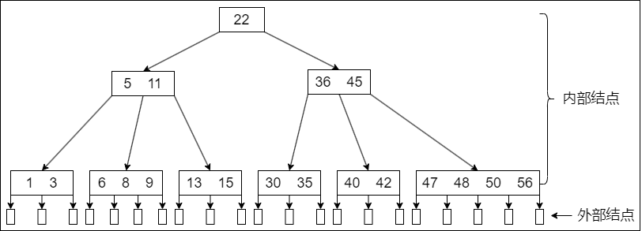

1. 结点的孩子个数等于该结点中关键字个数加 `1`
2. 如果根结点没有关键字就没有子树，此时 B 树为空；如果根结点有关键字，则其子树个数必然大于或等于 `2`，因为子树个数等于关键字个数加 `1`
3. 除根结点外的所有非叶结点至少有 $\lceil m / 2 \rceil = \lceil 5 / 2 \rceil = 3$ 棵子树（即至少有 $\lceil m / 2 \rceil - 1 = \lceil 5 / 2 \rceil - 1 = 2$ 个关键字）；至多有 `5` 棵子树（即至多有 `4` 个关键字）
4. 结点中的关键字从左到右递增有序，关键字两侧均有指向子树的指针，左侧指针所指子树的所有关键字均小于该关键字，右侧指针所指子树的所有关键字均大于该关键字。或者看成下层结点的关键字总是落在由上层结点的关键字所划分的区间内，如第二层最左结点的关键字划分成了 `3` 个区间：`(-∞, 5)`、`（5, 11）`、`（11, +∞）`,该结点中的 `3` 个指针所指子树的关键字均分别落在这 `3` 个区间内
5. 所有叶结点均在第 `4` 层，代表查找失败的位置

1. **B 树的高度（磁盘存取次数）**

    B 树中的大部分操作所需的磁盘存取次数与 B 树的高度成正比。分析 B 树在不同情况下的高度。当然，首先应该明确 B 树的高度不包括最后的不带任何信息的叶结点所处的那一层。

    若 $n \geqslant 1$，则对任意一棵包含 `n` 个关键字、高度为 `h`、阶数为 `m` 的 B 树：

    - 因为 B 树中每个结点最多有 `m` 棵子树，`m - 1` 个关键字，所以在一棵高度为 `h` 的 `m` 阶 B 树中关键字的个数应满足 $n \leqslant (m - l)(l + m + m^{2}+ \dotsc + m^{h-1}) = m^{h} - 1$，因此有 $h \geqslant log_{m} (n + 1)$
    - 若让每个结点中的关键字个数达到最少，则容纳同样多关键字的 B 树的高度达到最大。第一层至少有 `1` 个结点；第二层至少有 `2` 个结；除根结点外的每个非叶结点至少有 $\lceil m / 2 \rceil$ 棵子树，则第三层至少有 $2 \lceil m / 2 \rceil$ 个结点……第 `h + 1` 层至少有 $2(\lceil m / 2 \rceil)^{h-1}$ 个结点，注意到第 `h + 1` 层是不包含任何信息的叶结点。对于关键字个数为 `n` 的 B 树，叶结点即查找不成功的结点为 `n + 1`，由此有 $n + l \geqslant 2(\lceil m / 2 \rceil)^{h-1}$，即 $h \leqslant log_{\lceil m / 2 \rceil} ((n + 1) / 2) + 1$

    例如，假设一棵 3 阶 B 树共有 8 个关键字，则其高度范围为 $2 \leqslant h \leqslant 3.17$。

2. **B 树的查找**

    在 B 树上进行查找与二叉查找树很相似，只是每个结点都是多个关键字的有序表，在每个结点上所做的不是两路分支决定，而是根据该结点的子树所做的多路分支决定。

    B 树的查找包含两个基本操作：一在 B 树中找结点；二在结点内找关键字。由于 B 树常存储在磁盘上，因此前一个查找操作是在磁盘上进行的，而后一个查找操作是在内存中进行的，即在找到目标结点后，先将结点信息读入内存，然后在结点内采用顺序查找法或折半查找法。

    在 B 树上查找到某个结点后，先在有序表中进行查找，若找到则查找成功，否则按照对应的指针信息到所指的子树中去查找（例如：在上图中查找关键字 `42`，首先从根结点开始，根结点只有一个关键字，且 `42 > 22`，若存在，必在关键字 `22` 的右边子树上，右孩子结点有两个关键字，而 `36 < 42 < 45`，则若存在，必在 `36` 和 `45` 中间的子树上，在该子结点中查到关键字 `42`，查找成功）。查找到叶结点时（对应指针为空），则说明树中没有对应的关键字，查找失败。

3. **B 树的插入**

    与二叉查找树的插入操作相比，B 树的插入操作要复杂得多。在 B 树中查找到插入的位置后，并不能简单地将其添加到终端结点（最底层的非叶结点）中，因为此时可能会导致整棵树不再满足 B 树定义中的要求。**将关键字 key 插入 B 树的过程如下：**

    - **定位**：利用前述的 B 树查找算法，找出插入该关键字的最底层中的某个非叶结点（在 B 树中查找 `key` 时，会找到表示查找失败的叶结点，这样就确定了最底层非叶结点的插入位置。**注意**：插入位置一定是最底层中的某个非叶结点）
    - **插入**：在 B 树中，每个非失败结点的关键字个数都在区间 $[\lceil m / 2 \rceil -1, m - 1]$ 内。插入后的结点关键字个数小于 `m`，可以直接插入；插入后检查被插入结点内关键字的个数，当插入后的结点关键字个数大于 `m - 1` 时，必须对结点进行分裂

    **分裂的方法是**：取一个新结点，在插入 `key` 后的原结点，从中间位置（$\lceil m / 2 \rceil$）将其中的关键字分为两部分，左部分包含的关键字放在原结点中，右部分包含的关键字放到新结点中，中间位置（$\lceil m / 2 \rceil$）的结点插入原结点的父结点。若此时导致其父结点的关键字个数也超过了上限，则继续进行这种分裂操作，直至这个过程传到根结点为止，进而导致 B 树高度增 `1`。

4. **B 树的删除**

    B 树中的删除操作与插入操作类似，但要稍微复杂一些，即要使得删除后的结点中的关键字个数 $\geqslant \lceil m / 2 \rceil - 1$，因此将涉及结点的 “合并” 问题。
    
    当被删关键字 `k` 不在终端结点（最底层的非叶结点）中时，可以用 `k` 的前驱（或后继）$k'$ 来替代 `k`，然后在相应的结点中删除 $k'$，关键字 $k'$ 必定落在某个终端结点中，则转换成了被删关键字在终端结点中的情形。

    当被删关键字在终端结点中时，有下列三种情况:

    - **直接删除关键字**：若被删关键字所在结点的关键字个数 $\geqslant \lceil m / 2 \rceil$，表明删除该关键字后仍满足 B 树的定义，则直接删去该关键字
    - **兄弟够借**：若被删关键字所在结点删除前的关键字个数 $= \lceil m / 2 \rceil - 1$，且与该结点相邻的右（或左）兄弟结点的关键字个数 $\geqslant \lceil m / 2 \rceil$，则需要调整该结点、右（或左）兄弟结点及其双亲结点（父子换位法），以达到新的平衡
    - **兄弟不够借**：若被删关键字所在结点删除前的关键字个数 $= \lceil m / 2 \rceil - 1$，且此时与该结点相邻的左、右兄弟结点的关键字个数均 $= \lceil m / 2 \rceil - 1$，则将关键字删除后与左（或右）兄弟结点及双亲结点中的关键字进行合并

    在合并过程中，双亲结点中的关键字个数会减 `1`。若其双亲结点是根结点且关键字个数减少至 `0`（根结点关键字个数为 `1` 时，有 `2` 棵子树），则直接将根结点删除，合并后的新结点成为根；若双亲结点不是根结点，且关键字个数减少到 $\lceil m / 2 \rceil - 2$，则又要与它自己的兄弟结点进行调整或合并操作，并重复上述步骤，直至符合 B 树的要求为止。

#### B+ 树的基本概念

B+ 树是应数据库所需而出现的一种 B 树的变形树。

一棵 `m` 阶的 B+ 树需满足下列条件：

- 每个分支结点最多有 `m` 棵子树（孩子结点）
- 非叶根结点至少有两棵子树，其他每个分支结点至少有 $\lceil m / 2 \rceil$ 棵子树
- 结点的子树个数与关键字个数相等
- 所有叶结点包含全部关键字及指向相应记录的指针，叶结点中将关键字按大小顺序排列，并且相邻叶结点按大小顺序相互链接起来
- 所有分支结点（可视为索引的索引）中仅包含它的各个子结点（即下一级的索引块）中关键字的最大值及指向其子结点的指针

`m` 阶的 B+ 树与 `m` 阶的 B 树的 **主要差异如下：**

- 在 B+ 树中，具有 `n` 个关键字的结点只含有 `n` 棵子树，即每个关键字对应一棵子树；而在 B 树中，具有 `n` 个关键字的结点含有 `n + 1` 棵子树
- 在 B+ 树中，每个结点（非根内部结点）的关键字个数 `n` 的范围是 $\lceil m / 2 \rceil \leqslant n \leqslant m$（而根结点：$1 \leqslant n \leqslant m$）而在 B 树中，每个结点（非根内部结点）的关键字个数 `n` 的范围是 $\lceil m / 2 \rceil - 1 \leqslant n \leqslant m - 1$ （根结点：$1 \leqslant n \leqslant m - 1$）
- 在 B+ 树中，叶结点包含了全部关键字，非叶结点中出现的关键字也会出现在叶结点中；而在 B 树中，最外层的终端结点包含的关键字和其他结点包含的关键字是不重复的
- 在 B+ 树中，叶结点包含信息，所有非叶结点仅起索引作用，非叶结点中的每个索引项只含有对应子树的最大关键字和指向该子树的指针，不含有该关键字对应记录的存储地址

B+ 树的查找、插入和删除操作和 B 树的基本类似。只是在查找过程中，非叶结点上的关键字值等于给定值时并不终止，而是继续向下查找，直到叶结点上的该关键字为止。所以，在 B+ 树中查找时，无论查找成功与否，每次查找都是一条从根结点到叶结点的路径。

### 散列表

#### 散列表的基本概念

在线性表和树表的查找中，记录在表中的位置与记录的关键字之间不存在确定关系，因此，在这些表中查找记录时需进行一系列的关键字比较。这类查找方法建立在 “比较” 的基础上，查找的效率取决于比较的次数。

**散列函数**：一个把查找表中的关键字映射成该关键字对应的地址的函数，记为 `Hash(key) = Addr`（这里的地址可以是数组下标、索引或内存地址等）。

散列函数可能会把两个或两个以上的不同关键字映射到同一地址，称这种情况为 **冲突**，这些发生碰撞的不同关键字称为 **同义词**。一方面，设计得好的散列函数应尽量减少这样的冲突；另一方面，由于这样的冲突总是不可避免的，所以还要设计好处理冲突的方法。

**散列表**：根据关键字而直接进行访问的数据结构。也就是说，散列表建立了关键字和存储地址之间的一种直接映射关系。理想情况下，对散列表进行查找的时间复杂度为 $O(1)$，即与表中元素的个数无关。

#### 散列函数的构造方法

在构造散列函数时，必须注意以下几点：

- 散列函数的定义域必须包含全部需要存储的关键字，而值域的范围则依赖于散列表的大小或地址范围
- 散列函数计算出来的地址应该能等概率、均匀地分布在整个地址空间中，从而减少冲突的发生
- 散列函数应尽量简单，能够在较短的时间内计算出任意一个关键字对应的散列地址

**常用的散列函数如下：**

1. **直接定址法**

    直接取关键字的某个线性函数值为散列地址，散列函数为：$H(key) = key$ 或 $H(key) = a \times key + b$ 式中，`a` 和 `b` 是常数。这种方法计算最简单，且不会产生冲突。它适合关键字的分布基本连续的情况，若关键字分布不连续，空位较多，则会造成存储空间的浪费。

2. **除留余数法**

    这是一种最简单、最常用的方法，假定散列表表长为 `m`，取一个不大于 `m` 但最接近或等于 `m` 的质数 $P$，利用以下公式把关键字转换成散列地址。散列函数为：$H(key) = key \% p$ 除留余数法的关键是选好 $p$，使得每个关键字通过该函数转换后等概率地映射到散列空间上的任意一个地址，从而尽可能减少冲突的可能性。

3. **数字分析法**

    设关键字是 `r` 进制数（如十进制数），而 `r` 个数码在各位上出现的频率不一定相同，可能在某些位上分布均匀一些，每种数码出现的机会均等；而在某些位上分布不均匀，只有某几种数码经常出现，此时应选取数码分布较为均匀的若干位作为散列地址。这种方法适合于已知的关键字集合，若更换了关键字，则需要重新构造新的散列函数。

4. **平方取中法**

    顾名思义，这种方法取关键字的平方值的中间几位作为散列地址。具体取多少位要视实际情况而定。这种方法得到的散列地址与关键字的每位都有关系，因此使得散列地址分布比较均匀，适用于关键字的每位取值都不够均匀或均小于散列地址所需的位数。

    在不同的情况下，不同的散列函数具有不同的性能，因此不能笼统地说哪种散列函数最好。在实际选择中，采用何种构造散列函数的方法取决于关键字集合的情况，但目标是尽量降低产生冲突的可能性。

#### 处理冲突的方法

应该注意到，任何设计出来的散列函数都不可能绝对地避免冲突。为此，必须考虑在发生冲突时应该如何处理，即为产生冲突的关键字寻找下一个 “空” 的 `Hash` 地址。用 $H_{i}$ 表示处理冲突中第 `i` 次探测得到的散列地址，假设得到的另一个散列地址 $H_{1}$ 仍然发生冲突，只得继续求下一个地址 $H_{2}$，以此类推，直到 $H_{k}$ 不发生冲突为止，则 $H_{k}$ 为关键字在表中的地址。

1. **开放定址法**

    所谓开放定址法，是指可存放新表项的空闲地址既向它的同义词表项开放，又向它的非同义词表项开放。其数学递推公式为：$H_{i} = (H(key) + d_{i}) \% m$ 式中，$H(key)$ 为散列函数；$i = 0, 1, 2, \dotsc, k(k \leqslant m - 1)$；`m` 表示散列表表长；$d_{i}$ 为增量序列。
    
    取定某一增量序列后，对应的处理方法就是确定的。**通常有以下四种取法：**

    - **线性探测法**：当 $d_{i} = 0, 1, 2, \dotsc, m - 1$ 时，称为 **线性探测法**。这种方法的 **特点是**：冲突发生时，顺序查看表中下一个单元（探测到表尾地址 `m - 1` 时，下一个探测地址是表首地址 `0`），直到找出一个空闲单元（当表未填满时一定能找到一个空闲单元）或查遍全表。

        线性探测法可能使第 `i` 个散列地址的同义词存入第 `i + 1` 个散列地址，这样本应存入第 `i + 1` 个散列地址的元素就争夺第 `i + 2` 个散列地址的元素的地址……从而造成大量元素在相邻的散列地址上 “聚集”（或堆积）起来，大大降低了查找效率。

    - **平方探测法**：当 $d_{i} = 0^{2}, 1^{2}, -1^{2}, 2^{2}, -2^{2}, ..., k^{2}, -k^{2}$ 时，称为 **平方探测法**，其中 $k \leqslant m / 2$，散列表长度 `m` 必须是一个可以表示成 `4k + 3` 的素数，又称 **二次探测法**。

        平方探测法是一种处理冲突的较好方法，可以避免出现 “堆积” 问题，它的缺点是不能探测到散列表上的所有单元，但至少能探测到一半单元。

    - **双散列法**：当 $d_{i} = Hash_{2} (key)$ 时，称为 **双散列法**。需要使用两个散列函数，当通过第一个散列函数 $H(key)$ 得到的地址发生冲突时，则利用第二个散列函数 $Hash2(key)$ 计算该关键字的地址增量。它的具体散列函数形式如下：$H_{i} = (H(key) + i \times Hash_{2} (key)) \% m$ 初始探测位置 $H_{0} = H(key) \% m$。`i` 是冲突的次数，初始为 `0`。在双散列法中，最多经过 `m - 1` 次探测就会遍历表中所有位置，回到位置。

    - **伪随机序列法**：当 $d_{i} =$ 伪随机数序列时，称为 **伪随机序列法。**

    ::: tip
    在开放定址的情形下，不能随便物理删除表中的已有元素，因为若删除元素，则会截断其他具有相同散列地址的元素的查找地址。因此，要删除一个元素时，可给它做一个删除标记，进行逻辑删除。但这样做的副作用是：执行多次删除后，表面上看起来散列表很满，实际上有许多位置未利用，因此需要定期维护散列表，要把删除标记的元素物理删除
    :::

2. **拉链法（链接法，chaining）**

    显然，对于不同的关键字可能会通过散列函数映射到同一地址，为了避免非同义词发生冲突，可以把所有的同义词存储在一个线性链表中，这个线性链表由其散列地址唯一标识。假设散列地址为 `i` 的同义词链表的头指针存放在散列表的第 `i` 个单元中，因而查找、插入和删除操作主要在同义词链中进行。拉链法适用于经常进行插入和删除的情况。

#### 散列查找及性能分析

散列表的查找过程与构造散列表的过程基本一致。对于一个给定的关键字 `key`，根据散列函数可以计算出其散列地址，执行步骤如下:

初始化：`Addr = Hash(key);`

1. 检测查找表中地址为 Addr 的位置上是否有记录，若无记录，返回查找失败；若有记录，比较它与 `key` 的值，若相等，则返回查找成功标志，否则执行步骤 `2`。
2. 用给定的处理冲突方法计算 “下一个散列地址”，并把 `Addr` 置为此地址，转入步骤 `1`。

例如，关键字序列 `{19, 14, 23, 01, 68, 20, 84, 27, 55, 11, 10, 79}` 按散列函数 $H(key) = key \% 13$ 和线性探测处理冲突构造所得的散列表 `L` 如下图所示：

|  0  |  1  |  2  |  3  |  4  |  5  |  6  |  7  |  8  |  9  |  10  |  11  |  12  |  13  |  14  |  15  |
|  :----:  |  :----:  |  :----:  |  :----:  |  :----:  |  :----:  |  :----:  |  :----:  |  :----:  |  :----:  |  :----:  |  :----:  |  :----:  |  :----:  |  :----:  |  :----:  |
|    |  14  |  01  |  68  |  27  |  55  |  19  |  20  |  84  |  79  |  23  |  11  |  10  |    |    |    |

给定值 84 的查找过程为：首先求得散列地址 `H(84) = 6`，因 `L[6]` 不空且 `L[6] ≠ 84`，则找第一次冲突处理后的地址 $H_{1} = (6 + l) \% 16 = 7$，而 `L[7]` 不空且 `L[7] ≠ 84`，则找第二次冲突处理后的地址 $H_{2} = (6 + 2) \% 16 = 8$，`L[8]` 不空且 `L[8] = 84`，查找成功，返回记录在表中的序号 `8`。

给定值 38 的查找过程为：先求散列地址 `H(38) = 12`，`L[12]` 不空且 `L[12] ≠ 38`，则找下一地址 $H_{1} = (12 + l) \% 16 = 13$，由于 `L[13]` 是空记录，故表中不存在关键字为 `38` 的记录。

查找各关键字的比较次数如下图所示：

|  关键字  |  14  |  01  |  68  |  27  |  55  |  19  |  20  |  84  |  79  |  23  |  11  |  10  |
|  :----:  |  :----:  |  :----:  |  :----:  |  :----:  |  :----:  |  :----:  |  :----:  |  :----:  |  :----:  |  :----:  |  :----:  |  :----:  |
|  比较次数  |  1  |  2  |  1  |  4  |  3  |  1  |  1  |  3  |  9  |  1  |  1  |  3  |

平均查找长度 ASL 为：$ASL = (1 \times 6 + 2 + 3 \times 3 + 4 + 9) / 12 = 2.5$

对同一组关键字，设定相同的散列函数，则不同的处理冲突的方法得到的散列表不同，它们的平均查找长度也不同，本例与上节采用拉链法的平均查找长度不同。

从散列表的查找过程可见：

1. 虽然散列表在关键字与记录的存储位置之间建毛了直接映像，但由于 “冲突” 的产生，使得散列表的查找过程仍然是一个给定值和关键字进行比较的过程。因此，仍需要以平均查找长度作为衡量散列表的查找效率的度量。
2. 散列表的查找效率取决于三个因素：散列函数、处理冲突的方法和装填因子。

装填因子。散列表的装填因子一般记为 $\alpha$，定义为一个表的装满程度，即 $\alpha = \dfrac{\text{表中记录数} n}{\text{散列表长度} m}$

散列表的平均查找长度依赖于散列表的装填因子 $\alpha$，而不直接依赖于 `n` 或 `m`。直观地看，$\alpha$ 越大，表示装填的记录越 “满”，发生冲突的可能性越大，反之发生冲突的可能性越小。

## 排序

### 排序的基本概念

**排序**，就是重新排列表中的元素，使表中的元素满足按关键字有序的过程。为了查找方便，通常希望计算机中的表是按关键字有序的。**排序的确切定义如下：**

- **输入**：`n` 个记录 $R_{1}, R_{2}, \dotsc, R_{n}$，对应的关键字为 $K_{1}, K_{2}, \dotsc, K_{n}$
- **输出**：输入序列的一个重排 $R_{1}', R_{2}', \dotsc, R_{n}'$，使得 $K_{1}' \leqslant K_{2}' \leqslant \dotsc \leqslant K_{n}'$（其中 $\leqslant$ 可以换成其他的比较大小的符号）。

**算法的稳定性**。若待排序表中有两个元素 $R_{i}$ 和 $R_{j}$，其对应的关键字相同即 $key_{i} = key_{j}$，且在排序前 $R_{i}$ 在 $R_{j}$ 的前面，若使用某一排序算法排序后，$R_{i}$ 仍然在 $R_{j}$ 的前面，则称这个排序算法是稳定的，否则称排序算法是不稳定的。**需要注意的是**，算法是否具有稳定性并不能衡量一个算法的优劣，它主要是对算法的性质进行描述。如果待排序表中的关键字不允许重复，则排序结果是唯一的，那么选择排序算法时的稳定与否就无关紧要。

::: tip
对于不稳定的排序算法，只需举出一组关键字的实例，说明它的不稳定性即可
:::

在排序过程中，根据数据元素是否完全在内存中，可将排序算法分为两类：

- **内部排序**：是指在排序期间元素全部存放在内存中的排序
- **外部排序**：是指在排序期间元素无法全部同时存放在内存中，必须在排序的过程中根据要求不断地在内、外存之间移动的排序

一般情况下，内部排序算法在执行过程中都要进行两种操作：比较和移动。通过比较两个关键字的大小，确定对应元素的前后关系，然后通过移动元素以达到有序。当然，并非所有的内部排序算法都要基于比较操作，事实上，基数排序就不基于比较。

每种排序算法都有各自的优缺点，适合在不同的环境下使用，就其全面性能而言，很难提出一种被认为是最好的算法。通常可以将排序算法分为插入排序、交换排序、选择排序、归并排序和基数排序五大类。内部排序算法的性能取决于算法的时间复杂度和空间复杂度，而时间复杂度一般是由比较和移动的次数决定的。

::: tip
大多数的内部排序算法只适用于顺序存储的线性表
:::

### 插入排序

插入排序是一种简单直观的排序方法，其 **基本思想** 是每次将一个待排序的记录按其关键字大小插入前面已排好序的子序列，直到全部记录插入完成。由插入排序的思想可以引申出三个重要的排序算法：直接插入排序、折半插入排序和希尔排序。

#### 直接插入排序

根据上面的插入排序思想，不难得出一种最简单也最直观的直接插入排序算法。假设在排序过程中，待排序表 `L[1...n]` 在某次排序过程中的某一时刻状态如下：

|  有序序列 `L[1...i - 1]`  |  `L(i)`  |  无序序列 `L[i + l...n]`  |
|  :----:  |  :----:  |  :----:  |

要将元素 `L(i)` 插入己有序的子序列 `L[1...i - 1]`，需要执行以下操作（为避免混淆，下面用 `L[]` 表示一个表，而用 `L()` 表示一个元素）：

1. 查找出 `L(i)` 在 `L[1...i - l]` 中的插入位置 `k`
2. 将 `L[k...i - l]` 中的所有元素依次后移一个位置
3. 将 `L(i)` 复制到 `L(k)`

为了实现对 `L[1...n]` 的排序，可以将 `L(2)~L(n)` 依次插入前面已排好序的子序列，初始 `L[1]` 可以视为是一个已排好序的子序列。上述操作执行 `n - 1` 次就能得到一个有序的表。插入排序在实现上通常采用就地排序（空间复杂度为 $O(1)$），因而在从后向前的比较过程中，需要反复把己排序元素逐步向后挪位，为新元素提供插入空间。

下面是直接插入排序的代码，其中再次用到了前面提到的 “哨兵”（作用相同）。

```c
void InsertSort(ElemType A[], int n) {
    int i, j;
    for (i = 2; i <= n; i++)  // 依次将 A[2] ~ A[n] 插入前面己排序序列
        if (A[i] < A[i - 1]) {  // 若 A[i] 关键码小于其前驱，将 A[i] 插入有序表
            A[0] = A[i];  // 复制为哨兵，A[0] 不存放元素
            for (j = i - 1; A[0] < A[j]; --j)  // 从后往前查找待插入位置
                A[j + l] = A[j];  // 向后挪位
            A[j + 1] = A[0];  // 复制到插入位置
    }
}
```

直接插入排序算法的 **性能分析如下：**

- **空间效率**：仅使用了常数个辅助单元，因而空间复杂度为 $O(1)$
- **时间效率**：在排序过程中，向有序子表中逐个地插入元素的操作进行了 `n - 1` 趟，每趟操作都分为比较关键字和移动元素，而比较次数和移动次数取决于待排序表的初始状态

    在最好情况下，表中元素已经有序，此时每插入一个元素，都只需比较一次而不用移动元素，因而时间复杂度为 $O(n)$。
    
    在最坏情况下，表中元素顺序刚好与排序结果中的元素顺序相反（逆序），总的比较次数达到最大，总的移动次数也达到最大，总的时间复杂度为 $O(n^{2})$。
    
    平均情况下，考虑待排序表中元素是随机的，此时可以取上述最好与最坏情况的平均值作为平均情况下的时间复杂度，总的比较次数与总的移动次数均约为 $n^{2} / 4$。因此，直接插入排序算法的时间复杂度为 $O(n^{2})$。

- **稳定性**：由于每次插入元素时总是从后向前先比较再移动，所以不会出现相同元素相对位置发生变化的情况，即直接插入排序是一个稳定的排序方法
- **适用性**：直接插入排序算法适用于顺序存储和链式存储的线性表。为链式存储时，可以从前往后查找指定元素的位置

#### 折半插入排序

从直接插入排序算法中，不难看出每趟插入的过程中都进行了两项工作：一从前面的有序子表中查找出待插入元素应该被插入的位置；二给插入位置腾出空间，将待插入元素复制到表中的插入位置。注意到在该算法中，总是边比较边移动元素。下面将比较和移动操作分离，即先折半查找出元素的待插入位置，然后统一地移动待插入位置之后的所有元素。当排序表为顺序表时，可以对直接插入排序算法做如下改进：由于是顺序存储的线性表，所以查找有序子表时可以用折半查找来实现。确定待插入位置后，就可统一地向后移动元素。算法代码如下：

```c
void InsertSort(ElemType A[], int n) {
    int i, j, low, high, mid;
    for (i = 2; i <= n; i++) {  // 依次将 A[2] ~ A[n] 插入前面的已排序序列
        A[0] = A[i];  // 将 A[i] 暂存到 A[0]
        low = 1; high = i - 1;  // 设置折半查找的范围
        while (low <= high) {  // 折半查找（默认递增有序）
            mid = (low + high) / 2;  // 取中间点
            if (A[mid] > A[0]) hight = mid - 1;  // 查找左半子表
            else low = mid + 1; //查找右半子表
        }

        for (j = high + 1; --j)
            A[j + 1] = A[j];  // 统一后移元素，空出插入位置

        A[high + 1] = A[0];  // 插入操作
    }
}
```

从上述算法中，不难看出折半插入排序仅减少了比较元素的次数，约为 $O(n log_{2} n)$，该比较次数与待排序表的初始状态无关，仅取决于表中的元素个数 `n`；而元素的移动次数并未改变，它依赖于待排序表的初始状态。因此，折半插入排序的时间复杂度仍为 $O(n^{2})$，但对于数据量不是很大的排序表，折半插入排序往往能表现出很好的性能。折半插入排序是一种稳定的排序方法。

#### 希尔排序

从前面的分析可知，直接插入排序算法的时间复杂度为 $O(n^{2})$，但若待排序列为 “正序” 时，其时间效率可提高至 $O(n)$，由此可见它更适用于基本有序的排序表和数据量不大的排序表。希尔排序正是基于这两点分析对直接插入排序进行改进而得来的，又称 **缩小增量排序。**

希尔排序的 **基本思想** 是：先将待排序表分割成若干形如 $L[i, i + d, i + 2d, \dotsc, i + kd]$ 的 “特殊” 子表，即把相隔某个 “增量” 的记录组成一个子表，对各个子表分别进行直接插入排序，当整个表中的元素已呈 “基本有序” 时，再对全体记录进行一次直接插入排序。

希尔排序的 **过程如下**：先取一个小于 `n` 的步长 $d_{1}$，把表中的全部记录分成 $d_{1}$ 组，所有距离为 $d_{1}$ 的倍数的记录放在同一组，在各组内进行直接插入排序；然后取第二个步长 $d_{2} < d_{1}$，重复上述过程，直到所取到的 $d_{t} = 1$，即所有记录已放在同一组中，再进行直接插入排序，由于此时已经具有较好的局部有序性，故可以很快得到最终结果。到目前为止，尚未求得一个最好的增量序列。

希尔排序算法的代码如下：

```c
void ShellSort(ElemType A[], int n) {  // A[0] 只是暂存单元，不是哨兵，当 j <= 0 时，插入位置已到
    int dk, i, j;
    for (dk = n / 2; dk >= l; dk = dk / 2)  // 增量变化（无统一规定）
        for (i = dk + 1; i <= n; ++i)
            if (A[i] < A[i - dk] ) {  // 需将 A[i] 插入有序增量子表
                A[0] = A[i];  // 暂存在 A[0]
                for (j = i - dk; j > 0 && A[0] < A[j]; j -= dk)
                    A[j + dk] = A[j];  // 记录后移，查找插入的位置

                A[j + dk] = A[0];  // 插入
            }  // if
}
```

希尔排序算法的 **性能分析如下：**

- **空间效率**：仅使用了常数个辅助单元，因而空间复杂度为 $O(1)$
- **时间效率**：由于希尔排序的时间复杂度依赖于增量序列的函数，这涉及数学上尚未解决的难题，所以其时间复杂度分析比较困难。当 `n` 在某个特定范围时，希尔排序的时间复杂度约为 $O(n^{1.3})$。在最坏情况下希尔排序的时间复杂度为 $O(n^{2})$
- **稳定性**：当相同关键字的记录被划分到不同的子表时，可能会改变它们之间的相对次序，因此希尔排序是一种不稳定的排序方法
- **适用性**：希尔排序算法仅适用于线性表为顺序存储的情况

### 交换排序

所谓交换，是指根据序列中两个元素关键字的比较结果来对换这两个记录在序列中的位置。基于交换的排序算法很多，这里主要介绍冒泡排序和快速排序。

#### 冒泡排序

冒泡排序的 **基本思想** 是：从后往前（或从前往后）两两比较相邻元素的值，若为逆序（即 `A[i - 1] > A[i]`），则交换它们，直到序列比较完。称它为第一趟冒泡，结果是将最小的元素交换到待排序列的第一个位置（或将最大的元素交换到待排序列的最后一个位置），关键字最小的元素如气泡一般逐渐往上 “漂浮” 直至 “水面”（或关键字最大的元素如石头一般下沉至水底）。下一趟冒泡时，前一趟确定的最小元素不再参与比较，每趟冒泡的结果是把序列中的最小元素（或最大元素）放到了序列的最终位置……这样最多做 `n - 1` 趟冒泡就能把所有元素排好序。

冒泡排序算法的代码如下：

```c
void BubbleSort(ElemType A[], int n) {
    for (int i = 0; i < n - 1; i++) {
        bool flag = false;  // 表示本趟冒泡是否发生交换的标志
        for (int j = n - 1; j > i; j--)  // 一趟冒泡过程
            if (A[j - 1] > A[j]) {  // 若为逆序
                swap(A[j - 1], A[j]);  // 交换
                flag = true;
            }

        if (flag == false)
            return;  // 本趟遍历后没有发生交换，说明表已经有序
    }
}
```

冒泡排序的 **性能分析如下：**

- **空间效率**：仅使用了常数个辅助单元，因而空间复杂度为 $O(1)$
- **时间效率**：当初始序列有序时，显然第一趟冒泡后 `flag` 依然为 `false`（本趟没有元素交换），从而直接跳出循环，比较次数为 `n - 1`，移动次数为 `0`，从而最好情况下的时间复杂度为 $O(n)$；当初始序列为逆序时，需要进行 `n - 1` 趟排序，第 `i` 趟排序要进行 `n - i` 次关键字的比较，而且每次比较后都必须移动元素 `3` 次来交换元素位置。这种情况下 $\text{比较次数} = \displaystyle\sum_{i=1}^{n-1} (n - i) = \dfrac{n(n - 1)}{2}, \text{移动次数} = \displaystyle\sum_{i=1}^{n-1} 3(n - i) = \dfrac{3n(n - 1)}{2}$ 从而，最坏情况下的时间复杂度为 $O(n^{2})$，平均时间复杂度为 $O(n^{2})$
- **稳定性**：由于 `i > j` 且 `A[i] = A[j]` 时，不会发生交换，因此冒泡排序是一种稳定的排序方法

::: tip
冒泡排序中所产生的有序子序列一定是全局有序的（不同于直接插入排序），也就是说，有序子序列中的所有元素的关键字一定小于（或大于）无序子序列中所有元素的关键字，这样每趟排序都会将一个元素放置到其最终的位置上
:::

#### 快速排序

快速排序的 **基本思想** 是基于分治法的：在待排序表 `L[1...n]` 中任取一个元素 `pivot` 作为枢轴（或称基准，通常取首元素），通过一趟排序将待排序表划分为独立的两部分 `L[1...k - 1]` 和 `L[k + 1...n]`，使得 `L[1...k - 1]` 中的所有元素小于 `pivot`，`L[k + 1...n]` 中的所有元素大于或等于 `pivot`，则 `pivot` 放在了其最终位置 `L(k)` 上，这个过程称为 **一次划分**。然后分别递归地对两个子表重复上述过程，直至每部分内只有一个元素或空为止，即所有元素放在了其最终位置上。

一趟快速排序的过程是一个交替搜索和交换的过程。假设划分算法己知，记为 `Partition()`，返回的是上述的 `k`，注意到 `L(k)` 己放在其最终位置，因此可以先对表进行划分，而后对两个表调用同样的排序操作。因此可以递归地调用快速排序算法进行排序，具体的程序结构如下：

```c
void Quicksort(ElemType A[], int low, int high) {
    if (low < high) {  // 递归跳出的条件
        // Partition() 就是划分操作，将表 A[low…high] 划分为满足上述条件的两个子表
        int pivotpos = Partition(A, low, high);  // 划分
        Quicksort(A, low, pivotpos - 1);  // 依次对两个子表进行递归排序
        Quicksort(A, pivotpos + 1, high);
    }
}
```

从上面的代码不难看出快速排序算法的关键在于划分操作，同时快速排序算法的性能也主要取决于划分操作的好坏。假设每次总以当前表中第一个元素作为枢轴来对表进行划分，则将表中比枢轴大的元素向右移动，将比枢轴小的元素向左移动，使得一趟 `Partition()` 操作后，表中的元素被枢轴一分为二。代码如下：

```c
int Partition(ElemType A[], int low, int high) {  // 一趟划分
    ElemType pivot = A[low];  // 将当前表中第一个元素设为枢轴，对表进行划分
    while (low < high) {  // 循环跳出条件
        while (low < high && A[high] >= pivot) --high;
        A[low] = A[high];  // 将比枢轴小的元素移动到左端
        while (low < high && A[low] <= pivot) ++low;
        A[high] = A[low];  // 将比枢轴大的元素移动到右端
    }

    A[low] = pivot;  // 枢轴元素存放到最终位置
    return low;  // 返回存放枢轴的最终位置
}
```

快速排序算法的 **性能分析如下：**

- **空间效率**：由于快速排序是递归的，需要借助一个递归工作栈来保存每层递归调用的必要信息，其容量与递归调用的最大深度一致。最好情况下为 $O(log_{2} n)$；最坏情况下，因为要进行 `n - 1` 次递归调用，所以栈的深度为 $o(n)$；平均情况下，栈的深度为 $O(log_{2} n)$
- **时间效率**：快速排序的运行时间与划分是否对称有关，快速排序的最坏情况发生在两个区域分别包含 `n - 1` 个元素和 `0` 个元素时，这种最大限度的不对称性若发生在每层递归上，即对应于初始排序表基本有序或基本逆序时，就得到最坏情况下的时间复杂度为 $O(n^{2})$

    有很多方法可以提高算法的效率：一种方法是尽量选取一个可以将数据中分的枢轴元素，如从序列的头尾及中间选取三个元素，再取这三个元素的中间值作为最终的枢轴元素；或者随机地从当前表中选取枢轴元素，这样做可使得最坏情况在实际排序中几乎不会发生。

    在最理想的状态下，即 `Partition()` 可能做到最平衡的划分，得到的两个子问题的大小都不可能大于 `n / 2`，在这种情况下，快速排序的运行速度将大大提升，此时，时间复杂度为 $O(n log_{2} n)$。好在快速排序平均情况下的运行时间与其最佳情况下的运行时间很接近，而不是接近其最坏情况下的运行时间。快速排序是所有内部排序算法中平均性能最优的排序算法。

- **稳定性**：在划分算法中，若右端区间有两个关键字相同，且均小于基准值的记录，则在交换到左端区间后，它们的相对位置会发生变化，即快速排序是一种不稳定的排序方法。例如：表 L = {3, **2**, 2}，经过一趟排序后 L = {2, **2**, 3}，最终排序序列也是 L= {2, **2**, 3}，显然，2 与 **2** 的相对次序己发生了变化。

::: tip
在快速排序算法中，并不产生有序子序列，但每趟排序后会将上一趟划分的各个无序子表的枢轴（基准）元素放到其最终的位置上
:::

### 选择排序

选择排序的 **基本思想** 是：每一趟（如第 `i` 趟）在后面 `n - i + 1(i = 1, 2,… n - 1)` 个待排序元素中选取关键字最小的元素，作为有序子序列的第 `i` 个元素，直到第 `n - 1` 趟做完，待排序元素只剩下 `1` 个，就不用再选了。

#### 简单选择排序

根据上面选择排序的思想，可以很直观地得出简单选择排序算法的思想：假设排序表为 `L[1...n]`，第 `i` 趟排序即从 `L[i...n]` 中选择关键字最小的元素与 `L(i)` 交换，每一趟排序可以确定一个元素的最终位置，这样经过 `n - 1` 趟排序就可使得整个排序表有序。

简单选择排序算法的代码如下：

```c
void SelectSort(ElemType A[], int n) {
    for (int i = 0; i < n - 1; i++) {  // 一共进行 n - 1 趟
        int min = i;  // 记录最小元素位置
        for (int j = i + l; j < n; j++)  // 在 A[i...n - 1] 中选择最小的元素
            if (A[j] < A[min]) min = j;  // 更新最小元素位置

        if (min != i) swap(A[i], A[min]);  // 封装的 swap() 函数共移动元素 3 次
    }
}
```

简单选择排序算法的 **性能分析如下：**

- **空间效率**：仅使用常数个辅助单元，故空间效率为 $O(1)$
- **时间效率**：从上述伪码中不难看出，在简单选择排序过程中，元素移动的操作次数很少，不会超过 `3(n - 1)` 次，最好的情况是移动 `0` 次，此时对应的表已经有序；但元素间比较的次数与序列的初始状态无关，始终是 `n(n - 1) / 2` 次，因此时间复杂度始终是 $O(n^{2})$
- **稳定性**：在第 `i` 趟找到最小元素后，和第 `i` 个元素交换，可能会导致第 `i` 个元素与其含有相同关键字元素的相对位置发生改变。例如：表 L = {2, **2**, 1}，经过一趟排序后 L = {1, **2**, 2}，最终排序序列也是 L = {1, **2**, 2}，显然，2 与 **2** 的相对次序己发生变化。因此，简单选择排序是一种不稳定的排序方法

#### 堆排序

堆的定义如下，`n` 个关键字序列 `L[1...n]` 称为 **堆**，当且仅当该序列满足：

1. `L(i) >= L(2i)` 且 `L(i) >= L(2i + l)`
2. `L(i) <= L(2i)` 且 `L(i) <= L(2i + l)`（$1 \leqslant i \leqslant \lfloor n / 2 \rfloor$）

可以将堆视为一棵完全二叉树，满足条件 `1` 的堆称为 **大根堆**（大顶堆），大根堆的最大元素存放在根结点，且其任意一个非根结点的值小于或等于其双亲结点值。满足条件 `2` 的堆称为 **小根堆**（小顶堆），小根堆的定义刚好相反，根结点是最小元素。

堆排序的 **思路** 很简单：首先将存放在 `L[1...n]` 中的 `n` 个元素建成初始堆，由于堆本身的特点（以大顶堆为例），堆顶元素就是最大值。输出堆顶元素后，通常将堆底元素送入堆顶，此时根结点己不满足大顶堆的性质，堆被破坏，将堆顶元素向下调整使其继续保持大顶堆的性质，再输出堆顶元素。如此重复，直到堆中仅剩一个元素为止。可见堆排序需要解决两个问题：一如何将无序序列构造成初始堆；二输出堆顶元素后，如何将剩余元素调整成新的堆。

堆排序的关键是构造初始堆。`n` 个结点的完全二叉树，最后一个结点是第 $\lfloor n / 2 \rfloor$ 个结点的孩子。对第 $\lfloor n / 2 \rfloor$ 个结点为根的子树筛选（对于大根堆，若根结点的关键字小于左右孩子中关键字较大者，则交换），使该子树成为堆。之后向前依次对各结点（$\lfloor n / 2 \rfloor - 1 ~ 1$）为根的子树进行筛选，看该结点值是否大于其左右子结点的值，若不大于，则将左右子结点中的较大值与之交换，交换后可能会破坏下一级的堆，于是继续采用上述方法构造下一级的堆，直到以该结点为根的子树构成堆为止。反复利用上述调整堆的方法建堆，直到根结点。

下面是建立大根堆的算法：

```c
void BuildMaxHeap(ElemType A[], int len) {
    for (int i = len / 2; i > 0; i--)  // 从 i = [n / 2]~1，反复调整堆
        HeadAdjust(A, i, len);
}

void HeadAdjust(ElemType A[], int k, int len) {  // 函数 HeadAdjust 将元素 k 为根的子树进行调整
    A[0] = A[k];  // A[0] 暂存子树的根结点
    for (int i = 2 * k; i <= len; i *= 2) {  // 沿 key 较大的子结点向下筛选
        if (i < len && A[i] < A[i + l])
            i++;  // 取 key 较大的子结点的下标

        if (A[0] >= A[i]) break;  // 筛选结束
        else {
            A[k] = A[i];  // 将 A[i] 调整到双亲结点上
            k = i;  // 修改 k 值，以便继续向下筛选
        }
    }
    
    A[k] = A[0];  // 被筛选结点的值放入最终位置
}
```

调整的时间与树高有关，为 $O(h)$。在建含 `n` 个元素的堆时，关键字的比较总次数不超过 `4n`，时间复杂度为 $O(n)$，这说明可以在线性时间内将一个无序数组建成一个堆。

下面是堆排序算法：

```c
void HeapSort(ElemType A[], int len) {
    BuildMaxHeap(A, len);  // 初始建堆
    for (int i = len; i > 1; i--) {  // n - 1 趟的交换和建堆过程
        Swap(A[i], A[1]);  // 输出堆顶元素（和堆底元素交换）
        HeadAdjust(A, 1, i - 1);  // 调整，把剩余的 i - 1 个元素整理成堆
    }
}
```

同时，堆也支持插入操作。对堆进行插入操作时，先将新结点放在堆的末端，再对这个新结点向上执行调整操作。

堆排序适合关键字较多的情况。例如：在 `1` 亿个数中选出前 `100` 个最大值。首先使用一个大小为 `100` 的数组，读入前 `100` 个数，建立小顶堆，而后依次读入余下的数，若小于堆顶则舍弃，否则用该数取代堆顶并重新调整堆，待数据读取完毕，堆中 `100` 个数即为所求。

堆排序算法的 **性能分析如下：**

- **空间效率**：仅使用了常数个辅助单元，所以空间复杂度为 $O(1)$
- **时间效率**：建堆时间为 $O(n)$，之后有 `n - 1` 次向下调整操作，每次调整的时间复杂度为 $O(h)$，故在最好、最坏和平均情况下，堆排序的时间复杂度为 $O(n log_{2} n)$
- **稳定性**：进行筛选时，有可能把后面相同关键字的元素调整到前面，所以堆排序算法是一种不稳定的排序方法。例如：表 L = {1, **2**, 2}，构造初始堆时可能将 **2** 交换到堆顶，此时 L = {**2**, 1, 2}，最终排序序列为 L = {1, 2, **2**}，显然，2 与 **2** 的相对次序已发生变化。

### 归并排序和基数排序

#### 归并排序

归并排序与上述基于交换、选择等排序的思想不一样，“归并” 的含义是将两个或两个以上的有序表合并成一个新的有序表。假定待排序表含有 `n` 个记录，则可将其视为 `n` 个有序的子表，每个子表的长度为 `1`，然后两两归并，得到 $\lceil n / 2 \rceil$ 个长度为 `2` 或 `1` 的有序表；继续两两归并……如此重复，直到合并成一个长度为 `n` 的有序表为止，这种排序方法称为 **2 路归并排序。**

`Merge()` 的功能是将前后相邻的两个有序表归并为一个有序表。设两段有序表 `A[low...mid]`、`A[mid + 1...high]` 存放在同一顺序表中的相邻位置，先将它们复制到辅助数组 `B` 中。每次从对应 `B` 中的两个段取出一个记录进行关键字的比较，将较小者放入 `A` 中，当数组 `B` 中有一段的下标超出其对应的表长（即该段的所有元素都已复制到 `A` 中）时，将另一段中的剩余部分直接复制到 `A` 中。算法如下：

```c
ElemType *B = (ElemType *)malloc((n + 1) *sizeof (ElemType));  // 辅助数组 B
    void Merge(ElemType A[], int low, int mid, int high){  // 表 A 的两段 A[low...mid] 和 A[mid + 1...high] 各自有序，将它们合并成一个有序表
    int i, j, k;
    for (k = low; k <= high; k++)
        B[k] = A[k];  // 将 A 中所有元素复制到 B 中

    for (i = low, j = mid + 1, k = i; i <= mid && j <= high; k++) {
        if (B[i] <= B[j])  // 比较 B 的左右两段中的元素
            A[k] = B[i++];  // 将较小值复制到 A 中
        else
            A[k] = B[j++];
    }

    while (i <= mid) A[k++] = B[i++];  // 若第一个表未检测完，复制
    while (j <= high) A[k++] = B[j++];  // 若第二个表未检测完，复制
}
```

::: tip
上面的代码中，最后两个 `while` 循环只有一个会执行
:::

一趟归并排序的操作是，调用 $\lceil n / 2h \rceil$ 次算法 `merge()`，将 `L[1...n]` 中前后相邻且长度为 `h` 的有序段进行两两归并，得到前后相邻、长度为 `2h` 的有序段，整个归并排序需要进行 $\lceil log_{2} n \rceil$ 趟。

递归形式的 2 路归并排序算法是基于分治的，其过程如下：

- **分解**：将含有 `n` 个元素的待排序表分成各含 `n / 2` 个元素的子表，采用 2 路归并排序算法对两个子表递归地进行排序
- **合并**：合并两个已排序的子表得到排序结果

```c
void MergeSort(ElemType A[], int low, int high) {
    if (low < high) {
        int mid = (low + high) / 2;  // 从中间划分两个子序列
        MergeSort(A, low, mid);  // 对左侧子序列进行递归排序
        MergeSort(A, mid + 1, high);  // 对右侧子序列进行递归排序
        Merge(A, low, mid, high);  // 归并
    }  // if
}
```

2 路归并排序算法的 **性能分析如下：**

- **空间效率**：`Merge()` 操作中，辅助空间刚好为 `n` 个单元，所以算法的空间复杂度为 $O(n)$
- **时间效率**：每趟归并的时间复杂度为 $O(n)$，共需进行 $\lceil log_{2} n \rceil$ 趟归并，所以算法的时间复杂度为 $O(n log_{2} n)$
- **稳定性**：由于 `Merge()` 操作不会改变相同关键字记录的相对次序，所以 2 路归并排序算法是一种稳定的排序方法

::: tip
一般而言，对于 `N` 个元素进行 $k$ 路归并排序时，排序的趟数 `m` 满足 $k^{m} = N$，从而 $m = log_{k} N$，又考虑到 `m` 为整数，所以 $m = \lceil log_{k} N \rceil$。这和前面的 2 路归并是一致的
:::

#### 基数排序

基数排序是一种很特别的排序方法，它不基于比较和移动进行排序，而基于关键字各位的大小进行排序。基数排序是一种借助多关键字排序的思想对单逻辑关键字进行排序的方法。

假设长度为 `n` 的线性表中每个结点 $a_{j}$ 的关键字由 $d$ 元组（$k_{j}^{d-1}, k_{j}^{d-2}, \dotsc, k_{j}^{1}, k_{j}^{0}$）组成，满足 $0 \leqslant k_{j}^{i}$。其中 $k_{j}^{d-1}$ 为最主位关键字，$k_{j}^{0}$ 为最次位关键字。

为实现多关键字排序，通常有两种方法：第一种是 **最高位优先（MSD）法**，按关键字位权重递减依次逐层划分成若干更小的子序列，最后将所有子序列依次连接成一个有序序列。第二种是 **最低位优先（LSD）法**，按关键字位权重递增依次进行排序，最后形成一个有序序列。

下面描述以 $r$ 为基数的最低位优先基数排序的过程，在排序过程中，使用 $r$ 个队列 $Q_{0}, Q_{1}, \dotsc, Q_{r-1}$。基数排序的过程如下：

对 `i = 0, 1, ..., d - 1`，依次做一次 “分配” 和 “收集”（其实是一次稳定的排序过程）。

- **分配**：开始时，把 $Q_{0}, Q_{1}, \dotsc, Q_{r-1}$ 各个队列置成空队列，然后依次考察线性表中的每个结点 $a_{j} (j = 0, 1, \dotsc, n - 1)$，若 $a_{j}$ 的关键字 $k_{j}^{i} = k$，就把 $a_{j}$ 放进 $Q_{k}$ 队列中
- **收集**：把 $Q_{0}, Q_{1}, \dotsc, Q_{r-1}$ 各个队列中的结点依次首尾相接，得到新的结点序列，从而组成新的线性表

通常采用链式基数排序，假设对如下 `10` 个记录进行排序：`278 -> 109 -> 063 -> 930 -> 589 -> 184 -> 505 -> 269 -> 008 -> 083`

每个关键字是 `1000` 以下的正整数，基数 $r = 10$，在排序过程中需要借助 `10` 个链队列，每个关键字由 `3` 位子关键字构成 $K^{1}K^{2}K^{3}$，分别代表百位、十位和个位，一共需要进行三趟 “分配” 和 “收集” 操作。

第一趟分配用最低位子关键字 $K^{3}$ 进行，将所有最低位子关键字（个位）相等的记录分配到同一个队列，然后进行收集操作，第一趟收集后的结果如：`930 -> 063 -> 083 -> 184 -> 505 -> 278 -> 008 -> 109 -> 589 -> 269`。

第二趟分配用次低位子关键字 $K^{2}$ 进行，将所有次低位子关键字（十位）相等的记录分配到同一个队列，第二趟收集后的结果如：`505 -> 008 -> 109 -> 930 -> 063 -> 269 -> 278 -> 083 -> 184 -> 589`。

第三趟分配用最高位子关键字 $K^{1}$ 进行，将所有最高位子关键字（百位）相等的记录分配到同一个队列，第三趟收集后的结果如：`008 -> 063 -> 083 -> 109 -> 184 -> 269 -> 278 -> 505 -> 589 -> 930`，至此整个排序结束。

基数排序算法的 **性能分析如下：**

- **空间效率**：一趟排序需要的辅助存储空间为 $r$（$r$ 个队列：$r$ 个队头指针和 $r$ 个队尾指针），但以后的排序中会重复使用这些队列，所以基数排序的空间复杂度为 $O(r)$
- **时间效率**：基数排序需要进行 `d` 趟分配和收集，一趟分配需要 $O(n)$，一趟收集需要 $O(r)$，所以基数排序的时间复杂度为 $O(d(n + r))$，它与序列的初始状态无关
- **稳定性**：对于基数排序算法而言，很重要一点就是按位排序时必须是稳定的。因此，这也保证了基数排序的稳定性

### 各种内部排序算法的比较及应用

#### 内部排序算法的比较

排序算法的比较一般基于 **三个因素** 进行对比：时空复杂度、算法的稳定性、算法的过程特征。

1. **从时间复杂度看**

    简单选择排序、直接插入排序和冒泡排序平均情况下的时间复杂度都为 $O(n^{2})$，且实现过程也较为简单，但直接插入排序和冒泡排序最好情况下的时间复杂度可以达到 $O(n)$，而简单选择排序则与序列的初始状态无关。

    希尔排序作为插入排序的拓展，对较大规模的数据都可以达到很高的效率，但目前未得出其精确的渐近时间。

    堆排序利用了一种称为堆的数据结构，可以在线性时间内完成建堆，且在 $O(n log_{2} n)$ 内完成排序过程。

    快速排序基于分治的思想，虽然最坏情况下的时间复杂度会达到 $O(n^{2})$，但快速排序的平均性能可以达到 $O(n log_{2} n)$，在实际应用中常常优于其他排序算法。

    归并排序同样基于分治的思想，但由于其分割子序列与初始序列的排列无关，因此它的最好、最坏和平均时间复杂度均为 $O(n log_{2} n)$。

2. **从空间复杂度看**

    简单选择排序、插入排序、冒泡排序、希尔排序和堆排序都仅需借助常数个辅助空间。

    快速排序需要借助一个递归工作栈，平均大小为 $O(log_{2} n)$，当然在最坏情况下可能会增长到 $O(n)$。

    2 路归并排序在合并操作中需要借助较多的辅助空间用于元素复制，大小为 $O(n)$，虽然有方法能克服这个缺点，但其代价是算法会很复杂而且时间复杂度会增加。

3. **从稳定性看**

    插入排序、冒泡排序、归并排序和基数排序是稳定的排序方法，而简单选择排序、快速排序、希尔排序和堆排序都是不稳定的排序方法。平均时间复杂度为 $O(n log_{2} n)$ 的稳定排序算法只有归并排序，对于不稳定的排序方法，只需举出一个不稳定的实例即可。

4. **从过程特征看**

    采用不同的排序算法，在一次循环或几次循环后的排序结果可能是不同的。如冒泡排序和堆排序在每趟处理后都能产生当前的最大值或最小值，而快速排序一趟处理至少能确定一个元素的最终位置等。

下表列出了各种排序算法的时空复杂度和稳定性情况，其中空间复杂度仅列举了平均情况的复杂度，由于希尔排序的时间复杂度依赖于增量函数，所以无法准确给出其时间复杂度。

|  算法种类  |  时间复杂度<br />最好情况  |  时间复杂度<br />平均情况  |  时间复杂度<br />最坏情况  |  空间复杂度  |  是否稳定  |
|  :----:  |  :----:  |  :----:  |  :----:  |  :----:  |  :----:  |
|  直接插入排序  |  $O(n)$  |  $O(n^{2})$  |  $O(n^{2})$  |  $O(1)$  |  是  |
|  冒泡排序  |  $O(n)$  |  $O(n^{2})$  |  $O(n^{2})$  |  $O(1)$  |  是  |
|  简单选择排序  |  $O(n^{2})$  |  $O(n^{2})$  |  $O(n^{2})$  |  $O(1)$  |  否  |
|  希尔排序  |    |    |    |  $O(1)$  |  否  |
|  快速排序  |  $O(n log_{2} n)$  |  $O(n log_{2} n)$  |  $O(n^{2})$  |  $O(log_{2} n)$  |  否  |
|  堆排序  |  $O(n log_{2} n)$  |  $O(n log_{2} n)$  |  $O(n log_{2} n)$  |  $O(1)$  |  否  |
|  2 路归并排序  |  $O(n log_{2} n)$  |  $O(n log_{2} n)$  |  $O(n log_{2} n)$  |  $O(n)$  |  是  |
|  基数排序  |  $O(d(n + r))$  |  $O(d(n + r))$  |  $O(d(n + r))$  |  $O(r)$  |  是  |

#### 内部排序算法的应用

通常情况，对排序算法的比较和应用应考虑以下情况。

1. **选取排序方法需要考虑的因素**

    - 待排序的元素数目 `n`
    - 元素本身信息量的大小
    - 关键字的结构及其分布情况
    - 稳定性的要求
    - 语言工具的条件，存储结构及辅助空间的大小等

2. **排序算法小结**

    - 若 `n` 较小，可采用直接插入排序或简单选择排序。由于直接插入排序所需的记录移动次数较简单选择排序的多，因而当记录本身信息量较大时，用简单选择排序较好
    - 若文件的初始状态已按关键字基本有序，则选用直接插入或冒泡排序为宜
    - 若 `n` 较大，则应采用时间复杂度为 $O(n log_{2} n)$ 的排序方法：快速排序、堆排序或归并排序。快速排序被认为是目前基于比较的内部排序方法中最好的方法，当待排序的关键字随机分布时，快速排序的平均时间最短。堆排序所需的辅助空间少于快速排序，并且不会出现快速排序可能出现的最坏情况，这两种排序都是不稳定的。若要求排序稳定且时间复杂度为 $O(n log_{2} n)$，则可选用归并排序。但从单个记录起进行两两归并的排序算法并不值得提倡，通常可以将它和直接插入排序结合在一起使用。先利用直接插入排序求得较长的有序子文件，然后两两归并。直接插入排序是稳定的，因此改进后的归并排序仍是稳定的
    - 在基于比较的排序方法中，每次比较两个关键字的大小之后，仅出现两种可能的转移，因此可以用一棵二叉树来描述比较判定过程，由此可以证明：当文件的 `n` 个关键字随机分布时，任何借助于 “比较” 的排序算法，至少需要 $O(n log_{2} n)$ 的时间
    - 若 `n` 很大，记录的关键字位数较少且可以分解时，采用基数排序较好
    - 当记录本身信息量较大时，为避免耗费大量时间移动记录，可用链表作为存储结构

### 外部排序

- 外部排序指待排序文件较大，内存一次放不下，需存放在外存的文件的排序
- 为减少平衡归并中外存读写次数所采取的方法：增大归并路数和减少归并段个数
- 利用败者树增大归并路数
- 利用置换-选择排序增大归并段长度来减少归并段个数
- 由长度不等的归并段，进行多路平衡归并，需要构造最佳归并树

#### 外部排序的基本概念

前面介绍过的排序方法都是在内存中进行的（称为 **内部排序**）。而在许多应用中，经常需要对大文件进行排序，因为文件中的记录很多，无法将整个文件复制进内存中进行排序。因此，需要将待排序的记录存储在外存上，排序时再把数据一部分一部分地调入内存进行排序，在排序过程中需要多次进行内存和外存之间的交换。这种排序方法就称为 **外部排序。**

#### 外部排序的方法

文件通常是按块存储在磁盘上的，操作系统也是按块对磁盘上的信息进行读写的。因为磁盘读/写的机械动作所需的时间远远超过内存运算的时间（相比而言可以忽略不计），因此在外部排序过程中的时间代价主要考虑访问磁盘的次数，即 `I/O` 次数。

外部排序通常采用归并排序法。它包括两个阶段：

1. 根据内存缓冲区大小，将外存上的文件分成若干长度为 $\ell$ 的子文件，依次入内存并利用内部排序方法对它们进行排序，并将排序后得到的有序子文件重新写回外存，称这些有序子文件为 **归并段** 或 **顺串**
2. 对这些归并段进行逐趟归并，使归并段（有序子文件）逐渐由小到大，直至得到整个有序文件为止

例如：一个含有 `2000` 个记录的文件，每个磁盘块可容纳 `125` 个记录，首先通过 `8` 次内部排序得到 `8` 个初始归并段 `R1~R8`，每个段都含 `250` 个记录。然后对该文件做两两归并，直至得到一个有序文件。可以把内存工作区等分为 `3` 个缓冲区，其中的两个为输入缓冲区，一个为输出缓冲区。首先，从两个输入归并段 `R1` 和 `R2` 中分别读入一个块，放在输入缓冲区 `1` 和输入缓冲区 `2` 中。然后，在内存中进行 2 路归并，归并后的对象顺序存放在输出缓冲区中。若输出缓冲区中对象存满，则将其顺序写到输出归并段（$R1'$）中，再清空输出缓冲区，继续存放归并后的对象。若某个输入缓冲区中的对象取空，则从对应的输入归并段中再读取下一块，继续参加归并。如此继续，直到两个输入归并段中的对象全部读入内存并都归并完成为止。

在外部排序中实现两两归并时，由于不可能将两个有序段及归并结果段同时存放在内存中，因此需要不停地将数据读出、写入磁盘，而这会耗费大量的时间。一般情况下：*外部排序的总时间 = 内部排序所需的时间 + 外存信息读写的时间 + 内部归并所需的时间*。显然，外存信息读写的时间远大于内部排序和内部归并的时间，因此应着力减少 `I/O` 次数。 由于外存信息的读/写是以 “磁盘块” 为单位的，可知每一趟归并需进行 `16` 次 “读” 和 `16` 次 “写”，例如：`3` 趟归并加上内部排序时所需进行的读/写，使得总共需进行 `32 x 3 + 32 = 128` 次读写。

若改用 4 路归并排序，则只需 `2` 趟归并，外部排序时的总读/写次数便减至 `32 * 2 + 32 = 96`。因此，增大归并路数，可减少归并趟数，进而减少总的磁盘 `I/O` 次数。

一般地，对 $r$ 个初始归并段，做 $k$ 路平衡归并，归并树可用严格 $k$ 叉树（即只有度为 $k$ 与度为 $0$ 的结点的 $k$ 叉树）来表示。第一趟可将 $r$ 个初始归并段归并为 $\lceil r / k \rceil$ 个归并段，以后每趟归并将 `m` 个归并段归并成 $\lceil m / k \rceil$ 个归并段，直至最后形成一个大的归并段为止。树的高度 $-1 = \lceil log_{k} r \rceil = \text{归并趟数} S$。可见，只要增大归并路数 $k$ 或减少初始归并段个数 $r$，都能减少归并趟数 $S$，进而减少读写磁盘的次数，达到提高外部排序速度的目的。

#### 多路平衡归并与败者树

增加归并路数 $k$ 能减少归并趟数 $S$，进而减少 `I/O` 次数。然而，增加归并路数 $k$ 时，内部归并的时间将增加。做内部归并时，在 `k` 个元素中选择关键字最小的记录需要比较 `k - 1` 次。每趟归并 `n` 个元素需要做 `(n - 1)(k - 1)` 次比较，$S$ 趟归并总共需要的比较次数为：$S(n - 1)(k - 1) = \lceil log_{k} r \rceil (n - 1)(k - 1) = \lceil log_{k} r \rceil (n - 1)(k - 1) / \lceil log_{2} k \rceil$ 式中，$(k - 1) / \lceil log_{2} k \rceil$ 随上增长而增长，因此内部归并时间亦随 $k$ 的增长而增长。这将抵消由于增打 $k$ 而减少外存访问次数所得到的效益。因此，不能使用普通的内部归并排序算法。

为了使内部归并不受 $k$ 的增大的影响，引入了 **败者树**。败者树是树形选择排序的一种变体，可视为一棵完全二叉树。`k` 个叶结点分别存放 `k` 个归并段在归并过程中当前参加比较的记录，内部结点用来记忆左右子树中的 “失败者”，而让胜者往上继续进行比较，一直到根结点。若比较两个数，大的为失败者、小的为胜利者，则根结点指向的数为最小数。

因为 $k$ 路归并的败者树深度为 $\lceil log_{2} k \rceil$，因此 `k` 个记录中选择最小关键字，最多需要 $\lceil log_{2} k \rceil$ 次比较。所以总的比较次数为：$S(n - 1) \lceil log_{2} k \rceil = \lceil log_{k} r \rceil (n - 1) \lceil log_{2} k \rceil = (n - 1) \lceil log_{2} r \rceil$。

可见，使用败者树后，内部归并的比较次数与 $k$ 无关了。因此，只要内存空间允许，增大归并路数上将有效地减少归并树的高度，从而减少 `I/O` 次数，提高外部排序的速度。

::: info
归并路数 $k$ 并不是越大越好。归并路数 $k$ 增大时，相应地需要增加输入缓冲区的个数。若可供使用的内存空间不变，势必要减少每个输入缓冲区的容量，使得内存、外存交换数据的次数增大。当 $k$ 值过大时，虽然归并趟数会减少，但读写外存的次数仍会增加
:::

#### 置换-选择排序（生成初始归并段）

减少初始归并段个数 $r$ 也可以减少归并趟数 $S$。若总的记录个数为 `n`，每个归并段的长度为 $\ell$ 则归并段的个数 $r = \lceil n / \ell \rceil$。采用内部排序方法得到的各个初始归并段长度都相同（除最后一段外），它依赖于内部排序时可用内存工作区的大小。因此，必须探索新的方法，用来产生更长的初始归并段，这就是 **置换-选择算法。**

设初始待排文件为 `FI`，初始归并段输出文件为 `FO`，内存工作区为 `WA`，`FO` 和 `WA` 的初始状态为空，`WA` 可容纳 `w` 个记录。置换-选择算法的步骤如下：

1. 从 `FI` 输入 `w` 个记录到工作区 `WA`
2. 从 `WA` 中选出其中关键字取最小值的记录，记为 `MINIMAX` 记录
3. 将 `MINIMAX` 记录输出到 `FO` 中去
4. 若 `FI` 不空，则从 `FI` 输入下一个记录到 `WA` 中
5. 从 `WA` 中所有关键字比 `MINIMAX` 记录的关键字大的记录中选出最小关键字记录，作为新的 `MINIMAX` 记录
6. 重复步骤 `3~5`，直至在 `WA` 中选不出新的 `MINIMAX` 记录为止，由此得到一个初始归并段，输出一个归并段的结束标志到 `FO` 中去
7. 重复步骤 `2~6`，直至 `WA` 为空。由此得到全部初始归并段

#### 最佳归并树

文度不件经过置换-选择排序后，得到的是长等的初始归并段。下面讨论如何组织长度不等的初始归并段的归并顺序，使得 `I/O` 次数最少。假设由置换-选择得到 `9` 个初始归并段，其长度（记录数）依次为 `9, 30, 12, 18, 3, 17, 2, 6, 24`。现做 3 路平衡归并。其归并树如下图所示。

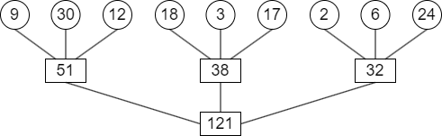

在上图中，各叶结点表示一个初始归并段，上面的权值表示该归并段的长度，叶结点到根的路径长度表示其参加归并的趟数，各非叶结点代表归并成的新归并段，根结点表示最终生成的归并段。树的带权路径长度 WPL 为归并过程中的总读记录数，故 `I/O` 次数 = 2 x WPL = 484。

显然，归并方案不同，所得归并树亦不同，树的带权路径长度（`I/O` 次数）亦不同。为了优化归并树的 WPL，可以将哈夫曼树的思想推广到 `m` 叉树的情形，在归并树中，让记录数少的初始归并段最先归并，记录数多的初始归并段最晚归并，就可以建立总的 `I/O` 次数最少的最佳归并树。上述 `9` 个初始归并段可构造成一棵如下图所示的归并树，按此树进行归并，仅需对外存进行 `446` 次读/写，这棵归并树便称为 **最佳归并树。**

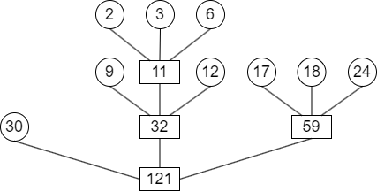

上图中的哈夫曼树是一棵严格 `3` 叉树，即树中只有度为 `3` 或 `0` 的结点。若只有 `8` 个初始归并段，如上例中少了一个长度为 `30` 的归并段。若在设计归并方案时，缺额的归并段留在最后，即除最后一次做 2 路归并外，其他各次归并仍是 3 路归并，此归并方案的外存读/写次数为 `386`。显然，这不是最佳方案。

正确的做法是：若初始归并段不足以构成一棵严格 $k$ 叉树时，需添加长度为 `0` 的 “虚段”，按照哈夫曼树的原则，权为 `0` 的叶子应离树根最远。因此，最佳归并树应如下图所示。

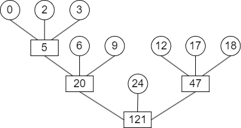

如何判定添加虚段的数目。设度为 `0` 的结点有 $n_{0}$（= n）个，度为 $k$ 的结点有 $n_{k}$ 个，则对严格 $k$ 叉树有 $n_{0} = (k - 1)n_{k} + 1$，由此可得 $n_{k} = (n_{0} - 1) / (k - 1)$。

- 若 $(n_{0} - 1) \% (k - 1) = 0$（% 为取余运算），则说明这 $n_{0}$ 个叶结点（初始归并段）正好可以构造 $k$ 叉归并树。此时，内结点有 $n_{k}$ 个
- 若 $(n_{0} - 1) \% (k - 1) = u \ne 0$，则说明对于这 $n_{0}$ 个叶结点，其中有 `u` 个多余，不能包含在 $k$ 叉归并树中。为构造包含所有 $n_{0}$ 个初始归并段的 $k$ 叉归并树，应在原有 $n_{k}$ 个内结点的基础上再增加 `1` 个内结点。它在归并树中代替了一个叶结点的位置，被代替的叶结点加上刚才多出的 `u` 个叶结点，即再加上 `k - u - 1` 个空归并段，就可以建立归并树

以上图为例，用 `8` 个归并段构成 3 叉树，$(n_{0} - 1) \% (k - 1) = (8 - 1) \% (3 - 1) = 1$，说明 `7` 个归并段刚好可以构成一棵严格 3 叉树（假设把以 `5` 为根的树视为一个叶子）。为此，将叶子 `5` 变成一个内结点，再添加 `3 - 1 - 1 = 1` 个空归并段，就可以构成一棵严格 3 叉树。
