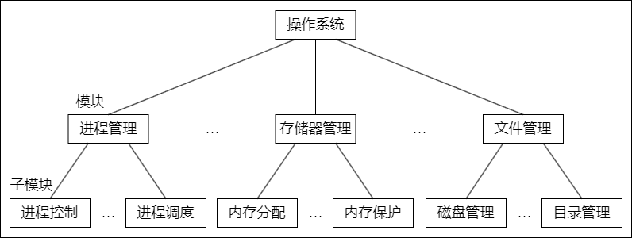
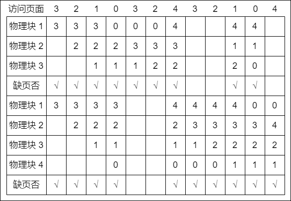
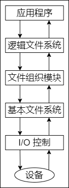
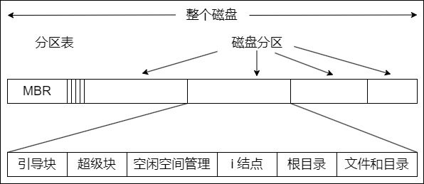
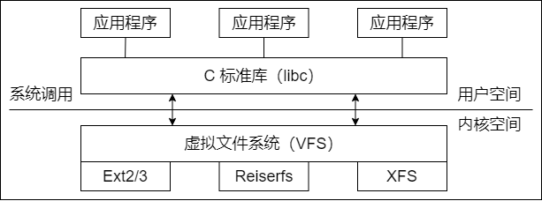
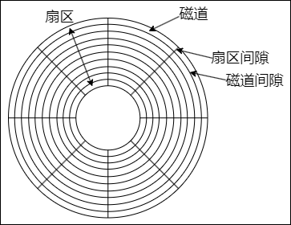
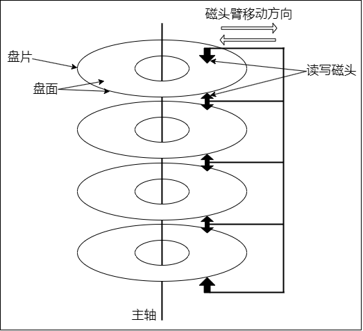
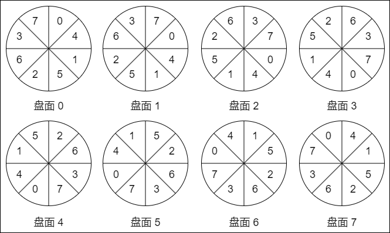
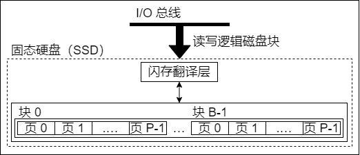

## 计算机系统概述

### 操作系统的基本概念

#### 操作系统的概念

在信息化时代，软件是计算机系统的灵魂，而作为软件核心的操作系统，已与现代计算机系统密不可分、融为一体。**计算机系统自下而上可大致分为四部分**：硬件、操作系统、应用程序和用户（这里的划分与 [计算机组成](./computer_organization.md/#计算机系统层次结构) 中的分层不同）。操作系统管理各种计算机硬件，为应用程序提供基础，并充当计算机硬件与用户之间的中介。

**硬件** 如：中央处理器、内存、输入/输出设备等，提供基本的计算资源。**应用程序** 如：字处理程序、电子制表软件、编译器、网络浏览器等，规定按何种方式使用这些资源来解决用户的计算问题。

操作系统控制和协调各用户的应用程序对硬件的分配与使用。在计算机系统的运行过程中，操作系统提供了正确使用这些资源的方法。

操作系统（Operating System，OS）是 **控制和管理整个计算机系统的硬件与软件资源，合理地组织、调度计算机的工作与资源的分配，进而为用户和其他软件提供方便接口与环境的程序集合** 。操作系统是计算机系统中最基本的系统软件。

#### 操作系统的特征

操作系统是一种系统软件。**操作系统的基本特征** 包括并发、共享、虚拟和异步。

1. **并发（Concurrence）**

    并发是指 **在同一时间间隔内发生两个或多个事件**。操作系统的 **并发性** 是指计算机系统中同时存在多个运行的程序，因此它具有处理和调度多个程序同时执行的能力。在操作系统中，引入进程的目的是使程序能并发执行。

    ::: tip 同一时间间隔（并发）和同一时刻（并行）的区别
    在多道程序环境下，一段时间内，宏观上有多道程序在同时执行，而在每个时刻，单处理机环境下实际仅能有一道程序执行，因此微观上这些程序仍是分时交替执行的。操作系统的并发性是通过分时得以实现的
    :::

    **并行性** 是指系统具有同时进行运算或操作的特性，在同一时刻能完成两种或两种以上的工作。并行性需要有相关硬件的支持，如：多流水线或多处理机硬件环境。

    **以现实生活中的例子来认识并发和并行的区别**。例如：如果您在 `9:00~9:10` 仅吃面包，在 `9:10~9:20` 仅写字，在 `9:20~9:30` 仅吃面包，在 `9:30~10:00` 仅写字，那么在 `9:00~10:00` 吃面包和写字这两种行为就是并发执行的；如果您在 `9:00~10:00` 右手写字，左手同时拿着面包吃，那么这两个动作就是并行执行的。

2. **共享（Sharing）**

    资源共享即共享，是指 **系统中的资源可供内存中多个并发执行的进程共同使用**。共享可分为以下 **两种资源共享方式：**

    - **互斥共享方式**

        系统中的某些资源，如：打印机、磁带机，虽然可供多个进程使用，但为使得所打印或记录的结果不致造成混淆，应规定在一段时间内只允许一个进程访问该资源。

        为此，当进程 `A` 访问某个资源时，必须先提出请求，若此时该资源空闲，则系统便将之分配给进程 `A` 使用，此后有其他进程也要访问该资源时（只要进程 `A` 未用完）就必须等待。仅当进程 `A` 访问完并释放该资源后，才允许另一个进程对该资源进行访问。这种资源共享方式称为 **互斥式共享**，而把在一段时间内只允许一个进程访问的资源称为 **临界资源**。计算机系统中的大多数物理设备及某些软件中所用的栈、变量和表格，都属于临界资源，它们都要求被互斥地共享。

    - **同时访问方式**

        系统中还有另一类资源，这类资源允许在一段时间内由多个进程 “同时” 访问。这里所说的 “同时” 通常是宏观上的，而在微观上，这些进程可能是交替地对该资源进行访问即 “分时共享” 的。可供多个进程 “同时” 访问的典型资源是磁盘设备，一些用重入码编写的文件也可被 “同时” 共享，即允许若干个用户同时访问该文件。

        **注意** 互斥共享要求一种资源在一段时间内（哪怕是一段很小的时间）只能满足一个请求，否则就会出现严重的问题（想象一下打印机第一行打印 `A` 文档的内容、第二行打印 `B` 文档的内容的效果）。而同时访问共享通常要求一个请求分几个时间片段间隔地完成，其效果与连续完成的效果相同。
        
    并发和共享是操作系统两个最基本的特征，**两者之间互为存在的条件**：
    
    - 资源共享是以程序的并发为条件的，若系统不允许程序并发执行，则自然不存在资源共享问题
    - 若系统不能对资源共享实施有效的管理，则必将影响到程序的并发执行，甚至根本无法并发执行

3. **虚拟（Virtual）**

    虚拟是指 **把一个物理上的实体变为若干逻辑上的对应物**。物理实体是实际存在的；而虚拟是用户感觉上的事物。用于实现虚拟的技术，称为 **虚拟技术**。操作系统中利用了多种虚拟技术来实现虚拟处理器、虚拟内存和虚拟外部设备等。

    虚拟处理器技术是通过多道程序设计技术，采用让多道程序并发执行的方法，来分时使用一个处理器的。此时，虽然只有一个处理器，但它能同时为多个用户服务，使每个终端用户都感觉有一个中央处理器（CPU）在专门为它服务。利用多道程序设计技术把一个物理上的 CPU 虚拟为多个逻辑上的 CPU，称为 **虚拟处理器。**
    
    采用虚拟存储器技术将一台机器的物理存储器变为虚拟存储器，以便从逻辑上扩充存储器的容量。当然，这时用户所感觉到的内存容量是虚的。把用户感觉到（但实际不存在）的存储器称为 **虚拟存储器。**

    还可采用虚拟设备技术将一台物理 `I/O` 设备虚拟为多台逻辑上的 `I/O` 设备，并允许每个用户占用一台逻辑上的 `I/O` 设备，使原来仅允许在一段时间内由一个用户访问的设备（即临界资源）变为在一段时间内允许多个用户同时访问的共享设备。

    因此，操作系统的虚拟技术可归纳为：**时分复用技术**，如：处理器的分时共享；**空分复用技术**，如：虚拟存储器。

4. **异步（Asynchronism）**

    多道程序环境允许多个程序并发执行，但由于资源有限，进程的执行并不是一贯到底的，而是走走停停的，它以不可预知的速度向前推进，这就是 **进程的异步性。**

    异步性使得操作系统运行在一种随机的环境下，可能导致进程产生与时间有关的错误（就像对全局变量的访问顺序不当会导致程序出错一样）。然而，只要运行环境相同，操作系统就须保证多次运行进程后都能获得相同的结果。

#### 操作系统的目标和功能

为了给多道程序提供良好的运行环境，操作系统应具有以下几方面的功能：**处理机管理**、**存储器管理**、**设备管理** 和 **文件管理**。为了方便用户使用操作系统，还必须向用户提供 **接口**。同时，操作系统可用来 **扩充机器**，以提供更方便的服务、更高的资源利用率。

用一个直观的例子来理解这种情况。例如：用户是雇主，操作系统是工人（用来操作机器），计算机是机器（由处理机、存储器、设备、文件几个部件构成），工人有熟练的技能，能够控制和协调各个部件的工作，这就是操作系统对计算机资源的管理；同时，工人必须接收雇主的命令，这就是 “接口”；有了工人，机器就能发挥更大的作用，因此工人就成了 “扩充机器”。

1. **作为计算机系统资源的管理者**

    - **处理机管理**

        在多道程序环境下，处理机的分配和运行都以进程（或线程）为基本单位，因而 **对处理机的管理可归结为对进程的管理**。并发是指在计算机内同时运行多个进程，因此进程何时创建、何时撤销、如何管理、如何避免冲突、合理共享就是进程管理的最主要的任务。**主要功能包括**：进程控制、进程同步、进程通信、死锁处理、处理机调度等。

    - **存储器管理**

        存储器管理是为了给多道程序的运行提供良好的环境，**方便用户使用及提高内存的利用率**。**主要功能包括**：内存分配与回收、地址映射、内存保护与共享和内存扩充等功能。

    - **文件管理**

        计算机中的信息都是以文件的形式存在的，操作系统中负责文件管理的部分称为文件系统。**主要功能包括**：文件存储空间的管理、目录管理及文件读写管理和保护等。

    - **设备管理**

        设备管理的主要任务是完成用户的 `I/O` 请求，方便用户使用各种设备，并提高设备的利用率。**主要功能包括**：缓冲管理、设备分配、设备处理和虚拟设备等功能。

    这些工作都由 “工人” 负责，“雇主” 无须关注。

2. **作为用户与计算机硬件系统之间的接口**

    为了让用户方便、快捷、可靠地操纵计算机硬件并运行自己的程序，操作系统还提供了用户接口。操作系统提供的接口主要分为两类：一类是 **命令接口**，用户利用这些操作命令来组织和控制作业的执行；另一类是 **程序接口**，编程人员可以使用它们来请求操作系统服务。

    - **命令接口**

        使用命令接口进行作业控制的主要方式有两种，即 **联机控制方式** 和 **脱机控制方式**。按作业控制方式的不同，可将命令接口分为联机命令接口和脱机命令接口。
        
        **联机命令接口**：又称交互式命令接口，适用于分时或实时系统的接口。它由一组键盘操作命令组成。用户通过控制台或终端输入操作命令，向系统提出各种服务要求。用户每输入一条命令，控制权就转给操作系统的命令解释程序，然后由命令解释程序解释并执行输入的命令，完成指定的功能。之后，控制权转回控制台或终端，此时用户又可输入下一条命令。联机命令接口可以这样理解：“雇主” 说一句话，“工人” 做一件事，并做出反馈，这就强调了交互性。

        **脱机命令接口**：又称批处理命令接口，适用于批处理系统，它由一组作业控制命令组成。脱机用户不能直接干预作业的运行，而应事先用相应的作业控制命令写成一份作业操作说明书，连同作业一起提交给系统。系统调度到该作业时，由系统中的命令解释程序逐条解释执行作业说明书上的命令，从而间接地控制作业的运行。脱机命令接口可以这样理解：“雇主” 把要 “工人” 做的事写在清单上，“工人” 按照清单命令逐条完成这些事，这就是批处理。

    - **程序接口**

        程序接口由一组系统调用（也称广义指令）组成。用户通过在程序中使用这些系统调用来请求操作系统为其提供服务，如：使用各种外部设备、申请分配和回收内存及其他各种要求。
        
        当前最为流行的是图形用户界面（GUI），即图形接口。GUI 最终是通过调用程序接口实现的，用户通过鼠标和键盘在图形界面上单击或使用快捷键，就能很方便地使用操作系统。严格来说，图形接口不是操作系统的一部分，但图形接口所调用的系统调用命令是操作系统的一部分。

3. **对计算机资源的扩充**

    没有任何软件支持的计算机称为 **裸机**，它仅构成计算机系统的物质基础，而实际呈现在用户面前的计算机系统是经过若干层软件改造的计算机。裸机在最里层，其外面是操作系统。操作系统所提供的资源管理功能和方便用户的各种服务功能，将裸机改造成功能更强、使用更方便的机器；因此，通常把覆盖了软件的机器称为 **扩充机器或虚拟机。**

    “工人” 操作机器，机器就有更大的作用，于是 “工人” 便成了 “扩充机器”。

### 操作系统发展历程

#### 手工操作阶段（此阶段无操作系统）

用户在计算机上的所有工作都要人工干预，如：程序的装入、运行、结果的输出等。随着计算机硬件的发展，人机矛盾（速度和资源利用）越来越大，必须寻求新的解决办法。

手工操作阶段的 **缺点**：

- 用户独占全机，虽然不会出现因资源已被其他用户占用而等待的现象，但资源利用率低
- CPU 等待手工操作，CPU 的利用不充分

唯一的解决办法就是用高速的机器代替相对较慢的手工操作来对作业进行控制。

#### 批处理阶段（操作系统开始出现）

为了解决人机矛盾及 CPU 和 `I/O` 设备之间速度不匹配的矛盾，出现了 **批处理系统**。按发展历程又分为：单道批处理系统、多道批处理系统（多道程序设计技术出现以后）。

1. **单道批处理系统**

    系统对作业的处理是成批进行的，但内存中始终保持一道作业。单道批处理系统是在解决人机矛盾及 CPU 和 `I/O` 设备速率不匹配的矛盾中形成的。单道批处理系统的 **主要特征如下：**

    - **自动性**：在顺利的情况下，磁带上的一批作业能自动地逐个运行，而无须人工干预
    - **顺序性**：磁带上的各道作业顺序地进入内存，各道作业的完成顺序与它们进入内存的顺序在正常情况下应完全相同，即先调入内存的作业先完成
    - **单道性**：内存中仅有一道程序运行，即监督程序每次从磁带上只调入一道程序进入内存运行，当该程序完成或发生异常情况时，才换入其后继程序进入内存运行

    此时面临的问题是：每次主机内存中仅存放一道作业，每当它在运行期间（注意这里是 “运行时” 而不是 “完成后”）发出输入/输出请求后，高速的 CPU 便处于等待低速的 `I/O` 完成的状态。为了进一步提高资源的利用率和系统的吞吐量，引入了多道程序技术。

2. **多道批处理系统**

    多道程序设计技术允许多个程序同时进入内存并允许它们在 CPU 中交替地运行，这些程序共享系统中的各种硬/软件资源。当一道程序因 `I/O` 请求而暂停运行时，CPU 便立即转去运行另一道程序。它不采用某些机制来提高某一技术方面的瓶颈问题，而让系统的各个组成部分都尽量去 “忙”，因此切换任务所花费的时间很少，可实现系统各部件之间的并行工作，使其整体在单位时间内的效率翻倍。

    **多道程序设计的特点：**

    - **多道**：计算机内存中同时存放多道相互独立的程序
    - **宏观上并行**：同时进入系统的多道程序都处于运行过程中，即它们先后开始各自的运行，但都未运行完毕
    - **微观上串行**：内存中的多道程序轮流占有 CPU，交替执行

    **多道程序设计技术解决的问题：**

    - 如何分配处理器
    - 多道程序的内存分配问题
    - `I/O` 设备如何分配
    - 如何组织和存放大量的程序和数据，以方便用户使用并保证其安全性与一致性

    在批处理系统中采用多道程序设计技术就形成了多道批处理操作系统。该系统把用户提交的作业成批地送入计算机内存，然后由作业调度程序自动地选择作业运行。

    **多道批处理系统优缺点：**

    - **优点**：资源利用率高，多道程序共享计算机资源，从而使各种资源得到充分利用；系统吞吐量大，CPU 和其它资源保持 “忙碌” 状态
    - **缺点**：用户响应的时间较长；不提供人机交互能力，用户既不能了解自己的程序的运行情况，又不能控制计算机

#### 分时操作系统

分时技术是指 **把处理器的运行时间分成很短的时间片，按时间片轮流把处理器分配给各联机作业使用**。若某个作业在分配给它的时间片内不能完成其计算，则该作业暂时停止运行，把处理器让给其他作业使用，等待下一轮再继续运行。由于计算机速度很快，作业运行轮转得也很快，因此给每个用户的感觉就像是自己独占一台计算机。

分时操作系统是指 **多个用户通过终端同时共享一台主机，这些终端连接在主机上，用户可以同时与主机进行交互操作而互不干扰**。因此，实现分时系统最关键的问题是如何使用户能与自己的作业进行交互，即当用户在自已的终端上键入命令时，系统应能及时接收并及时处理该命令，再将结果返回用户。分时系统也是支持多道程序设计的系统，但它不同于多道批处理系统。多道批处理是实现作业自动控制而无须人工干预的系统，而分时系统是实现人机交互的系统，这使得分时系统具有与批处理系统不同的特征。

**分时系统的主要特征如下：**

- **同时性**：也称多路性，允许多个终端用户同时使用一台计算机，终端上的这些用户可以同时或基本同时使用计算机
- **交互性**：用户通过终端采用人机对话的方式直接控制程序运行，与同程序进行交互
- **独立性**：系统中多个用户可以彼此独立地进行操作，互不干扰
- **及时性**：采用时间片轮转方式使一台计算机同时为多个终端服务，使用户请求能在很短时间内获得响应

虽然分时操作系统较好地解决了人机交互问题，但在一些应用场合，需要系统能对外部的信息在规定的时间（比时间片的时间还短）内做出处理（比如：飞机订票系统或导弹制导系统），因此，实时操作系统应运而生。

#### 实时操作系统

能够在某个时间限制内完成某些紧急任务而不需要时间片排队。这里的 **时间限制可以分为两种情况：**

- **硬实时系统**：某个动作必须绝对地在规定的时刻（或规定的时间范围）发生，如：飞行器的飞行自动控制系统，这类系统必须提供绝对保证，让某个特定的动作在规定的时间内完成
- **软实时系统**：能够接受偶尔违反时间规定且不会引起任何永久性的损害，如:飞机订票系统、银行管理系统

在实时操作系统的控制下，计算机系统接收到外部信号后及时进行处理，并在严格的时限内处理完接收的事件。**实时操作系统的主要特点** 是及时性和可靠性。

#### 网络操作系统和分布式计算机系统

**网络操作系统** 把计算机网络中的各台计算机有机地结合起来，提供一种统一、经济而有效的使用各台计算机的方法，实现各台计算机之间数据的互相传送。**网络操作系统最主要的特点** 是网络中各种资源的共享及各台计算机之间的通信。

**分布式计算机系统** 是由多台计算机组成并满足下列条件的系统：

- 系统中任意两台计算机通过通信方式交换信息
- 系统中的每台计算机都具有同等的地位，即没有主机也没有从机
- 每台计算机上的资源为所有用户共享
- 系统中的任意台计算机都可以构成一个子系统，并且还能重构
- 任何工作都可以分布在几台计算机上，由它们并行工作、协同完成

用于管理分布式计算机系统的操作系统称为 **分布式计算机系统**。**分布式计算机系统主要特点** 是分布性和并行性。分布式操作系统与网络操作系统的本质不同是分布式操作系统中的若干计算机相互协同完成同一任务。

#### 个人计算机操作系统

个人计算机操作系统是目前使用最广泛的操作系统，它广泛应用于文字处理、电子表格、游戏中，常见的有 `Windows`、`Linux` 和 `MacOS` 等。

**操作系统的发展历程**：

- **手工阶段**：独占计算机资源、资源利用率低
- **脱机处理**：减少了 CPU 的空闲时间，提高了 `I/O` 速度
- **早期批处理**：高效利用 CPU 的资源
- **多道批处理**：多道、宏观上并行、微观上串行
- **分时操作系统**：交互性强
- **实时操作系统**：及时性和可靠性强，交互性不如分时系统
- **网络操作系统**：服务于计算机网络，集中控制方式
- **分布式操作系统**：建立在网络操作系统上，控制功能均为分布式
- **个人计算机操作系统**：目前最广泛

此外还有 **嵌入式操作系统**、**服务器操作系统**、**智能手机操作系统** 等

### 操作系统运行环境

#### 处理器运行模式

在计算机系统中，通常 CPU 执行 **两种不同性质的程序**：一种是操作系统内核程序；另一种是用户自编程序（即系统外层的应用程序，或简称 “应用程序”）。对操作系统而言，这两种程序的作用不同，前者是后者的管理者，因此 “管理程序”（即内核程序）要执行一些特权指令，而 “被管理程序”（即用户自编程序）出于安全考虑不能执行这些指令。

- **特权指令**：是指不允许用户直接使用的指令，如：`I/O` 指令、置中断指令，存取用于内存保护的寄存器、送程序状态字到程序状态字寄存器等的指令
- **非特权指令**：是指允许用户直接使用的指令，它不能直接访问系统中的软硬件资源，仅限于访问用户的地址空间，这也是为了防止用户程序对系统造成破坏

在具体实现上，将 CPU 的运行模式划分为 **用户态（目态）** 和 **核心态（又称管态、内核态）**。可以理解为 CPU 内部有一个小开关，当小开关为 `0` 时，CPU 处于核心态，此时 CPU 可以执行特权指令，切换到用户态的指令也是特权指令。当小开关为 `1` 时，CPU 处于用户态，此时 CPU 只能执行非特权指令。应用程序运行在用户态，操作系统内核程序运行在核心态。应用程序向操作系统请求服务时通过使用访管指令，从而产生一个中断事件将操作系统转换为核心态。

在软件工程思想和结构化程序设计方法影响下诞生的现代操作系统，几乎都是分层式的结构。操作系统的各项功能分别被设置在不同的层次上。一些与硬件关联较紧密的模块，如：时钟管理、中断处理、设备驱动等处于最低层。其次是运行频率较高的程序，如：进程管理、存储器管理和设备管理等。这两部分内容构成了操作系统的内核。这部分内容的指令操作工作在核心态。

内核是计算机上配置的底层软件，它管理着系统的各种资源，可以看作是连接应用程序和硬件的一座桥梁，大多数操作系统的 **内核包括四方面的内容：**

1. **时钟管理**

    在计算机的各种部件中，时钟是最关键的设备。时钟的第一功能是计时，操作系统需要通过时钟管理，向用户提供标准的系统时间。另外，通过时钟中断的管理，可以实现进程的切换。例如：在分时操作系统中采用时间片轮转调度、在实时系统中按截止时间控制运行、在批处理系统中通过时钟管理来衡量一个作业的运行程度等。

2. **中断机制**

    引入中断技术的初衷是提高多道程序运行环境中 CPU 的利用率，而且主要是针对外部设备的。后来逐步得到发展，形成了多种类型，成为操作系统各项操作的基础。例如：键盘或鼠标信息的输入、进程的管理和调度、系统功能的调用、设备驱动、文件访问等，无不依赖于中断机制。可以说，现代操作系统是靠中断驱动的软件。

    中断机制中，只有一小部分功能属于内核，它们负责保护和恢复中断现场的信息，转移控制权到相关的处理程序。这样可以减少中断的处理时间，提高系统的并行处理能力。

3. **原语**

    按层次结构设计的操作系统，底层必然是一些可被调用的公用小程序，它们各自完成一个规定的操作。它们的特点如下：

    - 处于操作系统的最底层，是最接近硬件的部分
    - 运行具有原子性，其操作只能一气呵成（出于系统安全性和便于管理考虑）
    - 运行时间都较短，而且调用频繁

    通常把具有这些特点的程序称为 **原语（Atomic Operation）**。定义原语的直接方法是关闭中断，让其所有动作不可分割地完成后再打开中断。系统中的设备驱动、CPU 切换、进程通信等功能中的部分操作都可定义为原语，使它们成为内核的组成部分。

4. **系统控制的数据结构及处理**

    系统中用来登记状态信息的数据结构很多，如：作业控制块、进程控制块（PCB）、设备控制块、各类链表、消息队列、缓冲区、空闲区登记表、内存分配表等。为了实现有效的管理，系统需要一些基本的操作，**常见的操作有以下三种：**

    - **进程管理**：进程状态管理、进程调度和分派、创建与撤销进程控制块等
    - **存储器管理**：存储器的空间分配和回收、内存信息保护程序、代码对换程序等
    - **设备管理**：缓冲区管理、设备分配和回收等

从上述内容可以了解，核心态指令实际上包括系统调用类指令和一些针对时钟、中断和原语的操作指令。

#### 中断和异常的概念

在操作系统中引入核心态和用户态这两种工作状态后，就需要考虑这两种状态之间如何切换。**操作系统内核工作在核心态，而用户程序工作在用户态**。系统不允许用户程序实现核心态的功能，而它们又必须使用这些功能。因此，需要在核心态建立一些 “门”，以便实现从用户态进入核心态。

在实际操作系统中，CPU 运行上层程序时唯一能进入这些 “门” 的途径就是通过中断或异常。发生中断或异常时，运行用户态的 CPU 会立即进入核心态，这是通过硬件实现的（例如：用一个特殊寄存器的一位来表示 CPU 所处的工作状态，`0` 表示核心态，`1` 表示用户态。若要进入核心态，则只需将该位置 `0` 即可）。中断是操作系统中非常重要的一个概念，对一个运行在计算机上的实用操作系统而言，缺少了中断机制，将是不可想象的。原因是，操作系统的发展过程大体上就是一个想方设法不断提高资源利用率的过程，而提高资源利用率就需要在程序并未使用某种资源时，把它对那种资源的占有权释放，而这一行为就需要通过中断实现。

1. **中断和异常的定义**

    **中断（Interruption）**：也称外中断，是指来自 CPU 执行指令外部的事件，通常用于信息输入/输出，如：设备发出的 `I/O` 结束中断，表示设备输入/输出处理已经完成。时钟中断，表示一个固定的时间片已到，让处理机处理计时、启动定时运行的任务等。

    **异常（Exception）**：也称内中断，是指来自 CPU 执行指令内部的事件，如：程序的非法操作码、地址越界、运算溢出、虚存系统的缺页及专门的陷入指令等引起的事件。异常不能被屏蔽，一旦出现，就应立即处理。关于内中断和外中断的联系与区别如下所示：

    $$
    \text{中断}
    \begin{cases}
    \text{内部异常}
      \begin{cases}
        \begin{rcases}
        \text{故障（Fault）} \\
        \text{自陷（Trap）}
        \end{rcases}
        \text{软件中断} \\
      \text{终止（Abort）\hspace{0.25cm} 硬件中断}
      \end{cases} \\
    \text{外部中断（硬件）}
      \begin{cases}
      \text{可屏蔽中断 INTR} \\
      \text{不可屏蔽中断 NMI}
      \end{cases}
    \end{cases}
    $$

2. **中断和异常的分类**

    - **中断（外中断）**
        - **可屏蔽中断**：通过 INTR 线发出的中断请求，通过改变屏蔽字可以实现多重中断，从而使得中断处理更加灵活
        - **不可屏蔽中断**：通过 NMI 线发出的中断请求，通常是紧急的硬件故障，如：电源掉电等。此外，异常也是不能被屏蔽的

    - **异常（内中断）**
        - **故障（Fault）**：通常是由指令执行引起的异常，如：非法操作码、缺页故障、除数为 `0`、运算溢出等
        - **自陷（Trap）**：是一种事先安排的 “异常” 事件，用于在用户态下调用操作系统内核程序，如：条件陷阱指令
        - **终止（Abort）**：是出现了使得 CPU 无法继续执行的硬件故障，如：控制器出错、存储器校验错等

    故障异常和自陷异常属于软件中断（程序性异常），终止异常和外部中断属于硬件中断。

3. **中断和异常的处理过程**

    大致描述：当 CPU 在执行用户程序的第 `i` 条指令时检测到一个异常事件，或在执行第 `i` 条指令后发现一个中断请求信号，则 CPU 打断当前的用户程序，然后转到相应的中断或异常处理程序去执行。若中断或异常处理程序能够解决相应的问题，则在中断或异常处理程序的最后，CPU 通过执行中断或异常返回指令，回到被打断的用户程序的第 `i` 条指令或第 `i + 1` 条指令继续执行；若中断或异常处理程序发现是不可恢复的致命错误，则终止用户程序。通常情况下，对中断和异常的具体处理过程由操作系统（和驱动程序）完成。

#### 系统调用

系统调用是指 **用户在程序中调用操作系统所提供的一些子功能，系统调用可视为特殊的公共子程序**。系统中的各种共享资源都由操作系统统一掌管，因此在用户程序中，凡是与资源有关的操作（如：存储分配、进行 `I/O` 传输及管理文件等），都必须通过系统调用方式向操作系统提出服务请求，并由操作系统代为完成。通常，一个操作系统提供的系统调用命令有几十条乃至上百条之多。**这些系统调用按功能大致可分为如下几类：**

- **设备管理**：完成设备的请求或释放，以及设备启动等功能
- **文件管理**：完成文件的读、写、创建及删除等功能
- **进程控制**：完成进程的创建、撤销、阻塞及唤醒等功能
- **进程通信**：完成进程之间的消息传递或信号传递等功能
- **内存管理**：完成内存的分配、回收以及获取作业占用内存区大小及始址等功能

系统调用相关功能涉及系统资源管理、进程管理之类的操作，对整个系统的影响非常大，因此必定需要使用某些特权指令才能完成，所以 **系统调用的处理需要由操作系统内核程序负责完成，要运行在核心态**。用户程序可以执行陷入指令（又称访管指令或 trap 指令）来发起系统调用，请求操作系统提供服务。可以这么理解，用户程序执行 “陷入指令”，相当于把 CPU 的使用权主动交给操作系统内核程序（CPU 状态会从用户态进入核心态），之后操作系统内核程序再对系统调用请求做出相应处理。处理完成后，操作系统内核程序又会把 CPU 的使用权还给用户程序（CPU 状态会从核心态回到用户态）。这么设计的 **目的是**：用户程序不能直接执行对系统影响非常大的操作，必须通过系统调用的方式请求操作系统代为执行，以便保证系统的稳定性和安全性，防止用户程序随意更改或访问重要的系统资源，影响其他进程的运行。

这样，操作系统的运行环境就可以理解为：用户通过操作系统运行上层程序（如：系统提供的命令解释程序或用户自编程序），而这个上层程序的运行依赖于操作系统的底层管理程序提供服务支持，当需要管理程序服务时，系统则通过硬件中断机制进入核心态，运行管理程序；也可能是程序运行出现异常情况，被动地需要管理程序的服务，这时就通过异常处理来进入核心态。管理程序运行结束时，用户程序需要继续运行，此时通过相应的保存的程序现场退出中断处理程序或异常处理程序，返回断点处继续执行。

由用户态转向核心态的例子：

1. 用户程序要求操作系统的服务，即系统调用
2. 发生一次中断
3. 用户程序中产生了一个错误状态
4. 用户程序中企图执行一条特权指令
5. 从核心态转向用户态由一条指令实现，这条指令也是特权命令，一般是中断返回指令

::: tip
由用户态进入核心态，不仅状态需要切换，而且所用的堆栈也可能需要由用户堆栈切换为系统堆栈，但这个系统堆栈也是属于该进程的

若程序的运行由用户态转到核心态，则会用到访管指令，访管指令是在用户态使用的，所以它不可能是特权指令
:::

### 操作系统结构

随着操作系统功能的不断增多和代码规模的不断扩大，提供合理的结构，对于降低操作系统复杂度、提升操作系统安全与可靠性来说变得尤为重要。

1. **分层法**

    将操作系统分为若干层，最底层（层 0）为硬件，最高层（层 N）为用户接口，每层只能调用紧邻它的低层的功能和服务（单向依赖）。这种分层结构如下所示：

    

    **分层法的优点**：
    
    - **便于系统的调试和验证，简化了系统的设计和实现**：第 `1` 层可先调试而无须考虑系统的其他部分，因为它只使用了基本硬件。第 `1` 层调试完且验证正确之后，就可以调试第 `2` 层，如此向上。如果在调试某层时发现错误，那么错误应在这一层上，这是因为它的低层都调试好了
    - **易扩充和易维护**：在系统中增加、修改或替换一层中的模块或整层时，只要不改变相应层间的接口，就不会影响其他层

    **分层法的问题**：
    
    - **合理定义各层比较困难**：因为依赖关系固定后，往往就显得不够灵活
    - **效率较差**：操作系统每执行一个功能，通常要自上而下地穿越多层，各层之间都有相应的层间通信机制，这无疑增加了额外的开销，导致系统效率降低

2. **模块化**

    **将操作系统按功能划分为若干具有一定独立性的模块**。每个模块具有某方面的管理功能，并规定好各模块间的接口，使各模块之间能够通过接口进行通信。还可以进一步将各模块细分为若干具有一定功能的子模块，同样也规定好各子模块之间的接口。这种设计方法被称为 **模块-接口法**，下图为由模块、子模块等组成的模块化操作系统结构：

    

    在划分模块时，如果将模块划分得太小，虽然能降低模块本身的复杂性，但会使得模块之间的联系过多，造成系统比较混乱；如果模块划分得过大，又会增加模块内部的复杂性，显然应在两者间进行权衡。此外，在划分模块时，要充分考虑模块的独立性问题，因为模块独立性越高，各模块间的交互就越少，系统的结构也就越清晰。**衡量模块的独立性主要有两个标准：**

    - **内聚性**：模块内部各部分间联系的紧密程度。内聚性越高，模块独立性越好
    - **耦合度**：模块间相互联系和相互影响的程度。耦合度越低，模块独立性越好

    **模块化的优点**：
    
    - 提高了操作系统设计的正确性、可理解性和可维护性
    - 增强了操作系统的可适应性
    - 加速了操作系统的开发过程

    **模块化的缺点**：
    
    - 模块间的接口规定很难满足对接口的实际需求
    - 各模块设计者齐头并进，每个决定无法建立在上一个已验证的正确决定的基础上，因此无法找到一个可靠的决定顺序

3. **宏内核**

    从操作系统的内核架构来划分；可分为 **宏内核** 和 **微内核。**
    
    宏内核也称单内核或大内核，是指将系统的主要功能模块都作为三个紧密联系的整体运行在核心态，从而为用户程序提供高性能的系统服务。因为各管理模块之间共享信息，能有效利用相互之间的有效特性，所以具有无可比拟的性能优势。

    随着体系结构和应用需求的不断发展，需要操作系统提供的服务越来越复杂，操作系统的设计规模急剧增长，操作系统也面临着 “软件危机” 困境。就像一个人，越胖活动起来就越困难。所以就出现了微内核技术，就是将一些非核心的功能移到用户空间，这种设计带来的好处是方便扩展系统，所有新服务都可以在用户空间增加，内核基本不用去做改动。

    从操作系统的发展来看，宏内核获得了绝对的胜利，目前主流的操作系统，如：Windows、Android、iOS、macOS、Linux 等，都是基于宏内核的构架。但也应注意到，微内核和宏内核一直是同步发展的，目前主流的操作系统早已不是当年纯粹的宏内核构架了，而是广泛吸取微内核构架的优点而后揉合而成的混合内核。当今宏内核构架遇到了越来越多的困难和挑战，而微内核的优势似乎越来越明显，尤其是谷歌的 Fuchsia 和华为的鸿蒙 OS，都瞄准了微内核构架。

4. **微内核**

    - **微内核的基本概念**

        将内核中最基本的功能保留在内核，而将那些不需要在核心态执行的功能移到用户态执行，从而降低内核的设计复杂性。那些移出内核的操作系统代码根据分层的原则被划分成若干服务程序，它们的执行相互独立，交互则都借助于微内核进行通信。

        **微内核结构将操作系统划分为两大部分**：
        
        - **微内核**：是指精心设计的、能实现操作系统最基本核心功能的小型内核，通常包含：与硬件处理紧密相关的部分；一些较基本的功能；客户和服务器之间的通信
        - **多个服务器**：操作系统中的绝大部分功能都放在微内核外的一组服务器（进程）中实现，如：用于提供对进程（线程）进行管理的进程（线程）服务器、提供虚拟存储器管理功能的虚拟存储器服务器等，它们都是作为进程来实现的，运行在用户态，客户与服务器之间是借助微内核提供的消息传递机制来实现交互的

        在微内核结构中，为了实现高可靠性，只有微内核运行在内核态，其余模块都运行在用户态，一个模块中的错误只会使这个模块崩溃，而不会使整个系统崩溃。例如：文件服务代码运行时出了问题，宏内核因为文件服务是运行在内核态的，系统直接就崩溃了。而微内核的文件服务是运行在用户态的，只要把文件服务功能强行停止，然后重启，就可以继续使用，系统不会崩溃。

    - **微内核的基本功能**

        微内核结构通常利用 “机制与策略分离” 的原理来构造 OS 结构，将机制部分以及与硬件紧密相关的部分放入微内核。微内核通常具有如下功能：
        
        - **进程（线程）管理**：进程（线程）之间的通信功能是微内核 OS 最基本的功能，此外还有进程的切换、进程的调度，以及多处理机之间的同步等功能，都应放入微内核中。例如：为实现进程调度功能，需要在进程管理中设置一个或多个进程优先级队列，这部分属于调度功能的机制部分，应将它放入微内核中。而对用户进程如何分类，以及优先级的确认方式，则属于策略问题，可将它们放入微内核外的进程管理服务器中
        - **低级存储器管理**：在微内核中，只配置最基本的低级存储器管理机制，如：用于实现将逻辑地址变换为物理地址等的页表机制和地址变换机制，这一部分是依赖于硬件的，因此放入微内核。而实现虚拟存储器管理的策略，则包含应采取何种页面置换算法，采用何种内存分配与回收的策略，应将这部分放在微内核外的存储器管理服务器中
        - **中断和陷入处理**：微内核 OS 将与硬件紧密相关的一小部分放入微内核，此时微内核的主要功能是捕获所发生的中断和陷入事件，并进行中断响应处理，在识别中断或陷入的事件后，再发送给相关的服务器来处理，故中断和陷入处理也应放入微内核。

        微内核操作系统将进程管理、存储器管理以及 `I/O` 管理这些功能一分为二，属于机制的很小一部分放入微内核，而绝大部分放入微内核外的各种服务器实现，大多数服务器都要比微内核大。因此，在采用客户/服务器模式时，能把微内核做得很小。

    - **微内核的特点**

        **主要优点：**

        - **扩展性和灵活性**：许多功能从内核中分离出来，当要修改某些功能或增加新功能时，只需在相应的服务器中修改或新增功能，或再增加一个专用的服务器，而无须改动内核代码
        - **可靠性和安全性**
        - **可移植性**：与 CPU 和 `I/O` 硬件有关的代码均放在内核中，而其他各种服务器均与硬件平台无关，因而将操作系统移植到另一个平台上所需做的修改是比较小的
        - **分布式计算**：客户和服务器之间、服务器和服务器之间的通信采用消息传递机制，这就使得微内核系统能很好地支持分布式系统和网络系统

        微内核结构的 **主要问题** 是性能问题，因为需要频繁地在核心态和用户态之间进行切换，操作系统的执行开销偏大。为了改善运行效率，可以将那些频繁使用的系统服务移回内核，从而保证系统性能，但这又会使微内核的容量明显地增大。

        虽然宏内核在桌面操作系统中取得了绝对的胜利，但是微内核在实时、工业、航空及军事应用中特别流行，这些领域都是关键任务，需要有高度的可靠性。

5. **外核**

    不同于虚拟机克隆真实机器，另一种策略是对机器进行分区，给每个用户整个资源的一个子集。这样，某个虚拟机可能得到磁盘的 `0` 至 `1023` 盘块，而另一台虚拟机会得到磁盘的 `1024` 至 `2047` 盘块，等等。在底层中，一种称为 **外核（exokernel）** 的程序在内核态中运行。它的任务是为虚拟机分配资源，并检查使用这些资源的企图，以确保没有机器会使用他人的资源。每个用户层的虚拟机可以运行自已的操作系统，但限制只能使用已经申请并且获得分配的那部分资源。

    **外核机制的优点** 是减少了映射层。在其他的设计中，每个虚拟机都认为它有自己的磁盘，其盘块号从 `0` 到最大编号，这样虚拟机监控程序就必须维护一张表格以重映像磁盘地址（或其他资源），有了外核，这个重映射处理就不需要了。外核只需要记录已经分配给各个虚拟机的有关资源即可。这种方法还有一个优点，它将多道程序（在外核内）与用户操作系统代码（在用户空间内）加以分离，而且相应的负载并不重，因为外核所做的只是保持多个虚拟机彼此不发生冲突。

### 操作系统引导

操作系统（如：Windows、Linux 等）是一种程序，程序以数据的形式存放在硬盘中，而硬盘通常分为多个区，一台计算机中又有多个或多种外部存储设备。操作系统引导是指计算机利用 CPU 运行特定程序，通过程序识别硬盘，识别硬盘分区，识别硬盘分区上的操作系统，最后通过程序启动操作系统，一环扣一环地完成上述过程。

**常见操作系统的引导过程如下：**

1. **激活 CPU**：激活的 CPU 读取 ROM 中的 boot 程序，将指令寄存器置为 BIOS（基本输入/输出系统）的第一条指令，即开始执行 BIOS 的指令
2. **硬件自检**：启动 BIOS 程序后，先进行硬件自检，检查硬件是否出现故障。如有故障，主板会发出不同含义的蜂鸣，启动中止；如无故障，屏幕会显示 CPU、内存、硬盘等信息
3. **加载带有操作系统的硬盘**：硬件自检后，BIOS 开始读取 Boot Sequence（通过 CMOS 里保存的启动顺序，或者通过与用户交互的方式），把控制权交给启动顺序排在第一位的存储设备，然后 CPU 将该存储设备引导扇区的内容加载到内存中
4. **加载主引导记录 MBR**：硬盘以特定的标识符区分引导硬盘和非引导硬盘。如果发现一个存储设备不是可引导盘，就检查下一个存储设备。如无其他启动设备，就会死机。主引导记录 MBR 的作用是告诉 CPU 去硬盘的哪个主分区去找操作系统
5. **扫描硬盘分区表，并加载硬盘活动分区**：MBR 包含硬盘分区表，硬盘分区表以特定的标识符区分活动分区和非活动分区。主引导记录扫描硬盘分区表，进而识别含有操作系统的硬盘分区（活动分区）。找到硬盘活动分区后，开始加载硬盘活动分区，将控制权交给活动分区
6. **加载分区引导记录 PBR**：读取活动分区的第一个扇区，这个扇区称为分区引导记录（PBR），其作用是寻找并激活分区根目录下用于引导操作系统的程序（启动管理器）
7. **加载启动管理器**：分区引导记录搜索活动分区中的启动管理器，加载启动管理器
8. **加载操作系统**

### 虚拟机

**虚拟机是一台逻辑计算机**，是指利用特殊的虚拟化技术，通过隐藏特定计算平台的实际物理特性，为用户提供抽象的、统一的、模拟的计算环境。**有两类虚拟化方法：**

1. **第一类虚拟机管理程序（裸金属架构）**

    从技术上讲，第一类虚拟机管理程序就像一个操作系统，因为它是唯一一个运行在最高特权级的程序。它在裸机上运行并且具备多道程序功能。虚拟机管理程序向上层提供若干台虚拟机，这些虚拟机是裸机硬件的精确复制品。由于每台虚拟机都与裸机相同，所以在不同的虚拟机上可以运行任何不同的操作系统。

    虚拟机作为用户态的一个进程运行，不允许执行敏感指令。然而，虚拟机上的操作系统认为自已运行在内核态（实际上不是），称为 **虚拟内核态**。虚拟机中的用户进程认为自已运行在用户态（实际上确实是）。当虚拟机操作系统执行了一条 CPU 处于内核态才允许执行的指令时，会陷入虚拟机管理程序。在支持虚拟化的 CPU 上，虚拟机管理程序检查这条指令是由虚拟机中的操作系统执行的还是由用户程序执行的。如果是前者，虚拟机管理程序将安排这条指令功能的正确执行。否则，虚拟机管理程序将模拟真实硬件面对用户态执行敏感指令时的行为。
    
    在过去不支持虚拟化的 CPU 上，真实硬件不会直接执行虚拟机中的敏感指令，这些敏感指令被转为对虚拟机管理程序的调用，由虚拟机管理程序模拟这些指令的功能。

2. **第二类虚拟机管理程序（寄居架构）**

    是一个依赖于 Windows、Linux 等操作系统分配和调度资源的程序，像一个普通的进程。第二类虚拟机管理程序仍然伪装成具有 CPU 和各种设备的完整计算机。VMware Workstation 是首个 X86 平台上的第二类虚拟机管理程序。

    运行在第二类虚拟机管理程序上的操作系统都称为 **客户操作系统**。对于第二类虚拟机管理程序，运行在底层硬件上的操作系统称为 **宿主操作系统。**

    首次启动时，第二类虚拟机管理程序像一台刚启动的计算机那样运转，期望找到的驱动器可以是虚拟设备。然后将操作系统安装到虚拟磁盘上（其实只是宿主操作系统中的一个文件）。客户操作系统安装完成后，就能启动并运行。

    虚拟化在 Web 主机领域很流行。没有虚拟化，服务商只能提供共享托管（不能控制服务器的软件）和独占托管（成本较高）。当服务商提供租用虚拟机时，一台物理服务器就可以运行多个虚拟机，每个虚拟机看起来都是一台完整的服务器，客户可以在虚拟机上安装自己想用的操作系统和软件，但是只需支付较低的费用。这就是市面上常见的 “云” 主机。

## 进程与线程

### 进程与线程

#### 进程的概念和特征

在多道程序环境下，允许多个程序并发执行，此时它们将失去封闭性，并具有间断性及不可再现性的特征。为此引入了进程（Process）的概念，以便更好地描述和控制程序的并发执行，实现操作系统的并发性和共享性（最基本的两个特性）。

为了使参与并发执行的每个程序（含数据）都能独立地运行，必须为之配置一个专门的数据结构，称为 **进程控制块（Process Control Block，PCB）**。系统利用 PCB 来描述进程的基本情况和运行状态，进而控制和管理进程。由程序段、相关数据段和 PCB 三部分构成了 **进程实体**（又称进程映像）。所谓创建进程，实质上是创建进程实体中的 PCB；而撤销进程，实质上是撤销进程的 PCB。值得注意的是，进程映像是静态的，进程则是动态的。

::: tip
PCB 是进程存在的唯一标志
:::

从不同的角度，进程可以有不同的定义，**比较典型的定义有：**

- 进程是程序的一次执行过程
- 进程是一个程序及其数据在处理机上顺序执行时所发生的活动
- 进程是具有独立功能的程序在一个数据集合上运行的过程，它是系统进行资源分配和调度的一个独立单位

引入进程实体的概念后，可以把 **传统操作系统中的进程定义为**：进程是进程实体的运行过程，是系统进行资源分配和调度的一个独立单位。

系统资源是指处理机、存储器和其他设备服务于某个进程的 “时间”，例如：把处理机资源理解为处理机的时间片才是准确的。因为进程是这些资源分配和调度的独立单位，即 “时间片” 分配的独立单位，这就决定了进程一定是一个动态的、过程性的概念。

进程是由多道程序的并发执行而引出的，它和程序是两个截然不同的概念。**进程的基本特征** 是对比单个程序的顺序执行提出的，也是对进程管理提出的基本要求。

- **动态性**：进程是程序的一次执行，它有着创建、活动、暂停、终止等过程，具有一定的生命周期，是动态地产生、变化和消亡的。动态性是进程最基本的特征
- **并发性**：指多个进程实体同存于内存中，能在一段时间内同时运行。引入进程的目的就是使进程能和其他进程并发执行。并发性是进程的重要特征，也是操作系统的重要特征
- **独立性**：指进程实体是一个能独立运行、独立获得资源和独立接受调度的基本单位。凡未建立 PCB 的程序，都不能作为一个独立的单位参与运行
- **异步性**：由于进程的相互制约，使得进程按各自独立的、不可预知的速度向前推进。异步性会导致执行结果的不可再现性，为此在操作系统中必须配置相应的进程同步机制

#### 进程的状态与转换

进程在其生命周期内，由于系统中各进程之间的相互制约及系统的运行环境的变化，使得进程的状态也在不断地发生变化。**通常进程有以下五种状态，前三种是进程的基本状态：**

- **创建态**：进程正在被创建，尚未转到就绪态。**创建进程步骤**：首先申请一个空白 PCB，并向 PCB 中填写用于控制和管理进程的信息；然后为该进程分配运行时所必须的资源；最后把该进程转入就绪态并插入就绪队列。但是，如果进程所需的资源尚不能得到满足，如内存不足，则创建工作尚未完成，进程此时所处的状态称为 **创建态**
- **运行态**：进程正在处理机上运行。在单处理机中，每个时刻只有一个进程处于运行态
- **就绪态**：进程获得了除处理机外的一切所需资源，一旦得到处理机，便可立即运行。系统中处于就绪状态的进程可能有多个，通常将它们排成一个队列，称为 **就绪队列**
- **阻塞态**：又称等待态。进程正在等待某一事件而暂停运行，如：等待某资源为可用（不包括处理机）或等待输入/输出完成。即使处理机空闲，该进程也不能运行。系统通常将处于阻塞态的进程也排成一个队列，甚至根据阻塞原因的不同，设置多个 **阻塞队列**
- **终止态**：进程正从系统中消失，可能是进程正常结束或其他原因退出运行。进程需要结束运行时，系统首先将该进程置为终止态，然后进一步处理资源释放和回收等工作

**就绪态和阻塞（等待）态的区别**：就绪态是指进程仅缺少处理器，只要获得处理机资源就立即运行；而等待态是指进程需要其他资源（除了处理机）或等待某一事件。之所以把处理机和其他资源划分开，是因为在分时系统的时间片轮转机制中，每个进程分到的时间片是若干毫秒。也就是说，进程得到处理机的时间很短且非常频繁，进程在运行过程中实际上是频繁地转换到就绪态的；而其他资源（如：外设）的使用和分配或某一事件的发生（如：`I/O` 操作的完成）对应的时间相对来说很长，进程转换到等待态的次数也相对较少。

**就绪态、运行态和阻塞态之间的转换如下：**

- **就绪态→运行态**：处于就绪态的进程被调度后，获得处理机资源（分派处理机时间片），于是进程由就绪态转换为运行态
- **运行态→就绪态**：处于运行态的进程在时间片用完后，不得不让出处理机，从而进程由运行态转换为就绪态。此外，在可剥夺的操作系统中，当有更高优先级的进程就绪时，调度程序将正在执行的进程转换为就绪态，让更高优先级的进程执行
- **运行态→阻塞态**：进程请求某一资源（如：外设）的使用和分配或等待某一事件的发生（如：`I/O` 操作的完成）时，它就从运行态转换为阻塞态。进程以系统调用的形式请求操作系统提供服务，这是一种特殊的、由运行用户态程序调用操作系统内核过程的形式
- **阻塞态→就绪态**：进程等待的事件到来时，如：`I/O` 操作结束或中断结束时，中断处理程序必须把相应进程的状态由阻塞态转换为就绪态

::: tip
一个进程从运行态转换为阻塞态是主动行为，而从阻塞态转换为就绪态是被动行为，需要其他相关进程的协助
:::

#### 进程的组成

进程是一个独立的运行单位，也是操作系统进行资源分配和调度的基本单位。它由以下三部分组成，其中 **最核心的是进程控制块（PCB）。**

1. **进程控制块（PCB）**

    进程创建时，操作系统为它新建一个 PCB，该结构之后常驻内存，任意时刻都可以存取，并在进程结束时删除。PCB 是进程实体的一部分，是进程存在的唯一标志。

    进程执行时，系统通过其 PCB 了解进程的现行状态信息，以便操作系统对其进行控制和管理；进程结束时，系统收回其 PCB，该进程随之消亡。

    当操作系统欲调度某进程运行时，要从该进程的 PCB 中查出其现行状态及优先级；在调度到某进程后，要根据其 PCB 中所保存的处理机状态信息，设置该进程恢复运行的现场，并根据其 PCB 中的程序和数据的内存始址，找到其程序和数据；进程在运行过程中，当需要和与之合作的进程实现同步、通信或访问文件时，也需要访问 PCB；当进程由于某种原因而暂停运行时，又需将其断点的处理机环境保存在 PCB 中。可见，在进程的整个生命期中，系统总是通过 PCB 对进程进行控制的，即系统唯有通过进程的 PCB 才能感知到该进程的存在。

    下表是一个 PCB 的实例。**PCB 主要包括**：进程描述信息、进程控制和管理信息、资源分配清单和处理机相关信息等。**各部分的主要说明如下：**

    |  进程描述信息  |  进程控制和管理信息  |  资源分配清单  |  处理机相关信息  |
    |  :----:  |  :----:  |  :----:  |  :----:  |
    |  进程标识符（PID）  |  进程当前状态  |  代码段指针  |  通用寄存器值  |
    |  用户标识符（UID）  |  进程当前优先级  |  数据段指针  |  地址寄存器值  |
    |    |  代码运行入口地址  |  堆栈段指针  |  控制寄存器值  |
    |    |  程序的外存地址  |  文件描述符  |  标志寄存器值  |
    |    |  进入内存时间  |  键盘  |  状态字  |
    |    |  处理机占用时间  |  鼠标  |    |
    |    |  信号量使用  |    |    |

    - **进程描述信息**
        - **进程标识符（PID）**：标志各个进程，每个进程都有一个唯一的标识号
        - **用户标识符（UID）**：进程归属的用户，用户标识符主要为共享和保护服务
    
    - **进程控制和管理信息**
        - **进程当前状态**：描述进程的状态信息，作为处理机分配调度的依据
        - **进程优先级**：描述进程抢占处理机的优先级，优先级高的进程可优先获得处理机
    
    - **资源分配清单**：用于说明有关内存地址空间或虚拟地址空间的状况，所打开文件的列表和所使用的输入/输出设备信息
    - **处理机相关信息**：也称处理机的上下文，主要指处理机中各寄存器的值。当进程处于执行态时，处理机的许多信息都在寄存器中。当进程被切换时，处理机状态信息都必须保存在相应的 PCB 中，以便在该进程重新执行时，能从断点继续执行

    在一个系统中，通常存在着许多进程的 PCB，有的处于就绪态，有的处于阻塞态，而且阻塞的原因各不相同。为了方便进程的调度和管理，需要将各进程的 PCB 用适当的方法组织起来。目前，**常用的组织方式有：**

    - **链接方式**：将同状态的 PCB 链接成一个队列，不同状态对应不同的队列，也可把处于阻塞态的进程的 PCB，根据其阻塞原因的不同，排成多个阻塞队列
    - **索引方式**：将同一状态的进程组织在一个索引表中，索引表的表项指向相应的 PCB，不同状态对应不同的索引表，如：就绪索引表和阻塞索引表等

2. **程序段**

    程序段就是能被进程调度程序调度到 CPU 执行的程序代码段。注意，程序可被多个进程共享，即多个进程可以运行同一个程序。

3. **数据段**

    一个进程的数据段，可以是进程对应的程序加工处理的原始数据，也可以是程序执行时产生的中间或最终结果。

#### 进程控制

**进程控制的主要功能** 是对系统中的所有进程实施有效的管理，它具有创建新进程、撤销已有进程、实现进程状态转换等功能。在操作系统中，一般 **把进程控制用的程序段称为原语**，原语的特点是执行期间不允许中断，它是一个不可分割的基本单位。

1. **进程的创建**

    允许一个进程创建另一个进程，此时 **创建者称为父进程，被创建的进程称为子进程**。子进程可以继承父进程所拥有的资源。当子进程被撤销时，应将其从父进程那里获得的资源归还给父进程。此外，在撤销父进程时，通常也会同时撤销其所有的子进程。

    在操作系统中，终端用户登录系统、作业调度、系统提供服务、用户程序的应用请求等都会引起进程的创建。**创建一个新进程的过程如下（创建原语）：**

    - 为新进程分配一个唯一的进程标识号，并申请一个空白 PCB（PCB 是有限的）。若 PCB 申请失败，则创建失败
    - 为进程分配其运行所需的资源，如：内存、文件、`I/O` 设备和 CPU 时间等（在 PCB 中体现）。这些资源或从操作系统获得，或仅从其父进程获得。如果资源不足（如：内存），则并不是创建失败，而是处于创建态，等待内存资源
    - 初始化 PCB，主要包括初始化标志信息、初始化处理机状态信息和初始化处理机控制信息，以及设置进程的优先级等
    - 若进程就绪队列能够接纳新进程，则将新进程插入就绪队列，等待被调度运行

2. **进程的终止**

    **引起进程终止的事件主要有**：

    - **正常结束**：表示进程的任务已完成并准备退出运行
    - **异常结束**：表示进程在运行时，发生了某种异常事件，使程序无法继续运行，如：存储区越界、非法指令、运行超时、算术运算错、I/O 故障等
    - **外界干预**：指进程应外界的请求而终止运行，如：操作员或操作系统干预、父进程请求和父进程终止

    **终止进程的过程如下（终止原语）：**

    - 根据被终止进程的标识符，检索出该进程的 PCB，从中读出该进程的状态
    - 若被终止进程处于运行状态，立即终止该进程的执行，将处理机资源分配给其他进程
    - 若该进程还有子孙进程，则应将其所有子孙进程终止
    - 将该进程所拥有的全部资源，或归还给其父进程，或归还给操作系统
    - 将该 PCB 从所在队列（链表）中删除

3. **进程的阻塞和唤醒**

    正在执行的进程，由于期待的某些事件未发生，如：请求系统资源失败、等待某种操作的完成、新数据尚未到达或无新任务可做等，进程便通过调用阻塞原语（Block），使自己由运行态变为阻塞态。可见，阻塞是进程自身的一种主动行为，因此只有处于运行态的进程（获得 CPU），才可能将其转为阻塞态。**阻塞原语的执行过程如下：**

    - 找到将要被阻塞进程的标识号对应的 PCB
    - 若该进程为运行态，则保护其现场，将其状态转为阻塞态，停止运行
    - 把该 PCB 插入相应事件的等待队列，将处理机资源调度给其他就绪进程

    当被阻塞进程所期待的事件出现时，如：它所期待的 `I/O` 操作已完成或其所期待的数据已到达，由有关进程（比如：释放该 `I/O` 设备的进程，或提供数据的进程）调用唤醒原语（Wakeup），将等待该事件的进程唤醒。**唤醒原语的执行过程如下：**

    - 在该事件的等待队列中找到相应进程的 PCB
    - 将其从等待队列中移出，并置其状态为就绪态
    - 把该 PCB 插入就绪队列，等待调度程序调度

    ::: tip
    Block 原语和 Wakeup 原语是一对作用刚好相反的原语，必须成对使用。如果在某进程中调用了 Block 原语，则必须在与之合作的或其他相关的进程中安排一条相应的 Wakeup 原语，以便唤醒阻塞进程；否则，阻塞进程将会因不能被唤醒而永久地处于阻塞状态
    :::

#### 进程的通信

进程通信是指进程之间的信息交换。PV 操作是低级通信方式，高级通信方式是指以较高的效率传输大量数据的通信方式。**高级通信方法主要有以下三类：**

1. **共享存储**

    在通信的进程之间存在一块可直接访问的共享空间，通过对这片共享空间进行写/读操作实现进程之间的信息交换。在对共享空间进行写/读操作时，需要使用同步互斥工具（如：P 操作、V 操作）对共享空间的写/读进行控制。**共享存储又分为两种：**
    
    - **低级方式的共享**：是基于数据结构的共享
    - **高级方式的共享**：是基于存储区的共享

    操作系统只负责为通信进程提供可共享使用的存储空间和同步互斥工具，而数据交换则由用户自已安排读/写指令完成。

    ::: tip
    进程空间一般都是独立的，进程运行期间一般不能访问其他进程的空间，想让两个进程共享空间，必须通过特殊的系统调用实现，而进程内的线程是自然共享进程空间的
    :::

2. **消息传递**

    在消息传递系统中，进程间的数据交换以格式化的消息（Message）为单位。若通信的进程之间不存在可直接访问的共享空间，则必须利用操作系统提供的消息传递方法实现进程通信。进程通过系统提供的发送消息和接收消息两个原语进行数据交换。这种方式隐藏了通信实现细节，使通信过程对用户透明，简化了通信程序的设计，是当前应用最广泛的进程间通信机制。在微内核操作系统中，微内核与服务器之间的通信就采用了消息传递机制。由于该机制能很好地支持多处理机系统、分布式系统和计算机网络，因此也成为这些领域最主要的通信工具。

    **消息传递方式如下：**

    - **直接通信方式**：发送进程直接把消息发送给接收进程，并将它挂在接收进程的消息缓冲队列上，接收进程从消息缓冲队列中取得消息
    - **间接通信方式**：发送进程把消息发送到某个中间实体，接收进程从中间实体取得消息。这种中间实体一般称为信箱。该通信方式广泛应用于计算机网络中

3. **管道通信**

    管道通信允许两个进程按生产者-消费者方式进行通信，生产者向管道的一端写，消费者从管道的另一端读。数据在管道中是先进先出的。只要管道非空，读进程就能从管道中读出数据，若数据被读空，则读进程阻塞，直到写进程往管道中写入新的数据，再将读进程唤醒。只要管道不满，写进程就能往管道中写入数据，若管道写满，则写进程阻塞，直到读进程读出数据，再将写进程唤醒。为了协调双方的通信，管道机制必须提供三方面的协调能力：互斥、同步和确定对方的存在。

    在 Linux 中，管道是一种使用非常频繁的通信机制。从本质上说，管道也是一种文件，但它又和一般的文件有所不同，管道可以克服使用文件进行通信的两个问题，具体表现如下：

    - **限制管道的大小**：管道文件是一个固定大小的缓冲区，在 Linux 中该缓冲区的大小为 4KB，这使得它的大小不像普通文件那样不加检验地增长。使用单个固定缓冲区也会带来问题，比如：在写管道时可能变满，这种情况发生时，随后对管道的 `write()` 调用将默认地被阻塞，等待某些数据被读取，以便腾出足够的空间供 `write()` 调用写
    - **读进程可能比写进程快**：当所有管道内的数据已被读取时，管道变空。当这种情况发生时，一个随后的 `read()` 调用将默认地被阻塞，等待某些数据被写入，这解决了 `read()` 调用返回文件结束的问题

    管道只能由创建进程所访问，当父进程创建一个管道后，由于管道是一种特殊文件，子进程会继承父进程的打开文件，因此子进程也继承父进程的管道，并使用它来与父进程进进行通信。

    ::: tip
    从管道读数据是一次性操作，数据一旦被读取，就释放空间以便写更多数据。普通管道只允许单向通信，若要实现父子进程双向通信，则需要定义两个管道
    :::

#### 线程和多线程模型

1. **线程的基本概念**

    引入进程的目的是更好地使多道程序并发执行，提高资源利用率和系统吞吐量；而引入线程的目的则是 **减小程序在并发执行时所付出的时空开销，提高操作系统的并发性能。**

    线程最直接的理解就是 “轻量级进程”，它是一个基本的 CPU 执行单元，也是程序执行流的最小单元，由线程 ID、程序计数器、寄存器集合和堆栈组成。线程是进程中的一个实体，是被系统独立调度和分派的基本单位，线程自已不拥有系统资源，只拥有一点儿在运行中必不可少的资源，但它可与同属一个进程的其他线程共享进程所拥有的全部资源。一个线程可以创建和撤销另一个线程，同一进程中的多个线程之间可以并发执行。由于线程之间的相互制约，致使线程在运行中呈现出间断性。线程也有就绪、阻塞和运行三种基本状态。

    引入线程后，进程的内涵发生了改变，进程只作为除 CPU 外的系统资源的分配单元，而线程则作为处理机的分配单元。由于一个进程内部有多个线程，若线程的切换发生在同一个进程内部，则只需要很少的时空开销。

2. **线程与进程的比较**

    - **调度**：在传统的操作系统中，拥有资源和独立调度的基本单位都是进程，每次调度都要进行上下文切换，开销较大。在引入线程的操作系统中，线程是独立调度的基本单位，而线程切换的代价远低于进程。在同一进程中，线程的切换不会引起进程切换。但从一个进程中的线程切换到另一个进程中的线程时，会引起进程切换
    - **并发性**：在引入线程的操作系统中，不仅进程之间可以并发执行，而且一个进程中的多个线程之间亦可并发执行，甚至不同进程中的线程也能并发执行，从而使操作系统具有更好的并发性，提高了系统资源的利用率和系统的吞吐量
    - **拥有资源**：进程是系统中拥有资源的基本单位，而线程不拥有系统资源（仅有一点必不可少、能保证独立运行的资源），但线程可以访问其隶属进程的系统资源，这主要表现在属于同一进程的所有线程都具有相同的地址空间
    - **独立性**：每个进程都拥有独立的地址空间和资源，除了共享全局变量，不允许其他进程访问。某进程中的线程对其他进程不可见。同一进程中的不同线程是为了提高并发性及进行相互之间的合作而创建的，它们共享进程的地址空间和资源
    - **系统开销**：在创建或撤销进程时，系统都要为之分配或回收进程控制块 PCB 及其他资源，如：内存空间、`I/O` 设备等。操作系统为此所付出的开销，明显大于创建或撤销线程时的开销。类似地，在进程切换时涉及进程上下文的切换，而线程切换时只需保存和设置少量寄存器内容，开销很小。此外，由于同一进程内的多个线程共享进程的地址空间，因此这些线程之间的同步与通信非常容易实现，甚至无须操作系统的干预
    - **支持多处理机系统**：对于传统单线程进程，不管有多少处理机，进程只能运行在一个处理机上。对于多线程进程，可以将进程中的多个线程分配到多个处理机上执行

3. **线程的属性**

    多线程操作系统中的进程已不再是一个基本的执行实体，但它仍具有与执行相关的状态。所谓进程处于 “执行” 状态，实际上是指该进程中的某线程正在执行。**线程的主要属性如下：**

    - 线程是一个轻型实体，它不拥有系统资源，但每个线程都应有一个唯一的标识符和一个线程控制块，线程控制块记录了线程执行的寄存器和栈等现场状态
    - 不同的线程可以执行相同的程序，即同一个服务程序被不同的用户调用时，操作系统把它们创建成不同的线程
    - 同一进程中的各个线程共享该进程所拥有的资源
    - 线程是处理机的独立调度单位，多个线程是可以并发执行的。在单 CPU 的计算机系统中，各线程可交替地占用 CPU；在多 CPU 的计算机系统中，各线程可同时占用不同的 CPU，若各个 CPU 同时为一个进程内的各线程服务，则可缩短进程的处理时间
    - 一个线程被创建后，便开始了它的生命周期，直至终止。线程在生命周期内会经历阻塞态、就绪态和运行态等各种状态变化

    由于有了线程，线程切换时，有可能会发生进程切换，也有可能不发生进程切换，平均而言每次切换所需的开销就变小了，因此能够让更多的线程参与并发，而不会影响到响应时间等问题。

4. **线程的状态与转换**

    与进程一样，各线程之间也存在共享资源和相互合作的制约关系，致使线程在运行时也具有间断性。**线程在运行时也具有三种基本状态：**

    - **执行状态**：线程已获得处理机而正在运行
    - **就绪状态**：线程已具备各种执行条件，只需再获得 CPU 便可立即执行
    - **阻塞状态**：线程在执行中因某事件受阻而处于暂停状态

    线程这三种基本状态之间的转换和进程基本状态之间的转换是一样的。

5. **线程的组织与控制**

    - **线程控制块**

        系统为每个线程配置一个线程控制块（TCB），用于记录控制和管理线程的信息。**线程控制块通常包括：**

        - 线程标识符
        - 一组寄存器，包括程序计数器、状态寄存器和通用寄存器
        - 线程运行状态，用于描述线程正处于何种状态
        - 优先级
        - 线程专有存储区，线程切换时用于保存现场等
        - 堆栈指针，用于过程调用时保存局部变量及返回地址等

        同一进程中的所有线程都完全共享进程的地址空间和全局变量。各个线程都可以访问进程地址空间的每个单元，所以一个线程可以读、写或甚至清除另一个线程的堆栈。

    - **线程的创建**

        线程也是具有生命期的，它由创建而产生，由调度而执行，由终止而消亡。在操作系统中就有用于创建线程和终止线程的函数（或系统调用）。
        
        用户程序启动时，通常仅有一个称为 **初始化线程** 的线程正在执行，其主要功能是用于创建新线程。在创建新线程时，需要利用一个线程创建函数，并提供相应的参数，如：指向线程主程序的入口指针、堆栈的大小、线程优先级等。线程创建函数执行完后，将返回一个线程标识符。

    - **线程的终止**

        当一个线程完成自已的任务后，或线程在运行中出现异常而要被强制终止时，由终止线程调用相应的函数执行终止操作。但是有些线程（主要是系统线程）一旦被建立，便一直运行而不会被终止。通常，线程被终止后并不立即释放它所占有的资源，只有当进程中的其他线程执行了分离函数后，被终止线程才与资源分离，此时的资源才能被其他线程利用。

        被终止但尚未释放资源的线程仍可被其他线程调用，以使被终止线程重新恢复运行。

6. **线程的实现方式**

    线程的实现可以分为两类：**用户级线程**（User-Level Thread，ULT）和 **内核级线程**（Kernel-Level Thread，KLT）。内核级线程又称内核支持的线程。

    - **用户级线程（ULT）**

        有关线程管理（创建、撤销和切换等）的所有工作都由应用程序在用户空间中完成，内核意识不到线程的存在。应用程序可以通过使用线程库设计成多线程程序。通常，应用程序从单线程开始，在该线程中开始运行，在其运行的任何时刻，可以通过调用线程库中的派生例程创建一个在相同进程中运行的新线程。

        对于设置了用户级线程的系统，其调度仍是以进程为单位进行的，各个进程轮流执行一个时间片。假设进程 `A` 包含 `1` 个用户级线程，进程 `B` 包含 `100` 个用户级线程，这样，进程 `A` 中线程的运行时间将是进程 `B` 中各线程运行时间的 `100` 倍，因此对线程来说实质上是不公平的。）

        **优点：**
        
        - 线程切换不需要转换到内核空间，**节省模式切换的开销**
        - 调度算法可以是进程专用的，不同的进程可根据自身的需要，对自已的线程 **选择不同的调度算法**
        - **用户级线程的实现与操作系统平台无关**，对线程管理的代码是属于用户程序的一部分

        **缺点：**

        - 系统调用的阻塞问题，当 **线程执行一个系统调用时，不仅该线程被阻塞**，而且 **进程内的所有线程都被阻塞**
        - **不能发挥多处理机的优势**，内核每次分配给一个进程的仅有一个 CPU，因此进程中仅有一个线程能执行

    - **内核级线程（KLT）**

        在操作系统中，无论是系统进程还是用户进程，都是在操作系统内核的支持下运行的，与内核紧密相关。内核级线程同样也是在内核的支持下运行的，线程管理的所有工作也是在内核空间内实现的。内核空间也为每个内核级线程设置一个线程控制块，内核根据该控制块感知某线程的存在，并对其加以控制。

        **优点：**
        
        - **能发挥多处理机的优势**，内核能同时调度同一进程中的多个线程并行执行
        - 如果进程中的 **一个线程被阻塞，内核可以调度该进程中的其他线程占用处理机**，也可运行其他进程中的线程
        - 内核支持线程具有很小的数据结构和堆栈，**线程切换比较快、开销小**
        - 内核本身也可采用多线程技术，可以 **提高系统的执行速度和效率**

        **缺点**：同一进程中的线程切换，需要从用户态转到核心态进行，系统开销较大。这是因为用户进程的线程在用户态运行，而线程调度和管理是在内核实现的。

    - **组合方式**

        有些系统使用组合方式的多线程实现。在组合实现方式中，内核支持多个内核级线程的建立、调度和管理，同时允许用户程序建立、调度和管理用户级线程。一些内核级线程对应多个用户级线程，这是用户级线程通过时分多路复用内核级线程实现的。同一进程中的多个线程可以同时在多处理机上并行执行，且在阻塞一个线程时不需要将整个进程阻塞，所以组合方式能结合 KLT 和 ULT 的优点，并且克服各自的不足。

        通过线程库来创建和管理线程。**线程库**（thread library）是为程序员提供创建和管理线程的 API。实现线程库主要的方法有如下两种：

        - 在用户空间中提供一个没有内核支持的库。这种库的所有代码和数据结构都位于用户空间中。这意味着，调用库内的一个函数只导致用户空间中的一个本地函数的调用
        - 实现由操作系统直接支持的内核级的一个库。对于这种情况，库内的代码和数据结构位于内核空间。调用库中的一个 API 函数通常会导致对内核的系统调用

7. **多线程模型**

    有些系统同时支持用户线程和内核线程，由于用户级线程和内核级线程连接方式的不同，从而形成了下面三种不同的多线程模型。

    - **多对一模型**

        将多个用户级线程映射到一个内核级线程。这些用户线程一般属于一个进程，线程的调度和管理在用户空间完成。仅当用户线程需要访问内核时，才将其映射到一个内核级线程上，每次只允许一个线程进行映射。

        **优点**：线程管理是在用户空间进行的，因而效率比较高

        **缺点**：如果一个线程在访问内核时发生阻塞，则整个进程都会被阻塞；在任何时刻，只有一个线程能够访问内核，多个线程不能同时在多个处理机上运行

    - **一对一模型**

        将每个用户级线程映射到一个内核级线程。

        **优点**：当一个线程被阻塞后，允许调度另一个线程运行，所以并发能力较强

        **缺点**：每创建一个用户线程，相应地就需要创建一个内核线程，开销较大

    - **多对多模型**

        将 `n` 个用户线程映射到 `m` 个内核级线程上，要求 `n ≥ m`。

        **特点**：既克服了多对一模型并发度不高的缺点，又克服了一对一模型的一个用户进程占用太多内核级线程而开销太大的缺点。此外，还拥有上述两种模型各自的优点。

### 处理机调度

#### 调度的概念

1. **调度的基本概念**

    在多道程序系统中，进程的数量往往多于处理机的个数，因此进程争用处理机的情况在所难免。**处理机调度是对处理机进行分配**，即从就绪队列中按照一定的算法（公平、高效的原则）选择一个进程并将处理机分配给它运行，以实现进程并发地执行。

    处理机调度是多道程序操作系统的基础，是操作系统设计的核心问题。

2. **调度的层次**

    一个作业从提交开始直到完成，往往要经历以下三级调度：

    - **高级调度（作业调度）**

        按照一定的原则从外存上处于后备队列的作业中挑选一个（或多个），给它（们）分配内存、输入/输出设备等必要的资源，并建立相应的进程，以使它（们）获得竞争处理机的权利。**作业调度就是内存与辅存之间的调度。每个作业只调入一次、调出一次。**

        多道批处理系统中大多配有作业调度，而其他系统中通常不需要配置作业调度。

    - **中级调度（内存调度）**

        引入中级调度的目的是提高内存利用率和系统吞吐量。为此，将那些暂时不能运行的进程调至外存等待，此时进程的状态称为挂起态。当它们已具备运行条件且内存又稍有空闲时，由中级调度来决定把外存上的那些已具备运行条件的就绪进程再重新调入内存，并修改其状态为就绪态，挂在就绪队列上等待。**中级调度实际上是存储器管理中的对换功能。**

    - **低级调度（进程调度）**

        按照某种算法从就绪队列中选取一个进程，将处理机分配给它。进程调度是最基本的一种调度，在各种操作系统中都必须配置这级调度。进程调度的频率很高，一般几十毫秒一次。

3. **三级调度的联系**

    作业调度从外存的后备队列中选择一批作业进入内存，为它们建立进程，这些进程被送入就绪队列，进程调度从就绪队列中选出一个进程，并把其状态改为运行态，把 CPU 分配给它。中级调度是为了提高内存的利用率，系统将那些暂时不能运行的进程挂起来。

    - 作业调度为进程活动做准备，进程调度使进程正常活动起来
    - 中级调度将暂时不能运行的进程挂起，中级调度处于作业调度和进程调度之间
    - 作业调度次数少，中级调度次数略多，进程调度频率最高
    - 进程调度是最基本的，不可或缺

#### 调度的目标

不同的调度算法具有不同的特性，在选择调度算法时，必须考虑算法的特性。为了比较处理机调度算法的性能，人们提出了很多评价标准，下面介绍其中主要的几种：

1. **CPU 利用率**

    CPU 是计算机系统中最重要和昂贵的资源之一，所以应尽可能使 CPU 保持 “忙” 状态，使这一资源利用率最高。**CPU 利用率的计算方法如下：**

    $CPU \text{的利用率} = \dfrac{CPU \text{有效工作时间}} {CPU \text{有效工作时间} + CPU \text{空闲等待时间}}$

2. **系统吞吐量**

    表示单位时间内 CPU 完成作业的数量。长作业需要消耗较长的处理机时间，因此会降低系统的吞吐量。而对于短作业，需要消耗的处理机时间较短，因此能提高系统的吞吐量。调度算法和方式的不同，也会对系统的吞吐量产生较大的影响。

3. **周转时间**

    指从作业提交到作业完成所经历的时间，是作业等待、在就绪队列中排队、在处理机上运行及输入/输出操作所花费时间的总和。周转时间的计算方法如下：

    $\text{周转时间} = \text{作业完成时间} - \text{作业提交时间}$

    平均周转时间是指多个作业周转时间的平均值：

    $\text{平均周转时间} = (\text{作业 1 的周转时间} + ... + \text{作业 n 的周转时间}) / n$

    带权周转时间是指作业周转时间与作业实际运行时间的比值：

    $\text{带权周转时间} = \dfrac{\text{作业周转时间}} {\text{作业实际运行时间}}$

    平均带权周转时间是指多个作业带权周转时间的平均值：

    $\text{平均带权周转时间} = ($\text{作业 1 的带权周转时间} + ... + $\text{作业 n 的带权周转时间}) / n$

4. **等待时间**

    指进程处于等处理机的时间之和，等待时间越长，用户满意度越低。处理机调度算法实际上并不影响作业执行或输入/输出操作的时间，只影响作业在就绪队列中等待所花的时间。因此，衡量一个调度算法的优劣，常常只需简单地考察等待时间。

5. **响应时间**

    指从用户提交请求到系统首次产生响应所用的时间。在交互式系统中，周转时间不是最好的评价准则，一般采用响应时间作为衡量调度算法的重要准则之一。从用户角度来看，调度策略应尽量降低响应时间，使响应时间处在用户能接受的范围之内。

要想得到一个满足所有用户和系统要求的算法几乎是不可能的。设计调度程序，一方面要满足特定系统用户的要求（如：某些实时和交互进程的快速响应要求），另一方面要考虑系统整体效率（如：减少整个系统的进程平均周转时间），同时还要考虑调度算法的开销。

#### 调度的实现

1. **调度程序（调度器）**

    用于调度和分派 CPU 的组件称为调度程序，它通常由三部分组成：

    - **排队器**：将系统中的所有就绪进程按照一定的策略排成一个或多个队列，以便于调度程序选择。每当有一个进程转变为就绪态时，排队器便将它插入到相应的就绪队列中
    - **分派器**：依据调度程序所选的进程，将其从就绪队列中取出，将 CPU 分配给新进程
    - **上下文切换器**：在对处理机进行切换时，会发生两对上下文的切换操作：第一对，将当前进程的上下文保存到其 PCB 中，再装入分派程序的上下文，以便分派程序运行；第二对，移出分派程序的上下文，将新选进程的 CPU 现场信息装入处理机的各个相应寄存器

    在上下文切换时，需要执行大量 `load` 和 `store` 指令，以保存寄存器的内容，因此会花费较多时间。现在已有硬件实现的方法来减少上下文切换时间。通常采用两组寄存器，其中一组供内核使用，一组供用户使用。这样，上下文切换时，只需改变指针，让其指向当前寄存器组即可。

2. **调度的时机、切换与过程**

    调度程序是操作系统内核程序。请求调度的事件发生后，才可能运行调度程序，调度了新的就绪进程后，才会进行进程切换。理论上这三件事情应该顺序执行，但在实际的操作系统内核程序运行中，若某时刻发生了引起进程调度的因素，则不一定能马上进行调度与切换。

    现代操作系统中，**不能进行进程的调度与切换的情况有以下几种：**

    - **在处理中断的过程中**：中断处理过程复杂，在实现上很难做到进程切换，而且中断处理是系统工作的一部分，逻辑上不属于某一进程，不应被剥夺处理机资源
    - **进程在操作系统内核临界区中**：进入临界区后，需要独占式地访问，理论上必须加锁，以防止其他并行进程进入，在解锁前不应切换到其他进程，以加快临界区的释放
    - **其他需要完全屏蔽中断的原子操作过程中**：如：加锁、解锁、中断现场保护、恢复等原子操作。在原子过程中，连中断都要屏蔽，更不应该进行进程调度与切换

    若在上述过程中发生了引起调度的条件，则不能马上进行调度和切换，应置系统的请求调度标志，直到上述过程结束后才进行相应的调度与切换。

    **应该进行进程调度与切换的情况如下：**

    - 发生引起调度条件且当前进程无法继续运行下去时，可以马上进行调度与切换。若操作系统只在这种情况下进行进程调度，则是非剥夺调度
    - 中断处理结束或自陷处理结束后，返回被中断进程的用户态程序执行现场前，若置上请求调度标志，即可马上进行进程调度与切换。若操作系统支持这种情况下的运行调度程序，则实现了剥夺方式的调度

    进程切换往往在调度完成后立刻发生，它要求保存原进程当前断点的现场信息，恢复被调度进程的现场信息。现场切换时，操作系统内核将原进程的现场信息推入当前进程的内核堆栈来保存它们，并更新堆栈指针。内核完成从新进程的内核栈中装入新进程的现场信息、更新当前运行进程空间指针、重设 PC 寄存器等相关工作之后，开始运行新的进程。

3. **进程调度方式**

    所谓进程调度方式，是指当某个进程正在处理机上执行时，若有某个更为重要或紧迫的进程需要处理，即有优先权更高的进程进入就绪队列，此时应如何分配处理机。

    通常有以下两种进程调度方式：

    - **非抢占调度方式**

        又称非剥夺方式。是指当一个进程正在处理机上执行时，即使有某个更为重要或紧迫的进程进入就绪队列，仍然让正在执行的进程继续执行，直到该进程运行完成或发生某种事件而进入阻塞态时，才把处理机分配给其他进程。

        非抢占调度方式的优点是实现简单、系统开销小，适用于大多数的批处理系统，但它不能用于分时系统和大多数的实时系统。

    - **抢占调度方式**
    
        又称剥夺方式。是指当一个进程正在处理机上执行时，若有某个更为重要或紧迫的进程需要使用处理机，则允许调度程序根据某种原则去暂停正在执行的进程，将处理机分配给这个更为重要或紧迫的进程。

        抢占调度方式对提高系统吞吐率和响应效率都有明显的好处。但 “抢占” 不是一种任意性行为，必须遵循一定的原则，主要有优先权、短进程优先和时间片原则等。

4. **闲逛进程**

    在进程切换时，如果系统中没有就绪进程，就会调度闲逛进程（idle）运行，如果没有其他进程就绪，该进程就一直运行，并在执行过程中测试中断。闲逛进程的优先级最低，没有就绪进程时才会运行闲逛进程，只要有进程就绪，就会立即让出处理机。

    闲逛进程不需要 CPU 之外的资源，它不会被阻塞。

5. **两种线程的调度**

    - **用户级线程调度**：由于内核并不知道线程的存在，所以内核还是和以前一样，选择一个进程，并给予时间控制。由进程中的调度程序决定哪个线程运行
    - **内核级线程调度**：内核选择一个特定线程运行，通常不用考虑该线程属于哪个进程。对被选择的线程赋予一个时间片，如果超过了时间片，就会强制挂起该线程

    用户级线程的线程切换在同一进程中进行，仅需少量的机器指令；内核级线程的线程切换需要完整的上下文切换、修改内存映像、使高速缓存失效，这就导致了若干数量级的延迟。

#### 典型的调度算法

**常用的调度算法：**

1. **先来先服务（FCFS）调度算法**

    FCFS 调度算法是一种最简单的调度算法，它既可用于作业调度，又可用于进程调度。在作业调度中，算法每次从后备作业队列中选择最先进入该队列的一个或几个作业，将它们调入内存，分配必要的资源，创建进程并放入就绪队列。

    在进程调度中，FCFS 调度算法每次从就绪队列中选择最先进入该队列的进程，将处理机分配给它，使之投入运行，直到运行完成或因某种原因而阻塞时才释放处理机。

    下面通过一个实例来说明 FCFS 调度算法的性能。假设系统中有四个作业，它们的提交时间分别是 `8`、`8.4`、`8.8`、`9`，运行时间依次是 `2`、`1`、`0.5`、`0.2`，这组作业的平均等待时间、平均周转时间和平均带权周转时间见下表：

    |  作业号  |  提交时间  |  运行时间  |  开始时间  |  等待时间  |  完成时间  |  周转时间  |  带权周转时间  |
    |  :----:  |  :----:  |  :----:  |  :----:  |  :----:  |  :----:  |  :----:  |  :----:  |
    |  1  |  8  |  2  |  8  |  0  |  10  |  2  |  1  |
    |  2  |  8.4  |  1  |  10  |  1.6  |  11  |  2.6  |  2.6  |
    |  3  |  8.8  |  0.5  |  11  |  2.2  |  11.5  |  2.7  |  5.4  |
    |  4  |  9  |  0.2  |  11.5  |  2.5  |  11.7  |  2.7  |  13.5  |

    FCFS 调度算法属于不可剥夺算法。从表面上看，它对所有作业都是公平的，但若一个长作业先到达系统，就会使后面的许多短作业等待很长时间，因此它不能作为分时系统和实时系统的主要调度策略。但它常被结合在其他调度策略中使用。例如：在使用优先级作为调度策略的系统中，往往对多个具有相同优先级的进程按 FCFS 原则处理。

    **FCFS 调度算法的特点**：算法简单，但效率低；对长作业比较有利，但对短作业不利（相对 SJF 和高响应比）；有利于 CPU 繁忙型作业，而不利于 `I/O` 繁忙型作业。

2. **短作业优先（SJF）调度算法**

    短作业（进程）优先调度算法是指对短作业（进程）优先调度的算法。短作业优先（SJF）调度算法从后备队列中选择一个或若干估计运行时间最短的作业，将它们调入内存运行；短进程优先（SPF）调度算法从就绪队列中选择一个估计运行时间最短的进程，将处理机分配给它，使之立即执行，直到完成或发生某事件而阻塞时，才释放处理机。

    例如：考虑 FCFS 中给出的一组作业，若系统采用短作业优先调度算法，其平均等待时间、平均周转时间和平均带权周转时间见小表：

    |  作业号  |  提交时间  |  运行时间  |  开始时间  |  等待时间  |  完成时间  |  周转时间  |  带权周转时间  |
    |  :----:  |  :----:  |  :----:  |  :----:  |  :----:  |  :----:  |  :----:  |  :----:  |
    |  1  |  8  |  2  |  8  |  0  |  10  |  2  |  1  |
    |  2  |  8.4  |  1  |  10.7  |  2.3  |  11.7  |  3.3  |  3.3  |
    |  3  |  8.8  |  0.5  |  10.2  |  1.4  |  10.7  |  1.9  |  3.8  |
    |  4  |  9  |  0.2  |  10  |  1  |  10.2  |  1.2  |  6  |

    **SJF 调度算法的缺点：**

    - 该算法 **对长作业不利**，SJF 调度算法中长作业的周转时间会增加。更严重的是，若有一长作业进入系统的后备队列，由于调度程序总是优先调度那些（即使是后进来的）短作业，将导致长作业长期不被调度（“饥饿” 现象，注意区分 “死锁”，后者是系统环形等待，前者是调度策略问题）
    - 该算法完全 **未考虑作业的紧迫程度**，因而不能保证紧迫性作业会被及时处理
    - 由于作业的长短是根据用户所提供的估计执行时间而定的，而用户又可能会有意或无意地缩短其作业的估计运行时间，致使该算法 **不一定能真正做到短作业优先调度**

    注意，SJF 调度算法的平均等待时间、平均周转时间最少。

3. **优先级调度算法**

    优先级调度算法既可用于作业调度，又可用于进程调度。该算法中的优先级用于描述作业的紧迫程度。在作业调度中，优先级调度算法每次从后备作业队列中选择优先级最高的一个或几个作业，将它们调入内存，分配必要的资源，创建进程并放入就绪队列。在进程调度中，优先级调度算法每次从就绪队列中选择优先级最高的进程，将处理机分配给它，使之投入运行。

    根据新的更高优先级进程能否抢占正在执行的进程，可将该调度算法分为如下两种：

    - **非抢占式优先级调度算法**：当一个进程正在处理机上运行时，即使有某个优先级更高的进程进入就绪队列，仍让正在运行的进程继续运行，直到由于其自身的原因而让出处理机时（任务完成或等待事件），才把处理机分配给就绪队列中优先级最高的进程
    
    - **抢占式优先级调度算法**：当一个进程正在处理机上运行时，若有某个优先级更高的进程进入就绪队列，则立即暂停正在运行的进程，将处理机分配给优先级更高的进程

    而根据进程创建后其优先级是否可以改变，可以将进程优先级分为以下两种：

    - **静态优先级**：优先级是在创建进程时确定的，且在进程的整个运行期间保持不变。确定静态优先级的主要依据有进程类型、进程对资源的要求、用户要求
    - **动态优先级**：在进程运行过程中，根据进程情况的变化动态调整优先级。动态调整优先级的主要依据有进程占有 CPU 时间的长短、就绪进程等待 CPU 时间的长短

    一般来说，进程优先级的设置可以参照以下原则：

    - 系统进程 > 用户进程。系统进程作为系统的管理者，理应拥有更高的优先级
    - 交互型进程 > 非交互型进程（或前台进程后台进程）。大家平时在使用手机时，在前台运行的正在和你交互的进程应该更快速地响应你，因此自然需要被优先处理
    - `I/O` 型进程 > 计算型进程。所谓 `I/O` 型进程，是指那些会频繁使用 `I/O` 设备的进程，而计算型进程是那些频繁使用 CPU 的进程（很少使用 `I/O` 设备）。`I/O` 设备（如打印机）的处理速度要比 CPU 慢得多，因此若将 `I/O` 型进程的优先级设置得更高，就更有可能让 `I/O` 设备尽早开始工作，进而提升系统的整体效率

4. **高响应比优先调度算法**

    高响应比优先调度算法主要用于作业调度，是对 FCFS 调度算法和 SJF 调度算法的一种综合平衡，同时考虑了每个作业的等待时间和估计的运行时间。在每次进行作业调度时，先计算后备作业队列中每个作业的响应比，从中选出。响应比最高的作业投入运行

    响应比的变化规律可描述为：

    $\text{响应比} R_{p} = \dfrac{\text{等待时间} + \text{要求服务时间}} {\text{要求服务时间}}$

    根据公式可知：
    
    - 作业的等待时间相同时，要求服务时间越短，响应比越高，有利于短作业，因而类似于 SJF
    - 要求服务时间相同时，作业的响应比由其等待时间决定，等待时间越长，其响应比越高，因而类似于 FCFS
    - 对于长作业，作业的响应比可以随等待时间的增加而提高，当其等待时间足够长时，也可获得处理机，克服了 “饥饿” 现象

5. **时间片轮转调度算法**

    时间片轮转调度算法主要适用于分时系统。在这种算法中，系统将所有就绪进程按 FCFS 策略排成一个就绪队列，调度程序总是选择就绪队列中的第一个进程执行，但仅能运行一个时间片，如：`50ms`。在使用完一个时间片后，即使进程并未运行完成，它也必须释放出（被剥夺）处理机给下一个就绪进程，而被剥夺的进程返回到就绪队列的末尾重新排队，等候再次运行。

    在时间片轮转调度算法中，时间片的大小对系统性能的影响很大。若时间片足够大，以至于所有进程都能在一个时间片内执行完毕，则时间片轮转调度算法就退化为先来先服务调度算法。若时间片很小，则处理机将在进程间过于频繁地切换，使处理机的开销增大，而真正用于运行用户进程的时间将减少。因此，时间片的大小应选择适当，时间片的长短通常由以下因素确定：系统的响应时间、就绪队列中的进程数目和系统的处理能力。

6. **多级队列调度算法**

    前述的各种调度算法，由于系统中仅设置一个进程的就绪队列，即调度算法是固定且单一的，无法满足系统中不同用户对进程调度策略的不同要求。在多处理机系统中，这种单一调度策略实现机制的缺点更为突出，多级队列调度算法能在一定程度上弥补这一缺点。

    该算法在系统中设置多个就绪队列，将不同类型或性质的进程固定分配到不同的就绪队列。每个队列可实施不同的调度算法，因此，系统针对不同用户进程的需求，很容易提供多种调度策略。同一队列中的进程可以设置不同的优先级，不同的队列本身也可以设置不同的优先级。在多处理机系统中，可以很方便为每个处理机设置一个单独的就绪队列，每个处理机可实施各自不同的调度策略，这样就能根据用户需求将多个线程分配到一个或多个处理机上运行。

7. **多级反馈队列调度算法（融合了前几种算法的优点）**

    多级反馈队列调度算法是时间片轮转调度算法和优先级调度算法的综合与发展。通过动态调整进程优先级和时间片大小，多级反馈队列调度算法可以兼顾多方面的系统目标。

    例如：为提高系统吞吐量和缩短平均周转时间而照顾短进程；为获得较好的 `I/O` 设备利用率和缩短响应时间而照顾 `I/O` 型进程；同时，也不必事先估计进程的执行时间。

    **多级反馈队列的优势有以下几点：**

    - 终端型作业用户：短作业优先
    - 短批处理作业用户：周转时间较短
    - 长批处理作业用户：经过前面几个队列得到部分执行，不会长期得不到处理

下表总结了几种常见进程调度算法的特点。

|  特点  |  先来先服务  |  短作业优先  |  高响应比优先  |  时间片轮转  |  多级反馈队列  |
|  :----:  |  :----:  |  :----:  |  :----:  |  :----:  |  :----:  |
|  能否是可抢占  |  否  |  能  |  能  |  能  |  队列内算法不一定  |
|  能否是不可抢占  |  能  |  能  |  能  |  否  |  队列内算法不一定  |
|  优点  |  公平、实现简单  |  平均等待时间最少，效率最高  |  兼顾长短作业  |  兼顾长短作业  |  兼顾长短作业，有较好的响应时间，可行性强  |
|  缺点  |  不利于短作业  |  长作业会饥饿，估计时间不易确定  |  计算响应比的开销大  |  平均等待时间较长，上下文切换浪费时间  |  无  |
|  适用于  |  无  |  作业调度，批处理系统  |  无  |  分时系统  |  相当通用  |
|  默认决策模式  |  非抢占  |  非抢占  |  非抢占  |  抢占  |  抢占  |

#### 进程切换

对于通常的进程而言，其创建、撤销及要求由系统设备完成的 `I/O` 操作，都是利用系统调用而进入内核，再由内核中的相应处理程序予以完成的。进程切换同样是在内核的支持下实现的，因此可以说，任何进程都是在操作系统内核的支持下运行的，是与内核紧密相关的。

1. **上下文切换**

    切换 CPU 到另一个进程需要保存当前进程状态并恢复另一个进程的状态，这个任务称为上下文切换。上下文是指某一时刻 CPU 寄存器和程序计数器的内容。进行上下文切换时，内核会将旧进程状态保存在其 PCB 中，然后加载经调度而要执行的新进程的上下文。

    上下文切换实质上是指处理机从一个进程的运行转到另一个进程上运行，在这个过程中，进程的运行环境产生了实质性的变化。**上下文切换的流程如下：**

    - 挂起一个进程，保存 CPU 上下文，包括程序计数器和其他寄存器
    - 更新 PCB 信息
    - 把进程的 PCB 移入相应的队列，如：就绪、在某事件阻塞等队列
    - 选择另一个进程执行，并更新其 PCB
    - 跳转到新进程 PCB 中的程序计数器所指向的位置执行
    - 恢复处理机上下文

2. **上下文切换的消耗**

    上下文切换通常是计算密集型的，即它需要相当可观的 CPU 时间，在每秒几十上百次的切换中，每次切换都需要纳秒量级的时间，所以上下文切换对系统来说意味着消耗大量的 CPU 时间。有些处理器提供多个寄存器组，这样，上下文切换就只需要简单改变当前寄存器组的指针。

3. **上下文切换与模式切换**

    模式切换与上下文切换是不同的，模式切换时，CPU 逻辑上可能还在执行同一进程。用户进程最开始都运行在用户态，若进程因中断或异常进入核心态运行，执行完后又回到用户态刚被中断的进程运行。用户态和内核态之间的切换称为模式切换，而不是上下文切换，因为没有改变当前的进程。上下文切换只能发生在内核态，它是多任务操作系统中的一个必需的特性。

::: tip 调度和切换的区别
**调度** 是指决定资源分配给哪个进程的行为，是一种决策行为；**切换** 是指实际分配的行为，是执行行为。一般来说，先有资源的调度，然后才有进程的切换
:::

### 同步与互斥

#### 同步与互斥的基本概念

在多道程序环境下，进程是并发执行的，不同进程之间存在着不同的相互制约关系。为了协调进程之间的相互制约关系，引入了进程同步的概念。举一个简单的例子来理解这个概念。例如：让系统计算 `1 + 2 × 3`，假设系统产生两个进程：一个是加法进程，一个是乘法进程。要让计算结果是正确的，一定要让加法进程发生在乘法进程之后，但实际上操作系统具有异步性，若不加以制约，加法进程发生在乘法进程之前是绝对有可能的，因此要制定一定的机制去约束加法进程，让它在乘法进程完成之后才发生。

1. **临界资源**

    虽然多个进程可以共享系统中的各种资源，但其中许多资源一次只能为一个进程所用，**将一次仅允许一个进程使用的资源称为临界资源**。许多物理设备都属于临界资源，如：打印机等。此外，还有许多变量、数据等都可以被若干进程共享，也属于临界资源。

    对临界资源的访问，必须互斥地进行，在每个进程中，**访问临界资源的那段代码称为临界区**。为了保证临界资源的正确使用，可把临界资源的访问过程分成四个部分：

    - **进入区**：为了进入临界区使用临界资源，在进入区要检查可否进入临界区，若能进入临界区，则应设置正在访问临界区的标志，以阻止其他进程同时进入临界区
    - **临界区**：进程中访问临界资源的那段代码，又称临界段
    - **退出区**：将正在访问临界区的标志清除
    - **剩余区**：代码中的其余部分

2. **同步**

    同步亦称直接制约关系，是指为完成某种任务而建立的两个或多个进程，这些进程因为需要在某些位置上协调它们的工作次序而等待、传递信息所产生的制约关系。进程间的直接制约关系源于它们之间的相互合作。

    例如：输入进程 `A` 通过单缓冲向进程 `B` 提供数据。当该缓冲区空时，进程 `B` 不能获得所需数据而阻塞，一旦进程 `A` 将数据送入缓冲区，进程 `B` 就被唤醒。反之，当缓冲区满时，进程 `A` 被阻塞，仅当进程 `B` 取走缓冲数据时，才唤醒进程 `A`。

3. **互斥**

    互斥也称间接制约关系。当一个进程进入临界区使用临界资源时，另一个进程必须等待，当占用临界资源的进程退出临界区后，另一进程才允许去访问此临界资源。

    例如：在仅有一台打印机的系统中，有两个进程 `A` 和进程 `B`，若进程 `A` 需要打印时，系统已将打印机分配给进程 `B`，则进程 `A` 必须阻塞。一旦进程 `B` 将打印机释放，系统便将进程 `A` 唤醒，并将其由阻塞态变为就绪态。

    为禁止两个进程同时进入临界区，同步机制应遵循以下准则：

    - **空闲让进**：临界区空闲时，可以允许一个请求进入临界区的进程立即进入临界区
    - **忙则等待**：当已有进程进入临界区时，其他试图进入临界区的进程必须等待
    - **有限等待**：对请求访问的进程，应保证能在有限时间内进入临界区
    - **让权等待**：当进程不能进入临界区时，应立即释放处理器，防止进程忙等待

#### 实现临界区互斥的基本方法

1. **软件实现方法**

    在进入区设置并检查一些标志来标明是否有进程在临界区中，若已有进程在临界区，则在进入区通过循环检查进行等待，进程离开临界区后则在退出区修改标志。

    - **算法一：单标志法**

        该算法设置一个公用整型变量 `turn`，用于指示被允许进入临界区的进程编号，即若 `turn = 0`，则允许 P~0~ 进程进入临界区。该算法可确保每次只允许一个进程进入临界区。但两个进程必须交替进入临界区，若某个进程不再进入临界区，则另一个进程也将无法进入临界区（违背 “空闲让进”）。这样很容易造成资源利用不充分。

        若 P~0~ 顺利进入临界区并从临界区离开，则此时临界区是空闲的，但 P~1~ 并没有进入临界区的打算，`turn = 1` 一直成立，P~0~ 就无法再次进入临界区（一直被 `while` 死循环困住）。

    - **算法二：双标志法先检查**

        该算法的基本思想是在每个进程访问临界区资源之前，先查看临界资源是否正被访问，若正被访问，该进程需等待；否则，进程才进入自己的临界区。为此，设置一个布尔型数组 `flag[]`，如第 `i` 个元素 `flag[i]` 为 `FALSE`，表示 P~i~ 进程未进入临界区，如为 `TRUE`，表示 P~i~ 进程进入临界区。

        **优点**：不用交替进入，可连续使用；**缺点**：两个进程可能同时进入临界区（违背 “忙则等待”）。即在检查对方的 `flag` 后和切换自已的 `flag` 前有一段时间，结果都检查通过。这里的问题出在检查和修改操作不能一次进行。

    - **算法三：双标志法后检查**

        算法二先检测对方的进程状态标志，再置自己的标志，由于在检测和放置中可插入另一个进程到达时的检测操作，会造成两个进程在分别检测后同时进入临界区。为此，算法三先将自已的标志设置为 `TRUE`，再检测对方的状态标志，若对方标志为 `TRUE`，则进程等待；否则进入临界区。

        两个进程几乎同时都想进入临界区时，它们分别将自己的标志值 `flag` 设置为 `TRUE`，并且同时检测对方的状态（执行 `while` 语句），发现对方也要进入临界区时，双方互相谦让，结果谁也进不了临界区，从而导致 “饥饿” 现象。

    - **算法四：Peterson's Algorithm**

        为了防止两个进程为进入临界区而无限期等待，又设置了变量 `turn`，每个进程在先设置自己的标志后再设置 `turn` 标志。这时，再同时检测另一个进程状态标志和允许进入标志，以便保证两个进程同时要求进入临界区时，只允许一个进程进入临界区。

2. **硬件实现方法**

    计算机提供了特殊的硬件指令，允许对一个字中的内容进行检测和修正，或对两个字的内容进行交换等。通过硬件支持实现临界段问题的方法称为低级方法或称元方法。

    - **中断屏蔽方法**

        当一个进程正在执行它的临界区代码时，防止其他进程进入其临界区的最简方法是关中断。因为 CPU 只在发生中断时引起进程切换，因此屏蔽中断能够保证当前运行的进程让临界区代码顺利地执行完，进而保证互斥的正确实现，然后执行开中断。其典型模式为：关中断 → 临界区 → 开中断

        这种方法限制了处理机交替执行程序的能力，因此执行的效率会明显降低。对内核来说，在它执行更新变量或列表的几条指令期间，关中断是很方便的，但将关中断的权力交给用户则很不明智，若一个进程关中断后不再开中断，则系统可能会因此终止。

    - **硬件指令方法**

        - **TestAndSet 指令**：这条指令是原子操作，即执行该代码时不允许被中断。其功能是读出指定标志后把该标志设置为真
        - **Swap 指令**：交换两个字（字节）的内容

    **硬件方法的优点**：适用于任意数目的进程，而不管是单处理机还是多处理机；简单、容易验证其正确性。可以支持进程内有多个临界区，只需为每个临界区设立一个布尔变量。

    **硬件方法的缺点**：进程等待进入临界区时要耗费处理机时间，不能实现让权等待。从等待进程中随机选择一个进入临界区，有的进程可能一直选不上，从而导致 “饥饿” 现象。

#### 互斥锁

解决临界区最简单的工具就是互斥锁（mutex lock）。一个进程在进入临界区时应获得锁；在退出临界区时释放锁。函数 `acquire()` 获得锁，而函数 `release()` 释放锁。

每个互斥锁有一个布尔变量 `available`，表示锁是否可用。如果锁是可用的，调用 `acquire()` 会成功，且锁不再可用。当一个进程试图获取不可用的锁时，会被阻塞，直到锁被释放。

`acquire()` 或 `release()` 的执行必须是原子操作，因此互斥锁通常采用硬件机制来实现。

互斥锁的主要缺点是忙等待，当有一个进程在临界区中任何其他进程在进入临界区时必须连续循环调用 `acquire()`。当多个进程共享同一个 CPU 时，就浪费了 CPU 周期。因此，互斥锁通常用于多处理器系统，一个线程可以在一个处理器上等待，不影响其他线程的执行。

#### 信号量

信号量机制是一种功能较强的机制，可用来解决互斥与同步问题，它只能被两个标准的原语 `wait(S)` 和 `signal(S)` 访问，也可记为 “P 操作” 和 “V 操作”。

原语是指完成某种功能且不被分割、不被中断执行的操作序列，通常可由硬件来实现。例如：`Test-and-Set` 和 `Swap` 指令就是由硬件实现的原子操作。原语功能的不被中断执行特性在单处理机上可由软件通过屏蔽中断方法实现。原语之所以不能被中断执行，是因为原语对变量的操作过程若被打断，可能会去运行另一个对同一变量的操作过程，从而出现临界段问题。

1. **整型信号量**

    整型信号量被定义为一个用于表示资源数目的整型量 `S`，在整型信号量机制中的 `wait` 操作，只要信号量 `S≤0`，就会不断地测试。因此，该机制并未遵循 “让权等待” 的准则，而是使进程处于 “忙等待” 的状态。

2. **记录型信号量**

    记录型信号量机制是一种不存在 “忙等待” 现象的进程同步机制。除了需要一个用于代表资源数目的整型变量 `value` 外，再增加一个进程链表 `L`，用于链接所有等待该资源的进程。记录型信号量得名于采用了记录型的数据结构。

3. **利用信号量实现同步**

    信号量机制能用于解决进程间的各种同步问题。设 `S` 为实现进程 P~1~、P~2~ 同步的公共信号量，初值为 0。进程 P~2~ 中的语句 `y` 要使用进程 P~1~ 中语句 `x` 的运行结果，所以只有当语句 `x` 执行完成之后语句 `y` 才可以执行。

4. **利用信号量实现进程互斥**

    信号量机制也能很方便地解决进程互斥问题。设 `S` 为实现进程 P~1~、P~2~ 互斥的信号量，由于每次只允许一个进程进入临界区，所以 `S` 的初值应为 1（即可用资源数为 1）。只需把临界区置于 `P(S)` 和 `V(S)` 之间，即可实现两个进程对临界资源的互斥访问。

5. **利用信号量实现前驱关系**

    信号量也可用来描述程序之间或语句之间的前驱关系。为使各程序段能正确执行，应设置若干初始值为 “0” 的信号量。例如：为保证 S~1~ → S~2~，S~1~ → S~3~ 的前驱关系，应分别设置信号量 `al` 和 `a2`。同样，为保证 S~2~ → S~4~、S~2~ → S~5~、S~3~ → S~6~、S~4~ → S~6~、S~5~ → S~6~，应设置信号量 `b1`、`b2`、`c`、`d` 和 `e`。

6. **分析进程同步和互斥问题的方法步骤**

    - **关系分析**：找出问题中的进程数，并分析它们之间的同步和互斥关系
    - **整理思路**：找出解决问题的关键点，根据进程的操作流程确定 P 操作、V 操作的大致顺序
    - **设置信号量**：根据上面的两步，设置需要的信号量，确定初值，完善整理

#### 管程

在信号量机制中，每个要访问临界资源的进程都必须自备同步的 PV 操作，大量分散的同步操作给系统管理带来了麻烦，且容易因同步操作不当而导致系统死锁。于是，便产生了一种新的进程同步工具——管程。管程的特性保证了进程互斥，无须程序员自已实现互斥，从而降低了死锁发生的可能性。同时管程提供了条件变量，可以让程序员灵活地实现进程同步。

1. **管程的定义**

    系统中的各种硬件资源和软件资源，均可用数据结构抽象地描述其资源特性，即用少量信息和对资源所执行的操作来表征该资源，而忽略它们的内部结构和实现细节。

    利用共享数据结构抽象地表示系统中的共享资源，而把对该数据结构实施的操作定义为一组过程。进程对共享资源的申请、释放等操作，都通过这组过程来实现，这组过程还可以根据资源情况，或接受或阻塞进程的访问，确保每次仅有一个进程使用共享资源，这样就可以统一管理对共享资源的所有访问，实现进程互斥。这个代表共享资源的数据结构，以及由对该共享数据结构实施操作的一组过程所组成的资源管理程序，称为管程（monitor）。管程定义了一个数据结构和能为并发进程所执行（在该数据结构上）的一组操作，这组操作能同步进程和改变管程中的数据。

    由上述定义可知，管程由四部分组成：

    - 管程的名称
    - 局部于管程内部的共享数据结构说明
    - 对该数据结构进行操作的一组过程（或函数）
    - 对局部于管程内部的共享数据设置初始值的语句

2. **条件变量**

    当一个进程进入管程后被阻塞，直到阻塞的原因解除时，在此期间，如果该进程不释放管程，那么其他进程无法进入管程。为此，将阻塞原因定义为条件变量 `condition`。通常，一个进程被阻塞的原因可以有多个，因此在管程中设置了多个条件变量。每个条件变量保存了一个等待队列，用于记录因该条件变量而阻塞的所有进程，对条件变量只能进行两种操作，即 `wait` 和 `signal`。

    - **x.wait**：当 `x` 对应的条件不满足时，正在调用管程的进程调用 `x.wait` 将自已插入 `x` 条件的等待队列，并释放管程。此时其他进程可以使用该管程
    - **x.signal**：`x` 对应的条件发生了变化，则调用 `x.signal`，唤醒一个因 `x` 条件而阻塞的进程

::: tip 条件变量和信号量的比较
- **相似点**：条件变量的 `wait/signal` 操作类似于信号量的 `P/V` 操作，可以实现进程的阻塞/唤醒
- **不同点**：条件变量是 “没有值” 的，仅实现了 “排队等待” 功能；而信号量是 “有值” 的，信号量的值反映了剩余资源数，而在管程中，剩余资源数用共享数据结构记录
:::

### 死锁

#### 死锁的概念

1. **死锁的定义**

    在多道程序系统中，由于多个进程的并发执行，改善了系统资源的利用率并提高了系统的处理能力。然而，多个进程的并发执行也带来了新的问题——死锁。死锁是指多个进程因竞争资源而造成的一种僵局（互相等待），若无外力作用，这些进程都将无法向前推进。

    ::: details 通过生活中的一个实例来说明死锁现象
    在一条河上有一座桥，桥面很窄，只能容纳一辆汽车通行。若有两辆汽车分别从桥的左右两端驶上该桥，则会出现下述冲突情况：此时，左边的汽车占有桥面左边的一段，要想过桥还需等待右边的汽车让出桥面右边的一段；右边的汽车占有桥面右边的一段，要想过桥还需等待左边的汽车让出桥面左边的一段。此时，若左右两边的汽车都只能向前行驶，则两辆汽车都无法过桥
    :::

    在计算机系统中也存在类似的情况。例如：某计算机系统中只有一台打印机和一台输入设备，进程 P~1~ 正占用输入设备，同时又提出使用打印机的请求，但此时打印机正被进程 P~2~ 所占用，而 P~2~ 在未释放打印机之前，又提出请求使用正被 P~1~ 占用的输入设备。这样，两个进程相互无休止地等待下去，均无法维续执行，此时两个进程陷入死锁状态。

2. **死锁产生的原因**

    - **系统资源的竞争**：通常系统中拥有的不可剥夺资源，其数量不足以满足多个进程运行的需要，使得进程在运行过程中，会因争夺资源而陷入僵局，如：磁带机、打印机等。只有对不可剥夺资源的竞争才可能产生死锁，对可剥夺资源的竞争是不会引起死锁的
    - **进程推进顺序非法**：进程在运行过程中，请求和释放资源的顺序不当，也同样会导致死锁。例如：并发进程 P~1~、P~2~ 分别保持了资源 R~1~、R~2~，而进程 P~1~ 申请资源 R~2~、进程 P~2~ 申请资源 R~1~ 时，两者都会因为所需资源被占用而阻塞，于是导致死锁
    - **信号量使用不当**：进程间彼此相互等待对方发来的消息，也会使得这些进程间无法继续向前推进。例如：进程 A 等待进程 B 发的消息，进程 B 又在等待进程 A 发的消息，可以看出进程 A 和 B 不是因为竞争同一资源，而是在等待对方的资源导致死锁

3. **死锁产生的必要条件**

    产生死锁必须同时满足以下四个条件，只要其中任意一个条件不成立，死锁就不会发生。

    - **互斥条件**：进程要求对所分配的资源（如打印机）进行排他性使用，即在一段时间内某资源仅为一个进程所占有。此时若有其他进程请求该资源，则请求进程只能等待
    - **不剥夺条件**：进程所获得的资源在未使用完之前，不能被其他进程强行夺走，即只能由获得该资源的进程自己来释放（只能是主动释放）
    - **请求并保持条件**：进程已经保持了至少一个资源，但又提出了新的资源请求，而该资源已被其他进程占有，此时请求进程被阻塞，但对自已已获得的资源保持不放
    - **循环等待条件**：存在一种进程资源的循环等待链，链中每个进程已获得的资源同时被链中下一个进程所请求。即存在一个处于等待态的进程集合 {P~1~, P~2~,……, P~n~}，其中 P~i~ 等待的资源被 P~i+1~（i=0, 1, ……, n-1）占有，P~n~ 等待的资源被 P~0~ 占有。

    直观上看，循环等待条件似乎和死锁的定义一样，其实不然。按死锁定义构成等待环所要求的条件更严，它要求 P~i~ 等待的资源必须由 P~i+1~ 来满足，而循环等待条件则无此限制。例如：系统中有两台输出设备，P~0~ 占有一台，P~k~ 占有另一台，且 K 不属于集合 {0, 1, ……, n}。P~n~ 等待一台输出设备，它可从 P~0~ 获得，也可能从 P~k~ 获得。因此，虽然 P~n~、P~0~ 和其他一些进程形成了循环等待圈，但 P~k~ 不在圈内，若 P~k~ 释放了输出设备，则可打破循环等待。因此循环等待只是死锁的必要条件。

    资源分配图含圈而系统又不一定有死锁的原因是，同类资源数大于 1。但若系统中每类资源都只有一个资源，则资源分配图含圈就变成了系统出现死锁的充分必要条件。

    ::: tip 不剥夺条件与请求并保持条件
    用一个简单的例子进行说明：若你手上拿着一个苹果（即便你不打算吃），别人不能把你手上的苹果拿走，则这就是不剥夺条件；若你左手拿着一个苹果，允许你右手再去拿一个苹果，则这就是请求并保持条件
    :::

4. **死锁的处理策略**

    - **死锁预防**：设置某些限制条件，破坏产生死锁的四个必要条件中的一个或几个
    - **避免死锁**：在资源的动态分配过程中，用某种方法防止系统进入不安全状态
    - **死锁的检测及解除**：无须采取任何限制性措施，允许进程在运行过程中发生死锁。通过系统的检测机构及时地检测出死锁的发生，然后采取某种措施解除死锁

    预防死锁和避免死锁都属于事先预防策略，预防死锁的限制条件比较严格，实现起来较为简单，但往往导致系统的效率低，资源利用率低；避免死锁的限制条件相对宽松，资源分配后需要通过算法来判断是否进入不安全状态，实现起来较为复杂。

    死锁的几种处理策略的比较见下表：

    |  处理策略  |  资源分配策略  |  各种可能模式  |  主要优点  |  主要缺点  |
    |  :----:  |  :----  |  :----  |  :----  |  :----  |
    |  死锁预防  |  保守，宁可资源闲置  |  一次请求所有资源，资源剥夺，资源按序分配  |  适用于突发式处理的进程，不必进行剥夺  |  效率低，进程初始化时间延长；剥夺次数过多；不便灵活申请新资源  |
    |  死锁避免  |  是 “预防” 和 “检测” 的折中（在运行时判断是否可能死锁）  |  寻找可能的安全允许顺序  |  不必进行剥夺  |  必须知道将来的资源需求；进程不能被长时间阻塞  |
    |  死锁检测  |  宽松，只要允许就分配资源  |  定期检查死锁是否已经发生  |  不延长进程初始化时间，允许对死锁进行现场处理  |  通过剥夺解除死锁，造成损失  |

#### 死锁预防

防止死锁的发生只需破坏死锁产生的四个必要条件之一即可。

1. **破坏互斥条件**

    若允许系统资源都能共享使用，则系统不会进入死锁状态。但有些资源根本不能同时访问，如打印机等临界资源只能互斥使用。所以，破坏互斥条件而预防死锁的方法不太可行，而且在有的场合应该保护这种互斥性。

2. **破坏不剥夺条件**

    当一个已保持了某些不可剥夺资源的进程请求新的资源而得不到满足时，它必须释放已经保持的所有资源，待以后需要时再重新申请。这意味着，一个进程已占有的资源会被暂时释放，或者说是被剥夺，或从而破坏了不剥夺条件。

    该策略实现起来比较复杂，释放已获得的资源可能造成前一阶段工作的失效，反复地申请和释放资源会增加系统开销，降低系统吞吐量。这种方法常用于状态易于保存和恢复的资源，如 CPU 的寄存器及内存资源，一般不能用于打印机之类的资源。

3. **破坏请求并保持条件**

    采用预先静态分配方法，即进程在运行前一次申请完它所需要的全部资源，在它的资源未满足前，不把它投入运行。一旦投入运行，这些资源就一直归它所有，不再提出其他资源请求，这样就可以保证系统不会发生死锁。

    这种方式实现简单，但缺点也显而易见，系统资源被严重浪费，其中有些资源可能仅在运行初期或运行快结束时才使用，甚至根本不使用。而且还会导致 “饥饿” 现象，由于个别资源长期被其他进程占用时，将致使等待该资源的进程迟迟不能开始运行。

4. **破坏循环等待条件**

    为了破坏循环等待条件，可采用顺序资源分配法。首先给系统中的资源编号，规定每个进程必须按编号递增的顺序请求资源，同类资源一次申请完。也就是说，只要进程提出申请分配资源 R~i~，则该进程在以后的资源申请中就只能申请编号大于 R~i~ 的资源。

    这种方法存在的问题是，编号必须相对稳定，这就限制了新类型设备的增加；尽管在为资源编号时已考虑到大多数作业实际使用这些资源的顺序，但也经常会发生作业使用资源的顺序与系统规定顺序不同的情况，造成资源的浪费；此外，这种按规定次序申请资源的方法，也必然会给用户的编程带来麻烦。

#### 死锁避免

避免死锁同样属于事先预防策略，但并不是事先采取某种限制措施破坏死锁的必要条件，而是在资源动态分配过程中，防止系统进入不安全状态，以避免发生死锁。这种方法所施加的限制条件较弱，可以获得较好的系统性能。

1. **系统安全状态**

    避免死锁的方法中，允许进程动态地申请资源，但系统在进行资源分配之前，应先计算此次分配的安全性。若此次分配不会导致系统进入不安全状态，则允许分配；否则让进程等待。
    
    安全状态是指系统能按某种进程推进顺序（P~1~, P~2~,……, P~n~）为每个进程 P~i~ 分配其所需的资源，直至满足每个进程对资源的最大需求，使每个进程都可顺序完成。此时称 P~1~, P~2~,……, P~n~ 为安全序列。若系统无法找到一个安全序列，则称系统处于不安全状态。

    假设系统中有三个进程 P~1~、P~2~ 和 P~3~，共有 12 台磁带机。进程 P~1~ 共需要 10 台磁带机，P~2~ 和 P~3~ 分别需要 4 台和 9 台。假设在 T~0~ 时刻，进程 P~1~、P~2~ 和 P~3~ 已分别获得 5 台、2 台和 2 台，尚有 3 台未分配，见下表：

    |  进程  |  最大需求  |  已分配  |  可用  |
    |  :----:  |  :----:  |  :----:  |  :----:  |
    |  p~1~  |  10  |  5  |  3  |
    |  p~2~  |  4  |  2  |    |
    |  p~3~  |  9  |  2  |    |

    在 T~0~ 时刻是安全的，因为存在一个安全序列 P~2~、P~1~、P~3~，只要系统按此进程序列分配资源，那么每个进程都能顺利完成。也就是说，当前可用磁带机为 3 台，先把 3 台磁带机分配给 P~2~ 以满足其最大需求，P~2~ 结束并归还资源后，系统有 5 台磁带机可用；接下来给 P~1~ 分配 5 台磁带机以满足其最大需求，P~1~ 结束并归还资源后，剩余 10 台磁带机可用；最后分配 7 台磁带机给 P~3~，这样 P~3~ 也能顺利完成。

    若在 T~0~ 时刻后，系统分配 1 台磁带机给 P~3~，系统剩余可用资源数为 2，此时系统进入不安全状态，因为此时已无法再找到一个安全序列。当系统进入不安全状态后，便可能导致死锁。例如：把剩下的 2 台磁带机分配给 P~2~，这样 P~2~ 完成后只能释放 4 台磁带机，既不能满足 P~1~ 又不能满足 P~3~，致使它们都无法推进到完成，彼此都在等待对方释放资源，陷入僵局，即导致死锁。

    并非所有的不安全状态都是死锁状态，但当系统进入不安全状态后，便可能进入死锁状态；反之，只要系统处于安全状态，系统便可避免进入死锁状态。

2. **银行家算法**

    银行家算法是最著名的死锁避免算法，其思想是：把操作系统视为银行家，操作系统管理的资源相当于银行家管理的资金，进程向操作系统请求分配资源相当于用户向银行家贷款。操作系统按照银行家制定的规则为进程分配资源。进程运行之前先声明对各种资源的最大需求量，当进程在执行中继续申请资源时，先测试该进程已占用的资源数与本次申请的资源数之和是否超过该进程声明的最大需求量。若超过则拒绝分配资源，若未超过则再测试系统现存的资源能否满足该进程尚需的最大资源量，若能满足则按当前的申请量分配资源，否则也要推迟分配。

#### 死锁检测和解除

若系统为进程分配资源时不采取任何措施，则应该提供死锁检测和解除的手段。

1. **资源分配图**

    系统死锁可利用资源分配图来描述。用圆圈代表一个进程，用框代表一类资源。由于一种类型的资源可能有多个，因此用框中的一个圆代表一类资源中的一个资源。
    
    从进程到资源的有向边称为请求边，表示该进程申请一个单位的该类资源；从资源到进程的边称为分配边，表示该类资源已有一个资源分配给了该进程。

2. **死锁定理**

    简化资源分配图可检测系统状态 S 是否为死锁状态。简化方法如下：

    - 在资源分配图中，找出既不阻塞又不孤点的进程 P~i~（即找出一条有向边与它相连，且该有向边对应资源的申请数量小于或等于系统中已有的空闲资源数量。若所有连接该进程的边均满足上述条件，则这个进程能继续运行直至完成，然后释放它所占有的所有资源）。消去它所有的请求边和分配边，使之成为孤立的结点。

    这里要注意一个问题，判断某种资源是否有空闲，应该用它的资源数量减去它在资源分配图中的出度。

    - 进程 P~i~ 所释放的资源，可以唤醒某些因等待这些资源而阻塞的进程，原来的阻塞进程可能变为非阻塞进程。根据上一步中的方法进行一系列简化后，若能消去图中所有的边，则称该图是可完全简化的。

    S 为死锁的条件是当且仅当 S 状态的资源分配图是不可完全简化的，该条件为死锁定理。

3. **死锁解除**

    一旦检测出死锁，就应立即采取相应的措施来解除死锁。死锁解除的主要方法有：

    - **资源剥夺法**：挂起某些死锁进程，并抢占它的资源，将这些资源分配给其他的死锁进程。但应防止被挂起的进程长时间得不到资源而处于资源匮乏的状态
    - **撤销进程法**：强制撤销部分甚至全部死锁进程并剥夺这些进程的资源。撤销的原则可以按进程优先级和撤销进程代价的高低进行
    - **进程回退法**：让一（或多）个进程回退到足以回避死锁的地步，进程回退时自愿释放资源而非被剥夺。要求系统保持进程的历史信息，设置还原点

## 内存管理

### 内存管理概念

#### 内存管理的基本原理和要求

内存管理（Memory Management）是操作系统设计中最重要和最复杂的内容之一。虽然计算机硬件技术一直在飞速发展，内存容量也在不断增大，但仍然不可能将所有用户进程和系统所需要的全部程序与数据放入主存，因此操作系统必须对内存空间进行合理的划分和有效的动态分配。操作系统对内存的划分和动态分配，就是内存管理的概念。

有效的内存管理在多道程序设计中非常重要，它不仅可以方便用户使用存储器、提高内存利用率，还可以通过虚拟技术从逻辑上扩充存储器。

**内存管理的主要功能有：**

- **内存空间的分配与回收**：由操作系统完成主存储器空间的分配和管理，使程序员摆脱存储分配的麻烦，提高编程效率
- **地址转换**：在多道程序环境下，程序中的逻辑地址与内存中的物理地址不可能一致，因此存储管理必须提供地址变换功能，把逻辑地址转换成相应的物理地址
- **内存空间的扩充**：利用虚拟存储技术或自动覆盖技术，从逻辑上扩充内存
- **内存共享**：指允许多个进程访问内存的同一部分。例如：多个合作进程可能需要访问同一块数据，因此必须支持对内存共享区域进行受控访问
- **存储保护**：保证各道作业在各自的存储空间内运行，互不干扰

在进行具体的内存管理之前，需要了解进程运行的基本原理和要求。

1. **程序的链接与装入**

    创建进程首先要将程序和数据装入内存。将用户源程序变为可在内存中执行的程序，通常需要以下几个步骤：

    - **编译**：由编译程序将用户源代码编译成若干目标模块
    - **链接**：由链接程序将编译后形成的一组目标模块及它们所需的库函数链接在一起，形成一个完整的装入模块
    - **装入**：由装入程序将装入模块装入内存运行

    **程序的链接有以下三种方式：**

    - **静态链接**

        在程序运行之前，先将各目标模块及它们所需的库函数链接成一个完整的装配模块，以后不再拆开。将几个目标模块装配成一个装入模块时，需要解决两个问题：修改相对地址，编译后的所有目标模块都是从 0 开始的相对地址，当链接成一个装入模块时要修改相对地址；变换外部调用符号，将每个模块中所用的外部调用符号也都变换为相对地址。

    - **装入时动态链接**

        将用户源程序编译后所得到的一组目标模块，在装入内存时，采用边装入边链接的方式。其优点是便于修改和更新，便于实现对目标模块的共享。

    - **运行时动态链接**

        对某些目标模块的链接，是在程序执行中需要该目标模块时才进行的。凡在执行过程中未被用到的目标模块，都不会被调入内存和被链接到装入模块上。其优点是能加快程序的装入过程，还可节省大量的内存空间。

    **内存的装入模块在装入内存时，同样有以下三种方式：**

    - **绝对装入**

        绝对装入方式只适用于单道程序环境。在编译时，若知道程序将驻留在内存的某个位置，则编译程序将产生绝对地址的目标代码。绝对装入程序按照装入模块中的地址，将程序和数据装入内存。由于程序中的逻辑地址与实际内存地址完全相同，因此不需对程序和数据的地址进行修改。

        另外，程序中所用的绝对地址，可在编译或汇编时给出，也可由程序员直接赋予。而通常情况下在程序中采用的是符号地址，编译或汇编时再转换为绝对地址。

    - **可重定位装入**

        在多道程序环境下，多个目标模块的起始地址通常都从 0 开始，程序中的其他地址都是相对于起始地址的，此时应采用可重定位装入方式。根据内存的当前情况，将装入模块装入内存的适当位置。在装入时对目标程序中指令和数据地址的修改过程称为重定位，又因为地址变换通常是在进程装入时一次完成的，故称为静态重定位。

        当一个作业装入内存时，必须给它分配要求的全部内存空间，若没有足够的内存，则无法装入。此外，作业一旦进入内存，整个运行期间就不能在内存中移动，也不能再申请内存空间。

    - **动态运行时装入**

        也称动态重定位。程序在内存中若发生移动，则需要采用动态的装入方式。装入程序把装入模块装入内存后，并不立即把装入模块中的相对地址转换为绝对地址，而是把这种地址转换推迟到程序真正要执行时才进行。因此，装入内存后的所有地址均为相对地址。这种方式需要一个重定位寄存器的支持。

        动态重定位的优点：可以将程序分配到不连续的存储区；在程序运行之前可以只装入部分代码即可投入运行，然后在程序运行期间，根据需要动态申请分配内存；便于程序段的共享。

2. **逻辑地址与物理地址**

    编译后，每个目标模块都从 0 号单元开始编址，这称为该目标模块的相对地址（或逻辑地址）。当链接程序将各个模块链接成一个完整的可执行目标程序时，链接程序顺序依次按各个模块的相对地址构成统一的从 0 号单元开始编址的逻辑地址空间（或虚拟地址空间），对于 32 位系统，逻辑地址空间的范围为 0~2^32^ - 1。进程在运行时，看到和使用的地址都是逻辑地址。用户程序和程序员只需知道逻辑地址，而内存管理的具体机制则是完全透明的。不同进程可以有相同的逻辑地址，因为这些相同的逻辑地址可以映射到主存的不同位置。

    物理地址空间是指内存中物理单元的集合，它是地址转换的最终地址，进程在运行时执行指令和访问数据，最后都要通过物理地址从主存中存取。当装入程序将可执行代码装入内存时，必须通过地址转换将逻辑地址转换成物理地址，这个过程称为地址重定位。

    操作系统通过内存管理部件（MMU）将进程使用的逻辑地址转换为物理地址。进程使用虚拟内存空间中的地址，操作系统在相关硬件的协助下，将它 “转换” 成真正的物理地址。逻辑地址通过页表映射到物理内存，页表由操作系统维护并被处理器引用。

3. **进程的内存映像**

    不同于存放在硬盘上的可执行程序文件，当一个程序调入内存运行时，就构成了进程的内存映像。一个进程的内存映像一般有几个要素：

    - **代码段**：程序的二进制代码，代码段是只读的，可以被多个进程共享
    - **数据段**：程序运行时加工处理的对象，包括全局变量和静态变量
    - **进程控制块（PCB）**：存放在系统区。操作系统通过 `PCB` 来控制和管理进程
    - **堆**：用来存放动态分配的变量。通过调用 `malloc` 函数动态地向高地址分配空间
    - **栈**：用来实现函数调用。从用户空间的最大地址往低地址方向增长

    代码段和数据段在程序调入内存时就指定了大小，而堆和栈不一样。当调用像 `malloc` 和 `free` 这样的 C 标准库函数时，堆可以在运行时动态地扩展和收缩。用户栈在程序运行期间也可以动态地扩展和收缩，每次调用一个函数，栈就会增长；从一个函数返回时，栈就会收缩。

4. **内存保护**

    确保每个进程都有一个单独的内存空间。内存分配前，需要保护操作系统不受用户进程的影响，同时保护用户进程不受其他用户进程的影响。**内存保护可采取两种方法：**

   - 在 CPU 中设置一对上、下限寄存器，存放用户作业在主存中的上、下限地址，每当 CPU 要访问一个地址时，分别和两个寄存器的值相比，判断有无越界
   - 采用重定位寄存器（又称基地址寄存器）和界地址寄存器（又称限长寄存器）来实现这种保护。重定位寄存器含最小的物理地址值，界地址寄存器含逻辑地址的最大值。内存管理机构动态地将逻辑地址与界地址寄存器进行比较，若未发生地址越界，则加上重定位寄存器的值后映射成物理地址

5. **内存共享**

    并不是所有的进程内存空间都适合共享，**只有那些只读的区域才可以共享**。可重入代码又称纯代码，是一种允许多个进程同时访问但不允许被任何进程修改的代码。但在实际执行时，也可以为每个进程配以局部数据区，把在执行中可能改变的部分复制到该数据区，这样，程序在执行时只需对该私有数据区中的内存进行修改，并不去改变共享的代码。

    **通过一个例子来说明内存共享的实现方式**：考虑一个可以同时容纳 `40` 个用户的多用户系统，他们同时执行一个文本编辑程序，若该程序有 `160KB` 代码区和 `40KB` 数据区，则共需 `8000KB` 的内存空间来支持 `40` 个用户。如果 `160KB` 代码是可分享的纯代码，则不论是在分页系统中还是在分段系统中，整个系统只需保留一份副本即可，此时所需的内存空间仅为 `40KB × 40 + 160KB = 1760KB`。对于分页系统，假设页面大小为 `4KB`，则代码区占用 `40` 个页面、数据区占用 `10` 个页面。为实现代码共享，应在每个进程的页表中都建立 `40` 个页表项，它们都指向共享代码区的物理页号。此外，每个进程还要为自己的数据区建立 `10` 个页表项，指向私有数据区的物理页号。对于分段系统，由于是以段为分配单位的，不管该段有多大，都只需为该段设置一个段表项（指向共享代码段始址，以及段长 160KB）。由此可见，段的共享非常简单易行。

6. **内存分配与回收**

    存储管理方式随着操作系统的发展而发展。在操作系统由单道向多道发展时，存储管理方式便由单一连续分配发展为固定分区分配。为了能更好地适应不同大小的程序要求，又从固定分区分配发展到动态分区分配。为了更好地提高内存的利用率，进而从连续分配方式发展到离散分配方式——页式存储管理。引入分段存储管理的目的，主要是为了满足用户在编程和使用方面的要求，其中某些要求是其他几种存储管理方式难以满足的。

#### 覆盖与交换

覆盖与交换技术是在多道程序环境下 **用来扩充内存** 的两种方法。

- **覆盖**

    早期的计算机系统中，主存容量很小，虽然主存中仅存放一道用户程序，但存储空间放不下用户进程的现象也经常发生，这一矛盾可以用覆盖技术来解决。

    **覆盖的基本思想**：由于程序运行时并非任何时候都要访问程序及数据的各个部分（尤其是大程序），因此可把用户空间分成一个固定区和若干覆盖区。将经常活跃的部分放在固定区，其余部分按调用关系分段。首先将那些即将要访问的段放入覆盖区，其他段放在外存中，在需要调用前，系统再将其调入覆盖区，替换覆盖区中原有的段。

    **覆盖技术的特点**：打破了必须将一个进程的全部信息装入主存后才能运行的限制，但当同时运行程序的代码量大于主存时仍不能运行，此外，内存中能够更新的地方只有覆盖区的段，不在覆盖区中的段会常驻内存。覆盖技术对用户和程序员不透明。

- **交换**

    **交换（对换）的基本思想**：把处于等待状态（或在 CPU 调度原则下被剥夺运行权利）的程序从内存移到辅存，把内存空间腾出来，这一过程又称换出；把准备好竞争 CPU 运行的程序从辅存移到内存，这一过程又称换入。

    例如，有一个 CPU 采用时间片轮转调度算法的多道程序环境。时间片到，内存管理器将刚刚执行过的进程换出，将另一进程换入刚刚释放的内存空间。同时，CPU 调度器可以将时间片分配给其他已在内存中的进程。每个进程用完时间片都与另一进程交换。在理想情况下，内存管理器的交换过程速度足够快，总有进程在内存中可以执行。

    **需要注意以下几个问题：**

    - 交换需要备份存储，通常是磁盘。它必须足够大，并提供对这些内存映像的直接访问
    - 为了有效使用 CPU，需要使每个进程的执行时间比交换时间长
    - 若换出进程，则必须确保该进程完全处于空闲状态
    - 交换空间通常作为磁盘的一整块，且独立于文件系统，因此使用起来可能很快
    - 交换通常在有许多进程运行且内存空间吃紧时开始启动，而在系统负荷降低时就暂停
    - 普通的交换使用不多，但交换策略的某些变体在许多系统（如：UNIX）中仍发挥作用

交换技术主要在不同进程（或作业）之间进行，而覆盖则用于同一个程序或进程中。对于主存无法存放用户程序的矛盾，现代操作系统是通过虚拟内存技术来解决的，覆盖技术则已成为历史；而交换技术在现代操作系统中仍具有较强的生命力。

#### 连续分配管理方式

连续分配方式是指为一个用户程序分配一个连续的内存空间，如：某用户需要 `100MB` 的内存空间，连续分配方式就在内存空间中为用户分配一块连续的 `100MB` 空间。**连续分配方式主要包括**：单一连续分配、固定分区分配和动态分区分配。

1. **单一连续分配**

    内存在此方式下分为系统区和用户区，系统区仅供操作系统使用，通常在低地址部分；在用户区内存中，仅有一道用户程序，即整个内存的用户空间由该程序独占。

    **优点**：简单、无外部碎片，无须进行内存保护，因为内存中永远只有一道程序。

    **缺点**：只能用于单用户、单任务的操作系统中，有内部碎片，存储器的利用率极低。

2. **固定分区分配**

    固定分区分配是最简单的一种多道程序存储管理方式，它将用户内存空间划分为若干固定大小的区域，每个分区只装入一道作业。当有空闲分区时，便可再从外存的后备作业队列中选择适当大小的作业装入该分区，如此循环。**在划分分区时有两种不同的方法：**

    - **分区大小相等**：程序太小会造成浪费，程序太大又无法装入，缺乏灵活性
    - **分区大小不等**：划分为多个较小的分区、适量的中等分区和少量大分区

    为了便于分配，建立一张分区使用表，通常按分区大小排队，各表项包括每个分区的起始地址、大小及状态（是否已分配）。分配内存时，便检索该表，以找到一个能满足要求且尚未分配的分区分配给装入程序，并将对应表项的状态置为 “已分配”；若找不到这样的分区，则拒绝分配。回收内存时，只需将对应表项的状态置为 “未分配” 即可。

    **这种方式存在两个问题：**
    
    - 程序可能太大而放不进任何一个分区，这时就需要采用覆盖技术来使用内存空间
    - 当程序小于固定分区大小时，也要占用一个完整的内存分区，这样分区内部就存在空间浪费，这种现象称为内部碎片。固定分区是可用于多道程序设计的最简单的存储分配，无外部碎片，但不能实现多进程共享一个主存区，所以存储空间利用率低

3. **动态分区分配**

    又称可变分区分配，它是在进程装入内存时，根据进程的实际需要，动态地为之分配内存，并使分区的大小正好适合进程的需要。因此，系统中分区的大小和数目是可变的。

    例如：系统有 `64MB` 内存空间，其中低 `8MB` 固定分配给操作系统，其余 `56MB` 为用户可用内存。有四个进程：进程1（20MB）、进程2（14MB）、进程3（18MB）、进程4（8MB），开始时装入前三个进程，它们分别分配到所需的空间后，内存仅剩 `4MB`，进程4（8MB） 无法装入。在某个时刻，内存中没有一个就绪进程，CPU 出现空闲，操作系统就换出进程2（14MB），换入进程4（8MB）。由于进程4 比进程2 小，这样在主存中就产生了一个 `6MB` 的内存块。之后 CPU 又出现空闲，需要换入进程2（14MB），而主存无法容纳进程2（14MB），操作系统就换出进程1（20MB），换入进程2（14MB）。

    

    动态分区在开始时是很好的，但随着时间的推移，内存中会产生越来越多小的内存块，内存的利用率也随之下降。这些小的内存块称为外部碎片，它存在于所有分区的外部，这与固定分区中的内部碎片正好相对。克服外部碎片可以通过紧凑技术来解决，即操作系统不时地对进程进行移动和整理。但这需要动态重定位寄存器的支持，且相对费时。紧凑的过程实际上类似于 Windows 系统中的磁盘碎片整理程序，只不过后者是对外存空间的紧。

    在进程装入或换入主存时，若内存中有多个足够大的空闲块，则操作系统必须确定分配哪个内存块给进程使用，这就是动态分区的分配策略。**考虑以下几种算法：**

    - **首次适应（First Fit）算法**：空闲分区以地址递增的次序链接。分配内存时，从链首开始顺序查找，找到大小能满足要求的第一个空闲分区分配给作业
    - **邻近适应（Next Fit）算法**：又称循环首次适应算法，由首次适应算法演变而成。不同之处是，分配内存时从上次查找结束的位置开始继续查找
    - **最佳适应（Best Fit）算法**：空闲分区按容量递增的次序形成空闲分区链，找到第一个能满足要求且最小的空闲分区分配给作业，避免 “大材小用”
    - **最坏适应（Worst Fit）算法**：空闲分区以容量递减的次序链接，找到第一个能满足要求的，即最大的分区，从中分割一部分存储空间给作业

    首次适应算法最简单，通常也是最好和最快的。不过，首次适应算法会使得内存的低地址部分出现很多小的空闲分区，而每次分配查找时都要经过这些分区，因此增加了开销。

    邻近适应算法试图解决这个问题。但它常常导致在内存空间的尾部（因为在一遍扫描中，内存前面部分使用后再释放时，不会参与分配）分裂成小碎片。通常比首次适应算法要差。

    最佳适应算法虽然称为 “最佳”，但是性能通常很差，因为每次最佳的分配会留下很小的难以利用的内存块，会产生最多的外部碎片。

    最坏适应算法与最佳适应算法相反，它选择最大的可用块，这看起来最不容易产生碎片，但是却把最大的连续内存划分开，会很快导致没有可用的大内存块，因此性能也非常差。

    在动态分区分配中，与固定分区分配类似，设置一张空闲分区链（表），并按始址排序。分配内存时，检索空闲分区链，找到所需的分区，若其大小大于请求大小，便从该分区中按请求大小分割一块空间分配给装入进程（若剩余部分小到不足以划分，则无须分割），余下部分仍留在空闲分区链中。回收内存时，系统根据回收分区的始址，从空闲分区链中找到相应的插入点，此时可能出现四种情况：
    
    - 回收区与插入点的前一空闲分区相邻，将这两个分区合并，并修改前一分区表项的大小为两者之和
    - 回收区与插入点的后一空闲分区相邻，将这两个分区合并，并修改后一分区表项的始址和大小
    - 回收区同时与插入点的前人后两个分区相邻，此时将这三个分区合并，修改前一分区表项的大小为三者之和，取消后一分区表项
    - 回收区没有相邻的空闲分区，此时应为回收区新建一个表项，填写始址和大小，并插入空闲分区链。
    
以上 **三种内存分区管理方法有一个共同特点**，即用户程序在主存中都是连续存放的。

在连续分配方式中，即使内存有超过 `1GB` 的空闲空间，但若没有连续的 `1GB` 空间，则需要 `1GB` 空间的作业仍然是无法运行的；但若采用非连续分配方式，则作业所要求的 `1GB` 内存空间可以分散地分配在内存的各个区域，当然，这也需要额外的空间去存储它们（分散区域）的索引，使得非连续分配方式的存储密度低于连续分配方式。非连续分配方式根据分区的大小是否固定，分为分页存储管理和分段存储管理。在分页存储管理中，又根据运行作业时是否要把作业的所有页面都装入内存才能运行，分为基本分页存储管理和请求分页存储管理。

#### 基本分页存储管理

固定分区会产生内部碎片，动态分区会产生外部碎片，这两种技术对内存的利用率都比较低。希望内存的使用能尽量避免碎片的产生，这就引入了 **分页** 的思想：把主存空间划分为大小相等且固定的块，块相对较小，作为主存的基本单位。每个进程也以块为单位进行划分，进程在执行时，以块为单位逐个申请主存中的块空间。

分页的方法从形式上看，像分区相等的固定分区技术，分页管理不会产生外部碎片。但它又有本质的不同点：块的大小相对分区要小很多，而且进程也按照块进行划分，进程运行时按块申请主存可用空间并执行。这样，进程只会在为最后一个不完整的块申请一个主存块空间时，才产生主存碎片，所以尽管会产生内部碎片，但这种碎片相对于进程来说也是很小的，每个进程平均只产生半个块大小的内部碎片（也称页内碎片）。

1. **分页存储基本概念**

    - **页面和页面大小**

        进程中的块称为页或页面（Page），内存中的块称为页框或页帧（Page Frame）。外存也以同样的单位进行划分，直接称为块或盘块（Block）。进程在执行时需要申请主存空间，即要为每个页面分配主存中的可用页框，这就产生了页和页框的一一对应。

        为方便地址转换，页面大小应是 `2` 的整数幂。同时页面大小应该适中，页面太小会使进程的页面数过多，这样页表就会过长，占用大量内存，而且也会增加硬件地址转换的开销，降低页面换入/换出的效率；页面过大又会使页内碎片增多，降低内存的利用率。

    - **地址结构**

        地址结构包含两部分：前一部分为 **页号 P**，后一部分为 **页内偏移量 W**。地址长度为 `32` 位，其中 `0~11` 位为页内偏移量地址，即每页大小为 `4KB`；`12~31` 位为页号，即最多允许 2^20^ 页。

        地址结构决定了虚拟内存的寻址空间有多大。

    - **页表**

        为了便于在内存中找到进程的每个页面所对应的物理块，系统为每个进程建立一张页表，它记录页面在内存中对应的物理块号，页表一般存放在内存中。
        
        在配置页表后，进程执行时，通过查找该表，即可找到每页在内存中的物理块号。可见，**页表的作用是实现从页号到物理块号的地址映射。**

        页表是由页表项组成的，页表项与地址都由两部分构成，而且第一部分都是页号，但页表项的第二部分是物理内存中的块号，而地址的第二部分是页内偏同组成物理地址。

2. **基本地址变换机构**

    地址变换机构的任务是 **将逻辑地址转换为内存中的物理地址**。地址变换是借助于页表实现的。下图给出了分页存储管理系统中的地址变换机构。

    

    在系统中通常设置一个 **页表寄存器（PTR）**，存放页表在内存的起始地址 `F` 和页表长度 `M`。平时，进程未执行时，页表的始址和页表长度存放在本进程的 `PCB` 中，当进程被调度执行时，才将页表始址和页表长度装入页表寄存器中。设页面大小为 `L`，逻辑地址 `A` 到物理地址 `E` 的变换过程如下（假设逻辑地址、页号、每页的长度都是十进制数）：

    - 计算页号 `P（P=A/L）`和页内偏移量 `W（W=A%L）`
    - 比较页号 `P` 和页表长度 `M`，若 `P ≥ M`，则产生越界中断，否则继续执行
    - 页表中页号 `P` 对应的页表项地址 = 页表始址 F + 页号 P x 页表项长度，取出该页表项内容 `b`，即为物理块号。注意区分页表长度和页表项长度。页表长度是指一共有多少页，页表项长度是指页地址占多大的存储空间
    - 计算 `E = b x L + W`，用得到的物理地址 `E` 去访间内存

    以上整个地址变换过程均是由硬件自动完成的。例如：若页面大小 `L` 为 `1KB`，页号 `2` 对应的物理块为 `b = 8`，计算逻辑地址 `A = 2500` 的物理地址 `E` 的过程如下：`P = 2500 / 1K = 2`，`W = 2500 % 1K = 452`，查找得到页号 `2` 对应的物理块的块号为 `8`，`E = 8 x 1024 + 452 = 8644`。

    **分页管理方式存在的两个主要问题：**
    
    - 每次访存操作都需要进行逻辑地址到物理地址的转换，地址转换过程必须足够快，否则访存速度会降低
    - 每个进程引入页表，用于存储映射机制，页表不能太大，否则内存利用率会降低

3. **具有快表的地址变换机构**

    由上面介绍的地址变换过程可知，若页表全部放在内存中，则存取一个数据或一条指令至少要访问两次内存：第一次是访问页表，确定所存取的数据或指令的物理地址；第二次是根据该地址存取数据或指令。显然，这种方法比通常执行指令的速度慢了一半。

    为此，在地址变换机构中增设一个具有并行查找能力的高速缓冲存储器——快表，又称相联存储器（TLB），用来存放当前访问的若干页表项，以加速地址变换的过程。与此对应，主存中的页表常称为慢表。具有快表的地址变换机构如图下所示。

    

    在具有快表的分页机制中，**地址的变换过程如下：**

    - CPU 给出逻辑地址后，由硬件进行地址转换，将页号送入高速缓存寄存器，并将此页号与快表中的所有页号进行比较
    - 若找到匹配的页号，说明所要访问的页表项在快表中，则直接从中取出该页对应的页框号，与页内偏移量拼接形成物理地址。这样，存取数据仅一次访存便可实现
    - 若未找到匹配的页号，则需要访问主存中的页表，读出页表项后情应同时将其存入快表，以便后面可能的再次访问。若快表已满，则须按特定的算法淘汰一个旧页表项

    ::: tip
    有些处理机设计为快表和慢表同时查找，若在快表中查找成功则终止慢表的查找
    :::

4. **两级页表**

    二级页表就是构造一个页表的页表。为查询方便，顶级页表最多只能有 `1` 个页面（一定要记住这个规定），因此顶级页表总共可以容纳 `4KB / 4B = 1K` 个页表项，它占用的地址位数为 log~2~1K = 10 位，页内偏移地址占用了 `12` 位，因此一个 `32` 位的逻辑地址空间就剩下了 `10` 位，正好使得二级页表的大小在一页之内，这样就得到了逻辑地址空间的格式。

    二级页表实际上是在原有页表结构上再加上一层页表。建立多级页表的目的在于建立索引，以便不用浪费主存空间去存储无用的页表项，也不用盲目地顺序式查找页表项。

#### 基本分段存储管理

分页管理方式是从计算机的角度考虑设计的，目的是提高内存的利用率，提升计算机的性能。分页通过硬件机制实现，对用户完全透明。分段管理方式的提出则考虑了用户和程序员，以满足方便编程、信息保护和共享、动态增长及动态链接等多方面的需要。

1. **分段**

    段式管理方式按照用户进程中的自然段划分逻辑空间。例如：用户进程由主程序段、两个子程序段、栈段和数据段组成，于是可以把这个用户进程划分为 `5` 段，每段从 `0` 开始编址，并分配一段连续的地址空间（段内要求连续，段间不要求连续，因此整个作业的地址空间是二维的），其逻辑地址由段号 `S` 与段内偏移量 `W` 两部分组成。

    段号为 `16` 位，段内偏移量为 `16` 位，因此一个作业最多有 2^16^ = 65536 段，最大段长为 `64KB`。

    在页式系统中，逻辑地址的页号和页内偏移量对用户是透明的，但在段式系统中，段号和段内偏移量必须由用户显式提供，在高级程序设计语言中，这个工作由编译程序完成。

2. **段表**

    每个进程都有一张逻辑空间与内存空间映射的段表，其中每个段表项对应进程的一段，段表项记录该段在内存中的始址和长度。**段表的内容**：段号、段长和本段在主存的始址。

    配置段表后，执行中的进程可通过查找段表，找到每段所对应的内存区。可见，**段表用于实现从逻辑段到物理内存区的映射。**

3. **地址变换机构**

    为了实现进程从逻辑地址到物理地址的变换功能，在系统中设置了段表寄存器，用于存放段表始址 `F` 和段表长度 `M`。从逻辑地址 `A` 到物理地址 `E` 之间的地址变换过程如下：

    - 从逻辑地址 `A` 中取出前几位为段号 `S`，后几位为段内偏移量 `W`。注意，在地址变换的题目中，要注意逻辑地址是用二进制数还是用十进制数给出的
    - 比较段号 `S` 和段表长度 `M`，若 `S ≥ M`，则产生越界中断，否则继续执行
    - 段表中段号 `S` 对应的段表项地址 = 段表始址 `F` + 段号 `S` x 段表项长度，取出该段表项的前几位得到段长 `C`。若段内偏移量 ≥ C，则产生越界中断，否则继续执行。从这句话可以看出，段表项实际上只有两部分，前几位是段长，后几位是始址
    - 取出段表项中该段的始址 `b`，计算 `E = b + W`，用得到的物理地址 `E` 去访问内存

4. **段的共享与保护**

    在分段系统中，**段的共享** 是通过两个作业的段表中相应表项指向被共享的段的同一个物理副本来实现的。当一个作业正从共享段中读取数据时，必须防止另一个作业修改此共享段中的数据。不能修改的代码称为纯代码或可重入代码（它不属于临界资源），这样的代码和不能修改的数据可以共享，而可修改的代码和数据不能共享。

    与分页管理类似，**分段管理的保护方法主要有两种**：一种是存取控制保护，另一种是地址越界保护。地址越界保护将段表寄存器中的段表长度与逻辑地址中的段号比较，若段号大于段表长度，则产生越界中断；再将段表项中的段长和逻辑地址中的段内偏移进行比较，若段内偏移大于段长，也会产生越界中断。分页管理只需要判断页号是否越界，页内偏移是不可能越界的。

    与页式管理不同，段式管理不能通过给出一个整数便确定对应的物理地址，因为每段的长度是不固定的，无法通过整数除法得出段号，无法通过求余得出段内偏移，所以段号和段内偏移一定要显式给出，因此分段管理的地址空间是二维的。

#### 段页式管理

分页存储管理能有效地提高内存利用率，而分段存储管理能反映程序的逻辑结构并有利于段的共享和保护。将这两种存储管理方法结合起来，便形成了段页式存储管理方式。

在段页式系统中，作业的地址空间首先被分成若干逻辑段，每段都有自已的段号，然后将每段分成若干大小固定的页。对内存空间的管理仍然和分页存储管理一样，将其分成若干和页面大小相同的存储块，对内存的分配以存储块为单位。

在段页式系统中，**作业的逻辑地址分为三部分**：段号 S、页号 P 和页内偏移量 W。

为了实现地址变换，系统为每个进程建立一张段表，每个分段有一张页表。段表表项中至少包括段号、页表长度和页表始址，页表表项中至少包括页号和块号。此外，系统中还应有一个段表寄存器，指出作业的段表始址和段表长度（段表寄存器和页表寄存器的作用都有两个，一是在段表或页表中寻址，二是判断是否越界）。

::: tip
在一个进程中，段表只有一个，而页表可能有多个
:::

在进行地址变换时，首先通过段表查到页表始址，然后通过页表找到页帧号，最后形成物理地址。进行一次访问实际需要三次访问主存，这里同样可以使用快表来加快查找速度，其关键字由段号、页号组成，值是对应的页帧号和保护码。

结合上面对段式和页式管理地址空间的分析，得出结论：**段页式管理的地址空间是二维的。**

### 虚拟内存管理

#### 虚拟内存的基本概念

1. **传统存储管理方式的特征**

    各种内存管理策略都是为了同时将多个进程保存在内存中，以便允许进行多道程序设计。它们都 **具有以下两个共同的特征：**

    - **一次性**：作业必须一次性全部装入内存后，才能开始运行。这会导致两种情况：第一种当作业很大而不能全部被装入内存时，将使该作业无法运行；第二种当大量作业要求运行时，由于内存不足以容纳所有作业，只能使少数作业先运行，导致多道程序度的下降
    - **驻留性**：作业被装入内存后，就一直驻留在内存中，其任何部分都不会被换出，直至作业运行结束。运行中的进程会因等待 `I/O` 而被阻塞，可能处于长期等待状态

    因此，许多在程序运行中不用或暂时不用的程序（数据）占据了大量的内存空间，而一些需要运行的作业又无法装入运行，显然浪费了宝贵的内存资源。

2. **局部性原理**

    要真正理解虚拟内存技术的思想，首先须了解著名的局部性原理。从广义上讲，快表、页高速缓存及虚拟内存技术都属于高速缓存技术，这个技术所依赖的原理就是局部性原理。局部性原理既适用于程序结构，又适用于数据结构（更远地讲，Dijkstra 关于 “goto 语句有害” 的著名论文也出于对程序局部性原理的深刻认识和理解）。

    **局部性原理表现在以下两个方面：**

    - **时间局部性**：程序中的某条指令一旦执行，不久后该指令可能再次执行；某数据被访问过，不久后该数据可能再次被访问。产生的原因是程序中存在着大量的循环操作
    - **空间局部性**：一旦程序访问了某个存储单元，在不久后，其附近的存储单元也将被访问，即程序在一段时间内所访问的地址，可能集中在一定的范围之内，因为指令通常是顺序存放、顺序执行的，数据也一般是以向量、数组、表等形式簇聚存储的

    时间局部性通过将近来使用的指令和数据保存到高速缓存中，并使用高速缓存的层次结构实现。空间局部性通常使用较大的高速缓存，并将预取机制集成到高速缓存控制逻辑中实现。虚拟内存技术实际上建立了 “内存-外存” 的两级存储器结构，利用局部性原理实现高速缓存。

3. **虚拟存储器的定义和特征**

    基于局部性原理，在程序装入时，仅须将程序当前要运行的少数页面或段先装入内存，而将其余部分暂留在外存，便可启动程序执行。在程序执行过程中，当所访问的信息不在内存时，由操作系统将所需要的部分调入内存，然后继续执行程序。另一方面，操作系统将内存中暂时不使用的内容换出到外存上，从而腾出空间存放将要调入内存的信息。这样，系统好像为用户提供了一个比实际内存容量大得多的存储器，称为虚拟存储器。

    之所以将其称为虚拟存储器，是因为这种存储器实际上并不存在，只是由于系统提供了部分装入、请求调入和置换功能后（对用户透明），给用户的感觉是好像存在一个比实际物理内存大得多的存储器。但容量大只是一种错觉，是虚的。**虚拟存储器有以下三个主要特征：**

    - **多次性**：是指无须在作业运行时一次性地全部装入内存，而允许被分成多次调入内存运行，即只需将当前要运行的那部分程序和数据装入内存即可开始运行。以后每当要运行到尚未调入的那部分程序时，再将它调入
    - **对换性**：是指无须在作业运行时一直常驻内存，在进程运行期间，允许将那些暂不使用的程序和数据从内存调至外存的对换区（换出），待以后需要时再将它们从外存调至内存（换进）。正是由于对换性，才使得虚拟存储器得以正常运行
    - **虚拟性**：是指从逻辑上扩充内存的容量，使用户所看到的内存容量远大于实际的内存容量

4. **虚拟内存技术的实现**

    虚拟内存技术允许将一个作业分多次调入内存。采用连续分配方式时，会使相当一部分内存空间都处于暂时或 “永久” 的空闲状态，造成内存资源的严重浪费，而且也无法从逻辑上扩大内存容量。因此，虚拟内存的实现需要建立在离散分配的内存管理方式的基础上。

    **虚拟内存的实现有以下三种方式：**

    - 请求分页存储管理
    - 请求分段存储管理
    - 请求段页式存储管理

    不管哪种方式，都需要有一定的硬件支持。**一般需要的硬件支持** 有以下几个方面：

    - 一定容量的内存和外存
    - 页表机制（或段表机制），作为主要的数据结构
    - 中断机构，当用户程序要访问的部分尚未调入内存时，则产生中断
    - 地址变换机构，逻辑地址到物理地址的变换

#### 请求分页管理方式

请求分页系统建立在基本分页系统基础之上，为了支持虚拟存储器功能而 **增加了请求调页功能和页面置换功能**。请求分页是目前最常用的一种实现虚拟存储器的方法。

在请求分页系统中，只要求将当前需要的一部分页面装入内存，便可以启动作业运行。在作业执行过程中，当所要访问的页面不在内存中时，再通过调页功能将其调入，同时还可通过置换功能将暂时不用的页面换出到外存上，以便腾出内存空间。

为了实现请求分页，系统必须提供一定的硬件支持。除了需要一定容量的内存及外存的计算机系统，还需要有页表机制、缺页中断机构和地址变换机构。

1. **页表机制**

    请求分页系统的页表机制不同于基本分页系统，请求分页系统在一个作业运行之前不要求全部一次性调入内存，因此在作业的运行过程中，必然会出现要访问的页面不在内存中的情况，如何发现和处理这种情况是请求分页系统必须解决的两个基本问题。为此，**在请求页表项中增加了四个字段：**

    - **状态位 P**：用于指示该页是否已调入内存，供程序访问时参考
    - **访问字段 A**：用于记录本页在一段时间内被访问的次数，或记录本页最近已有多长时间未被访问，供置换算法换出页面时参考
    - **修改位 M**：标识该页在调入内存后是否被修改过，以确定页面置换时是否写回外存
    - **外存地址**：用于指出该页在外存上的地址，通常是物理块号，供调入该页时参考

2. **缺页中断机构**

    在请求分页系统中，每当所要访问的页面不在内存中时，便产生一个缺页中断，请求操作系统将所缺的页调入内存。此时应将缺页的进程阻塞（调页完成唤醒），若内存中有空闲块，则分配一个块，将要调入的页装入该块，并修改页表中的相应页表项，若此时内存中没有空闲块，则要淘汰某页（若被淘汰页在内存期间被修改过，则要将其写回外存）。

    缺页中断作为中断，同样要经历诸如：保护 CPU 环境、分析中断原因、转入缺页中断处理程序、恢复 CPU 环境等几个步骤。但与一般的中断相比，它 **有以下两个明显的区别：**

    - 在指令执行期间而非一条指令执行完后产生和处理中断信号，属于内部异常
    - 一条指令在执行期间，可能产生多次缺页中断

3. **地址变换机构**

    请求分页系统中的地址变换机构，是在分页系统地址变换机构的基础上，为实现虚拟内存，又增加了某些功能而形成的，如：产生和处理缺页中断，及从内存中换出一页的功能等等。

    如下图所示，在进行地址变换时，先检索快表：

    ```mermaid
    flowchart TB
        %% s=start  e=end  f=fork  n=normal  t=task
        s(["（程序请求访问一页） \n 开始"]) --> f1{{"页号 > 页表长度？"}};

        %% 分支点1
        f1 -- "是" --> n1(["越界中断"]);
        f1 -- "否" --> t1["CPU 检索快表"] --> f2{{"页表项在快表中？"}};

        %% 分支点2
        f2 -- "是" --> n3;
        f2 -- "否" --> t2["访问页表"] --> f3{{"页在内存？"}};

        %% 分支点3
        f3 -- "是" --> n2["修改快表"] --> n3["修改访问位和修改位"] --> n4["形成物理地址"] --> n5(["地址变换结束"]);
        f3 -- "否（缺页中断处理）" --> t3["保留 CPU 现场"] --> t4["从外存中找到缺页"] --> f4{{"内存满否？"}};

        %% 分支点4
        f4 -- "是" --> n6["选择一页换出"] --> f5{{"该页被修改否？"}};
        f4 -- "否" --> n8;

        %% 分支点5
        f5 -- "是" --> n7["将该页写回外存"] --> n8["OS 命令 CPU 从外存读缺页"] --> n9["启动 I/O 硬件"] --> n10["将一页从外存换入内存"] --> n11["修改页表"] --> n2;
        f5 -- "否" --> n8;
    ```

    - 若找到要访问的页，则修改页表项中的访问位（写指令还需要重置修改位），然后利用页表项中给出的物理块号和页内地址形成物理地址
    - 若未找到该页的页表项，则应到内存中去查找页表，再对比页表项中的状态位 P，看该页是否已调入内存，若页面已调入，则将该页的页表写入快表，若快表已满，则需采用某种算法替换。若页面未调入，则产生缺页中断，请求从外存把该页调入内存

#### 页框分配

1. **驻留集大小**

    对于分页式的虚拟内存，在进程准备执行时，不需要也不可能把一个进程的所有页都读入主存。因此，操作系统必须决定读取多少页，即决定给特定的进程分配几个页框。**给一个进程分配的物理页框的集合就是这个进程的驻留集。需要考虑以下几点：**

    - 分配给一个进程的页框越少，驻留在主存中的进程就越多，从而可提高 CPU 的利用率
    - 若一个进程在主存中的页面过少，则尽管有局部性原理，缺页率仍相对较高
    - 若分配的页框过多，则由于局部性原理，对该进程的缺页率没有太明显的影响

2. **内存分配策略**

    在 **请求分页系统中，可采取两种内存分配策略**，即固定和可变分配策略。在 **进行置换时，也可采取两种策略**，即全局置换和局部置换。于是可 **组合出下面三种适用的策略：**

    - **固定分配局部置换**

        为每个进程分配一定数目的物理块，在进程运行期间都不改变。所谓局部置换，是指如果进程在运行中发生缺页，则只能从分配给该进程在内存的页面中选出一页换出，然后再调入一页，以保证分配给该进程的内存空间不变。实现这种策略时，难以确定应为每个进程分配的物理块数目，太少会频繁出现缺页中断，太多又会降低 CPU 和其他资源的利用率。

    - **可变分配全局置换**

        先为每个进程分配一定数目的物理块，在进程运行期间可根据情况适当地增加或减少。所谓全局置换，是指如果进程在运行中发生缺页，系统从空闲物理块队列中取出一块分配给该进程，并将所缺页调入。这种方法比固定分配局部置换更加灵活，可以动态增加进程的物理块，但也存在弊端，如它会盲目地给进程增加物理块，从而导致系统多道程序的并发能力下降。

    - **可变分配局部置换**

        为每个进程分配一定数目的物理块，当某进程发生缺页时，只允许从该进程在内存的页面中选出一页换出，因此不会影响其他进程的运行。若进程在运行中频繁地发生缺页中断，则系统再为该进程分配若干物理块，直至该进程的缺页率趋于适当程度；反之，若进程在运行中的缺页率特别低，则可适当减少分配给该进程的物理块，但不能引起其缺页率的明显增加。这种方法在保证进程不会过多地调页的同时，也保持了系统的多道程序并发能力。当然它需要更复杂的实现，也需要更大的开销，w换入/换出所浪费的计算机资源，这种牺性是值得的。

3. **物理块调入算法**

    采用固定分配策略时，将系统中的空闲物理块分配给各个进程，可采用下述几种算法：

    - **平均分配算法**：将系统中所有可供分配的物理块平均分配给各个进程
    - **按比例分配算法**：根据进程的大小按比例分配物理块
    - **优先权分配算法**：为重要和紧迫的进程分配较多的物理块。通常采取的方法是把所有可分配的物理块分成两部分：一部分按比例分配给各个进程；一部分则根据优先权分配

4. **调入页面的时机**

    为确定系统将进程运行时所缺的页面调入内存的时机，可采取以下两种调页策略：

    - **预调页策略**：根据局部性原理，一次调入若干相邻的页会比一次调入一页更高效。但若调入的一批页面中的大多数都未被访问，则又是低效的。因此，需要采用以预测为基础的预调页策略，将那些预计在不久之后便会被访问的页面预先调入内存。但目前预调页的成功率仅约 50%。因此这种策略主要用于进程的首次调入，由程序员指出应先调入哪些页
    - **请求调页策略**：进程在运行中需要访问的页面不在内存，便提出请求，由系统将其所需页面调入内存。由这种策略调入的页一定会被访问，且这种策略比较易于实现，因此目前的虚拟存储器大多采用此策略。其缺点是每次仅调入一页，增加了磁盘 `I/O` 开销

    预调入实际上就是运行前的调入，请求调页实际上就是运行期间调入。

5. **从何处调入页面**

    **请求分页系统中的外存分为两部分：用于存放文件的文件区和用于存放对换页面的对换区**。对换区采用连续分配方式，而文件区采用离散分配方式，因此对换区的磁盘 `I/O` 速度比文件区的更快。这样，当发生缺页请求时，系统从何处将缺页调入内存就分为三种情况：

    - **系统拥有足够的对换区空间**：可以全部从对换区调入所需页面，以提高调页速度。为此，在进程运行前，需将与该进程有关的文件从文件区复制到对换区
    - **系统缺少足够的对换区空间**：凡是不会被修改的文件都直接从文件区调入；而当换出这些页面时，由于它们未被修改而不必再将它们换出。但对于那些可能被修改的部分，在将它们换出时须调到对换区，以后需要时再从对换区调入（因为读比写的速度快）
    - **UNIX 方式**：与进程有关的文件都放在文件区，因此未运行过的页面都应从文件区调入。曾经运行过但又被换出的页面，由于是放在对换区，因此在下次调入时应从对换区调入。进程请求的共享页面若被其他进程调入内存，则无须再从对换区调入

6. **如何调入页面**

    当进程所访问的页面不在内存中时（存在位为 0），便向 CPU 发出缺页中断，中断响应后便转入缺页中断处理程序。该程序通过查找页表得到该页的物理块，此时如果内存未满，则启动磁盘 `I/O`，将所缺页调入内存，并修改页表。如果内存已满，则先按某种置换算法从内存中选出一页准备换出；如果该页未被修改过（修改位为 0），则无须将该页写回磁盘；但是，如果该页已被修改（修改位为 1），则必须将该页写回磁盘，然后将所缺页调入内存，并修改页表中的相应表项，置其存在位为 1。调入完成后，进程就可利用修改后的页表形成所要访问数据的内存地址。

#### 页面置换算法

进程运行时，若其访问的页面不在内存中而需将其调入，但内存已无空闲空间时，就需要从内存中调出一页程序或数据，送入磁盘的对换区。

**选择调出页面的算法就称为页面置换算法**。好的页面置换算法应有较低的页面更换频率，也就是说，应将以后不会再访问或以后较长时间内不会再访问的页面先调出。

**常见的置换算法有以下四种：**

1. **最佳（OPT）置换算法**

    最佳置换算法选择的被淘汰页面是以后永不使用的页面，或是在最长时间内不再被访问的页面，以便保证获得最低的缺页率。然而，由于人们目前无法预知进程在内存下的若干页面中哪个是未来最长时间内不再被访问的，因而该算法无法实现。但可利用该算法去评价其他算法。

    假定系统为某进程分配了三个物理块，并考虑有页面号引用串：`7,0,1,2,0,3,0,4,2,3,0,3,2,1,2,0,1,7,0,1`

    进程运行时，先将 `7,0,1` 三个页面依次装入内存。当进程要访问页面 `2` 时，产生缺页中断，根据最佳置换算法，选择将第 `18` 次访问才需调入的页面 `7` 淘汰。然后，访问页面 `0` 时，因为它已在内存中，所以不必产生缺页中断。访问页面 `3` 时，又会根据最佳置换算法将页面 `1` 淘汰……以此类推。

    

    发生缺页中断的次数为 9，页面置换的次数为 6。

    最长时间不被访问和以后被访问次数最小是不同的概念。

2. **先进先出（FIFO）页面置换算法**

    优先淘汰最早进入内存的页面，即淘汰在内存中驻留时间最久的页面。该算法实现简单，只需把已调入内存的页面根据先后次序链接成队列，设置一个指针总是指向最老的页面。但该算法与进程实际运行时的规律不适应，因为在进程中，有的页面经常被访问。

    这里仍用上面的例子采用 FIFO 算法进行页面置换。当进程访问页面 `2` 时，把最早进入内存的页面 `7` 换出。然后访问页面 `3` 时，把 `2,0,1` 中最先进入内存的页面 `0` 换出。利用 FIFO 算法时进行了 12 次页面置换，比最佳置换算法正好多一倍。

    FIFO 算法还会产生所分配的物理块数增大而页故障数不减反增的异常现象，称为 Belady 异常。只有 `FIFO` 算法可能出现 Belady 异常，`LRU` 和 `OPT` 算法永远不会出现 Belady 异常。

    

    例如：页面访问顺序为 `3,2,1,0,3,2,4,3,2,1,0,4` 若采用 `FIFO` 置换算法，当分配的物理块为 `3` 个时，缺页次数为 `9` 次；当分配的物理块为 `4` 个时，缺页次数为 `10` 次。分配给进程的物理块增多，但缺页次数不减反增。

    

3. **最近最久未使用（LRU）置换算法**

    选择最近最长时间未访问过的页面予以淘汰，它认为过去一段时间内未访问过的页面，在最近的将来可能也不会被访问。该算法为每个页面设置一个访问字段，用来记录页面自上次被访问以来所经历的时间，淘汰页面时选择现有页面中值最大的予以淘汰。

    再对上面的例子采用 `LRU` 算法进行页面置换。进程第一次对页面 `2` 访问时，将最近最久未被访问的页面 `7` 置换出去。然后在访问页面 `3` 时，将最近最久未使用的页面 `1` 换出。

    

    `LRU` 算法根据各页以前的使用情况来判断，是 “向前看” 的，而最佳置换算法则根据各页以后的使用情况来判断，是 “向后看” 的。而页面过去和未来的走向之间并无必然联系。

    `LRU` 算法的性能较好，但需要寄存器和栈的硬件支持。`LRU` 是堆栈类的算法。理论上可以证明，堆栈类算法不可能出现 Belady 异常。`FIFO` 算法基于队列实现，不是堆栈类算法。

4. **时钟（CLOCK）置换算法**

    `LRU` 算法的性能接近 `OPT` 算法，但实现起来的开销大。因此，操作系统的设计者尝试了很多算法，试图用比较小的开销接近 `LRU` 算法的性能，这类算法都是 `CLOCK` 算法的变体。

    - **简单的 CLOCK 置换算法**

        为每帧设置一位访问位，当某页首次被装入或被访问时，其访问位被置为 1。对于替换算法，将内存中的所有页面视为一个循环队列，并有一个替换指针与之相关联，当某一页被替换时，该指针被设置指向被替换页面的下一页。在选择一页淘汰时，只需检查页的访问位。若为 0，就选择该页换出；若为 1，则将它置为 0，暂不换出，给予该页第二次驻留内存的机会，再依次顺序检查下一个页面。当检查到队列中的最后一个页面时，若其访问位仍为 1，则返回到队首去循环检查。由于该算法是循环地检查各个页面的使用情况，故称 `CLOCK` 算法。但是，因为该算法只有一位访问位，而置换时将未使用过的页面换出，故又称最近未用（NRU）算法。

        假设页面访问顺序为 `7,0,1,2,0,3,0,4,2,3,0,3,2,1,3,2`，采用简单 `CLOCK` 置换算法，分配 `4` 个页帧，每个页对应的结构为（页面号，访问位）。

        

        首次访问 `7,0,1,2` 时，产生缺页中断，依次调入主存，访问位都置为 1。访问 0 时，已存在，访问位置为 1。访问 3 时，产生第 5 次缺页中断，替换指针初始指向帧 1，此时所有帧的访问位均为 1，则替换指针完整地扫描一周，把所有帧的访问位都置为 0，然后回到最初的位置（帧 1），替换帧 1 中的页（包括置换页面和置访问位为 1）。访问 0 时，已存在，访问位置为 1。访问 4 时，产生第 6 次缺页中断，替换指针指向帧 2（上次替换位置的下一帧），帧 2 的访问位为 1，将其修改为 0，继续扫描，帧 3 的访问位为 0，替换帧 3 中的页。然后依次访问 `2,3,0,3,2`，均已存在，每次访问都将其访问位置为 1。访问 1 时，产生缺页中断，替换指针指向帧 4，此时所有帧的访问位均为 1，又完整扫描一周并置访问位为 0，回到帧 4，替换之。访问 3 时，已存在，访问位置为 1。访问 2 时，产生缺页中断，替换指针指向帧 1，帧 1 的访问位为 1，将其修改为 0，继续扫描，帧 2 的访问位为 0，替换帧 2 中的页。

    - **改进型 CLOCK 置换算法**

        将一个页面换出时，若该页已被修改过，则要将该页写回磁盘，若该页未被修改过，则不必将它写回磁盘。可见，对于修改过的页面，替换代价更大。在改进型 `CLOCK` 算法中，除考虑页面使用情况外，还增加了置换代价——修改位。在选择页面换出时，优先考虑既未使用过又未修改过的页面。由访问位 A 和修改位 M 可以组合成下面四种类型的页面：

        - **1 类 A = 0, M = 0**：最近未被访问且未被修改，是最佳淘汰页
        - **2 类 A = 0, M = 1**：最近未被访问，但已被修改，不是很好的淘汰页
        - **3 类 A = 1, M = 0**：最近已被访问，但未被修改，可能再被访问
        - **4 类 A = 1, M = 1**：最近已被访问且已被修改，可能再被访问

        内存中的每页必定都是这四类页面之一。在进行页面置换时，可采用与简单 `CLOCK` 算法类似的算法，差别在于该算法要同时检查访问位和修改位。**算法执行过程如下：**

        - **第一步**：从指针的当前位置开始，扫描循环队列，寻找 `A = 0` 且 `M = 0` 的 `1` 类页面，将遇到的第一个 `1` 类页面作为选中的淘汰页。在第一次扫描期间不改变访问位
        - **第二步**：若第一步失败，则进行第二轮扫描，寻找 `A = 0` 且 `M = 1` 的 `2` 类页面。将遇到的第一个 `2` 类页面作为淘汰页。在第二轮扫描期间，将所有扫描过的页面的访问位都置 `0`
        - **第三步**：若第二步也失败，则将指针返回到开始的位置，并将所有顿的访问位复 `0`。重复第一步，并且若有必要，重复第二步，此时一定能找到被淘汰的页。

        改进型 `CLOCK` 算法优于简单 `CLOCK` 算法的地方在于，可减少磁盘的 `I/O` 操作次数。但为了找到一个可置换的页，可能要经过几轮扫描，即实现算法本身的开销将有所增加。

        操作系统中的页面置换算法都有一个原则，即尽可能保留访问过的页面，而淘汰未访问的页面。简单的 `CLOCK` 算法只考虑页面是否被访问过；改进型 `CLOCK` 算法对这两类页面做了细分，分为修改过的页面和未修改的页面。因此，若有未使用过的页面，则当然优先将其中未修改过的页面换出。若全部页面都用过，还是优先将其中未修改过的页面换出。

#### 抖动和工作集

1. **抖动**

    在页面置换过程中，一种最糟糕的情形是，刚刚换出的页面马上又要换入主存，刚刚换入的页面马上又要换出主存，这种频繁的页面调度行为称为抖动或颠簸。

    **系统发生抖动的根本原因是**，系统中同时运行的进程太多，由此分配给每个进程的物理块太少，不能满足进程正常运行的基本要求，致使每个进程在运行时频繁地出现缺页，必须请求系统将所缺页面调入内存。这会使得在系统中排队等待页面调入/调出的进程数目增加。显然，对磁盘的有效访问时间也随之急剧增加，造成每个进程的大部分时间都用于页面的换入/换出，而几乎不能再去做任何有效的工作，进而导致发生处理机的利用率急剧下降并趋于零的情况。

    抖动是进程运行时出现的严重问题，必须采取相应的措施解决它。由于抖动的发生与系统为进程分配物理块的多少有关，于是又提出了关于进程工作集的概念。

2. **工作集**

    工作集是指在某段时间间隔内，进程要访问的页面集合。基于局部性原理，可以用最近访问过的页面来确定工作集。一般来说，工作集 `W` 可由时间 `t` 和工作集窗口大小来确定。

    实际应用中，工作集窗口会设置得很大，即对于局部性好的程序，工作集大小一般会比工作集窗口小很多。工作集反映了进程在接下来的一段时间内很有可能会频繁访问的页面集合，因此，若分配给进程的物理块小于工作集大小，则该进程就很有可能频繁缺页，所以为了防止这种抖动现象，一般来说分配给进程的物理块数（即驻留集大小）要大于工作集大小。

    **工作集模型的原理是**，让操作系统跟踪每个进程的工作集，并为进程分配大于其工作集的物理块。落在工作集内的页面需要调入驻留集中，而落在工作集外的页面可从驻留集中换出。若还有空闲物理块，则可再调一个进程到内存。若所有进程的工作集之和超过了可用物理块总数，则操作系统会暂停一个进程，将其页面调出并将物理块分配给其他进程，防止出现抖动现象。

#### 内存映射文件

内存映射文件（Memory-Mapped Files）与虚拟内存有些相似，将磁盘文件的全部或部分内容与进程虚拟地址空间的某个区域建立映射关系，便可以直接访问被映射的文件，而不必执行文件 `I/O` 操作，也无须对文件内容进行缓存处理。这种特性非常适合用来管理大尺寸文件。

使用内存映射文件所进行的任何实际交互都是在内存中进行的，并且是以标准的内存地址形式来访问的。磁盘的周期性分页是由操作系统在后台隐蔽实现的，对应用程序而言是完全透明的。系统内存中的所有页面都由虚拟存储器负责管理，虚拟存储器以统一的方式处理所有磁盘 `I/O`。当进程退出或显式地解除文件映射时，所有被改动的页面会被写回磁盘文件。

多个进程允许并发地内存映射同一文件，以便允许数据共享。实际上，很多时候，共享内存是通过内存映射来实现的。进程可以通过共享内存来通信，而共享内存是通过映射相同文件到通信进程的虚拟地址空间实现的。内存映射文件充当通信进程之间的共享内存区域。一个进程在共享内存上完成了写操作，此刻当另一个进程在映射到这个文件的虚拟地址空间上执行读操作时，就能立刻看到上一个进程写操作的结果。

#### 虚拟存储器性能影响因素

缺页率（缺页率高即为抖动）是影响虚拟存储器性能的主要因素，且缺页率又受到页面大小、分配给进程的物理块数（取决于工作集）、页面置换算法以及程序的编制方法的影响。

根据局部性原理，页面较大则缺页率较低，页面较小则缺页率较高。页面较小时，一方面减少了内存碎片，有利于提高内存利用率；另一方面，也会使每个进程要求较多的页面，导致页表过长，占用大量内存。页面较大时，虽然可以减少页表长度，但会使页内碎片增大。

分配给进程的物理块数越多，缺页率就越低，但是当物理块超过某个数目时，再为进程增加一个物理块对缺页率的改善是不明显的。可见，此时已没有必要再为它分配更多的物理块，否则也只能是浪费内存空间。只要保证活跃页面在内存中，保持缺页率在一个很低的范围即可。

好的页面置换算法可使进程在运行过程中具有较低的缺页率。选择 `LRU`、`CLOCK` 等置换算法，将未来有可能访问的页面尽量保留在内存中，从而提高页面的访问速度。

写回磁盘的频率。换出已修改过的页面时，应当写回磁盘，如果每当一个页面被换出时就将它写回磁盘，那么每换出一个页面就需要启动一次磁盘，效率极低。为此在系统中建立一个已修改换出页面的链表，对每个要被换出的页面（已修改），可以暂不将它们写回磁盘，而将它们挂在该链表上，仅当被换出页面数达到给定值时，才将它们一起写回磁盘，这样就可显著减少磁盘 `I/O` 的次数，即减少已修改页面换出的开销。此外，如果有进程在这批数据还未写回磁盘时需要再次访问这些页面，就不需从外存调入，而直接从已修改换出页面链表上获取，这样也可以减少页面从磁盘读入内存的频率，减少页面换进的开销。

编写程序的局部化程度越高，执行时的缺页率就越低。如果存储采用的是按行存储，访问时就要尽量采用相同的访问方式，避免按列访问造成缺页率过高的现象。

## 文件管理

### 文件系统基础

#### 文件的基本概念

文件（File）是以硬盘为载体的存储在计算机上的信息集合，文件可以是文本文档、图片、程序等。在系统运行时，计算机以进程为基本单位进行资源的调度和分配；而在用户进行的输入、输出中，则以文件为基本单位。大多数应用程序的输入都是通过文件来实现的，其输出也都保存在文件中，以便信息的长期存储及将来的访问。当用户将文件用于程序的输入、输出时，还希望可以访问、修改和保存文件等，实现对文件的维护管理，这就需要系统提供一个文件管理系统，操作系统中的文件系统（File System）就是用于实现用户的这些管理要求的。

要清晰地理解文件的概念，就要了解文件由哪些东西组成。

首先，文件中肯定包括一块存储空间，更准确地说，是存储空间中的数据；其次，由于操作系统要管理成千上万的数据，因此必定需要对这些数据进行划分，然后贴上 “标签”，以便于分类和索引，所以文件必定包含分类和索引的信息；最后，不同的用户拥有对数据的不同访问权限，因此文件中一定包含一些关于访问权限的信息。

举一个直观的例子 “图书馆管理图书” 来类比文件。可以认为，计算机中的一个文件相当于图书馆中的一本书，操作系统管理文件，相当于图书管理员管理图书馆中的书。

首先，一本书的主体一定是书中的内容，相当于文件中的数据；其次，不同类别的书需要放在不同的书库，然后加上编号，再把编号登记在图书管理系统中，方便读者查阅，相当于文件的分类和查找；最后，有些已经绝版或价格比较高的外文书籍，只能借给 VIP 会员或权限比较高的其他读者，而有些普通的书籍可供任何人借阅，这就是文件中的访问权限。

从用户的角度看，文件系统是操作系统的重要部分之一。用户关心的是如何命名、分类和查找文件，如何保证文件数据的安全性及对文件可以进行哪些操作等。而对于其中的细节，如：文件如何存储在辅存上、如何管理文件辅存区域等方面关心甚少。

文件系统提供了与二级存储相关的资源的抽象，让用户能在不了解文件的各种属性、文件存储介质的特征及文件在存储介质上的具体位置等情况下，方便快捷地使用文件。用户通过文件系统建立文件，用于应用程序的输入、输出，对资源进行管理。

**首先了解文件的结构，通过自底向上的方式来定义：**

- **数据项**：是文件系统中最低级的数据组织形式，可分为以下两种类型：
    - **基本数据项**：用于描述一个对象的某种属性的一个值，是数据中的最小逻辑单位
    - **组合数据项**：由多个基本数据项组成

- **记录**：是一组相关的数据项的集合，用于描述一个对象在某方面的属性
- **文件**：是指由创建者所定义的、具有文件名的一组相关元素的集合，可分为有结构文件和无结构文件两种。在有结构的文件中，文件由若干个相似的记录组成，如一个班的学生记录；而无结构文件则被视为一个字符流，比如一个二进制文件或字符文件

虽然上面给出了结构化的表述，但实际上关于文件并无严格的定义。在操作系统中，通常将程序和数据组织成文件。文件可以是数字、字符或二进制代码，基本访问单元可以是字节或记录。文件可以长期存储在硬盘中，允许可控制的进程间共享访问，能够被组织成复杂的结构。

#### 文件控制块和索引结点

与进程管理一样，为便于文件管理，在操作系统中引入了文件控制块的数据结构。

1. **文件的属性**

    除了文件数据，操作系统还会保存与文件相关的信息，如：所有者、创建时间等，这些附加信息称为文件属性或文件元数据。**文件属性在不同系统中差别很大，但通常都包括如下属性：**

    - **名称**：文件名称唯一，以容易读取的形式保存
    - **类型**：被支持不同类型的文件系统所使用
    - **创建者**：文件创建者的 ID
    - **所有者**：文件当前所有者的 ID
    - **位置**：指向设备和设备上文件的指针
    - **大小**：文件当前大小（用字节、字或块表示），也可包含文件允许的最大值
    - **保护**：对文件进行保护的访问控制信息
    - **创建时间、最后一次修改时间和最后一次存取时间**：文件创建、上次修改和上次访问的相关信息，用于保护和跟踪文件的使用

    操作系统通过文件控制块（FCB）来维护文件元数据。

2. **文件控制块**

    文件控制块（FCB）是用来存放控制文件需要的各种信息的数据结构，以实现 “按名存取”。`FCB` 的有序集合称为文件目录，一个 `FCB` 就是一个文件目录项。为了配一个 `FCB` 并存放在文件且录中，称为目录项。

    **FCB 主要包含以下信息：**

    - 基本信息，如文件名、文件的物理位置、文件的逻辑结构、文件的物理结构等
    - 存取控制信息，包括文件主的存取权限、核准用户的存取权限以及一般用户的存取权限
    - 使用信息，如：文件建立时间、上次修改时间等

    一个文件目录也被视为一个文件，称为目录文件。

3. **索引结点**

    文件目录通常存放在磁盘上，当文件很多时，文件目录会占用大量的盘块。在查找目录的过程中，要先将存放目录文件的第一个盘块中的目录调入内存，然后用给定的文件名逐一比较，若未找到指定文件，就还需要不断地将下一盘块中的目录项调入内存，逐一比较。在检索目录的过程中，只用到了文件名，仅当找到一个目录项（其中的文件名与要查找的文件名匹配）时，才需从该目录项中读出该文件的物理地址。也就是说，在检索目录时，文件的其他描述信息不会用到，也不需要调入内存。因此，有的系统（如 UNIX）便采用了文件名和文件描述信息分开的方法，使文件描述信息单独形成一个称为索引结点的数据结构，简称 `i` 结点（inode）。在文件目录中的每个目录项仅由文件名和指向该文件所对应的 `i` 结点的指针构成。

    假设一个 `FCB` 为 `64B`，盘块大小是 `1KB`，则每个盘块中可以存放 `16` 个 `FCB`（FCB 必须连续存放），若一个文件目录共有 `640` 个 `FCB`，则查找文件平均需要启动磁盘 `20` 次。而在 UNIX 系统中，一个目录项仅占 `16B`，其中 `14B` 是文件名，`2B` 是 `i` 结点指针。在 `1KB` 的盘块中可存放 `64` 个目录项。这样，可使查找文件的平均启动磁盘次数减少到原来的 1/4，大大节省了系统开销。

    - **磁盘索引结点**

        它是指存放在磁盘上的索引结点。每个文件有一个唯一的磁盘索引结点，主要包括以下内容：

        - **文件主标识符**：拥有该文件的个人或小组的标识符
        - **文件类型**：包括普通文件、目录文件或特别文件
        - **文件存取权限**：各类用户对该文件的存取权限
        - **文件物理地址**：每个索引结点中含有 `13` 个地址项，即 `iaddr(0)~iaddr(12)`，它们以直接或间接方式给出数据文件所在盘块的编号
        - **文件长度**：指以字节为单位的文件长度
        - **文件链接计数**：在本文件系统中所有指向该文件的文件名的指针计数
        - **文件存取时间**：本文件最近被进程存取的时间、最近被修改的时间及索引结点最近被修改的时间

    - **内存索引结点**

        它是指存放在内存中的索引结点。当文件被打开时，要将磁盘索引结点复制到内存的索引结点中，便于以后使用。在内存索引结点中增加了以下内容：

        - **索引结点编号**：用于标识内存索引结点
        - **状态**：指示 `i` 结点是否上锁或被修改
        - **访问计数**：每当有一进程要访问此 `i` 结点时，计数加 1；访问结束减 1
        - **逻辑设备号**：文件所属文件系统的逻辑设备号
        - **链接指针**：设置分别指向空闲链表和散列队列的指针

        FCB 或索引结点相当于图书馆中图书的索书号，可以在图书馆网站上找到图书的索书号，然后根据索书号找到想要的书本。

#### 文件的操作

1. **文件的基本操作**

    文件属于抽象数据类型。为了正确地定义文件，需要考虑可以对文件执行的操作。操作系统提供系统调用，它对文件进行创建、写、读、重定位、删除和截断等操作。

    - **创建文件**：创建文件有两个必要步骤：一是为新文件分配必要的外存空间；二是在目录中为之创建一个目录项，目录项记录了新文件名、在外存中的地址及其他可能的信息
    - **写文件**：为了写文件，执行一个系统调用。对于给定文件名，搜索目录以查找文件位置。系统必须为该文件维护一个写位置的指针。每当发生写操作时，便更新写指针
    - **读文件**：为了读文件，执行一个系统调用。同样需要搜索目录以找到相关目录项，系统维护一个读位置的指针。每当发生读操作时，更新读指针。一个进程通常只对一个文件读或写，因此当前操作位置可作为每个进程当前文件位置的指针。由于读和写操作都使用同一指针，因此节省了空间，也降低了系统复杂度
    - **重新定位文件**：也称文件定位。搜索目录以找到适当的条目，并将当前文件位置指针重新定位到给定值。重新定位文件不涉及读、写文件
    - **删除文件**：为了删除文件，先从目录中检索指定文件名的目录项，然后释放该文件所占的存储空间，以便可被其他文件重复使用，并删除目录条目
    - **截断文件**：允许文件所有属性不变，并删除文件内容，将其长度置为 0 并释放其空间

    这 6 个基本操作可以组合起来执行其他文件操作。例如：一个文件的复制，可以创建新文件、从旧文件读出并写入新文件。

2. **文件的打开与关闭**

    当用户对一个文件实施操作时，每次都要从检索目录开始。为了避免多次重复地检索目录，大多数操作系统要求，在文件使用之前通过系统调用 `open` 被显式地打开。操作系统维护一个包含所有打开文件信息的表（打开文件表）。所谓 “打开”，是指调用 `open` 根据文件名搜索目录，将指明文件的属性（包括该文件在外存上的物理位置），从外存复制到内存打开文件表的一个表目中，并将该表目的编号（也称索引）返回给用户。当用户再次向系统发出文件操作请求时，可通过索引在打开文件表中查到文件信息，从而节省再次搜索目录的开销。当文件不再使用时，可利用系统调用 `close` 关闭它，操作系统将会从打开文件表中删除这一条目。

    在多个不同进程可以同时打开文件的操作系统中，通常采用两级表：**整个系统表** 和 **每个进程表**。整个系统的打开文件表包含 `FCB` 的副本及其他信息。每个进程的打开文件表根据它打开的所有文件，包含指向系统表中适当条目的指针。一旦有进程打开了一个文件，系统表就包含该文件的条目。当另一个进程执行调用 `open` 时，只不过是在其文件打开表中增加一个条目，并指向系统表的相应条目。通常，系统打开文件表为每个文件关联一个 **打开计数器（Open Count）**，以记录多少进程打开了该文件。每个关闭操作 `close` 使 `count` 递减，当打开计数器为 `0` 时，表示该文件不再被使用，并且可从系统打开文件表中删除相应条目。

    文件名不必是打开文件表的一部分，因为一旦完成对 `FCB` 在磁盘上的定位，系统就不再使用文件名。对于访问打开文件表的索引，UNIX 称之为文件描述符，而 Windows 称之为文件句柄。因此，只要文件未被关闭，所有文件操作就通过打开文件表来进行。

    **每个打开文件都具有如下关联信息：**

    - **文件指针**：系统跟踪上次的读写位置作为当前文件位置的指针，这种指针对打开文件的某个进程来说是唯一的，因此必须与磁盘文件属性分开保存
    - **文件打开计数**：计数器跟踪当前文件打开和关闭的数量。因为多个进程可能打开同一个文件，所以系统在删除打开文件条目之前，必须等待最后一个进程关闭文件
    - **文件磁盘位置**：大多数文件操作要求系统修改文件数据。查找磁盘上的文件所需的信息保存在内存中，以便系统不必为每个操作都从磁盘上读取该信息
    - **访问权限**：每个进程打开文件都需要有一个访问模式（创建、只读、读写、添加等）。该信息保存在进程的打开文件表中，以便操作系统能够允许或拒绝后续的 `I/O` 请求

#### 文件保护

为了防止文件共享可能会导致文件被破坏或未经核准的用户修改文件，文件系统必须控制用户对文件的存取，即解决对文件的读、写、执行的许可问题。为此，必须在文件系统中建立相应的文件保护机制。文件保护通过口令保护、加密保护和访问控制等方式实现。其中，口令和加密是为了防止用户文件被他人存取或窃取，而访问控制则用于控制用户对文件的访问方式。

1. **访问类型**

    对文件的保护可从限制对文件的访问类型中出发。**可加以控制的访问类型主要有以下几种：**

    - **读**：从文件中读
    - **写**：向文件中写
    - **执行**：将文件装入内存并执行
    - **添加**：将新信息添加到文件结尾部分
    - **删除**：删除文件，释放空间
    - **列表清单**：列出文件名和文件属性

    此外还可以对文件的重命名、复制、编辑等加以控制。这些高层的功能可以通过系统程序调用低层系统调用来实现。保护可以只在低层提供。例如：复制文件可利用一系列的读请求来完成，这样，具有读访问权限的用户同时也就具有了复制和打印权限。

2. **访问控制**

    解决访问控制最常用的方法是 **根据用户身份进行控制**。而实现基于身份访问的最为普通的方法是，为每个文件和目录增加一个 **访问控制列表（Access-Control List，ACL）**，以规定每个用户名及其所允许的访问类型。这种方法的 **优点** 是可以使用复杂的访问方法，**缺点** 是长度无法预计并且可能导致复杂的空间管理，使用精简的访问列表可以解决这个问题。

    **精简的访问列表采用拥有者、组和其他三种用户类型：**

    - **拥有者**：创建文件的用户
    - **组**：一组需要共享文件且具有类似访问的用户
    - **其他**：系统内的所有其他用户

    这样，只需用三个域即可列出访问表中这三类用户的访问权限。文件主在创建文件时，说明创建者用户名及所在的组名，系统在创建文件时也将文件主的名字、所属组名列在该文件的 `FCB` 中。用户访问该文件时，若用户是文件主，按照文件主所拥有的权限访问文件；若用户和文件主在同一个用户组，则按照同组权限访问，否则只能按其他用户权限访问。

    **口令和密码是另外两种访问控制方法：**

    - **口令**：指用户在建立一个文件时提供一个口令，系统为其建立 `FCB` 时附上相应口令，同时告诉允许共享该文件的其他用户。用户请求访问时必须提供相应的口令。这种方法时间和空间的开销不多，缺点是口令直接存在系统内部，不够安全
    - **密码**：指用户对文件进行加密，文件被访问时需要使用密钥。这种方法保密性强，节省了存储空间，不过编码和译码要花费一定的时间

    口令和密码都是防止用户文件被他人存取或窃取，并没有控制用户对文件的访问类型。

    ::: tip 注意两个问题
    - 现代操作系统常用的文件保护方法是，将访问控制列表与用户、组和其他成员访问控制方案一起组合使用
    - 对于多级目录结构而言，不仅需要保护单个文件，而且需要保护子目录内的文件，即需要提供目录保护机制。目录操作与文件操作并不相同，因此需要不同的保护机制
    :::

#### 文件的逻辑结构

文件的逻辑结构是从用户观点出发看到的文件的组织形式。[文件的物理结构](#文件的物理结构)（又称文件的存储结构）是从实现观点出发看到的文件在外存上的存储组织形式。文件的逻辑结构与存储介质特性无关，它实际上是指在文件的内部，数据逻辑上是如何组织起来的。

按逻辑结构，文件可划分为 **无结构文件** 和 **有结构文件** 两大类。

1. **无结构文件（流式文件）**

    无结构文件是最简单的文件组织形式。无结构文件将数据按顺序组织成记录并积累、保存，它是有序相关信息项的集合，以字节（Byte）为单位。由于无结构文件没有结构，因而对记录的访问只能通过穷举搜索的方式，因此这种文件形式对大多数应用不适用。但字符流的无结构文件管理简单，用户可以方便地对其进行操作。所以，那些对基本信息单位操作不多的文件较适于采用字符流的无结构方式，如：源程序文件、目标代码文件等。

2. **有结构文件（记录式文件）**

    有结构文件按记录的组织形式可以分为如下几种：

    - **顺序文件**

        文件中的记录一个接一个地顺序排列，记录通常是定长的，可以顺序存储或以链表形式存储。顺序文件有以下两种结构：第一种是 **串结构**，记录之间的顺序与关键字无关，通常是按存入时间的先后进行排列，对串结构文件进行检索必须从头开始顺序依次查找，比较费时。第二种是 **顺序结构**，指文件中的所有记录按关键字顺序排列，可采用折半查找法，提高了检索效率。

        在对记录进行批量操作，即每次要读或写一大批记录时，顺序文件的效率是所有逻辑文件中最高的。此外，对于顺序存储设备（如：磁带），也只有顺序文件才能被存储并能有效地工作。在经常需要查找、修改、增加或删除单个记录的场合，顺序文件的性能也比较差。

    - **索引文件**

        对于定长记录文件，要查找第 `i` 条记录，可直接根据下式计算得到第 `i` 条记录相对于第 `1` 条记录的地址：$A_{i} = i \times L$。然而，对于可变长记录的文件，要查找第 `i` 条记录，必须顺序地查找前 `i - 1` 条记录，从而获得相应记录的长度 `L`，进而按下式计算出第 `i` 条记录的首址：$A_{i} = \displaystyle\sum_{i=0}^{i-1} L_{i} + 1$

        ::: tip
        假定每条记录前用一个字节指明该记录的长度
        :::

        变长记录文件只能顺序查找，效率较低。为此，可以建立一张索引表，为主文件的每个记录在索引表中分别设置一个表项，包含指向变长记录的指针（即逻辑起始地址）和记录长度，索引表按关键字排序，因此其本身也是一个定长记录的顺序文件。这样就把对变长记录顺序文件的检索转变为对定长记录索引文件的随机检索，从而加快了记录的检索速度。

    - **索引顺序文件**

        索引顺序文件是顺序文件和索引文件的结合。最简单的索引顺序文件只使用了一级索引。索引顺序文件将顺序文件中的所有记录分为若干组，为顺序文件建立一张索引表，在索引表中为每组中的第一条记录建立一个索引项，其中含有该记录的关键字值和指向该记录的指针。

        索引文件和索引顺序文件都提高了存取的速度，但因为配置索引表而增加了存储空间。

    - **直接文件或散列文件（Hash File）**

        给定记录的键值或通过散列函数转换的键值直接决定记录的物理地址。这种映射结构不同于顺序文件或索引文件，没有顺序的特性。散列文件有很高的存取速度，但是会引起冲突，即不同关键字的散列函数值相同。

    有结构文件逻辑上的组织，是为在文件中查找数据服务的（顺序查找、索引查找、索引顺序查找、哈希查找）。

#### 文件的物理结构

文件的物理结构就是研究文件的实现，即 **文件数据在物理存储设备上是如何分布和组织的**。同一个问题有两个方面的回答：一是文件的分配方式，讲的是对磁盘非空闲块的管理；二是文件存储空间管理，讲的是对磁盘空闲块的管理。

文件分配对应于文件的物理结构，是指如何为文件分配磁盘块。**常用的磁盘空间分配方法有三种**：连续分配、链接分配和索引分配。有的系统（如：RDOS 操作系统）对三种方法都支持，但更普遍的是一个系统只支持一种方法。

1. **连续分配**

    连续分配方法要求 **每个文件在磁盘上占有一组连续的块**。磁盘地址定义了磁盘上的一个线性排序，这种排序使作业访问磁盘时需要的寻道数和寻道时间最小。

    采用连续分配时，逻辑文件中的记录也顺序存储在相邻接的块中。一个文件的目录项中 “文件物理地址” 字段应包括第一块的地址和该文件所分配区域的长度，若文件长 `n` 块并从位置 `b` 开始，则该文件将占有块 `b, b + 1, b + 2, …, b + n - 1`。

    连续分配支持顺序访问和直接访问。**优点** 是实现简单、存取速度快。**缺点**是：文件长度不宜动态增加，因为一个文件末尾后的盘块可能已分配给其他文件，一且需要增加，就需要大量移动盘块；为保持文件的有序性，删除和插入记录时，需要对相邻的记录做物理上的移动，还会动态改变文件的长度；反复增删文件后会产生外部碎片（与内存管理分配方式中的碎片相似）；很难确定一个文件需要的空间大小，因而只适用于长度固定的文件。

2. **链接分配**

    链接分配是一种 **采用离散分配的方式**。它消除了磁盘的外部碎片，提高了磁盘的利用率。可以动态地为文件分配盘块，因此无须事先知道文件的大小。此外，对文件的插入、删除和修改也非常方便。链接分配又可分为隐式链接和显式链接两种形式。

    - **隐式链接**

        目录项中含有文件第一块的指针和最后一块的指针。每个文件对应一个磁盘块的链表；磁盘块分布在磁盘的任何地方，除最后一个盘块外，每个盘块都含有指向文件下一个盘块的指针，这些指针对用户是透明的。

        隐式链接的 **缺点** 是只适合顺序访问，若要访问文件的第 `i` 个盘块，则只能从第 `1` 个盘块开始通过盘块指针顺序查找到第 `i` 块，随机访问效率很低。隐式链接的稳定性也是一个问题，系统在运行过程中由于软件或硬件错误导致链表中的指针丢失或损坏，会导致文件数据的丢失。

        通常的解决方案是，将几个盘块组成簇（cluster），按簇而不按块来分配，可以成倍地减少查找时间。比如一簇为 `4` 块，这样，指针所占的磁盘空间比例也要小得多。这种方法的代价是增加了内部碎片。簇可以改善许多算法的磁盘访问时间，因此应用于大多数操作系统。

    - **显式链接**

        显式链接是指把用于链接文件各物理块的指针，从每个物理块的末尾中提取出来，显式地存放在内存的一张链接表中。该表在整个磁盘中仅设置一张，称为 **文件分配表（File Allocation Table，FAT）**。每个表项中存放链接指针，即下一个盘块号。文件的第一个盘块号记录在目录项 “物理地址” 字段中，后续的盘块可通过查 `FAT` 找到。例如：某磁盘共有 `100` 个磁盘块，存放了两个文件：文件 “aaa” 占三个盘块，依次是 2→8→5；文件 “bbb” 占两个盘块，依次是 7→1。其余盘块都是空闲盘块。

        不难看出，文件分配表 `FAT` 的表项与全部磁盘块一一对应，并且可以用一个特殊的数字 `-1` 表示文件的最后一块，可以用 `-2` 表示这个磁盘块是空闲的（当然也可指定为 `-3,-4`）。因此，`FAT` 不仅记录了文件各块之间的先后链接关系，同时还标记了空闲的磁盘块，操作系统也可以通过 `FAT` 对文件存储空间进行管理。当某进程请求操作系统分配一个磁盘块时，操作系统只需从 `FAT` 中找到 `-2` 的表项，并将对应的磁盘块分配给进程即可。

        `FAT` 表在系统启动时就会被读入内存，因此查找记录的过程是在内存中进行的，因而不仅显著地提高了检索速度，而且明显减少了访问磁盘的次数。

3. **索引分配**

    链接分配解决了连续分配的外部碎片和文件大小管理的问题。但依然存在问题：链接分配不能有效支持直接访问（FAT 除外）；`FAT` 需要占用较大的内存空间。事实上，在打开某个文件时，只需将该文件对应盘块的编号调入内存即可，完全没有必要将整个 `FAT` 调入内存。为此，索引分配将每个文件所有的盘块号都集中放在一起构成索引块（表）。

    每个文件都有其索引块，这是一个磁盘块地址的数组。索引块的第 `i` 个条目指向文件的第 `i` 个块。要读第 `i` 块，通过索引块的第 `i` 个条目的指针来查找和读入所需的块。

    索引分配的 **优点** 是支持直接访问，且没有外部碎片问题。**缺点** 是由于索引块的分配，增加了系统存储空间的开销。索引块的大小是一个重要的问题，每个文件必须有一个索引块，因此索引块应尽可能小，但索引块太小就无法支持大文件。可以采用以下机制来处理这个问题。

    - **链接方案**：一个索引块通常为一个磁盘块，因此它本身能直接读写。为了支持大文件，可以将多个索引块链接起来
    - **多层索引**：通过第一级索引块指向一组第二级的索引块，第二级索引块再指向文件块。查找时，通过第一级索引查找第二级索引，再采用这个第二级索引查找所需数据块。这种方法根据最大文件大小，可以继续到第三级或第四级。例如：`4096B` 的块，能在索引块中存入 `1024` 个 `4B` 的指针。两级索引支持 `1048576` 个数据块，即支持最大文件为 `4GB`
    - **混合索引**：将多种索引分配方式相结合的分配方式。例如：系统既采用直接地址，又采用单级索引分配方式或两级索引分配方式

    此外，访问文件需两次访问外存，先读取索引块的内容，然后访问具体的磁盘块，因而降低了文件的存取速度。为了解决这一问题，通常将文件的索引块读入内存，以提高访问速度。

4. **混合索引分配**

    为了能够较全面地照顾到小型、中型、大型和特大型文件，可采用混合索引分配方式。对于小文件，为了提高对众多小文件的访问速度，最好能将它们的每个盘块地址直接放入 `FCB`，这样就可以直接从 `FCB` 中获得该文件的盘块地址，即为直接寻址。对于中型文件，可以采用单级索引方式，需要先从 `FCB` 中找到该文件的索引表，从中获得该文件的盘块地址，即为一次间址。对于大型或特大型文件，可以采用两级和三级索引分配方式。UNIX 系统采用的就是这种分配方式，在其索引结点中，共设有 `13` 个地址项，即 `i.addr(0)~i.addr(12)`。

    - **直接地址**：为了提高对文件的检索速度，在索引结点中可设置 `10` 个直接地址项，即用 `i.addr(0)~i.addr(9)` 来存放直接地址，即文件数据盘块的盘块号。假如每个盘块的大小为 `4KB`，当文件不大于 `40KB`时，便可直接从索引结点中读出该文件的全部盘块号
    - **一次间接地址**：对于中、大型文件，只采用直接地址并不现实的。为此，可再利用索引结点中的地址项 `i.addr(10)` 来提供一次间接地址。这种方式的实质就是一级索引分配方式。一次间址块也就是索引块，系统将分配给文件的多个盘块号记入其中。在一次间址块中可存放 `1024` 个盘块号，因而允许文件长达 `4MB`
    - **多次间接地址**：当文件长度大于 `4MB + 40KB`（一次间接地址与 `10` 个直接地址项）时，系统还需采用二次间接地址分配方式。这时，用地址项 `i.addr(11)` 提供二次间接地址。该方式的实质是两级索引分配方式。系统此时在二次间址块中记入所有一次间址块的盘号。地址项 `i.addr(11)` 作为二次间址块，允许文件最大长度可达 `4GB`。同理，地址项 `i.addr(12)` 作为三次间址块，其允许的文件最大长度可达 `4TB`

### 目录

#### 目录的基本概念

`FCB` 的有序集合称为文件目录，一个 `FCB` 就是一个文件目录项。**与文件管理系统和文件集合相关联的是文件目录**，它包含有关文件的属性、位置和所有权等。

首先来看目录管理的基本要求：从用户的角度看，目录在用户（应用程序）所需要的文件名和文件之间提供一种映射，所以目录管理要实现 “按名存取”；目录存取的效率直接影响到系统的性能，所以要提高对目录的检索速度；在多用户系统中，应允许多个用户共享一个文件，因此目录还需要提供用于控制访问文件的信息。此外，应允许不同用户对不同文件采用相同的名字，以便于用户按自己的习惯给文件命名，目录管理通过树形结构来解决和实现。

#### 目录结构

1. **单级目录结构**

    在整个文件系统中只建立一张目录表，每个文件占一个目录项。

    当访问一个文件时，先按文件名在该目录中查找到相应的 `FCB`，经合法性检查后执行相应的操作。当建立一个新文件时，必须先检索所有目录项，以确保没有 “重名” 的情况，然后在该目录中增设一项，把新文件的属性信息填入到该项中。当删除一个文件时，先从该目录中找到该文件的目录项，回收该文件所占用的存储空间，然后清除该目录项。

    单级目录结构实现了 “按名存取”，但是存在查找速度慢、文件不允许重名、不便于文件共享等缺点，而且对于多用户的操作系统显然是不适用的。

2. **两级目录结构**

    为了克服单级目录所存在的缺点，可以采用两级方案，将文件目录分成 **主文件目录（MasterFile Directory，MFD）** 和 **用户文件目录（User File Directory，UFD）** 两级。

    主文件目录项记录用户名及相应用户文件目录所在的存储位置。用户文件目录项记录该用户文件的 `FCB` 信息。当某用户欲对其文件进行访问时，只需搜索该用户对应的 `UFD`，这既解决了不同用户文件的 “重名” 问题，又在一定程度上保证文件的安全。

    两级目录结构提高了检索的速度，解决了多用户之间的文件重名问题，文件系统可以在目录上实现访问限制。但是两级目录结构缺乏灵活性，不能对文件分类。

3. **树形目录结构**

    将两级目录结构加以推广，就形成了树形目录结构。它可以明显地 **提高对目录的检索速度和文件系统的性能**。当用户要访问某个文件时，用文件的路径名标识文件，文件路径名是个字符串，由从根目录出发到所找文件通路上所有目录名与数据文件名用分隔符 `/` 链接而成。**从根目录出发的路径称为绝对路径**。当层次较多时，每次从根目录查询会浪费时间，于是加入了当前目录（又称工作目录），进程对各文件的访问都是相对于当前目录进行的。当用户要访问某个文件时，使用相对路径标识文件，**相对路径由从当前目录出发到所找文件通路上所有目录名与数据文件名用分隔符 `/` 链接而成。**

    例如：Linux 操作系统的目录结构，`/dev/hda` 就是一个绝对路径。若当前目录为 `/bin`，则 `./ls` 就是一个相对路径，其中符号 `./` 表示当前工作目录。

    通常，每个用户都有各自的 “当前目录”，登录后自动进入该用户的 “当前目录”。操作系统提供一条专门的系统调用，供用户随时改变 “当前目录”。例如：在 UNIX 系统中，`/etc/passwd` 文件就包含有用户登录时默认的 “当前目录”，可用 `cd` 命令改变 “当前目录”。

    树形目录结构可以很方便地对文件进行分类，层次结构清晰，也能够更有效地进行文件的管理和保护。在树形目录中，不同性质、不同用户的文件，可以分别呈现在系统目录树的不同层次或不同子树中，很容易地赋予不同的存取权限。但是，在树形目录中查找一个文件，需要按路径名逐级访问中间结点，增加了磁盘访问次数，这无疑会影响查询速度。目前，大多数操作系统如：UNIX、Linux 和 Windows 系统都采用了树形文件目录。

4. **无环图目录结构**

    树形目录结构能便于实现文件分类，但不便于实现文件共享，为此在树形目录结构的基础上增加了一些指向同一结点的有向边，使整个目录成为一个有向无环图。

    当某用户要求删除一个共享结点时，若系统只是简单地将它删除，则当另一共享用户需要访问时，会因无法找到这个文件而发生错误。为此，可为每个共享结点设置一个共享计数器，每当增加对该结点的共享链时，计数器加 `1`；每当某用户提出删除该结点时，计数器减 `1`。仅当共享计数器为 `0` 时，才真正删除该结点，否则仅删除请求用户的共享链。

    共享文件（或目录）不同于文件拷贝（副本）。若有两个文件拷贝，则每个程序员看到的是拷贝而不是原件；然而，若一个文件被修改，则另一个程序员的拷贝不会改变。对于共享文件，只存在一个真正的文件，任何改变都会为其他用户所见。

    无环图目录结构方便地实现了文件的共享，但使得系统的管理变得更加复杂。

#### 目录的操作

对目录所需要执行的操作如下：

- **搜索**：当用户使用一个文件时，需要搜索目录，以找到该文件的对应目录项
- **创建文件**：当创建一个新文件时，需要在目录中增加一个目录项
- **删除文件**：当删除一个文件时，需要在目录中删除相应的目录项
- **创建目录**：在树形目录结构中，用户可创建自己的用户文件目录，并可再创建子目录
- **删除目录**：有两种方式：不删除非空目录，删除时要先删除目录中的所有文件，并递归地删除子目录；可删除非空目录，目录中的文件和子目录同时被删除
- **移动目录**：将文件或子目录在不同的父目录之间移动，文件的路径名也会随之改变
- **显示目录**：用户可以请求显示目录的内容，如显示该用户目录中的所有文件及属性
- **修改目录**：某些文件属性保存在目录中，因而这些属性的变化需要改变相应的目录项

#### 目录实现

在访问一个文件时，操作系统利用路径名找到相应目录项，目录项中提供了查找文件磁盘块所需要的信息。目录实现的基本方法有线性列表和哈希表两种，要注意 **目录的实现就是为了查找，因此线性列表实现对应线性查找，哈希表的实现对应散列查找。**

1. **线性列表**

    线性列表采用文件名和数据块指针。当创建新文件时，必须首先搜索目录以确定没有同名的文件存在，然后在目录中增加一个新的目录项。当删除文件时，则根据给定的文件名搜索目录，然后释放分配给它的空间。当要重用目录项时有许多种方法：可以将目录项标记为不再使用，或将它加到空闲目录项的列表上，还可以将目录的最后一个目录项复制到空闲位置，并减少目录的长度。采用链表结构可以减少删除文件的时间。

    线性列表的优点在于实现简单，不过由于线性表的特殊性，查找比较费时。

2. **哈希表**

    哈希表根据文件名得到一个值，并返回一个指向线性列表中元素的指针。这种方法的优点是查找非常迅速，插入和删除也较简单，不过需要一些措施来避免冲突（两个文件名称哈希到同一位置）。

    目录查询是通过在磁盘上反复搜索完成的，需要不断地进行 `I/O` 操作，开销较大。所以如前所述，为了减少 `I/O` 操作，把当前使用的文件目录复制到内存，以后要使用该文件时只需在内存中操作，因此降低了磁盘操作次数，提高了系统速度。

#### 文件共享

文件共享使多个用户共享同一个文件，系统中只需保留该文件的一个副本。若系统不能提供共享功能，则每个需要该文件的用户都要有各自的副本，会造成对存储空间的极大浪费。

**现代常用的两种文件共享方法如下：**

1. **基于索引结点的共享方式（硬链接）**

    在树形结构的目录中，当有两个或多个用户要共享一个子目录或文件时，必须将共享文件或子目录链接到两个或多个用户的目录中，才能方便地找到该文件。

    在这种共享方式中，诸如文件的物理地址及其他的文件属性等信息，不再放在目录项中，而放在索引结点中。在文件目录中只设置文件名及指向相应索素引结点的指针。在索引结点中还应有一个链接计数 `count`，用于表示链接到本索引结点（即文件）上的用户目录项的数目。当 `count = 2` 时，表示有两个用户目录项链接到本文件上，或者说有两个用户共享此文件。

2. **利用符号链实现文件共享（软链接）**

    为使用户 B 能共享用户 A 的一个文件 F，可以由系统创建一个 LINK 类型的新文件，也取名为 F，并将该文件写入用户 B 的目录中，以实现用户 B 的目录与文件 F 的链接。在新文件中只包含被链接文件 F 的路径名。当用户 B 要访问被链接的文件 F 且正要读 LINK 类新文件时，操作系统查看到要读的文件是 LINK 类型，则根据该文件中的路径名去找到文件 F，然后对它进行读，从而实现用户 B 对文件 F 的共享。这样的链接方法被称为符号链接。

    在利用符号链方式实现文件共享时，只有文件主才拥有指向其索引结点的指针。而共享该文件的其他用户只有该文件的路径名，并不拥有指向其索引结点的指针。这样，也就不会发生在文件主删除一共享文件后留下一悬空指针的情况。当文件主把一个共享文件删除后，若其他用户又试图通过符号链去访问它时，则会访问失败，于是将符号链删除，此时不会产生任何影响。

    在符号链的共享方式中，当其他用户读共享文件时，系统根据文件路径名逐个查找目录，直至找到该文件的索引结点。因此，每次访问共享文件时，都可能要多次地读盘。使得访问文件的开销甚大，且增加了启动磁盘的频率。此外，符号链的索引结点也要耗费一定的磁盘空间。

    利用符号链实现网络文件共享时，只需提供该文件所在机器的网络地址及文件路径名。

硬链接和软链接都是文件系统中的静态共享方法，在文件系统中还存在着另外的共享需求，即两个进程同时对同一个文件进行操作，这样的共享称为动态共享。
    
硬链接就是多个指针指向一个索引结点，保证只要还有一个指针指向索引结点，索引结点就不能删除；软链接就是把到达共享文件的路径记录下来，当要访问文件时，根据路径寻找文件。可见，硬链接的查找速度要比软链接的快。

### 文件系统

#### 文件系统结构

文件系统（File system）提供高效和便捷的磁盘访问，以便允许存储、定位、提取数据。文件系统有两个不同的设计问题：第一个问题是，定义文件系统的用户接口，它涉及定义文件及其属性、所允许的文件操作、如何组织文件的目录结构。第二个问题是，创建算法和数据结构，以便映射逻辑文件系统到物理外存设备。现代操作系统有多种文件系统类型，因此文件系统的层次结构也不尽相同。**下图是一个合理的文件系统层次结构。**



- **I/O 控制**

    包括设备驱动程序和中断处理程序，在内存和磁盘系统之间传输信息。设备驱动程序将输入的命令翻译成底层硬件的特定指令，硬件控制器利用这些指令使 `I/O` 设备与系统交互。设备驱动程序告诉 `I/O` 控制器对设备的什么位置采取什么动作。

- **基本文件系统**

    向对应的设备驱动程序发送通用命令，以读取和写入磁盘的物理块。每个物理块由磁盘地址标识。该层也管理内存缓冲区，并保存各种文件系统、目录和数据块的缓存。在进行磁盘块传输前，分配合适的缓冲区，并对缓冲区进行管理。管理它们对于系统性能的优化至关重要。

- **文件组织模块**

    组织文件及其逻辑块和物理块。文件组织模块可以将逻辑块地址转换成物理块地址，每个文件的逻辑块从 `0` 到 `N` 编号，它与数据的物理块不匹配，因此需要通过转换来定位。文件组织模块还包括空闲空间管理器，以跟踪未分配的块，根据需求提供给文件组织模块。

- **逻辑文件系统**

    用于管理元数据信息。元数据包括文件系统的所有结构，而不包括实际数据（或文件内容）。逻辑文件系统管理目录结构，以便根据给定文件名称为文件组织模块提供所需要的信息。它通过文件控制块来维护文件结构。逻辑文件系统还负责文件保护。

#### 文件系统布局

1. **文件系统在磁盘中的结构**

    文件系统存放在磁盘上，多数磁盘划分为一个或多个分区，每个分区中有一个独立的文件系统。文件系统可能包括如下信息：启动存储在那里的操作系统的方式、总的块数、空闲块的数量和位置、目录结构以及各个具体文件等。**下图为一个可能的文件系统布局。**

    

    - **主引导记录（Master Boot Record，MBR）**：位于磁盘的 `0` 号扇区，用来引导计算机，`MBR` 后面是分区表，该表给出每个分区的起始和结束地址。表中的一个分区被标记为活动分区，当计算机启动时，`BIOS` 读入并执行 `MBR`。`MBR` 做的第一件事是确定活动分区，读入它的第一块，即引导块
    - **引导块（boot block）**：`MBR` 执行引导块中的程序后，该程序负责启动该分区中的操作系统。为统一起见，每个分区都从一个引导块开始，即使它不含有一个可启动的操作系统，也不排除以后会在该分区安装一个操作系统。Windows 系统称之为分区引导扇区。除了从引导块开始，磁盘分区的布局是随着文件系统的不同而变化的。文件系统经常包含有如上图所列的一些项目
    - **超级块（super block）**：包含文件系统的所有关键信息，在计算机启动时，或者在该文件系统首次使用时，超级块会被读入内存。超级块中的典型信息包括分区的块的数量、块的大小、空闲块的数量和指针、空闲的 `FCB` 数量和 `FCB` 指针等
    - **文件系统中空闲块的信息**：可以使用位示图或指针链接的形式给出。后面也许跟的是一组 `i` 结点，每个文件对应一个结点，`i` 结点说明了文件的方方面面。接着可能是根目录，它存放文件系统目录树的根部。最后，磁盘的其他部分存放了其他所有的目录和文件

2. **文件系统在内存中的结构**

    内存中的信息用于管理文件系统并通过缓存来提高性能。这些数据在安装文件系统时被加载，在文件系统操作期间被更新，在卸载时被丢弃。**这些结构的类型可能包括：**

    - 内存中的安装表（mount table），包含每个已安装文件系统分区的有关信息
    - 内存中的目录结构的缓存包含最近访问目录的信息。对安装分区的目录，它可以包括一个指向分区表的指针
    - 整个系统的打开文件表，包含每个打开文件的 `FCB` 副本及其他信息
    - 每个进程的打开文件表，包含一个指向整个系统的打开文件表中的适当条目的指针，以及其他信息

    为了创建新的文件，应用程序调用逻辑文件系统。逻辑文件系统知道目录结构的格式，它将为文件分配一个新的 `FCB`。然后，系统将相应的目录读入内存，使用新的文件名和 `FCB` 进行更新，并将它写回磁盘。

    一旦文件被创建，它就能用于 `I/O`。不过，首先要打开文件。系统调用 `open()` 将文件名传递给逻辑文件系统。调用 `open()` 首先搜索整个系统的打开文件表，以确定这个文件是否已被其他进程使用。如果已被使用，则在单个进程的打开文件表中创建一个条目，让其指向现有整个系统的打开文件表的相应条目。该算法在文件已打开时，能节省大量开销。如果这个文件尚未打开，则根据给定文件名来搜索目录结构。部分目录结构通常缓存在内存中，以加快目录操作。找到文件后，它的 `FCB` 会复制到整个系统的打开文件表中。该表不但存储 `FCB`，而且跟踪打开该文件的进程的数量。然后，在单个进程的打开文件表中创建一个条目，并且通过指针将整个系统打开文件表的条目与其他域（如：文件当前位置的指针和文件访问模式等）相连。调用 `open()` 返回的是一个指向单个进程的打开文件表中的适当条目的指针。以后，所有文件操作都通过该指针执行。一旦文件被打开，内核就不再使用文件名来访问文件，而使用文件描述符（Windows 称之为文件句柄）。

    当进程关闭一个文件时，就会删除单个进程打开文件表中的相应条目，整个系统的打开文件表的文件打开数量也会递减。当所有打开某个文件的用户都关闭该文件后，任何更新的元数据将复制到磁盘的目录结构中，并且整个系统的打开文件表的对应条目也会被删除。

#### 外存空闲空间管理

一个存储设备可以按整体用于文件系统，也可以细分。例如：一个磁盘可以划分为 4 个分区，每个分区都可以有单独的文件系统。包含文件系统的分区通常称为卷（volume）。卷可以是磁盘的一部分，也可以是整个磁盘，还可以是多个磁盘组成 `RAID` 集。

在一个卷中，存放文件数据的空间（文件区）和 `FCB` 的空间（目录区）是分离的。由于存在很多种类的文件表示和存放格式，所以现代操作系统中一般都有很多不同的文件管理模块，通过它们可以访问不同格式的卷中的文件。卷在提供文件服务前，必须由对应的文件程序进行初始化，划分好目录区和文件区，建立空闲空间管理表格及存放卷信息的超级块。

文件存储设备分成许多大小相同的物理块，并以块为单位交换信息，因此，文件存储设备的管理实质上是对空闲块的组织和管理，它包括空闲块的组织、分配与回收等问题。

1. **空闲表法**

    空闲表法属于连续分配方式，它与内存的动态分配方式类似，为每个文件分配一块连续的存储空间。系统为外存上的所有空闲区建立一张空闲表，每个空闲区对应一个空闲表项，其中包括表项序号、该空闲区的第一个盘块号、该区的空闲盘块数等信息。再将所有空闲区按其起始盘块号递增的次序排列。

    空闲盘区的分配与内存的动态分配类似，同样采用首次适应算法和最佳适应算法等。例如：在系统为某新创建的文件分配空闲盘块时，先顺序地检索空闲盘块表的各表项，直至找到第一个其大小能满足要求的空闲区，再将该盘区分配给用户，同时修改空闲盘块表。

    系统在对用户所释放的存储空间进行回收时，也采取类似于内存回收的方法，即要考虑回收区是否与空闲盘块表中插入点的前区和后区相邻接，对相邻接者应予以合并。

2. **空闲链表法**

    将所有空闲盘区拉成一条空闲链。根据构成链所用基本元素的不同，分为两种形式：

    - **空闲盘块链**：将磁盘上的所有空闲空间以盘块为单位拉成一条链。当用户因创建文件而请求分配存储空间时，系统从链首开始，依次摘下适当数目的空闲盘块分配给用户。当用户因删除文件而释放存储空间时，系统将回收的盘块依次插入空闲盘块链的末尾。这种方法的优点是分配和回收一个盘块的过程非常简单，但在为一个文件分配盘块时可能要重复操作多次，效率较低。又因它是以盘块为单位的，空闲盘块链会很长
    - **空闲盘区链**：将磁盘上的所有空闲盘区（每个盘区可包含若干个盘块）拉成一条链。每个盘区除含有用于指示下一个空闲盘区的指针外，还应有能指明本盘区大小（盘块数）的信息。分配盘区的方法与内存的动态分区分配类似，通常采用首次适应算法。在回收盘区时，同样也要将回收区与相邻接的空闲盘区合并。这种方法的优缺点刚好与第一种方法的相反，即分配与回收的过程比较复杂，但效率通常较高，且空闲盘区链较短

3. **位示图法**

    位示图是利用二进制的一位来表示磁盘中一个盘块的使用情况，磁盘上所有的盘块都有一个二进制位与之对应。当其值为 `0` 时，表示对应的盘块空闲；为 `1` 时，表示已分配。这样，一个 `m x n` 位组成的位示图就可用来表示 `m x n` 个盘块的使用情况。

    **盘块的分配：**

    - 顺序扫描位示图，从中找出一个或一组其值为 `0` 的二进制位
    - 将找到的一个或一组二进制位，转换成与之对应的盘块号。若找到的其值为 `0` 的二进制位位于位示图的第 `i` 行、第 `j` 列，则其相应的盘块号应按下式计算（n 为每行位数）：`b = n(i - 1) + j`
    - 修改位示图，令 `map[i, j] = 1`

    **盘块的回收**:

    - 将回收盘块的盘块号转换成位示图中的行号和列号。转换公式为：`i = (b - 1) DIV n + 1`、`j = (b - 1) MOD n + 1`
    - 修改位示图，令 `map[i, j] = 0`

空闲表法和空闲链表法都不适用于大型文件系统，因为这会使空闲表或空闲链表太大。

4. **成组链接法**

    在 UNIX 系统中采用的是成组链接法，这种方法结合了空闲表和空闲链表两种方法，它具有上述两种方法的优点，克服了两种方法均有的表太长的缺点。

    用来存放一组空闲盘块号（空闲盘块的块号）的盘块称为成组链块。成组链接法的大致思想是：把顺序的 `n` 个空闲盘块号保存在第一个成组链块中，其最后一个空闲盘块（作为成组链块）则用于保存另一组空闲盘块号，如此继续，直至所有空闲盘块均予以链接。系统只需保存指向第一个成组链块的指针。

    **盘块的分配**：根据第一个成组链块的指针，将其对应的盘块分配给用户，然后将指针下移一格。若该指针指向的是最后一个盘块（即成组链块），由于该盘块记录的是下一组空闲盘块号，因此要将该盘块读入内存，并将指针指向新的成组链块的第一条记录，然后执行上述分配操作。

    **盘块的回收**：成组链块的指针上移一格，再记入回收盘块号。当成组链块的链接数达到 `n` 时表示已满，便将现有已记录 `n` 个空闲盘块号的成组链块号记入新回收的盘块（作为新的成组链块）。

表示空闲空间的位向量表或第一个成组链块，以及卷中的目录区、文件区划分信息都要存放在磁盘中，一般放在卷头位置，在 UNIX 系统中称为超级块。在对卷中的文件进行操作前，超级块需要预先读入系统空闲的主存，并且经常保持主存超级块与磁盘卷中超级块的一致性。

#### 虚拟文件系统

**虚拟文件系统（VFS）为用户程序提供了文件系统操作的统一接口**，屏蔽了不同文件系统的差异和操作细节，如下图所示。用户程序可以通过 `VFS` 提供的统一调用函数（如：`open()` 等）来操作不同文件系统（如：`ext3` 等）的文件，而无须考虑具体的文件系统和实际的存储介质。



虚拟文件系统采用了面向对象的思想，它抽象出一个通用的文件系统模型，定义了通用文件系统都支持的接口。新的文件系统只要支持并实现这些接口，即可安装和使用。以 Linux 中调用 `write()` 操作为例，它在 `VFS` 中通过 `sys_write()` 函数处理，`sys_write()` 找到具体文件系统，将控制权交给该文件系统，最后由具体文件系统与物理介质交互并写入数据。

为了实现 `VFS`，Linux 主要抽象了四种对象类型。每个 `VFS` 对象都存放在一个适当的数据结构中，其中包括对象的属性和指向对象方法（函数）表的指针。

- **超级块对象**：表示一个已安装（或称挂载）的特定文件系统
- **索引结点对象**：表示一个特定的文件
- **目录项对象**：表示一个特定的目录项
- **文件对象**：表示一个与进程相关的已打开文件

Linux 将目录当作文件对象来处理，文件操作能同时应用于文件或目录。文件系统是由层次目录组成的，一个目录项可能包含文件名和其他目录名。目录项作为单独抽象的对象，是因为目录可以层层嵌套，以便于形成文件路径，而路径中的每一部分其实就是目录项。

- **超级块对象**：超级块对象对应于磁盘上特定扇区的文件系统超级块，用于存储已安装文件系统的元信息，元信息中包含文件系统的基本属性信息，如：文件系统类型、文件系统基本块的大小、文件系统所挂载的设备、操作方法（函数）指针等。其中操作方法（函数）指针指向该超级块的操作方法表，包含二系列可在超级块对象上调用的操作函数，主要有分配 inode、销毁 inode、读 inode、写 mode、文件同步等
- **索引结点对象**：文件系统处理文件所需要的所有信息，都放在一个称为索引结点的数据结构中，索引结点对文件是唯一的。只有当文件被访问时，才在内存中创建索引结点对象，每个索引结点对象都会复制磁盘索引结点包含的一些数据。该对象中有一个状态字段表示是否被修改，其值为 “脏” 时，说明对应的磁盘索引结点必须被更新。索引结点对象还提供许多操作接口，如：创建新索引结点、创建硬链接、创建新目录等
- **目录项对象**：由于 `VFS` 经常执行切换到某个目录这种操作，为了提高效率，便引入了目录项的概念。目录项对象是一个路径的组成部分，它要么是目录名，要么是文件名。例如：在查找路径名 `/test` 时，内核为根目录 `/` 创建一个目录项对象，为根目录下的 `test` 创建一个第二级目录项对象。目录项对象包含指向关联索引结点的指针，还包含指向父目录和指向子目录的指针。不同于前面两个对象，目录项对象在磁盘上没有对应的数据结构，而是 `VFS` 在遍历路径的过程中，将它们逐个解析成目录项对象的
- **文件对象**：文件对象代表进程打开的一个文件。可以通过 `open()` 调用打开一个文件，通过 `close()` 调用关闭一个文件。文件对象和物理文件的关系类似于进程和程序的关系。由于多个进程可以打开和操作同一文件，所以同一文件在内存中可能存在多个对应的文件对象，但对应的索引结点和目录项是唯一的。文件对象仅在进程观点上代表已经打开的文件，它反过来指向其索引结点。文件对象包含与该文件相关联的目录项对象，包含该文件的文件系统、文件指针等，还包含在该文件对象上调用的一系列操作函数

三个不同的进程已打开了同一个文件，其中两个进程使用同一个硬链接。在这种情况下，每个进程都使用自己的文件对象，但只需要两个目录项对象，每个硬链接对应一个目录项对象。这两个目录项对象指向同一个索引结点对象，这个索引结点对象标识的是超级块对象及随后的普通磁盘文件。

`VFS` 还有另一个重要作用，即提高系统性能。最近最常使用的目录项对象被放在目录项高速缓存的磁盘缓存中，以加速从文件路径名到最后一个路径分量的索引结点的转换过程。

对用户来说，不需要关心不同文件系统的具体实现细节，只需要对一个虚拟的文件操作界面进行操作。`VFS` 对每个文件系统的所有细节进行抽象，使得不同的文件系统在系统中运行的其他进程看来都是相同的。严格来说，`VFS` 并不是一种实际的文件系统，它只存在于内存中，不存在于任何外存空间中。`VFS` 在系统启动时建立，在系统关闭时消亡。

#### 分区和安装

一个磁盘可以划分为多个分区，每个分区都可以用于创建单独的文件系统，每个分区还可以包含不同的操作系统。分区可以是原始的，没有文件系统，当没有合适的文件系统时，可以使用原始磁盘。例如：UNIX 交换空间可以使用始磁盘格式，而不使用文件系统。

操作系统的引导。Linux 启动后，首先载入 `MBR`，随后 `MBR` 识别活动分区，并且加载活动分区中的引导程序。

分区的第一部分是引导块，里面存储着引导信息，它有自身的格式，因为在引导时系统并未加载文件系统代码，因此不能解释文件系统的格式。引导信息是一系列可以加载到内存中的连续块，加载到内存后从其第一条代码开始执行，引导程序便启动一个具体的操作系统。引导块之后是超级块，它存储文件系统的有关信息，包括文件系统的类型、`i` 结点的数目、数据块的数目。随后是多个索引结点，它们是实现文件存储的关键，每个文件对应一个索引结点，索引结点中包含多个指针，指向属于该文件的各个数据块。最后是文件数据块。

如文件在使用前必须打开一样，文件系统在进程使用前必须先安装，也称挂载。

Windows 系统维护一个扩展的两级目录结构，用驱动器字母表示设备和卷。卷具有常规树结构的目录，与驱动器号相关联，还含有指向已安装文件系统的指针。特定文件的路径形式为 `driver-letter:\path\to\file`，操作系统找到相应文件系统的指针，并且遍历该设备的目录结构，以查找指定的文件。新版本的 Windows 允许文件系统安装在目录树下的任意位置，就像 UNIX 一样。在启动时，Windows 操作系统自动发现所有设备，并且安装所有找到的文件系统。

UNIX 使用系统的根文件系统，由内核在引导阶段直接安装，其他文件系统要么由初始化脚本安装，要么由用户安装在已安装文件系统的目录下。作为一个目录树，每个文件系统都拥有自已的根目录。安装文件系统的这个目录称为安装点，安装就是将磁盘分区挂载到该安装点下，进入该目录就可以读取该分区的数据。已安装文件系统属于安装点目录的一个子文件系统。安装的实现是在目录 inode 的内存副本上加上一个标志，表示该目录是安装点。还有一个域指向安装表的条目，表示哪个设备安装在哪里，这个条目还包括该设备的文件系统超级块的一个指针。

假定将存放在 `/dev/fd0` 软盘上的 `ext2` 文件系统通过 `mount` 命令安装到 `/flp`：`mount -t ext2 /dev/fd0 /flp`。如需卸载该文件系统，可以使用 `umount` 命令。

可以这么理解：UNIX 本身是一个固定的目录树，只要安装就有，但是如果不给它分配存储空间，就不能对它进行操作，所以首先要给根目录分配空间，这样才能操作这个目录树。

## 输入/输出（I/O）管理

### I/O 管理概述

#### I/O 设备

`I/O` 设备管理是操作系统设计中最凌乱也最具挑战性的部分。由于它包含了很多领域的不同设备及与设备相关的应用程序，因此很难有一个通用且一致的设计方案。

1. **设备的分类**

    **按信息交换的单位分类，I/O 设备可分为：**

    - **块设备**：信息交换以数据块为单位。它属于有结构设备，如：磁盘等。磁盘设备的基本特征是传输速率较高、可寻址，即对它可随机地读/写任意一块
    - **字符设备**：信息交换以字符为单位。它属于无结构类型，如：交互式终端机、打印机等。它们的基本特征是传输速率低、不可寻址，并且时常采用中断 `I/O` 方式

    **按传输速率分类，I/O 设备可分为：**

    - **低速设备**：传输速率仅为每秒几字节到数百字节的一类设备，如：键盘、鼠标等
    - **中速设备**：传输速率为每秒数千字节至数万字节的一类设备，如：激光打印机等
    - **高速设备**：传输速率在数百千字节至千兆字节的一类设备，如：磁盘机、光盘机等

2. **I/O 接口**

    `I/O` 接口（设备控制器）位于 CPU 与设备之间，它既要与 CPU 通信，又要与设备通信，还要具有按 CPU 发来的命令去控制设备工作的功能，主要由三部分组成：

    - **设备控制器与 CPU 的接口**：该接口有三类信号线：数据线、地址线和控制线。数据线通常与两类寄存器相连：数据寄存器（存放从设备送来的输入数据或从 CPU 送来的输出数据）和控制/状态寄存器（存放从 CPU 送来的控制信息或设备的状态信息）
    - **设备控制器与设备的接口**：一个设备控制器可以连接一个或多个设备，因此控制器中有一个或多个设备接口。每个接口中都存在数据、控制和状态三种类型的信号
    - **I/O 逻辑**：用于实现对设备的控制。它通过一组控制线与 CPU 交互，对从 CPU 收到的 `I/O` 命令进行译码。CPU 启动设备时，将启动命令发送给控制器，同时通过地址线把地址发送给控制器，由控制器的 `I/O` 逻辑对地址进行译码，并相应地对所选设备进行控制

    **设备控制器的主要功能有：**
    
    - 接收和识别 CPU 发来的命令，如：磁盘控制器能接收读、写、查找等命令
    - 数据交换，包括设备和控制器之间的数据传输，以及控制器和主存之间的数据传输
    - 标识和报告设备的状态，以供 CPU 处理
    - 地址识别
    - 数据缓冲
    - 差错控制

3. **I/O 端口**

    `I/O` 端口是指设备控制器中可被 CPU 直接访问的寄存器，主要有以下三类寄存器：

    - **数据寄存器**：实现 CPU 和外设之间的数据缓冲
    - **状态寄存器**：获取执行结果和设备的状态信息，以让 CPU 知道是否准备好
    - **控制寄存器**：由 CPU 写入，以便启动命令或更改设备模式

    为了实现 CPU 与 `I/O` 端口进行通信，有两种方法：

    - **独立编址**：为每个端口分配一个 `I/O` 端口号，所有 `I/O` 端口形成 `I/O` 端口空间，普通用户程序不能对其进行访问，只有操作系统使用特殊的 `I/O` 指令才能访问端口
    - **统一编址**：又称内存映射 `I/O`，每个端口被分配唯一的内存地址，且不会有内存被分配这一地址，通常分配给端口的地址靠近地址空间的顶端

#### I/O 控制方式

设备管理的主要任务之一是控制设备和内存或 CPU 之间的数据传送。外围设备和内存之间的输入/输出控制方式有四种。

1. **程序直接控制方式**

    计算机从外部设备读取的每个字，CPU 需要对外设状态进行循环检查，直到确定该字已经在 `I/O` 控制器的数据寄存器中。在程序直接控制方式中，由于 CPU 的高速性和 `I/O` 设备的低速性，致使 CPU 的绝大部分时间都处于等待 `I/O` 设备完成数据 `I/O` 的循环测试中，造成了 CPU 资源的极大浪费。在该方式中，CPU 之所以要不断地测试 `I/O` 设备的状态，就是因为在 CPU 中未采用中断机构，使 `I/O` 设备无法向 CPU 报告它已完成了一个字符的输入操作。

    程序直接控制方式虽然简单且易于实现，但其缺点也显而易见，由于 CPU 和 `I/O` 设备只能串行工作，导致 CPU 的利用率相当低。

2. **中断驱动方式**

    中断驱动方式的思想是，允许 `I/O` 设备主动打断 CPU 的运行并请求服务，从而 “解放” CPU，使得其向 `I/O` 控制器发送读命令后可以继续做其他有用的工作。从 `I/O` 控制器和 CPU 两个角度分别来看中断驱动方式的工作过程。

    从 `I/O` 控制器的角度来看，`I/O` 控制器从 CPU 接收一个读命令，然后从外部设备读数据。一旦数据读入 `I/O` 控制器的数据寄存器，便通过控制线给 CPU 发出中断信号，表示数据已准备好，然后等待 CPU 请求该数据。`I/O` 控制器收到 CPU 发出的取数据请求后，将数据放到数据总线上，传到 CPU 的寄存器中。至此，本次 `I/O` 操作完成，`I/O` 控制器又可开始下一次 `I/O` 操作。

    从 CPU 的角度来看，CPU 发出读命令，然后保存当前运行程序的上下文（包括程序计数器及处理机寄存器），转去执行其他程序。在每个指令周期的末尾，CPU 检查中断。当有来自 `I/O` 控制器的中断时，CPU 保存当前正在运行程序的上下文，转去执行中断处理程序以处理该中断。这时，CPU 从 `I/O` 控制器读一个字的数据传送到寄存器，并存入主存。接着，CPU 恢复发出 `I/O` 命令的程序（或其他程序）的上下文，然后继续运行。

    中断驱动方式比程序直接控制方式有效，但由于数据中的每个字在存储器与 `I/O` 控制器之间的传输都必须经过 CPU，这就导致了中断驱动方式仍然会消耗较多的 CPU 时间。

3. **DMA 方式**

    在中断驱动方式中，`I/O` 设备与内存之间的数据交换必须要经过 CPU 中的寄存器，所以速度还是受限，而 DMA（直接存储器存取）方式的基本思想是在 `I/O` 设备和内存之间开辟直接的数据交换通路，彻底 “解放” CPU。**DMA 方式的特点如下：**

    - 基本单位是数据块
    - 所传送的数据，是从设备直接送入内存的，或者相反
    - 仅在传送一个或多个数据块的开始和结束时，才需 CPU 干预，整块数据的传送是在 DMA 控制器的控制下完成的

    要在主机与控制器之间实现成块数据的直接交换，须在 DMA 控制器中设置如下四类寄存器：

    - **命令/状态寄存器（CR）**：接收从 CPU 发来的 `I/O` 命令、有关控制信息，或设备的状态
    - **内存地址寄存器（MAR）**：在输入时，它存放把数据从设备传送到内存的起始目标地址；在输出时，它存放由内存到设备的内存源地址
    - **数据寄存器（DR）**：暂存从设备到内存或从内存到设备的数据
    - **数据计数器（DC）**：存放本次要传送的字（节）数

    DMA 方式的工作过程是：CPU 接收到 `I/O` 设备的 DMA 请求时，它给 DMA 控制器发出一条命令，同时设置 MAR 和 DC 初值，启动 DMA 控制器，然后继续其他工作。之后 CPU 就把控制操作委托给 DMA 控制器，由该控制器负责处理。DMA 控制器直接与存储器交互，传送整个数据块，每次传送一个字，这个过程不需要 CPU 参与。传送完成后，DMA 控制器发送一个中断信号给处理器。因此只有在传送开始和结束时才需要 CPU 的参与。

    DMA 方式与中断方式的主要区别是：中断方式在每个数据需要传输时中断 CPU，而 DMA 方式则是在所要求传送的一批数据全部传送结束时才中断 CPU；此外，中断方式的数据传送是在中断处理时由 CPU 控制完成的，而 DMA 方式则是在 DMA 控制器的控制下完成的。

4. **通道制方式**

    `I/O` 通道是指专门负责输入/输出的处理机。`I/O` 通道方式是 DMA 方式的发展，它可以进一步减少 CPU 的干预，即把对一个数据块的读（或写）为单位的干预，减少为对一组数据块的读（或写）及有关控制和管理为单位的干预。同时，又可以实现 CPU、通道和 `I/O` 设备三者的并行操作，从而更有效地提高整个系统的资源利用率。

    例如：当 CPU 要完成一组相关的读（或写）操作及有关控制时，只需向 `I/O` 通道发送一条 `I/O` 指令，以给出其所要执行的通道程序的首地址和要访问的 `I/O` 设备，通道接到该指令后，执行通道程序便可完成 CPU 指定的 `I/O` 任务，数据传送结束时向 CPU 发中断请求。

    `I/O` 通道与一般处理机的区别是：通道指令的类型单一，没有自已的内存，通道所执行的通道程序是放在主机的内存中的，也就是说通道与 CPU 共享内存。

    `I/O` 通道与 DMA 方式的区别是：DMA 方式需要 CPU 来控制传输的数据块大小、传输的内存位置，而通道方式中这些信息是由通道控制的。另外，每个 DMA 控制器对应一台设备与内存传递数据，而一个通道可以控制多台设备与内存的数据交换。

    用一个例子来总结这四种 `I/O` 方式。想象一位客户要去裁缝店做一批衣服的情形。

    **采用程序控制方式时**，裁缝没有客户的联系方式，客户必须每隔一段时间去裁缝店看看裁缝把衣服做好了没有，这就浪费了客户不少的时间。**采用中断方式时**，裁缝有客户的联系方式，每当他完成一件衣服后，给客户打一个电话，让客户去拿，与程序直接控制能省去客户不少麻烦，但每完成一件衣服就让客户去拿一次，仍然比较浪费客户的时间。**采用 DMA 方式时**，客户花钱雇一位单线秘书，并向秘书交代好把衣服放在哪里（存放仓库），裁缝要联系就直接联系秘书，秘书负责把衣服取回来并放在合适的位置，每处理完 `100` 件衣服，秘书就要给客户报告一次（大大节省了客户的时间）。**采用通道方式时**，秘书拥有更高的自主权，与 DMA 方式相比，他可以决定把衣服存放在哪里，而不需要客户操心。而且，何时向客户报告，是处理完 `100` 件衣服就报告，还是处理完 `10000` 件衣服才报告，秘书是可以决定的。客户有可能在多个裁缝那里订了货，一位 DMA 类的秘书只能负责与一位裁缝沟通，但通道类秘书却可以与多名裁缝进行沟通。

#### I/O 软件层次结构

`I/O` 软件涉及的面很宽，往下与硬件有着密切关系，往上又与虚拟存储器系统、文件系统和用户直接交互，它们都需要 `I/O` 软件来实现 `I/O` 操作。

为使复杂的 `I/O` 软件能具有清晰的结构、良好的可移植性和易适应性，目前已普遍采用层次式结构的 `I/O` 软件。将系统中的设备管理模块分为若干个层次，每层都是利用其下层提供的服务，完成输入/输出功能中的某
些子功能，并屏蔽这些功能实现的细节，向高层提供服务。在层次式结构的 `I/O` 软件中，只要层次间的接口不变，对某一层次中的软件的修改都不会引起其下层或高层代码的变更，仅最低层才涉及硬件的具体特性。

一个比较合理的层次划分如下所示。整个 `I/O` 软件可以视为具有四个层次的系统结构，各层次及其功能如下：

|  I/O 层次结构  |
|  :----:  |
|  用户层 I/O 软件  |
|  设备独立性软件  |
|  设备驱动程序  |
|  中断处理程序  |
|  硬件  |

- **用户层 I/O 软件**

    实现与用户交互的接口，用户可直接调用在用户层提供的、与 `I/O` 操作有关的库函数，对设备进行操作。一般而言，大部分的 `I/O` 软件都在操作系统内部，但仍有一小部分在用户层，包括与用户程序链接在一起的库函数。用户层软件必须通过一组系统调用来获取操作系统服务。

- **设备独立性软件**

    用于实现用户程序与设备驱动器的统一接口、设备命令、设备的保护及设备的分配与释放等，同时为设备管理和数据传送提供必要的存储空间。

    设备独立性也称设备无关性，使得应用程序独立于具体使用的物理设备。为实现设备独立性而引入了逻辑设备和物理设备这两个概念。在应用程序中，使用逻辑设备名来请求使用某类设备；而在系统实际执行时，必须将逻辑设备名映射成物理设备名使用。

    使用逻辑设备名的好处是：增加设备分配的灵活性；易于实现 `I/O` 重定向，所谓 `I/O` 重定向，是指用于 `I/O` 操作的设备可以更换（即重定向），而不必改变应用程序

    为了实现设备独立性，必须再在驱动程序之上设置一层设备独立性软件。总体而言，设备独立性软件的主要功能可分为以下两个方面：一执行所有设备的公有操作，包括：对设备的分配与回收；将逻辑设备名映射为物理设备名；对设备进行保护，禁止用户直接访问设备；缓冲管理；差错控制；提供独立于设备的大小统一的逻辑块，屏蔽设备之间信息交换单位大小和传输速率的差异。二向用户层（或文件层）提供统一接口。无论何种设备，它们向用户所提供的接口应是相同的。例如：对各种设备的读/写操作，在应用程序中都统一使用 `read/write` 命令等。

- **设备驱动程序**

    与硬件直接相关，负责具体实现系统对设备发出的操作指令，驱动 `I/O` 设备工作的驱动程序。通常，每类设备配置一个设备驱动程序，它是 `I/O` 进程与设备控制器之间的通信程序，通常以进程的形式存在。设备驱动程序向上层用户程序提供一组标准接口，设备具体的差别被设备驱动程序所封装，用于接收上层软件发来的抽象 `I/O` 要求，如：`read` 和 `write` 命令，转换为具体要求后，发送给设备控制器，控制 `I/O` 设备工作；它也将由设备控制器发来的信号传送给上层软件，从而为 `I/O` 内核子系统隐藏设备控制器之间的差异。

- **中断处理程序**

    用于保存被中断进程的 CPU 环境，转入相应的中断处理程序进行处理，处理完毕再恢复被中断进程的现场后，返回到被中断进程。

    中断处理层的主要任务有：进行进程上下文的切换，对处理中断信号源进行测试，读取设备状态和修改进程状态等。由于中断处理与硬件紧密相关，对用户而言，应尽量加以屏蔽，因此应放在操作系统的底层，系统的其余部分尽可能少地与之发生联系。

以用户对设备的一次命令来总结各层次的功能。例如：

1. 当用户要读取某设备的内容时，通过操作系统提供的 `read` 命令接口，这就经过了用户层
2. 操作系统提供给用户使用的接口，一般是统一的通用接口，也就是几乎每个设备都可以响应的统一命令，如：`read` 命令，用户发出的 `read` 命令，首先经过设备独立层进行解析，然后交往下层
3. 接下来，不同类型的设备对 `read` 命令的行为会有所不同，如：磁盘接收 `read` 命令后的行为与打印机接收 `read` 命令后的行为是不同的。因此，需要针对不同的设备，把 `read` 命令解析成不同的指令，这就经过了设备驱动层
4. 命令解析完毕后，需要中断正在运行的进程，转而执行 `read` 命令，这就需要中断处理程序
5. 最后，命令真正抵达硬件设备，硬件设备的控制器按照上层传达的命令操控硬件设备，完成相应的功能

#### 应用程序 I/O 接口

在 `I/O` 系统与高层之间的接口中，根据设备类型的不同，又进一步分为若于接口。

- **字符设备接口**

    字符设备是指数据的存取和传输是以字符为单位的设备，如：键盘、打印机等。基本特征是传输速率较低、不可寻址，并且在输入/输出时通常采用中断驱动方式。

    `get` 和 `put` 操作。由于字符设备不可寻址，只能采取顺序存取方式，通常为字符设备建立一个字符缓冲区，用户程序通过 `get` 操作从缓冲区获取字符，通过 `put` 操作将字符输出到缓冲区。

    `in-control` 指令。字符设备类型繁多，差异甚大，因此在接口中提供一种通用的 `in-control` 指令来处理它们（包含了许多参数，每个参数表示一个与具体设备相关的特定功能）。

    字符设备都属于独占设备，为此接口中还需要提供打开和关闭操作，以实现互斥共享。

- **块设备接口**

    块设备是指数据的存取和传输是以数据块为单位的设备，典型的块设备是磁盘。基本特征是传输速率较高、可寻址。磁盘设备的 `I/O` 常采用 DMA 方式。

    隐藏了磁盘的二维结构。在二维结构中，每个扇区的地址需要用磁道号和扇区号来表示。块设备接口将磁盘的所有扇区从 `0` 到 `n - 1` 依次编号，这样，就将二维结构变为一种线性序列。

    将抽象命令映射为低层操作。块设备接口支持上层发来的对文件或设备的打开、读、写和关闭等抽象命令，该接口将上述命令映射为设备能识别的较低层的具体操作。

    内存映射接口通过内存的字节数组来访问磁盘，而不提供读/写磁盘操作。映射文件到内存的系统调用返回包含文件副本的一个虚拟内存地址。只在需要访问内存映像时，才由虚拟存储器实际调页。内存映射文件的访问如同内存读写一样简单，极大地方便了程序员。

- **网络设备接口**

    现代操作系统都提供面向网络的功能，因此还需要提供相应的网络软件和网络通信接口，使计算机能够通过网络与网络上的其他计算机进行通信或上网浏览。

    许多操作系统提供的网络 `I/O` 接口为网络套接字接口，套接字接口的系统调用使应用程序创建的本地套接字连接到远程应用程序创建的套接字，通过此连接发送和接收数据。

- **阻塞/非阻塞 I/O**

    操作系统的 `I/O` 接口还涉及两种模式：阻塞和非阻塞。

    阻塞 `I/O` 是指当用户进程调用 `I/O` 操作时，进程就被阻塞，需要等待 `I/O` 操作完成，进程才被唤醒继续执行。非阻塞 `I/O` 是指用户进程调用 `I/O` 操作时，不阻塞该进程，该 `I/O` 调用返回一个错误返回值，通常，进程需要通过轮询的方式来查询 `I/O` 操作是否完成。

    大多数操作系统提供的 `I/O` 接口都是采用阻塞 `I/O`。

### 设备独立性软件

#### 与设备无关的软件

与设备无关的软件是 `I/O` 系统的最高层软件，它的下层是设备驱动程序，其间的界限因操作系统和设备的不同而有所差异。比如：一些本应由设备独立性软件实现的功能，也可能放在设备驱动程序中实现。这样的差异主要是出于对操作系统、设备独立性软件和设备驱动程序运行效率等多方面因素的权衡。总体而言，设备独立性软件包括执行所有设备公有操作的软件。

#### 高速缓存与缓冲区

1. **磁盘高速缓存（Disk Cache）**

    操作系统中使用磁盘高速缓存技术来提高磁盘的 `I/O` 速度，对访问高速缓存要比访问原始磁盘数据更为高效。例如：正在运行进程的数据既存储在磁盘上，又存储在物理内存上，也被复制到 CPU 的二级和一级高速缓存中。不过，磁盘高速缓存技术不同于通常意义下的介于 CPU 与内存之间的小容量高速存储器，而是指利用内存中的存储空间来暂存从磁盘中读出的一系列盘块中的信息。因此，**磁盘高速缓存逻辑上属于磁盘，物理上则是驻留在内存中的盘块。**

    高速缓存在内存中分为两种形式：一种是在内存中开辟一个单独的空间作为磁盘高速缓存，大小固定；另一种是把未利用的内存空间作为一个缓冲池，供请求分页系统和磁盘 `I/O` 时共享。

2. **缓冲区（Buffer）**

    在设备管理子系统中，引入缓冲区的目的主要如下：

    - 缓和 CPU 与 `I/O` 设备间速度不匹配的矛盾
    - 减少对 CPU 的中断频率，放宽对 CPU 中断响应时间的限制
    - 解决基本数据单元大小（即数据粒度）不匹配的问题
    - 提高 CPU 和 `I/O` 设备之间的并行性

    其实现方法如下：

    - 采用硬件缓冲器，但由于成本太高，除一些关键部位外，一般不采用硬件缓冲器
    - 采用缓冲区（位于内存区域）

    根据系统设置缓冲器的个数，缓冲技术可以分为如下几种：

    - **单缓冲**

        在主存中设置一个缓冲区。当设备和处理机交换数据时，先将数据写入缓冲区，然后需要数据的设备或处理机从缓冲区取走数据，在缓冲区写入或取出的过程中，另一方需等待。

        在块设备输入时，假定从磁盘把一块数据输入到缓冲区的时间为 T，操作系统将该缓冲区中的数据传送到用户区的时间为 M，而 CPU 对这一块数据处理的时间为 C。

        在研究每块数据的处理时间时，有一个技巧：假设一种初始状态，然后计算下一次到达相同状态时所需要的时间，就是处理一块数据所需要的时间。在单缓冲中，这种初始状态为：工作区是满的，缓冲区是空的。

    - **双缓冲**

        根据单缓冲的特点，CPU 在传送时间 M 内处于空闲状态，由此引入双缓冲。`I/O` 设备输入数据时先装填到缓冲区 1，在缓冲区 1 填满后才开始装填缓冲区 2，与此同时处理机可以从缓冲区 1 中取出数据送入用户进程，当缓冲区 1 中的数据处理完后，若缓冲区 2 已填满，则处理机又从缓冲区 2 中取出数据送入用户进程，而 `I/O` 设备又可以装填缓冲区 1。注意，必须等缓冲区 2 充满才能让处理机从缓冲区 2 取出数据。双缓冲机制提高了处理机和输入设备的并行程度。

    - **循环缓冲**

        包含多个大小相等的缓冲区，每个缓冲区中有一个链接指针指向下一个缓冲区，最后一个缓冲区指针指向第一个缓冲区，多个缓冲区构成一个环形。

        循环缓冲用于输入/输出时，还需要有两个指针 `in` 和 `out`。对输入而言，首先要从设备接收数据到缓冲区中，`in` 指针指向可以输入数据的第一个空缓冲区；当运行进程需要数据时，从循环缓冲区中取一个装满数据的缓冲区，并从此缓冲区中提取数据，`out` 指针指向可以提取数据的第一个满缓冲区。输出则正好相反。

    - **缓冲池**

        由多个系统公用的缓冲区组成，缓冲区按其使用状况可以形成三个队列：空缓冲队列、装满输入数据的缓冲队列（输入队列）和装满输出数据的缓冲队列（输出队列）。还应具有四种缓冲区：用于收容输入数据的工作缓冲区、用于提取输入数据的工作缓冲区、用于收容输出数据的工作缓冲区及用于提取输出数据的工作缓冲区。

        当输入进程需要输入数据时，便从空缓冲队列的队首摘下一个空缓冲区，把它作为收容输入工作缓冲区，然后把输入数据输入其中，装满后再将它挂到输入队列队尾。当计算进程需要输入数据时，便从输入队列取得一个缓冲区作为提取输入工作缓冲区，计算进程从中提取数据，数据用完后再将它挂到空缓冲队列尾。当计算进程需要输出数据时，便从空缓冲队列的队首取得一个空缓冲区，作为收容输出工作缓冲区，当其中装满输出数据后，再将它挂到输出队列队尾。当要输出时，由输出进程从输出队列中取得一个装满输出数据的缓冲区，作为提取输出工作缓冲区，当数据提取完后，再将它挂到空缓冲队列的队尾。

3. **高速缓存与缓冲区的对比**

    高速缓存是可以保存数据拷贝的高速存储器，访问高速缓存比访问原始数据更高效，速度更快。高速缓存和缓冲区的对比如下：

    - **相同点：**
        - 都介于高速设备和低速设备之间

    - **不同点：**
        - **存放数据**
            - **高速缓存**：存放的是低速设备上的某些数据的复制数据，即高速缓存上有的，低速设备上面必然有
            - **缓冲区**：存放的是低速设备传递给高速设备的数据（或相反），而这些数据在低速设备（或高速设备）上却不一定有备份，这些数据再从缓冲区传送到高速设备（或低速设备）

        - **目的**
            - **高速缓存**：高速缓存存放的是高速设备经常要访问的数据，若高速设备要访问的数据不在高速缓存中，则高速设备就需要访问低速设备
            - **缓冲区**：高速设备和低速设备的通信都要经过缓冲区，高速设备永远不会直接去访问低速设备

#### 设备分配与回收

1. **设备分配概述**

    设备分配是指根据用户的 `I/O` 请求分配所需的设备。分配的总原则是充分发挥设备的使用效率，尽可能地让设备忙碌，又要避免由于不合理的分配方法造成进程死锁。从设备的特性来看，采用下述三种使用方式的设备：

    - **独占设备**：进程分配到独占设备后，便由其独占，直至该进程释放该设备
    - **共享设备**：对于共享设备，可同时分配给多个进程，通过分时共享使用
    - **虚拟设备**：以 SPOOLing 方式使用外部设备。SPOOLing 技术实现了虚拟设备功能，可以将设备同时分配给多个进程。这种技术实质上就是实现了对设备的 `I/O` 操作的批处理

2. **设备分配的数据结构**

    设备分配依据的主要数据结构有设备控制表（DCT）、控制器控制表（COCT）、通道控制表（CHCT）和系统设备表（SDT），各数据结构功能如下：

    - **设备控制表（DCT）**：一个设备控制表就表征一个设备，而这个控制表中的表项就是设备的各个属性。凡因请求本设备而未得到满足的进程，应将其 PCB 按某种策略排成一个设备请求队列，设备队列的队首指针指向该请求队列队首 PCB
    - **控制器控制表（COCT）**：设备控制器控制设备与内存交换数据，而设备控制器又需要请求通道为它服务，因此每个 COCT 有一个表项存放指向相应通道控制表（CHCT）的指针
    - **通道控制表（CHCT）**：一个通道可为多个设备控制器服务，因此 CHCT 中必定有一个指针，指向一个表，这个表上的信息表达的是 CHCT 提供服务的那几个设备控制器。CHCT 与 COCT 的关系是一对多的关系
    - **系统设备表（SDT）**：整个系统只有一张 SDT。它记录已连接到系统中的所有物理设备的情况，每个物理设备占一个表目

    在多道程序系统中，进程数多于资源数，因此要有一套合理的分配原则，主要考虑的因素有：`I/O` 设备的固有属性、`I/O` 设备的分配算法、`I/O` 设备分配的安全性以及 `I/O` 设备的独立性。

3. **设备分配的策略**

    - **设备分配原则**：设备分配应根据设备特性、用户要求和系统配置情况。既要充分发挥设备的使用效率，又要避免造成进程死锁，还要将用户程序和具体设备隔离开
    - **设备分配方式**：设备分配方式有静态分配和动态分配两种
        - **静态分配**：主要用于对独占设备的分配，它在用户作业开始执行前，由系统一次性分配该作业所要求的全部设备、控制器。一旦分配，这些设备、控制器就一直为该作业所占用，直到该作业被撤销。静态分配方式不会出现死锁，但设备的使用效率低
        - **动态分配**：在进程执行过程中根据执行需要进行。当进程需要设备时，通过系统调用命令向系统提出设备请求，由系统按某种策略给进程分配所需要的设备、控制器，一旦用完，便立即释放。这种方式有利于提高设备利用率，但若分配算法使用不当，则有可能造成进程死锁

    - **设备分配算法**：常用的动态设备分配算法有先请求先分配、优先级高者优先等

    对于独占设备，既可以采用动态分配方式，又可以采用静态分配方式，但往往采用静态分配方式。共享设备可被多个进程所共享，一般采用动态分配方式，但在每个 `I/O` 传输的单位时间内只被一个进程所占有，通常采用先请求先分配和优先级高者优先的分配算法。

4. **设备分配的安全性**

    设备分配的安全性是指设备分配中应防止发生进程死锁。

    - **安全分配方式**：每当进程发出 `I/O` 请求后便进入阻塞态，直到其 `I/O` 操作完成时才被唤醒。这样，一旦进程已经获得某种设备后便阻塞，不能再请求任何资源，而在它阻塞时也不保持任何资源。其优点是设备分配安全，缺点是 CPU 和 `I/O` 设备是串行工作的
    - **不安全分配方式**：进程在发出 `I/O` 请求后仍继续运行，需要时又发出第二个、第三个 `I/O` 请求等。仅当进程所请求的设备已被另一进程占用时，才进入阻塞态。优点是一个进程可同时操作多个设备，使进程推进迅速；缺点是有可能造成死锁

5. **逻辑设备名到物理设备名的映射**

    为了提高设备分配的灵活性和设备的利用率，方便实现 `I/O` 重定向，引入了设备独立性。设备独立性是指应用程序独立于具体使用的物理设备。

    为了实现设备独立性，在应用程序中使用逻辑设备名来请求使用某类设备，在系统中设置一张逻辑设备表（Logical Unit Table，LUT），用于将逻辑设备名映射为物理设备名。LUT 表项包括逻辑设备名、物理设备名和设备驱动程序入口地址；当进程用逻辑设备名来请求分配设备时，系统为它分配一台相应的物理设备，并在 LUT 中建立一个表目，当以后进程再利用该逻辑设备名请求 `I/O` 操作时，系统通过查找 LUT 来寻找对应的物理设备和驱动程序。

    在系统中可采取两种方式设置逻辑设备表：

    - **在整个系统中只设置一张 LUT**：这样，所有进程的设备分配情况都记录在同一张 LUT 中，因此不允许 LUT 中具有相同的逻辑设备名，主要适用于单用户系统
    - **为每个用户设置一张 LUT**：每当用户登录时，系统便为该用户建立一个进程，同时也为之建立一张 LUT，并将该表放入进程的 PCB 中

#### SPOOLing 技术（假脱机技术）

为了缓和 CPU 的高速性与 `I/O` 设备低速性之间的矛盾，引入了脱机输入/输出技术，它是操作系统中采用的一项将独占设备改造成共享设备的技术。该技术利用专门的外围控制机，将低速 `I/O` 设备上的数据传送到高速磁盘上，或者相反。

- **输入井和输出井**

    在磁盘上开辟出的两个存储区域。输入井模拟脱机输入时的磁盘，用于收容 `I/O` 设备输入的数据。输出井模拟脱机输出时的磁盘，用于收容用户程序的输出数据。一个进程的输入（或输出）数据保存为一个文件，所有进程的数据输入（或输出）文件链接成一个输入（或输出）队列。

- **输入缓冲区和输出缓冲区**

    在内存中开辟的两个缓冲区。输入缓冲区用于暂存由输入设备送来的数据，以后再传送到输入井。输出缓冲区用于暂存从输出井送来的数据，以后再传送到输出设备。

- **输入进程和输出进程**

    输入/输出进程用于模拟脱机输入/输出时的外围控制机。用户要求的数据从输入设备经过输入缓冲区送到输入井，当 CPU 需要输入数据时，直接从输入井读入内存。用户要求输出的数据先从内存送到输出井，待输出设备空闲时，再将输出井中的数据经过输出缓冲区送到输出设备。

共享打印机是使用 SPOOLing 技术的实例。当用户进程请求打印输出时，SPOOLing 系统同意打印，但是并不真正立即把打印机分配给该进程，而由假脱机管理进程完成两项任务：

- 在磁盘缓冲区中为之申请一个空闲盘块，并将要打印的数据送入其中暂存
- 为用户进程申请一张空白的用户请求打印表，并将用户的打印要求填入其中，再将该表挂到假脱机文件队列上

这两项工作完成后，虽然还没有任何实际的打印输出，但是对于用户进程而言，其打印任务已完成。对用户而言，系统并非立即执行真实的打印操作，而只是立即将数据输出到缓冲区，真正的打印操作是在打印机空闲且该打印任务已排在等待队列队首时进行的。

**SPOOLing 系统的特点如下：**

- 提高了 `I/O` 的速度，将对低速 `I/O` 设备执行的 `I/O` 操作演变为对磁盘缓冲区中数据的存取，如同脱机输入/输出一样，缓和了 CPU 和低速 `I/O` 设备之间的速度不匹配的矛盾
- 将独占设备改造为共享设备，在假脱机打印机系统中，实际上并没有为任何进程分配设备
- 实现了虚拟设备功能，对每个进程而言，它们都认为自己独占了一个设备

SPOOLing 技术是一种以空间换时间的技术，很容易理解它牺牲了空间，因为它开辟了磁盘上的空间作为输入井和输出井，但它又如何节省时间呢？

从前述内容了解到，磁盘是一种高速设备，在与内存交换数据的速度上优于打印机、键盘、鼠标等中低速设备。试想一下，若没有 SPOOLing 技术，CPU 要向打印机输出要打印的数据，打印机的打印速度比较慢，CPU 就必须迁就打印机，在打印机把数据打印完后才能继续做其他的工作，浪费了 CPU 的不少时间。在 SPOOLing 技术下，CPU 要打印机打印的数据可以先输出到磁盘的输出井中（这个过程由假脱机进程控制），然后做其他的事情。若打印机此时被占用，则 SPOOLing 系统就会把这个打印请求挂到等待队列上，待打印机有空时再把数据打印出来。向磁盘输出数据的速度比向打印机输出数据的速度快，因此就节省了时间。

#### 设备驱动程序接口

如果每个设备驱动程序与操作系统的接口都不同，那么每次出现一个新设备时，都必须为此修改操作系统。因此，要求每个设备驱动程序与操作系统之间都有着相同或相近的接口。这样会使得添加一个新设备驱动程序变得很容易，同时也便于开发人员编制设备驱动程序。

对于每种设备类型，例如：磁盘，操作系统都要定义一组驱动程序必须支持的函数。对磁盘而言，这些函数自然包含读、写、格式化等。驱动程序中通常包含一张表格，这张表格具有针对这些函数指向驱动程序自身的指针。装载驱动程序时，操作系统记录这个函数指针表的地址，所以当操作系统需要调用一个函数时，它可以通过这张表格发出间接调用。这个函数指针表定义了驱动程序与操作系统其余部分之间的接口。给定类型的所有设备都必须服从这一要求。

与设备无关的软件还要负责将符号化的设备名映射到适当的驱动程序上。例如：在 UNIX 中，设备名 `/dev/disk0` 唯一确定了一个特殊文件的 `i` 结点，这个 `i` 结点包含了主设备号（用于定位相应的驱动程序）和次设备号（用来确定要读写的具体设备）。

在 UNIX 和 Windows 中，设备是作为命名对象出现在文件系统中的，因此针对文件的常规保护规则也适用于 `I/O` 设备。系统管理员可以为每个设备设置适当的访问权限。

### 磁盘和固态硬盘

#### 磁盘

磁盘（Disk）是由表面涂有磁性物质的物理盘片，通过一个称为 **磁头** 的导体线圈从磁盘存取数据。在读/写操作期间，磁头固定，磁盘在下面高速旋转。如下图所示，磁盘盘面上的数据存储在一组同心圆中，称为 **磁道**。每个磁道与磁头一样宽，一个盘面有上千个磁道。磁道又划分为几百个 **扇区**，每个扇区固定存储大小，一个扇区称为一个 **盘块**。相邻磁道及相邻扇区间通过一定的间隙分隔开，以避免精度错误。注意，由于扇区按固定圆心角度划分，所以密度从最外道向里道增加，磁盘的存储能力受限于最内道的最大记录密度。



磁盘安装在一个磁盘驱动器中，它由磁头臂、用于旋转磁盘的主轴和用于数据输入/输出的电子设备组成。如下图所示，多个盘片垂直堆叠，组成磁盘组，每个盘面对应一个磁头，所有磁头固定在一起，与磁盘中心的距离相同且一起移动。所有盘片上相对位置相同的磁道组成柱面。扇区是磁盘可寻址的最小单位，磁盘上能存储的物理块数目由扇区数、磁道数及磁盘面数决定，磁盘地址用 “柱面号 · 盘面号 · 扇区号” 表示。



**磁盘按不同的方式可分为若干类型：**

- **固定头磁盘**：磁头相对于盘片的径向方向固定，每个磁道一个磁头
- **活动头磁盘**：磁头可移动，磁头臂可来回伸缩定位磁道
- **固定盘磁盘**：磁盘永久固定在磁盘驱动器内
- **可换盘磁盘**：可移动和替换

操作系统中几乎每介绍一类资源及其管理时，都要涉及一类调度算法。用户访问文件，需要操作系统的服务，文件实际上存储在磁盘中，操作系统接收用户的命令后，经过一系列的检验访问权限和寻址过程后，最终都会到达磁盘，控制磁盘把相应的数据信息读出或修改。当有多个请求同时到达时，操作系统就要决定先为哪个请求服务，这就是 [磁盘调度算法](#磁盘调度算法) 要解决的问题。

#### 磁盘的管理

1. **磁盘初始化**

    一个新的磁盘只是一个磁性记录材料的空白盘。在磁盘可以存储数据之前，必须将它分成扇区，以便磁盘控制器能够进行读写操作，这个过程称为 **低级格式化**（或称物理格式化）。低级格式化为每个扇区使用特殊的数据结构，填充磁盘。每个扇区的数据结构通常由头部、数据区域（通常为 `512B` 大小）和尾部组成。头部和尾部包含了一些磁盘控制器的使用信息。

    大多数磁盘在工厂时作为制造过程的一部分就已低级格式化，这种格式化能够让制造商测试磁盘，并且初始化逻辑块号到无损磁盘扇区的映射。对于许多磁盘，当磁盘控制器低级格式化时，还能指定在头部和尾部之间留下多长的数据区，通常选择 `256` 或 `512` 字节等。

2. **分区**

    在可以使用磁盘存储文件之前，操作系统还要将自已的数据结构记录到磁盘上，分为两步：第一步是，将磁盘分为由一个或多个柱面组成的分区（即 C 盘、D 盘等形式的分区），每个分区的起始扇区和大小都记录在磁盘主引导记录的分区表中；第二步是，对物理分区进行逻辑格式化（创建文件系统），操作系统将初始的文件系统数据结构存储到磁盘上，这些数据结构包括空闲空间和已分配的空间以及一个初始为空的目录。

    因扇区的单位太小，为了提高效率，操作系统将多个相邻的扇区组合在一起，形成一 **簇**（在 Linux 中称为块）。为了更高效地管理磁盘，一簇只能存放一个文件的内容，文件所占用的空间只能是簇的整数倍；如果文件大小小于一簇（甚至是 `0` 字节），也要占用一簇的空间。

3. **引导块**

    计算机启动时需要运行一个初始化程序（自举程序），它初始化 CPU、寄存器、设备控制器和内存等，接着启动操作系统。为此，自举程序找到磁盘上的操作系统内核，将它加载到内存，并转到起始地址，从而开始操作系统的运行。

    自举程序通常存放在 ROM 中，为了避免改变自举代码而需要改变 ROM 硬件的问题，通常只在 ROM 中保留很小的自举装入程序，而将完整功能的引导程序保存在磁盘的启动块上，启动块位于磁盘的固定位置。具有启动分区的磁盘称为 **启动磁盘** 或系统磁盘。

    引导 ROM 中的代码指示磁盘控制器将引导块读入内存，然后开始执行，它可以从非固定的磁盘位置加载整个操作系统，并且开始运行操作系统。下面以 Windows 为例来分析引导过程。

    Windows 允许将磁盘分为多个分区，有一个分区为引导分区，它包含操作系统和设备驱动程序。Windows 系统将引导代码存储在磁盘的第 `0` 号扇区，它称为主引导记录（MBR）。引导首先运行 ROM 中的代码，这个代码指示系统从 MBR 中读取引导代码。除了包含引导代码，MBR 还包含：一个磁盘分区表和一个标志（以指示从哪个分区引导系统）。当系统找到引导分区时，读取分区的第一个扇区，称为 **引导扇区**，并继续余下的引导过程，包括加载各种系统服务。

4. **坏块**

    由于磁盘有移动部件且容错能力弱，因此容易导致一个或多个扇区损坏。部分磁盘甚至在出厂时就有坏块。根据所用的磁盘和控制器，对这些块有多种处理方式。

    对于简单磁盘，如采用 IDE 控制器的磁盘，坏块可手动处理，如 MS-DOS 的 `Format` 命令执行逻辑格式化时会扫描磁盘以检查坏块。坏块在 FAT 表上会标明，因此程序不会使用它们。

    对于复杂的磁盘，控制器维护磁盘内的坏块列表。这个列表在出厂低级格式化时就已初始化，并在磁盘的使用过程中不断更新。低级格式化将一些块保留作为备用，操作系统看不到这些块。控制器可以采用备用块来逻辑地替代坏块，这种方案称为 **扇区备用。**

    对坏块的处理实质上就是用某种机制使系统不去使用坏块。

#### 磁盘调度算法

一次磁盘读写操作的时间由寻找（寻道）时间、旋转延迟时间和传输时间决定。

- **寻找时间 $T_{s}$**

    活动头磁盘在读写信息前，将磁头移动到指定磁道所需要的时间。这个时间除跨越 `n` 条磁道的时间外，还包括启动磁臂的时间 `s`，即 $T_{s} = m \times n + s$ 式中，`m` 是与磁盘驱动器速度有关的常数，约为 `0.2ms`，磁臂的启动时间约为 `2ms`。

- **旋转延迟时间 $T_{r}$**

    磁头定位到某一磁道的扇区所需要的时间，设磁盘的旋转速度为 `r`，则 $T_{r} = \dfrac{1}{2r}$ 对于硬盘，典型的旋转速度为 `5400` 转/分，相当于一周 `11.1ms`，则 $T_{r}$ 为 `5.55ms`；对于软盘，其旋转速度为 `300~600` 转/分，则 $T_{r}$ 为 `50~100ms`。

- **传输时间 $T_{t}$**

    从磁盘读出或向磁盘写入数据所经历的时间，这个时间取决于每次所读/写的字节数 `b` 和磁盘的旋转速度：$T_{t} = \dfrac{b}{rN}$ 式中，`r` 为磁盘每秒的转数，`N` 为一个磁道上的字节数。

在磁盘存取时间的计算中，寻道时间与磁盘调度算法相关；而延迟时间和传输时间都与磁盘旋转速度相关，且为线性相关，所以在硬件上，转速是磁盘性能的一个非常重要的参数。

总平均存取时间 $T_{a}$ 可以表示为：$T_{a} = T_{s} + \dfrac{1}{2r} + \dfrac{b}{rN}$

虽然这里给出了总平均存取时间的公式，但是这个平均值是没有太大实际意义的，因为在实际的磁盘 `I/O` 操作中，存取时间与磁盘调度算法密切相关。

**目前常用的磁盘调度算法有以下几种：**

- **先来先服务（First Come First Served，FCFS）算法**

    FCFS 算法根据进程请求访问磁盘的先后顺序进行调度，这是一种最简单的调度算法。该算法的优点是具有公平性。若只有少量进程需要访问，且大部分请求都是访问簇聚的文件扇区，则有望达到较好的性能；若有大量进程竞争使用磁盘，则这种算法在性能上往往接近于随机调度。所以，实际磁盘调度中会考虑一些更为复杂的调度算法。

    例如：磁盘请求队列中的请求顺序分别为 `55, 58, 39, 18, 90, 160, 150, 38, 184`，磁头的初始位置是磁道 `100`。磁头共移动了 `45 + 3 + 19 + 21 + 72 + 70 + 10 + 112 + 146 = 498` 个磁道，平均寻找长度 = 498/9 = 55.3。

- **最短寻找时间优先（Shortest Seek Time First，SSTF）算法**

    SSTF 算法选择调度处理的磁道是与当前磁头所在磁道距离最近的磁道，以便使每次的寻找时间最短。当然，总是选择最小寻找时间并不能保证平均寻找时间最小，但能提供比 FCFS 算法更好的性能。这种算法会产生 “饥饿” 现象。若某时刻磁头正在 `18` 号磁道，而在 `18` 号磁道附近频繁地增加新的请求，则 SSTF 算法使得磁头长时间在 `18` 号磁道附近工作，将使 `184` 号磁道的访问被无限期地延迟，即被 “饿死”。

    例如：磁盘请求队列中的请求顺序分别为 `55, 58, 39, 18, 90, 160, 150, 38, 184`，磁头初始位置是磁道 `100`。磁头共移动了 `10 + 32 + 3 + 16 + 1 + 20 + 132 + 10 + 24 = 248` 个磁道，平均寻找长度 = 248/9 = 27.5。

- **扫描（SCAN）算法（又称电梯调度算法）**

    SCAN 算法在磁头当前移动方向上选择与当前磁头所在磁道距离最近的请求作为下一次服务的对象，实际上就是在最短寻找时间优先算法的基础上规定了磁头运动的方向。由于磁头移动规律与电梯运行相似，因此又称电梯调度算法。SCAN 算法对最近扫描过的区域不公平，因此它在访问局部性方面不如 FCFS 算法和 SSTF 算法好。

    例如：磁盘请求队列中的请求顺序分别为 `55, 58, 39, 18, 90, 160, 150, 38, 184`，磁头初始位置是磁道 `100`。采用 SCAN 算法时，不但要知道磁头的当前位置，而且要知道磁头的移动方向，假设磁头沿磁道号增大的顺序移动。移动磁道的顺序为 `100, 150, 160, 184, 200, 90, 58, 55, 39, 38, 18`。磁头共移动了 `50 + 10 + 24 + 16 + 110 + 32 + 3 + 16 + 1 + 20 = 282` 个磁道，平均寻道长度 = 282/9 = 31.33。

- **循环扫描（CircularS CAN，C-SCAN）算法**

    在扫描算法的基础上规定磁头单向移动来提供服务，回返时直接快速移动至起始端而不服务任何请求。由于 SCAN 算法偏向于处理那些接近最里或最外的磁道的访问请求，所以使用改进型的 C-SCAN 算法来避免这个问题。

    采用 SCAN 算法和 C-SCAN 算法时，磁头总是严格地遵循从盘面的一端到另一端，显然，在实际使用时还可以改进，即磁头移动只需要到达最远端的一个请求即可返回，不需要到达磁盘端点。这种形式的 SCAN 算法和 C-SCAN 算法称为 LOOK 调度和 C-LOOK 调度，因为它们在朝一个给定方向移动前会查看是否有请求。

    例如：磁盘请求队列中的请求顺序为 `55, 58, 39, 18, 90, 160, 150, 38, 184`，磁头初始位置是磁道 `100`。采用 C-SCAN 算法时，假设磁头沿磁道号增大的顺序移动。移动磁道的顺序为 `100, 150, 160, 184, 200, 0, 18, 38, 39, 55, 58, 90`。磁头共移动 `50 + 10 + 24 + 16 + 200 + 18 + 20 + 1 + 16 + 3 + 32 = 390` 个磁道，平均寻道长度 = 390/9 = 43.33。

对比以上几种磁盘调度算法，FCFS 算法太过简单，性能较差，仅在请求队列长度接近于 1 时才较为理想；SSTF 算法较为通用和自然；SCAN 算法和 C-SCAN 算法在磁盘负载较大时比较占优势。它们之间的比较见下表：

|  算法  |  优点  |  缺点  |
|  :----:  |  :----:  |  :----:  |
|  FCFS 算法  |  公平、简单  |  平均寻道距离大，仅应用在磁盘 `I/O` 较少的场合  |
|  SSTF 算法  |  性能比 “先来先服务” 好  |  不能保证平均寻道时间最短，可能出现 “饥饿” 现象  |
|  SCAN 算法  |  寻道性能较好，可避免 “饥饿” 现象  |  不利于远离磁头一端的访问请求  |
|  C-SCAN 算法  |  消除了对两端磁道请求的不公平  |  ——  |

除减少寻找时间外，减少延迟时间也是提高磁盘传输效率的重要因素。可以对盘面扇区进行交替编号，对磁盘片组中的不同盘面错位命名。假设每个盘面有 `8` 个扇区，磁盘片组共 `8` 个盘面，则可以采用如下图所示的编号。



磁盘是连续自转设备，磁头读/写一个物理块后，需要经过短暂的处理时间才能开始读/写下一块。假设逻辑记录数据连续存放在磁盘空间中若在盘面上按扇区交替编号连续存放，则连续读/写多条记录时能减少磁头的延迟时间；同柱面不同盘面的扇区若能错位编号，连续读/写相邻两个盘面的逻辑记录时也能减少磁头延迟时间。

以上图为例，在随机扇区访问情况下，定位磁道中的一个扇区平均需要转过 4 个扇区，这时，延迟时间是传输时间的 4 倍，这是一种非常低效的方式。理想的情况是不需要定位而直接连续读取扇区，没有延迟时间，这样磁盘数据存取效率可以成倍提高。但由于读取扇区的顺序是不可预测的，所以延迟时间不可避免。上图中的编号方式是读取连续编号扇区时的一种方法。

#### 固态硬盘

1. **固态硬盘的特性**

    固态硬盘（SSD）是一种基于闪存技术的存储器。它与 U 盘并无本质差别，只是容量更大，存取性能更好。一个 SSD 由一个或多个闪存芯片和闪存翻译层组成，如下图所示。闪存芯片替代传统旋转磁盘中的机械驱动器，而闪存翻译层将来自 CPU 的逻辑块读写请求翻译成对底层物理设备的读写控制信号，因此闪存翻译层相当于扮演了磁盘控制器的角色。

    

    在上图中，一个闪存由 B 块组成，每块由 P 页组成。通常，页的大小是 `512B~4KB`，每块由 `32~128` 页组成，块的大小为 `16KB~512KB`。数据是以页为单位读写的。只有在一页所属的块整个被擦除后，才能写这一页。不过，一旦擦除一块，块中的每页就都可以直接再写一次。某块进行若干次重复写后，就会磨损坏，不能再使用。

    随机写很慢，有两个原因。首先，擦除块比较慢，通常比访问页高一个数量级。其次，如果写操作试图修改包含已有数据的页 P~i~，那么这个块中所有含有用数据的页都必须被复制到一个新（擦除过的）块中，然后才能进行对页 P~i~ 的写操作。

    比起传统磁盘，SSD 有很多优点，它由半导体存储器构成，没有移动的部件，因而随机访问速度比机械磁盘要快很多，也没有任何机械噪声和震动，能耗更低、抗震性好、安全性高等。

    随着技术的不断发展，价格也不断下降，SSD 会有望逐步取代传统机械硬盘。

2. **磨损均衡（Wear Leveling）**

    固态硬盘也有缺点，闪存的擦写寿命是有限的，一般是几百次到几千次。如果直接用普通闪存组装 SSD，那么实际的寿命表现可能非常令人失望——读写数据时会集中在 SSD 的一部分闪存，这部分闪存的寿命会损耗得特别快。一旦这部分闪存损坏，整块 SSD 也就损坏了。这种磨损不均衡的情况，可能会导致一块 `256GB` 的 SSD，只因数兆空间的闪存损坏而整块损坏。

    为了弥补 SSD 的寿命缺陷，引入了磨损均衡。**SSD 磨损均衡技术大致分为两种：**

    - **动态磨损均衡**：写入数据时，自动选择较新的闪存块。老的闪存块先歇一歇
    - **静态磨损均衡**：这种技术更为先进，就算没有数据写入，SSD 也会监测并自动进行数据分配，让老的闪存块承担无须写数据的存储任务，同时让较新的闪存块腾出空间，平常的读写操作在较新的闪存块中进行。如此一来，各闪存块的寿命损耗就都差不多

    有了这种算法加持，SSD 的寿命就比较可观了。例如：对于一个 `256GB` 的 SSD，如果闪存的擦写寿命是 `500` 次，那么就需要写入 `125TB` 数据，才寿终正寝。就算每天写入 `10GB` 数据，也要三十多年才能将闪存磨损坏，更何况很少有人每天往 SSD 中写入 `10GB` 数据。
