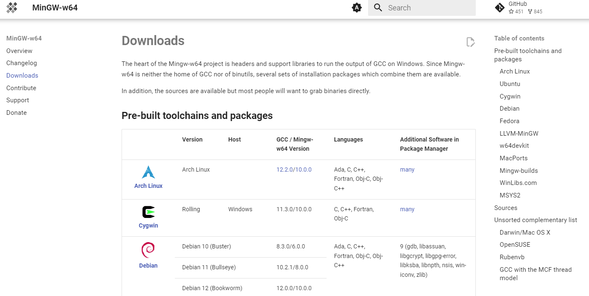
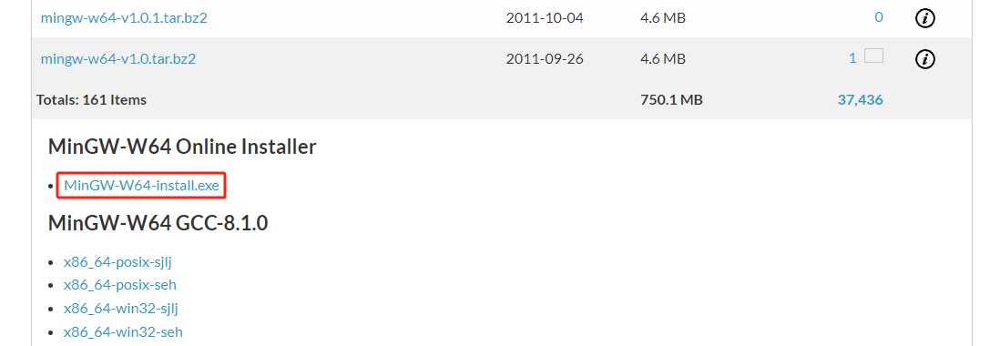

## 介绍

[GCC 官网](https://gcc.gnu.org/)

`GCC`（GNU Compiler Collection，GNU 编译器套件）是由 GNU 开发的编程语言编译器。GNU 编译器套件包括 C、C++、Objective-C、Fortran、Java、Ada 和 Go 语言前端，也包括了这些语言的库（如：libstdc++，libgcj 等。）

GCC 是以 GPL 许可证所发行的自由软件，也是 GNU 计划的关键部分。GCC 的初衷是为 GNU 操作系统专门编写一款编译器，现已被大多数类 Unix 操作系统（如：Linux、BSD、MacOS X 等）采纳为标准的编译器，甚至在微软的 Windows 上也可以使用 GCC。GCC 支持多种计算机体系结构芯片，如：x86、ARM、MIPS 等，并已被移植到其他多种硬件平台。

GCC 原名为 **GNU C 语言编译器**（GNU C Compiler），只能处理 C 语言。但其很快扩展，变得可处理 C++，后来又扩展为能够支持更多编程语言，如：Fortran、Pascal、Objective -C、Java、Ada、Go 以及各类处理器架构上的汇编语言等，所以改名 GNU 编译器套件（GNU Compiler Collection）。

## Linux 安装

### 使用 YUM 或 APT 安装

此方法不需要配置环境变量。

- RedHat 系统
    
    ```bash
    sudo yum install -y gcc
    ```
    
    查看 `gcc` 版本：
    
    ```bash
    gcc --version
    
    gcc (GCC) 8.5.0 20210514 (Red Hat 8.5.0-21)
    Copyright (C) 2018 Free Software Foundation, Inc.
    This is free software; see the source for copying conditions.  There is NO
    warranty; not even for MERCHANTABILITY or FITNESS FOR A PARTICULAR PURPOSE.
    ```

- Debian 系统
    
    ```bash
    sudo apt install -y gcc
    ```
    
    查看 `gcc` 版本：
    
    ```bash
    gcc --version
    
    gcc (Ubuntu 7.5.0-3ubuntu1~18.04) 7.5.0
    Copyright (C) 2017 Free Software Foundation, Inc.
    This is free software; see the source for copying conditions.  There is NO
    warranty; not even for MERCHANTABILITY or FITNESS FOR A PARTICULAR PURPOSE.
    ```

### 使用源代码安装新版 GCC

1. 安装构建 GCC 所需的工具：
    
    RedHat 系统：
    
    ```bash
    sudo yum install -y gcc gcc-c++ make gzip bzip2 tar gmp-devel
    ```
    
    Debian 系统：
    
    ```bash
    sudo apt install -y gcc g++ make gzip bzip2 tar libgmp3-dev
    ```
    
    没有旧版的 GCC，在编译 GCC 时会报 `configure: error: no acceptable C compiler found in $PATH` 错误。

2. 下载 GCC 源码包并解压
    
    [GCC 下载地址](https://gcc.gnu.org/pub/gcc/releases/)。
    
    ```bash
    sudo mkdir /opt/gcc
    cd /opt/gcc
    sudo wget https://gcc.gnu.org/pub/gcc/releases/gcc-13.2.0/gcc-13.2.0.tar.gz
    sudo tar -zxf gcc-13.2.0.tar.gz
    cd gcc-13.2.0
    ```

3. 安装依赖库
    
    源码包中 `./contrib/download_prerequisites` 脚本文件包含所需的依赖库版本信息及下载地址：
    
    ```bash
    // ...省略部分内容
    gmp='gmp-6.2.1.tar.bz2'
    mpfr='mpfr-4.1.0.tar.bz2'
    mpc='mpc-1.2.1.tar.gz'
    isl='isl-0.24.tar.bz2'
    
    base_url='http://gcc.gnu.org/pub/gcc/infrastructure/'
    // ...省略部分内容
    ```
    
    使用以下命令执行脚本文件，会自动下载并解压所需依赖库：
    
    ```bash
    sudo ./contrib/download_prerequisites
    ```

4. 编译 GCC
    
    ```bash
    sudo ./configure --enable-checking=release --enable-languages=c,c++ --disable-multilib
    sudo make
    sudo make install
    ```

5. 查看 GCC 版本
    
    ```bash
    gcc --version
    
    gcc (GCC) 13.2.0
    Copyright (C) 2023 Free Software Foundation, Inc.
    This is free software; see the source for copying conditions.  There is NO
    warranty; not even for MERCHANTABILITY or FITNESS FOR A PARTICULAR PURPOSE.
    ```

## Windows 安装

在 Windiows 中安装 GCC，需要安装 MinGW 工具。

### 什么是 MinGW-w64

**MinGW**（*Minimalist GNU on Windows*）是将经典的开源 C 语言编译器 GCC 移植到了 Windows 平台下，并且包含了 Win32 API，因此可以将源代码编译为可在 Windows 中运行的可执行程序。而且还可以使用一些 Windows 不具备的，Linux 平台下的开发工具。**MinGW 就是 GCC 的 Windows 版本。**

MinGW-w64 与 MinGW 的区别在于 MinGW 只能编译生成 32 位可执行程序，而 MinGW-w64 则可以编译生成 64 位或 32 位可执行程序。

### 为什么使用 MinGW-w64

1. MinGW-w64 是开源软件，可以免费使用
2. MinGW-w64 由一个活跃的开源社区在持续维护，因此不会过时
3. MinGW-w64 支持最新的 C 语言标准
4. MinGW-w64 使用 Windows 的 C 语言运行库，因此编译出的程序不需要第三方 DLL，可以直接在 Windows 下运行
5. 那些著名的开源 IDE 实际只是将 MinGW-w64 封装了起来，使它拥有友好的图形化界面，简化了操作，但内部核心仍然是 MinGW-w64
6. MinGW-w64 是稳定可靠的、持续更新的 C/C++ 编译器，使用它可以免去很多麻烦，不用担心跟不上时代，也不用担心编译器本身有 bug，可以放心的去编写程序

### 下载 MinGW-w64

1. MinGW-w64 下载详情页面

    进入 [MinGW-w64 官网](https://www.mingw-w64.org/)。

    

    点击 *[Downloads](https://www.mingw-w64.org/downloads/)*，进入 MinGW-w64 下载详情页面。

    

2. SourceForge 下载页面

    在 MinGW-w64 下载详情页面，首先看到一个标题为 Pre-built toolchains and packages 的列表，这里面是包含 MinGW-w64 及特定工具的整合包，我们只需下载 MinGW-w64 即可。找到 *Sources* 并点击 [SourceForge](https://sourceforge.net/projects/mingw-w64/files/mingw-w64/mingw-w64-release/)

    

    进入 `MinGW-w64 - for 32 and 64 bit Windows Files` 下载页面。

    

### 使用 exe 包安装

::: warning
使用 `exe` 包安装 MinGW-w64 需要从 [SourceForge](https://sourceforge.net/projects/mingw-w64/files/mingw-w64/mingw-w64-release/) 该网站上下载 MinGW 的相应数据文件，由于网络原因导致下载失败，可以选择 [使用二进制包安装](#使用二进制包安装)
:::

在 `MinGW-w64 - for 32 and 64 bit Windows Files` 下载页面找到 *MinGW-W64 Online Installer*，点击 *MinGW-W64-install.exe。*



进入下载页面，自动有一个 5s 倒计时，然后会下载 MinGW-W64 安装包。

双击 *mingw-w64-install.exe* 安装程序包：


点击 *Next*，指定 MinGW-w64 设置：


- **Version**：选择安装 MinGW-w64 的版本
- **Architecture**：选择电脑系统架构
    - **i686**：32 位系统
    - **x86_64**：64 位系统

- **Threads**：选择操作系统接口协议
    - **posix**：开发 Linux、Unix、Mac OS 等其他操作系统下的程序，则需要选择 posix 
    - **win32**：要开发 Windows 程序，需要选择 win32

- **Execption**：选择异常处理模型（64 位）
    - **seh**：`seh` 性能比较好，但不支持 32 位
    - **sjlj**：`sjlj` 稳定性好，支持 32 位

- **Build revision**：建立修订

点击 *Next*，选择 MinGW-w64 的安装目录：


点击 *Next*，开始安装。

### 使用二进制包安装

在 `MinGW-w64 - for 32 and 64 bit Windows Files` 下载页面找到 *MinGW-W64 GCC-8.1.0*，点击 *x86_64-win32-seh。*


进入下载页面，自动有一个 5s 倒计时，然后会下载 MinGW-W64 压缩包。

解压 *x86_64-8.1.0-release-win32-seh-rt_v6-rev0.7z* 文件，进入解压文件中，找到 **bin** 文件夹。

### 添加到系统环境变量中

不管是在线安装还是离线安装 MinGW-w64 都需要将 bin 文件夹所在的绝对路径（例如：`E:\Software\MinGW-w64\mingw64\bin`），添加到系统变量 path 中。

在桌面，右键 *此电脑*，点击 *属性*，进入设置界面，找到 *高级系统设置*，点击进入 *系统属性*，点击 *环境变量*，在 *系统变量* 中选择 *Path*，点击 *编辑*，点击 *新建*，将 bin 文件夹所在的绝对路径（例如：`E:\Software\MinGW-w64\mingw64\bin`）粘贴到此位置并确定。

### 测试

按 <kbd>Win</kbd> + <kbd>R</kbd> 键，打开运行窗口，输入 *cmd*，回车打开终端控制器。

输入 `gcc -v` 命令，查看 gcc 版本。


### 安装新版 MinGW-w64

[参考文档](https://blog.csdn.net/B11050729/article/details/132176767)

- 使用 `exe` 包安装
    - [GitHub 下载地址](https://github.com/Vuniverse0/mingwInstaller/releases)

- 使用二进制包安装
    - [镜像站点下载地址](https://files.1f0.de/mingw/)
    - [GitHub 下载地址1](https://github.com/niXman/mingw-builds-binaries/releases)
    - [GitHub 下载地址2](https://github.com/mmozeiko/build-gcc-mingw/releases)

## Mac OS 系统安装

在苹果官网上下载 [Xcode 开发环境](https://developer.apple.com/xcode/)，安装后就可以使用 GCC 编辑器了。
