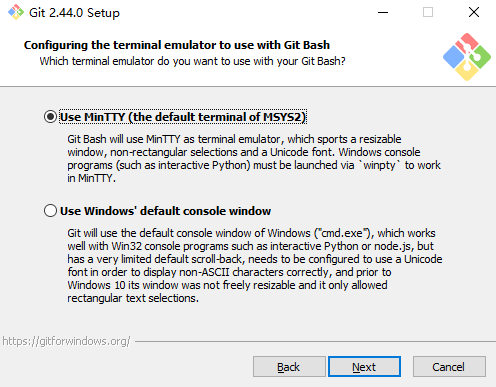

## Git 由来

`Linux` 内核开源项目有着为数众多的参与者。绝大多数的 `Linux` 内核维护工作都花在了提交补丁和保存归档的繁琐事务上（`1991~2002` 年间）。到 `2002` 年，整个项目组开始启用一个专有的分布式版本控制系统 `BitKeeper` 来管理和维护代码。

到了 `2005` 年，开发 `BitKeeper` 的商业公司同 `Linux` 内核开源社区的合作关系结束，他们收回了 `Linux` 内核社区免费使用 `BitKeeper` 的权力。这就迫使 `Linux` 开源社区（特别是 `Linux` 的缔造者 `Linus Torvalds`）基于使用 `BitKeeper` 时的经验教训，开发出自己的版本系统（`Git`）。

他们对新的系统制订了若干目标：

- 速度
- 简单的设计
- 对非线性开发模式的强力支持（允许成千上万个并行开发的分支）
- 完全分布式
- 有能力高效管理类似 `Linux` 内核一样的超大规模项目（速度和数据量）

自诞生于 `2005` 年以来，`Git` 日臻成熟完善，在高度易用的同时，仍然保留着初期设定的目标。它的速度飞快，极其适合管理大项目，有着令人难以置信的非线性分支管理系统。

## Git 介绍

[Git](https://git-scm.com/) 是一个免费的开源分布式版本控制系统，旨在快速高效地处理从小到大的项目。

`Git` 易于学习，占用空间小，性能快如闪电。它凭借廉价的本地分支、方便的暂存区域和多个工作流程等功能，超越了 `Subversion`、`CVS`、`Perforce` 和 `ClearCase` 等 `SCM` 工具。

## Linux 安装

分别在 Debian/Ubuntu-18.04 和 RedHat/CentOS-Stream-8 系统中安装。

以下两种方法都不需要配置系统环境变量。

### 使用 APT 或 YUM 安装

- Debian/Ubuntu 系统

    ```shell
    sudo apt install -y git
    ```

    查看 `git` 版本：

    ```shell
    git --version

    git version 2.17.1
    ```

- RedHat/CentOS 系统

    ```shell
    sudo yum install -y git
    ```

    查看 `git` 版本：

    ```shell
    git --version

    git version 2.43.0
    ```

### 使用源代码安装

从源码安装 `Git` 您能得到最新的版本。二进制安装程序倾向于有一些滞后，当然近几年 `Git` 已经成熟，这个差异不再显著。

从源码安装 `Git`，需要安装 `Git` 一些依赖的库。

::: info
使用 RedHat 系统，需要安装 [EPEL 库](https://docs.fedoraproject.org/en-US/epel/#How_can_I_use_these_extra_packages.3F) 以便下载 `docbook2X` 等包。

`CentOS-Stream-8` 安装 `EPEL` 库：

```shell
sudo dnf config-manager --set-enabled powertools
sudo dnf install -y epel-release epel-next-release
```

:::

- Debian/Ubuntu 系统：

    ```shell
    sudo apt install -y dh-autoreconf libcurl4-gnutls-dev libexpat1-dev \
    gettext libz-dev libssl-dev asciidoc xmlto docbook2x install-info
    ```

- RedHat/CentOS 系统：

    ```shell
    sudo yum install -y dh-autoreconf curl-devel expat-devel gettext-devel \
    openssl-devel perl-devel zlib-devel asciidoc xmlto docbook2X getopt
    sudo ln -s /usr/bin/db2x_docbook2texi /usr/bin/docbook2x-texi  # 解决二进制文件名的不同
    ```

下载 `tar` 包。可以从 [Kernel.org](https://www.kernel.org/pub/software/scm/git) 网站获取，也可以从 [GitHub](https://github.com/git/git/tags) 网站上获得。通常在 `GitHub` 上的是最新版本；`Kernel.org` 上包含有文件下载签名，如果您想验证下载正确性的话会用到。

```shell
sudo mkdir /opt/git
cd /opt/git
sudo tar -zxf git-2.44.0.tar.gz
cd git-2.44.0
sudo make configure
sudo ./configure --prefix=/usr
sudo make all doc info
sudo make install install-doc install-html install-info
```

完成后，您可以使用 `Git` 来获取 `Git` 的更新：

```shell
git clone git://git.kernel.org/pub/scm/git/git.git
```

查看 Git 版本：

```shell
git --version

git version 2.44.0
```

## Windows 安装

不需要配置系统环境变量。

将 [Git-2.44.0-64-bit.exe](https://git-scm.com/download/win) 包解压到您要存放的位置。例如：`E:\Software\Git\` 文件夹下。

双击 `Git-2.44.0-64-bit.exe` 程序包开始安装。并点击 *Next*。


点击 *Browse*，选择 `Git` 安装路径。并点击 *Next*。


选择安装组件，保存默认选择，额外选择 *Additional icons 和 (NEW!) Add a Git Bash Profile to Windows Termainal*。并点击 *Next*。

- **Additional icons**：在桌面上添加图标
- **Windows Explorer intergration**：Windows 资源管理器集成 `Git Bash`、`git GUI`
- **Git LFS (Large File Support)**：`Git LFS` 大文件支持
- **Associate .git\* configuration files with the default text editor**：将 `.git*` 配置文件与默认文本编辑器关联
- **Associate .sh files to be run with Bash**：将要运行的 `.sh` 文件与 `Bash` 关联
- **Check daily for Git for Windows updates**：每天检查 Windows 上 Git 的更新
- **(NEW!) Add a Git Bash Profile to Windows Termainal**：将 `Git Bash` 配置文件添加到 `Windows` 终端
- **(NEW!) Scalar (Git add-on to manage large-scale repositories)**：`Scalar` 用于管理大型存储库的 `Git` 插件


选择开始菜单目录，保持默认即可。并点击 *Next*。


选择 `Git` 默认编辑器，保持默认即可，默认使用 `Vim`。并点击 *Next*。


选择 `Git` 初始化分支名称，选择 *Override the default branch name for new repositories* 值为 `main`。并点击 *Next*。

- **Let Git decide**：由 `Git` 决定，默认值为 `master`
- **Override the default branch name for new repositories**：覆盖新存储库的默认分支名称，自定义值


设置环境变量，保持默认即可。并点击 *Next*。

- **Use Git from Git Bash only**：只能从 `Git Bash` 中使用 `Git` 命令
- **Git from the command line and also from 3rd-party software**：允许从命令行或第三方软件进使用 `Git`
- **Use Git and optional Unix tools from the Command Prompt**：覆盖 `Windows` 的一些工具如：`find`


选择 `ssh` 执行文件，保持默认即可。并点击 *Next*。

- **Use Bundled OpenSSH**：使用 `Git` 自带的 `OpenSSH`
- **Use external OpenSSH**：使用外部 `OpenSSH`


选择 `https` 传输后端，保持默认即可。并点击 *Next*。

- **Use the OpenSSH library**：使用公共 `OpenSSH` 库
- **Use the native Windows Secure Channel library**：使用本机 `Windows` 安全通道库


配置结束行转换方式，保持默认即可。并点击 *Next*。

- **Checkout Windows-style, commit Unix-style line endings**：行结尾下拉转换为 Windows 样式，提交转换为 Unix 样式
- **Checkout as-is, commit Unix-style line endings**：行结尾按原样下拉，提交转换为 Unix 风格
- **Checkout as-is, commit as-is**：行结尾按原样下拉，按原样提交


配置终端模拟器，保持默认即可。并点击 *Next*。

- **Use MinlrY (the default terminal of MsYs2)**：`Git Bash` 将使用 `MinTTY` 作为终端模拟器，该模拟器具有可调整大小的窗口
- **Use windows’ default console window**：使用 `Windows` 的默认控制台窗口（`cmd.exe`）



选择 `Git` 下拉默认行为，保持默认即可。并点击 *Next*。

- **Default (fast-forward or merge)**：默认值（快进或合并）。尽可能快进当前分支到一个被捕获的分支，否则创建合并提交
- **Rebase**：将当前分支改为获取的分支。如果没有要重基的本地提交，这相当于快进
- **Only ever fast-forward**：只有快速前进，快进到获取的分支。如果不可能，就失败


选择凭据帮助程序，保持默认即可。并点击 *Next*。

- **Git Credential Manager**：使用凭据帮助程序
- **None**：不使用凭据帮助程序


配置额外特性选项，保持默认即可。并点击 *Next*。

- **Enable file system caching**：批量读取文件系统数据并将其缓存在内存中进行某些操作
- **Enable symbolic links**：启用符号链接


配置实验选项，保持默认即可。并点击 *Install*。

- **Enable experimental support for pseudo consoles**：支持伪控制台的实验性支持
- **Enable experimental built-in file system monitor**：启用实验性内置文件系统监视器


等待安装，取消勾选，点击 *Finish*，完成 `Git` 安装。

- **launch git bash**：启动 `git bash`
- **view release notes**：查看发行说明


    
按 <kbd>Win</kbd> + <kbd>R</kbd> 键，在运行中输入 `cmd` 打开终端控制器。

在终端控制器中输入 `git --version` 命令，查看 `Git` 版本。

```shell
C:\Users\user>git --version
git version 2.44.0.windows.1
```
