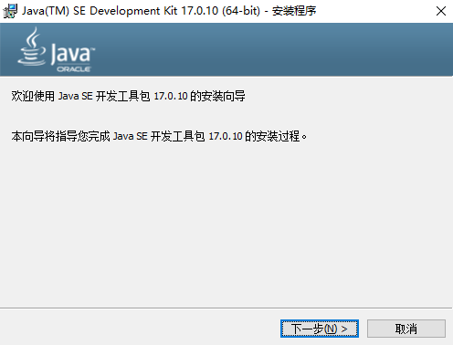
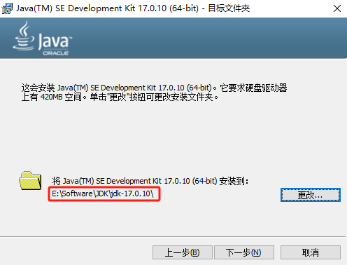
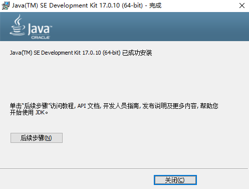

## 介绍

### JDK

[JDK](https://www.oracle.com/cn/java/)（Java Development Kit）是 `Java` 语言的软件开发工具包（`SDK`）。主要用于移动设备、嵌入式设备上的 `java` 应用程序。

`JDK` 提供了 Java 编程语言的编译器（`javac`）、Java 运行时环境（`JRE`）、类库以及其他工具，这样开发者可以编写、编译、测试和运行 Java 应用程序。`JDK` 是开发任何基于 Java 技术的应用程序不可或缺的工具集。`2009` 年，甲骨文公司（`Oracle`）收购 Sun 公司，之后所说的 `JDK` 都是 `OracleJDK`。

没有 `JDK` 的话，无法编译 Java 程序（指 java 源码 `.java` 文件），如果想只运行 Java 程序（指 `class` 或 `jar` 或其它归档文件），要确保已安装相应的 `JRE`。

### OpenJDK

[OpenJDK](https://openjdk.org/)（Open Java Development Kit）是 `JDK` 的开源版本，由 Sun 公司在 `2006` 年发布。使 `Java` 更加开放和广泛可访问，提供一个免费和开源的 `Java` 开发平台。

## JDK 和 OpenJDK 区别

- **协议**：`JDK` 是 `Oracle` 公司发行的，遵循 `Oracle JRL`（Java Research License）许可协议。`OpenJDK` 是开源项目，遵循 `GNU GPL`（General Public License）许可协议
- **代码**：`JDK` 包含闭源代码，加了一些 `Oracle` 公司的商业技术。`OpenJDK` 代码完全开源，没有闭源代码

## JDK 安装

根据您的系统选择需要的软件安装包。

### Linux 安装

分别在 Debian/Ubuntu-18.04 和 RedHat/CentOS-Stream-8 系统中安装。

- 使用 `DPKG` 或 `RPM` 包安装

    此方法不需要配置系统环境变量，[JDK 下载地址](https://www.oracle.com/java/technologies/downloads/archive/)。

    - Debian/Ubuntu 系统

        ```shell
        sudo mkdir /opt/jdk
        cd /opt/jdk
        sudo wget https://download.oracle.com/java/17/archive/jdk-17.0.10_linux-x64_bin.deb
        sudo dpkg -i jdk-17.0.10_linux-x64_bin.deb
        ```

        查看 `java` 版本：

        ```shell
        java -version

        java version "17.0.10" 2024-01-16 LTS
        Java(TM) SE Runtime Environment (build 17.0.10+11-LTS-240)
        Java HotSpot(TM) 64-Bit Server VM (build 17.0.10+11-LTS-240, mixed mode, sharing)
        ```

        查看 `javac` 版本：

        ```shell
        javac -version

        javac 17.0.10
        ```

    - RedHat/CentOS 系统

        ```shell
        sudo mkdir /opt/jdk
        cd /opt/jdk
        sudo wget https://download.oracle.com/java/17/archive/jdk-17.0.10_linux-x64_bin.rpm
        sudo rpm -ivh jdk-17.0.10_linux-x64_bin.rpm
        ```

        查看 `java` 版本：

        ```shell
        java -version

        java version "17.0.10" 2024-01-16 LTS
        Java(TM) SE Runtime Environment (build 17.0.10+11-LTS-240)
        Java HotSpot(TM) 64-Bit Server VM (build 17.0.10+11-LTS-240, mixed mode, sharing)
        ```

        查看 `javac` 版本：

        ```shell
        javac -version

        javac 17.0.10
        ```

- 使用二进制包安装

    此方法需要配置系统环境变量，[JDK 下载地址](https://www.oracle.com/java/technologies/downloads/archive/)。

    ```shell
    sudo mkdir /opt/jdk
    cd /opt/jdk
    sudo wget https://download.oracle.com/java/17/archive/jdk-17.0.10_linux-x64_bin.tar.gz
    sudo tar -zxf jdk-17.0.10_linux-x64_bin.tar.gz
    ```

    查看 `java` 版本，没有配置系统环境变量前，只能到 `java` 命令所在目录下执行 `java` 命令：

    ```shell
    cd /opt/jdk/jdk-17.0.10/bin
    ./java -version

    java version "17.0.10" 2024-01-16 LTS
    Java(TM) SE Runtime Environment (build 17.0.10+11-LTS-240)
    Java HotSpot(TM) 64-Bit Server VM (build 17.0.10+11-LTS-240, mixed mode, sharing)
    ```

    查看 `javac` 版本：

    ```shell
    ./javac -version

    javac 17
    ```

    配置系统环境变量，使用 `sudo vim /etc/profile` 命令打开文件，并在最后添加以下内容：

    ```shell
    export JAVA_HOME=/opt/jdk/jdk-17.0.10
    export CLASSPATH=$:CLASSPATH:$JAVA_HOME/lib/
    export PATH=$PATH:$JAVA_HOME/bin
    ```

    执行 `/etc/profile` 文件，使配置立即生效：

    ```shell
    source /etc/profile
    ```

    配置系统环境变量后，就可以在任意目录下使用 `java` 命令。

### Windows 安装

- 使用二进制包安装

    需要配置系统环境变量，[JDK 下载地址](https://www.oracle.com/java/technologies/downloads/archive/)。

    将 `jdk-17.0.10_windows-x64_bin.zip` 包解压到您要存放的位置。例如：`E:\Software\JDK\` 文件夹下。

    按 <kbd>Win</kbd> + <kbd>X</kbd> 键，依次点击 *系统 -> 高级系统设置 -> 环境变量*。

    在 *系统变量* 中，点击 *新建*，新建以下两个变量：

    - 变量名：`JAVA_HOME`，变量值：`E:\Software\JDK\jdk-17.0.10`
        - `JAVA_HOME` 变量值指定解压缩 JDK 的目录

    - 变量名：`CLASSPATH`，变量值：`.;%JAVA_HOME%\lib\dt.jar;%JAVA_HOME%\lib\tools.jar;`
        - `CLASSPATH` 变量值指定类文件的位置

    在 *系统变量* 中，点击 *Path* 变量进行编辑，点击 *新建*，新建以下两个值：

    - `%JAVA_HOME%\bin`
    - `%JAVA_HOME%\jre\bin`

    以上操作完成，依次点击 *确认* 保存。

    按 <kbd>Win</kbd> + <kbd>R</kbd> 键，在运行中输入 `cmd` 打开终端控制器。

    在终端控制器中输入 `java -version` 命令，查看 `java` 版本。输入 `javac -version` 命令，查看 `javac` 版本。

    ```shell
    C:\Users\user>java -version
    java version "17.0.10" 2024-01-16 LTS
    Java(TM) SE Runtime Environment (build 17.0.10+11-LTS-240)
    Java HotSpot(TM) 64-Bit Server VM (build 17.0.10+11-LTS-240, mixed mode, sharing)

    C:\Users\user>javac -version
    javac 17.0.10
    ```

- 使用 `exe` 或 `msi` 包安装

    不需要配置系统环境变量，[JDK 下载地址](https://www.oracle.com/java/technologies/downloads/archive/)。

    双击 `jdk-17.0.10_windows-x64_bin.exe` 或 `jdk-17.0.10_windows-x64_bin.msi` 程序包开始安装。并点击 *下一步*。

    

    点击 *更改*，更改 `JDK` 安装位置。并点击 *下一步*。

    

    等待安装，点击 *关闭*，完成 `JDK` 安装。

    

    ::: info
    安装完成后，默认已经在 *Path* 变量中添加 `C:\Program Files\Common Files\Oracle\Java\javapath` 路径值，所以不需要配置系统环境变量。
    :::

    按 <kbd>Win</kbd> + <kbd>R</kbd> 键，在运行中输入 `cmd` 打开终端控制器。

    在终端控制器中输入 `java -version` 命令，查看 `java` 版本；输入 `javac -version` 命令，查看 `javac` 版本。

    ```shell
    C:\Users\user>java -version
    java version "17.0.10" 2024-01-16 LTS
    Java(TM) SE Runtime Environment (build 17.0.10+11-LTS-240)
    Java HotSpot(TM) 64-Bit Server VM (build 17.0.10+11-LTS-240, mixed mode, sharing)

    C:\Users\user>javac -version
    javac 17.0.10
    ```

## OpenJDK 安装

根据您的系统选择需要的软件安装包。

### Linux 安装

分别在 Debian/Ubuntu-18.04 和 RedHat/CentOS-Stream-8 系统中安装。

- 使用 `APT` 或 `YUM` 安装

    此方法不需要配置系统环境变量。

    - Debian/Ubuntu 系统

        ```shell
        sudo apt install -y openjdk-17-jdk
        ```

        查看 `java` 版本：

        ```shell
        java -version

        openjdk version "17.0.7" 2023-04-18
        OpenJDK Runtime Environment (build 17.0.7+7-Ubuntu-0ubuntu118.04)
        OpenJDK 64-Bit Server VM (build 17.0.7+7-Ubuntu-0ubuntu118.04, mixed mode, sharing)
        ```

        查看 `javac` 版本：

        ```shell
        javac -version

        javac 17.0.7
        ```

    - RedHat/CentOS 系统

        安装带有 `devel` 的是 `JDK`；安装不带有 `devel` 的是 `JRE`。

        ```shell
        sudo yum install -y java-17-openjdk-devel.x86_64
        ```

        查看 `java` 版本：

        ```shell
        java -version

        openjdk version "17.0.6-ea" 2023-01-17 LTS
        OpenJDK Runtime Environment (Red_Hat-17.0.6.0.9-0.3.ea.el8) (build 17.0.6-ea+9-LTS)
        OpenJDK 64-Bit Server VM (Red_Hat-17.0.6.0.9-0.3.ea.el8) (build 17.0.6-ea+9-LTS, mixed mode, sharing)
        ```

        查看 `javac` 版本：

        ```shell
        javac -version

        javac 17.0.6-ea
        ```

- 使用二进制包安装
    
    此方法需要配置系统环境变量，[OpenJDK 下载地址](https://jdk.java.net/archive/)。

    ```shell
    sudo mkdir /opt/jdk
    cd /opt/jdk
    sudo wget https://download.java.net/java/GA/jdk17/0d483333a00540d886896bac774ff48b/35/GPL/openjdk-17_linux-x64_bin.tar.gz
    sudo tar -zxf openjdk-17+35_linux-x64_bin.tar.gz
    ```

    查看 `java` 版本，没有配置系统环境变量前，只能到 `java` 命令所在目录下执行 `java` 命令：

    ```shell
    cd /opt/jdk/jdk-17/bin
    ./java -version

    openjdk version "17" 2021-09-14
    OpenJDK Runtime Environment (build 17+35-2724)
    OpenJDK 64-Bit Server VM (build 17+35-2724, mixed mode, sharing)
    ```

    查看 `javac` 版本：

    ```shell
    ./javac -version

    javac 17
    ```

    配置系统环境变量，使用 `sudo vim /etc/profile` 命令打开文件，并在最后添加以下内容：

    ```shell
    export JAVA_HOME=/opt/jdk/jdk-17
    export CLASSPATH=$:CLASSPATH:$JAVA_HOME/lib/
    export PATH=$PATH:$JAVA_HOME/bin
    ```

    执行 `/etc/profile` 文件，使配置立即生效：

    ```shell
    source /etc/profile
    ```

    配置系统环境变量后，就可以在任意目录下使用 `java` 命令。

### Windows 安装

需要配置系统环境变量，[OpenJDK 下载地址](https://jdk.java.net/archive/)。

将 `openjdk-17+35_windows-x64_bin.zip` 包解压到您要存放的位置。例如：`E:\Software\JDK\` 文件夹下。

按 <kbd>Win</kbd> + <kbd>X</kbd> 键，依次点击 *系统 -> 高级系统设置 -> 环境变量*。

在 *系统变量* 中，点击 *新建*，新建以下两个变量：

- 变量名：`JAVA_HOME`，变量值：`E:\Software\JDK\openjdk-17+35_windows-x64_bin\jdk-17`
    - `JAVA_HOME` 变量值指定解压缩 JDK 的目录

- 变量名：`CLASSPATH`，变量值：`.;%JAVA_HOME%\lib\dt.jar;%JAVA_HOME%\lib\tools.jar;`
    - `CLASSPATH` 变量值指定类文件的位置

在 *系统变量* 中，点击 *Path* 变量进行编辑，点击 *新建*，新建以下两个值：

- `%JAVA_HOME%\bin`
- `%JAVA_HOME%\jre\bin`

以上操作完成，依次点击 *确认* 保存。

按 <kbd>Win</kbd> + <kbd>R</kbd> 键，在运行中输入 `cmd` 打开终端控制器。

在终端控制器中输入 `java -version` 命令，查看 `java` 版本。输入 `javac -version` 命令，查看 `javac` 版本。

```shell
C:\Users\user>java -version
openjdk version "17" 2021-09-14
OpenJDK Runtime Environment (build 17+35-2724)
OpenJDK 64-Bit Server VM (build 17+35-2724, mixed mode, sharing)

C:\Users\user>javac -version
javac 17
```
