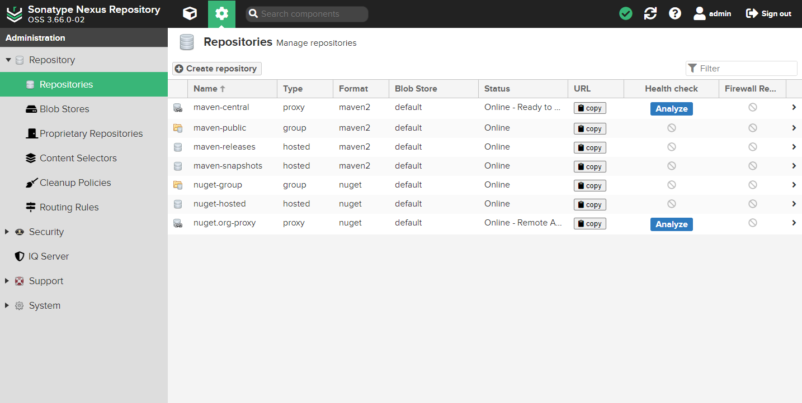

## 管理存储库

查看官网 [存储库管理](https://help.sonatype.com/en/repository-management.html) 说明。

在主页点击 *&#x2699;（管理） -> Repository-> Repositories* 进入管理存储库。

存储库类型，这里一共有三种：

- **proxy**：代理存储库。用来代理远程公共仓库。例如：Maven 中央仓库、JBoss 远程仓库
- **hosted**：本地存储库。该仓库通常用来部署本地项目所产生的构件。`hosted` 宿主仓库又分为：`releases` 和 `snapshots`，分别表示依赖的版本的发行版、快照版。快照版依赖不能上传到发布版仓库，反之亦然。nexus 做了限制
- **group**：存储库组，用来将多个代理存储库或本地存储库组合成一个存储库，为这些仓库提供统一的服务地址，以便 Maven 可以更加方便地获得这些仓库中的构件

Nexus 服务提供了以下默认的 maven2 仓库，可供我们直接使用：

- **maven-central**：代理存储库（Type：`proxy`）。代理 Maven 中央库，默认从 `https://repo1.maven.org/maven2/` 拉取 jar 包
- **maven-releases**：发布版存储库（Type：`hosted`）。用于组织发布内部版本的存储库
- **maven-snapshots**：快照版存储库（Type：`hosted`、Version policy：`Snapshot`），用于组织发布内部开发版本的存储库
- **maven-public**：maven2 存储库集合（Type：`group`），用于整合以上三个仓库，用户可以直接使用集合仓库的地址拉取依赖 jar 包

## Blob Stores

查看官网 [Blob Stores](https://help.sonatype.com/en/storage-planning.html) 说明。

在主页点击 *&#x2699;（管理） -> Repository-> Blob Stores* 进入Blob 存储库。

### Blob 存储类型

Blob 存储类型如下：

- **File**：文件 blob 存储允许 Nexus Repository 将 blob 作为文件存储在目录中。创建 Blob 存储期间提供的参数 Path 确定 Blob 文件的位置
- **S3**：S3 Blob 存储将 Blob 作为对象保存在 AWS S3 上的 `bucket` 中。仅建议将 S3 Blob 存储用于 AWS 中托管的 Nexus 存储库安装

在创建 repository 之前，还需要先指定文件存储目录，便于统一管理。就需要创建 `Blob Stores`，不创建则使用的是 `default`。

### 创建其他代理

依次点击 *Create repository -> maven2(proxy)*
