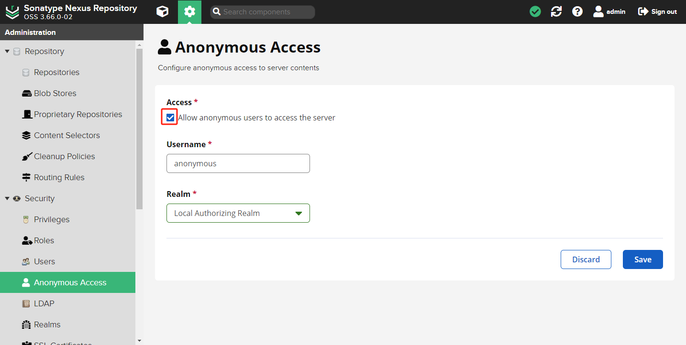

## 问题

报错日志如下：

```bash
Downloading http://localhost:8081/repository/gradle-group/packages/gradle/6.5/gradle-6.5-all.zip

Exception in thread "main" java.io.IOException: Server returned HTTP response code: 401 for 
    URL: http://localhost:8081/repository/gradle-group/packages/gradle/6.5/gradle-6.5-all.zip
    at sun.net.www.protocol.http.HttpURLConnection.getInputStream0(HttpURLConnection.java:1839)
    at sun.net.www.protocol.http.HttpURLConnection.getInputStream(HttpURLConnection.java:1440)
    at org.gradle.wrapper.Download.downloadInternal(Download.java:66)
    at org.gradle.wrapper.Download.download(Download.java:51)
    at org.gradle.wrapper.Install$1.call(Install.java:62)
    at org.gradle.wrapper.Install$1.call(Install.java:48)
    at org.gradle.wrapper.ExclusiveFileAccessManager.access(ExclusiveFileAccessManager.java:69)
    at org.gradle.wrapper.Install.createDist(Install.java:48)
    at org.gradle.wrapper.WrapperExecutor.execute(WrapperExecutor.java:107)
    at org.gradle.wrapper.GradleWrapperMain.main(GradleWrapperMain.java:61)
```

```bash
FAILURE: Build failed with an exception.

* What went wrong:
A problem occurred configuring root project 'tcsj'.
> Could not resolve all artifacts for configuration ':classpath'.
   > Could not resolve com.android.tools.build:gradle:4.1.1.
     Required by:
         project :
      > Could not resolve com.android.tools.build:gradle:4.1.1.
         > Could not get resource 'http://localhost:8081/repository/gradle-group/com/android/tools/build/gradle/4.1.1/gradle-4.1.1.pom'.
            > Could not GET 'http://localhost:8081/repository/gradle-group/com/android/tools/build/gradle/4.1.1/gradle-4.1.1.pom'. 
            Received status code 401 from server: Unauthorized
```

## 原因

Nexus 存储库拒绝匿名用户访问。

## 解决方法

### 解决方法1

配置允许匿名用户访问服务器。

在主页点击 *&#x2699;（管理） -> Security-> Anonymous Access*。



### 解决方法2

在 `distributionUrl` 中指定 HTTP 基本身份验证凭据，`user:passwd` 为 Nexus 服务的访问用户和密码。

```properties
distributionUrl=http\://user:passwd@localhost:8081/repository/gradle-group/packages/gradle/6.5/gradle-6.5-all.zip
```

或在 `build.gradle` 中指定 Nexus 服务的访问用户和密码。

```gradle
repositories {
    maven {    
        credentials {
            username "user"
            password "passwd"
        }
        url "http://localhost:8081/repository/gradle-group/"
    }
}
```
