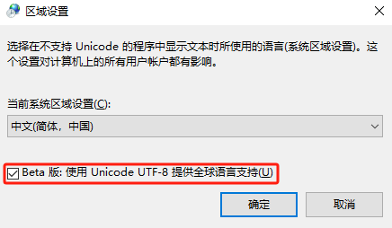

## 问题

CMD 中查看中文文件，出现乱码。

```cmd
Microsoft Windows [版本 10.0.19045.4651]
(c) Microsoft Corporation。保留所有权利。

C:\Users\user>type E:\test\test.txt
浣犲ソ锛屼笘鐣岋紒
Hello, World!
C:\Users\user>chcp
活动代码页: 936

C:\Users\user>
```

## 原因

因为 `chcp` 活动代码页编号默认设置为 `936`，`936` 代表的是 GBK 编码，‌而 GBK 编码在某些情况下可能无法正确显示中文字符，‌导致乱码现象。‌GBK 编码虽然支持简体中文，‌但在处理一些特殊字符或特定情况下可能会出现编码不匹配的问题，‌从而引起乱码。‌此外，‌如果系统的默认编码设置与应用程序或终端的编码不匹配，‌也可能会导致乱码问题。‌因此，‌当 `chcp` 设置为 `936` 时，‌如果终端或应用程序期望的是 UTF-8 编码，‌就可能出现中文乱码问题。

- Windows 默认支持的中文编码为：GBK、GB2312、ANSI
- Linux 默认支持的中文编码为：UTF-8（Unicode）

## 解决方法

### 解决方法 1

修改编码设置，这种方式只在当前 CMD 终端中生效，打开其它终端或重启终端都会失效。

通过在 CMD 中执行 `chcp 65001` 命令将编码切换到 UTF-8，‌这通常可以解决中文乱码问题。‌

```cmd
C:\Users\user>chcp 65001
Active code page: 65001

C:\Users\user>type E:\test\test.txt
你好，世界！
Hello, World!
C:\Users\user>
```

### 解决方法 2

将方法 1 自动化，修改注册表实现自动运行 `chcp 65001` 命令，这种方式永久有效。

使用 <kbd>Win</kbd> + <kbd>R</kbd> 键，输入 `regedit`，打开注册表编辑器。

- 依次点击 *HKEY_LOCAL_MACHINE -> SOFTWARE -> Microsoft -> Command Processor*
- 在注册表编辑器中输入 `计算机\HKEY_LOCAL_MACHINE\SOFTWARE\Microsoft\Command Processor` 路径

右键依次点击 *新建(N) -> 字符串值(S)*。命名为 `autorun`，右键 *修改(M)*，数值数据为 `chcp 65001`，确定。

再次打开 CMD 查看 `chcp` 编码：

```cmd
Active code page: 65001

C:\Users\user>chcp
Active code page: 65001

C:\Users\user>type E:\test\test.txt
你好，世界！
Hello, World!
C:\Users\user>
```

每次打开 CMD 都会显示 `Active code page: 65001`，可以通过将注册表中 `autorun` 的值改为 `chcp 65001 > null` 解决：

```cmd

C:\Users\user>chcp
Active code page: 65001

C:\Users\user>
```

### 解决方法 3

修改系统设置中的语言选项，有以下两种方法，并且需要重启电脑。

::: tip
打开这个 UTF-8 默认编码，会使得一些用 `936（GBK）` 编码的文件或应用程序显示乱码。
:::

- 使用 <kbd>Win</kbd> + <kbd>I</kbd> 打开 Windows 设置。依次点击 *时间和语言 -> 语言 -> 管理语言设置 -> 管理 -> 更改系统区域设置*
- 使用 <kbd>Win</kbd> + <kbd>R</kbd> 键，输入 `control`，打开控制面板。依次点击 *区域 -> 管理 -> 更改系统区域设置*

勾选 *Beta 版：使用 Unicode UTF-8 提供全球语言支持(U)*。



重启电脑，再次打开 CMD 查看 `chcp` 编码：

```cmd
Microsoft Windows [Version 10.0.19045.4651]
(c) Microsoft Corporation。保留所有权利。

C:\Users\user>chcp
Active code page: 65001

C:\Users\user>type E:\test\test.txt
你好，世界！
Hello, World!
C:\Users\user>
```
