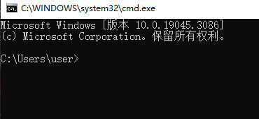
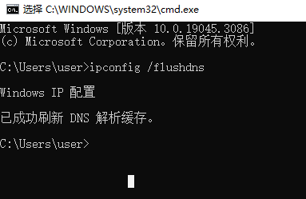

## 问题

- [GitHub](https://github.com/) 网页在国内加载慢，而且有时还加载失败

    

- GitHub 图片加载失败

    

## 解决方法

1. **DNS 查询 Github 地址**

    打开网站 [站长工具](https://tool.chinaz.com/dns/) 并选择 **DNS 查询**，在 A 类型中填写 `github.com`，再点击监测按钮。

2. **复制 IP 地址**

    复制 DNS 解析出来的 IP 地址。如：`20.205.243.166`。

3. **添加到 hosts 文件**

    将解析的 IP 地址添加到 `C:\Windows\System32\drivers\etc` 目录下的 `hosts` 文件中。如：`20.205.243.166 github.com`

    - **20.205.243.166**：指 DNS 解析出来的 IP 地址
    - **`github.com`**：指域名

4. **刷新 DNS 解析缓存**

    在 Windows 中按 <kbd>Win</kbd> + <kbd>R</kbd> 键，在运行中输入 `cmd` 打开终端控制器。

    

    在终端控制器中输入 `ipconfig /flushdns` 命令，刷新 DNS 解析缓存。

    

5. 在 A 类型中填写 `github.githubassets.com`，再点击监测按钮
6. 复制 DNS 解析出来的 IP 地址。如：`185.199.110.154`
7. 将解析的 IP 地址添加到 `hosts` 文件中。如：`185.199.110.154 github.githubassets.com`
8. 刷新 DNS 解析缓存
