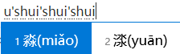
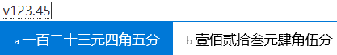
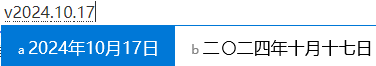

## 不会读的字怎么打

开启 **u 模式：u + 字的各个部分的读音**，例如：想要打 “淼” 字。在中文状态下，输入 `ushuishuishui`，淼字就出来了，还有拼音。

## 中文数字

开启 **v 模式：v + 数字**，例如：想要输入 “壹佰贰拾叁元肆角伍分”。在中文状态下，输入 `v123.45`，各种中文数字就出来了。

## 各种日期

开启 **v 模式：v + 日期**，例如：想要输入 “2024年10月17号”。在中文状态下，输入 `v2024.10.17`，各种日期的写法就出来了，还有星期。

## 算式计算

开启 **v 模式：v + 算式**，例如：想要计算 “v10*10+10” 的值，在中文状态下，输入 `v10*10+10`，算式结果就出来了。

