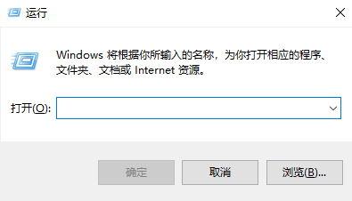

::: tip
<kbd>Win</kbd> 是 Windows 徽标键，一般在键盘的左下角，位于 <kbd>Ctrl</kbd> 键和 <kbd>Alt</kbd> 键之间。
:::

按 <kbd>Win</kbd> + <kbd>R</kbd> 键，打开命令运行框。Windows 将根据您所输入的名称，为您打开相应的程序、文件夹、文档或 Internet 资源。

在运行窗口可以直接打开的程序如下所示，以 `.exe` 为后缀的命令可以省略 `.exe` 后缀，例如：输入 `cmd.exe` 等于输入 `cmd`。

|  命令  |  描述  |
|  :----:  |  :----  |
|  `appwiz.cpl`  |  打开程序和功能窗口  |
|  `calc.exe`  |  打开计算器程序  |
|  `certmgr.msc`  |  打开证书管理窗口  |
|  `charmap.exe`  |  打开字符映射表程序  |
|  `chkdsk.exe`  |  Chkdsk 磁盘检查  |
|  `cleanmgr.exe`  |  打开磁盘清理程序  |
|  `cliconfg.exe`  |  打开 SQL Server 客户端网络程序  |
|  `cmd.exe`  |  打开 CMD 命令提示符程序  |
|  `compmgmt.msc`  |  打开计算机管理窗口  |
|  `control.exe`  |  打开控制面板程序  |
|  `control.exe system`  |  打开计算机系统设置的基本信息窗口  |
|  `control.exe /name Microsoft.Troubleshooting`  |  打开计算机疑难解答窗口  |
|  `dcomcnfg.exe`  |  打开系统组件服务程序  |
|  `devmgmt.msc`  |  打开设备管理器窗口  |
|  `dfrgui.exe`  |  打开磁盘碎片整理程序  |
|  `diskmgmt.msc`  |  打开磁盘管理窗口  |
|  `dvdplay.exe`  |  打开 DVD 播放器程序  |
|  `dxdiag.exe`  |  打开 DirectX 诊断程序  |
|  `explorer.exe`  |  打开文件资源管理器程序  |
|  `eudcedit.exe`  |  打开专用字符编辑程序  |
|  `eventvwr.exe`  |  打开事件查看器程序  |
|  `fsmgmt.msc`  |  打开共享文件夹管理器窗口  |
|  `gpedit.msc`  |  打开组策略窗口  |
|  `inetcpl.cpl`  |  打开 Internet 属性窗口  |
|  `inetmgr.exe`  |  打开 IIS 管理器窗口  |
|  `logoff`  |  注销命令  |
|  `lusrmgr.msc`  |  打开本地用户和组窗口  |
|  `notepad.exe`  |  打开记事本程序  |
|  `magnify.exe`  |  打开放大镜程序  |
|  `resmon.exe`  |  打开内存资源监视器窗口  |
|  `mmc.exe`  |  打开控制台程序  |
|  `mobsync.exe`  |  打开同步中心程序  |
|  `mplayer2.exe`  |  打开 widnows media player 程序  |
|  `msconfig.exe`  |  打开系统配置程序  |
|  `msinfo32.exe`  |  打开系统信息程序  |
|  `mspaint.exe`  |  打开画图板程序  |
|  `msra.exe`  |  打开远程协助程序  |
|  `mstsc.exe`  |  打开远程桌面连接程序  |
|  `narrator.exe`  |  打开屏幕讲述人程序  |
|  `net start messenger`  |  开始信使服务  |
|  `net stop messenger`  |  停止信使服务  |
|  `nslookup.exe`  |  用于查询域名系统（DNS）服务器以获取主机名或 IP 地址相关的信息  |
|  `odbcad32.exe`  |  打开 ODBC 数据源管理程序  |
|  `osk.exe`  |  打开屏幕键盘程序  |
|  `perfmon.exe`  |  打开性能监测器程序  |
|  `regedit.exe`  |  打开注册表编辑器程序  |
|  `regedt32.exe`  |  打开注册表编辑器程序  |
|  `regsvr32 /u *.dll`  |  停止 dll 文件运行  |
|  `regsvr32 /u zipfldr.dll`  |  取消 ZIP 支持  |
|  `rsop.msc`  |  打开策略结果集窗口  |
|  `secpol.msc`  |  打开本地安全策略窗口  |
|  `services.msc`  |  打开本地服务设置窗口  |
|  `sfc.exe`  |  系统文件检查器  |
|  `sfc /scannow`  |  扫描错误并复原  |
|  `shrpubw.exe`  |  打开创建共享文件夹程序  |
|  `sigverif.exe`  |  打开文件签名验证程序  |
|  `taskmgr.exe`  |  打开任务管理器程序  |
|  `UserAccountControlSettings.exe`  |  打开更改用户账户控制设置程序  |
|  `utilman.exe`  |  打开辅助工具管理程序  |
|  `wiaacmgr.exe`  |  打开扫描仪和照相机向导程序  |
|  `winver.exe`  |  打开关于 Windows 窗口  |
|  `write.exe`  |  打开写字板程序  |
|  `wmimgmt.msc`  |  打开 Windows 管理体系结构（WMI）窗口  |
|  `wscript.exe`  |  打开 Windows 脚本宿主设置程序  |
|  `wscui.cpl`  |  打开安全和维护窗口  |
