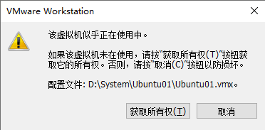
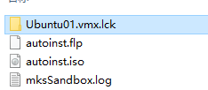

## 问题

该虚拟机似乎正在使用中。

如果该虚拟机未在使用，请按 “获取所有权(T)” 按钮获取它的所有权。否则，请按 “取消(C)” 按钮以防损坏。

配置文件: `D:\System\Ubuntu01\Ubuntu01.vmx`。

## 原因

VMWare 中的虚拟机没有正常关机，物理机突然断电关机，再启动 VMWare 虚拟机时遇到此错误。

## 解决方法

这是因为虚拟机的目录被锁定了，进入该虚拟机的目录将 `.vmx.lck` 结尾的目录 **改名** 或 **删除。**

再重新打开该虚拟机即可。
