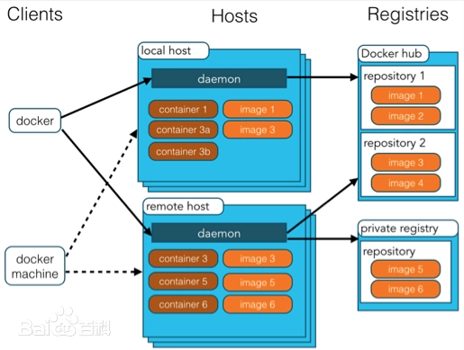

记录一些 Docker 相关的信息。

<!-- more -->

## Docker 简介

Docker 是一个开源的应用容器引擎，让开发者可以打包他们的应用以及依赖包到一个可移植的镜像中，然后发布到任何流行的 Linux 或 Windows 操作系统的机器上，也可以实现虚拟化。容器是完全使用沙箱机制，相互之间不会有任何接口。

Docker 是 PaaS 提供商 dotCloud 开源的一个基于 LXC（内核虚拟化）的高级容器引擎，源代码托管在 [Github](https://github.com/docker/docs) 上，基于 Go 语言并遵从 Apache2.0 协议开源。

Docker 是一个用于开发、发布和运行应用程序的开放平台。Docker 使您能够将应用程序与基础设施分开，以便您可以快速交付软件。

Docker 允许开发人员使用提供应用程序和服务的本地容器在标准化环境中工作，从而简化了开发生命周期。容器非常适合持续集成和持续交付（CI/CD）工作流程。

## Docker 特点

- **性能开销极低**：Docker 容器与虚拟机不同，它们共享宿主机的内核，因此启动速度快、占用资源少
- **隔离性**：每个容器都是一个独立的沙箱运行，在隔离的环境中互不干扰
- **可移植性**：Docker 容器可以在任何安装了 Docker 的机器上运行，无论是开发测试还是生产环境
- **版本控制**：Docker 镜像可以通过版本控制进行管理，方便追踪和回滚
- **自动化**：Docker 支持自动化构建和部署
- **资源管理**：Docker 可以对容器的资源使用进行限制和控制，如：CPU、内存、磁盘等
- **网络和存储**：Docker 提供了网络和存储的抽象，使得容器可以灵活地进行网络通信和数据持久化
- **可扩展性**：Docker 支持容器的快速创建和销毁，适合需要频繁扩展和缩减的应用场景

Docker 容器运行速度很快，启动和停止可以在秒级实现，比传统虚拟机要快很多；Docker 核心解决的问题是利用容器来实现类似虚拟机的功能，从而利用更加节省的硬件资源提供给用户更多的计算资源。因此，Docker 容器除了运行其中的应用之外，基本不消耗额外的系统资源，在保证应用性能的同时，又减小了系统开销，使得一台主机上同时运行数千个 Docker 容器成为可能。Docker 操作方便，可以通过 Dockerfile 配置文件支持灵活的自动化创建和部署。

Docker 容器技术与传统虚拟机的特性比较如下：

|  特性  |  Docker 容器  |  虚拟机  |
| :----: | :----: | :----: |
|  启动速度  |  秒级  |  分钟级  |
|  计算能力损耗  |  几乎无  |  损耗 50% 左右  |
|  性能  |  接近原生   |  弱于  |
|  系统支持量（单机）  |  上千个  |  几十个  |
|  隔离性  |  资源限制   |  完全隔离  |

## Docker 架构

Docker 使用 **客户端/服务器**（C/S）架构模式，使用远程 API 来管理和创建 Docker 容器。Docker 容器通过 Docker 镜像来创建。容器与镜像的关系类似于面向对象编程中的对象与类。

Docker daemon 作为服务端接受来自客户的请求，并处理这些请求（创建、运行、分发容器）。客户端和服务端既可以运行在一个机器上，也可通过 socket 或者 RESTful API 来进行通信。

Docker daemon 一般在宿主主机后台运行，等待接收来自客户端的消息。Docker 客户端则为用户提供一系列可执行命令，用户用这些命令实现跟 Docker daemon 交互。另一个 Docker 客户端是 Docker Compose，它允许您使用由一组容器组成的应用程序。

- **Docker Client**：Docker 客户端通过命令行或者其他工具使用 [Docker SDK](dehttps://docs.docker.com/velop/sdk/) 与 Docker 的守护进程通信
- **Docker Hosts**：一个物理或者虚拟的机器用于执行 Docker 守护进程和容器
- **Docker Daemon**：它是 Docker 架构中的核心部分，负责接收和处理来自 Docker Client 的请求
- **Docker Image**：Docker 镜像是用于创建 Docker 容器的模板
- **Docker Container**：Docker 容器是独立运行的一个或一组应用，是镜像运行时的实体
- **Docker Registries**：Docker 仓库用来保存镜像
- **Docker Machine**：Docker Machine 是一个简化 Docker 安装的命令行工具，通过一个简单的命令行即可在相应的平台上安装 Docker
- **Docker Engine**：它执行 Docker 内部的一系列工作，每一项工作都以一个 Job 的形式存在。这些工作包括从 Docker Registry 下载镜像、存储和管理容器、创建和配置网络环境等
- **libcontainer**：这是一套独立的容器管理解决方案，利用 Linux 内核特性（如：namespace、cgroups 等）来管理容器

## Docker 原理

Docker 核心解决的问题是利用 LXC 来实现类似 VM 的功能，从而利用更加节省的硬件资源提供给用户更多的计算资源。同 VM 的方式不同，LXC 其并不是一套硬件虚拟化方法——无法归属到全虚拟化、部分虚拟化和半虚拟化中的任意一个，而是一个操作系统级虚拟化方法。

用户需要考虑虚拟化方法，尤其是硬件虚拟化方法，需要借助其解决的主要是以下四个问题:

- **隔离性**：每个用户实例之间相互隔离，互不影响。硬件虚拟化方法给出的方法是 **VM**；LXC 给出的方法是 **container**，更细一点是 **kernel namespace**
- **可配额/可度量**：每个用户实例可以按需提供其计算资源，所使用的资源可以被计量。硬件虚拟化方法因为虚拟了 **CPU**、**memory** 可以方便实现；LXC 则主要是利用 **cgroups** 来控制资源
- **移动性**：用户的实例可以很方便地复制、移动和重建。硬件虚拟化方法提供 **snapshot** 和 **image** 来实现；Docker 主要利用 **AUFS** 实现
- **安全性**：这个话题比较大，这里强调是 host 主机的角度尽量保护 container。硬件虚拟化的方法因为虚拟化的水平比较高，用户进程都是在 **KVM** 等虚拟机容器中翻译运行的；LXC 用户的进程是 **lxc-start** 进程的子进程，只是在 Kernel 的 **namespace** 中隔离的，因此需要一些 kernel 的 **patch** 来保证用户的运行环境不会受到来自 host 主机的恶意入侵；dotcloud 主要是利用 kernel **grsec patch** 解决的

## Docker 三个基本概念

### 镜像（Image）

Docker 镜像（Image），就相当于是一个 root 文件系统。比如：官方镜像 `ubuntu:16.04` 就包含了完整的一套 Ubuntu16.04 最小系统的 root 文件系统。

Docker 提供了简单的机制来创建和更新现有的镜像，用户也可以从网上下载已经创建好的镜像直接使用。

### 容器（Container）

镜像（Image）和容器（Container）的关系，就像是面向对象程序设计中的类和实例一样，镜像是静态的定义，容器是镜像运行时的实体。容器可以被创建、启动、停止、删除、暂停等。

所创建的每一个容器都是相互隔离、互不可见，以保证安全性的平台。可以将容器看作是一个简易版的 Linux 环境，Docker 利用容器来运行和隔离应用。

### 仓库（Repository）

Docker 仓库是用来集中保存镜像的地方，当创建了自己的镜像之后，可以使用 `push` 命令将它上传到公有仓库（Public）或者私有仓库（Private）。当下次要在另外一台机器上使用这个镜像时，只需从仓库获取。

仓库注册服务器（Registry）是存放仓库的地方，其中包含了多个仓库。每个仓库集中存放某一类镜像，并且使用不同的标签（`tag`）来区分它们。目前最大的公共仓库是 [Docker Hub](https://hub.docker.com/)，存放了数量庞大的镜像供用户下载使用。

## 相关文档

- [Docker 官网](https://www.docker.com/)
- [Docker 官网文档](https://docs.docker.com/)
- [Docker Hub 地址](https://hub.docker.com/)
- [Docker GitHub 地址](https://github.com/docker/docs)
- [Docker Compose GitHub 地址](https://github.com/docker/compose)
