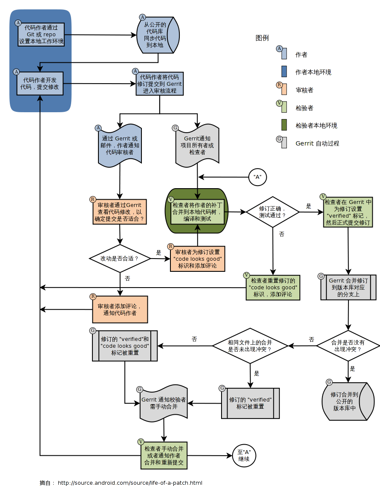

记录一些 Gerrit 相关的信息。

<!-- more -->

Gerrit 是一款基于 Perforce 的代码审查工具，用于在将代码提交到中央代码存储库之前对更改进行同行评审。

Gerrit 是一种开放源代码的代码审查软件，使用网页界面。利用网页浏览器，同一个团队的软件开发者，可以相互审阅彼此修改后的代码，决定是否能够提交，回退或是继续修改。

## 历史

[Gerrit](https://www.gerritcodereview.com/) 名字来自于荷兰设计师 **赫里特·里特费尔德**（Gerrit Rietveld）。

Gerrit Code Review 最初是 [Rietveld](https://github.com/rietveld-codereview/rietveld) 的一组简单补丁，最初是为了服务 Android 开源项目（AOSP）而构建的。因为对访问控制（ACL）相关的修正，而没有被集成到 Rietveld 中，由于功能和代码开始变得截然不同，因此需要不同的名称。

## 技术迭代

- 最早 Gerrit 是由 Python 写成
- 在 Gerrit 2.x 后，改成用 Java 与 SQL，使用 **Google Web Toolkit**（GWT）来产生前端的 JavaScript
- 在 Gerrit 3.x 后，NoteDb 取代了 SQL 数据库，所有元数据现在都存储在 Git 中，用户界面从 GWT 迁移到 Polymer

## 工作流程

Gerrit 大致的工作流程：

1. 编写代码
2. 将代码提交到暂存区（`git add`）
3. 将暂存区的内容提交到本地仓库（`git commit`）
4. 将本地仓库推送到 Gerrit 服务器中（`git push`）
5. 审核人员审核代码
6. 审核通过后提交到代码仓库



## 修改提交检测

Git 提供了一种持续更新提交直到完美的机制，用 `git commit --amend` 命令重新制作（重新记录）代码更改。以这种方式更新提交后，您的分支就会指向新的提交。但是，较旧的（不完美的）修订版本不会丢失。可以通过 `git reflog` 命令找到。

当您将更改推送到 Gerrit 时，Gerrit 无法使用 SHA-1，因为该值在 `git commit --amend` 调用时会发生变化。

Gerrit 通过提交消息中的页脚来标识概念性更改。每个提交消息页脚都包含一个 `Change-Id` 消息挂钩，它唯一标识其所有草稿中的更改。例如：

```bash
Change-Id: I9e29f5469142cc7fce9e90b0b09f5d2186ff0990
```

因此，如果 `Change-Id` 在提交修改时保持不变，Gerrit 会检测到每个新版本都引用相同的概念更改。Gerrit Web 界面对版本进行分组，以便审阅者可以在代码审阅期间看到您的更改如何演变。

对于 Gerrit 来说，标识符可以是随机的。

## Gerrit 特有分支

Gerrit 禁止用户向 Git 的 `refs/heads` 命名空间下的引用执行推送（除非特别的授权），即不允许用户直接向分支进行提交。为了让开发者能够向 Git 服务器提交修订，Gerrit 的 Git 服务器只允许用户向特殊的引用 `refs/for/<branch-name>` 下执行推送，其中 `<branch-name>` 即为开发者的工作分支。向 `refs/for/<branch-name>` 命名空间下推送并不会在其中创建引用，而是为新的提交分配一个 ID，称为 `review-id` ，并为该 `review-id` 的访问建立如下格式的引用 `refs/changes/nn/<review-id>/m`，其中：

- `review-id` 为 Gerrit 为评审任务顺序分配的全局唯一的号码
- `nn` 为 `review-id` 的后两位数，位数不足用零补齐。即 `nn` 为 `review-id` 除以 `100` 的余数
- `m` 为修订号，该 `review-id` 的首次提交修订号为 `1`，如果该修订被打回，重新提交修订号会自增

Gerrit 提供一个特有的分支 `refs/for/*` 用来区分 `commit` 是提交到 Gerrit 服务器进行审核还是直接提交到远程 Git 仓库。

假如一个远程分支为 `master`，只有当代码被提交到 `refs/for/master` 分支时，Gerrit 才会知道，我收到了一个需要审核的代码推送，需要通知审核员来审核代码。当审核通过之后，Gerrit 会自动将这条分支合并到 `master` 主线上，然后邮件通知相关成员，`master` 分支有更新，需要的成员再去 `pull` 就好了。

## 相关文档

- [Gerrit 官网](https://www.gerritcodereview.com/)
- [Gerrit GitHub 地址](https://github.com/GerritCodeReview/gerrit)
- [Gerrit 插件源](https://gerrit-ci.gerritforge.com)
