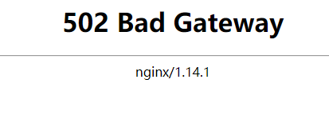

## 问题



**报错日志如下：**

```log
2024/03/19 11:23:41 [error] 462000#0: *22 connect() failed (111: Connection refused) 
while connecting to upstream, client: 10.1.1.1, server: localhost, request: 
"GET /favicon.ico HTTP/1.1", upstream: "http://127.0.0.1:8088/favicon.ico", 
host: "10.1.1.10:8081", referrer: "http://10.1.1.10:8081/login/"
```

## 原因

客户端发送请求时，Nginx 将请求发送到 Gerrit 的 `127.0.0.1:8088` 地址上了，而在 Gerrit 的配置文件中，设置的代理地址为 `proxy-http://10.1.1.10:8088/`，所以导致请求连接被拒绝。

## 解决方法

修改 Gerrit 代理配置文件，将 `proxy_pass` 值设置为 `http://10.1.1.10:8081`：

```conf
server {
    ...
    location / {
        proxy_pass http://10.1.1.10:8088;
        proxy_set_header X-Forwarded-For $remote_addr;
        proxy_set_header Host $host;
    }
}
```

重启 Nginx 服务：

```bash
sudo systemctl restart nginx
```
