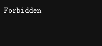

## 问题



查看 `review_site/logs/error_log` 日志：

```bash
ERROR com.google.gerrit.httpd.auth.container.HttpLoginServlet : Unable to authenticate 
user "zhangsan" com.google.gerrit.server.account.AccountException: Cannot assign 
external ID "username:zhangsan" to account 1000010; external ID already in use.
```

## 原因

```bash
cat .ssh/zhangsan_id_rsa.pub | ssh gerrit gerrit create-account --full-name zhangsan --email zhangsan@mail.example.com --ssh-key - zhangsan
htpasswd -m review_site/etc/.password zhangsan
```

使用以上顺序创建 `zhangsan` 用户，`zhangsan` 用户在登录 Gerrit 服务器时会出现上面的错误。

在用 `create-account` 命令创建用户时，会在 Gerrit 数据库中生成对应的用户名与 email 的用户 `external ID`。

正确的创建用户顺序应该是：

```bash
htpasswd -m review_site/etc/.password zhangsan
cat .ssh/zhangsan_id_rsa.pub | ssh gerrit gerrit set-account --full-name zhangsan --add-email zhangsan@mail.example.com --add-ssh-key - zhangsan
```

用 `htpasswd` 命令创建 HTTP 认证时，并没有在 Gerrit 数据库中创建账号信息，当第一次登录成功后，Gerrit 会自动创建同名的 gerrit 用户。

## 解决方法

Gerrit 默认项目 `All-User.git` 用于管理用户信息，在 gerrit 的帮助中，提供了 `external ID` 的信息。

```bash
External IDs are stored as Git Notes in the All-Users repository. The name of the notes branch is refs/meta/external-ids.
```

使用 Gerrit 管理员用户查看 `external-ids` 日志信息，使用 `git clone` 命令克隆 Gerrit 的 `All-User.git` 项目，从裸仓库克隆出一个工作仓库出来：

```bash
mkdir project/
cd project/
git clone ~/review_site/git/All-Users.git

Cloning into 'All-Users'...
done.
Note: switching to '3d75731f927f36cd755b72db1b17e1e0b470142d'.

You are in 'detached HEAD' state. You can look around, make experimental
changes and commit them, and you can discard any commits you make in this
state without impacting any branches by switching back to a branch.

If you want to create a new branch to retain commits you create, you may
do so (now or later) by using -c with the switch command. Example:

  git switch -c <new-branch-name>

Or undo this operation with:

  git switch -

Turn off this advice by setting config variable advice.detachedHead to false
```

使用 `git fetch` 获取并切换到 `external-ids` 分支：

```bash
cd All-Users
git fetch origin refs/meta/external-ids:refs/meta/external-ids
git checkout refs/meta/external-ids

Warning: you are leaving 1 commit behind, not connected to
any of your branches:

  3d75731 Initialized Gerrit Code Review 3.9.1

If you want to keep it by creating a new branch, this may be a good time
to do so with:

 git branch <new-branch-name> 3d75731

HEAD is now at a6dfc98 Create Account via API
```

使用 `git log` 命令查看提交记录：

```bash
git log

commit a6dfc98ea7c42701f43d99e9c1101e08c16338d8 (HEAD)
Author: gerrit <gerrit@10.1.1.10>
Date:   Fri Mar 22 17:36:54 2024 +0800

    Create Account via API

commit 97fa98fd6e3b6e3a3f43ec835ded6794adedfcf2
Author: Gerrit Code Review <gerrit@localhost>
Date:   Fri Mar 22 17:30:13 2024 +0800

    Create Account on First Login

commit b65752d32198b26297a6c2ee158781390c93d3fe
Author: Gerrit Code Review <gerrit@localhost>
Date:   Tue Mar 19 14:28:40 2024 +0800

    Create Account on First Login
```

通过 `create-account` 命令创建用户的 `commit id` 为 `a6dfc98ea7c42701f43d99e9c1101e08c16338d8`。

使用 `git show` 命令查看在此 `commit id` 中有哪些文件产生：

```bash
git show a6dfc98ea7c42701f43d99e9c1101e08c16338d8

commit a6dfc98ea7c42701f43d99e9c1101e08c16338d8 (HEAD)
Author: gerrit <gerrit@10.1.1.10>
Date:   Fri Mar 22 17:36:54 2024 +0800

    Create Account via API

diff --git a/067ecad3e57b04170c4a24e1e9e5e09b150dfa8c b/067ecad3e57b04170c4a24e1e9e5e09b150dfa8c
new file mode 100644
index 0000000..d1d525e
--- /dev/null
+++ b/067ecad3e57b04170c4a24e1e9e5e09b150dfa8c
@@ -0,0 +1,3 @@
+[externalId "mailto:zhangsan@mail.example.com"]
+       accountId = 1000002
+       email = zhangsan@mail.example.com
diff --git a/13bcf42f9ed6cab205e0437a6d38cb32432dfd12 b/13bcf42f9ed6cab205e0437a6d38cb32432dfd12
new file mode 100644
index 0000000..2f32b58
--- /dev/null
+++ b/13bcf42f9ed6cab205e0437a6d38cb32432dfd12
@@ -0,0 +1,2 @@
+[externalId "username:zhangsan"]
+       accountId = 1000002
```

删除在此 `commit id` 中产生的文件：

```bash
rm 067ecad3e57b04170c4a24e1e9e5e09b150dfa8c
rm 13bcf42f9ed6cab205e0437a6d38cb32432dfd12
```

使用 `git commit` 命令将暂存区的内容添加到本地仓库：

```bash
git add .
git commit -am "remove user zhangsan"

[detached HEAD eaae658] remove user zhangsan
 2 files changed, 5 deletions(-)
 delete mode 100644 067ecad3e57b04170c4a24e1e9e5e09b150dfa8c
 delete mode 100644 13bcf42f9ed6cab205e0437a6d38cb32432dfd12
```

使用 `git update-ref` 命令更新引用，应用到 `NoteDb` 数据库：

```bash
git update-ref refs/meta/external-ids $(git rev-parse HEAD)
```

使用 `git push` 命令将本地仓库推送到远程仓库中：

```bash
git push origin HEAD:refs/meta/external-ids

Enumerating objects: 3, done.
Counting objects: 100% (3/3), done.
Delta compression using up to 2 threads
Compressing objects: 100% (2/2), done.
Writing objects: 100% (2/2), 229 bytes | 229.00 KiB/s, done.
Total 2 (delta 1), reused 0 (delta 0), pack-reused 0 (from 0)
To /home/gerrit/project/../review_site/git/All-Users.git/
   a6dfc98..eaae658  HEAD -> refs/meta/external-ids
```

再次登录 Gerrit 服务器即可。
