## 管理员配置

在 Gerrit web 页面，右上角点击 *用户名 -> settings* 或直接点击 *&#x2699;* 图标，进入用户设置页面。

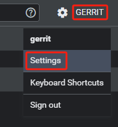

### 添加全名

在 `Profile` 中修改 `Full name` 值，完成后点击 *SAVE CHANGES* 保存。

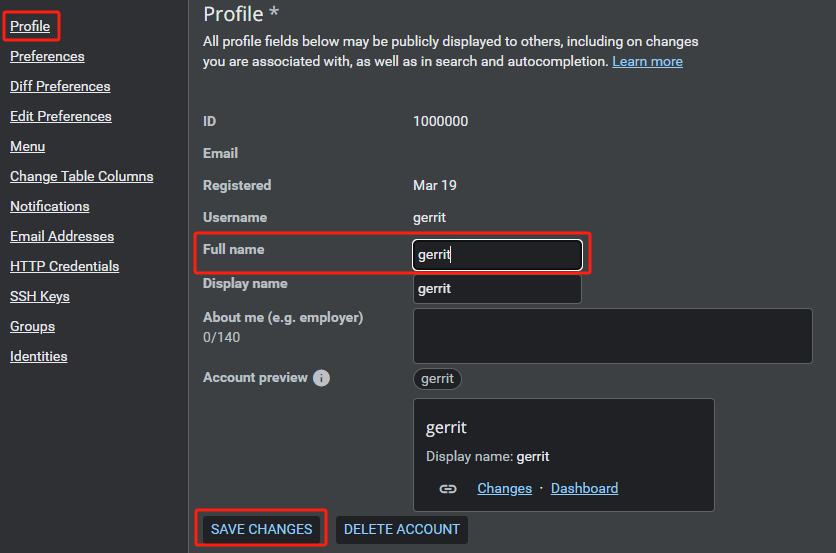

### 日期格式

在 `Preferences` 中修改 `Date/time format` 值为 `24` 小时制，完成后点击 *SAVE CHANGES* 保存。

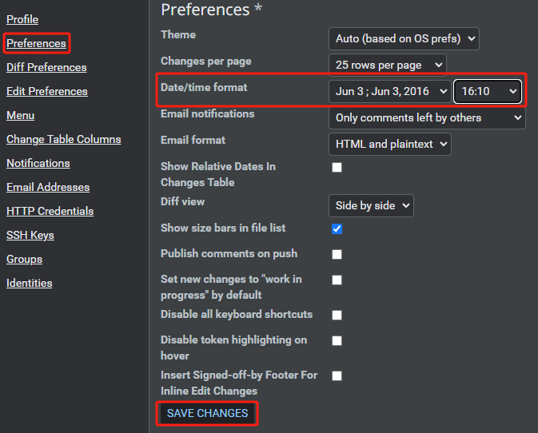

### 勾选 Number

在 `Change Table Columns` 中勾选 `Number` 值，用于查看每个审核的编号，邮件里面显示的编号也是这个，完成后点击 *SAVE CHANGES* 保存。

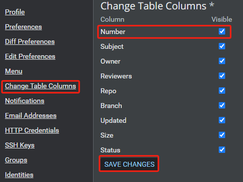

### 添加邮箱

在 `Email Addresses` 中添加 `New email address` 值，完成后点击 *SAVE CHANGES* 保存。

登录邮箱验证是否成功接收邮件。

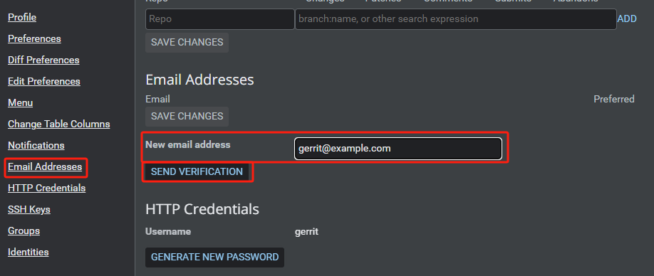

### 添加 SSH Key

在 `gerrit` 用户中生成 `ssh` 公私钥对：

```bash
ssh-keygen -t rsa
```

查看公钥，在 `SSH keys` 中添加 `New SSH key` 值，点击 *ADD NEW SSH KEY* 添加，完成后点击 *SAVE CHANGES* 保存。

```bash
cat /home/gerrit/.ssh/id_rsa.pub
```


## 管理员远程 Gerrit

以下命令用于连接远程 Gerrit 服务器：

```bash
ssh -p 29418 gerrit@10.1.1.10 -l gerrit
```

添加 `~/.ssh/confg` 配置文件，可以实现免密、更改名称的登陆方法，不论您的 `username`、`server address`、`port` 是什么，都可以不用输入，只需要输入一个别名即可登陆该服务器。

在管理员用户中配置 `./ssh/config` 文件：

```bash
Host gerrit
    HostName "10.1.1.10"
    User "gerrit"
    IdentityFile "~/.ssh/id_rsa"
    Port 29418
```

- **Host**：别名
- **HostName**：主机名
- **User**：用户名
- **IdentityFile**：私钥文件认证路径
- **Port**：端口

`User` 要和 Gerrit 服务器上注册的名称保持一致（不是 Full name），认证文件为 `User` 的私钥文件，端口为 Gerrit 服务的 SSH 端口号，这里是默认的 `29418`。

修改 `~/.ssh/confg` 文件权限：

```bash
sudo chmod 600 ~/.ssh/confg
```

输入 `ssh gerrit -l gerrit` 命令测试 SSH 连接 Gerrit 服务器，显示以下信息说明连接成功：

```bash
ssh gerrit -l gerrit

  ****    Welcome to Gerrit Code Review    ****

  Hi gerrit, you have successfully connected over SSH.

  Unfortunately, interactive shells are disabled.
  To clone a hosted Git repository, use:

  git clone ssh://gerrit@10.1.1.10:29418/REPOSITORY_NAME.git

Connection to 10.1.1.10 closed.
```

## 添加并修改普通用户

用 `htpasswd` 命令在 `.password` 文件中添加普通用户 HTTP 认证：

```bash
htpasswd -m review_site/etc/.password zhangsan
```

用以下命令修改普通用户：

```bash
cat .ssh/zhangsan_id_rsa.pub | ssh gerrit gerrit set-account --full-name zhangsan --add-email zhangsan@mail.example.com --add-ssh-key - zhangsan
```

修改用户所在组：

默认 Gerrit 服务将普通用户加入 `Anonymous Users` 组中。创建 `tests` 组，将 `zhangsan` 加入 `tests` 组中。

依次点击 *BROWSE -> Groups -> CREATE NEW*。

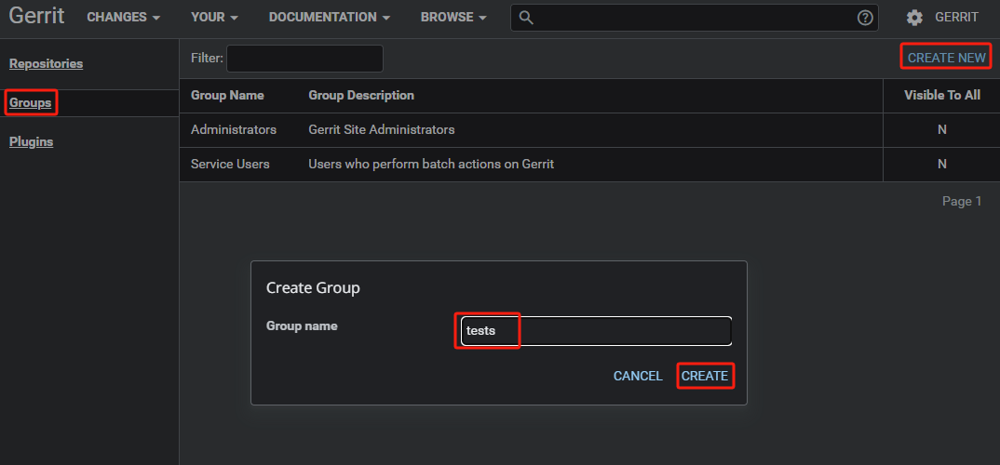

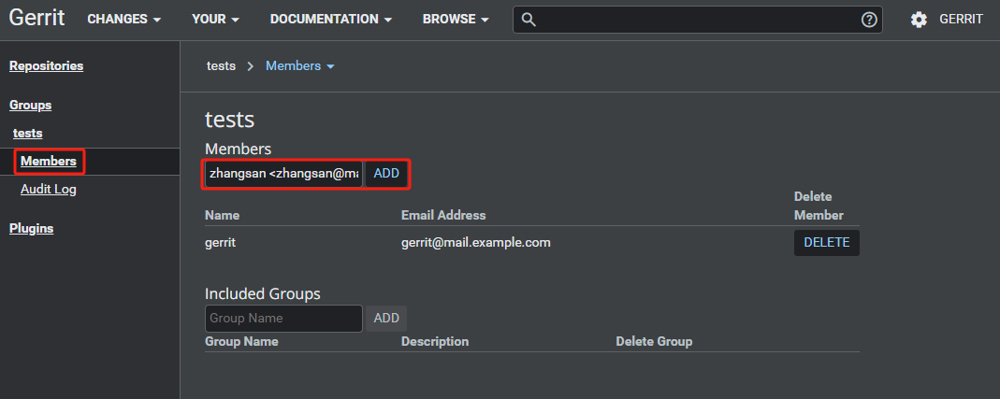

## 新建和修改项目

创建 `test` 项目，依次点击 *BROWSE -> Repositories -> CREATE NEW*。

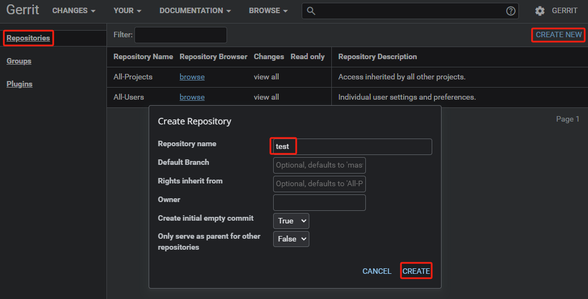

- **Repository name**：项目名
- **Default Branch**：默认分支为 `master`
- **Rights inherit from**：默认权限继承为 `All-Projects`
- **Owner**：属主
- **Create initial empty commit**：是否创建初始空提交
- **Only serve as parent for other repositories**：是否仅作为其他存储库的父存储库

修改 `test` 项目权限，将 Reference 改为 `refs/*`，添加 `Read` 权限。

依次点击 *BROWSE -> Repositories -> tests -> Access -> EDIT -> ADD REFERENCE*。

`test` 项目默认继承 `All-Projects` 组的权限，在修改权限时不要直接修改 `All-Projects` 组的权限，`All-Projects` 组是所有项目的依赖权限组，修改后所有的项目权限都会跟着改变。

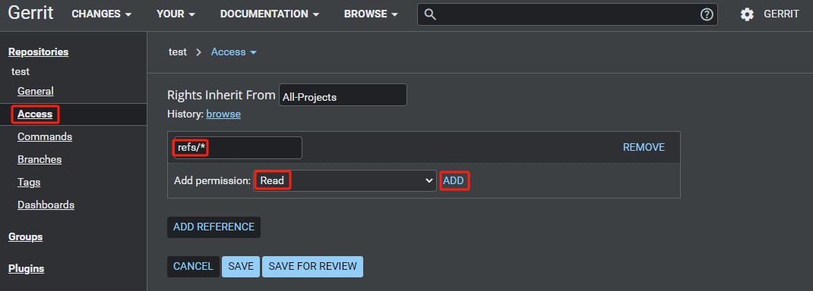

将 `Anonymous Users` 组设置为 `DENY`；`tests` 组设置为 `ALLOW`。只有 `tests` 组可以访问，其他组无法访问：

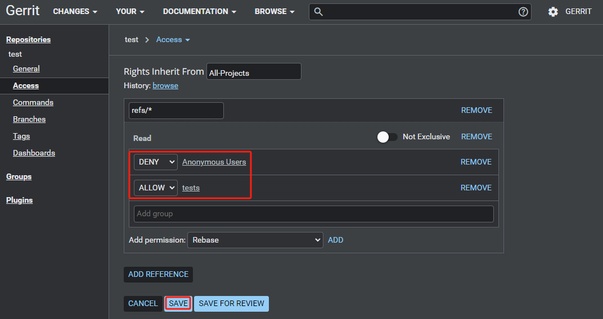

## 普通用户测试

### 克隆项目

使用 `zhangsan` 用户登录 Gerrit Web 服务器，查看 `test` 项目的克隆地址。

用 `zhangsan` 用户克隆 `test` 项目。

```bash
sudo su - zhangsan
mkdir projects
cd projects
git clone "ssh://zhangsan@10.1.1.10:29418/test"
```

### 添加用户身份信息

```bash
cd test
git config --global user.name zhangsan
git config --global user.email zhangsan@mail.example.com
```

### 推送到 Gerrit 服务器中

由于需要 Gerrit 进行审核代码，不能直接推送到远程 Git 仓库中，而是推送到 Gerrit 特有的 `refs/for/*` 分支中。修改推送远程的默认分支：

```bash
git config remote.origin.push refs/heads/*:refs/for/*
```

### 添加 Change-Id

推送时需要带有 `Change-Id`，而当前的提交没有 `Change-Id`。

从 Gerrit 服务器上拉取 `hooks` 文件，`hooks` 文件下的 `commit-msg` 脚本会自动生成 `Change-Id`：

```bash
gitdir=$(git rev-parse --git-dir); scp -p -P 29418 zhangsan@10.1.1.10:hooks/commit-msg ${gitdir}/hooks/
```

::: tip
在第一次克隆项目时，使用提交消息挂钩进行克隆（Clone with commit-msg hook）会直接拉取 `hooks` 文件
:::

### 推送到本地仓库

添加测试文件并提交到本地仓库：

```bash
echo "Hello World!" > test
git add test
git commit -m "add test"

[master e33ee12] add test
 1 file changed, 1 insertion(+)
 create mode 100644 test
```

查看本次 `log` 信息是否带 `Change-Id`：

```bash
git log

commit e564c39767b949b77814ff6ca9fd319d12b43857 (HEAD -> master)
Author: zhangsan <zhangsan@mail.example.com>
Date:   Mon Mar 25 15:45:23 2024 +0800

    add test

    Change-Id: Ic8e2f63e1be2a00f42dd97513e91902754a057c7

commit 9cb4e0bbcd27a7f9fb5ff62dc0aca34cdc9c1874 (origin/master, origin/HEAD)
Author: gerrit <gerrit@mail.example.com>
Date:   Mon Mar 25 14:00:22 2024 +0800

    Initial empty repository
```

上传到 Gerrit 服务器中：

```bash
git push origin master

Enumerating objects: 4, done.
Counting objects: 100% (4/4), done.
Writing objects: 100% (3/3), 288 bytes | 288.00 KiB/s, done.
Total 3 (delta 0), reused 0 (delta 0), pack-reused 0 (from 0)
remote: Processing changes: refs: 1, new: 1, done
remote:
remote: SUCCESS
remote:
remote:   http://10.1.1.10:8088/c/test/+/1 add test [NEW]
remote:
To ssh://10.1.1.10:29418/test
 * [new reference]   master -> refs/for/master
```

### Code-Review 代码审核

使用 `zhangsan` 用户登录 Gerrit Web 服务器，依次点击 *CHANGES -> Open* 即可查看已打开的提交信息：

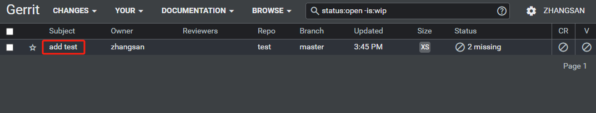

点击 `add test` 进入到当前事件的详情页面，此页面记录了生成的 `Change-Id`、修改的文件、评论等：

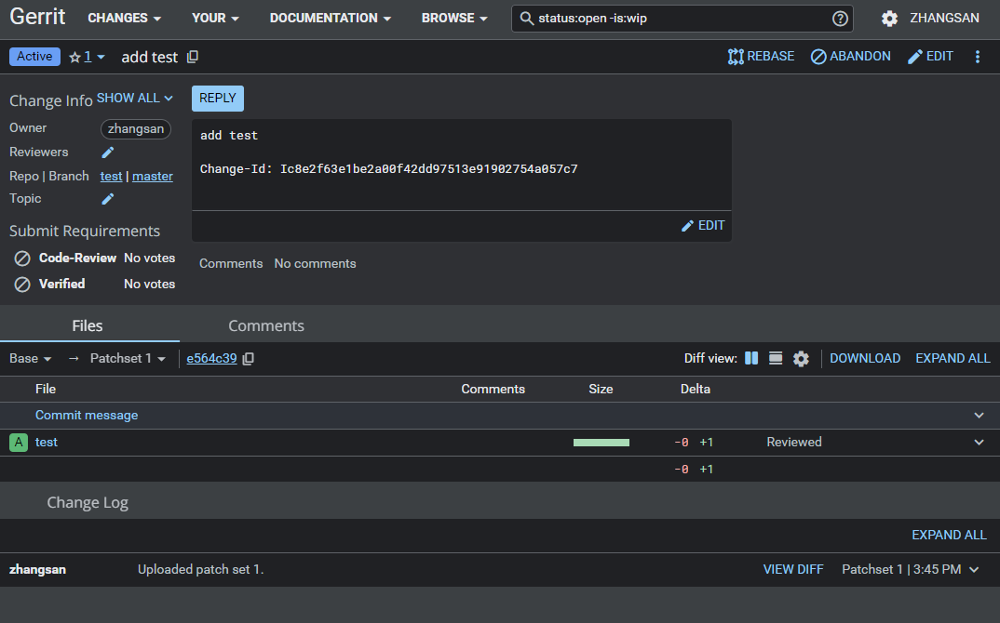

点击 `Reply` 对此次事件进行打分，`Code-Review` 一共有五个选项：`-2`、`-1`、`0`、`+1` 和 `+2`。普通用户只有 `-1`、`0`、`1` 三个选项，只有管理员有五个选项。

各个选项含义如下：

- **-2**：代码有严重的问题，绝对不可以进行合并。**注意**：Any -2 blocks submit
- **-1**：代码看上去不太好，但需要其他评审人再次确认
- **0**：还没仔细去看代码
- **+1**：代码看上去没问题，但需要其他评审人再次确认
- **+2**：代码看看上去不错，同意合并。**注意**：Any +2 enables submit

值得注意的是 `Code-Review` 都是针对于评审者自身的意见而言的，并不代表所有人的意见。

添加 `gerrit` 管理审核人员、自己打分、添加评论：

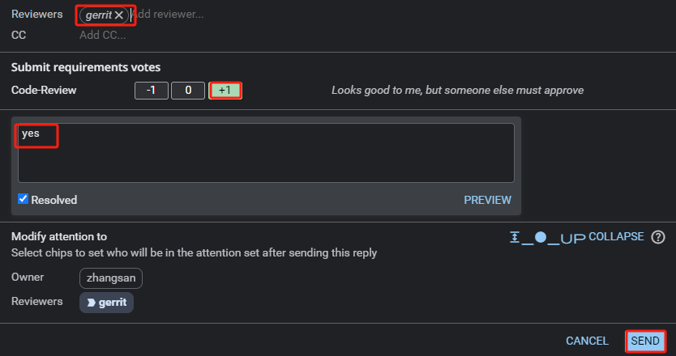

使用 `gerrit` 管理员用户登录 Gerrit Web 服务器，对 `test` 项目进行审核、评论：

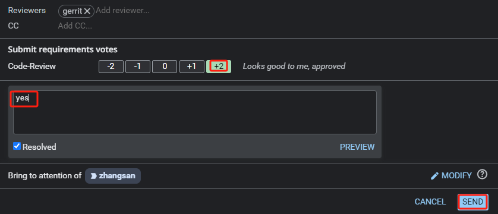

### Verified 代码审核

`Verified` 审核，需要安装 `Verified label` 插件。在初始化安装 Gerrit 时，已经安装上了。

使用 `gerrit` 管理员用户登录 Gerrit Web 服务器，依次点击 *BROWSE -> Repositories -> All-Projects -> Access -> EDIT*。

在 *Reference: refs/heads/\** 中添加 *Label Verified* 审核，并添加 `tests` 组并保存。

对 `add test` 事件进行 `Verified` 打分：

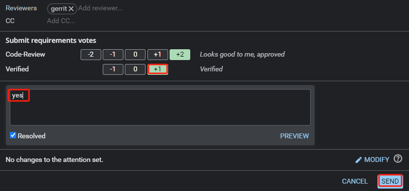

### 提交到主线

`Code-Review` 和 `Verified` 审核结束后，就可以提交到 `master` 分支中。

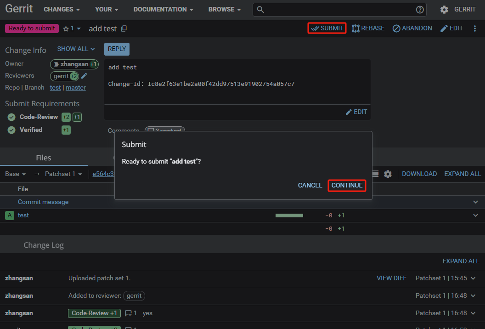

### 查看 test 项目

依次点击 *BROWSE -> Repositories -> tests -> browse*，进入 `Gitiles` 浏览页面。`Gitiles` 是 Git 的可视化工具，在初始化安装 Gerrit 时，已经安装上了。

在 `Gitiles` 浏览页面中，即可查看添加到 `master` 分支的 `test` 文件。

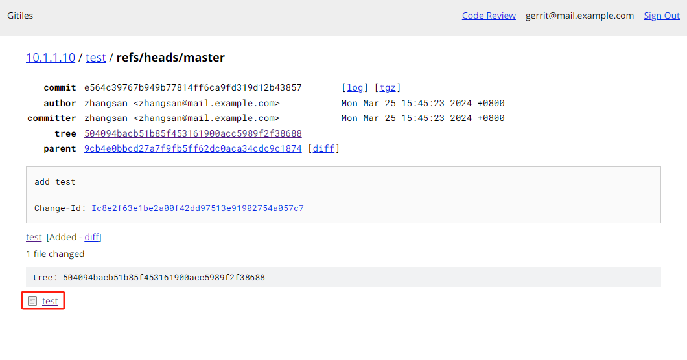
