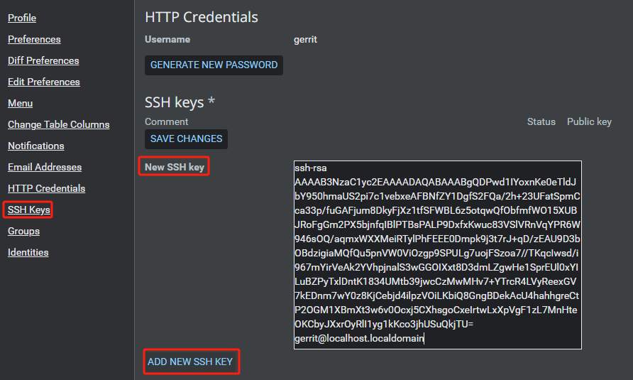

## 管理员配置

在 Gerrit web 页面，右上角点击 *用户名 -> settings* 或直接点击 *&#x2699;* 图标，进入用户设置页面。


### 添加全名

在 `Profile` 中修改 `Full name` 值，完成后点击 *SAVE CHANGES* 保存。


### 日期格式

在 `Preferences` 中修改 `Date/time format` 值为 `24` 小时制，完成后点击 *SAVE CHANGES* 保存。


### 勾选 Number

在 `Change Table Columns` 中勾选 `Number` 值，用于查看每个审核的编号，邮件里面显示的编号也是这个，完成后点击 *SAVE CHANGES* 保存。


### 添加邮箱

在 `Email Addresses` 中添加 `New email address` 值，完成后点击 *SAVE CHANGES* 保存。

登录邮箱验证是否成功接收邮件。


### 添加 SSH Key

在 `gerrit` 用户中生成 `ssh` 公私钥对：

```bash
ssh-keygen -t rsa
```

查看公钥，在 `SSH keys` 中添加 `New SSH key` 值，点击 *ADD NEW SSH KEY* 添加，完成后点击 *SAVE CHANGES* 保存。

```bash
cat /home/gerrit/.ssh/id_rsa.pub
```



## 管理员远程 Gerrit

以下命令用于连接远程 Gerrit 服务器：

```bash
ssh -p 29418 gerrit@10.1.1.10 -l gerrit
```

添加 `~/.ssh/confg` 配置文件，可以实现免密、更改名称的登陆方法，不论您的 `username`、`server address`、`port` 是什么，都可以不用输入，只需要输入一个别名即可登陆该服务器。

在管理员用户中配置 `./ssh/config` 文件：

```bash
Host gerrit
    HostName "10.1.1.10"
    User "gerrit"
    IdentityFile "~/.ssh/id_rsa"
    Port 29418
```

- **Host**：别名
- **HostName**：主机名
- **User**：用户名
- **IdentityFile**：私钥文件认证路径
- **Port**：端口

`User` 要和 Gerrit 服务器上注册的名称保持一致（不是 Full name），认证文件为 `User` 的私钥文件，端口为 Gerrit 服务的 SSH 端口号，这里是默认的 `29418`。

修改 `~/.ssh/confg` 文件权限：

```bash
sudo chmod 600 ~/.ssh/confg
```

输入 `ssh gerrit -l gerrit` 命令测试 SSH 连接 Gerrit 服务器，显示以下信息说明连接成功：

```bash
ssh gerrit -l gerrit

  ****    Welcome to Gerrit Code Review    ****

  Hi gerrit, you have successfully connected over SSH.

  Unfortunately, interactive shells are disabled.
  To clone a hosted Git repository, use:

  git clone ssh://gerrit@10.1.1.10:29418/REPOSITORY_NAME.git

Connection to 10.1.1.10 closed.
```

## 添加普通用户

用 `htpasswd` 命令在 `.password` 文件中添加普通用户 HTTP 认证：

```bash
htpasswd -m review_site/etc/.password zhangsan
```

用命令创建普通用户：

```bash
cat .ssh/zhangsan_id_rsa.pub | ssh gerrit gerrit set-account --full-name zhangsan --add-email zhangsan@mail.example.com --add-ssh-key - zhangsan
```
