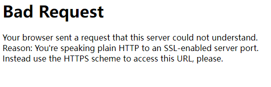
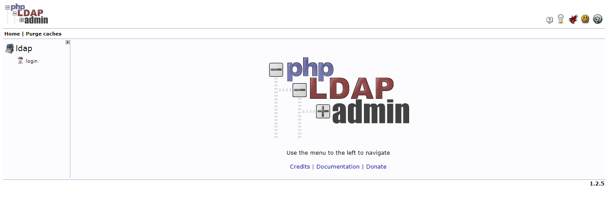
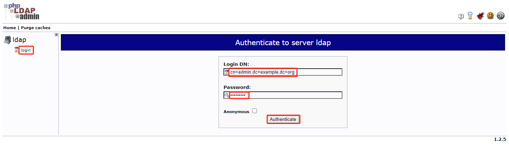
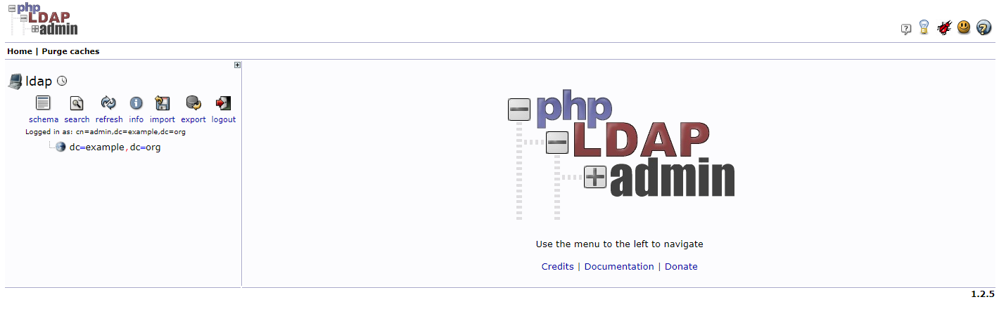
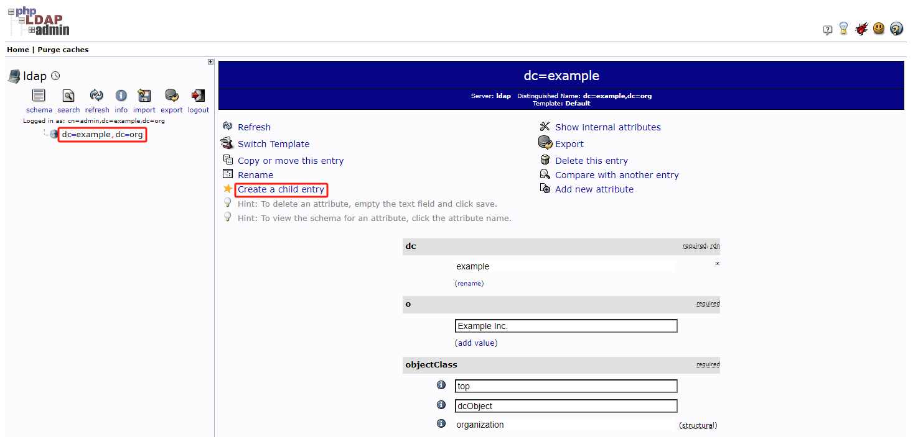
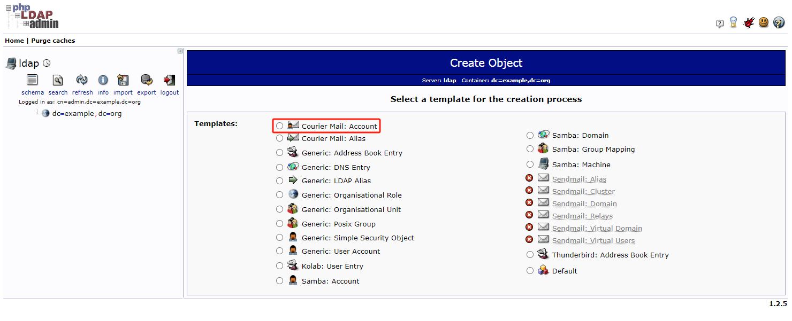
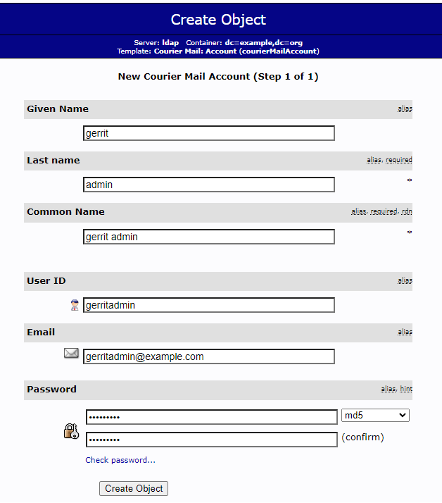
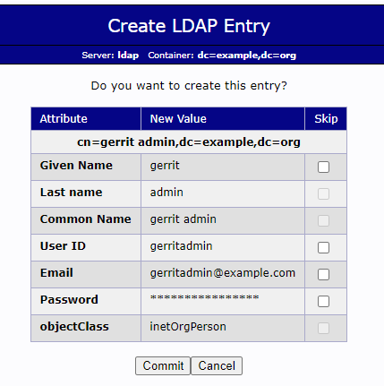
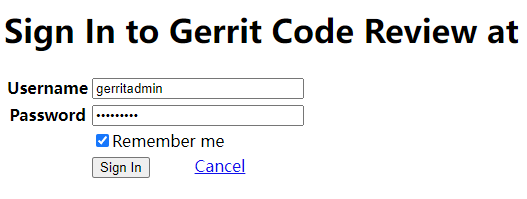
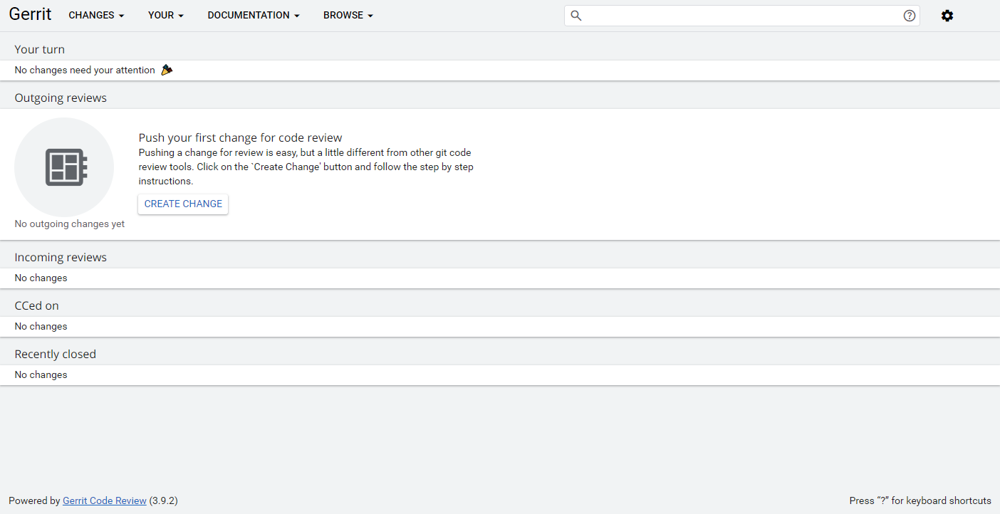

- docker-gerrit [GitHub 地址](https://github.com/GerritCodeReview/docker-gerrit)

## 快速安装

快速启动 Gerrit Code Review 示例（开箱即用），如下所示：

```bash
docker run -ti -p 8080:8080 -p 29418:29418 docker.io/gerritcodereview/gerrit
```

等待几分钟，直到 `Gerrit Code Review NNN ready` 消息出现，其中 `NNN` 是您当前的 Gerrit 版本，然后打开浏览器进行 `http://localhost:8080`，您将进入 Gerrit Code Review。

如果运行以前的 Gerrit Code Review 版本，例如：要运行 `3.8.0` 版本，请使用以下命令：

```bash
docker run -ti -p 8080:8080 -p 29418:29418 docker.io/gerritcodereview/gerrit:3.8.0
```

## 生产环境安装

生产环境中在 Docker 上运行 Gerrit 时，最好依赖比 Docker 内部 AUFS 性能和可靠性更好的物理外部存储，以及外部配置目录（`etc`）以实现更好的变更管理可追溯性。此外，您可能希望使用适当的外部身份验证（例如：`ldap`）。

### 拉取镜像

拉取 Gerrit 服务需要的镜像。

```bash
docker pull gerritcodereview/gerrit 
docker pull osixia/openldap 
docker pull osixia/phpldapadmin
```

### 创建挂载目录

创建挂载数据存储目录。

::: tip
挂载目录也可以不存在，在构建 docker 容器时会自动创建。
:::

```bash
sudo mkdir -p /opt/gerrit/{etc,git,db,index,cache,.ssh}
sudo mkdir -p /opt/gerrit/ldap/{var,etc}
```

### 配置 gerrit.config 文件

::: tip 修改以下参数值
- `canonicalWebUrl`
:::

配置 Gerrit 管理文件：`/opt/gerrit/etc/gerrit.config`。

```bash
[gerrit]
  basePath = git
  # 要访问的 Gerrit 的默认 URL。注意端口号要跟 docker-compose 一致
  canonicalWebUrl = http://localhost:port

[index]
  type = LUCENE

[auth]
  type = ldap
  gitBasicAuth = true

[ldap]
  server = ldap://ldap
  username=cn=admin,dc=example,dc=org
  accountBase = dc=example,dc=org
  accountPattern = (&(objectClass=person)(uid=${username}))
  accountFullName = displayName
  accountEmailAddress = mail

[sendemail]
  smtpServer = localhost  # 使用本地邮箱服务

[sshd]
  listenAddress = *:29418

[httpd]
  listenUrl = http://*:8080/

[cache]
  directory = cache

[container]
  user = root
```

其他邮箱服务配置。例如：配置 163 邮箱服务。

```bash
[sendemail]
  smtpServer = smtp.163.com  # SMTP 邮箱地址
  smtpUser = username@163.com  # SMTP 身份验证用户邮箱地址
  smtpServerPort = 25  # SMTP 监听端口。需要在容器内宿主机上都要开放该端口
  from = username@163.com  # 指定 Gerrit 将在任何生成的电子邮件的 “发件人” 字段中放置的名称和地址
```

### 配置 secure.config 文件

::: tip 修改以下参数值
- `password`
- `smtpPass`
:::

配置认证文件：`/opt/gerrit/etc/secure.config`。

```bash
[ldap]
  password = secret  # ldap 管理员密码
```

如果配置的有邮箱，认证文件如下：

```bash
[ldap]
  password = secret  # ldap 管理员密码
[sendemail]
  smtpPass = XXXXXXXXXXXXXXXX # 配置 SMTP 邮箱 16 位的授权码，不是邮箱密码
```

### 配置 docker-compose 文件

::: tip 修改以下参数值
- `CANONICAL_WEB_URL`
- `LDAP_ADMIN_PASSWORD`
:::

配置 Gerrit docker-compose 文件：`/opt/gerrit/docker-compose.yml`。

```yaml
version: '3'

services:
  gerrit:
    image: docker.io/gerritcodereview/gerrit
    ports:
      - "29418:29418"
      - "8080:8080"
    depends_on:
      - ldap  # ldap 服务启动成功后，再启动 gerrit 服务
    volumes:
      - /opt/gerrit/etc:/var/gerrit/etc
      - /opt/gerrit/git:/var/gerrit/git
      - /opt/gerrit/db:/var/gerrit/db
      - /opt/gerrit/index:/var/gerrit/index
      - /opt/gerrit/cache:/var/gerrit/cache
      - /opt/gerrit/.ssh:/var/gerrit/.ssh
    environment:
      - CANONICAL_WEB_URL=http://localhost:port
    command: init  # 初始化 Gerrit 服务配置，启动完成后注释该项

  ldap:
    image: docker.io/osixia/openldap
    ports:
      - "389:389"
      - "636:636"
    environment:
      - LDAP_ADMIN_PASSWORD=secret
    volumes:
      - /opt/gerrit/ldap/var:/var/lib/ldap
      - /opt/gerrit/ldap/etc:/etc/ldap/slapd.d

  ldap-admin:
    image: docker.io/osixia/phpldapadmin
    ports:
      - "6443:443"
    environment:
      - PHPLDAPADMIN_LDAP_HOSTS=ldap
```

### 初始化 Gerrit

外部文件系统需要事先使用 `gerrit.war` 进行初始化：

- 在 Gerrit 中创建的所有项目和所有用户 Git 存储库
- 在 Git 存储库中创建的系统组 UUID

初始化可以作为启动所有容器之前的一次性操作来完成。

1. 从 docker 运行 Gerrit docker init setup

    取消注释 `docker-compose.yaml` 中的 `command: init` 选项，并在前台使用 `docker compase` 运行 Gerrit 服务。

    ```bash
    docker compose up gerrit
    ```

    等到您在输出中看到该消息 `Initialized /var/gerrit`，然后容器就会退出。

    ::: info 如果出现以下错误

    ```bash
    gerrit-gerrit-1  | fatal: /var/gerrit/etc/mail
    gerrit-gerrit-1  | fatal: Cannot make directory /var/gerrit/etc/mail
    gerrit-gerrit-1 exited with code 128
    ```

    修改 gerrit 挂载目录权限，再重新使用 `docker compase` 运行 Gerrit 服务即可。

    ```bash
    sudo chown -R 1000:1000 /opt/gerrit
    ```

    :::

2. 以守护进程模式启动 Gerrit

    注释掉 `docker-compose.yaml` 中的 `command: init` 选项并启动所有节点服务：

    ```bash
    sudo sed -i "s/command/# command/g" docker-compose.yml
    docker compose up -d
    ```

## 创建 Gerrit 账号

第一个登录 Gerrit 的用户被视为初始管理员。

使用 PhpLdapAdmin 在 OpenLDAP 中注册用户，访问 phpldapadmin 服务：`http://localhost:6443`。



此错误是因为使用 HTTP 访问造成，应使用 HTTPS 访问 phpldapadmin 服务：`https://localhost:6443`。



点击 *login*，使用 `cn=admin,dc=example,dc=org` 用户名和 `secret` 密码登录 PhpLdapAdmin。





为 Gerrit 管理员创建一个类型为 “Courier Mail Account” 的新子节点。依次点击 *dc=example,dc=org -> Create a child entry -> Courier Mail Account*





创建 Gerrit 管理员账号信息。例如：

- **Given Name**：gerrit
- **Last Name**：admin
- **Common Name**：Gerrit Admin
- **User ID**：gerritadmin
- **Email**：gerritadmin@example.com
- **Password**：secret

验证您的数据是否正确，然后将更改提交到 LDAP。





## 登录 Gerrit 服务

访问 Gerrit 服务：`http://localhost:port`，`localhost` 为 Gerrit 服务地址，`port` 为 Gerrit 服务端口。




