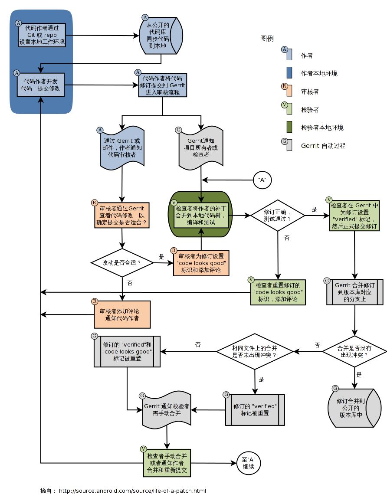

## 历史

[Gerrit](https://www.gerritcodereview.com/index.html) 名字来自于荷兰设计师 **赫里特·里特费尔德**（Gerrit Rietveld）。

`Gerrit Code Review` 最初是 [Rietveld](https://github.com/rietveld-codereview/rietveld) 的一组简单补丁，最初是为了服务 Android 开源项目（AOSP）而构建的。因为对访问控制（ACL）相关的修正，而没有被集成到 `Rietveld` 中，由于功能和代码开始变得截然不同，因此需要不同的名称。

## 简介

`Gerrit` 一种开放源代码的代码审查软件，使用网页界面。利用网页浏览器，同一个团队的软件开发者，可以相互审阅彼此修改后的代码，决定是否能够提交，回退或是继续修改。它使用版本控制系统 `Git` 作为底层。

## 技术迭代

最早它是由 `Python` 写成，在 `Gerrit 2.x` 后，改成用 `Java` 与 `SQL`。使用 **Google Web Toolkit**（GWT） 来产生前端的 `JavaScript`。由于 `Gerrit 3.x` 中 `NoteDb` 取代了 `SQL` 数据库，所有元数据现在都存储在 `Git` 中。用户界面从 `GWT` 迁移到 `Polymer`。

## 工作流程

Gerrit 大致的工作流程：

- 编写代码
- 将代码提交到暂存区（git add）
- 将暂存区的内容提交到本地仓库（git commit）
- 将本地仓库推送到 Gerrit 服务器中（git push）
- 审核人员审核代码
- 审核通过后提交到代码仓库



## 修改提交检测

Git 提供了一种持续更新提交直到完美的机制，用 `git commit --amend` 命令重新制作（重新记录）代码更改。以这种方式更新提交后，您的分支就会指向新的提交。但是，较旧的（不完美的）修订版本不会丢失。可以通过 `git reflog` 命令找到。

当您将更改推送到 Gerrit 时，Gerrit 无法使用 `SHA-1`，因为该值在 `git commit --amend` 调用时会发生变化。

Gerrit 通过提交消息中的页脚来标识概念性更改。每个提交消息页脚都包含一个 `Change-Id` 消息挂钩，它唯一标识其所有草稿中的更改。例如：

```bash
Change-Id: I9e29f5469142cc7fce9e90b0b09f5d2186ff0990
```

因此，如果 `Change-Id` 在提交修改时保持不变，Gerrit 会检测到每个新版本都引用相同的概念更改。Gerrit Web 界面对版本进行分组，以便审阅者可以在代码审阅期间看到您的更改如何演变。

对于 Gerrit 来说，标识符可以是随机的。

## 提交到 Gerrit 特有分支

Gerrit 提供一个特有的分支 `refs/for/*` 用来区分 `commit` 是提交到 Gerrit 服务器进行审核还是直接提交到远程 Git 仓库。

假如一个远程分支为 `master`，只有当代码被提交到 `refs/for/master` 分支时，Gerrit 才会知道，我收到了一个需要审核的代码推送，需要通知审核员来审核代码。当审核通过之后，Gerrit 会自动将这条分支合并到 `master` 主线上，然后邮件通知相关成员，`master` 分支有更新，需要的成员再去 `pull` 就好了。
