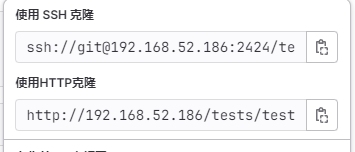

## 问题

用 HTTP 方式克隆没有携带自定义端口号。



## 原因

Docker 安装 GitLab 时，自定义访问端口（如：`8888`），使用 HTTP 方式克隆项目时，URL 没有携带自定义的端口号（`8888`），而是使用默认的端口（`80`）。

## 解决方法

### 解决方法 1

修改 `docker-compose.yml` 文件中 `external_url` 和 `ports` 的值：

```shell
external_url "http://gitlab.example.com:8888"

ports:
  - '8888:8888'
```

查看官网 [使用 Docker Compose 安装](https://docs.gitlab.cn/jh/install/docker.html#%E4%BD%BF%E7%94%A8-docker-compose-%E5%AE%89%E8%A3%85%E6%9E%81%E7%8B%90gitlab) 极狐 Gitlab。

再次访问 GitLab 界面，问题解决：


### 解决方法 2

进入到容器内部：

```shell
sudo docker exec -it <容器 ID 或名称> /bin/bash
```

修改 `gitlab.yml` 文件内容：

```shell
cd /opt/gitlab/embedded/service/gitlab-rails/config
vi gitlab.yml
```

将 `port` 修改为您自定义的端口号（如：`8888`）：

```shell
# ......省略部分内容
  gitlab:
    ## Web server settings (note: host is the FQDN, do not include http://)
    host: 192.168.52.186
    port: 8888
    https: false
# ......省略部分内容
```

在容器中重启 GitLab：

```shell
gitlab-ctl restart
```

再次访问 GitLab 界面，问题解决：


