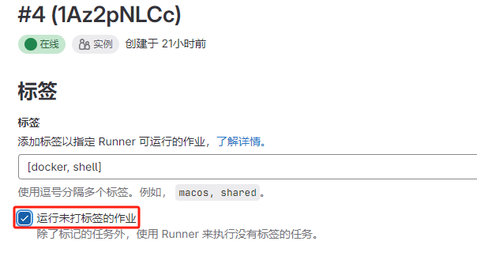

## 问题

此作业已阻塞，因为该项目没有分配任何可用 Runner。


## 原因

因为 `.gitlab-ci.yml` 文件中的作业没有指定任何标签（`tags`），且 GitLab Runner 实例被配置为只运行指定标签的作业。

## 解决方法

### 解决方法 1

在 `.gitlab-ci.yml` 文件中指定 `tags`，例如：指定包含 `shell` 标签的 Runner 实例。

```yaml
build-job:
  stage: build
  tags:
    - "shell"
  script:
    - echo "Hello, $GITLAB_USER_LOGIN!"

test-job1:
  stage: test
  script:
    - echo "This job tests something"
  tags:
    - "shell"

test-job2:
  stage: test
  tags:
    - "shell"
  script:
    - echo "This job tests something, but takes more time than test-job1."
    - echo "After the echo commands complete, it runs the sleep command for 20 seconds"
    - echo "which simulates a test that runs 20 seconds longer than test-job1"
    - sleep 20

deploy-prod:
  stage: deploy
  tags:
    - "shell"
  script:
    - echo "This job deploys something from the $CI_COMMIT_BRANCH branch."
  environment: production
```

### 解决方法 2

选择 Runner 实例，点击编辑（:pencil2:）：


允许 Runner 运行未打标签的作业。


