## 基础配置

### 修改语言

- 修改整个 极狐GitLab 实例的默认语言

    在 极狐GitLab 实例页面左侧边栏的底部，选择 *Admin Area -> Settings -> Preferences -> Localization*，然后选择您所需的默认语言，点击 *Save changes* 保存。

    

- 修改个人账户 极狐GitLab 实例的默认语言

    在 极狐GitLab 实例页面左侧边栏的右上角，选择 *头像 -> Preferences -> Localization*，然后选择您所需的默认语言，点击 *Save changes* 保存。

    修改后需要刷新页面才能查看更新后的语言。

    

### 修改管理员密码

在安装 极狐GitLab 实例时，没有配置初始密码的情况下，默认初始管理员密码是随机的一串字符不好记忆，需要修改密码。

密码更新成功后，您将被重定向到登录页面，您可以使用新密码重新登录。


### 修改时区

极狐GitLab 实例默认时区是 `UTC`。

- 全局时区

    全局时区有以下两种配置方法：

    1. 在安装 极狐GitLab 实例时配置时区参数。例如：`gitlab_rails['time_zone'] = 'Asia/Shanghai'`
    2. 修改 `/etc/gitlab/gitlab.rb` 文件中 `gitlab_rails['time_zone']` 参数值并重启 GitLab。例如：`gitlab_rails['time_zone'] = 'Asia/Shanghai'`

- 个人时区

    在 极狐GitLab 实例页面左侧边栏的右上角，选择 *头像 -> 编辑个人资料 -> 用户资料 -> 时间设置*，然后选择您所需的时区，点击 *更新个人资料设置* 保存。

    

### 注册限制

刚安装的 极狐GitLab 实例默认允许任何人注册账户，应该限制注册。


点击 *停用*，跳转到 *注册限制* 页面；或在 极狐GitLab 实例页面左侧边栏的底部，选择 *管理中心 -> 设置 -> 通用 -> 注册限制*。

清除 *已启用注册功能* 复选框，然后在下面选择 *保存更改*。


## 配置 SMTP

如果您希望通过一个 SMTP 服务器发送应用邮件，而不是通过 Sendmail，需要在 `/etc/gitlab/gitlab.rb` 中添加以下配置信息，并执行 `gitlab-ctl reconfigure` 命令重新配置 GitLab 服务。

参考 极狐GitLab [官网 SMTP 配置](https://docs.gitlab.cn/omnibus/settings/smtp.html)。

### 配置网易 163 邮箱

例如：配置网易 163 邮箱 SMTP 服务，修改 `/etc/gitlab/gitlab.rb` 文件中以下配置信息：

```ruby
gitlab_rails['smtp_enable'] = true  # 启用 SMTP 服务
gitlab_rails['smtp_address'] = "smtp.163.com"  # 配置 SMTP 服务器地址
gitlab_rails['smtp_port'] = 465  # 配置 SMTP 服务的端口号
gitlab_rails['smtp_user_name'] = "xxx@163.com"  # 配置 SMTP 服务器身份验证用户名
gitlab_rails['smtp_password'] = "smtp password"  # 配置 SMTP 授权码
gitlab_rails['smtp_domain'] = "smtp.163.com"  # 配置 SMTP 服务的域名
gitlab_rails['smtp_authentication'] = "login"  # 配置 SMTP 认证方法
gitlab_rails['smtp_enable_starttls_auto'] = false  # 禁用 SMTP 服务器的 STARTTLS 自动启用，通常使用端口 587
gitlab_rails['smtp_tls'] = true  # 启用 TLS（传输层安全性），通常使用端口 465
gitlab_rails['smtp_pool'] = true  # 启用 SMTP 连接池

gitlab_rails['smtp_openssl_verify_mode'] = 'peer'  # 配置 OpenSSL 的验证模式

gitlab_rails['gitlab_email_from'] = 'xxx@163.com'  # 配置 GitLab 发送电子邮件时所使用的地址
gitlab_rails['gitlab_email_display_name'] = "My GitLab Server"  # 配置 GitLab 在发出的电子邮件中的显示名称
```

- **smtp_authentication**：用于设置 SMTP 服务器认证方法
    - **login**：使用登录类型的认证
    - **plain**：使用明文认证
    - **cram_md5**：使用 CRAM-MD5 认证
    - **gssl**：使用 GSSAPI 认证

- **smtp_openssl_verify_mode**：通常，建议设置为 `peer` 或 `none`，具体取决于您是否信任您的 SMTP 服务器
    - **none**：不检查证书的有效性
    - **peer**：检查证书的有效性，但不是客户端证书
    - **client_once**：检查证书的有效性，并要求客户端证书
    - **fail_if_no_peer_cert**：如果没有收到证书，会断开连接
    - **client_once**：类似 `fail_if_no_peer_cert`，但是如果没有收到证书，会继续连接

执行 `gitlab-ctl reconfigure` 命令重新配置 GitLab 服务。

### 测试 SMTP 配置

可以使用 Rails 控制台验证是否可以正确发送电子邮件。

在 极狐GitLab 服务器上，执行 `gitlab-rails console` 命令进入控制台。然后，您可以在控制台提示符下输入以下命令，以使系统发送测试电子邮件：

```bash
Notify.test_email('destination_email@address.com', 'Message Subject', 'Message Body').deliver_now
```

### 使用加密凭据

引入于 14.3 版本。选择使用加密文件作为 SMTP 凭据，而不是将 SMTP 凭据以纯文本形式存储在配置文件中。

加密文件支持的配置项有：

- `user_name`：对应 `gitlab_rails['smtp_user_name']` 参数
- `password`：对应 `gitlab_rails['smtp_password']` 参数

1. 编辑加密的 `secret`

    ```bash
    sudo gitlab-rake gitlab:smtp:secret:edit EDITOR=vim
    ```

2. SMTP secret 的未加密内容应输入如下：

    ```bash
    user_name: 'smtp user'
    password: 'smtp password'
    ```

3. 编辑 `/etc/gitlab/gitlab.rb` 并删除 `smtp_user_name` 和 `smtp_password` 的设置
4. 重新配置 极狐GitLab

    ```bash
    sudo gitlab-ctl reconfigure
    ```

## 添加 SSH 密钥

在 极狐GitLab 服务器中生成 SSH 密钥：

```bash
ssh-keygen -t rsa
```

在 极狐GitLab 实例页面左侧边栏的右上角，选择 *头像 -> 编辑个人资料 -> 用户资料 -> SSH 密钥*。

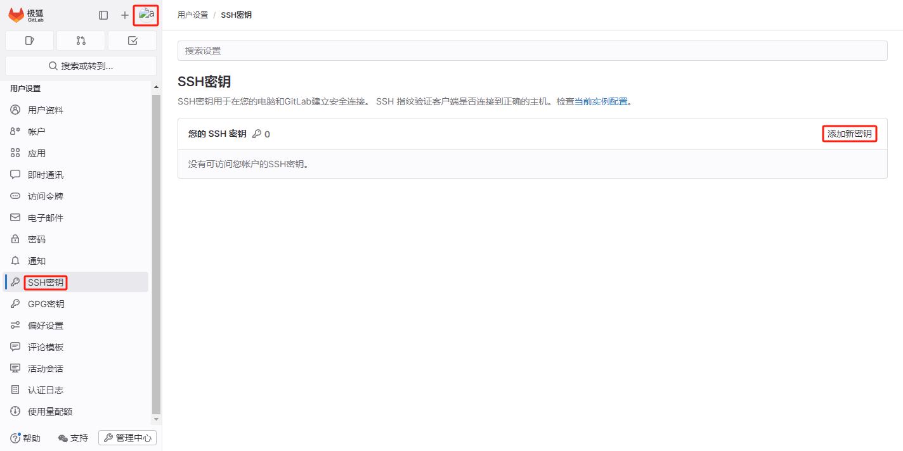

点击 *添加新密钥*。将刚生成的 SSH 公钥文件（`id_rsa.pub`）内容复制到 GitLab SSH 中。点击 *添加密钥*。

```bash
cat ~/.ssh/id_rsa.pub
```

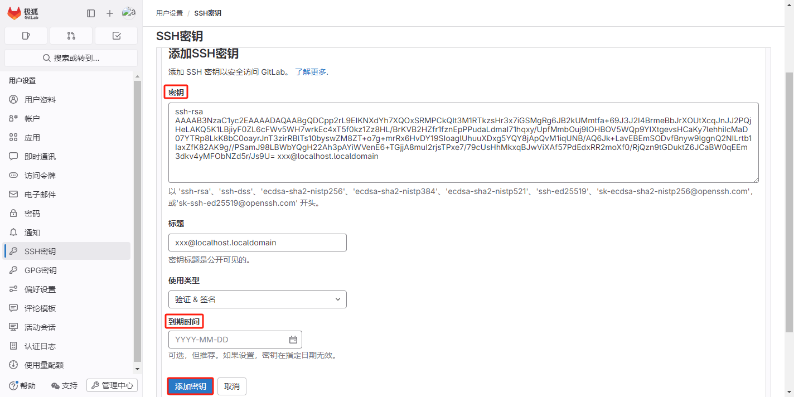

## 基本操作

### 创建用户

管理员可以手动创建用户：

在 极狐GitLab 实例页面左侧边栏的底部，选择 *管理中心 -> 用户 -> 新用户*。

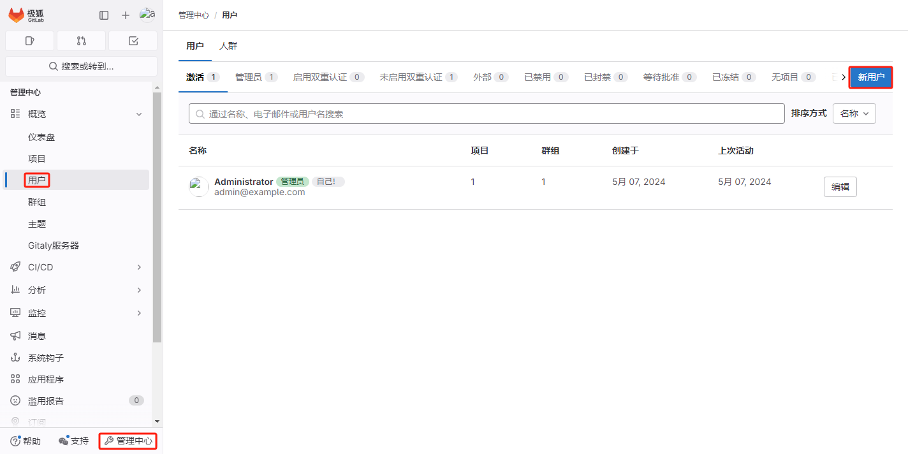

- **名称**：用于 GitLab 页面显示名。例如：`Administrator`
- **用户名**：用于 GitLab 登录。例如：`root`
- **电子邮箱**：用于连接用户邮箱
- **访问级别**：普通、管理员

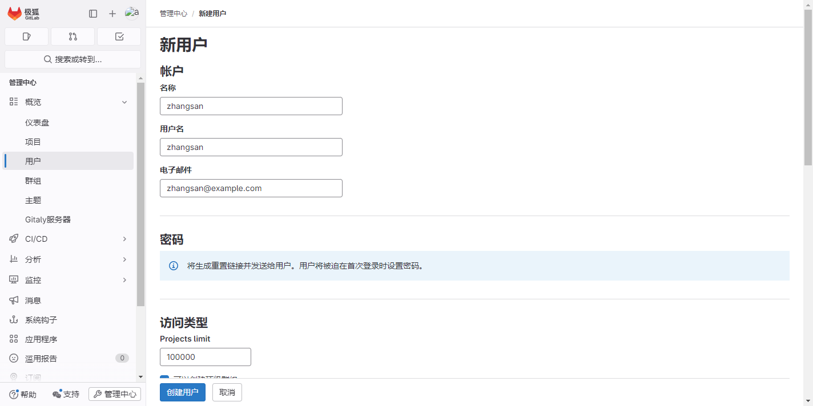

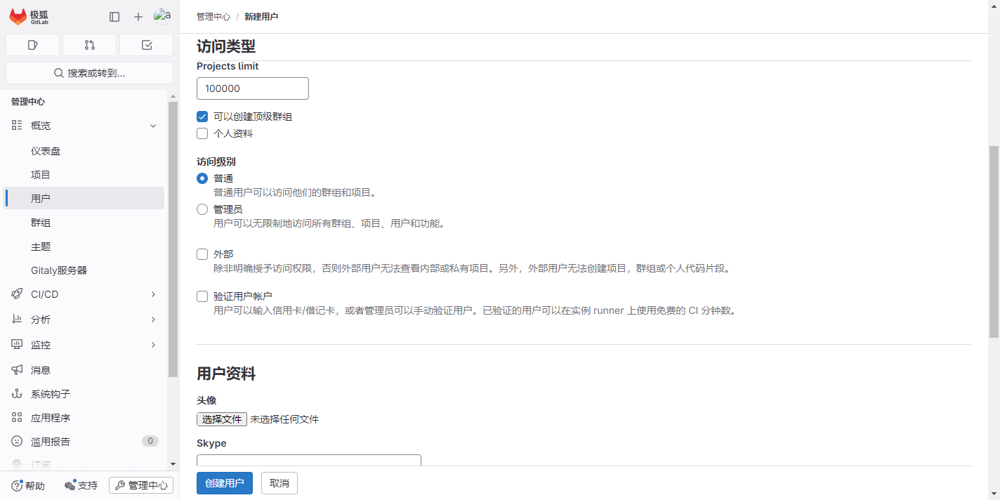

重置链接会发送到用户的电子邮件，他们必须在首次登录时设置密码。

要在不依赖电子邮件确认的情况下设置用户密码，点击 *编辑*，配置用户初始密码。

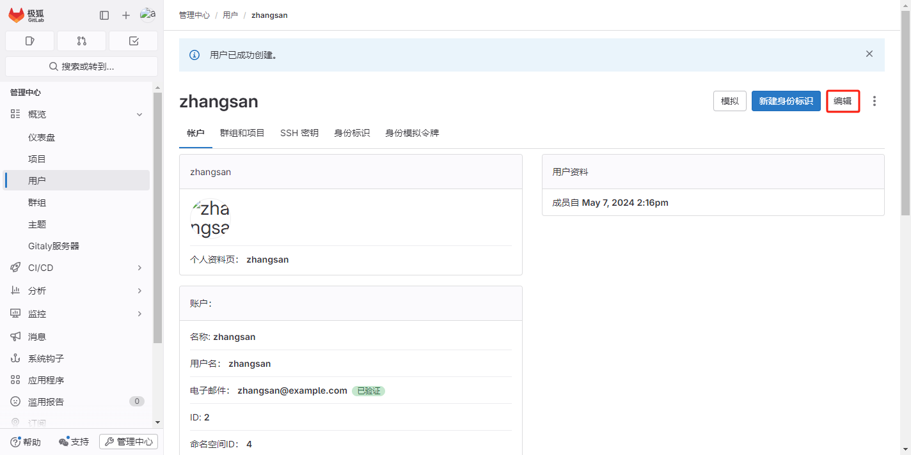

配置用户初始密码，点击 *保存更改。*

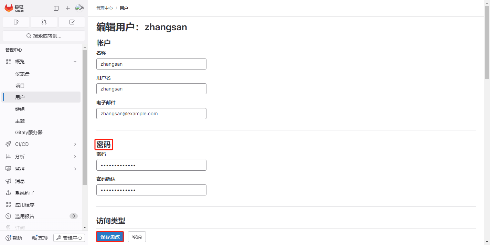

### 创建群组

在 极狐GitLab 实例页面左侧边栏的左上角，选择 *极狐图像 -> 群组 -> 新建群组*。

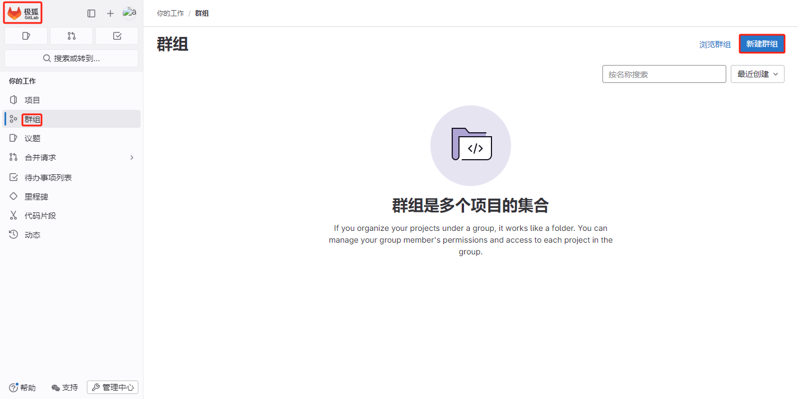

选择 *创建群组*。

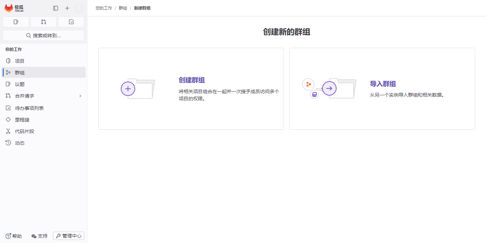

选择输入以下内容 *创建群组*：

- **群组名称**：组名必须以字母、数字、表情或下划线开头，可以包含句点、破折号、空格和括号
- **群组 URL**：输入群组的路径，该路径用于命名空间
- **可见性级别：**
    - **私有**：群组及其项目只能由成员查看
    - **内部**：除外部用户外，任何登录用户均可查看该群组和任何内部项目
    - **公开**：群组和任何公开项目可以在没有任何身份验证的情况下查看

- **个性化您的 GitLab 体验**：
    - **您的角色是什么**：软件开发人员、开发团队负责人、DevOps 工程师、系统管理员、安全分析师、数据分析、产品经理、产品设计师、其他
    - **谁在使用这个群组**：我的公司或团队、仅我自己
    - **您用这个群组来做什么**：我想学习 Git 基础知识、我想把我的仓库从其它地方移动到 GitLab、我想存储我的代码、我想探索 GitLab，看看是否值得切换到这里、我想在我的现有仓库上使用 GitLab CI、一个不同的原因

- **邀请 极狐GitLab 成员或其他用户加入群组**

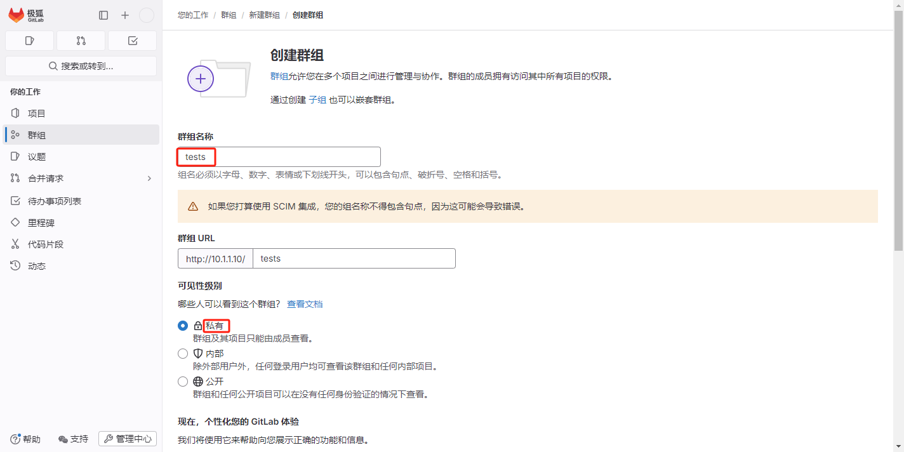

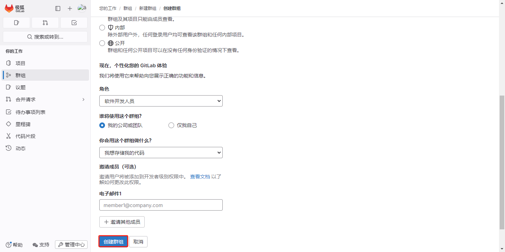

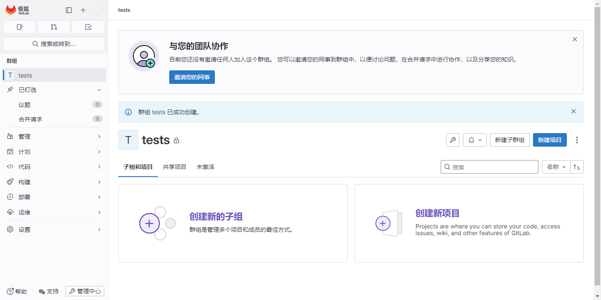

在 极狐GitLab 中，您可以使用群组同时管理一个或多个相关项目。对群组的操作（如：创建群组、删除群组、添加用户到群组等）可以参考 极狐GitLab [官网群组文档](https://docs.gitlab.cn/jh/user/group/)。

### 创建项目

在 极狐GitLab 实例页面左侧边栏的左上角，选择 *极狐图像 -> 项目 -> 创建项目*。

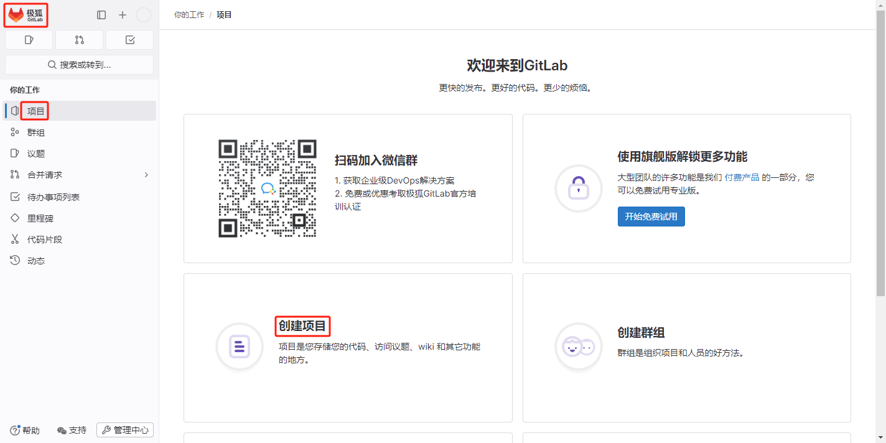

选择 *创建空白项目*。

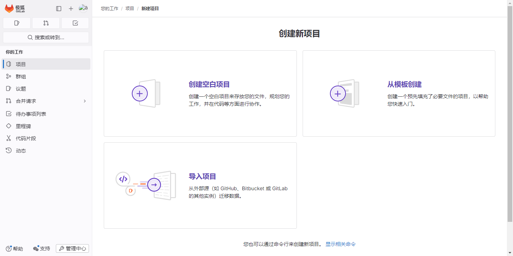

选择输入以下内容 *创建项目*：

- **项目名称**：必须以小写或大写字母、数字、表情符号或下划线开头。也可以包含点、加号、破折号或空格
- **项目 URL**：选择项目所在的群组
- **项目标识串**：输入项目的路径
- **可见性级别**：私有、内部、公开
- **项目配置**

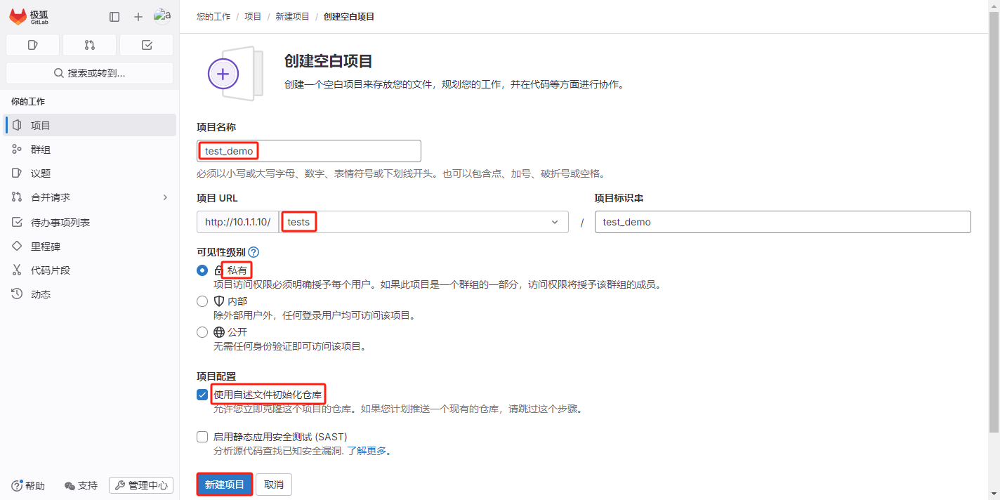

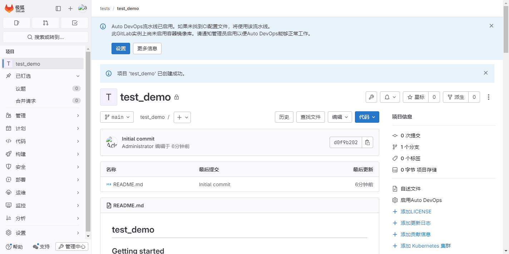

::: info 分支保护
团队开发时为了避免一些重要的开发分支（main）被意外篡改，管理人员需要将这些重要的分支设置分支保护，这样普通开发人员就不能直接对代码进行推送和合并，需要专门的分支管理人员（开发组长）维护重要分支的提交或合并操作。`main` 分支默认受保护。
:::

### 将用户添加到项目

将用户添加到项目中，以便他们成为成员并有权执行操作。

在 极狐GitLab 实例页面左侧边栏的左上角，选择 *极狐图像 -> 项目 -> 选择要添加用户的项目（例如：test_demo） -> 管理 -> 成员 -> 邀请成员*。

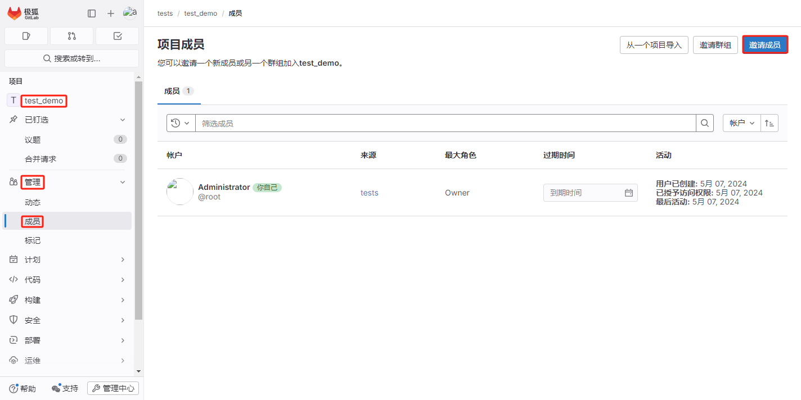

- **用户名**
- **选择角色**：角色权限依次递增。访客（`10`） -> 报告者（`20`） -> 开发者（`30`） -> 维护者（`40`） -> 拥有者（`50`）
    - **Guest（访客）**：可以创建 issue、发表评论，不能访问项目的私有分支和查看代码
    - **Reporter（报告者）**：可以克隆项目、创建 issue、发表评论，不能推送到非保护分支
    - **Developer（开发者）**：可以克隆项目、创建 issue、发表评论，可以推送到非保护分支，可以接收已合并的代码
    - **Maintainer（维护者）**：可以克隆项目、创建 issue、发表评论、推送到非保护分支、接收已合并的代码，还可以推送到保护分支、删除未保护的分支和标签
    - **Owner（拥有者）**：可以管理项目、包括更改项目设置、删除项目等操作

- **访问到期日期（可选）**

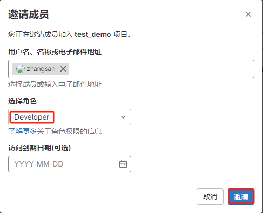

### 管理员用户上传代码

使用管理员用户（`root`）登录 GitLab 服务器。

将 `test_demo` 项目使用 SSH 克隆到本地。

```bash
git clone ssh://git@192.168.52.186:2424/tests/test_demo.git
```

设置 Git 用户和邮箱：

```bash
cd test_demo
git config user.name "Administrator"
git config user.email "root@example.com"
```

在 `test_demo` 项目中添加文件并上传：

```bash
touch hello.sh
echo "echo 'Hello World!'" > hello.sh
chmod +x hello.sh
git add hello.sh
git commit -m "add hello.sh"

vim README.md
git add README.md
git commit -m "change README.md"

git push origin main
```

刷新 GitLab 中 `test_demo` 项目页面，查看上传的文件及脚本。

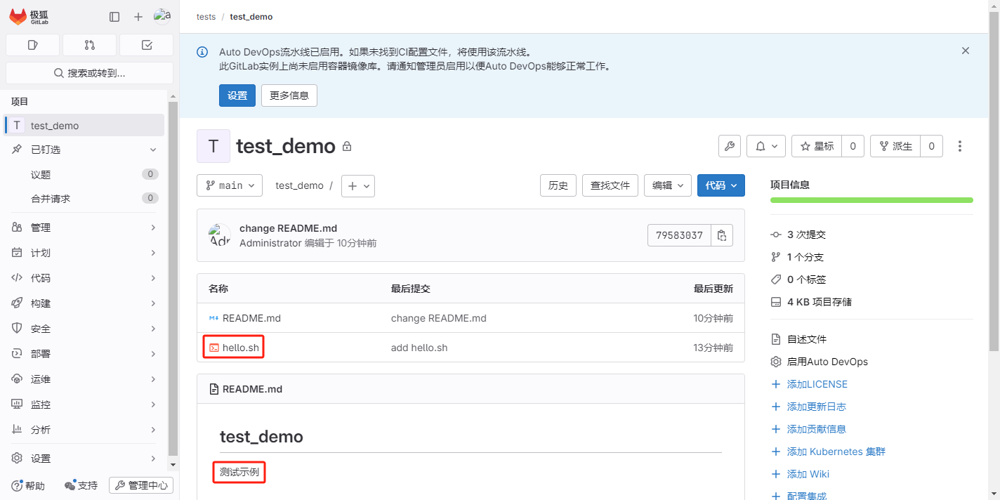

### 普通开发用户上传代码

使用普通开发用户（`zhangsan`）登录 GitLab 服务器。配置普通开发用户（`zhangsan`）[SSH 密钥](#添加-ssh-密钥)。

将 `test_demo` 项目使用 SSH 克隆到本地。

```bash
git clone ssh://git@192.168.52.186:2424/tests/test_demo.git
```

设置 Git 用户和邮箱：

```bash
cd test_demo
git config user.name "zhangsan"
git config user.email "zhangsan@example.com"
```

在 `test_demo` 项目中添加文件并上传：

```bash
touch test
echo "test" > test
git add test
git commit -m "add test"

git push origin main
Counting objects: 3, done.
Delta compression using up to 8 threads.
Compressing objects: 100% (2/2), done.
Writing objects: 100% (3/3), 309 bytes | 309.00 KiB/s, done.
Total 3 (delta 0), reused 0 (delta 0)
remote: GitLab: You are not allowed to push code to protected branches on this project.
To ssh://192.168.52.186:2424/tests/test_demo.git
 ! [remote rejected] main -> main (pre-receive hook declined)
error: failed to push some refs to 'ssh://git@192.168.52.186:2424/tests/test_demo.git'
```

普通开发用户（`zhangsan`）无法上传到 `main` 分支，`main` 分支默认受保护。

普通开发用户（`zhangsan`）创建分支，并推送到远程仓库。

```bash
git branch dev
git push -u origin dev:dev
```

在 GitLab 页面，查看 `test_demo` 项目 `dev` 分支。

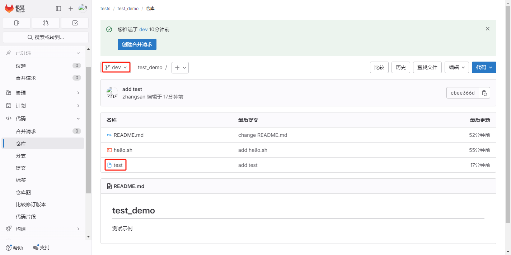

创建从 `dev` 到 `main` 合并分支请求，点击 *创建合并请求*。

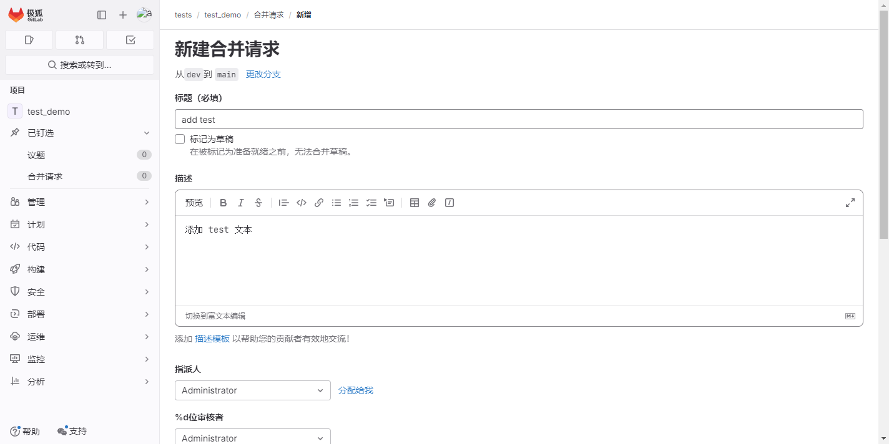

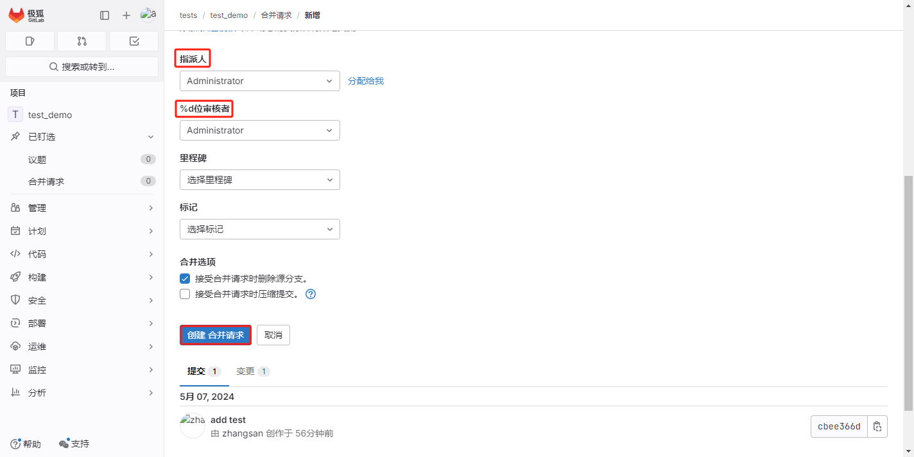

使用管理员用户（`root`）登录 GitLab 服务器。查看合并请求，检查代码，没有问题就同意合并请求并删除 `dev` 分支。

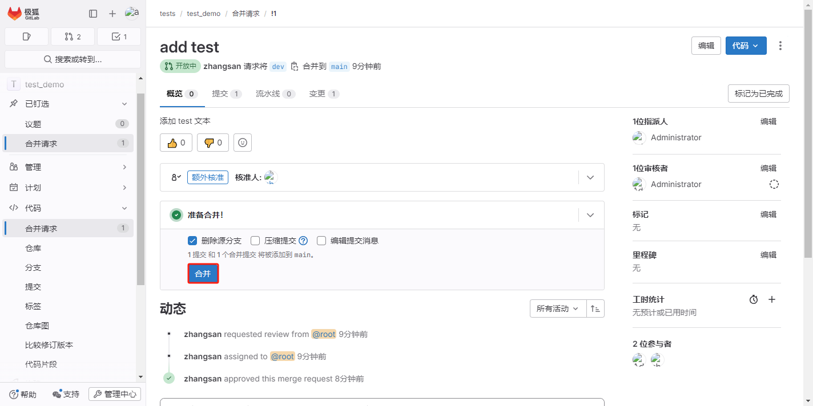

查看 `test_demo` 项目 `main` 分支，确认已经合并 `dev` 分支。

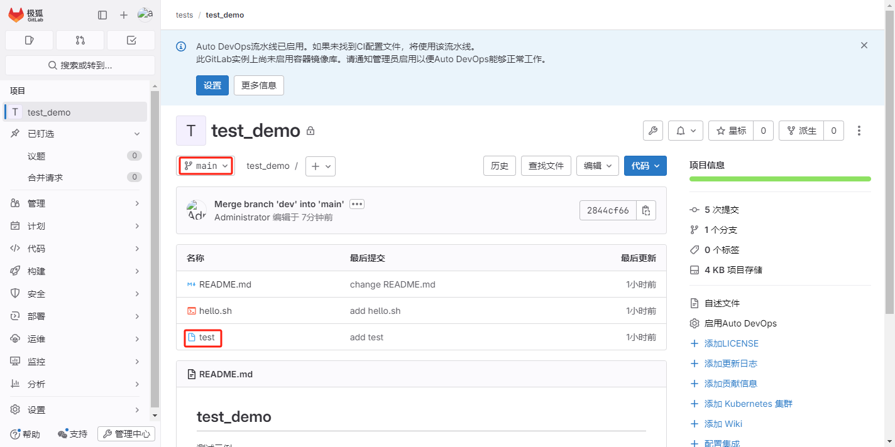

刷新 GitLab 中 `test_demo` 项目页面，查看上传的文件及脚本。


### 创建标签

在 Git 中，`tag` 是标记存储库历史记录中特定提交的一种方式。`tag` 通常用于标记项目的特定版本。

例如：对于版本 `10.5.7`：

- **10**：代表主要版本。主要版本是 `10.0.0`，但通常称为 `10.0`
- **5**：代表小版本。次要版本是 `10.5.0`，但通常称为 `10.5`
- **7**：表示补丁编号

版本号的任何部分都可以是多个数字，例如：`13.10.11`。

可以从命令行或 GitLab 页面创建标签。

- 命令行
    - 创建轻量级标签，使用 `git tag [TAG_NAME]` 命令，将 `TAG_NAME` 更改为您想要的标签名称

        ```bash
        git tag v1.0.0
        git push origin v1.0.0
        ```

    - 创建注释的标签，使用 `git tag -a [TAG_NAME] -m "Message"` 命令

        ```bash
        git tag -a v1.0.0 -m "Version v1.0.0"
        git push origin v1.0.0
        ```

- GitLab 页面
    - 在 极狐GitLab 实例页面左侧边栏的左上角，选择 *极狐图像 -> 项目 -> 选择要添加用户的项目（例如：test_demo） -> 代码 -> 标签 -> 新建标签*。

        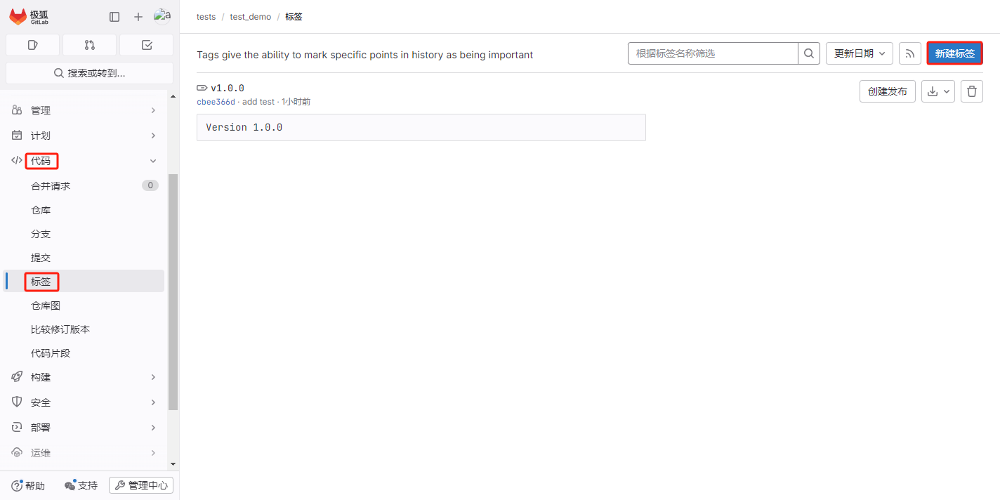

    - 添加标签名称、选择分支、添加标签消息

        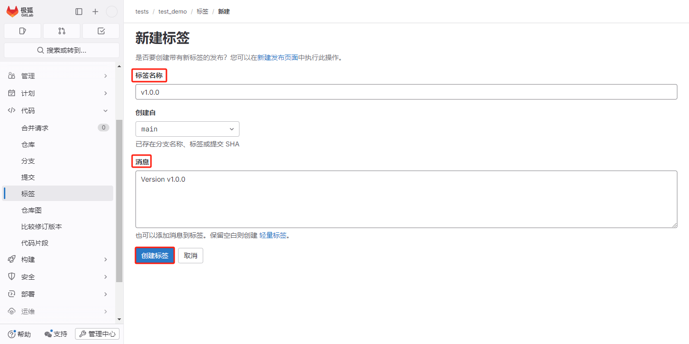

## 备份 GitLab

参考 [官网 GitLab 备份](https://docs.gitlab.com/ee/administration/backup_restore/backup_gitlab.html)。

您的软件或组织取决于 GitLab 实例中的数据。您需要确保此数据免受不良事件的影响，例如：

- 数据损坏
- 意外删除数据
- 勒索软件攻击
- 云提供商意外停机

可以通过包含备份的灾难恢复计划来减轻所有这些风险。

### 简单的备份

您只能将备份恢复到与创建备份时完全相同的 GitLab 版本和类型（CE/EE）。

如果您使用数据量少于 100GB，请按照以下步骤操作：

1. 运行备份命令

    - Linux 安装

        ```bash
        sudo gitlab-backup create
        ```
    
    - Docker 安装

        ```bash
        sudo docker exec -t <container name> gitlab-backup create
        ```

2. 备份对象存储（如果适用）

    备份命令不会备份 Linux 包、Docker 或自编译安装上的对象存储中的项目。

    备份命令不会备份未存储在文件系统上的 blob。如果您使用对象存储，请务必启用对象存储提供商的备份。

3. 手动备份配置文件

    您应该备份配置目录。至少，您必须备份：

    - Linux 安装

        - /etc/gitlab/gitlab-secrets.json
        - /etc/gitlab/gitlab.rb
    
    - Docker 安装

        备份存储配置文件的卷。例如：`/opt/gitlab/config`

- Linux 安装：备份位置在 `/var/opt/gitlab/backups` 文件中
- Docker 安装：备份位置在 `/opt/gitlab/data/backups` 文件中

### 扩展备份

随着 GitLab 数据量的增长，备份命令的执行时间会变长。并发备份 Git 存储库和增量存储库备份等备份选项有助于减少执行时间。在某些时候，备份命令本身就变得不切实际。例如：可能需要 24 小时或更长时间。

在某些情况下，可能需要更改架构以允许扩展备份。如果您使用的是 GitLab 参考架构，请参阅备份和恢复大型参考架构。

有关详细信息，请参阅替代备份策略。

### 哪些数据需要备份

- PostgreSQL 数据库
- Git 存储库
- Blobs
- 容器注册中心
- 配置文件
- 其他数据
