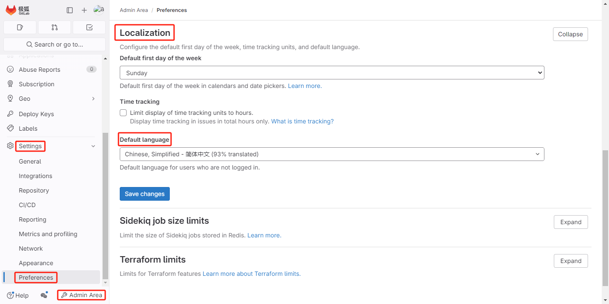
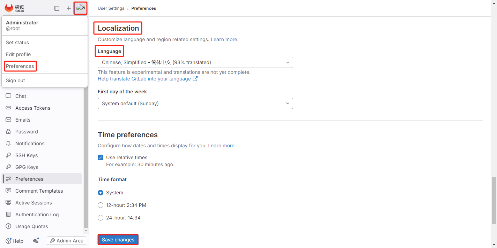
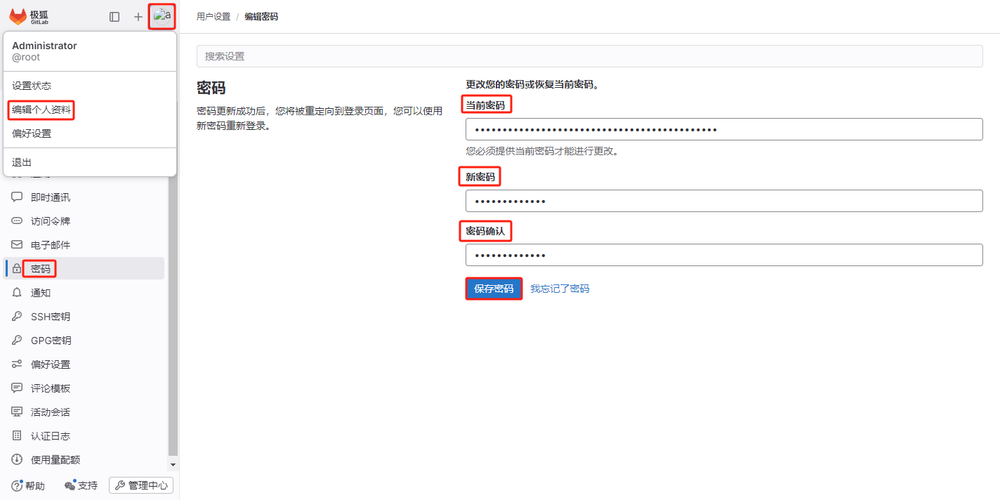
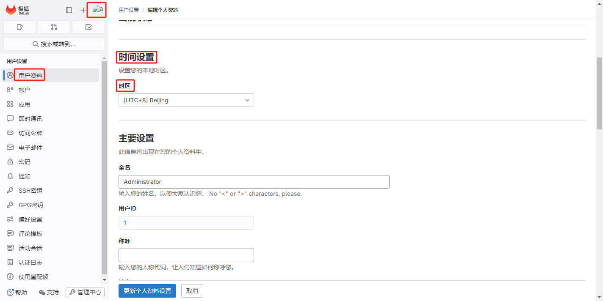
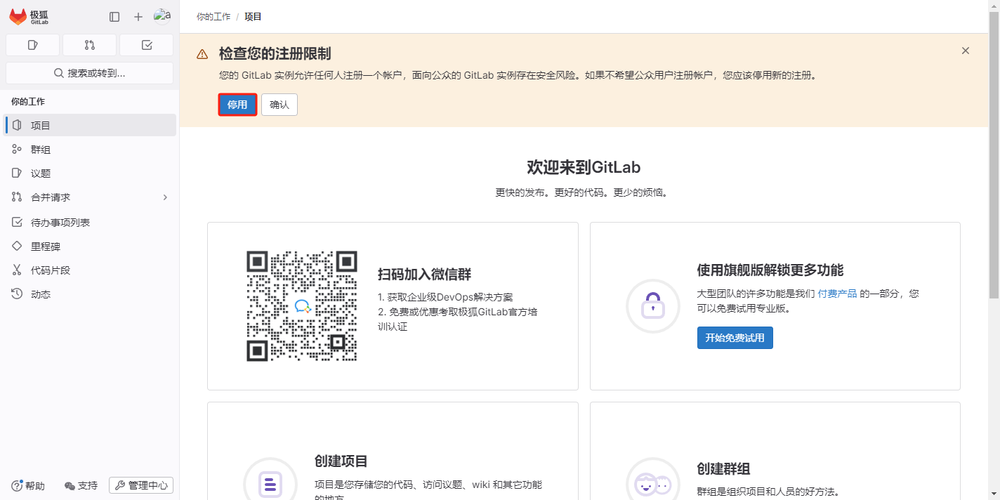
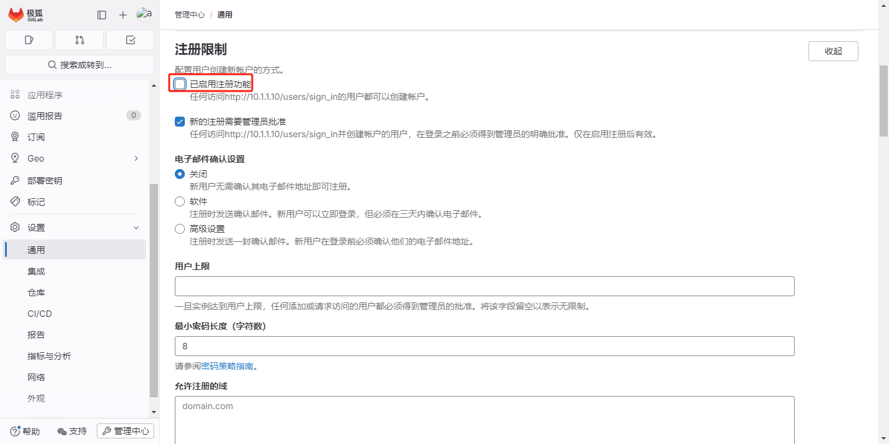

## 基础配置

### 修改语言

- 修改整个 GitLab 实例的默认语言

    在左侧边栏的底部，选择 *Admin Area -> Settings -> Preferences -> Localization*，然后选择您所需的默认语言，点击 *Save changes* 保存。

    

- 修改个人账户 GitLab 实例的默认语言

    在左侧边栏的右上角，选择 *头像 -> Preferences -> Localization*，然后选择您所需的默认语言，点击 *Save changes* 保存。

    修改后需要刷新页面才能查看更新后的语言。

    

### 修改管理员密码

在安装 GitLab 实例时，没有配置初始密码的情况下，默认初始管理员密码是随机的一串字符不好记忆，需要修改密码。

密码更新成功后，您将被重定向到登录页面，您可以使用新密码重新登录。



### 修改时区

GitLab 实例默认时区是 `UTC`。

- 全局时区

    全局时区有以下两种配置方法：

    1. 在安装 GitLab 实例时配置时区参数。例如：`gitlab_rails['time_zone'] = 'Asia/Shanghai'`
    2. 修改 `/etc/gitlab/gitlab.rb` 文件中 `gitlab_rails['time_zone']` 参数值并重启 GitLab。例如：`gitlab_rails['time_zone'] = 'Asia/Shanghai'`

- 个人时区

    在左侧边栏的右上角，选择 *头像 -> 编辑个人资料 -> 用户资料 -> 时间设置*，然后选择您所需的时区，点击 *更新个人资料设置* 保存。

    

### 注册限制

刚安装的 GitLab 实例默认允许任何人注册账户，应该限制注册。点击 *停用*。



点击 *停用*，跳转到 *注册限制* 页面；或在左侧边栏的底部，选择 *管理中心 -> 设置 -> 通用 -> 注册限制*。

清除 *已启用注册功能* 复选框，然后在下面选择 *保存更改*。



### 配置 SMTP

参考 极狐GitLab [官网 SMTP 配置](https://docs.gitlab.cn/omnibus/settings/smtp.html)。

例如：配置网易 163 SMTP，修改 `/etc/gitlab/gitlab.rb` 文件中以下配置信息：

```ruby
gitlab_rails['smtp_enable'] = true  # 启用 SMTP 服务
gitlab_rails['smtp_address'] = "smtp.163.com"  # 配置 SMTP 服务地址
gitlab_rails['smtp_port'] = 465  # 配置 SMTP 服务的端口号
gitlab_rails['smtp_user_name'] = "xxx@163.com"  # 配置 SMTP 服务器身份验证用户名
gitlab_rails['smtp_password'] = "smtp authorization code"  # 配置 SMTP 授权码
gitlab_rails['smtp_domain'] = "163.com"  # 配置 SMTP 服务的域名
gitlab_rails['smtp_authentication'] = "login"  # 配置 SMTP 鉴定类别
gitlab_rails['smtp_enable_starttls_auto'] = false  # 禁用 SMTP 服务器的 STARTTLS 自动启用。STARTTLS 是一种安全协议，用于在传输层加密 SMTP 通信
gitlab_rails['smtp_tls'] = true  # 启用 TLS（传输层安全性）
gitlab_rails['gitlab_email_from'] = 'xxx@163.com'  # 指定 GitLab 发送电子邮件时所使用的 From 地址
```
