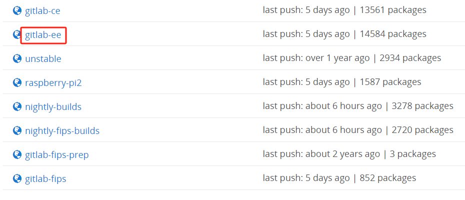
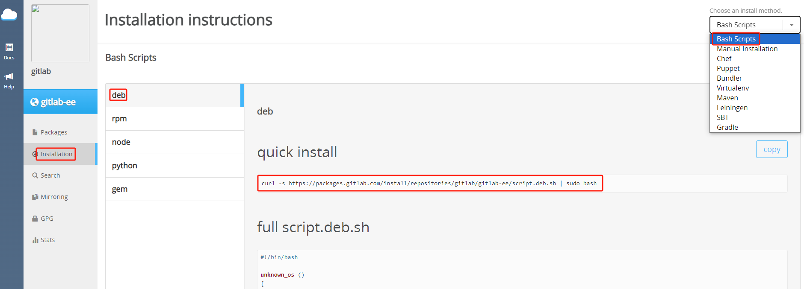
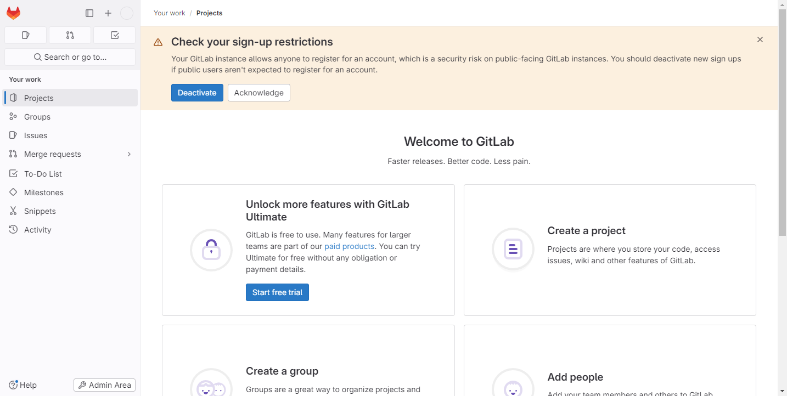

## 安装环境

- GitLab CE/EE 官网 [安装需求](https://docs.gitlab.com/ee/install/requirements.html)
- 极狐GitLab 官网 [安装需求](https://docs.gitlab.cn/jh/install/requirements.html)

### CPU

CPU（中央处理器）要求取决于用户数量和预期工作负载求。您的具体需可能更多，具体取决于您的工作量。您的工作负载受到多种因素的影响，例如但不限于您的用户活跃程度、您使用的自动化程度、镜像以及存储库/更改大小。

以下是针对少数 GitLab 用户群规模示例的建议最低 CPU 硬件指南：

- **4 核** 是建议的最小核心数，最多支持 `500` 个用户
- **8 核** 支持多达 `1000` 个用户
- 更多用户，请参阅 [参考架构页面](https://docs.gitlab.com/ee/administration/reference_architectures/index.html)

### RAM

RAM（内存）要求取决于用户数量和预期工作负载。您的具体需求可能更多，具体取决于您的工作量。您的工作负载受到多种因素的影响，例如但不限于您的用户活跃程度、您使用的自动化程度、镜像以及存储库/更改大小。

以下是针对少数 GitLab 用户群大小示例的建议最低内存硬件指南：

- **4 GB** 是所需的最小内存大小，最多支持 `500` 个用户
- **8 GB** 支持多达 `1000` 个用户
- 更多用户，请参阅 [参考架构页面](https://docs.gitlab.com/ee/administration/reference_architectures/index.html)

## Linux 安装

### GitLab EE

安装和配置所需的依赖：

::: code-tabs#shell

@tab apt

```bash
sudo apt install -y curl openssh-server ca-certificates tzdata perl postfix
```

@tab yum

```bash
sudo yum install -y curl policycoreutils-python3 openssh-server perl postfix
```

:::

访问 [GitLab 包仓库](https://packages.gitlab.com/gitlab)，选择需要安装的 GitLab 版本。



使用 Bash 脚本安装 GPG 密钥、GitLab 存储库等，选择支持您系统的脚本。



::: code-tabs#shell

@tab apt

```bash
curl -s https://packages.gitlab.com/install/repositories/gitlab/gitlab-ee/script.deb.sh | sudo bash
```

@tab yum

```bash
curl -s https://packages.gitlab.com/install/repositories/gitlab/gitlab-ee/script.rpm.sh | sudo bash
```

:::

接下来安装 `gitlab-ee`。此外，还需要通过设置 `EXTERNAL_URL` 环境变量来指定 GitLab EE 实例的 `URL`。如果还要设置初始密码，查看下一步骤。

::: info EXTERNAL_URL
`EXTERNAL_URL` 可以使用完全限定域名（FQDN），也可以使用服务器 IP 地址。

如果 **有域名** 则设置域名（例如：`http://gitlab.example.com`）；如果 **没有域名** 则设置本地 IP 地址（例如：`http://localhost`），还可以指定端口（例如：`http://localhost:port`）GitLab 默认使用 `80` 端口。
:::

::: warning
注意您使用的端口是否和 GitLab 中其他服务默认端口冲突，GitLab 默认会运行很多与 GitLab 相关的其他服务或工具。
:::

::: code-tabs#shell

@tab apt

```bash
sudo EXTERNAL_URL="http://localhost" apt install -y gitlab-ee
```

@tab yum

```bash
sudo EXTERNAL_URL="http://localhost" yum install -y gitlab-ee
```

:::

**设置初始密码**（引入于 GitLab 14.0），默认情况下，Linux 软件包安装会自动为初始管理员用户账号（`root`）生成密码，并将其存储到 `/etc/gitlab/initial_root_password` 至少 24 小时。出于安全原因，24 小时后，此文件会被第一次 `gitlab-ctl reconfigure` 自动删除。

::: tip
如果 GitLab 在安装期间无法检测到服务器的有效主机名，则不会运行重新配置。
:::

要提供自定义初始 `root` 密码，有以下两种方式：

- 如果服务器的主机名设置正确，则将 `GITLAB_ROOT_PASSWORD` 环境变量传递给安装命令

    ::: code-tabs#shell

    @tab apt

    ```bash
    sudo GITLAB_ROOT_PASSWORD="<strongpassword>" EXTERNAL_URL="http://localhost" apt install -y gitlab-ee
    ```

    @tab yum

    ```bash
    sudo GITLAB_ROOT_PASSWORD="<strongpassword>" EXTERNAL_URL="http://localhost" yum install -y gitlab-ee
    ```

    :::

    如果在安装期间 GitLab 没有自动执行重新配置，则必须将 `GITLAB_ROOT_PASSWORD` 变量传递给第一次运行的 `gitlab-ctl reconfigure`。

- 在第一次重新配置之前，编辑 `/etc/gitlab/gitlab.rb`（如果不存在则创建）并设置：

    ```bash
    gitlab_rails['initial_root_password'] = '<my_strong_password>'
    ```

这两种方法都仅适用于初始数据库播种设定，发生在第一次重新配置期间。对于后续的重新配置运行，上述方法均无效。在这种情况下，使用 `/etc/gitlab/initial_root_password` 中的随机密码登录，或重置 `root` 密码。

出现以下提示说明 GitLab 安装成功：

```bash
It looks like GitLab has not been configured yet; skipping the upgrade script.

       *.                  *.
      ***                 ***
     *****               *****
    .******             *******
    ********            ********
   ,,,,,,,,,***********,,,,,,,,,
  ,,,,,,,,,,,*********,,,,,,,,,,,
  .,,,,,,,,,,,*******,,,,,,,,,,,,
      ,,,,,,,,,*****,,,,,,,,,.
         ,,,,,,,****,,,,,,
            .,,,***,,,,
                ,*,.


     _______ __  __          __
    / ____(_) /_/ /   ____ _/ /_
   / / __/ / __/ /   / __ `/ __ \
  / /_/ / / /_/ /___/ /_/ / /_/ /
  \____/_/\__/_____/\__,_/_.___/


Thank you for installing GitLab!
GitLab was unable to detect a valid hostname for your instance.
Please configure a URL for your GitLab instance by setting `external_url`
configuration in /etc/gitlab/gitlab.rb file.
Then, you can start your GitLab instance by running the following command:
  sudo gitlab-ctl reconfigure

For a comprehensive list of configuration options please see the Omnibus GitLab readme
https://gitlab.com/gitlab-org/omnibus-gitlab/blob/master/README.md

Help us improve the installation experience, let us know how we did with a 1 minute survey:
https://gitlab.fra1.qualtrics.com/jfe/form/SV_6kVqZANThUQ1bZb?installation=omnibus&release=16-11
```

访问 GitLab 服务 `http://localhost:port`。如果在安装过程中指定了初始密码，则用初始密码登录，如果未指定密码，则系统会随机生成一个密码并存储在 `/etc/gitlab/initial_root_password` 文件中，查看随机密码并使用 `root` 用户名登录。

::: tip
出于安全原因，24 小时后，`/etc/gitlab/initial_root_password` 会被第一次 `gitlab-ctl reconfigure` 自动删除，因此若使用随机密码登录，建议安装成功初始登录成功之后，立即修改初始密码。
:::

```bash
sudo cat /etc/gitlab/initial_root_password
```


GitLab EE 主页。



### 极狐GitLab

安装和配置所需的依赖：

::: code-tabs#shell

@tab apt

```bash
sudo apt install -y curl openssh-server ca-certificates tzdata perl postfix
```

@tab yum

```bash
sudo yum install -y curl policycoreutils-python3 openssh-server perl postfix
```

:::

执行以下命令配置 极狐GitLab 软件源镜像：

```bash
curl -fsSL https://get.gitlab.cn | /bin/bash
```

接下来安装 极狐GitLab。此外，还需要通过设置 `EXTERNAL_URL` 环境变量来指定 极狐GitLab 实例的 `URL`。如果还要设置初始密码，查看下一步骤。

::: info EXTERNAL_URL
`EXTERNAL_URL` 可以使用完全限定域名（FQDN），也可以使用服务器 IP 地址。

如果 **有域名** 则设置域名（例如：`http://gitlab.example.com`）；如果 **没有域名** 则设置本地 IP 地址（例如：`http://localhost`），还可以指定端口（例如：`http://localhost:port`）GitLab 默认使用 `80` 端口。
:::

::: warning
注意您使用的端口是否和 GitLab 中其他服务默认端口冲突，GitLab 默认会运行很多与 GitLab 相关的其他服务或工具。
:::

::: code-tabs#shell

@tab apt

```bash
sudo EXTERNAL_URL="http://localhost" apt install -y gitlab-jh
```

@tab yum

```bash
sudo EXTERNAL_URL="http://localhost" yum install -y gitlab-jh
```

:::

**设置初始密码**（引入于 极狐GitLab 14.0），默认情况下，Linux 软件包安装会自动为初始管理员用户账号（`root`）生成密码，并将其存储到 `/etc/gitlab/initial_root_password` 至少 24 小时。出于安全原因，24 小时后，此文件会被第一次 `gitlab-ctl reconfigure` 自动删除。

::: tip
如果 极狐GitLab 在安装期间无法检测到服务器的有效主机名，则不会运行重新配置。
:::

要提供自定义初始 `root` 密码，您有两个选择：

- 如果服务器的主机名设置正确，则将 `GITLAB_ROOT_PASSWORD` 环境变量传递给安装命令

    ::: code-tabs#shell

    @tab apt

    ```bash
    sudo GITLAB_ROOT_PASSWORD="<strongpassword>" EXTERNAL_URL="http://localhost" apt install -y gitlab-jh
    ```

    @tab yum

    ```bash
    sudo GITLAB_ROOT_PASSWORD="<strongpassword>" EXTERNAL_URL="http://localhost" yum install -y gitlab-jh
    ```

    :::

    如果在安装期间 GitLab 没有自动执行重新配置，则必须将 `GITLAB_ROOT_PASSWORD` 变量传递给第一次运行的 `gitlab-ctl reconfigure`。

- 在第一次重新配置之前，编辑 `/etc/gitlab/gitlab.rb`（如果不存在则创建）并设置：

    ```bash
    gitlab_rails['initial_root_password'] = '<my_strong_password>'
    ```

这两种方法都仅适用于初始数据库播种设定，发生在第一次重新配置期间。对于后续的重新配置运行，上述方法均无效。在这种情况下，使用 `/etc/gitlab/initial_root_password` 中的随机密码登录，或重置 `root` 密码。

出现以下提示说明 GitLab 安装成功：

```bash
Running handlers:
[2024-04-24T15:50:19+08:00] INFO: Running report handlers
Running handlers complete
[2024-04-24T15:50:19+08:00] INFO: Report handlers complete
Infra Phase complete, 557/1635 resources updated in 06 minutes 23 seconds

Notes:
Default admin account has been configured with following details:
Username: root
Password: You didn't opt-in to print initial root password to STDOUT.

NOTE: Because these credentials might be present in your log files in plain text, it is highly recommended to reset the password following https://docs.gitlab.com/ee/security/reset_user_password.html#reset-your-root-password.

gitlab Reconfigured!

                  *.                  *.
                 ***                 ***
                *****               *****
               .******             *******
               ********            ********
              ,,,,,,,,,***********,,,,,,,,,
             ,,,,,,,,,,,*********,,,,,,,,,,,
             .,,,,,,,,,,,*******,,,,,,,,,,,,
                 ,,,,,,,,,*****,,,,,,,,,.
                    ,,,,,,,****,,,,,,
                       .,,,***,,,,
                           ,*,.


         ___ __  __         _______ __  __          __
        / (_) / / /_  __   / ____(_) /_/ /   ____ _/ /_
   __  / / / /_/ / / / /  / / __/ / __/ /   / __ `/ __ \
  / /_/ / / __  / /_/ /  / /_/ / / /_/ /___/ /_/ / /_/ /
  \____/_/_/ /_/\__,_/   \____/_/\__/_____/\__,_/_.___/


Thank you for installing JiHu GitLab!
GitLab should be available at http://10.1.1.10:8088

For a comprehensive list of configuration options please see the Omnibus GitLab readme
https://jihulab.com/gitlab-cn/omnibus-gitlab/-/blob/main-jh/README.md

Help us improve the installation experience, let us know how we did with a 1 minute survey:
https://wj.qq.com/s2/10068464/dc66


  Verifying        : gitlab-jh-16.11.0-jh.0.el8.x86_64                              1/1

Installed:
  gitlab-jh-16.11.0-jh.0.el8.x86_64

Complete!
```

访问 极狐GitLab 服务 `http://localhost:port`。如果在安装过程中指定了初始密码，则用初始密码登录，如果未指定密码，则系统会随机生成一个密码并存储在 `/etc/gitlab/initial_root_password` 文件中，查看随机密码并使用 `root` 用户名登录。

::: tip
出于安全原因，24 小时后，`/etc/gitlab/initial_root_password` 会被第一次 `gitlab-ctl reconfigure` 自动删除，因此若使用随机密码登录，建议安装成功初始登录成功之后，立即修改初始密码。
:::

```bash
sudo cat /etc/gitlab/initial_root_password
```


GitLab EE 主页。


## Docker 安装

GitLab Docker 镜像是 GitLab 的整体镜像，在单个容器中运行所有必要的服务。

Docker 映像不包含邮件传输代理（MTA）。推荐的解决方案是添加在单独容器中运行的 MTA（例如：`Postfix` 或 `Sendmail`）。作为另一种选择，您可以直接在 GitLab 容器中安装 MTA，但这会增加维护开销，因为您可能需要在每次升级或重新启动后重新安装 MTA。

- GitLab CE/EE 官网 [Docker 安装](https://docs.gitlab.com/ee/install/docker.html)
- 极狐GitLab 官网 [Docker 安装](https://docs.gitlab.cn/jh/install/docker.html)

### 配置 SSH 端口

GitLab 使用 SSH 通过 SSH 与 Git 进行交互。默认情况下，GitLab 使用端口 `22`。

要在使用 GitLab Docker 映像时使用不同的端口，使用以下两种方式：

- 更改服务器的 SSH 端口（推荐）

    在这种情况下，SSH 克隆 URL 看起来像 `ssh://git@gitlab.example.com/user/project.git`。

    使用编辑器打开 `/etc/ssh/sshd_config`，然后更改 SSH 端口：

    ```bash
    Port = 2424
    ```

    保存文件并重新启动 SSH 服务：

    ```bash
    sudo systemctl restart sshd.service
    ```

    打开新的终端会话并验证您是否可以使用新端口通过 SSH 连接到服务器。

- 更改 GitLab Shell SSH 端口

    在这种情况下，SSH 克隆 URL 看起来像 `ssh://git@gitlab.example.com:<portNumber>/user/project.git`。

    `docker run` 时，在 `GITLAB_OMNIBUS_CONFIG` 变量中添加 `gitlab_rails['gitlab_shell_ssh_port'] = 2424`，多个参数用 <kbd>;</kbd> （冒号）分割，并且修改 `publish` 映射端口。

    - GitLab CE/EE [参考官网](https://docs.gitlab.com/ee/install/docker.html#expose-gitlab-on-different-ports) 配置
    - 极狐GitLab [参考官网](https://docs.gitlab.cn/jh/install/docker.html#%E5%9C%A8%E4%B8%8D%E5%90%8C%E7%9A%84%E7%AB%AF%E5%8F%A3%E4%B8%8A%E5%85%AC%E5%BC%80%E6%9E%81%E7%8B%90gitlab) 配置

### 配置挂载卷

配置一个新的环境变量 `$GITLAB_HOME`，指向配置、日志和数据文件所在的目录。将 `$GITLAB_HOME` 环境变量应该附加到您的 shell 的配置文件（`~/.bash_profile`）中，以便它应用于所有未来的终端会话。

在 `~/.bash_profile` 文件最后添加以下内容：

```bash
export GITLAB_HOME=/opt/gitlab
```

刷新 `~/.bash_profile` 文件，使配置生效。

```bash
source ~/.bash_profile
```

GitLab 容器使用主机安装的卷来存储持久数据：

|  本地位置  |  容器位置  |  用法  |
|  ----  |  ----  |  ----  |
|  `$GITLAB_HOME/data`  |  `/var/opt/gitlab`  |  用于存储应用程序数据  |
|  `$GITLAB_HOME/logs`  |  `/var/log/gitlab`  |  用于存储日志  |
|  `$GITLAB_HOME/config`  |  `/etc/gitlab`  |  用于存储 GitLab 配置文件  |

### GitLab EE

- 使用 Docker Engine 安装 GitLab

    其中 `<version>` 是 GitLab 版本（例如：`16.5.3`），它总是包括 `<major>.<minor>.<patch>` 以其名称命名。`external_url` 根据您的情况配置。

    出于测试目的，您可以使用 `latest` 标签（例如：`gitlab/gitlab-ee:latest`），它指向最新的稳定版本。

    ```bash
    sudo docker run --detach \
      --hostname gitlab.example.com \
      --env GITLAB_OMNIBUS_CONFIG="external_url 'http://gitlab.example.com'" \
      --publish 443:443 --publish 80:80 --publish 22:22 \
      --name gitlab \
      --restart always \
      --volume $GITLAB_HOME/config:/etc/gitlab \
      --volume $GITLAB_HOME/logs:/var/log/gitlab \
      --volume $GITLAB_HOME/data:/var/opt/gitlab \
      --shm-size 256m \
      gitlab/gitlab-ee:<version>-ee.0
    ```

- 使用 Docker Compose 安装 GitLab

    创建挂载目录 `/opt/gitlab`。

    ```bash
    sudo mkdir /opt/gitlab
    ```

    在 `docker-compose.yml` 文件中使用环境变量来定义卷的路径。创建 `.env` 文件，在 `.env` 文件中定义 `GITLAB_HOME` 变量，以在 `docker-compose.yml` 文件中使用。

    ```bash
    GITLAB_HOME=/opt/gitlab
    ```

    在 `/opt/gitlab` 目录中创建一个 `docker-compose.yml` 文件，并输入以下内容：

    ```yaml
    version: '3.6'

    services:
      gitlab:
        image: gitlab/gitlab-ee:<version>-ee.0
        container_name: gitlab
        restart: always
        hostname: 'gitlab.example.com'
        environment:
          GITLAB_OMNIBUS_CONFIG: |
            # Add any other gitlab.rb configuration here, each on its own line
            external_url 'http://gitlab.example.com'
        ports:
          - '80:80'
          - '443:443'
          - '22:22'
        volumes:
          - '${GITLAB_HOME}/config:/etc/gitlab'
          - '${GITLAB_HOME}/logs:/var/log/gitlab'
          - '${GITLAB_HOME}/data:/var/opt/gitlab'
        shm_size: '256m'
    ```

    确保您在与 `docker-compose.yml` 相同的目录下并启动 GitLab：

    ```bash
    sudo docker compose up -d
    ```

### 极狐Gitlab

- 使用 Docker Engine 安装 极狐GitLab

    `external_url` 根据您的情况配置。

    ```bash
    sudo docker run --detach \
      --hostname gitlab.example.com \
      --env GITLAB_OMNIBUS_CONFIG="external_url 'http://gitlab.example.com'" \
      --publish 443:443 --publish 80:80 --publish 22:22 \
      --name gitlab \
      --restart always \
      --volume $GITLAB_HOME/config:/etc/gitlab \
      --volume $GITLAB_HOME/logs:/var/log/gitlab \
      --volume $GITLAB_HOME/data:/var/opt/gitlab \
      --shm-size 256m \
      registry.gitlab.cn/omnibus/gitlab-jh:latest
    ```

- 使用 Docker Compose 安装 GitLab

    创建挂载目录 `/opt/gitlab`。

    ```bash
    sudo mkdir /opt/gitlab
    ```

    在 `docker-compose.yml` 文件中使用环境变量来定义卷的路径。创建 `.env` 文件，在 `.env` 文件中定义 `GITLAB_HOME` 变量，以在 `docker-compose.yml` 文件中使用。

    ```bash
    GITLAB_HOME=/opt/gitlab
    ```

    在 `/opt/gitlab` 目录中创建一个 `docker-compose.yml` 文件，并输入以下内容：

    ```yaml
    version: '3.6'

    services:
      web:
        image: 'registry.gitlab.cn/omnibus/gitlab-jh:latest'
        restart: always
        hostname: 'gitlab.example.com'
        environment:
          GITLAB_OMNIBUS_CONFIG: |
            # Add any other gitlab.rb configuration here, each on its own line
            external_url 'http://gitlab.example.com'
        ports:
          - '80:80'
          - '443:443'
          - '22:22'
        volumes:
          - '${GITLAB_HOME}/config:/etc/gitlab'
          - '${GITLAB_HOME}/logs:/var/log/gitlab'
          - '${GITLAB_HOME}/data:/var/opt/gitlab'
        shm_size: '256m'
    ```

    确保您在与 `docker-compose.yml` 相同的目录下并启动 极狐GitLab：

    ```bash
    sudo docker compose up -d
    ```

### 查看 gitlab 容器日志

初始化过程可能需要很长时间。您可以通过以下方式跟踪此过程：

```bash
sudo docker logs -f gitlab
```

### 访问 GitLab

访问 GitLab URL，并使用用户名 `root` 和来自以下命令的密码登录：

```bash
sudo docker exec -it gitlab grep 'Password:' /etc/gitlab/initial_root_password
```

## 卸载 Linux 软件包

要卸载 Linux 软件包，您可以选择保留数据（代码库、数据库、配置）或全部删除。

1. 可选。在删除软件包（使用 `apt` 或 `yum`）之前，删除由 Linux 软件包创建的所有用户和群组

    ```bash
    sudo gitlab-ctl stop && sudo gitlab-ctl remove-accounts
    ```

    如果您在删除账户或组时遇到问题，请手动运行 `userdel` 或 `groupdel` 来删除它们。您可能还想从 `/home/` 中手动删除剩余的用户主目录。

2. 选择是保留您的数据还是删除所有数据

    - 要保留您的数据（代码库、数据库、配置），请停止极狐GitLab 并删除其 supervision 进程

        ```bash
        sudo systemctl stop gitlab-runsvdir
        sudo systemctl disable gitlab-runsvdir
        sudo rm /usr/lib/systemd/system/gitlab-runsvdir.service
        sudo systemctl daemon-reload
        sudo systemctl reset-failed
        sudo gitlab-ctl uninstall
        ```

   - 要删除所有数据

        ```bash
        sudo gitlab-ctl cleanse && sudo rm -r /opt/gitlab
        ```

3. 卸载软件包

    ::: code-tabs#shell

    @tab apt

    ```bash
    sudo apt remove gitlab-ee
    # 或
    sudo apt remove gitlab-jh
    ```

    @tab yum

    ```bash
    sudo yum remove gitlab-ee
    # 或
    sudo yum remove gitlab-jh
    ```

    :::

## 命令

`gitlab-ctl` 常用命令如下：

|  命令  |  说明  |
|  ----  |  ----  |
|  `sudo gitlab-ctl --help`  |  获取 gitlab-ctl 命令帮助  |
|  `sudo gitlab-ctl start`  |  启动服务  |
|  `sudo gitlab-ctl stop`  |  停止服务  |
|  `sudo gitlab-ctl restart`  |  重启服务  |
|  `sudo gitlab-ctl status`  |  显示所有服务状态  |
|  `sudo gitlab-ctl reconfigure`  |  更新配置（修改配置后执行）  |
|  `sudo gitlab-ctl remove-accounts`  |  删除此包使用的所有用户和组  |
|  `sudo gitlab-ctl uninstall`  |  卸载 gitlab 但会保留您的数据（代码库、数据库、配置）  |
|  `sudo gitlab-ctl cleanse`  |  卸载 gitlab 删除所有数据  |

`systemd` 控制 GitLab 服务命令：

|  命令  |  说明  |
|  ----  |  ----  |
|  `sudo systemctl start gitlab-runsvdir.service`  |  启动服务  |
|  `sudo systemctl stop gitlab-runsvdir.service`  |  停止服务  |
|  `sudo systemctl restart gitlab-runsvdir.service`  |  重启服务  |
|  `sudo systemctl status gitlab-runsvdir.service`  |  显示所有服务状态  |
|  `sudo systemctl enable gitlab-runsvdir.service`  |  开机自启  |
|  `sudo systemctl disable gitlab-runsvdir.service`  |  禁止开机自启  |
