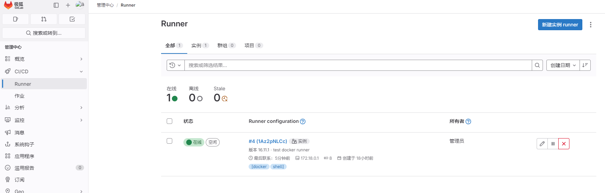
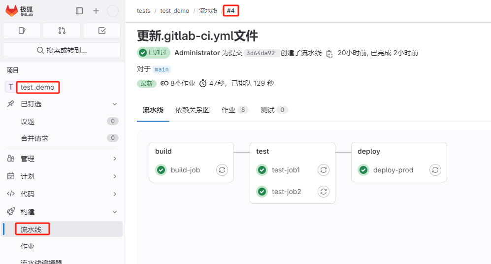

极狐GitLab Runner 是在流水线中运行作业的应用，与 极狐GitLab CI/CD 配合运作。

## 范围

极狐GitLab Runner 包含三种范围：

- **共享 runners**：可用于 极狐GitLab 实例中的所有群组和项目
- **群组 runners**：可用于群组中的所有项目和子组
- **项目 runners**：与特定项目相关联。通常，项目 runner 只用于一个项目

### 共享 runner

共享 runners 可用于 极狐GitLab 实例中的每一个项目。

当您有多个具有相似要求的作业时，请使用共享 runner。与其让多个 runner 闲置在许多项目中，不如让几个 runner 处理多个项目。

使用 极狐GitLab 的私有化部署实例：

- 依次点击 *管理中心 -> CI/CD -> Runner -> 新建实例 runner*
- 右边三个点，可以查看 **注册令牌**

### 群组 runner

当您希望群组中的所有项目都可以访问一组 runner 时，请使用群组 runner。群组 runner 使用先进先出（FIFO）队列来处理作业。

使用 极狐GitLab 的私有化部署实例：

- 依次点击 *群组 -> 选择群组 -> 构建 -> Runner -> 新建群组 runner*
- 右边三个点，可以查看 **注册令牌**

### 项目 runner

当您想将 runner 用于特定项目时，请使用项目 runner。例如，当您有：

- 具有特定要求的作业，例如需要凭据的部署作业
- 具有大量 CI 活动的项目可以从与其它 runner 分开中受益

您可以设置一个项目 Runner 供多个项目使用，必须为每个项目明确启用项目 Runner。项目 Runner 使用先进先出（FIFO）队列来处理作业。

使用 极狐GitLab 的私有化部署实例：

- 依次点击 *项目 -> 选择项目 -> 设置 -> CI/CD -> Runner -> 新建项目 runner*
- 右边三个点，可以查看 **注册令牌**

## 安装

极狐GitLab Runner 是开源的，用 Go 编写。它可以作为单个二进制文件运行，且没有特定于语言的要求。

极狐GitLab Runner 还可以在 Docker 容器内运行或部署到 Kubernetes 集群。

极狐GitLab Runner 可以在 GNU/Linux、macOS、FreeBSD 和 Windows 上安装和使用。您可以通过以下方式 [安装](https://docs.gitlab.cn/runner/install/) 极狐GitLab Runner：

- 在容器中
- 通过手动下载二进制文件
- 使用 rpm/deb 软件包仓库

极狐GitLab Runner 官方支持的二进制文件在以下架构中可用：

- x86、AMD64、ARM64、ARM、s390x 和 ppc64le

官方软件包在以下 Linux 发行版中可用：

- CentOS、Debian、Ubuntu、RHEL、Fedora、Mint、Oracle 和 Amazon

极狐GitLab Runner 官方支持以下操作系统。如果您喜欢使用非官方支持的操作系统，则其必须能够编译 Go 二进制文件。

- Linux、Windows、macOS 和 FreeBSD

::: tip
出于安全和性能原因，您不应该在托管 极狐GitLab 实例的机器上安装 极狐GitLab Runner。
:::

### Linux 安装

由于兼容性原因，极狐GitLab Runner 的 **主版本.小版本** 应和 极狐GitLab 的 **主版本.小版本** 保持同步。老版本的 极狐GitLab Runner 可能适用于新版本的 极狐 GitLab，反之亦然。但是如果存在版本差异，功能特性可能不可用或无法正常工作。

在小版本更新之间保证向后兼容。但是有时小版本更新会引入要求 极狐GitLab Runner 处于相同版本的新特性功能。

添加官方 极狐GitLab 仓库：

- Debian/Ubuntu 系统

    ```shell
    curl -L "https://packages.gitlab.com/install/repositories/runner/gitlab-runner/script.deb.sh" | sudo bash
    ```

- RHEL/CentOS 系统

    ```shell
    curl -L "https://packages.gitlab.com/install/repositories/runner/gitlab-runner/script.rpm.sh" | sudo bash
    ```

安装最新版本的 极狐GitLab Runner，或跳到下一步，安装特定版本。

- Debian/Ubuntu 系统

    ```shell
    sudo apt-get install gitlab-runner
    ```

- RHEL/CentOS 系统

    ```shell
    sudo yum install gitlab-runner
    ```

安装特定版本的 极狐GitLab Runner：

- Debian/Ubuntu 系统

    ```shell
    apt-cache madison gitlab-runner
    sudo apt-get install gitlab-runner=16.11.1-1
    ```

- RHEL/CentOS 系统

    ```shell
    yum list gitlab-runner --showduplicates | sort -r
    sudo yum install gitlab-runner-16.11.1-1
    ```

### Docker 安装

一般来说，Docker Engine 的版本和 极狐GitLab Runner 容器镜像的版本不需要匹配。极狐GitLab Runner 镜像应该向后和向前兼容。然而，为确保您拥有最新的功能和安全更新，您应该使用最新的稳定 Docker 引擎版本。

一般规则是每个 极狐GitLab Runner 命令通常会被执行为：

```shell
gitlab-runner <runner command and options...>
```

可以使用以下命令执行：

```shell
docker run <chosen docker options...> gitlab/gitlab-runner <runner command and options...>
```

例如，可以执行以下命令获取最高级别的 极狐GitLab Runner 的帮助信息：

```shell
docker run --rm -t -i gitlab/gitlab-runner --help

NAME:
   gitlab-runner - a GitLab Runner

USAGE:
   gitlab-runner [global options] command [command options] [arguments...]

VERSION:
   15.11.0 (436955cb)

(...)
```

简而言之，命令的 `gitlab-runner` 部分由 `docker run [docker options] gitlab/gitlab-runner` 替代，剩余部分保持与注册文档中描述的内容相一致。唯一区别是 `gitlab-runner` 命令是在 Docker 容器中执行的。

开始之前，请确保已经 [安装 Docker](../../docker/tutorials/install.md)。

如果想在 Docker 容器内运行 `gitlab-runner`，您需要确保重启容器时配置没有丢失。为此，以下描述两个选项：

- 选项一：使用本地系统卷挂载，启动 Runner 容器

    以下示例使用挂载到 `gitlab-runner` 容器的配置卷的本地系统。这个卷用于配置资源和其他资源。

    ```shell
    sudo docker run -d --name gitlab-runner --restart always \
      -v /srv/gitlab-runner/config:/etc/gitlab-runner \
      -v /var/run/docker.sock:/var/run/docker.sock \
      gitlab/gitlab-runner:v16.11.1
    ```

    在 macOS 上，使用 `/Users/Shared` 而不是 `/srv`。

- 选项二：使用 Docker 卷启动 Runner 容器

    在这个例子中，您可以使用配置容器挂载您的自定义数据卷。

    1. 创建 Docker 卷：

    ```shell
    sudo docker volume create gitlab-runner-config
    ```

    2. 使用刚创建的卷启动 极狐GitLab Runner 容器：

    ```shell
    sudo docker run -d --name gitlab-runner --restart always \
        -v /var/run/docker.sock:/var/run/docker.sock \
        -v gitlab-runner-config:/etc/gitlab-runner \
        gitlab/gitlab-runner:v16.11.1
    ```

## 注册 Runner

极狐GitLab Runner 容器在注册之前不会处理任何作业。

引入于 极狐GitLab Runner 15.0，对注册请求格式做了更改，防止 极狐GitLab Runner 与低于 14.8 版本的 极狐GitLab 通信。您必须使用适合 极狐GitLab 版本的 Runner 版本，或升级 极狐GitLab 应用程序。

Runner 注册是将 Runner 与一个或多个 极狐GitLab 实例连接起来的过程。

您可以通过重复 `register` 命令，在同一台主机上注册多个 Runner，每个都有不同的配置。

### Linux

1. 运行以下命令：

    ```shell
    sudo gitlab-runner register
    ```

    如果您使用代理，您需要添加环境变量再运行注册命令：

    ```shell
    export HTTP_PROXY=http://yourproxyurl:3128
    export HTTPS_PROXY=http://yourproxyurl:3128

    sudo -E gitlab-runner register
    ```

2. 输入您的 极狐GitLab 实例 URL。例如：`http://10.1.1.10:8888`
3. 输入注册 Runner 时获取的令牌。例如：使用共享令牌 `fpbUZKthyn1y93CFEarG`
4. 输入 Runner 描述，也是 Runner 的名称，您可以在 极狐GitLab UI 中进行变更。例如：`test gitlab runner`
5. 输入以逗号隔开的与 Runner 有关的标签，您可以在 极狐GitLab UI 中进行变更。例如：`docker, shell`
6. 为 Runner 输入可选的维护记录。例如：`runner`
7. 提供 Runner 执行器。例如：`shell`

### Docker

以下步骤描述了启动暂时的 gitlab-runner 容器以注册您在安装期间创建的容器。注册完成后，生成的配置将写入您选择的配置卷（例如：`/srv/gitlab-runner/config`）并且由 Runner 使用配置卷进行加载。

使用 Docker 容器注册 Runner：

1. 基于挂载类型运行注册命令：

    - 对于本地系统卷挂载：

        ```shell
        sudo docker run --rm -it -v /srv/gitlab-runner/config:/etc/gitlab-runner gitlab/gitlab-runner register
        ```

        ::: tip
        如果您在安装过程中使用了 `/srv/gitlab-runner/config` 以外的配置卷，请务必使用正确的卷更新命令。
        :::

    - 对于 Docker 卷挂载：

        ```shell
        sudo docker run --rm -it -v gitlab-runner-config:/etc/gitlab-runner gitlab/gitlab-runner:v16.11.1 register
        ```
    
        ::: details 基于挂载类型运行注册命令

        ```shell
        docker run --rm -it -v gitlab-runner-config:/etc/gitlab-runner gitlab/gitlab-runner:v16.11.1 register

        Runtime platform                                    arch=amd64 os=linux pid=6 revision=535ced5f version=16.11.1
        Running in system-mode.

        Enter the GitLab instance URL (for example, https://gitlab.com/):
        http://192.168.52.186:8888
        Enter the registration token:
        fpbUZKthyn1y93CFEarG
        Enter a description for the runner:
        [dd5c1e8f4040]: test docker runner
        Enter tags for the runner (comma-separated):
        docker, shell
        Enter optional maintenance note for the runner:
        runner
        WARNING: Support for registration tokens and runner parameters in the 'register' command has been deprecated in GitLab Runner 15.6 and will be replaced with support for authentication tokens. For more information, see https://docs.gitlab.com/ee/ci/runners/new_creation_workflow
        Registering runner... succeeded                     runner=fpbUZKth
        Enter an executor: virtualbox, docker-windows, kubernetes, docker-autoscaler, instance, custom, shell, ssh, parallels, docker, docker+machine:
        docker
        Enter the default Docker image (for example, ruby:2.7):
        docker:latest
        Runner registered successfully. Feel free to start it, but if it's running already the config should be automatically reloaded!

        Configuration (with the authentication token) was saved in "/etc/gitlab-runner/config.toml"
        ```

        :::

2. 输入您的 极狐GitLab 实例 URL。例如：`http://10.1.1.10:8888`
3. 输入注册 Runner 时获取的令牌。例如：使用共享令牌 `fpbUZKthyn1y93CFEarG`

    ::: warning
    传递 Runner 注册令牌的功能以及对某些配置参数的支持废弃于 15.6 版本。您应该使用身份验证令牌来注册 runner，注册令牌和对某些配置参数的支持将在 16.6 版本，引入功能标志来禁用，并在 17.0 版本中删除。查看官网 [如何生成身份验证令牌](https://docs.gitlab.cn/jh/ci/runners/register_runner.html#%E7%94%9F%E6%88%90%E8%BA%AB%E4%BB%BD%E9%AA%8C%E8%AF%81%E4%BB%A4%E7%89%8C)。
    :::

4. 输入 Runner 描述，也是 Runner 的名称，您可以在 极狐GitLab UI 中进行变更。例如：`test gitlab runner`
5. 输入以逗号隔开的与 Runner 有关的标签，您可以在 极狐GitLab UI 中进行变更。例如：`docker, shell`
6. 为 Runner 输入可选的维护记录。例如：`runner`
7. 提供 Runner 执行器。例如：`docker`
8. 如果您输入 `docker` 作为执行器。对于在 `.gitlab-ci.yml` 中没有定义镜像的项目，系统会要求您使用默认镜像。例如：`docker:latest`



runner 的所有配置保存在一个名为 `config.toml` 的文件中，默认位置存放在 `/etc/gitlab-runner/config.toml`。查看 [官网](https://docs.gitlab.cn/runner/configuration/advanced-configuration.html) 对 `config.toml` 文件中各参数的描述。

## .gitlab-ci.yml 文件

`.gitlab-ci.yml` 文件是一个 YAML 文件，您可以在其中配置 GitLab CI/CD 的特定指令。查看官网 [.gitlab-ci.yml](https://docs.gitlab.cn/jh/ci/yaml/index.html) 语法参考。

在此文件中，您可以定义：

- runner 应执行的作业的结构和顺序
- runner 在遇到特定条件时应做出的决定

例如：您可能希望在提交到除默认分支之外的任何分支时运行一组测试。当您提交到默认分支时，您希望运行相同的套件，但还要发布您的应用程序。所有这些都在 `.gitlab-ci.yml` 文件中定义。

在项目根目录中，创建一个 `.gitlab-ci.yml` 文件，内容如下：

```yaml
build-job:
  stage: build
  tags:
    - "shell"
  script:
    - echo "Hello, $GITLAB_USER_LOGIN!"

test-job1:
  stage: test
  tags:
    - "shell"
  script:
    - echo "This job tests something"

test-job2:
  stage: test
  tags:
    - "shell"
  script:
    - echo "This job tests something, but takes more time than test-job1."
    - echo "After the echo commands complete, it runs the sleep command for 20 seconds"
    - echo "which simulates a test that runs 20 seconds longer than test-job1"
    - sleep 20

deploy-prod:
  stage: deploy
  tags:
    - "shell"
  script:
    - echo "This job deploys something from the $CI_COMMIT_BRANCH branch."
  environment: production
```

查看构建流水线结果：



### pipeline 状态

- 已创建（create）
- 等待中（pending）
- 运行中（running）
- 已通过（passed）
- 失败（failed）
- 手动（hand）
- 已取消（canceled）
- 已跳过（skip）


## gitlab-runner 命令

`gitlab-runner` 常用命令：

|  命令  |  描述  |
|  :----  |  :----  |
|  `gitlab-runner --help`  |  查看命令列表  |
|  `gitlab-runner register`  |  用于注册 Runner  |
|  `gitlab-runner list`  |  列出存储在配置文件中的所有 Runner  |
|  `gitlab-runner verify`  |  检测注册的 Runner 是否可以连接  |
|  `gitlab-runner verify --delete`  |  移除已经从 极狐GitLab 移除的旧 Runner  |
|  `gitlab-runner unregister --all-runners`  |  取消注册所有相关 Runner，但是配置没有更改  |
|  `gitlab-runner unregister --url http://gitlab.example.com/ --token t0k3n`  |  通过 URL 和令牌，取消注册 Runner，会更新配置文件  |
|  `gitlab-runner unregister --name test-runner`  |  通过名称，取消注册 Runner，会更新配置文件  |

查看官网 [gitlab-runner](https://docs.gitlab.cn/runner/commands/) 命令。
