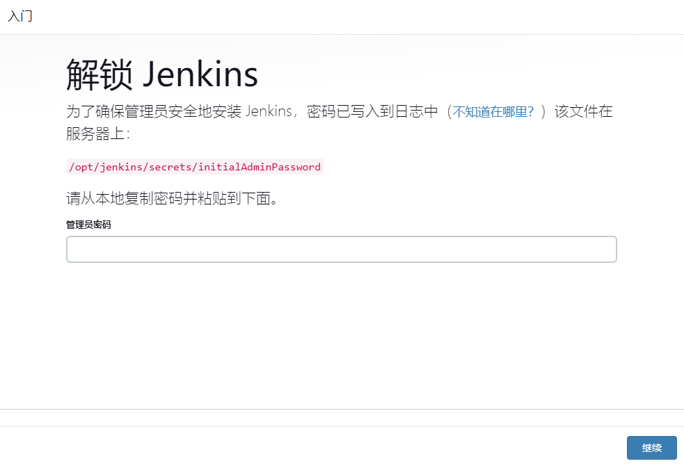
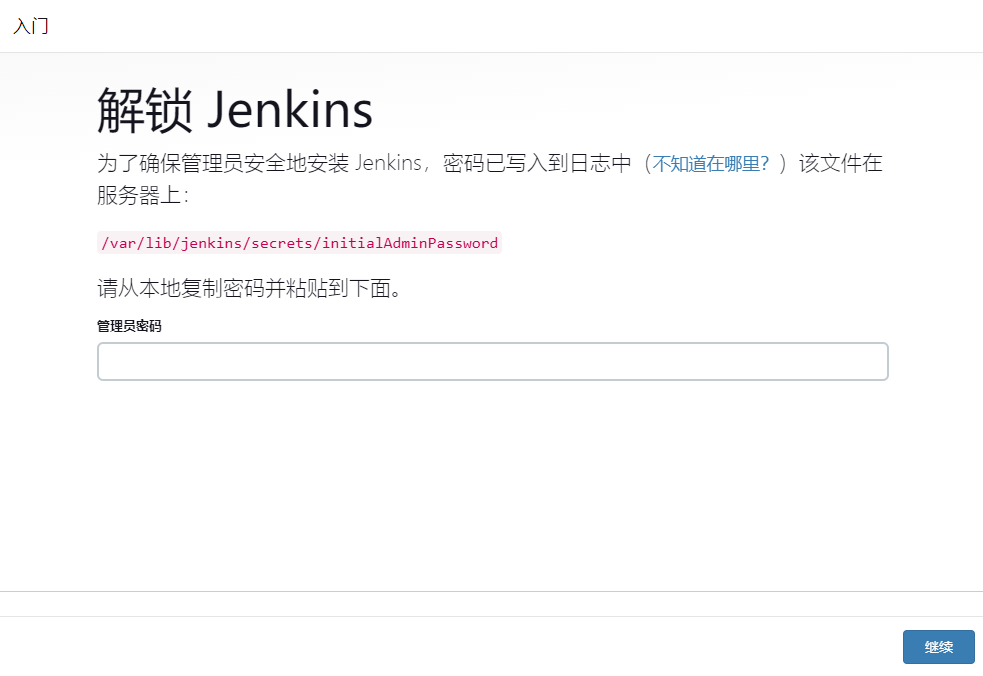
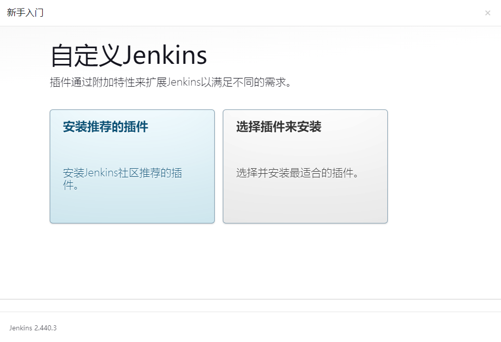
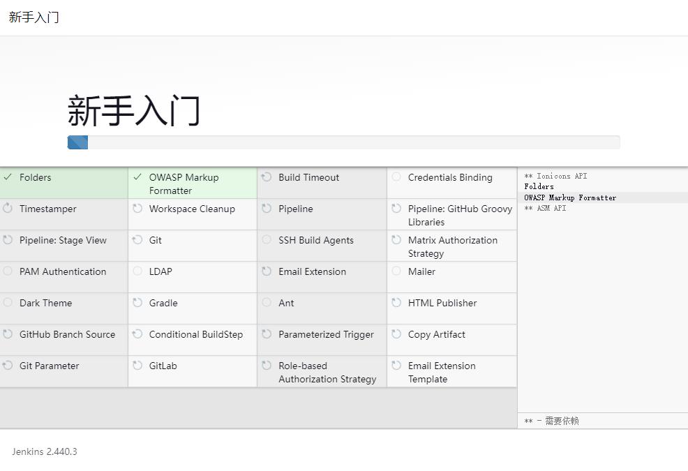
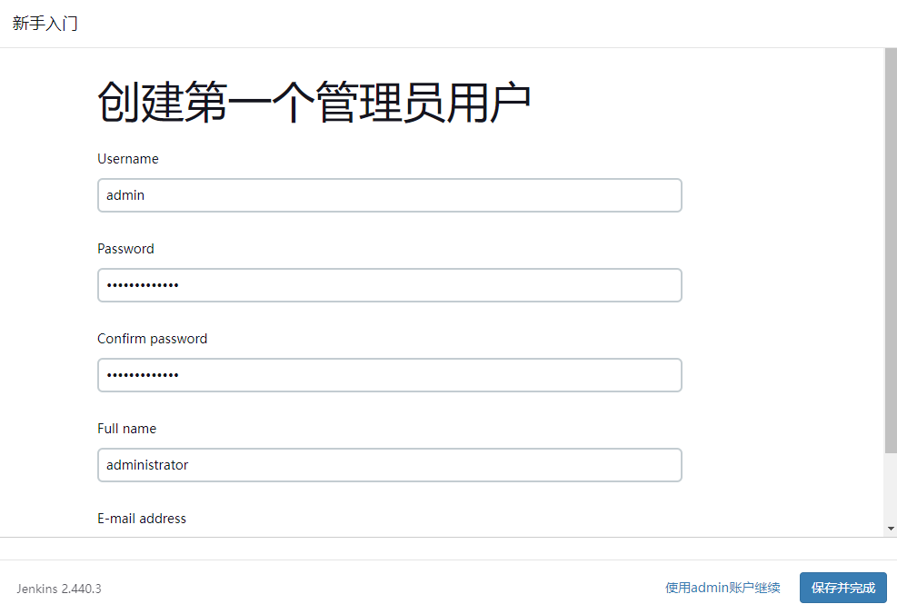
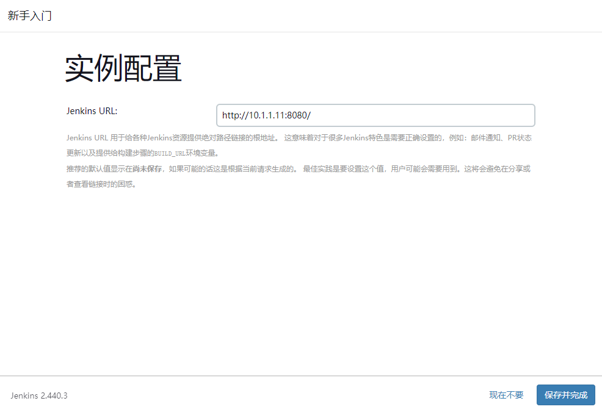
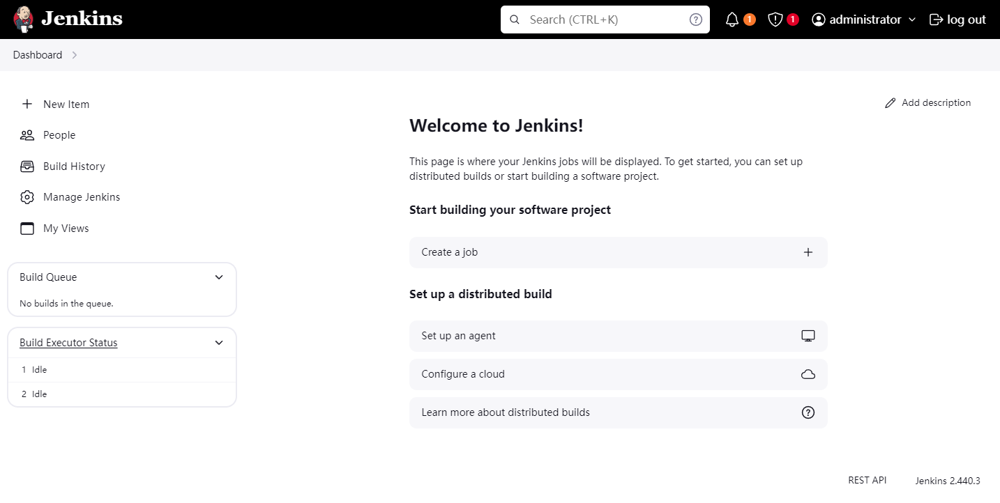

## 安装环境

长期支持（LTS）版本和定期发布版本支持的 Java 版本：

- **2.361.1（2022 年 9 月）及更高版本**：Java 11 或 Java 17
- **2.346.1（2022 年 6 月）及更高版本**：Java 8、Java 11 或 Java 17
- **2.164.1（2019 年 3 月）及更高版本**：Java 8 或 Java 11
- **2.60.1（2017 年 6 月）及更高版本**：Java 8
- **1.625.1（2015 年 10 月）及更高版本**：Java 7

查看 [Java 安装教程](../../../computers/dev_env/jdk.md)。

## WAR 文件安装

Jenkins Web 应用程序 ARchive（WAR）文件捆绑了 [Winstone](https://github.com/jenkinsci/winstone)（一个 [Jetty](https://eclipse.dev/jetty/) servlet 容器包装器），并且可以在具有 Jenkins 支持的 Java 版本的任何操作系统或平台上启动。

- 长期支持（LTS）版本 `jenkins.war` [下载地址](https://get.jenkins.io/war-stable/)
- 定期发布版本 `jenkins.war` [下载地址](https://get.jenkins.io/war/)

### 创建用户

```bash
sudo mkdir /opt/jenkins
sudo useradd jenkins -M -d /opt/jenkins -s /bin/bash
sudo chown -R jenkins:jenkins /opt/jenkins/
```

### 下载并运行 WAR 文件

将 Jenkins WAR 文件下载到您机器上的适当目录中。

```bash
sudo su - jenkins
wget https://get.jenkins.io/war-stable/2.440.3/jenkins.war
```

用 `java` 命令运行 WAR 文件。

```bash
java -jar jenkins.war &
# 或
JENKINS_HOME=/opt/jenkins java -jar jenkins.war --httpPort=9090 &
```

- **JENKINS_HOME**：指定安装目录，默认安装目录在运行用户家目录下的 `.jenkins` 目录中
- **--httpPort**：指定端口，默认是 `8080`

有关可以调整 Jenkins 启动的命令行参数的更多详细信息，请使用以下命令：

```bash
java -jar jenkins.war --help
```

### 访问 Jenkins

在终端中看见以下信息，Jenkins 启动成功。

```bash
Jenkins initial setup is required. An admin user has been created and a password generated.
Please use the following password to proceed to installation:

f7e85bf2608f41a09e41fb27fc6b6098

This may also be found at: /opt/jenkins/secrets/initialAdminPassword
```

访问地址：`http://localhost:8080`。



[配置安装向导](#配置安装向导)。

### 开机自启

- **Debian 系统**：在 `/lib/systemd/system/` 目录下创建
- **Redhat 系统**：在 `/usr/lib/systemd/system/` 目录下创建

创建 `jenkins.service` 文件，添加以下内容：

```service
[Unit]
Description=Jenkins Continuous Integration Server
Requires=network.target
After=network.target

[Service]
Type=notify
NotifyAccess=main
ExecStart=/usr/bin/java -jar /opt/jenkins/jenkins.war --httpPort=9090
ExecReload=/bin/kill -HUP $MAINPID
Restart=on-failure
SuccessExitStatus=143

User=jenkins
Group=jenkins
Environment="JENKINS_HOME=/opt/jenkins"

[Install]
WantedBy=multi-user.target
```

重新加载 systemd 管理器的配置，启用并启动 Jenkins 服务：

```bash
sudo systemctl daemon-reload
sudo systemctl enable jenkins
sudo systemctl start jenkins
```

## Linux 安装

### Debian 系统

添加 LTS 版本密钥：

```bash
sudo wget -O /usr/share/keyrings/jenkins-keyring.asc \
  https://pkg.jenkins.io/debian-stable/jenkins.io-2023.key
```

添加 Jenkins 的 Debian 软件包存储库：

```bash
echo deb [signed-by=/usr/share/keyrings/jenkins-keyring.asc] \
  https://pkg.jenkins.io/debian-stable binary/ | sudo tee \
  /etc/apt/sources.list.d/jenkins.list > /dev/null
```

更新本地包索引，然后安装 Jenkins：

```bash
sudo apt update
sudo apt install -y jenkins
```

### Redhat 系统

添加 Jenkins 的 Redhat 软件包存储库，并添加 LTS 版本密钥：

```bash
sudo wget -O /etc/yum.repos.d/jenkins.repo https://pkg.jenkins.io/redhat-stable/jenkins.repo
sudo rpm --import https://pkg.jenkins.io/redhat-stable/jenkins.io-2023.key
```

如果您之前添加过密钥，则 `rpm --import` 会失败，因为您已经拥有密钥，请忽略它并继续。

```bash
sudo yum update
sudo yum install jenkins
```

### 访问 Jenkins

访问地址：`http://localhost:8080`。



[配置安装向导](#配置安装向导)。

### 控制 Jenkins 服务

- **开机服务运行**：`sudo systemctl enable jenkins`
- **服务运行**：`sudo systemctl start jenkins`
- **服务停止**：`sudo systemctl stop jenkins`
- **服务重启**：`sudo systemctl restart jenkins`
- **查看服务状态**：`sudo systemctl status jenkins`

## Docker 安装

### 安装 Docker

```shell
sudo apt-get -y install apt-transport-https ca-certificates curl software-properties-common
curl -fsSL http://mirrors.aliyun.com/docker-ce/linux/ubuntu/gpg | sudo apt-key add -
sudo add-apt-repository "deb [arch=amd64] http://mirrors.aliyun.com/docker-ce/linux/ubuntu $(lsb_release -cs) stable"
sudo apt-get -y update
sudo apt-get -y install docker-ce
sudo docker -v
sudo cat > /etc/docker/daemon.json <<EOF
{
  "registry-mirrors": ["https://6870dvkt.mirror.aliyuncs.com"]
}
EOF
```

### 启动 Docker

```shell
sudo systemctl daemon-reload
sudo systemctl start docker
sudo systemctl enable docker
```

### 挂载目录权限

修改挂载目录权限为 `1000`，由于容器内 `jenkins` 用户的 UID 和 PID 为 `1000`。

```bash
sudo mkdir /opt/jenkins_home
sudo chown -R 1000:1000 /opt/jenkins_home
```

### 拉取镜像

```bash
sudo docker pull jenkins/jenkins
```

### 启动 jenkins

1. 使用 `docker run` 运行 Jenkins 服务：

    ```bash
    sudo docker run -d -v /opt/jenkins_home:/var/jenkins_home -p 8080:8080 -p 50000:50000 --restart=on-failure --name jenkins jenkins/jenkins:latest
    ```

2. 使用 `docker compose` 运行 Jenkins 服务。

    - 编写 `docker-compose.yml` 文件

        ```yaml
        version: '3'

        services:
          jenkins:
            restart: always
            image: jenkins/jenkins
            container_name: jenkins
            ports:
              - 8080:8080
              - 50000:50000
            environment:
              TZ: Asia/Shanghai
            volumes:
              - /opt/jenkins_home:/var/jenkins_home
        ```

    - 运行 Jenkins 服务

        ```bash
        sudo docker compose up -d
        ```

查看 Jenkins 日志。

```bash
sudo docker logs jenkins
```

## 配置安装向导

1. 解锁 Jenkins

    输入管理员密码，解锁 Jenkins。

    

2. 自定义 Jenkins

    - **安装推荐的插件**：安装推荐的插件集，这些插件基于最常见的用例。默认选择
    - **选择要安装的插件**：自定义需要安装的插件

    

    

3. 创建管理员用户，点击保存并完成

    

4. 实例配置，点击保存并完成

    

5. 完成配置

    

    
