## VisualSVN

### 安装服务端

`Windows` 上安装 [VisualSVN](https://subversion.apache.org/packages.html#windows) 服务端，按照步骤进行安装。其它操作系统找到相应位置进行下载。

1. 点击 `Next`

    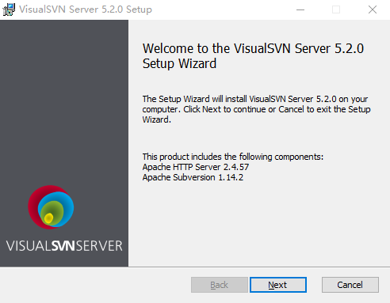

2. 勾选接受许可协议中的条款

    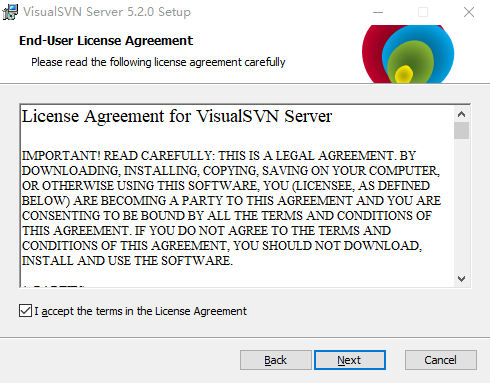

3. 选择要安装的组件

    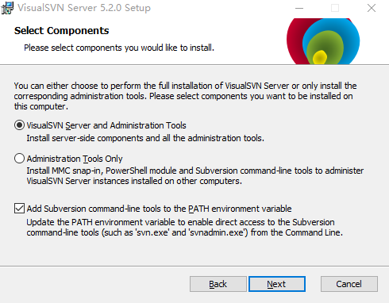

    - **visualsvn server and administration tools**：VisualSVN 服务器和管理工具
    - **administration tools only**：仅限管理工具
    - **add subversion command-line tools to the PATH environment variable**：将 Subversion 命令行工具添加到 `PATH` 环境变量

4. 修改配置

    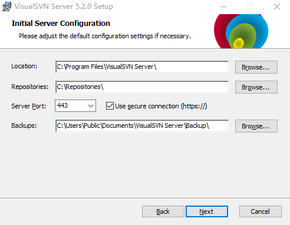

    - **Location**：安装位置
    - **Repo stories**：SVN 仓库位置
    - **Server Port**：端口。后面是否使用安全链接
    - **Backups**：备份文件位置

5. 配置存储库搜索索引，最好在安装位置下面

    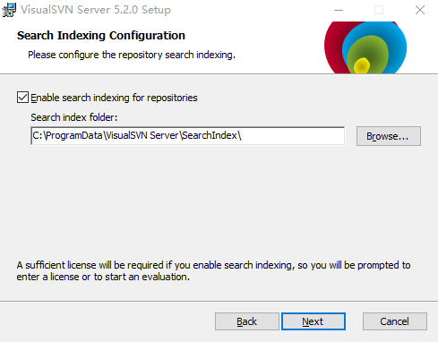

6. 身份认证模式

    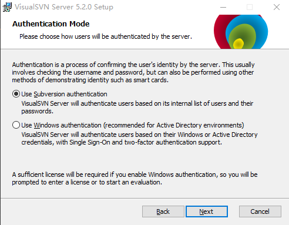

    - **Use Subversion authentication**：使用 Subversion 身份验证
    - **Use Windows authentication(recommended for Active Directory environments)**：使用 Windows 身份验证（建议用于 Active Directory 环境）

7. 许可证（VisualSVN Server 是免费的，而 VisualSVN 是收费的）

    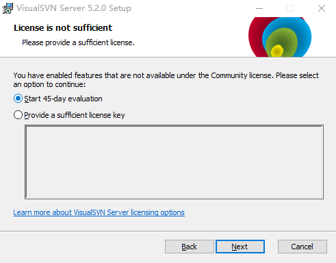

8. 开始安装

    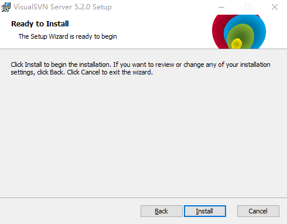

### 新建存储库

1. 右键 `Repositores` 新建存储库

    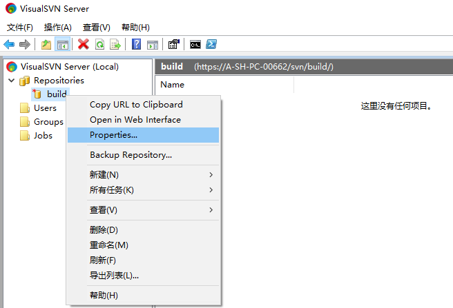

2. 选择存储库类型

    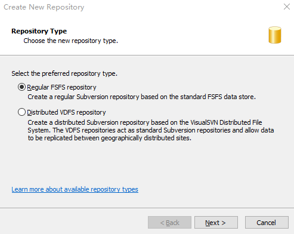

    - **Regular FSFS repository**：常规 FSFS 存储库
    - **Dstributed VDFS repository**：分布式 VDFS 存储库

3. 创建存储库名称

    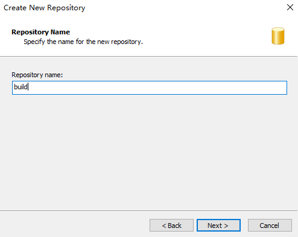

4. 选择存储库结构

    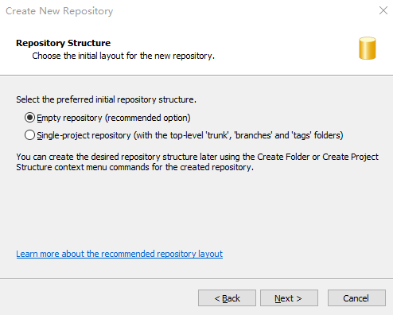

    - **Empty repository(recommended option)**：空存储库（推荐选项）
    - **single-project repostory(with the top-evel 'trunk','branches'and'tags'folders)**：单个项目仓库（带有顶级的 “主干”、“分支” 和 “标签” 文件夹）

5. 选择存储库访问权限

    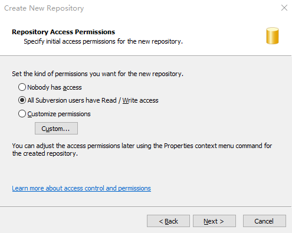

    - **Nobody has access**：没有人可以访问
    - **All Subversion users have Read/Write acess**：所有 Subversion 用户都具有读/写权限
    - **Customize permissions**：自定义权限

6. 是否运行存储库搜索索引

    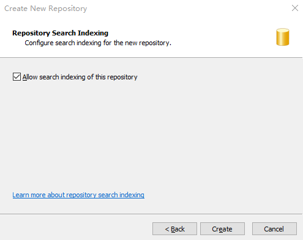

7. 创建完成

    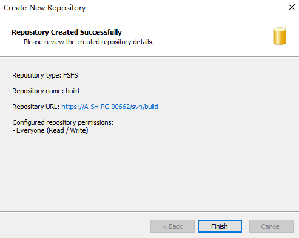

### 创建用户和组

1. 右键 `Users` 新建用户

    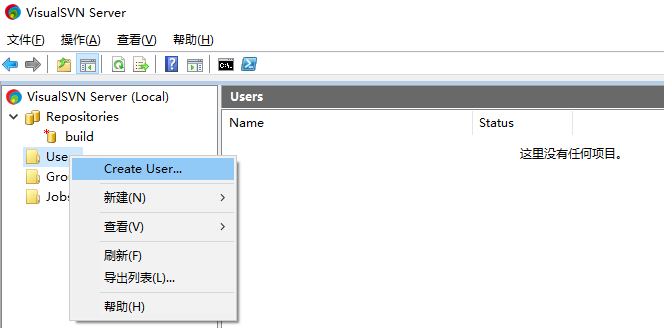

2. 输入用户名和密码

    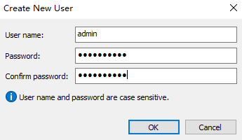

    - **User name**：用户名
    - **Password**：密码
    - **Confirm password**：确认密码

3. 右键 `Groups` 新建用户组

    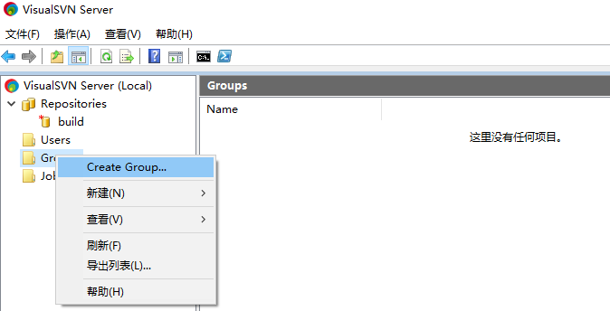

4. 输入组名，点击 `Add` 选择用户添加到这个组中

    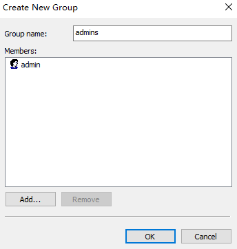

### 给用户组设置权限

1. 右键刚才创建的存储库，选择 `Properties`。

    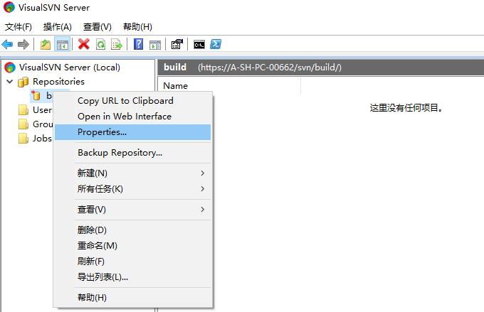

2. 设置只有 `admins` 组成员可以访问

    选择 `Security` 选项，点击 `Add` 添加 `admins` 组，并移除 `Everyone`。

    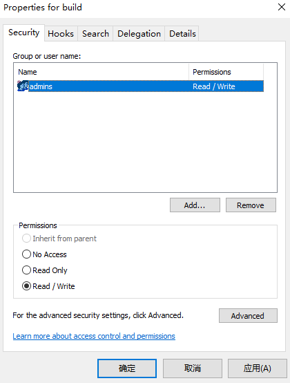

## TortoiseSVN

### 安装客户端

`Windows` 上安装 [TortoiseSVN](https://subversion.apache.org/packages.html#windows) 客户端，按照步骤进行安装。其它操作系统找到相应位置进行下载。

1. 点击 `Next`

    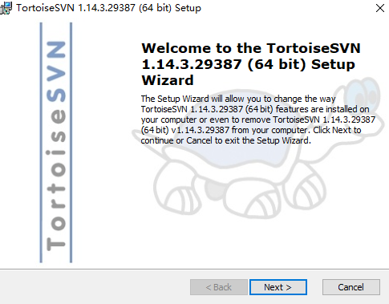

    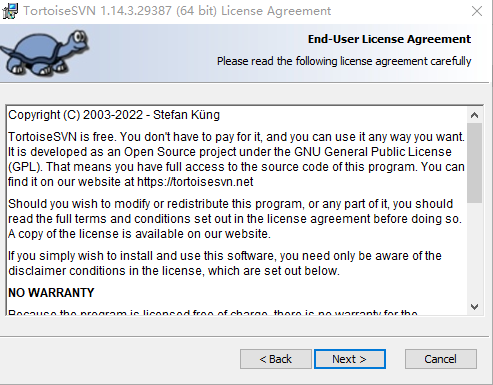

2. 自定义安装

    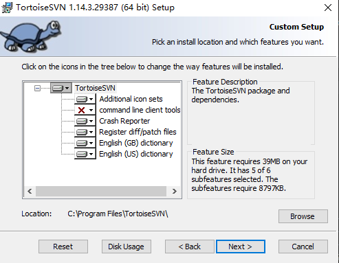

3. 是否选择使用命令行操作

    `command line dient tools` 建议安装，如果不安装则之后在 `IDEA` 里面配置时找不到 `svn.exe` 文件

    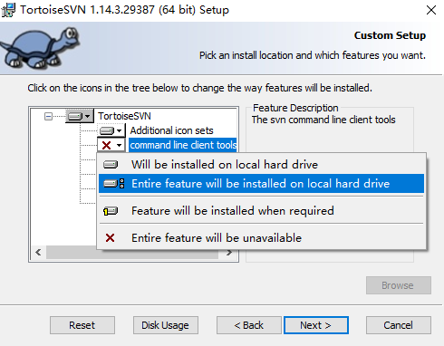

    - **Will be installed on local hard drive**：将安装在本地硬盘上
    - **Entire feature will be installed don local hard drive**：整个功能将安装在本地硬盘上
    - **Feature will be installed when required**：功能将在需要时安装
    - **Entire feature will be unavailable**：整个功能将不可用

4. 开始安装

    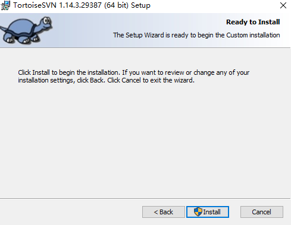

### 浏览仓库

1. 点击鼠标右键，选择 *TortoiseSVN -> Repo-browser*

    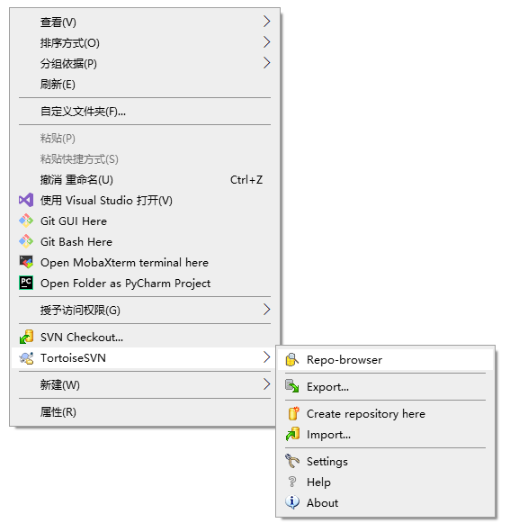

2. 输入要访问的仓库 URL

    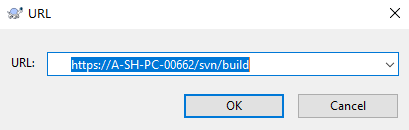

3. 进行认证

    由于这个仓库设置了只有 `admins` 组的用户才可以访问，输入 `admins` 组中一个用户名和密码进行认证。

    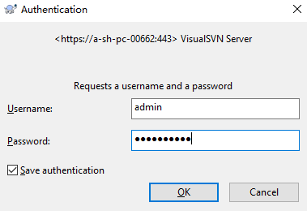

4. 查看仓库

    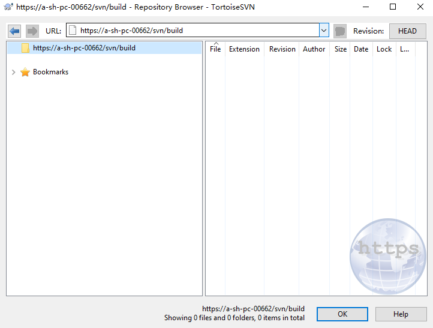

    这个仓库还没有添加任何文件。

### 将仓库 checkout 到本地

1. 点击鼠标右键，选择 **SVN Checkout**

    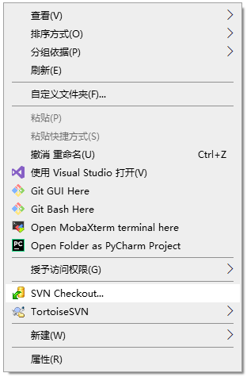

2. 选择要 `checkout` 的仓库

    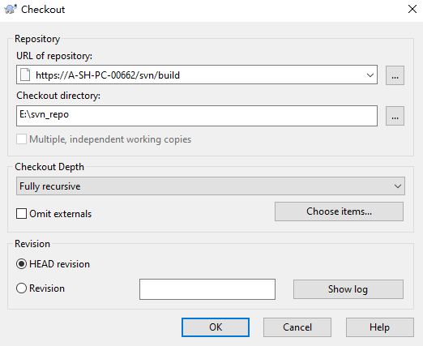

    - **URL of repository**：要 `checkout` 的仓库 URL
    - **Checkout directory**：存放到本地的位置
    - **Revision**：仓库版本

    由于这个仓库没有任何文件，所以 `checkout` 到本地后只有一个 `.svn` 隐藏文件。`.svn` 用于保存文件或文件夹版本状态等数据

    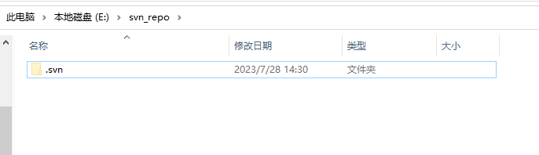

### 创建文件并 commit 到 SVN

1. 创建一个文件

    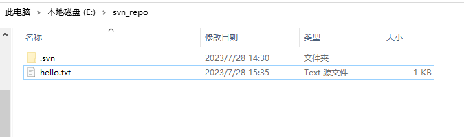

2. 添加文件

    选中添加的文件，右键选择 *TortoiseSVN -> Add*。

    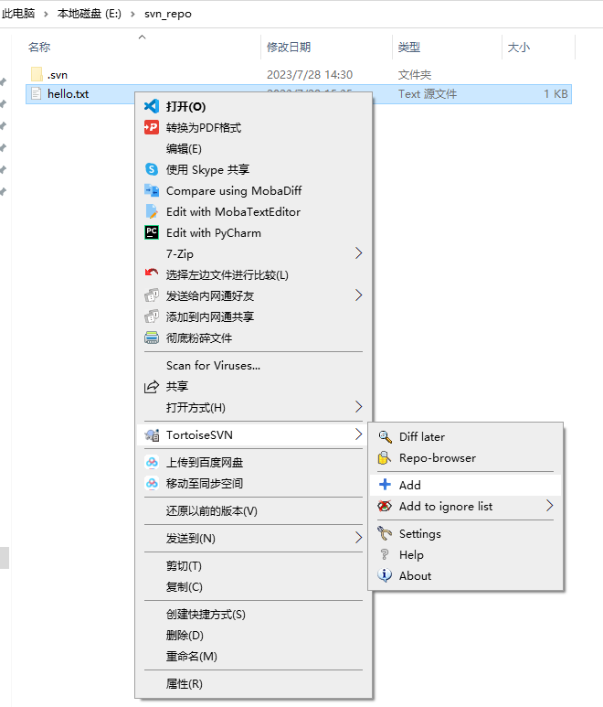

3. 提交到 SVN

    添加文件后，右键选择 **SVN Commit。**

    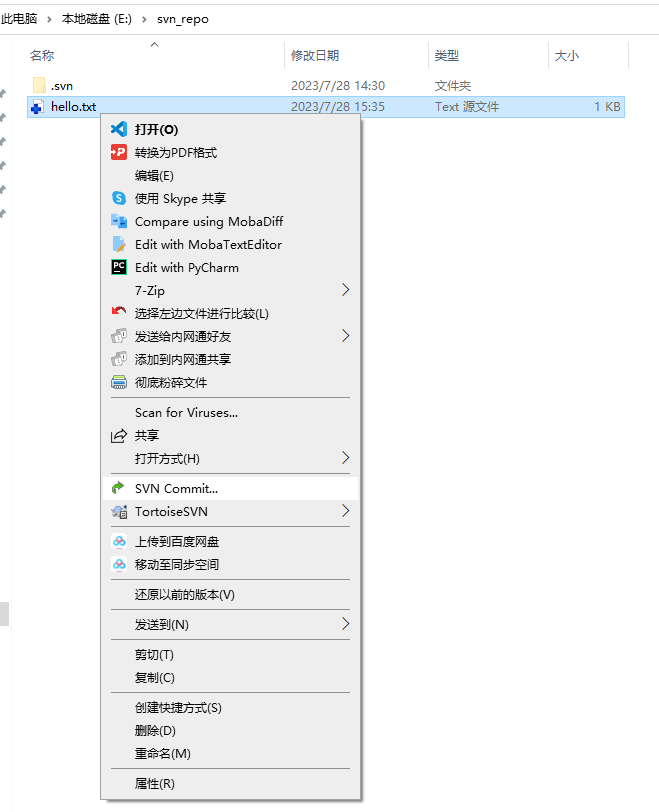

    在 Message 中填入提交的描述信息，方便以后查看 log 日志。

    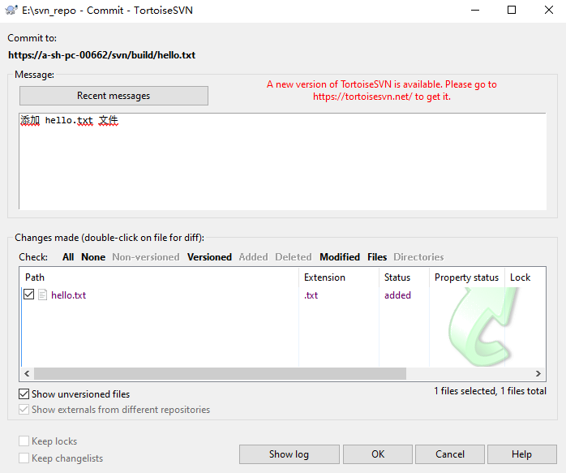

4. 完成提交

    提交后文件标识会变成绿色。

    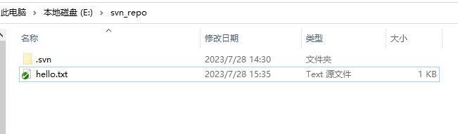

    服务端刷新后也会有对应的文件。

    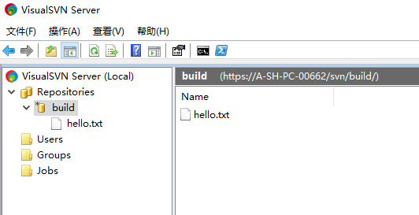

### Update 操作

`checkout` 仓库到本地后，每次操作这个仓库前都需要 `Update` 一下，将 SVN 服务器上的内容更新到本地。

::: warning
如果不进行 `Update` 操作，进行修改文件并上传文件时，可能会将其它人做过的修改进行覆盖。
:::

### Delete 操作

选择要删除的文件或文件夹，右键选择 *TortoiseSVN -> Delete* 标记删除，这时只是在本地文件删除，还需要进行 `commit` 操作，SVN 服务端上文件才会删除。

### 提交冲突

当多个用户同时操作同一个文件，当您要 `commit` 到 SVN 服务器上，但有其他人提前进行 `commit` 操作时，就会产生冲突。

这时可以采用手动 `Merge`，解决冲突后，重新进行 `commit` 操作。

例如：`test.txt` 文件产生冲突。在进行 `commit` 操作后，提示 `Commit Failed!` 后会产生以下文件：

- **test.txt**：SVN 服务器上的文件和本地文件合并后，产生的文件
- **text.txt.mine**：本地修改后的文件
- **text.txt.r4**：修改前的文件
- **text.txt.r5**：其他人修改后的文件

选择产生冲突的文件，右键选择 *TortoiseSVN -> Edit conflicts*，手动 `merge` 后再次 `commit`。

### 查看 log 日志

选中仓库，或仓库中的某个文件，右键选择 *TortoiseSVN -> Show log。*

### 回退版本

如果想要回退到之前的版本，选中要回退的文件，右键选择 *TortoiseSVN -> Update to revision*，点击 `Show log` 查看具体要回退到哪个版本。

## VS Code 配置 SVN

1. 本地提前安装 [TortoiseSVN](#安装客户端) 客户端
2. `VS Code` 安装 SVN 插件
3. 配置 SVN 路径

    打开 `VS Code` 设置或使用快捷键 <kbd>Ctrl</kbd> + <kbd>,</kbd> 打开。

    在搜索框中输入 `svn:path`，在 `settin.json` 文件中修改。将本地安装的 `TortoiseSVN` 路径输入到对应的位置。例如：

    ```json
    "svn.path": "E:\\Software\\TortoiseSVN\\bin\\svn.exe",
    ```

    ::: tip
    如果在本地安装的 `TortoiseSVN\bin` 目录下找不到 `svn.exe` 文件。则找到 `TortoiseSVN` 包进行 `Modify` 修改包。

    依次点击 *控制面板 -> 程序和功能*，找到 `TortoiseSVN` 包进行 `Modify` 修改，修改 `Command line tools` 选项。参考：[安装客户端中的第三项（3.）](#安装客户端)
    :::

4. 重新打开 `VS Code`，SVN 配置生效

## Ubuntu 安装

大多数 GNU/Linux 发行版系统自带了 Subversion，所以它很有可能已经安装在您的系统上了。可以使用下面命令检查是否安装：

```shell
svn --version
```

如果 Subversion 客户端没有安装，命令将报告 `svn` 命令找不到的错误。

```shell
svn --version

bash: svn: command not found
```

可以使用以下命令进行安装。

```shell
sudo yum install -y subversion
```

安装成功之后，执行 `svn --version` 命令，查看 SVN 版本。

```shell
svn --version

svn, version 1.9.7 (r1800392)
   compiled May 21 2022, 07:24:25 on x86_64-pc-linux-gnu
```

## CentOS 安装

大多数 GNU/Linux 发行版系统自带了 Subversion，所以它很有可能已经安装在您的系统上了。可以使用下面命令检查是否安装：

```shell
svn --version
```

如果 Subversion 客户端没有安装，命令将报告 `svn` 命令找不到的错误。

```shell
svn --version

The program 'svn' is currently not installed. You can install it by typing:
apt-get install subversion
```

可以使用以下命令进行安装。

```shell
sudo apt install -y subversion
```

安装成功之后，执行 `svn --version` 命令，查看 SVN 版本。

```shell
svn --version

svn, version 1.10.2 (r1835932)
   compiled May 12 2022, 15:12:27 on x86_64-redhat-linux-gnu
```
