# CSS 语法

CSS 规则集（rule-set）由选择器和声明块组成：

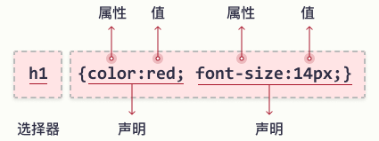

- 选择器：指向您需要设置样式的 HTML 元素
- 声明块：包含一条或多条用 **分号** 分隔的声明
- 每条声明都包含一个 CSS **属性名称** 和 **一个值**，以冒号分隔
- 多条 CSS 声明用分号分隔，声明块用 **花括号** 括起来

example：

在此例中，所有 `<p>` 元素都将居中对齐，并带有红色文本颜色：

```html
<!DOCTYPE html>
<html>

<head>
  <style>
    p {
      color: red;
      text-align: center;
    }
  </style>
</head>

<body>

  <p>Hello World!</p>
  <p>这些段 落是通过 CSS 设置样式的。</p>

</body>

</html>
```

**效果：**


- `p` 是 CSS 中的选择器（它指向要设置样式的 HTML 元素：`<p>`）
- `color` 是属性，`red` 是属性值
- `text-align` 是属性，`center` 是属性值

# CSS 选择器

CSS 选择器用于 “查找”（或选取）要设置样式的 HTML 元素。

我们可以将 CSS 选择器分为五类：

- **简单选择器**（根据名称、id、类来选取元素）
- **组合器选择器**（根据它们之间的特定关系来选取元素）
- **伪类选择器**（根据特定状态选取元素）
- **伪元素选择器**（选取元素的一部分并设置其样式）
- **属性选择器**（根据属性或属性值来选取元素）

## CSS 元素选择器

**元素选择器** 根据 **元素名称** 来选择 HTML 元素。

example：

在此例中，所有 `<p>` 元素都将居中对齐，并带有红色文本颜色：

```html
<!DOCTYPE html>
<html>

<head>
  <style>
    p {
      color: red;
      text-align: center;
    }
  </style>
</head>

<body>

  <p>Hello World!</p>
  <p>这些段 落是通过 CSS 设置样式的。</p>

</body>

</html>
```

**效果：**


## CSS id选择器

`id` 选择器使用 HTML 元素的 id 属性来选择特定元素。

元素的 id 在页面中是唯一的，因此 id 选择器用于选择一个唯一的元素！

要选择具有特定 id 的元素，请写一个井号（`#`），后跟该元素的 `id`。

example：

```html
<!DOCTYPE html>
<html>

<head>
  <style>
    #para1 {
      text-align: center;
      color: red;
    }
  </style>
</head>

<body>

  <p id="para1">Hello World!</p>
  <p>本段不受样式的影响。</p>

</body>

</html>
```

**效果：**

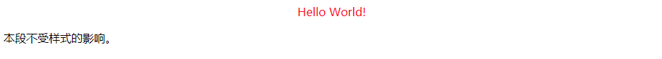

> id 名称不能以数字开头

## CSS 类选择器

类选择器选择有特定 `class` 属性的 HTML 元素。

如需选择拥有特定 `class` 的元素，请写一个句点（`.`）字符，后面跟类名。

example：

```html
<!DOCTYPE html>
<html>

<head>
  <style>
    .center {
      text-align: center;
      color: red;
    }
  </style>
</head>

<body>

  <h1 class="center">居中的红色标题</h1>
  <p class="center">居中的红色段落。</p>

</body>

</html>
```

**效果：**

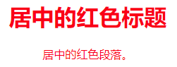

您还可以指定只有特定的 HTML 元素会受类的影响。

下面只有具有 `class="center"` 的 `<p>` 元素会居中对齐：

```css
p.center {
  text-align: center;
  color: red;
}
```

HTML 元素也可以引用多个类。

下面 `<p>` 元素将根据 `class="center"` 和 `class="large"` 进行样式设置：

```css
p.center {
  text-align: center;
  color: red;
}

p.large {
  font-size: 300%;
}

<p class="center large">这个段落引用两个类。</p>
```

## CSS 通用选择器

通用选择器（`*`）选择页面上的所有的 HTML 元素。

下面的 CSS 规则会影响页面上的每个 HTML 元素：

```html
<!DOCTYPE html>
<html>

<head>
  <style>
    * {
      text-align: center;
      color: blue;
    }
  </style>
</head>

<body>

  <h1>Hello world!</h1>

  <p>页面上的每个元素都会受到样式的影响。</p>
  <p id="para1">我也是！</p>
  <p>还有我！</p>

</body>

</html>
```

**效果：**

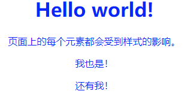

## CSS 分组选择器

分组选择器选取所有具有相同样式定义的 HTML 元素。

下面的 CSS 代码（h1、h2 和 p 元素具有 **相同** 的样式定义）：

```css
h1 {
  text-align: center;
  color: red;
}

h2 {
  text-align: center;
  color: red;
}

p {
  text-align: center;
  color: red;
}
```

最好对选择器进行分组，以最大程度地 **缩减代码。**

如需对选择器进行分组，请用 **逗号** 来分隔每个选择器。

```html
<!DOCTYPE html>
<html>

<head>
  <style>
    h1, h2, p {
      text-align: center;
      color: red;
    }
  </style>
</head>

<body>

  <h1>Hello World!</h1>
  <h2>更小的标题</h2>
  <p>这是一个段落。</p>

</body>

</html>
```

**效果：**

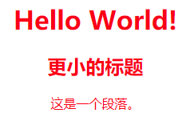

# CSS 使用

有三种插入 CSS 样式表的方法：

- 外部 CSS
- 内部 CSS
- 行内 CSS

## 外部 CSS

通过使用外部样式表，您只需修改一个文件即可改变整个网站的外观！

每张 HTML 页面必须在 `head` 部分的 `<link>` 元素内 **包含** 对外部样式表文件的引用。

**外部样式** 在 HTML 页面 `<head>` 部分内的 `<link>` 元素中进行定义：

- `<link>`：标签定义文档与外部资源的关系。
- `rel`：规定当前文档与被链接文档之间的关系
- `href`：规定被链接文档的位置

```html
<!DOCTYPE html>
<html>

<head>
  <link rel="stylesheet" href="/demo/css/mystyle.css" />
</head>

<body>

  <h1>This is a heading</h1>
  <p>This is a paragraph.</p>

</body>

</html>
```

**效果：**

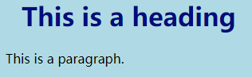

> 外部样式表可以在任何文本编辑器中编写，并且必须以 `.css` 扩展名保存
> 
> 外部 `.css` 文件不应包含任何 HTML 标签

`"mystyle.css"` 是这样的：

```css
body {
  background-color: lightblue;
}

h1 {
  color: navy;
  margin-left: 20px;
}
```

> 请勿在 **属性值** 和 **单位** 之间添加空格（例如：`margin-left: 20 px;`）。正确的写法是：（`margin-left: 20px;`）

## 内部 CSS

如果一张 HTML 页面拥有 **唯一** 的样式，那么可以使用内部样式表。

内部样式是在 `head` 部分的 `<style>` 元素中进行定义。

内部样式在 HTML 页面的 `<head>` 部分内的 `<style>` 元素中进行定义：

```html
<!DOCTYPE html>
<html>

<head>
  <style>
    body {
      background-color: linen;
    }
    
    h1 {
      color: maroon;
      margin-left: 40px;
    }
  </style>
</head>

<body>

  <h1>这是一个标题</h1>
  <p>这是一个段落。</p>

</body>

</html>
```

**效果：**

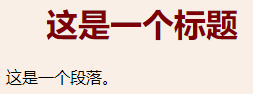

## 行内 CSS

行内样式（也称内联样式）可用于为单个元素应用唯一的样式。

如需使用行内样式，请将 `style` 属性添加到相关元素。`style` 属性 **可包含** 任何 `CSS` 属性。

行内样式在相关元素的 `"style"` 属性中定义：

```html
<!DOCTYPE html>
<html>

<body>

  <h1 style="color:blue;text-align:center;">这是标题</h1>
  <p style="color:red;">这是一个段落。</p>

</body>

</html>
```

**效果：**

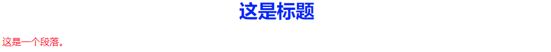

> 行内样式失去了样式表的许多优点（通过将内容与呈现混合在一起）。请谨慎使用此方法

## 多个样式表

如果在不同样式表中为同一选择器（元素）定义了一些属性，则将使用最后读取的样式表中的值。

- 如果内部样式是在链接到外部样式表之后定义的，则应用 **内部样式**
- 如果在链接到外部样式表之前定义了内部样式，则应用 **外部样式**

## 层叠顺序

当为某个 HTML 元素指定了多个样式时，会使用哪种样式呢？

页面中的所有样式将按照以下规则 **层叠** 为新的 **虚拟** 样式表，其中 **第一** 优先级最高：

- 行内样式（在 HTML 元素中）
- 外部和内部样式表（在 head 部分）
- 浏览器默认样式

> 因此，行内样式具有最高优先级，并且将覆盖外部和内部样式以及浏览器默认样式

# CSS 注释

注释用于解释代码，以后在您编辑源代码时可能会有所帮助。

- 您可以在代码中的任何位置添加注释
- 注释能横跨多行
- 浏览器会忽略注释

位于 `<style>` 元素内的 CSS 注释，以 `/*` 开始，以 `*/` 结束：

```html
<!DOCTYPE html>
<html>

<head>
  <style>
    /* 这是单行注释 */
    /* 这是
    多行的
    注释 */
    p {
      color: red;    /* 把文本设置为红色 */
    }
  </style>
</head>

<body>

  <p>Hello World!</p>
  <p>这段文本由 CSS 设置样式。</p>
  <p>CSS 注释不会在输出中显示。</p>

</body>

</html>
```

**效果：**

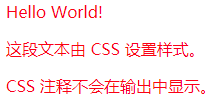

# CSS 颜色

指定颜色是通过使用预定义的颜色名称，或 `RGB`、`HEX`、`HSL`、`RGBA`、`HSLA` 值。

## CSS 颜色名

在 CSS 中，可以使用 **颜色名称** 来指定颜色

`CSS/HTML` 支持 140 种标准颜色名。

### CSS 背景色

通过 `background-color` 属性您可以为 HTML 元素设置背景色：

```html
<!DOCTYPE html>
<html>

<body>

  <h1 style="background-color:Tomato;">番茄色</h1>
  <h1 style="background-color:Orange;">橙色</h1>

</body>

</html>
```

**效果：**

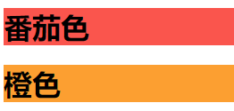

### CSS 文本颜色

通过 `color` 属性您可以设置文本的颜色：

```html
<!DOCTYPE html>
<html>

<body>

  <h1 style="color:Tomato;">番茄色</h1>
  <h1 style="color:Orange;">橙色</h1>

</body>

</html>
```

**效果：**

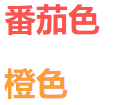

### CSS 边框颜色

通过 `border` 属性您可以设置边框的颜色：

```html
<!DOCTYPE html>
<html>

<body>

  <h1 style="border: 2px solid Tomato;">Hello World</h1>
  <h1 style="border: 2px solid DodgerBlue;">Hello World</h1>
  <h1 style="border: 2px solid Violet;">Hello World</h1>

</body>

</html>
```

**效果：**

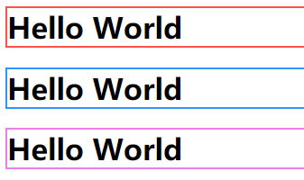

## CSS RGB 颜色

在 CSS 中，可以使用公式将颜色指定为 RGB 值：`rgb(red, green, blue)`

每个参数（`red`、`green` 以及 `blue`）定义了 `0` 到 `255` 之间的颜色强度。

例如：`rgb(255, 0, 0)` 显示为红色，因为红色设置为最大值（`255`），其他设置为 `0`。

要显示黑色，请将所有颜色参数设置为 `0`，如：`rgb(0, 0, 0)`。

要显示白色，请将所有颜色参数设置为 `255`，如：`rgb(255, 255, 255)`。

## RGBA 值

`RGBA` 颜色值是具有 `alpha` 通道的 `RGB` 颜色值的扩展，它指定了颜色的 **不透明度。**

RGBA 颜色值指定为：`rgba(red, green, blue, alpha)`

alpha 参数是介于 `0.0`（完全透明）和 `1.0`（完全不透明）之间的数字：

```html
<!DOCTYPE html>
<html>

<body>

  <h1 style="background-color:rgba(255, 99, 71, 0);">rgba(255, 99, 71, 0)</h1>
  <h1 style="background-color:rgba(255, 99, 71, 0.4);">rgba(255, 99, 71, 0.6)</h1>
  <h1 style="background-color:rgba(255, 99, 71, 1);">rgba(255, 99, 71, 1)</h1>

</body>

</html>
```

**效果：**


## CSS HEX 颜色

在 CSS 中，可以使用十六进制值的格式指定颜色：`#rrggbb`

其中 `rr`（红色）、`gg`（绿色）和 `bb`（蓝色）是介于 `00` 和 `ff` 之间的 **十六进制值**（与十进制 `0-255` 相同）。

例如：`#ff0000` 显示为红色，因为红色设置为最大值（`ff`），其他设置为最小值（`00`）。

```html
<!DOCTYPE html>
<html>

<body>

  <h1 style="background-color:#ff0000;">#ff0000</h1>
  <h1 style="background-color:#0000ff;">#0000ff</h1>

</body>

</html>
```

**效果：**

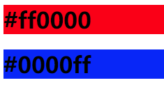

## CSS HSL 颜色

在 CSS 中，可以使用色相、饱和度和明度（`HSL`）来指定颜色，格式如：`hsla(hue, saturation, lightness)`

色相（`hue`）是色轮上从 `0` 到 `360` 的度数。`0` 是红色，`120` 是绿色，`240` 是蓝色。

饱和度（`saturation`）是一个百分比值，`0%` 表示灰色阴影，而 `100%` 是全色。

亮度（`lightness`）也是百分比，`0%` 是黑色，`50%` 是既不明也不暗，`100%` 是白色。

### 饱和度

饱和度可以描述为颜色的强度。

- `100%`：是纯色，没有灰色阴影
- `50%`：是 `50%` 灰色，但是您仍然可以看到颜色
- `0%`：是完全灰色，您无法再看到颜色

```html
<!DOCTYPE html>
<html>

<body>

  <h1 style="background-color:hsl(0, 100%, 50%);">hsl(0, 100%, 50%)</h1>
  <h1 style="background-color:hsl(0, 80%, 50%);">hsl(0, 80%, 50%)</h1>
  <h1 style="background-color:hsl(0, 60%, 50%);">hsl(0, 60%, 50%)</h1>
  <h1 style="background-color:hsl(0, 40%, 50%);">hsl(0, 40%, 50%)</h1>
  <h1 style="background-color:hsl(0, 20%, 50%);">hsl(0, 20%, 50%)</h1>
  <h1 style="background-color:hsl(0, 0%, 50%);">hsl(0, 0%, 50%)</h1>

</body>

</html>
```

**效果：**

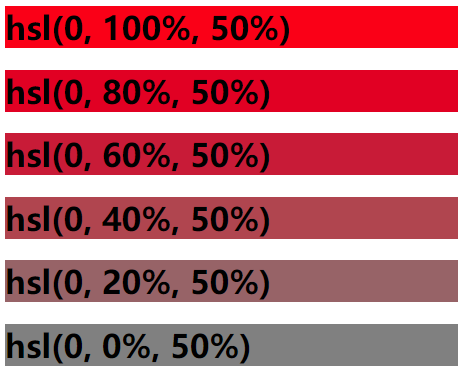

### 亮度

颜色的明暗度可以描述为要赋予颜色多少光。

- `0%`：表示不亮（黑色）
- `50%`：表示 `50%` 亮（既不暗也不亮）
- `100%`：·表示全明（白）

```html
<!DOCTYPE html>
<html>

<body>

  <h1 style="background-color:hsl(0, 100%, 0%);">hsl(0, 100%, 0%)</h1>
  <h1 style="background-color:hsl(0, 100%, 25%);">hsl(0, 100%, 25%)</h1>
  <h1 style="background-color:hsl(0, 100%, 50%);">hsl(0, 100%, 50%)</h1>
  <h1 style="background-color:hsl(0, 100%, 75%);">hsl(0, 100%, 75%)</h1>
  <h1 style="background-color:hsl(0, 100%, 90%);">hsl(0, 100%, 90%)</h1>
  <h1 style="background-color:hsl(0, 100%, 100%);">hsl(0, 100%, 100%)</h1>

</body>

</html>
```

**效果：**

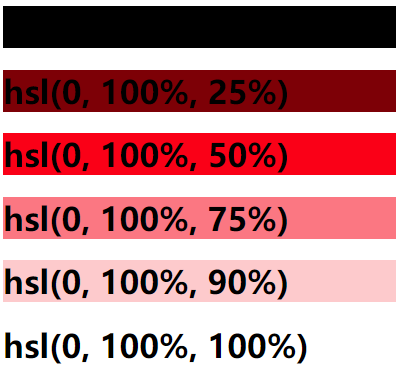

## HSLA 值

`HSLA` 颜色值是带有 `Alpha` 通道的 `HSL` 颜色值的扩展，它指定了颜色的不透明度。

`HSLA` 颜色值指定为：`hsla(hue, saturation, lightness, alpha)`

`alpha` 参数是介于 `0.0`（完全透明）和 `1.0`（完全不透明）之间的数字

# CSS 背景

CSS 背景属性用于定义元素的背景效果。

## CSS 指定元素的背景色

`background-color` 属性指定元素的背景色。

```html
<!DOCTYPE html>
<html>

<head>
  <style>
    body {
      background-color: lightblue;
    }
  </style>
</head>

<body>

  <h1>Hello World!</h1>
  
  <p>此页面拥有浅蓝色背景色！</p>

</body>

</html>
```

**效果：**

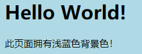

### 其他元素

您可以为任何 HTML 元素设置背景颜色。

在这里，`<h1>`、`<p>` 和 `<div>` 元素将拥有不同的背景色：

```css
h1 {
  background-color: green;
}

div {
  background-color: lightblue;
}

p {
  background-color: yellow;
}
```

### 不透明度/透明度

`opacity` 属性指定元素的 **不透明度/透明度**。取值范围为 `0.0-1.0`。值越低，越透明。

```css
div {
  background-color: green;
  opacity: 0.3;
}
```

> 使用 `opacity` 属性为元素的背景添加透明度时，其所有子元素都继承相同的透明度。这可能会使完全透明的元素内的文本难以阅读

### 使用 RGBA 的透明度

如果您不希望对子元素应用不透明度，请使用 `RGBA` 颜色值。

```css
div {
  background: rgba(0, 128, 0, 0.3)  /* 30% 不透明度的绿色背景 */
}
```

## CSS 背景图像

`background-image` 属性指定用作元素背景的图像。还可以为特定元素设置背景图像，例如：`<p>` 元素。

> 默认情况下，图像会重复，以覆盖整个元素
> 
> 使用背景图像时，请使用不会干扰文本的图像

```html
<!DOCTYPE html>
<html>

<head>
  <style>
    body {
      background-image: url("/i/paper.jpg");
    }
  </style>
</head>

<body>

  <h1>Hello World!</h1>

  <p>此页面以图像为背景！</p>

</body>

</html>
```

**效果：**

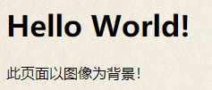

### CSS 背景重复

默认情况下，`background-image` 属性在水平和垂直方向上都重复图像。

某些图像应只适合水平或垂直方向上重复，否则它们看起来会很奇怪。

```css
body {
  background-image: url("/i/css/gradient_bg.png");
}
```

**效果：**

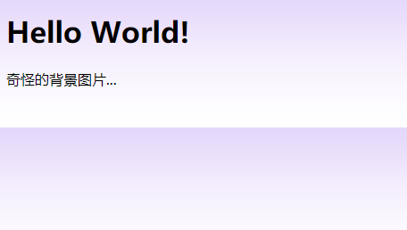

使用 `background-repeat` 属性可以让背景看起来会更好

- `background-repeat`：属性设置是否及如何重复背景图像
    - `repeat-x`：图像仅在水平方向重复
    - `repeat-y`：图像仅在垂直方向重复
    - `no-repeat`：背景图像将仅显示一次

```css
body {
  background-image: url("/i/css/gradient_bg.png");
  background-repeat: repeat-x;
}
```

**效果：**

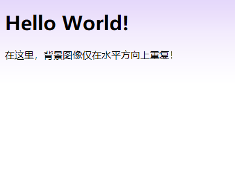

### CSS 指定背景图像的位置

- `background-position` 属性用于指定背景图像的位置，值的位置 **可以互换**
    - `top left`：上左角
    - `top center`：上中角
    - `top right`：上右角
    - `center left`：中左角
    - `center center`：中中角
    - `center right`：中右角
    - `bottom left`：下左角
    - `bottom center`：下中角
    - `bottom right`：下右角

example：

```css
body {
  background-image: url("tree.png");
  background-repeat: no-repeat;
  background-position: right top;
}
```

**效果：**


## CSS 背景附着

### CSS 指定背景图像是否固定

- `background-attachment` 属性指定背景图像是应该 **滚动** 还是 **固定** 的（不会随页面的其余部分一起滚动）
    - `fixed`：当页面的其余部分滚动时，背景图像 **不会移动**
    - `scroll`：背景图像会 **随着页面** 其余部分的滚动而 **移动**

example：

```css
body {
  background-image: url("tree.png");
  background-repeat: no-repeat;
  background-position: right top;
  background-attachment: fixed;
}
```

## CSS 背景简写

### CSS background 简写属性

如需缩短代码，也可以在一个 `background` 属性中指定所有背景属性。它被称为 **简写属性。**

而不是这样写：

```css
body {
  background-color: #ffffff;
  background-image: url("tree.png");
  background-repeat: no-repeat;
  background-position: right top;
}
```

使用简写属性在一条声明中设置背景属性：

```css
body {
  background: #ffffff url("tree.png") no-repeat right top;
}
```

在使用简写属性时，属性值的顺序为：

- `background-color`
- `background-image`
- `background-repeat`
- `background-attachment`
- `background-position`

> 属性值之一缺失并不要紧，只要按照此顺序设置其他值即可。请注意，在上面的例子中，我们没有使用 `background-attachment` 属性，因为它没有值。

# CSS 边框

## CSS 边框属性

CSS `border` 属性允许您指定元素边框的样式、宽度和颜色。

## CSS 边框样式

`border-style` 属性指定要显示的边框类型。

允许以下值：

- `dotted`：定义点状边框
- `dashed`：定义虚线边框
- `solid`：定义实线边框
- `double`：定义双线边框
- `groove`：定义 3D 坡口边框（凹槽边框）。效果取决于 `border-color` 值
- `ridge`：定义 3D 脊线边框（垄状边框）。效果取决于 `border-color` 值
- `inset`：定义 3D inset 边框。效果取决于 `border-color` 值
- `outset`：定义 3D outset 边框。效果取决于 `border-color` 值
- `none`：定义无边框
- `hidden`：定义隐藏边框

> `border-style` 属性可以设置一到四个值（用于上边框、右边框、下边框和左边框）

```css
p.dotted {border-style: dotted;}
p.dashed {border-style: dashed;}
p.solid {border-style: solid;}
p.double {border-style: double;}
p.groove {border-style: groove;}
p.ridge {border-style: ridge;}
p.inset {border-style: inset;}
p.outset {border-style: outset;}
p.none {border-style: none;}
p.hidden {border-style: hidden;}
p.mix {border-style: dotted dashed solid double;}
```

> 除非设置了 `border-style` 属性，否则其他 CSS 边框属性都不会有任何作用

## CSS 边框属性

`border-width` 属性指定四个边框的宽度。

可以将宽度设置为特定大小（以 `px`、`pt`、`cm`、`em` 计），也可以使用以下三个预定义值之一：`thin`、`medium` 或 `thick`


