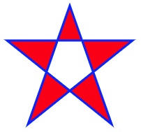

<!-- TOC -->

- [HTML5 canvas](#html5-canvas)
    - [什么是 canvas](#什么是-canvas)
    - [创建 canvas 元素](#创建-canvas-元素)
    - [通过 JavaScript 来绘制](#通过-javascript-来绘制)
    - [理解坐标](#理解坐标)
- [HTML5 内联 SVG](#html5-内联-svg)
    - [什么是 SVG](#什么是-svg)
    - [SVG 的优势](#svg-的优势)
    - [把 SVG 直接嵌入 HTML 页面](#把-svg-直接嵌入-html-页面)
- [HTML5 canvas 对比 SVG](#html5-canvas-对比-svg)
    - [SVG](#svg)
    - [canvas](#canvas)
    - [Canvas 与 SVG 的比较](#canvas-与-svg-的比较)
        - [canvas](#canvas)
        - [SVG](#svg)

<!-- /TOC -->

# HTML5 canvas

`canvas` 元素用于在网页上绘制图形。

## 什么是 canvas

HTML5 的 `canvas` 元素使用 JavaScript 在网页上绘制图像。

画布是一个矩形区域，您可以控制其每一像素。

`canvas` 拥有多种绘制路径、矩形、圆形、字符以及添加图像的方法。

## 创建 canvas 元素

向 HTML5 页面添加 canvas 元素。

规定元素的 id、宽度和高度：

```html
<canvas id="myCanvas" width="200" height="100"></canvas>
```

## 通过 JavaScript 来绘制

`canvas` 元素本身是没有绘图能力的。所有的绘制工作必须在 JavaScript 内部完成：

```html
<script type="text/javascript">
  var c = document.getElementById("myCanvas");
  var cxt = c.getContext("2d");
  cxt.fillStyle = "#FF0000";
  cxt.fillRect(0, 0, 150, 75);
</script>
```

JavaScript 使用 id 来寻找 canvas 元素：

```javascript
var c = document.getElementById("myCanvas");
```

然后，创建 context 对象：

```javascript
var cxt = c.getContext("2d"); 
```

`getContext("2d")` 对象是内建的 HTML5 对象，拥有多种绘制路径、矩形、圆形、字符以及添加图像的方法。

下面的两行代码绘制一个红色的矩形：

```javascript
cxt.fillStyle = "#FF0000";
cxt.fillRect(0, 0, 150, 75); 
```

`fillStyle` 方法将其染成红色，`fillRect` 方法规定了形状、位置和尺寸。

## 理解坐标

上面的 `fillRect` 方法拥有参数 `(0,0,150,75)`。

意思是：在画布上绘制 `150x75` 的矩形，从左上角开始 `(0,0)`。

# HTML5 内联 SVG

## 什么是 SVG

- SVG 指可伸缩矢量图形 (Scalable Vector Graphics)
- SVG 用于定义用于网络的基于矢量的图形
- SVG 使用 XML 格式定义图形
- SVG 图像在放大或改变尺寸的情况下其图形质量不会有损失
- SVG 是万维网联盟的标准

## SVG 的优势

与其他图像格式相比（比如：JPEG 和 GIF），使用 SVG 的优势在于：

- SVG 图像可通过文本编辑器来创建和修改
- SVG 图像可被搜索、索引、脚本化或压缩
- SVG 是可伸缩的
- SVG 图像可在任何的分辨率下被高质量地打印
- SVG 可在图像质量不下降的情况下被放大

## 把 SVG 直接嵌入 HTML 页面

在 HTML5 中，您能够将 SVG 元素直接嵌入 HTML 页面中。

example：

```html
<!DOCTYPE html>
<html>

<body>

  <svg xmlns="http://www.w3.org/2000/svg" version="1.1" height="190">
    <polygon points="100,10 40,180 190,60 10,60 160,180"
      style="fill:red;stroke:blue;stroke-width:3;fill-rule:evenodd;" />
  </svg>

</body>

</html>
```

**效果：**



[SVG 教程](https://www.w3school.com.cn/svg/index.asp)

# HTML5 canvas 对比 SVG

## SVG

SVG 是一种使用 XML 描述 2D 图形的语言。

SVG 基于 XML，这意味着 SVG DOM 中的每个元素都是可用的。您可以为某个元素附加 JavaScript 事件处理器。

在 SVG 中，每个被绘制的图形均被视为对象。如果 SVG 对象的属性发生变化，那么浏览器能够自动重现图形。

## canvas

canvas 通过 JavaScript 来绘制 2D 图形。

canvas 是逐像素进行渲染的。

在 canvas 中，一旦图形被绘制完成，它就不会继续得到浏览器的关注。如果其位置发生变化，那么整个场景也需要重新绘制，包括任何或许已被图形覆盖的对象。

## Canvas 与 SVG 的比较

下表列出了 canvas 与 SVG 之间的一些不同之处。

### canvas

- 依赖分辨率
- 不支持事件处理器
- 弱的文本渲染能力
- 能够以 `.png` 或 `.jpg` 格式保存结果图像
- 最适合图像密集型的游戏，其中的许多对象会被频繁重绘

### SVG

- 不依赖分辨率
- 支持事件处理器
- 最适合带有大型渲染区域的应用程序（比如谷歌地图）
- 复杂度高会减慢渲染速度（任何过度使用 DOM 的应用都不快）
- 不适合游戏应用

