<!-- TOC -->

- [HTML 基础](#html-基础)
- [HTML 标题](#html-标题)
- [HTML 水平线](#html-水平线)
- [HTML 注释](#html-注释)
- [HTML 段落](#html-段落)
- [HTML 样式](#html-样式)
    - [HTML 的 style 属性](#html-的-style-属性)
    - [HTML 背景颜色](#html-背景颜色)
    - [HTML 字体、颜色和尺寸](#html-字体颜色和尺寸)
    - [HTML 文本对齐](#html-文本对齐)
- [HTML 链接](#html-链接)
    - [HTML 超链接（链接）](#html-超链接链接)
    - [HTML 链接 target 属性](#html-链接-target-属性)
    - [HTML 链接 name 属性](#html-链接-name-属性)
- [HTML 图像](#html-图像)
    - [图像标签 \ 和源属性 src](#图像标签-\img-和源属性-src)
    - [替换文本](#替换文本)
    - [背景图片](#背景图片)
    - [排列图片](#排列图片)
    - [创建图像映射](#创建图像映射)
- [HTML 表格](#html-表格)
    - [表格](#表格)
    - [表格和边框属性](#表格和边框属性)
    - [表格的表头](#表格的表头)
    - [表格中的空单元格](#表格中的空单元格)
    - [带有标题的表格](#带有标题的表格)
    - [跨行或跨列的表格单元格](#跨行或跨列的表格单元格)
    - [单元格边距](#单元格边距)
- [HTML 列表](#html-列表)
    - [无序列表](#无序列表)
    - [有序列表](#有序列表)
    - [定义列表](#定义列表)
- [HTML 块](#html-块)
    - [HTML 块元素](#html-块元素)
    - [HTML 内联元素](#html-内联元素)
    - [HTML \<div> 元素](#html-\div-元素)
    - [HTML \<span> 元素](#html-\span-元素)
- [HTML 类](#html-类)
    - [分类块级元素](#分类块级元素)
    - [分类行内元素](#分类行内元素)
- [HTML id 属性](#html-id-属性)
    - [使用 id 属性](#使用-id-属性)
    - [Class 与 ID 的差异](#class-与-id-的差异)
    - [通过 ID 和链接实现 HTML 书签](#通过-id-和链接实现-html-书签)
- [HTML 文件路径](#html-文件路径)
    - [HTML 文件路径](#html-文件路径)
    - [绝对文件路径](#绝对文件路径)
    - [相对路径](#相对路径)
- [HTML 头部元素](#html-头部元素)
    - [HTML \<head> 元素](#html-\head-元素)
    - [HTML \<title> 元素](#html-\title-元素)
    - [HTML \<base> 元素](#html-\base-元素)
    - [HTML \<link> 元素](#html-\link-元素)
    - [HTML \<style> 元素](#html-\style-元素)
    - [HTML \<meta> 元素](#html-\meta-元素)
    - [HTML \<script> 元素](#html-\script-元素)
- [HTML 计算机代码元素](#html-计算机代码元素)
    - [HTML 键盘格式](#html-键盘格式)
    - [HTML 输出示例](#html-输出示例)
    - [HTML 代码格式](#html-代码格式)
    - [HTML 变量格式化](#html-变量格式化)

<!-- /TOC -->

# HTML 基础

```html
<!DOCTYPE html>
<html lang="en">

<head>
  <meta charset="UTF-8">
  <meta http-equiv="X-UA-Compatible" content="IE=edge">
  <meta name="viewport" content="width=device-width, initial-scale=1.0">
  <title>Document</title>
</head>

<body>

</body>

</html>
```

- `<!DOCTYPE html>`：声明文档的解析类型（document.compatMode），避免浏览器用 **怪异模式**（怪异模式，浏览器使用自己的怪异模式解析渲染页面，会导致不同浏览器渲染的效果不一样）来解析渲染页面。添加 `<!DOCTYPE html>` 这个声明将文档解析类型设置为 **标准模式**（标准模式，浏览器使用 W3C 的标准解析渲染页面）。`<!DOCTYPE html>` 声明必须是 HTML 文档的第一行，位于 \<html> 标签之前。 
- `lang="en"`：设置网页站点为英文站点，中文为 `zh`。这个主要是给搜索引擎看的，搜索引擎会去判断该站点是中文站点还是英文站点，如果设置 `lang` 设置为 `en` 或其他语言，无论网页中是什么语言，在访问页面的时候都会提示您是否需要翻译，可以不设置 `lang` 属性
- `charset="UTF-8"`：设置文档字符编码为 `utf-8`，如果不写可能中文会出现乱码
- `http-equiv="X-UA-Compatible" content="IE=edge"`：`Edge` 模式通知 Windows Internet Explorer 以最高级别的可用模式显示内容，这实际上破坏了 “锁定” 模式。即如果您有 `IE9` 的话说明您有 `IE7`、`IE8`、`IE9`，那么就调用高版本的那个也就是 `IE9`
- `name="viewport"`：`name` 指定了 `meta` 元素的类型；说明该元素包含了什么类型的信息。`viewport` 就是设备的屏幕上能用来显示我们的网页的那一块区域。`viewport` 标记，用于指定用户是否可以缩放 Web 页面，并对相关的选项进行设定。
- `content="width=device-width, initial-scale=1.0"`：`content` 指定了实际的元数据内容。`width` 和 `height` 指令分别指定视区的逻辑宽度和高度。它们的值可以是以像素为单位的数字，也可以是一个特殊的标记符号。如上文代码中 `device-width` 即表示视区宽度应为设备的屏幕宽度，`device-height` 即表示设备的屏幕高度；`initial-scale` 用于设置 Web 页面的初始缩放比例。默认的初始缩放比例值因智能手机浏览器的不同而有所差异，通常情况下，设备会在浏览器中呈现出整个 Web 页面。设为 `1.0` 则显示未经缩放的 Web 页面。
- `<title>Document</title>`：定义浏览器工具栏中的标题

# HTML 标题

HTML 标题（Heading）是通过 `<h1>`、`<h2>`、`<h3>`、`<h4>`、`<h5>`、`<h6>` 标签进行定义的。`<h1>` 定义最大的标题。`<h6>` 定义最小的标题。

example：

```html
<h1>This is a heading</h1>
<h2>This is a heading</h2>
<h3>This is a heading</h3>
```

**效果：**

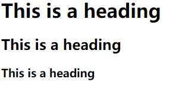

# HTML 水平线

`<hr />` 标签在 HTML 页面中创建水平线。

example：

```html
<p>This is a paragraph</p>
<hr />
<p>This is a paragraph</p>
<hr />
<p>This is a paragraph</p>
```

**效果：**

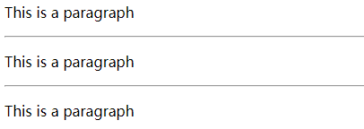

# HTML 注释

可以将注释插入 HTML 代码中，这样可以提高其可读性，使代码更易被人理解。浏览器会忽略注释，也不会显示它们。

example：

```html
<!-- This is a comment -->
<p>这是一段普通的段落。</p>
```

**效果：**

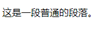

# HTML 段落

HTML 段落是通过 `<p>` 标签进行定义的。

example：

```html
<p>This is a paragraph.</p>
<p>This is another paragraph.</p>
```

**效果：**

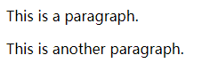

如果您希望在不产生一个新段落的情况下进行换行（新行），请使用 `<br />` 标签：

example：

```html
<p>This is<br />a para<br />graph with line breaks</p>
```

**效果：**

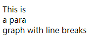

> 当显示页面时，浏览器会移除源代码中多余的空格和空行。所有连续的空格或空行都会被算作一个空格。需要注意的是，HTML 代码中的所有连续的空行（换行）也被显示为一个空格

# HTML 样式

## HTML 的 style 属性

提供了一种改变所有 HTML 元素的样式的通用方法。

## HTML 背景颜色

`background-color` 属性为元素定义了背景颜色：

example：

```html
<html>

<body style="background-color:yellow">
  <h2 style="background-color:red">This is a heading</h2>
  <p style="background-color:green">This is a paragraph.</p>
</body>

</html>
```

**效果：**

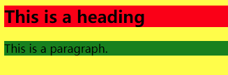

## HTML 字体、颜色和尺寸

`font-family`、`color` 以及 `font-size` 属性分别定义元素中文本的字体系列、颜色和字体尺寸：

example：

```html
<html>

<body>
  <h1 style="font-family:verdana">A heading</h1>
  <p style="font-family:arial;color:red;font-size:20px;">A paragraph.</p>
</body>

</html>
```

**效果：**

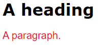

## HTML 文本对齐

`text-align` 属性规定了元素中文本的水平对齐方式：

example：

```html
<html>

<body>
  <h1 style="text-align:center">This is a heading</h1>
  <p>The heading above is aligned to the center of this page.</p>
</body>

</html>
```

**效果：**


# HTML 链接

HTML 使用超级链接与网络上的另一个文档相连。

几乎可以在所有的网页中找到链接。点击链接可以从一张页面跳转到另一张页面。

## HTML 超链接（链接）

超链接可以是一个字，一个词，或者一组词，也可以是一幅图像，您可以点击这些内容来跳转到新的文档或者当前文档中的某个部分。

当您把鼠标指针移动到网页中的某个链接上时，箭头会变为一只小手。

我们通过使用 `<a>` 标签在 HTML 中创建链接。

有两种使用 `<a>` 标签的方式：

- 通过使用 `href` 属性：创建指向另一个文档的链接
- 通过使用 `name` 属性：创建文档内的书签

example：

```html
<p><a href="/index.html">本文本</a> 是一个指向本网站中的一个页面的链接。</p>

<p><a href="http://www.baidu.com/">本文本</a> 是一个指向万维网上的页面的链接。</p>

<p>使用图像来作链接：
  <a href="/example/html/lastpage.html">
    
  </a>
</p>
```

**效果：**

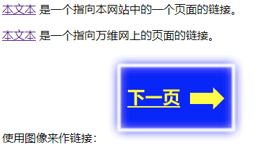

## HTML 链接 target 属性

使用 `target` 属性，您可以定义被链接的文档在何处显示。默认在当前窗口打开文档。

下面的这行会在新窗口打开文档：

example：

```html
<a href="http://www.baidu.com/" target="_blank">Visit Baidu!</a>
```

## HTML 链接 name 属性

`name` 属性规定锚（anchor）的名称。

您可以使用 `name` 属性创建 HTML 页面中的书签。

书签不会以任何特殊方式显示，它对读者是不可见的。

当使用命名锚（named anchors）时，我们可以创建直接跳至该命名锚（比如页面中某个小节）的链接，这样使用者就无需不停地滚动页面来寻找他们需要的信息了。

example：

```html
<a name="label">锚（显示在页面上的文本）</a>

<!-- 首先，我们在 HTML 文档中对锚进行命名（创建一个书签）： -->
<a name="tips">基本的注意事项 - 有用的提示</a>

<!-- 然后，我们在同一个文档中创建指向该锚的链接： -->
<a href="#tips">有用的提示</a>

<!-- 您也可以在其他页面中创建指向该锚的链接： -->
<a href="http://www.w3school.com.cn/html/html_links.asp#tips">有用的提示</a>
```

在上面的代码中，我们将 `#` 符号和锚名称添加到 URL 的末端，就可以直接链接到 tips 这个命名锚了。

> 锚的名称可以是任何您喜欢的名字
> 
> 您可以使用 id 属性来替代 name 属性，命名锚同样有效

# HTML 图像

通过使用 HTML，可以在文档中显示图像。

## 图像标签 \ 和源属性 src

在 HTML 中，图像由 `` 标签定义。

`` 是空标签，意思是说，它只包含属性，并且没有闭合标签，在结尾记得添加 `/` 斜杠，如：``。

要在页面上显示图像，你需要使用源属性 `src`。`src` 指 "source"。源属性的值是图像的 URL 地址。

`width` 和 `height` 可以调整图像的大小

- src：图像地址 URL
- width：调整图像的宽
- height：调整图像的高

example：

```html
<p>一幅图像：
  
</p>
​
<p>一幅动画图像：
  
</p>

<p>来自 W3School.com.cn 的图像：
  
</p>
```

**效果：**

<p>一幅图像：
  
</p>
​
<p>一幅动画图像：
  
</p>

<p>来自 W3School.com.cn 的图像：
  
</p>
​

> 请注意，插入动画图像的语法与插入普通图像的语法没有区别

## 替换文本

如果无法显示图像，将显示 `alt` 属性中的文本。

example：

```html

```

**效果：**

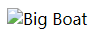

## 背景图片

向 HTML 页面添加背景图片。

example：

```html
<html>

<body background="/i/eg_background.jpg">

  <h3>图像背景</h3>

  <p>gif 和 jpg 文件均可用作 HTML 背景。</p>

  <p>如果图像小于页面，图像会进行重复。</p>

</body>

</html>
```

**效果：**

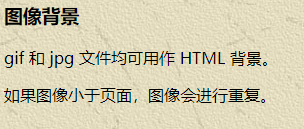

## 排列图片

在文字中排列图像。默认是文字底部对齐

- bottom：文字底部对齐
- middle：文字中间对齐
- top：文字上部对齐

example：

```html
<h2>未设置对齐方式的图像：</h2>

<p>图像  在文本中</p>

<h2>已设置对齐方式的图像：</h2>

<p>图像  在文本中</p>

<p>图像  在文本中</p>

<p>图像  在文本中</p>
```

**效果：**

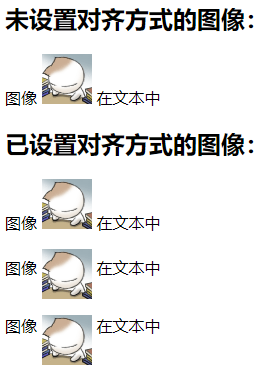

将图片浮动至段落的左边或右边。

- left：图像将浮动到文本的左侧
- right：图像将浮动到文本的右侧

example：

```html
<p>
  
  图像的 align 属性设置为 "left"。图像将浮动到文本的左侧。
</p>

<p>
  
  图像的 align 属性设置为 "right"。图像将浮动到文本的右侧。
</p>
```

**效果：**


## 创建图像映射

创建带有可供点击区域的图像地图。其中的每个区域都是一个超级链接。

example：

```html
<p>请点击图像上的星球，把它们放大。</p>
​

​
<map name="planetmap" id="planetmap">
  ​
  <area shape="circle" coords="180,139,14" href="/example/html/venus.html" target="_blank" alt="Venus" />
  ​
  <area shape="circle" coords="129,161,10" href="/example/html/mercur.html" target="_blank" alt="Mercury" />
  ​
  <area shape="rect" coords="0,0,110,260" href="/example/html/sun.html" target="_blank" alt="Sun" />
  ​
</map>
```

- \<area> 标签
    定义图像映射中的区域（注：图像映射指得是带有可点击区域的图像）。
    
    area 元素总是嵌套在 `<map>` 标签中。

    > `` 标签中的 usemap 属性与 map 元素 name 属性相关联，创建图像与映射之间的联
    系
    - shape：定义区域的形状
    - coords：定义可点击区域（对鼠标敏感的区域）的坐标
    - href：定义此区域的目标 URL
    - target：规定在何处打开 href 属性指定的目标 URL
    - alt：定义此区域的替换文本
- \<map> 标签
    定义一个客户端图像映射。图像映射（image-map）指带有可点击区域的一幅图像。

    > `` 中的 usemap 属性可引用 `<map>` 中的 id 或 name 属性（取决于浏览器），所以我们应同时向 `<map>` 添加 id 和 name 属性
    
    - name：为 image-map 规定的名称
    - id：为 map 标签定义唯一的名称

# HTML 表格

## 表格

表格由 `<table>` 标签来定义。每个表格均有若干行（由 `<tr>` 标签定义），每行被分割为若干单元格（由 `<td>` 标签定义）。字母 `td` 指表格数据（table data），即数据单元格的内容。数据单元格可以包含文本、图片、列表、段落、表单、水平线、表格等等。

example：

```html
<table>
  <tr>
    <td>row 1, cell 1</td>
    <td>row 1, cell 2</td>
  </tr>
  <tr>
    <td>row 2, cell 1</td>
    <td>row 2, cell 2</td>
  </tr>
</table>
```

**效果：**

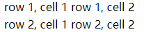

## 表格和边框属性

如果不定义边框属性，表格将不显示边框。有时这很有用，但是大多数时候，我们希望显示边框。

example：

```html
<table border="1">
  <tr>
    <td>row 1, cell 1</td>
    <td>row 1, cell 2</td>
  </tr>
  <tr>
    <td>row 2, cell 1</td>
    <td>row 2, cell 2</td>
  </tr>
</table>
```

**效果：**


## 表格的表头

表格的表头使用 `<th>` 标签进行定义。

example：

```html
<table border="1">
  <tr>
    <th>Heading</th>
    <th>Another Heading</th>
  </tr>
  <tr>
    <td>row 1, cell 1</td>
    <td>row 1, cell 2</td>
  </tr>
  <tr>
    <td>row 2, cell 1</td>
    <td>row 2, cell 2</td>
  </tr>
</table>
```

**效果：**

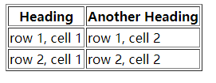

## 表格中的空单元格

在一些浏览器中，没有内容的表格单元显示得不太好。如果某个单元格是空的（没有内容），浏览器可能无法显示出这个单元格的边框

为了避免这种情况，在空单元格中添加一个空格占位符（`&nbsp;`），就可以将边框显示出来。

example：

```html
<table border="1">
  <tr>
    <td>row 1, cell 1</td>
    <td>row 1, cell 2</td>
  </tr>
  <tr>
    <td>&nbsp;</td>
    <td>row 2, cell 2</td>
  </tr>
</table>
```

**效果：**

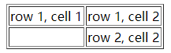

## 带有标题的表格

- caption：设置表格的标题

example：

```html
<table border="1">
  <caption>我的标题</caption>
  <tr>
    <td>100</td>
    <td>200</td>
    <td>300</td>
  </tr>
  <tr>
    <td>400</td>
    <td>500</td>
    <td>600</td>
  </tr>
</table>
```

**效果：**

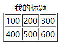

## 跨行或跨列的表格单元格

- colspan：设置单元格可横跨的列数
- rowspan：设置单元格可横跨的行数

example：

```html
<h4>横跨两列的单元格：</h4>
<table border="1">
  <tr>
    <th>姓名</th>
    <th colspan="2">电话</th>
  </tr>
  <tr>
    <td>Bill Gates</td>
    <td>555 77 854</td>
    <td>555 77 855</td>
  </tr>
</table>
​
<h4>横跨两行的单元格：</h4>
<table border="1">
  <tr>
    <th>姓名</th>
    <td>Bill Gates</td>
  </tr>
  <tr>
    <th rowspan="2">电话</th>
    <td>555 77 854</td>
  </tr>
  <tr>
    <td>555 77 855</td>
  </tr>
</table>
```

**效果：**

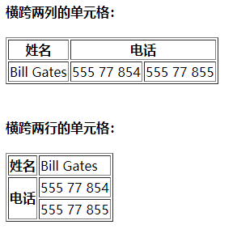

## 单元格边距

- cellpadding：规定单元格内容与其边框之间的距离

example：

```html
<table border="1" cellpadding="10">
  <tr>
    <td>First</td>
    <td>Row</td>
  </tr>
  <tr>
    <td>Second</td>
    <td>Row</td>
  </tr>
</table>
```

**效果：**

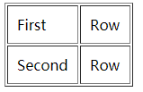

- cellspacing：规定单元格之间的距离

example：

```html
<table border="1" cellspacing="10">
  <tr>
    <td>First</td>
    <td>Row</td>
  </tr>
  <tr>
    <td>Second</td>
    <td>Row</td>
  </tr>
</table>
```

**效果：**

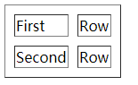

# HTML 列表

HTML 支持有序、无序和定义列表

## 无序列表

无序列表是一个项目的列表，此列项目使用粗体圆点（典型的小黑圆圈）进行标记。

无序列表始于 `<ul>` 标签。每个列表项始于 `<li>`。列表还可以进行嵌套。

example：

```html
<ul>
  <li>Coffee</li>
  <li>Milk</li>
</ul>

<h4>一个嵌套列表：</h4>
<ul>
  <li>咖啡</li>
  <li>茶
    <ul>
      <li>红茶</li>
      <li>绿茶
        <ul>
          <li>中国茶</li>
          <li>非洲茶</li>
        </ul>
      </li>
    </ul>
  </li>
  <li>牛奶</li>
</ul>
```

**效果：**

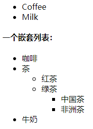

## 有序列表

同样，有序列表也是一列项目，列表项目使用数字进行标记。

有序列表始于 `<ol>` 标签。每个列表项始于 `<li>` 标签。

- start：规定有序列表的起始值
- type：规定在列表中使用的标记类型，如：`1`，`A`，`a`，`I`，`i`

example：

```html
<ol>
  <li>咖啡</li>
  <li>牛奶</li>
  <li>茶</li>
</ol>

<ol start="50">
  <li>咖啡</li>
  <li>牛奶</li>
  <li>茶</li>
</ol>
```

**效果：**

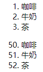

## 定义列表

自定义列表不仅仅是一列项目，而是项目及其注释的组合。

自定义列表以 `<dl>` 标签开始。每个自定义列表项以 `<dt>` 开始。每个自定义列表项的定义以 `<dd>` 开始。

example：

```html
<dl>
  <dt>计算机</dt>
  <dd>用来计算的仪器 ... ...</dd>
  <dt>显示器</dt>
  <dd>以视觉方式显示信息的装置 ... ...</dd>
</dl>
```

**效果：**

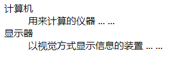

# HTML 块

可以通过 `<div>` 和 `<span>` 将 HTML 元素组合起来。

## HTML 块元素

大多数 HTML 元素被定义为块级元素或内联元素。

编者注：“块级元素” 译为 block level element，“内联元素” 译为 inline element。

块级元素在浏览器显示时，通常会以新行来开始（和结束）。

例子：`<h1>`、`<p>`、`<ul>`、`<table>`

## HTML 内联元素

内联元素在显示时通常不会以新行开始。

例子：`<b>`、`<td>`、`<a>`、``

## HTML \<div> 元素

HTML `<div>` 元素是块级元素，它是可用于组合其他 HTML 元素的容器。

`<div>` 元素没有特定的含义。除此之外，由于它属于块级元素，浏览器会在其前后显示折行。

如果与 CSS 一同使用，`<div>` 元素可用于对大的内容块设置样式属性。

`<div>` 元素的另一个常见的用途是文档布局。它取代了使用表格定义布局的老式方法。使用 `<table>` 元素进行文档布局不是表格的正确用法。`<table>` 元素的作用是显示表格化的数据。

## HTML \<span> 元素

HTML `<span>` 元素是内联元素，可用作文本的容器。

`<span>` 元素也没有特定的含义。用来组合文档中的行内元素。

当与 CSS 一同使用时，`<span>` 元素可用于为部分文本设置样式属性。

# HTML 类

对 HTML 进行分类（设置类），使我们能够为元素的类定义 CSS 样式。

为相同的类设置相同的样式，或者为不同的类设置不同的样式。

## 分类块级元素

HTML `<div>` 元素是块级元素。它能够用作其他 HTML 元素的容器。

设置 `<div>` 元素的类，使我们能够为相同的 `<div>` 元素设置相同的类。

example：

```html
<!DOCTYPE html>
<html>

<head>
  <style>
    .cities {
      background-color: black;
      color: white;
      margin: 20px;
      padding: 20px;
    }
  </style>
</head>

<body>

  <div class="cities">
    <h2>London</h2>
    <p>
      London is the capital city of England.
      It is the most populous city in the United Kingdom,
      with a metropolitan area of over 13 million inhabitants.
    </p>
  </div>

</body>

</html>
```

**效果：**

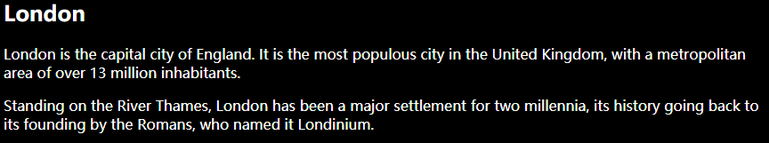

## 分类行内元素

HTML `<span>` 元素是行内元素，能够用作文本的容器。

设置 `<span>` 元素的类，能够为相同的 `<span>` 元素设置相同的样式。

example：

```html
<!DOCTYPE html>
<html>

<head>
  <style>
    span.red {
      color: red;
    }
  </style>
</head>

<body>

  <h1>My <span class="red">Important</span> Heading</h1>

</body>

</html>
```

**效果：**

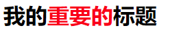

# HTML id 属性

HTML `id` 属性用于为 HTML 元素指定唯一的 `id`。

一个 HTML 文档中不能存在多个有相同 `id` 的元素。

## 使用 id 属性

`id` 属性指定 HTML 元素的唯一 ID。`id` 属性的值在 HTML 文档中必须是唯一的。

`id` 属性用于指向样式表中的特定样式声明。JavaScript 也可使用它来访问和操作拥有特定 ID 的元素。

`id` 的语法是：写一个井号 (`#`)，后跟一个 id 名称。然后，在花括号 {} 中定义 CSS 属性。

example：

```html
<!DOCTYPE html>
<html>

<head>
  <style>
    #myHeader {
      background-color: lightblue;
      color: black;
      padding: 40px;
      text-align: center;
    }
  </style>
</head>

<body>

  <h1>id 属性</h1>

  <p>使用 CSS 来设置 id 为 "myHeader" 的元素的样式：</p>

  <h1 id="myHeader">My Header</h1>

</body>

</html>
```

**效果：**

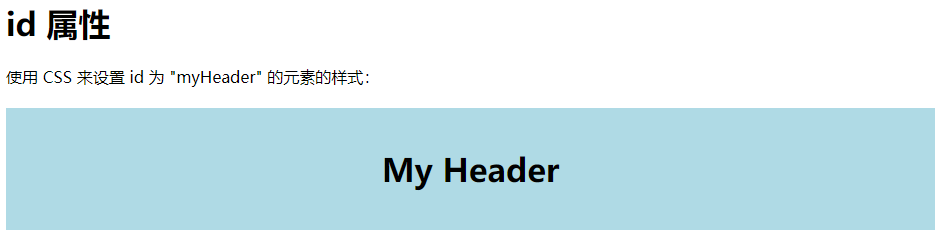

> id 名称对大小写敏感
> 
> id 必须包含至少一个字符，且不能包含空白字符（空格、制表符等）

## Class 与 ID 的差异

同一个类名可以由多个 HTML 元素使用，而一个 id 名称只能由页面中的一个 HTML 元素使用

example：

```html
<!DOCTYPE html>
<html>

<head>
  <style>
    /* 设置 id 为 "myHeader" 的元素的样式 */
    #myHeader {
      background-color: lightblue;
      color: black;
      padding: 40px;
      text-align: center;
    }

    /* 设置类名为 "city" 的所有元素的样式 */
    .city {
      background-color: tomato;
      color: white;
      padding: 10px;
    }
  </style>
</head>

<body>

  <h1>Class 与 ID 的差异</h1>

  <p>一个类名可以由多个 HTML 元素使用，而一个 id 名称只能由页面中的一个 HTML 元素使用：</p>

  <!-- 拥有唯一 id 的元素 -->
  <h1 id="myHeader">我的城市</h1>

  <!-- 拥有相同类名的多个元素 -->
  <h2 class="city">上海</h2>
  <p>中国最大的经济城市。</p>

  <h2 class="city">深圳</h2>
  <p>中国最具创新力的城市。</p>

  <h2 class="city">北京</h2>
  <p>中国的首都。</p>

</body>

</html>
```

**效果：**

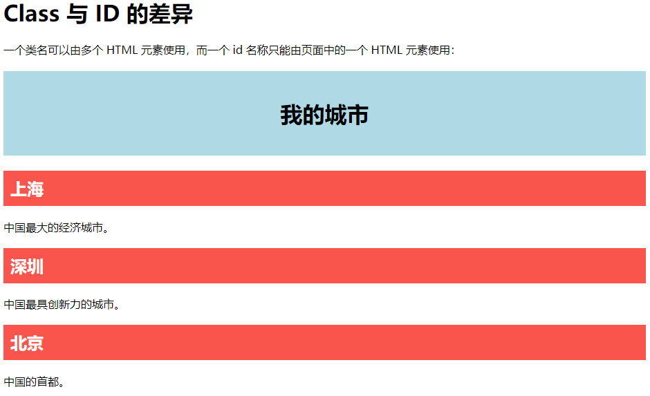

## 通过 ID 和链接实现 HTML 书签

HTML 书签用于让读者跳转至网页的特定部分，如果页面很长，那么书签可能很有用。

要使用书签，您必须首先创建它，然后为它添加链接，然后，当单击链接时，页面将滚动到带有书签的位置。

example：

```html
<!-- 首先，用 id 属性创建书签 -->
<h2 id="C4">第四章</h2>

<!-- 然后，在同一张页面中，向这个书签添加一个链接（“跳转到第四章”） -->
<a href="#C4">跳转到第四章</a>
```

# HTML 文件路径

## HTML 文件路径

文件路径描述了网站文件夹结构中某个文件的位置。

文件路径会在链接外部文件时被用到：

- 网页
- 图像
- 样式表
- JavaScript

## 绝对文件路径

绝对文件路径是指向一个因特网文件的完整 URL。

```html

```

## 相对路径

相对路径指向了相对于当前页面的文件。

```html
<!-- 位于当前网站根目录中 images 文件夹里的一个文件 -->


<!-- 位于当前文件夹中 images 文件夹里的一个文件 -->


<!-- 位于当前文件夹的上一级文件夹中 images 文件夹里的一个文件 -->

```

- 使用相对路径是个好习惯（如果可能）
- 如果使用了相对路径，那么您的网页就不会与当前的基准 URL 进行绑定。所有链接在您的电脑上 (localhost) 或未来的公共域中均可正常工作

# HTML 头部元素

## HTML \<head> 元素

`<head>` 元素是所有头部元素的容器。`<head>` 内的元素可包含脚本，指示浏览器在何处可以找到样式表，提供元信息，等等。

以下标签都可以添加到 head 部分：`<title>`、`<base>`、`<link>`、`<meta>`、`<script>` 以及 `<style>`。

## HTML \<title> 元素

`<title>` 标签定义文档的标题。

title 元素在所有 HTML/XHTML 文档中都是必需的。

title 元素能够：

- 定义浏览器工具栏中的标题
- 提供页面被添加到收藏夹时显示的标题
- 显示在搜索引擎结果中的页面标题

example：

```html
<!DOCTYPE html>
<html>

<head>
  <title>Title of the document</title>
</head>

<body>
  The content of the document......
</body>

</html>
```

## HTML \<base> 元素

`<base>` 标签为页面上的所有链接规定默认地址或默认目标。

- href：规定页面中所有相对链接的基准 URL
- taget：在何处打开页面中所有的链接

example：

```html
<head>
  <base href="http://www.w3school.com.cn/images/" />
  <base target="_blank" />
</head>
```

## HTML \<link> 元素

`<link>` 标签定义文档与外部资源之间的关系。

- rel：规定当前文档与被链接文档之间的关系
- type：规定被链接文档的 MIME 类型
- href：规定被链接文档的位置

example：

```html
<head>
  <link rel="stylesheet" type="text/css" href="mystyle.css" />
</head>
```

## HTML \<style> 元素

`<style>` 标签用于为 HTML 文档定义样式信息。

分别定义 `<body>` 和 `<p>` 标签样式，如下：

example：

```html
<head>
  <style type="text/css">
    body {
      background-color: yellow
    }

    p {
      color: blue
    }
  </style>
</head>
```

## HTML \<meta> 元素

元数据（metadata）是关于数据的信息。

- `<meta>` 标签提供关于 HTML 文档的元数据。元数据不会显示在页面上，但是对于机器是可读的
- `<meta>` 标签始终位于 head 元素中

典型的情况是，meta 元素被用于规定页面的描述、关键词、文档的作者、最后修改时间以及其他元数据。

元数据可用于浏览器（如何显示内容或重新加载页面），搜索引擎（关键词），或其他 web 服务。

针对搜索引擎的关键词，一些搜索引擎会利用 `meta` 元素的 `name` 和 `content` 属性来索引您的页面。`name` 和 `content` 属性的作用是描述页面的内容。

example：

```html
<meta name="description" content="Free Web tutorials on HTML, CSS, XML" />
```

## HTML \<script> 元素

`<script>` 标签用于定义客户端脚本，比如：JavaScript。

example：

```html
<script type="text/javascript">
  document.write("Hello World!")
</script>
```

# HTML 计算机代码元素

HTML 计算机代码格式：

- 通常，HTML 使用可变的字母尺寸，以及可变的字母间距
- 在显示计算机代码示例时，并不需要如此
- `<kbd>`、`<samp>` 以及 `<code>` 元素全都支持固定的字母尺寸和间距

## HTML 键盘格式

HTML `<kbd>` 元素定义键盘输入

example：

```html
<p>To open a file, select:</p>

<p><kbd>File | Open...</kbd></p>
```

**效果：**

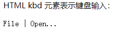

## HTML 输出示例

HTML `<samp>` 元素定义计算机输出示例

example：

```html
<samp>
  demo.example.com login: Apr 12 09:10:17
  Linux 2.6.10-grsec+gg3+e+fhs6b+nfs+gr0501+++p3+c4a+gr2b-reslog-v6.189
</samp>
```

> `<samp>` 元素不保留多余的空格和折行。如需解决该问题，您必须在 `<pre>` 元素中包围代码

**效果：**

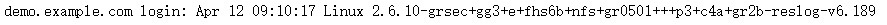

## HTML 代码格式

HTML `<code>` 元素定义编程代码示例

example：

```html
<code>
  var person = { firstName:"Bill", lastName:"Gates", age:50, eyeColor:"blue" }
</code>
```

**效果：**

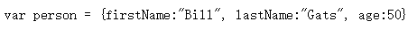

> `<code>` 元素不保留多余的空格和折行。如需解决该问题，您必须在 `<pre>` 元素中包围代码

HTML `<pre>` 元素定义预格式化文本

example：

```html
<code>
<pre>
var person = {
    firstName:"Bill",
    lastName:"Gates",
    age:50,
    eyeColor:"blue"
}
</pre>
</code>
```

**效果：**

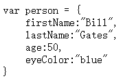

## HTML 变量格式化

HTML `<var>` 元素定义数学变量

HTML `<sup>` 元素定义上标文本

example：

```html
<p>Einstein wrote:</p>

<p><var>E = m c<sup>2</sup></var></p>
```

**效果：**

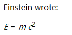

