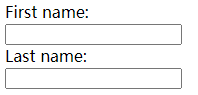
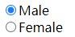
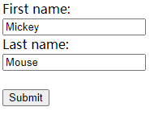
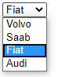
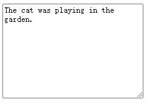
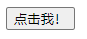
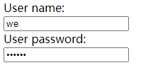
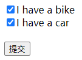

<!-- TOC -->

- [HTML 表单](#html-表单)
    - [\<form> 元素](#\form-元素)
    - [HTML 表单包含表单元素](#html-表单包含表单元素)
        - [\<input> 元素](#\input-元素)
- [HTML 表单属性](#html-表单属性)
    - [action 属性](#action-属性)
    - [Target 属性](#target-属性)
    - [method 属性](#method-属性)
    - [autocomplete 属性](#autocomplete-属性)
    - [novalidate 属性](#novalidate-属性)
- [HTML 表单元素](#html-表单元素)
    - [\<input> 元素](#\input-元素)
    - [\<select> 元素（下拉列表）](#\select-元素下拉列表)
    - [\<textarea> 元素](#\textarea-元素)
    - [\<button> 元素](#\button-元素)
    - [HTML5 新增加表单元素](#html5-新增加表单元素)
- [HTML 输入类型](#html-输入类型)
    - [输入类型 text](#输入类型-text)
    - [输入类型 password](#输入类型-password)
    - [输入类型 submit](#输入类型-submit)
    - [输入类型 radio](#输入类型-radio)
    - [输入类型 checkbox](#输入类型-checkbox)
    - [HTML5 新增加的输入类型](#html5-新增加的输入类型)

<!-- /TOC -->

# HTML 表单

HTML 表单用于搜集不同类型的用户输入。

## \<form> 元素

HTML 表单用于收集用户输入。`<form>` 元素定义 HTML 表单

## HTML 表单包含表单元素

表单元素指的是不同类型的 input 元素、复选框、单选按钮、提交按钮等等。

### \<input> 元素

`<input>` 元素是最重要的表单元素。`<input>` 元素有很多形态，根据不同的 type 属性。

input 元素常用属性：

- type：规定 input 元素的类型
- name：定义 input 元素的名称
- value：规定 input 元素的值
- checked：规定此 input 元素首次加载时应当被选中

type 属性常用类型：

|  类型  |  描述  |
|  :----:  |  :----  |
|  text  |  定义常规文本输入  |
|  radio  |  定义单选按钮输入（选择多个选择之一）  |
|  submit  |  定义提交按钮（提交表单）  |

- 文本输入
    `<input type="text">` 定义用于文本输入的单行输入字段。

    example：

    ```html
    <form>
      First name:<br />
      <input type="text" name="firstname">
      <br />
      Last name:<br />
      <input type="text" name="lastname">
    </form>
    ```

    **效果：**
    
    

    > 表单本身并不可见。还要注意文本字段的默认宽度是 20 个字符
- 单选按钮输入
    `<input type="radio">` 定义单选按钮，允许用户在有限数量的选项中选择其中之一。

    example：

    ```html
    <form>
      <input type="radio" name="sex" value="male" checked>Male
      <br />
      <input type="radio" name="sex" value="female">Female
    </form>
    ```

    **效果：**
    
    
- 提交按钮
    `<input type="submit">` 定义用于向表单处理程序（form-handler）提交表单的按钮。

    `action` 属性规定当提交表单时向何处发送表单数据。

    表单处理程序通常是包含用来处理输入数据的脚本的服务器页面。

    example：

    ```html
    <form action="/demo/demo_form.asp">
      First name:<br />
      <input type="text" name="firstname" value="Mickey">
      <br />
      Last name:<br />
      <input type="text" name="lastname" value="Mouse">
      <br /><br />
      <input type="submit" value="Submit">
    </form>
    ```

    **效果：**
    
    

[更多示例](https://www.w3school.com.cn/tags/tag_form.asp)

# HTML 表单属性

## action 属性

`action` 属性定义提交表单时要执行的操作。

通常，当用户单击 “提交” 按钮时，表单数据将发送到服务器上的文件中。

`<label>` 标签为 input 元素定义标注（标记）。

example：

```html
<form action="/action_page.php">
  <label for="fname">First name:</label><br />
  <input type="text" id="fname" name="fname" value="Bill"><br />
  <label for="lname">Last name:</label><br />
  <input type="text" id="lname" name="lname" value="Gates"><br /><br />
  <input type="submit" value="Submit">
</form>
```

**效果：**


> 如果省略 action 属性，则将 action 设置为当前页面
> "for" 属性可把 label 绑定到另外一个元素。请把 "for" 属性的值设置为相关元素的 id 属性的值

## Target 属性

`target` 属性规定提交表单后在何处显示响应。

`target` 属性可设置以下值，默认值为 `_self`。

|  值  |  描述  |
|  :----:  |  :----  |
|  _blank  |  响应显示在新窗口或选项卡中  |
|  _self  |  响应显示在当前窗口中  |
|  _parent  |  响应显示在父框架中  |
|  _top  |  响应显示在窗口的整个 body 中  |
|  framename  |  响应显示在命名的 iframe 中  |

example：

```html
<form action="/action_page.php" target="_blank">
```

## method 属性

`method` 属性指定提交表单数据时要使用的 HTTP 方法。

表单数据可以作为 URL 变量（使用 method="get"）或作为 HTTP post 事务（使用 method="post"）发送。

提交表单数据时，默认的 HTTP 方法是 GET。

example：

```html
<!-- 在提交表单数据时使用 GET 方法 -->
<form action="/action_page.php" method="get">

<!-- 在提交表单数据时使用 POST 方法 -->
<form action="/action_page.php" method="post">
```

关于 GET 的注意事项：

- 以名称/值对的形式将表单数据追加到 URL
- 永远不要使用 GET 发送敏感数据！（提交的表单数据在 URL 中可见！）
- URL 的长度受到限制（2048 个字符）
- 对于用户希望将结果添加为书签的表单提交很有用
- GET 适用于非安全数据，例如 Google 中的查询字符串

关于 POST 的注意事项：

- 将表单数据附加在 HTTP 请求的正文中（不在 URL 中显示提交的表单数据）
- POST 没有大小限制，可用于发送大量数据。
- 带有 POST 的表单提交无法添加书签

> 如果表单数据包含敏感信息或个人信息，请务必使用 POST

## autocomplete 属性

`autocomplete` 属性规定表单是否应打开自动完成功能。

启用自动完成功能后，浏览器会根据用户之前输入的值自动填写值。

example：

```html
<form action="/action_page.php" autocomplete="on">
```

## novalidate 属性

novalidate 属性是一个布尔属性。

如果已设置，它规定提交时不应验证表单数据。

example：

```html
<form action="/action_page.php" novalidate>
```

# HTML 表单元素

## \<input> 元素

最重要的表单元素是 `<input>` 元素。

`<input>` 元素根据不同的 type 属性，可以变化为多种形态。

## \<select> 元素（下拉列表）

`<select>` 元素定义下拉列表。

- `<select>` 元素 `name` 属性规定下拉列表的名称
- `<option>` 元素定义待选择的选项
- `<option>` 元素添加 `value` 属性定义送往服务器的选项值
- `<option>` 元素添加 `selected` 属性定义预定义选项

example：

```html
<select name="cars">
  <option value="volvo" >Volvo</option>
  <option value="saab">Saab</option>
  <option value="fiat" selected>Fiat</option>
  <option value="audi">Audi</option>
</select>
```

**效果：**



## \<textarea> 元素

`<textarea>` 元素定义多行输入字段（文本域）

- name：规定文本区的名称
- rows：规定文本区内的可见行数
- cols：规定文本区内的可见宽度

example：

```html
<textarea name="message" rows="10" cols="30">
  The cat was playing in the garden.
</textarea>
```

**效果：**



## \<button> 元素

`<button>` 元素定义可点击的按钮

example：

```html
<button type="button" onclick="alert('Hello World!')">点击我！</button>
```

**效果：**



## HTML5 新增加表单元素

- `<datalist>`
    `<datalist>` 元素为 `<input>` 元素规定预定义选项列表。

    用户会在他们输入数据时看到预定义选项的下拉列表。

    `<input>` 元素的 list 属性必须引用 `<datalist>` 元素的 `id` 属性。

    example：

    ```html
    <form action="action_page.php">
      <input list="browsers">
      <datalist id="browsers">
        <option value="Internet Explorer">
        <option value="Firefox">
        <option value="Chrome">
        <option value="Opera">
        <option value="Safari">
      </datalist>
    </form>
    ```

    **效果：**

    
- `<keygen>`
    `<keygen>` 标签规定用于表单的密钥对生成器字段。

    当提交表单时，私钥存储在本地，公钥发送到服务器。
- `<output>`
    `<output>` 标签定义不同类型的输出，比如脚本的输出。

> 默认地，浏览器不会显示未知元素。新元素不会破坏您的页面

# HTML 输入类型

## 输入类型 text

`<input type="text">` 定义供文本输入的单行输入字段

example：

```html
<form>
  First name:<br />
  <input type="text" name="firstname">
  <br />
  Last name:<br />
  <input type="text" name="lastname">
</form>
```

**效果：**


## 输入类型 password

`<input type="password">` 定义密码字段

example：

```html
<form>
  User name:<br />
  <input type="text" name="username">
  <br />
  User password:<br />
  <input type="password" name="psw">
</form>
```

**效果：**



## 输入类型 submit

`<input type="submit">` 定义提交表单数据至表单处理程序的按钮。

表单处理程序（form-handler）通常是包含处理输入数据的脚本的服务器页面。

example：

```html
<form action="/demo/demo_form.asp">
  First name:<br />
  <input type="text" name="firstname" value="Mickey">
  <br />
  Last name:<br />
  <input type="text" name="lastname" value="Mouse">
<br /><br />
  <input type="submit" value="Submit">
</form>
```

**效果：**


## 输入类型 radio

`<input type="radio">` 定义单选按钮。

单选按钮允许用户仅从有限的选项中选择一个。

example：

```html
<form action="/demo/demo_form.asp">
<input type="radio" name="sex" value="male" checked>Male
<br />
<input type="radio" name="sex" value="female">Female
<br /><br />
<input type="submit">
</form>
```

**效果：**


## 输入类型 checkbox

`<input type="checkbox">` 定义复选框。

复选框允许用户在有限数量的选项中选择零个或多个选项。

example：

```html
<form action="/demo/demo_form.asp">
  <input type="checkbox" name="vehicle" value="Bike">I have a bike
  <br />
  <input type="checkbox" name="vehicle" value="Car">I have a car
  <br /><br />
  <input type="submit">
</form>
```

**效果：**



## HTML5 新增加的输入类型

- color：用于应该包含颜色的输入字段
- date：用于应该包含日期的输入字段
- datetime：允许用户选择日期和时间（有时区）
- datetime-local：允许用户选择日期和时间（无时区）
- email：用于应该包含电子邮件地址的输入字段
- month：允许用户选择月份和年份
- number：用于应该包含数字值的输入字段
- range：用于应该包含一定范围内的值的输入字段
- search：用于搜索字段（搜索字段的表现类似常规文本字段）
- tel：用于应该包含电话号码的输入字段
- time：允许用户选择时间（无时区）
- url：用于应该包含 URL 地址的输入字段
- week：允许用户选择周和年

> 老式 web 浏览器不支持的输入类型，会被视为输入类型 text

