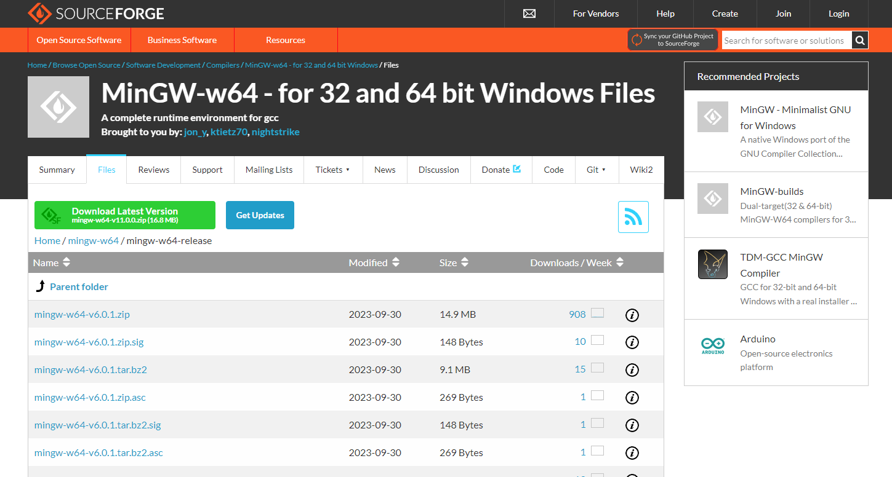

记录一些 C 语言相关的信息。

<!-- more -->

## C 语言教程

- [C 语言教程-网道-作者：阮一峰](https://wangdoc.com/clang/)
- [C 语言网](https://www.dotcpp.com/)
- [C 语言中文网](https://c.biancheng.net/c/)
- [C 语言语法规范](https://blog.csdn.net/weixin_48952729/article/details/128346965)

## C 语言在线编译器

- [CodingGround](https://tutorialspoint.com/compile_c_online.php)
- [OnlineGDB](https://onlinegdb.com/online_c_compiler)
- [C 语言网](https://www.dotcpp.com/run/)

## MinGW-w64 工具

- [MinGW-w64 官网](https://www.mingw-w64.org/)
- [MinGW-w64 下载地址](https://sourceforge.net/projects/mingw-w64/files/)
- [MinGW-w64 安装教程——著名 C/C++ 编译器 GCC 的 Windows 版本](https://zhuanlan.zhihu.com/p/76613134)
- [支持最新版的 GCC](https://blog.csdn.net/B11050729/article/details/132176767)
- [VSCode 配置 C 语言环境](https://blog.csdn.net/qq_44150801/article/details/120760230)

## 什么是 MinGW-w64

**MinGW**（*Minimalist GNU on Windows*）是将经典的开源 C 语言编译器 GCC 移植到了 Windows 平台下，并且包含了 Win32 API，因此可以将源代码编译为可在 Windows 中运行的可执行程序。而且还可以使用一些 Windows 不具备的，Linux 平台下的开发工具。**MinGW 就是 GCC 的 Windows 版本。**

MinGW-w64 与 MinGW 的区别在于 MinGW 只能编译生成 32 位可执行程序，而 MinGW-w64 则可以编译生成 64 位或 32 位可执行程序。

## 为什么使用 MinGW-w64

1. MinGW-w64 是开源软件，可以免费使用
2. MinGW-w64 由一个活跃的开源社区在持续维护，因此不会过时
3. MinGW-w64 支持最新的 C 语言标准
4. MinGW-w64 使用 Windows 的 C 语言运行库，因此编译出的程序不需要第三方 DLL，可以直接在 Windows 下运行
5. 那些著名的开源 IDE 实际只是将 MinGW-w64 封装了起来，使它拥有友好的图形化界面，简化了操作，但内部核心仍然是 MinGW-w64
6. MinGW-w64 是稳定可靠的、持续更新的 C/C++ 编译器，使用它可以免去很多麻烦，不用担心跟不上时代，也不用担心编译器本身有 bug，可以放心的去编写程序

## 下载和安装 MinGW-w64

1. MinGW-w64 下载详情页面

    进入 [MinGW-w64 官网](https://www.mingw-w64.org/)。

    

    点击 *[Downloads](https://www.mingw-w64.org/downloads/)*，进入 MinGW-w64 下载详情页面。

    

2. SourceForge 下载页面

    在 MinGW-w64 下载详情页面，首先看到一个标题为 Pre-built toolchains and packages 的列表，这里面是包含 MinGW-w64 及特定工具的整合包，我们只需下载 MinGW-w64 即可。找到 *Sources* 并点击 [SourceForge](https://sourceforge.net/projects/mingw-w64/files/mingw-w64/mingw-w64-release/)

    

    进入 MinGW-w64 - for 32 and 64 bit Windows Files 下载页面。

    

### 在线安装 MinGW-w64

::: warning
在线安装 MinGW-w64 需要从 [SourceForge](https://sourceforge.net/projects/mingw-w64/files/mingw-w64/mingw-w64-release/) 该网站上下载 MinGW 的相应数据文件，由于网络原因导致下载失败，可以选择 [离线安装 MinGW-w64](#离线安装-mingw-w64)
:::

在 MinGW-w64 - for 32 and 64 bit Windows Files 下载页面找到 *MinGW-W64 Online Installer*，点击 *MinGW-W64-install.exe。*

进入下载页面，自动有一个 5s 倒计时，然后会下载 MinGW-W64 安装包。

双击 *mingw-w64-install.exe* 安装程序包：

点击 *Next*，指定 MinGW-w64 设置：

- **Version**：选择安装 MinGW-w64 的版本
- **Architecture**：选择电脑系统架构
    - **i686**：32 位系统
    - **x86_64**：64 位系统
- **Threads**：选择操作系统接口协议
    - **posix**：开发 Linux、Unix、Mac OS 等其他操作系统下的程序，则需要选择 posix 
    - **win32**：要开发 Windows 程序，需要选择 win32
- **Execption**：选择异常处理模型（64 位）
    - **seh**：seh 性能比较好，但不支持 32 位
    - **sjlj**：sjlj 稳定性好，支持 32 位
- **Build revision**：建立修订

点击 *Next*，选择 MinGW-w64 的安装目录：

点击 *Next*，开始安装。

### 离线安装 MinGW-w64

在 MinGW-w64 - for 32 and 64 bit Windows Files 下载页面找到 *MinGW-W64 GCC-8.1.0*，点击 *x86_64-win32-seh。*

进入下载页面，自动有一个 5s 倒计时，然后会下载 MinGW-W64 压缩包。

解压 *x86_64-8.1.0-release-win32-seh-rt_v6-rev0.7z* 文件，进入解压文件中，找到 **bin** 文件夹。

## 添加到系统环境变量中

不管是在线安装还是离线安装 MinGW-w64 都需要将 bin 文件夹所在的绝对路径（例如：`E:\Software\MinGW-w64\mingw64\bin`），添加到系统变量 path 中。

在桌面，右键 **此电脑**，点击 **属性**，进入设置界面，找到 **高级系统设置**，点击进入 **系统属性**，点击 **环境变量**，在 **系统变量** 中选择 **Path**，点击 **编辑**，点击 **新建**，将 bin 文件夹所在的绝对路径（例如：`E:\Software\MinGW-w64\mingw64\bin`）粘贴到此位置并确定。

## 测试

按 <kbd>Win</kbd> + <kbd>R</kbd> 键，打开运行窗口，输入 *cmd*，回车打开终端控制器。

输入 `gcc -v` 命令，查看 gcc 版本。

