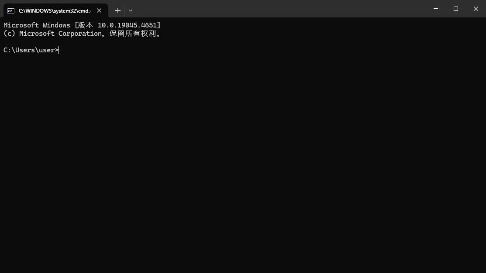

::: tip
- Windows 命令行中命令、命令选项以及命令参数是不区分大小写的
- 在大于号的前边的是系统给出的提示，表示当前所在的位置
- Windows 的目录表示法用反斜杠（`\`），而 Linux 或 Mac 用的是斜杠（`/`）
- 目录使用 `..` 表示上一级目录，使用 `.` 表示当前目录，使用 `\` 表示当前驱动器（又叫 “磁盘”）的根目录
- 命令和选项以及参数之间的分隔符是空白符（包括 Tab 键、Space 键等），某些特定情况下空白符可以省略
- 命令行的执行快捷键是 <kbd>Enter</kbd> 键，强制终止的快捷键是 <kbd>Ctrl</kbd> + <kbd>C</kbd> 键
:::

## 常用命令

### 文件夹管理

|  命令  |  描述  |
|  :----:  |  :----  |
|  [cd 或 chdir](../../../commands/cmd/cd_chdir.md)  |  显示当前目录名或改变当前目录  |
|  [md 或 mkdir](../../../commands/cmd/md_mkdir.md)  |  创建目录  |
|  [rd 或 rmdir](../../../commands/cmd/rd_rmdir.md)  |  删除一个目录  |
|  [dir](../../../commands/cmd/dir.md)  |  显示目录中的文件和子目录列表  |
|  [tree](../../../commands/cmd/tree.md)  |  以图形显示驱动器或路径的文件夹结构  |
|  [path](../../..//commands/cmd/path.md)  |  为可执行文件显示或设置一个搜索路径  |
|  [xcopy](../../../commands/cmd/xcopy.md)  |  复制文件和目录树  |

### 文件管理

|  命令  |  描述  |
|  :----:  |  :----  |
|  [type](../../../commands/cmd/type.md)  |  显示文本文件的内容  |
|  [copy](../../../commands/cmd/copy.md)  |  将一份或多份文件复制到另一个位置  |
|  [del 或 erase](../../../commands/cmd/del_erase.md)  |  删除一个或数个文件  |
|  [move](../../../commands/cmd/move.md)  |  移动文件并重命名文件和目录。（Windows XP Home Edition 中没有）|
|  [ren 或 rename](../../../commands/cmd/ren_rename.md)  |  重命名文件  |
|  [replace](../../../commands/cmd/replace.md)  |  替换文件  |
|  [attrib](../../../commands/cmd/attrib.md)  |  显示或更改文件属性  |
|  [find](../../../commands/cmd/find.md)  |  搜索字符串  |
|  [findstr](../../../commands/cmd/findstr.md)  |  搜索文件中的文本模式  |
|  [fc](../../../commands/cmd/fc.md)  |  比较两个文件或两个文件集并显示它们之间的不同  |

### 网络命令

|  命令  |  描述  |
|  :----:  |  :----  |
|  [ping](../../../commands/cmd/ping.md)  |  进行网络连接测试、名称解析  |
|  [ftp](../../../commands/cmd/ftp.md)  |  文件传输  |
|  `net`  |  网络命令集及用户管理  |
|  `telnet`  |  远程登陆  |
|  [ipconfig](../../../commands/cmd/ipconfig.md)  |  显示、修改 TCP/IP 设置  |
|  `msg`  |  给用户发送消息  |
|  `arp`  |  显示、修改局域网的 IP 地址-物理地址映射列表  |

### 系统管理

|  命令  |  描述  |
|  :----:  |  :----  |
|  `at`  |  安排在特定日期和时间运行命令和程序  |
|  [shutdown](../../../commands/cmd/shutdown.md)  |  立即或定时关机或重启  |
|  `tskill`  |  结束进程  |
|  `taskkill`  |  结束进程（比 `tskill` 高级，但 Win XP Home 版中无该命令）  |
|  `tasklist`  |  显示进程列表（Windows XP Home Edition 中没有）  |
|  `sc`  |  系统服务设置与控制  |
|  `reg`  |  注册表控制台工具  |
|  `powercfg`  |  控制系统上的电源设置  |

## 切换磁盘

默认刚打开的 `cmd` 所在目录是当前用户的家目录，当前用户的家目录在 C 盘中。

```cmd
C:\Users\user>
```

如果当前在 C 盘，但要切换到 E 盘根目录下的 `test` 目录（`E:\test`）中，不能直接使用 [cd](../../../commands/cmd/cd_chdir.md) 命令进行切换，需要先切换到 E 盘根目录下后，再使用 [cd](../../../commands/cmd/cd_chdir.md) 命令到 `test` 目录中。

切换到其它磁盘的根目录下，直接输入磁盘名加冒号（`:`）即可。例如：切换到 E 盘根目录下。

```cmd
C:\Users\user>e:

E:\>
```

- 根目录就是磁盘的 **顶级目录**

## 切换到指定目录

::: info
切换目录使用 [cd](../../../commands/cmd/cd_chdir.md) 或 [chdir](../../../commands/cmd/cd_chdir.md) 效果一样。
:::

例如：切换到 E 盘根目录下的 `test` 目录中。

```cmd
E:\>cd test

E:\test>
```

例如：切换到磁盘的根目录。

```cmd
E:\test>cd \

E:\>
```

例如：切换到上一级目录，`..` 表示上一级目录。

```cmd
E:\test>cd ..

E:\>
```

在资源管理器中，定位到要切换的目录中，在路径中输入 `cmd`。


或在目录空白地方，右键选择 *在终端中打开（T）*，也可以切换到指定目录。


## 查看目录列表

例如：查看当前目录列表，`.\` 表示当前目录也可以不加。

```cmd
E:\test>dir .\
 驱动器 E 中的卷没有标签。
 卷的序列号是 02E3-C833

 E:\test 的目录

2024/07/12  16:59    <DIR>          .
2024/07/12  16:59    <DIR>          ..
2024/07/11  18:15                14 hello.txt
2024/07/12  16:59    <DIR>          test 03
2024/07/12  13:08    <DIR>          test01
2024/07/12  13:08    <DIR>          test02
               1 个文件             14 字节
               5 个目录 697,845,600,256 可用字节

E:\test>
```

“驱动器 E 中的卷没有标签” 是因为没有对该磁盘命名标签，可以在该磁盘属性中配置磁盘的标签名。

例如：查看 `test01` 目录列表。

```cmd
E:\test>dir test01
 驱动器 E 中的卷没有标签。
 卷的序列号是 02E3-C833

 E:\test\test01 的目录

2024/07/12  13:08    <DIR>          .
2024/07/12  13:08    <DIR>          ..
2024/07/11  18:46                 0 test01.txt
               1 个文件              0 字节
               2 个目录 697,849,479,168 可用字节

E:\test>
```

## 创建目录

::: info
创建目录使用 [md](../../../commands/cmd/md_mkdir.md) 或 [mkdir](../../../commands/cmd/md_mkdir.md) 效果一样。
:::

例如：在当前目录中创建 `test04` 目录。

```cmd
E:\test>dir test04

E:\test>
```

例如：在当前目录中递归创建 `a\b\c` 目录。

```cmd
E:\test>md a\b\c

E:\test>
```

查看当前目录：

```cmd
E:\test>dir /b
a
hello.txt
test 03
test01
test02
test04

E:\test>
```

## 复制文件

[copy](../../../commands/cmd/copy.md) 命令只能复制文件，不能复制目录。

例如：将 `test01` 目录下的 `test01.txt` 文件复制到 `test02` 目录中。

```cmd
E:\test>copy test01\test01.txt test02
已复制         1 个文件。

E:\test>
```

## 查看文件内容

例如：查看当前目录下的 `hello.txt` 文件内容。

```cmd
E:\test>type hello.txt
hello world

E:\test>
```

## 创建文件

创建文件可以使用三种方法，但只能在当前目录中创建文件。

- 使用 [cd 或 chdir](../../../commands/cmd/cd_chdir.md) 命令创建文件

    ```cmd
    E:\test>cd . > file01.txt

    E:\test>
    ```

- 使用 [type](../../../commands/cmd/type.md) 命令创建文件

    ```cmd
    E:\test>type null > file02.txt
    系统找不到指定的文件。

    E:\test>
    ```

- 使用 [copy con](../../../commands/cmd/copy.md) 命令创建文件，此命令可以直接输入文件内容，输入完后执行 <kbd>Ctrl</kbd> + <kbd>Z</kbd> 命令，再按 <kbd>Enter</kbd> 回车键结束

    ```cmd
    E:\test>copy con file03.txt
    test file03.txt
    ^Z
    已复制         1 个文件。

    E:\test>
    ```

查看创建的文件：

```cmd
E:\test>dir
 驱动器 E 中的卷没有标签。
 卷的序列号是 02E3-C833

 E:\test 的目录

2024/07/15  15:23    <DIR>          .
2024/07/15  15:23    <DIR>          ..
2024/07/15  10:50    <DIR>          a
2024/07/15  15:22                 0 file01.txt
2024/07/15  15:23                 0 file02.txt
2024/07/15  15:23                17 file03.txt
2024/07/11  18:15                14 hello.txt
2024/07/15  13:20    <DIR>          test 03
2024/07/12  13:08    <DIR>          test01
2024/07/15  13:56    <DIR>          test02
2024/07/15  13:56    <DIR>          test04
               3 个文件             14 字节
               7 个目录 696,791,732,224 可用字节

E:\test>
```

## 删除文件

::: info
删除文件使用 [del](../../../commands/cmd/del_erase.md) 或 [erase](../../../commands/cmd/del_erase.md) 效果一样。

使用 `rd` 或 `rmdir` 从磁盘中删除某个文件，则无法检索该文件（即回收站中没有此文件）。
:::

例如：删除当前目录下的 `file01.txt` 文件。

```cmd
E:\test>del file01.txt

E:\test>
```

例如：删除当前目录下的 `file02.txt` 文件，使用 `/p` 选项提示用户确认。

```cmd
E:\test>del /p file02.txt
E:\test\file02.txt，要删除(Y/N)吗? y

E:\test>
```

查看当前目录：

```cmd
E:\test>dir
 驱动器 E 中的卷没有标签。
 卷的序列号是 02E3-C833

 E:\test 的目录

2024/07/15  15:23    <DIR>          .
2024/07/15  15:23    <DIR>          ..
2024/07/15  10:50    <DIR>          a
2024/07/15  15:23                17 file03.txt
2024/07/11  18:15                14 hello.txt
2024/07/15  13:20    <DIR>          test 03
2024/07/12  13:08    <DIR>          test01
2024/07/15  13:56    <DIR>          test02
2024/07/15  13:56    <DIR>          test04
               3 个文件             14 字节
               7 个目录 696,791,732,224 可用字节

E:\test>
```

## 删除目录

::: info
删除目录使用 [rd](../../../commands/cmd/rd_rmdir.md) 或 [erase](../../../commands/cmd/rd_rmdir.md) 效果一样。

使用 `rd` 或 `rmdir` 从磁盘中删除某个目录，则无法检索该目录（即回收站中没有此目录）。
:::

例如：删除当前目录下的 `test04` 目录，如果此目录不是空目录，则需要使用 `/s` 选项并提示用户确认。

```cmd
E:\test>rd /s test04
test04, 是否确认(Y/N)? y

E:\test>
```

例如：删除当前目录下的 `test02` 目录，如果此目录不是空目录，则需要使用 `/s` 选项，使用 `/q` 选项指定安静模式不提示进行确认。

```cmd
E:\test>rd /s /q test02

E:\test>
```

查看当前目录：

```cmd
E:\test>dir
 驱动器 E 中的卷没有标签。
 卷的序列号是 02E3-C833

 E:\test 的目录

2024/07/15  16:24    <DIR>          .
2024/07/15  16:24    <DIR>          ..
2024/07/15  10:50    <DIR>          a
2024/07/15  15:23                17 file03.txt
2024/07/11  18:15                14 hello.txt
2024/07/15  13:20    <DIR>          test 03
2024/07/12  13:08    <DIR>          test01
               1 个文件             14 字节
               5 个目录 696,772,440,064 可用字节

E:\test>
```

## 重命名目录或文件

例如：将 `test01` 目录下的 `test01.txt` 文件，重命名为 `test02.txt`。

```cmd
E:\test>ren test01\test01.txt test02.txt

E:\test>
```

查看 `test01` 目录：

```cmd
E:\test>dir test01
 驱动器 E 中的卷没有标签。
 卷的序列号是 02E3-C833

 E:\test\test01 的目录

2024/07/15  16:50    <DIR>          .
2024/07/15  16:50    <DIR>          ..
2024/07/11  18:46                 0 test02.txt
               1 个文件              0 字节
               2 个目录 696,771,907,584 可用字节

E:\test>
```

例如：将当前目录下的 `test 03` 目录，重命名为 `test02` 目录。

```cmd
E:\test>ren "test 03" test02

E:\test>
```

查看当前目录：

```cmd
E:\test>dir
 驱动器 E 中的卷没有标签。
 卷的序列号是 02E3-C833

 E:\test 的目录

2024/07/15  16:52    <DIR>          .
2024/07/15  16:52    <DIR>          ..
2024/07/15  10:50    <DIR>          a
2024/07/15  15:23                17 file03.txt
2024/07/11  18:15                14 hello.txt
2024/07/15  16:50    <DIR>          test01
2024/07/15  13:20    <DIR>          test02
               1 个文件             14 字节
               5 个目录 696,771,907,584 可用字节

E:\test>
```

## 移动目录或文件

例如：移动 `test01` 目录下的 `test02.txt` 文件到 `test02` 目录中。

```cmd
E:\test>move test01\test02.txt test02
移动了         1 个文件。

E:\test>
```

查看 `test02` 目录：

```cmd
E:\test>dir test02
 驱动器 E 中的卷没有标签。
 卷的序列号是 02E3-C833

 E:\test\test02 的目录

2024/07/15  17:23    <DIR>          .
2024/07/15  17:23    <DIR>          ..
2024/07/11  18:46                 0 test02.txt
               1 个文件              0 字节
               2 个目录 696,771,379,200 可用字节

E:\test>
```

例如：移动 `test02` 目录下的 `test02.txt` 文件到 `test01` 目录中，并修改文件名为 `test01.txt`。

```cmd
E:\test>move test02\test02.txt test01\test01.txt
移动了         1 个文件。

E:\test>
```

查看 `test01` 目录：

```cmd
E:\test>dir test01
 驱动器 E 中的卷没有标签。
 卷的序列号是 02E3-C833

 E:\test\test01 的目录

2024/07/15  17:25    <DIR>          .
2024/07/15  17:25    <DIR>          ..
2024/07/11  18:46                 0 test01.txt
               1 个文件              0 字节
               2 个目录 696,771,379,200 可用字节

E:\test>
```

例如：移动当前目录下的 `test02` 目录到 `test01` 目录下。

```cmd
E:\test>move test02 test01
移动了　        1 个目录。

E:\test>
```

查看 `test01` 目录：

```cmd
E:\test>dir test01
 驱动器 E 中的卷没有标签。
 卷的序列号是 02E3-C833

 E:\test\test01 的目录

2024/07/15  17:26    <DIR>          .
2024/07/15  17:26    <DIR>          ..
2024/07/11  18:46                 0 test01.txt
2024/07/15  17:25    <DIR>          test02
               1 个文件              0 字节
               3 个目录 696,771,379,200 可用字节

E:\test>
```
