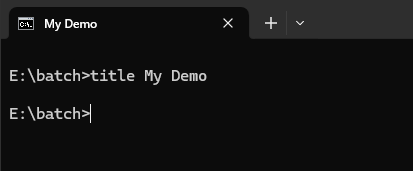
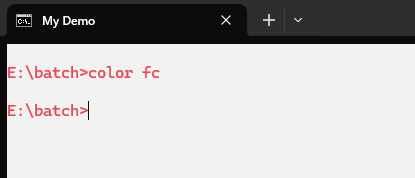
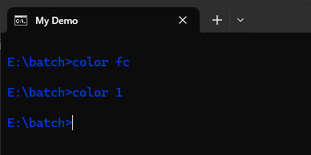

批处理（`Batch`），也称为 **批处理脚本**。顾名思义，批处理就是对某对象进行批量的处理，通常被认为是一种简化的脚本语言，它应用于 DOS 和 Windows 系统中。批处理文件的扩展名为 `.bat`（或 `.cmd`）。

比较常见的批处理包含两类：DOS 批处理和 PS 批处理。

- DOS 批处理是基于 DOS 命令的，用来自动地批量地执行 DOS 命令以实现特定操作的脚本
- PS 批处理是基于微软强大的 PowerShell 的，用来批量处理一些任务的脚本

更复杂的情况，需要使用 `if`、`for`、`goto` 等命令控制程式的运行过程，如同 `C`、`Basic` 等高级语言一样。如果需要实现更复杂的应用，利用外部程式是必要的，这包括系统本身提供的外部命令和第三方提供的工具或者软件。批处理程序虽然是在命令行环境中运行，但不仅仅能使用命令行软件，任何当前系统下可运行的程序都可以放在批处理文件中运行。

## 基本命令

### echo 和 @

- **echo**：用于显示消息或者打开或关闭命令回显功能
    - 如果不结合任何参数使用，`echo` 会显示当前回显设置
    - 命令回显功能默认已打开
    - `echo.` 命令用于显示空白行；`.` 也可以用 `,`、`:`、`;`、`/`、`\`、`[`、`]`、`+` 符号代替
    - `echo` 后显示消息如果放在双引号（`"`）中，输出时双引号也会输出显示

- **@**：用于关闭本行命令的回显
    - 无论此时当前 `echo` 命令回显功能是否打开，都将关闭本行命令的回显
    - `@echo off` 命令用于关闭 `echo off` 命令的回显

例如：显示当前回显状态及输出指定文本。

```cmd
E:\batch>echo
ECHO is on.

E:\batch>echo Hello, World!
Hello, World!

E:\batch>echo "Hello, World! 01"
"Hello, World! 01"

E:\batch>
```

::: info
命令回显功能打开时：

- 代码页编码为 `936`（简体中文）时，`echo` 命令显示的提示内容为 `ECHO 处于打开状态。`
- 代码页编码为 `65001`（UTF-8）时，`echo` 命令显示的提示内容为 `ECHO is on.`
:::

例如：显示空白行。

```cmd
E:\batch>echo. 


E:\batch>
```

例如：创建一个 `echo.cmd` 脚本，使用 `@` 符号，关闭本行命令的回显。内容如下：

```cmd
echo Hello, World! 02
@echo Hello, World! 03
```

执行 `echo.cmd` 脚本：

```cmd
E:\batch>echo.cmd

E:\batch>echo Hello, World! 02
Hello, World! 02
Hello, World! 03

E:\batch>
```

例如：创建一个 `echo.cmd` 脚本，使用 `echo off` 关闭下面命令回显功能，但 `echo off` 命令的回显依然显示。内容如下：

```cmd
echo off
echo Hello, World! 04
```

执行 `echo.cmd` 脚本：

```cmd
E:\batch>echo.cmd

E:\batch>echo off
Hello, World! 04

E:\batch>
```

例如：创建一个 `echo.cmd` 脚本，使用 `@` 符号，将 `echo off` 的命令回显也关闭。内容如下：

```cmd
@echo off
echo Hello, World! 05
```

执行 `echo.cmd` 脚本：

```cmd
E:\batch>echo.cmd
Hello, World! 05

E:\batch>
```

### rem 和 ::

- **rem**：用于注释文本，注释语句不会被执行
    - 当命令回显功能关闭（`echo off`）时，使用 `rem` 命令不会显示注释内容
    - 当命令回显功能打开（`echo on`）时，使用 `rem` 命令依然会显示注释内容
    - 在 `rem` 命令前添加 `@` 字符，即使命令回显功能打开，也不会显示 `rem` 注释内容
    - 不可以在 `rem` 中使用重定向（`<`、`>`）或管道（`|`）字符 
    - 使用 `@rem` 命令，不管回显是否打开（`echo on`），都不会显示注释内容

- **::**：用于注释文本，注释语句不会被执行
    - 不管回显是否打开（`echo on`），使用 `::` 命令都不会显示注释内容，因为命令解释器不认为它是一个有效的命令行
    - 可以在 `::` 中使用重定向（`<`、`>`）或管道（`|`）字符

::: info
`::` 可以起到注释作用是因为，任何以冒号（`:`）开头的字符行，在批处理中都被视作 **标签**，而直接忽略其后的所有内容。

- **有效标签**：冒号后紧跟一个以字母数字开头的字符串，`goto` 语句可以识别
- **无效标签**：冒号后紧跟一个非字母数字的一个特殊符号，`goto` 无法识别的标号，可以起到注释作用，所以 `::` 常被用作注释符号，其实 `:+` 也可起注释作用
:::

例如：创建一个 `rem.cmd` 脚本，分别使用 `rem` 和 `::` 命令在回显功能打开或关闭时进行注释。内容如下：

```cmd
@echo on
echo
:: 示例 1：命令回显功能打开时，不会显示 :: 命令后面的注释内容 
rem 示例 2：命令回显功能打开时，会显示 rem 命令后面的注释内容 
@rem 示例 3：在 rem 命令前添加 @ 字符，计算命令回显功能打开，也不会显示 rem 命令后面的注释内容

@echo off
echo
:: 示例 4：命令回显功能关闭时，不会显示 :: 命令后面的注释内容 
rem 示例 5：命令回显功能关闭时，不会显示 rem 命令后面的注释内容
```

执行 `rem.cmd` 脚本：

```cmd
E:\batch>rem.cmd

E:\batch>echo
ECHO is on.

E:\batch>rem 示例 2：命令回显功能打开时，会显示 rem 命令后面的注释内容
ECHO is off.

E:\batch>
```

::: tip
如果当前 CMD 的代码页编码为 `936`（简体中文）这是默认值，执行由 UTF-8 编写的中文文本时，会出现乱码，如下所示：

```cmd
E:\batch>chcp
活动代码页: 936

E:\batch>rem.cmd

E:\batch>echo
ECHO 处于打开状态。

E:\batch>rem 绀轰緥 2锛氬懡浠ゅ洖鏄惧姛鑳芥墦寮€鏃讹紝浼氭樉绀?rem 鍛戒护鍚庨潰鐨勬敞閲婂唴瀹?
ECHO 处于关闭状态。

E:\batch>
```

这是因为 `rem.cmd` 脚本中的内容由 UTF-8 字符编写（代码页编码为 `65001`），而 CMD 默认的代码页编码为 `936`（简体中文），不同代码页编码之间相互解析，所以会出现乱码。将代码页编码设置为同种类型即可解决中文乱码。

本例将代码页编码设置为 `65001`（UTF-8）即可解决中文乱码：

```cmd
chcp 65001
```

:::

例如：创建一个 `rem.cmd` 脚本，使用 `rem` 或 `::` 命令进行多行注释。内容如下：

```cmd
@echo on
:: 方法 1：使用 rem/||() 将多行注释写到 () 括号中。 
:: 命令回显功能打开时，需要在 rem/||() 前面添加 @ 符号； 
:: 命令回显功能关闭时，不需要在 rem/||() 前面添加 @ 符号。
@rem/||(
    这是一行注释
    这是另一行注释
)

rem 方法 2：使用多个 rem 命令 
@rem 这是一行注释 
@rem 这是另一行注释

rem 方法 3：使用多个 :: 命令 
:: 这是一行注释 
:: 这是另一行注释
```

执行 `rem.cmd` 脚本：

```cmd
E:\batch>rem.cmd

E:\batch>rem 方法 2：使用多个 rem 命令

E:\batch>rem 方法 3：使用多个 :: 命令
E:\batch>
```

### pause

::: info
- 代码页编码为 `936`（简体中文）时，`pause` 命令显示的提示内容为 `请按任意键继续. . .`
- 代码页编码为 `65001`（UTF-8）时，`pause` 命令显示的提示内容为 `Press any key to continue . . .`
:::

`pause` 用于指定在某一位置暂停批处理程序的处理，显示 `Press any key to continue . . .`（或：请按任意键继续. . .）提示内容。

在双击执行 `bat` 或 `cmd` 脚本的时候，如果脚本中没有 `pause` 命令，执行脚本时桌面会出现一闪而过的【命令提示符】窗口，不知道执行的是什么就结束了；如果脚本中有 `pause` 命令，执行脚本在结束时将停留在【命令提示符】窗口中，并提示 `Press any key to continue . . .`，也可以更改提示内容。

如果用 <kbd>Ctrl</kbd> + <kbd>C</kbd> 键停止批处理程序，则会显示 `Terminate batch job (Y/N)?`（或：终止批处理操作吗(Y/N)?）提示内容。

例如：创建一个 `pause.cmd` 脚本，使用 `pause` 命令使批处理程序在执行完 `echo Hello, World!` 命令后暂停。内容如下：

```cmd
@echo off
echo Hello, World!
pause
```

执行 `pause.cmd` 脚本：

```cmd
E:\batch>pause.cmd
Hello, World!
Press any key to continue . . . 
```

例如：创建一个 `pause.cmd` 脚本，使用 `pause` 命令使批处理程序在执行完 `echo Hello, World!` 命令后暂停，但不显示提示内容。内容如下：

```cmd
@echo off
echo Hello, World!
pause > nul
```

执行 `pause.cmd` 脚本：

```cmd
E:\batch>pause.cmd
Hello, World!

```

例如：创建一个 `pause.cmd` 脚本，使用 `pause` 命令使批处理程序在执行完 `echo Hello, World!` 命令后暂停，并修改提示内容为 `按任意键继续或退出此脚本. . .`。内容如下：

```cmd
@echo off
echo Hello, World!
echo 按任意键继续或退出此脚本. . . & pause > nul
```

执行 `pause.cmd` 脚本：

```cmd
E:\batch>pause.cmd
Hello, World!
按任意键继续或退出此脚本. . .

```

### call

`call` 用于从另一个批处理程序调用一个批处理程序，而不停止父批处理程序。`call` 命令接受标签作为调用的目标，选择标签作为调用目标时，标签必须带冒号（例如：`call :num`）。

::: tip
在脚本或批处理文件外部使用 call 时，它在【命令提示符】下不起作用。
:::

**批处理参数：**

- 下表列出了批处理脚本自变量引用（`%0`、`%1`、... `%9`）
- `%0` 表示批处理命令本身，其它参数字符串用 `%1` 到 `%9` 顺序表示
- 在批处理脚本中使用 `%*` 值会引用所有自变量（例如：`%0`、`%1`、... `%9`）
- 可以使用以下可选语法作为批处理参数的替换（`%n`）

|  批处理参数  |  描述  |
|  :----:  |  :----  |
|  `%~1`  |  展开 `%1` 并删除周围的引号  |
|  `%~f1`  |  将 `%1` 扩展为完全限定路径  |
|  `%~d1`  |  仅将 `%1` 扩展为驱动器号  |
|  `%~p1`  |  仅将 `%1` 扩展为路径  |
|  `%~n1`  |  仅将 `%1` 扩展为文件名  |
|  `%~x1`  |  仅将 `%1` 扩展为文件扩展名  |
|  `%~s1`  |  将 `%1` 扩展为仅包含短名称的完全限定路径  |
|  `%~a1`  |  将 `%1` 扩展为文件属性  |
|  `%~t1`  |  将 `%1` 扩展为文件的日期和时间  |
|  `%~z1`  |  将 `%1` 扩展为文件的大小  |
|  `%~$PATH:1`  |  搜索 PATH 环境变量中列出的目录，然后将 `%1` 扩展为找到的第一个目录的完全限定名称。如果未定义环境变量名称或搜索找不到该文件，则此修饰符将扩展为空字符串  |

下表显示了如何将修饰符与复合结果的批处理参数组合在一起：

|  带修饰符的批处理参数  |  描述  |
|  :----:  |  :----  |
|  `%~dp1`  |  仅将 `%1` 扩展为驱动器号和路径  |
|  `%~nx1`  |  仅将 `%1` 扩展为文件名和扩展名  |
|  `%~dp$PATH:1`  |  在 PATH 环境变量中列出的目录中搜索 `%1`，然后扩展为找到的第一个目录的驱动器号和路径  |
|  `%~ftza1`  |  展开 `%1` 以显示类似于 `dir` 命令的输出  |

在上述示例中，`%1` 和 `PATH` 可被替换为其他有效值。语法 `%~` 由有效的自变量编号终止。修饰符 `%~` 不能与 `%*` 一起使用。

例如：创建一个 `call.cmd` 脚本。内容如下：

```cmd
@echo off
echo 脚本名为：%0
echo 第一个参数为：%1
echo 第二个参数为：%2

echo 脚本名为：%0，第一个参数为：%~1，第二个参数为：%2
```

执行 `call.cmd` 脚本，并添加两个参数：

```cmd
E:\batch>call.cmd "Hello" "World"
脚本名为：call.cmd
第一个参数为："Hello"
第二个参数为："World"
脚本名为：call.cmd，第一个参数为：Hello，第二个参数为："World"

E:\batch>
```

### start

`start` 用于在单独【命令提示符】窗口中运行指定的程序或命令。批处理中调用外部程序命令，该外部程序在新的窗口中运行，批处理程序继续往下执行，不理会外部程序执行的情况；如果直接运行外部程序则必须等待外部程序完成后才可以继续执行剩余的指令。

例如：创建一个 `start.cmd` 脚本，在执行时启动单独的【命令提示符】窗口以运行指定的程序或命令。内容如下：

```cmd
@echo off
echo 在新【命令提示符】窗口中查看 D:\ 盘根目录信息。
start dir D:\

echo 运行计算器程序，等程序启动后再执行下面的命令. . .
start /wait calc.exe
echo 程序成功启动，执行下面的命令。

echo Hello, World!
```

执行 `start.cmd` 脚本：

```cmd
E:\batch>start.cmd
在新【命令提示符】窗口中查看 D:\ 盘根目录信息。
运行计算器程序，等程序启动后再执行下面的命令. . .
程序成功启动，执行下面的命令。
Hello, World!

E:\batch>
```

### set

`set` 用于显示、设置或删除 `cmd.exe` 环境变量。如果不结合任何参数使用，`set` 将显示当前环境变量设置。`set` 设置的变量默认只在当前【命令提示符】窗口中生效。语法：`set [options] [<variable>=[<string>]]`

|  选项  |  描述  |
|  :----:  |  :----  |
|  `/a <variable>=<expression>`  |  将变量的值设置为计算的数值表达式。`<expression>` 指定数值表达式  |
|  `/p <variable>=[<promptString>]`  |  将变量的值设置为由用户输入的一行输入。`<promptstring>` 指定提示用户输入的消息  |
|  `/?`  |  在命令提示符下显示帮助  |

- 等号两边不能有空格，否则变量设置失败
- `<`、`>`、`|`、`&` 和 `^` 是特殊的命令 shell 字符，在 `<string>` 中使用这些字符时，必须在它们前面加上转义字符（`^`）或用引号将其括起来（例如：`"StringContaining&Symbol"`）。如果使用引号将包含某个特殊字符的字符串引起来，则引号将设置为环境变量值的一部分
- 如果仅为 `set` 命令指定变量和等号，不指定值 `<string>`（例如：`num=`），则会清除与变量关联的 `<string>` 值
- 创建批处理文件时，可以使用 `set` 来创建变量，然后以与使用编号变量 `%0` 到 `%9` 相同的方式使用它们，还可以使用变量 `%0` 到 `%9` 作为 `set` 的输入
- 如果调用批处理文件中的变量值，请将值用百分比符号（`%`）括起来。例如：如果批处理程序创建名为 `BAUD` 的环境变量，则可以通过在命令提示符下键入 `%baud%`，将与 BAUD 关联的字符串用作可替换参数

例如：创建一个 `set.cmd` 脚本，将变量的值设置为计算的数值表达式，并在计算后删除变量。内容如下：

```cmd
@echo off
set /a sum=4 + 5
echo %sum%

set sum=
```

执行 `set.cmd` 脚本：

```cmd
E:\batch>set.cmd
9

E:\batch>
```

例如：创建一个 `set.cmd` 脚本，将变量的值设置为由用户输入的一行输入，在计算后删除变量，并指定提示用户输入的消息。内容如下：

```cmd
@echo off
set /p num=请输入一个数字：
echo %num%
set num=
```

执行 `set.cmd` 脚本：

```cmd
请输入一个数字：21
21

E:\batch>
```

### goto 和 :

- `goto label` 用于从当前位置跳转到指定的标签行，从标签位置继续向下执行。标签（`label`）前可以加冒号（`:`），也可以不加
- `:` 用于指定标签

为 `label` 指定的值必须与批处理程序中的标签匹配。批处理程序中的标签必须以冒号（`:`）开头。如果某行以冒号开头，则系统会将此行视为标签，并忽略此行中的任何命令。如果批处理程序不包含您在 `label` 参数中指定的标签，则批处理程序将停止并显示 `Label not found` 提示信息。

可以在 `label` 参数中使用空格，但不能包含其他分隔符（例如：`;` 或 `=`）。

如果启用了命令扩展名（默认设置），并且您将 `goto` 命令与目标标签 `:EOF` 一起使用，则可以将控制权转移到当前批处理脚本文件的末尾，并且可以在不定义 `:EOF` 标签的情况下退出批处理脚本文件。将此命令与 `:EOF` 标签一起使用时，必须在标签前插入冒号。例如：`goto :EOF`。

例如：创建一个 `goto.cmd` 脚本，在执行到 `goto` 时跳转到指定的标签行，从标签位置继续向下执行。内容如下：

```cmd
@echo off
echo 选择您喜欢的动物： 
echo 1. 狗 
echo 2. 猫

set /p animal=输入您的选择（请输入 1 或 2）：
if %animal% == 1 goto dog
if %animal% == 2 goto cat
goto :EOF

:dog
echo 狗
set animal=
goto :EOF

:cat
echo 猫
set animal=
goto :EOF
```

执行 `goto.cmd` 脚本：

```cmd
E:\batch>goto.cmd
选择您喜欢的动物： 
1. 狗
2. 猫
输入您的选择（请输入 1 或 2）：1
狗

E:\batch>
```

`goto` 命令还可以用来实现循环。例如：创建一个 `goto.cmd` 脚本，输入 0~10 以内的数字（输入 exit 退出，否则一直输入）。内容如下：

```cmd
@echo off
:nums
set /p num=请输入 0~10 以内的数字（输入 exit 退出，否则一直输入）：
if %num% LSS 10 (
    set num=
    goto nums
) else if "%num%" == "exit" (
    set num=
    goto :EOF
) else (
    echo 输入的不是 10 以内的数字！
    set num=
    goto nums
)
```

执行 `goto.cmd` 脚本：

```cmd
E:\batch>goto.cmd
请输入 0~10 以内的数字（输入 exit 退出，否则一直输入）：0
请输入 0~10 以内的数字（输入 exit 退出，否则一直输入）：-2
请输入 0~10 以内的数字（输入 exit 退出，否则一直输入）：10
输入的不是 10 以内的数字！
请输入 0~10 以内的数字（输入 exit 退出，否则一直输入）：fasdf
输入的不是 10 以内的数字！
请输入 0~10 以内的数字（输入 exit 退出，否则一直输入）：exit

E:\batch>
```

### shift

`shift` 用于更改批处理参数在批处理文件中的位置。批处理中可以使用的参数一般只有 `%1` 到 `%9` 这 9 个参数，当有 9 个以上的参数时，就需要使用 `shift` 命令来移动参数位置，以获取超过 `%9` 之后的参数。

每当执行 `shift` 命令一次，所有命令行上的所有参数将向左移动一位，`%1` 的内容将被 `%2` 的内容所取代，依次类推，`%9` 内容则由新的参数递补。

如果使用 `shift` 命令不指定参数，则执行结果和使用 `shift /0` 命令一样。

|  选项  |  描述  |
|  :----:  |  :----  |
|  `/n`  |  指定从第 `n` 个参数开始移动，其中 `n` 为 `0~8` 的任何值。需要默认启用的命令扩展  |
|  `/?`  |  在命令提示符下显示帮助  |

例如：创建一个 `shift` 脚本，依次从不同的参数开始移动，查看移动后的各个参数值。内容如下：

```cmd
call :sub 1 2 3 4 5 6 7 8 9 a b c d e f g h i j k
pause
goto :EOF

:sub
echo %*
echo %0 %1 %2 %3 %4 %5 %6 %7 %8 %9
shift
echo %0 %1 %2 %3 %4 %5 %6 %7 %8 %9
shift /0
echo %0 %1 %2 %3 %4 %5 %6 %7 %8 %9
shift /1
echo %0 %1 %2 %3 %4 %5 %6 %7 %8 %9
shift /2
echo %0 %1 %2 %3 %4 %5 %6 %7 %8 %9
shift /3
echo %0 %1 %2 %3 %4 %5 %6 %7 %8 %9
shift /4
echo %0 %1 %2 %3 %4 %5 %6 %7 %8 %9
shift /5
echo %0 %1 %2 %3 %4 %5 %6 %7 %8 %9
shift /6
echo %0 %1 %2 %3 %4 %5 %6 %7 %8 %9
shift /7
echo %0 %1 %2 %3 %4 %5 %6 %7 %8 %9
shift /8
echo %0 %1 %2 %3 %4 %5 %6 %7 %8 %9
goto :EOF
```

执行 `shift.cmd` 脚本：

```cmd
E:\batch>shift.cmd
1 2 3 4 5 6 7 8 9 a b c d e f g h i j k
:sub 1 2 3 4 5 6 7 8 9
1 2 3 4 5 6 7 8 9 a
2 3 4 5 6 7 8 9 a b
2 4 5 6 7 8 9 a b c
2 4 6 7 8 9 a b c d
2 4 6 8 9 a b c d e
2 4 6 8 a b c d e f
2 4 6 8 a c d e f g
2 4 6 8 a c e f g h
2 4 6 8 a c e g h i
2 4 6 8 a c e g i j
请按任意键继续. . .

E:\batch>
```

例如：创建一个 `shift` 脚本，将指定的一串数字求和。内容如下：

```cmd
@echo off
set sum=0
set nums=10 20 35 40 50
echo %nums%
call :sub %nums%
echo 以上数据求和结果为：%sum%
pause
goto :EOF

:sub
rem 参数 %1 为返回变量的值
set /a sum+=%1
shift /1
if not "%1"=="" goto sub
goto :EOF
```

执行 `shift.cmd` 脚本：

```cmd
E:\batch>shift.cmd
10 20 35 40 50
以上数据求和结果为：155
Press any key to continue . . .

E:\batch>
```

### assoc 和 ftype

`assoc` 用于显示或修改文件扩展名关联。如果不带参数使用，`assoc` 将显示所有当前文件扩展名关联的列表。若要在关联中进行更改，您需要具有管理员权限。

`ftype` 用于显示或修改文件扩展名关联中使用的文件类型。如果使用此命令时不带赋值运算符（`=`），则此命令将显示指定文件类型的当前打开命令字符串。如果使用此命令时不带参数，则此命令将显示定义了打开命令字符串的文件类型。

::: tip
`assoc` 和 `ftype` 命令仅在 `cmd.exe` 中受支持，在 PowerShell 中不可用。不过，您可以使用 `cmd /c assoc` 和 `cmd /c ftype` 作为解决方法。
:::

下表介绍了 `ftype` 如何替换打开的命令字符串中的变量：

|  变量  |  替换值  |
|  :----  |  :----:  |
|  `%0` 或 `%1`  |  替换为通过关联而启动的文件名  |
|  `%*`  |  获取所有参数  |
|  `%2、%3、...`  |  获取第一个参数（`%2`），第二个参数（`%3`），以此类推  |
|  `%~<n>`  |  获取从第 `n` 个参数开始的所有剩余参数，其中 `n` 可以是 `2~9` 之间的任何数字  |

例如：关联 `.log` 文本文件。

```cmd
E:\batch>assoc .log=txtfile

E:\batch>
```

例如：查看文件扩展名 `.txt` 的当前文件类型关联。

```cmd
E:\batch>assoc .txt
.txt=txtfile

E:\batch>
```

例如：删除文件扩展名 `.bak` 的文件类型关联，请通过按空格键在等号后面添加空格。

```cmd
E:\batch>assoc .bak=

E:\batch>
```

例如：将 `assoc` 的输出发送到文件 `assoc.txt`。

```cmd
E:\batch>assoc > assoc.txt

E:\batch>
```

例如：将不带扩展名的文件关联到文本文件，只需使用一个点。

```cmd
E:\batch>assoc .=txtfile

E:\batch>
```

若要查看定义了打开命令字符串的当前文件类型，请使用 `ftype` 命令。

例如：显示 `txtfile` 文件类型的当前打开命令字符串。

```cmd
E:\batch>ftype txtfile
txtfile=%SystemRoot%\system32\NOTEPAD.EXE %1

E:\batch>
```

例如：删除名为 `example` 的文件类型的打开命令字符串。

```cmd
E:\batch>ftype example=

E:\batch>
```

例如：将 `.pl` 文件扩展名与 `PerlScript` 文件类型相关联，并使 `perlscript` 文件类型能够运行 PERL.EXE。

```cmd
E:\batch>assoc .pl=PerlScript

E:\batch>ftype PerlScript=perl.exe %1 %*

E:\batch>
```

### pushd 和 popd

`pushd` 用于存储当前目录供 `popd` 命令使用，然后更改为指定目录。

每次使用 `pushd` 命令时，都会存储一个目录以供使用。但您可以通过多次使用 `pushd` 命令来存储多个目录。这些目录按顺序存储在虚拟堆栈中，如果使用一次 `pushd` 命令，使用该命令的目录将放置在堆栈底部。如果再次使用该命令，第二个目录将放置在第一个目录之上，每次使用 `pushd` 命令时都会重复该过程。

如果使用 `popd` 命令，堆栈顶部的目录将被删除，当前目录将更改为该目录。如果再次使用 `popd` 命令，堆栈中的下一个目录将被删除。如果启用了命令扩展，则 `popd` 命令会删除 `pushd` 命令创建的所有驱动器号分配。

例如：使用 `pushd` 命令存储当前 `E:\batch` 目录，并切换到 `D:\test` 目录中。

```cmd
E:\batch>pushd D:\test

D:\test>
```

例如：使用 `popd` 命令删除堆栈 `E:\batch` 目录并将当前目录切换为 `E:\batch` 目录。

```cmd
D:\test>popd

E:\batch>
```

例如：使用 `pushd` 命令依次将 `E:\batch` 和 `E:\test` 目录存储在虚拟堆栈中，再使用 `popd` 命令依次删除堆栈顶部目录并将当前目录切换为该目录。

```cmd
E:\batch>pushd E:\test

E:\test>pushd D:\test

D:\test>popd

E:\test>popd

E:\batch>
```

### errorlevel

`errorlevel` 用于获取命令返回码，返回码⽤于判断刚才的命令是否执⾏成功，命令执行成功默认值为 `0`，⼀般命令执⾏出错会设 `errorlevel` 为 `1`。

例如：查看上一个命令是否执行成功。

```cmd
E:\batch>dir /w

E:\batch>echo %errorlevel%
0

E:\batch>cd /d z:\
系统找不到指定的驱动器。

E:\batch>echo %errorlevel%
1

E:\batch>
```

### title

`title` 用于为【命令提示符】窗口创建标题。

例如：将【命令提示符】窗口标题设置为 `My Demo`。

```cmd
E:\batch>title My Demo

E:\batch>
```



### color

`color` 用于更改当前会话的【命令提示符】窗口中的背景色（屏幕背景）和前景色（屏幕文本）。

- 如果在不使用参数的情况下使用，`color` 将还原【命令提示符】窗口的默认背景色（`0`）和前景色（`7`）
- 如果指定两个十六进制数字。第一个会用作背景色，第二个会用作前景色
- 如果仅指定一个十六进制数字，则相应的颜色将用作前景色，背景色设置为默认颜色
- 如果为两个十六进制数字指定相同的值，则 ERRORLEVEL 设置为 `1`，并且不会对前景或背景色进行更改

颜色属性由两个十六进制数字指定，每个数字可以为以下任何值：

|  数值  |  颜色  |  数值  |  颜色  |
|  :----:  |  :----:  |  :----:  |  :----:  |
|  `0`  |  ⿊⾊  |  `8`  |  灰⾊  |
|  `1`  |  蓝⾊  |  `9`  |  淡蓝⾊  |
|  `2`  |  绿⾊  |  `A`  |  淡绿⾊  |
|  `3`  |  浅绿色  |  `B`  |  淡浅绿⾊  |
|  `4`  |  红⾊  |  `C`  |  淡红⾊  |
|  `5`  |  紫⾊  |  `D`  |  淡紫⾊  |
|  `6`  |  黄⾊  |  `E`  |  淡黄⾊  |
|  `7`  |  ⽩⾊  |  `F`  |  亮⽩⾊  |

例如：更改当前会话的【命令提示符】窗口中的背景色（屏幕背景）为 `f`、前景色（屏幕文本）为 `c`。

```cmd
E:\batch>color fc

E:\batch>
```



例如：更改当前会话的【命令提示符】窗口中的前景色（屏幕文本）为 `1`。

```cmd
E:\batch>color 1

E:\batch>
```



## 符号

### 输出重定向 > 或 >>

输出重定向是指把命令（或可执行程序）的标准输出或标准错误输出重新定向到指定文件中。这样，该命令的输出就不显示在屏幕上，而是写入到指定文件中。

- **标准输出（stdout）：**
    - 代码为 `1`
    - 符号为 `1>` 或 `1>>`
    - `1` 可以省略，符号可以写成 `>` 或 `>>`
- **标准错误输出（stderr）：**
    - 代码为 `2`
    - 符号为 `2>` 或 `2>>`
    - `2` 不能省略

`>` 和 `>>` 符号的区别：

- **>**：将命令（或可执行程序）的标准输出 **覆盖** 到指定文件中，会清空指定文件的原始内容
- **>>**：将命令（或可执行程序）的标准输出 **追加** 到指定文件末尾中，不会清空指定文件的原始内容

特殊的输出重定向：

- **1>&2**：将标准输出重定向到标准错误输出中
- **2>&1**：将标准错误输出重定向到标准输出中

查看当前目录下的 `test01` 文件：

```cmd
E:\batch>dir test01
 驱动器 E 中的卷没有标签。
 卷的序列号是 02E3-C833

 E:\batch 的目录

找不到文件

E:\batch>
```

例如：将标准输出覆盖到指定 `dir.txt` 文件中，但错误的输出信息还是会显示在屏幕中。

```cmd
E:\batch>dir test01 > dir.txt
找不到文件

E:\batch>
```

查看 `dir.txt` 文件：

```cmd
E:\batch>type dir.txt
 驱动器 E 中的卷没有标签。
 卷的序列号是 02E3-C833

 E:\batch 的目录


E:\batch>
```

例如：将标准错误输出覆盖到指定 `dir.txt` 文件中，但正确的输出信息还是会显示在屏幕中。

```cmd
E:\batch>dir test01 2> dir.txt
 驱动器 E 中的卷没有标签。
 卷的序列号是 02E3-C833

 E:\batch 的目录


E:\batch>
```

查看 `dir.txt` 文件：

```cmd
E:\batch>type dir.txt
找不到文件

E:\batch>
```

例如：将标准输出、标准错误输出分别指定到 `in.txt` 和 `err.txt` 文件中。

```cmd
E:\batch>dir test01 > in.txt 2> err.txt

E:\batch>
```

查看 `in.txt` 和 `err.txt` 文件：

```cmd
E:\batch>type in.txt
 驱动器 E 中的卷没有标签。
 卷的序列号是 02E3-C833

 E:\batch 的目录


E:\batch>type err.txt
找不到文件

E:\batch>
```

例如：将标准输出、标准错误输出追加到 `dir.txt` 文件中。

```cmd
E:\batch>dir test01 >> dir.txt 2>&1

E:\batch>
```

查看 `dir.txt` 文件：

```cmd
E:\batch>type dir.txt
找不到文件
 驱动器 E 中的卷没有标签。
 卷的序列号是 02E3-C833

 E:\batch 的目录

找不到文件

E:\batch>
```

### 输入重定向 <

输入重定向是指把命令（或可执行程序）的标准输入重定向到指定的文件中。也就是说，输入可以不来自键盘，而来自一个指定的文件。所以说，输入重定向主要用于改变一个命令的输入源，特别是改变那些需要大量输入的输入源。

- **标准输入（stdin）：**
    - 代码为 `0`
    - 符号为 `0<` 或 `0<<`
    - `0` 可以省略，符号可以写成 `<` 或 `<<`

例如：创建一个 `redirect.cmd` 脚本，使用 `set /p` 命令将原本从屏幕获得的输入信息，改为从指定文件（`file.txt`）中获得。内容如下：

```cmd
@echo off
echo Zhang San>name.txt
echo 从文件中获得的输入信息。 
set /p name=请输入您的姓名： < name.txt
echo.
echo Hello %name%
set name=
```

执行 `redirect.cmd` 脚本：

```cmd
E:\batch>redirect.cmd
从文件中获得的输入信息。 
请输入您的姓名：
Hello Zhang San

E:\batch>
```

### nul

`nul` 是一个特殊的设备文件名，‌用于屏蔽命令的输出或错误提示。‌

- **> nul**：将命令或程序执行的输出内容指定到空设备（`nul`）中
- **2> nul**：将命令或程序执行的错误输出内容指定到空设备（`nul`）中
- **< nul**：从空设备中读入信息，也就是不输入。效果是不换行

例如：将标准输出内容指定到 `nul` 中。

```cmd
E:\batch>dir test01 > nul
找不到文件

E:\batch>
```

例如：将标准输出和标准错误输出内容都指定到 `nul` 中。

```cmd
E:\batch>dir test01 > nul 2> nul

E:\batch>
```

例如：从空设备中输入信息，不换行显示。这时使用 `set /p` 命令可以不指定变量名，因为此时没有变量值。

```cmd
@echo off
set /p =Hello< nul
set /p =World< nul
pause
```

### 管道符 |

将管道符号前面命令的输出结果重定向输出到管道符号后面的命令中去，作为后面命令的输入。

例如：将 `a.txt` 文件分屏显示。

```cmd
type a.txt | more
```

例如：在 `a.txt` 文件中，查找 `hello` 字符。

```cmd
type a.txt | find "hello"
```

例如：在使用 `del /p` 命令删除指定文件前提示用户进行确认时，不需要用户手动输入确认。

```cmd
echo y | del /p a.txt
```

### 转义符 ^、% 和 $

- **^**：将特殊符号转化为一般符号，可以显示在屏幕中，即剥离特殊符号的特殊用法。特殊符号有：`|`、`&`、`>`、`<`
- **%**：在批处理脚本中 `%` 号不能用 `^` 符号进行转义，只能用 `%` 自身进行转义。例如：`echo 100%%`
- **$**：转义符号是 `prompt` 命令中的转义字符，通常后面接一个特定的字母表示一个结果

例如：在屏幕中输出 `echo Hello, World! > hello.txt` 命令。

```cmd
echo echo Hello, World! ^> hello.txt
```

例如：设置一个两行的命令提示符（第一行显示当前时间和日期，下一行显示大于号）。

```cmd
E:\batch>prompt $d$s$s$t$_$g

2024/08/14 周三  11:01:49.31
>
```

### 逻辑命令 &、&& 和 ||

逻辑命令符包括：`&`、`&&` 和 `||`。

- **&**：不管 `&` 符号前面的命令是否执行成功，都会执行后面的命令
- **&&**：只有当 `&&` 符号前面的命令执行成功时，才会执行 `&&` 符号后面的命令，否则 `&&` 符号后面的命令不执行
- **||**：只有当 `||` 符号前面的命令执行失败时，才会执行 `||` 符号后面的命令，否则 `||` 符号后面的命令不执行

例如：使用 `&` 符号，分别查看 C 盘、Z 盘和 D 盘根目录。即使 `dir z:\` 命令执行失败，也会执行后面的命令。

```cmd
E:\batch>dir c:\ & dir z:\ & dir d:\
 驱动器 C 中的卷没有标签。
 卷的序列号是 B29F-20E8

 c:\ 的目录

2023/02/03  11:27    <DIR>          Fylog
2024/07/17  16:43    <DIR>          inetpub
2019/12/07  17:14    <DIR>          PerfLogs
2024/07/17  16:30    <DIR>          Program Files
2024/06/05  13:31    <DIR>          Program Files (x86)
2022/06/30  15:45    <DIR>          Temp
2022/07/04  09:03             1,704 unintall.log
2024/07/22  11:22    <DIR>          Users
2024/07/17  16:31    <DIR>          Windows
               1 个文件          1,704 字节
               8 个目录 58,288,865,280 可用字节
系统找不到指定的路径。
 驱动器 D 中的卷没有标签。
 卷的序列号是 FED4-A346

 d:\ 的目录

2024/03/13  15:32    <DIR>          System
2024/07/25  15:41    <DIR>          test
2024/03/13  09:52    <DIR>          VMware
               0 个文件              0 字节
               3 个目录 252,209,770,496 可用字节

E:\batch>
```

例如：使用 `&&` 符号，分别查看 C 盘、Z 盘和 D 盘根目录。当 `dir z:\` 命令执行失败时，后面的命令不会执行。

```cmd
E:\batch>dir c:\ && dir z:\ && dir d:\
 驱动器 C 中的卷没有标签。
 卷的序列号是 B29F-20E8

 c:\ 的目录

2023/02/03  11:27    <DIR>          Fylog
2024/07/17  16:43    <DIR>          inetpub
2019/12/07  17:14    <DIR>          PerfLogs
2024/07/17  16:30    <DIR>          Program Files
2024/06/05  13:31    <DIR>          Program Files (x86)
2022/06/30  15:45    <DIR>          Temp
2022/07/04  09:03             1,704 unintall.log
2024/07/22  11:22    <DIR>          Users
2024/07/17  16:31    <DIR>          Windows
               1 个文件          1,704 字节
               8 个目录 58,288,164,864 可用字节
系统找不到指定的路径。

E:\batch>
```

例如：使用 `||` 符号，分别查看 C 盘、Z 盘和 D 盘根目录。当 `dir c:\` 命令执行成功时，后面的命令不会执行。

```cmd
E:\batch>dir c:\ || dir z:\ || dir d:\
 驱动器 C 中的卷没有标签。
 卷的序列号是 B29F-20E8

 c:\ 的目录

2023/02/03  11:27    <DIR>          Fylog
2024/07/17  16:43    <DIR>          inetpub
2019/12/07  17:14    <DIR>          PerfLogs
2024/07/17  16:30    <DIR>          Program Files
2024/06/05  13:31    <DIR>          Program Files (x86)
2022/06/30  15:45    <DIR>          Temp
2022/07/04  09:03             1,704 unintall.log
2024/07/22  11:22    <DIR>          Users
2024/07/17  16:31    <DIR>          Windows
               1 个文件          1,704 字节
               8 个目录 58,291,888,128 可用字节

E:\batch>
```

### 通配符 * 和 ?

- **\***：表示零个或多个任意字符
- **?**：表示一个任意字符

例如：有 `fie.txt`、`file.txt` 和 `fiee.txt` 三个文件。

使用 `*` 匹配文件：

```cmd
E:\batch>dir fi*e.txt
 驱动器 E 中的卷没有标签。
 卷的序列号是 02E3-C833

 E:\batch 的目录

2024/08/14  13:15                 0 fie.txt
2024/08/14  13:15                 0 fiee.txt
2024/08/14  13:15                 0 file.txt
               3 个文件              0 字节
               0 个目录 649,690,603,520 可用字节

E:\batch>
```

使用 `?` 匹配文件：

```cmd
E:\batch>dir fi?e.txt
 驱动器 E 中的卷没有标签。
 卷的序列号是 02E3-C833

 E:\batch 的目录

2024/08/14  13:15                 0 fiee.txt
2024/08/14  13:15                 0 file.txt
               2 个文件              0 字节
               0 个目录 649,690,603,520 可用字节

E:\batch>
```

### 引用变量符 % 和 !

- **%**：有三种用法
    - 用于引用普通（非延迟环境变量扩展时）的环境变量，例如：`%name%`
    - 用于引用特殊命令中的参数值，使用 `0~9` 表示参数的索引，例如：`%0`
    - 用于行内注释，例如：`%注释内容%`。因为 `注释内容` 被当作是变量，且变量的值为空，所以可作为注释使用。这种用法容易出现语法错误，一般不用

- **!**：用于引用启用延迟环境变量扩展时的环境变量，例如：`!name!`

::: info 延迟环境变量扩展
批处理的执行过程是【自上而下，逐条执行】。在批处理中 “一条完整的语句” 不是以行来计算的，而是看它的作用范围。

一条完整的语句，可以分为以下两种：

1. 在复合语句中，整个复合语句是一条完整的语句，而无论这个复合语句占用了多少行的位置。常见的复合语句有：for 语句、if else 语句、用连接符 `&`、`||` 和 `&&` 连接的语句，用管道符号 `|` 连接的语句，以及用括号括起来的、由多条语句组合而成的语句块
2. 在非复合语句中，如果该语句占据了一行的位置，则该行代码为一条完整的语句
:::

例如：创建一个 `variable.cmd` 脚本。内容如下：

```cmd
@echo off
set name=zhangsan %定义一个变量%
echo Hello %name%
```

执行 `variable.cmd` 脚本：

```cmd
E:\batch>variable.cmd
Hello zhangsan 

E:\batch>
```

## 语句结构
### if 语句
### for 语句

## 字符串
### 截取字符串
### 替换字符串
### 字符串合并
### 扩充字符串

## 数值计算

## 批处理
### 环境变量
### 用户变量
### 参数
### 返回值
### ASCII 码

## ArcGIS 中的批处理
