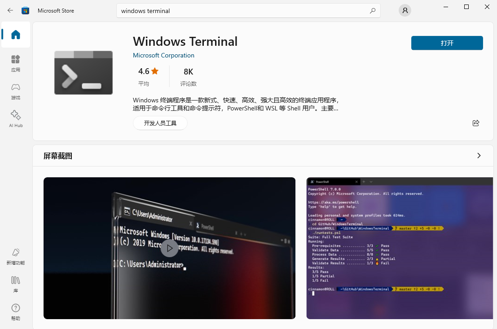
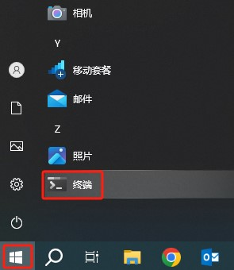
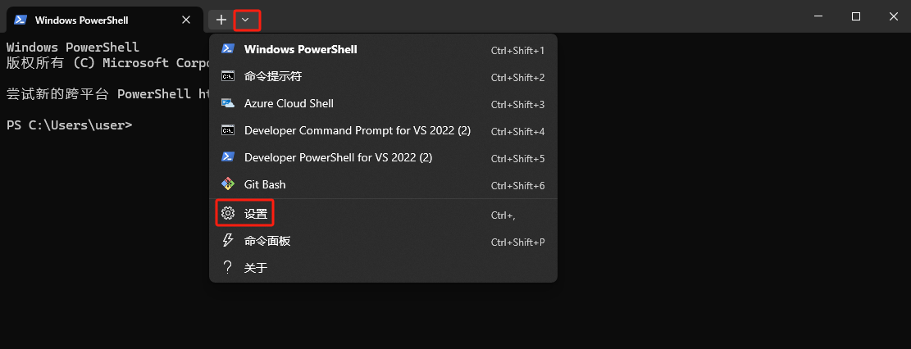
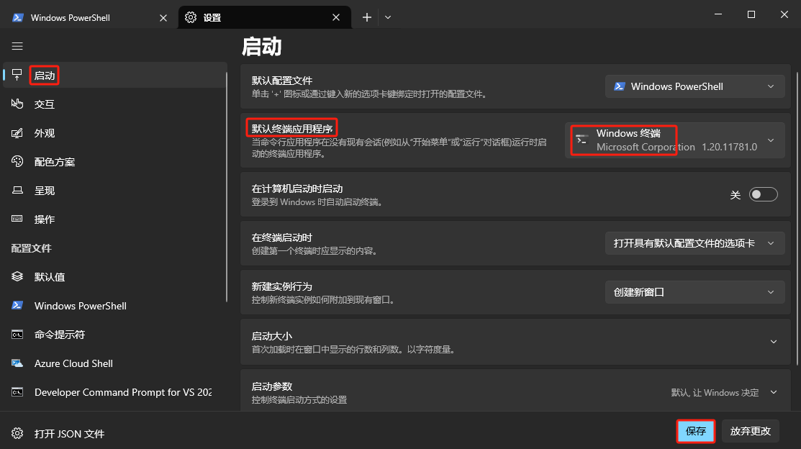

使用 <kbd>Win</kbd> + <kbd>R</kbd> 键打开 *运行* 窗口，输入 `cmd` 打开命令提示符。

## 安装终端

Windows 10 系统中默认的命令提示符（cmd）如下：

在 Microsoft Store 中搜索并安装 *Windows Terminal*。

::: info
Windows 11 系统默认已经安装 *Windows Terminal* 程序。
:::

安装后，在 *运行* 窗口中输入 `cmd` 打开依旧是系统默认的命令提示符。在 *开始* 菜单中找到 *终端* 程序，这个才是刚才安装的 *Windows Terminal* 程序。

点击打开 *终端* 程序。

## 配置默认终端

在 *终端* 程序中，依次点击打开设置页面，也可以使用 <kbd>Ctrl</kbd> + <kbd>,</kbd> 键打开。

将默认终端应用程序设置为 *Windows 终端* 并保存，这样以后在 *运行* 窗口中输入 `cmd` 打开的就是 *Windows 终端* 程序。

