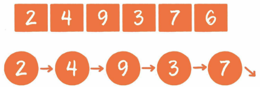
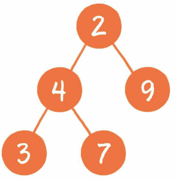
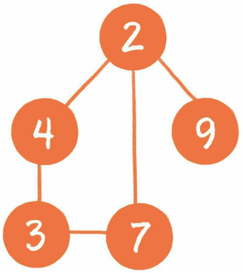

## 什么是算法

算法，对应的英文单词是 `algorithm`，这是一个很古老的概念，最早来自数学领域。

::: info 有一个关于算法的小故事，估计大家都有耳闻
在很久很久以前，曾经有一个顽皮又聪明的 “熊孩子”，天天在课堂上调皮捣蛋。

一次数学课上，老师为了让他们安静下来，给他们列了一道很难的算式，让他们一个小时内算出 `1 + 2 + 3 + …… + 100` 的得数。

老师以为，孩子们会按部就班地一步一步计算，就像下面这样：


> 1 + 2 = 3
>  
> 3 + 3 = 6
>  
> 6 + 4 = 10
>  
> 10 + 5 = 15
>  
> ...

全班只有 “熊孩子” 用了不到 20 分钟给出了答案，因为他想到了用以下方法计算：

> 1 + 100 = 101
>  
> 2 + 99 = 101
>  
> 3 + 98 = 101
>  
> 4 + 97 = 101
>  
> ...

一共有 `50` 个 `101` ，所以 `50 × 101` 就是 1 加到一百的得数。可以这样来计算：

`(1 + 100) × 100 ÷ 2 = 5 050`

这个 “熊孩子” 就是后来著名的犹太数学家 [约翰·卡尔·弗里德里希·高斯](https://baike.baidu.com/item/%E7%BA%A6%E7%BF%B0%C2%B7%E5%8D%A1%E5%B0%94%C2%B7%E5%BC%97%E9%87%8C%E5%BE%B7%E9%87%8C%E5%B8%8C%C2%B7%E9%AB%98%E6%96%AF/9963604)，而他所采用的这种 **等差数列求和** 的方法，被称为 [高斯算法](https://baike.baidu.com/item/%E9%AB%98%E6%96%AF%E7%AE%97%E6%B3%95/4727683)。（上文的故事情节与史实略有出入。）
:::

这是数学领域中算法的一个简单示例。在数学领域里，算法是用于解决某一类问题的公式和思想。

而计算机科学领域的算法，它的本质是一系列程序指令，用于解决特定的运算和逻辑问题。

从宏观上来看，数学领域的算法和计算机领域的算法有很多相通之处。

- 算法有简单的，也有复杂的

    - **简单的算法**。如：给出一组整数，找出其中最大的数
    - **复杂的算法**。如：在多种物品里选择装入背包的物品，使背包里的物品总价值最大；或找出从一个城市到另一个城市的最短路线

- 算法有高效的，也有拙劣的

    如：刚才讲的从 1 加到 100

    - **高效的算法**。高斯利用等差数列的规律，省时省力地求出了最终结果。显然是更加高效的算法
    - **拙劣的算法**。老师心中所想的算法，按部就班地一个数一个数进行累加。虽然这种算法也能得到最终结果，但是其计算过程要低效得多

::: tip 衡量算法好坏的重要标准有两个
- **时间复杂度**
- **空间复杂度**
:::

## 什么是数据结构

数据结构，对应的英文单词是 `data structure`，是数据的组织、管理和存储格式，其使用目的是为了高效地访问和修改数据。

::: tip
数据结构是算法的基石。如果把算法比喻成美丽灵动的舞者，那么数据结构就是舞者脚下广阔而坚实的舞台。
:::

**数据结构的组成方式：**

- **线性结构**

    线性结构是最简单的数据结构，包括数组、链表，以及由它们衍生出来的栈、队列、哈希表。

    

- **树**

    树是相对复杂的数据结构，其中比较有代表性的是二叉树，由它又衍生出了二叉堆之类的数据结构。

    

- **图**

    图是更为复杂的数据结构，因为在图中会呈现出多对多的关联关系。

    

- **其他数据结构**

    还有一些其他的千奇百怪的数据结构。它们由基本数据结构变形而来，用于解决某些特定问题，如跳表、哈希链表、位图等。

有了数据结构这个舞台，算法才可以尽情舞蹈。在解决问题时，不同的算法会选用不同的数据结构。例如：排序算法中的堆排序，利用的就是二叉堆这样一种数据结构；再如缓存淘汰算法 `LRU`（Least Recently Used，最近最少使用），利用的就是特殊数据结构哈希链表。

## 时间复杂度

时间复杂度是执行算法的时间成本。

时间复杂度是对一个算法运行时间长短的量度，用大 `O` 表示，记作 `T(n)=O(f(n))`。

### 基本操作执行次数

::: tip
由于受运行环境和输入规模的影响，代码的绝对执行时间是无法预估的。但却可以预估代码的基本操作执行次数
:::

关于代码的基本操作执行次数，下面用生活中的四个场景来进行说明。

- **场景一**

    给小灰一个长度为 `10cm` 的面包，小灰每 `3` 分钟吃掉 `1cm`，那么吃掉整个面包需要多久？

    答案自然是 `3 × 10` 即 `30` 分钟。
    
    如果面包的长度是 `n cm` 呢？此时吃掉整个面包，需要 `3` 乘以 `n` 即 `3n` 分钟。
    
    如果用一个函数来表达吃掉整个面包所需要的时间，可以记作 **T(n)=3n**，`n` 为面包的长度。

- **场景二**

    给小灰一个长度为 `16cm` 的面包，小灰每 `5` 分钟吃掉面包剩余长度的一半，即第 `5` 分钟吃掉 `8cm`，第 `10` 分钟吃掉 `4cm`，第 `15` 分钟吃掉 `2cm`…… 那么小灰把面包吃得只剩 `1cm`，需要多久呢？

    这个问题用数学方式表达就是，数字 `16` 不断地除以 `2`，那么除几次以后的结果等于 `1`？这里涉及数学中的对数，即以 `2` 为底 `16` 的对数 **log~2~16。**

    因此，把面包吃得只剩下 `1cm`，需要 **5 × log~2~16** 即 `20` 分钟。

    如果面包的长度是 `n cm` 呢？此时，需要 `5` 乘以 **log~2~n** 即 **5log~2~n** 分钟，记作 **T(n)=5log~2~n。**

- **场景三**

    给小灰一个长度为 `10cm` 的面包和一个鸡腿，小灰每 `2` 分钟吃掉 `1` 个鸡腿。那么小灰吃掉整个鸡腿需要多久呢？

    答案自然是 `2` 分钟。因为这里只要求吃掉鸡腿，和 `10cm` 的面包没有关系。

    如果面包的长度是 `n cm` 呢？无论面包多长，吃掉鸡腿的时间都是 `2` 分钟，记作 **T(n)=2。**

- **场景四**：

    给小灰一个长度为 `10cm` 的面包，小灰吃掉第一个 `1cm` 需要 `1` 分钟时间，吃掉第二个 `1cm` 需要 `2` 分钟时间，吃掉第三个 `1cm` 需要 `3` 分钟时间…… 每吃 `1cm` 所花的时间就比吃上一个 `1cm` 多用 `1` 分钟。那么小灰吃掉整个面包需要多久呢？

    答案是从 `1` 累加到 `10` 的总和，也就是 `55` 分钟。

    如果面包的长度是 `n cm` 呢？根据高斯算法，此时吃掉整个面包需要 `1 + 2 + 3 + …… + n` 即 `(1 + n) × n / 2` 分钟，也就是 **0.5n^2^ + 0.5n** 分钟，记作 **T(n)=0.5n^2^ + 0.5n。**

上面所讲的是吃东西所花费的时间，这一思想同样适用于对程序 **基本操作执行次数** 的统计。设 `T(n)` 为程序基本操作执行次数的函数（也可以认为是程序的相对执行时间函数），`n` 为输入规模。

刚才的四个场景分别对应了程序中最常见的四种执行方式。

- **场景一**：**T(n)=3n**

    执行次数是 **线性** 的。

    ```python
    def eat1(n):
        for i in range(n):
            print("等待 1 分钟")
            print("等待 1 分钟")
            print("吃 1cm 面包")
    ```

- **场景二**：**T(n)=5log~2~n**
    
    执行次数是用 **对数** 计算的。

    ```python
    def eat2(n):
        while n > 1:
            print("等待 1 分钟")
            print("等待 1 分钟")
            print("等待 1 分钟")
            print("等待 1 分钟")
            print("吃一半面包")
            n /= 2
    ```

- **场景三**：**T(n)=2**

    执行次数是 **常量。**

    ```python
    def eat3(n):
        print("等待 1 分钟")
        print("吃 1 个鸡腿")
    ```

- **场景四**：**T(n)=0.5n^2^ + 0.5n**

    执行次数是用 **多项式** 计算的。

    ```python
    def eat4(n):
        for i in range(n):
            for j in range(i):
                print("等待 1 分钟")
            
            print("吃 1cm 面包")
    ```

### 渐进时间复杂度

若存在函数 `f(n)`，使得当 `n` 趋近于无穷大时，`T(n)/f(n)` 的极限值为不等于零的常数，则称 `f(n)` 是 `T(n)` 的同数量级函数。记作 `T(n)=O(f(n))`，称为 `O(f(n))`，`O` 为算法的 **渐进时间复杂度**，简称为 **时间复杂度。**

因为渐进时间复杂度用大写 `O` 来表示，所以也被称为 **大 O 表示法。**

::: tip
时间复杂度就是把程序的相对执行时间函数 `T(n)` 简化为一个数量级，这个数量级可以是 **n**、**n^2^**、**n^3^** 等
:::

**推导出时间复杂度有如下几个原则：**

- 如果运行时间是常数量级，则用常数 `1` 表示
- 只保留时间函数中的最高阶项
- 如果最高阶项存在，则省去最高阶项前面的系数

刚才的四个场景对应的时间复杂度。

- **场景一**：**T(n)=3n**

    最高阶项为 `3n`，省去系数 `3`，则转化的时间复杂度为：**T(n)=O(n)。**

    .jpg)

- **场景二**：**T(n)=5log~2~n**

    最高阶项为 **5log~2~n**，省去系数 `5`，则转化的时间复杂度为：**T(n)=O(log~2~n)。**

    .jpg)

- **场景三**：**T(n)=2**

    只有常数量级，则转化的时间复杂度为：**T(n)=O(1)。**

    .jpg)

- **场景四**：**T(n)=0.5n^2^ + 0.5n**

    最高阶项为 **0.5n^2^**，省去系数 `0.5`，则转化的时间复杂度为：**T(n)=O(n^2^)。**

    .jpg)

这四种时间复杂度对程度执行用时时间由低到高为：

**O(1)** < **O(log~2~n)** < **O(n)** < **O(n^2^)**

::: info
在编程的世界中有各种各样的算法，除了上述四个场景，还有许多不同形式的时间复杂度，例如：**O(nlog~2~n)**、**O(n^3^)**、**O(mn)**、**O(2^n^)**、**O(n!)**
:::

### 时间复杂度的巨大差异

算法A 的执行次数是 **T(n)=100n**，时间复杂度是 **O(n)。**

算法B 的执行次数是 **T(n)=5n^2^**，时间复杂度是 **O(n^2^)。**

算法A 运行在小灰家里的老旧电脑上，算法B 运行在某台超级计算机上，超级计算机的运行速度是老旧电脑的 100 倍。

那么，随着输入规模 `n` 的增长，两种算法谁运行速度更快呢？

|  n（规模）  |  T(n) = 100n x 100  |  T(n) = 5n^2^  |
|  :----:  |  :----:  |  :----:  |
|  n = 1  |  10 000  |  5  |
|  n = 5  |  50 000  |  125  |
|  n = 10  |  100 000  |  500  |
|  n = 100  |  1 000 000  |  50 000  |
|  n = 1 000  |  10 000 000  |  5 000 000  |
|  n = 10 000  |  100 000 000  |  500 000 000  |
|  n = 100 000  |  1 000 000 000  |  50 000 000 000  |
|  n = 1 000 000  |  10 000 000 000  |  5 000 000 000 000  |

从上面的表格可以看出，当 `n` 的值很小时，算法A 的运行用时要远大于算法B；当 `n` 的值在 `1 000` 左右时，算法A 和算法B 的运行时间已经比较接近；随着 `n` 的值越来越大，甚至达到十万、百万时，算法A 的优势开始显现出来，算法B 的运行速度则越来越慢，差距越来越明显。这就是不同时间复杂度带来的差距。

## 空间复杂度

空间复杂度是执行算法的空间成本。

和时间复杂度类似，空间复杂度是对一个算法在运行过程中临时占用存储空间大小的量度，它同样使用了 **大 O 表示法。**

程序占用空间大小的计算公式记作 `S(n)=O(f(n))`，其中 `n` 为问题的规模，`f(n)` 为算法所占存储空间的函数。

### 空间复杂度的计算

常见的空间复杂度有下面几种情形：

- **常量空间**

    当算法的存储空间大小固定，和输入规模没有直接的关系时，空间复杂度记作 **O(1)**。例如：

    ```python
    def fun1(n):
        i = 3
        # do something
    ```

- **线性空间**

    当算法分配的空间是一个线性的集合（如：数组），并且集合大小和输入规模 `n` 成正比时，空间复杂度记作 **O(n)**。例如：

    ```python
    def fun2(n):
        my_arrary = [[0] * n]
        # do something
    ```

- **二维空间**

    当算法分配的空间是一个二维数组集合，并且集合的长度和宽度都与输入规模 `n` 成正比时，空间复杂度记作 **O(n^2^)**。例如：

    ```python
    def fun3(n):
        matrix = [[0] * n] * n
        # do something
    ```

- **递归空间**

    递归是一个比较特殊的场景。虽然递归代码中并没有显式地声明变量或集合，但是计算机在执行程序时，会专门分配一块内存，用来存储 **方法调用栈。**

    方法调用栈包括 **进栈** 和 **出栈** 两个行为。

    当进入一个新方法时，执行进栈操作，把调用的方法和参数信息压入栈中；当方法返回时，执行出栈操作，把调用的方法和参数信息从栈中弹出。例如：

    ```python
    def fun4(n):
        if n > 0:
            fun4(n - 1)
        # do something
    ```

    执行递归操作所需要的内存空间和递归的深度成正比。纯粹的递归操作的空间复杂度也是线性的，如果递归的深度是 `n`，那么空间复杂度就是 **O(n)。**

常见的空间复杂度按照从低到高的顺序为：

**O(1)** < **O(n)** < **O(n2)** 等。

其中递归算法的空间复杂度和递归深度成正比。

### 时间与空间的取舍

在绝大多数时候，时间复杂度更为重要一些，宁可多分配一些内存空间，也要提升程序的执行速度。
